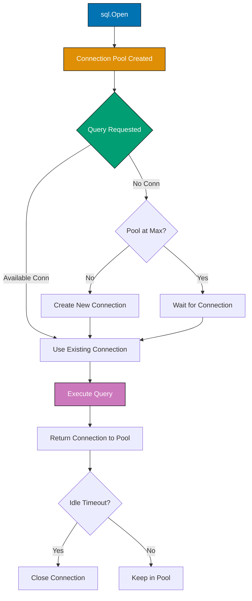

## Problem

Database integration in Go requires careful connection management, transaction handling, and proper error handling. The standard library is low-level, leading to repetitive boilerplate code.

```go
// Problematic approach - connection leak
db, _ := sql.Open("postgres", connStr)
rows, _ := db.Query("SELECT * FROM users")
// Connection never closed, no error handling
```

This guide shows practical techniques for robust database integration in Go applications.

## Solution

### 1. Database Connection Setup

Use database/sql with proper connection pooling.

**Basic connection**:

```go
package main

import (
    "database/sql"
    "fmt"
    "log"
    "time"

    _ "github.com/lib/pq"  // PostgreSQL driver
)

type User struct {
    ID       int
    Username string
    Email    string
}

func setupDatabase() (*sql.DB, error) {
    connStr := "host=localhost port=5432 user=myuser password=mypass dbname=mydb sslmode=disable"

    db, err := sql.Open("postgres", connStr)
    if err != nil {
        return nil, fmt.Errorf("failed to open database: %w", err)
    }

    // Configure connection pool
    db.SetMaxOpenConns(25)                 // Maximum open connections
    db.SetMaxIdleConns(5)                  // Maximum idle connections
    db.SetConnMaxLifetime(5 * time.Minute) // Connection lifetime
    db.SetConnMaxIdleTime(10 * time.Minute) // Idle connection timeout

    // Verify connection
    if err := db.Ping(); err != nil {
        return nil, fmt.Errorf("failed to ping database: %w", err)
    }

    return db, nil
}

// Query single row
func getUserByID(db *sql.DB, id int) (*User, error) {
    query := "SELECT id, username, email FROM users WHERE id = $1"

    var user User
    err := db.QueryRow(query, id).Scan(&user.ID, &user.Username, &user.Email)
    if err == sql.ErrNoRows {
        return nil, fmt.Errorf("user not found: %d", id)
    }
    if err != nil {
        return nil, fmt.Errorf("query failed: %w", err)
    }

    return &user, nil
}

// Query multiple rows
func getAllUsers(db *sql.DB) ([]User, error) {
    query := "SELECT id, username, email FROM users"

    rows, err := db.Query(query)
    if err != nil {
        return nil, fmt.Errorf("query failed: %w", err)
    }
    defer rows.Close()

    var users []User
    for rows.Next() {
        var user User
        if err := rows.Scan(&user.ID, &user.Username, &user.Email); err != nil {
            return nil, fmt.Errorf("scan failed: %w", err)
        }
        users = append(users, user)
    }

    if err := rows.Err(); err != nil {
        return nil, fmt.Errorf("rows error: %w", err)
    }

    return users, nil
}

// Insert
func createUser(db *sql.DB, username, email string) (int, error) {
    query := "INSERT INTO users (username, email) VALUES ($1, $2) RETURNING id"

    var id int
    err := db.QueryRow(query, username, email).Scan(&id)
    if err != nil {
        return 0, fmt.Errorf("insert failed: %w", err)
    }

    return id, nil
}
```

### 2. Transaction Handling

Manage transactions for data consistency.

**Transaction basics**:

```go
func transferFunds(db *sql.DB, fromID, toID int, amount float64) error {
    // Begin transaction
    tx, err := db.Begin()
    if err != nil {
        return fmt.Errorf("begin transaction: %w", err)
    }
    defer tx.Rollback()  // Rollback if not committed

    // Debit from source account
    debitQuery := "UPDATE accounts SET balance = balance - $1 WHERE id = $2 AND balance >= $1"
    result, err := tx.Exec(debitQuery, amount, fromID)
    if err != nil {
        return fmt.Errorf("debit failed: %w", err)
    }

    rowsAffected, _ := result.RowsAffected()
    if rowsAffected == 0 {
        return fmt.Errorf("insufficient funds or account not found")
    }

    // Credit to destination account
    creditQuery := "UPDATE accounts SET balance = balance + $1 WHERE id = $2"
    _, err = tx.Exec(creditQuery, amount, toID)
    if err != nil {
        return fmt.Errorf("credit failed: %w", err)
    }

    // Commit transaction
    if err := tx.Commit(); err != nil {
        return fmt.Errorf("commit failed: %w", err)
    }

    return nil
}

// Transaction with context
func transferFundsWithContext(ctx context.Context, db *sql.DB, fromID, toID int, amount float64) error {
    tx, err := db.BeginTx(ctx, &sql.TxOptions{
        Isolation: sql.LevelReadCommitted,
    })
    if err != nil {
        return err
    }
    defer tx.Rollback()

    // Operations with context
    _, err = tx.ExecContext(ctx, "UPDATE accounts SET balance = balance - $1 WHERE id = $2", amount, fromID)
    if err != nil {
        return err
    }

    _, err = tx.ExecContext(ctx, "UPDATE accounts SET balance = balance + $1 WHERE id = $2", amount, toID)
    if err != nil {
        return err
    }

    return tx.Commit()
}
```

### 3. Using sqlx for Simplicity

sqlx extends database/sql with struct scanning.

**sqlx basics**:

```go
import "github.com/jmoiron/sqlx"

func setupSqlx() (*sqlx.DB, error) {
    db, err := sqlx.Connect("postgres", connStr)
    if err != nil {
        return nil, err
    }

    db.SetMaxOpenConns(25)
    db.SetMaxIdleConns(5)

    return db, nil
}

type User struct {
    ID       int    `db:"id"`
    Username string `db:"username"`
    Email    string `db:"email"`
}

// Get single row
func getUserSqlx(db *sqlx.DB, id int) (*User, error) {
    var user User
    err := db.Get(&user, "SELECT id, username, email FROM users WHERE id = $1", id)
    if err != nil {
        return nil, err
    }
    return &user, nil
}

// Get multiple rows
func getAllUsersSqlx(db *sqlx.DB) ([]User, error) {
    var users []User
    err := db.Select(&users, "SELECT id, username, email FROM users")
    if err != nil {
        return nil, err
    }
    return users, nil
}

// Named queries
func getUserByEmailSqlx(db *sqlx.DB, email string) (*User, error) {
    var user User
    query := "SELECT * FROM users WHERE email = :email"
    rows, err := db.NamedQuery(query, map[string]interface{}{"email": email})
    if err != nil {
        return nil, err
    }
    defer rows.Close()

    if rows.Next() {
        if err := rows.StructScan(&user); err != nil {
            return nil, err
        }
    }

    return &user, nil
}
```

### 4. Prepared Statements

Improve performance with prepared statements.

**Prepared statements**:

```go
func batchInsert(db *sql.DB, users []User) error {
    stmt, err := db.Prepare("INSERT INTO users (username, email) VALUES ($1, $2)")
    if err != nil {
        return err
    }
    defer stmt.Close()

    for _, user := range users {
        _, err := stmt.Exec(user.Username, user.Email)
        if err != nil {
            return err
        }
    }

    return nil
}

// Prepared statement with transaction
func batchInsertTx(db *sql.DB, users []User) error {
    tx, err := db.Begin()
    if err != nil {
        return err
    }
    defer tx.Rollback()

    stmt, err := tx.Prepare("INSERT INTO users (username, email) VALUES ($1, $2)")
    if err != nil {
        return err
    }
    defer stmt.Close()

    for _, user := range users {
        _, err := stmt.Exec(user.Username, user.Email)
        if err != nil {
            return err
        }
    }

    return tx.Commit()
}
```

## How It Works

### Database Connection Lifecycle



**Key concepts**:

1. **Connection Pool**: Reusable database connections managed by database/sql
2. **Prepared Statements**: Pre-compiled SQL for performance and SQL injection prevention
3. **Transactions**: ACID guarantees for data consistency
4. **Context**: Timeout and cancellation support for queries

## Variations

### Connection Health Checks

```go
func healthCheck(db *sql.DB) error {
    ctx, cancel := context.WithTimeout(context.Background(), 2*time.Second)
    defer cancel()

    if err := db.PingContext(ctx); err != nil {
        return fmt.Errorf("database unhealthy: %w", err)
    }

    return nil
}
```

### Batch Operations

```go
func batchInsertEfficient(db *sql.DB, users []User) error {
    valueStrings := []string{}
    valueArgs := []interface{}{}

    for i, user := range users {
        valueStrings = append(valueStrings, fmt.Sprintf("($%d, $%d)", i*2+1, i*2+2))
        valueArgs = append(valueArgs, user.Username, user.Email)
    }

    query := fmt.Sprintf("INSERT INTO users (username, email) VALUES %s",
        strings.Join(valueStrings, ","))

    _, err := db.Exec(query, valueArgs...)
    return err
}
```

### NULL Handling

```go
import "database/sql"

type User struct {
    ID       int
    Username string
    Email    sql.NullString  // Handles NULL values
    Age      sql.NullInt64
}

func getUserWithNulls(db *sql.DB, id int) (*User, error) {
    var user User
    err := db.QueryRow(
        "SELECT id, username, email, age FROM users WHERE id = $1", id,
    ).Scan(&user.ID, &user.Username, &user.Email, &user.Age)

    if err != nil {
        return nil, err
    }

    return &user, nil
}
```

## Common Pitfalls

**Pitfall 1: Not Closing Rows**

Always close result sets:

```go
// Bad
rows, _ := db.Query("SELECT * FROM users")
// Forgot to close - connection leak

// Good
rows, err := db.Query("SELECT * FROM users")
if err != nil {
    return err
}
defer rows.Close()
```

**Pitfall 2: SQL Injection**

Use parameters, not string concatenation:

```go
// Bad - SQL injection
username := userInput
query := "SELECT * FROM users WHERE username = '" + username + "'"

// Good - parameterized
query := "SELECT * FROM users WHERE username = $1"
db.Query(query, username)
```

**Pitfall 3: Ignoring Errors**

Check all errors:

```go
// Bad
result, _ := db.Exec(query)
rows, _ := result.RowsAffected()

// Good
result, err := db.Exec(query)
if err != nil {
    return err
}
rows, err := result.RowsAffected()
if err != nil {
    return err
}
if rows == 0 {
    return errors.New("no rows affected")
}
```

**Pitfall 4: Not Using Transactions**

Use transactions for related operations:

```go
// Bad - no atomicity
db.Exec("UPDATE accounts SET balance = balance - 100 WHERE id = 1")
db.Exec("UPDATE accounts SET balance = balance + 100 WHERE id = 2")
// Second update may fail, leaving inconsistent state

// Good - atomic
tx, _ := db.Begin()
tx.Exec("UPDATE accounts SET balance = balance - 100 WHERE id = 1")
tx.Exec("UPDATE accounts SET balance = balance + 100 WHERE id = 2")
tx.Commit()
```

## Related Patterns

**Related Tutorial**: See [Intermediate Tutorial - Database](/en/learn/software-engineering/programming-language/golang/tutorials/intermediate#database) for database fundamentals and [Beginner Tutorial - SQL Basics](/en/learn/software-engineering/programming-language/golang/tutorials/beginner#sql) for SQL introduction.

**Related How-To**: See [Handle Errors Gracefully](/en/learn/software-engineering/programming-language/golang/how-to/handle-errors-gracefully) for database error handling and [Use Context Effectively](/en/learn/software-engineering/programming-language/golang/how-to/use-context-effectively) for context with queries.

**Related Cookbook**: See Cookbook recipes "Database Connection Pool", "Transaction Patterns", and "SQL Query Optimization" for copy-paste ready database code.

**Related Explanation**: See [Best Practices - Database](/en/learn/software-engineering/programming-language/golang/explanation/best-practices#database) for database design principles.

## Further Reading

- [database/sql Tutorial](https://go.dev/doc/database/index) - Official database/sql guide
- [sqlx Documentation](http://jmoiron.github.io/sqlx/) - sqlx library guide
- [Go Database Best Practices](https://www.alexedwards.net/blog/practical-persistence-sql) - Alex Edwards' guide
- [Connection Pooling](https://go.dev/doc/database/manage-connections) - Pool management guide
