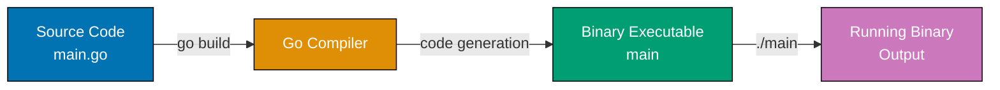
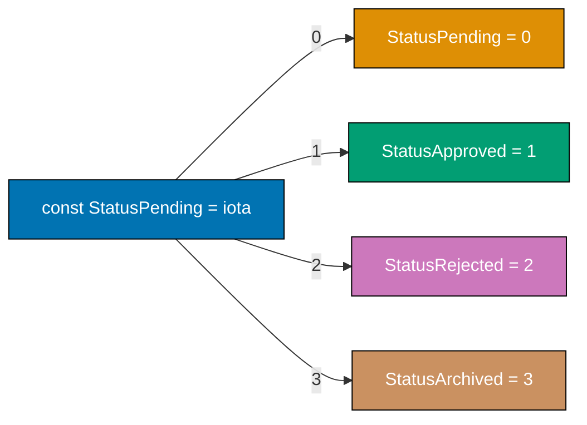
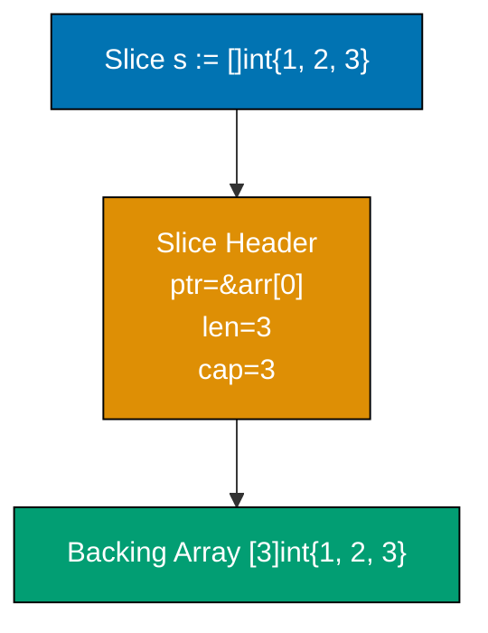
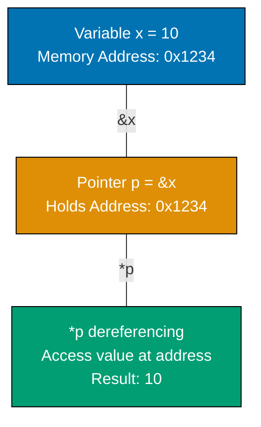
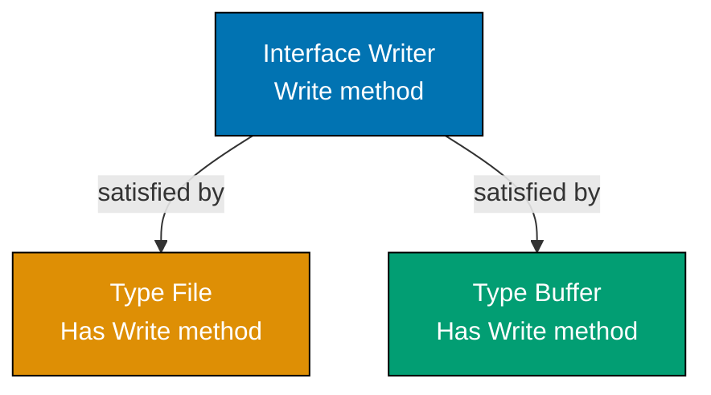
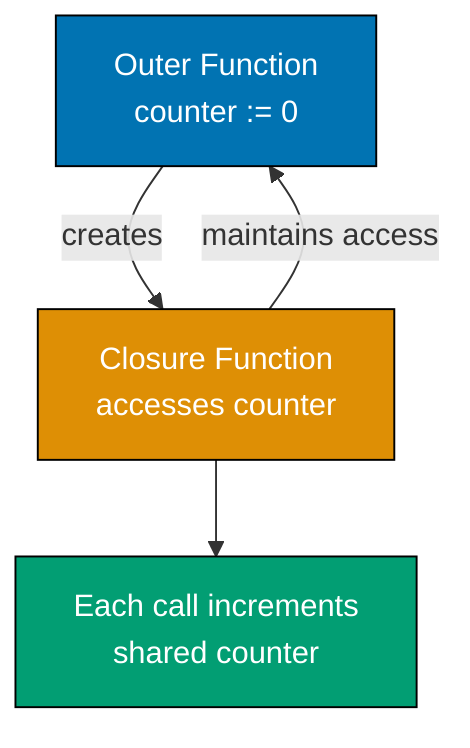
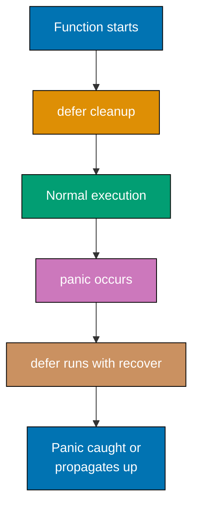
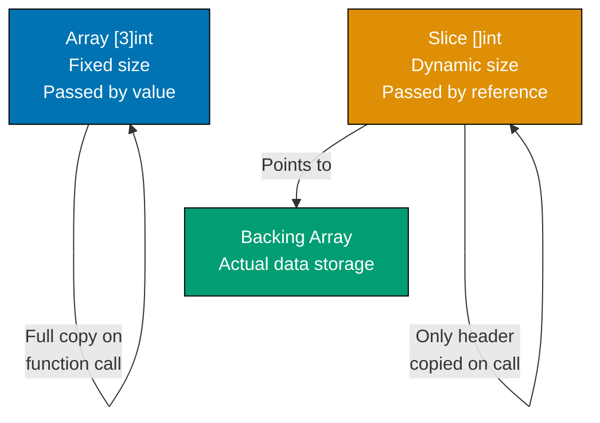

## Group 1: First Steps

### Example 1: Hello World and Go Compilation

Go is a compiled language - you write source code, compile it into a binary executable, then run that binary. Understanding this pipeline reveals why Go is fast and portable.



**Code**:

```go
package main // => Declares this is the main executable package

import (
    "fmt" // => Import formatting package from standard library
)

func main() { // => Entry point - every executable needs main() in main package
    fmt.Println("Hello, World!") // => Println writes to stdout and adds newline, returns (n int, err error)
    // => Output: Hello, World!
}
```

**Key Takeaway**: Every executable Go program needs `package main` and a `func main()` entry point. The `import` statement brings standard library packages into scope.

### Example 2: Variables and Types

Go is statically typed but uses type inference - the compiler deduces types from initial values. Two ways to declare variables: explicit type with `var`, or short declaration with `:=` that infers the type.

**Code**:

```go
package main

import "fmt"

func main() {
    // Short declaration with type inference
    x := 10                     // => int (inferred from value 10)
    y := 3.14                   // => float64 (inferred from decimal literal)
    name := "Go"                // => string (inferred from quoted value)
    isActive := true            // => bool (inferred from boolean literal)

    fmt.Println(x, y, name, isActive)
    // => Output: 10 3.14 Go true

    // Explicit type declaration
    var count int = 5           // => Explicitly typed as int
    var message string          // => Declared but uninitialized - zero value ""
    var percentage float64      // => Declared but uninitialized - zero value 0.0

    fmt.Println(count, message, percentage)
    // => Output: 5  0

    // Type conversion requires explicit cast
    floatValue := 9.8
    intValue := int(floatValue) // => Convert 9.8 to int by truncating decimals => 9
    fmt.Println(intValue)
    // => Output: 9
}
```

**Key Takeaway**: Use `:=` for short declarations with type inference in function bodies. Go's zero values (0 for numbers, "" for strings, false for bool) initialize variables automatically when declared without values.

**Why This Matters**: Go's static typing prevents entire classes of runtime errors that plague dynamically typed languages. The compiler catches type mismatches before deployment. Zero values are a game-changer for API design—uninitialized fields have predictable, safe defaults (empty strings, zero numbers), so you never encounter `nil` errors from forgetting initialization. This design choice makes Go code more reliable and easier to reason about than languages requiring explicit null checks everywhere.

### Example 3: Constants and iota

Constants are immutable values determined at compile-time. The `iota` enumerator automatically assigns incrementing values, useful for creating enumeration patterns without manually numbering each value.



**Code**:

```go
package main

import "fmt"

func main() {
    // iota starts at 0 and increments for each constant in the block
    const (
        StatusPending    = iota // => 0 (iota resets and starts at 0 for this block)
        StatusApproved         // => 1 (iota auto-increments, no need to write = iota again)
        StatusRejected         // => 2
        StatusArchived         // => 3
    )

    fmt.Println(StatusPending, StatusApproved, StatusRejected, StatusArchived)
    // => Output: 0 1 2 3

    // Constants must be determined at compile-time
    const Pi = 3.14159         // => Typed constant
    const Message = "Go is simple" // => Untyped constant - works anywhere a string fits

    // This would cause compilation error - can't assign variable to const
    // const x = someFunction() // => ERROR: someFunction() result unknown at compile-time

    var x = 5                   // => Variables CAN be assigned function results
    fmt.Println(x)
    // => Output: 5
}
```

**Key Takeaway**: Use `const` for values that must be known at compile-time. `iota` eliminates manual numbering in enumeration-like patterns, automatically incrementing within a `const` block.

## Group 2: Core Data Structures

### Example 4: Arrays and Slices

Arrays have fixed size declared upfront. Slices are dynamic collections backed by arrays - they're flexible and commonly used. Understanding the underlying array backing reveals why slices are so efficient.



**Code**:

```go
package main

import "fmt"

func main() {
    // Array - fixed size, size is part of type
    arr := [3]int{10, 20, 30}  // => Array of exactly 3 integers
    fmt.Println(arr, len(arr)) // => [10 20 30] 3
    arr[0] = 100               // => Can modify elements
    fmt.Println(arr)
    // => Output: [100 20 30]

    // Slice - dynamic size, backed by array
    slice := []int{1, 2, 3}    // => No size specified - this is a slice, not array
    fmt.Println(len(slice), cap(slice)) // => len=3 (elements) cap=3 (backing array capacity)
    // => Output: 3 3

    // Append - creates new backing array if needed
    slice = append(slice, 4)   // => Add element - if capacity sufficient, uses existing array
    fmt.Println(slice, len(slice), cap(slice))
    // => Output: [1 2 3 4] 4 5 (capacity typically doubles)

    // Slice from array or slice
    subslice := slice[1:3]     // => Elements at indices 1 and 2 (3 is exclusive)
    fmt.Println(subslice)      // => [2 3]
    fmt.Println(cap(subslice)) // => 4 (capacity includes remaining elements in backing array)

    // Copy creates independent slice
    copied := make([]int, len(slice)) // => Allocate slice of same length
    copy(copied, slice)        // => Copy values - modifications to copied don't affect slice
    copied[0] = 999
    fmt.Println(slice, copied)
    // => Output: [1 2 3 4] [999 2 3 4]
}
```

**Key Takeaway**: Arrays are fixed-size and rarely used directly. Slices are the Go way - dynamic collections with `len()` (current elements) and `cap()` (backing array space). `append()` returns a new slice to handle capacity growth.

**Why This Matters**: Slices are Go's killer feature—they combine safety, flexibility, and performance. Understanding backing arrays explains why slices are passed by value efficiently (only 24 bytes of metadata, not the entire data). Capacity growth matters for performance: when you know approximately how many elements you need, pre-allocate with `make([]T, 0, capacity)` to avoid expensive reallocations. This knowledge separates inefficient Go code (repeated allocations) from production-grade code that minimizes GC pressure. Sharing slices via views with reslicing is powerful but requires care—unintended aliasing can cause subtle bugs.

### Example 5: Maps

Maps are unordered key-value collections. Unlike slices which maintain order, map iteration order is randomized - never rely on iteration order. The comma-ok idiom tests whether a key exists and its value.

**Code**:

```go
package main

import "fmt"

func main() {
    // Create map - keys are strings, values are integers
    ages := make(map[string]int) // => Empty map created with make()
    ages["Alice"] = 30           // => Insert key-value pair
    ages["Bob"] = 25
    ages["Charlie"] = 35

    fmt.Println(ages["Alice"])   // => 30
    fmt.Println(ages["Unknown"]) // => 0 (zero value for int, key doesn't exist)

    // Comma-ok idiom - check if key exists
    age, exists := ages["Bob"]   // => exists is true, age is 25
    fmt.Println(age, exists)     // => 25 true

    age, exists = ages["David"]  // => exists is false, age is 0
    fmt.Println(age, exists)     // => 0 false

    // Delete key
    delete(ages, "Bob")          // => Remove Bob from map
    fmt.Println(ages)            // => map[Alice:30 Charlie:35] (order may vary)

    // Map iteration order is randomized
    for name, age := range ages {
        fmt.Printf("%s is %d\n", name, age) // => Output order varies each run
    }

    // Iterate over keys only
    for name := range ages {
        fmt.Println(name) // => Iterate without values
    }
}
```

**Key Takeaway**: Maps store key-value pairs with O(1) lookup. Always use the comma-ok idiom (`value, exists := map[key]`) to safely check key existence. Never rely on map iteration order - it's deliberately randomized.

### Example 6: Structs

Structs group related data into named fields. Methods can operate on structs by specifying a receiver. The distinction between value and pointer receivers becomes important later - for now, understand the receiver is what `this` or `self` would be in other languages.

**Code**:

```go
package main

import "fmt"

func main() {
    // Define struct type and create instance
    type Person struct {
        Name string // => Exported field (capital letter) - accessible from other packages
        Age  int
        City string
    }

    // Create struct using field order
    p1 := Person{"Alice", 30, "New York"}
    fmt.Println(p1)
    // => Output: {Alice 30 New York}

    // Create struct using named fields (better readability)
    p2 := Person{Name: "Bob", Age: 25, City: "Boston"}
    fmt.Println(p2.Name, p2.Age)
    // => Output: Bob 25

    // Uninitialized struct gets zero values
    var p3 Person // => All fields get zero values
    fmt.Println(p3)
    // => Output: { 0 }

    // Anonymous struct - used for one-off data
    response := struct {
        Status int
        Body   string
    }{200, "OK"}
    fmt.Println(response.Status)
    // => Output: 200
}
```

**Key Takeaway**: Structs are Go's primary way to group related data. Use named fields when creating structs for readability. Capital letters in field names mean the field is exported and accessible from other packages.

**Why This Matters**: Value vs pointer semantics is crucial in Go and separates beginners from professionals. Passing structs by value (no pointer) creates copies—safe but expensive for large structs. Passing pointers is efficient but requires discipline to avoid shared state bugs. Methods define the receiver type: value receiver (safe, isolated) vs pointer receiver (can modify). In production Go, you constantly make this choice. Understanding field capitalization (export control without explicit `public`/`private` keywords) is the Go way of managing visibility elegantly.

## Group 3: Functions and Control Flow

### Example 7: Functions

Functions are central to Go. Unlike many languages, multiple return values are standard - this idiom appears everywhere, especially for error handling. Named return values can be used to document what a function returns.

**Code**:

```go
package main

import "fmt"

func main() {
    // Function with single return
    result := add(3, 5)         // => Function call
    fmt.Println(result)         // => 8

    // Function with multiple returns
    quotient, remainder := divide(17, 5) // => Go functions commonly return multiple values
    fmt.Println(quotient, remainder)     // => 3 2

    // Named return values
    name, greeting := greet("Go") // => Named returns document what's returned
    fmt.Println(name, greeting)   // => Go Hello, Go!
}

// Single parameter and return
func add(a int, b int) int {    // => Parameters explicitly typed
    return a + b                // => Single return value
}

// Multiple parameters and returns
func divide(dividend int, divisor int) (int, int) { // => Return types in parentheses
    return dividend / divisor, dividend % divisor   // => Multiple return values
}

// Named return values - improves documentation
func greet(lang string) (language string, message string) {
    language = lang                              // => Assignment to named return values
    message = fmt.Sprintf("Hello, %s!", lang)   // => Create formatted string
    return                                       // => Return (no values needed - uses named returns)
}
```

**Key Takeaway**: Functions with multiple return values are idiomatic Go - you'll use this constantly. Named return values improve clarity by documenting what a function returns. Unnamed parameters with the same type can use shorthand: `func add(a, b int)`.

### Example 8: Control Flow

Go has only one loop construct (`for`) that handles all looping patterns. `if` and `switch` are straightforward but more powerful than in many languages. The `defer` statement schedules cleanup code to run when the function returns.

**Code**:

```go
package main

import "fmt"

func main() {
    // if-else
    age := 25
    if age >= 18 {              // => No parentheses required (or allowed)
        fmt.Println("Adult")    // =>
    } else {
        fmt.Println("Minor")
    }
    // => Output: Adult

    // for loop - basic
    for i := 0; i < 3; i++ {    // => Traditional for loop
        fmt.Println(i)
    }
    // => Output: 0 1 2

    // for loop - while style
    count := 0
    for count < 3 {             // => No while keyword - use for with just condition
        fmt.Println(count)
        count++
    }
    // => Output: 0 1 2

    // for loop - infinite
    counter := 0
    for {                       // => Infinite loop
        if counter >= 2 {
            break              // => Exit loop
        }
        counter++
    }

    // switch statement
    language := "Go"
    switch language {           // => Pattern matching
    case "Python":
        fmt.Println("Batteries included")
    case "Go":
        fmt.Println("Simple and fast")
    case "Rust":
        fmt.Println("Memory safe")
    default:
        fmt.Println("Unknown language")
    }
    // => Output: Simple and fast

    // defer - schedules cleanup
    fmt.Println("Start")
    defer fmt.Println("Deferred 1") // => Will run after other code
    defer fmt.Println("Deferred 2") // => Deferred statements run in LIFO order
    fmt.Println("End")
    // => Output: Start End Deferred 2 Deferred 1
}
```

**Key Takeaway**: Go's `for` loop is versatile - use it for all looping needs. `defer` schedules code to run when a function returns, useful for cleanup. Multiple `defer` statements run in reverse order (LIFO).

### Example 9: Pointers

Pointers hold memory addresses. The `&` operator takes an address, `*` dereferences it. Understanding pointers is essential for understanding Go's pass-by-value semantics and when values are copied versus when they're shared.



**Code**:

```go
package main

import "fmt"

func main() {
    x := 10                 // => Variable x stores value 10

    p := &x                 // => & operator gets address of x
    fmt.Println(p)          // => 0xc0000a0008 (actual address varies)
    fmt.Println(*p)         // => 10 (* dereferences - read value at address)

    *p = 20                 // => Dereference to modify value at address
    fmt.Println(x)          // => 20 (x was modified through pointer)

    // Pointers enable modification in functions
    modifyValue(&x)         // => Pass address, not value
    fmt.Println(x)          // => 30

    // nil pointer - points to nothing
    var nilPtr *int         // => Uninitialized pointer has nil value
    fmt.Println(nilPtr)     // => <nil>
    // Dereferencing nil causes panic - always check!
}

func modifyValue(ptr *int) { // => Receives pointer to int
    *ptr = 30              // => Modify value at pointer's address
}
```

**Key Takeaway**: Pointers hold addresses. `&` gets an address, `*` dereferences it to access the value. Pointers enable functions to modify variables. Nil pointers require careful handling - dereferencing nil causes runtime panic.

**Why This Matters**: Pointers are central to understanding Go's pass-by-value semantics. Every function call copies its arguments—understanding this reveals why large structs should be passed as pointers (avoid expensive copies) and why small values can be passed by value (safe, isolated changes). Nil pointers are Go's version of null references, but they're explicit and cause panics rather than silent failures. Production Go code constantly navigates this: when to share state via pointers, when to isolate via values, and defensive nil checking before dereferencing.

## Group 4: Methods and Interfaces

### Example 10: Methods

Methods are functions attached to a type via a receiver. Go distinguishes value receivers (copy data) from pointer receivers (share data). This distinction is crucial - choosing the wrong receiver type causes subtle bugs or inefficiency.

**Code**:

```go
package main

import "fmt"

func main() {
    p := Person{Name: "Alice", Age: 30}

    // Call method with value receiver
    p.PrintInfo()                // => Calls PrintInfo on copy of p
    // => Output: Name: Alice, Age: 30

    // Call method with pointer receiver
    p.HaveBirthday()             // => Passes address of p - modifies original
    fmt.Println(p.Age)           // => 31 (changed!)

    // Pointer methods called on values (Go automatically takes address)
    p.HaveBirthday()             // => Go converts to &p automatically
    fmt.Println(p.Age)           // => 32
}

type Person struct {
    Name string
    Age  int
}

// Value receiver - receiver gets copy of data
func (p Person) PrintInfo() {   // => (p Person) is the receiver
    fmt.Printf("Name: %s, Age: %d\n", p.Name, p.Age)
}

// Pointer receiver - receiver shares original data
func (p *Person) HaveBirthday() { // => (*Person) pointer receiver - can modify
    p.Age++                      // => Modifies the original Person
}
```

**Key Takeaway**: Value receivers copy data - modifications don't affect the original. Pointer receivers share data - modifications affect the original. Use pointer receivers when the method modifies the receiver or when the receiver is large (to avoid copying).

### Example 11: Interfaces

Interfaces define method contracts. A type satisfies an interface implicitly - no explicit declaration needed. This duck typing is powerful but requires understanding: if a type has all methods an interface requires, it automatically satisfies that interface.



**Code**:

```go
package main

import "fmt"

func main() {
    // Without interfaces - hardcoded types
    file := &File{Name: "data.txt"}
    saveData(file, "content")

    // With interfaces - work with any Writer
    var buffer Buffer
    saveData(&buffer, "content") // => Same function works with Buffer!

    // Empty interface - accepts anything
    var anything interface{} = 42
    printValue(anything)

    anything = "string"
    printValue(anything)

    // Using an interface as a type
    var w Writer // => Variable of interface type
    w = &File{Name: "test.txt"}
    fmt.Println(w)           // => &{test.txt}

    w = &Buffer{}
    fmt.Println(w)           // => &[]
}

// Interface definition - specifies what methods are required
type Writer interface {
    Write(data string) error  // => Method signature
}

// File type implements Write method - satisfies Writer implicitly
type File struct {
    Name string
}

func (f *File) Write(data string) error { // => Implements Writer interface
    fmt.Printf("Writing to %s: %s\n", f.Name, data)
    return nil
}

// Buffer type also implements Write - also satisfies Writer
type Buffer struct {
    data []string
}

func (b *Buffer) Write(data string) error { // => Different implementation, same interface
    b.data = append(b.data, data)
    return nil
}

// Function works with any Writer
func saveData(w Writer, data string) { // => Accepts any type implementing Writer
    w.Write(data)
}

// Empty interface accepts any type
func printValue(v interface{}) {       // => interface{} accepts anything
    fmt.Printf("Value: %v (Type: %T)\n", v, v) // => %v prints value, %T prints type
}
```

**Key Takeaway**: Interfaces define method contracts. Any type with those methods automatically satisfies the interface (implicit satisfaction). Design small interfaces (one method is common) for maximum reusability. The empty interface `interface{}` accepts any value.

**Why This Matters**: Implicit interface satisfaction is Go's secret weapon for loose coupling and composition. Unlike languages requiring explicit `implements` declarations, Go lets unrelated types suddenly satisfy interfaces. This enables powerful patterns: pass an `io.Reader` to any function expecting that interface, whether it's reading from a file, network, buffer, or custom source. Small, focused interfaces (like `io.Writer` with just `Write()`) are reusable across the entire ecosystem. This philosophy makes Go code highly modular without verbose inheritance hierarchies.

### Example 12: Error Handling

Go uses explicit error returns instead of exceptions. The `error` interface is simple - just a method returning a string. This pattern permeates Go code: function returns (result, error). Always check for errors before using results.

**Code**:

```go
package main

import (
    "errors"
    "fmt"
)

func main() {
    // Function returning error
    result, err := divide(10, 2)
    if err != nil {             // => Check if error occurred
        fmt.Println("Error:", err)
    } else {
        fmt.Println("Result:", result)
    }
    // => Output: Result: 5

    // Function that errors
    result, err = divide(10, 0)
    if err != nil {
        fmt.Println("Error:", err) // => Error: cannot divide by zero
    }

    // Error wrapping (Go 1.13+)
    wrappedErr := fmt.Errorf("division failed: %w", err) // => %w wraps error
    if errors.Is(wrappedErr, ErrDivisionByZero) { // => Check error type
        fmt.Println("Detected division by zero")
    }
    // => Output: Detected division by zero

    // Unwrap to get original error
    originalErr := errors.Unwrap(wrappedErr) // => Get wrapped error
    fmt.Println(originalErr)
    // => Output: cannot divide by zero
}

// Sentinel error - predefined error value
var ErrDivisionByZero = errors.New("cannot divide by zero")

func divide(a, b int) (int, error) { // => Returns value and error
    if b == 0 {
        return 0, ErrDivisionByZero  // => Return zero value and error
    }
    return a / b, nil                // => Return result and nil error (no error)
}
```

**Key Takeaway**: Go uses explicit error returns - check `if err != nil` before using results. Return `nil` for no error. Use `errors.New()` or `fmt.Errorf()` to create errors. Error wrapping with `%w` preserves error chains for debugging.

## Group 5: Packages and Testing

### Example 13: Packages and Imports

Go organizes code with packages. Every file starts with `package`, and a directory is one package. Capitalized names are exported (visible from other packages), lowercase names are unexported (private). Imports make external packages available.

**Code**:

```go
package main // => Every Go file must declare a package

import (
    "fmt"                       // => Standard library package
    "math"                      // => Another standard library package
)

func main() {
    // Standard library packages available after import
    fmt.Println("Pi:", math.Pi) // => Use package.Function syntax
    fmt.Println("Sqrt(16):", math.Sqrt(16)) // => 4
}

// Exported functions (capitalized)
func PublicFunction() string {  // => Capital P - exported from this package
    return "callable from other packages"
}

// Unexported functions (lowercase)
func privateFunction() string { // => Lowercase p - private to this package
    return "only callable within this package"
}
```

**Key Takeaway**: `package main` declares an executable. Other packages are libraries. `import` makes packages available. Capitalization controls visibility: `Exported` is public, `unexported` is private to the package.

### Example 14: Basic Testing

Go's testing is built-in via the `testing` package. Test files end in `_test.go`. Test functions named `TestXxx(t *testing.T)`. Table-driven tests let you test many cases efficiently.

**Code**:

```go
package main

import "testing"

// Run tests with: go test
// Verbose: go test -v
// Coverage: go test -cover

// Basic test
func TestAdd(t *testing.T) {    // => Test function (t *testing.T parameter required)
    result := add(2, 3)
    if result != 5 {            // => Manual assertion
        t.Errorf("Expected 5, got %d", result) // => t.Errorf reports failure
    }
}

// Table-driven test - test multiple cases
func TestDivide(t *testing.T) {
    // Table of test cases
    cases := []struct { // => Anonymous struct in slice
        name     string
        a, b     int
        expected int
        hasError bool
    }{
        {"normal division", 10, 2, 5, false},        // => Test case 1
        {"division by zero", 10, 0, 0, true},       // => Test case 2
        {"exact division", 20, 4, 5, false},        // => Test case 3
    }

    for _, tc := range cases {   // => Iterate test cases
        result, err := divide(tc.a, tc.b)

        if tc.hasError {
            if err == nil {
                t.Errorf("%s: expected error, got nil", tc.name)
            }
        } else {
            if result != tc.expected {
                t.Errorf("%s: expected %d, got %d", tc.name, tc.expected, result)
            }
        }
    }
}
```

**Key Takeaway**: Test files end in `_test.go`. Functions named `TestXxx` are tests. Use table-driven tests to test many scenarios. Run tests with `go test` command.

### Example 15: Strings and Formatting

Strings in Go are immutable sequences of bytes (usually UTF-8). The `strings` package provides manipulation functions. `fmt.Sprintf` formats without printing. `strings.Builder` efficiently concatenates strings.

**Code**:

```go
package main

import (
    "fmt"
    "strings"
)

func main() {
    // String basics - immutable
    s := "Hello"
    s += " World"              // => Creates new string
    fmt.Println(s)             // => "Hello World"

    // String indexing returns byte values
    fmt.Println(s[0])          // => 72 (byte value, not character)
    fmt.Println(string(s[0]))  // => "H" (convert to string)

    // Strings package functions
    fmt.Println(strings.ToUpper("go"))        // => "GO"
    fmt.Println(strings.Contains("hello", "ll")) // => true
    fmt.Println(strings.Split("a,b,c", ",")) // => [a b c]
    fmt.Println(strings.Join([]string{"a", "b", "c"}, ",")) // => "a,b,c"

    // Formatting
    formatted := fmt.Sprintf("Hello, %s! You are %d years old", "Alice", 30) // => String (no print)
    fmt.Println(formatted)     // => "Hello, Alice! You are 30 years old"

    // Formatting verbs
    fmt.Printf("String: %s, Integer: %d, Float: %.2f\n", "text", 42, 3.14159)
    // => Output: String: text, Integer: 42, Float: 3.14

    // Efficient concatenation with Builder
    var builder strings.Builder // => Optimized for repeated appends
    builder.WriteString("Hello") // => Append without creating intermediate strings
    builder.WriteString(" ")
    builder.WriteString("Builder")
    result := builder.String()  // => Get final string
    fmt.Println(result)         // => "Hello Builder"
}
```

**Key Takeaway**: Strings are immutable. Use `strings` package for common operations like `Split`, `Join`, `Contains`. Use `strings.Builder` for efficient concatenation in loops. Use `fmt.Sprintf` to format strings without printing.

## Group 6: Operators and More Basics

### Example 16: Bitwise and Compound Assignment Operators

Go supports bitwise operations on integers and compound assignment operators that combine arithmetic with assignment. These operators are essential for low-level programming, bit manipulation, and concise code.

**Code**:

```go
package main

import "fmt"

func main() {
    // Compound assignment operators
    x := 10                    // => x is 10
    x += 5                     // => x = x + 5, now x is 15
    fmt.Println(x)             // => 15

    x -= 3                     // => x = x - 3, now x is 12
    fmt.Println(x)             // => 12

    x *= 2                     // => x = x * 2, now x is 24
    fmt.Println(x)             // => 24

    x /= 4                     // => x = x / 4, now x is 6
    fmt.Println(x)             // => 6

    x %= 4                     // => x = x % 4 (remainder), now x is 2
    fmt.Println(x)             // => 2

    // Bitwise operators on integers
    a := 12                    // => Binary: 1100
    b := 10                    // => Binary: 1010

    fmt.Println(a & b)         // => AND: 8 (1000 in binary)
    fmt.Println(a | b)         // => OR: 14 (1110 in binary)
    fmt.Println(a ^ b)         // => XOR: 6 (0110 in binary)
    fmt.Println(^a)            // => NOT: -13 (bitwise complement)

    // Bit shifting
    fmt.Println(a << 1)        // => Left shift: 24 (11000 in binary, multiplies by 2)
    fmt.Println(a >> 1)        // => Right shift: 6 (0110 in binary, divides by 2)

    // Compound bitwise assignment
    c := 5                     // => Binary: 0101
    c &= 3                     // => c = c & 3, now c is 1 (0001)
    fmt.Println(c)             // => 1
}
```

**Key Takeaway**: Compound assignment operators (`+=`, `-=`, `*=`, `/=`, `%=`) combine arithmetic with assignment for concise code. Bitwise operators (`&`, `|`, `^`, `^`, `<<`, `>>`) manipulate individual bits and are useful for flags, masks, and low-level operations.

### Example 17: Variadic Functions

Variadic functions accept a variable number of arguments using the `...` syntax. The variadic parameter becomes a slice inside the function. This pattern is useful for functions like `fmt.Println` that accept any number of arguments.

**Code**:

```go
package main

import "fmt"

func main() {
    // Call with different numbers of arguments
    result1 := sum(1, 2)           // => Two arguments
    fmt.Println(result1)           // => 3

    result2 := sum(1, 2, 3, 4, 5) // => Five arguments
    fmt.Println(result2)           // => 15

    // Pass slice to variadic function using ...
    numbers := []int{10, 20, 30}
    result3 := sum(numbers...)     // => ... unpacks slice into arguments
    fmt.Println(result3)           // => 60

    // Mix normal and variadic parameters
    printWithPrefix("INFO", "Server started", "Port 8080", "Ready")
    // => Output:
    // => INFO: Server started
    // => INFO: Port 8080
    // => INFO: Ready
}

// Variadic function - nums becomes []int inside function
func sum(nums ...int) int {        // => ...int accepts 0 or more int arguments
    total := 0
    for _, num := range nums {     // => nums is a slice []int
        total += num
    }
    return total
}

// Mix normal and variadic parameters (variadic must be last)
func printWithPrefix(prefix string, messages ...string) {
    for _, msg := range messages { // => messages is []string
        fmt.Printf("%s: %s\n", prefix, msg)
    }
}
```

**Key Takeaway**: Variadic functions use `...Type` to accept any number of arguments of that type, which become a slice inside the function. Use `slice...` to unpack a slice into variadic arguments. Variadic parameters must be the last parameter in the function signature.

### Example 18: Anonymous Functions and Closures

Anonymous functions (functions without names) can be assigned to variables or executed immediately. Closures capture variables from their surrounding scope, enabling powerful patterns like creating function factories.



**Code**:

```go
package main

import "fmt"

func main() {
    // Anonymous function assigned to variable
    greet := func(name string) string { // => Function without name
        return fmt.Sprintf("Hello, %s!", name)
    }
    fmt.Println(greet("Alice"))    // => Hello, Alice!

    // Immediately invoked function
    func() {
        fmt.Println("I run immediately") // => Executes right away
    }()                            // => () invokes the function
    // => Output: I run immediately

    // Closure - captures variable from outer scope
    counter := makeCounter()       // => Create closure
    fmt.Println(counter())         // => 1 (count increments)
    fmt.Println(counter())         // => 2
    fmt.Println(counter())         // => 3

    // Each closure has independent state
    counter2 := makeCounter()      // => New closure, independent count
    fmt.Println(counter2())        // => 1 (separate from first counter)

    // Closure capturing loop variable (common pitfall)
    funcs := []func(){}
    for i := 0; i < 3; i++ {
        i := i                     // => CRITICAL: copy loop variable
        funcs = append(funcs, func() {
            fmt.Println("Loop var:", i) // => Closure captures copied i
        })
    }
    for _, f := range funcs {
        f()                        // => Output: 0, 1, 2 (correct)
    }
}

// Function that returns a closure
func makeCounter() func() int {    // => Returns a function
    count := 0                     // => Variable captured by closure
    return func() int {            // => Closure accesses count
        count++                    // => Modifies captured variable
        return count
    }
}
```

**Key Takeaway**: Anonymous functions can be assigned to variables or invoked immediately. Closures capture variables from their surrounding scope and maintain access to those variables even after the outer function returns. Always copy loop variables when creating closures in loops to avoid capturing the wrong value.

### Example 19: Defer, Panic, and Recover

`defer` schedules function calls to run when the surrounding function returns. `panic` stops execution and starts unwinding the stack. `recover` catches panics in deferred functions, enabling graceful error recovery.



**Code**:

```go
package main

import (
    "fmt"
)

func main() {
    // defer runs when function returns (LIFO order)
    fmt.Println("Start")
    defer fmt.Println("Deferred 1") // => Runs last (LIFO)
    defer fmt.Println("Deferred 2") // => Runs second
    defer fmt.Println("Deferred 3") // => Runs first
    fmt.Println("End")
    // => Output:
    // => Start
    // => End
    // => Deferred 3
    // => Deferred 2
    // => Deferred 1

    // defer with function call arguments (evaluated immediately)
    x := 10
    defer fmt.Println("Deferred x:", x) // => x=10 captured NOW
    x = 20
    fmt.Println("Current x:", x)        // => 20
    // => Output:
    // => Current x: 20
    // => Deferred x: 10

    // panic and recover
    safeDivide(10, 2)              // => Normal execution
    safeDivide(10, 0)              // => Panic caught by recover
    fmt.Println("Program continues after panic") // => Executes (panic recovered)
}

func safeDivide(a, b int) {
    defer func() {                 // => Deferred function
        if r := recover(); r != nil { // => recover() returns panic value
            fmt.Println("Recovered from panic:", r)
        }
    }()

    if b == 0 {
        panic("division by zero")  // => Trigger panic
    }
    fmt.Printf("%d / %d = %d\n", a, b, a/b)
}
```

**Key Takeaway**: `defer` schedules cleanup code that runs when the function returns, in LIFO order. `panic` stops execution and starts unwinding the stack. `recover()` in a deferred function catches panics, enabling graceful error handling. Use panic/recover sparingly - explicit error returns are idiomatic.

### Example 20: File Reading and Writing

Go's `os` and `io/ioutil` (now `os` in Go 1.16+) packages provide file operations. Reading and writing files requires error handling at each step. Understanding file modes and permissions is essential for production code.

**Code**:

```go
package main

import (
    "fmt"
    "os"
)

func main() {
    // Write to file
    content := []byte("Hello, Go file I/O!") // => Convert string to []byte
    err := os.WriteFile("test.txt", content, 0644) // => 0644 = rw-r--r--
    if err != nil {
        fmt.Println("Write error:", err)
        return
    }
    fmt.Println("File written successfully")

    // Read from file
    data, err := os.ReadFile("test.txt") // => Returns []byte and error
    if err != nil {
        fmt.Println("Read error:", err)
        return
    }
    fmt.Println("File content:", string(data)) // => Convert []byte to string
    // => Output: File content: Hello, Go file I/O!

    // Append to file
    file, err := os.OpenFile("test.txt", os.O_APPEND|os.O_WRONLY, 0644)
    if err != nil {
        fmt.Println("Open error:", err)
        return
    }
    defer file.Close()             // => Ensure file closes

    _, err = file.WriteString("\nAppended line") // => Write more content
    if err != nil {
        fmt.Println("Append error:", err)
        return
    }
    fmt.Println("Content appended")

    // Check if file exists
    if _, err := os.Stat("test.txt"); err == nil {
        fmt.Println("File exists")
    } else if os.IsNotExist(err) {
        fmt.Println("File does not exist")
    }

    // Delete file
    err = os.Remove("test.txt")    // => Delete file
    if err != nil {
        fmt.Println("Delete error:", err)
        return
    }
    fmt.Println("File deleted")
}
```

**Key Takeaway**: Use `os.WriteFile()` for simple writes and `os.ReadFile()` for reads. For more control, use `os.OpenFile()` with flags (`O_APPEND`, `O_WRONLY`, `O_CREATE`). Always use `defer file.Close()` to ensure files close properly. File permissions use Unix octal notation (0644 = owner read/write, group/others read).

### Example 21: Command-Line Arguments

Command-line programs parse arguments from `os.Args`. The `flag` package provides structured argument parsing with type checking, default values, and automatic help messages.

**Code**:

```go
package main

import (
    "flag"
    "fmt"
    "os"
)

func main() {
    // Raw arguments from os.Args
    fmt.Println("Raw args:", os.Args) // => []string including program name
    // => os.Args[0] is program name
    // => os.Args[1:] are arguments

    if len(os.Args) > 1 {
        fmt.Println("First arg:", os.Args[1])
    }

    // Structured argument parsing with flag package
    name := flag.String("name", "Guest", "your name") // => String flag
    age := flag.Int("age", 0, "your age")             // => Int flag
    verbose := flag.Bool("verbose", false, "verbose output") // => Bool flag

    flag.Parse()                   // => Parse command-line flags

    fmt.Printf("Name: %s\n", *name)    // => Dereference pointer
    fmt.Printf("Age: %d\n", *age)
    fmt.Printf("Verbose: %t\n", *verbose)

    // Non-flag arguments (after flags)
    remainingArgs := flag.Args()   // => Arguments after all flags
    fmt.Println("Remaining args:", remainingArgs)

    // Example usage:
    // go run main.go -name=Alice -age=30 -verbose file1.txt file2.txt
    // => Name: Alice
    // => Age: 30
    // => Verbose: true
    // => Remaining args: [file1.txt file2.txt]
}
```

**Key Takeaway**: Use `os.Args` for raw argument access or `flag` package for structured parsing. Flag functions return pointers - dereference with `*`. Call `flag.Parse()` before reading flag values. Use `flag.Args()` for non-flag arguments.

### Example 22: Time Manipulation

The `time` package handles dates, durations, timers, and time zones. Understanding duration arithmetic and time formatting is essential for scheduling, timeouts, and timestamp handling.

**Code**:

```go
package main

import (
    "fmt"
    "time"
)

func main() {
    // Current time
    now := time.Now()              // => Current local time
    fmt.Println("Now:", now)

    // Time components
    fmt.Println("Year:", now.Year())       // => Extract year
    fmt.Println("Month:", now.Month())     // => Month as constant
    fmt.Println("Day:", now.Day())         // => Day of month
    fmt.Println("Hour:", now.Hour())       // => Hour (0-23)
    fmt.Println("Weekday:", now.Weekday()) // => Day of week

    // Create specific time
    past := time.Date(2020, time.January, 1, 0, 0, 0, 0, time.UTC)
    fmt.Println("Past:", past)     // => 2020-01-01 00:00:00 +0000 UTC

    // Duration arithmetic
    oneHour := time.Hour           // => Duration constant
    twoHours := 2 * time.Hour      // => 2 hours
    fmt.Println("Duration:", twoHours) // => 2h0m0s

    future := now.Add(twoHours)    // => Add duration to time
    fmt.Println("Future:", future)

    // Time difference
    diff := future.Sub(now)        // => Duration between times
    fmt.Println("Difference:", diff) // => 2h0m0s

    // Comparison
    if future.After(now) {
        fmt.Println("Future is after now")
    }

    // Formatting time (Go uses reference time: Mon Jan 2 15:04:05 MST 2006)
    formatted := now.Format("2006-01-02 15:04:05") // => Custom format
    fmt.Println("Formatted:", formatted) // => 2025-12-25 08:49:14

    // Common formats
    fmt.Println("RFC3339:", now.Format(time.RFC3339))
    fmt.Println("Kitchen:", now.Format(time.Kitchen)) // => 3:04PM format

    // Parse time from string
    parsed, err := time.Parse("2006-01-02", "2025-12-25")
    if err != nil {
        fmt.Println("Parse error:", err)
    } else {
        fmt.Println("Parsed:", parsed)
    }

    // Sleep (pause execution)
    fmt.Println("Sleeping 100ms...")
    time.Sleep(100 * time.Millisecond) // => Pause for duration
    fmt.Println("Awake!")
}
```

**Key Takeaway**: Use `time.Now()` for current time, `time.Date()` to create specific times. Duration arithmetic uses `Add()` and `Sub()`. Format times with reference layout `2006-01-02 15:04:05`. Use `time.Sleep()` to pause execution.

### Example 23: Regular Expressions

The `regexp` package provides pattern matching and extraction. Regular expressions find, match, and extract text based on patterns. Understanding regex fundamentals unlocks powerful text processing.

**Code**:

```go
package main

import (
    "fmt"
    "regexp"
)

func main() {
    // Compile regex pattern
    pattern := `\d+`               // => Match one or more digits
    re := regexp.MustCompile(pattern) // => Compile or panic if invalid

    // Match test
    matched := re.MatchString("abc123def") // => true (contains digits)
    fmt.Println("Matched:", matched)       // => true

    // Find first match
    found := re.FindString("abc123def456") // => First match: "123"
    fmt.Println("Found:", found)

    // Find all matches
    all := re.FindAllString("abc123def456ghi789", -1) // => -1 means all matches
    fmt.Println("All matches:", all) // => [123 456 789]

    // Extract with capture groups
    emailPattern := `(\w+)@(\w+\.\w+)` // => Capture username and domain
    emailRe := regexp.MustCompile(emailPattern)
    matches := emailRe.FindStringSubmatch("contact: alice@example.com")
    // => matches[0] = full match, matches[1] = first group, matches[2] = second group
    if len(matches) > 2 {
        fmt.Println("Username:", matches[1]) // => alice
        fmt.Println("Domain:", matches[2])   // => example.com
    }

    // Replace with regex
    replaced := re.ReplaceAllString("abc123def456", "XXX") // => Replace all matches
    fmt.Println("Replaced:", replaced) // => abcXXXdefXXX

    // Split with regex
    splitter := regexp.MustCompile(`\s+`) // => Split on whitespace
    parts := splitter.Split("hello   world  go", -1)
    fmt.Println("Split:", parts) // => [hello world go]
}
```

**Key Takeaway**: Use `regexp.MustCompile()` to compile patterns. `MatchString()` tests for matches, `FindString()` extracts first match, `FindAllString()` gets all matches. Capture groups in patterns enable extraction. `ReplaceAllString()` performs regex-based replacement.

### Example 24: String Rune Iteration

Strings in Go are UTF-8 encoded byte sequences. Iterating by index gives bytes, but `range` gives runes (Unicode code points). Understanding this distinction prevents bugs when handling international text.

**Code**:

```go
package main

import (
    "fmt"
    "unicode/utf8"
)

func main() {
    // String with multi-byte characters
    s := "Hello, 世界"              // => Mixed ASCII and Chinese characters

    // Length in bytes vs runes
    fmt.Println("Bytes:", len(s))  // => 13 (bytes)
    fmt.Println("Runes:", utf8.RuneCountInString(s)) // => 9 (code points)

    // Iterate by index (gives bytes)
    fmt.Println("Byte iteration:")
    for i := 0; i < len(s); i++ {
        fmt.Printf("  [%d] = %d\n", i, s[i]) // => s[i] is byte value
    }

    // Iterate with range (gives runes)
    fmt.Println("Rune iteration:")
    for i, r := range s {          // => i=byte index, r=rune value
        fmt.Printf("  [%d] = %c (U+%04X)\n", i, r, r)
    }
    // => Output shows Unicode code points correctly

    // Convert string to rune slice
    runes := []rune(s)             // => Explicit conversion to []rune
    fmt.Println("Rune slice:", runes)
    fmt.Println("First rune:", string(runes[0])) // => H

    // Get specific rune
    r, size := utf8.DecodeRuneInString(s) // => First rune and its byte size
    fmt.Printf("First rune: %c (size: %d bytes)\n", r, size)

    // Check if valid UTF-8
    valid := utf8.ValidString(s)   // => Check if string is valid UTF-8
    fmt.Println("Valid UTF-8:", valid) // => true
}
```

**Key Takeaway**: String `len()` returns bytes, not characters. Use `utf8.RuneCountInString()` for character count. Iterate with `range` to get runes (Unicode code points), not bytes. Convert to `[]rune` for random access to characters. Always use rune iteration for international text.

### Example 25: Map Manipulation Patterns

Maps support advanced patterns beyond basic get/set. Checking existence, deleting keys, iterating in deterministic order, and using structs as keys unlock powerful data organization.

**Code**:

```go
package main

import (
    "fmt"
    "sort"
)

func main() {
    // Map initialization
    scores := map[string]int{  // => Composite literal
        "Alice": 95,
        "Bob":   87,
        "Charlie": 92,
    }

    // Comma-ok idiom (safe key access)
    score, exists := scores["Alice"] // => exists=true, score=95
    fmt.Println("Alice:", score, "Exists:", exists)

    score, exists = scores["David"]  // => exists=false, score=0
    fmt.Println("David:", score, "Exists:", exists)

    // Update vs insert
    scores["Alice"] = 98             // => Update existing key
    scores["Eve"] = 89               // => Insert new key
    fmt.Println(scores)

    // Delete key
    delete(scores, "Bob")            // => Remove key (safe even if key doesn't exist)
    fmt.Println("After delete:", scores)

    // Iterate in deterministic order (maps are unordered)
    // Step 1: Collect keys
    keys := make([]string, 0, len(scores))
    for k := range scores {
        keys = append(keys, k)
    }

    // Step 2: Sort keys
    sort.Strings(keys)               // => Alphabetical order

    // Step 3: Iterate using sorted keys
    fmt.Println("Sorted iteration:")
    for _, k := range keys {
        fmt.Printf("  %s: %d\n", k, scores[k])
    }

    // Map with struct keys
    type Point struct {
        X, Y int
    }
    locations := map[Point]string{
        {0, 0}:  "origin",           // => Struct as key
        {10, 5}: "northeast",
    }
    fmt.Println(locations[Point{0, 0}]) // => origin

    // Map of maps (nested)
    nested := map[string]map[string]int{
        "scores": {
            "math": 90,
            "english": 85,
        },
    }
    fmt.Println("Math score:", nested["scores"]["math"]) // => 90
}
```

**Key Takeaway**: Use comma-ok idiom to check key existence safely. Maps are unordered - collect and sort keys for deterministic iteration. Structs can be map keys if all fields are comparable. Nested maps require initialization of inner maps before use.

### Example 26: Array vs Slice Deep Dive

Arrays and slices have critical differences in behavior, especially when passing to functions. Arrays are values (copied), slices are references (shared). Understanding backing arrays prevents subtle bugs.



**Code**:

```go
package main

import "fmt"

func main() {
    // Array - fixed size, value type
    arr := [3]int{1, 2, 3}         // => [3]int is the type (size matters)
    modifyArray(arr)               // => Pass by value (copy)
    fmt.Println("After modifyArray:", arr) // => [1 2 3] (unchanged!)

    // Slice - dynamic, reference type
    slice := []int{1, 2, 3}        // => []int is the type
    modifySlice(slice)             // => Slice header copied, but points to same backing array
    fmt.Println("After modifySlice:", slice) // => [100 2 3] (changed!)

    // Slice capacity and backing array
    s1 := make([]int, 3, 5)        // => len=3, cap=5
    fmt.Println("s1:", s1, "len:", len(s1), "cap:", cap(s1))
    // => s1: [0 0 0] len: 3 cap: 5

    s1[0] = 10
    s2 := s1[0:2]                  // => Reslice (shares backing array)
    fmt.Println("s2:", s2)         // => [10 0]

    s2[0] = 99                     // => Modify s2
    fmt.Println("s1:", s1)         // => [99 0 0] (s1 affected! shared backing array)

    // Append can reallocate
    s3 := []int{1, 2}              // => len=2, cap=2
    s4 := append(s3, 3, 4, 5)      // => Exceeds capacity, new backing array allocated
    s4[0] = 100
    fmt.Println("s3:", s3)         // => [1 2] (s3 unaffected, different backing array now)
    fmt.Println("s4:", s4)         // => [100 2 3 4 5]

    // Copy to avoid sharing
    original := []int{1, 2, 3}
    copied := make([]int, len(original))
    copy(copied, original)         // => Deep copy values
    copied[0] = 999
    fmt.Println("original:", original) // => [1 2 3]
    fmt.Println("copied:", copied)     // => [999 2 3]
}

func modifyArray(arr [3]int) {     // => Receives copy of array
    arr[0] = 100                   // => Modifies copy only
}

func modifySlice(slice []int) {    // => Receives slice header (pointer to backing array)
    slice[0] = 100                 // => Modifies shared backing array
}
```

**Key Takeaway**: Arrays are value types - functions receive copies. Slices are reference types - functions receive header pointing to shared backing array. Reslicing shares backing arrays. `append()` may reallocate when capacity exceeded. Use `copy()` for independent slice copies.

### Example 27: Type Assertions and Type Switches

Interfaces hold values of any type. Type assertions extract the underlying concrete type. Type switches enable pattern matching on type. This is essential when working with `interface{}` or generic interfaces.

**Code**:

```go
package main

import "fmt"

func main() {
    // Type assertion - extract concrete type from interface
    var i interface{} = "hello"    // => interface{} holds string

    s := i.(string)                // => Type assertion (panics if wrong type)
    fmt.Println("String:", s)      // => hello

    // Safe type assertion with comma-ok
    s, ok := i.(string)            // => ok=true if assertion succeeds
    if ok {
        fmt.Println("String (safe):", s)
    }

    n, ok := i.(int)               // => ok=false (i is not int)
    fmt.Println("Int:", n, "OK:", ok) // => Int: 0 OK: false

    // Type switch - pattern match on type
    checkType(42)
    checkType("text")
    checkType(3.14)
    checkType(true)
    checkType([]int{1, 2, 3})

    // Interface with method, type switch on implementers
    var w Writer
    w = &File{Name: "test.txt"}
    handleWriter(w)                // => Detected File

    w = &Buffer{}
    handleWriter(w)                // => Detected Buffer
}

func checkType(v interface{}) {    // => Accepts any type
    switch v := v.(type) {         // => Type switch
    case int:
        fmt.Printf("Integer: %d\n", v)
    case string:
        fmt.Printf("String: %s\n", v)
    case float64:
        fmt.Printf("Float: %.2f\n", v)
    case bool:
        fmt.Printf("Boolean: %t\n", v)
    default:
        fmt.Printf("Unknown type: %T\n", v) // => %T prints type
    }
}

type Writer interface {
    Write(data string)
}

type File struct {
    Name string
}

func (f *File) Write(data string) {
    fmt.Println("Writing to file:", f.Name)
}

type Buffer struct{}

func (b *Buffer) Write(data string) {
    fmt.Println("Writing to buffer")
}

func handleWriter(w Writer) {
    switch v := w.(type) {         // => Type switch on interface
    case *File:
        fmt.Println("Detected File:", v.Name)
    case *Buffer:
        fmt.Println("Detected Buffer")
    default:
        fmt.Println("Unknown Writer")
    }
}
```

**Key Takeaway**: Use type assertion `v.(Type)` to extract concrete type from interface. Use comma-ok pattern for safe assertions. Type switches (`v.(type)`) enable pattern matching on types. `%T` format verb prints a value's type.

### Example 28: Package Initialization and init Functions

Package-level variables initialize before `main()`. The `init()` function runs once per package at program startup, useful for setup tasks. Understanding initialization order prevents subtle bugs.

**Code**:

```go
package main

import "fmt"

// Package-level variables initialize before init() and main()
var globalVar = initialize()   // => Runs before init()

func initialize() string {
    fmt.Println("1. Initializing globalVar")
    return "initialized"
}

// init() runs after package-level variables, before main()
func init() {
    fmt.Println("2. First init() function")
}

// Multiple init() functions run in order of appearance
func init() {
    fmt.Println("3. Second init() function")
}

func main() {
    fmt.Println("4. main() function")
    fmt.Println("globalVar:", globalVar)
}

// => Output:
// => 1. Initializing globalVar
// => 2. First init() function
// => 3. Second init() function
// => 4. main() function
// => globalVar: initialized
```

**Key Takeaway**: Initialization order: package-level variables → `init()` functions → `main()`. Multiple `init()` functions execute in order of appearance. Use `init()` for setup that must run once before `main()`, like initializing caches, registering drivers, or loading configuration.

### Example 29: Formatted Printing Verbs

The `fmt` package provides powerful formatting verbs for printing. Understanding `%v`, `%T`, `%#v`, `%+v` and others enables precise output control for debugging and logging.

**Code**:

```go
package main

import "fmt"

func main() {
    type Person struct {
        Name string
        Age  int
    }

    p := Person{"Alice", 30}
    num := 255
    pi := 3.14159

    // Common formatting verbs
    fmt.Printf("%v\n", p)          // => Default format: {Alice 30}
    fmt.Printf("%+v\n", p)         // => Include field names: {Name:Alice Age:30}
    fmt.Printf("%#v\n", p)         // => Go syntax: main.Person{Name:"Alice", Age:30}
    fmt.Printf("%T\n", p)          // => Type: main.Person

    // Integer formatting
    fmt.Printf("%d\n", num)        // => Decimal: 255
    fmt.Printf("%b\n", num)        // => Binary: 11111111
    fmt.Printf("%o\n", num)        // => Octal: 377
    fmt.Printf("%x\n", num)        // => Hex lowercase: ff
    fmt.Printf("%X\n", num)        // => Hex uppercase: FF
    fmt.Printf("%c\n", num)        // => Character: ÿ

    // Float formatting
    fmt.Printf("%f\n", pi)         // => Default: 3.141590
    fmt.Printf("%.2f\n", pi)       // => 2 decimals: 3.14
    fmt.Printf("%e\n", pi)         // => Scientific: 3.141590e+00
    fmt.Printf("%E\n", pi)         // => Scientific uppercase: 3.141590E+00

    // String formatting
    fmt.Printf("%s\n", "hello")    // => String: hello
    fmt.Printf("%q\n", "hello")    // => Quoted: "hello"
    fmt.Printf("%10s\n", "hello")  // => Right-padded: "     hello"
    fmt.Printf("%-10s\n", "hello") // => Left-padded: "hello     "

    // Pointer formatting
    fmt.Printf("%p\n", &p)         // => Pointer address: 0xc0000a0000

    // Boolean formatting
    fmt.Printf("%t\n", true)       // => Boolean: true

    // Width and precision
    fmt.Printf("|%5d|\n", 42)      // => Width 5: |   42|
    fmt.Printf("|%-5d|\n", 42)     // => Left-align: |42   |
    fmt.Printf("|%05d|\n", 42)     // => Zero-pad: |00042|
}
```

**Key Takeaway**: Use `%v` for default format, `%+v` to include field names, `%#v` for Go syntax representation, `%T` for type. Numeric formatting: `%d` (decimal), `%x` (hex), `%b` (binary). Float precision: `%.2f`. Width and alignment control output formatting precisely.

### Example 30: Testing Subtests and Helpers

Go 1.7+ introduced subtests for organizing related test cases. Test helpers mark functions as helpers to improve failure messages. Table-driven tests with subtests enable precise test organization.

**Code**:

```go
package main

import "testing"

// Run tests: go test -v
// Run specific subtest: go test -v -run TestCalculations/addition

func TestCalculations(t *testing.T) {
    // Subtests organize related test cases
    t.Run("addition", func(t *testing.T) { // => Subtest for addition
        result := add(2, 3)
        if result != 5 {
            t.Errorf("Expected 5, got %d", result)
        }
    })

    t.Run("subtraction", func(t *testing.T) { // => Subtest for subtraction
        result := subtract(10, 4)
        if result != 6 {
            t.Errorf("Expected 6, got %d", result)
        }
    })

    t.Run("multiplication", func(t *testing.T) {
        result := multiply(3, 7)
        if result != 21 {
            t.Errorf("Expected 21, got %d", result)
        }
    })
}

// Table-driven tests with subtests
func TestDivision(t *testing.T) {
    tests := []struct {
        name     string
        a, b     int
        expected int
        hasError bool
    }{
        {"normal division", 10, 2, 5, false},
        {"division by zero", 10, 0, 0, true},
        {"negative result", -10, 2, -5, false},
    }

    for _, tc := range tests {
        t.Run(tc.name, func(t *testing.T) { // => Each test case becomes subtest
            result, err := divide(tc.a, tc.b)

            if tc.hasError {
                if err == nil {
                    t.Error("Expected error, got nil")
                }
            } else {
                if err != nil {
                    t.Errorf("Unexpected error: %v", err)
                }
                if result != tc.expected {
                    t.Errorf("Expected %d, got %d", tc.expected, result)
                }
            }
        })
    }
}

// Test helper - marked with t.Helper()
func assertNoError(t *testing.T, err error) {
    t.Helper()                     // => Mark as helper (improves error messages)
    if err != nil {
        t.Fatalf("Unexpected error: %v", err) // => Fail test immediately
    }
}

func TestWithHelper(t *testing.T) {
    err := doSomething()
    assertNoError(t, err)          // => Use helper

    // If assertion fails, error points to this line, not helper internals
}

// Functions being tested
func add(a, b int) int      { return a + b }
func subtract(a, b int) int { return a - b }
func multiply(a, b int) int { return a * b }
func divide(a, b int) (int, error) {
    if b == 0 {
        return 0, fmt.Errorf("division by zero")
    }
    return a / b, nil
}
func doSomething() error { return nil }
```

**Key Takeaway**: Use `t.Run(name, func(t *testing.T))` to create subtests for better organization. Run specific subtests with `-run TestName/SubtestName`. Mark helpers with `t.Helper()` to improve error line reporting. Combine table-driven tests with subtests for maximum clarity.
