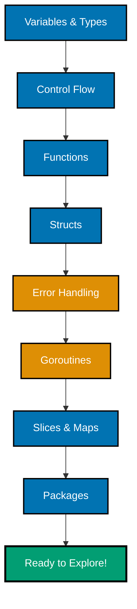

**Want to get productive with Go fast?** This Quick Start teaches you the essential syntax and core patterns you need to read Go code and try simple examples independently. You'll understand Go's approach to simplicity and concurrency.

For comprehensive coverage and hands-on practice, see the [Complete Beginner's Guide](beginner). For practical patterns and recipes, check out the [Golang Cookbook](cookbook).

## 🗺️ Go Learning Touchpoints

This Quick Start gives you exposure to Go's core concepts in order of importance:



Each section introduces ONE essential concept with ONE example. After completing all touchpoints, you'll understand Go's philosophy and can start experimenting independently.

## 📋 Prerequisites

- Basic programming knowledge in any language
- Go installed (version 1.24 or later recommended - download from [go.dev/dl](https://go.dev/dl))

## 🔤 Variables and Types

Go has simple, explicit type declarations. Here's what you need to know:

```go
package main

import "fmt"

func main() {
	// Explicit declaration
	var name string = "Alice"
	var age int = 30

	// Type inference (compiler figures out the type)
	var city = "Jakarta"

	// Short declaration (inside functions only)
	country := "Indonesia"

	// Constants
	const maxRetries = 3

	fmt.Println(name, age, city, country, maxRetries)
	// Output: Alice 30 Jakarta Indonesia 3
}
```

**Key Types**:

- `string` - Text
- `int` - Whole numbers
- `float64` - Decimal numbers
- `bool` - True/false
- `rune` - Single Unicode character

Zero values: Variables without explicit values get defaults (`0` for numbers, empty string `""` for strings, `false` for booleans, `nil` for pointers).

**Type Conversion**:

Go requires explicit type conversion—no automatic conversions:

```go
package main

import "fmt"

func main() {
	var x int = 42
	var y float64 = float64(x) // Explicit conversion required

	fmt.Printf("x: %d (type: int)\n", x)
	fmt.Printf("y: %.2f (type: float64)\n", y)
}
```

**Try It Yourself**:

Create a program that declares your name, age, and city using three different declaration styles (`var`, type inference, short declaration). Print them using `fmt.Println`.

---

## 🔄 Control Flow

Go has `if`, `switch`, and `for` loops. No `while` or `do-while`:

```go
package main

import "fmt"

func main() {
	// If/else
	age := 18
	if age >= 18 {
		fmt.Println("Adult")
	} else {
		fmt.Println("Minor")
	}

	// Switch
	day := "Monday"
	switch day {
	case "Monday":
		fmt.Println("Start of week")
	case "Friday":
		fmt.Println("TGIF!")
	default:
		fmt.Println("Regular day")
	}

	// For loop (traditional)
	for i := 0; i < 3; i++ {
		fmt.Println(i) // Prints: 0, 1, 2
	}

	// For loop (range over slice)
	numbers := []int{10, 20, 30}
	for index, value := range numbers {
		fmt.Printf("Index %d: %d\n", index, value)
	}

	// While-style loop (condition only)
	count := 0
	for count < 3 {
		fmt.Println("Count:", count)
		count++
	}

	// Infinite loop with break
	n := 0
	for {
		if n >= 3 {
			break
		}
		fmt.Println("Loop:", n)
		n++
	}
}
```

**Key Insights**:

- `for` is the only loop construct in Go
- Can be used as traditional loop, while-style, or infinite loop
- `break` exits loop, `continue` skips to next iteration
- `range` iterates over slices, maps, strings, channels

**Try It Yourself**:

Write a program using `switch` to categorize numbers 1-7 as "weekday" or "weekend". Use a `for` loop to test all seven days.

---

## 🔧 Functions

Functions are Go's basic building blocks:

```go
package main

import "fmt"

// Simple function
func greet(name string) string {
	return "Hello, " + name
}

// Multiple return values (Go's error handling style)
func divide(a, b float64) (float64, error) {
	if b == 0 {
		return 0, fmt.Errorf("cannot divide by zero")
	}
	return a / b, nil
}

func main() {
	fmt.Println(greet("Alice"))

	result, err := divide(10, 2)
	if err != nil {
		fmt.Println("Error:", err)
	} else {
		fmt.Println("Result:", result)
	}
}
```

**Key Points**:

- Parameters have types: `name string`, `age int`
- Multiple return values are common in Go
- Error handling uses `error` return type and `if err != nil` pattern

**Named Return Values**:

Go allows naming return values for clarity:

```go
package main

import "fmt"

func calculate(x, y int) (sum int, product int) {
	sum = x + y
	product = x * y
	return // Naked return uses named values
}

func main() {
	s, p := calculate(3, 4)
	fmt.Println("Sum:", s, "Product:", p)
	// Output: Sum: 7 Product: 12
}
```

**Variadic Functions**:

Accept variable number of arguments:

```go
package main

import "fmt"

func sum(numbers ...int) int {
	total := 0
	for _, num := range numbers {
		total += num
	}
	return total
}

func main() {
	fmt.Println(sum(1, 2, 3))       // 6
	fmt.Println(sum(10, 20, 30, 40)) // 100
}
```

**Try It Yourself**:

Create a function that takes two numbers and returns their average as `float64`. Handle the division properly and test with different inputs.

---

## 📦 Simple Structs

Structs group related data together:

```go
package main

import "fmt"

// Define a struct
type Person struct {
	Name string
	Age  int
	City string
}

func main() {
	// Create and initialize
	alice := Person{
		Name: "Alice",
		Age:  30,
		City: "Jakarta",
	}

	// Access fields
	fmt.Println(alice.Name)  // Alice
	fmt.Println(alice.Age)   // 30

	// Modify fields
	alice.Age = 31
	fmt.Println(alice)
	// Output: {Alice 31 Jakarta}

	// Zero value struct (all fields get zero values)
	var bob Person
	fmt.Println(bob) // { 0 } (empty string, 0, empty string)

	// Partial initialization
	carol := Person{Name: "Carol"} // Age and City use zero values
	fmt.Println(carol) // {Carol 0 }
}
```

**Methods on Structs**:

Add behavior to your structs with methods:

```go
package main

import "fmt"

type Person struct {
	Name string
	Age  int
}

// Method with receiver
func (p Person) Greet() string {
	return fmt.Sprintf("Hi, I'm %s and I'm %d years old", p.Name, p.Age)
}

// Method with pointer receiver (can modify fields)
func (p *Person) HaveBirthday() {
	p.Age++
}

func main() {
	alice := Person{Name: "Alice", Age: 30}
	fmt.Println(alice.Greet())

	alice.HaveBirthday()
	fmt.Println("After birthday:", alice.Age) // 31
}
```

**Try It Yourself**:

Create a `Book` struct with `Title`, `Author`, and `Pages` fields. Add a method that returns a description string combining all fields.

---

## ⚠️ Basic Error Handling

Go uses explicit error handling. Functions return errors as values:

```go
package main

import (
	"fmt"
	"strconv"
)

func main() {
	// Standard library functions return (value, error)
	num, err := strconv.Atoi("42")
	if err != nil {
		fmt.Println("Error:", err)
		return
	}

	fmt.Println("Number:", num) // Number: 42

	// Custom errors
	result, err := processData("invalid")
	if err != nil {
		fmt.Println("Failed:", err)
	}
}

// Function that returns an error
func processData(input string) (int, error) {
	if input == "invalid" {
		return 0, fmt.Errorf("invalid input: %s", input)
	}
	return 42, nil
}
```

**Pattern**: `if err != nil { ... }` is the standard way to check for errors.

**Error Wrapping**:

Add context to errors with `fmt.Errorf` and `%w`:

```go
package main

import (
	"errors"
	"fmt"
)

func readFile(filename string) error {
	if filename == "" {
		return errors.New("filename cannot be empty")
	}
	// Simulate error from lower level
	return fmt.Errorf("failed to read %s: %w", filename, errors.New("file not found"))
}

func main() {
	err := readFile("")
	if err != nil {
		fmt.Println("Error:", err)
	}

	err = readFile("data.txt")
	if err != nil {
		fmt.Println("Error:", err)
		// Error: failed to read data.txt: file not found
	}
}
```

**Try It Yourself**:

Write a function that validates an email string. Return an error if the email doesn't contain `@` symbol. Test with valid and invalid emails.

---

## 🚀 Goroutines (Intro)

Goroutines are lightweight concurrency. Think of them as "cheap threads":

```go
package main

import (
	"fmt"
	"time"
)

func work(name string) {
	for i := 0; i < 3; i++ {
		fmt.Println(name, "working", i)
		time.Sleep(100 * time.Millisecond)
	}
	fmt.Println(name, "done")
}

func main() {
	// Launch two goroutines (concurrent execution)
	go work("Worker 1")
	go work("Worker 2")

	// Wait for goroutines to finish
	time.Sleep(1 * time.Second)
	fmt.Println("Main finished")
}
```

The `go` keyword launches a function concurrently. This is Go's superpower—concurrency is built-in and simple to use.

**Channels for Communication**:

Goroutines communicate via channels:

```go
package main

import "fmt"

func sendMessage(ch chan string, message string) {
	ch <- message // Send message to channel
}

func main() {
	// Create a channel
	messages := make(chan string)

	// Send message in goroutine
	go sendMessage(messages, "Hello from goroutine!")

	// Receive message from channel (blocks until message available)
	msg := <-messages
	fmt.Println("Received:", msg)
}
```

**Buffered Channels**:

Channels can have a buffer to avoid blocking:

```go
package main

import "fmt"

func main() {
	// Buffered channel (capacity 2)
	ch := make(chan int, 2)

	ch <- 1 // Won't block (buffer has space)
	ch <- 2 // Won't block (buffer has space)

	fmt.Println(<-ch) // 1
	fmt.Println(<-ch) // 2
}
```

**Try It Yourself**:

Create two goroutines that send numbers to a shared channel. In the main function, receive and print those numbers.

---

## 📋 Slices and Maps

Collections for storing multiple values:

```go
package main

import "fmt"

func main() {
	// Slice (dynamic array)
	fruits := []string{"apple", "banana", "cherry"}
	fruits = append(fruits, "date") // Add element

	for _, fruit := range fruits {
		fmt.Println(fruit)
	}

	// Map (key-value store)
	scores := map[string]int{
		"Alice": 90,
		"Bob":   85,
		"Carol": 92,
	}

	fmt.Println(scores["Alice"]) // 90

	// Iterate over map
	for name, score := range scores {
		fmt.Printf("%s: %d\n", name, score)
	}
}
```

Slices are ordered, maps are not. Both are essential for most Go programs.

**Slice Operations**:

Common operations on slices:

```go
package main

import "fmt"

func main() {
	// Create slice with make
	numbers := make([]int, 3) // length 3, initialized to zeros
	fmt.Println(numbers)      // [0 0 0]

	// Slicing (create sub-slice)
	data := []int{10, 20, 30, 40, 50}
	subset := data[1:4] // indices 1 to 3 (4 is exclusive)
	fmt.Println(subset) // [20 30 40]

	// Check length and capacity
	fmt.Println("Length:", len(data))
	fmt.Println("Capacity:", cap(data))

	// Remove element (create new slice without it)
	index := 2
	result := append(data[:index], data[index+1:]...)
	fmt.Println(result) // [10 20 40 50] (30 removed)
}
```

**Map Operations**:

Common operations on maps:

```go
package main

import "fmt"

func main() {
	// Create empty map with make
	ages := make(map[string]int)

	// Add entries
	ages["Alice"] = 30
	ages["Bob"] = 25

	// Check if key exists
	age, exists := ages["Alice"]
	if exists {
		fmt.Println("Alice's age:", age)
	}

	// Delete entry
	delete(ages, "Bob")
	fmt.Println(ages) // map[Alice:30]
}
```

**Try It Yourself**:

Create a map of fruit names to their colors. Add at least three fruits, then iterate and print each fruit with its color. Try to access a fruit that doesn't exist and handle it gracefully.

---

## 📚 Packages and Imports

Go code is organized in packages. Import standard library packages as needed:

```go
package main

import (
	"fmt"     // Formatting and printing
	"strconv" // String conversion
	"time"    // Time functions
)

func main() {
	// Use functions from imported packages
	fmt.Println("Hello")

	now := time.Now()
	fmt.Println("Current time:", now)

	num, _ := strconv.Atoi("42")
	fmt.Println("Parsed:", num)
}
```

Key standard library packages:

- `fmt` - Printing and formatting
- `strings` - String manipulation
- `time` - Time and dates
- `strconv` - String conversion
- `math` - Mathematical functions
- `os` - Operating system functions

---

## 🎯 Common Patterns

Now that you know the basics, here are essential patterns you'll see everywhere in Go code:

### Pattern 1: Error Handling Chain

Check and handle errors at every step:

```go
package main

import (
	"fmt"
	"strconv"
)

func processData() error {
	// Step 1: Parse string to number
	num, err := strconv.Atoi("42")
	if err != nil {
		return fmt.Errorf("failed to parse: %w", err)
	}

	// Step 2: Validate number
	if num < 0 {
		return fmt.Errorf("number must be positive: %d", num)
	}

	// Step 3: Process
	result := num * 2
	fmt.Println("Result:", result)
	return nil
}

func main() {
	if err := processData(); err != nil {
		fmt.Println("Error:", err)
	}
}
```

### Pattern 2: Defer for Cleanup

Use `defer` to ensure cleanup happens:

```go
package main

import "fmt"

func processFile(filename string) error {
	fmt.Println("Opening file:", filename)
	// Defer ensures this runs when function exits
	defer fmt.Println("Closing file:", filename)

	// Do work with file...
	fmt.Println("Processing file...")

	// Even if error occurs, defer still runs
	return nil
}

func main() {
	processFile("data.txt")
	// Output:
	// Opening file: data.txt
	// Processing file...
	// Closing file: data.txt
}
```

### Pattern 3: Interface for Abstraction

Interfaces define behavior without specifying implementation:

```go
package main

import "fmt"

// Interface defines contract
type Speaker interface {
	Speak() string
}

// Different types implement the same interface
type Dog struct {
	Name string
}

func (d Dog) Speak() string {
	return "Woof!"
}

type Cat struct {
	Name string
}

func (c Cat) Speak() string {
	return "Meow!"
}

// Function works with any Speaker
func makeItSpeak(s Speaker) {
	fmt.Println(s.Speak())
}

func main() {
	dog := Dog{Name: "Buddy"}
	cat := Cat{Name: "Whiskers"}

	makeItSpeak(dog) // Woof!
	makeItSpeak(cat) // Meow!
}
```

### Pattern 4: Select for Multiple Channels

Use `select` to wait on multiple channel operations:

```go
package main

import (
	"fmt"
	"time"
)

func main() {
	ch1 := make(chan string)
	ch2 := make(chan string)

	go func() {
		time.Sleep(100 * time.Millisecond)
		ch1 <- "from channel 1"
	}()

	go func() {
		time.Sleep(200 * time.Millisecond)
		ch2 <- "from channel 2"
	}()

	// Select waits for first available channel
	select {
	case msg1 := <-ch1:
		fmt.Println("Received:", msg1)
	case msg2 := <-ch2:
		fmt.Println("Received:", msg2)
	case <-time.After(300 * time.Millisecond):
		fmt.Println("Timeout")
	}
}
```

---

## 🔧 Troubleshooting Common Issues

### Issue 1: "declared and not used"

Go requires you to use all declared variables:

```go
// ❌ Error: x declared and not used
func main() {
	x := 42
}

// ✅ Fix: Use the variable or remove it
func main() {
	x := 42
	fmt.Println(x)
}

// ✅ Or use blank identifier for intentionally ignored values
func main() {
	_, err := someFunction() // Ignore first return value
	if err != nil {
		// handle error
	}
}
```

### Issue 2: "cannot use ... (type X) as type Y"

Go doesn't allow implicit type conversions:

```go
// ❌ Error: cannot use int as float64
var x int = 42
var y float64 = x

// ✅ Fix: Explicit conversion required
var x int = 42
var y float64 = float64(x)
```

### Issue 3: "index out of range"

Slice/array access beyond bounds causes panic:

```go
// ❌ Panic: index out of range
data := []int{10, 20, 30}
fmt.Println(data[5])

// ✅ Fix: Check length first
data := []int{10, 20, 30}
if len(data) > 5 {
	fmt.Println(data[5])
} else {
	fmt.Println("Index out of range")
}
```

### Issue 4: "all goroutines are asleep - deadlock!"

Happens when goroutines wait forever on channels:

```go
// ❌ Deadlock: nobody sends to channel
func main() {
	ch := make(chan int)
	x := <-ch // Blocks forever waiting for value
	fmt.Println(x)
}

// ✅ Fix: Send value in goroutine
func main() {
	ch := make(chan int)
	go func() {
		ch <- 42
	}()
	x := <-ch
	fmt.Println(x)
}
```

### Issue 5: "assignment to entry in nil map"

Maps must be initialized with `make` before use:

```go
// ❌ Panic: assignment to entry in nil map
var ages map[string]int
ages["Alice"] = 30

// ✅ Fix: Initialize with make
ages := make(map[string]int)
ages["Alice"] = 30
```

---

## ✅ Next Steps

You now have touchpoints across Go's core concepts! To deepen your knowledge:

1. **Try the examples**: Copy and run each code snippet. Modify them and experiment.
2. **Read the docs**: Visit [go.dev/doc](https://go.dev/doc) to explore in depth.
3. **Complete the Beginner tutorial**: [Complete Beginner's Guide to Go](beginner) covers everything comprehensively with:
   - Methods, interfaces, and embedding
   - Comprehensive error handling and wrapping
   - Advanced concurrency patterns
   - Testing and benchmarking
   - 4 levels of practice exercises

4. **Use the Cookbook**: [Golang Cookbook](cookbook) provides recipes for common patterns when you hit real-world problems.

## 🎯 Self-Assessment

After completing this Quick Start, test your understanding with these concrete scenarios:

### Basic Competency Checklist

- [ ] **Variables**: Declare a variable using `:=`, `var`, and type inference. Understand when each is appropriate.
- [ ] **Functions**: Write a function that takes two parameters and returns two values (one being an `error`).
- [ ] **Error Handling**: Read code with `if err != nil` blocks and understand what happens when errors occur.
- [ ] **Structs**: Create a struct with 3 fields, initialize it with values, and modify one field.
- [ ] **Slices**: Create a slice, append items to it, and iterate using `range`.
- [ ] **Maps**: Create a map, add key-value pairs, check if a key exists, and iterate over entries.
- [ ] **Goroutines**: Launch a goroutine with the `go` keyword and understand it runs concurrently.
- [ ] **Channels**: Send and receive values through a channel between goroutines.

### Applied Scenarios

Can you solve these mini-challenges?

1. **Data Processing**: Write a function that takes a slice of numbers and returns their sum and average. Return an error if the slice is empty.

2. **User Data**: Create a `User` struct with name, age, and email. Write a method that returns a formatted greeting string.

3. **Concurrent Tasks**: Launch two goroutines that each print numbers 1-5 with small delays. Observe that they run concurrently.

4. **Error Chain**: Write a function that calls another function which might return an error. Wrap the error with additional context before returning it.

5. **Collection Operations**: Create a map of product names to prices. Write a function that finds the most expensive product and returns its name and price.

### Ready to Move Forward?

If you can:

- Read basic Go code and understand what it does
- Write simple programs with functions, structs, and error handling
- Explain why Go uses explicit error handling instead of exceptions
- Understand when to use slices vs maps
- Launch goroutines and know they enable concurrency
- Debug common errors like "declared and not used" or "index out of range"

Then you're ready to explore Go code independently and start building small programs!

### What's Next?

- **Need more practice?** Work through the [Complete Beginner's Guide](beginner) for comprehensive coverage with exercises at 4 difficulty levels.
- **Want practical recipes?** Check the [Golang Cookbook](cookbook) for patterns you'll use in real projects.
- **Ready to build?** Start a small project—a CLI tool, simple web server, or automation script.
- **Official resources**: Visit [go.dev/doc](https://go.dev/doc) for tutorials and [pkg.go.dev](https://pkg.go.dev) for package documentation.
