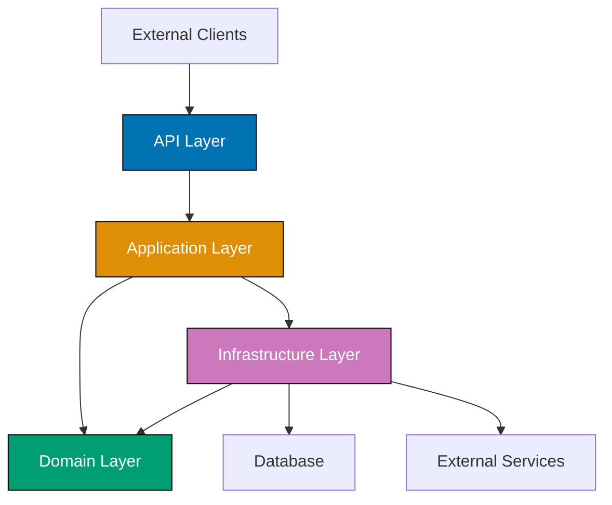

## Problem

Poor package organization leads to circular dependencies, unclear module boundaries, and difficulty navigating codebases. Traditional layer-by-type packaging scatters related functionality across multiple packages.

```java
// Problematic approach - layer-by-type (technical packaging)
com.example.app.controllers.UserController
com.example.app.controllers.OrderController
com.example.app.services.UserService
com.example.app.services.OrderService
com.example.app.repositories.UserRepository
com.example.app.repositories.OrderRepository
// Related classes scattered across layers
```

This guide shows practical techniques for organizing Java packages to improve maintainability and clarity.

## Solution

### 1. Feature-Based Packaging (Recommended)

Group code by business feature rather than technical layer.

**Feature-based structure**:

```java
// Feature-based packaging (package-by-feature)
com.example.app/
├── user/
│   ├── User.java
│   ├── UserController.java
│   ├── UserService.java
│   ├── UserRepository.java
│   ├── UserDto.java
│   └── UserMapper.java
├── order/
│   ├── Order.java
│   ├── OrderController.java
│   ├── OrderService.java
│   ├── OrderRepository.java
│   ├── OrderDto.java
│   ├── OrderItem.java
│   └── OrderMapper.java
├── payment/
│   ├── Payment.java
│   ├── PaymentController.java
│   ├── PaymentService.java
│   ├── PaymentGateway.java
│   └── PaymentProcessor.java
└── shared/
    ├── config/
    │   └── DatabaseConfig.java
    ├── exception/
    │   └── ResourceNotFoundException.java
    └── util/
        └── DateUtils.java

// Example implementation
package com.example.app.user;

public class User {
    private Long id;
    private String username;
    private String email;
    // ...
}

@RestController
@RequestMapping("/api/users")
class UserController { // Package-private - only accessible within 'user' package
    private final UserService userService;

    UserController(UserService userService) {
        this.userService = userService;
    }

    @GetMapping("/{id}")
    public UserDto getUser(@PathVariable Long id) {
        return userService.findById(id);
    }
}

@Service
class UserService { // Package-private
    private final UserRepository userRepository;

    UserService(UserRepository userRepository) {
        this.userRepository = userRepository;
    }

    public UserDto findById(Long id) {
        User user = userRepository.findById(id)
            .orElseThrow(() -> new ResourceNotFoundException("User not found"));
        return UserMapper.toDto(user);
    }
}

@Repository
class UserRepository { // Package-private
    private final JdbcTemplate jdbcTemplate;

    UserRepository(JdbcTemplate jdbcTemplate) {
        this.jdbcTemplate = jdbcTemplate;
    }

    public Optional<User> findById(Long id) {
        // Database access
    }
}
```

**Benefits**:

- Related classes grouped together
- Easy to find feature-related code
- Package-private classes enforce encapsulation
- Easier to extract features into separate modules

### 2. Layered Architecture with Packages

Combine layered architecture with clear package boundaries.

**Hybrid approach - feature slices with layers**:

```java
com.example.app/
├── user/
│   ├── api/              // API layer (controllers, DTOs)
│   │   ├── UserController.java
│   │   ├── UserDto.java
│   │   └── UserRequest.java
│   ├── domain/           // Domain layer (entities, domain services)
│   │   ├── User.java
│   │   ├── UserValidator.java
│   │   └── UserEvents.java
│   ├── application/      // Application layer (use cases, app services)
│   │   ├── UserService.java
│   │   └── CreateUserUseCase.java
│   └── infrastructure/   // Infrastructure layer (persistence, external services)
│       ├── UserRepository.java
│       ├── UserJpaRepository.java
│       └── UserMapper.java
└── order/
    ├── api/
    ├── domain/
    ├── application/
    └── infrastructure/

// Example: Clear layer separation
package com.example.app.user.api;

@RestController
@RequestMapping("/api/users")
public class UserController {
    private final UserService userService; // Depends on application layer

    // API layer only
}

package com.example.app.user.application;

@Service
public class UserService {
    private final UserRepository userRepository; // Depends on infrastructure
    private final UserValidator validator;      // Depends on domain

    // Application logic
}

package com.example.app.user.domain;

public class User {
    // Domain model - no dependencies on other layers
}

package com.example.app.user.infrastructure;

@Repository
class UserRepository { // Package-private
    // Infrastructure details hidden
}
```

### 3. Java Platform Module System (JPMS)

Use Java modules for explicit dependency management (Java 9+).

**module-info.java**:

```java
// File: src/main/java/module-info.java
module com.example.app.user {
    // Dependencies
    requires com.example.app.shared;
    requires spring.web;
    requires spring.data.jpa;
    requires java.sql;

    // Exports - publicly accessible packages
    exports com.example.app.user.api;
    exports com.example.app.user.domain;

    // Private packages (not exported)
    // com.example.app.user.application - internal only
    // com.example.app.user.infrastructure - internal only

    // Opens for reflection (Spring, JPA)
    opens com.example.app.user.domain to spring.core, org.hibernate.orm.core;
    opens com.example.app.user.infrastructure to spring.core;
}

// Multi-module project structure
project-root/
├── user-module/
│   └── src/main/java/
│       ├── module-info.java
│       └── com/example/app/user/
│           ├── api/
│           ├── domain/
│           ├── application/
│           └── infrastructure/
├── order-module/
│   └── src/main/java/
│       ├── module-info.java
│       └── com/example/app/order/
└── shared-module/
    └── src/main/java/
        ├── module-info.java
        └── com/example/app/shared/

// Order module depends on User module
// File: order-module/src/main/java/module-info.java
module com.example.app.order {
    requires com.example.app.user; // Can only access exported packages
    requires com.example.app.shared;

    exports com.example.app.order.api;
    exports com.example.app.order.domain;
}
```

### 4. Package Naming Conventions

Follow consistent naming conventions.

**Naming patterns**:

```java
// Standard package structure
com.company.product.module.layer

// Examples
com.example.ecommerce.user.api          // Public API
com.example.ecommerce.user.domain       // Domain models
com.example.ecommerce.user.application  // Use cases
com.example.ecommerce.user.infrastructure // Persistence

// Shared/common packages
com.example.ecommerce.shared.exception
com.example.ecommerce.shared.util
com.example.ecommerce.shared.config
com.example.ecommerce.shared.dto

// Testing packages mirror main packages
test/
└── com/example/ecommerce/user/
    ├── api/
    │   └── UserControllerTest.java
    ├── domain/
    │   └── UserTest.java
    └── application/
        └── UserServiceTest.java

// Package naming rules
// - All lowercase
// - Avoid underscores (use camelCase if needed)
// - Meaningful, descriptive names
// - Singular form (user, not users)
// - Avoid abbreviations unless standard (dto, api, rest)
```

## How It Works

### Package Dependency Flow



**Dependency rules**:

1. **API Layer**: Depends on Application layer
2. **Application Layer**: Depends on Domain and Infrastructure layers
3. **Domain Layer**: No dependencies (pure business logic)
4. **Infrastructure Layer**: Depends on Domain layer (implements domain interfaces)
5. **Flow**: API → Application → Domain ← Infrastructure

**Key principles**:

- Domain is independent (Dependency Inversion)
- Infrastructure implements domain contracts
- API layer coordinates use cases
- Application layer orchestrates business logic

## Variations

### Hexagonal Architecture (Ports & Adapters)

```java
com.example.app/
├── user/
│   ├── domain/                    // Core business logic
│   │   ├── User.java
│   │   ├── UserPort.java         // Port (interface)
│   │   └── UserService.java
│   └── adapter/                   // Adapters (implementations)
│       ├── web/
│       │   └── UserRestController.java
│       ├── persistence/
│       │   └── UserJpaAdapter.java
│       └── messaging/
│           └── UserKafkaAdapter.java

// Port (interface in domain)
package com.example.app.user.domain;

public interface UserPort {
    User save(User user);
    Optional<User> findById(Long id);
}

// Adapter (implementation)
package com.example.app.user.adapter.persistence;

@Component
class UserJpaAdapter implements UserPort {
    private final UserJpaRepository jpaRepository;

    @Override
    public User save(User user) {
        // JPA persistence implementation
    }
}
```

### Clean Architecture

```java
com.example.app/
├── entities/              // Enterprise business rules
│   └── User.java
├── usecases/             // Application business rules
│   ├── CreateUser.java
│   └── GetUser.java
├── interfaceadapters/    // Interface adapters
│   ├── controllers/
│   ├── presenters/
│   └── gateways/
└── frameworks/           // Frameworks and drivers
    ├── web/
    ├── db/
    └── external/
```

### Screaming Architecture

Make architecture intentions obvious from package names:

```java
com.example.app/
├── users/               // Feature obvious from name
│   ├── register/
│   ├── authenticate/
│   ├── profile/
│   └── permissions/
├── orders/
│   ├── create/
│   ├── fulfill/
│   ├── cancel/
│   └── track/
└── payments/
    ├── process/
    ├── refund/
    └── verify/
```

## Common Pitfalls

**Pitfall 1: Circular Dependencies**

Avoid packages depending on each other:

```java
// Bad: Circular dependency
package com.example.user;
import com.example.order.Order; // User depends on Order

package com.example.order;
import com.example.user.User; // Order depends on User

// Good: Extract shared concept
package com.example.shared;
public interface Party {} // Common interface

package com.example.user;
public class User implements Party {}

package com.example.order;
public class Order {
    private Party customer; // Depends on shared, not user
}
```

**Pitfall 2: God Package**

Avoid dumping everything into one package:

```java
// Bad: Everything in one package
com.example.app/
├── User.java
├── Order.java
├── Product.java
├── UserController.java
├── OrderController.java
├── ... (100+ files)

// Good: Organize by feature
com.example.app/
├── user/
├── order/
└── product/
```

**Pitfall 3: Deep Nesting**

Avoid excessive package depth:

```java
// Bad: Too deep
com.example.app.module.feature.layer.sublayer.component.impl.UserServiceImpl

// Good: Reasonable depth (3-5 levels)
com.example.app.user.application.UserService
```

**Pitfall 4: Leaky Abstraction**

Don't expose implementation details:

```java
// Bad: JPA entity exposed as public API
package com.example.user.api;

@RestController
public class UserController {
    @GetMapping("/{id}")
    public User getUser(@PathVariable Long id) {
        return userRepository.findById(id); // Returns JPA entity directly
    }
}

// Good: Use DTOs
@RestController
public class UserController {
    @GetMapping("/{id}")
    public UserDto getUser(@PathVariable Long id) {
        User user = userService.findById(id);
        return UserMapper.toDto(user); // Returns DTO
    }
}
```

## Related Patterns

**Related Tutorial**: See [Intermediate Tutorial - Package Organization](/en/learn/software-engineering/programming-language/python/tutorials/intermediate#package-organization) for package basics and [Advanced Tutorial - Architecture Patterns](/en/learn/software-engineering/programming-language/python/tutorials/advanced#architecture) for architectural styles.

**Related How-To**: See [Dependency Injection with Spring](/en/learn/software-engineering/programming-language/java/how-to/dependency-injection-spring) for managing dependencies and [Use Sealed Classes](/en/learn/software-engineering/programming-language/java/how-to/use-sealed-classes) for controlling type hierarchies.

**Related Cookbook**: See Cookbook recipes "Feature-Based Package Structure", "Layered Architecture Template", and "Module Dependency Management" for copy-paste ready package organizations.

**Related Explanation**: See [Best Practices - Code Organization](/en/learn/software-engineering/programming-language/python/explanation/best-practices#code-organization) for organization principles.

## Further Reading

- [Package by Feature](https://phauer.com/2020/package-by-feature/) - Feature-based packaging guide
- [Hexagonal Architecture](https://alistair.cockburn.us/hexagonal-architecture/) - Ports and Adapters pattern
- [Clean Architecture](https://blog.cleancoder.com/uncle-bob/2012/08/13/the-clean-architecture.html) - Robert C. Martin's architecture
- [Java Module System](https://www.oracle.com/corporate/features/understanding-java-9-modules.html) - JPMS guide
