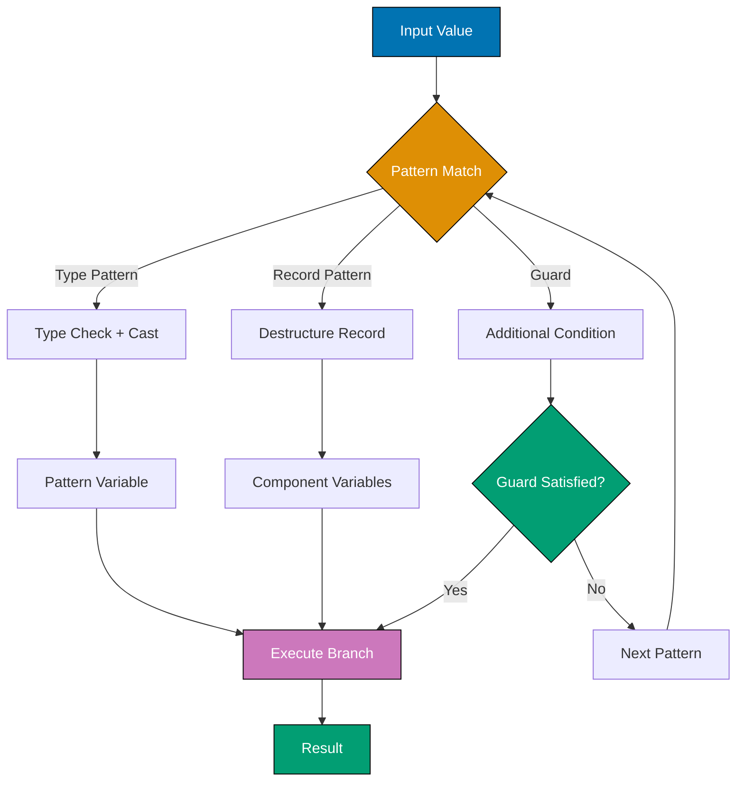

## Problem

Traditional type checking and casting requires verbose, error-prone code with explicit type checks and casts. Switch statements only support primitive types and enums, limiting their expressiveness.

```java
// Problematic approach - verbose instanceof checks
public String describe(Object obj) {
    if (obj instanceof String) {
        String s = (String) obj; // Redundant cast
        return "String: " + s.toUpperCase();
    } else if (obj instanceof Integer) {
        Integer i = (Integer) obj; // Redundant cast
        return "Integer: " + i * 2;
    } else if (obj instanceof Double) {
        Double d = (Double) obj; // Redundant cast
        return "Double: " + String.format("%.2f", d);
    } else {
        return "Unknown type";
    }
}
```

This guide shows practical techniques for using pattern matching to write cleaner, safer conditional logic.

## Solution

### 1. Pattern Matching for instanceof

Combine type checking and casting in a single operation (Java 16+).

**Type patterns**:

```java
public class TypePatternExamples {
    // Before pattern matching
    public static String describeOld(Object obj) {
        if (obj instanceof String) {
            String s = (String) obj;
            return "String of length: " + s.length();
        }
        return "Not a string";
    }

    // With pattern matching for instanceof (Java 16+)
    public static String describe(Object obj) {
        if (obj instanceof String s) { // s is pattern variable
            return "String of length: " + s.length();
        }
        return "Not a string";
    }

    // Pattern variable scope
    public static void demonstrateScope(Object obj) {
        if (obj instanceof String s && s.length() > 5) {
            System.out.println("Long string: " + s); // s in scope
        } else {
            // s not in scope here
        }

        // Negation - pattern variable not in scope
        if (!(obj instanceof String s)) {
            // s not in scope in negated condition
            return;
        }
        // s in scope here after negation check
        System.out.println("String: " + s);
    }

    // Complex conditions
    public static boolean isLongString(Object obj) {
        return obj instanceof String s
            && s.length() > 10
            && s.contains("important"); // s available throughout
    }
}
```

### 2. Switch Expressions with Pattern Matching

Use switch expressions for cleaner multi-way conditionals (Java 21+).

**Type patterns in switch**:

```java
public class SwitchPatternExamples {
    // Traditional switch with patterns (Java 21+)
    public static String formatValue(Object obj) {
        return switch (obj) {
            case String s -> "String: " + s.toUpperCase();
            case Integer i -> "Integer: " + (i * 2);
            case Double d -> String.format("Double: %.2f", d);
            case null -> "null value";
            default -> "Unknown type: " + obj.getClass().getSimpleName();
        };
    }

    // With guards (when clauses)
    public static String categorize(Object obj) {
        return switch (obj) {
            case String s when s.isEmpty() -> "Empty string";
            case String s when s.length() < 10 -> "Short string";
            case String s -> "Long string: " + s.length();
            case Integer i when i < 0 -> "Negative integer";
            case Integer i when i == 0 -> "Zero";
            case Integer i -> "Positive integer: " + i;
            case null -> "null";
            default -> "Other type";
        };
    }

    // Exhaustive switch with sealed types
    sealed interface Result permits Success, Error {}
    record Success(String data) implements Result {}
    record Error(String message, int code) implements Result {}

    public static void handleResult(Result result) {
        switch (result) { // No default needed - exhaustive
            case Success(String data) -> System.out.println("Success: " + data);
            case Error(String msg, int code) -> System.err.println("Error " + code + ": " + msg);
        }
    }
}
```

### 3. Record Patterns

Destructure records directly in pattern matching (Java 21+).

**Basic record patterns**:

```java
public record Point(int x, int y) {}

public class RecordPatternExamples {
    // Without record patterns
    public static String describeOld(Point p) {
        int x = p.x();
        int y = p.y();
        return "Point at (" + x + ", " + y + ")";
    }

    // With record patterns
    public static String describe(Point p) {
        if (p instanceof Point(int x, int y)) {
            return "Point at (" + x + ", " + y + ")";
        }
        return "Not a point";
    }

    // In switch expression
    public static String quadrant(Object obj) {
        return switch (obj) {
            case Point(int x, int y) when x > 0 && y > 0 -> "Quadrant I";
            case Point(int x, int y) when x < 0 && y > 0 -> "Quadrant II";
            case Point(int x, int y) when x < 0 && y < 0 -> "Quadrant III";
            case Point(int x, int y) when x > 0 && y < 0 -> "Quadrant IV";
            case Point(int x, int y) -> "On axis";
            case null -> "null";
            default -> "Not a point";
        };
    }

    // Nested record patterns
    public record Line(Point start, Point end) {}

    public static double lineLength(Line line) {
        return switch (line) {
            case Line(Point(int x1, int y1), Point(int x2, int y2)) -> {
                int dx = x2 - x1;
                int dy = y2 - y1;
                yield Math.sqrt(dx * dx + dy * dy);
            }
        };
    }

    // Partial destructuring
    public static int xCoordinate(Object obj) {
        return switch (obj) {
            case Point(int x, int y) -> x; // Only use x, ignore y
            default -> 0;
        };
    }
}
```

### 4. Complex Pattern Matching Scenarios

Combine multiple pattern matching features for sophisticated logic.

**Nested patterns and guards**:

```java
public sealed interface Shape permits Circle, Rectangle, Triangle {}
public record Circle(double radius) implements Shape {}
public record Rectangle(double width, double height) implements Shape {}
public record Triangle(double base, double height) implements Shape {}

public record ColoredShape(Shape shape, String color) {}

public class ComplexPatternMatching {
    // Nested patterns with multiple levels
    public static String describeColoredShape(Object obj) {
        return switch (obj) {
            case ColoredShape(Circle(double r), String color)
                when r > 10 ->
                "Large " + color + " circle (radius: " + r + ")";

            case ColoredShape(Circle(double r), String color) ->
                "Small " + color + " circle (radius: " + r + ")";

            case ColoredShape(Rectangle(double w, double h), String color)
                when w == h ->
                color + " square (side: " + w + ")";

            case ColoredShape(Rectangle(double w, double h), String color) ->
                color + " rectangle (" + w + " × " + h + ")";

            case ColoredShape(Triangle(double b, double h), String color) ->
                color + " triangle (base: " + b + ", height: " + h + ")";

            case null -> "null";
            default -> "Unknown shape";
        };
    }

    // Pattern matching with collections
    public static String describeList(Object obj) {
        return switch (obj) {
            case List<?> list when list.isEmpty() -> "Empty list";
            case List<?> list when list.size() == 1 -> "Single element: " + list.get(0);
            case List<?> list -> "List with " + list.size() + " elements";
            case null -> "null";
            default -> "Not a list";
        };
    }

    // Domain-specific patterns
    sealed interface Expression permits Constant, Binary {}
    record Constant(int value) implements Expression {}
    record Binary(String operator, Expression left, Expression right)
        implements Expression {}

    public static int evaluate(Expression expr) {
        return switch (expr) {
            case Constant(int value) -> value;

            case Binary("+", Expression left, Expression right) ->
                evaluate(left) + evaluate(right);

            case Binary("-", Expression left, Expression right) ->
                evaluate(left) - evaluate(right);

            case Binary("*", Expression left, Expression right) ->
                evaluate(left) * evaluate(right);

            case Binary("/", Expression left, Constant(0)) ->
                throw new ArithmeticException("Division by zero");

            case Binary("/", Expression left, Expression right) ->
                evaluate(left) / evaluate(right);

            case Binary(String op, var left, var right) ->
                throw new IllegalArgumentException("Unknown operator: " + op);
        };
    }

    public static void main(String[] args) {
        // (5 + 3) * 2 = 16
        Expression expr = new Binary("*",
            new Binary("+", new Constant(5), new Constant(3)),
            new Constant(2)
        );
        System.out.println(evaluate(expr)); // 16
    }
}
```

## How It Works

### Pattern Matching Flow



**Key concepts**:

1. **Type Patterns**: Combine instanceof check with cast in single expression
2. **Pattern Variables**: Variables declared in patterns, scoped to where type is guaranteed
3. **Record Patterns**: Destructure record components into variables
4. **Guards**: Additional boolean conditions using `when` clause
5. **Exhaustiveness**: Compiler checks all cases covered for sealed types
6. **Dominance**: Earlier patterns take precedence over later ones

### Pattern Variable Scope

Pattern variables are scoped to where the compiler can guarantee the type:

```java
// Scope in if statements
if (obj instanceof String s) {
    // s in scope here
} else {
    // s not in scope here
}

// Scope with &&
if (obj instanceof String s && s.length() > 0) {
    // s in scope for entire condition
}

// Scope with ||
if (obj instanceof String s || obj instanceof Integer i) {
    // Neither s nor i in scope here (one may not be defined)
}

// Scope after negation
if (!(obj instanceof String s)) {
    return;
}
// s in scope here (obj must be String to reach this point)
```

## Variations

### Unnamed Patterns (Java 22+)

Use `_` for unused pattern components:

```java
// Ignore components you don't need
public record Point3D(int x, int y, int z) {}

public static int getX(Point3D p) {
    return switch (p) {
        case Point3D(int x, _, _) -> x; // Ignore y and z
    };
}

// Ignore entire values
public static void processOrIgnore(Object obj) {
    switch (obj) {
        case String s -> System.out.println("String: " + s);
        case _ -> {} // Ignore all other types
    }
}
```

### Pattern Matching in Enhanced For

Future Java may support patterns in for-each:

```java
// Future enhancement (not yet available)
List<Object> mixed = List.of("text", 42, 3.14, "more text");

for (String s : mixed) { // Only iterate over strings
    System.out.println(s.toUpperCase());
}
```

### Conditional Patterns

Use when clauses for complex conditions:

```java
public static String categorizeNumber(Object obj) {
    return switch (obj) {
        case Integer i when i < 0 -> "Negative";
        case Integer i when i == 0 -> "Zero";
        case Integer i when i > 0 && i <= 10 -> "Small positive";
        case Integer i when i > 10 && i <= 100 -> "Medium positive";
        case Integer i -> "Large positive";
        default -> "Not an integer";
    };
}
```

## Common Pitfalls

**Pitfall 1: Pattern Dominance**

Earlier patterns shadow later ones:

```java
// Bad: Unreachable pattern
public static String describe(Object obj) {
    return switch (obj) {
        case Object o -> "Any object"; // Catches everything
        case String s -> "String";     // Unreachable! Compilation error
    };
}

// Good: Specific patterns first
public static String describe(Object obj) {
    return switch (obj) {
        case String s -> "String";
        case Integer i -> "Integer";
        case Object o -> "Other object"; // Default case
    };
}
```

**Pitfall 2: Null Handling**

Pattern matching doesn't match null by default:

```java
// Bad: NPE when obj is null
public static String describe(Object obj) {
    return switch (obj) {
        case String s -> "String";
        case Integer i -> "Integer";
        // NullPointerException if obj is null
    };
}

// Good: Explicit null case
public static String describe(Object obj) {
    return switch (obj) {
        case null -> "null value";
        case String s -> "String";
        case Integer i -> "Integer";
        default -> "Other";
    };
}

// Alternative: null-default case
public static String describe(Object obj) {
    return switch (obj) {
        case String s -> "String";
        case Integer i -> "Integer";
        case null, default -> "null or other";
    };
}
```

**Pitfall 3: Guard Side Effects**

Guards should be pure (no side effects):

```java
// Bad: Side effects in guard
int counter = 0;
public String process(Object obj) {
    return switch (obj) {
        case String s when counter++ < 5 -> "String"; // Bad - mutates counter
        default -> "Other";
    };
}

// Good: Pure guard
public String process(Object obj, int maxLength) {
    return switch (obj) {
        case String s when s.length() <= maxLength -> "Short string";
        case String s -> "Long string";
        default -> "Not a string";
    };
}
```

**Pitfall 4: Incomplete Exhaustiveness**

Non-exhaustive switch on sealed types:

```java
sealed interface Result permits Success, Error {}
record Success(String data) implements Result {}
record Error(String message) implements Result {}

// Bad: Not exhaustive
public static void handle(Result r) {
    switch (r) {
        case Success s -> System.out.println(s.data());
        // Missing Error case - compilation error
    }
}

// Good: Exhaustive
public static void handle(Result r) {
    switch (r) {
        case Success(String data) -> System.out.println(data);
        case Error(String msg) -> System.err.println(msg);
    }
}
```

## Related Patterns

**Related Tutorial**: See [Advanced Tutorial - Modern Java Features](/en/learn/software-engineering/programming-language/python/tutorials/advanced#modern-java) for pattern matching and [Intermediate Tutorial - Control Flow](/en/learn/software-engineering/programming-language/python/tutorials/intermediate#control-flow) for switch expressions.

**Related How-To**: See [Use Records Effectively](/en/learn/software-engineering/programming-language/java/how-to/use-records-effectively) for record patterns and [Use Sealed Classes](/en/learn/software-engineering/programming-language/java/how-to/use-sealed-classes) for exhaustive pattern matching with sealed types.

**Related Cookbook**: See Cookbook recipes "Pattern Matching for Data Processing", "Exhaustive Switch Patterns", and "Expression Evaluation with Patterns" for copy-paste ready pattern matching implementations.

**Related Explanation**: See [Best Practices - Modern Java](/en/learn/software-engineering/programming-language/python/explanation/best-practices#modern-java) for modern Java feature usage.

## Further Reading

- [JEP 441: Pattern Matching for switch](https://openjdk.org/jeps/441) - Pattern matching in switch expressions
- [JEP 394: Pattern Matching for instanceof](https://openjdk.org/jeps/394) - Type patterns for instanceof
- [JEP 440: Record Patterns](https://openjdk.org/jeps/440) - Destructuring records in patterns
- [Pattern Matching Tutorial](https://docs.oracle.com/en/java/javase/21/language/pattern-matching.html) - Official Oracle guide
