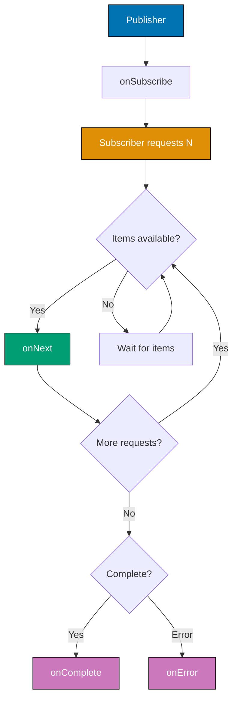

## Problem

Traditional blocking I/O operations waste thread resources waiting for responses, limiting application scalability. Imperative async code with callbacks leads to callback hell and difficult error handling.

```java
// Problematic approach - blocking operations
public User getUserById(Long id) {
    User user = database.findUser(id); // Blocks thread
    List<Order> orders = orderService.getOrders(user.getId()); // Blocks again
    user.setOrders(orders);
    return user; // Thread blocked entire time
}

// Callback hell
asyncOperation1(result1 -> {
    asyncOperation2(result1, result2 -> {
        asyncOperation3(result2, result3 -> {
            // Nested callbacks - hard to read and maintain
        });
    });
});
```

This guide shows practical techniques for building reactive applications using Project Reactor.

## Solution

### 1. Basic Reactive Types (Flux and Mono)

Use Flux for 0-N elements and Mono for 0-1 element.

**Setup** (Maven dependency):

```xml
<dependency>
    <groupId>io.projectreactor</groupId>
    <artifactId>reactor-core</artifactId>
    <version>3.6.1</version>
</dependency>
```

**Flux and Mono basics**:

```java
import reactor.core.publisher.Flux;
import reactor.core.publisher.Mono;
import java.time.Duration;

public class ReactiveBasics {
    public static void main(String[] args) throws InterruptedException {
        // Mono - single value or empty
        Mono<String> mono = Mono.just("Hello Reactive");
        mono.subscribe(System.out::println);

        // Mono - empty
        Mono<String> emptyMono = Mono.empty();
        emptyMono.subscribe(
            value -> System.out.println("Value: " + value),
            error -> System.err.println("Error: " + error),
            () -> System.out.println("Completed")
        );

        // Flux - multiple values
        Flux<Integer> flux = Flux.just(1, 2, 3, 4, 5);
        flux.subscribe(
            value -> System.out.println("Received: " + value),
            error -> System.err.println("Error: " + error),
            () -> System.out.println("Stream completed")
        );

        // Flux from range
        Flux<Integer> range = Flux.range(1, 10);

        // Flux from iterable
        Flux<String> fromList = Flux.fromIterable(
            List.of("Apple", "Banana", "Cherry")
        );

        // Deferred creation - lazy evaluation
        Mono<String> deferred = Mono.fromSupplier(() -> {
            System.out.println("Creating value");
            return "Lazy value";
        });
        deferred.subscribe(System.out::println); // "Creating value" printed here

        // Interval - periodic emissions
        Flux<Long> interval = Flux.interval(Duration.ofSeconds(1))
            .take(5);
        interval.subscribe(i -> System.out.println("Tick: " + i));

        Thread.sleep(6000); // Wait for interval to complete
    }
}
```

### 2. Reactive Operators

Transform and combine reactive streams.

**Common operators**:

```java
import reactor.core.publisher.Flux;
import reactor.core.publisher.Mono;

public class ReactiveOperators {
    public static void demonstrateOperators() {
        // map - transform each element
        Flux.range(1, 5)
            .map(i -> i * 2)
            .subscribe(System.out::println); // 2, 4, 6, 8, 10

        // filter - keep elements matching predicate
        Flux.range(1, 10)
            .filter(i -> i % 2 == 0)
            .subscribe(System.out::println); // 2, 4, 6, 8, 10

        // flatMap - async transformation
        Flux.just("user1", "user2", "user3")
            .flatMap(username -> fetchUserData(username))
            .subscribe(user -> System.out.println("User: " + user));

        // concatMap - sequential flatMap (preserves order)
        Flux.just("a", "b", "c")
            .concatMap(letter -> processLetter(letter))
            .subscribe(System.out::println);

        // zip - combine multiple streams
        Flux<String> names = Flux.just("Alice", "Bob", "Charlie");
        Flux<Integer> ages = Flux.just(25, 30, 35);

        Flux.zip(names, ages, (name, age) -> name + " is " + age)
            .subscribe(System.out::println);
        // Alice is 25
        // Bob is 30
        // Charlie is 35

        // merge - combine streams (interleaved)
        Flux<String> flux1 = Flux.just("A", "B").delayElements(Duration.ofMillis(100));
        Flux<String> flux2 = Flux.just("1", "2").delayElements(Duration.ofMillis(150));

        Flux.merge(flux1, flux2)
            .subscribe(System.out::println); // A, 1, B, 2 (interleaved)

        // concat - sequential concatenation
        Flux.concat(flux1, flux2)
            .subscribe(System.out::println); // A, B, 1, 2 (sequential)

        // reduce - aggregate elements
        Flux.range(1, 5)
            .reduce(0, Integer::sum)
            .subscribe(sum -> System.out.println("Sum: " + sum)); // 15

        // collectList - collect to list
        Flux.just("apple", "banana", "cherry")
            .collectList()
            .subscribe(list -> System.out.println("List: " + list));

        // distinct - remove duplicates
        Flux.just(1, 2, 2, 3, 3, 3, 4)
            .distinct()
            .subscribe(System.out::println); // 1, 2, 3, 4

        // take - limit elements
        Flux.range(1, 100)
            .take(5)
            .subscribe(System.out::println); // 1, 2, 3, 4, 5

        // skip - skip first N elements
        Flux.range(1, 10)
            .skip(5)
            .subscribe(System.out::println); // 6, 7, 8, 9, 10
    }

    private static Mono<String> fetchUserData(String username) {
        return Mono.just("Data for " + username)
            .delayElement(Duration.ofMillis(100));
    }

    private static Mono<String> processLetter(String letter) {
        return Mono.just(letter.toUpperCase())
            .delayElement(Duration.ofMillis(50));
    }
}
```

### 3. Error Handling

Handle errors gracefully in reactive streams.

**Error handling strategies**:

```java
import reactor.core.publisher.Flux;
import reactor.core.publisher.Mono;
import reactor.util.retry.Retry;

public class ReactiveErrorHandling {
    public static void demonstrateErrorHandling() {
        // onErrorReturn - fallback value
        Flux.just(1, 2, 0, 4)
            .map(i -> 10 / i)
            .onErrorReturn(-1)
            .subscribe(System.out::println);
        // 10, 5, -1 (error triggers fallback)

        // onErrorResume - fallback stream
        Flux.just("user1", "user2", "invalid")
            .flatMap(ReactiveErrorHandling::fetchUser)
            .onErrorResume(error -> {
                System.err.println("Error occurred: " + error.getMessage());
                return Mono.just("Guest User");
            })
            .subscribe(System.out::println);

        // onErrorContinue - skip errors and continue
        Flux.just(1, 2, 0, 4, 5)
            .map(i -> {
                if (i == 0) throw new IllegalArgumentException("Zero");
                return 10 / i;
            })
            .onErrorContinue((error, value) -> {
                System.err.println("Skipping error for value: " + value);
            })
            .subscribe(System.out::println);
        // 10, 5, skips 0, 2, 2

        // retry - retry on error
        Mono.fromCallable(() -> {
            if (Math.random() < 0.7) {
                throw new RuntimeException("Random failure");
            }
            return "Success";
        })
        .retry(3) // Retry up to 3 times
        .subscribe(
            result -> System.out.println("Result: " + result),
            error -> System.err.println("Failed after retries: " + error)
        );

        // Advanced retry with backoff
        Mono.fromCallable(ReactiveErrorHandling::unstableOperation)
            .retryWhen(Retry.backoff(3, Duration.ofSeconds(1))
                .maxBackoff(Duration.ofSeconds(5))
                .jitter(0.5))
            .subscribe(
                result -> System.out.println("Success: " + result),
                error -> System.err.println("Failed: " + error.getMessage())
            );

        // doOnError - side effect on error
        Flux.just(1, 2, 0, 4)
            .map(i -> 10 / i)
            .doOnError(error -> {
                System.err.println("Logging error: " + error.getMessage());
                // Send to monitoring system
            })
            .onErrorReturn(-1)
            .subscribe(System.out::println);
    }

    private static Mono<String> fetchUser(String username) {
        if (username.equals("invalid")) {
            return Mono.error(new IllegalArgumentException("Invalid user"));
        }
        return Mono.just("User: " + username);
    }

    private static String unstableOperation() throws Exception {
        if (Math.random() < 0.5) {
            throw new Exception("Operation failed");
        }
        return "Operation succeeded";
    }
}
```

### 4. Backpressure Handling

Manage flow of data between fast producers and slow consumers.

**Backpressure strategies**:

```java
import reactor.core.publisher.Flux;
import reactor.core.scheduler.Schedulers;
import org.reactivestreams.Subscription;

public class BackpressureExamples {
    public static void demonstrateBackpressure() {
        // Default - unbounded request
        Flux.range(1, 100)
            .subscribe(System.out::println);

        // Request N elements at a time
        Flux.range(1, 100)
            .subscribe(new BaseSubscriber<Integer>() {
                @Override
                protected void hookOnSubscribe(Subscription subscription) {
                    request(10); // Request first 10
                }

                @Override
                protected void hookOnNext(Integer value) {
                    System.out.println("Received: " + value);
                    if (value % 10 == 0) {
                        request(10); // Request next 10
                    }
                }
            });

        // Buffer - collect elements into lists
        Flux.range(1, 20)
            .buffer(5)
            .subscribe(list -> System.out.println("Batch: " + list));
        // [1,2,3,4,5], [6,7,8,9,10], [11,12,13,14,15], [16,17,18,19,20]

        // onBackpressureBuffer - buffer elements
        Flux.range(1, 1000)
            .onBackpressureBuffer(100) // Buffer up to 100
            .subscribe(System.out::println);

        // onBackpressureDrop - drop elements when downstream can't keep up
        Flux.interval(Duration.ofMillis(1))
            .onBackpressureDrop(dropped -> {
                System.out.println("Dropped: " + dropped);
            })
            .delayElements(Duration.ofMillis(10)) // Slow consumer
            .subscribe(System.out::println);

        // onBackpressureLatest - keep only latest
        Flux.interval(Duration.ofMillis(1))
            .onBackpressureLatest()
            .delayElements(Duration.ofMillis(10))
            .subscribe(i -> System.out.println("Latest: " + i));

        // limitRate - request N elements at a time automatically
        Flux.range(1, 100)
            .limitRate(10)
            .subscribe(System.out::println);
    }
}
```

## How It Works

### Reactive Stream Lifecycle



**Key concepts**:

1. **Reactive Streams**: Asynchronous stream processing with non-blocking backpressure
2. **Publisher**: Emits data (Flux for 0-N, Mono for 0-1)
3. **Subscriber**: Consumes data and controls demand through requests
4. **Backpressure**: Subscriber signals how many elements it can handle
5. **Operators**: Transform, filter, combine streams declaratively
6. **Schedulers**: Control execution context (threads)

### Schedulers

Control where operations execute:

- **immediate()**: Current thread
- **single()**: Single reusable thread
- **parallel()**: Fixed pool (CPU cores)
- **boundedElastic()**: Bounded elastic pool (I/O operations)

```java
Flux.range(1, 10)
    .publishOn(Schedulers.parallel())    // Switch to parallel scheduler
    .map(i -> heavyComputation(i))
    .subscribeOn(Schedulers.boundedElastic()) // Subscribe on elastic
    .subscribe(System.out::println);
```

## Variations

### Hot vs Cold Publishers

```java
// Cold - each subscriber gets own stream
Flux<Long> cold = Flux.interval(Duration.ofSeconds(1));
cold.subscribe(i -> System.out.println("Sub1: " + i));
Thread.sleep(3000);
cold.subscribe(i -> System.out.println("Sub2: " + i)); // Starts from 0

// Hot - all subscribers share stream
ConnectableFlux<Long> hot = Flux.interval(Duration.ofSeconds(1))
    .publish();
hot.subscribe(i -> System.out.println("Sub1: " + i));
Thread.sleep(3000);
hot.subscribe(i -> System.out.println("Sub2: " + i)); // Joins mid-stream
hot.connect(); // Start emitting
```

### Testing Reactive Code

```java
import reactor.test.StepVerifier;

public class ReactiveTests {
    @Test
    public void testFlux() {
        Flux<Integer> flux = Flux.just(1, 2, 3);

        StepVerifier.create(flux)
            .expectNext(1)
            .expectNext(2)
            .expectNext(3)
            .verifyComplete();
    }

    @Test
    public void testError() {
        Mono<String> mono = Mono.error(new RuntimeException("Error"));

        StepVerifier.create(mono)
            .expectError(RuntimeException.class)
            .verify();
    }

    @Test
    public void testTimeout() {
        Flux<Long> flux = Flux.interval(Duration.ofSeconds(1))
            .take(3);

        StepVerifier.create(flux)
            .expectNext(0L, 1L, 2L)
            .expectComplete()
            .verify(Duration.ofSeconds(5));
    }
}
```

### WebFlux Integration

```java
import org.springframework.web.reactive.function.server.*;
import reactor.core.publisher.Mono;

@RestController
public class ReactiveController {
    @GetMapping("/users/{id}")
    public Mono<User> getUser(@PathVariable String id) {
        return userRepository.findById(id);
    }

    @GetMapping("/users")
    public Flux<User> getAllUsers() {
        return userRepository.findAll();
    }

    @PostMapping("/users")
    public Mono<User> createUser(@RequestBody User user) {
        return userRepository.save(user);
    }
}
```

## Common Pitfalls

**Pitfall 1: Blocking in Reactive Pipeline**

Never block in reactive operators:

```java
// Bad: Blocking call
Flux.range(1, 10)
    .map(i -> {
        Thread.sleep(1000); // Blocks thread!
        return i * 2;
    })
    .subscribe(System.out::println);

// Good: Use delay
Flux.range(1, 10)
    .delayElements(Duration.ofSeconds(1))
    .map(i -> i * 2)
    .subscribe(System.out::println);
```

**Pitfall 2: Not Subscribing**

Streams are lazy - nothing happens until subscription:

```java
// Bad: No subscription - nothing happens
Flux.range(1, 10)
    .map(i -> i * 2);

// Good: Subscribe to trigger execution
Flux.range(1, 10)
    .map(i -> i * 2)
    .subscribe(System.out::println);
```

**Pitfall 3: Ignoring Errors**

Always handle errors:

```java
// Bad: Error terminates stream silently
Flux.range(1, 10)
    .map(i -> 10 / (i - 5)) // Throws on i=5
    .subscribe(System.out::println);

// Good: Handle error
Flux.range(1, 10)
    .map(i -> 10 / (i - 5))
    .onErrorContinue((error, value) -> {
        System.err.println("Error for: " + value);
    })
    .subscribe(System.out::println);
```

**Pitfall 4: Sharing Subscriptions**

Each subscribe creates new stream (for cold publishers):

```java
// Bad: Two independent streams
Flux<Integer> flux = Flux.range(1, 5)
    .doOnNext(i -> System.out.println("Emitting: " + i));

flux.subscribe(i -> System.out.println("Sub1: " + i));
flux.subscribe(i -> System.out.println("Sub2: " + i));
// Prints "Emitting" twice for each number

// Good: Share single stream
Flux<Integer> shared = Flux.range(1, 5)
    .doOnNext(i -> System.out.println("Emitting: " + i))
    .share();

shared.subscribe(i -> System.out.println("Sub1: " + i));
shared.subscribe(i -> System.out.println("Sub2: " + i));
// Prints "Emitting" once for each number
```

## Related Patterns

**Related Tutorial**: See [Advanced Tutorial - Reactive Programming](/en/learn/software-engineering/programming-language/python/tutorials/advanced#reactive-programming) for reactive fundamentals and [Intermediate Tutorial - Async Programming](/en/learn/software-engineering/programming-language/python/tutorials/intermediate#async-programming) for async basics.

**Related How-To**: See [Build REST APIs with Spring](/en/learn/software-engineering/programming-language/java/how-to/build-rest-apis-spring) for WebFlux integration and [Work with Databases](/en/learn/software-engineering/programming-language/java/how-to/work-with-databases) for reactive database access.

**Related Cookbook**: See Cookbook recipes "Reactive API Patterns", "Backpressure Strategies", and "Error Handling in Reactive Streams" for copy-paste ready reactive implementations.

**Related Explanation**: See [Best Practices - Reactive Programming](/en/learn/software-engineering/programming-language/python/explanation/best-practices#reactive-programming) for reactive design principles.

## Further Reading

- [Project Reactor Documentation](https://projectreactor.io/docs/core/release/reference/) - Official Reactor guide
- [Reactive Streams Specification](https://www.reactive-streams.org/) - Standard for async stream processing
- [Spring WebFlux](https://docs.spring.io/spring-framework/reference/web/webflux.html) - Reactive web framework
- [Reactor Core Guide](https://www.baeldung.com/reactor-core) - Practical Reactor tutorial
