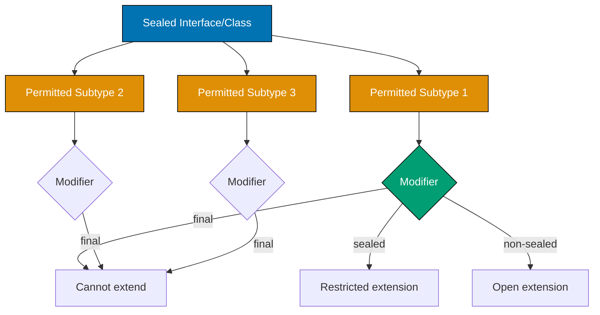

## Problem

Traditional inheritance hierarchies allow any class to extend or implement a type, making it impossible to enumerate all possible subtypes. This prevents exhaustive checking and makes refactoring risky.

```java
// Problematic approach - open hierarchy
public interface PaymentMethod {
    void process(double amount);
}

// Anyone can implement this interface anywhere
public class CreditCard implements PaymentMethod { }
public class PayPal implements PaymentMethod { }
// Unknown implementations may exist...
```

This guide shows practical techniques for using sealed classes to create controlled, exhaustive type hierarchies.

## Solution

### 1. Basic Sealed Class Declaration

Sealed classes restrict which classes can extend or implement them.

**Sealed interface with permitted subtypes**:

```java
public sealed interface Shape permits Circle, Rectangle, Triangle {}

public final class Circle implements Shape {
    private final double radius;

    public Circle(double radius) {
        if (radius <= 0) throw new IllegalArgumentException("Invalid radius");
        this.radius = radius;
    }

    public double radius() { return radius; }

    public double area() {
        return Math.PI * radius * radius;
    }
}

public final class Rectangle implements Shape {
    private final double width;
    private final double height;

    public Rectangle(double width, double height) {
        if (width <= 0 || height <= 0) {
            throw new IllegalArgumentException("Invalid dimensions");
        }
        this.width = width;
        this.height = height;
    }

    public double width() { return width; }
    public double height() { return height; }

    public double area() {
        return width * height;
    }
}

public final class Triangle implements Shape {
    private final double base;
    private final double height;

    public Triangle(double base, double height) {
        if (base <= 0 || height <= 0) {
            throw new IllegalArgumentException("Invalid dimensions");
        }
        this.base = base;
        this.height = height;
    }

    public double base() { return base; }
    public double height() { return height; }

    public double area() {
        return 0.5 * base * height;
    }
}

// Exhaustive pattern matching
public class ShapeProcessor {
    public static double calculateArea(Shape shape) {
        return switch (shape) {
            case Circle c -> c.area();
            case Rectangle r -> r.area();
            case Triangle t -> t.area();
            // Compiler knows all cases covered - no default needed
        };
    }
}
```

### 2. Sealed Class Hierarchies

Create hierarchies with multiple levels of sealing.

**Multi-level sealed hierarchy**:

```java
public sealed interface Vehicle permits Car, Truck, Motorcycle {}

// Car is sealed - can be extended by specific car types
public sealed class Car implements Vehicle permits Sedan, SUV, SportsCar {
    private final String brand;
    private final int year;

    protected Car(String brand, int year) {
        this.brand = brand;
        this.year = year;
    }

    public String brand() { return brand; }
    public int year() { return year; }
}

// Final classes - cannot be extended
public final class Sedan extends Car {
    private final int trunkCapacity;

    public Sedan(String brand, int year, int trunkCapacity) {
        super(brand, year);
        this.trunkCapacity = trunkCapacity;
    }

    public int trunkCapacity() { return trunkCapacity; }
}

public final class SUV extends Car {
    private final boolean fourWheelDrive;

    public SUV(String brand, int year, boolean fourWheelDrive) {
        super(brand, year);
        this.fourWheelDrive = fourWheelDrive;
    }

    public boolean fourWheelDrive() { return fourWheelDrive; }
}

public final class SportsCar extends Car {
    private final int horsepower;

    public SportsCar(String brand, int year, int horsepower) {
        super(brand, year);
        this.horsepower = horsepower;
    }

    public int horsepower() { return horsepower; }
}

// Truck and Motorcycle are final
public final class Truck implements Vehicle {
    private final int loadCapacity;

    public Truck(int loadCapacity) {
        this.loadCapacity = loadCapacity;
    }

    public int loadCapacity() { return loadCapacity; }
}

public final class Motorcycle implements Vehicle {
    private final String type;

    public Motorcycle(String type) {
        this.type = type;
    }

    public String type() { return type; }
}

// Exhaustive pattern matching with nested cases
public class VehicleProcessor {
    public static String describe(Vehicle vehicle) {
        return switch (vehicle) {
            case Sedan s -> "Sedan: " + s.brand() + " with trunk " + s.trunkCapacity() + "L";
            case SUV suv -> "SUV: " + suv.brand() + " (4WD: " + suv.fourWheelDrive() + ")";
            case SportsCar sc -> "Sports car: " + sc.brand() + " (" + sc.horsepower() + "hp)";
            case Truck t -> "Truck with load capacity: " + t.loadCapacity() + "kg";
            case Motorcycle m -> "Motorcycle: " + m.type();
        };
    }
}
```

### 3. Sealed Classes with Records

Combine sealed classes with records for concise, immutable hierarchies.

**Sealed interface with record implementations**:

```java
public sealed interface Result<T> permits Success, Failure {}

public record Success<T>(T value) implements Result<T> {
    public Success {
        if (value == null) {
            throw new IllegalArgumentException("Success value cannot be null");
        }
    }
}

public record Failure<T>(String error, int code) implements Result<T> {
    public Failure {
        if (error == null || error.isBlank()) {
            throw new IllegalArgumentException("Error message required");
        }
    }
}

// Usage with pattern matching
public class ResultProcessor {
    public static <T> void handleResult(Result<T> result) {
        switch (result) {
            case Success<T>(T value) -> {
                System.out.println("Success: " + value);
                // Process value
            }
            case Failure<T>(String error, int code) -> {
                System.err.println("Error " + code + ": " + error);
                // Handle error
            }
        }
    }

    public static <T> T getOrDefault(Result<T> result, T defaultValue) {
        return switch (result) {
            case Success<T>(T value) -> value;
            case Failure<T> f -> defaultValue;
        };
    }

    public static void main(String[] args) {
        Result<String> success = new Success<>("Data loaded");
        Result<String> failure = new Failure<>("Not found", 404);

        handleResult(success);  // Success: Data loaded
        handleResult(failure);  // Error 404: Not found

        String value1 = getOrDefault(success, "default"); // "Data loaded"
        String value2 = getOrDefault(failure, "default"); // "default"
    }
}
```

### 4. Domain Modeling with Sealed Types

Model domain concepts with exhaustive type safety.

**Payment processing example**:

```java
public sealed interface Payment permits CreditCardPayment, PayPalPayment, BankTransfer {
    double amount();
    String transactionId();
}

public record CreditCardPayment(
    String cardNumber,
    String cvv,
    String expiryDate,
    double amount,
    String transactionId
) implements Payment {
    public CreditCardPayment {
        if (cardNumber == null || cardNumber.length() != 16) {
            throw new IllegalArgumentException("Invalid card number");
        }
        if (cvv == null || cvv.length() != 3) {
            throw new IllegalArgumentException("Invalid CVV");
        }
        if (amount <= 0) {
            throw new IllegalArgumentException("Invalid amount");
        }
    }

    public String maskedCardNumber() {
        return "**** **** **** " + cardNumber.substring(12);
    }
}

public record PayPalPayment(
    String email,
    double amount,
    String transactionId
) implements Payment {
    public PayPalPayment {
        if (email == null || !email.contains("@")) {
            throw new IllegalArgumentException("Invalid email");
        }
        if (amount <= 0) {
            throw new IllegalArgumentException("Invalid amount");
        }
    }
}

public record BankTransfer(
    String accountNumber,
    String routingNumber,
    double amount,
    String transactionId
) implements Payment {
    public BankTransfer {
        if (accountNumber == null || accountNumber.isBlank()) {
            throw new IllegalArgumentException("Account number required");
        }
        if (routingNumber == null || routingNumber.isBlank()) {
            throw new IllegalArgumentException("Routing number required");
        }
        if (amount <= 0) {
            throw new IllegalArgumentException("Invalid amount");
        }
    }
}

public class PaymentProcessor {
    public static void processPayment(Payment payment) {
        switch (payment) {
            case CreditCardPayment(var card, var cvv, var expiry, var amount, var txnId) -> {
                System.out.println("Processing credit card payment: " + amount);
                // Integrate with credit card gateway
                validateCard(card, cvv, expiry);
                chargeCard(amount);
            }
            case PayPalPayment(var email, var amount, var txnId) -> {
                System.out.println("Processing PayPal payment: " + amount);
                // Integrate with PayPal API
                authorizePayPal(email, amount);
            }
            case BankTransfer(var account, var routing, var amount, var txnId) -> {
                System.out.println("Processing bank transfer: " + amount);
                // Integrate with ACH network
                initiateTransfer(account, routing, amount);
            }
        }
    }

    public static double calculateFee(Payment payment) {
        return switch (payment) {
            case CreditCardPayment p -> p.amount() * 0.029 + 0.30; // 2.9% + $0.30
            case PayPalPayment p -> p.amount() * 0.034 + 0.30;     // 3.4% + $0.30
            case BankTransfer p -> p.amount() * 0.008;             // 0.8%
        };
    }

    // Helper methods
    private static void validateCard(String card, String cvv, String expiry) {}
    private static void chargeCard(double amount) {}
    private static void authorizePayPal(String email, double amount) {}
    private static void initiateTransfer(String account, String routing, double amount) {}
}
```

## How It Works

### Sealed Type Hierarchy



**Key concepts**:

1. **Sealed Types**: Classes/interfaces that restrict which types can extend/implement them
2. **Permitted Subtypes**: Explicitly listed subtypes using `permits` clause
3. **Exhaustiveness**: Compiler knows all possible subtypes, enables exhaustive pattern matching
4. **Subtype Modifiers**: Permitted subtypes must be `final`, `sealed`, or `non-sealed`
5. **Same Package**: Permitted subtypes must be in same package (or same file for nested types)

### Subtype Modifier Rules

Permitted subtypes must choose one modifier:

- **final**: Cannot be extended further (most common)
- **sealed**: Can be extended by its own permitted subtypes
- **non-sealed**: Opens hierarchy to unrestricted extension

## Variations

### Non-Sealed Subtypes

Allow unrestricted extension from a sealed hierarchy:

```java
public sealed interface Animal permits Dog, Cat, Bird {}

public final class Dog implements Animal {}
public final class Cat implements Animal {}

// Bird is non-sealed - can be extended freely
public non-sealed class Bird implements Animal {}

// Anyone can extend Bird
public class Parrot extends Bird {}
public class Eagle extends Bird {}
```

### Sealed Abstract Classes

Use sealed abstract classes for shared implementation:

```java
public sealed abstract class Expression permits Constant, Addition, Multiplication {
    public abstract int evaluate();

    // Shared helper methods
    protected void validate() {
        // Common validation logic
    }
}

public final class Constant extends Expression {
    private final int value;

    public Constant(int value) {
        this.value = value;
        validate();
    }

    @Override
    public int evaluate() {
        return value;
    }
}

public final class Addition extends Expression {
    private final Expression left;
    private final Expression right;

    public Addition(Expression left, Expression right) {
        this.left = left;
        this.right = right;
        validate();
    }

    @Override
    public int evaluate() {
        return left.evaluate() + right.evaluate();
    }
}

public final class Multiplication extends Expression {
    private final Expression left;
    private final Expression right;

    public Multiplication(Expression left, Expression right) {
        this.left = left;
        this.right = right;
        validate();
    }

    @Override
    public int evaluate() {
        return left.evaluate() * right.evaluate();
    }
}
```

### Nested Sealed Types

Define sealed hierarchies within enclosing types:

```java
public class OrderSystem {
    public sealed interface OrderEvent permits OrderCreated, OrderShipped, OrderDelivered {
        String orderId();
        LocalDateTime timestamp();
    }

    public record OrderCreated(String orderId, LocalDateTime timestamp, List<String> items)
        implements OrderEvent {}

    public record OrderShipped(String orderId, LocalDateTime timestamp, String trackingNumber)
        implements OrderEvent {}

    public record OrderDelivered(String orderId, LocalDateTime timestamp, String signature)
        implements OrderEvent {}

    public static void processEvent(OrderEvent event) {
        switch (event) {
            case OrderCreated(var id, var ts, var items) ->
                System.out.println("Order created: " + id);
            case OrderShipped(var id, var ts, var tracking) ->
                System.out.println("Order shipped: " + tracking);
            case OrderDelivered(var id, var ts, var signature) ->
                System.out.println("Order delivered: " + signature);
        }
    }
}
```

## Common Pitfalls

**Pitfall 1: Forgetting Subtype Modifier**

Permitted subtypes must be final, sealed, or non-sealed:

```java
// Bad: Missing modifier
public sealed interface Shape permits Circle, Rectangle {}
public class Circle implements Shape {} // Compilation error

// Good: Add final modifier
public sealed interface Shape permits Circle, Rectangle {}
public final class Circle implements Shape {}
```

**Pitfall 2: Subtypes in Different Package**

Permitted subtypes must be in same package:

```java
// Bad: Subtype in different package
package com.example.shapes;
public sealed interface Shape permits com.example.impl.Circle {} // Error

// Good: Same package
package com.example.shapes;
public sealed interface Shape permits Circle, Rectangle {}
public final class Circle implements Shape {}
```

**Pitfall 3: Missing Case in Pattern Matching**

Adding new permitted subtype breaks existing exhaustive switches:

```java
// Original sealed interface
public sealed interface Shape permits Circle, Rectangle {}

// Exhaustive switch
public static void process(Shape shape) {
    switch (shape) {
        case Circle c -> System.out.println("Circle");
        case Rectangle r -> System.out.println("Rectangle");
    }
}

// Later add Triangle to permits clause
public sealed interface Shape permits Circle, Rectangle, Triangle {}

// Previous switch now has compilation error - missing Triangle case
// This is intentional - forces you to handle new case
```

**Pitfall 4: Overusing Sealed Classes**

Don't seal everything - only use when exhaustiveness is valuable:

```java
// Bad: Sealing utility class that doesn't need exhaustiveness
public sealed class StringUtils permits StringUtilsImpl {} // Unnecessary

// Good: Seal domain models with fixed set of variants
public sealed interface PaymentStatus permits Pending, Completed, Failed {}
```

## Related Patterns

**Related Tutorial**: See [Advanced Tutorial - Modern Java Features](/en/learn/software-engineering/programming-language/python/tutorials/advanced#modern-java) for sealed classes and pattern matching and [Intermediate Tutorial - OOP Principles](/en/learn/software-engineering/programming-language/python/tutorials/intermediate#oop) for inheritance design.

**Related How-To**: See [Use Records Effectively](/en/learn/software-engineering/programming-language/java/how-to/use-records-effectively) for combining records with sealed types and [Pattern Matching](/en/learn/software-engineering/programming-language/java/how-to/pattern-matching) for exhaustive pattern matching.

**Related Cookbook**: See Cookbook recipes "Sealed Type Hierarchies", "Domain Modeling with Sealed Types", and "Result Type Pattern" for copy-paste ready sealed class patterns.

**Related Explanation**: See [Best Practices - Type Safety](/en/learn/software-engineering/programming-language/python/explanation/best-practices#type-safety) for type safety principles.

## Further Reading

- [JEP 409: Sealed Classes](https://openjdk.org/jeps/409) - Java Enhancement Proposal for sealed classes
- [Java Sealed Classes Tutorial](https://docs.oracle.com/en/java/javase/21/language/sealed-classes-and-interfaces.html) - Official Oracle guide
- [Pattern Matching and Sealed Classes](https://www.baeldung.com/java-sealed-classes-interfaces) - Combining sealed types with pattern matching
- [Algebraic Data Types in Java](https://nipafx.dev/java-sealed-classes-guide/) - Using sealed classes for ADTs
