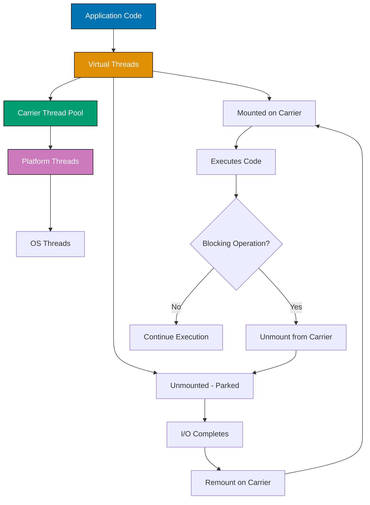

## Problem

Traditional platform threads are expensive resources with high memory overhead (1-2 MB stack per thread) and costly context switching. Thread pools limit scalability for I/O-bound workloads where most threads spend time waiting.

```java
// Problematic approach - platform threads don't scale
ExecutorService executor = Executors.newFixedThreadPool(200); // Limited pool
for (int i = 0; i < 10000; i++) {
    executor.submit(() -> {
        // I/O-bound task - thread mostly waiting
        String data = httpClient.get(url);
        processData(data);
    });
    // Tasks queued waiting for thread pool - high latency
}
```

This guide shows practical techniques for using virtual threads to build highly scalable concurrent applications.

## Solution

### 1. Creating Virtual Threads

Virtual threads are lightweight, allowing millions of concurrent tasks (Java 21+).

**Basic virtual thread creation**:

```java
public class VirtualThreadBasics {
    public static void main(String[] args) throws InterruptedException {
        // Method 1: Thread.ofVirtual().start()
        Thread vThread = Thread.ofVirtual().start(() -> {
            System.out.println("Running in virtual thread: " +
                Thread.currentThread());
        });
        vThread.join();

        // Method 2: Thread.startVirtualThread()
        Thread.startVirtualThread(() -> {
            System.out.println("Started virtual thread");
        });

        // Method 3: Thread.ofVirtual().unstarted()
        Thread unstarted = Thread.ofVirtual().unstarted(() -> {
            System.out.println("Unstarted virtual thread");
        });
        unstarted.start();
        unstarted.join();

        // Virtual thread characteristics
        Thread virtual = Thread.ofVirtual().start(() -> {
            System.out.println("Is virtual: " + Thread.currentThread().isVirtual());
            // true
            System.out.println("Thread name: " + Thread.currentThread().getName());
            // Empty or generated name
        });
        virtual.join();

        // Creating many virtual threads - scalable!
        List<Thread> threads = new ArrayList<>();
        for (int i = 0; i < 100_000; i++) {
            Thread t = Thread.ofVirtual().start(() -> {
                try {
                    Thread.sleep(Duration.ofSeconds(1)); // Simulates I/O
                    System.out.println("Task completed");
                } catch (InterruptedException e) {
                    Thread.currentThread().interrupt();
                }
            });
            threads.add(t);
        }

        // Join all - completes in ~1 second (not 100,000 seconds!)
        for (Thread t : threads) {
            t.join();
        }
    }
}
```

### 2. Virtual Thread ExecutorService

Use ExecutorService with virtual threads for task management.

**Virtual thread executor**:

```java
import java.util.concurrent.*;
import java.util.List;
import java.util.stream.IntStream;

public class VirtualThreadExecutor {
    public static void main(String[] args) throws InterruptedException, ExecutionException {
        // Virtual thread executor - creates new virtual thread per task
        try (ExecutorService executor = Executors.newVirtualThreadPerTaskExecutor()) {

            // Submit tasks
            List<Future<String>> futures = IntStream.range(0, 10000)
                .mapToObj(i -> executor.submit(() -> {
                    // I/O-bound task
                    Thread.sleep(Duration.ofMillis(100));
                    return "Task " + i + " completed on " +
                        Thread.currentThread().getName();
                }))
                .toList();

            // Collect results
            for (Future<String> future : futures) {
                System.out.println(future.get());
            }
        } // Auto-shutdown with try-with-resources

        // Comparison: Platform thread executor (limited)
        try (ExecutorService platformExecutor = Executors.newFixedThreadPool(100)) {
            // Only 100 platform threads - 10000 tasks queued
            // Much higher latency and resource usage
        }

        // Named virtual thread factory
        ThreadFactory factory = Thread.ofVirtual()
            .name("worker-", 0)
            .factory();

        try (ExecutorService executor = Executors.newThreadPerTaskExecutor(factory)) {
            executor.submit(() -> {
                System.out.println("Running on: " + Thread.currentThread().getName());
                // worker-0, worker-1, etc.
            });
        }
    }

    // Web request handling example
    public static void handleConcurrentRequests() {
        try (ExecutorService executor = Executors.newVirtualThreadPerTaskExecutor()) {
            // Simulate 10,000 concurrent HTTP requests
            List<Future<String>> responses = IntStream.range(0, 10_000)
                .mapToObj(i -> executor.submit(() -> {
                    // Simulated HTTP call (I/O-bound)
                    String response = httpClient.get("https://api.example.com/data/" + i);
                    return processResponse(response);
                }))
                .toList();

            // All requests execute concurrently with minimal memory overhead
            responses.forEach(future -> {
                try {
                    System.out.println(future.get());
                } catch (Exception e) {
                    e.printStackTrace();
                }
            });
        }
    }

    // Stub methods
    private static HttpClient httpClient = HttpClient.newHttpClient();
    private static String processResponse(String response) { return response; }
}
```

### 3. Structured Concurrency (Preview Feature)

Manage concurrent tasks with clear lifecycle and error handling.

**StructuredTaskScope** (Java 21+ preview):

```java
import java.util.concurrent.StructuredTaskScope;
import java.util.concurrent.StructuredTaskScope.Subtask;
import java.time.Duration;

public class StructuredConcurrencyExamples {
    // Enable with --enable-preview flag

    // ShutdownOnFailure - cancel all if one fails
    public static UserData fetchUserData(Long userId) throws Exception {
        try (var scope = new StructuredTaskScope.ShutdownOnFailure()) {
            // Launch concurrent subtasks
            Subtask<User> userTask = scope.fork(() -> fetchUser(userId));
            Subtask<List<Order>> ordersTask = scope.fork(() -> fetchOrders(userId));
            Subtask<Profile> profileTask = scope.fork(() -> fetchProfile(userId));

            // Wait for all to complete or first failure
            scope.join();
            scope.throwIfFailed(); // Throws if any task failed

            // All succeeded - collect results
            return new UserData(
                userTask.get(),
                ordersTask.get(),
                profileTask.get()
            );
        } // Auto-cancels any remaining tasks on scope exit
    }

    // ShutdownOnSuccess - return first successful result
    public static String fetchFromMultipleSources(String key) throws Exception {
        try (var scope = new StructuredTaskScope.ShutdownOnSuccess<String>()) {
            // Try multiple data sources concurrently
            scope.fork(() -> fetchFromPrimaryDb(key));
            scope.fork(() -> fetchFromCache(key));
            scope.fork(() -> fetchFromBackupDb(key));

            // Wait for first success
            scope.join();

            // Return first successful result, cancel others
            return scope.result();
        }
    }

    // Custom deadline
    public static Data fetchWithDeadline(Long id) throws Exception {
        try (var scope = new StructuredTaskScope.ShutdownOnFailure()) {
            Subtask<Data> task = scope.fork(() -> {
                Thread.sleep(Duration.ofSeconds(5)); // Slow operation
                return fetchData(id);
            });

            // Join with deadline
            scope.joinUntil(Instant.now().plus(Duration.ofSeconds(2)));

            if (!task.state().equals(Subtask.State.SUCCESS)) {
                throw new TimeoutException("Task exceeded deadline");
            }

            return task.get();
        }
    }

    // Aggregate results from multiple sources
    public static Summary aggregateData(List<Long> ids) throws Exception {
        try (var scope = new StructuredTaskScope.ShutdownOnFailure()) {
            List<Subtask<Data>> tasks = ids.stream()
                .map(id -> scope.fork(() -> fetchData(id)))
                .toList();

            scope.join();
            scope.throwIfFailed();

            List<Data> results = tasks.stream()
                .map(Subtask::get)
                .toList();

            return new Summary(results);
        }
    }

    // Stub classes and methods
    record UserData(User user, List<Order> orders, Profile profile) {}
    record User(Long id, String name) {}
    record Order(Long id, double amount) {}
    record Profile(String bio) {}
    record Data(Long id, String value) {}
    record Summary(List<Data> data) {}

    private static User fetchUser(Long id) { return new User(id, "User" + id); }
    private static List<Order> fetchOrders(Long id) { return List.of(); }
    private static Profile fetchProfile(Long id) { return new Profile("Bio"); }
    private static String fetchFromPrimaryDb(String key) { return "data"; }
    private static String fetchFromCache(String key) { return "cached"; }
    private static String fetchFromBackupDb(String key) { return "backup"; }
    private static Data fetchData(Long id) { return new Data(id, "data"); }
}
```

### 4. Migration from Platform Threads

Migrate existing code to virtual threads.

**Migration strategies**:

```java
public class MigrationExamples {
    // Before: Platform thread pool
    public static void oldApproach() {
        ExecutorService executor = Executors.newFixedThreadPool(100);
        for (int i = 0; i < 10000; i++) {
            executor.submit(() -> {
                // I/O task
                handleRequest();
            });
        }
        executor.shutdown();
    }

    // After: Virtual threads (minimal change)
    public static void newApproach() {
        try (ExecutorService executor = Executors.newVirtualThreadPerTaskExecutor()) {
            for (int i = 0; i < 10000; i++) {
                executor.submit(() -> {
                    // Same I/O task - now scales to millions
                    handleRequest();
                });
            }
        } // Auto-shutdown
    }

    // Spring Boot integration
    @Configuration
    public class AsyncConfig {
        @Bean
        public Executor taskExecutor() {
            // Before: Platform thread pool
            // ThreadPoolTaskExecutor executor = new ThreadPoolTaskExecutor();
            // executor.setCorePoolSize(10);
            // executor.setMaxPoolSize(50);

            // After: Virtual threads
            return Executors.newVirtualThreadPerTaskExecutor();
        }
    }

    // CompletableFuture with virtual threads
    public static void asyncOperations() {
        ExecutorService executor = Executors.newVirtualThreadPerTaskExecutor();

        CompletableFuture<String> future1 = CompletableFuture.supplyAsync(
            () -> fetchFromApi("endpoint1"),
            executor
        );

        CompletableFuture<String> future2 = CompletableFuture.supplyAsync(
            () -> fetchFromApi("endpoint2"),
            executor
        );

        String combined = future1.thenCombine(future2, (a, b) -> a + b).join();
        System.out.println(combined);

        executor.close();
    }

    // Parallel Stream with virtual threads (Java 21+)
    public static void parallelProcessing() {
        List<String> urls = loadUrls();

        // Process in parallel using virtual threads
        List<String> results = urls.parallelStream()
            .map(url -> {
                // Each item processed in virtual thread
                return fetchData(url);
            })
            .toList();
    }

    private static void handleRequest() {}
    private static String fetchFromApi(String endpoint) { return "data"; }
    private static List<String> loadUrls() { return List.of(); }
    private static String fetchData(String url) { return "data"; }
}
```

## How It Works

### Virtual Thread Architecture



**Key concepts**:

1. **Virtual Threads**: Lightweight threads managed by JVM (not OS)
2. **Carrier Threads**: Platform threads that execute virtual threads
3. **Mounting**: Virtual thread executes on carrier thread
4. **Unmounting**: Virtual thread parks when blocked (carrier freed for other virtual threads)
5. **Scalability**: Millions of virtual threads share small pool of carrier threads

**Performance characteristics**:

- **Memory**: ~1 KB per virtual thread (vs 1-2 MB for platform thread)
- **Creation**: Microseconds (vs milliseconds for platform thread)
- **Context switch**: Negligible (managed by JVM, not OS)
- **Blocking**: Virtual thread unmounts, carrier thread freed immediately

## Variations

### Thread-Local Variables

Use with caution - each virtual thread has its own thread-locals:

```java
// Thread-local with virtual threads
ThreadLocal<String> context = ThreadLocal.withInitial(() -> "default");

try (ExecutorService executor = Executors.newVirtualThreadPerTaskExecutor()) {
    for (int i = 0; i < 1000; i++) {
        int id = i;
        executor.submit(() -> {
            context.set("Task-" + id); // Each virtual thread has own copy
            System.out.println(context.get());
        });
    }
} // 1000 thread-local copies created (memory overhead)

// Alternative: ScopedValue (Java 21+ preview)
final ScopedValue<String> REQUEST_ID = ScopedValue.newInstance();

ScopedValue.where(REQUEST_ID, "req-123").run(() -> {
    System.out.println("Request: " + REQUEST_ID.get());
    // Immutable, efficient sharing across virtual threads
});
```

### Pinning Detection

Avoid operations that pin virtual threads to carriers:

```java
// Pinning occurs with synchronized blocks
synchronized (lock) {
    // Virtual thread pinned to carrier during I/O
    Thread.sleep(Duration.ofSeconds(1)); // Carrier blocked!
}

// Solution: Use ReentrantLock (non-pinning)
ReentrantLock lock = new ReentrantLock();
lock.lock();
try {
    Thread.sleep(Duration.ofSeconds(1)); // Virtual thread unmounts
} finally {
    lock.unlock();
}

// Monitor pinning with JVM flag
// -Djdk.tracePinnedThreads=full
```

### Virtual Threads with Reactive Frameworks

Integrate with Project Reactor:

```java
// Traditional reactive (non-blocking)
Mono<String> reactive = Mono.fromCallable(() -> {
    return httpClient.get(url);
}).subscribeOn(Schedulers.boundedElastic());

// With virtual threads (blocking style, reactive performance)
Mono<String> virtualThread = Mono.fromCallable(() -> {
    // Blocking call - but on virtual thread (efficient)
    return httpClient.get(url);
}).subscribeOn(Schedulers.fromExecutor(
    Executors.newVirtualThreadPerTaskExecutor()
));
```

## Common Pitfalls

**Pitfall 1: CPU-Bound Tasks**

Virtual threads don't help CPU-bound workloads:

```java
// Bad: Virtual threads for CPU-intensive work
try (ExecutorService executor = Executors.newVirtualThreadPerTaskExecutor()) {
    for (int i = 0; i < 100; i++) {
        executor.submit(() -> {
            // CPU-intensive - no benefit from virtual threads
            heavyComputation();
        });
    }
}

// Good: Use platform thread pool for CPU work
try (ExecutorService executor = Executors.newWorkStealingPool()) {
    for (int i = 0; i < 100; i++) {
        executor.submit(() -> {
            heavyComputation();
        });
    }
}
```

**Pitfall 2: Synchronized Blocks**

Synchronized blocks pin virtual threads:

```java
// Bad: Synchronized with long blocking operation
synchronized (lock) {
    Thread.sleep(Duration.ofSeconds(10)); // Pins virtual thread!
}

// Good: Use ReentrantLock
ReentrantLock lock = new ReentrantLock();
lock.lock();
try {
    Thread.sleep(Duration.ofSeconds(10)); // Virtual thread can unmount
} finally {
    lock.unlock();
}
```

**Pitfall 3: Thread Pools**

Don't pool virtual threads (defeats purpose):

```java
// Bad: Pooling virtual threads
ExecutorService pool = Executors.newFixedThreadPool(100,
    Thread.ofVirtual().factory()); // Why limit to 100?

// Good: Create per-task
ExecutorService executor = Executors.newVirtualThreadPerTaskExecutor();
```

**Pitfall 4: Excessive Thread-Locals**

Thread-locals with millions of virtual threads consume memory:

```java
// Bad: Thread-local per virtual thread
ThreadLocal<ExpensiveObject> tl = new ThreadLocal<>();
// Millions of copies created

// Good: Use ScopedValue or pass explicitly
ScopedValue<ExpensiveObject> sv = ScopedValue.newInstance();
```

## Related Patterns

**Related Tutorial**: See [Advanced Tutorial - Concurrency](/en/learn/software-engineering/programming-language/python/tutorials/advanced#concurrency) for concurrency fundamentals and [Intermediate Tutorial - Threading](/en/learn/software-engineering/programming-language/python/tutorials/intermediate#threading) for traditional threading.

**Related How-To**: See [Reactive Programming](/en/learn/software-engineering/programming-language/java/how-to/reactive-programming) for alternative async approaches and [Optimize Performance](/en/learn/software-engineering/programming-language/java/how-to/optimize-performance) for performance tuning.

**Related Cookbook**: See Cookbook recipes "Virtual Thread Executor Patterns", "Structured Concurrency Templates", and "Migration from Platform Threads" for copy-paste ready virtual thread implementations.

**Related Explanation**: See [Best Practices - Concurrency](/en/learn/software-engineering/programming-language/python/explanation/best-practices#concurrency) for concurrency design principles.

## Further Reading

- [JEP 444: Virtual Threads](https://openjdk.org/jeps/444) - Official virtual threads proposal
- [JEP 453: Structured Concurrency](https://openjdk.org/jeps/453) - Structured concurrency (preview)
- [Virtual Threads Guide](https://docs.oracle.com/en/java/javase/21/core/virtual-threads.html) - Oracle's virtual threads documentation
- [Project Loom](https://wiki.openjdk.org/display/loom/Main) - Project Loom wiki
