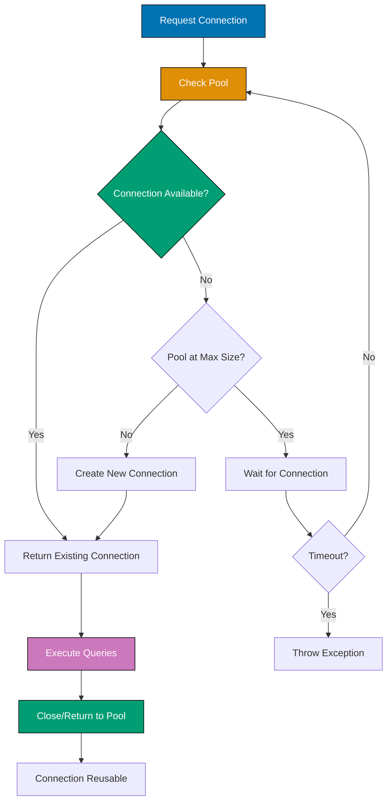

## Problem

Database integration in Java applications requires managing connections, handling transactions, and mapping between object-oriented code and relational data. Poor database handling leads to connection leaks, transaction inconsistencies, and performance bottlenecks.

```java
// Problematic approach - connection leak
Connection conn = DriverManager.getConnection(url, user, password);
Statement stmt = conn.createStatement();
ResultSet rs = stmt.executeQuery("SELECT * FROM users");
// Connection never closed!
```

This guide shows practical techniques for robust database integration in Java applications.

## Solution

### 1. Use Connection Pooling (HikariCP)

Connection pooling reuses database connections, dramatically improving performance.

**Setup** (Maven dependency):

```xml
<dependency>
    <groupId>com.zaxxer</groupId>
    <artifactId>HikariCP</artifactId>
    <version>5.1.0</version>
</dependency>
<dependency>
    <groupId>org.postgresql</groupId>
    <artifactId>postgresql</artifactId>
    <version>42.7.1</version>
</dependency>
```

**HikariCP Configuration**:

```java
import com.zaxxer.hikari.HikariConfig;
import com.zaxxer.hikari.HikariDataSource;
import javax.sql.DataSource;

public class DatabaseConfig {
    private static HikariDataSource dataSource;

    public static DataSource getDataSource() {
        if (dataSource == null) {
            HikariConfig config = new HikariConfig();
            config.setJdbcUrl("jdbc:postgresql://localhost:5432/mydb");
            config.setUsername("user");
            config.setPassword("password");

            // Connection pool settings
            config.setMaximumPoolSize(10);
            config.setMinimumIdle(5);
            config.setConnectionTimeout(30000); // 30 seconds
            config.setIdleTimeout(600000); // 10 minutes
            config.setMaxLifetime(1800000); // 30 minutes

            // Performance tuning
            config.setAutoCommit(false); // Manual transaction control
            config.addDataSourceProperty("cachePrepStmts", "true");
            config.addDataSourceProperty("prepStmtCacheSize", "250");
            config.addDataSourceProperty("prepStmtCacheSqlLimit", "2048");

            dataSource = new HikariDataSource(config);
        }
        return dataSource;
    }

    public static void close() {
        if (dataSource != null) {
            dataSource.close();
        }
    }
}
```

**Usage with try-with-resources**:

```java
import java.sql.Connection;
import java.sql.PreparedStatement;
import java.sql.ResultSet;
import java.util.ArrayList;
import java.util.List;

public class UserRepository {
    private final DataSource dataSource;

    public UserRepository(DataSource dataSource) {
        this.dataSource = dataSource;
    }

    public List<User> findAll() throws SQLException {
        String sql = "SELECT id, username, email FROM users";
        List<User> users = new ArrayList<>();

        try (Connection conn = dataSource.getConnection();
             PreparedStatement stmt = conn.prepareStatement(sql);
             ResultSet rs = stmt.executeQuery()) {

            while (rs.next()) {
                users.add(new User(
                    rs.getLong("id"),
                    rs.getString("username"),
                    rs.getString("email")
                ));
            }
        }
        return users;
    }

    public User findById(long id) throws SQLException {
        String sql = "SELECT id, username, email FROM users WHERE id = ?";

        try (Connection conn = dataSource.getConnection();
             PreparedStatement stmt = conn.prepareStatement(sql)) {

            stmt.setLong(1, id);

            try (ResultSet rs = stmt.executeQuery()) {
                if (rs.next()) {
                    return new User(
                        rs.getLong("id"),
                        rs.getString("username"),
                        rs.getString("email")
                    );
                }
            }
        }
        return null;
    }

    public void save(User user) throws SQLException {
        String sql = "INSERT INTO users (username, email) VALUES (?, ?)";

        try (Connection conn = dataSource.getConnection();
             PreparedStatement stmt = conn.prepareStatement(sql,
                 Statement.RETURN_GENERATED_KEYS)) {

            stmt.setString(1, user.getUsername());
            stmt.setString(2, user.getEmail());

            int affectedRows = stmt.executeUpdate();
            if (affectedRows == 0) {
                throw new SQLException("Creating user failed, no rows affected.");
            }

            try (ResultSet generatedKeys = stmt.getGeneratedKeys()) {
                if (generatedKeys.next()) {
                    user.setId(generatedKeys.getLong(1));
                }
            }
        }
    }
}
```

### 2. Transaction Management

Handle transactions explicitly to maintain data consistency.

**Manual transaction control**:

```java
import java.sql.Connection;
import java.sql.SQLException;

public class TransactionService {
    private final DataSource dataSource;

    public TransactionService(DataSource dataSource) {
        this.dataSource = dataSource;
    }

    public void transferFunds(long fromAccountId, long toAccountId,
                             double amount) throws SQLException {
        try (Connection conn = dataSource.getConnection()) {
            conn.setAutoCommit(false); // Start transaction

            try {
                // Debit from source account
                String debitSql = "UPDATE accounts SET balance = balance - ? " +
                                 "WHERE id = ? AND balance >= ?";
                try (PreparedStatement stmt = conn.prepareStatement(debitSql)) {
                    stmt.setDouble(1, amount);
                    stmt.setLong(2, fromAccountId);
                    stmt.setDouble(3, amount);

                    int updated = stmt.executeUpdate();
                    if (updated == 0) {
                        throw new SQLException("Insufficient funds");
                    }
                }

                // Credit to destination account
                String creditSql = "UPDATE accounts SET balance = balance + ? " +
                                  "WHERE id = ?";
                try (PreparedStatement stmt = conn.prepareStatement(creditSql)) {
                    stmt.setDouble(1, amount);
                    stmt.setLong(2, toAccountId);
                    stmt.executeUpdate();
                }

                conn.commit(); // Commit transaction
            } catch (SQLException e) {
                conn.rollback(); // Rollback on error
                throw e;
            }
        }
    }
}
```

### 3. JPA/Hibernate ORM

Use JPA for object-relational mapping to reduce boilerplate SQL code.

**Setup** (Maven dependencies):

```xml
<dependency>
    <groupId>org.hibernate.orm</groupId>
    <artifactId>hibernate-core</artifactId>
    <version>6.4.1.Final</version>
</dependency>
<dependency>
    <groupId>jakarta.persistence</groupId>
    <artifactId>jakarta.persistence-api</artifactId>
    <version>3.1.0</version>
</dependency>
```

**Entity definition**:

```java
import jakarta.persistence.*;
import java.time.LocalDateTime;

@Entity
@Table(name = "users")
public class User {
    @Id
    @GeneratedValue(strategy = GenerationType.IDENTITY)
    private Long id;

    @Column(nullable = false, unique = true, length = 50)
    private String username;

    @Column(nullable = false, unique = true, length = 100)
    private String email;

    @Column(name = "created_at")
    private LocalDateTime createdAt;

    @OneToMany(mappedBy = "user", cascade = CascadeType.ALL,
               orphanRemoval = true, fetch = FetchType.LAZY)
    private List<Post> posts = new ArrayList<>();

    // Lifecycle callback
    @PrePersist
    protected void onCreate() {
        createdAt = LocalDateTime.now();
    }

    // Constructors, getters, setters
    public User() {}

    public User(String username, String email) {
        this.username = username;
        this.email = email;
    }

    // Getters and setters omitted for brevity
}

@Entity
@Table(name = "posts")
public class Post {
    @Id
    @GeneratedValue(strategy = GenerationType.IDENTITY)
    private Long id;

    @Column(nullable = false)
    private String title;

    @Column(columnDefinition = "TEXT")
    private String content;

    @ManyToOne(fetch = FetchType.LAZY)
    @JoinColumn(name = "user_id", nullable = false)
    private User user;

    // Constructors, getters, setters
}
```

**EntityManager usage**:

```java
import jakarta.persistence.*;
import java.util.List;

public class UserJpaRepository {
    private final EntityManagerFactory emf;

    public UserJpaRepository(EntityManagerFactory emf) {
        this.emf = emf;
    }

    public void save(User user) {
        EntityManager em = emf.createEntityManager();
        EntityTransaction tx = em.getTransaction();

        try {
            tx.begin();
            em.persist(user);
            tx.commit();
        } catch (Exception e) {
            if (tx.isActive()) {
                tx.rollback();
            }
            throw e;
        } finally {
            em.close();
        }
    }

    public User findById(Long id) {
        EntityManager em = emf.createEntityManager();
        try {
            return em.find(User.class, id);
        } finally {
            em.close();
        }
    }

    public List<User> findByUsername(String username) {
        EntityManager em = emf.createEntityManager();
        try {
            TypedQuery<User> query = em.createQuery(
                "SELECT u FROM User u WHERE u.username = :username",
                User.class
            );
            query.setParameter("username", username);
            return query.getResultList();
        } finally {
            em.close();
        }
    }

    public void update(User user) {
        EntityManager em = emf.createEntityManager();
        EntityTransaction tx = em.getTransaction();

        try {
            tx.begin();
            em.merge(user);
            tx.commit();
        } catch (Exception e) {
            if (tx.isActive()) {
                tx.rollback();
            }
            throw e;
        } finally {
            em.close();
        }
    }

    public void delete(Long id) {
        EntityManager em = emf.createEntityManager();
        EntityTransaction tx = em.getTransaction();

        try {
            tx.begin();
            User user = em.find(User.class, id);
            if (user != null) {
                em.remove(user);
            }
            tx.commit();
        } catch (Exception e) {
            if (tx.isActive()) {
                tx.rollback();
            }
            throw e;
        } finally {
            em.close();
        }
    }
}
```

**persistence.xml configuration**:

```xml
<?xml version="1.0" encoding="UTF-8"?>
<persistence xmlns="https://jakarta.ee/xml/ns/persistence"
             xmlns:xsi="http://www.w3.org/2001/XMLSchema-instance"
             xsi:schemaLocation="https://jakarta.ee/xml/ns/persistence
                                 https://jakarta.ee/xml/ns/persistence/persistence_3_0.xsd"
             version="3.0">
    <persistence-unit name="myapp-unit" transaction-type="RESOURCE_LOCAL">
        <provider>org.hibernate.jpa.HibernatePersistenceProvider</provider>

        <class>com.example.User</class>
        <class>com.example.Post</class>

        <properties>
            <property name="jakarta.persistence.jdbc.url"
                      value="jdbc:postgresql://localhost:5432/mydb"/>
            <property name="jakarta.persistence.jdbc.user" value="user"/>
            <property name="jakarta.persistence.jdbc.password" value="password"/>
            <property name="jakarta.persistence.jdbc.driver"
                      value="org.postgresql.Driver"/>

            <property name="hibernate.dialect"
                      value="org.hibernate.dialect.PostgreSQLDialect"/>
            <property name="hibernate.hbm2ddl.auto" value="validate"/>
            <property name="hibernate.show_sql" value="true"/>
            <property name="hibernate.format_sql" value="true"/>
        </properties>
    </persistence-unit>
</persistence>
```

## How It Works

### Database Connection Lifecycle



**Key concepts**:

1. **Connection Pooling**: Maintains a pool of reusable database connections (HikariCP is fastest)
2. **Prepared Statements**: Prevent SQL injection and improve performance through statement caching
3. **Transactions**: ACID guarantees ensure data consistency (Atomicity, Consistency, Isolation, Durability)
4. **ORM Mapping**: JPA/Hibernate maps Java objects to database tables, reducing boilerplate SQL

### Transaction Isolation Levels

Configure isolation based on consistency requirements:

- **READ_UNCOMMITTED**: Lowest isolation, allows dirty reads
- **READ_COMMITTED**: Default in PostgreSQL, prevents dirty reads
- **REPEATABLE_READ**: Prevents non-repeatable reads
- **SERIALIZABLE**: Highest isolation, prevents phantom reads

```java
// Set isolation level
conn.setTransactionIsolation(Connection.TRANSACTION_READ_COMMITTED);
```

## Variations

### Using Spring Data JPA

Spring Data JPA eliminates repository boilerplate:

```java
import org.springframework.data.jpa.repository.JpaRepository;
import org.springframework.data.jpa.repository.Query;
import org.springframework.data.repository.query.Param;
import java.util.List;

public interface UserRepository extends JpaRepository<User, Long> {
    // Method name query derivation
    List<User> findByUsername(String username);
    List<User> findByEmailContaining(String email);

    // Custom JPQL query
    @Query("SELECT u FROM User u WHERE u.createdAt > :date")
    List<User> findRecentUsers(@Param("date") LocalDateTime date);

    // Native SQL query
    @Query(value = "SELECT * FROM users WHERE email LIKE %:domain",
           nativeQuery = true)
    List<User> findByEmailDomain(@Param("domain") String domain);
}

// Usage (Spring auto-implements repository)
@Service
public class UserService {
    private final UserRepository userRepository;

    public UserService(UserRepository userRepository) {
        this.userRepository = userRepository;
    }

    public List<User> getRecentUsers() {
        LocalDateTime yesterday = LocalDateTime.now().minusDays(1);
        return userRepository.findRecentUsers(yesterday);
    }
}
```

### Batch Operations

Improve performance with batch inserts/updates:

```java
public void batchInsert(List<User> users) throws SQLException {
    String sql = "INSERT INTO users (username, email) VALUES (?, ?)";

    try (Connection conn = dataSource.getConnection();
         PreparedStatement stmt = conn.prepareStatement(sql)) {

        conn.setAutoCommit(false);

        for (User user : users) {
            stmt.setString(1, user.getUsername());
            stmt.setString(2, user.getEmail());
            stmt.addBatch();

            // Execute batch every 100 records
            if (users.indexOf(user) % 100 == 0) {
                stmt.executeBatch();
            }
        }

        stmt.executeBatch(); // Execute remaining
        conn.commit();
    }
}
```

### Pagination with JPA

Handle large result sets efficiently:

```java
public List<User> findUsers(int page, int pageSize) {
    EntityManager em = emf.createEntityManager();
    try {
        TypedQuery<User> query = em.createQuery(
            "SELECT u FROM User u ORDER BY u.id",
            User.class
        );
        query.setFirstResult(page * pageSize);
        query.setMaxResults(pageSize);
        return query.getResultList();
    } finally {
        em.close();
    }
}
```

## Common Pitfalls

**Pitfall 1: Connection Leaks**

Always use try-with-resources to ensure connection closure:

```java
// Bad: Connection leak
Connection conn = dataSource.getConnection();
PreparedStatement stmt = conn.prepareStatement(sql);
// If exception occurs, connection never closed

// Good: Auto-close with try-with-resources
try (Connection conn = dataSource.getConnection();
     PreparedStatement stmt = conn.prepareStatement(sql)) {
    // Connection always closed, even on exception
}
```

**Pitfall 2: SQL Injection**

Never concatenate user input into SQL:

```java
// Bad: SQL injection vulnerability
String sql = "SELECT * FROM users WHERE username = '" + username + "'";
// Attacker input: ' OR '1'='1

// Good: Prepared statement with parameters
String sql = "SELECT * FROM users WHERE username = ?";
PreparedStatement stmt = conn.prepareStatement(sql);
stmt.setString(1, username); // Safe from injection
```

**Pitfall 3: N+1 Query Problem**

Lazy loading can cause performance issues:

```java
// Bad: N+1 queries (1 query for users + N queries for each user's posts)
List<User> users = em.createQuery("SELECT u FROM User u", User.class)
    .getResultList();
for (User user : users) {
    System.out.println(user.getPosts().size()); // Triggers query per user
}

// Good: Fetch join to load all data in one query
List<User> users = em.createQuery(
    "SELECT u FROM User u LEFT JOIN FETCH u.posts",
    User.class
).getResultList();
```

**Pitfall 4: Ignoring Transaction Boundaries**

Define clear transaction boundaries:

```java
// Bad: Multiple database operations without transaction
userRepository.save(user);
postRepository.save(post); // If this fails, user still saved

// Good: Single transaction for related operations
@Transactional
public void createUserWithPost(User user, Post post) {
    userRepository.save(user);
    post.setUser(user);
    postRepository.save(post);
    // Both saved or both rolled back
}
```

## Related Patterns

**Related Tutorial**: See [Intermediate Tutorial - Database Integration](/en/learn/software-engineering/programming-language/python/tutorials/intermediate#database-integration) for database fundamentals and [Beginner Tutorial - JDBC Basics](/en/learn/software-engineering/programming-language/python/tutorials/beginner#jdbc-basics) for JDBC introduction.

**Related How-To**: See [Handle Files and Resources](/en/learn/software-engineering/programming-language/java/how-to/handle-files-and-resources) for resource management patterns and [Exception Handling](/en/learn/software-engineering/programming-language/java/how-to/exception-handling) for database exception handling.

**Related Cookbook**: See Cookbook recipes "Database Connection Pool Setup", "Transaction Management Patterns", and "JPA Query Optimization" for copy-paste ready database patterns.

**Related Explanation**: See [Best Practices - Database](/en/learn/software-engineering/programming-language/python/explanation/best-practices#database) for database design principles.

## Further Reading

- [HikariCP GitHub](https://github.com/brettwooldridge/HikariCP) - Fastest connection pool library
- [Hibernate Documentation](https://hibernate.org/orm/documentation/6.4/) - Official Hibernate ORM guide
- [JPA Specification](https://jakarta.ee/specifications/persistence/3.1/) - Jakarta Persistence API specification
- [Spring Data JPA Reference](https://docs.spring.io/spring-data/jpa/reference/) - Spring Data JPA documentation
