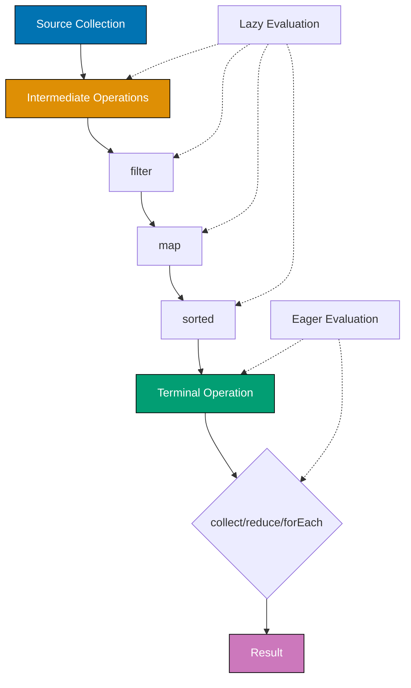

## Problem

Processing collections with traditional loops leads to verbose, imperative code that's hard to read and parallelize. Iterator-based approaches mix business logic with iteration mechanics.

```java
// Problematic approach - imperative loops
List<String> names = new ArrayList<>();
for (User user : users) {
    if (user.getAge() >= 18) {
        names.add(user.getName().toUpperCase());
    }
}
Collections.sort(names);
```

This guide shows practical techniques for leveraging Java Stream API for cleaner, more efficient data processing.

## Solution

### 1. Basic Stream Operations

Transform collections using declarative stream operations.

**Filtering, mapping, and collecting**:

```java
import java.util.stream.Collectors;
import java.util.List;

public class StreamBasics {
    public static void main(String[] args) {
        List<User> users = List.of(
            new User("Alice", 25, "alice@example.com"),
            new User("Bob", 17, "bob@example.com"),
            new User("Charlie", 30, "charlie@example.com"),
            new User("Diana", 22, "diana@example.com")
        );

        // Filter, map, sort, collect
        List<String> adultNames = users.stream()
            .filter(user -> user.getAge() >= 18)
            .map(User::getName)
            .map(String::toUpperCase)
            .sorted()
            .collect(Collectors.toList());

        System.out.println(adultNames); // [ALICE, CHARLIE, DIANA]

        // Group by age range
        Map<String, List<User>> ageGroups = users.stream()
            .collect(Collectors.groupingBy(user -> {
                if (user.getAge() < 20) return "teens";
                if (user.getAge() < 30) return "twenties";
                return "thirties+";
            }));

        // Partition by condition
        Map<Boolean, List<User>> partitioned = users.stream()
            .collect(Collectors.partitioningBy(user -> user.getAge() >= 18));

        List<User> adults = partitioned.get(true);
        List<User> minors = partitioned.get(false);
    }
}
```

### 2. Advanced Collectors

Create custom collectors for complex aggregations.

**Built-in collectors**:

```java
import java.util.stream.Collectors;
import java.util.*;

public class CollectorExamples {
    public static void demonstrateCollectors(List<Product> products) {
        // Joining strings
        String names = products.stream()
            .map(Product::getName)
            .collect(Collectors.joining(", ", "[", "]"));
        // Result: "[Product1, Product2, Product3]"

        // Counting
        long count = products.stream()
            .filter(p -> p.getPrice() > 100)
            .collect(Collectors.counting());

        // Summing
        double totalPrice = products.stream()
            .collect(Collectors.summingDouble(Product::getPrice));

        // Averaging
        OptionalDouble avgPrice = products.stream()
            .mapToDouble(Product::getPrice)
            .average();

        // Statistics
        DoubleSummaryStatistics stats = products.stream()
            .collect(Collectors.summarizingDouble(Product::getPrice));
        System.out.println("Average: " + stats.getAverage());
        System.out.println("Max: " + stats.getMax());
        System.out.println("Min: " + stats.getMin());

        // Group by category and count
        Map<String, Long> categoryCount = products.stream()
            .collect(Collectors.groupingBy(
                Product::getCategory,
                Collectors.counting()
            ));

        // Group by category and average price
        Map<String, Double> categoryAvgPrice = products.stream()
            .collect(Collectors.groupingBy(
                Product::getCategory,
                Collectors.averagingDouble(Product::getPrice)
            ));

        // Group by category and collect to set
        Map<String, Set<String>> categoryNames = products.stream()
            .collect(Collectors.groupingBy(
                Product::getCategory,
                Collectors.mapping(Product::getName, Collectors.toSet())
            ));
    }
}
```

**Custom collector**:

```java
import java.util.stream.Collector;
import java.util.*;

public class CustomCollectors {
    // Custom collector to build comma-separated string with stats
    public static Collector<Product, ?, ProductSummary> toProductSummary() {
        return Collector.of(
            ProductSummary::new,                    // Supplier
            ProductSummary::add,                    // Accumulator
            ProductSummary::combine,                // Combiner
            Function.identity()                     // Finisher
        );
    }

    public static class ProductSummary {
        private int count = 0;
        private double totalPrice = 0;
        private List<String> names = new ArrayList<>();

        public void add(Product product) {
            count++;
            totalPrice += product.getPrice();
            names.add(product.getName());
        }

        public ProductSummary combine(ProductSummary other) {
            count += other.count;
            totalPrice += other.totalPrice;
            names.addAll(other.names);
            return this;
        }

        public int getCount() { return count; }
        public double getAveragePrice() { return totalPrice / count; }
        public List<String> getNames() { return names; }

        @Override
        public String toString() {
            return String.format("Products: %d, Avg Price: %.2f, Names: %s",
                count, getAveragePrice(), String.join(", ", names));
        }
    }

    public static void main(String[] args) {
        List<Product> products = List.of(
            new Product("Laptop", 999.99, "Electronics"),
            new Product("Mouse", 29.99, "Electronics"),
            new Product("Keyboard", 79.99, "Electronics")
        );

        ProductSummary summary = products.stream()
            .collect(toProductSummary());

        System.out.println(summary);
        // Products: 3, Avg Price: 369.99, Names: Laptop, Mouse, Keyboard
    }
}
```

### 3. Parallel Streams

Leverage parallel processing for CPU-intensive operations.

**When to use parallel streams**:

```java
import java.util.stream.IntStream;
import java.util.concurrent.ForkJoinPool;

public class ParallelStreamExamples {
    public static void main(String[] args) {
        // Sequential stream
        long startSeq = System.currentTimeMillis();
        long sumSeq = IntStream.range(1, 10_000_000)
            .map(ParallelStreamExamples::expensiveOperation)
            .sum();
        long endSeq = System.currentTimeMillis();
        System.out.println("Sequential: " + (endSeq - startSeq) + "ms");

        // Parallel stream
        long startPar = System.currentTimeMillis();
        long sumPar = IntStream.range(1, 10_000_000)
            .parallel()
            .map(ParallelStreamExamples::expensiveOperation)
            .sum();
        long endPar = System.currentTimeMillis();
        System.out.println("Parallel: " + (endPar - startPar) + "ms");

        // Custom thread pool for parallel streams
        ForkJoinPool customPool = new ForkJoinPool(4);
        try {
            long sumCustom = customPool.submit(() ->
                IntStream.range(1, 10_000_000)
                    .parallel()
                    .map(ParallelStreamExamples::expensiveOperation)
                    .sum()
            ).get();
        } catch (Exception e) {
            e.printStackTrace();
        } finally {
            customPool.shutdown();
        }
    }

    private static int expensiveOperation(int n) {
        // Simulate expensive computation
        double result = 0;
        for (int i = 0; i < 100; i++) {
            result += Math.sqrt(n);
        }
        return n;
    }

    // Parallel reduction with combiner
    public static int parallelSum(List<Integer> numbers) {
        return numbers.parallelStream()
            .reduce(
                0,                          // Identity
                Integer::sum,               // Accumulator
                Integer::sum                // Combiner (for parallel)
            );
    }
}
```

### 4. Lazy Evaluation and Performance

Understand stream pipeline optimization.

**Lazy evaluation example**:

```java
import java.util.stream.Stream;

public class LazyEvaluationDemo {
    public static void main(String[] args) {
        List<Integer> numbers = List.of(1, 2, 3, 4, 5, 6, 7, 8, 9, 10);

        // Lazy evaluation - intermediate operations not executed until terminal
        Stream<Integer> stream = numbers.stream()
            .filter(n -> {
                System.out.println("Filtering: " + n);
                return n % 2 == 0;
            })
            .map(n -> {
                System.out.println("Mapping: " + n);
                return n * 2;
            });

        System.out.println("Stream created, but no output yet");

        // Terminal operation triggers evaluation
        List<Integer> result = stream.collect(Collectors.toList());
        System.out.println("Result: " + result);

        // Short-circuiting operations
        Optional<Integer> first = numbers.stream()
            .filter(n -> {
                System.out.println("Checking: " + n);
                return n > 5;
            })
            .findFirst(); // Stops after finding first match
        // Only prints: Checking: 1, 2, 3, 4, 5, 6
    }

    // Efficient filtering - order matters
    public static long countExpensiveFiltered(List<String> items) {
        // Good: Cheap filter first
        return items.stream()
            .filter(s -> s.length() > 5)        // Cheap operation first
            .filter(s -> expensiveCheck(s))     // Expensive operation last
            .count();

        // Bad: Expensive filter first
        // items.stream()
        //     .filter(s -> expensiveCheck(s))  // Expensive on all items
        //     .filter(s -> s.length() > 5)
        //     .count();
    }

    private static boolean expensiveCheck(String s) {
        // Simulate expensive operation
        try { Thread.sleep(10); } catch (InterruptedException e) {}
        return s.contains("important");
    }
}
```

## How It Works

### Stream Processing Pipeline



**Key concepts**:

1. **Lazy Evaluation**: Intermediate operations (filter, map, sorted) are not executed until terminal operation is called
2. **Short-Circuiting**: Operations like findFirst, anyMatch stop processing once result is determined
3. **Stateless vs Stateful**: filter/map are stateless, sorted/distinct are stateful (require seeing all elements)
4. **Parallel Processing**: Stream.parallel() splits work across multiple threads using ForkJoinPool

### Stream Performance Characteristics

**Intermediate Operations**:

- **Stateless**: filter, map, flatMap, peek (low memory overhead)
- **Stateful**: sorted, distinct, limit, skip (may buffer elements)

**Terminal Operations**:

- **Short-circuiting**: findFirst, findAny, anyMatch, allMatch, noneMatch
- **Non-short-circuiting**: collect, reduce, forEach, count

## Variations

### Primitive Streams

Use specialized streams for better performance with primitives:

```java
// IntStream, LongStream, DoubleStream - avoid boxing overhead
IntStream.range(1, 100)
    .filter(n -> n % 2 == 0)
    .map(n -> n * n)
    .sum();

// Regular Stream<Integer> would box/unbox repeatedly (slower)
Stream.of(1, 2, 3, 4, 5)
    .mapToInt(Integer::intValue)    // Convert to IntStream
    .average()
    .ifPresent(System.out::println);
```

### FlatMap for Nested Structures

Flatten nested collections:

```java
List<List<Integer>> nestedLists = List.of(
    List.of(1, 2, 3),
    List.of(4, 5),
    List.of(6, 7, 8, 9)
);

List<Integer> flattened = nestedLists.stream()
    .flatMap(List::stream)
    .collect(Collectors.toList());
// Result: [1, 2, 3, 4, 5, 6, 7, 8, 9]

// FlatMap with Optional
List<Optional<String>> optionals = List.of(
    Optional.of("A"),
    Optional.empty(),
    Optional.of("B"),
    Optional.empty(),
    Optional.of("C")
);

List<String> values = optionals.stream()
    .flatMap(Optional::stream)
    .collect(Collectors.toList());
// Result: [A, B, C]
```

### Teeing Collector (Java 12+)

Process stream with two collectors simultaneously:

```java
import java.util.stream.Collectors;

record MinMax(Integer min, Integer max) {}

MinMax minMax = numbers.stream()
    .collect(Collectors.teeing(
        Collectors.minBy(Integer::compare),
        Collectors.maxBy(Integer::compare),
        (min, max) -> new MinMax(min.orElse(null), max.orElse(null))
    ));
```

## Common Pitfalls

**Pitfall 1: Reusing Streams**

Streams can only be consumed once:

```java
// Bad: Reusing stream
Stream<String> stream = list.stream();
long count = stream.count();
List<String> items = stream.collect(Collectors.toList()); // IllegalStateException

// Good: Create new stream
long count = list.stream().count();
List<String> items = list.stream().collect(Collectors.toList());
```

**Pitfall 2: Parallel Stream with Stateful Operations**

Avoid shared mutable state in parallel streams:

```java
// Bad: Shared mutable state
List<Integer> results = new ArrayList<>();
IntStream.range(1, 100)
    .parallel()
    .forEach(results::add); // Race condition! Results may be incomplete

// Good: Collect to list
List<Integer> results = IntStream.range(1, 100)
    .parallel()
    .boxed()
    .collect(Collectors.toList());
```

**Pitfall 3: Wrong Order of Operations**

Order intermediate operations efficiently:

```java
// Bad: Expensive operation first
list.stream()
    .map(this::expensiveTransform)  // Transforms all elements
    .filter(s -> s.length() > 10)   // Then filters
    .collect(Collectors.toList());

// Good: Filter first
list.stream()
    .filter(s -> s.length() > 10)   // Filters first (fewer elements)
    .map(this::expensiveTransform)  // Transforms only filtered elements
    .collect(Collectors.toList());
```

**Pitfall 4: Overusing Parallel Streams**

Parallel streams have overhead - not always faster:

```java
// Bad: Parallel for small collections
List<Integer> small = List.of(1, 2, 3, 4, 5);
small.parallelStream().map(n -> n * 2).collect(Collectors.toList());
// Sequential would be faster due to parallelization overhead

// Good: Parallel for large, CPU-intensive operations
List<Integer> large = IntStream.range(1, 1_000_000).boxed().toList();
large.parallelStream()
    .filter(this::cpuIntensiveCheck)
    .collect(Collectors.toList());
```

## Related Patterns

**Related Tutorial**: See [Intermediate Tutorial - Functional Programming](/en/learn/software-engineering/programming-language/python/tutorials/intermediate#functional-programming) for functional programming basics and [Advanced Tutorial - Stream API Deep Dive](/en/learn/software-engineering/programming-language/python/tutorials/advanced#stream-api) for advanced stream patterns.

**Related How-To**: See [Optimize Performance](/en/learn/software-engineering/programming-language/java/how-to/optimize-performance) for stream performance tuning and [Use Collections Effectively](/en/learn/software-engineering/programming-language/java/how-to/use-collections-effectively) for collection best practices.

**Related Cookbook**: See Cookbook recipes "Stream Processing Patterns", "Custom Collectors", and "Parallel Stream Optimization" for copy-paste ready stream implementations.

**Related Explanation**: See [Best Practices - Functional Programming](/en/learn/software-engineering/programming-language/python/explanation/best-practices#functional-programming) for functional programming principles.

## Further Reading

- [Stream API Javadoc](https://docs.oracle.com/en/java/javase/21/docs/api/java.base/java/util/stream/Stream.html) - Official Stream API documentation
- [Effective Java (Item 45-48)](https://www.oreilly.com/library/view/effective-java-3rd/9780134686097/) - Stream usage best practices
- [Java Stream Performance](https://www.baeldung.com/java-stream-performance) - Performance considerations
- [Parallel Streams Guide](https://docs.oracle.com/en/java/javase/21/core/parallel-streams.html) - Official parallel streams guide
