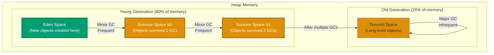

## created: 2025-12-04

# Advanced Java - Expert Mastery

Want to understand how Java actually works under the hood? This tutorial covers the deep internals of Java, advanced concurrency patterns, reflection, bytecode analysis, and optimization techniques used by top-tier developers.

## What You'll Achieve

By the end of this tutorial, you will:

- ✅ Understand JVM architecture and how it executes code
- ✅ Master garbage collection and memory management
- ✅ Implement advanced concurrency patterns
- ✅ Use reflection for dynamic code behavior
- ✅ Work with annotations and create custom annotations
- ✅ Profile and optimize JVM performance
- ✅ Analyze and understand bytecode
- ✅ Design systems at scale
- ✅ Use sealed classes and pattern matching
- ✅ Master advanced Maven and Gradle
- ✅ Know cutting-edge Java features

## Prerequisites

- Completed [Intermediate Java](intermediate) - Comfortable with design patterns, concurrency basics
- Or equivalent professional experience with production Java

## Learning Path Overview

This tutorial covers **85-95% of Java knowledge** for expert-level development. It focuses on internals, optimization, and advanced architectures.

---

## Part 1: JVM Architecture and Internals

### 1.1 JVM Memory Structure

The JVM divides memory into several regions:

```
Heap
├── Young Generation (80% of memory)
│   ├── Eden Space
│   ├── Survivor Space S0
│   └── Survivor Space S1
└── Old Generation (20% of memory)

Stack (per thread)
├── Method frames
├── Local variables
└── Operand stack

Metaspace (class definitions, constants)
```

### 1.2 Garbage Collection

**Garbage Collection** automatically manages memory, freeing unreferenced objects.

#### Understanding Generational GC

Java uses **generational garbage collection** - most objects die young, so the young generation is collected frequently:



**How it works**:

1. New objects are created in **Eden Space**
2. After a **Minor GC**, survivors move to **S0**
3. After another Minor GC, survivors move to **S1**
4. Objects that survive multiple GCs move to **Old Generation**
5. **Major GC** (full collection) is rare, affecting old generation

#### Example: GC Tuning

```java
// Run with GC settings
// java -Xmx2G -Xms2G -XX:+UseG1GC MyApp

// Monitor GC
// jstat -gc -h20 pid 1000  // Every 1 second, 20 line header

public class GCMonitoring {
    public static void main(String[] args) {
        Runtime runtime = Runtime.getRuntime();

        long beforeGC = runtime.totalMemory() - runtime.freeMemory();

        // Create objects
        for (int i = 0; i < 1000000; i++) {
            new String("object " + i);
        }

        long afterGC = runtime.totalMemory() - runtime.freeMemory();

        System.out.println("Memory used: " + (beforeGC / 1024 / 1024) + " MB");
        System.out.println("After objects: " + (afterGC / 1024 / 1024) + " MB");

        System.gc();  // Request garbage collection (not guaranteed!)

        long afterForceGC = runtime.totalMemory() - runtime.freeMemory();
        System.out.println("After GC: " + (afterForceGC / 1024 / 1024) + " MB");
    }
}
```

**GC Algorithms**:

- **Serial GC** - Single thread, stop-the-world (small apps)
- **Parallel GC** - Multiple threads (server, batch)
- **G1GC** - Generational, low pause time (large heaps, default in Java 9+)
- **ZGC** - Ultra-low latency (<10ms) (Java 11+)

### 1.3 Class Loading

The **ClassLoader** hierarchy loads classes at runtime.

```
Bootstrap ClassLoader (JDK internals)
    ↓
Platform ClassLoader (extensions)
    ↓
Application ClassLoader (your code)
    ↓
Custom ClassLoaders
```

#### Example: Custom Class Loader

```java
import java.io.*;

public class CustomClassLoader extends ClassLoader {
    private String classPath;

    public CustomClassLoader(String classPath) {
        this.classPath = classPath;
    }

    @Override
    protected Class<?> findClass(String name) throws ClassNotFoundException {
        try {
            String filename = classPath + "/" + name.replace('.', '/') + ".class";
            FileInputStream fis = new FileInputStream(filename);
            byte[] data = new byte[fis.available()];
            fis.read(data);
            fis.close();

            return defineClass(name, data, 0, data.length);
        } catch (IOException e) {
            throw new ClassNotFoundException(name, e);
        }
    }
}
```

---

## Part 2: Reflection and Annotations

### 2.1 Reflection API

**Reflection** allows inspecting and manipulating classes at runtime.

#### Example: Reflection

```java
import java.lang.reflect.*;

public class ReflectionExample {
    public static void main(String[] args) throws Exception {
        // Get class
        Class<?> clazz = Class.forName("java.util.ArrayList");

        System.out.println("Class: " + clazz.getName());
        System.out.println("Superclass: " + clazz.getSuperclass());

        // Get constructors
        Constructor<?>[] constructors = clazz.getDeclaredConstructors();
        for (Constructor<?> c : constructors) {
            System.out.println("Constructor: " + c);
        }

        // Get methods
        Method[] methods = clazz.getDeclaredMethods();
        for (Method m : methods) {
            if (m.getName().equals("add")) {
                System.out.println("Method: " + m);
            }
        }

        // Create instance and invoke method
        Object list = clazz.newInstance();  // Deprecated, use constructor instead

        Method addMethod = clazz.getMethod("add", Object.class);
        addMethod.invoke(list, "Hello");

        Method getMethod = clazz.getMethod("get", int.class);
        Object element = getMethod.invoke(list, 0);
        System.out.println("Element: " + element);

        // Get fields
        Field[] fields = clazz.getDeclaredFields();
        for (Field f : fields) {
            System.out.println("Field: " + f.getName());
        }
    }
}
```

### 2.2 Creating and Using Annotations

**Annotations** provide metadata about code without affecting execution.

#### Example: Custom Annotation

```java
import java.lang.annotation.*;

// Define annotation
@Retention(RetentionPolicy.RUNTIME)
@Target(ElementType.METHOD)
public @interface Benchmark {
    String name() default "Method";
}

// Use annotation
public class BenchmarkExample {
    @Benchmark(name = "Fast Operation")
    public void fastMethod() {
        // Do something
    }

    @Benchmark(name = "Slow Operation")
    public void slowMethod() throws InterruptedException {
        Thread.sleep(100);
    }

    // Processor that reads annotations
    public static void runWithBenchmark(Object obj) throws Exception {
        Method[] methods = obj.getClass().getDeclaredMethods();

        for (Method method : methods) {
            if (method.isAnnotationPresent(Benchmark.class)) {
                Benchmark benchmark = method.getAnnotation(Benchmark.class);

                long start = System.nanoTime();
                method.invoke(obj);
                long end = System.nanoTime();

                long duration = (end - start) / 1_000_000;  // Convert to ms
                System.out.println(benchmark.name() + ": " + duration + "ms");
            }
        }
    }

    public static void main(String[] args) throws Exception {
        BenchmarkExample example = new BenchmarkExample();
        runWithBenchmark(example);
    }
}
```

---

## Part 3: Advanced Concurrency Patterns

### 3.1 CompletableFuture

**CompletableFuture** provides composable async operations.

#### Example: CompletableFuture

```java
import java.util.concurrent.*;

public class CompletableFutureExample {
    public static void main(String[] args) {
        // Simple async operation
        CompletableFuture<String> future1 = CompletableFuture.supplyAsync(() -> {
            try {
                Thread.sleep(1000);
            } catch (InterruptedException e) {
                Thread.currentThread().interrupt();
            }
            return "Result 1";
        });

        // Chain operations
        CompletableFuture<String> future2 = future1
            .thenApply(result -> result + " processed")
            .thenApply(String::toUpperCase);

        // Combine multiple futures
        CompletableFuture<String> future3 = CompletableFuture.supplyAsync(
            () -> "Result 2"
        );

        CompletableFuture<String> combined = future2
            .thenCombine(future3, (r1, r2) -> r1 + " + " + r2);

        // Block and get result
        String result = combined.join();
        System.out.println(result);

        // Exception handling
        CompletableFuture<String> withError = CompletableFuture.supplyAsync(() -> {
            throw new RuntimeException("Something failed");
        }).exceptionally(ex -> "Error: " + ex.getMessage());

        System.out.println(withError.join());
    }
}
```

### 3.2 Virtual Threads (Java 19+)

**Virtual Threads** provide lightweight, stackless concurrency.

#### Example: Virtual Threads

```java
// Java 21+ (finalized feature, no preview flag needed)
// Java 19-20 required --enable-preview flag

public class VirtualThreadsExample {
    public static void main(String[] args) throws Exception {
        // Old way: Platform threads (OS threads)
        // Thread thread = new Thread(() -> {});

        // New way: Virtual threads
        for (int i = 0; i < 10000; i++) {
            final int id = i;

            // Create virtual thread
            Thread vthread = Thread.ofVirtual()
                .name("vthread-" + i)
                .start(() -> {
                    System.out.println("Virtual thread " + id);
                });
        }

        // Many virtual threads can run on few platform threads
        Thread.sleep(5000);
    }
}
```

---

## Part 4: Sealed Classes and Pattern Matching

### 4.1 Sealed Classes

**Sealed classes** restrict which classes can extend them (Java 17+).

#### Example: Sealed Classes

```java
// Define sealed class - only specified classes can extend
public abstract sealed class Payment permits CreditCardPayment, PayPalPayment, CryptocurrencyPayment {
    private double amount;

    public Payment(double amount) {
        this.amount = amount;
    }

    public abstract void process();
}

public final class CreditCardPayment extends Payment {
    public CreditCardPayment(double amount) {
        super(amount);
    }

    @Override
    public void process() {
        System.out.println("Processing credit card");
    }
}

public final class PayPalPayment extends Payment {
    public PayPalPayment(double amount) {
        super(amount);
    }

    @Override
    public void process() {
        System.out.println("Processing PayPal");
    }
}

public final class CryptocurrencyPayment extends Payment {
    public CryptocurrencyPayment(double amount) {
        super(amount);
    }

    @Override
    public void process() {
        System.out.println("Processing cryptocurrency");
    }
}
```

### 4.2 Pattern Matching (Java 21+)

```java
public class PatternMatchingExample {
    public static void main(String[] args) {
        Object obj = 42;

        // Old way
        if (obj instanceof Integer) {
            int value = (Integer) obj;
            System.out.println(value);
        }

        // New way: Pattern matching
        if (obj instanceof Integer value) {
            System.out.println(value);
        }

        // Switch pattern matching
        String result = switch (obj) {
            case Integer i -> "Integer: " + i;
            case String s -> "String: " + s;
            case Double d -> "Double: " + d;
            default -> "Unknown";
        };

        System.out.println(result);
    }
}
```

---

## Part 5: Bytecode and JIT Compilation

### 5.1 Bytecode Analysis

Java source code is compiled to bytecode, not machine code.

#### Example: Viewing Bytecode

```bash
javac MyClass.java

# View bytecode
javap -c MyClass

# Output shows JVM instructions (aload, iadd, return, etc.)
```

```java
public class BytecodeExample {
    // This method
    public int add(int a, int b) {
        return a + b;
    }

    // Becomes this bytecode:
    // public int add(int, int);
    //   0: iload_1       // Load first parameter
    //   1: iload_2       // Load second parameter
    //   2: iadd          // Add them
    //   3: ireturn       // Return result
}
```

### 5.2 JIT Compilation

The **Just-In-Time (JIT)** compiler optimizes hot code at runtime.

```bash
# Enable JIT logging
java -XX:+UnlockDiagnosticVMOptions -XX:+TraceClassLoading -XX:+PrintCompilation MyApp

# Shows which methods are compiled
# Warning: intensive logging, slows execution
```

---

## Part 6: Performance Profiling and Optimization

### 6.1 Profiling with JProfiler

```bash
# Install JProfiler (commercial, 10-day trial)
# Profile CPU, memory, threading

# Free alternative: Async-profiler
java -agentpath=/path/to/libasyncProfiler.so=start,file=profile.jfr MyApp

# Analyze with JFR Viewer
```

### 6.2 JVM Flags for Optimization

```bash
# Heap sizing
java -Xms2G -Xmx2G MyApp

# G1GC configuration
java -XX:+UseG1GC -XX:MaxGCPauseMillis=200 MyApp

# Low latency (ZGC)
java -XX:+UseZGC -XX:ZCollectionInterval=120 MyApp

# Adaptive sizing
java -XX:+UseAdaptiveSizingPolicy MyApp
```

---

## Part 7: Advanced Collections and Data Structures

### 7.1 CopyOnWriteArrayList

For concurrent reads with infrequent writes:

```java
import java.util.concurrent.CopyOnWriteArrayList;

public class CopyOnWriteExample {
    public static void main(String[] args) {
        CopyOnWriteArrayList<String> list = new CopyOnWriteArrayList<>();

        // Safe for concurrent reads
        // Any write creates a new copy (expensive)
        list.add("item1");
        list.add("item2");

        // Multiple threads can read safely
        for (String item : list) {
            System.out.println(item);
        }

        // Write is expensive but safe
        list.add("item3");
    }
}
```

### 7.2 LRU Cache with LinkedHashMap

```java
import java.util.LinkedHashMap;
import java.util.Map;

public class LRUCache<K, V> extends LinkedHashMap<K, V> {
    private int capacity;

    public LRUCache(int capacity) {
        super(capacity, 0.75f, true);  // Access-order
        this.capacity = capacity;
    }

    @Override
    protected boolean removeEldestEntry(Map.Entry eldest) {
        return size() > capacity;
    }
}

// Usage
public class LRUExample {
    public static void main(String[] args) {
        LRUCache<String, String> cache = new LRUCache<>(3);

        cache.put("a", "1");
        cache.put("b", "2");
        cache.put("c", "3");

        System.out.println(cache.get("a"));  // Access "a"

        cache.put("d", "4");  // "b" is removed (least recently used)
    }
}
```

---

## Part 8: System Design at Scale

### 8.1 Microservices Architecture

```java
// Service interface
public interface UserService {
    User getUser(String id);
    void createUser(User user);
    void updateUser(User user);
    void deleteUser(String id);
}

// Service implementation
public class UserServiceImpl implements UserService {
    private UserRepository repository;
    private CacheService cache;

    @Override
    public User getUser(String id) {
        // Check cache first
        User cached = cache.get("user:" + id);
        if (cached != null) return cached;

        // Load from database
        User user = repository.findById(id);

        // Cache result
        if (user != null) {
            cache.set("user:" + id, user, 3600);  // 1 hour TTL
        }

        return user;
    }
}

// API endpoint
public class UserController {
    private UserService userService;

    public User getUser(@PathVariable String id) {
        return userService.getUser(id);
    }
}
```

### 8.2 Event-Driven Architecture

```java
// Event
public class UserCreatedEvent {
    private String userId;
    private String email;

    // Constructor, getters...
}

// Publisher
public class UserService {
    private EventPublisher eventPublisher;

    public void createUser(User user) {
        // Create user
        // ...

        // Publish event
        eventPublisher.publish(new UserCreatedEvent(user.getId(), user.getEmail()));
    }
}

// Subscriber
public class EmailNotificationService {
    @EventListener
    public void onUserCreated(UserCreatedEvent event) {
        // Send email
        emailService.send(event.getEmail(), "Welcome!");
    }
}
```

---

## Part 9: Cutting-Edge Java Features

### 9.1 Foreign Function & Memory API (Preview)

Access native code directly from Java:

```java
// Requires: --enable-preview --add-modules jdk.incubator.foreign

import java.lang.foreign.*;

public class FFMExample {
    // Call native C function
    public static void main(String[] args) {
        // This is preview API, subject to change
        // Used for calling C/C++ libraries
    }
}
```

### 9.2 Records with Sealed Hierarchies

```java
// Sealed record hierarchy
public sealed interface Result permits SuccessResult, ErrorResult {
}

public record SuccessResult(String value) implements Result {
}

public record ErrorResult(String message, Throwable cause) implements Result {
}

// Pattern matching on records
public static void handleResult(Result result) {
    switch (result) {
        case SuccessResult(String value) -> System.out.println("Success: " + value);
        case ErrorResult(String msg, Throwable cause) -> System.out.println("Error: " + msg);
    }
}
```

---

## Part 10: Expert Challenges

### Challenge 1: Build a Custom Thread Pool

Create a ThreadPoolExecutor with:

- Configurable core and max threads
- Queue for pending tasks
- Proper shutdown handling
- Task rejection policies

### Challenge 2: Implement an Event Loop

Create an event loop like Node.js:

- Single-threaded execution
- Non-blocking I/O
- Async callbacks
- Promise-like behavior

### Challenge 3: Create a Lock-Free Data Structure

Implement a thread-safe queue without locks:

- Use AtomicReference
- Compare-and-swap (CAS) operations
- Lock-free algorithms

### Challenge 4: Build a Distributed Cache

Create a cache that:

- Works across multiple JVMs
- Handles network partitions
- Implements cache coherency
- Provides eventual consistency

---

## Related Content

**Previous Tutorials:**

- [Intermediate Java](/en/learn/software-engineering/programming-language/java/tutorials/intermediate) - Design patterns and production techniques
- [Beginner Java](/en/learn/software-engineering/programming-language/java/tutorials/beginner) - Foundational concepts

**How-To Guides:**

- [How to Optimize Java Performance](/en/learn/software-engineering/programming-language/java/how-to/optimize-performance) - Performance tuning strategies
- [How to Debug Concurrency Issues](/en/learn/software-engineering/programming-language/java/how-to/debug-concurrency-issues) - Threading and race conditions
- [How to Analyze Heap Dumps](/en/learn/software-engineering/programming-language/java/how-to/analyze-heap-dumps) - Memory analysis
- [How to Profile Java Applications](/en/learn/software-engineering/programming-language/java/how-to/profile-applications) - Profiling techniques
- [How to Use Reflection Safely](/en/learn/software-engineering/programming-language/java/how-to/use-reflection-safely) - Reflection best practices
- [How to Implement Custom Annotations](/en/learn/software-engineering/programming-language/java/how-to/implement-custom-annotations) - Annotation processing
- [How to Tune Garbage Collection](/en/learn/software-engineering/programming-language/java/how-to/tune-garbage-collection) - GC optimization

**Cookbook:**

- [Java Cookbook](/en/learn/software-engineering/programming-language/java/how-to/cookbook) - Expert recipes

**Explanations:**

- [Best Practices](/en/learn/software-engineering/programming-language/java/explanation/best-practices) - Expert-level standards
- [Anti-Patterns](/en/learn/software-engineering/programming-language/java/explanation/anti-patterns) - Advanced pitfalls

**Reference:**

- [Java Cheat Sheet](/en/learn/software-engineering/programming-language/java/reference/cheat-sheet) - Complete reference
- [Java Glossary](/en/learn/software-engineering/programming-language/java/reference/glossary) - Technical terminology

---

## Resources for Continued Learning

- **Java Language Spec**: https://docs.oracle.com/javase/specs/
- **JVM Spec**: https://docs.oracle.com/javase/specs/
- **OpenJDK Project**: https://openjdk.org/
- **Java Enhancement Proposals (JEPs)**: https://openjdk.org/jeps/
- **Brian Goetz (Java Language Architect)**: https://www.linkedin.com/in/briangoetz/

---

## Key Takeaways

1. **JVM is sophisticated** - Understand memory, GC, classloading
2. **Concurrency is hard** - Use tested libraries, avoid manual synchronization
3. **Reflection enables magic** - Frameworks use it extensively
4. **Performance matters** - Profile before optimizing
5. **Java evolves** - Stay current with new features
6. **Simple is better** - Optimize only hot paths

---

**Advanced Tutorial Complete!** You're now an expert Java developer (85-95% mastery).

Consider exploring:

- Framework expertise (Spring, Quarkus, Micronaut)
- Cloud-native Java
- GraalVM and native images
- Specialized domains (machine learning, blockchain, etc.)
