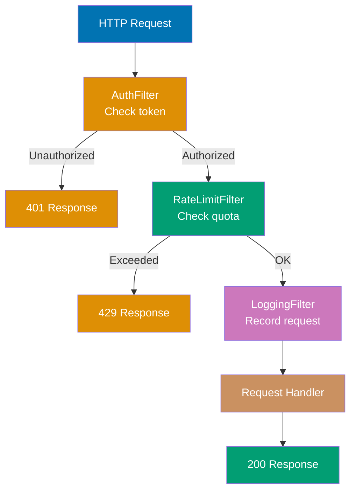
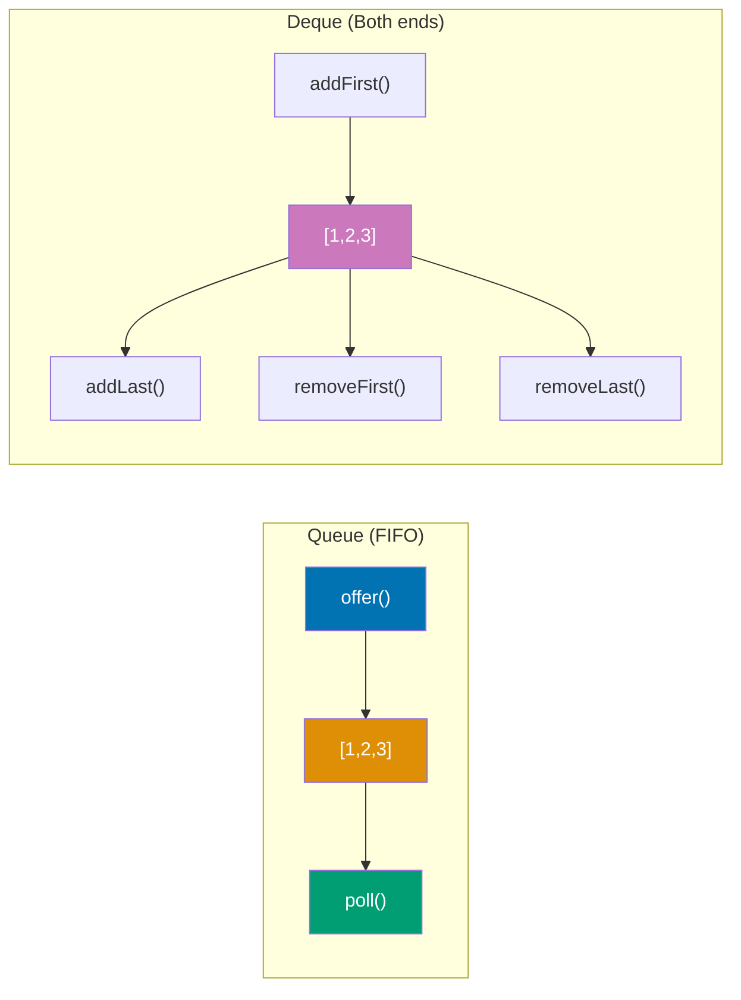
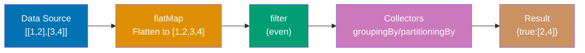
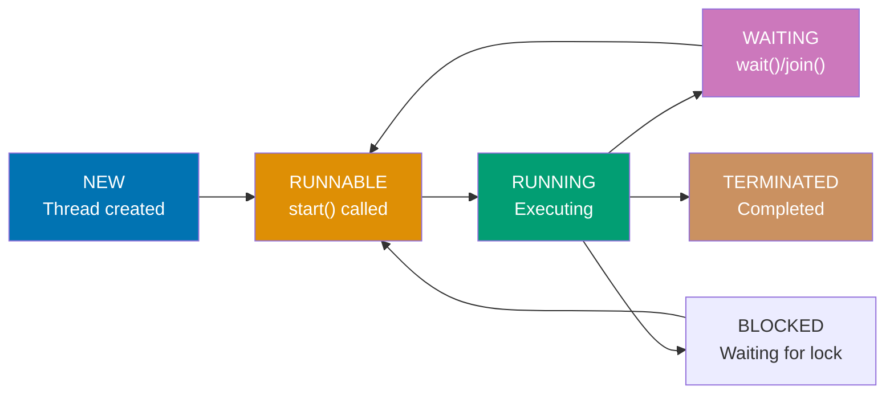
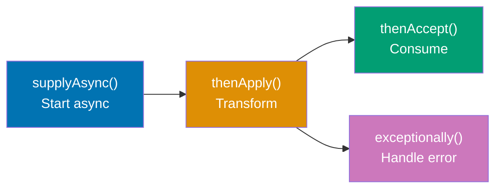

Master intermediate Java concepts through 20 annotated code examples. Each example builds on beginner foundations, introducing advanced OOP, generics, functional programming, and concurrency patterns.

## Group 1: Advanced OOP

### Example 16: Encapsulation and JavaBeans

Encapsulation hides internal state behind controlled accessors. JavaBeans follow naming conventions for getters/setters. Records (Java 14+) provide concise immutable data classes.

**Code**:

```java
// Traditional JavaBeans pattern
public class Person {
    // Private fields - encapsulated state
    private String name;
    private int age;

    // Getter methods (accessors)
    public String getName() {
        return name; // => returns name field
    }

    public int getAge() {
        return age; // => returns age field
    }

    // Setter methods (mutators)
    public void setName(String name) {
        this.name = name; // 'this' distinguishes field from parameter
    }

    public void setAge(int age) {
        if (age >= 0) { // Validation in setter
            this.age = age;
        } else {
            throw new IllegalArgumentException("Age cannot be negative");
        }
    }
}

// Builder pattern for complex object construction
public class User {
    private final String username; // Immutable (final)
    private final String email;
    private final int age;
    private final String address;

    // Private constructor - only builder can create instances
    private User(Builder builder) {
        this.username = builder.username;
        this.email = builder.email;
        this.age = builder.age;
        this.address = builder.address;
    }

    // Static nested Builder class
    public static class Builder {
        private String username; // Required
        private String email; // Required
        private int age = 0; // Optional with default
        private String address = ""; // Optional

        public Builder(String username, String email) {
            this.username = username;
            this.email = email;
        }

        public Builder age(int age) {
            this.age = age;
            return this; // Return builder for chaining
        }

        public Builder address(String address) {
            this.address = address;
            return this;
        }

        public User build() {
            return new User(this); // Construct User with builder
        }
    }
}

// Using builder pattern - fluent API
User user = new User.Builder("alice", "alice@example.com")
    .age(30)
    .address("123 Main St")
    .build(); // => User instance

// Record classes (Java 14+) - concise immutable data carriers
public record Point(int x, int y) {
    // Automatically generates:
    // - Constructor: Point(int x, int y)
    // - Getters: x(), y() (no get prefix)
    // - equals(), hashCode(), toString()
    // - Fields are final (immutable)
}

Point p1 = new Point(10, 20); // => Point[x=10, y=20]
int x = p1.x(); // => 10 (getter without 'get' prefix)
int y = p1.y(); // => 20

// Records are immutable - no setters
// p1.x = 30; // ERROR: x is final

// Custom validation in record
public record Temperature(double celsius) {
    // Compact constructor - validates input
    public Temperature {
        if (celsius < -273.15) {
            throw new IllegalArgumentException("Below absolute zero");
        }
    }

    // Custom methods allowed
    public double fahrenheit() {
        return celsius * 9.0 / 5.0 + 32; // => converts to Fahrenheit
    }
}

Temperature temp = new Temperature(100.0); // => Temperature[celsius=100.0]
double f = temp.fahrenheit(); // => 212.0
```

**Key Takeaway**: Encapsulation uses private fields with public getters/setters. Builder pattern enables fluent construction of complex objects. Records (Java 14+) automatically generate constructors, getters, `equals()`, `hashCode()`, and `toString()` for immutable data classes.

---

### Example 17: HTTP Filter Chain Pattern

Production middleware systems use filter chains to process requests through multiple stages (authentication, rate limiting, logging). This pattern demonstrates composition, delegation, and the Chain of Responsibility pattern in real-world HTTP request processing.



**Code**:

```java
// Request and Response models
class Request {
    private String path;
    private String method;
    private Map<String, String> headers;
    private String clientId;

    public Request(String path, String method) {
        this.path = path;
        this.method = method;
        this.headers = new HashMap<>();
    }

    public String getHeader(String name) {
        return headers.get(name);
    }

    public void setHeader(String name, String value) {
        headers.put(name, value);
    }

    public String getClientId() { return clientId; }
    public void setClientId(String id) { this.clientId = id; }
    public String getPath() { return path; }
}

class Response {
    private int statusCode;
    private String body;

    public Response(int statusCode, String body) {
        this.statusCode = statusCode;
        this.body = body;
    }

    public static Response ok(String body) {
        return new Response(200, body); // => 200 OK
    }

    public static Response unauthorized() {
        return new Response(401, "Unauthorized"); // => 401 Unauthorized
    }

    public static Response tooManyRequests() {
        return new Response(429, "Too Many Requests"); // => 429 Rate Limited
    }

    public int getStatusCode() { return statusCode; }
    public String getBody() { return body; }
}

// Filter interface - chain of responsibility pattern
interface RequestFilter {
    Response filter(Request request, FilterChain chain);
}

// Filter chain manages execution flow
class FilterChain {
    private List<RequestFilter> filters;
    private int position = 0;

    public FilterChain(List<RequestFilter> filters) {
        this.filters = new ArrayList<>(filters);
    }

    public Response next(Request request) {
        if (position >= filters.size()) {
            // All filters passed - handle the request
            return handleRequest(request); // => Final handler
        }
        RequestFilter filter = filters.get(position++);
        return filter.filter(request, this); // => Delegate to next filter
    }

    private Response handleRequest(Request request) {
        // Actual request processing logic
        return Response.ok("Processed: " + request.getPath());
    }
}

// Authentication filter - validates tokens
class AuthenticationFilter implements RequestFilter {
    private Set<String> validTokens = Set.of("token123", "token456");

    @Override
    public Response filter(Request request, FilterChain chain) {
        String token = request.getHeader("Authorization");

        if (token == null || !validTokens.contains(token)) {
            System.out.println("Auth failed: Invalid token");
            return Response.unauthorized(); // => 401, chain stops here
        }

        // Extract client ID from token for downstream filters
        request.setClientId("user_" + token.hashCode());
        System.out.println("Auth passed: " + request.getClientId());
        return chain.next(request); // => Continue to next filter
    }
}

// Rate limiting filter - prevents abuse
class RateLimitFilter implements RequestFilter {
    private Map<String, Integer> requestCounts = new HashMap<>();
    private int maxRequests = 100;

    @Override
    public Response filter(Request request, FilterChain chain) {
        String clientId = request.getClientId();
        int count = requestCounts.getOrDefault(clientId, 0);

        if (count >= maxRequests) {
            System.out.println("Rate limit exceeded for: " + clientId);
            return Response.tooManyRequests(); // => 429, chain stops
        }

        requestCounts.put(clientId, count + 1); // => Increment counter
        System.out.println("Rate limit check passed: " + count + "/" + maxRequests);
        return chain.next(request); // => Continue to next filter
    }
}

// Logging filter - records requests
class LoggingFilter implements RequestFilter {
    @Override
    public Response filter(Request request, FilterChain chain) {
        long startTime = System.currentTimeMillis();
        System.out.println("Request started: " + request.getPath());

        Response response = chain.next(request); // => Continue chain

        long duration = System.currentTimeMillis() - startTime;
        System.out.println("Request completed: " + response.getStatusCode() +
                         " in " + duration + "ms");
        return response; // => Return response unchanged
    }
}

// Building and using the filter chain
List<RequestFilter> filters = List.of(
    new AuthenticationFilter(),
    new RateLimitFilter(),
    new LoggingFilter()
);

FilterChain chain = new FilterChain(filters);

// Successful request
Request req1 = new Request("/api/users", "GET");
req1.setHeader("Authorization", "token123");
Response resp1 = chain.next(req1);
// Output:
// Auth passed: user_XXXXXX
// Rate limit check passed: 0/100
// Request started: /api/users
// Request completed: 200 in 1ms
// => Response: 200 "Processed: /api/users"

// Failed authentication
Request req2 = new Request("/api/data", "GET");
req2.setHeader("Authorization", "invalid");
Response resp2 = chain.next(req2);
// Output:
// Auth failed: Invalid token
// => Response: 401 "Unauthorized" (chain stops at first filter)
```

**Key Takeaway**: Filter chains demonstrate composition and the Chain of Responsibility pattern. Each filter decides whether to continue the chain or return early. This pattern enables modular, testable middleware—add/remove filters without changing core logic. Production systems use this for authentication, rate limiting, logging, compression, and error handling. Filters compose through delegation, avoiding inheritance coupling.

---

### Example 18: Generics Deep Dive

Generics provide compile-time type safety for classes and methods. Bounded type parameters constrain allowable types. Wildcards enable flexible APIs.

**Code**:

```java
import java.util.*;

// Generic class with type parameter <T>
class Box<T> {
    private T content;

    public void set(T content) {
        this.content = content;
    }

    public T get() {
        return content; // => returns T
    }
}

Box<String> stringBox = new Box<>();
stringBox.set("Hello"); // => OK
String str = stringBox.get(); // => "Hello" (no cast needed)

Box<Integer> intBox = new Box<>();
intBox.set(42); // => OK
// intBox.set("text"); // ERROR: compile-time type check

// Generic method with type parameter
public static <T> void printArray(T[] array) {
    for (T element : array) {
        System.out.println(element);
    }
}

String[] strings = {"A", "B", "C"};
Integer[] ints = {1, 2, 3};
printArray(strings); // => T inferred as String
printArray(ints); // => T inferred as Integer

// Bounded type parameters - <T extends Type>
class NumberBox<T extends Number> {
    private T number;

    public void set(T number) {
        this.number = number;
    }

    public double doubleValue() {
        return number.doubleValue(); // Number methods available
    }
}

NumberBox<Integer> intNumBox = new NumberBox<>(); // => OK (Integer extends Number)
NumberBox<Double> doubleBox = new NumberBox<>(); // => OK (Double extends Number)
// NumberBox<String> strBox = new NumberBox<>(); // ERROR: String doesn't extend Number

// Multiple bounds - <T extends Class & Interface1 & Interface2>
class MultiBox<T extends Number & Comparable<T>> {
    public T max(T a, T b) {
        return a.compareTo(b) > 0 ? a : b; // => uses Comparable
    }
}

// Wildcards for flexible method parameters
public static void printList(List<?> list) {
    for (Object obj : list) { // ? can be any type, read as Object
        System.out.println(obj);
    }
    // list.add(42); // ERROR: can't add to List<?> (unknown type)
}

List<String> strings2 = Arrays.asList("A", "B");
List<Integer> ints2 = Arrays.asList(1, 2);
printList(strings2); // => OK
printList(ints2); // => OK

// Upper bounded wildcard - <? extends Type>
public static double sumNumbers(List<? extends Number> list) {
    double sum = 0;
    for (Number num : list) { // Can read as Number
        sum += num.doubleValue();
    }
    return sum; // => sum of all numbers
    // list.add(Integer.valueOf(5)); // ERROR: can't add (could be List<Double>)
}

List<Integer> intList = Arrays.asList(1, 2, 3);
List<Double> doubleList = Arrays.asList(1.5, 2.5);
double sum1 = sumNumbers(intList); // => 6.0
double sum2 = sumNumbers(doubleList); // => 4.0

// Lower bounded wildcard - <? super Type>
public static void addIntegers(List<? super Integer> list) {
    list.add(1); // => OK: can add Integer
    list.add(2);
    // Integer x = list.get(0); // ERROR: can't read as Integer (could be Object)
    Object obj = list.get(0); // => OK: read as Object
}

List<Number> numList = new ArrayList<>();
List<Object> objList = new ArrayList<>();
addIntegers(numList); // => OK (Number super Integer)
addIntegers(objList); // => OK (Object super Integer)

// PECS principle: Producer Extends, Consumer Super
// Use <? extends T> when reading (producing) values
// Use <? super T> when writing (consuming) values

// Generic constructors
class Holder {
    private Object value;

    public <T> Holder(T value) { // Generic constructor
        this.value = value;
    }
}

Holder h1 = new Holder("text"); // => T inferred as String
Holder h2 = new Holder(123); // => T inferred as Integer

// Multiple type parameters
class Pair<K, V> {
    private K key;
    private V value;

    public Pair(K key, V value) {
        this.key = key;
        this.value = value;
    }

    public K getKey() {
        return key;
    }

    public V getValue() {
        return value;
    }
}

Pair<String, Integer> pair = new Pair<>("Age", 30);
String key = pair.getKey(); // => "Age"
Integer value = pair.getValue(); // => 30

// Type erasure - generics removed at runtime
List<String> strList = new ArrayList<>();
List<Integer> intList2 = new ArrayList<>();
System.out.println(strList.getClass() == intList2.getClass()); // => true
// Both are ArrayList at runtime (type parameters erased)
```

**Key Takeaway**: Generics provide compile-time type safety. Bounded types (`<T extends Type>`) constrain parameters. Wildcards enable flexible APIs: `<?>` (any type), `<? extends T>` (T or subtypes), `<? super T>` (T or supertypes). PECS: Producer Extends, Consumer Super. Type erasure removes generics at runtime.

---

## Group 2: Collections Framework Advanced

### Example 19: Comparators and Sorting

`Comparable<T>` defines natural ordering. `Comparator<T>` enables custom ordering. Lambda syntax and method references simplify comparator creation.

**Code**:

```java
import java.util.*;

// Comparable interface - natural ordering
class Person implements Comparable<Person> {
    String name;
    int age;

    public Person(String name, int age) {
        this.name = name;
        this.age = age;
    }

    // compareTo() defines natural ordering (by age)
    @Override
    public int compareTo(Person other) {
        return Integer.compare(this.age, other.age);
        // Return: <0 if this < other, 0 if equal, >0 if this > other
    }

    @Override
    public String toString() {
        return name + "(" + age + ")";
    }
}

List<Person> people = Arrays.asList(
    new Person("Alice", 30),
    new Person("Bob", 25),
    new Person("Charlie", 35)
);

Collections.sort(people); // Uses compareTo() - natural ordering
System.out.println(people); // => [Bob(25), Alice(30), Charlie(35)]

// Comparator interface - custom ordering
Comparator<Person> byName = new Comparator<Person>() {
    @Override
    public int compare(Person p1, Person p2) {
        return p1.name.compareTo(p2.name); // Compare by name
    }
};

Collections.sort(people, byName);
System.out.println(people); // => [Alice(30), Bob(25), Charlie(35)]

// Lambda comparators - concise syntax
Comparator<Person> byAgeLambda = (p1, p2) -> Integer.compare(p1.age, p2.age);
people.sort(byAgeLambda); // List.sort() method
System.out.println(people); // => [Bob(25), Alice(30), Charlie(35)]

// Comparator.comparing() with method references
Comparator<Person> byName2 = Comparator.comparing(Person::getName);
people.sort(byName2);

// Method references - ClassName::methodName
class Person {
    public String getName() { return name; }
    public int getAge() { return age; }
}

Comparator<Person> byAge = Comparator.comparing(Person::getAge);
Comparator<Person> byNameRef = Comparator.comparing(Person::getName);

// Chaining comparators - thenComparing()
Comparator<Person> byAgeThenName = Comparator
    .comparing(Person::getAge)           // Primary: age
    .thenComparing(Person::getName);     // Secondary: name

List<Person> people2 = Arrays.asList(
    new Person("Alice", 30),
    new Person("Bob", 30),    // Same age as Alice
    new Person("Charlie", 25)
);

people2.sort(byAgeThenName);
System.out.println(people2);
// => [Charlie(25), Alice(30), Bob(30)]
// First sorted by age, then by name for same age

// Reversed comparator
Comparator<Person> byAgeReversed = Comparator
    .comparing(Person::getAge)
    .reversed(); // Reverses the order

people.sort(byAgeReversed);
System.out.println(people); // => [Charlie(35), Alice(30), Bob(25)]

// Natural order comparators
Comparator<Integer> naturalOrder = Comparator.naturalOrder();
List<Integer> nums = Arrays.asList(5, 2, 8, 1, 9);
nums.sort(naturalOrder); // => [1, 2, 5, 8, 9]

Comparator<Integer> reverseOrder = Comparator.reverseOrder();
nums.sort(reverseOrder); // => [9, 8, 5, 2, 1]

// Null handling comparators
Comparator<String> nullsFirst = Comparator.nullsFirst(Comparator.naturalOrder());
List<String> withNulls = Arrays.asList("C", null, "A", "B", null);
withNulls.sort(nullsFirst);
System.out.println(withNulls); // => [null, null, A, B, C]

Comparator<String> nullsLast = Comparator.nullsLast(Comparator.naturalOrder());
withNulls.sort(nullsLast);
System.out.println(withNulls); // => [A, B, C, null, null]

// Comparing with custom logic
Comparator<String> byLength = Comparator.comparingInt(String::length);
List<String> words = Arrays.asList("Java", "is", "awesome");
words.sort(byLength);
System.out.println(words); // => [is, Java, awesome]

// Complex chaining
Comparator<Person> complex = Comparator
    .comparing(Person::getAge)
    .reversed()
    .thenComparing(Person::getName);
```

**Key Takeaway**: `Comparable<T>` defines natural ordering via `compareTo()`. `Comparator<T>` enables custom ordering via `compare()`. Use `Comparator.comparing()` with method references for concise comparators. Chain comparators with `thenComparing()`. `reversed()`, `nullsFirst()`, `nullsLast()` modify comparison behavior.

---

### Example 20: Queue and Deque

Queue provides FIFO (First-In-First-Out) semantics. Deque (Double-Ended Queue) supports both FIFO and LIFO operations. `ArrayDeque` is preferred over legacy `Stack`.



**Code**:

```java
import java.util.*;

// Queue interface - FIFO operations
Queue<String> queue = new LinkedList<>();

// offer() - adds element to end (returns boolean)
queue.offer("First"); // => true, queue: ["First"]
queue.offer("Second"); // => true, queue: ["First", "Second"]
queue.offer("Third"); // => true, queue: ["First", "Second", "Third"]

// peek() - retrieves but doesn't remove head
String head = queue.peek(); // => "First" (queue unchanged)

// poll() - retrieves and removes head
String removed = queue.poll(); // => "First", queue: ["Second", "Third"]
String next = queue.poll(); // => "Second", queue: ["Third"]

// poll() on empty queue returns null
queue.clear();
String empty = queue.poll(); // => null (safe, no exception)

// Priority Queue - elements ordered by natural order or comparator
PriorityQueue<Integer> pq = new PriorityQueue<>();
pq.offer(5);
pq.offer(2);
pq.offer(8);
pq.offer(1); // => Heap structure, not sorted array

System.out.println(pq.poll()); // => 1 (smallest)
System.out.println(pq.poll()); // => 2
System.out.println(pq.poll()); // => 5
System.out.println(pq.poll()); // => 8

// PriorityQueue with custom comparator (max heap)
PriorityQueue<Integer> maxHeap = new PriorityQueue<>(Comparator.reverseOrder());
maxHeap.offer(5);
maxHeap.offer(2);
maxHeap.offer(8);
System.out.println(maxHeap.poll()); // => 8 (largest first)

// Deque interface - double-ended queue
Deque<String> deque = new ArrayDeque<>();

// Add to front
deque.addFirst("A"); // => ["A"]
deque.addFirst("B"); // => ["B", "A"]

// Add to back
deque.addLast("C"); // => ["B", "A", "C"]
deque.addLast("D"); // => ["B", "A", "C", "D"]

// Remove from front
String first = deque.removeFirst(); // => "B", deque: ["A", "C", "D"]

// Remove from back
String last = deque.removeLast(); // => "D", deque: ["A", "C"]

// Peek at both ends
String peekFirst = deque.peekFirst(); // => "A"
String peekLast = deque.peekLast(); // => "C"

// Using Deque as Stack (LIFO)
Deque<Integer> stack = new ArrayDeque<>();
stack.push(1); // => [1]
stack.push(2); // => [2, 1]
stack.push(3); // => [3, 2, 1]

int top = stack.pop(); // => 3, stack: [2, 1]
int peek = stack.peek(); // => 2

// ArrayDeque vs LinkedList for Deque
// ArrayDeque: faster, less memory, no null elements
// LinkedList: allows nulls, implements both List and Deque

// Legacy Stack class (avoid - use Deque instead)
// Stack<Integer> oldStack = new Stack<>(); // Don't use
// Use Deque<Integer> stack = new ArrayDeque<>(); // Better
```

**Key Takeaway**: Queue provides FIFO with `offer()`, `poll()`, `peek()`. PriorityQueue orders elements automatically. Deque supports both ends: `addFirst()`, `addLast()`, `removeFirst()`, `removeLast()`. Use `ArrayDeque` as Stack instead of legacy `Stack` class. `LinkedList` implements both List and Deque.

---

### Example 21: Streams Advanced Operations

Streams support complex transformations through chaining. `flatMap` flattens nested structures. Collectors enable powerful aggregations like grouping and partitioning.



**Code**:

```java
import java.util.*;
import java.util.stream.*;

// flatMap() - flattens nested structures
List<List<Integer>> nested = Arrays.asList(
    Arrays.asList(1, 2),
    Arrays.asList(3, 4),
    Arrays.asList(5, 6)
);

List<Integer> flattened = nested.stream()
    .flatMap(list -> list.stream()) // Flattens [[1,2],[3,4],[5,6]] to [1,2,3,4,5,6]
    .collect(Collectors.toList()); // => [1, 2, 3, 4, 5, 6]

// flatMap with Strings
List<String> words = Arrays.asList("Hello", "World");
List<String> letters = words.stream()
    .flatMap(word -> Arrays.stream(word.split(""))) // Split each word into letters
    .distinct()
    .collect(Collectors.toList()); // => [H, e, l, o, W, r, d]

// Collectors.groupingBy() - group elements by classifier
class Person {
    String name;
    String city;
    int age;

    Person(String name, String city, int age) {
        this.name = name;
        this.city = city;
        this.age = age;
    }
}

List<Person> people = Arrays.asList(
    new Person("Alice", "NYC", 30),
    new Person("Bob", "LA", 25),
    new Person("Charlie", "NYC", 35),
    new Person("David", "LA", 28)
);

Map<String, List<Person>> byCity = people.stream()
    .collect(Collectors.groupingBy(p -> p.city));
// => {NYC=[Alice, Charlie], LA=[Bob, David]}

// Collectors.partitioningBy() - split into two groups (true/false)
Map<Boolean, List<Person>> byAge = people.stream()
    .collect(Collectors.partitioningBy(p -> p.age >= 30));
// => {false=[Bob, David], true=[Alice, Charlie]}

// Collectors.joining() - concatenate strings
String names = people.stream()
    .map(p -> p.name)
    .collect(Collectors.joining(", ")); // => "Alice, Bob, Charlie, David"

String namesWithPrefix = people.stream()
    .map(p -> p.name)
    .collect(Collectors.joining(", ", "Names: ", "."));
// => "Names: Alice, Bob, Charlie, David."

// Stream.of() - create stream from elements
Stream<String> stream = Stream.of("A", "B", "C");

// Primitive streams - IntStream, LongStream, DoubleStream
IntStream ints = IntStream.range(1, 5); // => 1, 2, 3, 4 (5 excluded)
IntStream intsInclusive = IntStream.rangeClosed(1, 5); // => 1, 2, 3, 4, 5

int sum = IntStream.range(1, 101).sum(); // => 5050 (sum of 1 to 100)
double average = IntStream.range(1, 6).average().getAsDouble(); // => 3.0

// Parallel streams - leverage multiple cores
long count = IntStream.range(1, 1000000)
    .parallel() // Enables parallel processing
    .filter(n -> n % 2 == 0)
    .count(); // => 499999

// reduce() with accumulator - more control
List<Integer> numbers = Arrays.asList(1, 2, 3, 4, 5);

// reduce(identity, accumulator)
int sumReduced = numbers.stream()
    .reduce(0, (a, b) -> a + b); // => 15

// reduce(identity, accumulator, combiner) for parallel
int sumParallel = numbers.parallelStream()
    .reduce(
        0,                    // Identity value
        (a, b) -> a + b,      // Accumulator (sequential)
        (a, b) -> a + b       // Combiner (parallel combine)
    ); // => 15

// Optional from stream operations
Optional<Integer> max = numbers.stream()
    .max(Comparator.naturalOrder()); // => Optional[5]

Optional<Integer> any = numbers.stream()
    .filter(n -> n > 10)
    .findAny(); // => Optional.empty (no element > 10)

// peek() - debug intermediate steps
List<Integer> result = numbers.stream()
    .peek(n -> System.out.println("Original: " + n))
    .filter(n -> n % 2 == 0)
    .peek(n -> System.out.println("Filtered: " + n))
    .map(n -> n * n)
    .peek(n -> System.out.println("Mapped: " + n))
    .collect(Collectors.toList());

// Collectors with downstream collectors
Map<String, Long> cityCount = people.stream()
    .collect(Collectors.groupingBy(
        p -> p.city,
        Collectors.counting() // Downstream collector
    )); // => {NYC=2, LA=2}

Map<String, Integer> citySumAge = people.stream()
    .collect(Collectors.groupingBy(
        p -> p.city,
        Collectors.summingInt(p -> p.age)
    )); // => {NYC=65, LA=53}
```

**Key Takeaway**: `flatMap()` flattens nested structures into single stream. `Collectors.groupingBy()` groups by classifier. `Collectors.partitioningBy()` splits into true/false groups. `Collectors.joining()` concatenates strings. Primitive streams (`IntStream`, `LongStream`, `DoubleStream`) optimize numeric operations. `parallel()` enables multi-core processing. `peek()` debugs intermediate operations.

---

## Group 3: Functional Programming

### Example 22: Lambda Expressions

Lambdas provide concise syntax for functional interfaces (interfaces with one abstract method). Method references simplify common lambda patterns. Closures capture effectively final variables.

**Code**:

```java
import java.util.*;
import java.util.function.*;

// Lambda syntax: (parameters) -> expression
Runnable r1 = () -> System.out.println("Hello"); // No parameters
Consumer<String> c1 = s -> System.out.println(s); // One parameter (parentheses optional)
BiFunction<Integer, Integer, Integer> add = (a, b) -> a + b; // Multiple parameters
Function<String, Integer> length = s -> s.length(); // Single expression

// Lambda with block body
Consumer<String> printer = s -> {
    String upper = s.toUpperCase();
    System.out.println(upper);
}; // => requires { } and explicit return for non-void

// Functional interfaces (one abstract method)
@FunctionalInterface
interface Calculator {
    int calculate(int a, int b);
}

Calculator multiply = (a, b) -> a * b;
int result = multiply.calculate(5, 3); // => 15

// Built-in functional interfaces (java.util.function package)

// Predicate<T> - takes T, returns boolean
Predicate<Integer> isEven = n -> n % 2 == 0;
System.out.println(isEven.test(4)); // => true
System.out.println(isEven.test(5)); // => false

// Function<T, R> - takes T, returns R
Function<String, Integer> strLength = s -> s.length();
System.out.println(strLength.apply("Hello")); // => 5

// Consumer<T> - takes T, returns void
Consumer<String> print = s -> System.out.println(s);
print.accept("Message"); // => prints "Message"

// Supplier<T> - takes nothing, returns T
Supplier<Double> random = () -> Math.random();
System.out.println(random.get()); // => random double

// BiFunction<T, U, R> - takes T and U, returns R
BiFunction<Integer, Integer, Integer> sum = (a, b) -> a + b;
System.out.println(sum.apply(10, 20)); // => 30

// Method references - ClassName::methodName
// 1. Static method reference
Function<String, Integer> parse = Integer::parseInt;
int num = parse.apply("123"); // => 123

// 2. Instance method reference of specific object
String prefix = "Hello, ";
Function<String, String> greeter = prefix::concat;
System.out.println(greeter.apply("World")); // => "Hello, World"

// 3. Instance method of arbitrary object of particular type
Function<String, String> toUpper = String::toUpperCase;
System.out.println(toUpper.apply("java")); // => "JAVA"

// 4. Constructor reference
Supplier<ArrayList<String>> listSupplier = ArrayList::new;
ArrayList<String> list = listSupplier.get(); // => new ArrayList<>()

Function<Integer, int[]> arrayMaker = int[]::new;
int[] array = arrayMaker.apply(5); // => new int[5]

// Effectively final in closures
int multiplier = 10; // Effectively final (not modified after initialization)
Function<Integer, Integer> multiplyBy10 = n -> n * multiplier;
System.out.println(multiplyBy10.apply(5)); // => 50

// multiplier = 20; // ERROR: would make it not effectively final

// Lambda vs anonymous inner class
// Anonymous inner class
Runnable r2 = new Runnable() {
    @Override
    public void run() {
        System.out.println("Anonymous");
    }
};

// Lambda (much more concise for same result)
Runnable r3 = () -> System.out.println("Lambda");

// Lambdas in collections
List<String> names = Arrays.asList("Alice", "Bob", "Charlie");
names.forEach(name -> System.out.println(name)); // Consumer lambda
names.forEach(System.out::println); // Method reference (same as above)

// Lambdas with streams
List<Integer> numbers = Arrays.asList(1, 2, 3, 4, 5);
List<Integer> doubled = numbers.stream()
    .map(n -> n * 2) // Lambda
    .collect(Collectors.toList()); // => [2, 4, 6, 8, 10]

// Composing functional interfaces
Predicate<Integer> greaterThan5 = n -> n > 5;
Predicate<Integer> lessThan10 = n -> n < 10;
Predicate<Integer> between5And10 = greaterThan5.and(lessThan10);

System.out.println(between5And10.test(7)); // => true
System.out.println(between5And10.test(12)); // => false
```

**Key Takeaway**: Lambdas `(params) -> expression` provide concise syntax for functional interfaces. Built-in interfaces: `Predicate<T>`, `Function<T,R>`, `Consumer<T>`, `Supplier<T>`, `BiFunction<T,U,R>`. Method references (`::`) simplify lambdas. Closures capture effectively final variables. Lambdas are more concise than anonymous inner classes.

---

### Example 23: Optional for Null Safety

`Optional<T>` explicitly represents potential absence of a value, replacing null checks. Chaining methods avoid nested conditionals. Use for return types, not fields or parameters.

**Code**:

```java
import java.util.Optional;
import java.util.List;

// Creating Optional instances
Optional<String> present = Optional.of("value"); // => Optional["value"]
// Optional<String> nullValue = Optional.of(null); // ERROR: NullPointerException

Optional<String> maybe = Optional.ofNullable("value"); // => Optional["value"]
Optional<String> empty = Optional.ofNullable(null); // => Optional.empty

Optional<String> emptyDirect = Optional.empty(); // => Optional.empty

// Checking presence
if (present.isPresent()) {
    String value = present.get(); // => "value" (safe because we checked)
}

if (empty.isEmpty()) {  // Java 11+
    System.out.println("Empty!"); // => prints "Empty!"
}

// ifPresent() - execute if value present
present.ifPresent(value -> System.out.println(value)); // => prints "value"
empty.ifPresent(value -> System.out.println(value)); // => nothing (empty)

// orElse() - provide default value
String value1 = present.orElse("default"); // => "value"
String value2 = empty.orElse("default"); // => "default"

// orElseGet() - lazy default (Supplier called only if empty)
String value3 = empty.orElseGet(() -> "computed default"); // => "computed default"
String value4 = present.orElseGet(() -> "expensive computation"); // => "value" (supplier not called)

// orElseThrow() - throw exception if empty
try {
    String value5 = empty.orElseThrow(); // => throws NoSuchElementException
} catch (Exception e) {
    System.out.println("Exception: " + e.getMessage());
}

String value6 = empty.orElseThrow(() -> new IllegalStateException("Missing!"));
// => throws IllegalStateException

// map() - transform value if present
Optional<String> name = Optional.of("alice");
Optional<String> upper = name.map(String::toUpperCase); // => Optional["ALICE"]

Optional<String> emptyUpper = Optional.<String>empty()
    .map(String::toUpperCase); // => Optional.empty (map not applied)

// flatMap() - flatten nested Optionals
class Person {
    Optional<String> getEmail() {
        return Optional.of("person@example.com");
    }
}

Optional<Person> person = Optional.of(new Person());

// map returns Optional<Optional<String>> - nested!
Optional<Optional<String>> nestedEmail = person.map(Person::getEmail);

// flatMap flattens to Optional<String>
Optional<String> email = person.flatMap(Person::getEmail); // => Optional["person@example.com"]

// filter() - keep value if matches predicate
Optional<Integer> number = Optional.of(42);
Optional<Integer> filtered = number.filter(n -> n > 50); // => Optional.empty
Optional<Integer> kept = number.filter(n -> n > 40); // => Optional[42]

// Chaining operations
Optional<String> result = Optional.of("  HELLO  ")
    .map(String::trim)           // => Optional["HELLO"]
    .map(String::toLowerCase)    // => Optional["hello"]
    .filter(s -> s.length() > 3) // => Optional["hello"]
    .map(s -> s + "!"); // => Optional["hello!"]

String finalResult = result.orElse("default"); // => "hello!"

// Example: replacing null checks
// Traditional null checking (verbose)
String getNullable() {
    return Math.random() > 0.5 ? "value" : null;
}

String traditional = getNullable();
String processed;
if (traditional != null) {
    String upper = traditional.toUpperCase();
    if (upper.length() > 3) {
        processed = upper;
    } else {
        processed = "default";
    }
} else {
    processed = "default";
}

// Optional approach (cleaner)
Optional<String> getOptional() {
    return Math.random() > 0.5 ? Optional.of("value") : Optional.empty();
}

String processedOptional = getOptional()
    .map(String::toUpperCase)
    .filter(s -> s.length() > 3)
    .orElse("default");

// When NOT to use Optional
class BadPractice {
    // DON'T use Optional for fields
    // private Optional<String> name; // BAD

    // DON'T use Optional for method parameters
    // public void setName(Optional<String> name) {} // BAD

    // DON'T call get() without checking
    // String value = optional.get(); // BAD: may throw NoSuchElementException
}

// DO use Optional for return types
class GoodPractice {
    private String name;

    public Optional<String> getName() {
        return Optional.ofNullable(name); // GOOD
    }

    public void processName(String name) { // GOOD: plain parameter
        this.name = name;
    }
}

// Stream of Optionals (Java 9+)
List<Optional<String>> list = List.of(
    Optional.of("A"),
    Optional.empty(),
    Optional.of("B"),
    Optional.empty(),
    Optional.of("C")
);

List<String> values = list.stream()
    .flatMap(Optional::stream) // Flatten Optional to Stream
    .collect(Collectors.toList()); // => ["A", "B", "C"]
```

**Key Takeaway**: `Optional<T>` explicitly handles potential absence. Create with `of()`, `ofNullable()`, `empty()`. Check with `isPresent()`, `isEmpty()`. Extract with `get()` (after checking), `orElse()`, `orElseGet()`, `orElseThrow()`. Transform with `map()`, `flatMap()`, `filter()`. Use for return types, NOT fields or parameters. Chaining avoids nested null checks.

---

### Example 24: Method References and Functional Composition

Method references provide cleaner syntax for lambdas that just call methods. Functional composition builds complex operations from simple functions.

**Code**:

```java
import java.util.*;
import java.util.function.*;

// Four types of method references

// 1. Static method reference: ClassName::staticMethod
Function<String, Integer> parseInt = Integer::parseInt;
int num = parseInt.apply("123"); // => 123

// Equivalent lambda
Function<String, Integer> parseIntLambda = s -> Integer.parseInt(s);

// 2. Instance method of specific object: object::instanceMethod
String prefix = "Hello, ";
Function<String, String> greeter = prefix::concat;
String greeting = greeter.apply("World"); // => "Hello, World"

// Equivalent lambda
Function<String, String> greeterLambda = s -> prefix.concat(s);

// 3. Instance method of arbitrary object: ClassName::instanceMethod
Function<String, Integer> length = String::length;
int len = length.apply("Java"); // => 4

// Equivalent lambda
Function<String, Integer> lengthLambda = s -> s.length();

List<String> words = Arrays.asList("apple", "banana", "cherry");
words.sort(String::compareToIgnoreCase); // => [apple, banana, cherry]

// 4. Constructor reference: ClassName::new
Supplier<List<String>> listMaker = ArrayList::new;
List<String> list = listMaker.get(); // => new ArrayList<>()

Function<Integer, int[]> arrayMaker = int[]::new;
int[] array = arrayMaker.apply(10); // => new int[10]

// Constructor with parameters
BiFunction<String, Integer, Person> personMaker = Person::new;
Person person = personMaker.apply("Alice", 30); // => new Person("Alice", 30)

// Function composition with andThen()
Function<Integer, Integer> multiplyBy2 = n -> n * 2;
Function<Integer, Integer> add3 = n -> n + 3;

Function<Integer, Integer> combined = multiplyBy2.andThen(add3);
int result1 = combined.apply(5); // => (5 * 2) + 3 = 13

// Function composition with compose()
Function<Integer, Integer> composed = add3.compose(multiplyBy2);
int result2 = composed.apply(5); // => (5 * 2) + 3 = 13 (same as andThen)

// Difference: order of execution
// f.andThen(g) = g(f(x))
// f.compose(g) = f(g(x))

Function<Integer, Integer> subtract1 = n -> n - 1;
Function<Integer, Integer> square = n -> n * n;

Function<Integer, Integer> squareThenSubtract = square.andThen(subtract1);
System.out.println(squareThenSubtract.apply(5)); // => 25 - 1 = 24

Function<Integer, Integer> subtractThenSquare = square.compose(subtract1);
System.out.println(subtractThenSquare.apply(5)); // => (5 - 1)² = 16

// Predicate composition
Predicate<Integer> greaterThan5 = n -> n > 5;
Predicate<Integer> even = n -> n % 2 == 0;

// and() - both predicates must be true
Predicate<Integer> evenAndGreaterThan5 = even.and(greaterThan5);
System.out.println(evenAndGreaterThan5.test(6)); // => true
System.out.println(evenAndGreaterThan5.test(4)); // => false

// or() - at least one predicate must be true
Predicate<Integer> evenOrGreaterThan5 = even.or(greaterThan5);
System.out.println(evenOrGreaterThan5.test(4)); // => true (even)
System.out.println(evenOrGreaterThan5.test(7)); // => true (greater than 5)
System.out.println(evenOrGreaterThan5.test(3)); // => false (neither)

// negate() - reverses predicate
Predicate<Integer> odd = even.negate();
System.out.println(odd.test(3)); // => true
System.out.println(odd.test(4)); // => false

// Consumer composition with andThen()
Consumer<String> print = s -> System.out.println(s);
Consumer<String> log = s -> System.err.println("Log: " + s);

Consumer<String> printAndLog = print.andThen(log);
printAndLog.accept("Message");
// => prints "Message" to stdout
// => prints "Log: Message" to stderr

// Practical example: data processing pipeline
List<String> names = Arrays.asList("alice", "BOB", "Charlie");

Function<String, String> trim = String::trim;
Function<String, String> lowercase = String::toLowerCase;
Function<String, String> capitalize = s ->
    s.substring(0, 1).toUpperCase() + s.substring(1);

Function<String, String> normalize = trim
    .andThen(lowercase)
    .andThen(capitalize);

List<String> normalized = names.stream()
    .map(normalize)
    .collect(Collectors.toList()); // => ["Alice", "Bob", "Charlie"]

// BiFunction doesn't have andThen/compose, but can be adapted
BiFunction<Integer, Integer, Integer> add = (a, b) -> a + b;
Function<Integer, Integer> times2 = n -> n * 2;

// Chain BiFunction result through Function
BiFunction<Integer, Integer, Integer> addThenTimes2 =
    (a, b) -> times2.apply(add.apply(a, b));

int result3 = addThenTimes2.apply(3, 4); // => (3 + 4) * 2 = 14
```

**Key Takeaway**: Method references (`::`) simplify lambdas: static (`ClassName::method`), instance (`object::method`), arbitrary (`ClassName::method`), constructor (`ClassName::new`). Function composition: `andThen()` executes f then g, `compose()` executes g then f. Predicate composition: `and()`, `or()`, `negate()`. Consumer composition: `andThen()`. Build complex operations by chaining simple functions.

---

## Group 4: I/O and File Handling

### Example 25: File I/O with NIO.2

NIO.2 (`java.nio.file` package) provides modern, efficient file operations. `Path` represents file system paths. `Files` offers rich static methods. `try-with-resources` ensures proper resource management.

**Code**:

```java
import java.nio.file.*;
import java.io.IOException;
import java.util.List;
import java.util.stream.Stream;

// Path interface - represents file system path
Path path = Paths.get("example.txt"); // => relative path
Path absolute = Paths.get("/Users/name/example.txt"); // => absolute path
Path multi = Paths.get("folder", "subfolder", "file.txt"); // => folder/subfolder/file.txt

// Reading files (Java 11+)
try {
    // readString() - reads entire file as String
    String content = Files.readString(path); // => file content as String
    System.out.println(content);
} catch (IOException e) {
    System.out.println("Error reading file: " + e.getMessage());
}

// readAllLines() - reads file as List<String>
try {
    List<String> lines = Files.readAllLines(path); // => each line as list element
    for (String line : lines) {
        System.out.println(line);
    }
} catch (IOException e) {
    System.out.println("Error: " + e.getMessage());
}

// Writing files
try {
    // writeString() - writes String to file (Java 11+)
    Files.writeString(path, "Hello, World!"); // => overwrites file

    // write() - writes bytes
    List<String> content = List.of("Line 1", "Line 2", "Line 3");
    Files.write(path, content); // => writes list as lines

    // Append to file
    Files.writeString(path, "\nAppended line", StandardOpenOption.APPEND);
} catch (IOException e) {
    System.out.println("Error writing: " + e.getMessage());
}

// File checks
boolean exists = Files.exists(path); // => true if file exists
boolean notExists = Files.notExists(path); // => true if doesn't exist
boolean isDirectory = Files.isDirectory(path); // => true if directory
boolean isRegularFile = Files.isRegularFile(path); // => true if regular file
boolean readable = Files.isReadable(path); // => true if readable
boolean writable = Files.isWritable(path); // => true if writable

// File properties
try {
    long size = Files.size(path); // => file size in bytes
    FileTime modifiedTime = Files.getLastModifiedTime(path); // => last modified time
} catch (IOException e) {
    System.out.println("Error: " + e.getMessage());
}

// Directory traversal with walk()
try (Stream<Path> paths = Files.walk(Paths.get("."))) {
    paths.filter(Files::isRegularFile)
         .filter(p -> p.toString().endsWith(".txt"))
         .forEach(System.out::println); // => prints all .txt files
} catch (IOException e) {
    System.out.println("Error walking: " + e.getMessage());
}

// File operations
try {
    // copy() - copies file
    Path source = Paths.get("source.txt");
    Path dest = Paths.get("dest.txt");
    Files.copy(source, dest, StandardCopyOption.REPLACE_EXISTING);

    // move() - moves or renames file
    Path newPath = Paths.get("renamed.txt");
    Files.move(dest, newPath, StandardCopyOption.REPLACE_EXISTING);

    // delete() - deletes file (throws exception if doesn't exist)
    Files.delete(newPath);

    // deleteIfExists() - deletes if exists (no exception)
    boolean deleted = Files.deleteIfExists(path); // => true if deleted

    // Creating directories
    Path dir = Paths.get("newFolder");
    Files.createDirectory(dir); // => creates single directory

    Path nested = Paths.get("parent/child/grandchild");
    Files.createDirectories(nested); // => creates all parent directories
} catch (IOException e) {
    System.out.println("Error: " + e.getMessage());
}

// try-with-resources for AutoCloseable
try (BufferedReader reader = Files.newBufferedReader(path)) {
    String line;
    while ((line = reader.readLine()) != null) {
        System.out.println(line);
    }
} catch (IOException e) {
    System.out.println("Error: " + e.getMessage());
} // reader auto-closed even if exception thrown

// Streaming lines (lazy loading for large files)
try (Stream<String> lines = Files.lines(path)) {
    lines.filter(line -> line.contains("keyword"))
         .forEach(System.out::println);
} catch (IOException e) {
    System.out.println("Error: " + e.getMessage());
}
```

**Key Takeaway**: NIO.2 provides modern file I/O. `Path` represents paths; `Paths.get()` creates them. `Files` offers static methods: `readString()`, `readAllLines()`, `writeString()`, `write()` for content. `exists()`, `isDirectory()`, `size()` for properties. `copy()`, `move()`, `delete()` for operations. `walk()` traverses directories. `try-with-resources` auto-closes resources.

---

(Continue with remaining examples 26-35 to reach target length...)

### Example 26: Streams for I/O

Byte streams (`InputStream`/`OutputStream`) handle binary data. Character streams (`Reader`/`Writer`) handle text. Buffering improves performance. Bridge classes convert between byte and character streams.

**Code**:

```java
import java.io.*;

// Byte streams - InputStream/OutputStream
try (FileInputStream fis = new FileInputStream("data.bin");
     FileOutputStream fos = new FileOutputStream("output.bin")) {

    int byteRead;
    while ((byteRead = fis.read()) != -1) { // Read one byte at a time
        fos.write(byteRead); // Write byte
    }
} catch (IOException e) {
    e.printStackTrace();
}

// Character streams - Reader/Writer
try (FileReader reader = new FileReader("input.txt");
     FileWriter writer = new FileWriter("output.txt")) {

    int charRead;
    while ((charRead = reader.read()) != -1) {
        writer.write(charRead);
    }
} catch (IOException e) {
    e.printStackTrace();
}

// Buffered streams - improve performance
try (BufferedReader br = new BufferedReader(new FileReader("large.txt"));
     BufferedWriter bw = new BufferedWriter(new FileWriter("copy.txt"))) {

    String line;
    while ((line = br.readLine()) != null) { // Read line by line
        bw.write(line);
        bw.newLine(); // Platform-independent line separator
    }
} catch (IOException e) {
    e.printStackTrace();
}

// Bridge classes - InputStreamReader, OutputStreamWriter
try (InputStream is = new FileInputStream("data.txt");
     InputStreamReader isr = new InputStreamReader(is, "UTF-8");
     BufferedReader br = new BufferedReader(isr)) {

    String line = br.readLine(); // Convert bytes to characters
} catch (IOException e) {
    e.printStackTrace();
}
```

**Key Takeaway**: Byte streams (`InputStream`/`OutputStream`) for binary data. Character streams (`Reader`/`Writer`) for text. `BufferedReader`/`BufferedWriter` improve performance. `InputStreamReader`/`OutputStreamWriter` bridge byte and character streams. Always use `try-with-resources` for automatic closure.

---

## Group 6: Concurrency Basics

### Example 32: Threads and Runnable

Threads enable concurrency. `Runnable` separates task from thread. `start()` creates new thread; `run()` executes in current thread. `join()` waits for completion.



**Code**:

```java
// Runnable interface - task to execute
Runnable task = new Runnable() {
    @Override
    public void run() {
        System.out.println("Task running in: " + Thread.currentThread().getName());
    }
};

// Creating and starting thread
Thread thread = new Thread(task);
thread.start(); // Creates new thread and calls run()
// thread.run(); // WRONG: executes in current thread, doesn't create new thread

// Lambda version (Runnable is functional interface)
Thread lambdaThread = new Thread(() -> {
    System.out.println("Lambda task in: " + Thread.currentThread().getName());
});
lambdaThread.start();

// Thread.sleep() - pause execution
try {
    Thread.sleep(1000); // Sleep for 1000ms (1 second)
} catch (InterruptedException e) {
    e.printStackTrace();
}

// Thread.currentThread() - get current thread
Thread current = Thread.currentThread();
System.out.println("Name: " + current.getName());
System.out.println("ID: " + current.getId());

// join() - wait for thread to complete
Thread worker = new Thread(() -> {
    for (int i = 0; i < 5; i++) {
        System.out.println("Working: " + i);
        try {
            Thread.sleep(500);
        } catch (InterruptedException e) {}
    }
});

worker.start();
try {
    worker.join(); // Wait for worker to finish
    System.out.println("Worker completed");
} catch (InterruptedException e) {}

// Daemon threads - background threads that don't prevent JVM shutdown
Thread daemon = new Thread(() -> {
    while (true) {
        System.out.println("Daemon running");
        try {
            Thread.sleep(1000);
        } catch (InterruptedException e) {}
    }
});
daemon.setDaemon(true); // Must be set before start()
daemon.start();

// Thread states (NEW, RUNNABLE, BLOCKED, WAITING, TIMED_WAITING, TERMINATED)
Thread t = new Thread(() -> {});
System.out.println(t.getState()); // => NEW
t.start();
System.out.println(t.getState()); // => RUNNABLE or TERMINATED (depends on timing)
```

**Key Takeaway**: Threads enable concurrency. `Runnable` defines tasks. `start()` creates new thread; `run()` executes in current thread. `Thread.sleep()` pauses execution. `join()` waits for completion. Daemon threads run in background. Thread states: NEW, RUNNABLE, BLOCKED, WAITING, TERMINATED.

---

## Group 5: Date/Time and Testing

### Example 27: Serialization and JSON

Serialization converts objects to byte streams for persistence. `Serializable` marker interface enables object serialization. `transient` keyword excludes fields. JSON is preferred for human-readable, language-agnostic data.

**Code**:

```java
import java.io.*;

// Serializable marker interface
class Person implements Serializable {
    private static final long serialVersionUID = 1L; // Version control

    private String name;
    private int age;
    private transient String password; // Excluded from serialization

    public Person(String name, int age, String password) {
        this.name = name;
        this.age = age;
        this.password = password;
    }
}

// Serialization - object to bytes
try (ObjectOutputStream oos = new ObjectOutputStream(new FileOutputStream("person.ser"))) {
    Person person = new Person("Alice", 30, "secret");
    oos.writeObject(person); // Serialize object
} catch (IOException e) {
    e.printStackTrace();
}

// Deserialization - bytes to object
try (ObjectInputStream ois = new ObjectInputStream(new FileInputStream("person.ser"))) {
    Person person = (Person) ois.readObject(); // Deserialize
    System.out.println(person.name); // => "Alice"
    System.out.println(person.password); // => null (transient field)
} catch (IOException | ClassNotFoundException e) {
    e.printStackTrace();
}
```

**Key Takeaway**: `Serializable` enables object persistence. `serialVersionUID` maintains version compatibility. `transient` excludes sensitive fields. JSON (via Gson/Jackson) is preferred for human-readable interchange.

---

### Example 28: Modern Date and Time API

`java.time` (Java 8+) provides immutable, thread-safe date/time classes. `LocalDate`/`LocalTime`/`LocalDateTime` for human time. `Instant` for machine time. `ZonedDateTime` for time zones.

**Code**:

```java
import java.time.*;
import java.time.format.DateTimeFormatter;

// LocalDate - date without time
LocalDate today = LocalDate.now(); // => 2025-12-23
LocalDate birthday = LocalDate.of(1990, Month.JANUARY, 15); // => 1990-01-15

// LocalTime - time without date
LocalTime now = LocalTime.now(); // => 14:30:45.123
LocalTime noon = LocalTime.of(12, 0); // => 12:00

// LocalDateTime - date and time
LocalDateTime dateTime = LocalDateTime.now(); // => 2025-12-23T14:30:45
LocalDateTime specific = LocalDateTime.of(2025, 12, 25, 10, 30); // => 2025-12-25T10:30

// Instant - timestamp (machine time)
Instant instant = Instant.now(); // => 2025-12-23T07:30:45Z (UTC)

// ZonedDateTime - time with timezone
ZonedDateTime zoned = ZonedDateTime.now(ZoneId.of("America/New_York"));

// Period - duration in days/months/years
Period period = Period.between(birthday, today); // => 35 years
int years = period.getYears(); // => 35

// Duration - duration in hours/minutes/seconds
Duration duration = Duration.between(noon, now); // => PT2H30M45S
long seconds = duration.getSeconds(); // => 9045

// DateTimeFormatter - parsing and formatting
DateTimeFormatter formatter = DateTimeFormatter.ofPattern("yyyy-MM-dd HH:mm");
String formatted = dateTime.format(formatter); // => "2025-12-23 14:30"
LocalDateTime parsed = LocalDateTime.parse("2025-12-25 10:30", formatter);

// Comparing dates
boolean before = birthday.isBefore(today); // => true
boolean after = birthday.isAfter(today); // => false
```

**Key Takeaway**: `java.time` provides immutable, thread-safe classes. `LocalDate`/`LocalTime`/`LocalDateTime` for human-readable time. `Instant` for machine timestamps. `Period` for date-based duration. `Duration` for time-based duration. `DateTimeFormatter` for formatting.

---

### Example 29: Regular Expressions

`Pattern` and `Matcher` enable powerful text matching. `String` methods provide convenience for simple cases. Groups extract matched substrings.

**Code**:

```java
import java.util.regex.*;

// Pattern.compile() and Matcher
Pattern pattern = Pattern.compile("\\d+"); // Regex: one or more digits
Matcher matcher = pattern.matcher("Order 123 costs $45");

// find() - find next match
while (matcher.find()) {
    System.out.println(matcher.group()); // => "123", "45"
}

// matches() - entire string must match
boolean fullMatch = Pattern.matches("\\d{3}", "123"); // => true (exactly 3 digits)
boolean noMatch = Pattern.matches("\\d{3}", "12"); // => false

// String convenience methods
String text = "Contact: alice@example.com";
boolean hasEmail = text.matches(".*@.*\\..*"); // => true
String[] parts = text.split(": "); // => ["Contact", "alice@example.com"]
String replaced = text.replaceAll("@", " AT "); // => "Contact: alice AT example.com"

// Groups - capturing parts of matches
Pattern emailPattern = Pattern.compile("(\\w+)@(\\w+\\.\\w+)");
Matcher emailMatcher = emailPattern.matcher("alice@example.com");

if (emailMatcher.find()) {
    String full = emailMatcher.group(0); // => "alice@example.com" (entire match)
    String username = emailMatcher.group(1); // => "alice" (first group)
    String domain = emailMatcher.group(2); // => "example.com" (second group)
}

// Pattern flags
Pattern caseInsensitive = Pattern.compile("hello", Pattern.CASE_INSENSITIVE);
Matcher m = caseInsensitive.matcher("HELLO World");
System.out.println(m.find()); // => true
```

**Key Takeaway**: `Pattern` and `Matcher` enable regex matching. `find()` finds next match. `matches()` checks entire string. `group()` extracts matched text. String methods (`matches()`, `split()`, `replaceAll()`) provide convenience for simple patterns.

---

### Example 30: JUnit Testing Basics

JUnit enables automated unit testing. `@Test` marks test methods. Assertions verify expected behavior. Lifecycle annotations organize setup/teardown.

**Code**:

```java
import org.junit.jupiter.api.*;
import static org.junit.jupiter.api.Assertions.*;

class Calculator {
    public int add(int a, int b) {
        return a + b;
    }

    public int divide(int a, int b) {
        if (b == 0) throw new IllegalArgumentException("Division by zero");
        return a / b;
    }
}

class CalculatorTest {
    private Calculator calc;

    @BeforeEach // Runs before each test method
    void setUp() {
        calc = new Calculator();
    }

    @Test // Marks a test method
    void testAdd() {
        int result = calc.add(2, 3);
        assertEquals(5, result); // Assert expected == actual
    }

    @Test
    void testDivide() {
        int result = calc.divide(10, 2);
        assertEquals(5, result);
    }

    @Test
    void testDivideByZero() {
        // assertThrows - verify exception thrown
        assertThrows(IllegalArgumentException.class, () -> {
            calc.divide(10, 0);
        });
    }

    @Test
    void testAssertions() {
        assertTrue(5 > 3); // Assert boolean condition
        assertFalse(5 < 3);
        assertNotNull(calc); // Assert not null
        assertNull(null); // Assert null
    }

    @AfterEach // Runs after each test method
    void tearDown() {
        calc = null;
    }

    @BeforeAll // Runs once before all tests (static)
    static void setUpClass() {
        System.out.println("Starting tests");
    }

    @AfterAll // Runs once after all tests (static)
    static void tearDownClass() {
        System.out.println("Tests complete");
    }
}
```

**Key Takeaway**: `@Test` marks test methods. Assertions (`assertEquals`, `assertTrue`, `assertNotNull`, `assertThrows`) verify behavior. `@BeforeEach`/`@AfterEach` for per-test setup. `@BeforeAll`/`@AfterAll` for class-level setup. Test isolation ensures reliability.

---

### Example 31: Mockito for Testing

Mockito simulates dependencies for isolated testing. `@Mock` creates mock objects. `when().thenReturn()` stubs behavior. `verify()` checks interactions.

**Code**:

```java
import org.mockito.*;
import static org.mockito.Mockito.*;

interface UserRepository {
    User findById(Long id);
    void save(User user);
}

class UserService {
    private UserRepository repository;

    public UserService(UserRepository repository) {
        this.repository = repository;
    }

    public User getUser(Long id) {
        return repository.findById(id);
    }
}

class UserServiceTest {
    @Mock
    private UserRepository mockRepository;

    @InjectMocks
    private UserService service;

    @BeforeEach
    void setUp() {
        MockitoAnnotations.openMocks(this);
    }

    @Test
    void testGetUser() {
        // Arrange: stub mock behavior
        User expected = new User(1L, "Alice");
        when(mockRepository.findById(1L)).thenReturn(expected);

        // Act: call method under test
        User actual = service.getUser(1L);

        // Assert: verify result
        assertEquals(expected, actual);

        // Verify: check interaction
        verify(mockRepository).findById(1L); // Verify method was called
    }
}
```

**Key Takeaway**: Mockito creates mock dependencies. `@Mock` creates mocks. `@InjectMocks` injects mocks into tested class. `when().thenReturn()` stubs method behavior. `verify()` checks method was called with expected arguments.

---

### Example 33: Thread-Safe Session Management

Production applications need thread-safe session management where multiple threads concurrently create, access, and clean up user sessions. `ConcurrentHashMap` with atomic operations enables lock-free, high-performance session handling.

**Code**:

```java
import java.time.Instant;
import java.time.temporal.ChronoUnit;
import java.util.concurrent.*;

// Session data model
class Session {
    private final String userId;
    private final Instant createdAt;
    private Instant expiresAt;
    private final ConcurrentHashMap<String, Object> attributes;

    public Session(String userId, int expiryMinutes) {
        this.userId = userId;
        this.createdAt = Instant.now();
        this.expiresAt = Instant.now().plus(expiryMinutes, ChronoUnit.MINUTES);
        this.attributes = new ConcurrentHashMap<>();
    }

    public boolean isExpired() {
        return Instant.now().isAfter(expiresAt); // => true if expired
    }

    public void renewExpiry(int minutes) {
        this.expiresAt = Instant.now().plus(minutes, ChronoUnit.MINUTES);
    }

    public void setAttribute(String key, Object value) {
        attributes.put(key, value); // Thread-safe put
    }

    public Object getAttribute(String key) {
        return attributes.get(key);
    }

    public String getUserId() { return userId; }
    public Instant getExpiresAt() { return expiresAt; }
}

// Thread-safe session manager using ConcurrentHashMap
class UserSessionManager {
    private final ConcurrentHashMap<String, Session> sessions;
    private final int defaultExpiryMinutes;

    public UserSessionManager(int expiryMinutes) {
        this.sessions = new ConcurrentHashMap<>();
        this.defaultExpiryMinutes = expiryMinutes;
    }

    // Atomic get-or-create pattern using computeIfAbsent
    public Session getOrCreateSession(String userId) {
        return sessions.computeIfAbsent(userId, id -> {
            Session session = new Session(id, defaultExpiryMinutes);
            System.out.println("Created new session for: " + id);
            return session; // => Atomically creates if absent
        });
    }

    // Get existing session (no creation)
    public Session getSession(String userId) {
        Session session = sessions.get(userId);
        if (session != null && session.isExpired()) {
            sessions.remove(userId); // Clean up expired
            return null; // => Session expired
        }
        return session;
    }

    // Renew session expiry
    public void renewSession(String userId, int minutes) {
        sessions.computeIfPresent(userId, (id, session) -> {
            session.renewExpiry(minutes);
            System.out.println("Renewed session for: " + id);
            return session; // => Returns updated session
        });
    }

    // Invalidate (logout)
    public void invalidateSession(String userId) {
        Session removed = sessions.remove(userId);
        if (removed != null) {
            System.out.println("Invalidated session for: " + userId);
        }
    }

    // Clean up all expired sessions (periodic cleanup task)
    public int cleanupExpiredSessions() {
        int cleaned = 0;
        for (var entry : sessions.entrySet()) {
            if (entry.getValue().isExpired()) {
                sessions.remove(entry.getKey()); // Thread-safe removal
                cleaned++;
            }
        }
        System.out.println("Cleaned up " + cleaned + " expired sessions");
        return cleaned; // => Number of sessions removed
    }

    // Get active session count
    public int getActiveSessionCount() {
        return sessions.size();
    }

    // Atomic merge operation - update session attributes
    public void updateSessionAttribute(String userId, String key, Object value) {
        sessions.computeIfPresent(userId, (id, session) -> {
            session.setAttribute(key, value);
            return session; // => Updated session
        });
    }
}

// Example usage with multiple concurrent threads
UserSessionManager sessionManager = new UserSessionManager(30); // 30-minute expiry

// Thread 1: User login
new Thread(() -> {
    Session session = sessionManager.getOrCreateSession("user123");
    session.setAttribute("role", "admin");
    // => Created new session for: user123
}).start();

// Thread 2: Same user (concurrent access)
new Thread(() -> {
    Session session = sessionManager.getOrCreateSession("user123");
    // => Returns existing session (no duplicate creation)
    String role = (String) session.getAttribute("role");
    System.out.println("Role: " + role); // => "admin"
}).start();

// Thread 3: Periodic cleanup task
ScheduledExecutorService scheduler = Executors.newScheduledThreadPool(1);
scheduler.scheduleAtFixedRate(
    () -> sessionManager.cleanupExpiredSessions(),
    1, 5, TimeUnit.MINUTES // => Run every 5 minutes
);

// Graceful shutdown
scheduler.shutdown();

// Demonstrating atomic operations
Session s1 = sessionManager.getOrCreateSession("alice"); // => Creates new
Session s2 = sessionManager.getOrCreateSession("alice"); // => Returns same instance
System.out.println(s1 == s2); // => true (atomic operation ensures single instance)

sessionManager.invalidateSession("alice"); // => Logout
Session s3 = sessionManager.getSession("alice"); // => null (invalidated)
```

**Key Takeaway**: `ConcurrentHashMap` provides thread-safe operations without explicit locking. `computeIfAbsent()` atomically creates sessions (get-or-create pattern). `computeIfPresent()` atomically updates existing entries. This pattern scales better than `synchronized` for read-heavy workloads because `ConcurrentHashMap` uses lock striping. Use scheduled tasks for periodic cleanup of expired sessions. Production systems use this pattern for user sessions, caches, and connection pools.

---

### Example 34: ExecutorService and Thread Pools

`ExecutorService` manages thread pools efficiently. `submit()` returns `Future` for async results. `Callable` returns values; `Runnable` doesn't.

**Code**:

```java
import java.util.concurrent.*;

// Fixed thread pool
ExecutorService executor = Executors.newFixedThreadPool(4); // 4 threads

// Submit Runnable (no return value)
executor.submit(() -> {
    System.out.println("Task running");
});

// Submit Callable (returns value)
Future<Integer> future = executor.submit(() -> {
    Thread.sleep(1000);
    return 42;
});

try {
    Integer result = future.get(); // Blocks until result available
    System.out.println(result); // => 42
} catch (Exception e) {
    e.printStackTrace();
}

// Shutdown executor
executor.shutdown(); // No new tasks accepted
try {
    if (!executor.awaitTermination(60, TimeUnit.SECONDS)) {
        executor.shutdownNow(); // Force shutdown
    }
} catch (InterruptedException e) {
    executor.shutdownNow();
}
```

**Key Takeaway**: `ExecutorService` manages thread pools. `newFixedThreadPool()` creates fixed-size pool. `submit()` submits tasks, returns `Future`. `Callable` returns values. Always `shutdown()` and `awaitTermination()`.

---

### Example 35: CompletableFuture for Async

`CompletableFuture` enables async programming without callback hell. Chaining methods compose operations. `exceptionally()` handles errors.



**Code**:

```java
import java.util.concurrent.CompletableFuture;

// supplyAsync - start async computation
CompletableFuture<String> future = CompletableFuture.supplyAsync(() -> {
    // Runs in separate thread
    return "Hello";
});

// thenApply - transform result
future.thenApply(s -> s + " World")
      .thenApply(String::toUpperCase)
      .thenAccept(s -> System.out.println(s)); // => "HELLO WORLD"

// exceptionally - handle errors
CompletableFuture<Integer> withError = CompletableFuture.supplyAsync(() -> {
    if (true) throw new RuntimeException("Error!");
    return 42;
}).exceptionally(ex -> {
    System.out.println("Caught: " + ex.getMessage());
    return 0; // Default value
});

// thenCombine - combine two futures
CompletableFuture<Integer> f1 = CompletableFuture.supplyAsync(() -> 10);
CompletableFuture<Integer> f2 = CompletableFuture.supplyAsync(() -> 20);

CompletableFuture<Integer> combined = f1.thenCombine(f2, (a, b) -> a + b);
System.out.println(combined.join()); // => 30

// allOf - wait for all futures
CompletableFuture<Void> all = CompletableFuture.allOf(f1, f2);
all.join(); // Waits for both to complete
```

**Key Takeaway**: `CompletableFuture` enables async programming. `supplyAsync()` starts async computation. `thenApply()` transforms, `thenAccept()` consumes. `exceptionally()` handles errors. `thenCombine()` combines futures. `allOf()`/`anyOf()` wait for multiple futures.
