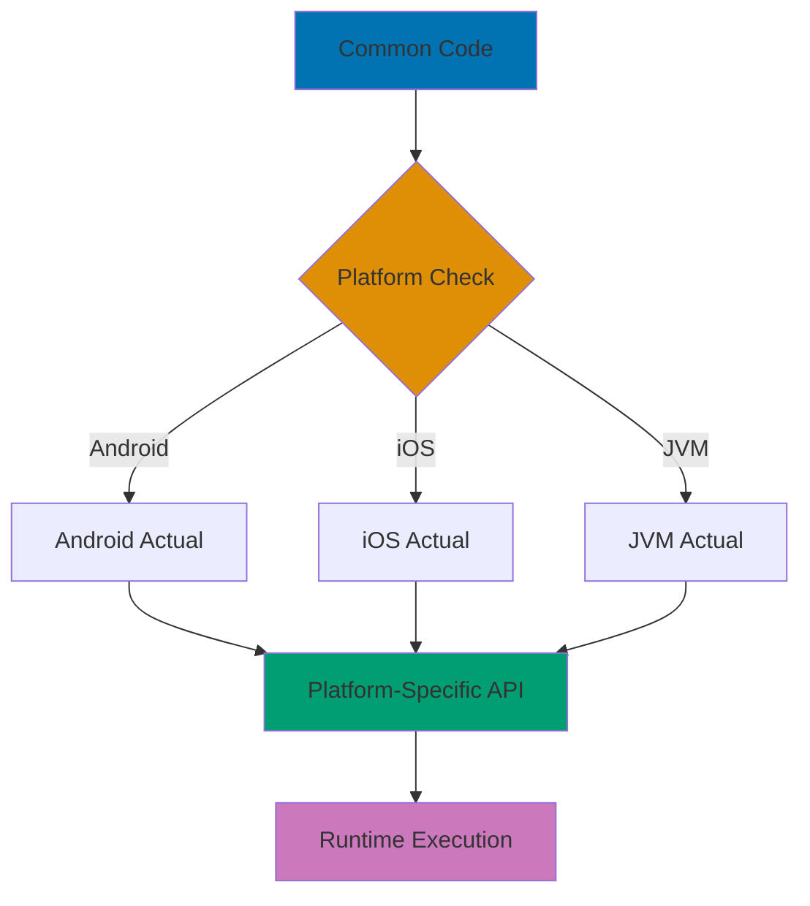

## Problem

Maintaining separate codebases for Android, iOS, and other platforms leads to code duplication, inconsistent business logic, and increased maintenance burden. Kotlin Multiplatform Mobile (KMP) allows sharing code while preserving platform-specific optimizations.

## Solution

### 1. Basic Multiplatform Project Structure

```kotlin
// Project structure
my-app/
├── shared/
│   ├── src/
│   │   ├── commonMain/kotlin/      // Shared code
│   │   ├── androidMain/kotlin/     // Android-specific
│   │   ├── iosMain/kotlin/        // iOS-specific
│   │   └── jvmMain/kotlin/        // JVM-specific (desktop)
│   └── build.gradle.kts
├── androidApp/
│   └── build.gradle.kts
└── iosApp/
    └── iosApp.xcodeproj

// build.gradle.kts (project level)
plugins {
    kotlin("multiplatform") version "2.1.0"
    id("com.android.library")
}

kotlin {
    // Target platforms
    androidTarget()
    iosX64()
    iosArm64()
    iosSimulatorArm64()
    jvm()

    sourceSets {
        val commonMain by getting {
            dependencies {
                implementation("org.jetbrains.kotlinx:kotlinx-coroutines-core:1.9.0")
                implementation("org.jetbrains.kotlinx:kotlinx-serialization-json:1.7.3")
            }
        }

        val commonTest by getting {
            dependencies {
                implementation(kotlin("test"))
            }
        }

        val androidMain by getting {
            dependencies {
                implementation("androidx.core:core-ktx:1.15.0")
            }
        }

        val iosMain by creating {
            dependsOn(commonMain)
        }
    }
}
```

### 2. Expect/Actual Declarations for Platform APIs

```kotlin
// commonMain/kotlin/Platform.kt - Expect declarations
expect class Platform() {
    val name: String
}

expect fun getPlatform(): Platform

// commonMain/kotlin/Logger.kt - Expect for platform logging
expect object Logger {
    fun log(message: String)
    fun error(message: String, throwable: Throwable?)
}

// commonMain/kotlin/Storage.kt - Expect for platform storage
expect class KeyValueStorage {
    fun getString(key: String): String?
    fun putString(key: String, value: String)
    fun remove(key: String)
    fun clear()
}

// androidMain/kotlin/Platform.kt - Android implementation
actual class Platform actual constructor() {
    actual val name: String = "Android ${android.os.Build.VERSION.SDK_INT}"
}

actual fun getPlatform(): Platform = Platform()

// androidMain/kotlin/Logger.kt - Android logging
import android.util.Log

actual object Logger {
    actual fun log(message: String) {
        Log.d("KMP", message)
    }

    actual fun error(message: String, throwable: Throwable?) {
        Log.e("KMP", message, throwable)
    }
}

// androidMain/kotlin/Storage.kt - Android SharedPreferences
import android.content.Context
import android.content.SharedPreferences

actual class KeyValueStorage(private val context: Context) {
    private val prefs: SharedPreferences =
        context.getSharedPreferences("kmp_storage", Context.MODE_PRIVATE)

    actual fun getString(key: String): String? = prefs.getString(key, null)

    actual fun putString(key: String, value: String) {
        prefs.edit().putString(key, value).apply()
    }

    actual fun remove(key: String) {
        prefs.edit().remove(key).apply()
    }

    actual fun clear() {
        prefs.edit().clear().apply()
    }
}

// iosMain/kotlin/Platform.kt - iOS implementation
import platform.UIKit.UIDevice

actual class Platform actual constructor() {
    actual val name: String =
        UIDevice.currentDevice.systemName() + " " + UIDevice.currentDevice.systemVersion
}

actual fun getPlatform(): Platform = Platform()

// iosMain/kotlin/Logger.kt - iOS NSLog
import platform.Foundation.NSLog

actual object Logger {
    actual fun log(message: String) {
        NSLog("KMP: %@", message)
    }

    actual fun error(message: String, throwable: Throwable?) {
        NSLog("KMP ERROR: %@ - %@", message, throwable?.message ?: "")
    }
}

// iosMain/kotlin/Storage.kt - iOS UserDefaults
import platform.Foundation.NSUserDefaults

actual class KeyValueStorage {
    private val userDefaults = NSUserDefaults.standardUserDefaults

    actual fun getString(key: String): String? =
        userDefaults.stringForKey(key)

    actual fun putString(key: String, value: String) {
        userDefaults.setObject(value, forKey = key)
        userDefaults.synchronize()
    }

    actual fun remove(key: String) {
        userDefaults.removeObjectForKey(key)
        userDefaults.synchronize()
    }

    actual fun clear() {
        val domain = NSBundle.mainBundle.bundleIdentifier
        if (domain != null) {
            userDefaults.removePersistentDomainForName(domain)
        }
    }
}
```

### 3. Shared Business Logic

```kotlin
// commonMain/kotlin/data/User.kt
import kotlinx.serialization.Serializable

@Serializable
data class User(
    val id: String,
    val username: String,
    val email: String
)

// commonMain/kotlin/repository/UserRepository.kt
class UserRepository(private val storage: KeyValueStorage) {
    companion object {
        private const val KEY_CURRENT_USER = "current_user"
    }

    fun saveUser(user: User) {
        val json = Json.encodeToString(User.serializer(), user)
        storage.putString(KEY_CURRENT_USER, json)
        Logger.log("User saved: ${user.username}")
    }

    fun getCurrentUser(): User? {
        val json = storage.getString(KEY_CURRENT_USER) ?: return null
        return try {
            Json.decodeFromString(User.serializer(), json)
        } catch (e: Exception) {
            Logger.error("Failed to parse user", e)
            null
        }
    }

    fun clearUser() {
        storage.remove(KEY_CURRENT_USER)
        Logger.log("User cleared")
    }
}

// commonMain/kotlin/viewmodel/UserViewModel.kt
import kotlinx.coroutines.flow.MutableStateFlow
import kotlinx.coroutines.flow.StateFlow
import kotlinx.coroutines.flow.asStateFlow

class UserViewModel(private val repository: UserRepository) {
    private val _userState = MutableStateFlow<UserState>(UserState.NotLoggedIn)
    val userState: StateFlow<UserState> = _userState.asStateFlow()

    sealed class UserState {
        object NotLoggedIn : UserState()
        data class LoggedIn(val user: User) : UserState()
    }

    fun login(username: String, email: String) {
        val user = User(
            id = generateId(),
            username = username,
            email = email
        )
        repository.saveUser(user)
        _userState.value = UserState.LoggedIn(user)
    }

    fun logout() {
        repository.clearUser()
        _userState.value = UserState.NotLoggedIn
    }

    fun loadCurrentUser() {
        val user = repository.getCurrentUser()
        _userState.value = if (user != null) {
            UserState.LoggedIn(user)
        } else {
            UserState.NotLoggedIn
        }
    }

    private fun generateId(): String {
        // Platform-specific implementation would be better
        return System.currentTimeMillis().toString()
    }
}
```

### 4. Networking with Ktor Client

```kotlin
// commonMain - build.gradle.kts
val commonMain by getting {
    dependencies {
        implementation("io.ktor:ktor-client-core:3.0.3")
        implementation("io.ktor:ktor-client-content-negotiation:3.0.3")
        implementation("io.ktor:ktor-serialization-kotlinx-json:3.0.3")
    }
}

val androidMain by getting {
    dependencies {
        implementation("io.ktor:ktor-client-okhttp:3.0.3")
    }
}

val iosMain by creating {
    dependencies {
        implementation("io.ktor:ktor-client-darwin:3.0.3")
    }
}

// commonMain/kotlin/network/ApiClient.kt
import io.ktor.client.*
import io.ktor.client.call.*
import io.ktor.client.plugins.contentnegotiation.*
import io.ktor.client.request.*
import io.ktor.serialization.kotlinx.json.*
import kotlinx.serialization.json.Json

class ApiClient {
    private val client = HttpClient {
        install(ContentNegotiation) {
            json(Json {
                ignoreUnknownKeys = true
                isLenient = true
            })
        }
    }

    suspend fun fetchUsers(): Result<List<User>> {
        return try {
            val users: List<User> = client.get("https://api.example.com/users").body()
            Result.success(users)
        } catch (e: Exception) {
            Logger.error("API call failed", e)
            Result.failure(e)
        }
    }

    suspend fun createUser(user: User): Result<User> {
        return try {
            val createdUser: User = client.post("https://api.example.com/users") {
                setBody(user)
            }.body()
            Result.success(createdUser)
        } catch (e: Exception) {
            Logger.error("Failed to create user", e)
            Result.failure(e)
        }
    }

    fun close() {
        client.close()
    }
}
```

### 5. Testing Shared Code

```kotlin
// commonTest/kotlin/UserRepositoryTest.kt
import kotlin.test.*

class UserRepositoryTest {
    private lateinit var storage: TestKeyValueStorage
    private lateinit var repository: UserRepository

    @BeforeTest
    fun setup() {
        storage = TestKeyValueStorage()
        repository = UserRepository(storage)
    }

    @Test
    fun testSaveAndRetrieveUser() {
        // Given
        val user = User(
            id = "1",
            username = "testuser",
            email = "test@example.com"
        )

        // When
        repository.saveUser(user)
        val retrieved = repository.getCurrentUser()

        // Then
        assertNotNull(retrieved)
        assertEquals(user.username, retrieved.username)
        assertEquals(user.email, retrieved.email)
    }

    @Test
    fun testClearUser() {
        // Given
        val user = User("1", "test", "test@example.com")
        repository.saveUser(user)

        // When
        repository.clearUser()
        val retrieved = repository.getCurrentUser()

        // Then
        assertNull(retrieved)
    }
}

// commonTest/kotlin/TestKeyValueStorage.kt
class TestKeyValueStorage : KeyValueStorage() {
    private val storage = mutableMapOf<String, String>()

    override fun getString(key: String): String? = storage[key]

    override fun putString(key: String, value: String) {
        storage[key] = value
    }

    override fun remove(key: String) {
        storage.remove(key)
    }

    override fun clear() {
        storage.clear()
    }
}
```

## How It Works



**Compilation Process:**

1. **Common Code**: Business logic, data models, ViewModels written once
2. **Expect Declarations**: Define platform-specific APIs without implementation
3. **Actual Implementations**: Each platform provides concrete implementation
4. **Compilation**: Kotlin compiler resolves expect/actual at compile time
5. **Platform Binaries**: Each target gets optimized platform-specific code

## Variations

### Hierarchical Source Sets

```kotlin
kotlin {
    sourceSets {
        // All platforms
        val commonMain by getting

        // All Native platforms (iOS, watchOS, tvOS, macOS)
        val nativeMain by creating {
            dependsOn(commonMain)
        }

        // All iOS platforms (device + simulator)
        val iosMain by creating {
            dependsOn(nativeMain)
        }

        // Specific iOS targets
        val iosX64Main by getting {
            dependsOn(iosMain)
        }

        val iosArm64Main by getting {
            dependsOn(iosMain)
        }

        val iosSimulatorArm64Main by getting {
            dependsOn(iosMain)
        }
    }
}
```

### Intermediate Source Sets for Code Reuse

```kotlin
// Create intermediate source set for mobile platforms
val mobileMain by creating {
    dependsOn(commonMain)
}

val androidMain by getting {
    dependsOn(mobileMain)
}

val iosMain by creating {
    dependsOn(mobileMain)
}

// Shared mobile code (not in desktop)
// mobileMain/kotlin/mobile/MobileFeature.kt
class MobileFeature {
    fun getDeviceInfo(): String {
        return "Mobile platform: ${getPlatform().name}"
    }
}
```

### CocoaPods Integration for iOS

```kotlin
kotlin {
    cocoapods {
        summary = "Shared module for iOS"
        homepage = "https://github.com/your/project"
        ios.deploymentTarget = "14.0"
        framework {
            baseName = "shared"
            isStatic = true
        }
    }
}
```

## Common Pitfalls

### 1. Using JVM/Android APIs in Common Code

**Problem**: Accidentally using platform-specific APIs breaks compilation.

```kotlin
// ❌ Bad: Using java.util.Date in common code
import java.util.Date  // Compile error!

fun getCurrentTimestamp(): Long {
    return Date().time
}

// ✅ Good: Use kotlinx-datetime
import kotlinx.datetime.Clock

fun getCurrentTimestamp(): Long {
    return Clock.System.now().toEpochMilliseconds()
}
```

### 2. Not Handling Platform Differences

**Problem**: Assuming all platforms behave identically.

```kotlin
// ❌ Bad: Assuming file system access works the same
fun saveToFile(data: String) {
    File("/data/file.txt").writeText(data)  // Won't work on iOS!
}

// ✅ Good: Use expect/actual for file operations
expect class FileWriter {
    fun write(filename: String, data: String)
}

// androidMain
actual class FileWriter(private val context: Context) {
    actual fun write(filename: String, data: String) {
        context.openFileOutput(filename, Context.MODE_PRIVATE).use {
            it.write(data.toByteArray())
        }
    }
}

// iosMain
actual class FileWriter {
    actual fun write(filename: String, data: String) {
        val documentsDirectory = NSFileManager.defaultManager.URLsForDirectory(
            NSDocumentDirectory,
            NSUserDomainMask
        ).first() as NSURL

        val fileURL = documentsDirectory.URLByAppendingPathComponent(filename)
        data.writeToURL(fileURL!!, atomically = true, encoding = NSUTF8StringEncoding, error = null)
    }
}
```

### 3. Memory Leaks with Kotlin/Native

**Problem**: Kotlin/Native uses garbage collection - beware of iOS retain cycles.

```kotlin
// ❌ Bad: Strong reference cycle
class ViewController {
    val callback: () -> Unit = {
        // Captures 'this' strongly
        this.updateUI()
    }
}

// ✅ Good: Use weak references
class ViewController {
    val callback: () -> Unit = { [weak self] in
        self?.updateUI()
    }
}

// ✅ Better: Use Kotlin's approach
class ViewController {
    private var updateCallback: (() -> Unit)? = null

    fun setCallback() {
        updateCallback = {
            updateUI()
        }
    }

    fun cleanup() {
        updateCallback = null  // Break reference
    }
}
```

### 4. Not Testing on All Platforms

**Problem**: Code works on Android but fails on iOS.

```kotlin
// ❌ Bad: Only testing on Android
@Test
fun testFeature() {
    // Test passes on Android but might fail on iOS
}

// ✅ Good: Write platform-agnostic tests in commonTest
// commonTest/kotlin/FeatureTest.kt
class FeatureTest {
    @Test
    fun testFeatureCrossPlatform() {
        // Test runs on all platforms
        val result = sharedFunction()
        assertEquals("expected", result)
    }
}

// Run tests on all platforms
// ./gradlew cleanAllTests allTests
```

### 5. Ignoring iOS Framework Export

**Problem**: Types not exposed to iOS won't be accessible in Swift.

```kotlin
// ❌ Bad: Internal visibility prevents iOS access
internal class UserRepository  // Not visible in Swift!

// ✅ Good: Public API surface
class UserRepository {  // Visible in Swift
    fun getUser(): User {
        return fetchUserInternal()
    }

    private fun fetchUserInternal(): User {
        // Implementation details remain private
    }
}

// Configure exported types
kotlin {
    targets.withType<KotlinNativeTarget> {
        binaries.framework {
            export("com.example:shared-models:1.0.0")
        }
    }
}
```

## Related Patterns

**Related Tutorial**: See [Advanced Tutorial - Multiplatform](/en/learn/software-engineering/programming-language/kotlin/tutorials/advanced#multiplatform).
**Related How-To**: See [Handle Coroutines and Async](/en/learn/software-engineering/programming-language/kotlin/how-to/handle-coroutines-and-async).
**Related Cookbook**: See Cookbook recipe "Multiplatform Patterns".
