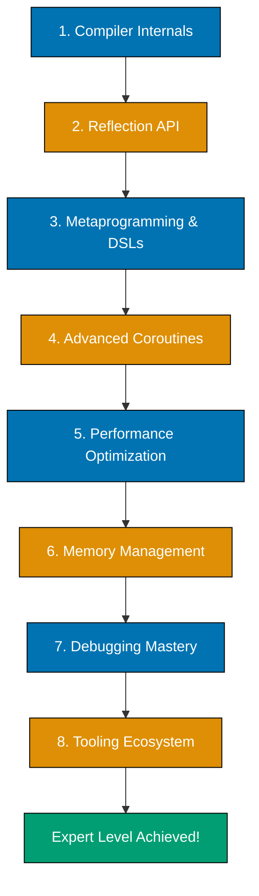

---

**Achieve expert-level Kotlin mastery.** This tutorial covers advanced topics that separate intermediate developers from experts. You'll explore compiler internals, master reflection and metaprogramming, optimize performance at a deep level, debug complex issues, and contribute to the Kotlin ecosystem.

## What You'll Achieve

By the end of this tutorial, you'll be able to:

- ✅ Understand Kotlin compiler optimizations and bytecode generation
- ✅ Use reflection for runtime type inspection and manipulation
- ✅ Create DSLs with type-safe builders and metaprogramming
- ✅ Master advanced coroutine patterns (custom dispatchers, Flow internals)
- ✅ Optimize performance with inline classes, reified types, and JVM internals
- ✅ Debug complex issues with stack traces, memory analysis, and profiling
- ✅ Contribute to Kotlin libraries and frameworks
- ✅ Make informed architecture decisions based on compiler behavior
- ✅ Write highly optimized, production-critical code
- ✅ Mentor other developers on advanced Kotlin concepts

## Prerequisites

- **Completed** [Intermediate Kotlin](/en/learn/software-engineering/programming-language/kotlin/tutorials/intermediate) - You understand production patterns
- **Experience** Building real Kotlin applications
- **Familiarity** With JVM basics (bytecode, garbage collection)

## Learning Path Overview

This tutorial covers **85-95% of Kotlin** - expert mastery. You'll dive deep into:

- **Compiler Internals** - K2 compiler, bytecode generation, optimizations
- **Reflection** - Runtime type inspection, KClass, KFunction, annotations
- **Metaprogramming** - DSL builders, type-safe builders, @DslMarker
- **Advanced Coroutines** - Custom dispatchers, Flow operators, shared state
- **Performance Optimization** - Inline classes, reified generics, JVM tuning
- **Memory Management** - Avoiding allocations, object pooling, GC tuning
- **Debugging** - Stack traces, profiling, memory leaks, concurrency issues
- **Tooling Ecosystem** - Compiler plugins, KSP, code generation

**Note**: This is expert-level material. Real-world experience with Kotlin is highly recommended.



---

## Part 1: Kotlin Compiler Internals

### K2 Compiler Architecture

Kotlin 2.x uses the K2 compiler with significant performance improvements.

**Compilation Phases**:

1. **Parsing** - Source code → Abstract Syntax Tree (AST)
2. **Frontend** - Type resolution, inference, diagnostics
3. **IR (Intermediate Representation)** - Platform-independent representation
4. **Backend** - IR → JVM bytecode (or JS/Native)

**Key improvements in K2**:

- Faster compilation (up to 2x faster for large projects)
- Better type inference
- Improved smart casts
- More consistent diagnostics

### Inline Functions and Bytecode

```kotlin
// Regular function
fun regularLog(message: String) {
    println("LOG: $message")
}

// Inline function - code is copied to call site
inline fun inlineLog(message: String) {
    println("LOG: $message")
}

fun main() {
    regularLog("Hello")  // Generates function call
    inlineLog("Hello")   // Code is inlined (no function call)
}
```

**Generated bytecode** (simplified):

```
// regularLog call:
INVOKESTATIC regularLog(Ljava/lang/String;)V

// inlineLog call:
LDC "LOG: Hello"
INVOKEVIRTUAL println(Ljava/lang/String;)V
```

**Benefit**: Eliminates function call overhead, especially useful for higher-order functions.

### Reified Type Parameters

Normally, generics are erased at runtime. Reified types preserve type information.

```kotlin
// Normal generic (type erased)
fun <T> printType(value: T) {
    // Cannot check T at runtime
    // println(value is T)  // ERROR: Cannot check for erased type
}

// Reified generic (type preserved)
inline fun <reified T> printTypeReified(value: T) {
    println("Type: ${T::class.simpleName}")
    println("Is String: ${value is String}")
    println("Is Int: ${value is Int}")
}

fun main() {
    printTypeReified("Hello")  // Type: String, Is String: true
    printTypeReified(42)       // Type: Int, Is Int: true
}
```

**How it works**: `reified` only works with `inline` functions. The compiler substitutes the actual type at call site.

### Inline Classes (Value Classes)

Inline classes eliminate wrapper overhead.

```kotlin
@JvmInline
value class UserId(val value: Int)

@JvmInline
value class Email(val value: String)

fun sendEmail(userId: UserId, email: Email) {
    println("Sending to user ${userId.value}: ${email.value}")
}

fun main() {
    val userId = UserId(123)
    val email = Email("user@example.com")

    sendEmail(userId, email)
    // Compiler generates: sendEmail(123, "user@example.com")
    // No wrapper objects at runtime!
}
```

**Benefit**: Type safety without runtime overhead. The wrapper is erased in bytecode.

### Compiler Optimizations You Should Know

1. **String templates** → StringBuilder (for concatenation)
2. **Range iteration** → Optimized loop (no iterator object)
3. **Inline lambdas** → Direct code insertion
4. **Data class methods** → Generated by compiler
5. **Sealed class when** → Exhaustiveness check at compile time

---

## Part 2: Reflection and Runtime Metadata

### KClass, KFunction, and KProperty

```kotlin
import kotlin.reflect.full.*

data class User(val name: String, val age: Int) {
    fun greet() = "Hello, I'm $name"
}

fun main() {
    val userClass = User::class

    // Class information
    println("Simple name: ${userClass.simpleName}")
    println("Qualified name: ${userClass.qualifiedName}")

    // Member properties
    userClass.memberProperties.forEach { prop ->
        println("Property: ${prop.name}, type: ${prop.returnType}")
    }

    // Member functions
    userClass.memberFunctions.forEach { func ->
        println("Function: ${func.name}")
    }

    // Create instance and invoke
    val constructor = userClass.primaryConstructor!!
    val user = constructor.call("Alice", 25)
    println(user)

    // Get property value
    val nameProp = userClass.memberProperties.find { it.name == "name" }!!
    println("Name via reflection: ${nameProp.get(user)}")

    // Call function
    val greetFunc = userClass.memberFunctions.find { it.name == "greet" }!!
    println(greetFunc.call(user))
}
```

### Annotations and Reflection

```kotlin
@Target(AnnotationTarget.CLASS, AnnotationTarget.FUNCTION)
@Retention(AnnotationRetention.RUNTIME)
annotation class ApiEndpoint(val path: String, val method: String = "GET")

@ApiEndpoint("/users", "GET")
class UserController {
    @ApiEndpoint("/users/{id}", "GET")
    fun getUser(id: Int): String {
        return "User $id"
    }

    @ApiEndpoint("/users", "POST")
    fun createUser(name: String): String {
        return "Created $name"
    }
}

fun main() {
    val controller = UserController::class

    // Class annotations
    controller.annotations.forEach { annotation ->
        if (annotation is ApiEndpoint) {
            println("Controller: ${annotation.path} [${annotation.method}]")
        }
    }

    // Function annotations
    controller.memberFunctions.forEach { func ->
        func.annotations.forEach { annotation ->
            if (annotation is ApiEndpoint) {
                println("  Endpoint: ${func.name} → ${annotation.path} [${annotation.method}]")
            }
        }
    }
}
```

### Dynamic Proxies and Invocation Handlers

```kotlin
import java.lang.reflect.InvocationHandler
import java.lang.reflect.Proxy

interface UserRepository {
    fun findById(id: Int): String
    fun save(user: String): Boolean
}

class LoggingInvocationHandler : InvocationHandler {
    override fun invoke(proxy: Any, method: java.lang.reflect.Method, args: Array<out Any>?): Any {
        println("Method called: ${method.name}")
        println("Arguments: ${args?.joinToString()}")

        // Simulate implementation
        return when (method.name) {
            "findById" -> "User ${args?.get(0)}"
            "save" -> true
            else -> Unit
        }
    }
}

fun main() {
    val handler = LoggingInvocationHandler()
    val proxy = Proxy.newProxyInstance(
        UserRepository::class.java.classLoader,
        arrayOf(UserRepository::class.java),
        handler
    ) as UserRepository

    println(proxy.findById(123))
    println(proxy.save("Alice"))
}
```

---

## Part 3: DSL Building and Metaprogramming

### Type-Safe Builders

```kotlin
class HtmlBuilder {
    private val elements = mutableListOf<String>()

    fun head(init: HeadBuilder.() -> Unit) {
        val head = HeadBuilder()
        head.init()
        elements.add("<head>${head.build()}</head>")
    }

    fun body(init: BodyBuilder.() -> Unit) {
        val body = BodyBuilder()
        body.init()
        elements.add("<body>${body.build()}</body>")
    }

    fun build() = "<html>${elements.joinToString("")}</html>"
}

class HeadBuilder {
    private val elements = mutableListOf<String>()

    fun title(text: String) {
        elements.add("<title>$text</title>")
    }

    fun build() = elements.joinToString("")
}

class BodyBuilder {
    private val elements = mutableListOf<String>()

    fun h1(text: String) {
        elements.add("<h1>$text</h1>")
    }

    fun p(text: String) {
        elements.add("<p>$text</p>")
    }

    fun build() = elements.joinToString("")
}

fun html(init: HtmlBuilder.() -> Unit): String {
    val builder = HtmlBuilder()
    builder.init()
    return builder.build()
}

fun main() {
    val page = html {
        head {
            title("My Page")
        }
        body {
            h1("Welcome")
            p("This is a paragraph")
        }
    }
    println(page)
}
```

### @DslMarker for Type Safety

```kotlin
@DslMarker
annotation class HtmlDsl

@HtmlDsl
class HtmlBuilder {
    // ... builder code ...
}

@HtmlDsl
class HeadBuilder {
    // ... builder code ...
}

@HtmlDsl
class BodyBuilder {
    // ... builder code ...
}

// Now this is prevented:
/*
html {
    head {
        body {  // ERROR: Can't call body() inside head()
            // ...
        }
    }
}
*/
```

**Benefit**: `@DslMarker` prevents accidental nesting of incompatible builders.

---

## Part 4: Advanced Coroutines

### Custom Coroutine Dispatchers

```kotlin
import kotlinx.coroutines.*
import java.util.concurrent.Executors

val customDispatcher = Executors.newFixedThreadPool(4).asCoroutineDispatcher()

fun main() = runBlocking {
    launch(customDispatcher) {
        println("Running on custom dispatcher: ${Thread.currentThread().name}")
    }

    delay(100)
    customDispatcher.close()
}
```

### Flow Operators Deep Dive

```kotlin
import kotlinx.coroutines.*
import kotlinx.coroutines.flow.*

fun main() = runBlocking {
    // StateFlow - hot flow with state
    val stateFlow = MutableStateFlow(0)
    launch {
        stateFlow.collect { println("StateFlow: $it") }
    }
    stateFlow.value = 1
    stateFlow.value = 2

    delay(100)

    // SharedFlow - hot flow without initial value
    val sharedFlow = MutableSharedFlow<Int>(replay = 2)
    launch {
        sharedFlow.collect { println("SharedFlow collector 1: $it") }
    }
    launch {
        delay(50)
        sharedFlow.collect { println("SharedFlow collector 2: $it") }
    }
    sharedFlow.emit(1)
    sharedFlow.emit(2)
    sharedFlow.emit(3)

    delay(100)

    // Custom flow operators
    val numbers = flowOf(1, 2, 3, 4, 5)

    numbers
        .transform { value ->
            emit(value)
            emit(value * 10)
        }
        .collect { println("Transform: $it") }

    numbers
        .scan(0) { acc, value -> acc + value }
        .collect { println("Scan: $it") }
}
```

### Handling Shared Mutable State

```kotlin
import kotlinx.coroutines.*
import kotlinx.coroutines.sync.Mutex
import kotlinx.coroutines.sync.withLock
import java.util.concurrent.atomic.AtomicInteger

// Bad: Race condition
var counter1 = 0
fun incrementBad() = runBlocking {
    repeat(1000) {
        launch {
            counter1++
        }
    }
}

// Good: Atomic
val counter2 = AtomicInteger(0)
fun incrementAtomic() = runBlocking {
    repeat(1000) {
        launch {
            counter2.incrementAndGet()
        }
    }
}

// Good: Mutex
val counter3 = 0
val mutex = Mutex()
suspend fun incrementMutex() = coroutineScope {
    var counter = counter3
    repeat(1000) {
        launch {
            mutex.withLock {
                counter++
            }
        }
    }
}

fun main() = runBlocking {
    incrementAtomic()
    println("Atomic counter: ${counter2.get()}")  // Always 1000

    incrementMutex()
    // println("Mutex counter: $counter3")  // Always 1000
}
```

---

## Part 5: Performance Optimization

### Avoiding Boxing with Inline Classes

```kotlin
// Without inline class - boxing occurs
data class RegularId(val value: Int)

fun processRegular(id: RegularId) {
    // Int is boxed into Integer object
}

// With inline class - no boxing
@JvmInline
value class OptimizedId(val value: Int)

fun processOptimized(id: OptimizedId) {
    // Int stays primitive, no boxing
}

fun main() {
    // Regular: Creates object
    val regular = RegularId(123)

    // Optimized: No object at runtime (primitive Int)
    val optimized = OptimizedId(123)
}
```

### Sequence vs Collection Performance

```kotlin
import kotlin.system.measureTimeMillis

fun main() {
    val size = 10_000_000

    // Collection - eager evaluation
    val collectionTime = measureTimeMillis {
        val result = (1..size)
            .map { it * 2 }
            .filter { it % 3 == 0 }
            .take(10)
            .toList()
    }

    // Sequence - lazy evaluation
    val sequenceTime = measureTimeMillis {
        val result = (1..size).asSequence()
            .map { it * 2 }
            .filter { it % 3 == 0 }
            .take(10)
            .toList()
    }

    println("Collection time: ${collectionTime}ms")
    println("Sequence time: ${sequenceTime}ms")
    // Sequence is significantly faster (only processes 15 elements, not 10M)
}
```

### JVM Tuning for Kotlin Applications

**Key JVM flags**:

```bash
-Xms2g -Xmx4g

-XX:+UseG1GC

-Xlog:gc*:file=gc.log

-XX:+PrintCompilation

-XX:+AggressiveOpts
```

**Monitoring**:

```kotlin
import java.lang.management.ManagementFactory

fun printMemoryUsage() {
    val runtime = Runtime.getRuntime()
    val mb = 1024 * 1024

    println("Used Memory: ${(runtime.totalMemory() - runtime.freeMemory()) / mb} MB")
    println("Free Memory: ${runtime.freeMemory() / mb} MB")
    println("Total Memory: ${runtime.totalMemory() / mb} MB")
    println("Max Memory: ${runtime.maxMemory() / mb} MB")
}

fun printGCStats() {
    val gcBeans = ManagementFactory.getGarbageCollectorMXBeans()
    gcBeans.forEach { gc ->
        println("GC: ${gc.name}")
        println("  Collections: ${gc.collectionCount}")
        println("  Time: ${gc.collectionTime}ms")
    }
}

fun main() {
    printMemoryUsage()
    printGCStats()
}
```

---

## Part 6: Debugging Strategies

### Stack Trace Analysis

```kotlin
fun level1() {
    level2()
}

fun level2() {
    level3()
}

fun level3() {
    throw RuntimeException("Error in level3")
}

fun main() {
    try {
        level1()
    } catch (e: Exception) {
        println("Exception message: ${e.message}")
        println("\nStack trace:")
        e.stackTrace.forEach { element ->
            println("  at ${element.className}.${element.methodName}(${element.fileName}:${element.lineNumber})")
        }
    }
}
```

### Coroutine Debugging

```kotlin
import kotlinx.coroutines.*

fun main() = runBlocking {
    // Enable coroutine debugging
    System.setProperty("kotlinx.coroutines.debug", "on")

    launch(CoroutineName("Worker-1")) {
        println("Worker 1: ${Thread.currentThread().name}")
        delay(100)
        println("Worker 1 done")
    }

    launch(CoroutineName("Worker-2")) {
        println("Worker 2: ${Thread.currentThread().name}")
        delay(50)
        throw RuntimeException("Worker 2 failed")
    }

    delay(200)
}
```

### Memory Leak Detection

```kotlin
import java.lang.ref.WeakReference

class LeakyClass {
    companion object {
        private val cache = mutableMapOf<Int, String>()

        fun store(id: Int, value: String) {
            cache[id] = value  // Memory leak: never cleared
        }
    }
}

class NonLeakyClass {
    companion object {
        private val cache = mutableMapOf<Int, WeakReference<String>>()

        fun store(id: Int, value: String) {
            cache[id] = WeakReference(value)  // GC can collect
        }

        fun get(id: Int): String? {
            return cache[id]?.get()
        }
    }
}

fun main() {
    // LeakyClass will accumulate memory
    repeat(1000000) {
        LeakyClass.store(it, "Value $it")
    }

    // NonLeakyClass allows GC
    repeat(1000000) {
        NonLeakyClass.store(it, "Value $it")
    }
    System.gc()
    println("After GC, cache may be cleared")
}
```

---

## Part 7: Kotlin Tooling Ecosystem

### KSP (Kotlin Symbol Processing)

KSP is the modern replacement for kapt (Kotlin Annotation Processing Tool).

**Advantages**:

- 2x faster than kapt
- Better Kotlin support
- Cleaner API

**Example**: Room, Moshi, Hilt use KSP

**build.gradle.kts**:

```kotlin
plugins {
    id("com.google.devtools.ksp") version "2.3.0-1.0.22"
}

dependencies {
    ksp("androidx.room:room-compiler:2.6.0")
}
```

### Compiler Plugins

Kotlin supports compiler plugins for code generation and analysis.

**Popular plugins**:

- **kotlin-parcelize** - Android Parcelable generation
- **kotlin-serialization** - Serialization plugin
- **kotlin-allopen** - Opens classes for frameworks
- **kotlin-noarg** - No-arg constructor for JPA

**build.gradle.kts**:

```kotlin
plugins {
    kotlin("plugin.serialization") version "2.3.0"
}
```

---

## Part 8: Contributing to Kotlin Ecosystem

### Writing Libraries

```kotlin
// Library design principles

// 1. Use inline for performance-critical APIs
inline fun <T> measure(block: () -> T): Pair<T, Long> {
    val start = System.nanoTime()
    val result = block()
    val time = System.nanoTime() - start
    return result to time
}

// 2. Provide DSL for configuration
class LibraryConfig {
    var timeout: Int = 30000
    var retryCount: Int = 3

    fun retry(block: RetryConfig.() -> Unit) {
        val config = RetryConfig()
        config.block()
    }
}

class RetryConfig {
    var attempts: Int = 3
    var delay: Long = 1000
}

fun configureLibrary(init: LibraryConfig.() -> Unit): LibraryConfig {
    val config = LibraryConfig()
    config.init()
    return config
}

// 3. Use sealed classes for result types
sealed class Result<out T> {
    data class Success<T>(val value: T) : Result<T>()
    data class Error(val exception: Throwable) : Result<Nothing>()
}
```

### API Design Best Practices

1. **Immutability by default** - Use `val` and immutable collections
2. **Null safety** - Avoid nullable types in public APIs
3. **Extension functions** - For utility methods
4. **Inline functions** - For higher-order functions
5. **DSL builders** - For complex configuration
6. **Sealed classes** - For restricted hierarchies
7. **Inline classes** - For type-safe primitives
8. **Coroutines** - For async operations

---

## Advanced Practice Project: Custom ORM

Build a simple Object-Relational Mapping library.

### Requirements

**Features**:

1. Define entities with annotations
2. Generate SQL DDL from entities
3. CRUD operations
4. Query DSL
5. Connection pooling
6. Transaction support
7. Reflection-based mapping
8. Type-safe queries

**Technical Requirements**:

- Reflection for entity inspection
- Annotations for metadata
- DSL for query building
- Inline functions for performance
- Coroutines for async operations
- Comprehensive tests

### Example Usage

```kotlin
@Entity
@Table("users")
data class User(
    @PrimaryKey
    @Column("id")
    val id: Int,

    @Column("name")
    val name: String,

    @Column("email")
    val email: String
)

fun main() = runBlocking {
    val orm = ORM {
        datasource {
            url = "jdbc:postgresql://localhost/mydb"
            username = "postgres"
            password = "password"
        }
    }

    // Query DSL
    val users = orm.query<User> {
        where { User::email eq "alice@example.com" }
        orderBy { User::name.asc() }
        limit(10)
    }

    // CRUD
    val user = User(1, "Alice", "alice@example.com")
    orm.insert(user)
    orm.update(user.copy(name = "Alice Updated"))
    orm.delete(user)
}
```

---

## Kotlin Multiplatform

Kotlin Multiplatform enables code sharing across platforms (JVM, JavaScript, Native, Android, iOS).

### Multiplatform Project Structure

Organize multiplatform modules with expect/actual pattern.

```kotlin
// Common module (shared code)
// src/commonMain/kotlin/User.kt
expect class Platform() {
    val name: String
}

data class User(val id: String, val name: String)

fun greeting(): String {
    val platform = Platform()
    return "Hello from ${platform.name}"
}

// JVM actual implementation
// src/jvmMain/kotlin/PlatformJvm.kt
actual class Platform {
    actual val name: String = "JVM ${System.getProperty("java.version")}"
}

// iOS actual implementation
// src/iosMain/kotlin/PlatformIos.kt
import platform.UIKit.UIDevice

actual class Platform {
    actual val name: String =
        UIDevice.currentDevice.systemName() + " " +
        UIDevice.currentDevice.systemVersion
}

// JavaScript actual implementation
// src/jsMain/kotlin/PlatformJs.kt
actual class Platform {
    actual val name: String = "Browser"
}
```

**How it works**: `expect` declares platform-specific API in common code. `actual` provides platform implementations. Compiler selects correct implementation at build time.

### Sharing Business Logic

Share domain models and business rules across platforms.

```kotlin
// Common business logic
// src/commonMain/kotlin/UserService.kt
class UserService {
    private val users = mutableMapOf<String, User>()

    suspend fun createUser(user: User): Result<User> {
        return try {
            users[user.id] = user
            Result.success(user)
        } catch (e: Exception) {
            Result.failure(e)
        }
    }

    suspend fun getUser(id: String): Result<User> {
        return users[id]?.let { Result.success(it) }
            ?: Result.failure(Exception("User not found"))
    }

    suspend fun getAllUsers(): List<User> {
        return users.values.toList()
    }
}

// Platform-specific network layer
// src/commonMain/kotlin/NetworkClient.kt
expect class NetworkClient() {
    suspend fun get(url: String): String
    suspend fun post(url: String, body: String): String
}

// JVM implementation (using Ktor)
// src/jvmMain/kotlin/NetworkClientJvm.kt
import io.ktor.client.*
import io.ktor.client.engine.cio.*
import io.ktor.client.request.*
import io.ktor.client.statement.*

actual class NetworkClient {
    private val client = HttpClient(CIO)

    actual suspend fun get(url: String): String {
        return client.get(url).bodyAsText()
    }

    actual suspend fun post(url: String, body: String): String {
        return client.post(url) { setBody(body) }.bodyAsText()
    }
}
```

**Benefits**: Write business logic once, use everywhere. Platform-specific code only for platform APIs (UI, network, storage).

### Kotlin/Native Memory Model

Kotlin/Native has unique memory management for iOS/native targets.

```kotlin
// Sharing mutable state in Kotlin/Native
import kotlinx.atomicfu.*
import kotlin.native.concurrent.*

// ❌ Problem: Global mutable state not thread-safe in Kotlin/Native
var counter = 0  // Not safe across threads

// ✅ Solution: Use atomic operations
private val atomicCounter = atomic(0)

fun incrementCounter(): Int {
    return atomicCounter.incrementAndGet()
}

// Working with frozen objects
data class FrozenData(val value: String)

val data = FrozenData("immutable").freeze()
// data is now frozen, cannot be modified

// Sharing objects between threads
@SharedImmutable
val sharedConfig = Config(apiKey = "abc123")

// Using new memory model (Kotlin 1.7.20+)
// Enables sharing mutable state similar to JVM
class SharedViewModel {
    private val _state = MutableStateFlow<Int>(0)
    val state: StateFlow<Int> = _state.asStateFlow()

    fun increment() {
        _state.value++
    }
}
```

**Note**: Kotlin 1.7.20+ introduced new memory model removing most freeze/immutability requirements. Check target Kotlin version for available features.

---

## Key Takeaways

You've achieved expert Kotlin mastery:

- ✅ **Compiler Internals** - K2 architecture, bytecode generation, inline functions, reified types
- ✅ **Reflection** - Runtime type inspection, annotations, dynamic proxies
- ✅ **Metaprogramming** - DSL builders, type-safe builders, @DslMarker
- ✅ **Advanced Coroutines** - Custom dispatchers, Flow operators, shared state management
- ✅ **Performance** - Inline classes, sequence optimization, JVM tuning
- ✅ **Debugging** - Stack traces, coroutine debugging, memory leak detection
- ✅ **Tooling** - KSP, compiler plugins, code generation
- ✅ **Ecosystem** - Library design, API best practices, contributing to open source

**You're now ready to**:

- Architect large-scale Kotlin systems
- Optimize performance-critical code
- Debug complex production issues
- Design and publish Kotlin libraries
- Contribute to Kotlin open source projects
- Mentor other Kotlin developers
- Make informed technical decisions based on compiler behavior

---

## What's Next?

1. **Contribute to open source** - Find Kotlin projects on GitHub, submit PRs
2. **Write technical articles** - Share your expertise on Medium, Dev.to
3. **Speak at conferences** - KotlinConf, local meetups
4. **Build frameworks** - Create libraries that others will use
5. **Stay current** - Follow Kotlin evolution, new K2 features
6. **Explore Kotlin Multiplatform** - Share code across JVM, Android, iOS, Web

### Resources

- **Internal Resources**:
  - [Intermediate Kotlin](/en/learn/software-engineering/programming-language/kotlin/tutorials/intermediate) - Review production patterns
  - [Complete Beginner's Guide](/en/learn/software-engineering/programming-language/kotlin/tutorials/beginner) - Refresh fundamentals
  - [Quick Start](/en/learn/software-engineering/programming-language/kotlin/tutorials/quick-start) - Quick syntax review
  - [Kotlin Cookbook](/en/learn/software-engineering/programming-language/kotlin/how-to/cookbook) - Advanced recipes
  - [Kotlin Best Practices](/en/learn/software-engineering/programming-language/kotlin/explanation/best-practices) - Expert standards
  - [Kotlin Anti-Patterns](/en/learn/software-engineering/programming-language/kotlin/explanation/anti-patterns) - Advanced pitfalls
  - [Kotlin Glossary](/en/learn/software-engineering/programming-language/kotlin/reference/glossary) - Expert terminology
  - [Kotlin Cheat Sheet](/en/learn/software-engineering/programming-language/kotlin/reference/cheat-sheet) - Complete reference
  - [Kotlin Learning Resources](/en/learn/software-engineering/programming-language/kotlin/reference/learning-resources) - External materials

- **Kotlin Language Spec**: [https://kotlinlang.org/spec/](https://kotlinlang.org/spec/)
- **Kotlin GitHub**: [https://github.com/Kotlin/kotlin](https://github.com/Kotlin/kotlin)
- **KEEP (Kotlin Evolution and Enhancement Process)**: [https://github.com/Kotlin/KEEP](https://github.com/Kotlin/KEEP)
- **KotlinConf**: [https://kotlinconf.com/](https://kotlinconf.com/)

---

**Advanced Tutorial Complete!** You've reached expert-level Kotlin mastery. Keep building, sharing, and contributing to the Kotlin community!
