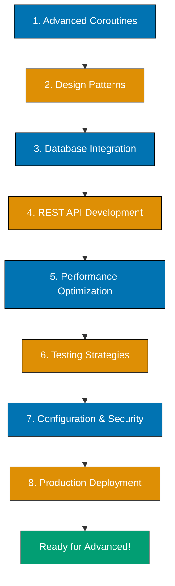

---

**Build production-ready Kotlin applications.** This tutorial covers everything you need to write professional, scalable Kotlin code for real-world projects. You'll master advanced coroutines, implement design patterns, work with databases, build REST APIs, optimize performance, and apply comprehensive testing strategies.

## What You'll Achieve

By the end of this tutorial, you'll be able to:

- ✅ Master coroutines for concurrent and async programming
- ✅ Implement design patterns idiomatically in Kotlin
- ✅ Integrate databases using JDBC and type-safe DSLs
- ✅ Build REST APIs with Ktor framework
- ✅ Optimize code for performance and memory efficiency
- ✅ Apply comprehensive testing strategies (unit, integration, mocking)
- ✅ Handle configuration and environment management
- ✅ Implement security best practices
- ✅ Debug and troubleshoot complex Kotlin applications
- ✅ Build complete production-grade backend services

## Prerequisites

- **Completed** [Complete Beginner's Guide to Kotlin](/en/learn/software-engineering/programming-language/kotlin/tutorials/by-concept/beginner) - You understand fundamentals
- **Familiarity with** Basic coroutines concept (from Quick Start or Beginner)
- **Optional** Experience with backend development helps but isn't required

## Learning Path Overview

This tutorial covers **60-85% of Kotlin** - production patterns and advanced topics. You'll build on fundamentals to create real-world applications:

- **Advanced Coroutines** - Structured concurrency, Flow, channels, dispatchers
- **Design Patterns** - Singleton, Factory, Builder, Observer, Strategy (Kotlin way)
- **Database Integration** - JDBC, connection pooling, transactions
- **REST API Development** - Ktor framework, routing, serialization, validation
- **Performance** - Profiling, optimization, memory management
- **Testing Strategies** - MockK, coroutine testing, integration tests
- **Configuration** - Environment variables, config files, type-safe config
- **Security** - Input validation, authentication basics, SQL injection prevention

**Structure**: This tutorial is organized into 8 practical sections with production-ready examples.



---

## Part 1: Advanced Coroutines

### Structured Concurrency

Structured concurrency ensures coroutines are properly managed and cancelled.

```kotlin
import kotlinx.coroutines.*

suspend fun fetchUserData(): String {
    delay(1000)
    return "User data"
}

suspend fun fetchProducts(): String {
    delay(1500)
    return "Products"
}

fun main() = runBlocking {
    val result = coroutineScope {
        val user = async { fetchUserData() }
        val products = async { fetchProducts() }

        "${user.await()} + ${products.await()}"
    }

    println(result)  // Both run concurrently, ~1.5s total
}
```

**Key point**: `coroutineScope` waits for all children to complete before returning.

### Coroutine Dispatchers

```kotlin
import kotlinx.coroutines.*

fun main() = runBlocking {
    // Dispatchers.Default - CPU-intensive work
    launch(Dispatchers.Default) {
        println("CPU work on: ${Thread.currentThread().name}")
    }

    // Dispatchers.IO - I/O operations (network, database, files)
    launch(Dispatchers.IO) {
        println("I/O work on: ${Thread.currentThread().name}")
    }

    // Dispatchers.Main - UI updates (Android/Desktop UI)
    // Not available in JVM backend

    // Dispatchers.Unconfined - Advanced, rarely needed
    delay(100)
}
```

### Exception Handling in Coroutines

```kotlin
import kotlinx.coroutines.*

fun main() = runBlocking {
    val handler = CoroutineExceptionHandler { _, exception ->
        println("Caught exception: ${exception.message}")
    }

    val job = GlobalScope.launch(handler) {
        throw RuntimeException("Coroutine failed!")
    }

    job.join()

    // SupervisorJob - allows other coroutines to continue even if one fails
    supervisorScope {
        launch {
            delay(100)
            throw RuntimeException("Child 1 failed")
        }

        launch {
            delay(200)
            println("Child 2 completed successfully")
        }
    }
}
```

### Flow for Reactive Streams

Flow is Kotlin's reactive stream API.

```kotlin
import kotlinx.coroutines.*
import kotlinx.coroutines.flow.*

fun numbersFlow(): Flow<Int> = flow {
    for (i in 1..5) {
        delay(100)
        emit(i)
    }
}

fun main() = runBlocking {
    // Collect flow
    numbersFlow().collect { value ->
        println(value)
    }

    // Transform flow
    numbersFlow()
        .map { it * it }
        .filter { it > 5 }
        .collect { println("Squared: $it") }

    // Combine flows
    val flow1 = flowOf(1, 2, 3)
    val flow2 = flowOf("a", "b", "c")

    flow1.zip(flow2) { num, letter -> "$num$letter" }
        .collect { println(it) }
}
```

### Channels for Producer-Consumer

```kotlin
import kotlinx.coroutines.*
import kotlinx.coroutines.channels.*

fun main() = runBlocking {
    val channel = Channel<Int>()

    // Producer
    launch {
        for (x in 1..5) {
            println("Sending: $x")
            channel.send(x)
            delay(100)
        }
        channel.close()
    }

    // Consumer
    launch {
        for (y in channel) {
            println("Received: $y")
        }
    }

    delay(1000)
}
```

### Timeout and Cancellation

```kotlin
import kotlinx.coroutines.*

suspend fun longRunningTask(): String {
    delay(2000)
    return "Task complete"
}

fun main() = runBlocking {
    try {
        withTimeout(1000) {
            longRunningTask()
        }
    } catch (e: TimeoutCancellationException) {
        println("Task timed out!")
    }

    // WithTimeoutOrNull returns null instead of throwing
    val result = withTimeoutOrNull(1000) {
        longRunningTask()
    }
    println("Result: $result")  // null
}
```

---

## Part 2: Design Patterns in Kotlin

### Singleton Pattern with Object

```kotlin
object DatabaseConnection {
    private val url = "jdbc:postgresql://localhost/mydb"
    private var connection: Connection? = null

    fun getConnection(): Connection {
        if (connection == null) {
            connection = DriverManager.getConnection(url)
        }
        return connection!!
    }
}

// Usage
fun main() {
    val conn1 = DatabaseConnection.getConnection()
    val conn2 = DatabaseConnection.getConnection()
    println(conn1 === conn2)  // true - same instance
}

interface Connection
object DriverManager {
    fun getConnection(url: String): Connection = object : Connection {}
}
```

### Factory Pattern with Companion Objects

```kotlin
sealed class Payment {
    data class CreditCard(val number: String, val cvv: String) : Payment()
    data class PayPal(val email: String) : Payment()
    data class Bitcoin(val address: String) : Payment()

    companion object Factory {
        fun create(type: String, details: Map<String, String>): Payment {
            return when (type) {
                "credit_card" -> CreditCard(
                    details["number"]!!,
                    details["cvv"]!!
                )
                "paypal" -> PayPal(details["email"]!!)
                "bitcoin" -> Bitcoin(details["address"]!!)
                else -> throw IllegalArgumentException("Unknown payment type")
            }
        }
    }
}

fun main() {
    val payment = Payment.create("credit_card", mapOf(
        "number" to "1234-5678-9012-3456",
        "cvv" to "123"
    ))
    println(payment)
}
```

### Builder Pattern with Apply/Also

```kotlin
data class HttpRequest(
    val url: String,
    val method: String = "GET",
    val headers: Map<String, String> = emptyMap(),
    val body: String? = null,
    val timeout: Int = 30000
)

class HttpRequestBuilder {
    private var url: String = ""
    private var method: String = "GET"
    private var headers: MutableMap<String, String> = mutableMapOf()
    private var body: String? = null
    private var timeout: Int = 30000

    fun url(url: String) = apply { this.url = url }
    fun method(method: String) = apply { this.method = method }
    fun header(key: String, value: String) = apply { headers[key] = value }
    fun body(body: String) = apply { this.body = body }
    fun timeout(timeout: Int) = apply { this.timeout = timeout }

    fun build() = HttpRequest(url, method, headers, body, timeout)
}

fun main() {
    val request = HttpRequestBuilder()
        .url("https://api.example.com/users")
        .method("POST")
        .header("Content-Type", "application/json")
        .header("Authorization", "Bearer token123")
        .body("""{"name": "Alice", "age": 25}""")
        .timeout(5000)
        .build()

    println(request)
}
```

### Observer Pattern with Flow

```kotlin
import kotlinx.coroutines.*
import kotlinx.coroutines.flow.*

class StockPriceService {
    private val _priceUpdates = MutableStateFlow(0.0)
    val priceUpdates: StateFlow<Double> = _priceUpdates.asStateFlow()

    suspend fun simulatePriceUpdates() {
        repeat(5) {
            delay(1000)
            _priceUpdates.value = (100..200).random().toDouble()
        }
    }
}

fun main() = runBlocking {
    val service = StockPriceService()

    // Observer 1
    launch {
        service.priceUpdates.collect { price ->
            println("Observer 1: Price updated to $$price")
        }
    }

    // Observer 2
    launch {
        service.priceUpdates.collect { price ->
            if (price > 150) {
                println("Observer 2: ALERT! Price is high: $$price")
            }
        }
    }

    service.simulatePriceUpdates()
    delay(500)
}
```

### Strategy Pattern with Lambdas

```kotlin
class OrderProcessor(private val discountStrategy: (Double) -> Double) {
    fun processOrder(amount: Double): Double {
        return discountStrategy(amount)
    }
}

fun main() {
    val noDiscount: (Double) -> Double = { it }
    val tenPercent: (Double) -> Double = { it * 0.9 }
    val twentyPercent: (Double) -> Double = { it * 0.8 }

    val processor1 = OrderProcessor(noDiscount)
    println(processor1.processOrder(100.0))  // 100.0

    val processor2 = OrderProcessor(tenPercent)
    println(processor2.processOrder(100.0))  // 90.0

    val processor3 = OrderProcessor(twentyPercent)
    println(processor3.processOrder(100.0))  // 80.0
}
```

### Delegation Pattern with By Keyword

```kotlin
interface Printer {
    fun print(message: String)
}

class ConsolePrinter : Printer {
    override fun print(message: String) = println("Console: $message")
}

class Logger(printer: Printer) : Printer by printer {
    fun log(level: String, message: String) {
        print("[$level] $message")
    }
}

fun main() {
    val logger = Logger(ConsolePrinter())
    logger.print("Direct print")
    logger.log("INFO", "Application started")
}
```

---

## Part 3: Database Integration

### JDBC Basics

```kotlin
import java.sql.*

fun createConnection(): Connection {
    val url = "jdbc:postgresql://localhost:5432/mydb"
    val user = "postgres"
    val password = "password"
    return DriverManager.getConnection(url, user, password)
}

fun createTable() {
    val connection = createConnection()
    val statement = connection.createStatement()

    val sql = """
        CREATE TABLE IF NOT EXISTS users (
            id SERIAL PRIMARY KEY,
            name VARCHAR(100) NOT NULL,
            email VARCHAR(100) UNIQUE NOT NULL,
            age INT
        )
    """.trimIndent()

    statement.execute(sql)
    statement.close()
    connection.close()
}

fun insertUser(name: String, email: String, age: Int) {
    val connection = createConnection()
    val sql = "INSERT INTO users (name, email, age) VALUES (?, ?, ?)"
    val statement = connection.prepareStatement(sql)

    statement.setString(1, name)
    statement.setString(2, email)
    statement.setInt(3, age)

    statement.executeUpdate()
    statement.close()
    connection.close()
}

fun queryUsers(): List<User> {
    val connection = createConnection()
    val statement = connection.createStatement()
    val resultSet = statement.executeQuery("SELECT * FROM users")

    val users = mutableListOf<User>()
    while (resultSet.next()) {
        users.add(User(
            id = resultSet.getInt("id"),
            name = resultSet.getString("name"),
            email = resultSet.getString("email"),
            age = resultSet.getInt("age")
        ))
    }

    resultSet.close()
    statement.close()
    connection.close()

    return users
}

data class User(val id: Int, val name: String, val email: String, val age: Int)
```

### Connection Pooling with HikariCP

```kotlin
import com.zaxxer.hikari.HikariConfig
import com.zaxxer.hikari.HikariDataSource

object DatabaseConfig {
    private val config = HikariConfig().apply {
        jdbcUrl = "jdbc:postgresql://localhost:5432/mydb"
        username = "postgres"
        password = "password"
        maximumPoolSize = 10
        minimumIdle = 5
        connectionTimeout = 30000
    }

    val dataSource = HikariDataSource(config)

    fun getConnection() = dataSource.connection
}

fun main() {
    val connection = DatabaseConfig.getConnection()
    // Use connection
    connection.close()  // Returns to pool
}
```

### Transaction Management

```kotlin
fun transferMoney(fromId: Int, toId: Int, amount: Double) {
    val connection = DatabaseConfig.getConnection()

    try {
        connection.autoCommit = false

        // Deduct from sender
        val deduct = connection.prepareStatement(
            "UPDATE accounts SET balance = balance - ? WHERE id = ?"
        )
        deduct.setDouble(1, amount)
        deduct.setInt(2, fromId)
        deduct.executeUpdate()

        // Add to receiver
        val add = connection.prepareStatement(
            "UPDATE accounts SET balance = balance + ? WHERE id = ?"
        )
        add.setDouble(1, amount)
        add.setInt(2, toId)
        add.executeUpdate()

        connection.commit()
        println("Transfer successful")

    } catch (e: Exception) {
        connection.rollback()
        println("Transfer failed: ${e.message}")
    } finally {
        connection.autoCommit = true
        connection.close()
    }
}
```

---

## Part 4: REST API with Ktor

### Basic Ktor Setup

```kotlin
import io.ktor.server.engine.*
import io.ktor.server.netty.*
import io.ktor.server.application.*
import io.ktor.server.response.*
import io.ktor.server.routing.*

fun main() {
    embeddedServer(Netty, port = 8080) {
        routing {
            get("/") {
                call.respondText("Hello, Ktor!")
            }

            get("/users/{id}") {
                val id = call.parameters["id"]
                call.respondText("User ID: $id")
            }
        }
    }.start(wait = true)
}
```

### JSON Serialization with kotlinx.serialization

```kotlin
import io.ktor.server.application.*
import io.ktor.server.response.*
import io.ktor.server.routing.*
import io.ktor.serialization.kotlinx.json.*
import io.ktor.server.plugins.contentnegotiation.*
import kotlinx.serialization.*

@Serializable
data class User(val id: Int, val name: String, val email: String)

fun Application.module() {
    install(ContentNegotiation) {
        json()
    }

    routing {
        get("/users/{id}") {
            val id = call.parameters["id"]?.toIntOrNull()
            if (id != null) {
                val user = User(id, "Alice", "alice@example.com")
                call.respond(user)
            } else {
                call.respondText("Invalid ID", status = HttpStatusCode.BadRequest)
            }
        }
    }
}

import io.ktor.http.*
```

### POST Requests and Validation

```kotlin
import io.ktor.server.request.*

@Serializable
data class CreateUserRequest(val name: String, val email: String, val age: Int)

fun Application.configureRouting() {
    routing {
        post("/users") {
            val request = call.receive<CreateUserRequest>()

            // Validation
            if (request.name.isBlank()) {
                call.respondText("Name is required", status = HttpStatusCode.BadRequest)
                return@post
            }

            if (!request.email.contains("@")) {
                call.respondText("Invalid email", status = HttpStatusCode.BadRequest)
                return@post
            }

            if (request.age < 0 || request.age > 150) {
                call.respondText("Invalid age", status = HttpStatusCode.BadRequest)
                return@post
            }

            // Create user (mock)
            val user = User(1, request.name, request.email)
            call.respond(HttpStatusCode.Created, user)
        }
    }
}
```

### Error Handling and Status Codes

```kotlin
import io.ktor.server.plugins.statuspages.*

fun Application.configureErrorHandling() {
    install(StatusPages) {
        exception<IllegalArgumentException> { call, cause ->
            call.respondText(
                text = "Bad request: ${cause.message}",
                status = HttpStatusCode.BadRequest
            )
        }

        exception<Exception> { call, cause ->
            call.respondText(
                text = "Internal server error: ${cause.message}",
                status = HttpStatusCode.InternalServerError
            )
        }
    }
}
```

---

## Part 5: Performance Optimization

### Inline Functions for Zero Overhead

```kotlin
inline fun <T> measureTime(block: () -> T): Pair<T, Long> {
    val start = System.nanoTime()
    val result = block()
    val end = System.nanoTime()
    return result to (end - start)
}

fun main() {
    val (result, time) = measureTime {
        (1..1_000_000).sum()
    }
    println("Result: $result, Time: ${time / 1_000_000}ms")
}
```

### Sequences for Large Collections

```kotlin
fun main() {
    // Eager evaluation - creates intermediate lists
    val result1 = (1..1_000_000)
        .map { it * 2 }
        .filter { it > 100 }
        .take(10)

    // Lazy evaluation - no intermediate collections
    val result2 = (1..1_000_000).asSequence()
        .map { it * 2 }
        .filter { it > 100 }
        .take(10)
        .toList()

    println(result2)
}
```

### Avoiding Unnecessary Allocations

```kotlin
// BAD: Creates new list on every call
fun processNumbers(numbers: List<Int>): List<Int> {
    return numbers.map { it * 2 }
}

// BETTER: Use sequence if numbers is large
fun processNumbersOptimized(numbers: Sequence<Int>): Sequence<Int> {
    return numbers.map { it * 2 }
}

// For repeated operations, reuse buffers
class BufferPool {
    private val buffers = mutableListOf<StringBuilder>()

    fun acquire(): StringBuilder {
        return if (buffers.isNotEmpty()) {
            buffers.removeAt(buffers.size - 1).also { it.clear() }
        } else {
            StringBuilder(256)
        }
    }

    fun release(buffer: StringBuilder) {
        buffers.add(buffer)
    }
}
```

---

## Part 6: Testing Strategies

### Unit Testing with MockK

```kotlin
import io.mockk.*
import org.junit.jupiter.api.Test
import kotlin.test.assertEquals

interface UserRepository {
    fun findById(id: Int): User?
    fun save(user: User): User
}

class UserService(private val repository: UserRepository) {
    fun getUser(id: Int): User? {
        return repository.findById(id)
    }

    fun createUser(name: String, email: String): User {
        val user = User(0, name, email)
        return repository.save(user)
    }
}

class UserServiceTest {
    @Test
    fun `getUser returns user from repository`() {
        val mockRepo = mockk<UserRepository>()
        val expectedUser = User(1, "Alice", "alice@example.com")

        every { mockRepo.findById(1) } returns expectedUser

        val service = UserService(mockRepo)
        val result = service.getUser(1)

        assertEquals(expectedUser, result)
        verify { mockRepo.findById(1) }
    }

    @Test
    fun `createUser saves to repository`() {
        val mockRepo = mockk<UserRepository>()
        val savedUser = User(1, "Bob", "bob@example.com")

        every { mockRepo.save(any()) } returns savedUser

        val service = UserService(mockRepo)
        val result = service.createUser("Bob", "bob@example.com")

        assertEquals(savedUser, result)
        verify { mockRepo.save(any()) }
    }
}
```

### Coroutine Testing

```kotlin
import kotlinx.coroutines.*
import kotlinx.coroutines.test.*
import org.junit.jupiter.api.Test
import kotlin.test.assertEquals

class DataService {
    suspend fun fetchData(): String {
        delay(1000)
        return "Data"
    }
}

class DataServiceTest {
    @Test
    fun `fetchData returns correct data`() = runTest {
        val service = DataService()
        val result = service.fetchData()
        assertEquals("Data", result)
    }
}
```

### Integration Testing

```kotlin
import io.ktor.client.request.*
import io.ktor.client.statement.*
import io.ktor.http.*
import io.ktor.server.testing.*
import org.junit.jupiter.api.Test
import kotlin.test.assertEquals

class ApiIntegrationTest {
    @Test
    fun `GET users endpoint returns user list`() = testApplication {
        application {
            configureRouting()
        }

        client.get("/users").apply {
            assertEquals(HttpStatusCode.OK, status)
            // Check response body
        }
    }

    @Test
    fun `POST users endpoint creates user`() = testApplication {
        application {
            configureRouting()
        }

        client.post("/users") {
            contentType(ContentType.Application.Json)
            setBody("""{"name":"Alice","email":"alice@example.com","age":25}""")
        }.apply {
            assertEquals(HttpStatusCode.Created, status)
        }
    }
}
```

---

## Part 7: Configuration and Security

### Environment Configuration

```kotlin
object AppConfig {
    val databaseUrl = System.getenv("DATABASE_URL") ?: "jdbc:postgresql://localhost/mydb"
    val databaseUser = System.getenv("DATABASE_USER") ?: "postgres"
    val databasePassword = System.getenv("DATABASE_PASSWORD") ?: "password"
    val serverPort = System.getenv("PORT")?.toIntOrNull() ?: 8080
    val environment = System.getenv("ENVIRONMENT") ?: "development"

    fun isDevelopment() = environment == "development"
    fun isProduction() = environment == "production"
}

fun main() {
    println("Starting server on port ${AppConfig.serverPort}")
    println("Environment: ${AppConfig.environment}")
}
```

### Input Validation and SQL Injection Prevention

```kotlin
// ALWAYS use prepared statements to prevent SQL injection
fun getUserByEmail(email: String): User? {
    // BAD: Vulnerable to SQL injection
    // val sql = "SELECT * FROM users WHERE email = '$email'"

    // GOOD: Uses prepared statement
    val sql = "SELECT * FROM users WHERE email = ?"
    val connection = DatabaseConfig.getConnection()
    val statement = connection.prepareStatement(sql)
    statement.setString(1, email)

    val resultSet = statement.executeQuery()
    return if (resultSet.next()) {
        User(
            id = resultSet.getInt("id"),
            name = resultSet.getString("name"),
            email = resultSet.getString("email"),
            age = resultSet.getInt("age")
        )
    } else {
        null
    }
}

// Input validation
fun validateEmail(email: String): Boolean {
    val emailRegex = "^[A-Za-z0-9+_.-]+@[A-Za-z0-9.-]+$".toRegex()
    return email.matches(emailRegex)
}

fun validateAge(age: Int): Boolean {
    return age in 0..150
}
```

---

## Part 8: Production Best Practices

### Logging

```kotlin
import org.slf4j.LoggerFactory

class UserService {
    private val logger = LoggerFactory.getLogger(UserService::class.java)

    fun createUser(name: String): User {
        logger.info("Creating user: $name")

        try {
            // Create user logic
            logger.debug("User created successfully")
            return User(1, name, "email@example.com")
        } catch (e: Exception) {
            logger.error("Failed to create user: ${e.message}", e)
            throw e
        }
    }
}
```

### Error Handling Patterns

```kotlin
sealed class Result<out T> {
    data class Success<T>(val data: T) : Result<T>()
    data class Error(val message: String, val cause: Throwable? = null) : Result<Nothing>()
}

class UserService {
    fun findUser(id: Int): Result<User> {
        return try {
            val user = database.findById(id)
            if (user != null) {
                Result.Success(user)
            } else {
                Result.Error("User not found")
            }
        } catch (e: Exception) {
            Result.Error("Database error: ${e.message}", e)
        }
    }
}

fun main() {
    val service = UserService()
    when (val result = service.findUser(1)) {
        is Result.Success -> println("Found: ${result.data}")
        is Result.Error -> println("Error: ${result.message}")
    }
}

object database {
    fun findById(id: Int): User? = null
}
```

---

## Part 9: Security Best Practices

### Input Sanitization and Validation

Validate and sanitize all user inputs to prevent security vulnerabilities.

```kotlin
import java.util.regex.Pattern

object InputValidator {
    private val EMAIL_PATTERN = Pattern.compile(
        "^[A-Za-z0-9+_.-]+@[A-Za-z0-9.-]+\\.[A-Za-z]{2,}$"
    )

    private val USERNAME_PATTERN = Pattern.compile("^[a-zA-Z0-9_]{3,20}$")

    fun validateEmail(email: String): ValidationResult {
        return when {
            email.isBlank() -> ValidationResult.Invalid("Email cannot be empty")
            email.length > 254 -> ValidationResult.Invalid("Email too long")
            !EMAIL_PATTERN.matcher(email).matches() ->
                ValidationResult.Invalid("Invalid email format")
            else -> ValidationResult.Valid
        }
    }

    fun validateUsername(username: String): ValidationResult {
        return when {
            username.isBlank() -> ValidationResult.Invalid("Username cannot be empty")
            username.length < 3 -> ValidationResult.Invalid("Username too short")
            username.length > 20 -> ValidationResult.Invalid("Username too long")
            !USERNAME_PATTERN.matcher(username).matches() ->
                ValidationResult.Invalid("Username contains invalid characters")
            else -> ValidationResult.Valid
        }
    }

    fun sanitizeHtml(input: String): String {
        // Remove HTML tags and dangerous characters
        return input
            .replace("<", "&lt;")
            .replace(">", "&gt;")
            .replace("\"", "&quot;")
            .replace("'", "&#x27;")
            .replace("/", "&#x2F;")
    }
}

sealed class ValidationResult {
    object Valid : ValidationResult()
    data class Invalid(val reason: String) : ValidationResult()
}

// Usage in API endpoint
fun createUser(request: CreateUserRequest): Response {
    // Validate inputs
    val emailValidation = InputValidator.validateEmail(request.email)
    if (emailValidation is ValidationResult.Invalid) {
        return Response.badRequest(emailValidation.reason)
    }

    val usernameValidation = InputValidator.validateUsername(request.username)
    if (usernameValidation is ValidationResult.Invalid) {
        return Response.badRequest(usernameValidation.reason)
    }

    // Sanitize bio (user-generated content)
    val safeBio = InputValidator.sanitizeHtml(request.bio)

    // Proceed with user creation
    return Response.ok(createUserInDb(request.copy(bio = safeBio)))
}
```

**How it works**: Validation checks input against strict patterns. Sanitization escapes dangerous characters to prevent XSS attacks.

### Password Security

Use proper password hashing and validation.

```kotlin
import org.mindrot.jbcrypt.BCrypt

object PasswordSecurity {
    private const val MIN_PASSWORD_LENGTH = 8
    private const val MAX_PASSWORD_LENGTH = 128

    fun validatePasswordStrength(password: String): ValidationResult {
        return when {
            password.length < MIN_PASSWORD_LENGTH ->
                ValidationResult.Invalid("Password must be at least $MIN_PASSWORD_LENGTH characters")
            password.length > MAX_PASSWORD_LENGTH ->
                ValidationResult.Invalid("Password too long")
            !password.any { it.isUpperCase() } ->
                ValidationResult.Invalid("Password must contain uppercase letter")
            !password.any { it.isLowerCase() } ->
                ValidationResult.Invalid("Password must contain lowercase letter")
            !password.any { it.isDigit() } ->
                ValidationResult.Invalid("Password must contain digit")
            !password.any { !it.isLetterOrDigit() } ->
                ValidationResult.Invalid("Password must contain special character")
            else -> ValidationResult.Valid
        }
    }

    fun hashPassword(password: String): String {
        // bcrypt automatically generates salt and uses secure hashing
        return BCrypt.hashpw(password, BCrypt.gensalt(12))
    }

    fun verifyPassword(password: String, hashedPassword: String): Boolean {
        return try {
            BCrypt.checkpw(password, hashedPassword)
        } catch (e: Exception) {
            false
        }
    }
}

// Usage in registration endpoint
fun registerUser(username: String, password: String): Result<User> {
    // Validate password strength
    val validation = PasswordSecurity.validatePasswordStrength(password)
    if (validation is ValidationResult.Invalid) {
        return Result.Error(validation.reason)
    }

    // Hash password before storing
    val hashedPassword = PasswordSecurity.hashPassword(password)

    // Store user with hashed password
    return Result.Success(saveUser(username, hashedPassword))
}

// Usage in login endpoint
fun loginUser(username: String, password: String): Result<User> {
    val user = findUserByUsername(username) ?: return Result.Error("Invalid credentials")

    // Verify password against stored hash
    if (!PasswordSecurity.verifyPassword(password, user.passwordHash)) {
        return Result.Error("Invalid credentials")
    }

    return Result.Success(user)
}
```

**Security principles**:

- Never store plain-text passwords
- Use bcrypt/scrypt/argon2 (not SHA-256 or MD5)
- Enforce password complexity requirements
- Use constant-time comparison to prevent timing attacks

### Authentication and Authorization

Implement JWT-based authentication.

```kotlin
import com.auth0.jwt.JWT
import com.auth0.jwt.algorithms.Algorithm
import java.util.*

object JwtConfig {
    private const val SECRET = "your-secret-key"  // Use environment variable in production
    private const val ISSUER = "your-app"
    private const val AUDIENCE = "your-app-users"
    private const val VALIDITY_MS = 3_600_000L  // 1 hour

    private val algorithm = Algorithm.HMAC256(SECRET)

    fun generateToken(userId: String, roles: List<String>): String {
        return JWT.create()
            .withIssuer(ISSUER)
            .withAudience(AUDIENCE)
            .withSubject(userId)
            .withClaim("roles", roles)
            .withExpiresAt(Date(System.currentTimeMillis() + VALIDITY_MS))
            .withIssuedAt(Date())
            .sign(algorithm)
    }

    fun verifyToken(token: String): Result<UserClaims> {
        return try {
            val verifier = JWT.require(algorithm)
                .withIssuer(ISSUER)
                .withAudience(AUDIENCE)
                .build()

            val decoded = verifier.verify(token)
            val userId = decoded.subject
            val roles = decoded.getClaim("roles").asList(String::class.java)

            Result.Success(UserClaims(userId, roles))
        } catch (e: Exception) {
            Result.Error("Invalid token: ${e.message}")
        }
    }
}

data class UserClaims(val userId: String, val roles: List<String>)

// Middleware for protected endpoints
fun authenticateRequest(token: String?): Result<UserClaims> {
    if (token == null) {
        return Result.Error("Missing authentication token")
    }

    // Remove "Bearer " prefix if present
    val cleanToken = token.removePrefix("Bearer ")

    return JwtConfig.verifyToken(cleanToken)
}

// Authorization check
fun authorizeRequest(claims: UserClaims, requiredRole: String): Boolean {
    return claims.roles.contains(requiredRole)
}

// Usage in Ktor
fun Application.configureSecurity() {
    routing {
        get("/api/public") {
            // Public endpoint - no auth required
            call.respond(mapOf("message" to "Public data"))
        }

        get("/api/protected") {
            // Protected endpoint - auth required
            val token = call.request.headers["Authorization"]

            when (val auth = authenticateRequest(token)) {
                is Result.Success -> {
                    call.respond(mapOf("message" to "Protected data", "user" to auth.data.userId))
                }
                is Result.Error -> {
                    call.respond(HttpStatusCode.Unauthorized, mapOf("error" to auth.message))
                }
            }
        }

        get("/api/admin") {
            // Admin-only endpoint
            val token = call.request.headers["Authorization"]

            when (val auth = authenticateRequest(token)) {
                is Result.Success -> {
                    if (authorizeRequest(auth.data, "ADMIN")) {
                        call.respond(mapOf("message" to "Admin data"))
                    } else {
                        call.respond(HttpStatusCode.Forbidden, mapOf("error" to "Admin access required"))
                    }
                }
                is Result.Error -> {
                    call.respond(HttpStatusCode.Unauthorized, mapOf("error" to auth.message))
                }
            }
        }
    }
}
```

**Best practices**:

- Store JWT secret in environment variables (never hardcode)
- Use short token expiration times (1 hour max)
- Implement token refresh mechanism for better UX
- Use HTTPS to protect tokens in transit
- Store tokens securely on client (httpOnly cookies or secure storage)

### Rate Limiting

Prevent abuse with rate limiting.

```kotlin
import java.time.Instant
import java.util.concurrent.ConcurrentHashMap

class RateLimiter(
    private val maxRequests: Int,
    private val windowSeconds: Long
) {
    private val requestCounts = ConcurrentHashMap<String, RequestWindow>()

    fun allowRequest(clientId: String): Boolean {
        val now = Instant.now()
        val window = requestCounts.compute(clientId) { _, current ->
            val existing = current ?: RequestWindow(0, now)

            // Reset window if expired
            if (now.epochSecond - existing.windowStart.epochSecond >= windowSeconds) {
                RequestWindow(1, now)
            } else {
                existing.copy(count = existing.count + 1)
            }
        }!!

        return window.count <= maxRequests
    }

    data class RequestWindow(val count: Int, val windowStart: Instant)
}

// Usage in Ktor
val rateLimiter = RateLimiter(maxRequests = 100, windowSeconds = 60)

fun Application.configureRateLimiting() {
    intercept(ApplicationCallPipeline.Call) {
        val clientId = call.request.headers["X-Client-ID"]
            ?: call.request.origin.remoteHost

        if (!rateLimiter.allowRequest(clientId)) {
            call.respond(
                HttpStatusCode.TooManyRequests,
                mapOf("error" to "Rate limit exceeded. Try again later.")
            )
            finish()
        }
    }
}
```

**How it works**: Tracks request counts per client within sliding time window. Rejects requests exceeding limit.

---

## Practice Project: Blog API

Build a complete REST API for a blog.

### Requirements

**Data Models**:

- Post: id, title, content, authorId, createdAt, updatedAt
- Comment: id, postId, author, content, createdAt

**Endpoints**:

- GET /posts - List all posts
- GET /posts/{id} - Get single post
- POST /posts - Create post
- PUT /posts/{id} - Update post
- DELETE /posts/{id} - Delete post
- GET /posts/{id}/comments - Get comments for post
- POST /posts/{id}/comments - Add comment

**Technical Requirements**:

- Ktor framework
- PostgreSQL database with connection pooling
- kotlinx.serialization for JSON
- Input validation
- Error handling with proper status codes
- Coroutines for async operations
- Comprehensive tests (unit + integration)
- Configuration via environment variables

### Success Criteria

- All endpoints implemented and working
- Database properly integrated with transactions
- Input validated, SQL injection prevented
- Tests pass with >80% coverage
- Proper error handling (no crashes)
- Production-ready code quality

---

## What to Learn Next

### Continue Your Kotlin Journey

1. **[Advanced Kotlin](/en/learn/software-engineering/programming-language/kotlin/tutorials/by-concept/advanced)** - Expert mastery: compiler internals, reflection, metaprogramming, advanced performance optimization

2. **[Kotlin How-To Guides](/en/learn/software-engineering/programming-language/kotlin/how-to/)** - Problem-solving guides for specific production tasks

3. **[Kotlin Cookbook](/en/learn/software-engineering/programming-language/kotlin/how-to/cookbook)** - Production-ready recipes for common patterns

### Recommended Next Steps

1. **Build real projects** - Create production applications using these patterns
2. **Explore frameworks** - Ktor (deeper), Exposed (type-safe SQL), Spring Boot (enterprise)
3. **Study architecture** - Microservices, event-driven, clean architecture
4. **Performance tuning** - Profiling, optimization, JVM internals

---

## Key Takeaways

You've mastered production Kotlin patterns:

- ✅ **Advanced Coroutines** - Structured concurrency, Flow, channels, proper error handling
- ✅ **Design Patterns** - Idiomatic Kotlin implementations of essential patterns
- ✅ **Database Integration** - JDBC, connection pooling, transactions, security
- ✅ **REST APIs** - Ktor framework, serialization, validation, error handling
- ✅ **Performance** - Inline functions, sequences, avoiding allocations
- ✅ **Testing** - MockK, coroutine testing, integration testing strategies
- ✅ **Configuration** - Environment management, type-safe configuration
- ✅ **Security** - Input validation, SQL injection prevention, proper error handling

**You're now ready to**:

- Build production-grade backend services
- Implement scalable async architectures
- Integrate databases securely and efficiently
- Create REST APIs with proper error handling
- Test applications comprehensively
- Optimize code for performance
- Apply professional development practices

## Next Steps

Continue advancing your Kotlin expertise:

- **[Advanced Kotlin](/en/learn/software-engineering/programming-language/kotlin/tutorials/by-concept/advanced)** - Compiler internals, reflection, metaprogramming
- **[Kotlin Cookbook](/en/learn/software-engineering/programming-language/kotlin/how-to/cookbook)** - Advanced code recipes
- **[Kotlin Best Practices](/en/learn/software-engineering/programming-language/kotlin/explanation/best-practices)** - Production coding standards
- **[Complete Beginner's Guide](/en/learn/software-engineering/programming-language/kotlin/tutorials/by-concept/beginner)** - Review fundamentals
- **[Kotlin Glossary](/en/learn/software-engineering/programming-language/kotlin/reference/glossary)** - Technical terminology
- **[Kotlin Cheat Sheet](/en/learn/software-engineering/programming-language/kotlin/reference/cheat-sheet)** - Quick reference

---

**Intermediate Tutorial Complete!** You're now ready for advanced topics or to build production applications with Kotlin.
