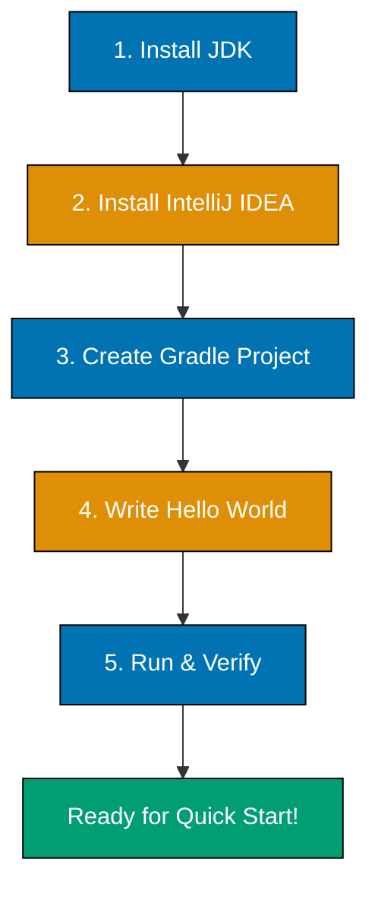

**Get Kotlin running quickly.** This tutorial provides the quickest path to running your first Kotlin program. You'll install the JDK, set up IntelliJ IDEA, create a Gradle project, and run a simple "Hello World" application.

## What You'll Achieve

By the end of this tutorial, you'll have:

- ✅ Java Development Kit (JDK 17 or later) installed on your system
- ✅ IntelliJ IDEA Community Edition installed and configured
- ✅ Kotlin 2.3.0 plugin enabled and working
- ✅ Created your first Kotlin + Gradle project
- ✅ Run your first Kotlin application successfully

## Prerequisites

- **Basic command line familiarity** - You should know how to open a terminal/command prompt
- **No programming experience required** - This tutorial assumes you're completely new to Kotlin

## Learning Path

This tutorial follows a step-by-step path to get you running quickly:



## Why Learn Kotlin?

Kotlin is a modern, pragmatic programming language that combines productivity with safety:

- **Android development** - Google's preferred language for Android apps, with full IDE support
- **Backend services** - Server-side applications with Ktor, Spring Boot, and other JVM frameworks
- **Multiplatform development** - Share code between JVM, Android, iOS, and web (advanced use case)
- **Conciseness** - Write less code than Java while maintaining readability
- **Null safety** - Eliminate null pointer exceptions through the type system
- **JVM interoperability** - Use any Java library seamlessly, leverage the entire Java ecosystem

Kotlin runs on the Java Virtual Machine (JVM), giving you access to decades of mature libraries and tools while providing modern language features like null safety, extension functions, and coroutines.

## Step 1: Install the Java Development Kit (JDK)

Kotlin compiles to JVM bytecode, so you need a JDK installed.

### Choose Your Installation Method

We recommend **OpenJDK 17** or later - the free, open-source Java implementation.

#### Option A: Download from Adoptium (Recommended)

**Adoptium** provides high-quality, free OpenJDK binaries for all platforms.

1. **Visit** [https://adoptium.net/](https://adoptium.net/)
2. **Select** "JDK 21 (LTS)" from the version dropdown (or JDK 17 minimum)
3. **Download** the installer for your operating system
4. **Run** the installer and follow the prompts

#### Option B: Use a Package Manager

**macOS (Homebrew)**:

```bash
brew install openjdk@21
```

After installation, link it to your system:

```bash
sudo ln -sfn /opt/homebrew/opt/openjdk@21/libexec/openjdk.jdk /Library/Java/JavaVirtualMachines/openjdk-21.jdk
```

**Linux (Ubuntu/Debian)**:

```bash
sudo apt update
sudo apt install openjdk-21-jdk
```

**Linux (Fedora/RHEL)**:

```bash
sudo dnf install java-21-openjdk-devel
```

**Windows (Chocolatey)**:

```powershell
choco install openjdk21
```

### Platform-Specific Installation Notes

#### Windows

- The installer will typically install to `C:\Program Files\Eclipse Adoptium\jdk-21.x.x\`
- The installer should automatically set your `PATH` environment variable
- If not, you'll need to manually add the `bin` directory to your PATH

#### macOS

- JDK is installed to `/Library/Java/JavaVirtualMachines/`
- The `java` command should be available immediately after installation
- You may need to restart your terminal

#### Linux

- Package managers handle PATH configuration automatically
- JDK is typically installed to `/usr/lib/jvm/`
- No additional configuration needed

### Verify JDK Installation

Open a terminal (or command prompt on Windows) and run:

```bash
java -version
```

**Expected output** (version numbers may vary):

```
openjdk version "21.0.1" 2023-10-17 LTS
OpenJDK Runtime Environment Temurin-21.0.1+12 (build 21.0.1+12-LTS)
OpenJDK 64-Bit Server VM Temurin-21.0.1+12 (build 21.0.1+12-LTS, mixed mode, sharing)
```

### Troubleshooting JDK Installation

**"Command not found" error?**

- **Windows**: Add JDK `bin` directory to PATH (e.g., `C:\Program Files\Eclipse Adoptium\jdk-21.x.x\bin`)
- **macOS/Linux**: Your package manager should have configured PATH automatically. Try restarting your terminal

**Wrong version displayed?**

- You may have multiple Java versions installed
- Use `which java` (macOS/Linux) or `where java` (Windows) to see which version is active
- Uninstall older versions or update your PATH to prioritize JDK 17+

## Step 2: Install IntelliJ IDEA Community Edition

IntelliJ IDEA is the recommended IDE for Kotlin development, with excellent language support and productivity features.

### Download and Install

1. **Visit** [https://www.jetbrains.com/idea/download/](https://www.jetbrains.com/idea/download/)
2. **Download** IntelliJ IDEA Community Edition (free)
3. **Run** the installer and follow the prompts
4. **Launch** IntelliJ IDEA when installation completes

### Initial Setup

When you first launch IntelliJ IDEA:

1. **Choose** your UI theme (light or dark)
2. **Skip** featured plugins for now (you can install them later)
3. **Click** "New Project" on the welcome screen

**Important**: IntelliJ IDEA Community Edition includes the Kotlin plugin by default. You don't need to install it separately.

### Verify Kotlin Plugin

To confirm the Kotlin plugin is enabled:

1. **Open** IntelliJ IDEA
2. **Go to** File → Settings (Windows/Linux) or IntelliJ IDEA → Preferences (macOS)
3. **Navigate to** Plugins
4. **Search** for "Kotlin"
5. **Verify** the Kotlin plugin shows as "Installed" and "Enabled"

If it's not enabled, click the checkbox to enable it and restart IntelliJ IDEA.

## Step 3: Create Your First Kotlin Project

We'll create a Kotlin project using Gradle, the standard build tool for Kotlin.

### Create New Project

1. **Click** "New Project" from the welcome screen (or File → New → Project)
2. **Select** "Kotlin" from the left sidebar
3. **Choose** "Kotlin/JVM" as the project type
4. **Configure** project settings:
   - **Name**: `hello-kotlin`
   - **Location**: Choose a directory (e.g., your Documents or projects folder)
   - **JDK**: Select your installed JDK 17+ (IntelliJ should auto-detect it)
   - **Build System**: Gradle Kotlin
   - **Gradle DSL**: Kotlin
5. **Click** "Create"

IntelliJ IDEA will create the project structure and download Gradle and Kotlin dependencies. This may take a minute.

### Understanding the Project Structure

After creation, you'll see this structure:

```
hello-kotlin/
├── build.gradle.kts       # Gradle build configuration (Kotlin DSL)
├── settings.gradle.kts    # Gradle settings
├── gradle/                # Gradle wrapper files
│   └── wrapper/
├── gradlew                # Gradle wrapper script (macOS/Linux)
├── gradlew.bat            # Gradle wrapper script (Windows)
└── src/
    └── main/
        └── kotlin/        # Kotlin source files go here
```

**Key files**:

- **`build.gradle.kts`** - Defines project dependencies, Kotlin version, and build configuration
- **`src/main/kotlin/`** - Where you write your Kotlin code
- **`gradlew`** / **`gradlew.bat`** - Gradle wrapper scripts that run Gradle (no separate installation needed)

## Step 4: Write Your First Kotlin Program

Let's create a simple "Hello World" program.

### Create a Kotlin File

1. **Right-click** on `src/main/kotlin/` in the Project pane
2. **Select** New → Kotlin Class/File
3. **Choose** "File" (not Class)
4. **Name** it `Main` (creates `Main.kt`)

### Write the Code

In `Main.kt`, write:

```kotlin
fun main() {
    println("Hello, Kotlin!")
}
```

**That's it!** Kotlin is significantly more concise than Java.

### Understanding the Code (Brief)

- `fun main()` - The entry point where Kotlin starts execution
- `println()` - Prints text to the console (no need for `System.out`)
- No class required for a simple program (unlike Java)
- No semicolons needed

**Note**: You'll learn these concepts in detail in the [Quick Start](/en/learn/software-engineering/programming-language/kotlin/tutorials/quick-start) and [Beginner Guide](/en/learn/software-engineering/programming-language/kotlin/tutorials/beginner) tutorials. For advanced function patterns, see [Intermediate Kotlin](/en/learn/software-engineering/programming-language/kotlin/tutorials/intermediate).

### Comparison with Java

If you know Java, here's the equivalent Java code:

```java
public class Main {
    public static void main(String[] args) {
        System.out.println("Hello, Kotlin!");
    }
}
```

Kotlin eliminates:

- Class boilerplate for simple programs
- `public static` keywords
- `String[] args` parameter (added only if needed)
- `System.out` prefix
- Semicolons

This conciseness is one of Kotlin's key advantages.

## Step 5: Run the Program

### Using IntelliJ IDEA (Recommended)

1. **Click** the green play button (▶) in the gutter next to `fun main()`
2. **Select** "Run 'MainKt'" from the menu

**Expected output** in the Run panel at the bottom:

```
Hello, Kotlin!

Process finished with exit code 0
```

### Using Gradle (Command Line)

Alternatively, you can run from the terminal:

**macOS/Linux**:

```bash
./gradlew run
```

**Windows**:

```powershell
.\gradlew.bat run
```

**Note**: You may need to add a `run` task to `build.gradle.kts` first:

```kotlin
tasks.register<JavaExec>("run") {
    mainClass.set("MainKt")
    classpath = sourceSets["main"].runtimeClasspath
}
```

For now, using IntelliJ IDEA's run button is simpler.

## Step 6: Understanding the Build Process

When you click "Run", IntelliJ IDEA:

1. **Compiles** your Kotlin code to JVM bytecode (`.class` files)
2. **Places** compiled files in `build/classes/kotlin/main/`
3. **Executes** the bytecode using the JVM

You can see the compiled output:

1. **Navigate** to `hello-kotlin/build/classes/kotlin/main/` in your file explorer
2. **Find** `MainKt.class` - the compiled bytecode

Kotlin compiles to the same bytecode format as Java, which is why Kotlin can use Java libraries seamlessly.

## Verification Checklist

Confirm you can do all of the following:

- ✅ Run `java -version` and see Java 17 or later
- ✅ Launch IntelliJ IDEA successfully
- ✅ Kotlin plugin is installed and enabled
- ✅ Create a new Kotlin/JVM project with Gradle
- ✅ Write a simple `fun main()` program
- ✅ Run the program and see output in the Run panel

If all checkboxes are checked, you're ready to start learning Kotlin!

## 🎯 Quick Challenge

Now that you have Kotlin working, try these challenges to solidify your understanding:

### Challenge 1: Modify the Hello World Program

1. **Edit** `Main.kt` and change the message to print your name instead of "Hello, Kotlin!"
2. **Run** it again and verify your name appears

**Success criteria**:

- Program compiles without errors
- Program runs without errors
- Your custom message displays

### Challenge 2: Create a Second Function

Try adding another function to `Main.kt`:

```kotlin
fun greet(name: String) {
    println("Welcome, $name!")
}

fun main() {
    println("Hello, Kotlin!")
    greet("Developer")
}
```

1. **Add** the `greet` function above `main()`
2. **Call** it from `main()` as shown
3. **Run** the program
4. **Verify** both messages appear

**Expected output**:

```
Hello, Kotlin!
Welcome, Developer!
```

### Challenge 3: Simple Calculation

Create a new file `Calculator.kt` and write:

```kotlin
fun main() {
    val x = 10
    val y = 20
    println("Sum: ${x + y}")
}
```

1. **Create** the file using New → Kotlin Class/File → File
2. **Copy** the code above
3. **Run** it (click the play button next to this new `main()`)
4. **Verify** the output shows the correct sum (30)

**What you're learning**:

- `val` declares an immutable variable (like `final` in Java)
- `${}` is string interpolation (embeds expressions in strings)
- You can have multiple files with `main()` in the same project

These challenges confirm that your Kotlin setup is complete and working properly.

## Understanding Gradle (Brief)

Gradle is Kotlin's standard build tool. It handles:

- **Dependency management** - Downloading libraries your project needs
- **Compilation** - Converting Kotlin to bytecode
- **Testing** - Running automated tests
- **Packaging** - Creating executable JARs

Open `build.gradle.kts` to see the configuration:

```kotlin
plugins {
    kotlin("jvm") version "2.3.0"  // Kotlin version
}

repositories {
    mavenCentral()  // Where to download dependencies
}

dependencies {
    testImplementation(kotlin("test"))  // Testing library
}
```

**Key points**:

- `kotlin("jvm")` - Configures Kotlin for JVM (bytecode) compilation
- Version `"2.3.0"` - The Kotlin compiler version used
- `mavenCentral()` - The repository for downloading libraries
- `dependencies {}` - Where you add libraries your project needs

You'll learn more about Gradle as you progress through the tutorials. For build configuration best practices, see [Kotlin Best Practices](/en/learn/software-engineering/programming-language/kotlin/explanation/best-practices). For common Gradle tasks, check the [Kotlin Cookbook](/en/learn/software-engineering/programming-language/kotlin/how-to/cookbook).

## Next Steps

Congratulations! You have a working Kotlin development environment.

### Continue Learning

- **[Kotlin Quick Start](/en/learn/software-engineering/programming-language/kotlin/tutorials/quick-start)** - Learn 12 core Kotlin concepts to explore independently. Perfect if you want a fast overview of Kotlin syntax and features.

- **[Complete Beginner's Guide to Kotlin](/en/learn/software-engineering/programming-language/kotlin/tutorials/beginner)** - Comprehensive foundation covering Kotlin fundamentals from zero. Choose this if you want in-depth coverage with practice exercises.

### What's Next?

The **Quick Start** tutorial teaches you:

- Variables (val vs var) and type inference
- Null safety system (?, ?., ?:, !!)
- Functions and lambdas
- Classes, data classes, and objects
- Collections and extension functions
- Coroutines basics

The **Beginner** tutorial provides comprehensive coverage:

- Complete type system and null safety
- Object-oriented programming (classes, inheritance, interfaces)
- Functional programming fundamentals
- Collections and sequences
- Error handling and testing
- Package organization
- Practice projects and exercises

Choose Quick Start for a fast overview, or jump to Beginner for thorough, comprehensive learning.

### Additional Resources

- **Internal Resources**:
  - [Kotlin Cheat Sheet](/en/learn/software-engineering/programming-language/kotlin/reference/cheat-sheet) - Quick reference for Kotlin syntax
  - [Kotlin Glossary](/en/learn/software-engineering/programming-language/kotlin/reference/glossary) - Technical terms explained
  - [Kotlin Learning Resources](/en/learn/software-engineering/programming-language/kotlin/reference/learning-resources) - External learning materials
  - [Kotlin Anti-Patterns](/en/learn/software-engineering/programming-language/kotlin/explanation/anti-patterns) - Common mistakes to avoid

- **Official Kotlin Documentation**: [https://kotlinlang.org/docs/home.html](https://kotlinlang.org/docs/home.html)
- **Kotlin Language Reference**: [https://kotlinlang.org/spec/](https://kotlinlang.org/spec/)
- **Kotlin Playground** (try code in browser): [https://play.kotlinlang.org/](https://play.kotlinlang.org/)
- **Kotlin by Example**: [https://play.kotlinlang.org/byExample/overview](https://play.kotlinlang.org/byExample/overview)

---

**Tutorial Complete!** You're now ready to start learning Kotlin programming.
