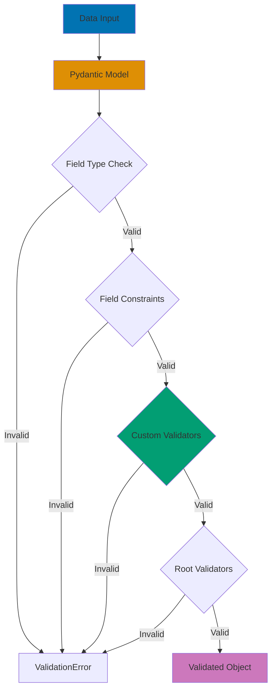

## Problem

Invalid data causes runtime errors, data corruption, and security vulnerabilities. Manual validation is error-prone, verbose, and difficult to maintain across complex data structures.

## Solution

### 1. Pydantic Models with Field Validation

```python
from pydantic import BaseModel, Field, EmailStr, HttpUrl, validator
from typing import Optional, List
from datetime import datetime

class User(BaseModel):
    """User model with automatic validation."""
    id: int
    username: str = Field(..., min_length=3, max_length=50, pattern=r'^[a-zA-Z0-9_]+$')
    email: EmailStr
    age: int = Field(..., ge=18, le=150, description="User age must be 18-150")
    website: Optional[HttpUrl] = None
    tags: List[str] = Field(default_factory=list, max_items=10)
    created_at: datetime

# Valid data
user = User(
    id=1,
    username="john_doe",
    email="john@example.com",
    age=30,
    website="https://example.com",
    tags=["python", "developer"],
    created_at=datetime.now()
)

# Invalid data raises ValidationError
try:
    invalid_user = User(
        id=1,
        username="ab",  # Too short!
        email="invalid-email",  # Invalid format!
        age=15,  # Too young!
        created_at=datetime.now()
    )
except ValidationError as e:
    print(e.errors())
    # [
    #   {'loc': ('username',), 'msg': 'ensure this value has at least 3 characters', 'type': 'value_error.any_str.min_length'},
    #   {'loc': ('email',), 'msg': 'value is not a valid email address', 'type': 'value_error.email'},
    #   {'loc': ('age',), 'msg': 'ensure this value is greater than or equal to 18', 'type': 'value_error.number.not_ge'}
    # ]
```

### 2. Custom Validators for Complex Rules

```python
from pydantic import BaseModel, validator, root_validator
import re

class PasswordPolicy(BaseModel):
    """Password with strength validation."""
    password: str
    confirm_password: str

    @validator('password')
    def password_strength(cls, v):
        """Validate password complexity."""
        if len(v) < 8:
            raise ValueError('Password must be at least 8 characters')

        if not re.search(r'[A-Z]', v):
            raise ValueError('Password must contain uppercase letter')

        if not re.search(r'[a-z]', v):
            raise ValueError('Password must contain lowercase letter')

        if not re.search(r'\d', v):
            raise ValueError('Password must contain digit')

        if not re.search(r'[!@#$%^&*(),.?":{}|<>]', v):
            raise ValueError('Password must contain special character')

        return v

    @root_validator
    def passwords_match(cls, values):
        """Validate passwords match."""
        password = values.get('password')
        confirm_password = values.get('confirm_password')

        if password != confirm_password:
            raise ValueError('Passwords do not match')

        return values

# Usage
valid_password = PasswordPolicy(
    password='SecureP@ss123',
    confirm_password='SecureP@ss123'
)

try:
    invalid_password = PasswordPolicy(
        password='weak',
        confirm_password='weak'
    )
except ValidationError as e:
    print(e.errors())
```

### 3. Nested Model Validation

```python
from pydantic import BaseModel, conlist
from typing import List

class Address(BaseModel):
    """Address with validation."""
    street: str = Field(..., min_length=5)
    city: str = Field(..., min_length=2)
    postal_code: str = Field(..., pattern=r'^\d{5}(-\d{4})?$')
    country: str = Field(..., min_length=2, max_length=2)

class Company(BaseModel):
    """Company with nested address validation."""
    name: str = Field(..., min_length=1, max_length=200)
    registration_number: str
    headquarters: Address
    branches: conlist(Address, min_items=0, max_items=50) = []

    @validator('registration_number')
    def validate_registration(cls, v):
        """Validate registration number format."""
        if not re.match(r'^REG-\d{6}$', v):
            raise ValueError('Registration must be REG-XXXXXX format')
        return v

# Usage
company = Company(
    name="Tech Corp",
    registration_number="REG-123456",
    headquarters=Address(
        street="123 Main Street",
        city="San Francisco",
        postal_code="94105",
        country="US"
    ),
    branches=[
        Address(
            street="456 Market Street",
            city="New York",
            postal_code="10001",
            country="US"
        )
    ]
)
```

### 4. Dynamic Validation with Field Validators

```python
from pydantic import BaseModel, Field, validator
from typing import Optional
from enum import Enum

class UserRole(str, Enum):
    ADMIN = "admin"
    USER = "user"
    GUEST = "guest"

class UserPermissions(BaseModel):
    """User with role-based validation."""
    username: str
    role: UserRole
    can_delete: bool = False
    can_edit: bool = False
    can_view: bool = True

    @validator('can_delete')
    def admin_only_delete(cls, v, values):
        """Only admins can have delete permission."""
        role = values.get('role')
        if v and role != UserRole.ADMIN:
            raise ValueError('Only admins can have delete permission')
        return v

    @validator('can_edit')
    def user_or_admin_edit(cls, v, values):
        """Only users and admins can edit."""
        role = values.get('role')
        if v and role not in [UserRole.ADMIN, UserRole.USER]:
            raise ValueError('Guests cannot have edit permission')
        return v

# Valid configurations
admin = UserPermissions(
    username="admin",
    role=UserRole.ADMIN,
    can_delete=True,
    can_edit=True
)

user = UserPermissions(
    username="user",
    role=UserRole.USER,
    can_edit=True
)

# Invalid - guest trying to edit
try:
    invalid = UserPermissions(
        username="guest",
        role=UserRole.GUEST,
        can_edit=True  # Not allowed!
    )
except ValidationError as e:
    print(e.errors())
```

### 5. Dataclass Validation with Pydantic

```python
from pydantic.dataclasses import dataclass
from pydantic import validator
from dataclasses import field

@dataclass
class Point:
    """3D point with coordinate validation."""
    x: float
    y: float
    z: float = 0.0

    @validator('x', 'y', 'z')
    def validate_coordinate(cls, v):
        """Ensure coordinates are within valid range."""
        if not -1000 <= v <= 1000:
            raise ValueError('Coordinate must be between -1000 and 1000')
        return v

@dataclass
class Vector:
    """Vector with magnitude calculation."""
    start: Point
    end: Point
    magnitude: Optional[float] = field(default=None, init=False)

    def __post_init__(self):
        """Calculate magnitude after initialization."""
        dx = self.end.x - self.start.x
        dy = self.end.y - self.start.y
        dz = self.end.z - self.start.z
        self.magnitude = (dx**2 + dy**2 + dz**2) ** 0.5

# Usage
vector = Vector(
    start=Point(x=0, y=0, z=0),
    end=Point(x=3, y=4, z=0)
)
print(f"Magnitude: {vector.magnitude}")  # 5.0
```

### 6. JSON Schema and OpenAPI Integration

```python
from pydantic import BaseModel, Field
import json

class Product(BaseModel):
    """Product with comprehensive documentation."""
    id: int = Field(..., description="Unique product identifier")
    name: str = Field(..., min_length=1, max_length=200, description="Product name")
    price: float = Field(..., gt=0, description="Product price in USD")
    in_stock: bool = Field(default=True, description="Stock availability")

    class Config:
        schema_extra = {
            "example": {
                "id": 1,
                "name": "Laptop",
                "price": 999.99,
                "in_stock": True
            }
        }

# Generate JSON Schema
schema = Product.schema()
print(json.dumps(schema, indent=2))
# {
#   "title": "Product",
#   "type": "object",
#   "properties": {
#     "id": {"title": "Id", "description": "Unique product identifier", "type": "integer"},
#     "name": {"title": "Name", "description": "Product name", "minLength": 1, "maxLength": 200, "type": "string"},
#     "price": {"title": "Price", "description": "Product price in USD", "exclusiveMinimum": 0, "type": "number"},
#     "in_stock": {"title": "In Stock", "description": "Stock availability", "default": true, "type": "boolean"}
#   },
#   "required": ["id", "name", "price"]
# }
```

## How It Works



**Validation Pipeline:**

1. **Type Coercion**: Convert input to declared types (str → int, str → datetime)
2. **Field Constraints**: Check min/max, patterns, enums
3. **Field Validators**: Run `@validator` decorated methods
4. **Root Validators**: Cross-field validation with `@root_validator`
5. **Result**: Either validated object or ValidationError with details

## Variations

### Conditional Validation

```python
from pydantic import BaseModel, validator

class ConditionalModel(BaseModel):
    """Model with conditional validation."""
    is_company: bool
    company_name: Optional[str] = None
    individual_name: Optional[str] = None

    @root_validator
    def check_name_provided(cls, values):
        """Require appropriate name based on type."""
        is_company = values.get('is_company')
        company_name = values.get('company_name')
        individual_name = values.get('individual_name')

        if is_company and not company_name:
            raise ValueError('Company name required for companies')

        if not is_company and not individual_name:
            raise ValueError('Individual name required for individuals')

        return values
```

### Validation with External Data

```python
from pydantic import BaseModel, validator

class UserRegistration(BaseModel):
    """User registration with database validation."""
    username: str
    email: EmailStr

    @validator('username')
    def username_not_taken(cls, v):
        """Verify username is available."""
        # In real app, query database
        taken_usernames = ['admin', 'root', 'test']

        if v.lower() in taken_usernames:
            raise ValueError('Username already taken')

        return v

    @validator('email')
    def email_not_registered(cls, v):
        """Verify email not already registered."""
        # In real app, query database
        registered_emails = ['admin@example.com']

        if v.lower() in registered_emails:
            raise ValueError('Email already registered')

        return v
```

### Pre and Post Validation Processing

```python
from pydantic import BaseModel, validator

class NormalizedUser(BaseModel):
    """User with automatic data normalization."""
    username: str
    email: str

    @validator('username', pre=True)
    def normalize_username(cls, v):
        """Normalize before validation."""
        if isinstance(v, str):
            return v.strip().lower()
        return v

    @validator('email', pre=True)
    def normalize_email(cls, v):
        """Normalize email before validation."""
        if isinstance(v, str):
            return v.strip().lower()
        return v

# Usage
user = NormalizedUser(
    username="  JohnDoe  ",  # Becomes "johndoe"
    email="  JOHN@EXAMPLE.COM  "  # Becomes "john@example.com"
)
```

## Common Pitfalls

### 1. Mutating Values in Validators

**Problem**: Validators shouldn't have side effects.

```python
# ❌ Bad: Mutating external state
class BadModel(BaseModel):
    value: int

    @validator('value')
    def log_value(cls, v):
        # Side effect - writing to database/file
        save_to_database(v)  # Don't do this!
        return v

# ✅ Good: Pure validation, side effects elsewhere
class GoodModel(BaseModel):
    value: int

    @validator('value')
    def validate_value(cls, v):
        if v < 0:
            raise ValueError('Value must be non-negative')
        return v

# Handle side effects after validation
model = GoodModel(value=42)
save_to_database(model.value)  # Side effect after validation
```

### 2. Forgetting to Return Values from Validators

**Problem**: Validator must return the value.

```python
# ❌ Bad: Forgot to return
class BadModel(BaseModel):
    name: str

    @validator('name')
    def validate_name(cls, v):
        if len(v) < 3:
            raise ValueError('Name too short')
        # Forgot to return v!

# ✅ Good: Always return
class GoodModel(BaseModel):
    name: str

    @validator('name')
    def validate_name(cls, v):
        if len(v) < 3:
            raise ValueError('Name too short')
        return v  # Must return!
```

### 3. Using Validators for Data Transformation

**Problem**: Validators should validate, not transform (use pre=True cautiously).

```python
# ❌ Bad: Transforming in regular validator
class BadModel(BaseModel):
    age: int

    @validator('age')
    def make_positive(cls, v):
        return abs(v)  # Silently changing data!

# ✅ Good: Validate and reject invalid data
class GoodModel(BaseModel):
    age: int

    @validator('age')
    def validate_positive(cls, v):
        if v < 0:
            raise ValueError('Age must be positive')
        return v

# ✅ Acceptable: Explicit normalization with pre=True
class NormalizingModel(BaseModel):
    age: int

    @validator('age', pre=True)
    def normalize_age(cls, v):
        """Explicitly normalize age string to int."""
        if isinstance(v, str):
            return int(v.strip())
        return v
```

### 4. Not Handling ValidationError Properly

**Problem**: Catching generic Exception hides validation details.

```python
# ❌ Bad: Generic exception handling
try:
    user = User(**user_data)
except Exception as e:  # Too broad!
    print("Something went wrong")

# ✅ Good: Specific error handling
from pydantic import ValidationError

try:
    user = User(**user_data)
except ValidationError as e:
    # Access detailed error information
    for error in e.errors():
        print(f"Field: {error['loc']}, Error: {error['msg']}")
```

### 5. Over-validating in Production

**Problem**: Validating already-validated data wastes resources.

```python
# ❌ Bad: Re-validating internal data
def process_user(user_dict: dict):
    # Data already validated when created!
    user = User(**user_dict)  # Wasteful re-validation
    return user.username

# ✅ Good: Skip validation for trusted data
def process_user(user: User):
    # Accept already-validated User object
    return user.username

# ✅ Alternative: Use construct for trusted data
def load_from_database(user_dict: dict) -> User:
    # Skip validation for database data
    return User.construct(**user_dict)
```

## Related Patterns

**Related Tutorial**: See [Intermediate Tutorial - Data Validation](/en/learn/software-engineering/programming-language/python/tutorials/intermediate#validation).
**Related How-To**: See [Build REST APIs](/en/learn/software-engineering/programming-language/python/how-to/build-rest-apis).
**Related Cookbook**: See Cookbook recipe "Validation Patterns".
