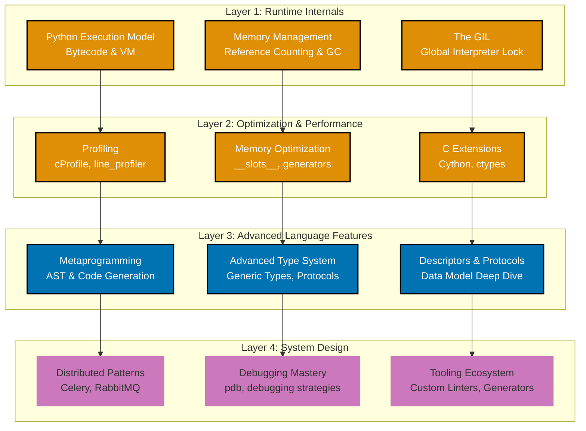
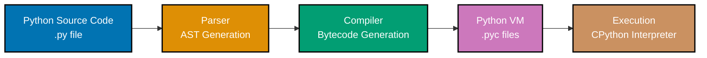
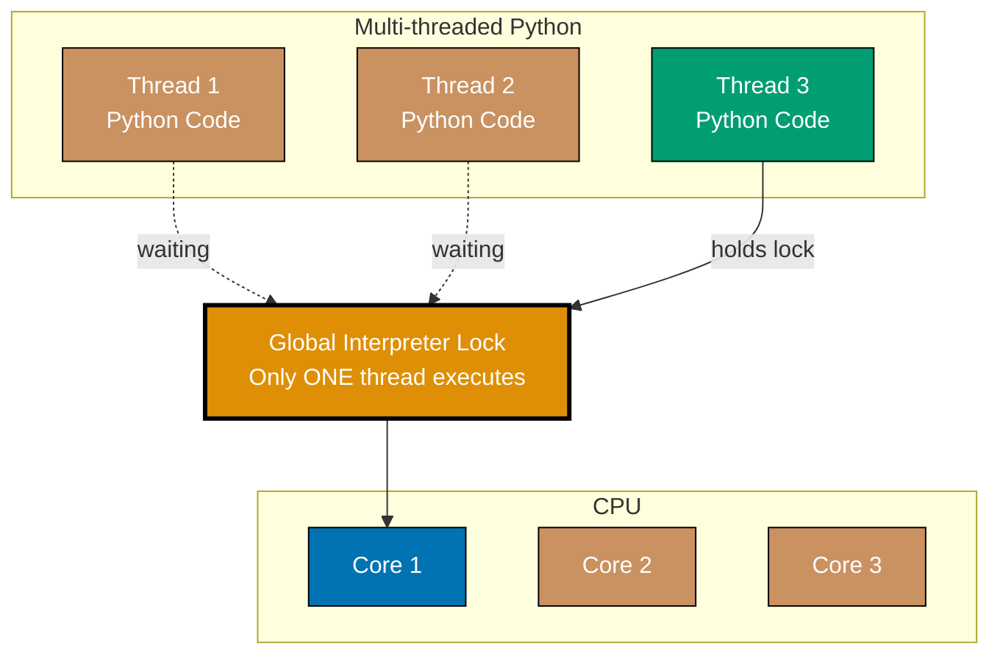

**Achieve Python mastery.** This tutorial dives deep into Python's internals, advanced optimization techniques, sophisticated patterns, and system design. You'll understand how Python works under the hood and when to push its boundaries.

**Prerequisites**: Complete the [Intermediate tutorial](/en/learn/software-engineering/programming-language/python/tutorials/intermediate) or have professional Python experience. Review the [Beginner tutorial](/en/learn/software-engineering/programming-language/python/tutorials/beginner) if you need to refresh fundamentals.

## 🎯 Learning Objectives

After this tutorial, you'll understand:

- Python's execution model and bytecode
- The GIL (Global Interpreter Lock) and its implications
- Memory management and garbage collection
- Advanced metaprogramming and AST manipulation
- Performance profiling and optimization techniques
- C extensions and Cython for performance
- Advanced debugging strategies
- System design patterns for distributed systems
- Advanced type system features
- Python tooling ecosystem (custom linters, code generation)

## 🧠 Python Internals & Expert Topics

This tutorial explores three layers of Python mastery:



Each layer builds on the previous, taking you from understanding Python's internals to designing sophisticated systems. For practical applications of these concepts, see the [Python Cookbook](/en/learn/software-engineering/programming-language/python/how-to/cookbook) and [How-To Guides](/en/learn/software-engineering/programming-language/python/how-to/overview).

---

## Section 1: Python Runtime Internals

### Python Execution Model

Python source code goes through several stages before execution:



**Bytecode Inspection**:

```python
import dis

def add(a, b):
    return a + b

dis.dis(add)

code = compile("x = 1 + 2", "<string>", "exec")
print(code.co_code)  # Raw bytecode
dis.dis(code)
```

### The Global Interpreter Lock (GIL)

The GIL is a mutex that protects access to Python objects, preventing multiple threads from executing Python bytecode simultaneously:



**GIL Implications**:

```python
import threading
import time

def cpu_bound():
    count = 0
    for _ in range(10**7):
        count += 1
    return count

start = time.time()
cpu_bound()
cpu_bound()
print(f"Single thread: {time.time() - start:.2f}s")

start = time.time()
t1 = threading.Thread(target=cpu_bound)
t2 = threading.Thread(target=cpu_bound)
t1.start()
t2.start()
t1.join()
t2.join()
print(f"Multi-threaded: {time.time() - start:.2f}s")

def io_bound():
    time.sleep(1)

start = time.time()
threads = [threading.Thread(target=io_bound) for _ in range(5)]
for t in threads:
    t.start()
for t in threads:
    t.join()
print(f"Multi-threaded I/O: {time.time() - start:.2f}s")  # ~1s, not 5s
```

**Workarounds**:

- Use `multiprocessing` for CPU-bound tasks (separate processes = separate GILs)
- Use `asyncio` for I/O-bound concurrency (single thread, cooperative multitasking)
- Use C extensions that release the GIL (NumPy, Pandas)

### Memory Management

Python uses reference counting with cyclic garbage collection:

```python
import sys
import gc

x = [1, 2, 3]
print(sys.getrefcount(x))  # 2 (x itself + argument to getrefcount)

y = x
print(sys.getrefcount(x))  # 3 (x, y, argument)

del y
print(sys.getrefcount(x))  # 2

class Node:
    def __init__(self, value):
        self.value = value
        self.next = None

a = Node(1)
b = Node(2)
a.next = b
b.next = a  # Cycle!

print(gc.get_count())  # (count0, count1, count2)
collected = gc.collect()
print(f"Collected {collected} objects")

import weakref

class Cache:
    def __init__(self):
        self._cache = weakref.WeakValueDictionary()

    def add(self, key, obj):
        self._cache[key] = obj

    def get(self, key):
        return self._cache.get(key)

cache = Cache()
obj = [1, 2, 3]
cache.add("data", obj)
print(cache.get("data"))  # [1, 2, 3]

del obj
gc.collect()
print(cache.get("data"))  # None (object was garbage collected)
```

---

## Section 2: Advanced Metaprogramming

### AST Manipulation

Abstract Syntax Trees allow programmatic code analysis and modification:

```python
import ast
import inspect

code = """
def add(a, b):
    return a + b
"""

tree = ast.parse(code)
print(ast.dump(tree, indent=2))

class FunctionFinder(ast.NodeVisitor):
    def __init__(self):
        self.functions = []

    def visit_FunctionDef(self, node):
        self.functions.append(node.name)
        self.generic_visit(node)

finder = FunctionFinder()
finder.visit(tree)
print(finder.functions)  # ['add']

class DoubleReturn(ast.NodeTransformer):
    def visit_Return(self, node):
        # Double the return value
        return ast.Return(
            value=ast.BinOp(
                left=node.value,
                op=ast.Mult(),
                right=ast.Constant(value=2)
            )
        )

transformer = DoubleReturn()
new_tree = transformer.visit(tree)
ast.fix_missing_locations(new_tree)

code_obj = compile(new_tree, "<ast>", "exec")
namespace = {}
exec(code_obj, namespace)
print(namespace["add"](3, 4))  # 14 (doubled from 7)
```

### Code Generation

```python
import ast
import textwrap

def create_getter_setter(class_name, attributes):
    """Generate class with getters and setters"""
    methods = []

    for attr in attributes:
        # Getter
        getter = ast.FunctionDef(
            name=f"get_{attr}",
            args=ast.arguments(
                args=[ast.arg(arg="self")],
                posonlyargs=[],
                kwonlyargs=[],
                kw_defaults=[],
                defaults=[]
            ),
            body=[
                ast.Return(
                    value=ast.Attribute(
                        value=ast.Name(id="self", ctx=ast.Load()),
                        attr=attr,
                        ctx=ast.Load()
                    )
                )
            ],
            decorator_list=[]
        )
        methods.append(getter)

        # Setter
        setter = ast.FunctionDef(
            name=f"set_{attr}",
            args=ast.arguments(
                args=[
                    ast.arg(arg="self"),
                    ast.arg(arg="value")
                ],
                posonlyargs=[],
                kwonlyargs=[],
                kw_defaults=[],
                defaults=[]
            ),
            body=[
                ast.Assign(
                    targets=[
                        ast.Attribute(
                            value=ast.Name(id="self", ctx=ast.Load()),
                            attr=attr,
                            ctx=ast.Store()
                        )
                    ],
                    value=ast.Name(id="value", ctx=ast.Load())
                )
            ],
            decorator_list=[]
        )
        methods.append(setter)

    # Create class
    class_def = ast.ClassDef(
        name=class_name,
        bases=[],
        keywords=[],
        body=methods,
        decorator_list=[]
    )

    module = ast.Module(body=[class_def], type_ignores=[])
    ast.fix_missing_locations(module)

    # Compile and execute
    code = compile(module, "<generated>", "exec")
    namespace = {}
    exec(code, namespace)
    return namespace[class_name]

Person = create_getter_setter("Person", ["name", "age"])
p = Person()
p.set_name("Alice")
p.set_age(30)
print(p.get_name(), p.get_age())  # Alice 30
```

### Import Hooks

Customize Python's import system:

```python
import sys
import importlib.abc
import importlib.machinery

class UpperCaseLoader(importlib.abc.Loader):
    def exec_module(self, module):
        # Transform all string literals to uppercase
        source = self.get_source(module.__name__)
        code = compile(source.upper(), module.__name__, "exec")
        exec(code, module.__dict__)

    def get_source(self, fullname):
        # Simplified - normally reads from file
        return 'message = "hello"'

class UpperCaseFinder(importlib.abc.MetaPathFinder):
    def find_spec(self, fullname, path, target=None):
        if fullname.startswith("upper_"):
            return importlib.machinery.ModuleSpec(
                fullname,
                UpperCaseLoader(),
                origin="custom"
            )
        return None

sys.meta_path.insert(0, UpperCaseFinder())
```

---

## Section 3: Performance Optimization

### Profiling Deep Dive

```python
import cProfile
import pstats
from io import StringIO

def profile_function(func):
    profiler = cProfile.Profile()
    profiler.enable()
    result = func()
    profiler.disable()

    stats = pstats.Stats(profiler)
    stats.sort_stats('cumulative')
    stats.print_stats(20)
    return result

from memory_profiler import profile as mem_profile

@mem_profile
def memory_intensive():
    large_list = [i**2 for i in range(10**6)]
    return sum(large_list)

def line_by_line():
    result = []
    for i in range(1000):
        result.append(i**2)
    return sum(result)

```

### Optimization Techniques

```python
class RegularPerson:
    def __init__(self, name, age):
        self.name = name
        self.age = age

class OptimizedPerson:
    __slots__ = ['name', 'age']  # No __dict__, 40-50% less memory

    def __init__(self, name, age):
        self.name = name
        self.age = age

def read_large_file(filename):
    with open(filename) as f:
        for line in f:
            yield process_line(line)  # Lazy processing

from itertools import islice, chain, groupby

first_100 = list(islice(large_generator(), 100))

combined = chain(list1, list2, list3)

from array import array

numbers = array('i', range(10**6))  # 'i' = signed int

from numba import jit

@jit(nopython=True)
def fast_computation(n):
    total = 0
    for i in range(n):
        total += i ** 2
    return total

from functools import lru_cache, cache

@lru_cache(maxsize=128)
def expensive_function(n):
    # Computation cached for repeated calls
    return sum(i**2 for i in range(n))

@cache  # Python 3.9+ - unlimited cache
def fibonacci(n):
    if n < 2:
        return n
    return fibonacci(n-1) + fibonacci(n-2)
```

### C Extensions with Cython

```python
def fast_sum(int n):
    cdef int i
    cdef int total = 0
    for i in range(n):
        total += i
    return total

from setuptools import setup
from Cython.Build import cythonize

setup(
    ext_modules=cythonize("example.pyx")
)

```

---

## Section 4: Advanced Type System

### Generic Types

```python
from typing import TypeVar, Generic, List

T = TypeVar('T')

class Stack(Generic[T]):
    def __init__(self):
        self._items: List[T] = []

    def push(self, item: T) -> None:
        self._items.append(item)

    def pop(self) -> T:
        return self._items.pop()

    def peek(self) -> T:
        return self._items[-1]

int_stack: Stack[int] = Stack()
int_stack.push(1)
int_stack.push(2)

str_stack: Stack[str] = Stack()
str_stack.push("hello")
```

### Protocols (Structural Subtyping)

```python
from typing import Protocol

class Drawable(Protocol):
    def draw(self) -> None:
        ...

class Circle:
    def draw(self) -> None:
        print("Drawing circle")

class Square:
    def draw(self) -> None:
        print("Drawing square")

def render(shape: Drawable) -> None:
    shape.draw()

render(Circle())  # OK
render(Square())  # OK
```

### Advanced Type Annotations

```python
from typing import Union, Optional, Literal, TypedDict, Callable

def process(value: Union[int, str]) -> str:
    if isinstance(value, int):
        return str(value)
    return value.upper()

def find_user(id: int) -> Optional[User]:
    # May return User or None
    pass

def set_mode(mode: Literal["read", "write"]) -> None:
    # Only accepts "read" or "write"
    pass

class UserDict(TypedDict):
    name: str
    age: int
    email: str

def create_user(data: UserDict) -> User:
    # data must have name, age, email keys
    pass

def apply(func: Callable[[int, int], int], a: int, b: int) -> int:
    return func(a, b)

def process_value(value: int | str) -> str:
    pass
```

---

## Section 5: Distributed Systems

### Celery for Task Queues

```python
from celery import Celery

app = Celery('tasks', broker='redis://localhost:6379/0')

@app.task
def process_image(image_path):
    # Long-running task
    # Process image...
    return {"status": "processed", "path": image_path}

result = process_image.delay("/path/to/image.jpg")

if result.ready():
    print(result.get())
```

### Message Queues with RabbitMQ

```python
import pika

connection = pika.BlockingConnection(
    pika.ConnectionParameters('localhost')
)
channel = connection.channel()
channel.queue_declare(queue='tasks')

channel.basic_publish(
    exchange='',
    routing_key='tasks',
    body='Task data'
)

def callback(ch, method, properties, body):
    print(f"Received: {body}")
    # Process task
    ch.basic_ack(delivery_tag=method.delivery_tag)

channel.basic_consume(
    queue='tasks',
    on_message_callback=callback
)
channel.start_consuming()
```

---

## Section 6: Advanced Debugging

### PDB Advanced Techniques

```python
import pdb

def complex_function(x, y):
    result = x * 2
    pdb.set_trace()  # Debugger breakpoint
    result += y
    return result

```

### Post-mortem Debugging

```python
import sys
import pdb

def buggy_function():
    x = 10
    y = 0
    return x / y  # ZeroDivisionError

try:
    buggy_function()
except Exception:
    # Enter debugger after crash
    pdb.post_mortem()
```

---

## 🎉 Summary

Congratulations! You've completed the Python Advanced tutorial. You've learned:

- ✅ Python execution model and bytecode
- ✅ The GIL and its implications
- ✅ Memory management and garbage collection
- ✅ Advanced metaprogramming and AST manipulation
- ✅ Performance profiling and optimization
- ✅ C extensions and Cython
- ✅ Advanced type system features
- ✅ Distributed systems patterns
- ✅ Advanced debugging techniques

## 📚 What's Next?

**Continuous Learning**:

- Read CPython source code (github.com/python/cpython)
- Contribute to open-source Python projects
- Explore PyPy, Jython, and other Python implementations
- Study advanced libraries (asyncio internals, NumPy C code)
- Build performance-critical libraries

**Specialization Paths**:

- **Data Science**: NumPy/Pandas internals, distributed computing
- **Web Development**: ASGI servers, async frameworks
- **Systems Programming**: ctypes, CFFI, low-level optimization
- **DevOps**: Infrastructure as code, automation at scale

**Practical Application**:

- [Python Cookbook](/en/learn/software-engineering/programming-language/python/how-to/cookbook) - Apply advanced patterns in real solutions
- [How-To Guides](/en/learn/software-engineering/programming-language/python/how-to/overview) - Deep dives into production techniques
- [Best Practices](/en/learn/software-engineering/programming-language/python/explanation/best-practices) - Industry standards for expert developers

**Reference Materials**:

- [Python Cheat Sheet](/en/learn/software-engineering/programming-language/python/reference/cheat-sheet) - Quick syntax and pattern reference
- [Python Glossary](/en/learn/software-engineering/programming-language/python/reference/glossary) - Advanced term definitions
- [Python Resources](/en/learn/software-engineering/programming-language/python/reference/resources) - Advanced learning materials and tools

**Review Foundation**: If you encounter unfamiliar concepts:

- [Beginner tutorial](/en/learn/software-engineering/programming-language/python/tutorials/beginner) - Core Python fundamentals
- [Intermediate tutorial](/en/learn/software-engineering/programming-language/python/tutorials/intermediate) - Production patterns
- [Quick Start](/en/learn/software-engineering/programming-language/python/tutorials/quick-start) - Quick refresher on syntax

---

**You've achieved Python mastery!** Continue practicing these advanced techniques in real-world projects. Check the [Anti-Patterns](/en/learn/software-engineering/programming-language/python/explanation/anti-patterns) guide to avoid common pitfalls even at expert level.
