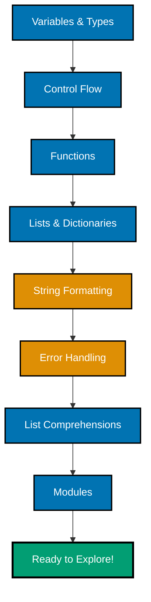

**Want to get productive with Python fast?** This Quick Start teaches you the essential syntax and core patterns you need to read Python code and try simple examples independently. You'll understand Python's approach to simplicity and readability.

For comprehensive coverage and hands-on practice, see the [Complete Beginner's Guide](/en/learn/software-engineering/programming-language/python/tutorials/beginner). For practical patterns and recipes, check out the [Python Cookbook](/en/learn/software-engineering/programming-language/python/how-to/cookbook) and [How-To Guides](/en/learn/software-engineering/programming-language/python/how-to/overview).

## 🗺️ Python Learning Touchpoints

This Quick Start gives you exposure to Python's core concepts in order of importance:



Each section introduces ONE essential concept with ONE example. After completing all touchpoints, you'll understand Python's philosophy and can start experimenting independently.

## 📋 Prerequisites

- Basic programming knowledge in any language
- Python installed (version 3.12 or later recommended - see [Initial Setup](/en/learn/software-engineering/programming-language/python/tutorials/initial-setup) if you haven't installed Python yet)

## 🔤 Variables and Types

Python uses dynamic typing with type hints for clarity:

```python
# Simple assignment (dynamic typing)
name = "Alice"
age = 30
height = 1.65
is_active = True

# Type hints (optional, for clarity)
city: str = "Jakarta"
count: int = 42
price: float = 99.99

# Multiple assignment
x, y, z = 10, 20, 30

# Constants (by convention, ALL_CAPS)
MAX_RETRIES = 3
API_URL = "https://api.example.com"

print(name, age, height, is_active)
# Output: Alice 30 1.65 True
```

**Key Types**:

- `str` - Text
- `int` - Whole numbers (unlimited precision!)
- `float` - Decimal numbers
- `bool` - `True`/`False` (capitalized)
- `None` - Absence of value (like `null` in other languages)

Python uses duck typing: "If it walks like a duck and quacks like a duck, it's a duck." For deeper coverage of types and type hints, see the [Beginner tutorial](/en/learn/software-engineering/programming-language/python/tutorials/beginner) and [Use type hints effectively](/en/learn/software-engineering/programming-language/python/how-to/use-type-hints-effectively).

---

## 🔄 Control Flow

Python uses indentation (not braces) for code blocks:

```python
# If/elif/else
age = 18
if age >= 18:
    print("Adult")
elif age >= 13:
    print("Teenager")
else:
    print("Child")

# For loop (range)
for i in range(3):
    print(i)  # Prints: 0, 1, 2

# For loop (iterate over list)
fruits = ["apple", "banana", "cherry"]
for fruit in fruits:
    print(fruit)

# While loop
count = 0
while count < 3:
    print(count)
    count += 1

# Break and continue
for i in range(10):
    if i == 3:
        continue  # Skip 3
    if i == 5:
        break     # Stop at 5
    print(i)      # Prints: 0, 1, 2, 4
```

**Key Points**:

- **Indentation is syntax** (4 spaces standard, not tabs)
- `range(n)` generates numbers from 0 to n-1
- `for item in collection` is the Pythonic way

For advanced control flow patterns, see [Use control structures effectively](/en/learn/software-engineering/programming-language/python/how-to/use-control-structures-effectively) and [Python Best Practices](/en/learn/software-engineering/programming-language/python/explanation/best-practices).

---

## 🔧 Functions

Functions are first-class objects in Python:

```python
# Simple function
def greet(name):
    return f"Hello, {name}"

# Function with type hints
def add(a: int, b: int) -> int:
    return a + b

# Function with default arguments
def power(base, exponent=2):
    return base ** exponent

# Multiple return values (using tuple unpacking)
def divide(a, b):
    quotient = a // b
    remainder = a % b
    return quotient, remainder

# Lambda (anonymous function)
square = lambda x: x ** 2

# Usage
print(greet("Alice"))       # Hello, Alice
print(add(5, 3))            # 8
print(power(5))             # 25 (default exponent=2)
print(power(5, 3))          # 125
q, r = divide(10, 3)
print(q, r)                 # 3 1
print(square(4))            # 16
```

**Key Points**:

- No explicit `return` type in basic syntax (but type hints help)
- Default arguments must come after required arguments
- Functions can return multiple values (tuples)
- Lambdas are concise one-line functions

Deep dive into functions in the [Beginner tutorial](/en/learn/software-engineering/programming-language/python/tutorials/beginner) or explore patterns in [Write effective functions](/en/learn/software-engineering/programming-language/python/how-to/write-effective-functions).

---

## 📋 Lists and Dictionaries

Python's built-in collections are powerful:

```python
# List (ordered, mutable)
numbers = [1, 2, 3, 4, 5]
numbers.append(6)           # Add to end
numbers.insert(0, 0)        # Insert at position
first = numbers[0]          # Access by index
last = numbers[-1]          # Negative indexing
slice_nums = numbers[1:4]   # Slicing [1, 2, 3]

print(numbers)              # [0, 1, 2, 3, 4, 5, 6]

# Dictionary (key-value pairs)
person = {
    "name": "Alice",
    "age": 30,
    "city": "Jakarta"
}

# Access values
print(person["name"])       # Alice
print(person.get("age"))    # 30 (safe access)

# Add/modify
person["email"] = "alice@example.com"
person["age"] = 31

# Iterate
for key, value in person.items():
    print(f"{key}: {value}")
```

**Key Points**:

- Lists are indexed from 0, support negative indices
- Slicing: `list[start:end]` (end is exclusive)
- Dictionaries are unordered (Python 3.7+ maintains insertion order)
- Use `.get(key)` to avoid KeyError

For more collection patterns, see [Work with lists effectively](/en/learn/software-engineering/programming-language/python/how-to/use-collections-effectively) and [Work with dictionaries effectively](/en/learn/software-engineering/programming-language/python/how-to/use-collections-effectively).

---

## 💬 String Formatting

Python has multiple ways to format strings:

```python
name = "Alice"
age = 30
price = 19.99

# f-strings (Python 3.6+, recommended)
print(f"Hello, {name}!")
print(f"{name} is {age} years old")
print(f"Price: ${price:.2f}")  # Format to 2 decimal places

# str.format() (older style)
print("Hello, {}!".format(name))
print("{} is {} years old".format(name, age))

# % formatting (legacy, avoid)
print("Hello, %s!" % name)

# Multi-line strings
message = f"""
Dear {name},

You are {age} years old.
Your order total is ${price:.2f}.

Best regards
"""

print(message)
```

**Key Points**:

- f-strings are the modern, readable way
- `:.2f` formats floats to 2 decimal places
- Triple quotes (`"""` or `'''`) for multi-line strings

---

## ⚠️ Basic Error Handling

Python uses exceptions for error handling:

```python
# Try/except
try:
    number = int("abc")  # This will raise ValueError
except ValueError as e:
    print(f"Error: {e}")
    # Output: Error: invalid literal for int() with base 10: 'abc'

# Multiple exceptions
try:
    result = 10 / 0
except ZeroDivisionError:
    print("Cannot divide by zero")
except Exception as e:
    print(f"Unexpected error: {e}")

# Try/except/else/finally
try:
    file = open("data.txt", "r")
except FileNotFoundError:
    print("File not found")
else:
    # Runs if no exception
    content = file.read()
    print(content)
finally:
    # Always runs (cleanup)
    if 'file' in locals():
        file.close()

# EAFP style (Easier to Ask for Forgiveness than Permission)
try:
    value = my_dict["key"]
except KeyError:
    value = "default"

# vs LBYL style (Look Before You Leap) - less Pythonic
if "key" in my_dict:
    value = my_dict["key"]
else:
    value = "default"
```

**Key Points**:

- Python encourages EAFP (try first, handle errors)
- Specific exceptions before general ones
- `finally` block always executes (cleanup code)

For comprehensive error handling strategies, see [Handle errors effectively](/en/learn/software-engineering/programming-language/python/how-to/handle-errors-effectively) and [Intermediate tutorial](/en/learn/software-engineering/programming-language/python/tutorials/intermediate).

---

## 🚀 List Comprehensions

Concise way to create lists:

```python
# Traditional loop
squares = []
for i in range(10):
    squares.append(i ** 2)

# List comprehension (more Pythonic)
squares = [i ** 2 for i in range(10)]
print(squares)
# Output: [0, 1, 4, 9, 16, 25, 36, 49, 64, 81]

# With condition (filter)
even_squares = [i ** 2 for i in range(10) if i % 2 == 0]
print(even_squares)
# Output: [0, 4, 16, 36, 64]

# Dictionary comprehension
squares_dict = {i: i ** 2 for i in range(5)}
print(squares_dict)
# Output: {0: 0, 1: 1, 2: 4, 3: 9, 4: 16}

# Nested list comprehension
matrix = [[i * j for j in range(3)] for i in range(3)]
print(matrix)
# Output: [[0, 0, 0], [0, 1, 2], [0, 2, 4]]
```

**Key Points**:

- Comprehensions are more concise than loops
- Format: `[expression for item in iterable if condition]`
- Works for lists, dicts, sets

---

## 📚 Modules and Imports

Python code is organized in modules:

```python
# Import entire module
import math
print(math.pi)           # 3.141592653589793
print(math.sqrt(16))     # 4.0

# Import specific items
from math import pi, sqrt
print(pi)                # 3.141592653589793
print(sqrt(16))          # 4.0

# Import with alias
import datetime as dt
now = dt.datetime.now()
print(now)

# Import all (avoid in production)
from math import *
print(cos(0))            # 1.0

# Common standard library modules
import os                # Operating system functions
import sys               # System-specific parameters
import json              # JSON parsing
import random            # Random number generation
import re                # Regular expressions

# Example usage
random_number = random.randint(1, 10)
current_dir = os.getcwd()
print(f"Random: {random_number}, Directory: {current_dir}")
```

**Key Standard Library Modules**:

- `math` - Mathematical functions
- `datetime` - Date and time handling
- `os` - Operating system interface
- `sys` - System-specific parameters
- `json` - JSON encoding/decoding
- `re` - Regular expressions
- `random` - Random number generation
- `collections` - Specialized data structures

---

## 📁 File Input/Output

Reading and writing files is simple in Python:

```python
# Writing to a file
with open('data.txt', 'w') as f:
    f.write("Hello, file!\n")
    f.write("Second line\n")

# Reading from a file
with open('data.txt', 'r') as f:
    content = f.read()
    print(content)

# Reading line by line
with open('data.txt', 'r') as f:
    for line in f:
        print(line.strip())  # strip() removes newline

# Appending to a file
with open('data.txt', 'a') as f:
    f.write("Appended line\n")
```

**File Modes**:

- `'r'` - Read (default)
- `'w'` - Write (overwrites existing file)
- `'a'` - Append (adds to end of file)
- `'r+'` - Read and write
- `'rb'` - Read binary
- `'wb'` - Write binary

**Best Practices**:

- Always use `with` statement - automatically closes files
- Use `pathlib.Path` for cross-platform path handling
- Handle file exceptions with try/except

```python
from pathlib import Path

# Modern path handling
file_path = Path('data') / 'users.txt'
if file_path.exists():
    text = file_path.read_text()
    print(text)
```

---

## 🗂️ Working with JSON

JSON is Python's most common data interchange format:

```python
import json

# Python dict to JSON
data = {
    'name': 'Alice',
    'age': 30,
    'skills': ['Python', 'JavaScript'],
    'active': True
}

# Convert to JSON string
json_string = json.dumps(data, indent=2)
print(json_string)

# Write JSON to file
with open('user.json', 'w') as f:
    json.dump(data, f, indent=2)

# Read JSON from file
with open('user.json', 'r') as f:
    loaded_data = json.load(f)
    print(loaded_data['name'])  # Alice

# Parse JSON string
json_text = '{"status": "success", "count": 42}'
result = json.loads(json_text)
print(result['count'])  # 42
```

**Key Functions**:

- `json.dumps()` - Convert Python object to JSON string
- `json.dump()` - Write Python object to file as JSON
- `json.loads()` - Parse JSON string to Python object
- `json.load()` - Read JSON file to Python object

**JSON Type Mapping**:

- Python `dict` ↔ JSON object
- Python `list` ↔ JSON array
- Python `str` ↔ JSON string
- Python `int`/`float` ↔ JSON number
- Python `True`/`False` ↔ JSON true/false
- Python `None` ↔ JSON null

---

## 🔧 Virtual Environments

Virtual environments isolate project dependencies:

```bash
# Create a virtual environment
python -m venv venv

# Activate it
# Windows:
venv\Scripts\activate
# macOS/Linux:
source venv/bin/activate

# Your prompt changes to show (venv)

# Install packages (isolated to this project)
pip install requests

# List installed packages
pip list

# Save dependencies
pip freeze > requirements.txt

# Install from requirements file
pip install -r requirements.txt

# Deactivate when done
deactivate
```

**Why Use Virtual Environments?**:

- Each project has its own dependencies
- Avoid version conflicts between projects
- Easy to reproduce exact environment
- Don't pollute global Python installation

For more details, see [Use virtual environments](/en/learn/software-engineering/programming-language/python/how-to/manage-dependencies-and-environments) and [Manage Python packages effectively](/en/learn/software-engineering/programming-language/python/how-to/manage-dependencies-and-environments).

**Best Practice**: Create a new venv for every project.

---

## 🎨 Common Patterns

### Enumerate for Index + Value

```python
fruits = ['apple', 'banana', 'cherry']

# Without enumerate (not Pythonic)
for i in range(len(fruits)):
    print(f"{i}: {fruits[i]}")

# With enumerate (Pythonic!)
for i, fruit in enumerate(fruits):
    print(f"{i}: {fruit}")

# Start index at 1
for i, fruit in enumerate(fruits, start=1):
    print(f"{i}. {fruit}")
```

### Zip for Parallel Iteration

```python
names = ['Alice', 'Bob', 'Charlie']
ages = [25, 30, 35]

# Combine lists
for name, age in zip(names, ages):
    print(f"{name} is {age} years old")

# Create dict from two lists
user_dict = dict(zip(names, ages))
print(user_dict)  # {'Alice': 25, 'Bob': 30, 'Charlie': 35}
```

### Any and All

```python
numbers = [1, 2, 3, 4, 5]

# Check if any element is even
has_even = any(n % 2 == 0 for n in numbers)  # True

# Check if all elements are positive
all_positive = all(n > 0 for n in numbers)  # True

# Check if list is empty
is_empty = not any(numbers)  # False
```

### Default Dictionary Values

```python
# Using dict.get() for safe access
config = {'timeout': 30}
timeout = config.get('timeout', 10)  # 30
retries = config.get('retries', 3)   # 3 (default)

# Using dict.setdefault()
config.setdefault('retries', 3)  # Sets retries=3 if not exists
print(config)  # {'timeout': 30, 'retries': 3}
```

---

## 🐍 Pythonic Style Tips

**Use in for Membership**:

```python
# Not Pythonic
if name == 'Alice' or name == 'Bob' or name == 'Charlie':
    print("Known user")

# Pythonic
if name in ['Alice', 'Bob', 'Charlie']:
    print("Known user")
```

**Use with for Resources**:

```python
# Not Pythonic
f = open('file.txt', 'r')
try:
    content = f.read()
finally:
    f.close()

# Pythonic
with open('file.txt', 'r') as f:
    content = f.read()
```

**Use Comprehensions**:

```python
# Not Pythonic
squares = []
for i in range(10):
    squares.append(i**2)

# Pythonic
squares = [i**2 for i in range(10)]
```

**Use Multiple Assignment**:

```python
# Not Pythonic
temp = a
a = b
b = temp

# Pythonic
a, b = b, a
```

---

## ✅ Next Steps

You now have touchpoints across Python's core concepts! To deepen your knowledge:

1. **Try the examples**: Copy and run each code snippet. Modify them and experiment.
2. **Read the docs**: Visit [docs.python.org](https://docs.python.org/) to explore in depth or check our [Python Resources](/en/learn/software-engineering/programming-language/python/reference/resources).
3. **Complete the Beginner tutorial**: [Complete Beginner's Guide to Python](/en/learn/software-engineering/programming-language/python/tutorials/beginner) covers everything comprehensively with:
   - Classes, objects, and inheritance
   - Decorators and context managers
   - File I/O and working with APIs
   - Virtual environments and package management
   - Testing with pytest
   - 4 levels of practice exercises

4. **Explore practical recipes**: [Python Cookbook](/en/learn/software-engineering/programming-language/python/how-to/cookbook) has 30+ copy-paste-modify solutions.

5. **Deepen specific topics**: [How-To Guides](/en/learn/software-engineering/programming-language/python/how-to/overview) provide focused tutorials on specific techniques.

6. **Learn best practices**: [Python Best Practices](/en/learn/software-engineering/programming-language/python/explanation/best-practices) and [Anti-Patterns](/en/learn/software-engineering/programming-language/python/explanation/anti-patterns) show what to do (and what to avoid).

## 🎯 Self-Assessment

After completing this Quick Start, you should be able to:

- [ ] Read and understand basic Python syntax
- [ ] Write simple functions with parameters and return values
- [ ] Handle errors with try/except blocks
- [ ] Use lists and dictionaries to store collections
- [ ] Format strings with f-strings
- [ ] Write list comprehensions for concise data transformations
- [ ] Import and use standard library modules
- [ ] Understand Python's approach to simplicity and readability

If you can do these, you're ready to explore Python code and try simple examples independently!
