**Want to master Rust fundamentals?** This comprehensive tutorial covers everything from variables to testing, with extensive ownership system explanation and visual diagrams.

## Coverage

This tutorial covers **0-60%** of Rust knowledge - complete fundamentals including ownership mastery.

## Prerequisites

- [Initial Setup](/en/learn/software-engineering/programming-language/rust/tutorials/initial-setup) complete
- [Quick Start](/en/learn/software-engineering/programming-language/rust/tutorials/quick-start) recommended but not required
- Programming experience helpful

## Learning Outcomes

By the end of this tutorial, you will:

- Master Rust's ownership system (stack vs heap, ownership rules, move semantics)
- Understand references and borrowing (immutable and mutable)
- Work with lifetimes basics
- Use slices effectively
- Define structs with methods and associated functions
- Work with enums and pattern matching (Option, Result)
- Handle errors using panic! and Result
- Use collections (Vec, String, HashMap) with ownership awareness
- Organize code with modules and packages
- Write comprehensive tests

This tutorial emphasizes **ownership** - Rust's most distinctive feature. Take time to understand this thoroughly.

---

## Learning Path


**Color Palette**: Orange (#DE8F05 - critical ownership sections), Teal (#029E73 - completion)

**⭐ Most important sections**: Ownership System and References & Borrowing - master these!

---

## Section 1: Variables and Mutability

### Immutability by Default

Rust variables are immutable by default:

```rust
fn main() {
    let x = 5;
    println!("The value of x is: {}", x);
    // x = 6;  // ❌ Compilation error: cannot assign twice to immutable variable
}
```

**Why immutable by default?**

- Prevents accidental bugs from unexpected mutations
- Enables compiler optimizations
- Makes concurrent code safer (can't mutate if multiple threads read)
- Encourages thinking about data ownership

### Mutability with mut

```rust
fn main() {
    let mut x = 5;
    println!("The value of x is: {}", x);
    x = 6;  // ✅ Allowed
    println!("The value of x is: {}", x);
}
```

**Output**:

```
The value of x is: 5
The value of x is: 6
```

**Best practice**: Use `mut` only when necessary. Immutability is safer.

### Shadowing

Create new variable with same name:

```rust
fn main() {
    let x = 5;

    let x = x + 1;  // Shadows previous x

    {
        let x = x * 2;  // Shadows again in inner scope
        println!("The value of x in the inner scope is: {}", x);
    }

    println!("The value of x is: {}", x);
}
```

**Output**:

```
The value of x in the inner scope is: 12
The value of x is: 6
```

**Shadowing vs mutation**:

```rust
fn main() {
    // Shadowing allows type change
    let spaces = "   ";
    let spaces = spaces.len();  // ✅ OK - different type

    // Mutation doesn't allow type change
    let mut spaces = "   ";
    // spaces = spaces.len();  // ❌ Error - can't change type
}
```

### Constants

```rust
const THREE_HOURS_IN_SECONDS: u32 = 60 * 60 * 3;

fn main() {
    println!("Three hours in seconds: {}", THREE_HOURS_IN_SECONDS);
}
```

**Constants vs immutable variables**:

| Feature         | Immutable Variable     | Constant                   |
| --------------- | ---------------------- | -------------------------- |
| Mutability      | Immutable (can shadow) | Always immutable           |
| Type annotation | Optional               | Required                   |
| Scope           | Block or function      | Global allowed             |
| Initialization  | Any expression         | Compile-time constant only |
| Naming          | snake_case             | SCREAMING_SNAKE_CASE       |

---

## Section 2: Data Types

Rust is statically typed - types must be known at compile time.

### Scalar Types

#### Integer Types

```rust
fn main() {
    let a: i8 = -128;      // Signed 8-bit: -128 to 127
    let b: u8 = 255;       // Unsigned 8-bit: 0 to 255
    let c: i32 = -50000;   // Signed 32-bit (default integer type)
    let d: u64 = 1000000;  // Unsigned 64-bit

    println!("a: {}, b: {}, c: {}, d: {}", a, b, c, d);
}
```

**Integer types**:

| Length  | Signed        | Unsigned |
| ------- | ------------- | -------- |
| 8-bit   | i8            | u8       |
| 16-bit  | i16           | u16      |
| 32-bit  | i32 (default) | u32      |
| 64-bit  | i64           | u64      |
| 128-bit | i128          | u128     |
| arch    | isize         | usize    |

**Integer literals**:

```rust
fn main() {
    let decimal = 98_222;       // Underscore for readability
    let hex = 0xff;             // Hexadecimal
    let octal = 0o77;           // Octal
    let binary = 0b1111_0000;   // Binary
    let byte = b'A';            // Byte (u8 only)

    println!("dec: {}, hex: {}, oct: {}, bin: {}, byte: {}",
             decimal, hex, octal, binary, byte);
}
```

**Integer overflow**:

```rust
fn main() {
    let mut x: u8 = 255;
    // x = x + 1;  // Debug: panic, Release: wraps to 0
    x = x.wrapping_add(1);  // Explicitly wrap: 0
    println!("x: {}", x);
}
```

#### Floating-Point Types

```rust
fn main() {
    let x = 2.0;      // f64 (default - double precision)
    let y: f32 = 3.0; // f32 (single precision)

    println!("x: {}, y: {}", x, y);
}
```

**Floating-point operations**:

```rust
fn main() {
    let sum = 5.0 + 10.0;
    let difference = 95.5 - 4.3;
    let product = 4.0 * 30.0;
    let quotient = 56.7 / 32.2;
    let floored = 2 / 3;  // Integer division: 0

    println!("sum: {}, diff: {}, prod: {}, quot: {}, floor: {}",
             sum, difference, product, quotient, floored);
}
```

#### Boolean Type

```rust
fn main() {
    let t = true;
    let f: bool = false;

    if t {
        println!("t is true");
    }

    if !f {
        println!("f is false");
    }
}
```

#### Character Type

```rust
fn main() {
    let c = 'z';
    let z: char = 'ℤ';  // Unicode
    let heart_eyed_cat = '😻';  // Emoji

    println!("c: {}, z: {}, cat: {}", c, z, heart_eyed_cat);
}
```

**Note**: `char` is 4 bytes (Unicode Scalar Value), not ASCII.

### Compound Types

#### Tuple Type

```rust
fn main() {
    let tup: (i32, f64, u8) = (500, 6.4, 1);

    // Destructuring
    let (x, y, z) = tup;
    println!("The value of y is: {}", y);

    // Direct access
    let five_hundred = tup.0;
    let six_point_four = tup.1;
    let one = tup.2;

    println!("Values: {}, {}, {}", five_hundred, six_point_four, one);
}
```

**Unit type** (empty tuple):

```rust
fn main() {
    let unit = ();  // Unit type - represents absence of value
    println!("Unit: {:?}", unit);
}
```

Functions without return value implicitly return `()`.

#### Array Type

```rust
fn main() {
    let a = [1, 2, 3, 4, 5];

    // Type annotation: [type; length]
    let b: [i32; 5] = [1, 2, 3, 4, 5];

    // Initialize with same value
    let c = [3; 5];  // [3, 3, 3, 3, 3]

    // Accessing elements
    let first = a[0];
    let second = a[1];

    println!("First: {}, Second: {}", first, second);
}
```

**Array bounds checking**:

```rust
fn main() {
    let a = [1, 2, 3, 4, 5];
    let index = 10;

    // let element = a[index];  // Runtime panic: index out of bounds
    let element = a.get(index);  // Returns Option<&i32>

    match element {
        Some(val) => println!("Element: {}", val),
        None => println!("Index out of bounds"),
    }
}
```

**Arrays vs Vectors**:

- **Arrays**: Fixed size, stack-allocated, size known at compile time
- **Vectors**: Dynamic size, heap-allocated, growable

---

## Section 3: Functions

### Function Definition

```rust
fn main() {
    println!("Hello, world!");
    another_function(5, 'h');
}

fn another_function(value: i32, unit_label: char) {
    println!("The measurement is: {value}{unit_label}");
}
```

**Function naming**: snake_case by convention.

### Parameters

```rust
fn print_labeled_measurement(value: i32, unit_label: char) {
    println!("The measurement is: {value}{unit_label}");
}

fn main() {
    print_labeled_measurement(5, 'h');
}
```

**Type annotations required** for parameters.

### Statements and Expressions

**Statement**: Instruction that performs action, doesn't return value.

**Expression**: Evaluates to value.

```rust
fn main() {
    let y = {
        let x = 3;
        x + 1  // Expression (no semicolon)
    };

    println!("The value of y is: {y}");  // 4
}
```

**Key difference**: Expressions don't have semicolons. Adding semicolon makes it a statement.

### Return Values

```rust
fn five() -> i32 {
    5  // Expression - implicit return
}

fn plus_one(x: i32) -> i32 {
    x + 1  // Expression
}

fn plus_one_explicit(x: i32) -> i32 {
    return x + 1;  // Explicit return (rare)
}

fn main() {
    let x = five();
    println!("The value of x is: {x}");

    let y = plus_one(5);
    println!("The value of y is: {y}");
}
```

**Common mistake**:

```rust
fn plus_one(x: i32) -> i32 {
    x + 1;  // ❌ Semicolon makes this a statement, returns ()
}
```

Error: "expected `i32`, found `()`"

---

## Section 4: Control Flow

### if Expressions

```rust
fn main() {
    let number = 6;

    if number % 4 == 0 {
        println!("number is divisible by 4");
    } else if number % 3 == 0 {
        println!("number is divisible by 3");
    } else if number % 2 == 0 {
        println!("number is divisible by 2");
    } else {
        println!("number is not divisible by 4, 3, or 2");
    }
}
```

**Condition must be bool**:

```rust
fn main() {
    let number = 3;

    // if number {  // ❌ Error: expected `bool`, found integer
    if number != 0 {  // ✅ Explicit boolean
        println!("number was something other than zero");
    }
}
```

### if in let Statement

```rust
fn main() {
    let condition = true;
    let number = if condition { 5 } else { 6 };

    println!("The value of number is: {number}");
}
```

**Both branches must return same type**:

```rust
fn main() {
    let condition = true;
    // let number = if condition { 5 } else { "six" };  // ❌ Type mismatch
    let number = if condition { 5 } else { 6 };  // ✅ Both i32
}
```

### loop - Infinite Loop

```rust
fn main() {
    let mut counter = 0;

    let result = loop {
        counter += 1;

        if counter == 10 {
            break counter * 2;  // break with value
        }
    };

    println!("The result is: {result}");  // 20
}
```

### Loop Labels

```rust
fn main() {
    let mut count = 0;
    'counting_up: loop {
        println!("count = {count}");
        let mut remaining = 10;

        loop {
            println!("remaining = {remaining}");
            if remaining == 9 {
                break;  // Breaks inner loop
            }
            if count == 2 {
                break 'counting_up;  // Breaks outer loop
            }
            remaining -= 1;
        }

        count += 1;
    }
    println!("End count = {count}");
}
```

### while Loop

```rust
fn main() {
    let mut number = 3;

    while number != 0 {
        println!("{number}!");
        number -= 1;
    }

    println!("LIFTOFF!!!");
}
```

### for Loop

```rust
fn main() {
    let a = [10, 20, 30, 40, 50];

    for element in a {
        println!("the value is: {element}");
    }
}
```

**Counting with range**:

```rust
fn main() {
    for number in (1..4).rev() {  // Reverse range
        println!("{number}!");
    }
    println!("LIFTOFF!!!");
}
```

**Output**:

```
3!
2!
1!
LIFTOFF!!!
```

---

## Section 5: Ownership System

**Ownership** is Rust's most unique and important feature. It enables memory safety without garbage collection.

### What is Ownership?

#### Memory Management Background

Most languages handle memory in two ways:

1. **Garbage Collection** (Java, Python, JavaScript): Runtime tracks memory, automatically frees unused memory
2. **Manual Management** (C, C++): Programmer explicitly allocates and frees memory

**Rust's approach**: Ownership system enforces memory safety at compile time with zero runtime cost.

#### The Stack and The Heap

**Stack**:

- Fast access (LIFO - Last In, First Out)
- Fixed size known at compile time
- Automatically managed (values popped when out of scope)
- Stores: integers, floats, booleans, chars, references, some structs/enums

**Heap**:

- Slower access (memory allocator finds space)
- Dynamic size (grow/shrink at runtime)
- Must be explicitly managed
- Stores: String, Vec, Box, Rc, etc.

```rust
fn main() {
    let x = 5;  // Stack: i32 is fixed size
    let s = String::from("hello");  // Heap: String size can change
}
```

### Ownership Rules

Three ownership rules (memorize these):

1. Each value in Rust has an **owner**
2. There can only be **one owner** at a time
3. When the owner goes **out of scope**, the value is **dropped** (memory freed)

### Variable Scope

```rust
fn main() {
    {                                // s is not valid here, not yet declared
        let s = "hello";             // s is valid from this point forward
        // do stuff with s
    }                                // scope is over, s is no longer valid
}
```

### The String Type

String literal (`"hello"`) is immutable and stack-allocated. `String` type is mutable and heap-allocated:

```rust
fn main() {
    let mut s = String::from("hello");
    s.push_str(", world!");  // Append to String
    println!("{}", s);  // "hello, world!"
}
```

### Move Semantics

```rust
fn main() {
    let s1 = String::from("hello");
    let s2 = s1;  // s1 is moved to s2

    // println!("{}, world!", s1);  // ❌ Error: value borrowed after move
    println!("{}, world!", s2);  // ✅ s2 owns the String
}
```

**What happened?**

```mermaid
graph LR
    A["s1<br/>ptr → heap"] -->|move| B["s2<br/>ptr → heap"]
    B --> C["s1 invalid<br/>no longer usable"]

    style A fill:#0173B2,stroke:#000000,stroke-width:2px,color:#FFFFFF
    style B fill:#029E73,stroke:#000000,stroke-width:2px,color:#FFFFFF
    style C fill:#DE8F05,stroke:#000000,stroke-width:2px,color:#000000
```



**Before move**:

```
s1 → | ptr | len | capacity | → heap: "hello"
```

**After move**:

```
s1     (invalid - moved)
s2 → | ptr | len | capacity | → heap: "hello"
```

**Why move instead of copy?**

If Rust copied the heap data:

```rust
let s1 = String::from("hello");
let s2 = s1;  // Hypothetical: copy heap data
```

When `s1` and `s2` go out of scope, both would try to free the same heap memory (**double-free error**).

Rust avoids this by **moving** ownership and invalidating `s1`.

### Clone - Deep Copy

```rust
fn main() {
    let s1 = String::from("hello");
    let s2 = s1.clone();  // Deep copy heap data

    println!("s1 = {}, s2 = {}", s1, s2);  // ✅ Both valid
}
```

**clone** explicitly copies heap data. Expensive - use only when needed.

### Stack-Only Data: Copy

```rust
fn main() {
    let x = 5;
    let y = x;  // Copy (not move)

    println!("x = {}, y = {}", x, y);  // ✅ Both valid
}
```

**Types implementing Copy trait** (simple stack types):

- Integers: `i32`, `u64`, etc.
- Floats: `f32`, `f64`
- Booleans: `bool`
- Characters: `char`
- Tuples containing only Copy types: `(i32, i32)`

**Types NOT implementing Copy** (heap-allocated):

- `String`
- `Vec<T>`
- Structs containing non-Copy types

**Rule**: If a type implements `Drop` (cleanup on scope exit), it can't implement `Copy`.

### Ownership and Functions

**Passing to function moves or copies**:

```rust
fn main() {
    let s = String::from("hello");  // s comes into scope

    takes_ownership(s);             // s's value moves into function
                                    // s is no longer valid here

    let x = 5;                      // x comes into scope

    makes_copy(x);                  // x would move into function,
                                    // but i32 is Copy, so okay to still use x

    println!("x = {}", x);  // ✅ x still valid
    // println!("{}", s);   // ❌ Error: value moved
}

fn takes_ownership(some_string: String) {
    println!("{}", some_string);
}  // some_string goes out of scope, `drop` is called, memory is freed

fn makes_copy(some_integer: i32) {
    println!("{}", some_integer);
}  // some_integer goes out of scope, nothing special happens
```

### Return Values and Ownership

```rust
fn main() {
    let s1 = gives_ownership();         // Function returns and moves value to s1

    let s2 = String::from("hello");     // s2 comes into scope

    let s3 = takes_and_gives_back(s2);  // s2 is moved into function
                                        // return value moves into s3

    println!("s1 = {}, s3 = {}", s1, s3);
    // println!("{}", s2);  // ❌ Error: s2 was moved
}

fn gives_ownership() -> String {
    let some_string = String::from("yours");
    some_string  // Returned and moves out to calling function
}

fn takes_and_gives_back(a_string: String) -> String {
    a_string  // Returned and moves out to calling function
}
```

**Ownership transfer pattern**:


**Problem**: Taking ownership and returning is tedious. Solution: **References and Borrowing**.

---

## Section 6: References and Borrowing

**References** allow you to refer to a value without taking ownership.

### Immutable References

```rust
fn main() {
    let s1 = String::from("hello");

    let len = calculate_length(&s1);  // Borrow s1

    println!("The length of '{}' is {}.", s1, len);  // s1 still valid
}

fn calculate_length(s: &String) -> usize {  // s is a reference to String
    s.len()
}  // s goes out of scope, but doesn't drop String (doesn't own it)
```

**Reference visualization**:


**Memory layout**:

```
s1  → | ptr | len | capacity | → heap: "hello"
&s1 → pointer to s1 (doesn't own heap data)
```

**`&` creates reference**, `*` dereferences (rarely needed explicitly in Rust):

```rust
fn main() {
    let x = 5;
    let y = &x;  // y is reference to x

    assert_eq!(5, x);
    assert_eq!(5, *y);  // Dereference y
}
```

### Mutable References

```rust
fn main() {
    let mut s = String::from("hello");

    change(&mut s);  // Mutable borrow

    println!("{}", s);  // "hello, world"
}

fn change(some_string: &mut String) {
    some_string.push_str(", world");
}
```

### Borrowing Rules

**The Two Borrowing Rules** (enforced at compile time):

1. At any given time, you can have either:
   - **One mutable reference** OR
   - **Any number of immutable references**
2. References must always be **valid** (no dangling references)

#### Rule 1: Preventing Data Races

**Cannot have mutable and immutable references simultaneously**:

```rust
fn main() {
    let mut s = String::from("hello");

    let r1 = &s;  // ✅ Immutable borrow
    let r2 = &s;  // ✅ Multiple immutable borrows OK
    println!("{} and {}", r1, r2);
    // r1 and r2 are no longer used after this point

    let r3 = &mut s;  // ✅ Mutable borrow OK (r1, r2 no longer used)
    r3.push_str(", world");
    println!("{}", r3);
}
```

**Attempting simultaneous mutable and immutable**:

```rust
fn main() {
    let mut s = String::from("hello");

    let r1 = &s;        // ✅ Immutable borrow
    let r2 = &s;        // ✅ Immutable borrow
    let r3 = &mut s;    // ❌ Error: cannot borrow as mutable

    println!("{}, {}, and {}", r1, r2, r3);
}
```

Error: "cannot borrow `s` as mutable because it is also borrowed as immutable"

**Cannot have two mutable references**:

```rust
fn main() {
    let mut s = String::from("hello");

    let r1 = &mut s;
    let r2 = &mut s;  // ❌ Error: cannot borrow as mutable more than once

    println!("{}, {}", r1, r2);
}
```

**Why these rules?** Prevents **data races** at compile time:

- Can't modify data while someone is reading it (mutable + immutable conflict)
- Can't have two writers at same time (two mutable references conflict)

**Scope-based borrowing**:

```rust
fn main() {
    let mut s = String::from("hello");

    {
        let r1 = &mut s;
        r1.push_str(", world");
    }  // r1 goes out of scope here

    let r2 = &mut s;  // ✅ OK - r1 no longer exists
    r2.push_str("!");
    println!("{}", r2);
}
```

#### Rule 2: No Dangling References

```rust
fn dangle() -> &String {  // ❌ Error: missing lifetime specifier
    let s = String::from("hello");
    &s  // Return reference to s
}  // s goes out of scope and is dropped - reference would be invalid
```

Error: "this function's return type contains a borrowed value, but there is no value for it to be borrowed from"

**Fix**: Return owned value, not reference:

```rust
fn no_dangle() -> String {
    let s = String::from("hello");
    s  // Return owned String (ownership moves to caller)
}
```

**Borrowing visualization**:


**Key insight**: Borrowing rules prevent bugs at compile time. No data races, no use-after-free, no null pointer dereferences!

---

## Section 7: Slices

**Slices** reference a contiguous sequence of elements in a collection.

### String Slices

```rust
fn main() {
    let s = String::from("hello world");

    let hello = &s[0..5];   // "hello"
    let world = &s[6..11];  // "world"

    println!("{} {}", hello, world);
}
```

**Range syntax**:

```rust
fn main() {
    let s = String::from("hello");

    let slice = &s[0..2];   // "he"
    let slice = &s[..2];    // Same: "he" (start from beginning)

    let len = s.len();
    let slice = &s[3..len]; // "lo"
    let slice = &s[3..];    // Same: "lo" (go to end)

    let slice = &s[0..len]; // "hello"
    let slice = &s[..];     // Same: "hello" (entire string)
}
```

**String slice type**: `&str`

```rust
fn first_word(s: &String) -> &str {
    let bytes = s.as_bytes();

    for (i, &item) in bytes.iter().enumerate() {
        if item == b' ' {
            return &s[0..i];  // Return slice to first word
        }
    }

    &s[..]  // Return entire string if no space found
}

fn main() {
    let s = String::from("hello world");
    let word = first_word(&s);
    println!("First word: {}", word);
}
```

### String Literals are Slices

```rust
let s = "Hello, world!";  // Type: &str (slice)
```

String literals are `&str` - immutable references to string data baked into the binary.

### Improved first_word

```rust
fn first_word(s: &str) -> &str {  // Takes &str instead of &String
    let bytes = s.as_bytes();

    for (i, &item) in bytes.iter().enumerate() {
        if item == b' ' {
            return &s[0..i];
        }
    }

    &s[..]
}

fn main() {
    let my_string = String::from("hello world");

    // Works with slices of `String`
    let word = first_word(&my_string[0..6]);
    let word = first_word(&my_string[..]);

    // Also works with references to `String` (coerced to slices)
    let word = first_word(&my_string);

    let my_string_literal = "hello world";

    // Works with slices of string literals
    let word = first_word(&my_string_literal[0..6]);
    let word = first_word(&my_string_literal[..]);

    // Works with string literals directly (they are &str)
    let word = first_word(my_string_literal);
}
```

### Other Slices

Arrays can be sliced too:

```rust
fn main() {
    let a = [1, 2, 3, 4, 5];
    let slice = &a[1..3];  // Type: &[i32]

    assert_eq!(slice, &[2, 3]);
}
```

**Slice type**: `&[T]` where `T` is element type.

---

## Section 8: Structs

### Defining and Instantiating Structs

```rust
struct User {
    active: bool,
    username: String,
    email: String,
    sign_in_count: u64,
}

fn main() {
    let user1 = User {
        active: true,
        username: String::from("someusername123"),
        email: String::from("someone@example.com"),
        sign_in_count: 1,
    };

    println!("User email: {}", user1.email);
}
```

### Mutable Structs

```rust
fn main() {
    let mut user1 = User {
        active: true,
        username: String::from("someusername123"),
        email: String::from("someone@example.com"),
        sign_in_count: 1,
    };

    user1.email = String::from("anotheremail@example.com");
}
```

**Note**: Entire struct must be mutable (can't make only some fields mutable).

### Field Init Shorthand

```rust
fn build_user(email: String, username: String) -> User {
    User {
        active: true,
        username,  // Shorthand: same as username: username
        email,     // Shorthand: same as email: email
        sign_in_count: 1,
    }
}
```

### Struct Update Syntax

```rust
fn main() {
    let user1 = User {
        email: String::from("someone@example.com"),
        username: String::from("someusername123"),
        active: true,
        sign_in_count: 1,
    };

    let user2 = User {
        email: String::from("another@example.com"),
        ..user1  // Copy remaining fields from user1
    };

    // Note: user1.username and user1.email moved to user2
    // user1.active and user1.sign_in_count copied (they implement Copy)
}
```

### Tuple Structs

```rust
struct Color(i32, i32, i32);
struct Point(i32, i32, i32);

fn main() {
    let black = Color(0, 0, 0);
    let origin = Point(0, 0, 0);

    // black and origin are different types even though same structure
}
```

### Unit-Like Structs

```rust
struct AlwaysEqual;

fn main() {
    let subject = AlwaysEqual;
}
```

Useful for implementing traits without data.

### Methods

```rust
#[derive(Debug)]
struct Rectangle {
    width: u32,
    height: u32,
}

impl Rectangle {
    fn area(&self) -> u32 {
        self.width * self.height
    }

    fn can_hold(&self, other: &Rectangle) -> bool {
        self.width > other.width && self.height > other.height
    }
}

fn main() {
    let rect1 = Rectangle {
        width: 30,
        height: 50,
    };

    println!("Area: {} square pixels", rect1.area());

    let rect2 = Rectangle {
        width: 10,
        height: 40,
    };

    println!("Can rect1 hold rect2? {}", rect1.can_hold(&rect2));
}
```

**Method parameters**:

- `&self`: Borrow self immutably
- `&mut self`: Borrow self mutably
- `self`: Take ownership of self (rare)

### Associated Functions

```rust
impl Rectangle {
    fn square(size: u32) -> Rectangle {
        Rectangle {
            width: size,
            height: size,
        }
    }
}

fn main() {
    let sq = Rectangle::square(3);
}
```

**Associated functions** don't take `self` - called with `::` syntax (like `String::from`).

### Multiple impl Blocks

```rust
impl Rectangle {
    fn area(&self) -> u32 {
        self.width * self.height
    }
}

impl Rectangle {
    fn can_hold(&self, other: &Rectangle) -> bool {
        self.width > other.width && self.height > other.height
    }
}
```

Valid, but usually not necessary. Useful for trait implementations (covered in Intermediate).

---

## Section 9: Enums and Pattern Matching

### Defining Enums

```rust
enum IpAddrKind {
    V4,
    V6,
}

fn main() {
    let four = IpAddrKind::V4;
    let six = IpAddrKind::V6;

    route(IpAddrKind::V4);
    route(IpAddrKind::V6);
}

fn route(ip_kind: IpAddrKind) {
    // ...
}
```

### Enums with Data

```rust
enum IpAddr {
    V4(u8, u8, u8, u8),
    V6(String),
}

fn main() {
    let home = IpAddr::V4(127, 0, 0, 1);
    let loopback = IpAddr::V6(String::from("::1"));
}
```

**Each variant can have different types and amounts of data**:

```rust
enum Message {
    Quit,                       // No data
    Move { x: i32, y: i32 },    // Named fields (like struct)
    Write(String),              // Single String
    ChangeColor(i32, i32, i32), // Three i32s
}
```

### Methods on Enums

```rust
impl Message {
    fn call(&self) {
        // Method body defined here
    }
}

fn main() {
    let m = Message::Write(String::from("hello"));
    m.call();
}
```

### The Option Enum

Rust doesn't have null. Instead, `Option<T>`:

```rust
enum Option<T> {
    None,
    Some(T),
}
```

**Using Option**:

```rust
fn main() {
    let some_number = Some(5);
    let some_char = Some('e');
    let absent_number: Option<i32> = None;

    // Must handle None to access value
    match some_number {
        Some(n) => println!("Number: {}", n),
        None => println!("No number"),
    }
}
```

**Why Option instead of null?**

```rust
fn main() {
    let x: i8 = 5;
    let y: Option<i8> = Some(5);

    // let sum = x + y;  // ❌ Error: can't add i8 and Option<i8>
}
```

Must explicitly handle `None` case - prevents null pointer errors.

### The match Expression

```rust
enum Coin {
    Penny,
    Nickel,
    Dime,
    Quarter,
}

fn value_in_cents(coin: Coin) -> u8 {
    match coin {
        Coin::Penny => {
            println!("Lucky penny!");
            1
        }
        Coin::Nickel => 5,
        Coin::Dime => 10,
        Coin::Quarter => 25,
    }
}
```

### Patterns that Bind to Values

```rust
#[derive(Debug)]
enum UsState {
    Alabama,
    Alaska,
    // --snip--
}

enum Coin {
    Penny,
    Nickel,
    Dime,
    Quarter(UsState),
}

fn value_in_cents(coin: Coin) -> u8 {
    match coin {
        Coin::Penny => 1,
        Coin::Nickel => 5,
        Coin::Dime => 10,
        Coin::Quarter(state) => {
            println!("State quarter from {:?}!", state);
            25
        }
    }
}

fn main() {
    value_in_cents(Coin::Quarter(UsState::Alaska));
}
```

### Matching with Option<T>

```rust
fn plus_one(x: Option<i32>) -> Option<i32> {
    match x {
        None => None,
        Some(i) => Some(i + 1),
    }
}

fn main() {
    let five = Some(5);
    let six = plus_one(five);
    let none = plus_one(None);
}
```

### Matches are Exhaustive

```rust
fn plus_one(x: Option<i32>) -> Option<i32> {
    match x {
        Some(i) => Some(i + 1),
        // ❌ Error: pattern `None` not covered
    }
}
```

Must handle all cases or use catch-all.

### Catch-all Patterns

```rust
fn main() {
    let dice_roll = 9;

    match dice_roll {
        3 => add_fancy_hat(),
        7 => remove_fancy_hat(),
        other => move_player(other),  // Catch-all
    }

    match dice_roll {
        3 => add_fancy_hat(),
        7 => remove_fancy_hat(),
        _ => reroll(),  // Catch-all, ignore value
    }
}

fn add_fancy_hat() {}
fn remove_fancy_hat() {}
fn move_player(num_spaces: u8) {}
fn reroll() {}
```

### if let Syntax

```rust
fn main() {
    let config_max = Some(3u8);

    match config_max {
        Some(max) => println!("The maximum is configured to be {}", max),
        _ => (),
    }

    // Equivalent with if let
    if let Some(max) = config_max {
        println!("The maximum is configured to be {}", max);
    }
}
```

**if let with else**:

```rust
fn main() {
    let mut count = 0;
    let coin = Coin::Quarter(UsState::Alaska);

    if let Coin::Quarter(state) = coin {
        println!("State quarter from {:?}!", state);
    } else {
        count += 1;
    }
}
```

---

## Section 10: Error Handling

Rust groups errors into two categories:

1. **Recoverable** (Result<T, E>): File not found, invalid input
2. **Unrecoverable** (panic!): Bugs, programmer errors

### Unrecoverable Errors with panic!

```rust
fn main() {
    panic!("crash and burn");
}
```

**panic! backtrace**:

```bash
$ RUST_BACKTRACE=1 cargo run
```

Shows call stack when panic occurs.

### Recoverable Errors with Result

```rust
enum Result<T, E> {
    Ok(T),
    Err(E),
}
```

**Opening a file**:

```rust
use std::fs::File;

fn main() {
    let greeting_file_result = File::open("hello.txt");

    let greeting_file = match greeting_file_result {
        Ok(file) => file,
        Err(error) => panic!("Problem opening the file: {:?}", error),
    };
}
```

### Matching on Different Errors

```rust
use std::fs::File;
use std::io::ErrorKind;

fn main() {
    let greeting_file_result = File::open("hello.txt");

    let greeting_file = match greeting_file_result {
        Ok(file) => file,
        Err(error) => match error.kind() {
            ErrorKind::NotFound => match File::create("hello.txt") {
                Ok(fc) => fc,
                Err(e) => panic!("Problem creating the file: {:?}", e),
            },
            other_error => {
                panic!("Problem opening the file: {:?}", other_error);
            }
        },
    };
}
```

### Shortcuts: unwrap and expect

**unwrap**: Panics on Err

```rust
use std::fs::File;

fn main() {
    let greeting_file = File::open("hello.txt").unwrap();
}
```

**expect**: Panics with custom message

```rust
use std::fs::File;

fn main() {
    let greeting_file = File::open("hello.txt")
        .expect("hello.txt should be included in this project");
}
```

### Propagating Errors

```rust
use std::fs::File;
use std::io::{self, Read};

fn read_username_from_file() -> Result<String, io::Error> {
    let username_file_result = File::open("hello.txt");

    let mut username_file = match username_file_result {
        Ok(file) => file,
        Err(e) => return Err(e),
    };

    let mut username = String::new();

    match username_file.read_to_string(&mut username) {
        Ok(_) => Ok(username),
        Err(e) => Err(e),
    }
}
```

### The ? Operator

```rust
use std::fs::File;
use std::io::{self, Read};

fn read_username_from_file() -> Result<String, io::Error> {
    let mut username_file = File::open("hello.txt")?;
    let mut username = String::new();
    username_file.read_to_string(&mut username)?;
    Ok(username)
}
```

**? operator**:

- If Ok: unwraps value and continues
- If Err: returns Err from function

**Chaining ? calls**:

```rust
use std::fs::File;
use std::io::{self, Read};

fn read_username_from_file() -> Result<String, io::Error> {
    let mut username = String::new();
    File::open("hello.txt")?.read_to_string(&mut username)?;
    Ok(username)
}
```

**Even shorter with fs::read_to_string**:

```rust
use std::fs;
use std::io;

fn read_username_from_file() -> Result<String, io::Error> {
    fs::read_to_string("hello.txt")
}
```

### Where ? Can Be Used

**? can only be used in functions returning Result or Option**:

```rust
use std::fs::File;

fn main() {
    // ❌ Error: can't use ? in function returning ()
    let greeting_file = File::open("hello.txt")?;
}
```

**Fix**: main can return Result:

```rust
use std::error::Error;
use std::fs::File;

fn main() -> Result<(), Box<dyn Error>> {
    let greeting_file = File::open("hello.txt")?;
    Ok(())
}
```

---

## Section 11: Collections

### Vec<T> - Vector

**Creating vectors**:

```rust
fn main() {
    let v: Vec<i32> = Vec::new();  // Empty vector

    let v = vec![1, 2, 3];  // vec! macro with initial values
}
```

**Updating vectors**:

```rust
fn main() {
    let mut v = Vec::new();

    v.push(5);
    v.push(6);
    v.push(7);
    v.push(8);
}
```

**Reading elements**:

```rust
fn main() {
    let v = vec![1, 2, 3, 4, 5];

    let third: &i32 = &v[2];  // Index syntax - panics if out of bounds
    println!("The third element is {third}");

    let third: Option<&i32> = v.get(2);  // get method - returns Option
    match third {
        Some(third) => println!("The third element is {third}"),
        None => println!("There is no third element."),
    }
}
```

**Ownership and borrowing with vectors**:

```rust
fn main() {
    let mut v = vec![1, 2, 3, 4, 5];

    let first = &v[0];  // Immutable borrow

    // v.push(6);  // ❌ Error: cannot borrow as mutable while immutable borrow exists

    println!("The first element is: {first}");
}
```

**Why can't we push while holding a reference?** Vector might need to reallocate, invalidating the reference.

**Iterating over vectors**:

```rust
fn main() {
    let v = vec![100, 32, 57];
    for i in &v {
        println!("{i}");
    }

    let mut v = vec![100, 32, 57];
    for i in &mut v {
        *i += 50;  // Dereference to modify
    }
}
```

**Using enums to store multiple types**:

```rust
enum SpreadsheetCell {
    Int(i32),
    Float(f64),
    Text(String),
}

fn main() {
    let row = vec![
        SpreadsheetCell::Int(3),
        SpreadsheetCell::Text(String::from("blue")),
        SpreadsheetCell::Float(10.12),
    ];
}
```

### String

**Creating strings**:

```rust
fn main() {
    let mut s = String::new();

    let data = "initial contents";
    let s = data.to_string();
    let s = "initial contents".to_string();

    let s = String::from("initial contents");
}
```

**Updating strings**:

```rust
fn main() {
    let mut s = String::from("foo");
    s.push_str("bar");  // Append &str
    s.push('!');        // Append char

    println!("{s}");  // "foobar!"
}
```

**Concatenation with +**:

```rust
fn main() {
    let s1 = String::from("Hello, ");
    let s2 = String::from("world!");
    let s3 = s1 + &s2;  // s1 is moved, s2 is borrowed

    // println!("{s1}");  // ❌ Error: s1 was moved
    println!("{s3}");  // ✅
}
```

**format! macro**:

```rust
fn main() {
    let s1 = String::from("tic");
    let s2 = String::from("tac");
    let s3 = String::from("toe");

    let s = format!("{s1}-{s2}-{s3}");  // Doesn't take ownership

    println!("{s}");  // "tic-tac-toe"
}
```

**String indexing doesn't work**:

```rust
fn main() {
    let s1 = String::from("hello");
    // let h = s1[0];  // ❌ Error: String cannot be indexed by integer
}
```

**Why?** Strings are UTF-8. One character might be multiple bytes. Indexing could return invalid data.

**Iterating over strings**:

```rust
fn main() {
    for c in "नमस्ते".chars() {
        println!("{c}");
    }

    for b in "नमस्ते".bytes() {
        println!("{b}");
    }
}
```

### HashMap<K, V>

**Creating hash maps**:

```rust
use std::collections::HashMap;

fn main() {
    let mut scores = HashMap::new();

    scores.insert(String::from("Blue"), 10);
    scores.insert(String::from("TeamA"), 50);
}
```

**Accessing values**:

```rust
use std::collections::HashMap;

fn main() {
    let mut scores = HashMap::new();

    scores.insert(String::from("Blue"), 10);
    scores.insert(String::from("TeamA"), 50);

    let team_name = String::from("Blue");
    let score = scores.get(&team_name);  // Returns Option<&i32>

    match score {
        Some(s) => println!("Score: {s}"),
        None => println!("Team not found"),
    }
}
```

**Iterating**:

```rust
use std::collections::HashMap;

fn main() {
    let mut scores = HashMap::new();

    scores.insert(String::from("Blue"), 10);
    scores.insert(String::from("TeamA"), 50);

    for (key, value) in &scores {
        println!("{key}: {value}");
    }
}
```

**Ownership**:

```rust
use std::collections::HashMap;

fn main() {
    let field_name = String::from("Favorite color");
    let field_value = String::from("Blue");

    let mut map = HashMap::new();
    map.insert(field_name, field_value);
    // field_name and field_value moved into map

    // println!("{field_name}");  // ❌ Error: value moved
}
```

**Updating values**:

```rust
use std::collections::HashMap;

fn main() {
    let mut scores = HashMap::new();

    scores.insert(String::from("Blue"), 10);
    scores.insert(String::from("Blue"), 25);  // Overwrites

    println!("{:?}", scores);  // {"Blue": 25}
}
```

**Insert if key doesn't exist**:

```rust
use std::collections::HashMap;

fn main() {
    let mut scores = HashMap::new();
    scores.insert(String::from("Blue"), 10);

    scores.entry(String::from("TeamA")).or_insert(50);
    scores.entry(String::from("Blue")).or_insert(50);  // Doesn't overwrite

    println!("{:?}", scores);  // {"TeamA": 50, "Blue": 10}
}
```

**Update based on old value**:

```rust
use std::collections::HashMap;

fn main() {
    let text = "hello world wonderful world";

    let mut map = HashMap::new();

    for word in text.split_whitespace() {
        let count = map.entry(word).or_insert(0);
        *count += 1;  // Dereference to modify value
    }

    println!("{:?}", map);  // {"world": 2, "hello": 1, "wonderful": 1}
}
```

---

## Section 12: Modules and Packages

### Packages and Crates

- **Package**: One or more crates, contains Cargo.toml
- **Crate**: Binary or library
  - **Binary crate**: Program you can run (has `fn main`)
  - **Library crate**: Code intended for use in other programs (no `fn main`)

**Package rules**:

- Can contain at most one library crate
- Can contain any number of binary crates
- Must contain at least one crate (library or binary)

### Module System

```rust
mod front_of_house {
    pub mod hosting {
        pub fn add_to_waitlist() {}
        fn seat_at_table() {}
    }

    mod serving {
        fn take_order() {}
        fn serve_order() {}
        fn take_payment() {}
    }
}

pub fn eat_at_restaurant() {
    // Absolute path
    crate::front_of_house::hosting::add_to_waitlist();

    // Relative path
    front_of_house::hosting::add_to_waitlist();
}
```

**Privacy rules**:

- Items are private by default
- Use `pub` to make items public
- Child modules can use items in parent modules
- Parent modules can't use private items in child modules

### use Keyword

```rust
mod front_of_house {
    pub mod hosting {
        pub fn add_to_waitlist() {}
    }
}

use crate::front_of_house::hosting;

pub fn eat_at_restaurant() {
    hosting::add_to_waitlist();
}
```

**Idiomatic use**:

- For functions: bring parent module into scope
- For structs/enums: bring type itself into scope

```rust
use std::collections::HashMap;  // ✅ Idiomatic

fn main() {
    let mut map = HashMap::new();
    map.insert(1, 2);
}
```

**as keyword for name conflicts**:

```rust
use std::fmt::Result;
use std::io::Result as IoResult;

fn function1() -> Result {
    // --snip--
    Ok(())
}

fn function2() -> IoResult<()> {
    // --snip--
    Ok(())
}
```

---

## Section 13: Testing

### Writing Tests

```rust
#[cfg(test)]
mod tests {
    #[test]
    fn it_works() {
        let result = 2 + 2;
        assert_eq!(result, 4);
    }

    #[test]
    fn another() {
        // panic!("Make this test fail");
    }
}
```

**Running tests**:

```bash
cargo test
```

### Test Functions

```rust
#[cfg(test)]
mod tests {
    use super::*;

    #[test]
    fn larger_can_hold_smaller() {
        let larger = Rectangle {
            width: 8,
            height: 7,
        };
        let smaller = Rectangle {
            width: 5,
            height: 1,
        };

        assert!(larger.can_hold(&smaller));
    }

    #[test]
    fn smaller_cannot_hold_larger() {
        let larger = Rectangle {
            width: 8,
            height: 7,
        };
        let smaller = Rectangle {
            width: 5,
            height: 1,
        };

        assert!(!smaller.can_hold(&larger));
    }
}

#[derive(Debug)]
struct Rectangle {
    width: u32,
    height: u32,
}

impl Rectangle {
    fn can_hold(&self, other: &Rectangle) -> bool {
        self.width > other.width && self.height > other.height
    }
}
```

### Checking Results with assert_eq! and assert_ne!

```rust
pub fn add_two(a: i32) -> i32 {
    a + 2
}

#[cfg(test)]
mod tests {
    use super::*;

    #[test]
    fn it_adds_two() {
        assert_eq!(4, add_two(2));
    }

    #[test]
    fn it_doesnt_add_three() {
        assert_ne!(5, add_two(2));
    }
}
```

### Custom Failure Messages

```rust
#[test]
fn greeting_contains_name() {
    let result = greeting("Carol");
    assert!(
        result.contains("Carol"),
        "Greeting did not contain name, value was `{}`",
        result
    );
}

pub fn greeting(name: &str) -> String {
    String::from("Hello!")
}
```

### Checking for Panics with should_panic

```rust
pub struct Guess {
    value: i32,
}

impl Guess {
    pub fn new(value: i32) -> Guess {
        if value < 1 || value > 100 {
            panic!("Guess value must be between 1 and 100, got {}.", value);
        }

        Guess { value }
    }
}

#[cfg(test)]
mod tests {
    use super::*;

    #[test]
    #[should_panic(expected = "less than or equal to 100")]
    fn greater_than_100() {
        Guess::new(200);
    }
}
```

### Using Result<T, E> in Tests

```rust
#[cfg(test)]
mod tests {
    #[test]
    fn it_works() -> Result<(), String> {
        if 2 + 2 == 4 {
            Ok(())
        } else {
            Err(String::from("two plus two does not equal four"))
        }
    }
}
```

**Note**: Can't use `#[should_panic]` with `Result<T, E>`. Use `assert!(value.is_err())` instead.

---

## Summary

Congratulations! You've completed the Beginner Rust tutorial, covering **0-60% of Rust knowledge**.

### What You've Learned

1. ✅ **Variables and Mutability**: Immutable by default, `mut`, shadowing, constants
2. ✅ **Data Types**: Scalars (integers, floats, bool, char), compounds (tuples, arrays)
3. ✅ **Functions**: Expression-oriented, parameter types, return values
4. ✅ **Control Flow**: if, loop, while, for, match
5. ✅ **Ownership System** ⭐: Stack vs heap, ownership rules, move semantics, Copy trait
6. ✅ **References and Borrowing** ⭐: `&T`, `&mut T`, borrowing rules, no dangling references
7. ✅ **Slices**: String slices (`&str`), array slices
8. ✅ **Structs**: Classic, tuple, unit structs, methods, associated functions
9. ✅ **Enums and Pattern Matching**: Option, Result, match, if let
10. ✅ **Error Handling**: panic!, Result, `?` operator, unwrap, expect
11. ✅ **Collections**: Vec, String, HashMap with ownership awareness
12. ✅ **Modules and Packages**: Module system, privacy, `use` keyword
13. ✅ **Testing**: Test functions, assertions, `should_panic`, integration tests

### Key Takeaways

- **Ownership prevents memory bugs at compile time** (no GC needed)
- **Borrowing rules prevent data races** (safe concurrency)
- **match ensures exhaustive handling** (no null pointer errors)
- **? operator makes error propagation concise** (clean error handling)
- **Rust defaults to safety** (immutability, ownership, type checking)

---

## Next Steps

Ready to continue?

### Intermediate Tutorial

**[Intermediate Rust](/en/learn/software-engineering/programming-language/rust/tutorials/intermediate)** covers:

- Generics and trait bounds
- Lifetime annotations deep-dive
- Smart pointers (Box, Rc, Arc, RefCell)
- Concurrency with threads and channels
- Async/await with Tokio
- Iterators and closures
- Advanced error handling patterns

### Practical Resources

- **[Rust Cookbook](/en/learn/software-engineering/programming-language/rust/how-to/cookbook)** - 30+ recipes for common tasks
- **[How-To Guides](/en/learn/software-engineering/programming-language/rust/how-to)** - Problem-solving guides

### Practice Projects

Build something to solidify your knowledge:

- CLI calculator with error handling
- File parser using Result and error propagation
- Todo list manager with Vec and HashMap
- Simple web scraper (preview async concepts)

### Internal Resources

- [Rust Cookbook](/en/learn/software-engineering/programming-language/rust/how-to/cookbook) - Ready-to-use code recipes
- [Rust Best Practices](/en/learn/software-engineering/programming-language/rust/explanation/best-practices) - Professional standards
- [Rust Cheat Sheet](/en/learn/software-engineering/programming-language/rust/reference/cheat-sheet) - Quick reference
- [Advanced Rust](/en/learn/software-engineering/programming-language/rust/tutorials/advanced) - Expert topics

### External Resources

- [Rust Book](https://doc.rust-lang.org/book/) - Comprehensive official guide
- [Rust by Example](https://doc.rust-lang.org/rust-by-example/) - Runnable examples
- [Rustlings](https://github.com/rust-lang/rustlings) - Small exercises
- [Exercism Rust Track](https://exercism.org/tracks/rust) - Practice problems

---

**You've mastered Rust fundamentals!** Continue to [Intermediate Tutorial](/en/learn/software-engineering/programming-language/rust/tutorials/intermediate) for production-ready Rust skills.
