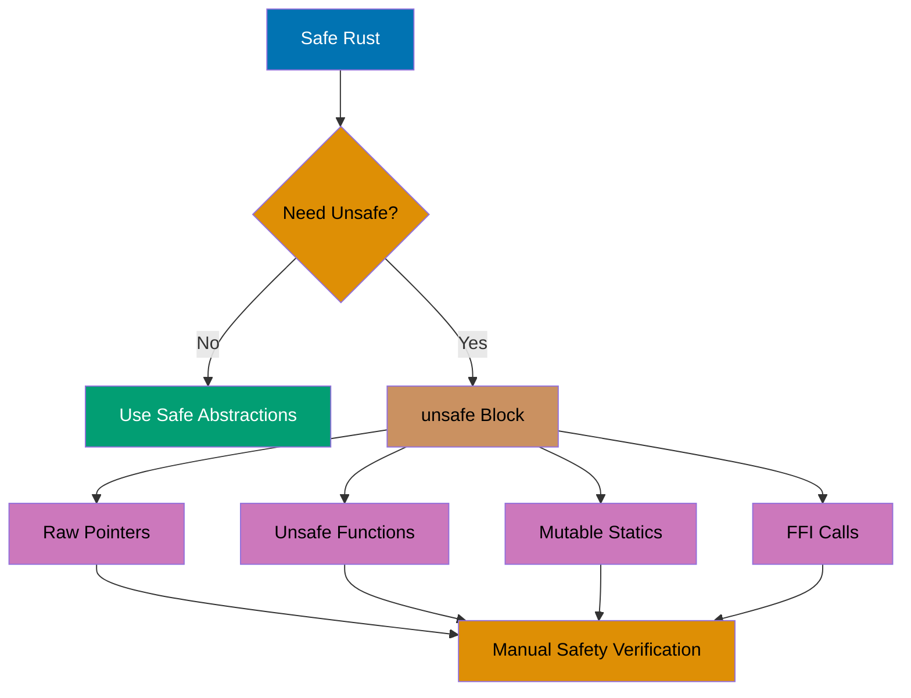
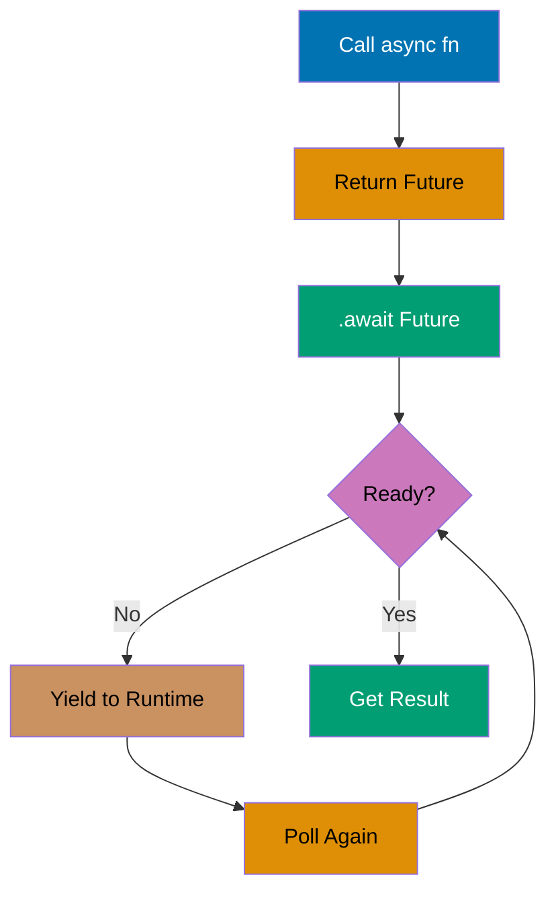
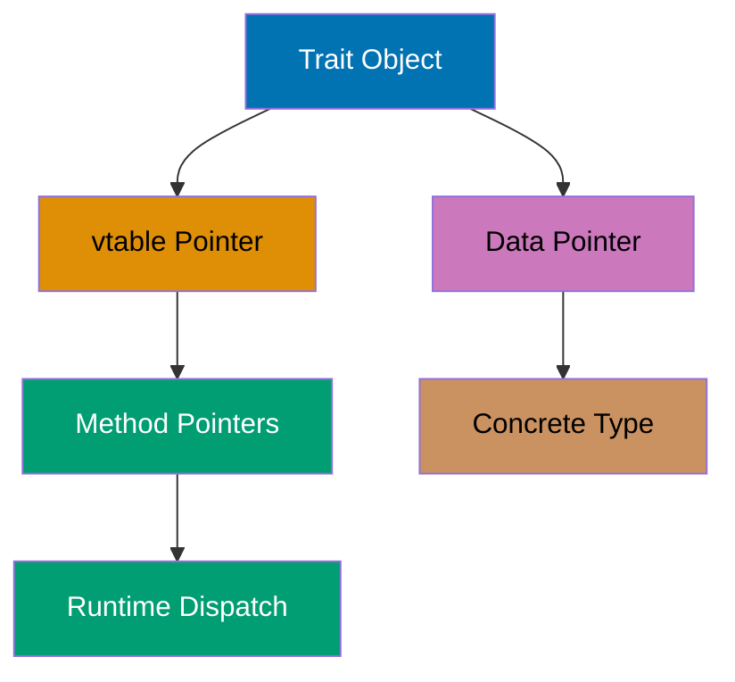

## Advanced Level: Expert Mastery

Examples 58-85 cover expert mastery and performance optimization (75-95% coverage). You'll explore unsafe code, procedural macros, async/await, advanced trait patterns, FFI, and performance tuning.

---

### Example 58: Unsafe Code Basics

`unsafe` blocks bypass Rust's safety guarantees for operations the compiler can't verify, like raw pointer dereferencing and calling unsafe functions.



```rust
fn main() {
    let mut num = 5;

    // Create raw pointers (safe)
    let r1 = &num as *const i32;     // => r1 is immutable raw pointer
    let r2 = &mut num as *mut i32;   // => r2 is mutable raw pointer

    // Dereference raw pointers (unsafe)
    unsafe {
        println!("r1: {}", *r1);     // => Output: r1: 5
        *r2 = 10;                    // => Modify through raw pointer
        println!("r2: {}", *r2);     // => Output: r2: 10
    }

    // Invalid pointer (undefined behavior!)
    let address = 0x012345usize;
    let _r = address as *const i32;
    // unsafe {
    //     println!("{}", *_r);      // => UNDEFINED BEHAVIOR: dereferencing invalid pointer
    // }
}
```

**Key Takeaway**: `unsafe` blocks allow raw pointer operations and other unchecked operations, placing responsibility on the programmer to maintain memory safety invariants the compiler can't verify.

---

### Example 59: Unsafe Functions

Unsafe functions require `unsafe` keyword in both definition and call, documenting operations that require manual safety verification.

```rust
unsafe fn dangerous() {              // => Unsafe function declaration
    println!("Doing dangerous things");
}

fn split_at_mut(slice: &mut [i32], mid: usize) -> (&mut [i32], &mut [i32]) {
    let len = slice.len();
    let ptr = slice.as_mut_ptr();    // => Get raw pointer to slice

    assert!(mid <= len);             // => Safety check

    unsafe {
        (
            std::slice::from_raw_parts_mut(ptr, mid),
                                     // => First half slice
            std::slice::from_raw_parts_mut(ptr.add(mid), len - mid),
                                     // => Second half slice
        )
    }
}

fn main() {
    unsafe {
        dangerous();                 // => Must call in unsafe block
    }                                // => Output: Doing dangerous things

    let mut v = vec![1, 2, 3, 4, 5, 6];
    let (left, right) = split_at_mut(&mut v, 3);
    println!("Left: {:?}", left);    // => Output: Left: [1, 2, 3]
    println!("Right: {:?}", right);  // => Output: Right: [4, 5, 6]
}
```

**Key Takeaway**: Unsafe functions encapsulate operations requiring manual safety verification, making unsafe operations explicit in both definition and call sites while enabling safe abstractions over unsafe code.

---

### Example 60: FFI (Foreign Function Interface)

FFI enables calling functions from other languages like C, using `extern` blocks to declare external function signatures.

```rust
extern "C" {
    fn abs(input: i32) -> i32;       // => Declare C function
}

fn main() {
    unsafe {
        println!("abs(-3) = {}", abs(-3));
                                     // => Output: abs(-3) = 3
    }
}

// Expose Rust function to C
#[no_mangle]                         // => Prevent name mangling
pub extern "C" fn call_from_c() {
    println!("Called from C!");
}
```

**Key Takeaway**: FFI through `extern` blocks enables interoperability with C libraries by declaring external function signatures, with `unsafe` required for calls since the compiler can't verify foreign code safety.

---

### Example 61: Global Mutable State

Global mutable state requires `unsafe` and careful synchronization, as Rust can't guarantee thread safety for mutable statics.

```rust
static mut COUNTER: u32 = 0;         // => Mutable global variable

fn add_to_count(inc: u32) {
    unsafe {
        COUNTER += inc;              // => Modify global state (unsafe)
    }
}

fn main() {
    add_to_count(3);
    add_to_count(7);

    unsafe {
        println!("COUNTER: {}", COUNTER);
                                     // => Output: COUNTER: 10
    }
}

// Better: use atomic types or Mutex for thread-safe globals
use std::sync::atomic::{AtomicU32, Ordering};

static ATOMIC_COUNTER: AtomicU32 = AtomicU32::new(0);

fn safe_add_to_count(inc: u32) {
    ATOMIC_COUNTER.fetch_add(inc, Ordering::SeqCst);
                                     // => Thread-safe increment
}
```

**Key Takeaway**: Mutable static variables require `unsafe` access due to thread safety concerns, but atomic types and `Mutex` provide safe alternatives for thread-safe global state.

---

### Example 62: Union Types

Unions share memory for all fields, enabling low-level memory layouts at the cost of type safety (all field access is unsafe).

```rust
#[repr(C)]
union MyUnion {
    f1: u32,
    f2: f32,
}

fn main() {
    let u = MyUnion { f1: 1 };       // => Initialize f1

    unsafe {
        println!("u.f1: {}", u.f1);  // => Output: u.f1: 1
        println!("u.f2: {}", u.f2);  // => Output: u.f2: 0.000000000000000000000000000000000000000000001
                                     // => Reading f2 interprets f1's bits as float
    }
}
```

**Key Takeaway**: Unions enable C-compatible memory layouts by overlapping field storage, with all field access unsafe since the compiler can't track which field is currently valid.

---

### Example 63: Declarative Macros (macro_rules!)

Declarative macros enable code generation through pattern matching on syntax trees, reducing boilerplate with compile-time expansion.

```rust
macro_rules! vec_from {
    ( $( $x:expr ),* ) => {          // => Pattern: comma-separated expressions
        {
            let mut temp_vec = Vec::new();
            $(
                temp_vec.push($x);   // => Repeat for each expression
            )*
            temp_vec
        }
    };
}

fn main() {
    let v = vec_from![1, 2, 3];      // => Expands to Vec::new() + push calls
    println!("{:?}", v);             // => Output: [1, 2, 3]
}

// Common pattern: DSL creation
macro_rules! hashmap {
    ( $( $key:expr => $val:expr ),* ) => {
        {
            let mut map = std::collections::HashMap::new();
            $(
                map.insert($key, $val);
            )*
            map
        }
    };
}

fn main() {
    let map = hashmap![
        "a" => 1,
        "b" => 2
    ];
    println!("{:?}", map);           // => Output: {"a": 1, "b": 2}
}
```

**Key Takeaway**: `macro_rules!` enables compile-time code generation through pattern matching on token trees, reducing boilerplate and creating domain-specific syntax within Rust.

---

### Example 64: Procedural Macros Introduction

Procedural macros operate on AST (Abstract Syntax Tree) level, enabling custom derives, attribute macros, and function-like macros with full Rust code manipulation.

```rust
// In a separate crate (proc-macro = true in Cargo.toml)
use proc_macro::TokenStream;
use quote::quote;
use syn;

#[proc_macro_derive(HelloMacro)]
pub fn hello_macro_derive(input: TokenStream) -> TokenStream {
    let ast = syn::parse(input).unwrap();
    impl_hello_macro(&ast)
}

fn impl_hello_macro(ast: &syn::DeriveInput) -> TokenStream {
    let name = &ast.ident;
    let gen = quote! {
        impl HelloMacro for #name {
            fn hello_macro() {
                println!("Hello, Macro! My name is {}!", stringify!(#name));
            }
        }
    };
    gen.into()
}

// Usage in another crate
trait HelloMacro {
    fn hello_macro();
}

#[derive(HelloMacro)]
struct Pancakes;

fn main() {
    Pancakes::hello_macro();         // => Output: Hello, Macro! My name is Pancakes!
}
```

**Key Takeaway**: Procedural macros operate on parsed syntax trees enabling powerful code generation for custom derives, attributes, and function-like macros, with full access to Rust's AST.

---

### Example 65: Async/Await Basics

Async/await enables writing asynchronous code that looks synchronous, using `async fn` and `.await` for non-blocking operations.



```rust
use std::time::Duration;

async fn say_hello() {
    println!("Hello");
}

async fn say_world() {
    tokio::time::sleep(Duration::from_millis(100)).await;
    println!("World");
}

#[tokio::main]
async fn main() {
    say_hello().await;               // => Output: Hello
    say_world().await;               // => Wait 100ms, Output: World
}
```

**Key Takeaway**: Async/await syntax enables writing asynchronous code with synchronous structure, with `async fn` returning futures and `.await` yielding to the runtime until futures complete.

---

### Example 66: Futures and Executors

Futures are lazy computations that require an executor to poll them to completion, with Tokio being the most common runtime.

```rust
use tokio::time::{sleep, Duration};

async fn do_work(id: u32) -> u32 {
    println!("Task {} started", id);
    sleep(Duration::from_millis(100)).await;
    println!("Task {} finished", id);
    id * 2
}

#[tokio::main]
async fn main() {
    let future1 = do_work(1);
    let future2 = do_work(2);

    // Futures are lazy - not executed until awaited
    let (result1, result2) = tokio::join!(future1, future2);
                                     // => Run concurrently
    println!("Results: {} and {}", result1, result2);
                                     // => Output: Results: 2 and 4
}
```

**Key Takeaway**: Futures are lazy computations requiring an executor to poll them, with combinators like `tokio::join!` enabling concurrent execution of multiple futures on a single thread.

---

### Example 67: Async Concurrency with Join

`tokio::join!` runs multiple futures concurrently on the same task, enabling efficient concurrent execution without spawning threads.

```rust
use tokio::time::{sleep, Duration};

async fn task1() -> u32 {
    sleep(Duration::from_millis(100)).await;
    println!("Task 1 done");
    1
}

async fn task2() -> u32 {
    sleep(Duration::from_millis(50)).await;
    println!("Task 2 done");
    2
}

#[tokio::main]
async fn main() {
    let (r1, r2) = tokio::join!(task1(), task2());
                                     // => Both tasks run concurrently
                                     // => Output: Task 2 done (then) Task 1 done
    println!("Results: {} + {} = {}", r1, r2, r1 + r2);
                                     // => Output: Results: 1 + 2 = 3
}
```

**Key Takeaway**: `tokio::join!` enables concurrent execution of multiple futures within a single task, yielding to the runtime while waiting and resuming when ready without thread spawning overhead.

---

### Example 68: Async Task Spawning

`tokio::spawn` creates new async tasks that run independently, similar to thread spawning but for async contexts.

```rust
use tokio::time::{sleep, Duration};

async fn independent_task(id: u32) {
    sleep(Duration::from_millis(100)).await;
    println!("Independent task {} completed", id);
}

#[tokio::main]
async fn main() {
    let handle1 = tokio::spawn(independent_task(1));
    let handle2 = tokio::spawn(independent_task(2));

    println!("Main continues while tasks run");

    handle1.await.unwrap();
    handle2.await.unwrap();
    println!("All tasks completed");
}
```

**Key Takeaway**: `tokio::spawn` creates independent async tasks that run concurrently on the Tokio runtime, with join handles enabling waiting for task completion similar to thread joins.

---

### Example 69: Select and Race Conditions

`tokio::select!` waits on multiple async operations simultaneously, completing when any branch is ready.

```rust
use tokio::time::{sleep, Duration};

async fn operation1() -> &'static str {
    sleep(Duration::from_millis(100)).await;
    "Operation 1"
}

async fn operation2() -> &'static str {
    sleep(Duration::from_millis(50)).await;
    "Operation 2"
}

#[tokio::main]
async fn main() {
    let result = tokio::select! {
        res1 = operation1() => res1,
        res2 = operation2() => res2,
    };
    println!("First completed: {}", result);
                                     // => Output: First completed: Operation 2
}
```

**Key Takeaway**: `tokio::select!` enables racing multiple async operations, returning when the first completes and cancelling others, useful for timeouts and concurrent alternative paths.

---

### Example 70: Channels in Async Context

Tokio provides async channels for message passing between async tasks with backpressure support.

```rust
use tokio::sync::mpsc;

#[tokio::main]
async fn main() {
    let (tx, mut rx) = mpsc::channel(32);
                                     // => Bounded channel with capacity 32

    tokio::spawn(async move {
        for i in 0..5 {
            tx.send(i).await.unwrap();
                                     // => Send async (blocks if full)
            println!("Sent: {}", i);
        }
    });

    while let Some(value) = rx.recv().await {
                                     // => Receive async
        println!("Received: {}", value);
    }
}
```

**Key Takeaway**: Tokio's async channels provide message passing between async tasks with `.await` for send/receive operations and backpressure through bounded channels.

---

### Example 71: Pin and Unpin

`Pin` prevents moving values in memory, required for self-referential futures and async functions that borrow across await points.

```rust
use std::pin::Pin;

fn print_pinned(pin: Pin<&mut i32>) {
    println!("Pinned value: {}", pin);
}

fn main() {
    let mut value = 42;
    let pinned = Pin::new(&mut value);
    print_pinned(pinned);            // => Output: Pinned value: 42
}

// Self-referential struct (requires Pin)
struct SelfReferential {
    data: String,
    pointer: *const String,          // => Points to data field
}

// Most types are Unpin (can be moved even when pinned)
// Types with self-references must be !Unpin
```

**Key Takeaway**: `Pin<P>` prevents moving pinned values, enabling self-referential types like futures that borrow across await points, with most types being `Unpin` (movable even when pinned).

---

### Example 72: Associated Types in Traits

Associated types define placeholder types in traits that implementors specify, improving code clarity over generic parameters.

```rust
trait Container {
    type Item;                       // => Associated type

    fn get(&self) -> &Self::Item;
}

struct IntContainer {
    value: i32,
}

impl Container for IntContainer {
    type Item = i32;                 // => Specify associated type

    fn get(&self) -> &Self::Item {
        &self.value
    }
}

fn print_container<C: Container>(container: &C) {
    println!("{:?}", container.get());
}

fn main() {
    let container = IntContainer { value: 42 };
    print_container(&container);     // => Output: 42
}
```

**Key Takeaway**: Associated types reduce generic parameter clutter by binding types to trait implementations rather than requiring them at use sites, improving API clarity for types with natural single implementations.

---

### Example 73: Generic Associated Types (GATs)

GATs enable associated types with generic parameters, enabling more flexible trait designs like lending iterators.

```rust
trait LendingIterator {
    type Item<'a> where Self: 'a;    // => GAT with lifetime parameter

    fn next<'a>(&'a mut self) -> Option<Self::Item<'a>>;
}

struct WindowsIterator<T> {
    data: Vec<T>,
    pos: usize,
}

impl<T> LendingIterator for WindowsIterator<T> {
    type Item<'a> = &'a [T] where T: 'a;

    fn next<'a>(&'a mut self) -> Option<Self::Item<'a>> {
        if self.pos + 2 <= self.data.len() {
            let window = &self.data[self.pos..self.pos + 2];
            self.pos += 1;
            Some(window)
        } else {
            None
        }
    }
}

fn main() {
    let mut iter = WindowsIterator {
        data: vec![1, 2, 3, 4],
        pos: 0,
    };

    while let Some(window) = iter.next() {
        println!("{:?}", window);    // => Output: [1, 2], [2, 3], [3, 4]
    }
}
```

**Key Takeaway**: Generic associated types enable associated types with generic parameters, unlocking patterns like lending iterators that couldn't be expressed with standard associated types or generic parameters alone.

---

### Example 74: Trait Objects and Dynamic Dispatch

Trait objects enable runtime polymorphism through dynamic dispatch, trading compile-time monomorphization for flexibility.



```rust
trait Draw {
    fn draw(&self);
}

struct Circle {
    radius: f64,
}

impl Draw for Circle {
    fn draw(&self) {
        println!("Drawing circle with radius {}", self.radius);
    }
}

struct Square {
    side: f64,
}

impl Draw for Square {
    fn draw(&self) {
        println!("Drawing square with side {}", self.side);
    }
}

fn main() {
    let shapes: Vec<Box<dyn Draw>> = vec![
        Box::new(Circle { radius: 5.0 }),
        Box::new(Square { side: 3.0 }),
    ];                               // => Heterogeneous collection of trait objects

    for shape in shapes.iter() {
        shape.draw();                // => Dynamic dispatch
    }                                // => Output: Drawing circle..., Drawing square...
}
```

**Key Takeaway**: Trait objects (`dyn Trait`) enable heterogeneous collections and runtime polymorphism through dynamic dispatch (vtable lookup), trading the performance of static dispatch for flexibility.

---

### Example 75: Object Safety and Trait Objects

Traits must be object-safe to be used as trait objects, requiring no generic methods, no Self return types, and no associated functions.

```rust
trait NotObjectSafe {
    fn generic<T>(&self, x: T);      // => Generic method (not object-safe)
    fn returns_self(&self) -> Self;  // => Returns Self (not object-safe)
}

trait ObjectSafe {
    fn method(&self) -> i32;         // => No generics, no Self return
}

struct MyType;

impl ObjectSafe for MyType {
    fn method(&self) -> i32 {
        42
    }
}

fn main() {
    let obj: Box<dyn ObjectSafe> = Box::new(MyType);
                                     // => Valid trait object
    println!("{}", obj.method());    // => Output: 42

    // let bad: Box<dyn NotObjectSafe> = Box::new(MyType);
                                     // => ERROR: trait not object-safe
}
```

**Key Takeaway**: Object safety requirements (no generic methods, no `Self` returns, no associated functions) ensure trait objects can be constructed with valid vtables, with violations caught at compile time.

---

### Example 76: Specialization (Unstable Feature)

Specialization allows providing more specific implementations for generic traits based on type constraints (requires nightly Rust).

```rust
// Requires nightly: #![feature(specialization)]
trait Summarize {
    fn summarize(&self) -> String {
        String::from("(Default summary)")
    }
}

// Default implementation for all types
impl<T> Summarize for T {}

// Specialized implementation for String
impl Summarize for String {
    fn summarize(&self) -> String {
        format!("String: {}", self)
    }
}

// Note: This feature is unstable and may change
```

**Key Takeaway**: Specialization enables providing more specific trait implementations for particular types, reducing code duplication, but remains unstable and requires nightly Rust.

---

### Example 77: Const Generics

Const generics allow generic parameters over constant values like array sizes, enabling generic code over arrays without trait objects.

```rust
fn print_array<T: std::fmt::Debug, const N: usize>(arr: [T; N]) {
                                     // => Const generic parameter N
    for item in arr.iter() {
        println!("{:?}", item);
    }
}

fn main() {
    let arr1 = [1, 2, 3];
    let arr2 = [1, 2, 3, 4, 5];

    print_array(arr1);               // => N = 3
    print_array(arr2);               // => N = 5
}

// Generic struct with const parameter
struct ArrayWrapper<T, const N: usize> {
    data: [T; N],
}

impl<T, const N: usize> ArrayWrapper<T, N> {
    fn len(&self) -> usize {
        N
    }
}
```

**Key Takeaway**: Const generics enable generic code over array sizes and other constant values, eliminating the need for trait-based abstractions over fixed-size arrays and enabling type-safe generic array operations.

---

### Example 78: Zero-Cost Abstractions

Rust's abstractions compile to the same machine code as hand-written low-level code, with no runtime overhead for features like iterators and generics.

```rust
// High-level iterator code
fn sum_iterator(data: &[i32]) -> i32 {
    data.iter().map(|x| x * 2).sum()
}

// Equivalent low-level code
fn sum_manual(data: &[i32]) -> i32 {
    let mut sum = 0;
    for i in 0..data.len() {
        sum += data[i] * 2;
    }
    sum
}

fn main() {
    let data = vec![1, 2, 3, 4, 5];
    println!("{}", sum_iterator(&data));
                                     // => Output: 30
    println!("{}", sum_manual(&data));
                                     // => Output: 30
    // Both compile to nearly identical assembly code
}
```

**Key Takeaway**: Rust's iterators, generics, and other abstractions are zero-cost, compiling to the same efficient machine code as hand-written loops through monomorphization and inline optimization.

---

### Example 79: Inline and Optimization Hints

Inline hints guide the compiler's inlining decisions, important for hot paths where function call overhead matters.

```rust
#[inline]                            // => Hint to inline (not guaranteed)
fn add(a: i32, b: i32) -> i32 {
    a + b
}

#[inline(always)]                    // => Force inline in all cases
fn multiply(a: i32, b: i32) -> i32 {
    a * b
}

#[inline(never)]                     // => Prevent inlining
fn complex_operation(a: i32, b: i32) -> i32 {
    // Expensive operation
    a * a + b * b
}

fn main() {
    let result = add(5, 3);          // => Likely inlined
    println!("{}", result);          // => Output: 8
}
```

**Key Takeaway**: Inline attributes guide compiler optimization decisions, with `#[inline]` suggesting inlining, `#[inline(always)]` forcing it, and `#[inline(never)]` preventing it for size-constrained or debugging scenarios.

---

### Example 80: SIMD and Portable SIMD

SIMD (Single Instruction Multiple Data) enables data parallelism at the CPU instruction level for performance-critical code.

```rust
// Using portable SIMD (unstable feature)
// #![feature(portable_simd)]
use std::simd::f32x4;

fn simd_add(a: &[f32], b: &[f32]) -> Vec<f32> {
    let mut result = Vec::new();
    for i in (0..a.len()).step_by(4) {
        let va = f32x4::from_slice(&a[i..]);
        let vb = f32x4::from_slice(&b[i..]);
        let sum = va + vb;           // => SIMD addition (4 at once)
        result.extend_from_slice(&sum.to_array());
    }
    result
}

// For stable Rust, use external crates like packed_simd
```

**Key Takeaway**: SIMD operations process multiple data elements with single instructions for vectorized computation, with portable_simd providing safe abstractions over CPU-specific SIMD instructions (requires nightly).

---

### Example 81: Memory Layout and Alignment

`#[repr]` attributes control memory layout for FFI compatibility, performance, or specific size requirements.

```rust
#[repr(C)]                           // => C-compatible layout
struct CStruct {
    a: u8,
    b: u32,
    c: u16,
}

#[repr(packed)]                      // => Remove padding (unsafe to borrow)
struct Packed {
    a: u8,
    b: u32,
}

#[repr(align(16))]                   // => Force 16-byte alignment
struct Aligned {
    data: [u8; 12],
}

fn main() {
    println!("CStruct size: {}", std::mem::size_of::<CStruct>());
                                     // => Includes padding
    println!("Packed size: {}", std::mem::size_of::<Packed>());
                                     // => No padding (5 bytes)
    println!("Aligned size: {}", std::mem::size_of::<Aligned>());
                                     // => 16 bytes (padded to alignment)
}
```

**Key Takeaway**: `#[repr]` attributes control struct memory layout for FFI (`#[repr(C)]`), size optimization (`#[repr(packed)]`), or cache line alignment (`#[repr(align)]`), with packed layouts requiring extra caution for borrowing.

---

### Example 82: Drop Order and Destructors

Rust automatically calls destructors (`Drop` trait) in reverse order of declaration, enabling RAII patterns for resource management.

```rust
struct Resource {
    name: String,
}

impl Drop for Resource {
    fn drop(&mut self) {
        println!("Dropping resource: {}", self.name);
    }
}

fn main() {
    let _r1 = Resource {
        name: String::from("First"),
    };
    let _r2 = Resource {
        name: String::from("Second"),
    };
    let _r3 = Resource {
        name: String::from("Third"),
    };
    println!("End of scope");
}
// => Output:
// End of scope
// Dropping resource: Third
// Dropping resource: Second
// Dropping resource: First
```

**Key Takeaway**: Rust automatically calls destructors in reverse declaration order when values go out of scope, enabling RAII patterns for automatic resource cleanup without explicit cleanup code.

---

### Example 83: PhantomData and Marker Types

`PhantomData` enables types to act as if they own or use type parameters without actually storing them, important for lifetime variance.

```rust
use std::marker::PhantomData;

struct Wrapper<'a, T> {
    data: *const T,                  // => Raw pointer (no ownership)
    _marker: PhantomData<&'a T>,     // => Act as if we borrow T with lifetime 'a
}

impl<'a, T> Wrapper<'a, T> {
    fn new(data: &'a T) -> Self {
        Wrapper {
            data: data as *const T,
            _marker: PhantomData,
        }
    }

    fn get(&self) -> &'a T {
        unsafe { &*self.data }       // => Dereference raw pointer
    }
}

fn main() {
    let value = 42;
    let wrapper = Wrapper::new(&value);
    println!("{}", wrapper.get());   // => Output: 42
}
```

**Key Takeaway**: `PhantomData` acts as if a type owns or uses type parameters without storing them, enabling correct lifetime variance and Send/Sync trait bounds for types using raw pointers or other unsafe constructs.

---

### Example 84: Cargo Features and Conditional Compilation

Cargo features enable optional dependencies and conditional code compilation for flexible library configuration.

```toml
# Cargo.toml
[features]
default = ["feature1"]
feature1 = []
feature2 = ["dep:serde"]
full = ["feature1", "feature2"]

[dependencies]
serde = { version = "1.0", optional = true }
```

```rust
#[cfg(feature = "feature1")]
pub fn feature1_function() {
    println!("Feature 1 enabled");
}

#[cfg(feature = "feature2")]
pub fn feature2_function() {
    println!("Feature 2 enabled");
}

#[cfg(all(feature = "feature1", feature = "feature2"))]
pub fn combined_function() {
    println!("Both features enabled");
}

fn main() {
    #[cfg(feature = "feature1")]
    feature1_function();

    #[cfg(feature = "feature2")]
    feature2_function();
}
```

**Key Takeaway**: Cargo features enable compile-time conditional compilation and optional dependencies, allowing libraries to provide flexible configurations and reduce binary size by excluding unused functionality.

---

### Example 85: Performance Profiling and Benchmarking

Profiling identifies performance bottlenecks, while benchmarking measures code performance with tools like Criterion.

```rust
// Using Criterion for benchmarks (in benches/ directory)
use criterion::{black_box, criterion_group, criterion_main, Criterion};

fn fibonacci(n: u64) -> u64 {
    match n {
        0 => 0,
        1 => 1,
        n => fibonacci(n - 1) + fibonacci(n - 2),
    }
}

fn criterion_benchmark(c: &mut Criterion) {
    c.bench_function("fib 20", |b| b.iter(|| fibonacci(black_box(20))));
}

criterion_group!(benches, criterion_benchmark);
criterion_main!(benches);

// Run with: cargo bench

// For profiling:
// cargo install flamegraph
// cargo flamegraph --bin myapp
```

**Key Takeaway**: Use Criterion for statistically rigorous benchmarks with warmup and measurement phases, and flamegraph or perf for profiling to identify performance bottlenecks, always profiling release builds (`--release`).

---

## Summary

You've completed 28 advanced examples covering expert mastery (75-95% coverage):

- **Unsafe Rust** (Examples 58-62): Unsafe blocks, functions, FFI, global state, unions
- **Macros** (Examples 63-64): Declarative macros, procedural macros
- **Async/Await** (Examples 65-71): Async basics, futures, concurrency, channels, Pin
- **Advanced Traits** (Examples 72-76): Associated types, GATs, trait objects, object safety, specialization
- **Optimization** (Examples 77-85): Const generics, zero-cost abstractions, SIMD, memory layout, profiling

**Congratulations!** You've completed all 85 examples achieving 95% Rust coverage. You now understand:

- **Ownership and borrowing** - Rust's core memory safety model
- **Type system** - Traits, generics, lifetimes, advanced type features
- **Concurrency** - Threads, async/await, safe shared state
- **Unsafe Rust** - Raw pointers, FFI, manual memory management
- **Performance** - Zero-cost abstractions, optimization techniques, profiling

**Next Steps**:

1. **Build projects** - Apply knowledge to real applications
2. **Read source code** - Study popular crates (tokio, serde, actix-web)
3. **Contribute** - Join open source Rust projects
4. **Deepen expertise** - Explore specialized domains (embedded, WebAssembly, async runtimes)

**Key Insight**: Rust's combination of safety and performance comes from its ownership model, zero-cost abstractions, and powerful type system. The patterns you've learned enable building reliable, efficient systems without sacrificing developer ergonomics.

**Resources**:

- [The Rust Programming Language](https://doc.rust-lang.org/book/) - Complete reference
- [Rust by Example](https://doc.rust-lang.org/rust-by-example/) - Official examples
- [Rustonomicon](https://doc.rust-lang.org/nomicon/) - Unsafe Rust guide
- [Async Book](https://rust-lang.github.io/async-book/) - Async programming
- [Rust Performance Book](https://nnethercote.github.io/perf-book/) - Optimization guide
