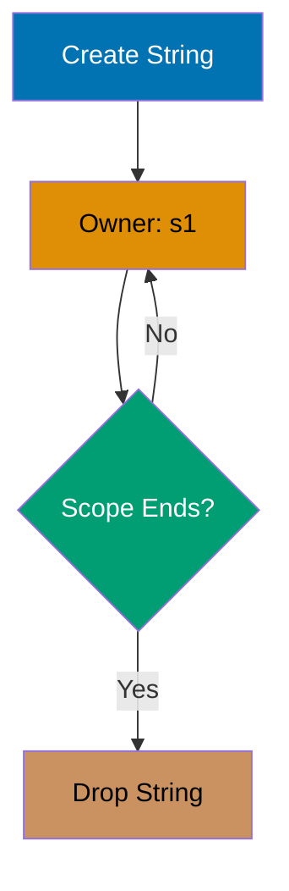
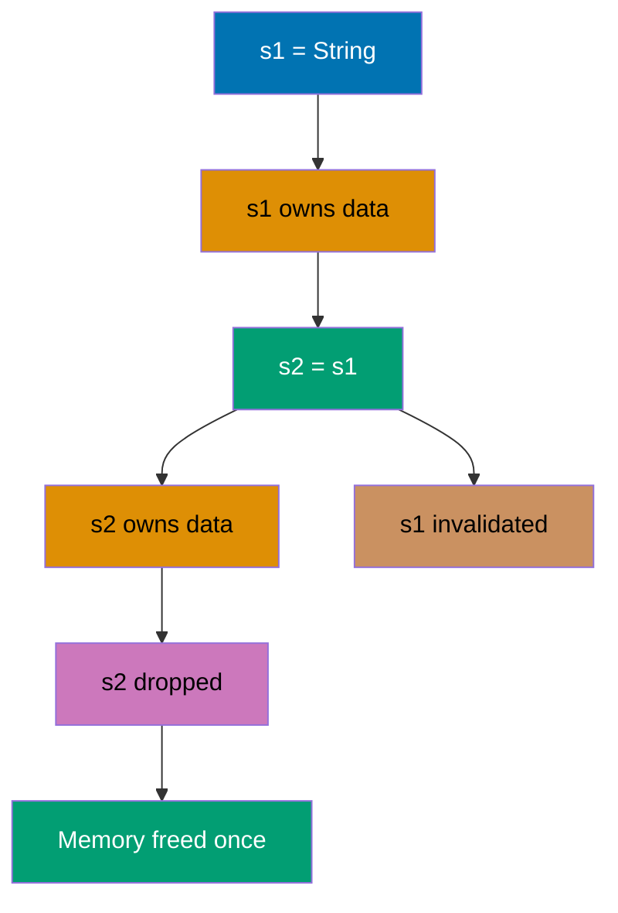
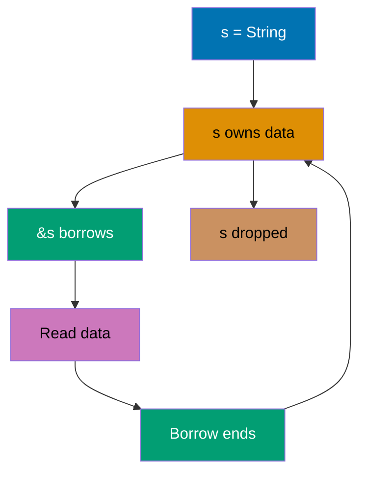
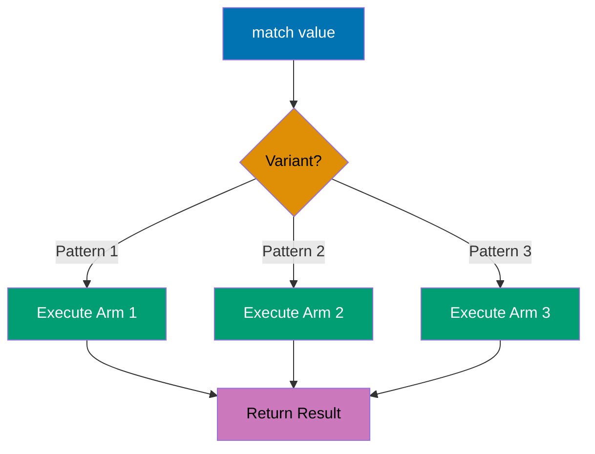

## Beginner Level: Rust Fundamentals

Examples 1-28 cover Rust fundamentals and the ownership model (0-40% coverage). You'll learn variables, functions, structs, enums, pattern matching, and Rust's unique approach to memory safety.

---

### Example 1: Hello World

Every Rust program starts with a `main` function, which is the entry point. The `println!` macro prints text to stdout with automatic newline.

```rust
fn main() {
    println!("Hello, World!");      // => Output: Hello, World!
}                                    // => Program exits with code 0
```

**Key Takeaway**: Rust programs require a `main()` function as the entry point, and macros (identified by `!`) provide compile-time code generation for common operations like formatted printing.

---

### Example 2: Variables and Mutability

Rust variables are immutable by default, requiring explicit `mut` keyword for mutation. This prevents accidental state changes and makes mutation explicit in code.

```rust
fn main() {
    let x = 5;                       // => x is 5 (i32), immutable
    println!("x = {}", x);           // => Output: x = 5

    // x = 6;                        // => ERROR: cannot assign twice to immutable variable

    let mut y = 10;                  // => y is 10 (i32), mutable
    println!("y = {}", y);           // => Output: y = 10

    y = 15;                          // => y is now 15 (mutation allowed)
    println!("y = {}", y);           // => Output: y = 15
}
```

**Key Takeaway**: Immutability by default prevents bugs from unexpected state changes, while explicit `mut` keyword makes mutable state clearly visible in code.

---

### Example 3: Variable Shadowing

Rust allows redeclaring variables with the same name, which creates a new binding while the old one goes out of scope. This differs from mutation and allows type changes.

```rust
fn main() {
    let x = 5;                       // => x is 5 (i32)
    println!("x = {}", x);           // => Output: x = 5

    let x = x + 1;                   // => New x is 6, previous x shadowed
    println!("x = {}", x);           // => Output: x = 6

    let x = "hello";                 // => New x is "hello" (different type!)
    println!("x = {}", x);           // => Output: x = hello
}
```

**Key Takeaway**: Shadowing creates a new variable with the same name, allowing type changes and transformation pipelines while maintaining immutability.

---

### Example 4: Data Types

Rust has scalar types (integers, floats, booleans, characters) and compound types (tuples, arrays). Type inference is powerful but explicit annotations are sometimes needed.

```rust
fn main() {
    // Scalar types
    let integer: i32 = 42;           // => 32-bit signed integer
    let float: f64 = 3.14;           // => 64-bit floating point
    let boolean: bool = true;        // => Boolean true
    let character: char = '🦀';      // => Unicode character (4 bytes)

    println!("Integer: {}", integer);     // => Output: Integer: 42
    println!("Float: {}", float);         // => Output: Float: 3.14
    println!("Boolean: {}", boolean);     // => Output: Boolean: true
    println!("Character: {}", character); // => Output: Character: 🦀

    // Compound types
    let tuple: (i32, f64, char) = (42, 3.14, '🦀');
                                     // => Tuple with mixed types
    let (x, y, z) = tuple;           // => Destructure into x=42, y=3.14, z='🦀'
    println!("Tuple: ({}, {}, {})", x, y, z);
                                     // => Output: Tuple: (42, 3.14, 🦀)

    let array: [i32; 3] = [1, 2, 3]; // => Fixed-size array of 3 i32s
    println!("Array: {:?}", array);  // => Output: Array: [1, 2, 3]
}
```

**Key Takeaway**: Rust's type system includes scalar types with explicit sizes (i32, f64) and compound types (tuples, arrays) with compile-time size checks, preventing many runtime errors.

---

### Example 5: Functions

Functions use `fn` keyword with explicit parameter types and optional return type. The last expression (without semicolon) is the return value.

```rust
fn main() {
    let result = add(5, 7);          // => Call add function, result is 12
    println!("5 + 7 = {}", result);  // => Output: 5 + 7 = 12

    let greeting = greet("Alice");   // => greeting is "Hello, Alice!"
    println!("{}", greeting);        // => Output: Hello, Alice!
}

fn add(x: i32, y: i32) -> i32 {
    x + y                            // => Return x + y (no semicolon = return)
}

fn greet(name: &str) -> String {
    format!("Hello, {}!", name)      // => Build String, return it
}
```

**Key Takeaway**: Rust functions require explicit parameter and return types, and the final expression without semicolon serves as the return value, enabling concise function bodies.

---

### Example 6: Control Flow - If/Else

`if` expressions in Rust can return values, making them useful for conditional assignment. All branches must return the same type.

```rust
fn main() {
    let number = 7;                  // => number is 7

    if number < 5 {
        println!("Less than 5");     // => Not executed
    } else if number < 10 {
        println!("Between 5 and 10");// => Output: Between 5 and 10
    } else {
        println!("10 or greater");   // => Not executed
    }

    // if as expression
    let result = if number % 2 == 0 {
        "even"                       // => Not returned
    } else {
        "odd"                        // => result is "odd"
    };
    println!("{} is {}", number, result);
                                     // => Output: 7 is odd
}
```

**Key Takeaway**: Rust's `if` is an expression that returns values, enabling clean conditional assignment without ternary operators.

---

### Example 7: Control Flow - Loops

Rust has three loop types: `loop` (infinite), `while` (conditional), and `for` (iterator). Loops can return values via `break`.

```rust
fn main() {
    // loop with break value
    let mut counter = 0;             // => counter is 0
    let result = loop {
        counter += 1;                // => counter increments: 1, 2, 3, 4, 5
        if counter == 5 {
            break counter * 2;       // => Exit loop, return 10
        }
    };
    println!("Result: {}", result);  // => Output: Result: 10

    // while loop
    let mut n = 3;                   // => n is 3
    while n > 0 {
        println!("{}!", n);          // => Output: 3! 2! 1!
        n -= 1;                      // => n decrements: 2, 1, 0
    }

    // for loop
    for i in 1..4 {                  // => i iterates: 1, 2, 3 (4 excluded)
        println!("i = {}", i);       // => Output: i = 1, i = 2, i = 3
    }
}
```

**Key Takeaway**: Rust provides three loop constructs with `loop` for infinite loops that can return values, `while` for conditional iteration, and `for` for iterator-based iteration over ranges and collections.

---

### Example 8: Ownership Basics

Rust's ownership model ensures memory safety without garbage collection. Each value has exactly one owner, and when the owner goes out of scope, the value is dropped.



```rust
fn main() {
    {
        let s1 = String::from("hello");
                                     // => s1 owns heap-allocated "hello"
        println!("{}", s1);          // => Output: hello
    }                                // => s1 scope ends, String dropped, memory freed

    // println!("{}", s1);           // => ERROR: s1 no longer in scope
}
```

**Key Takeaway**: Rust's ownership system automatically manages memory by dropping values when their owner goes out of scope, eliminating memory leaks and double-free bugs without runtime overhead.

---

### Example 9: Move Semantics

When assigning heap-allocated values, Rust moves ownership rather than copying, invalidating the original binding to prevent double-free errors.



```rust
fn main() {
    let s1 = String::from("hello");  // => s1 owns "hello"
    let s2 = s1;                     // => Ownership moved to s2, s1 invalidated

    println!("{}", s2);              // => Output: hello
    // println!("{}", s1);           // => ERROR: value borrowed after move

    let x = 5;                       // => x is 5 (i32)
    let y = x;                       // => y is 5, x still valid (Copy trait)
    println!("x = {}, y = {}", x, y);// => Output: x = 5, y = 5
}
```

**Key Takeaway**: Rust moves heap-allocated values by default to prevent double-free, while stack-allocated types implementing `Copy` are safely duplicated, making ownership transfers explicit and safe.

---

### Example 10: Clone for Deep Copy

When you need multiple owners of heap data, explicitly clone it. Cloning creates a deep copy with independent ownership.

```rust
fn main() {
    let s1 = String::from("hello");  // => s1 owns "hello"
    let s2 = s1.clone();             // => s2 owns independent copy "hello"

    println!("s1 = {}, s2 = {}", s1, s2);
                                     // => Output: s1 = hello, s2 = hello
                                     // => Both s1 and s2 are valid
}                                    // => Both s1 and s2 dropped independently
```

**Key Takeaway**: Use `.clone()` to create independent copies of heap-allocated data when multiple owners are needed, making expensive deep copy operations explicit in code.

---

### Example 11: References and Borrowing

References allow accessing values without taking ownership. Borrowing enables multiple read-only references or one mutable reference at a time.



```rust
fn main() {
    let s1 = String::from("hello");  // => s1 owns "hello"
    let len = calculate_length(&s1); // => Borrow s1 (immutable reference)
                                     // => s1 still valid after call
    println!("'{}' has length {}", s1, len);
                                     // => Output: 'hello' has length 5
}

fn calculate_length(s: &String) -> usize {
                                     // => s is immutable reference to String
    s.len()                          // => Read length (no ownership transfer)
}                                    // => Borrow ends, s1 remains owned by main
```

**Key Takeaway**: References (`&T`) enable borrowing data without transferring ownership, allowing functions to read values while the original owner retains control and prevents unnecessary cloning.

---

### Example 12: Mutable References

Mutable references allow modifying borrowed data, but Rust enforces at most one mutable reference at a time to prevent data races.

```rust
fn main() {
    let mut s = String::from("hello");
                                     // => s is mutable, owns "hello"
    change(&mut s);                  // => Borrow s mutably
                                     // => s is now "hello, world"
    println!("{}", s);               // => Output: hello, world
}

fn change(s: &mut String) {          // => s is mutable reference
    s.push_str(", world");           // => Modify borrowed data
}                                    // => Mutable borrow ends
```

**Key Takeaway**: Mutable references (`&mut T`) allow modifying borrowed data, but Rust's borrow checker ensures only one mutable reference exists at a time, preventing data races at compile time.

---

### Example 13: Borrowing Rules

Rust enforces borrowing rules at compile time: multiple immutable references OR one mutable reference, never both simultaneously. This prevents data races.

```rust
fn main() {
    let mut s = String::from("hello");
                                     // => s owns "hello" (mutable)

    let r1 = &s;                     // => r1 borrows immutably
    let r2 = &s;                     // => r2 borrows immutably (allowed)
    println!("{} and {}", r1, r2);   // => Output: hello and hello
                                     // => r1 and r2 borrows end here

    let r3 = &mut s;                 // => r3 borrows mutably (now allowed)
    r3.push_str(", world");          // => Modify through r3
    println!("{}", r3);              // => Output: hello, world

    // let r4 = &s;                  // => ERROR: cannot borrow as immutable
                                     // => while mutable borrow exists
}
```

**Key Takeaway**: Rust's borrow checker enforces that mutable and immutable references cannot coexist, preventing data races by ensuring exclusive access for mutation or shared access for reading.

---

### Example 14: Slices

Slices are references to contiguous sequences without ownership. String slices (`&str`) reference portions of strings without copying.

```rust
fn main() {
    let s = String::from("hello world");
                                     // => s owns "hello world"

    let hello = &s[0..5];            // => hello is slice referencing "hello"
    let world = &s[6..11];           // => world is slice referencing "world"
    let full = &s[..];               // => full is slice referencing entire string

    println!("{}", hello);           // => Output: hello
    println!("{}", world);           // => Output: world
    println!("{}", full);            // => Output: hello world

    let arr = [1, 2, 3, 4, 5];       // => arr is array on stack
    let slice = &arr[1..4];          // => slice references [2, 3, 4]
    println!("{:?}", slice);         // => Output: [2, 3, 4]
}
```

**Key Takeaway**: Slices provide references to contiguous sequences without copying data, enabling efficient substring and subarray operations while maintaining Rust's safety guarantees.

---

### Example 15: Structs

Structs group related data into named fields. They're Rust's primary way to create custom types.

```rust
struct User {
    username: String,
    email: String,
    sign_in_count: u64,
    active: bool,
}

fn main() {
    let user1 = User {
        email: String::from("user@example.com"),
        username: String::from("user123"),
        active: true,
        sign_in_count: 1,
    };                               // => user1 owns all field data

    println!("Username: {}", user1.username);
                                     // => Output: Username: user123
    println!("Email: {}", user1.email);
                                     // => Output: Email: user@example.com

    let mut user2 = User {
        email: String::from("another@example.com"),
        ..user1                      // => Copy remaining fields from user1
    };                               // => user1.username moved! user1 partially invalid

    user2.sign_in_count += 1;        // => Increment sign_in_count to 2
    println!("Sign-ins: {}", user2.sign_in_count);
                                     // => Output: Sign-ins: 2
}
```

**Key Takeaway**: Structs bundle related data with named fields, and struct update syntax (`..other_struct`) enables copying fields while respecting ownership and move semantics.

---

### Example 16: Tuple Structs

Tuple structs are named tuples useful when struct field names add no meaning. They create distinct types even with identical field types.

```rust
struct Color(i32, i32, i32);         // => RGB color as tuple struct
struct Point(i32, i32, i32);         // => 3D point as tuple struct

fn main() {
    let black = Color(0, 0, 0);      // => black is Color(0, 0, 0)
    let origin = Point(0, 0, 0);     // => origin is Point(0, 0, 0)

    println!("Black: ({}, {}, {})", black.0, black.1, black.2);
                                     // => Output: Black: (0, 0, 0)

    // let mixed: Color = origin;    // => ERROR: Point != Color (different types)
}
```

**Key Takeaway**: Tuple structs create distinct named types without field names, useful for wrapping tuples with semantic meaning while maintaining type safety.

---

### Example 17: Methods

Methods are functions defined within `impl` blocks associated with structs. The first parameter is `self`, representing the instance.

```rust
struct Rectangle {
    width: u32,
    height: u32,
}

impl Rectangle {
    fn area(&self) -> u32 {          // => Borrow self immutably
        self.width * self.height     // => Calculate area
    }

    fn can_hold(&self, other: &Rectangle) -> bool {
        self.width > other.width && self.height > other.height
    }
}

fn main() {
    let rect = Rectangle { width: 30, height: 50 };
                                     // => rect is 30x50 Rectangle
    println!("Area: {}", rect.area());
                                     // => Output: Area: 1500

    let rect2 = Rectangle { width: 10, height: 40 };
    println!("Can hold? {}", rect.can_hold(&rect2));
                                     // => Output: Can hold? false
}
```

**Key Takeaway**: Methods defined in `impl` blocks provide object-oriented style syntax while maintaining Rust's ownership rules, with `&self` for immutable methods and `&mut self` for mutable ones.

---

### Example 18: Associated Functions

Associated functions (static methods) don't take `self` and are called with `::` syntax. Often used for constructors.

```rust
struct Rectangle {
    width: u32,
    height: u32,
}

impl Rectangle {
    fn square(size: u32) -> Rectangle {
                                     // => No self parameter (associated function)
        Rectangle {
            width: size,
            height: size,
        }                            // => Return new Rectangle
    }

    fn area(&self) -> u32 {
        self.width * self.height
    }
}

fn main() {
    let sq = Rectangle::square(20); // => Call associated function with ::
                                     // => sq is 20x20 Rectangle
    println!("Square area: {}", sq.area());
                                     // => Output: Square area: 400
}
```

**Key Takeaway**: Associated functions called with `::` syntax provide namespace-scoped functions like constructors, commonly used for factory methods that create struct instances.

---

### Example 19: Enums

Enums define types that can be one of several variants, each potentially holding different data. More powerful than C-style enums.

```rust
enum IpAddr {
    V4(u8, u8, u8, u8),              // => IPv4 variant holds 4 u8s
    V6(String),                      // => IPv6 variant holds String
}

fn main() {
    let home = IpAddr::V4(127, 0, 0, 1);
                                     // => home is IPv4 variant
    let loopback = IpAddr::V6(String::from("::1"));
                                     // => loopback is IPv6 variant

    route(home);                     // => Output: Routing to 127.0.0.1
    route(loopback);                 // => Output: Routing to ::1
}

fn route(ip: IpAddr) {
    match ip {                       // => Pattern match on enum variant
        IpAddr::V4(a, b, c, d) => {
            println!("Routing to {}.{}.{}.{}", a, b, c, d);
        }
        IpAddr::V6(addr) => {
            println!("Routing to {}", addr);
        }
    }
}
```

**Key Takeaway**: Rust enums can hold data in each variant, making them algebraic data types that enable type-safe state machines and protocol modeling more powerful than traditional enums.

---

### Example 20: Pattern Matching with Match

`match` expressions exhaustively check all enum variants at compile time, ensuring every case is handled. They're Rust's primary control flow for enums.



```rust
enum Coin {
    Penny,
    Nickel,
    Dime,
    Quarter,
}

fn value_in_cents(coin: Coin) -> u8 {
    match coin {                     // => Must cover all variants
        Coin::Penny => 1,            // => Return 1 for Penny
        Coin::Nickel => 5,           // => Return 5 for Nickel
        Coin::Dime => 10,            // => Return 10 for Dime
        Coin::Quarter => 25,         // => Return 25 for Quarter
    }                                // => Compiler ensures exhaustive
}

fn main() {
    let coin = Coin::Dime;
    let value = value_in_cents(coin);// => value is 10
    println!("Value: {} cents", value);
                                     // => Output: Value: 10 cents
}
```

**Key Takeaway**: `match` expressions enforce exhaustive pattern matching at compile time, ensuring all enum variants are handled and making it impossible to forget edge cases.

---

### Example 21: Option Enum

`Option<T>` represents optional values: `Some(T)` for present values or `None` for absence. Rust has no null, eliminating null pointer errors.

```rust
fn main() {
    let some_number = Some(5);       // => some_number is Option<i32> with value 5
    let some_string = Some("text");  // => some_string is Option<&str>
    let absent: Option<i32> = None;  // => absent is Option<i32> with no value

    let x = 5;                       // => x is i32
    // let sum = x + some_number;    // => ERROR: cannot add Option<i32> to i32

    match some_number {
        Some(i) => println!("Number: {}", i),
                                     // => Output: Number: 5
        None => println!("No number"),
    }

    match absent {
        Some(i) => println!("Number: {}", i),
        None => println!("No number"),
                                     // => Output: No number
    }
}
```

**Key Takeaway**: `Option<T>` replaces null pointers with type-safe optional values, forcing explicit handling of absent values through pattern matching and eliminating null reference errors at compile time.

---

### Example 22: If Let Syntax

`if let` provides concise syntax for matching one pattern while ignoring others, avoiding verbose `match` when only one case matters.

```rust
fn main() {
    let some_value = Some(3);        // => some_value is Option<i32>

    // Verbose match
    match some_value {
        Some(3) => println!("Three!"),
        _ => (),                     // => Ignore all other cases
    }                                // => Output: Three!

    // Concise if let
    if let Some(3) = some_value {
        println!("Three!");          // => Output: Three!
    }                                // => Equivalent to match above

    let mut count = 0;
    let coin = Some("quarter");
    if let Some("quarter") = coin {
        count += 1;                  // => count is now 1
    } else {
        println!("Not a quarter");
    }
    println!("Count: {}", count);    // => Output: Count: 1
}
```

**Key Takeaway**: Use `if let` for concise single-pattern matching when you only care about one variant, reducing boilerplate while maintaining pattern matching safety.

---

### Example 23: Result for Error Handling

`Result<T, E>` represents operations that can succeed (`Ok(T)`) or fail (`Err(E)`). Rust has no exceptions, forcing explicit error handling.

```rust
use std::fs::File;
use std::io::ErrorKind;

fn main() {
    let f = File::open("hello.txt"); // => f is Result<File, Error>

    let f = match f {
        Ok(file) => file,            // => File opened successfully
        Err(error) => match error.kind() {
            ErrorKind::NotFound => {
                println!("File not found, creating...");
                match File::create("hello.txt") {
                    Ok(fc) => fc,    // => File created successfully
                    Err(e) => panic!("Error creating file: {:?}", e),
                }
            }
            other_error => {
                panic!("Error opening file: {:?}", other_error);
            }
        },
    };                               // => f is File (either opened or created)

    println!("File handle obtained");
}
```

**Key Takeaway**: `Result<T, E>` forces explicit error handling at compile time through pattern matching, eliminating hidden control flow from exceptions and making error cases visible in function signatures.

---

### Example 24: Unwrap and Expect

`unwrap()` extracts success values or panics on error. `expect()` is similar but provides custom panic messages. Use for prototyping or when error is impossible.

```rust
use std::fs::File;

fn main() {
    // unwrap: panic with generic message on error
    // let f = File::open("nonexistent.txt").unwrap();
                                     // => Panics: thread 'main' panicked at 'called `Result::unwrap()` on an `Err` value'

    // expect: panic with custom message on error
    let f = File::open("hello.txt").expect("Failed to open hello.txt");
                                     // => If error: panics with custom message
                                     // => If success: f is File

    println!("File opened successfully");
}
```

**Key Takeaway**: Use `unwrap()` for prototyping and `expect()` with descriptive messages for cases where failure should never happen, but prefer explicit error handling with `match` or `?` in production code.

---

### Example 25: Question Mark Operator

The `?` operator propagates errors up the call stack, returning early with `Err` if present. It makes error handling concise without nested `match` statements.

```rust
use std::fs::File;
use std::io::{self, Read};

fn read_username_from_file() -> Result<String, io::Error> {
    let mut f = File::open("hello.txt")?;
                                     // => If error, return Err early
                                     // => If success, f is File
    let mut s = String::new();
    f.read_to_string(&mut s)?;       // => If error, return Err early
                                     // => If success, s contains file contents
    Ok(s)                            // => Return Ok(String)
}

fn main() {
    match read_username_from_file() {
        Ok(username) => println!("Username: {}", username),
        Err(e) => println!("Error reading file: {}", e),
                                     // => Output: Error reading file: ...
    }
}
```

**Key Takeaway**: The `?` operator provides concise error propagation by automatically returning `Err` values up the call stack, eliminating nested `match` boilerplate while maintaining explicit error handling.

---

### Example 26: Vectors

Vectors (`Vec<T>`) are growable arrays allocated on the heap. They're the most common collection type for dynamic sequences.

```rust
fn main() {
    let mut v: Vec<i32> = Vec::new();// => v is empty vector of i32s
    v.push(1);                       // => v is [1]
    v.push(2);                       // => v is [1, 2]
    v.push(3);                       // => v is [1, 2, 3]

    let v2 = vec![1, 2, 3];          // => Convenient macro for initialization
                                     // => v2 is [1, 2, 3]

    let third = &v2[2];              // => third borrows element at index 2
    println!("Third: {}", third);    // => Output: Third: 3

    match v2.get(10) {               // => Safe access returns Option<&T>
        Some(val) => println!("Value: {}", val),
        None => println!("No element"),
                                     // => Output: No element
    }

    for i in &v2 {                   // => Iterate over immutable references
        println!("{}", i);           // => Output: 1 2 3 (separate lines)
    }

    for i in &mut v {                // => Iterate over mutable references
        *i += 10;                    // => Dereference and modify
    }                                // => v is now [11, 12, 13]

    println!("{:?}", v);             // => Output: [11, 12, 13]
}
```

**Key Takeaway**: Vectors provide dynamic arrays with `.push()` for growth, safe `.get()` for optional access, and iterator support, while maintaining ownership and borrowing rules for safety.

---

### Example 27: Strings

Rust has two string types: `String` (owned, growable, heap-allocated) and `&str` (borrowed, immutable string slice). This distinction prevents many string-related bugs.

```rust
fn main() {
    let mut s = String::from("hello");
                                     // => s owns heap-allocated "hello"
    s.push_str(", world");           // => Append string slice, s is "hello, world"
    s.push('!');                     // => Append character, s is "hello, world!"
    println!("{}", s);               // => Output: hello, world!

    let s1 = String::from("Hello, ");
    let s2 = String::from("world!");
    let s3 = s1 + &s2;               // => s1 moved (ownership transferred)
                                     // => s2 borrowed (still valid)
                                     // => s3 is "Hello, world!"
    // println!("{}", s1);           // => ERROR: s1 moved
    println!("{}", s3);              // => Output: Hello, world!

    let s4 = format!("{}-{}-{}", s2, s3, "end");
                                     // => format! borrows, no moves
                                     // => s4 is "world!-Hello, world!-end"
    println!("{}", s4);              // => Output: world!-Hello, world!-end
}
```

**Key Takeaway**: Rust distinguishes owned `String` from borrowed `&str`, with `String` for growable text and `&str` for string slices, preventing common string bugs through explicit ownership and UTF-8 encoding.

---

### Example 28: Hash Maps

Hash maps (`HashMap<K, V>`) store key-value pairs with O(1) average lookup. Keys must implement `Eq` and `Hash` traits.

```rust
use std::collections::HashMap;

fn main() {
    let mut scores = HashMap::new(); // => Empty hash map

    scores.insert(String::from("Blue"), 10);
                                     // => scores = {"Blue": 10}
    scores.insert(String::from("Red"), 50);
                                     // => scores = {"Blue": 10, "Red": 50}

    let team_name = String::from("Blue");
    let score = scores.get(&team_name);
                                     // => score is Option<&i32>
    match score {
        Some(&s) => println!("Blue: {}", s),
                                     // => Output: Blue: 10
        None => println!("Team not found"),
    }

    // Iterate over key-value pairs
    for (key, value) in &scores {
        println!("{}: {}", key, value);
                                     // => Output: Blue: 10 (and) Red: 50
    }

    // Update only if key absent
    scores.entry(String::from("Yellow")).or_insert(30);
                                     // => scores = {"Blue": 10, "Red": 50, "Yellow": 30}

    // Update based on old value
    let text = "hello world wonderful world";
    let mut map = HashMap::new();
    for word in text.split_whitespace() {
        let count = map.entry(word).or_insert(0);
        *count += 1;                 // => Increment word count
    }                                // => map = {"hello": 1, "world": 2, "wonderful": 1}
    println!("{:?}", map);           // => Output: {"hello": 1, "world": 2, "wonderful": 1}
}
```

**Key Takeaway**: Hash maps provide O(1) key-value storage with convenient methods like `.entry()` and `.or_insert()` for conditional updates, while respecting ownership rules for keys and values.

---

## Summary

You've completed 28 beginner examples covering Rust fundamentals (0-40% coverage):

- **Syntax basics** (Examples 1-7): Variables, types, functions, control flow
- **Ownership model** (Examples 8-14): Moves, cloning, borrowing, references, slices
- **Custom types** (Examples 15-19): Structs, methods, enums
- **Pattern matching** (Examples 20-22): Match, Option, if let
- **Error handling** (Examples 23-25): Result, unwrap, question mark operator
- **Collections** (Examples 26-28): Vectors, strings, hash maps

**Next Steps**: Continue to [Intermediate](/en/learn/software-engineering/programming-language/rust/tutorials/by-example/intermediate) (Examples 29-57) to learn lifetimes, traits, generics, iterators, closures, and concurrent programming.

**Key Insight**: Rust's ownership model is the foundation. Every subsequent feature builds on the borrowing rules you've learned. If something feels confusing later, revisit Examples 8-14 to reinforce ownership intuition.
