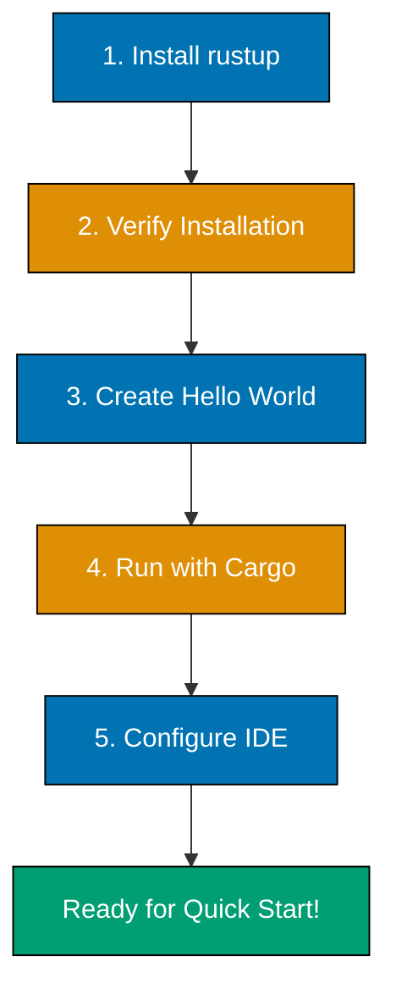

**Want to get Rust working on your system?** This tutorial guides you through installing the Rust toolchain, configuring your development environment, and running your first program.

## Coverage

This tutorial covers **0-5%** of Rust knowledge - the essential setup to begin your Rust journey.

## Prerequisites

- Basic command-line familiarity (running commands in terminal)
- Text editor or IDE (we'll configure one)
- Internet connection for downloading Rust

No programming experience required.

## Learning Outcomes

By the end of this tutorial, you will:

- Install Rust toolchain using rustup
- Understand Rust's release channels (stable, beta, nightly)
- Run `rustc` (Rust compiler) and `cargo` (build tool)
- Create and run your first "Hello, World!" program
- Configure your IDE for Rust development
- Know where to find help and documentation

## Learning Path



---

## Installation

### Using rustup (Recommended)

**rustup** is Rust's official toolchain installer and version manager. It handles installing Rust, keeping it updated, and switching between different versions.

#### Windows Installation

1. **Download rustup-init.exe**:
   - Visit [https://rustup.rs/](https://rustup.rs/)
   - Click "Download rustup-init.exe"
   - Run the downloaded file

2. **Run the installer**:

   ```powershell
   # The installer will display options
   # Press 1 and Enter to proceed with default installation
   ```

3. **Add Rust to PATH**:
   - Installer adds Rust to PATH automatically
   - Restart your terminal for changes to take effect

4. **Verify Visual C++ Build Tools**:
   - Rust on Windows requires MSVC build tools
   - If not installed, download from [Microsoft Visual Studio](https://visualstudio.microsoft.com/downloads/)
   - Select "Desktop development with C++" workload

**Common Windows Issues**:

- **Error: "could not execute process"**: Install Visual C++ Build Tools
- **rustup not found after install**: Restart terminal or computer
- **Permission denied**: Run PowerShell as Administrator

#### macOS Installation

1. **Open Terminal**:
   - Press `Cmd+Space`, type "Terminal", press Enter

2. **Run rustup installer**:

   ```bash
   curl --proto '=https' --tlsv1.2 -sSf https://sh.rustup.rs | sh
   ```

3. **Follow the prompts**:
   - Press 1 and Enter to proceed with default installation
   - Installation completes shortly

4. **Configure PATH**:
   ```bash
   source $HOME/.cargo/env
   ```
   This adds `~/.cargo/bin` to your PATH.

**Alternative: Homebrew Installation**:

```bash
brew install rustup-init
rustup-init
```

**Common macOS Issues**:

- **xcrun error**: Install Xcode Command Line Tools: `xcode-select --install`
- **Permission denied for /usr/local**: Use rustup, not homebrew rust package
- **zsh: command not found: rustup**: Restart terminal or run `source ~/.zshrc`

#### Linux Installation

1. **Open your terminal**

2. **Run rustup installer**:

   ```bash
   curl --proto '=https' --tlsv1.2 -sSf https://sh.rustup.rs | sh
   ```

3. **Follow the prompts**:
   - Press 1 and Enter for default installation
   - Installation completes shortly

4. **Configure PATH**:
   ```bash
   source "$HOME/.cargo/env"
   ```
   Add this line to `~/.bashrc` or `~/.zshrc` for persistence.

**Common Linux Issues**:

- **curl not found**: Install curl: `sudo apt install curl` (Debian/Ubuntu) or `sudo dnf install curl` (Fedora)
- **linker cc not found**: Install build tools: `sudo apt install build-essential` (Debian/Ubuntu)
- **Permission denied**: Don't use sudo with rustup installer
- **Command not found after install**: Restart terminal or run `source ~/.bashrc`

---

## Understanding Rust Toolchain

### Release Channels

Rust has three release channels:

1. **Stable** (recommended for beginners):
   - Released every 6 weeks
   - Thoroughly tested and production-ready
   - All code in tutorials uses stable

2. **Beta**:
   - Testing ground for next stable release
   - Generally stable but not guaranteed
   - Useful for testing compatibility before stable release

3. **Nightly**:
   - Latest development features
   - Unstable features that may change
   - Required for some advanced features
   - Not recommended for learning

**Default installation uses stable**, which is perfect for beginners.

### Rust Editions

Rust uses an **edition system** to introduce backwards-incompatible changes without breaking existing code. Each edition is a snapshot of Rust with specific language features and defaults.

**Available Editions**:

- **Rust 2015**: Original edition (default for old projects)
- **Rust 2018**: Improved module system, async/await foundation
- **Rust 2021**: Better default panic handling, closure captures
- **Rust 2024**: Latest edition (stabilized February 2025 with Rust 1.85.0)

**Key Points**:

- New projects default to the latest edition (2024)
- Editions are opt-in - old code continues to work
- Different editions can interoperate (libraries can use different editions)
- Editions are specified in `Cargo.toml`

```toml
[package]
edition = "2024"  # Default for new projects
```

**All tutorials use Rust 2024 Edition** unless explicitly noted otherwise.

### Toolchain Components

rustup installs:

- **rustc**: Rust compiler (transforms `.rs` files into executables)
- **cargo**: Build tool and package manager
- **rust-std**: Standard library
- **rustdoc**: Documentation generator

### Additional Components

Install helpful development tools:

```bash
rustup component add rustfmt

rustup component add clippy

rustup component add rust-src
```

**What each tool does**:

- **rustfmt**: Automatically formats code to Rust style guidelines
- **clippy**: Catches common mistakes and suggests improvements
- **rust-src**: Source code for standard library (used by rust-analyzer)

---

## Verification

### Check Installation

Verify Rust is installed correctly:

```bash
rustc --version

cargo --version

rustup --version
```

Version numbers will differ - ensure commands run without errors.

### Update Rust

Keep Rust up to date:

```bash
rustup update

rustup check
```

Rust stable updates every 6 weeks. Run `rustup update` regularly.

---

## Your First Rust Program

### Using cargo

**cargo** is Rust's build tool and package manager. It:

- Creates new projects with proper structure
- Compiles your code
- Runs your program
- Manages dependencies
- Runs tests

### Create a New Project

```bash
cargo new hello-rust

cd hello-rust
```

**What cargo new creates**:

```
hello-rust/
├── Cargo.toml      # Project manifest (metadata and dependencies)
├── .git/           # Git repository (initialized automatically)
├── .gitignore      # Git ignore file
└── src/
    └── main.rs     # Main source file with Hello World
```

### Examine the Code

Open `src/main.rs`:

```rust
fn main() {
    println!("Hello, world!");
}
```

**Code breakdown**:

- `fn main()`: Defines the main function (program entry point)
- `println!`: Macro that prints to console (the `!` indicates a macro)
- `"Hello, world!"`: String literal to print

### Compile and Run

```bash
cargo run
```

**Output**:

```
   Compiling hello-rust v0.1.0 (/path/to/hello-rust)
    Finished `dev` profile [unoptimized + debuginfo] target(s) in 0.50s
     Running `target/debug/hello-rust`
Hello, world!
```

**What happened**:

1. `cargo` compiled `src/main.rs` to executable in `target/debug/hello-rust`
2. Compilation created debug build (includes debugging symbols)
3. `cargo` ran the executable
4. Program printed "Hello, world!" and exited

### Build Only (No Run)

```bash
cargo build

cargo build --release
```

**Debug vs Release builds**:

- **Debug** (`cargo build`): Fast compilation, slower execution, includes debug info
- **Release** (`cargo build --release`): Slower compilation, fast execution, optimized

Use debug during development, release for production.

### Project Structure After Build

```
hello-rust/
├── Cargo.toml
├── Cargo.lock      # Dependency lock file (created after first build)
├── src/
│   └── main.rs
└── target/         # Build artifacts
    ├── debug/      # Debug builds
    │   ├── hello-rust (or hello-rust.exe on Windows)
    │   └── ... (build artifacts)
    └── release/    # Release builds (created with --release)
```

---

## IDE Setup

### VS Code (Recommended)

**Why VS Code**: Free, excellent Rust support via rust-analyzer, widely used.

1. **Install VS Code**:
   - Download from [https://code.visualstudio.com/](https://code.visualstudio.com/)

2. **Install rust-analyzer extension**:
   - Open VS Code
   - Click Extensions icon (left sidebar)
   - Search "rust-analyzer"
   - Click Install on "rust-analyzer" by The Rust Programming Language Team

3. **Verify extension works**:
   - Open your `hello-rust` folder in VS Code
   - Open `src/main.rs`
   - Hover over `println!` - you should see documentation
   - Try typing `fn test` - autocomplete should suggest function syntax

**Useful VS Code Settings for Rust**:

Add to `.vscode/settings.json` in project:

```json
{
  "rust-analyzer.checkOnSave.command": "clippy",
  "[rust]": {
    "editor.defaultFormatter": "rust-lang.rust-analyzer",
    "editor.formatOnSave": true
  }
}
```

This enables clippy checks and auto-formatting on save.

### IntelliJ IDEA

**Why IntelliJ IDEA**: Powerful IDE, great for developers familiar with JetBrains tools.

1. **Install IntelliJ IDEA**:
   - Download from [https://www.jetbrains.com/idea/](https://www.jetbrains.com/idea/)
   - Community Edition (free) works well for Rust

2. **Install Rust plugin**:
   - Open IntelliJ IDEA
   - Go to Settings → Plugins
   - Search "Rust"
   - Install "Rust" plugin by JetBrains
   - Restart IDE

3. **Configure Rust toolchain**:
   - Settings → Languages & Frameworks → Rust
   - Toolchain location should auto-detect (`~/.cargo/bin/rustc`)
   - If not, browse to rustc location

4. **Open Rust project**:
   - File → Open
   - Select `hello-rust` folder
   - IDE recognizes Cargo project and indexes code

### Other Editors

**Vim/Neovim**:

- Use `rust.vim` plugin for syntax highlighting
- Use `coc-rust-analyzer` with coc.nvim for LSP support

**Emacs**:

- Use `rust-mode` for syntax highlighting
- Use `lsp-mode` with `rust-analyzer` for LSP support

**Sublime Text**:

- Install "Rust Enhanced" package
- Install "LSP" package with rust-analyzer

---

## Troubleshooting

### rustup command not found

**Symptoms**: Terminal doesn't recognize `rustup`, `cargo`, or `rustc`

**Solutions**:

1. Restart terminal (PATH updated on new shell sessions)
2. Manually source cargo env: `source $HOME/.cargo/env` (macOS/Linux)
3. Check PATH includes `~/.cargo/bin`:
   ```bash
   echo $PATH  # Should include /Users/yourname/.cargo/bin
   ```
4. Reinstall rustup if problem persists

### Linker errors on Windows

**Symptoms**: Compilation fails with linker errors like "link.exe not found"

**Solution**: Install Visual C++ Build Tools from Visual Studio installer

### Permission denied on Linux

**Symptoms**: Cannot write to `/usr/local` or similar

**Solution**: Do NOT use sudo with rustup. Install to home directory (default)

### Slow compilation on first build

**This is normal**. First compilation:

- Downloads and compiles standard library
- Creates target directory structure
- Builds all dependencies

Subsequent builds are much faster (cargo caches compiled dependencies).

---

## Next Steps

Congratulations! You have:

- ✅ Installed Rust toolchain with rustup
- ✅ Verified installation with version checks
- ✅ Created and ran your first Rust program
- ✅ Configured your IDE for Rust development

**Continue learning**:

1. **[Rust Quick Start](/en/learn/software-engineering/programming-language/rust/tutorials/quick-start)** - Learn 12 essential Rust concepts rapidly
2. **[Complete Beginner's Guide to Rust](/en/learn/software-engineering/programming-language/rust/tutorials/beginner)** - Deep dive into Rust fundamentals and ownership
3. **[Intermediate Rust](/en/learn/software-engineering/programming-language/rust/tutorials/intermediate)** - Production-grade features and patterns
4. **[Advanced Rust](/en/learn/software-engineering/programming-language/rust/tutorials/advanced)** - Expert-level topics
5. **[Rust Cookbook](/en/learn/software-engineering/programming-language/rust/how-to/cookbook)** - Ready-to-use code recipes
6. **[Rust Best Practices](/en/learn/software-engineering/programming-language/rust/explanation/best-practices)** - Professional coding standards
7. **[Rust Anti-Patterns](/en/learn/software-engineering/programming-language/rust/explanation/anti-patterns)** - Common mistakes to avoid
8. **[Rust Cheat Sheet](/en/learn/software-engineering/programming-language/rust/reference/cheat-sheet)** - Quick syntax reference
9. **Official Rust Book** - Comprehensive free online book: [https://doc.rust-lang.org/book/](https://doc.rust-lang.org/book/)

---

## Resources

### Official Documentation

- [The Rust Programming Language (The Book)](https://doc.rust-lang.org/book/) - Comprehensive official tutorial
- [Rust by Example](https://doc.rust-lang.org/rust-by-example/) - Learn by running examples
- [Standard Library Documentation](https://doc.rust-lang.org/std/) - API reference

### Tools

- [rustup Documentation](https://rust-lang.github.io/rustup/) - Toolchain management
- [cargo Book](https://doc.rust-lang.org/cargo/) - Package manager guide
- [rustfmt](https://github.com/rust-lang/rustfmt) - Code formatter
- [clippy](https://github.com/rust-lang/rust-clippy) - Linter

### Community

- [Rust Users Forum](https://users.rust-lang.org/) - Ask questions
- [Rust Discord](https://discord.com/invite/rust-lang) - Real-time chat
- [r/rust subreddit](https://www.reddit.com/r/rust/) - Reddit community
- [This Week in Rust](https://this-week-in-rust.org/) - Weekly newsletter

---

**Ready for Rust programming?** Continue to [Rust Quick Start](/en/learn/software-engineering/programming-language/rust/tutorials/quick-start) to learn essential concepts!
