**Want to build production-ready Rust applications?** This tutorial covers advanced language features needed for real-world Rust development.

## Coverage

This tutorial covers **60-85%** of Rust knowledge - production-grade features and patterns.

## Prerequisites

- [Beginner Tutorial](/en/learn/software-engineering/programming-language/rust/tutorials/beginner) complete
- Strong understanding of ownership, borrowing, and lifetimes
- Familiarity with structs, enums, and pattern matching
- Comfortable with Result and error handling

## Learning Outcomes

By the end of this tutorial, you will:

- Write generic code with type parameters and trait bounds
- Design and implement traits for custom types
- Master lifetime annotations for complex borrowing scenarios
- Use smart pointers (Box, Rc, Arc, RefCell) effectively
- Build concurrent programs with threads and channels
- Write async code with async/await and Tokio
- Leverage iterators and closures for functional patterns
- Implement production error handling strategies
- Organize and test production-grade Rust projects

---

## Learning Path

```mermaid
graph TD
    A[Generics] --> B[Traits]
    B --> C[Lifetimes ⭐]
    C --> D[Smart Pointers]
    D --> E[Concurrency ⭐]
    E --> F[Async/Await ⭐]
    F --> G[Iterators & Closures]
    G --> H[Error Handling Patterns]
    H --> I[Testing Strategies]

    style C fill:#DE8F05,stroke:#000000,stroke-width:3px,color:#000000
    style E fill:#DE8F05,stroke:#000000,stroke-width:3px,color:#000000
    style F fill:#DE8F05,stroke:#000000,stroke-width:3px,color:#000000
```



**Color Palette**: Orange (#DE8F05 - critical sections for production Rust)

---

## Section 1: Generics

Generics allow you to write code that works with multiple types.

### Generic Functions

```rust
fn largest<T: PartialOrd>(list: &[T]) -> &T {
    let mut largest = &list[0];

    for item in list {
        if item > largest {
            largest = item;
        }
    }

    largest
}

fn main() {
    let number_list = vec![34, 50, 25, 100, 65];
    let result = largest(&number_list);
    println!("The largest number is {}", result);

    let char_list = vec!['y', 'm', 'a', 'q'];
    let result = largest(&char_list);
    println!("The largest char is {}", result);
}
```

**`<T: PartialOrd>`** is a trait bound - `T` must implement `PartialOrd` (comparison).

### Generic Structs

```rust
struct Point<T> {
    x: T,
    y: T,
}

fn main() {
    let integer = Point { x: 5, y: 10 };
    let float = Point { x: 1.0, y: 4.0 };
}
```

**Multiple type parameters**:

```rust
struct Point<T, U> {
    x: T,
    y: U,
}

fn main() {
    let both_integer = Point { x: 5, y: 10 };
    let both_float = Point { x: 1.0, y: 4.0 };
    let integer_and_float = Point { x: 5, y: 4.0 };
}
```

### Generic Enums

```rust
enum Option<T> {
    Some(T),
    None,
}

enum Result<T, E> {
    Ok(T),
    Err(E),
}
```

### Generic Methods

```rust
struct Point<T> {
    x: T,
    y: T,
}

impl<T> Point<T> {
    fn x(&self) -> &T {
        &self.x
    }
}

impl Point<f32> {
    fn distance_from_origin(&self) -> f32 {
        (self.x.powi(2) + self.y.powi(2)).sqrt()
    }
}

fn main() {
    let p = Point { x: 5, y: 10 };
    println!("p.x = {}", p.x());

    let p2 = Point { x: 3.0, y: 4.0 };
    println!("Distance from origin: {}", p2.distance_from_origin());
}
```

### Monomorphization

Rust generates specialized code for each concrete type used:

```rust
let integer = Some(5);
let float = Some(5.0);
```

Compiles to equivalent of:

```rust
enum Option_i32 {
    Some(i32),
    None,
}

enum Option_f64 {
    Some(f64),
    None,
}
```

**Zero-cost abstraction**: Generics have no runtime overhead.

---

## Section 2: Traits

Traits define shared behavior - similar to interfaces in other languages.

### Defining Traits

```rust
pub trait Summary {
    fn summarize(&self) -> String;
}

pub struct NewsArticle {
    pub headline: String,
    pub location: String,
    pub author: String,
    pub content: String,
}

impl Summary for NewsArticle {
    fn summarize(&self) -> String {
        format!("{}, by {} ({})", self.headline, self.author, self.location)
    }
}

pub struct Tweet {
    pub username: String,
    pub content: String,
    pub reply: bool,
    pub retweet: bool,
}

impl Summary for Tweet {
    fn summarize(&self) -> String {
        format!("{}: {}", self.username, self.content)
    }
}
```

### Default Implementations

```rust
pub trait Summary {
    fn summarize_author(&self) -> String;

    fn summarize(&self) -> String {
        format!("(Read more from {}...)", self.summarize_author())
    }
}

impl Summary for Tweet {
    fn summarize_author(&self) -> String {
        format!("@{}", self.username)
    }
    // Uses default summarize implementation
}
```

### Traits as Parameters

```rust
pub fn notify(item: &impl Summary) {
    println!("Breaking news! {}", item.summarize());
}
```

**Trait bound syntax**:

```rust
pub fn notify<T: Summary>(item: &T) {
    println!("Breaking news! {}", item.summarize());
}
```

**Multiple trait bounds**:

```rust
pub fn notify(item: &(impl Summary + Display)) {
    // ...
}

pub fn notify<T: Summary + Display>(item: &T) {
    // ...
}
```

**where clauses for complex bounds**:

```rust
fn some_function<T, U>(t: &T, u: &U) -> i32
where
    T: Display + Clone,
    U: Clone + Debug,
{
    // ...
}
```

### Returning Types that Implement Traits

```rust
fn returns_summarizable() -> impl Summary {
    Tweet {
        username: String::from("horse_ebooks"),
        content: String::from("of course, as you probably already know, people"),
        reply: false,
        retweet: false,
    }
}
```

**Limitation**: Can only return a single concrete type:

```rust
fn returns_summarizable(switch: bool) -> impl Summary {
    if switch {
        NewsArticle { /* ... */ }  // ❌ Error
    } else {
        Tweet { /* ... */ }  // Different type
    }
}
```

Solution: Use trait objects (covered in Advanced tutorial).

### Implementing Traits on Types

```rust
use std::fmt;

struct Point {
    x: i32,
    y: i32,
}

impl fmt::Display for Point {
    fn fmt(&self, f: &mut fmt::Formatter) -> fmt::Result {
        write!(f, "({}, {})", self.x, self.y)
    }
}

fn main() {
    let origin = Point { x: 0, y: 0 };
    println!("Origin: {}", origin);  // Uses Display implementation
}
```

### Trait Bounds with Generic Implementations

```rust
use std::fmt::Display;

struct Pair<T> {
    x: T,
    y: T,
}

impl<T> Pair<T> {
    fn new(x: T, y: T) -> Self {
        Self { x, y }
    }
}

impl<T: Display + PartialOrd> Pair<T> {
    fn cmp_display(&self) {
        if self.x >= self.y {
            println!("The largest member is x = {}", self.x);
        } else {
            println!("The largest member is y = {}", self.y);
        }
    }
}
```

Only `Pair<T>` where `T` implements both `Display` and `PartialOrd` gets the `cmp_display` method.

---

## Section 3: Lifetimes

Lifetime annotations describe how long references are valid.

### Preventing Dangling References

```rust
fn main() {
    let r;

    {
        let x = 5;
        r = &x;  // ❌ Error: `x` does not live long enough
    }

    println!("r: {}", r);
}
```

Rust's borrow checker prevents this at compile time.

### Lifetime Annotation Syntax

```rust
&i32        // a reference
&'a i32     // a reference with an explicit lifetime
&'a mut i32 // a mutable reference with an explicit lifetime
```

**Lifetime parameters** describe relationships between references' lifetimes.

### Lifetime Annotations in Functions

```rust
fn longest<'a>(x: &'a str, y: &'a str) -> &'a str {
    if x.len() > y.len() {
        x
    } else {
        y
    }
}

fn main() {
    let string1 = String::from("long string is long");
    let result;

    {
        let string2 = String::from("xyz");
        result = longest(string1.as_str(), string2.as_str());
        println!("The longest string is {}", result);
    }
}
```

**`'a` means**: The returned reference will be valid as long as both input references are valid.

### Lifetime Elision Rules

Rust can infer lifetimes in many cases:

```rust
fn first_word(s: &str) -> &str {  // Lifetimes inferred
    let bytes = s.as_bytes();
    for (i, &item) in bytes.iter().enumerate() {
        if item == b' ' {
            return &s[0..i];
        }
    }
    &s[..]
}
```

**Elision rules**:

1. Each reference parameter gets its own lifetime
2. If exactly one input lifetime, output gets that lifetime
3. If multiple input lifetimes and one is `&self` or `&mut self`, output gets `self`'s lifetime

### Lifetime Annotations in Struct Definitions

```rust
struct ImportantExcerpt<'a> {
    part: &'a str,
}

fn main() {
    let novel = String::from("Call me Ishmael. Some years ago...");
    let first_sentence = novel.split('.').next().expect("Could not find a '.'");
    let i = ImportantExcerpt {
        part: first_sentence,
    };
}
```

**`ImportantExcerpt` can't outlive the reference it holds.**

### Lifetime Annotations in Method Definitions

```rust
impl<'a> ImportantExcerpt<'a> {
    fn level(&self) -> i32 {
        3
    }

    fn announce_and_return_part(&self, announcement: &str) -> &str {
        println!("Attention please: {}", announcement);
        self.part
    }
}
```

### The Static Lifetime

```rust
let s: &'static str = "I have a static lifetime.";
```

**`'static`** means reference lives for entire program duration.

String literals have `'static` lifetime (stored in program binary).

**Be careful**: Most lifetime problems shouldn't be solved with `'static`.

### Lifetime Visualization


---

## Section 4: Smart Pointers

Smart pointers are data structures that act like pointers but have additional metadata and capabilities.

### Box<T> - Heap Allocation

**Use cases**:

- When you have a type whose size can't be known at compile time
- When you want to transfer ownership of a large amount of data without copying
- When you want a value that implements a specific trait (trait objects)

**Basic usage**:

```rust
fn main() {
    let b = Box::new(5);
    println!("b = {}", b);
}
```

**Enabling recursive types**:

```rust
enum List {
    Cons(i32, Box<List>),
    Nil,
}

use List::{Cons, Nil};

fn main() {
    let list = Cons(1, Box::new(Cons(2, Box::new(Cons(3, Box::new(Nil))))));
}
```

Without `Box`, `List` would have infinite size.

### Rc<T> - Reference Counting

**Use case**: Multiple ownership of heap data

```rust
use std::rc::Rc;

enum List {
    Cons(i32, Rc<List>),
    Nil,
}

use List::{Cons, Nil};

fn main() {
    let a = Rc::new(Cons(5, Rc::new(Cons(10, Rc::new(Nil)))));
    println!("count after creating a = {}", Rc::strong_count(&a));

    let b = Cons(3, Rc::clone(&a));
    println!("count after creating b = {}", Rc::strong_count(&a));

    {
        let c = Cons(4, Rc::clone(&a));
        println!("count after creating c = {}", Rc::strong_count(&a));
    }

    println!("count after c goes out of scope = {}", Rc::strong_count(&a));
}
```

**Output**:

```
count after creating a = 1
count after creating b = 2
count after creating c = 3
count after c goes out of scope = 2
```

**Note**: `Rc<T>` is only for single-threaded scenarios. Use `Arc<T>` for multi-threaded.

### RefCell<T> - Interior Mutability

**Interior mutability**: Mutate data even when there are immutable references to that data.

```rust
use std::cell::RefCell;

fn main() {
    let value = RefCell::new(5);

    *value.borrow_mut() += 10;  // Mutate through immutable RefCell

    println!("value: {:?}", value);
}
```

**Borrowing rules enforced at runtime** instead of compile time:

```rust
use std::cell::RefCell;

fn main() {
    let value = RefCell::new(5);

    let borrowed1 = value.borrow_mut();
    let borrowed2 = value.borrow_mut();  // ❌ Panics at runtime
}
```

**Combining Rc<T> and RefCell<T>**:

```rust
use std::cell::RefCell;
use std::rc::Rc;

#[derive(Debug)]
enum List {
    Cons(Rc<RefCell<i32>>, Rc<List>),
    Nil,
}

use List::{Cons, Nil};

fn main() {
    let value = Rc::new(RefCell::new(5));

    let a = Rc::new(Cons(Rc::clone(&value), Rc::new(Nil)));
    let b = Cons(Rc::new(RefCell::new(3)), Rc::clone(&a));
    let c = Cons(Rc::new(RefCell::new(4)), Rc::clone(&a));

    *value.borrow_mut() += 10;

    println!("a after = {:?}", a);
    println!("b after = {:?}", b);
    println!("c after = {:?}", c);
}
```

### Arc<T> - Atomic Reference Counting

**For multi-threaded scenarios**:

```rust
use std::sync::Arc;
use std::thread;

fn main() {
    let counter = Arc::new(5);
    let mut handles = vec![];

    for _ in 0..10 {
        let counter = Arc::clone(&counter);
        let handle = thread::spawn(move || {
            println!("counter = {}", counter);
        });
        handles.push(handle);
    }

    for handle in handles {
        handle.join().unwrap();
    }
}
```

**Arc vs Rc**:

- `Rc<T>`: Single-threaded reference counting
- `Arc<T>`: Atomic (thread-safe) reference counting (slightly slower)

---

## Section 5: Concurrency

Rust's ownership and type system prevent data races at compile time.

### Creating Threads

```rust
use std::thread;
use std::time::Duration;

fn main() {
    thread::spawn(|| {
        for i in 1..10 {
            println!("hi number {} from the spawned thread!", i);
            thread::sleep(Duration::from_millis(1));
        }
    });

    for i in 1..5 {
        println!("hi number {} from the main thread!", i);
        thread::sleep(Duration::from_millis(1));
    }
}
```

### Waiting for Threads with join

```rust
use std::thread;
use std::time::Duration;

fn main() {
    let handle = thread::spawn(|| {
        for i in 1..10 {
            println!("hi number {} from the spawned thread!", i);
            thread::sleep(Duration::from_millis(1));
        }
    });

    for i in 1..5 {
        println!("hi number {} from the main thread!", i);
        thread::sleep(Duration::from_millis(1));
    }

    handle.join().unwrap();  // Wait for spawned thread to finish
}
```

### Using move Closures with Threads

```rust
use std::thread;

fn main() {
    let v = vec![1, 2, 3];

    let handle = thread::spawn(move || {
        println!("Here's a vector: {:?}", v);
    });

    handle.join().unwrap();
}
```

**`move` keyword** forces closure to take ownership.

### Message Passing with Channels

```rust
use std::sync::mpsc;
use std::thread;

fn main() {
    let (tx, rx) = mpsc::channel();

    thread::spawn(move || {
        let val = String::from("hi");
        tx.send(val).unwrap();
    });

    let received = rx.recv().unwrap();
    println!("Got: {}", received);
}
```

**mpsc**: multiple producer, single consumer

**Sending multiple values**:

```rust
use std::sync::mpsc;
use std::thread;
use std::time::Duration;

fn main() {
    let (tx, rx) = mpsc::channel();

    thread::spawn(move || {
        let vals = vec![
            String::from("hi"),
            String::from("from"),
            String::from("the"),
            String::from("thread"),
        ];

        for val in vals {
            tx.send(val).unwrap();
            thread::sleep(Duration::from_secs(1));
        }
    });

    for received in rx {
        println!("Got: {}", received);
    }
}
```

**Multiple producers**:

```rust
use std::sync::mpsc;
use std::thread;

fn main() {
    let (tx, rx) = mpsc::channel();
    let tx1 = tx.clone();

    thread::spawn(move || {
        let vals = vec![String::from("hi"), String::from("from"), String::from("the")];
        for val in vals {
            tx1.send(val).unwrap();
        }
    });

    thread::spawn(move || {
        let vals = vec![String::from("more"), String::from("messages")];
        for val in vals {
            tx.send(val).unwrap();
        }
    });

    for received in rx {
        println!("Got: {}", received);
    }
}
```

### Shared-State Concurrency with Mutex

```rust
use std::sync::Mutex;

fn main() {
    let m = Mutex::new(5);

    {
        let mut num = m.lock().unwrap();
        *num = 6;
    }  // lock is released here

    println!("m = {:?}", m);
}
```

**Sharing Mutex<T> between threads**:

```rust
use std::sync::{Arc, Mutex};
use std::thread;

fn main() {
    let counter = Arc::new(Mutex::new(0));
    let mut handles = vec![];

    for _ in 0..10 {
        let counter = Arc::clone(&counter);
        let handle = thread::spawn(move || {
            let mut num = counter.lock().unwrap();
            *num += 1;
        });
        handles.push(handle);
    }

    for handle in handles {
        handle.join().unwrap();
    }

    println!("Result: {}", *counter.lock().unwrap());
}
```

### Send and Sync Traits

**Send**: Ownership can be transferred between threads

**Sync**: Safe to reference from multiple threads

Almost all types are `Send` and `Sync`. Exceptions:

- `Rc<T>`: Not `Send` or `Sync`
- `RefCell<T>`: Not `Sync`

**Manually implementing Send and Sync is unsafe.**

---

## Section 6: Async/Await

Asynchronous programming for I/O-bound tasks.

### The Future Trait

```rust
trait Future {
    type Output;
    fn poll(self: Pin<&mut Self>, cx: &mut Context<'_>) -> Poll<Self::Output>;
}

enum Poll<T> {
    Ready(T),
    Pending,
}
```

**Don't implement manually** - use `async` keyword.

### async Functions

```rust
async fn hello_world() {
    println!("Hello, world!");
}
```

Returns a `Future`.

### await Keyword

```rust
use std::time::Duration;

async fn learn_song() -> String {
    tokio::time::sleep(Duration::from_secs(1)).await;
    String::from("🎵 Rust song learned!")
}

async fn sing_song(song: String) {
    println!("Singing: {}", song);
}

async fn dance() {
    println!("💃 Dancing!");
}

async fn learn_and_sing() {
    let song = learn_song().await;
    sing_song(song).await;
}

async fn async_main() {
    let f1 = learn_and_sing();
    let f2 = dance();

    tokio::join!(f1, f2);
}

#[tokio::main]
async fn main() {
    async_main().await;
}
```

**Add to Cargo.toml**:

```toml
[dependencies]
tokio = { version = "1", features = ["full"] }
```

### Tokio Runtime

```rust
#[tokio::main]
async fn main() {
    println!("Hello from Tokio!");
}
```

**`#[tokio::main]`** macro sets up async runtime.

### Spawning Async Tasks

```rust
use tokio::task;

#[tokio::main]
async fn main() {
    let handle = task::spawn(async {
        // Async work here
        "result from spawned task"
    });

    let result = handle.await.unwrap();
    println!("Got: {}", result);
}
```

### Async Channels

```rust
use tokio::sync::mpsc;

#[tokio::main]
async fn main() {
    let (tx, mut rx) = mpsc::channel(32);

    tokio::spawn(async move {
        tx.send("hello").await.unwrap();
    });

    if let Some(message) = rx.recv().await {
        println!("Got: {}", message);
    }
}
```

### Select

```rust
use tokio::time::{sleep, Duration};

#[tokio::main]
async fn main() {
    let sleep_future = sleep(Duration::from_secs(1));
    let mut count = 0;

    tokio::select! {
        _ = sleep_future => {
            println!("Sleep finished");
        }
        _ = async {
            while count < 10 {
                count += 1;
            }
        } => {
            println!("Count finished: {}", count);
        }
    }
}
```

**`tokio::select!`** waits on multiple futures, proceeds when first completes.

---

## Section 7: Iterators and Closures

### Closures

Anonymous functions that capture their environment.

```rust
fn main() {
    let expensive_closure = |num| {
        println!("calculating slowly...");
        std::thread::sleep(std::time::Duration::from_secs(2));
        num
    };

    expensive_closure(5);
}
```

**Capturing environment**:

```rust
fn main() {
    let x = vec![1, 2, 3];

    let equal_to_x = move |z| z == x;  // Takes ownership of x

    // println!("can't use x here: {:?}", x);  // ❌ Error: x moved

    let y = vec![1, 2, 3];
    assert!(equal_to_x(y));
}
```

**Fn traits**:

- `FnOnce`: Consumes captured variables
- `FnMut`: Mutably borrows
- `Fn`: Immutably borrows

### Iterator Trait

```rust
pub trait Iterator {
    type Item;
    fn next(&mut self) -> Option<Self::Item>;
}
```

**Using iterators**:

```rust
fn main() {
    let v1 = vec![1, 2, 3];
    let v1_iter = v1.iter();

    for val in v1_iter {
        println!("Got: {}", val);
    }
}
```

### Iterator Adapters

```rust
fn main() {
    let v1: Vec<i32> = vec![1, 2, 3];
    let v2: Vec<_> = v1.iter().map(|x| x + 1).collect();

    assert_eq!(v2, vec![2, 3, 4]);
}
```

**Common adapters**:

- `map`: Transform each element
- `filter`: Keep elements matching predicate
- `take`: Take first n elements
- `skip`: Skip first n elements
- `enumerate`: Add index
- `zip`: Combine two iterators

### Consuming Adapters

```rust
fn main() {
    let v1 = vec![1, 2, 3];
    let total: i32 = v1.iter().sum();

    assert_eq!(total, 6);
}
```

**Common consumers**:

- `sum`: Sum all elements
- `collect`: Collect into collection
- `count`: Count elements
- `fold`: Reduce to single value

### Custom Iterators

```rust
struct Counter {
    count: u32,
}

impl Counter {
    fn new() -> Counter {
        Counter { count: 0 }
    }
}

impl Iterator for Counter {
    type Item = u32;

    fn next(&mut self) -> Option<Self::Item> {
        if self.count < 5 {
            self.count += 1;
            Some(self.count)
        } else {
            None
        }
    }
}

fn main() {
    let mut counter = Counter::new();
    assert_eq!(counter.next(), Some(1));
    assert_eq!(counter.next(), Some(2));
    assert_eq!(counter.next(), Some(3));
    assert_eq!(counter.next(), Some(4));
    assert_eq!(counter.next(), Some(5));
    assert_eq!(counter.next(), None);
}
```

---

## Section 8: Error Handling Patterns

### Custom Error Types with thiserror

**Add to Cargo.toml**:

```toml
[dependencies]
thiserror = "1.0"
```

**Define custom error**:

```rust
use thiserror::Error;

#[derive(Error, Debug)]
pub enum DataStoreError {
    #[error("data store disconnected")]
    Disconnect(#[from] std::io::Error),

    #[error("the data for key `{0}` is not available")]
    Redaction(String),

    #[error("invalid header (expected {expected:?}, found {found:?})")]
    InvalidHeader {
        expected: String,
        found: String,
    },

    #[error("unknown data store error")]
    Unknown,
}
```

### Application Error Handling with anyhow

**Add to Cargo.toml**:

```toml
[dependencies]
anyhow = "1.0"
```

**Usage**:

```rust
use anyhow::{Context, Result};

fn get_cluster_info() -> Result<String> {
    let config = std::fs::read_to_string("cluster.json")
        .context("Failed to read cluster config")?;
    Ok(config)
}

fn main() -> Result<()> {
    let info = get_cluster_info()?;
    println!("Cluster info: {}", info);
    Ok(())
}
```

**anyhow vs thiserror**:

- **thiserror**: For libraries (define specific error types)
- **anyhow**: For applications (flexible error handling)

---

## Section 9: Testing Strategies

### Integration Tests

**tests/integration_test.rs**:

```rust
use my_crate;

#[test]
fn it_adds_two() {
    assert_eq!(4, my_crate::add_two(2));
}
```

**Run integration tests**:

```bash
cargo test --test integration_test
```

### Documentation Tests

````rust
/// Adds one to the number given.
///
/// # Examples
///
/// ```
/// let arg = 5;
/// let answer = my_crate::add_one(arg);
///
/// assert_eq!(6, answer);
/// ```
pub fn add_one(x: i32) -> i32 {
    x + 1
}
````

### Organizing Tests

```
my_crate/
├── src/
│   ├── lib.rs
│   └── main.rs
└── tests/
    ├── common/
    │   └── mod.rs
    └── integration_test.rs
```

**tests/common/mod.rs**:

```rust
pub fn setup() {
    // Setup code shared between tests
}
```

**tests/integration_test.rs**:

```rust
mod common;

#[test]
fn it_works() {
    common::setup();
    assert_eq!(2 + 2, 4);
}
```

---

## Summary

You've completed Intermediate Rust, covering **60-85% of Rust knowledge**!

### What You've Learned

1. ✅ **Generics**: Type parameters, trait bounds, monomorphization
2. ✅ **Traits**: Defining behavior, default implementations, trait bounds
3. ✅ **Lifetimes**: Annotations, elision rules, struct lifetimes, 'static
4. ✅ **Smart Pointers**: Box, Rc, Arc, RefCell, interior mutability
5. ✅ **Concurrency**: Threads, channels, Mutex, Arc, Send/Sync
6. ✅ **Async/Await**: Tokio runtime, async functions, futures, select
7. ✅ **Iterators & Closures**: Iterator trait, adapters, consumers, Fn traits
8. ✅ **Error Handling**: thiserror, anyhow, context, propagation strategies
9. ✅ **Testing**: Integration tests, documentation tests, test organization

---

## Next Steps

### Advanced Tutorial

**[Advanced Rust](/en/learn/software-engineering/programming-language/rust/tutorials/advanced)** covers:

- Unsafe Rust and FFI
- Macros (declarative and procedural)
- Advanced trait patterns
- Memory layout and optimization
- Type-level programming
- WebAssembly compilation

### Practical Resources

- **[Rust Cookbook](/en/learn/software-engineering/programming-language/rust/how-to/cookbook)** - 30+ production-ready recipes
- **[How-To Guides](/en/learn/software-engineering/programming-language/rust/how-to)** - Domain-specific patterns
- **[Rust Best Practices](/en/learn/software-engineering/programming-language/rust/explanation/best-practices)** - Industry standards
- **[Rust Anti-Patterns](/en/learn/software-engineering/programming-language/rust/explanation/anti-patterns)** - Common mistakes to avoid
- **[Rust Cheat Sheet](/en/learn/software-engineering/programming-language/rust/reference/cheat-sheet)** - Advanced syntax reference
- **[Rust Glossary](/en/learn/software-engineering/programming-language/rust/reference/glossary)** - Technical terminology
- **[Complete Beginner's Guide](/en/learn/software-engineering/programming-language/rust/tutorials/beginner)** - Review fundamentals

### Build Projects

- Concurrent web scraper with channels
- Async REST API with Actix or Axum
- CLI tool with structured error handling
- Multi-threaded data processor

**You're ready for production Rust!** Continue to [Advanced Tutorial](/en/learn/software-engineering/programming-language/rust/tutorials/advanced) for expert-level mastery.
