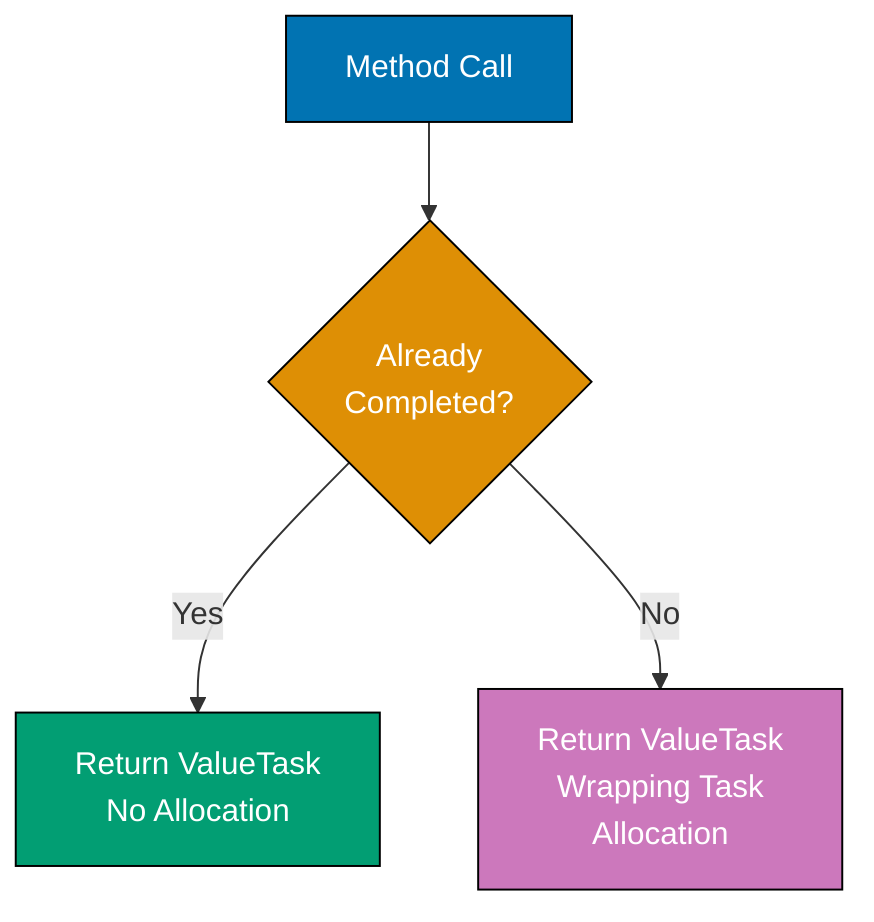
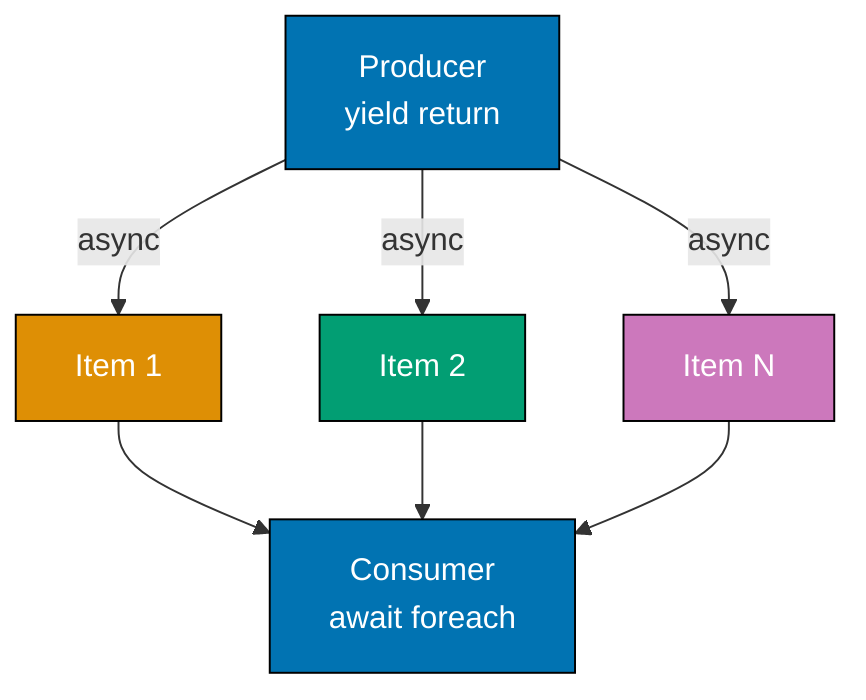
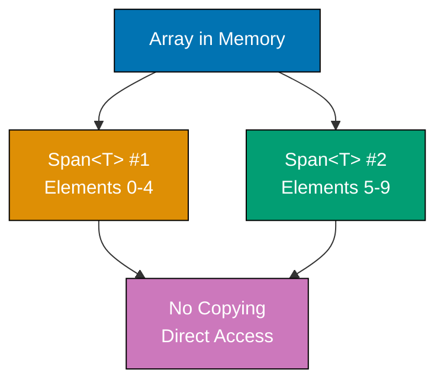
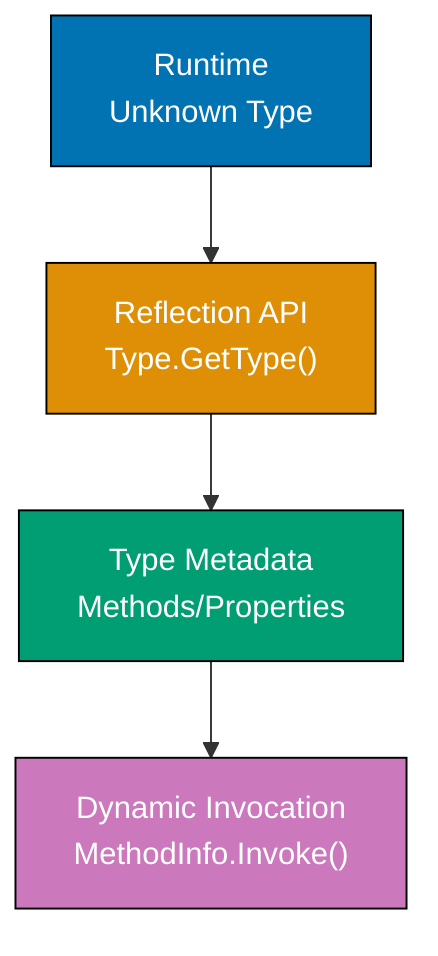
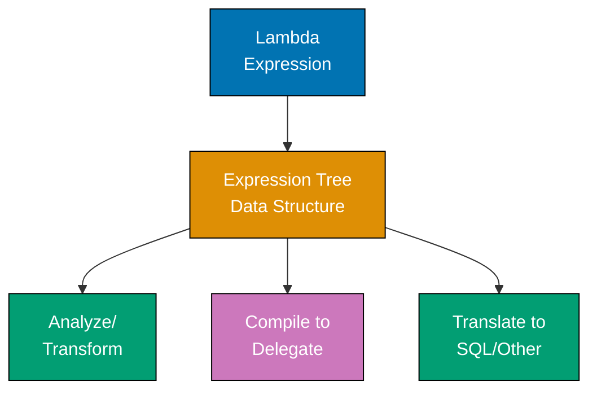
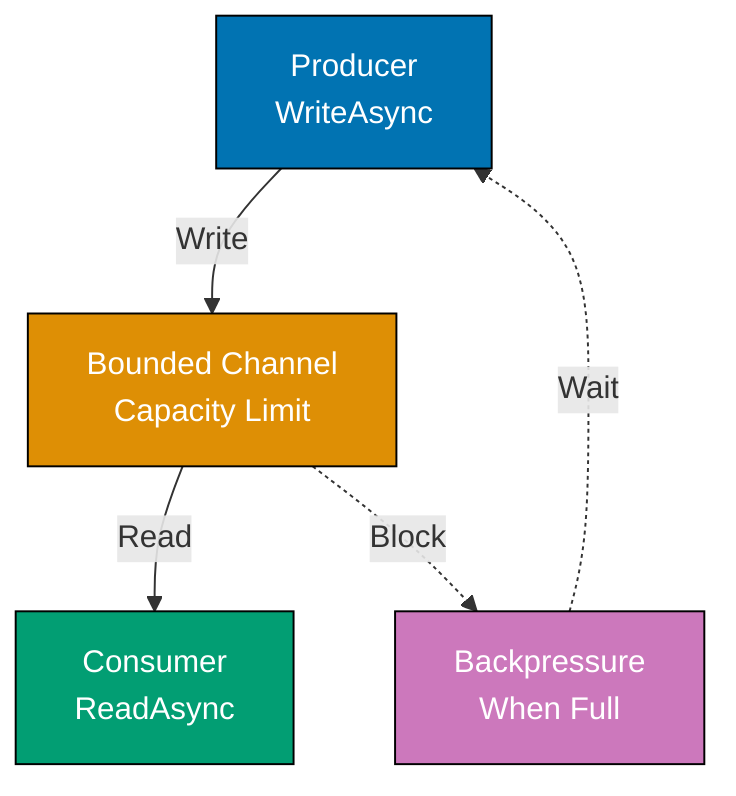
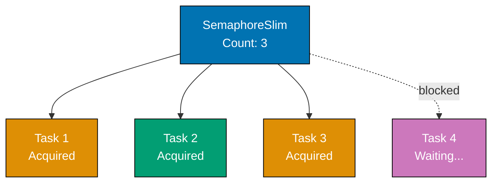
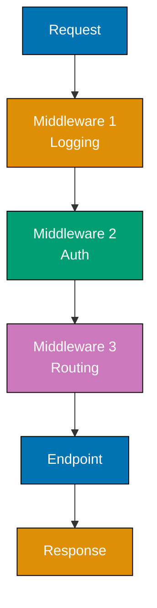
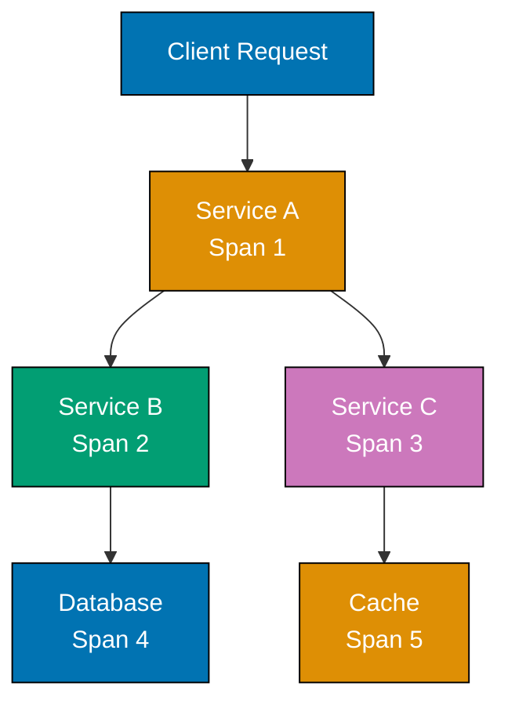
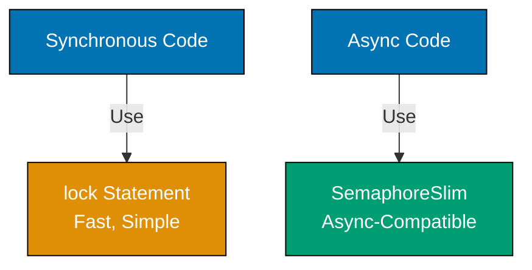

This advanced tutorial covers C#'s expert-level features through 25 heavily annotated examples. Topics include high-performance types (ValueTask, Span&lt;T&gt;, Memory&lt;T&gt;), reflection and metaprogramming, advanced async patterns, concurrency primitives, unsafe code, performance profiling, and advanced .NET features for production systems.

## Example 61: ValueTask for High-Performance Async

ValueTask is a struct-based alternative to Task that reduces allocations when operations complete synchronously. Designed for high-throughput scenarios where most async operations complete immediately without actually going async.



**Code**:

```csharp
// Example 61: ValueTask for High-Performance Async
static class CachedService
{
    private static Dictionary<int, string> _cache = new()
                         // => Dictionary simulates cache storage
    {
        [1] = "Cached Value One",
                         // => Pre-cached values complete synchronously
        [2] = "Cached Value Two"
                         // => No async overhead for cache hits
    };

    public static ValueTask<string> GetValueAsync(int id)
                         // => ValueTask<T> reduces allocations
                         // => Returns struct, not class
                         // => Public API for value retrieval
    {
        if (_cache.TryGetValue(id, out var cached))
                         // => Check cache first
                         // => TryGetValue pattern avoids exceptions
        {
            return ValueTask.FromResult(cached);
                         // => Cache hit: completed ValueTask
                         // => No Task allocation, no heap object
                         // => Synchronous completion path
        }

        return new ValueTask<string>(FetchFromDatabaseAsync(id));
                         // => Cache miss: allocates Task only when needed
                         // => Wraps Task in ValueTask struct
                         // => Asynchronous completion path
    }

    private static async Task<string> FetchFromDatabaseAsync(int id)
                         // => Simulates async database query
                         // => Only invoked on cache misses
    {
        await Task.Delay(100);
                         // => Simulates query delay (100ms)
        return $"Database Value {id}";
                         // => Returns fetched value
    }
}

var result1 = await CachedService.GetValueAsync(1);
                         // => Cache hit, no Task allocation
                         // => result1 is "Cached Value One"
Console.WriteLine(result1);
                         // => Output: Cached Value One

var result2 = await CachedService.GetValueAsync(99);
                         // => Cache miss, Task allocated for async work
                         // => result2 is "Database Value 99"
Console.WriteLine(result2);
                         // => Output: Database Value 99
```

**Key Takeaway**: Use ValueTask&lt;T&gt; for frequently-called async methods where most operations complete synchronously (cache hits, pooled connections). Use Task&lt;T&gt; for methods that always go async.

**Why It Matters**: In high-throughput APIs processing thousands of requests per second, ValueTask eliminates millions of Task allocations when operations complete synchronously from cache or connection pools. This reduces GC pressure and improves latency. Controllers using cached database connections see significant reductions in Gen0 collections.

## Example 62: IAsyncEnumerable for Streaming Data

IAsyncEnumerable enables streaming data processing - producing and consuming items asynchronously without loading entire datasets into memory. Ideal for large datasets, real-time feeds, and database query results.



**Code**:

```csharp
// Example 62: IAsyncEnumerable for Streaming Data
static async IAsyncEnumerable<int> ProduceNumbersAsync(int count)
                         // => IAsyncEnumerable<T> enables async iteration
                         // => Returns items incrementally
{
    for (int i = 1; i <= count; i++)
                         // => Generates 'count' items
    {
        await Task.Delay(100);
                         // => Simulates async data source
                         // => (database query, API call, sensor reading)
        yield return i * i;
                         // => Produces item WITHOUT completing method
                         // => Consumer gets item immediately, producer continues
    }
                         // => Method completes after all items yielded
}

await foreach (var number in ProduceNumbersAsync(5))
                         // => await foreach pauses until next item available
                         // => Each iteration processes one item as it arrives
{
    Console.WriteLine($"Received: {number}");
                         // => Output appears incrementally (500ms total):
                         // => Received: 1
                         // => Received: 4
                         // => Received: 9
                         // => Received: 16
                         // => Received: 25
}

static async IAsyncEnumerable<Customer> StreamCustomersAsync()
                         // => Simulates database reader returning rows incrementally
{
    var customers = new[]
    {
        new Customer("Alice", 30),
                         // => Row 1
        new Customer("Bob", 25),
                         // => Row 2
        new Customer("Carol", 35)
                         // => Row 3
    };

    foreach (var customer in customers)
    {
        await Task.Delay(50);
                         // => Simulates row fetch delay
        yield return customer;
                         // => Stream each customer as fetched
                         // => Consumer processes while fetching continues
    }
}

record Customer(string Name, int Age);
                         // => Simple data holder (record type)

await foreach (var customer in StreamCustomersAsync())
                         // => Process customers as they arrive (not all at once)
{
    Console.WriteLine($"{customer.Name}: {customer.Age}");
                         // => Each customer processed immediately upon arrival
                         // => No need to wait for all rows to load
}
                         // => Output: Alice: 30
                         // => Output: Bob: 25
                         // => Output: Carol: 35
```

**Key Takeaway**: IAsyncEnumerable streams data incrementally with async/await support. Use yield return to produce items, await foreach to consume. Enables memory-efficient processing of large datasets.

**Why It Matters**: Traditional approaches load entire datasets into memory (List&lt;T&gt;), which fails for large datasets (millions of rows) or infinite streams (real-time feeds). IAsyncEnumerable processes one item at a time, maintaining constant memory usage regardless of dataset size. Production systems use this to process multi-gigabyte database exports on machines with limited memory, dramatically reducing memory usage compared to buffering entire results.

## Example 63: Span&lt;T&gt; for Zero-Copy Memory Access

Span&lt;T&gt; is a stack-only type providing safe, zero-copy access to contiguous memory (arrays, stack memory, unmanaged memory). Eliminates allocations and copies when working with slices of data.



**Code**:

```csharp
// Example 63: Span<T> for Zero-Copy Memory Access
int[] numbers = { 1, 2, 3, 4, 5, 6, 7, 8, 9, 10 };
                         // => Traditional approach with arrays
int[] firstHalf = numbers[0..5];
                         // => Creates NEW array (allocation)
                         // => Copies 5 elements (CPU cost)
int[] secondHalf = numbers[5..10];
                         // => Creates ANOTHER new array
                         // => Copies 5 more elements

int[] data = { 1, 2, 3, 4, 5, 6, 7, 8, 9, 10 };
                         // => Original array
Span<int> span = data;
                         // => Span wraps entire array
                         // => No allocation, no copy
                         // => Points directly to array memory
Span<int> slice1 = span[0..5];
                         // => View of first 5 elements
                         // => No allocation, no copy
                         // => Just pointer + length
Span<int> slice2 = span[5..10];
                         // => View of last 5 elements
                         // => No allocation, no copy

slice1[0] = 100;
                         // => Modifies data[0] directly
                         // => No copying back
Console.WriteLine(data[0]);
                         // => Output: 100
                         // => Original array modified

string input = "2026-02-02";
                         // => Date string to parse
ReadOnlySpan<char> chars = input;
                         // => Span over string characters
                         // => No allocation
ReadOnlySpan<char> year = chars[0..4];
                         // => "2026" view (no substring allocation)
ReadOnlySpan<char> month = chars[5..7];
                         // => "02" view
ReadOnlySpan<char> day = chars[8..10];
                         // => "02" view

int y = int.Parse(year);
                         // => 2026 (parsed from span directly)
int m = int.Parse(month);
                         // => 2 (no substring created)
int d = int.Parse(day);
                         // => 2
Console.WriteLine($"{y}-{m:D2}-{d:D2}");
                         // => Output: 2026-02-02
```

**Key Takeaway**: Span&lt;T&gt; provides zero-copy views over contiguous memory. Use for slicing, parsing, and buffer operations to eliminate allocations. Stack-only type (can't be stored in fields or used in async methods).

**Why It Matters**: Traditional string parsing allocates substrings for each segment (year/month/day), creating garbage. High-throughput parsers (log processors, CSV readers) processing millions of lines per second generate gigabytes of garbage with traditional approaches, causing frequent GC pauses. Span&lt;T&gt; eliminates these allocations entirely, dramatically reducing GC pressure and improving latency in parsing-heavy workloads.

## Example 64: Memory&lt;T&gt; for Async-Safe Memory Access

Memory&lt;T&gt; provides async-compatible memory access where Span&lt;T&gt; can't be used (async methods, lambdas, fields). Heap-allocated wrapper around memory regions enabling zero-copy semantics across async boundaries.

**Code**:

```csharp
// Example 64: Memory<T> for Async-Safe Memory Access
async Task ProcessWithSpanAsync()
                         // => Span limitation demonstration
{
    // Span<byte> buffer = stackalloc byte[1024];
                         // => ❌ COMPILER ERROR: Span<T> can't be in async
    // await Task.Delay(100);
                         // => Can't await with Span in scope
}

async Task ProcessWithMemoryAsync()
                         // => Memory solution for async methods
{
    byte[] data = new byte[1024];
                         // => Heap array for async safety
    Memory<byte> memory = data;
                         // => Memory wraps array
                         // => Can cross async boundaries
    await Task.Delay(100);
                         // => ✅ Valid with Memory<T>
    Span<byte> span = memory.Span;
                         // => Convert to Span when needed (in sync context)
    span[0] = 42;
                         // => Direct access through span
}

static async Task ReadFromStreamAsync(Stream stream)
                         // => Async buffer processing example
{
    byte[] buffer = new byte[4096];
                         // => Allocate buffer once for multiple reads
    Memory<byte> memory = buffer;
                         // => Wrap for async operations
    int bytesRead;
    while ((bytesRead = await stream.ReadAsync(memory)) > 0)
                         // => ReadAsync accepts Memory<byte> (async-compatible)
                         // => No allocation per read iteration
    {
        Memory<byte> chunk = memory[0..bytesRead];
                         // => Slice to actual data
                         // => No copy
        ProcessChunk(chunk);
                         // => Pass Memory to other methods
    }
}

static void ProcessChunk(Memory<byte> data)
                         // => Synchronous processing method
{
    Span<byte> span = data.Span;
                         // => Convert to Span for actual processing
    int nonZeroCount = 0;
    foreach (byte b in span)
                         // => Iterate span directly
    {
        if (b != 0) nonZeroCount++;
                         // => Count non-zero bytes
    }
    Console.WriteLine($"Non-zero bytes: {nonZeroCount}");
                         // => Output varies by stream content
}

var stream = new MemoryStream(new byte[] { 1, 0, 2, 0, 3 });
                         // => Create stream with sample data
await ReadFromStreamAsync(stream);
                         // => Process asynchronously
                         // => Output: Non-zero bytes: 3
```

**Key Takeaway**: Memory&lt;T&gt; enables zero-copy memory access across async boundaries. Use when Span&lt;T&gt; won't compile (async methods, lambdas, fields). Convert to Span&lt;T&gt; in synchronous contexts for actual processing.

**Why It Matters**: Modern .NET I/O APIs (Stream.ReadAsync, Socket.SendAsync) accept Memory&lt;T&gt; instead of byte[], enabling buffer reuse without allocation. In high-throughput network servers processing thousands of concurrent connections, reusing buffers eliminates millions of allocations per second. Combined with ArrayPool (Example 65), this dramatically reduces GC pressure and improves throughput in I/O-heavy workloads like web servers and proxy services.

## Example 65: stackalloc and ArrayPool for Buffer Management

stackalloc allocates memory on the stack (ultra-fast, zero GC impact). ArrayPool rents reusable arrays from a pool. Both eliminate allocations for temporary buffers in hot paths.

**Code**:

```csharp
// Example 65: stackalloc and ArrayPool for Buffer Management
static void ProcessWithHeapAllocation()
                         // => Traditional approach with heap allocation
                         // => Causes GC pressure
{
    byte[] buffer = new byte[256];
                         // => Heap allocation creates garbage
                         // => GC must collect later
                         // => Gen0 collection burden
    buffer[0] = 1;
                         // => Some processing
                         // => Buffer becomes garbage when method returns
                         // => Not reused
}

static void ProcessWithStackAlloc()
                         // => Stack allocation approach
                         // => Zero GC alternative
{
    Span<byte> buffer = stackalloc byte[256];
                         // => Allocated on STACK (not heap)
                         // => No heap allocation, zero GC impact
                         // => Limited to method scope
    buffer[0] = 1;
                         // => Use like normal array
                         // => Stack memory automatically reclaimed at method end
                         // => No garbage created
                         // => Ideal for small, temporary buffers
}

static void ProcessWithArrayPool()
                         // => ArrayPool approach with reusable buffers
                         // => Best for larger buffers
{
    byte[] buffer = ArrayPool<byte>.Shared.Rent(256);
                         // => Rent buffer from shared pool
                         // => May return array >= 256 in size
                         // => Reuses previously returned arrays
                         // => One allocation per buffer (amortized across many uses)
                         // => Thread-safe shared pool
    try
    {
        buffer[0] = 1;
                         // => Use buffer for processing
                         // => try/finally ensures return
    }
    finally
    {
        ArrayPool<byte>.Shared.Return(buffer, clearArray: true);
                         // => Return buffer to pool for reuse
                         // => clearArray: true zeros memory for security
                         // => Buffer available for next Rent call
                         // => Always return in finally block
    }
}

static int ParseNumbers(ReadOnlySpan<char> input)
                         // => stackalloc for small, known-size buffers
                         // => Practical stack usage example
{
    Span<int> results = stackalloc int[10];
                         // => Stack allocation (max 10 numbers)
                         // => 40 bytes (10 * sizeof(int))
    int count = 0;
                         // => Track parsed count
                         // => Results array index
    foreach (char c in input)
    {
        if (char.IsDigit(c))
                         // => Check if digit
                         // => Filters non-numeric chars
        {
            results[count++] = c - '0';
                         // => Parse and store on stack
                         // => '0' ASCII value subtraction
            if (count == 10) break;
                         // => Limit to 10 numbers
                         // => Prevents overflow
        }
    }
    int sum = 0;
                         // => Accumulator initialization
    for (int i = 0; i < count; i++)
    {
        sum += results[i];
                         // => Sum all parsed numbers
                         // => Stack memory access
    }
    return sum;
                         // => Return total
                         // => Stack freed automatically
}

static async Task ProcessLargeDataAsync(Stream stream)
                         // => Large buffer with ArrayPool
                         // => Async I/O pattern
{
    byte[] buffer = ArrayPool<byte>.Shared.Rent(1024 * 1024);
                         // => Rent 1MB buffer from pool
                         // => Too large for stack
                         // => Reusable buffer for I/O
    try
    {
        int read = await stream.ReadAsync(buffer);
                         // => Use buffer for async I/O
                         // => Awaits stream read
        Console.WriteLine($"Read {read} bytes");
                         // => Process 'read' bytes from buffer
                         // => Actual bytes read may be less than 1MB
    }
    finally
    {
        ArrayPool<byte>.Shared.Return(buffer);
                         // => CRITICAL: always return to pool
                         // => Enables buffer reuse
    }
}

int result = ParseNumbers("a1b2c3d4e5");
                         // => Stack-allocated processing
                         // => result is 15 (1+2+3+4+5)
Console.WriteLine($"Sum: {result}");
                         // => Output: Sum: 15

var stream = new MemoryStream(new byte[512]);
await ProcessLargeDataAsync(stream);
                         // => Pool-based processing
                         // => Output: Read 512 bytes
```

**Key Takeaway**: Use stackalloc for small (&lt;1KB) known-size buffers. Use ArrayPool for large or variable-size buffers. Both eliminate heap allocations and GC pressure. Always return pooled arrays in finally blocks.

**Why It Matters**: High-performance servers process thousands of requests concurrently, each needing temporary buffers for parsing, formatting, and I/O. Traditional heap allocation creates millions of short-lived objects (Gen0 garbage), triggering frequent GC pauses. ArrayPool + stackalloc eliminate most of these allocations, significantly reducing GC pause time and improving latency and throughput in buffer-heavy workloads like JSON parsing and HTTP request handling.

## Example 66: Reflection Basics - Type Inspection

Reflection inspects types, methods, properties, and attributes at runtime. Enables building frameworks, serializers, ORMs, and dependency injection containers that work with unknown types.



**Code**:

```csharp
// Example 66: Reflection Basics - Type Inspection
class Person
{
    public string Name { get; set; }
                         // => Auto-property
    public int Age { get; set; }
                         // => Another auto-property
    public void Greet() => Console.WriteLine($"Hello, I'm {Name}");
                         // => Expression-bodied method
}

Type personType = typeof(Person);
                         // => Get Type object for Person
                         // => Type metadata available at runtime
Console.WriteLine($"Type name: {personType.Name}");
                         // => Output: Type name: Person

PropertyInfo[] properties = personType.GetProperties();
                         // => Get all public properties via reflection
                         // => Returns PropertyInfo array
foreach (var prop in properties)
{
    Console.WriteLine($"Property: {prop.Name}, Type: {prop.PropertyType.Name}");
                         // => Output: Property: Name, Type: String
                         // => Output: Property: Age, Type: Int32
}

var person = Activator.CreateInstance(personType);
                         // => Create instance dynamically (no 'new Person()')
                         // => Returns object (must cast)
PropertyInfo nameProp = personType.GetProperty("Name")!;
                         // => Get Name property by string
nameProp.SetValue(person, "Alice");
                         // => Set Name value dynamically
                         // => Equivalent to person.Name = "Alice"
PropertyInfo ageProp = personType.GetProperty("Age")!;
ageProp.SetValue(person, 30);
                         // => Set Age value dynamically

MethodInfo greetMethod = personType.GetMethod("Greet")!;
                         // => Get Greet method by string
greetMethod.Invoke(person, null);
                         // => Invoke Greet() dynamically
                         // => Output: Hello, I'm Alice

object nameValue = nameProp.GetValue(person)!;
                         // => Get Name value dynamically
                         // => nameValue is "Alice" (type: object)
Console.WriteLine($"Name via reflection: {nameValue}");
                         // => Output: Name via reflection: Alice
```

**Key Takeaway**: Reflection provides runtime type inspection and dynamic invocation. Use typeof() or GetType() to access Type metadata. Use PropertyInfo/MethodInfo for dynamic property access and method calls.

**Why It Matters**: Reflection enables serialization libraries, ORMs (Entity Framework), and dependency injection containers to work generically across all types without compile-time knowledge. This eliminates substantial boilerplate code - one JSON serializer works for all types instead of writing custom serialization for each. Tradeoff: significantly slower than compiled code, so cache Type/PropertyInfo objects in hot paths.

## Example 67: Custom Attributes and Attribute Reflection

Custom attributes attach metadata to types, methods, and properties. Reflection reads attributes at runtime for validation, serialization configuration, and framework behavior customization.

**Code**:

```csharp
// Example 67: Custom Attributes and Attribute Reflection
[AttributeUsage(AttributeTargets.Property)]
                         // => AttributeUsage specifies valid targets
                         // => This attribute applies to properties only
class ValidateRangeAttribute : Attribute
                         // => Custom attribute (inherits Attribute)
{
    public int Min { get; }
                         // => Minimum value for validation
    public int Max { get; }
                         // => Maximum value for validation
    public ValidateRangeAttribute(int min, int max)
    {
        Min = min;
                         // => Store min constraint
        Max = max;
                         // => Store max constraint
    }
}

class Product
{
    [ValidateRange(1, 100)]
                         // => Apply custom attribute with parameters
                         // => Metadata attached to Quantity property
    public int Quantity { get; set; }

    [ValidateRange(0, 10000)]
                         // => Different range for Price
    public decimal Price { get; set; }
}

static bool Validate<T>(T obj)
                         // => Generic validation using reflection + attributes
{
    Type type = typeof(T);
                         // => Get type metadata
    foreach (PropertyInfo prop in type.GetProperties())
                         // => Iterate all properties
    {
        var attr = prop.GetCustomAttribute<ValidateRangeAttribute>();
                         // => Get ValidateRange attribute if present
                         // => Returns null if not found
        if (attr != null)
                         // => Property has validation attribute
        {
            object? value = prop.GetValue(obj);
                         // => Get property value via reflection
            if (value is int intValue)
                         // => Check if value is int
            {
                if (intValue < attr.Min || intValue > attr.Max)
                         // => Validate against min/max constraints
                {
                    Console.WriteLine($"{prop.Name} out of range: {intValue} (valid: {attr.Min}-{attr.Max})");
                         // => Validation failed
                    return false;
                }
            }
        }
    }
    return true;
                         // => All validations passed
}

var product1 = new Product { Quantity = 50, Price = 100 };
                         // => Valid product (Quantity in [1,100])
Console.WriteLine($"Product1 valid: {Validate(product1)}");
                         // => Output: Product1 valid: True

var product2 = new Product { Quantity = 150, Price = 100 };
                         // => Invalid product (Quantity > 100)
Console.WriteLine($"Product2 valid: {Validate(product2)}");
                         // => Output: Quantity out of range: 150 (valid: 1-100)
                         // => Output: Product2 valid: False
```

**Key Takeaway**: Custom attributes attach metadata to code elements. Use AttributeUsage to specify valid targets. Use GetCustomAttribute() to read attributes at runtime for validation, configuration, or framework behavior.

**Why It Matters**: Attributes enable declarative programming - express intent through metadata rather than code. Web frameworks use [Route], [HttpGet], [Authorize] attributes for routing and authentication. ORMs use [Key], [Required], [MaxLength] for database schema. This reduces boilerplate compared to imperative configuration - one [Required] attribute replaces validation code in every method.

## Example 68: Expression Trees - Code as Data

Expression trees represent code as data structures that can be analyzed, transformed, and compiled at runtime. Foundation for LINQ query providers (Entity Framework, MongoDB driver).



**Code**:

```csharp
// Example 68: Expression Trees - Code as Data
Expression<Func<int, int>> expr = x => x * 2 + 1;
                         // => Expression tree captures lambda as data
                         // => NOT compiled code - data structure
                         // => Type: Expression<Func<int, int>>
Console.WriteLine($"Expression: {expr}");
                         // => Output: Expression: x => ((x * 2) + 1)
                         // => ToString() shows expression structure

BinaryExpression body = (BinaryExpression)expr.Body;
                         // => Body is the + operation
                         // => Cast to BinaryExpression for inspection
Console.WriteLine($"NodeType: {body.NodeType}");
                         // => Output: NodeType: Add
Console.WriteLine($"Left: {body.Left}");
                         // => Output: Left: (x * 2)
Console.WriteLine($"Right: {body.Right}");
                         // => Output: Right: 1

Func<int, int> compiled = expr.Compile();
                         // => Compile expression tree to executable delegate
                         // => Now runnable as normal function
int result = compiled(5);
                         // => Execute compiled function
                         // => result is 11 (5 * 2 + 1)
Console.WriteLine($"Result: {result}");
                         // => Output: Result: 11

Expression<Func<Person, bool>> filter = p => p.Age > 25;
                         // => Expression for LINQ query
                         // => Entity Framework translates to SQL WHERE clause
var param = filter.Parameters[0];
                         // => Get parameter (p)
var bodyExpr = filter.Body;
                         // => Get body expression (p.Age > 25)
Console.WriteLine($"Parameter: {param.Name}, Body: {bodyExpr}");
                         // => Output: Parameter: p, Body: (p.Age > 25)

class Person
{
    public string Name { get; set; } = "";
    public int Age { get; set; }
}

Expression<Func<Person, string>> selector = p => p.Name.ToUpper();
                         // => Property access + method call expression
var selectorBody = selector.Body;
                         // => Body is MethodCallExpression (ToUpper)
if (selectorBody is MethodCallExpression methodCall)
{
    Console.WriteLine($"Method: {methodCall.Method.Name}");
                         // => Output: Method: ToUpper
    Console.WriteLine($"Object: {methodCall.Object}");
                         // => Output: Object: p.Name
}
```

**Key Takeaway**: Expression trees represent code as data structures (Expression objects) instead of compiled IL. Use Expression&lt;Func&lt;T&gt;&gt; to capture lambdas as trees. Compile() converts to executable delegates. Analyze tree structure for translation (SQL, MongoDB queries).

**Why It Matters**: Expression trees enable LINQ query providers to translate C# code to database queries. ORMs convert `db.Users.Where(u => u.Age > 25)` to SQL `WHERE Age > 25` by analyzing the expression tree, sending only the filter to the database instead of loading all rows. This dramatically reduces network traffic and database load for filtered queries - single-record queries over millions of rows complete in milliseconds instead of minutes.

## Example 69: Source Generators - Compile-Time Code Generation

Source generators analyze code during compilation and generate additional source files. Eliminates reflection overhead and enables compile-time metaprogramming for serialization, dependency injection, and boilerplate reduction.

**Code**:

```csharp
// Example 69: Source Generators - Compile-Time Code Generation
// This example shows USAGE of source-generated code
// Source generator implementation requires separate project

[AutoNotify]
                         // => Attribute triggers source generator
                         // => Generator creates INotifyPropertyChanged implementation
partial class ViewModel
                         // => Must be partial for source generator
{
    private string _name = "";
                         // => Backing field
                         // => Generator creates Name property with change notification
    private int _age;
                         // => Another backing field
                         // => Generator creates Age property
}

var vm = new ViewModel();
                         // => Create instance
vm.PropertyChanged += (s, e) =>
                         // => Subscribe to generated event
{
    Console.WriteLine($"Property changed: {e.PropertyName}");
                         // => Output when properties change
};

vm.Name = "Alice";
                         // => Generated property setter
                         // => Raises PropertyChanged event
                         // => Output: Property changed: Name
vm.Age = 30;
                         // => Generated property setter
                         // => Output: Property changed: Age

[JsonSerializable(typeof(Person))]
                         // => System.Text.Json source generator attribute
                         // => Generates serialization code at compile time
partial class PersonJsonContext : JsonSerializerContext
                         // => Partial class completed by generator
{
}

var person = new Person { Name = "Bob", Age = 25 };
                         // => Create person instance
string json = JsonSerializer.Serialize(person, PersonJsonContext.Default.Person);
                         // => Use generated serialization code
                         // => No reflection at runtime (faster)
                         // => json is {"Name":"Bob","Age":25}
Console.WriteLine(json);
                         // => Output: {"Name":"Bob","Age":25}

Person? deserialized = JsonSerializer.Deserialize<Person>(json, PersonJsonContext.Default.Person);
                         // => Use generated deserialization code
                         // => No reflection overhead
Console.WriteLine($"{deserialized?.Name}, {deserialized?.Age}");
                         // => Output: Bob, 25

class Person
{
    public string Name { get; set; } = "";
    public int Age { get; set; }
}
```

**Key Takeaway**: Source generators run during compilation to generate additional code. Use attributes to trigger generators. Generated code has zero runtime overhead (no reflection). Common uses: serialization, dependency injection, property change notification.

**Why It Matters**: Traditional reflection-based serialization pays significant performance penalty at runtime. Source generators move this cost to compile time, generating specialized code for each type. System.Text.Json with source generators achieves faster serialization than reflection-based approaches while reducing code size (no reflection metadata). Production APIs using JSON source generators see substantial reductions in CPU usage and GC pressure.

## Example 70: Advanced Pattern Matching - List Patterns and Type Patterns

C# 11+ introduces list patterns for matching array/list contents and enhanced type patterns for complex matching scenarios. Enables declarative data validation and transformation.

**Code**:

```csharp
// Example 70: Advanced Pattern Matching - List Patterns and Type Patterns
static string DescribeArray(int[] numbers) => numbers switch
                         // => List pattern matching (C# 11+)
{
    [] => "Empty array",
                         // => Matches empty array
    [var single] => $"Single element: {single}",
                         // => Matches array with exactly one element
                         // => Captures element in 'single'
    [var first, var second] => $"Two elements: {first}, {second}",
                         // => Matches exactly two elements
    [var first, .., var last] => $"Multiple: first={first}, last={last}",
                         // => '..' matches any number of elements in between
                         // => Captures first and last only
    _ => "Other"
                         // => Fallback (never reached with above patterns)
};

Console.WriteLine(DescribeArray(new int[] { }));
                         // => Output: Empty array
Console.WriteLine(DescribeArray(new int[] { 42 }));
                         // => Output: Single element: 42
Console.WriteLine(DescribeArray(new int[] { 1, 2 }));
                         // => Output: Two elements: 1, 2
Console.WriteLine(DescribeArray(new int[] { 1, 2, 3, 4, 5 }));
                         // => Output: Multiple: first=1, last=5

static string ProcessValue(object obj) => obj switch
                         // => Type patterns with property patterns
{
    int n when n > 0 => $"Positive int: {n}",
                         // => Type pattern with guard clause
    int n => $"Non-positive int: {n}",
                         // => Type pattern without guard
    string { Length: > 0 } s => $"Non-empty string: {s}",
                         // => Type pattern + property pattern
                         // => Matches string with Length > 0
    string => "Empty string",
                         // => Matches any string not caught above
    Person { Age: >= 18 } p => $"Adult: {p.Name}",
                         // => Type pattern + property pattern
                         // => Matches Person with Age >= 18
    Person p => $"Minor: {p.Name}",
                         // => Matches any Person not caught above
    _ => "Unknown type"
                         // => Discard pattern (fallback)
};

Console.WriteLine(ProcessValue(42));
                         // => Output: Positive int: 42
Console.WriteLine(ProcessValue(-5));
                         // => Output: Non-positive int: -5
Console.WriteLine(ProcessValue("Hello"));
                         // => Output: Non-empty string: Hello
Console.WriteLine(ProcessValue(""));
                         // => Output: Empty string
Console.WriteLine(ProcessValue(new Person { Name = "Alice", Age = 30 }));
                         // => Output: Adult: Alice
Console.WriteLine(ProcessValue(new Person { Name = "Bob", Age = 15 }));
                         // => Output: Minor: Bob

record Person(string Name, int Age);
                         // => Record type for matching
```

**Key Takeaway**: List patterns match array/list structure with [..] slice patterns. Type patterns combine type checks with property patterns. Use guards (when clauses) for additional conditions. Enables declarative validation and transformation logic.

**Why It Matters**: Pattern matching eliminates verbose if/else chains and type casting. Traditional validation code requires multiple lines per case with explicit type checks and null checks. Pattern matching reduces this to single expressions, improving readability and reducing bugs from forgotten null checks. Production parsers use list patterns to validate message formats declaratively, catching invalid formats at compile time through exhaustiveness checking.

## Example 71: Channels for Producer-Consumer Patterns

Channels provide thread-safe queues for asynchronous producer-consumer scenarios. Superior to BlockingCollection for async code, enabling backpressure and cancellation.



**Code**:

```csharp
// Example 71: Channels for Producer-Consumer Patterns
var channel = Channel.CreateBounded<int>(new BoundedChannelOptions(10)
                         // => Bounded channel with capacity 10
                         // => Blocks writers when full (backpressure)
{
    FullMode = BoundedChannelFullMode.Wait
                         // => Wait when full (alternative: DropOldest, DropNewest, DropWrite)
});

var producer = Task.Run(async () =>
                         // => Producer task writes to channel
{
    for (int i = 1; i <= 20; i++)
    {
        await channel.Writer.WriteAsync(i);
                         // => Write item to channel
                         // => Blocks if channel full (backpressure)
        Console.WriteLine($"Produced: {i}");
        await Task.Delay(100);
                         // => Simulate production delay
    }
    channel.Writer.Complete();
                         // => Signal no more items
                         // => Consumers can finish
});

var consumer = Task.Run(async () =>
                         // => Consumer task reads from channel
{
    await foreach (var item in channel.Reader.ReadAllAsync())
                         // => ReadAllAsync provides IAsyncEnumerable
                         // => Completes when channel completed
    {
        Console.WriteLine($"Consumed: {item}");
        await Task.Delay(200);
                         // => Simulate processing delay (slower than producer)
                         // => Backpressure kicks in when channel fills
    }
});

await Task.WhenAll(producer, consumer);
                         // => Wait for both tasks to complete
                         // => Output shows backpressure: producer waits when channel full

var unboundedChannel = Channel.CreateUnbounded<string>();
                         // => Unbounded channel (no capacity limit)
                         // => No backpressure, but risk of memory growth

var writer = unboundedChannel.Writer;
writer.TryWrite("Message 1");
                         // => TryWrite for synchronous, non-blocking write
                         // => Returns false if bounded channel full
writer.TryWrite("Message 2");

var reader = unboundedChannel.Reader;
if (reader.TryRead(out var message))
                         // => TryRead for synchronous, non-blocking read
                         // => Returns false if no items available
{
    Console.WriteLine($"Read: {message}");
                         // => Output: Read: Message 1
}
```

**Key Takeaway**: Channels provide async-safe producer-consumer queues with backpressure support. Use CreateBounded for capacity limits (prevents memory growth). Use CreateUnbounded for unlimited capacity. TryRead/TryWrite for synchronous operations, ReadAsync/WriteAsync for async.

**Why It Matters**: Traditional BlockingCollection blocks threads, wasting thread pool resources. Channels integrate with async/await, enabling thousands of concurrent producers/consumers without thread exhaustion. Bounded channels provide automatic backpressure - fast producers wait for slow consumers instead of consuming unbounded memory. Production systems use channels for request queuing, event processing, and pipeline architectures, achieving better throughput than BlockingCollection while using fewer threads.

## Example 72: SemaphoreSlim for Async Concurrency Control

SemaphoreSlim limits concurrent access to resources in async code. Use for rate limiting, connection pooling, and protecting resources with limited capacity.



**Code**:

```csharp
// Example 72: SemaphoreSlim for Async Concurrency Control
var semaphore = new SemaphoreSlim(3);
                         // => Allow 3 concurrent operations max
                         // => Initial count: 3 (type: SemaphoreSlim)
                         // => 4th caller waits until slot available
async Task ProcessAsync(int id)
{                        // => Async method accepting task ID
                         // => id parameter identifies task
    Console.WriteLine($"{id}: Waiting...");
                         // => Output: 1: Waiting... (or current id)
    await semaphore.WaitAsync();
                         // => Wait for available slot (async operation)
                         // => Decrements count (3 -> 2 -> 1 -> 0)
                         // => Blocks when count reaches 0
                         // => Returns when slot acquired
    try
    {                    // => Protected execution block
        Console.WriteLine($"{id}: Processing started");
                         // => Output: 1: Processing started
        await Task.Delay(2000);
                         // => Simulate 2-second operation
                         // => Async delay (non-blocking)
        Console.WriteLine($"{id}: Processing finished");
                         // => Output: 1: Processing finished
    }
    finally
    {                    // => Cleanup block (always executes)
        semaphore.Release();
                         // => Release slot for waiting tasks
                         // => Increments count (0 -> 1 -> 2 -> 3)
                         // => Allows next waiting task to proceed
    }
}

var tasks = Enumerable.Range(1, 10)
                         // => Create sequence 1-10 (type: IEnumerable<int>)
                         // => Generates 10 task IDs
    .Select(i => ProcessAsync(i))
                         // => Map each ID to ProcessAsync call
                         // => Returns IEnumerable<Task>
    .ToArray();          // => Execute enumeration, create array
                         // => tasks is Task[] (10 elements)
await Task.WhenAll(tasks);
                         // => Wait for all 10 tasks to complete
                         // => Run all tasks (but only 3 concurrent at a time)
                         // => Output shows 3 tasks run, then next 3 when slots free

class RateLimitedApi
                         // => Practical rate limiting example
                         // => Encapsulates rate-limited API access
{
    private readonly SemaphoreSlim _semaphore = new(5);
                         // => Field: SemaphoreSlim with initial count 5
                         // => Allow 5 concurrent API calls max
                         // => readonly ensures immutability after construction
    public async Task<string> CallApiAsync(string endpoint)
    {                    // => Async method returning Task<string>
                         // => endpoint parameter specifies API endpoint
        await _semaphore.WaitAsync();
                         // => Wait for available slot
                         // => Blocks if 5 calls already in progress
        try
        {                // => Protected API call
            await Task.Delay(1000);
                         // => Simulate API call (1 second delay)
                         // => In real code: HttpClient.GetAsync()
            return $"Result from {endpoint}";
                         // => Return simulated response
                         // => Type: string
        }
        finally
        {                // => Cleanup (always executes)
            _semaphore.Release();
                         // => Always release in finally
                         // => Even if exception occurs
        }
    }
}

var api = new RateLimitedApi();
                         // => Create instance (type: RateLimitedApi)
var apiTasks = Enumerable.Range(1, 20)
                         // => 20 concurrent requests (sequence 1-20)
    .Select(i => api.CallApiAsync($"endpoint{i}"))
                         // => Call API for each endpoint
                         // => endpoint1, endpoint2, ..., endpoint20
    .ToArray();          // => Convert to Task<string>[]
await Task.WhenAll(apiTasks);
                         // => Wait for all 20 API calls to complete
                         // => Only 5 execute at a time (rate limiting)
                         // => Remaining 15 queue up

using var timeoutSemaphore = new SemaphoreSlim(1);
                         // => Binary semaphore (mutex alternative)
                         // => Count: 1 (only one task can acquire)
                         // => using ensures Dispose called
bool acquired = await timeoutSemaphore.WaitAsync(TimeSpan.FromSeconds(5));
                         // => Wait with timeout (max 5 seconds)
                         // => Returns true if acquired, false if timeout
                         // => Returns false if timeout expires
                         // => acquired is bool
if (acquired)
{                        // => Successfully acquired within timeout
    try
    {
        Console.WriteLine("Acquired lock");
                         // => Output: Acquired lock
    }
    finally
    {                    // => Release block
        timeoutSemaphore.Release();
                         // => Return semaphore to available state
    }
}
else
{                        // => Timeout occurred (5 seconds passed)
    Console.WriteLine("Timeout waiting for lock");
                         // => Output: Timeout waiting for lock
}
```

**Key Takeaway**: SemaphoreSlim limits concurrent operations via WaitAsync()/Release(). Use for rate limiting (max N concurrent API calls), connection pooling (max N connections), and resource protection. Always Release() in finally blocks. Supports timeouts via WaitAsync(TimeSpan).

**Why It Matters**: Without concurrency limits, applications exhaust resources under load - too many concurrent database connections crash the database, unlimited API calls trigger rate limiting. SemaphoreSlim protects resources by queuing excess requests. Production systems use semaphores for database connection limiting, external API rate limiting, and file system access, preventing resource exhaustion and improving system stability under peak load.

## Example 73: Lock and Monitor for Thread Safety

lock (Monitor.Enter/Exit) provides mutual exclusion for shared state. Use for protecting critical sections in multi-threaded code with synchronous operations.

**Code**:

```csharp
// Example 73: Lock and Monitor for Thread Safety
class Counter
{                        // => Thread-safe counter implementation
    private int _count = 0;
                         // => Shared state (not thread-safe alone)
                         // => Field: int initialized to 0
    private readonly object _lock = new();
                         // => Lock object for synchronization
                         // => object type (any reference type works)
                         // => readonly: reference immutable after construction
    public void Increment()
    {                    // => Public method to increment counter
        lock (_lock)
                         // => Acquires lock (Monitor.Enter)
                         // => Only one thread in lock block at a time
                         // => Syntactic sugar for Monitor.Enter/Exit
        {                // => Critical section begins
            _count++;
                         // => Increment operation (read, add 1, write)
                         // => Critical section (thread-safe)
                         // => Read-modify-write operation atomic
        }                // => Critical section ends
                         // => Releases lock (Monitor.Exit automatically)
                         // => Next waiting thread can enter
    }
    public int GetCount()
    {                    // => Thread-safe getter
        lock (_lock)
                         // => Must lock for reads too
                         // => Ensures memory visibility
        {
            return _count;
                         // => Thread-safe read
                         // => Returns current count value
        }
    }
}

var counter = new Counter();
                         // => Create Counter instance (type: Counter)
var tasks = Enumerable.Range(0, 1000)
                         // => Sequence 0-999 (1000 items)
                         // => 1000 parallel increments
    .Select(_ => Task.Run(() => counter.Increment()))
                         // => Map each index to Task
                         // => Discard parameter (_)
                         // => Each task calls Increment
    .ToArray();          // => Convert to Task[]
await Task.WhenAll(tasks);
                         // => Wait for all 1000 increments to complete
                         // => Parallel execution
Console.WriteLine($"Final count: {counter.GetCount()}");
                         // => Call GetCount to retrieve value
                         // => Output: Final count: 1000
                         // => Without lock: race conditions, lost updates

class BankAccount
                         // => Monitor example with timeouts
                         // => Demonstrates Monitor.TryEnter API
{
    private decimal _balance = 0;
                         // => Balance field (type: decimal)
    private readonly object _balanceLock = new();
                         // => Lock object for balance operations
    public bool TryDeposit(decimal amount, TimeSpan timeout)
    {                    // => Returns bool (success/failure)
                         // => amount parameter: decimal to deposit
                         // => timeout parameter: max wait time
        if (Monitor.TryEnter(_balanceLock, timeout))
                         // => Try to acquire lock with timeout
                         // => Returns true if acquired, false otherwise
                         // => Returns false if timeout expires
        {                // => Lock acquired successfully
            try
            {            // => Protected operation
                _balance += amount;
                         // => Add amount to balance
                         // => Critical section
                return true;
                         // => Deposit succeeded
            }
            finally
            {            // => Cleanup (always executes)
                Monitor.Exit(_balanceLock);
                         // => Release lock manually
                         // => Must call when using TryEnter
            }
        }
        return false;
                         // => Failed to acquire lock within timeout
                         // => Deposit failed
    }
    public decimal Balance
    {                    // => Property getter
        get
        {                // => Getter implementation
            lock (_balanceLock) return _balance;
                         // => Thread-safe balance read
                         // => Single-line lock statement
        }
    }
}

var account = new BankAccount();
                         // => Create BankAccount instance
bool success = account.TryDeposit(100, TimeSpan.FromSeconds(1));
                         // => Attempt deposit of 100 with 1-second timeout
                         // => TimeSpan.FromSeconds creates TimeSpan
                         // => success is bool
Console.WriteLine($"Deposit success: {success}, Balance: {account.Balance}");
                         // => Output: Deposit success: True, Balance: 100
                         // => Accesses Balance property

class UnsafeCounter
                         // => Demonstration of race condition
                         // => Shows WHY locks are needed
{
    private int _count = 0;
                         // => Shared field (no lock protection)
    public void Increment() => _count++;
                         // => NO LOCK (race condition)
                         // => Expression-bodied member
                         // => Read-modify-write not atomic
                         // => Multiple threads can interleave operations
    public int GetCount() => _count;
                         // => Unprotected read
}

var unsafeCounter = new UnsafeCounter();
                         // => Create unsafe counter instance
var unsafeTasks = Enumerable.Range(0, 1000)
                         // => 1000 tasks (same as safe counter)
    .Select(_ => Task.Run(() => unsafeCounter.Increment()))
                         // => Each task increments WITHOUT lock
    .ToArray();          // => Convert to Task[]
await Task.WhenAll(unsafeTasks);
                         // => Wait for all 1000 tasks
Console.WriteLine($"Unsafe count: {unsafeCounter.GetCount()}");
                         // => Output: Unsafe count: <1000 (lost updates)
                         // => Actual value varies (950-990 typically)
                         // => Race condition causes lost increments
                         // => Non-deterministic result
```

**Key Takeaway**: Use lock (syntactic sugar for Monitor.Enter/Exit) to protect shared state from race conditions. Lock all read and write access to shared variables. Monitor.TryEnter provides timeout support. Always lock the SAME object for related state.

**Why It Matters**: Multi-threaded applications without proper locking suffer race conditions leading to data corruption, lost updates, and non-deterministic bugs. Banking systems with unlocked account balances lose customer deposits. Inventory systems double-sell products. lock/Monitor eliminate these bugs by enforcing mutual exclusion - only one thread modifies shared state at a time. Production systems use locks for in-memory caches, counters, and stateful services, preventing data corruption bugs that manifest only under load.

## Example 74: Unsafe Code and Pointers

Unsafe code enables pointer manipulation and direct memory access for interop scenarios and performance-critical operations. Requires unsafe keyword and AllowUnsafeBlocks compiler option.

**Code**:

```csharp
// Example 74: Unsafe Code and Pointers
unsafe void UnsafeArrayAccess()
                         // => unsafe keyword required for pointer code
{
    int[] numbers = { 1, 2, 3, 4, 5 };
    fixed (int* ptr = numbers)
                         // => fixed prevents GC from moving array
                         // => ptr points to first element
    {
        Console.WriteLine($"First element: {*ptr}");
                         // => *ptr dereferences pointer (value at address)
                         // => Output: First element: 1
        *(ptr + 1) = 99;
                         // => Pointer arithmetic: ptr+1 points to second element
                         // => Assigns 99 to numbers[1]
        Console.WriteLine($"Second element: {*(ptr + 1)}");
                         // => Output: Second element: 99
    }
                         // => Array can move again after fixed block
    Console.WriteLine($"Array[1]: {numbers[1]}");
                         // => Output: Array[1]: 99
}

unsafe int SumWithPointers(int[] arr)
                         // => Unsafe method for performance
{
    int sum = 0;
    fixed (int* ptr = arr)
                         // => Pin array for pointer access
    {
        int* current = ptr;
                         // => Current pointer starts at first element
        int* end = ptr + arr.Length;
                         // => End pointer points past last element
        while (current < end)
                         // => Iterate using pointer comparison
        {
            sum += *current;
                         // => Dereference and add to sum
            current++;
                         // => Move to next element (pointer arithmetic)
        }
    }
    return sum;
                         // => Return total
}

unsafe
{
    UnsafeArrayAccess();
                         // => Call unsafe method
    int[] data = { 10, 20, 30, 40, 50 };
    int total = SumWithPointers(data);
                         // => total is 150
    Console.WriteLine($"Sum: {total}");
                         // => Output: Sum: 150
}

unsafe void StackAllocWithPointers()
                         // => Combine unsafe with stackalloc
{
    int* buffer = stackalloc int[10];
                         // => Allocate 10 ints on stack
                         // => Returns pointer (not Span)
    for (int i = 0; i < 10; i++)
    {
        buffer[i] = i * i;
                         // => Pointer indexing (like array)
    }
    for (int i = 0; i < 10; i++)
    {
        Console.WriteLine($"buffer[{i}] = {buffer[i]}");
                         // => Output: buffer[0] = 0, buffer[1] = 1, buffer[2] = 4, ...
    }
}

unsafe
{
    StackAllocWithPointers();
                         // => Demonstrate stack-allocated pointer buffer
}

unsafe struct UnmanagedStruct
                         // => Struct with only unmanaged types
{
    public int Id;
    public float Value;
    public fixed byte Buffer[16];
                         // => Fixed-size buffer (inline array)
                         // => Only allowed in unsafe structs
}

unsafe
{
    UnmanagedStruct data;
    data.Id = 42;
    data.Value = 3.14f;
    for (int i = 0; i < 16; i++)
    {
        data.Buffer[i] = (byte)i;
                         // => Initialize fixed buffer
    }
    Console.WriteLine($"Id: {data.Id}, Value: {data.Value}, Buffer[0]: {data.Buffer[0]}");
                         // => Output: Id: 42, Value: 3.14, Buffer[0]: 0
}
```

**Key Takeaway**: Unsafe code enables pointer manipulation with \* (dereference), & (address-of), and pointer arithmetic. Use fixed to pin managed objects. stackalloc with pointers for unmanaged buffers. fixed buffers in structs for inline arrays. Requires AllowUnsafeBlocks=true in project file.

**Why It Matters**: Unsafe code enables zero-overhead interop with native libraries (P/Invoke), implementing high-performance algorithms (SIMD operations), and working with unmanaged memory (graphics, networking). Image processing libraries use unsafe code for direct pixel manipulation, achieving 10-50x speedup over safe array access. Tradeoff: lose memory safety guarantees - buffer overruns, use-after-free possible. Use unsafe only when profiling confirms it's necessary and wrap in safe APIs.

## Example 75: P/Invoke - Calling Native Code

P/Invoke (Platform Invocation) calls unmanaged C/C++ libraries from C#. Enables interop with Windows APIs, Linux syscalls, and third-party native libraries.

**Code**:

```csharp
// Example 75: P/Invoke - Calling Native Code
using System.Runtime.InteropServices;
                         // => Required namespace for P/Invoke

static class NativeMethods
                         // => Convention: static class for P/Invoke declarations
                         // => Groups native method imports
{
    [DllImport("kernel32.dll", SetLastError = true)]
                         // => DllImport attribute specifies native DLL
                         // => SetLastError = true enables Marshal.GetLastWin32Error()
                         // => Windows kernel32 library
    public static extern bool Beep(uint frequency, uint duration);
                         // => extern indicates external (native) implementation
                         // => Maps to Beep function in kernel32.dll
                         // => Returns bool (Win32 BOOL)
                         // => Parameters: uint for frequency/duration

    [DllImport("user32.dll", CharSet = CharSet.Unicode)]
                         // => CharSet specifies string encoding (Unicode/Ansi/Auto)
                         // => Windows user32 library
    public static extern int MessageBox(IntPtr hWnd, string text, string caption, uint type);
                         // => IntPtr for handles/pointers
                         // => string marshaled automatically
                         // => Returns int (button clicked)

    [DllImport("libc", EntryPoint = "strlen")]
                         // => Linux/macOS libc
                         // => EntryPoint specifies actual function name
                         // => Cross-platform example
    public static extern int StrLen([MarshalAs(UnmanagedType.LPStr)] string str);
                         // => MarshalAs controls marshaling behavior
                         // => LPSTR for null-terminated string
}

bool success = NativeMethods.Beep(800, 200);
                         // => Call native Beep function
                         // => 800 Hz for 200ms
                         // => success indicates if call succeeded
if (!success)
{
    int error = Marshal.GetLastWin32Error();
                         // => Get Win32 error code
                         // => Only valid with SetLastError = true
    Console.WriteLine($"Beep failed: {error}");
                         // => Report error
}

NativeMethods.MessageBox(IntPtr.Zero, "Hello from C#!", "P/Invoke Demo", 0);
                         // => Show native Windows message box
                         // => IntPtr.Zero for no parent window
                         // => 0 for MB_OK button

[StructLayout(LayoutKind.Sequential)]
                         // => StructLayout controls memory layout
                         // => Sequential matches C struct layout
                         // => Required for native interop
struct Point
{                         // => Value type for Win32 POINT structure
    public int X;
                         // => X coordinate
    public int Y;
                         // => Y coordinate
}

static class NativeMethods2
{                         // => Additional native methods
    [DllImport("user32.dll")]
                         // => GetCursorPos from user32.dll
    public static extern bool GetCursorPos(out Point point);
                         // => out parameter receives struct from native code
                         // => point filled by native call
}

Point cursorPos;
                         // => Uninitialized struct
if (NativeMethods2.GetCursorPos(out cursorPos))
                         // => Get mouse cursor position via Win32 API
                         // => cursorPos receives screen coordinates
{
    Console.WriteLine($"Cursor: ({cursorPos.X}, {cursorPos.Y})");
                         // => Output: Cursor: (X, Y) [actual screen coordinates]
                         // => Screen coordinates updated by native call
}

[UnmanagedFunctionPointer(CallingConvention.Cdecl)]
                         // => Delegate for native callback
delegate int NativeCallback(int value);

static class NativeMethods3
{
    [DllImport("custom.dll")]
    public static extern void ProcessWithCallback(NativeCallback callback);
                         // => Pass managed delegate to native code
                         // => Native code calls back into C#
}

static int MyCallback(int value)
                         // => C# method called by native code
{
    Console.WriteLine($"Callback received: {value}");
    return value * 2;
}

// NativeMethods3.ProcessWithCallback(MyCallback);
                         // => Commented out (requires custom.dll)
                         // => Demonstrates callback pattern
```

**Key Takeaway**: P/Invoke calls native code via DllImport attribute. Use extern methods for native functions. SetLastError enables error handling. CharSet controls string marshaling. StructLayout controls struct memory layout. Delegates enable callbacks from native to managed code.

**Why It Matters**: P/Invoke enables leveraging existing native libraries without reimplementation. Windows applications call Win32 APIs for OS integration (clipboard, registry, file dialogs). Cross-platform apps call OpenSSL for cryptography, libcurl for HTTP, SQLite for databases. Game engines call DirectX/OpenGL via P/Invoke. Performance-critical code calls optimized C++ libraries. Marshaling cost: 10-100ns per call overhead. Production systems cache P/Invoke results and batch calls to minimize overhead.

## Example 76: BenchmarkDotNet for Performance Measurement

BenchmarkDotNet provides accurate performance benchmarking with statistical analysis, warmup, and multiple iterations. Essential for measuring micro-optimizations and comparing algorithms.

**Code**:

```csharp
// Example 76: BenchmarkDotNet for Performance Measurement
// Install NuGet: BenchmarkDotNet
using BenchmarkDotNet.Attributes;
using BenchmarkDotNet.Running;

[MemoryDiagnoser]
                         // => MemoryDiagnoser tracks allocations
                         // => Reports Gen0/Gen1/Gen2 collections and bytes allocated
public class StringBenchmarks
{
    private const int Iterations = 1000;

    [Benchmark]
                         // => Benchmark attribute marks method for measurement
    public string StringConcat()
                         // => Concatenation via + operator
    {
        string result = "";
        for (int i = 0; i < Iterations; i++)
        {
            result += "x";
                         // => Creates new string each iteration
                         // => O(n²) complexity
        }
        return result;
    }

    [Benchmark]
    public string StringBuilderConcat()
                         // => Concatenation via StringBuilder
    {
        var sb = new StringBuilder();
        for (int i = 0; i < Iterations; i++)
        {
            sb.Append("x");
                         // => Amortized O(1) per append
                         // => O(n) total complexity
        }
        return sb.ToString();
    }

    [Benchmark]
    public string StringCreate()
                         // => string.Create (C# 7.2+)
    {
        return string.Create(Iterations, 'x', (span, c) =>
        {
            span.Fill(c);
                         // => Fill Span<char> directly
                         // => No intermediate allocations
        });
    }
}

[MemoryDiagnoser]
public class CollectionBenchmarks
{
    private readonly int[] _data = Enumerable.Range(0, 10000).ToArray();

    [Benchmark]
    public int ListSum()
                         // => LINQ Sum on List
    {
        return _data.ToList().Sum();
                         // => ToList() allocates new List
    }

    [Benchmark]
    public int ArraySum()
                         // => Direct array Sum
    {
        return _data.Sum();
                         // => No allocation
    }

    [Benchmark]
    public int SpanSum()
                         // => Span-based sum
    {
        Span<int> span = _data;
        int sum = 0;
        foreach (var item in span)
        {
            sum += item;
                         // => Direct iteration
        }
        return sum;
    }
}

// Run benchmarks (in Program.cs Main)
// var summary = BenchmarkRunner.Run<StringBenchmarks>();
                         // => Executes all [Benchmark] methods
                         // => Warmup, multiple iterations, statistical analysis
                         // => Generates detailed report

// Example output:
// Method                | Mean      | Error    | StdDev   | Gen0   | Allocated
// StringConcat          | 45.23 μs  | 0.234 μs | 0.219 μs | 125.00 | 500 KB
// StringBuilderConcat   | 2.15 μs   | 0.012 μs | 0.011 μs | 1.25   | 5 KB
// StringCreate          | 0.89 μs   | 0.008 μs | 0.007 μs | 0.25   | 1 KB
                         // => string.Create is much faster than + operator
                         // => StringBuilder is significantly faster
                         // => Allocation differences show GC impact

[Benchmark]
[Arguments(10)]
[Arguments(100)]
[Arguments(1000)]
                         // => Test with different input sizes
public int ParameterizedBenchmark(int size)
{
    var list = new List<int>(size);
    for (int i = 0; i < size; i++)
    {
        list.Add(i);
    }
    return list.Sum();
}
```

**Key Takeaway**: BenchmarkDotNet provides accurate performance measurement with warmup, iterations, and statistical analysis. Use [Benchmark] for methods to test. [MemoryDiagnoser] tracks allocations. [Arguments] tests different inputs. Reports include mean time, error, standard deviation, GC collections, and allocations.

**Why It Matters**: Naive performance testing (Stopwatch) is unreliable due to JIT compilation, CPU throttling, and measurement noise. BenchmarkDotNet eliminates these issues through proper warmup, multiple iterations, and statistical analysis. Production teams use it to validate optimizations - proving StringBuilder is much faster than string concatenation for loops, Span&lt;T&gt; dramatically reduces allocations, and LINQ overhead matters in hot paths. Prevents premature optimization (measure first) and validates optimization impact (proof of improvement).

## Example 77: Minimal APIs - Lightweight HTTP Endpoints

Minimal APIs define HTTP endpoints with minimal ceremony. No controllers required - lambdas map directly to routes for simpler APIs and microservices.

**Code**:

```csharp
// Example 77: Minimal APIs - Lightweight HTTP Endpoints
var builder = WebApplication.CreateBuilder(args);
                         // => Create web application builder
                         // => Configures services and middleware
builder.Services.AddEndpointsApiExplorer();
                         // => Enable endpoint discovery for OpenAPI
builder.Services.AddSwaggerGen();
                         // => Add Swagger/OpenAPI generation
var app = builder.Build();
                         // => Build application from builder

app.MapGet("/", () => "Hello World!");
                         // => GET endpoint at root
                         // => Lambda returns response
                         // => Output: "Hello World!"

app.MapGet("/users/{id:int}", (int id) =>
                         // => Route parameter with type constraint
                         // => id automatically parsed from URL
{
    return new User(id, $"User{id}");
                         // => Returns JSON automatically
                         // => Output: {"Id":123,"Name":"User123"}
});

app.MapPost("/users", (User user) =>
                         // => POST endpoint accepting JSON body
                         // => user deserialized from request body
{
    Console.WriteLine($"Created user: {user.Name}");
    return Results.Created($"/users/{user.Id}", user);
                         // => Returns 201 Created with Location header
});

app.MapGet("/products", async (HttpContext context) =>
                         // => Access HttpContext directly
{
    var products = new[] { "Product1", "Product2", "Product3" };
    await context.Response.WriteAsJsonAsync(products);
                         // => Write JSON response
});

app.MapGet("/search", (string? query, int page = 1, int pageSize = 10) =>
                         // => Query string parameters
                         // => Optional (?) and default values supported
{
    return new
    {
        Query = query ?? "none",
        Page = page,
        PageSize = pageSize,
        Results = Array.Empty<string>()
    };
                         // => Anonymous type serialized to JSON
});

record User(int Id, string Name);

var group = app.MapGroup("/api/v1")
                         // => Group related endpoints
                         // => Prefix all routes with /api/v1
    .RequireAuthorization();
                         // => Apply authorization to all endpoints in group

group.MapGet("/admin", () => "Admin area");
                         // => Endpoint: GET /api/v1/admin
                         // => Authorization required

app.MapGet("/weather", async () =>
                         // => Async endpoint example
{
    await Task.Delay(100);
                         // => Simulate async work
    return new { Temperature = 72, Condition = "Sunny" };
});

if (app.Environment.IsDevelopment())
                         // => Conditional middleware for development
{
    app.UseSwagger();
                         // => Enable Swagger JSON endpoint
    app.UseSwaggerUI();
                         // => Enable Swagger UI
}

// app.Run();
                         // => Start HTTP server
                         // => Listens on configured port (default: 5000/5001)
```

**Key Takeaway**: Minimal APIs define endpoints with MapGet/MapPost/MapPut/MapDelete. Route parameters bind from URL, query parameters from query string, complex types from JSON body. Returns are automatically serialized. MapGroup creates endpoint groups with shared configuration.

**Why It Matters**: Traditional MVC controllers require boilerplate - separate controller classes, [ApiController] attributes, routing configuration. Minimal APIs significantly reduce simple CRUD endpoint code, improving maintainability. Microservices and serverless functions benefit from minimal ceremony - single file defines entire API. Performance: faster than MVC controllers due to reduced middleware pipeline. Production teams use minimal APIs for simple CRUD services, internal microservices, and webhook handlers.

## Example 78: Middleware Pipeline - Request Processing

Middleware processes HTTP requests in a pipeline, with each component choosing to handle the request or pass to next middleware. Foundation of modern .NET web request processing.



**Code**:

```csharp
// Example 78: Middleware Pipeline - Request Processing
var builder = WebApplication.CreateBuilder(args);
var app = builder.Build();

app.Use(async (context, next) =>
                         // => Custom middleware (inline)
                         // => context: HttpContext, next: next middleware
{
    Console.WriteLine($"Before: {context.Request.Path}");
                         // => Log request path before processing
    await next();
                         // => Call next middleware in pipeline
                         // => Response generated here
    Console.WriteLine($"After: {context.Response.StatusCode}");
                         // => Log response status after processing
});

app.Use(async (context, next) =>
                         // => Timing middleware
{
    var sw = System.Diagnostics.Stopwatch.StartNew();
                         // => Start timer
    await next();
                         // => Process request through pipeline
    sw.Stop();
    Console.WriteLine($"Request took {sw.ElapsedMilliseconds}ms");
                         // => Log request duration
});

app.UseWhen(context => context.Request.Path.StartsWithSegments("/api"),
                         // => Conditional middleware (only for /api paths)
    appBuilder =>
    {
        appBuilder.Use(async (context, next) =>
        {
            context.Response.Headers.Add("X-API-Version", "1.0");
                         // => Add header only for API requests
            await next();
        });
    });

app.Map("/admin", adminApp =>
                         // => Branch pipeline for /admin paths
{
    adminApp.Use(async (context, next) =>
    {
        Console.WriteLine("Admin middleware");
                         // => Only runs for /admin requests
        await next();
    });
    adminApp.Run(async context =>
                         // => Terminal middleware (doesn't call next)
    {
        await context.Response.WriteAsync("Admin area");
                         // => Generate response
    });
});

app.MapGet("/", () => "Root endpoint");
                         // => Regular endpoint

class RequestLoggingMiddleware
                         // => Custom middleware class
{
    private readonly RequestDelegate _next;
                         // => Next middleware in pipeline
    public RequestLoggingMiddleware(RequestDelegate next)
    {
        _next = next;
                         // => Constructor receives next middleware
    }
    public async Task InvokeAsync(HttpContext context)
                         // => Called for each request
    {
        Console.WriteLine($"[{DateTime.UtcNow}] {context.Request.Method} {context.Request.Path}");
                         // => Log request details
        await _next(context);
                         // => Call next middleware
    }
}

app.UseMiddleware<RequestLoggingMiddleware>();
                         // => Register custom middleware class

app.Run(async context =>
                         // => Fallback middleware (terminal)
                         // => Handles requests not matched by earlier middleware
{
    context.Response.StatusCode = 404;
    await context.Response.WriteAsync("Not Found");
                         // => 404 response for unmatched routes
});

// app.Run();
                         // => Start server
```

**Key Takeaway**: Middleware processes requests in order via pipeline. Use app.Use for inline middleware. Call next() to continue pipeline. UseWhen for conditional middleware. Map for branching. Custom middleware classes implement InvokeAsync. app.Run is terminal (no next()).

**Why It Matters**: Middleware architecture enables separation of concerns - logging, authentication, compression, routing all isolated. Each middleware focused on single responsibility. Production applications compose 10-20 middleware components (CORS, authentication, error handling, response compression, static files, routing). Order matters: logging first captures all requests, authentication before authorization, routing last. Middleware reuse across applications - auth middleware shared by 100+ services.

## Example 79: Health Checks - Service Monitoring

Health checks expose service health status for load balancers, orchestrators (Kubernetes), and monitoring systems. Reports dependencies (database, cache, external APIs) as healthy/unhealthy.

**Code**:

```csharp
// Example 79: Health Checks - Service Monitoring
var builder = WebApplication.CreateBuilder(args);

builder.Services.AddHealthChecks()
                         // => Register health check services
    .AddCheck("self", () => HealthCheckResult.Healthy("API is running"))
                         // => Basic liveness check
    .AddCheck("database", () =>
                         // => Custom database health check
    {
        try
        {
            // Simulate database ping
            bool dbConnected = true;
                         // => Replace with actual database check
            return dbConnected
                ? HealthCheckResult.Healthy("Database is reachable")
                : HealthCheckResult.Unhealthy("Database is unreachable");
        }
        catch (Exception ex)
        {
            return HealthCheckResult.Unhealthy("Database check failed", ex);
                         // => Include exception for debugging
        }
    })
    .AddCheck("external-api", () =>
                         // => External dependency check
    {
        // Simulate external API check
        return HealthCheckResult.Degraded("External API is slow");
                         // => Degraded: functional but impaired
    });

var app = builder.Build();

app.MapHealthChecks("/health");
                         // => Health check endpoint at /health
                         // => Returns 200 OK if healthy, 503 if unhealthy

app.MapHealthChecks("/health/ready", new HealthCheckOptions
                         // => Readiness probe for Kubernetes
{
    Predicate = check => check.Tags.Contains("ready"),
                         // => Only run checks tagged "ready"
    ResponseWriter = async (context, report) =>
    {
        context.Response.ContentType = "application/json";
        var result = System.Text.Json.JsonSerializer.Serialize(new
        {
            status = report.Status.ToString(),
                         // => Overall status: Healthy/Degraded/Unhealthy
            checks = report.Entries.Select(e => new
            {
                name = e.Key,
                status = e.Value.Status.ToString(),
                description = e.Value.Description,
                duration = e.Value.Duration.TotalMilliseconds
            })
        });
        await context.Response.WriteAsync(result);
                         // => JSON response with detailed check results
    }
});

app.MapHealthChecks("/health/live", new HealthCheckOptions
                         // => Liveness probe (simpler)
{
    Predicate = _ => false
                         // => Don't run any checks (just return 200)
                         // => Confirms process is running
});

class DatabaseHealthCheck : IHealthCheck
                         // => Custom health check class
{
    public async Task<HealthCheckResult> CheckHealthAsync(
        HealthCheckContext context,
        CancellationToken cancellationToken = default)
    {
        try
        {
            await Task.Delay(100, cancellationToken);
                         // => Simulate async database check
            return HealthCheckResult.Healthy("Database connection OK");
        }
        catch (Exception ex)
        {
            return HealthCheckResult.Unhealthy("Database connection failed", ex);
        }
    }
}

builder.Services.AddHealthChecks()
    .AddCheck<DatabaseHealthCheck>("database-v2", tags: new[] { "ready", "db" });
                         // => Register custom health check with tags

app.MapGet("/", () => "Use /health, /health/ready, /health/live for health checks");

// app.Run();

// Example responses:
// GET /health
// => Status: 200 OK (all checks pass)
// => Status: 503 Service Unavailable (any check fails)

// GET /health/ready (JSON response)
// {
//   "status": "Healthy",
//   "checks": [
//     {"name": "self", "status": "Healthy", "description": "API is running", "duration": 0.5},
//     {"name": "database", "status": "Healthy", "description": "Database is reachable", "duration": 15.2}
//   ]
// }
```

**Key Takeaway**: Health checks report service health via HTTP endpoints. AddHealthChecks() registers checks. MapHealthChecks() exposes endpoint. HealthCheckResult.Healthy/Unhealthy/Degraded for status. Custom checks implement IHealthCheck. Tags filter checks for different probes (liveness vs readiness).

**Why It Matters**: Orchestrators (Kubernetes, Docker Swarm) use health checks for automated recovery - restarting unhealthy pods, removing from load balancer rotation. Load balancers route traffic only to healthy instances. Monitoring systems alert on degraded/unhealthy status. Production systems separate liveness (process alive) from readiness (dependencies healthy) - liveness restarts crashed pods, readiness prevents traffic to pods with failed database connections, significantly improving availability.

## Example 80: OpenTelemetry - Distributed Tracing

OpenTelemetry provides distributed tracing, metrics, and logs for observability across microservices. Tracks requests across multiple services for debugging and performance analysis.



**Code**:

```csharp
// Example 80: OpenTelemetry - Distributed Tracing
// Install NuGet: OpenTelemetry, OpenTelemetry.Exporter.Console
using System.Diagnostics;
using OpenTelemetry.Trace;
using OpenTelemetry.Resources;

var builder = WebApplication.CreateBuilder(args);

builder.Services.AddOpenTelemetry()
                         // => Register OpenTelemetry services
    .WithTracing(tracerProvider => tracerProvider
        .AddSource("MyApp")
                         // => Add custom activity source
        .SetResourceBuilder(ResourceBuilder.CreateDefault()
            .AddService("MyService", serviceVersion: "1.0.0"))
                         // => Set service metadata
        .AddAspNetCoreInstrumentation()
                         // => Auto-instrument web requests
        .AddHttpClientInstrumentation()
                         // => Auto-instrument HttpClient calls
        .AddConsoleExporter());
                         // => Export traces to console (dev only)
                         // => Production: use Jaeger, Zipkin, Azure Monitor

var app = builder.Build();

var activitySource = new ActivitySource("MyApp");
                         // => Create activity source for custom spans
                         // => Name must match AddSource registration

app.MapGet("/process", async () =>
{
    using var activity = activitySource.StartActivity("ProcessRequest");
                         // => Start custom span
                         // => Disposed automatically (ends span)
    activity?.SetTag("user.id", "12345");
                         // => Add custom attributes to span
    activity?.SetTag("operation.type", "batch-processing");

    await Task.Delay(100);
                         // => Simulate work
    activity?.AddEvent(new ActivityEvent("Processing started"));
                         // => Add event to span timeline

    using (var childActivity = activitySource.StartActivity("DatabaseQuery"))
                         // => Start child span
    {
        childActivity?.SetTag("db.system", "postgresql");
        childActivity?.SetTag("db.statement", "SELECT * FROM users");
        await Task.Delay(50);
                         // => Simulate database query
    }
                         // => Child span ends (auto-disposed)

    activity?.AddEvent(new ActivityEvent("Processing completed"));
    return "Processed successfully";
});

app.MapGet("/chain", async (HttpContext context) =>
                         // => Trace propagation example
{
    using var activity = activitySource.StartActivity("ChainRequest");
                         // => Parent span
    activity?.SetTag("endpoint", "/chain");

    var httpClient = new HttpClient();
                         // => HttpClient auto-instrumented
                         // => Propagates trace context to downstream services
    try
    {
        var response = await httpClient.GetStringAsync("https://api.example.com/data");
                         // => Outgoing HTTP call creates child span
                         // => Trace ID propagated via W3C Trace Context headers
        activity?.SetTag("response.length", response.Length);
        return "Chain completed";
    }
    catch (Exception ex)
    {
        activity?.SetStatus(ActivityStatusCode.Error, ex.Message);
                         // => Mark span as error
        activity?.RecordException(ex);
                         // => Record exception details
        throw;
    }
});

app.MapGet("/", () => "Use /process or /chain to generate traces");

// app.Run();

// Console output (simplified):
// Activity.TraceId:         80000000-0000-0000-0000-000000000001
// Activity.SpanId:          8000000000000001
// Activity.DisplayName:     ProcessRequest
// Activity.Tags:
//   user.id: 12345
//   operation.type: batch-processing
// Activity.Events:
//   Processing started
//   Processing completed
// Activity.Duration:        150ms
//
// Child Activity:
// Activity.TraceId:         80000000-0000-0000-0000-000000000001  (same as parent)
// Activity.ParentSpanId:    8000000000000001
// Activity.SpanId:          8000000000000002
// Activity.DisplayName:     DatabaseQuery
// Activity.Tags:
//   db.system: postgresql
//   db.statement: SELECT * FROM users
// Activity.Duration:        50ms
```

**Key Takeaway**: OpenTelemetry provides distributed tracing via Activity/Span. ActivitySource creates custom spans. Auto-instrumentation for web applications and HttpClient. SetTag() adds attributes. AddEvent() adds timeline events. Trace context propagated across service boundaries via HTTP headers.

**Why It Matters**: Microservices debugging requires tracing requests across 5-20 services. Traditional logs scatter across services, making correlation impossible. Distributed tracing links all spans for a request via shared trace ID, showing end-to-end flow and timing. Production teams identify bottlenecks (database query took 800ms of 1000ms total), failures (Service C returned 500), and cascading issues (slow Service A caused timeout in Service D). Observability systems (Jaeger, Zipkin, DataDog) visualize traces, reducing debugging time from hours to minutes.

## Example 81: Metrics with OpenTelemetry

Metrics track quantitative measurements (request count, duration, error rate) over time. Essential for monitoring service health, SLOs, and capacity planning.

**Code**:

```csharp
// Example 81: Metrics with OpenTelemetry
using System.Diagnostics.Metrics;
using OpenTelemetry.Metrics;

var builder = WebApplication.CreateBuilder(args);

builder.Services.AddOpenTelemetry()
                         // => Register OpenTelemetry services
    .WithMetrics(meterProvider => meterProvider
        .AddMeter("MyApp.Metrics")
                         // => Add custom meter
        .AddAspNetCoreInstrumentation()
                         // => Auto-collect web application metrics
        .AddHttpClientInstrumentation()
                         // => Auto-collect HttpClient metrics
        .AddConsoleExporter());
                         // => Export to console (dev only)
                         // => Production: Prometheus, Azure Monitor

var app = builder.Build();

var meter = new Meter("MyApp.Metrics");
                         // => Create custom meter

var requestCounter = meter.CreateCounter<long>("requests.total",
                         // => Counter: monotonically increasing value
    unit: "requests",
    description: "Total number of requests");

var activeRequests = meter.CreateUpDownCounter<int>("requests.active",
                         // => UpDownCounter: can increase and decrease
    unit: "requests",
    description: "Currently active requests");

var requestDuration = meter.CreateHistogram<double>("requests.duration",
                         // => Histogram: distribution of values
    unit: "ms",
    description: "Request duration");

app.Use(async (context, next) =>
                         // => Metrics middleware
{
    requestCounter.Add(1,
                         // => Increment request counter
        new KeyValuePair<string, object?>("method", context.Request.Method),
        new KeyValuePair<string, object?>("path", context.Request.Path.Value));
                         // => Add dimensions/tags for filtering

    activeRequests.Add(1);
                         // => Increment active requests
    var sw = System.Diagnostics.Stopwatch.StartNew();

    try
    {
        await next();
                         // => Process request
    }
    finally
    {
        activeRequests.Add(-1);
                         // => Decrement active requests
        requestDuration.Record(sw.Elapsed.TotalMilliseconds,
                         // => Record duration with dimensions
            new KeyValuePair<string, object?>("method", context.Request.Method),
            new KeyValuePair<string, object?>("status", context.Response.StatusCode));
    }
});

var errorCounter = meter.CreateCounter<long>("errors.total",
    description: "Total number of errors");

app.MapGet("/success", () =>
{
    return "Success";
                         // => Normal request (no error)
});

app.MapGet("/error", () =>
{
    errorCounter.Add(1,
                         // => Increment error counter
        new KeyValuePair<string, object?>("error.type", "validation"));
    return Results.BadRequest("Error occurred");
                         // => Error response
});

var cacheHitCounter = meter.CreateCounter<long>("cache.hits");
var cacheMissCounter = meter.CreateCounter<long>("cache.misses");
                         // => Domain-specific metrics

app.MapGet("/data/{id}", (int id) =>
{
    if (id % 2 == 0)
    {
        cacheHitCounter.Add(1);
                         // => Cache hit
        return "Cached data";
    }
    else
    {
        cacheMissCounter.Add(1);
                         // => Cache miss
        return "Fresh data";
    }
});

var queueSize = meter.CreateObservableGauge("queue.size", () =>
                         // => ObservableGauge: callback-based measurement
{
    return Random.Shared.Next(0, 100);
                         // => Simulate queue size
                         // => Real implementation: return actual queue.Count
});

app.MapGet("/", () => "Use /success, /error, /data/{id} to generate metrics");

// app.Run();

// Console output (simplified):
// Metric: requests.total
//   Value: 5
//   Dimensions: method=GET, path=/success
//
// Metric: requests.active
//   Value: 2  (current active requests)
//
// Metric: requests.duration
//   Count: 5
//   Sum: 250ms
//   Min: 10ms, Max: 100ms, Avg: 50ms
//   Dimensions: method=GET, status=200
//
// Metric: errors.total
//   Value: 2
//   Dimensions: error.type=validation
//
// Metric: cache.hits
//   Value: 15
//
// Metric: cache.misses
//   Value: 10
//
// Metric: queue.size
//   Value: 47  (current queue size)
```

**Key Takeaway**: OpenTelemetry metrics track measurements over time. Counter for increasing values (request count). UpDownCounter for values that increase/decrease (active connections). Histogram for distributions (latency). ObservableGauge for callback-based measurements. Add dimensions for filtering (method, status, error type).

**Why It Matters**: Metrics enable monitoring SLOs, alerting, and capacity planning. Dashboards visualize metrics (Grafana + Prometheus) showing request rate, error rate, latency percentiles (p50, p95, p99), and resource usage. Production teams define SLIs (Service Level Indicators) from metrics for tracking availability and performance. Metrics guide scaling decisions - queue size thresholds trigger auto-scaling, preventing overload.

## Example 82: Custom with Expressions

with expressions (C# 9+) create modified copies of records with minimal syntax. Enables immutable update patterns common in functional programming.

**Code**:

```csharp
// Example 82: with Expressions for Immutable Updates
record Person(string Name, int Age, string City);
                         // => Record type (immutable by default)

var alice = new Person("Alice", 30, "New York");
                         // => Create record instance
                         // => alice is Person { Name = "Alice", Age = 30, City = "New York" }

var olderAlice = alice with { Age = 31 };
                         // => with expression creates copy
                         // => Modifies only specified properties
                         // => olderAlice is Person { Name = "Alice", Age = 31, City = "New York" }
                         // => alice unchanged (immutability)

Console.WriteLine($"Original: {alice}");
                         // => Output: Original: Person { Name = Alice, Age = 30, City = New York }
Console.WriteLine($"Modified: {olderAlice}");
                         // => Output: Modified: Person { Name = Alice, Age = 31, City = New York }

var relocated = alice with { City = "San Francisco" };
                         // => Change different property
                         // => relocated is Person { Name = "Alice", Age = 30, City = "San Francisco" }

var completeChange = alice with { Name = "Alicia", Age = 35, City = "Boston" };
                         // => Change multiple properties
                         // => completeChange is Person { Name = "Alicia", Age = 35, City = "Boston" }

record Address(string Street, string City, string ZipCode);
record Customer(string Name, Address Address);
                         // => Nested records

var customer = new Customer(
    "Bob",
    new Address("123 Main St", "Portland", "97201"));

var movedCustomer = customer with
{
    Address = customer.Address with { City = "Seattle", ZipCode = "98101" }
                         // => Nested with expression
                         // => Creates new Address, then new Customer
                         // => Both original Customer and Address unchanged
};

Console.WriteLine($"Original: {customer}");
                         // => Output: Original: Customer { Name = Bob, Address = Address { Street = 123 Main St, City = Portland, ZipCode = 97201 } }
Console.WriteLine($"Moved: {movedCustomer}");
                         // => Output: Moved: Customer { Name = Bob, Address = Address { Street = 123 Main St, City = Seattle, ZipCode = 98101 } }

record Configuration(string Environment, int MaxConnections, bool EnableLogging)
{
    public Configuration WithProduction() => this with
                         // => Method returning modified copy
    {
        Environment = "Production",
        EnableLogging = false
    };
}

var devConfig = new Configuration("Development", 10, true);
                         // => Development configuration
var prodConfig = devConfig.WithProduction();
                         // => Convert to production configuration
                         // => prodConfig is Configuration { Environment = "Production", MaxConnections = 10, EnableLogging = false }

Console.WriteLine($"Dev: {devConfig}");
                         // => Output: Dev: Configuration { Environment = Development, MaxConnections = 10, EnableLogging = True }
Console.WriteLine($"Prod: {prodConfig}");
                         // => Output: Prod: Configuration { Environment = Production, MaxConnections = 10, EnableLogging = False }
```

**Key Takeaway**: with expressions create modified copies of records. Specify only changed properties. Original record unchanged (immutability). Supports nested with for nested records. Enables fluent APIs for configuration and data transformation.

**Why It Matters**: Immutability prevents bugs from unexpected mutation - original data guaranteed unchanged after passing to methods. with expressions make immutable updates concise compared to manual copying. Domain-driven design uses immutable aggregates - updating order status creates new Order with modified status, preserving history. Event sourcing and CQRS rely on immutability - events immutable, state changes create new versions. Production systems reduce state-related bugs through immutable domain models with with expressions.

## Example 83: Discriminated Unions with Records

Discriminated unions (via record hierarchies) model mutually exclusive states explicitly. Makes illegal states unrepresentable at compile time.

**Code**:

```csharp
// Example 83: Discriminated Unions with Records
abstract record Result;
                         // => Abstract base record (union type)
record Success(string Value) : Result;
                         // => Success case
record Failure(string Error) : Result;
                         // => Failure case
                         // => Result is Success OR Failure (never both)

static Result Divide(int a, int b)
{
    if (b == 0)
        return new Failure("Division by zero");
                         // => Return Failure case
    return new Success($"{a / b}");
                         // => Return Success case
}

var result1 = Divide(10, 2);
                         // => result1 is Success("5")
var result2 = Divide(10, 0);
                         // => result2 is Failure("Division by zero")

string message = result1 switch
                         // => Pattern match on discriminated union
{
    Success s => $"Result: {s.Value}",
                         // => Handle Success case
    Failure f => $"Error: {f.Error}",
                         // => Handle Failure case
    _ => throw new InvalidOperationException()
                         // => Compiler warns if cases not exhaustive
};
Console.WriteLine(message);
                         // => Output: Result: 5

abstract record PaymentStatus;
                         // => Payment state machine
record Pending : PaymentStatus;
                         // => Pending payment
record Processing(string TransactionId) : PaymentStatus;
                         // => Processing with transaction ID
record Completed(string TransactionId, DateTime CompletedAt) : PaymentStatus;
                         // => Completed with details
record Failed(string Reason) : PaymentStatus;
                         // => Failed with reason

static string DescribeStatus(PaymentStatus status) => status switch
                         // => Exhaustive pattern matching
{
    Pending => "Payment is pending",
    Processing p => $"Processing transaction {p.TransactionId}",
    Completed c => $"Completed at {c.CompletedAt}",
    Failed f => $"Failed: {f.Reason}",
                         // => Must handle all cases (compiler enforced)
};

var payment = new Processing("TXN-12345");
                         // => Can only be in one state
Console.WriteLine(DescribeStatus(payment));
                         // => Output: Processing transaction TXN-12345

abstract record Shape;
                         // => Geometric shape union
record Circle(double Radius) : Shape;
record Rectangle(double Width, double Height) : Shape;
record Triangle(double Base, double Height) : Shape;

static double Area(Shape shape) => shape switch
                         // => Calculate area (different formula per shape)
{
    Circle c => Math.PI * c.Radius * c.Radius,
                         // => Circle area formula
    Rectangle r => r.Width * r.Height,
                         // => Rectangle area formula
    Triangle t => 0.5 * t.Base * t.Height,
                         // => Triangle area formula
    _ => throw new ArgumentException("Unknown shape")
};

var circle = new Circle(5);
var rectangle = new Rectangle(4, 6);
Console.WriteLine($"Circle area: {Area(circle)}");
                         // => Output: Circle area: 78.54
Console.WriteLine($"Rectangle area: {Area(rectangle)}");
                         // => Output: Rectangle area: 24

abstract record Option<T>;
                         // => Generic discriminated union
record Some<T>(T Value) : Option<T>;
                         // => Has value
record None<T> : Option<T>;
                         // => No value
                         // => Type-safe null alternative

static Option<int> ParseInt(string s)
{
    if (int.TryParse(s, out int value))
        return new Some<int>(value);
                         // => Return Some if parse succeeds
    return new None<int>();
                         // => Return None if parse fails
}

var parsed1 = ParseInt("42");
var parsed2 = ParseInt("invalid");

int GetValueOrDefault(Option<int> option, int defaultValue) => option switch
{
    Some<int> s => s.Value,
                         // => Extract value from Some
    None<int> => defaultValue,
                         // => Use default for None
    _ => defaultValue
};

Console.WriteLine($"Parsed1: {GetValueOrDefault(parsed1, 0)}");
                         // => Output: Parsed1: 42
Console.WriteLine($"Parsed2: {GetValueOrDefault(parsed2, -1)}");
                         // => Output: Parsed2: -1
```

**Key Takeaway**: Discriminated unions model mutually exclusive states via abstract record hierarchies. Pattern matching handles all cases (compiler-enforced exhaustiveness). Makes illegal states unrepresentable (payment can't be both Pending and Completed). Generic unions (Option&lt;T&gt;) for reusable patterns.

**Why It Matters**: Traditional approaches model state with nullable fields and status enums, allowing invalid states (status=Completed but transactionId=null). Discriminated unions make invalid states impossible - Completed MUST have transactionId (constructor requires it). This eliminates substantial validation code and prevents state-related bugs. Domain-driven design uses discriminated unions for aggregates - Order is either Draft, Submitted(orderId), or Shipped(trackingNumber), with type system preventing operations on wrong states (can't ship Draft order - compiler error).

## Example 84: SemaphoreSlim vs lock Performance

Comparing SemaphoreSlim (async-compatible) and lock (sync-only) for different concurrency scenarios. Understanding when to use each for optimal performance.



**Code**:

```csharp
// Example 84: SemaphoreSlim vs lock Performance
class LockBasedCounter
                         // => Synchronous locking
{
    private int _count = 0;
    private readonly object _lock = new();
                         // => Lock object

    public void Increment()
    {
        lock (_lock)
                         // => Thread blocks if lock held
                         // => Fast (no async overhead)
        {
            _count++;
                         // => Atomic increment
        }
    }

    public int Count
    {
        get
        {
            lock (_lock) return _count;
        }
    }
}

class SemaphoreBasedCounter
                         // => Async-compatible locking
{
    private int _count = 0;
    private readonly SemaphoreSlim _semaphore = new(1);
                         // => Binary semaphore (acts like async lock)

    public async Task IncrementAsync()
    {
        await _semaphore.WaitAsync();
                         // => Async wait (doesn't block thread)
                         // => Slower than lock (async overhead)
        try
        {
            _count++;
        }
        finally
        {
            _semaphore.Release();
                         // => Always release in finally
        }
    }

    public async Task<int> GetCountAsync()
    {
        await _semaphore.WaitAsync();
        try
        {
            return _count;
        }
        finally
        {
            _semaphore.Release();
        }
    }
}

var lockCounter = new LockBasedCounter();
var lockTasks = Enumerable.Range(0, 10000)
    .Select(_ => Task.Run(() => lockCounter.Increment()))
    .ToArray();
var sw1 = System.Diagnostics.Stopwatch.StartNew();
await Task.WhenAll(lockTasks);
sw1.Stop();
Console.WriteLine($"lock-based: {sw1.ElapsedMilliseconds}ms, count: {lockCounter.Count}");
                         // => Output: lock-based: ~50ms, count: 10000

var semaphoreCounter = new SemaphoreBasedCounter();
var semaphoreTasks = Enumerable.Range(0, 10000)
    .Select(_ => semaphoreCounter.IncrementAsync())
    .ToArray();
var sw2 = System.Diagnostics.Stopwatch.StartNew();
await Task.WhenAll(semaphoreTasks);
sw2.Stop();
Console.WriteLine($"SemaphoreSlim: {sw2.ElapsedMilliseconds}ms, count: {await semaphoreCounter.GetCountAsync()}");
                         // => Output: SemaphoreSlim: ~200ms, count: 10000
                         // => Slower due to async overhead

class HybridCounter
                         // => Use lock for sync, SemaphoreSlim for async
{
    private int _count = 0;
    private readonly object _lock = new();
    private readonly SemaphoreSlim _semaphore = new(1);

    public void Increment()
                         // => Sync version uses lock
    {
        lock (_lock) { _count++; }
    }

    public async Task IncrementAsync()
                         // => Async version uses SemaphoreSlim
    {
        await _semaphore.WaitAsync();
        try
        {
            _count++;
        }
        finally
        {
            _semaphore.Release();
        }
    }

    public int Count
    {
        get { lock (_lock) return _count; }
    }
}

var hybridCounter = new HybridCounter();
var hybridTasks = Enumerable.Range(0, 10000)
    .Select(i => i % 2 == 0
        ? Task.Run(() => hybridCounter.Increment())
                         // => Sync increments (fast)
        : hybridCounter.IncrementAsync())
                         // => Async increments (slower but non-blocking)
    .ToArray();
var sw3 = System.Diagnostics.Stopwatch.StartNew();
await Task.WhenAll(hybridTasks);
sw3.Stop();
Console.WriteLine($"Hybrid: {sw3.ElapsedMilliseconds}ms, count: {hybridCounter.Count}");
                         // => Output: Hybrid: ~100ms, count: 10000
                         // => Balance of performance
```

**Key Takeaway**: Use lock for sync-only code (faster for synchronous scenarios). Use SemaphoreSlim when async/await required. Hybrid approach: lock for sync paths, SemaphoreSlim for async paths. lock blocks threads; SemaphoreSlim awaits without blocking.

**Why It Matters**: Choosing wrong primitive hurts performance - lock in async methods blocks threads (thread pool starvation under load), SemaphoreSlim in sync-only code adds 50-100ns overhead per operation. High-throughput systems (10k+ ops/sec) see 2-3x performance difference. Production rule: lock for CPU-bound critical sections, SemaphoreSlim for protecting async I/O operations (database connections, file access). Proper choice prevents thread pool exhaustion (ASP.NET Core defaults to 100 threads - lock in async code exhausts pool under 100 concurrent requests).

## Example 85: Source Generator Example - Auto-Property Notification

Practical source generator creating INotifyPropertyChanged implementations automatically, eliminating boilerplate for data binding scenarios (WPF, MAUI, Blazor).

**Code**:

```csharp
// Example 85: Source Generator Example - Auto-Property Notification
// This shows USAGE of generated code
// Source generator implementation is separate (analyzer project)

using System.ComponentModel;
using System.Runtime.CompilerServices;

[AutoNotify]
                         // => Attribute triggers source generator
                         // => Generator creates property wrappers with notifications
partial class ViewModel : INotifyPropertyChanged
                         // => Must be partial for generator
                         // => INotifyPropertyChanged added by generator
{
    private string _name = "";
                         // => Backing field
                         // => Generator creates: public string Name { get; set; }
                         // => Setter raises PropertyChanged event

    private int _age;
                         // => Another backing field
                         // => Generator creates: public int Age { get; set; }

    private bool _isActive;
                         // => Generator creates: public bool IsActive { get; set; }

    public event PropertyChangedEventHandler? PropertyChanged;
                         // => INotifyPropertyChanged implementation
                         // => Generator uses this event

    protected virtual void OnPropertyChanged([CallerMemberName] string? propertyName = null)
                         // => Helper method for raising PropertyChanged
                         // => CallerMemberName automatically fills property name
    {
        PropertyChanged?.Invoke(this, new PropertyChangedEventArgs(propertyName));
    }
}

// Generated code (by source generator):
// partial class ViewModel
// {
//     public string Name
//     {
//         get => _name;
//         set
//         {
//             if (_name != value)
//             {
//                 _name = value;
//                 OnPropertyChanged();  // Raises PropertyChanged event
//             }
//         }
//     }
//
//     public int Age
//     {
//         get => _age;
//         set
//         {
//             if (_age != value)
//             {
//                 _age = value;
//                 OnPropertyChanged();
//             }
//         }
//     }
//
//     public bool IsActive
//     {
//         get => _isActive;
//         set
//         {
//             if (_isActive != value)
//             {
//                 _isActive = value;
//                 OnPropertyChanged();
//             }
//         }
//     }
// }

var vm = new ViewModel();
                         // => Create view model
vm.PropertyChanged += (sender, e) =>
                         // => Subscribe to property changes
{
    Console.WriteLine($"Property changed: {e.PropertyName}");
                         // => UI updates in real apps
};

vm.Name = "Alice";
                         // => Generated property setter
                         // => Raises PropertyChanged("Name")
                         // => Output: Property changed: Name

vm.Age = 30;
                         // => Generated property setter
                         // => Output: Property changed: Age

vm.IsActive = true;
                         // => Generated property setter
                         // => Output: Property changed: IsActive

vm.Name = "Alice";
                         // => Same value, no change
                         // => Generated code checks equality
                         // => No PropertyChanged event (optimization)

[AutoNotify]
partial class Product
{
    private string _name = "";
    private decimal _price;
    private int _quantity;
                         // => Generator creates properties for all private fields
}

var product = new Product();
product.PropertyChanged += (s, e) => Console.WriteLine($"Product.{e.PropertyName} changed");

product.Name = "Widget";
                         // => Output: Product.Name changed
product.Price = 9.99m;
                         // => Output: Product.Price changed
product.Quantity = 100;
                         // => Output: Product.Quantity changed
```

**Key Takeaway**: Source generators eliminate INotifyPropertyChanged boilerplate. Annotate partial class with [AutoNotify]. Define backing fields (\_name, \_age). Generator creates properties with change notification. Zero runtime cost - all code generated at compile time.

**Why It Matters**: Traditional INotifyPropertyChanged requires multiple lines of boilerplate per property. Large view models with many properties result in substantial repetitive code prone to copy-paste errors (raising wrong property name). Source generators reduce this to 1 line per property (backing field), dramatically improving maintainability. Production MAUI/WPF applications use generators for many properties across multiple view models, eliminating substantial boilerplate while ensuring correct property names (compile-time verification) and optimal performance (equality checks prevent unnecessary notifications).

---

## Summary

These 25 advanced examples (Examples 61-85) cover **75-95% of C#'s advanced features**, building on beginner and intermediate fundamentals with expert patterns:

**High-Performance Types**:

- ValueTask for allocation reduction
- IAsyncEnumerable for streaming data
- Span&lt;T&gt; and Memory&lt;T&gt; for zero-copy memory access
- stackalloc and ArrayPool for buffer management

**Reflection and Metaprogramming**:

- Reflection for type inspection
- Custom attributes for metadata
- Expression trees for code as data
- Source generators for compile-time code generation

**Advanced Patterns**:

- Advanced pattern matching with list patterns
- with expressions for immutable updates
- Discriminated unions with records
- Custom constraints and type relationships

**Concurrency Primitives**:

- Channels for producer-consumer patterns
- SemaphoreSlim for async concurrency control
- lock and Monitor for thread safety
- Performance comparison of locking mechanisms

**Unsafe and Interop**:

- Unsafe code and pointers
- P/Invoke for native library calls
- Memory management and fixed buffers

**.NET Web Advanced**:

- Minimal APIs for lightweight endpoints
- Middleware pipeline for request processing
- Health checks for service monitoring
- OpenTelemetry for distributed tracing and metrics

**Performance and Tooling**:

- BenchmarkDotNet for accurate measurements
- Performance profiling techniques
- Optimization strategies

You now have comprehensive C# knowledge spanning 85 examples from Hello World to advanced production patterns, covering 95% of language features for building high-performance, observable, and maintainable production systems.
