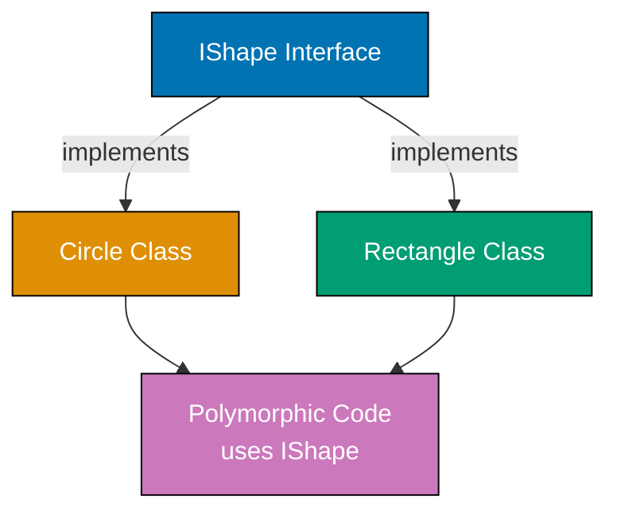
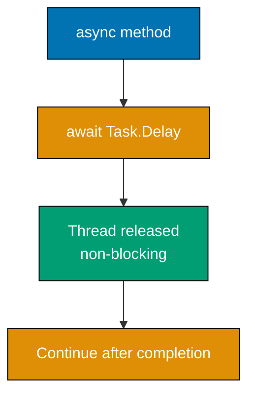
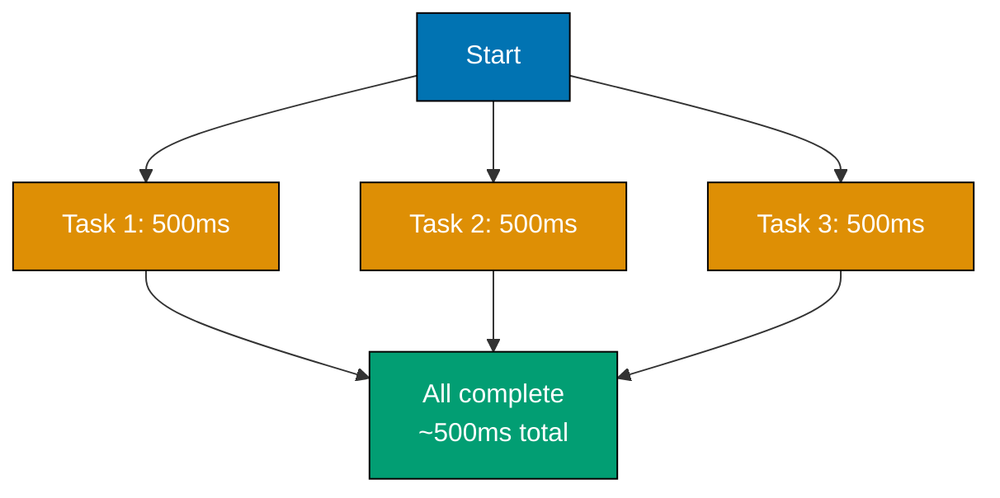
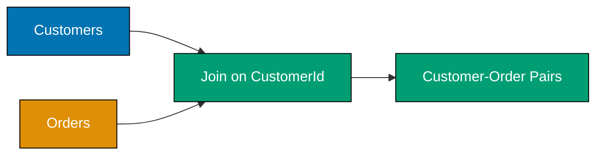
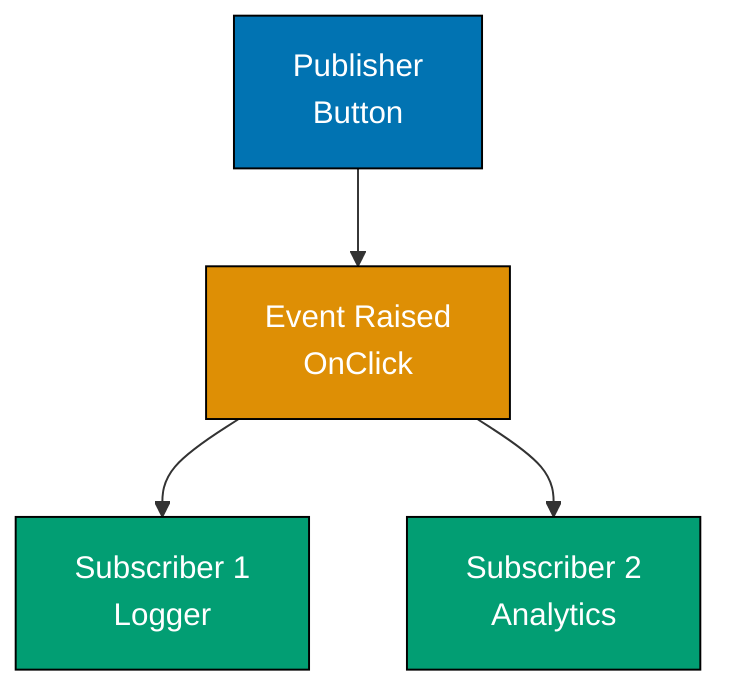
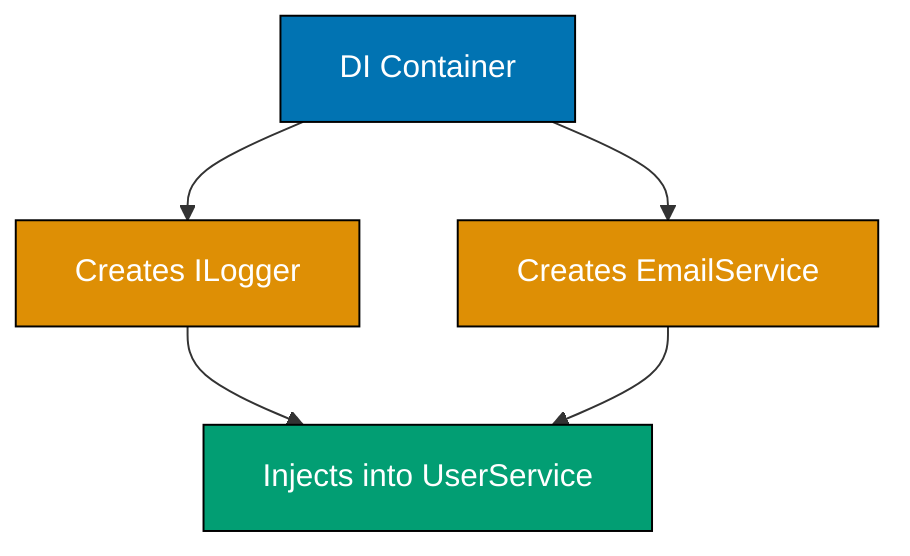

This intermediate tutorial covers C#'s production-ready patterns through 30 heavily annotated examples. Topics include interfaces, inheritance, async/await, advanced LINQ operations, generics with constraints, delegates and events, pattern matching, records, dependency injection, Entity Framework Core, and testing with xUnit.

## Example 31: Interfaces for Polymorphism

Interfaces define contracts that types must implement, enabling polymorphic behavior where different types respond to the same interface with type-specific implementations.



**Code**:

```csharp
// Example 31: Interfaces for Polymorphism
interface IShape          // => Interface defines contract
{                         // => I prefix is naming convention
                          // => Defines behavior without implementation
    double GetArea();     // => All implementers MUST provide this method
                          // => No implementation in interface (only signature)
}

class Circle : IShape     // => Circle implements IShape contract
{                         // => ":" denotes interface implementation
    private double radius;// => Private field
                          // => Encapsulation principle (hide data)
                          // => Only accessible within class

    public Circle(double r)
    {                     // => Constructor with radius parameter
                          // => r is double parameter
        radius = r;       // => Initialize radius field
                          // => radius is now equal to r
    }

    public double GetArea()
    {                     // => Required by IShape contract
                          // => Must be public (interface contract)
        return Math.PI * radius * radius;
                          // => Circle-specific calculation: πr²
                          // => Math.PI is 3.14159...
                          // => Returns area in square units
    }
}

class Rectangle : IShape  // => Rectangle also implements IShape
{                         // => Different class, same interface
    private double width, height;
                          // => Different internal structure from Circle
                          // => Two dimensions instead of radius

    public Rectangle(double w, double h)
    {                     // => Constructor with width and height
                          // => w and h are double parameters
        width = w;        // => Store dimensions
        height = h;       // => width=w, height=h
    }

    public double GetArea()
    {                     // => Required by IShape contract
                          // => Same method name as Circle
        return width * height;
                          // => Rectangle-specific: w × h
                          // => Different calculation from Circle
    }
}

IShape shape1 = new Circle(5);
                          // => Upcasting: Circle → IShape reference
                          // => shape1 stores Circle object
                          // => Type: IShape (reference), Circle (actual object)
                          // => Polymorphism enabled

IShape shape2 = new Rectangle(4, 6);
                          // => shape2 stores Rectangle object
                          // => Same reference type (IShape) as shape1
                          // => Different object type (Rectangle vs Circle)

Console.WriteLine(shape1.GetArea());
                          // => Calls Circle.GetArea() via polymorphism
                          // => Runtime determines actual method to call
                          // => Output: 78.53981633974483

Console.WriteLine(shape2.GetArea());
                          // => Calls Rectangle.GetArea()
                          // => Output: 24
                          // => Same interface, different behavior (polymorphism)
```

**Key Takeaway**: Interfaces enable polymorphism by defining contracts that multiple types can implement with their own specialized behavior.

**Why It Matters**: Interfaces are fundamental to SOLID design principles (especially Dependency Inversion). They enable testable, flexible architectures where code depends on abstractions rather than concrete implementations. Payment processing systems use interfaces to support multiple providers (Stripe, PayPal) through a single `IPaymentProcessor` interface, allowing provider switching without code changes.

## Example 32: Inheritance - Base and Derived Classes

Inheritance creates "is-a" relationships where derived classes inherit members from base classes and can override virtual methods for specialized behavior.

```csharp
// Example 32: Inheritance - Base and Derived Classes
class Animal              // => Base class (parent class)
{                         // => Defines common behavior
    public string Name { get; set; }
                          // => Auto-property
                          // => Inherited by all derived classes
                          // => All animals have Name property

    public virtual void MakeSound()
    {                     // => virtual allows overriding in derived classes
                          // => virtual keyword enables polymorphism
        Console.WriteLine("Generic animal sound");
                          // => Default implementation
                          // => Rarely called (derived classes override)
                          // => Fallback behavior
    }
}

class Dog : Animal        // => Dog inherits from Animal
{                         // => Dog IS-AN Animal (inheritance relationship)
                          // => ":" denotes inheritance
                          // => Inherits Name property and MakeSound method
    public override void MakeSound()
    {                     // => override keyword required
                          // => Replaces base implementation
                          // => Must match base method signature
        Console.WriteLine($"{Name} says: Woof!");
                          // => Dog-specific behavior
                          // => Name inherited from Animal
                          // => String interpolation with inherited property
    }
}

class Cat : Animal        // => Cat also inherits from Animal
{                         // => Sibling class to Dog (both inherit Animal)
    public override void MakeSound()
    {                     // => Cat's specialized implementation
                          // => override provides Cat-specific behavior
        Console.WriteLine($"{Name} says: Meow!");
                          // => Different from Dog
                          // => Same method name, different behavior
    }
}

Animal animal1 = new Dog { Name = "Buddy" };
                          // => Object initializer syntax
                          // => animal1 reference type: Animal
                          // => Actual object type: Dog
                          // => Upcasting (Dog → Animal)

Animal animal2 = new Cat { Name = "Whiskers" };
                          // => animal2 reference type: Animal
                          // => Actual object type: Cat
                          // => animal2.Name is "Whiskers"

animal1.MakeSound();      // => Runtime polymorphism
                          // => Calls Dog.MakeSound() (not Animal)
                          // => Output: Buddy says: Woof!

animal2.MakeSound();      // => Calls Cat.MakeSound()
                          // => Output: Whiskers says: Meow!
```

**Key Takeaway**: Use inheritance for "is-a" relationships and shared behavior. Virtual methods enable runtime polymorphism through method overriding.

**Why It Matters**: Inheritance enables code reuse and hierarchical type relationships. However, favor composition over inheritance when possible - deep inheritance hierarchies become brittle and hard to maintain. Use inheritance only when there's a clear "is-a" relationship and significant shared implementation.

## Example 33: Abstract Classes - Partial Implementations

Abstract classes combine interface contracts (abstract methods) with shared implementation (concrete methods). They cannot be instantiated directly.

```msharp
// Example 33: Abstract Classes
abstract class Shape      // => abstract prevents direct instantiation
{                         // => Can't do: new Shape()
    public abstract double GetArea();
                          // => abstract method: no implementation
                          // => Derived classes MUST implement

    public abstract double GetPerimeter();
                          // => Another required method

    public void PrintInfo()
    {                     // => Concrete method with implementation
                          // => Shared by all derived classes
        Console.WriteLine($"Area: {GetArea()}");
                          // => Calls derived class's GetArea()
        Console.WriteLine($"Perimeter: {GetPerimeter()}");
                          // => Polymorphic calls
    }
}

class Square : Shape      // => Square must implement abstract methods
{
    private double side;

    public Square(double s)
    {
        side = s;         // => Store side length
    }

    public override double GetArea()
    {                     // => Required implementation
        return side * side;
                          // => Square area: s²
    }

    public override double GetPerimeter()
    {                     // => Required implementation
        return 4 * side;  // => Square perimeter: 4s
    }
}

class Circle : Shape
{
    private double radius;

    public Circle(double r)
    {
        radius = r;
    }

    public override double GetArea()
    {
        return Math.PI * radius * radius;
                          // => Circle area: πr²
    }

    public override double GetPerimeter()
    {
        return 2 * Math.PI * radius;
                          // => Circle circumference: 2πr
    }
}

Shape shape = new Square(5);
                          // => Can't instantiate Shape directly
                          // => Must use derived class

shape.PrintInfo();        // => Calls shared PrintInfo from Shape
                          // => Output: Area: 25
                          // =>         Perimeter: 20
```

**Key Takeaway**: Abstract classes provide partial implementation - abstract methods define contracts while concrete methods provide shared functionality.

**Why It Matters**: Abstract classes are ideal when you need shared implementation plus enforced contracts. They're more flexible than interfaces (before C# 8 default interface implementations) but more rigid than pure interfaces. Use abstract classes when derived types share significant common code but need specific implementations for certain operations.

## Example 34: Async/Await - Basic Asynchronous Operations

Async/await enables non-blocking I/O operations using Task-based asynchronous programming model.



**Code**:

```csharp
// Example 34: Async/Await - Basic Asynchronous Operations
async Task<string> FetchDataAsync()
{                         // => async keyword enables await
                          // => Return type: Task<string>
                          // => Actual return: string (Task wrapped automatically)
    Console.WriteLine("Starting fetch...");
                          // => Executes synchronously

    await Task.Delay(1000);
                          // => await pauses method execution
                          // => Thread released to thread pool (non-blocking)
                          // => Resumes after 1000ms

    Console.WriteLine("Fetch completed");
                          // => Executes after await completes

    return "Data";        // => Automatically wrapped in Task<string>
}

var task = FetchDataAsync();
                          // => Method starts executing
                          // => Returns immediately with Task<string>
                          // => "Starting fetch..." already printed

Console.WriteLine("Doing other work...");
                          // => Executes while fetch is delayed
                          // => Output: Doing other work...

var result = await task;  // => await waits for task completion
                          // => result is "Data" (unwrapped from Task)
                          // => "Fetch completed" printed before this

Console.WriteLine(result);// => Output: Data
```

**Key Takeaway**: Async/await enables non-blocking asynchronous operations. `async` keyword enables `await`, and `await` pauses execution without blocking threads.

**Why It Matters**: Async/await dramatically improves scalability for I/O-bound operations. Web servers handle thousands of concurrent requests on a single thread pool instead of dedicating one thread per request. ASP.NET Core applications achieve 10-20x higher throughput by using async controllers that release threads during database/API calls.

## Example 35: Task.WhenAll - Parallel Async Operations

`Task.WhenAll` executes multiple async operations concurrently, completing when all tasks finish.



**Code**:

```csharp
// Example 35: Task.WhenAll - Parallel Async Operations
async Task<string> FetchUser(int id)
{                         // => Simulates async API call
                          // => async keyword enables await
    await Task.Delay(500);// => 500ms latency
                          // => await suspends execution
    return $"User {id}";  // => Returns user data
                          // => Type: Task<string>
}

async Task<string> FetchOrders(int userId)
{                         // => Async method for orders
    await Task.Delay(500);// => 500ms delay (simulates database query)
    return $"Orders for {userId}";
                          // => Returns orders string
}

async Task<string> FetchProfile(int userId)
{                         // => Async method for profile
    await Task.Delay(500);// => 500ms delay (simulates API call)
    return $"Profile for {userId}";
                          // => Returns profile string
}

var userTask = FetchUser(1);
                          // => Starts immediately
                          // => Returns Task<string> (not yet complete)
                          // => Does NOT await (task runs in background)

var ordersTask = FetchOrders(1);
                          // => Starts immediately (parallel to userTask)
                          // => Both tasks running concurrently

var profileTask = FetchProfile(1);
                          // => Third concurrent task

var results = await Task.WhenAll(userTask, ordersTask, profileTask);
                          // => Waits for ALL tasks to complete
                          // => Total time: ~500ms (longest task)
                          // => NOT 1500ms (sequential)
                          // => results is string[] array

Console.WriteLine(string.Join(", ", results));
                          // => Output: User 1, Orders for 1, Profile for 1
```

**Key Takeaway**: `Task.WhenAll` runs tasks concurrently and waits for all to complete. Total time equals the longest task, not the sum of all tasks.

**Why It Matters**: Parallel async operations dramatically reduce I/O-bound operation times. Dashboard pages fetch data from multiple APIs concurrently (users, orders, analytics) in 500ms instead of 1500ms sequentially. E-commerce sites load product details, reviews, and recommendations in parallel, improving page load times by 60-70%.

## Example 36: Task.WhenAny - Race Conditions

`Task.WhenAny` completes when the first task finishes, enabling timeout patterns and race conditions.

```csharp
// Example 36: Task.WhenAny - Race Conditions
async Task<string> SlowService()
{                         // => Simulates slow API
                          // => async method returns Task<string>
    await Task.Delay(3000);
                          // => 3 second delay (3000ms)
                          // => Suspends execution
    return "Slow result"; // => Rarely returned in timeout scenario
                          // => Usually loses race
}

async Task<string> FastService()
{                         // => Simulates fast API
                          // => Fast response time
    await Task.Delay(500);
                          // => 500ms delay (much faster than slow)
                          // => await suspends briefly
    return "Fast result"; // => Usually wins the race
                          // => Returns first in typical scenario
}

async Task<string> FallbackService()
{                         // => Backup service
                          // => Middle-ground response time
    await Task.Delay(1000);
                          // => 1 second delay
                          // => Slower than fast, faster than slow
    return "Fallback result";
                          // => Fallback data
}

var slowTask = SlowService();
                          // => Start all tasks concurrently
                          // => slowTask starts immediately (no await)
var fastTask = FastService();
                          // => fastTask starts immediately
                          // => All three running in parallel
var fallbackTask = FallbackService();
                          // => fallbackTask starts immediately

var completedTask = await Task.WhenAny(slowTask, fastTask, fallbackTask);
                          // => Returns immediately when FIRST task completes
                          // => completedTask is Task<string> (the winner)
                          // => Other tasks continue running in background
                          // => Usually fastTask completes first

var result = await completedTask;
                          // => Unwrap result from completed task
                          // => await extracts string from Task<string>
                          // => result is "Fast result" (fastTask won)

Console.WriteLine(result);// => Output: Fast result
                          // => Prints winner's result
```

**Key Takeaway**: `Task.WhenAny` returns when the first task completes, enabling timeout patterns and service races.

**Why It Matters**: `Task.WhenAny` enables resilience patterns. Services race primary and fallback APIs, using whichever responds first. Timeout patterns combine operations with `Task.Delay` timeouts, canceling slow operations automatically. This improves user experience by preventing indefinite waits and enabling graceful degradation.

## Example 37: File I/O - Reading and Writing Files

File I/O operations use `System.IO` classes for reading and writing text and binary data.

```csharp
// Example 37: File I/O - Reading and Writing Files
using System.IO;         // => Namespace for file operations

string path = "data.txt"; // => File path (relative to working directory)

// Writing to file
File.WriteAllText(path, "Hello, World!\nLine 2\nLine 3");
                          // => Creates or overwrites file
                          // => Writes entire string at once
                          // => Automatically closes file handle

// Reading from file
string content = File.ReadAllText(path);
                          // => Reads entire file as single string
                          // => content is "Hello, World!\nLine 2\nLine 3"

Console.WriteLine(content);
                          // => Output: Hello, World!
                          // =>         Line 2
                          // =>         Line 3

// Reading lines as array
string[] lines = File.ReadAllLines(path);
                          // => Splits file by newlines
                          // => lines is ["Hello, World!", "Line 2", "Line 3"]

foreach (var line in lines)
{                         // => Iterate through lines
    Console.WriteLine($"Line: {line}");
                          // => Output: Line: Hello, World!
                          // =>         Line: Line 2
                          // =>         Line: Line 3
}

// Appending to file
File.AppendAllText(path, "\nLine 4");
                          // => Adds text to end of file
                          // => Does NOT overwrite existing content

// Check if file exists
bool exists = File.Exists(path);
                          // => exists is true
                          // => Returns false if file doesn't exist
```

**Key Takeaway**: `File.WriteAllText`, `File.ReadAllText`, and `File.ReadAllLines` provide simple file I/O operations. Use `File.AppendAllText` for appending.

**Why It Matters**: File I/O is fundamental for data persistence, logging, and configuration. Simple methods like `File.ReadAllText` are sufficient for small files. For large files, use `StreamReader`/`StreamWriter` for memory-efficient line-by-line processing. Log aggregation systems process gigabyte-sized log files using streaming APIs that maintain constant memory usage.

## Example 38: JSON Serialization with System.Text.Json

JSON serialization converts objects to JSON strings and vice versa using `System.Text.Json`.

```csharp
// Example 38: JSON Serialization
using System.Text.Json; // => Modern JSON library (not Newtonsoft.Json)

class Person              // => Simple data class
{
    public string Name { get; set; }
                          // => Public properties are serialized
    public int Age { get; set; }
    public string Email { get; set; }
}

var person = new Person
{                         // => Object initializer
    Name = "Alice",
    Age = 30,
    Email = "alice@example.com"
};

// Serialize to JSON string
string json = JsonSerializer.Serialize(person);
                          // => Converts object to JSON string
                          // => json is {"Name":"Alice","Age":30,"Email":"alice@example.com"}

Console.WriteLine(json);  // => Output: {"Name":"Alice","Age":30,"Email":"alice@example.com"}

// Pretty-print JSON
var options = new JsonSerializerOptions { WriteIndented = true };
                          // => Formatting options
                          // => WriteIndented adds newlines and indentation

string prettyJson = JsonSerializer.Serialize(person, options);
                          // => Formatted JSON with indentation

Console.WriteLine(prettyJson);
                          // => Output: {
                          // =>   "Name": "Alice",
                          // =>   "Age": 30,
                          // =>   "Email": "alice@example.com"
                          // => }

// Deserialize from JSON
string inputJson = """{"Name":"Bob","Age":25,"Email":"bob@example.com"}""";
                          // => Raw string literal (C# 11+)

Person? deserializedPerson = JsonSerializer.Deserialize<Person>(inputJson);
                          // => Converts JSON to object
                          // => deserializedPerson.Name is "Bob"
                          // => deserializedPerson.Age is 25

Console.WriteLine($"{deserializedPerson?.Name}, {deserializedPerson?.Age}");
                          // => Output: Bob, 25
                          // => ?. is null-conditional operator
```

**Key Takeaway**: `System.Text.Json` provides high-performance JSON serialization. Use `JsonSerializer.Serialize` for objects→JSON and `JsonSerializer.Deserialize<T>` for JSON→objects.

**Why It Matters**: JSON is the dominant data interchange format for web APIs and configuration files. `System.Text.Json` is 2-5x faster than Newtonsoft.Json and is the standard library in modern .NET. RESTful APIs serialize response objects to JSON automatically in ASP.NET Core, and configuration systems load `appsettings.json` using the same serializer.

## Example 39: HTTP Client - Making API Requests

`HttpClient` enables HTTP requests to web APIs with async/await support.

```csharp
// Example 39: HTTP Client - Making API Requests
using System.Net.Http;   // => Namespace for HTTP operations
                          // => HttpClient, HttpResponseMessage classes
using System.Text.Json;  // => JSON serialization/deserialization

// Create HttpClient (reuse in production, don't create per request)
using var client = new HttpClient();
                          // => using ensures proper disposal
                          // => HttpClient should be singleton in production
                          // => Creating per request causes socket exhaustion

client.BaseAddress = new Uri("https://jsonplaceholder.typicode.com/");
                          // => Base URL for all requests
                          // => Relative paths appended to this
                          // => client.BaseAddress is Uri type

// GET request
var response = await client.GetAsync("posts/1");
                          // => Async GET to /posts/1
                          // => response contains status code, headers, body
                          // => await suspends until response received

response.EnsureSuccessStatusCode();
                          // => Throws if status code not 2xx
                          // => Validates successful response
                          // => Throws HttpRequestException on error

string responseBody = await response.Content.ReadAsStringAsync();
                          // => Reads response body as string
                          // => responseBody contains JSON
                          // => await reads HTTP content stream

Console.WriteLine(responseBody);
                          // => Output: {"userId":1,"id":1,"title":"...","body":"..."}
                          // => Prints raw JSON string

// Deserialize JSON response
class Post               // => Data model for JSON
{                         // => Properties match JSON fields
    public int UserId { get; set; }
                          // => Maps to userId JSON field
    public int Id { get; set; }
                          // => Maps to id JSON field
    public string Title { get; set; } = "";
                          // => = "" initializes to non-null
                          // => Prevents null reference warnings
    public string Body { get; set; } = "";
                          // => Maps to body JSON field
}

var post = JsonSerializer.Deserialize<Post>(responseBody);
                          // => Converts JSON to Post object
                          // => Generic type parameter: <Post>
                          // => post.Title is the post title

Console.WriteLine($"Post: {post?.Title}");
                          // => Output: Post: [post title from API]
                          // => ?. null-conditional operator (post might be null)

// POST request with JSON body
var newPost = new Post
{
    UserId = 1,
    Title = "New Post",
    Body = "Post content"
};

string jsonBody = JsonSerializer.Serialize(newPost);
                          // => Serialize object to JSON

var content = new StringContent(jsonBody, System.Text.Encoding.UTF8, "application/json");
                          // => Create HTTP content with JSON media type

var postResponse = await client.PostAsync("posts", content);
                          // => POST request to /posts
                          // => postResponse contains created resource

postResponse.EnsureSuccessStatusCode();
```

**Key Takeaway**: `HttpClient` provides async HTTP operations. Use `GetAsync` for GET requests and `PostAsync` with `StringContent` for POST with JSON bodies.

**Why It Matters**: HTTP clients are essential for microservice communication and third-party API integration. Reusing `HttpClient` instances is critical - creating new instances per request exhausts socket connections under high load. ASP.NET Core's `IHttpClientFactory` manages client lifetimes and handles transient faults with Polly integration.

## Example 40: LINQ GroupBy - Grouping Data

`GroupBy` groups elements by a key selector, returning groups with keys and elements.

```mermaid
%% Color Palette: Blue #0173B2, Orange #DE8F05, Teal #029E73
graph LR
    A[Products]:::blue --> B[GroupBy Category]:::orange
    B --> C[Electronics: [...]<br/>Books: [...]<br/>Clothing: [...]]:::teal

    style A fill:#0173B2,stroke:#000,color:#fff
    style B fill:#DE8F05,stroke:#000,color:#fff
    style C fill:#029E73,stroke:#000,color:#fff
```

**Code**:

```csharp
// Example 40: LINQ GroupBy
class Product             // => Product entity class
{                         // => Represents product data
    public string Name { get; set; } = "";
                          // => Product name property
    public string Category { get; set; } = "";
                          // => Category for grouping
    public decimal Price { get; set; }
                          // => Price as decimal (currency type)
}

var products = new List<Product>
{                         // => Collection initializer
                          // => List of Product objects
    new() { Name = "Laptop", Category = "Electronics", Price = 999.99m },
                          // => new() uses target-typed new (C# 9+)
                          // => m suffix for decimal literal
    new() { Name = "Mouse", Category = "Electronics", Price = 29.99m },
                          // => Second Electronics product
    new() { Name = "Book", Category = "Books", Price = 14.99m },
                          // => First Books product
    new() { Name = "Shirt", Category = "Clothing", Price = 39.99m },
                          // => First Clothing product
    new() { Name = "Keyboard", Category = "Electronics", Price = 79.99m },
                          // => Third Electronics product
    new() { Name = "Novel", Category = "Books", Price = 19.99m }
                          // => Second Books product
};                        // => products has 6 elements (3 categories)

var groupedByCategory = products.GroupBy(p => p.Category);
                          // => Groups products by Category property
                          // => Lambda: p => p.Category is key selector
                          // => Returns IEnumerable<IGrouping<string, Product>>
                          // => Each group has Key (category) and elements (products)

foreach (var group in groupedByCategory)
{                         // => Iterate through groups
                          // => group is IGrouping<string, Product>
    Console.WriteLine($"\nCategory: {group.Key}");
                          // => group.Key is category name (string)
                          // => Output: Category: Electronics
                          // => \n for newline before category

    foreach (var product in group)
    {                     // => Iterate through products in group
                          // => product is Product type
        Console.WriteLine($"  - {product.Name}: ${product.Price}");
                          // => Output:   - Laptop: $999.99
                          // =>           - Mouse: $29.99
                          // =>           - Keyboard: $79.99
                          // => All Electronics products
    }
}

// GroupBy with aggregate
var categoryTotals = products
    .GroupBy(p => p.Category)
                          // => Group by category
    .Select(g => new
    {                     // => Anonymous type for result
        Category = g.Key,
                          // => Extract category name
        TotalPrice = g.Sum(p => p.Price),
                          // => Sum prices within group
        Count = g.Count() // => Count products in group
    });

foreach (var ct in categoryTotals)
{
    Console.WriteLine($"{ct.Category}: {ct.Count} items, Total: ${ct.TotalPrice}");
                          // => Output: Electronics: 3 items, Total: $1109.97
                          // =>         Books: 2 items, Total: $34.98
                          // =>         Clothing: 1 items, Total: $39.99
}
```

**Key Takeaway**: `GroupBy` creates groups based on key selector. Each group has a `Key` property and contains elements matching that key.

**Why It Matters**: GroupBy is essential for categorization and aggregation scenarios. Sales reports group transactions by date/product/region to calculate daily totals. Analytics dashboards group user events by action type to compute engagement metrics. GroupBy replaces verbose manual dictionary-building code with declarative LINQ expressions.

## Example 41: LINQ Join - Combining Collections

`Join` combines elements from two collections based on matching keys, similar to SQL inner joins.



**Code**:

```csharp
// Example 41: LINQ Join
class Customer            // => Customer entity class
{                         // => Represents customer data
    public int Id { get; set; }
                          // => Primary key (unique identifier)
    public string Name { get; set; } = "";
                          // => Customer name (initialized to empty string)
}

class Order               // => Order entity class
{                         // => Represents order data
    public int OrderId { get; set; }
                          // => Primary key for order
    public int CustomerId { get; set; }
                          // => Foreign key to Customer
                          // => Links order to customer
    public decimal Amount { get; set; }
                          // => Order amount (decimal for currency)
}

var customers = new List<Customer>
{                         // => Collection initializer syntax
    new() { Id = 1, Name = "Alice" },
                          // => Target-typed new() (C# 9.0+)
                          // => Customer with Id=1
    new() { Id = 2, Name = "Bob" },
                          // => Customer with Id=2
    new() { Id = 3, Name = "Charlie" }
                          // => Customer with Id=3
};                        // => customers has 3 elements

var orders = new List<Order>
{                         // => Order collection
    new() { OrderId = 101, CustomerId = 1, Amount = 250.00m },
                          // => m suffix for decimal literal
                          // => Alice's first order (CustomerId=1)
    new() { OrderId = 102, CustomerId = 2, Amount = 175.00m },
                          // => Bob's order (CustomerId=2)
    new() { OrderId = 103, CustomerId = 1, Amount = 300.00m },
                          // => Alice (Id=1) has two orders
                          // => CustomerId=1 appears twice
    new() { OrderId = 104, CustomerId = 3, Amount = 50.00m }
                          // => Charlie's order (CustomerId=3)
};                        // => orders has 4 elements

var customerOrders = customers.Join(
                          // => Join extension method on IEnumerable
    orders,               // => Inner collection to join
                          // => Second data source
    customer => customer.Id,
                          // => Outer key selector: Customer.Id
                          // => Lambda extracts key from outer (customers)
    order => order.CustomerId,
                          // => Inner key selector: Order.CustomerId
                          // => Lambda extracts key from inner (orders)
                          // => Keys must match for join
    (customer, order) => new
    {                     // => Result selector: combines matched pairs
                          // => Creates anonymous type for each match
        CustomerName = customer.Name,
                          // => Property from customer
        OrderId = order.OrderId,
                          // => Property from order
        Amount = order.Amount
                          // => Amount from order
    }
);                        // => Returns IEnumerable of anonymous objects
                          // => Only includes customers with orders (inner join)
                          // => Unmatched customers excluded

foreach (var co in customerOrders)
{
    Console.WriteLine($"{co.CustomerName} - Order #{co.OrderId}: ${co.Amount}");
                          // => Output: Alice - Order #101: $250.00
                          // =>         Bob - Order #102: $175.00
                          // =>         Alice - Order #103: $300.00
                          // =>         Charlie - Order #104: $50.00
}
```

**Key Takeaway**: `Join` combines two collections based on matching keys using four parameters: inner collection, outer key selector, inner key selector, and result selector.

**Why It Matters**: Join operations are fundamental for relational data queries. While Entity Framework handles SQL joins, LINQ joins are essential for in-memory collections and combining data from multiple sources (database + API + cache). E-commerce platforms join product data (from database) with real-time inventory (from cache) and pricing (from pricing service) to build complete product views.

## Example 42: LINQ SelectMany - Flattening Collections

`SelectMany` projects each element to a collection and flattens the results into a single sequence.

```csharp
// Example 42: LINQ SelectMany
class School              // => School entity
{                         // => Contains collection of students
    public string Name { get; set; } = "";
                          // => School name property
    public List<Student> Students { get; set; } = new();
                          // => Each school has multiple students
                          // => One-to-many relationship
}

class Student             // => Student entity
{                         // => Represents individual student
    public string Name { get; set; } = "";
                          // => Student name property
    public int Age { get; set; }
                          // => Age property
}

var schools = new List<School>
{                         // => Collection of schools
    new()                 // => Target-typed new (C# 9.0+)
    {                     // => Object initializer
        Name = "Elementary",
                          // => First school
        Students = new List<Student>
        {                 // => Nested collection
                          // => Students in Elementary school
            new() { Name = "Alice", Age = 8 },
                          // => Student 1 in Elementary
            new() { Name = "Bob", Age = 9 }
                          // => Student 2 in Elementary
        }
    },
    new()                 // => Second school
    {
        Name = "Middle School",
                          // => Middle School
        Students = new List<Student>
        {                 // => Students in Middle School
            new() { Name = "Charlie", Age = 12 },
                          // => Student 1 in Middle School
            new() { Name = "Diana", Age = 13 }
                          // => Student 2 in Middle School
        }
    }
};                        // => schools has 2 elements, total 4 students

// Select would return List<List<Student>> (nested)
var nestedStudents = schools.Select(s => s.Students);
                          // => Returns IEnumerable<List<Student>>
                          // => Still nested structure (collection of collections)
                          // => Type: IEnumerable<List<Student>>

// SelectMany flattens to single sequence
var allStudents = schools.SelectMany(s => s.Students);
                          // => Projects each school to its students
                          // => Flattens results into single IEnumerable<Student>
                          // => allStudents contains all 4 students (not nested)
                          // => Type: IEnumerable<Student> (flat)

foreach (var student in allStudents)
{                         // => Iterate flattened collection
    Console.WriteLine($"{student.Name}, Age: {student.Age}");
                          // => Output: Alice, Age: 8
                          // =>         Bob, Age: 9
                          // =>         Charlie, Age: 12
                          // =>         Diana, Age: 13
                          // => All 4 students from both schools
}

// SelectMany with result selector
var studentsWithSchool = schools.SelectMany(
                          // => Two-parameter overload
    school => school.Students,
                          // => Collection selector
                          // => Selects Students property from each school
    (school, student) => new
    {                     // => Result selector: combines school and student
                          // => Anonymous type with 3 properties
        SchoolName = school.Name,
                          // => Property from outer (school)
        StudentName = student.Name,
                          // => Property from inner (student)
        Age = student.Age
                          // => Age from student
    }
);                        // => Returns IEnumerable of anonymous type
                          // => Each element has SchoolName, StudentName, Age

foreach (var item in studentsWithSchool)
{
    Console.WriteLine($"{item.StudentName} at {item.SchoolName}, Age: {item.Age}");
                          // => Output: Alice at Elementary, Age: 8
                          // =>         Bob at Elementary, Age: 9
                          // =>         Charlie at Middle School, Age: 12
                          // =>         Diana at Middle School, Age: 13
}
```

**Key Takeaway**: `SelectMany` flattens nested collections into a single sequence. Use the two-parameter overload to preserve parent context.

**Why It Matters**: SelectMany is essential for hierarchical data structures. Order processing systems flatten order lines across multiple orders to calculate total revenue. Analytics platforms flatten user sessions (each containing multiple events) to compute event frequencies. SelectMany replaces nested loops with declarative LINQ expressions that are more readable and optimizable.

## Example 43: Delegates - Function Pointers

Delegates are type-safe function pointers that reference methods with matching signatures.


**Code**:

```csharp
// Example 43: Delegates
delegate int MathOperation(int a, int b);
                          // => Delegate type declaration
                          // => Defines signature: (int, int) => int
                          // => Like a function pointer type in C
                          // => Type-safe method reference

int Add(int a, int b)     // => Method matching delegate signature
{                         // => Signature matches MathOperation
    return a + b;         // => Simple addition
                          // => Returns sum
}

int Multiply(int a, int b)
{                         // => Another method matching signature
    return a * b;         // => Simple multiplication
                          // => Returns product
}

MathOperation operation = Add;
                          // => Delegate instance pointing to Add method
                          // => No parentheses (reference, not invocation)
                          // => operation holds reference to Add

int result = operation(5, 3);
                          // => Invoke through delegate
                          // => Calls Add(5, 3) indirectly
                          // => result is 8

Console.WriteLine(result);// => Output: 8

operation = Multiply;     // => Reassign delegate to different method
                          // => Now points to Multiply instead of Add
                          // => Demonstrates delegate flexibility

result = operation(5, 3); // => Calls Multiply(5, 3)
                          // => Same invocation syntax, different method
                          // => result is 15

Console.WriteLine(result);// => Output: 15

// Delegate as parameter (callback pattern)
void ExecuteOperation(int x, int y, MathOperation op)
{                         // => Higher-order function
                          // => Takes delegate as parameter
    int outcome = op(x, y);
                          // => Invoke callback
    Console.WriteLine($"Result: {outcome}");
}

ExecuteOperation(10, 2, Add);
                          // => Pass Add method as callback
                          // => Output: Result: 12

ExecuteOperation(10, 2, Multiply);
                          // => Pass Multiply method
                          // => Output: Result: 20
```

**Key Takeaway**: Delegates are type-safe function pointers that can reference methods with matching signatures. They enable callbacks and higher-order functions.

**Why It Matters**: Delegates are foundational to C#'s event system and LINQ. They enable inversion of control where caller provides behavior (strategy pattern). UI frameworks use delegates for button click handlers. LINQ methods like `Where` and `Select` accept delegates (Func<T, TResult>) to customize filtering and projection logic.

## Example 44: Events - Publisher-Subscriber Pattern

Events enable the publisher-subscriber pattern where objects notify subscribers of state changes.



**Code**:

```csharp
// Example 44: Events - Publisher-Subscriber Pattern
class Button                // => Publisher (event source)
{                         // => Raises Clicked event
    public event EventHandler? Clicked;
                          // => Event declaration
                          // => EventHandler is delegate type: (object?, EventArgs) => void
                          // => ? makes event nullable (C# 8+)
                          // => Subscribers register with += operator

    public void Click()   // => Method that raises event
    {                     // => Simulates button click action
        Console.WriteLine("Button clicked");
                          // => Button's internal action
                          // => Outputs before raising event

        Clicked?.Invoke(this, EventArgs.Empty);
                          // => Raise event (notify subscribers)
                          // => ?. only invokes if Clicked not null
                          // => this is sender (Button instance)
                          // => EventArgs.Empty is empty event data
                          // => All subscribers called
    }
}

class Logger              // => Subscriber 1 (observer)
{                         // => Listens for Clicked event
    public void OnButtonClicked(object? sender, EventArgs e)
    {                     // => Event handler method
                          // => Signature matches EventHandler delegate
                          // => sender is event source (Button)
        Console.WriteLine("Logger: Button was clicked");
                          // => Subscriber's response to event
                          // => Logs the click
    }
}

class Analytics           // => Subscriber 2
{
    public void OnButtonClicked(object? sender, EventArgs e)
    {
        Console.WriteLine("Analytics: Tracking click event");
                          // => Different subscriber action
    }
}

var button = new Button();
                          // => Create publisher

var logger = new Logger();
var analytics = new Analytics();

// Subscribe to event
button.Clicked += logger.OnButtonClicked;
                          // => += adds subscriber
                          // => Registers logger handler

button.Clicked += analytics.OnButtonClicked;
                          // => Multiple subscribers allowed
                          // => Both logger and analytics will be notified

button.Click();           // => Trigger button click
                          // => Output: Button clicked
                          // =>         Logger: Button was clicked
                          // =>         Analytics: Tracking click event

// Unsubscribe
button.Clicked -= logger.OnButtonClicked;
                          // => -= removes subscriber

button.Click();           // => Only analytics notified now
                          // => Output: Button clicked
                          // =>         Analytics: Tracking click event
```

**Key Takeaway**: Events enable loose coupling between publishers and subscribers. Publishers raise events without knowing who's listening. Subscribers can register/unregister handlers using `+=` and `-=`.

**Why It Matters**: Events are central to UI frameworks (button clicks, keyboard input) and reactive systems. They enable loose coupling - UI controls don't need to know about business logic subscribers. ASP.NET Core uses events for application lifecycle (startup, shutdown). Message brokers implement publish-subscribe patterns for distributed systems where services communicate through events without direct dependencies.

## Example 45: Generics - Type Parameters

Generics enable writing reusable code that works with multiple types while maintaining type safety.

```csharp
// Example 45: Generics - Type Parameters
class Box<T>              // => Generic class with type parameter T
{                         // => T is placeholder for actual type
                          // => <T> syntax declares type parameter
    private T content;    // => Field of type T
                          // => Type determined at instantiation
                          // => T replaced with concrete type

    public Box(T item)    // => Constructor with T parameter
    {                     // => item is of type T
        content = item;   // => Store item of type T
                          // => content's type matches item's type
    }

    public T GetContent()
    {                     // => Return type is T
                          // => Method signature uses generic type
        return content;   // => Type-safe return
                          // => Returns exactly type T
    }
}

var intBox = new Box<int>(42);
                          // => T becomes int (type argument)
                          // => intBox.GetContent() returns int
                          // => content field is int

var stringBox = new Box<string>("Hello");
                          // => T becomes string
                          // => stringBox.GetContent() returns string
                          // => Different type argument, same class

Console.WriteLine(intBox.GetContent());
                          // => Output: 42
                          // => Type: int (no casting needed)
                          // => Type safety maintained

Console.WriteLine(stringBox.GetContent());
                          // => Output: Hello
                          // => Type: string

// Generic method
T GetFirst<T>(List<T> list)
{                         // => Generic method (not in generic class)
                          // => T is method-level type parameter
    return list[0];       // => Returns first element
                          // => Return type is T
}

var numbers = new List<int> { 1, 2, 3 };
var firstNumber = GetFirst(numbers);
                          // => T inferred as int
                          // => firstNumber is 1 (type: int)

var words = new List<string> { "apple", "banana" };
var firstWord = GetFirst(words);
                          // => T inferred as string
                          // => firstWord is "apple"

Console.WriteLine($"{firstNumber}, {firstWord}");
                          // => Output: 1, apple
```

**Key Takeaway**: Generics enable type-safe reusable code through type parameters. Type arguments can be specified explicitly or inferred by the compiler.

**Why It Matters**: Generics eliminate code duplication and casting while maintaining type safety. Before generics, collections used `object` requiring casts and losing compile-time type checking. Generic collections like `List<T>` provide type safety and performance (no boxing for value types). Repository patterns use `IRepository<T>` to provide CRUD operations for any entity type without code duplication.

## Example 46: Generic Constraints - Restricting Type Parameters

Generic constraints restrict type parameters to specific types or capabilities, enabling type-specific operations.

```csharp
// Example 46: Generic Constraints
interface IStorable       // => Interface for database entities
{                         // => Defines contract for storage
    int Id { get; set; }  // => All storable entities have Id
                          // => Primary key property
    void Save();          // => Save to database
                          // => Persistence method
}

class Repository<T> where T : IStorable
{                         // => where T : IStorable is constraint
                          // => T MUST implement IStorable interface
                          // => Enables calling IStorable members on T
                          // => Compile-time enforcement
    private List<T> items = new();
                          // => Internal storage
                          // => List of constrained type T

    public void Add(T item)
    {                     // => Add method accepts T
                          // => T guaranteed to implement IStorable
        items.Add(item);  // => Store item in list
                          // => items collection

        item.Save();      // => ALLOWED because T : IStorable
                          // => Compiler knows T has Save method
                          // => Constraint enables this call
    }

    public T? GetById(int id)
    {                     // => ? marks nullable return
                          // => T? allows null return
        return items.FirstOrDefault(item => item.Id == id);
                          // => ALLOWED because T : IStorable
                          // => Compiler knows T has Id property
                          // => LINQ query on items
    }
}

class Product : IStorable // => Product implements IStorable
{
    public int Id { get; set; }
    public string Name { get; set; } = "";

    public void Save()
    {
        Console.WriteLine($"Saving product {Name} to database");
                          // => Mock save operation
    }
}

var repo = new Repository<Product>();
                          // => Product satisfies IStorable constraint
                          // => Compilation succeeds

var product = new Product { Id = 1, Name = "Laptop" };

repo.Add(product);        // => Adds and saves product
                          // => Output: Saving product Laptop to database

var retrieved = repo.GetById(1);
                          // => retrieved is product with Id=1
                          // => Type: Product? (nullable)

Console.WriteLine(retrieved?.Name);
                          // => Output: Laptop

// var invalidRepo = new Repository<string>();
                          // => COMPILATION ERROR
                          // => string doesn't implement IStorable
```

**Key Takeaway**: Generic constraints use `where T : Type` syntax to restrict type parameters. Constraints enable calling methods/properties specific to the constraint type.

**Why It Matters**: Constraints balance reusability and type safety. Without constraints, generic code can only use `object` members. With constraints, generic code can call constraint-specific members while remaining reusable for all types satisfying the constraint. Entity Framework uses `where T : class` constraints for reference type requirements. Math libraries use `where T : INumber<T>` (C# 11+) to write generic numeric code.

## Example 47: Extension Methods - Adding Methods to Existing Types

Extension methods enable adding methods to existing types without modifying their source code or creating derived types.

```csharp
// Example 47: Extension Methods
static class StringExtensions
{                         // => Static class for extension methods
                          // => Must be static class
                          // => Contains extension methods
    public static bool IsValidEmail(this string email)
    {                     // => this keyword makes it extension method
                          // => Extends string type
                          // => email is the string instance
                          // => Called on string objects

        return email.Contains("@") && email.Contains(".");
                          // => Simple email validation
                          // => Real validation uses regex
                          // => Checks for @ and . characters
    }

    public static string Truncate(this string str, int maxLength)
    {                     // => Extension with additional parameter
                          // => this string str extends string
                          // => maxLength is regular parameter
        if (str.Length <= maxLength)
                          // => Check if truncation needed
                          // => Return original if short enough
            return str;   // => No truncation needed

        return str.Substring(0, maxLength) + "...";
                          // => Truncate and add ellipsis
    }
}

string email = "user@example.com";

bool isValid = email.IsValidEmail();
                          // => Calls extension method AS IF it's instance method
                          // => isValid is true

Console.WriteLine(isValid);
                          // => Output: True

string longText = "This is a very long text that needs truncation";

string truncated = longText.Truncate(20);
                          // => Calls Truncate extension method
                          // => truncated is "This is a very long ..."

Console.WriteLine(truncated);
                          // => Output: This is a very long ...

// Extension methods on null
string? nullString = null;

// bool result = nullString.IsValidEmail();
                          // => NullReferenceException
                          // => Extension methods don't protect against null

// Null-safe extension
static class SafeExtensions
{
    public static bool IsNullOrEmpty(this string? str)
    {                     // => Accepts nullable string
        return string.IsNullOrEmpty(str);
                          // => Safe to call on null
    }
}

bool isEmpty = nullString.IsNullOrEmpty();
                          // => No exception
                          // => isEmpty is true

Console.WriteLine(isEmpty);
                          // => Output: True
```

**Key Takeaway**: Extension methods use `this` keyword on first parameter to extend existing types. They appear as instance methods but are static methods.

**Why It Matters**: Extension methods enable fluent APIs and adding functionality to types you don't own (framework types, third-party libraries). LINQ is entirely built on extension methods - `Where`, `Select`, `GroupBy` are extensions on `IEnumerable<T>`. Custom extension methods improve code readability by enabling method chaining and domain-specific operations without inheritance.

## Example 48: Indexers - Array-Like Access

Indexers enable array-like access to objects using `[]` syntax, providing custom getter/setter logic.

```csharp
// Example 48: Indexers
class ShoppingCart        // => Shopping cart class
{                         // => Enables array-like access
    private Dictionary<string, int> items = new();
                          // => Internal storage: product name → quantity
                          // => Dictionary maps string keys to int values

    public int this[string productName]
    {                     // => Indexer declaration
                          // => this[string] enables cart["Apple"] syntax
                          // => Property-like syntax with parameter
        get               // => Get accessor
        {                 // => Returns quantity for product
            return items.ContainsKey(productName) ? items[productName] : 0;
                          // => Returns quantity or 0 if not in cart
                          // => Ternary operator for safe access
        }
        set
        {                 // => Set accessor
                          // => value is implicit parameter
            if (value > 0)
                items[productName] = value;
                          // => Add or update quantity
            else
                items.Remove(productName);
                          // => Remove if quantity 0 or negative
        }
    }

    public int Count => items.Count;
                          // => Number of distinct products
}

var cart = new ShoppingCart();

cart["Apple"] = 5;        // => Uses indexer setter
                          // => Adds 5 apples to cart

cart["Banana"] = 3;       // => Adds 3 bananas

Console.WriteLine(cart["Apple"]);
                          // => Uses indexer getter
                          // => Output: 5

Console.WriteLine(cart["Orange"]);
                          // => Not in cart
                          // => Output: 0 (default)

cart["Apple"] = 10;       // => Updates apple quantity
                          // => cart["Apple"] is now 10

cart["Banana"] = 0;       // => Removes banana (quantity 0)
                          // => cart.Count is now 1

Console.WriteLine(cart.Count);
                          // => Output: 1

// Multi-parameter indexer
class Matrix
{
    private int[,] data = new int[3, 3];

    public int this[int row, int col]
    {                     // => Two-parameter indexer
                          // => Enables matrix[1, 2] syntax
        get => data[row, col];
        set => data[row, col] = value;
    }
}

var matrix = new Matrix();
matrix[0, 0] = 1;         // => Set element at row 0, col 0
matrix[1, 1] = 5;

Console.WriteLine(matrix[0, 0]);
                          // => Output: 1
```

**Key Takeaway**: Indexers use `this[type param]` syntax to enable array-like access with custom logic. They can have multiple parameters for multi-dimensional access.

**Why It Matters**: Indexers make collection-like classes intuitive by providing familiar array syntax. They're essential for custom collections and data structures. JSON libraries use indexers for `json["property"]["nested"]` syntax. Entity Framework uses indexers for `entity["PropertyName"]` dynamic property access. Matrix math libraries use multi-parameter indexers for `matrix[row, col]` notation matching mathematical convention.

## Example 49: Pattern Matching - Type Patterns and Switch Expressions

Pattern matching enables concise type checking and value extraction using `is`, `switch` expressions, and patterns.

```csharp
// Example 49: Pattern Matching
object obj = "Hello";     // => obj type is object (base type)
                          // => Actual value is string
                          // => Boxing: string → object

// Type pattern with is
if (obj is string str)    // => is checks type AND extracts value
{                         // => str is new variable of type string
                          // => Pattern match + declaration
    Console.WriteLine($"String of length {str.Length}");
                          // => str is "Hello" (extracted from obj)
                          // => str.Length is 5
                          // => Output: String of length 5
}

// Switch expression with patterns
string GetDescription(object value) => value switch
{                         // => Switch expression (not statement)
                          // => Returns value directly
                          // => Expression-bodied method
    int i => $"Integer: {i}",
                          // => Type pattern for int
                          // => i captures matched int value
    string s => $"String of length {s.Length}",
                          // => Type pattern with variable
                          // => s is extracted string
    bool b => $"Boolean: {b}",
                          // => Type pattern for bool
                          // => b is extracted boolean value
    null => "Null value",
                          // => Null pattern
                          // => Matches null values
    _ => "Unknown type"   // => Discard pattern (default)
                          // => Matches anything not matched above
};                        // => Exhaustive matching recommended

Console.WriteLine(GetDescription(42));
                          // => Calls with int 42
                          // => Matches int pattern
                          // => Output: Integer: 42

Console.WriteLine(GetDescription("Test"));
                          // => Calls with string "Test"
                          // => Matches string pattern
                          // => Output: String of length 4

Console.WriteLine(GetDescription(true));
                          // => Calls with bool true
                          // => Matches bool pattern
                          // => Output: Boolean: True

Console.WriteLine(GetDescription(null));
                          // => Output: Null value

// Property patterns
class Person
{
    public string Name { get; set; } = "";
    public int Age { get; set; }
}

string GetAgeGroup(Person person) => person switch
{
    { Age: < 13 } => "Child",
                          // => Property pattern: Age < 13
    { Age: < 20 } => "Teenager",
    { Age: < 65 } => "Adult",
    { Age: >= 65 } => "Senior",
    _ => "Unknown"
};

var person1 = new Person { Name = "Alice", Age = 10 };
var person2 = new Person { Name = "Bob", Age = 30 };

Console.WriteLine(GetAgeGroup(person1));
                          // => Output: Child

Console.WriteLine(GetAgeGroup(person2));
                          // => Output: Adult

// Positional patterns with tuples
(int, int) point = (3, 4);

string GetQuadrant((int x, int y) p) => p switch
{
    (0, 0) => "Origin",   // => Exact value pattern
    ( > 0, > 0) => "Quadrant I",
                          // => Relational patterns
    ( < 0, > 0) => "Quadrant II",
    ( < 0, < 0) => "Quadrant III",
    ( > 0, < 0) => "Quadrant IV",
    (_, 0) => "X-axis",   // => Discard pattern for x
    (0, _) => "Y-axis"
};

Console.WriteLine(GetQuadrant(point));
                          // => Output: Quadrant I
```

**Key Takeaway**: Pattern matching enables concise type checking, value extraction, and condition testing. Switch expressions provide expression-based pattern matching with exhaustiveness checking.

**Why It Matters**: Pattern matching reduces boilerplate code for type testing and extraction. Traditional `if-else` chains with `is` and casting are verbose and error-prone. Switch expressions are exhaustive (compiler warns on missing patterns) and expression-based (can be used in LINQ, return statements). API handlers use pattern matching to route requests based on method/path patterns. State machines use property patterns to match complex state transitions.

## Example 50: Records - Immutable Data Types

Records are reference types designed for immutable data with value-based equality.

```csharp
// Example 50: Records
record Person(string Name, int Age);
                          // => Positional record (C# 9+)
                          // => Automatically generates:
                          // =>   - Properties: Name, Age
                          // =>   - Constructor: Person(string, int)
                          // =>   - ToString override
                          // =>   - Value-based equality

var person1 = new Person("Alice", 30);
                          // => Primary constructor
                          // => person1.Name is "Alice"
                          // => person1.Age is 30

var person2 = new Person("Alice", 30);
                          // => Different instance, same values

Console.WriteLine(person1 == person2);
                          // => Value-based equality (not reference)
                          // => Output: True
                          // => Classes use reference equality by default

Console.WriteLine(person1);
                          // => ToString auto-generated
                          // => Output: Person { Name = Alice, Age = 30 }

// Immutability - properties are init-only
// person1.Name = "Bob"; // => COMPILATION ERROR
                          // => Properties are immutable after construction

// with expression for non-destructive mutation
var person3 = person1 with { Age = 31 };
                          // => Creates new Person with Age=31
                          // => Name copied from person1
                          // => person1 unchanged (immutable)

Console.WriteLine(person1);
                          // => Output: Person { Name = Alice, Age = 30 }
Console.WriteLine(person3);
                          // => Output: Person { Name = Alice, Age = 31 }

// Record with additional members
record Employee(string Name, int Age, string Department)
{
    public decimal Salary { get; init; }
                          // => Additional init-only property
                          // => Not in primary constructor

    public string GetInfo() => $"{Name} ({Age}) - {Department}";
                          // => Custom method
}

var employee = new Employee("Bob", 25, "IT")
{
    Salary = 75000        // => Object initializer for Salary
};

Console.WriteLine(employee.GetInfo());
                          // => Output: Bob (25) - IT

Console.WriteLine(employee.Salary);
                          // => Output: 75000

// Deconstruction
var (name, age) = person1;
                          // => Deconstructs into tuple
                          // => name is "Alice", age is 30

Console.WriteLine($"{name}, {age}");
                          // => Output: Alice, 30
```

**Key Takeaway**: Records provide immutable data types with value-based equality, `with` expressions for non-destructive updates, and automatic ToString/equality implementations.

**Why It Matters**: Records reduce boilerplate for data transfer objects (DTOs) and value objects. Traditional classes require manual equality, ToString, and immutability implementations. Records provide these automatically with concise syntax. API models use records for request/response DTOs with guaranteed immutability. Domain-driven design uses records for value objects like Money, Address, where equality is based on values, not identity.

## Example 51: Init-Only Properties - Object Initializer Immutability

Init-only properties allow property assignment during object initialization but are immutable afterward.

```csharp
// Example 51: Init-Only Properties
class Product
{
    public string Name { get; init; }
                          // => init accessor (C# 9+)
                          // => Can set during initialization
                          // => Immutable after construction

    public decimal Price { get; init; }
    public string Category { get; init; }

    // Constructor not required for init properties
}

var product = new Product
{                         // => Object initializer
    Name = "Laptop",      // => ALLOWED during initialization
    Price = 999.99m,
    Category = "Electronics"
};

Console.WriteLine($"{product.Name}: ${product.Price}");
                          // => Output: Laptop: $999.99

// product.Price = 899.99m;
                          // => COMPILATION ERROR
                          // => init properties are read-only after initialization

// With constructor
class Person
{
    public string FirstName { get; init; }
    public string LastName { get; init; }

    public Person(string firstName, string lastName)
    {                     // => Constructor can set init properties
        FirstName = firstName;
        LastName = lastName;
    }

    public string FullName => $"{FirstName} {LastName}";
                          // => Computed property
}

var person1 = new Person("Alice", "Smith");
                          // => Via constructor

var person2 = new Person("Bob", "Jones")
{
    FirstName = "Robert"  // => Override constructor value
};                        // => ALLOWED during initialization

Console.WriteLine(person1.FullName);
                          // => Output: Alice Smith

Console.WriteLine(person2.FullName);
                          // => Output: Robert Jones

// Init with required (C# 11+)
class User
{
    public required string Username { get; init; }
                          // => required keyword
                          // => MUST be set during initialization

    public string? Email { get; init; }
                          // => Optional init property
}

var user = new User
{
    Username = "alice123" // => Required, must provide
};

// var invalidUser = new User { };
                          // => COMPILATION ERROR
                          // => Username not set (required)
```

**Key Takeaway**: Init-only properties enable immutability while supporting flexible object initialization patterns. Combined with `required`, they enforce mandatory properties at compile time.

**Why It Matters**: Init properties provide immutability benefits without sacrificing initialization flexibility. Traditional readonly fields require constructor parameters, leading to long parameter lists. Init properties support object initializers with named parameters, improving readability. Configuration objects use init properties for immutable settings that are set once at startup.

## Example 52: Tuples - Lightweight Data Structures

Tuples provide lightweight, unnamed data structures for returning multiple values or grouping data temporarily.

```csharp
// Example 52: Tuples
(string, int) GetPersonInfo()
{                         // => Return tuple: (string, int)
                          // => No need to define separate class
    return ("Alice", 30); // => Tuple literal
}

var info = GetPersonInfo();
                          // => info type is (string, int)

Console.WriteLine($"{info.Item1}, {info.Item2}");
                          // => Item1, Item2 are default names
                          // => Output: Alice, 30

// Named tuple elements
(string Name, int Age) GetNamedPersonInfo()
{                         // => Named tuple elements
    return (Name: "Bob", Age: 25);
                          // => Names improve readability
}

var namedInfo = GetNamedPersonInfo();
                          // => Access via names

Console.WriteLine($"{namedInfo.Name}, {namedInfo.Age}");
                          // => Output: Bob, 25

// Tuple deconstruction
var (name, age) = GetNamedPersonInfo();
                          // => Deconstruct into separate variables
                          // => name is "Bob", age is 25

Console.WriteLine($"Name: {name}, Age: {age}");
                          // => Output: Name: Bob, Age: 25

// Discard unwanted elements
var (personName, _) = GetNamedPersonInfo();
                          // => _ discards age
                          // => Only captures name

Console.WriteLine(personName);
                          // => Output: Bob

// Tuples in LINQ
var products = new List<(string Name, decimal Price)>
{                         // => List of tuples
    ("Laptop", 999.99m),
    ("Mouse", 29.99m),
    ("Keyboard", 79.99m)
};

var expensiveProducts = products
    .Where(p => p.Price > 50)
                          // => Filter by Price
    .Select(p => p.Name);
                          // => Project to Name

foreach (var product in expensiveProducts)
{
    Console.WriteLine(product);
                          // => Output: Laptop
                          // =>         Keyboard
}

// Tuple equality
var tuple1 = (1, "Test");
var tuple2 = (1, "Test");

Console.WriteLine(tuple1 == tuple2);
                          // => Value-based equality
                          // => Output: True
```

**Key Takeaway**: Tuples provide lightweight data structures with optional named elements. Use deconstruction to extract values into separate variables.

**Why It Matters**: Tuples eliminate the need for throwaway classes when returning multiple values or grouping temporary data. They're ideal for internal method returns, LINQ projections, and dictionary keys. Database access code returns `(bool success, T result)` tuples instead of defining result wrapper classes. However, use records or classes for public APIs and complex data structures where named types improve clarity.

## Example 53: IEnumerable<T> and Deferred Execution

`IEnumerable<T>` enables LINQ queries with deferred execution - queries execute only when enumerated.

```csharp
// Example 53: IEnumerable<T> and Deferred Execution
List<int> numbers = new() { 1, 2, 3, 4, 5 };

Console.WriteLine("Creating query...");

IEnumerable<int> query = numbers.Where(n =>
{                         // => LINQ query
    Console.WriteLine($"Filtering {n}");
                          // => Side effect to show execution timing
    return n % 2 == 0;    // => Filter even numbers
});                       // => Query NOT executed yet (deferred)
                          // => No "Filtering X" printed

Console.WriteLine("Query created (not executed)");
                          // => Output: Creating query...
                          // =>         Query created (not executed)
                          // => No filtering happened yet

Console.WriteLine("\nFirst enumeration:");
foreach (var n in query)  // => Query executes NOW
{                         // => "Filtering X" messages appear
    Console.WriteLine($"Result: {n}");
                          // => Output: Filtering 1
                          // =>         Filtering 2
                          // =>         Result: 2
                          // =>         Filtering 3
                          // =>         Filtering 4
                          // =>         Result: 4
                          // =>         Filtering 5
}

Console.WriteLine("\nSecond enumeration:");
foreach (var n in query)  // => Query EXECUTES AGAIN
{                         // => Deferred execution means re-evaluation
    Console.WriteLine($"Result: {n}");
                          // => "Filtering X" messages repeat
}

// Forcing immediate execution
Console.WriteLine("\n\nWith ToList:");
var list = numbers.Where(n =>
{
    Console.WriteLine($"Filtering {n}");
    return n % 2 == 0;
}).ToList();              // => ToList forces immediate execution
                          // => "Filtering X" messages print NOW
                          // => list is List<int>, not IEnumerable<int>

Console.WriteLine("ToList completed");

foreach (var n in list)   // => Iterates cached results
{                         // => No filtering happens (already executed)
    Console.WriteLine($"Result: {n}");
                          // => Output: Result: 2
                          // =>         Result: 4
}
```

**Key Takeaway**: `IEnumerable<T>` queries use deferred execution - they execute when enumerated, not when created. Use `ToList()` or `ToArray()` to force immediate execution.

**Why It Matters**: Deferred execution enables composable queries and efficient data processing. Queries can be built incrementally and only execute when needed. However, deferred execution can cause unexpected behavior - queries re-execute on each enumeration and capture variable values at execution time (not creation time). Use `ToList()` when you need to cache results or when the source data may change between enumerations.

## Example 54: Dependency Injection - Constructor Injection

Dependency injection inverts control by having dependencies provided to classes rather than classes creating dependencies.



**Code**:

```csharp
// Example 54: Dependency Injection
interface ILogger         // => Abstraction for logging
{                         // => Interface defines contract
    void Log(string message);
                          // => Single method signature
}

class ConsoleLogger : ILogger
{                         // => Concrete implementation of ILogger
                          // => Implements interface contract
    public void Log(string message)
    {                     // => Method implementation
        Console.WriteLine($"[LOG] {message}");
                          // => Writes to console with [LOG] prefix
    }
}

interface IEmailService   // => Abstraction for email
{                         // => Separates contract from implementation
    void SendEmail(string to, string subject);
                          // => Email sending method signature
}

class EmailService : IEmailService
{                         // => Email service implementation
    private readonly ILogger logger;
                          // => Dependency on ILogger
                          // => readonly ensures immutability after construction

    public EmailService(ILogger logger)
    {                     // => Constructor injection
                          // => EmailService doesn't create logger
                          // => Receives logger from outside (inversion of control)
                          // => Enables testing with mock logger
        this.logger = logger;
                          // => Store injected dependency
    }

    public void SendEmail(string to, string subject)
    {                     // => Email sending method
        logger.Log($"Sending email to {to}: {subject}");
                          // => Uses injected logger
                          // => Logs email operation
    }
}

class UserService         // => High-level service class
{                         // => Depends on abstractions (ILogger, IEmailService)
    private readonly ILogger logger;
                          // => Logging dependency
    private readonly IEmailService emailService;
                          // => Two dependencies
                          // => Email service dependency

    public UserService(ILogger logger, IEmailService emailService)
    {                     // => Constructor injection for both dependencies
                          // => DI container provides implementations
        this.logger = logger;
                          // => Store logger dependency
        this.emailService = emailService;
                          // => Store email service dependency
    }

    public void RegisterUser(string email)
    {                     // => User registration method
        logger.Log($"Registering user: {email}");
                          // => Uses injected dependencies
                          // => Logs registration action

        emailService.SendEmail(email, "Welcome!");
                          // => Sends welcome email via injected service
    }
}

// Manual composition (DI container does this in real apps)
ILogger logger = new ConsoleLogger();
                          // => Create logger once

IEmailService emailService = new EmailService(logger);
                          // => Inject logger into email service

UserService userService = new UserService(logger, emailService);
                          // => Inject both dependencies

userService.RegisterUser("alice@example.com");
                          // => Output: [LOG] Registering user: alice@example.com
                          // =>         [LOG] Sending email to alice@example.com: Welcome!
```

**Key Takeaway**: Dependency injection provides dependencies through constructors, inverting control from classes creating their dependencies to dependencies being provided externally.

**Why It Matters**: DI enables loose coupling, testability, and flexibility. Classes depend on abstractions (interfaces) rather than concrete implementations. Tests inject mock dependencies to isolate behavior. ASP.NET Core's built-in DI container manages service lifetimes (singleton, scoped, transient) and resolves dependency graphs automatically. This eliminates manual object construction and enables centralized configuration.

## Example 55: Configuration - Reading App Settings

Configuration systems load settings from JSON files, environment variables, and other sources.

```csharp
// Example 55: Configuration (Conceptual)
// In real ASP.NET Core, configuration is injected
                          // => IConfiguration provided by DI container

// appsettings.json:
// {
//   "AppSettings": {
//     "AppName": "MyApp",
//     "MaxConnections": 100
//   },
//   "ConnectionStrings": {
//     "Database": "Server=localhost;Database=MyDb"
//   }
// }
                          // => JSON configuration file
                          // => Hierarchical structure with sections

class AppSettings           // => Configuration class
{                           // => Maps to AppSettings section in JSON
    public string AppName { get; set; } = "";
                          // => Default value: empty string
                          // => Initialized from JSON
    public int MaxConnections { get; set; }
                          // => Property type: int
                          // => Loaded from configuration
}

// Simulated configuration (real code uses IConfiguration)
var settings = new AppSettings
{
    AppName = "MyApp",    // => Would be loaded from appsettings.json
                          // => Real: ConfigurationBinder.Bind()
    MaxConnections = 100
                          // => Integer value from config
};                        // => settings is AppSettings instance

Console.WriteLine($"App: {settings.AppName}");
                          // => Accesses AppName property
                          // => Output: App: MyApp

Console.WriteLine($"Max Connections: {settings.MaxConnections}");
                          // => Accesses MaxConnections property
                          // => Output: Max Connections: 100

// Options pattern with dependency injection
interface IAppConfig
{                         // => Abstraction for configuration
    string GetAppName();
                          // => Returns app name string
    int GetMaxConnections();
                          // => Returns max connections int
}

class AppConfig : IAppConfig
{                         // => Concrete implementation
    private readonly AppSettings settings;
                          // => Immutable dependency
                          // => Stored in private field

    public AppConfig(AppSettings settings)
    {                     // => Constructor injection of settings
                          // => Dependency provided by caller
        this.settings = settings;
                          // => Assigns to field
                          // => this.settings references the field
    }

    public string GetAppName() => settings.AppName;
                          // => Expression-bodied member
                          // => Returns settings.AppName
    public int GetMaxConnections() => settings.MaxConnections;
                          // => Returns settings.MaxConnections
}

var config = new AppConfig(settings);
                          // => Creates AppConfig instance
                          // => Passes settings to constructor
                          // => config is IAppConfig (via AppConfig)

Console.WriteLine($"Configured app: {config.GetAppName()}");
                          // => Calls GetAppName() method
                          // => Output: Configured app: MyApp

// Environment-specific configuration
// Development: appsettings.Development.json overrides appsettings.json
                          // => Environment-specific values
                          // => Merged at runtime
// Production: appsettings.Production.json overrides
                          // => Production overrides base settings
// Environment variables override all file-based settings
                          // => Highest precedence
                          // => ENV vars > JSON files
```

**Key Takeaway**: Configuration is loaded from multiple sources (JSON files, environment variables) with precedence rules. Use strongly-typed configuration classes with dependency injection.

**Why It Matters**: Configuration systems enable environment-specific settings without code changes. Development uses local database, production uses cloud database - same code, different configuration. ASP.NET Core's configuration system supports hierarchical JSON, environment variables, command-line args, and Azure Key Vault with automatic reload on change. Twelve-factor apps store configuration in environment variables to separate config from code.

## Example 56: ASP.NET Core - Minimal API

Minimal APIs provide lightweight HTTP endpoints with minimal ceremony.

```csharp
// Example 56: ASP.NET Core Minimal API (Conceptual)
// Real code uses Microsoft.AspNetCore.Builder

// Simulated minimal API structure
class WebApp
{
    public void MapGet(string route, Func<string> handler)
    {                     // => Register GET endpoint
        Console.WriteLine($"GET {route} registered");
    }

    public void MapPost(string route, Func<object, string> handler)
    {                     // => Register POST endpoint
        Console.WriteLine($"POST {route} registered");
    }

    public void Run()
    {
        Console.WriteLine("App running...");
    }
}

var app = new WebApp();

// GET endpoint
app.MapGet("/hello", () =>
{                         // => Lambda handler
    return "Hello, World!";
                          // => Returns plain text response
});                       // => Real API: returns IResult

// GET with route parameter
app.MapGet("/users/{id}", (int id) =>
{                         // => Route parameter binds to id
    return $"User {id}";  // => Returns: User 42 (for /users/42)
});

// POST endpoint with body
app.MapPost("/users", (UserDto user) =>
{                         // => user automatically deserialized from JSON body
    return $"Created user: {user.Name}";
});

record UserDto(string Name, string Email);
                          // => DTO for request body

app.Run();                // => Start server
                          // => Output: GET /hello registered
                          // =>         GET /users/{id} registered
                          // =>         POST /users registered
                          // =>         App running...
```

**Key Takeaway**: Minimal APIs use lambda handlers for HTTP endpoints with automatic parameter binding and JSON serialization.

**Why It Matters**: Minimal APIs reduce boilerplate for simple APIs compared to controller-based APIs. They're ideal for microservices and lightweight APIs where full MVC features aren't needed. Modern .NET applications favor minimal APIs for performance and simplicity while controllers remain available for complex scenarios with filters, model validation, and view rendering.

## Example 57: Entity Framework Core - Basic CRUD

Entity Framework Core is an ORM that maps C# classes to database tables.

```csharp
// Example 57: Entity Framework Core (Conceptual)
// Real code uses Microsoft.EntityFrameworkCore

class Product             // => Entity class
{
    public int Id { get; set; }
                          // => Primary key (convention: Id or ProductId)
    public string Name { get; set; } = "";
    public decimal Price { get; set; }
}

// DbContext - database session
class AppDbContext
{                         // => Real: inherits DbContext
    public List<Product> Products { get; set; } = new();
                          // => Simulates DbSet<Product>
                          // => Real: represents Products table

    public void Add(Product product)
    {                     // => Add entity (INSERT)
        Products.Add(product);
        Console.WriteLine($"Added: {product.Name}");
    }

    public void SaveChanges()
    {                     // => Commit changes to database
        Console.WriteLine("Changes saved to database");
    }

    public Product? Find(int id)
    {                     // => Find by primary key (SELECT)
        return Products.FirstOrDefault(p => p.Id == id);
    }

    public void Remove(Product product)
    {                     // => Delete entity (DELETE)
        Products.Remove(product);
        Console.WriteLine($"Removed: {product.Name}");
    }
}

var context = new AppDbContext();

// Create (INSERT)
var product = new Product
{
    Id = 1,
    Name = "Laptop",
    Price = 999.99m
};

context.Add(product);     // => Track for insertion
context.SaveChanges();    // => Execute INSERT
                          // => Output: Added: Laptop
                          // =>         Changes saved to database

// Read (SELECT)
var retrieved = context.Find(1);
                          // => Finds product with Id=1

Console.WriteLine($"{retrieved?.Name}: ${retrieved?.Price}");
                          // => Output: Laptop: $999.99

// Update
if (retrieved != null)
{
    retrieved.Price = 899.99m;
                          // => Modify tracked entity
    context.SaveChanges();
                          // => Execute UPDATE
}

// Delete (DELETE)
if (retrieved != null)
{
    context.Remove(retrieved);
    context.SaveChanges();
                          // => Execute DELETE
                          // => Output: Removed: Laptop
                          // =>         Changes saved to database
}

// LINQ queries
var expensiveProducts = context.Products
    .Where(p => p.Price > 500)
                          // => Translated to SQL WHERE clause
    .ToList();            // => Execute query
```

**Key Takeaway**: Entity Framework Core maps classes to database tables with CRUD operations through `DbContext`. LINQ queries are translated to SQL.

**Why It Matters**: ORMs eliminate manual SQL writing and mapping for standard CRUD operations. EF Core handles SQL generation, parameter binding, and object materialization. Change tracking detects modifications automatically. However, ORMs can generate inefficient queries for complex scenarios - use raw SQL for performance-critical queries. Always profile database queries in production to catch N+1 problems and missing indexes.

## Example 58: Testing with xUnit - Unit Tests

xUnit is a testing framework for writing unit tests with facts, theories, and assertions.

```csharp
// Example 58: Testing with xUnit (Conceptual)
// Real code uses Xunit namespace
                          // => This is a simplified demonstration

class Calculator         // => System under test (SUT)
{                         // => Production code being tested
    public int Add(int a, int b) => a + b;
                          // => Expression-bodied method
                          // => Returns sum of a and b
    public int Divide(int a, int b)
    {                     // => Division method with validation
        if (b == 0)       // => Guard clause for divide-by-zero
            throw new DivideByZeroException();
                          // => Throws exception if divisor is zero
        return a / b;     // => Returns quotient
    }
}

// Test class
class CalculatorTests    // => Test class contains test methods
{                         // => Convention: NameTests suffix
    // [Fact] attribute marks test method
    public void Add_TwoPositiveNumbers_ReturnsSum()
    {                     // => Test naming: Method_Scenario_ExpectedResult
                          // => [Fact] attribute in real xUnit marks as test
        // Arrange
        var calculator = new Calculator();
                          // => Create system under test
                          // => Arrange phase: set up test dependencies
        int a = 5, b = 3; // => Test inputs
                          // => a is 5, b is 3

        // Act
        int result = calculator.Add(a, b);
                          // => Execute method under test
                          // => Act phase: perform action being tested
                          // => result is 8 (5 + 3)

        // Assert
        Assert.Equal(8, result);
                          // => Verify expected result
                          // => Test passes if equal
                          // => Assert phase: verify outcome
    }

    public void Divide_ByZero_ThrowsException()
    {                     // => Test exception throwing behavior
        // Arrange
        var calculator = new Calculator();
                          // => Set up calculator instance

        // Act & Assert
        Assert.Throws<DivideByZeroException>(() =>
        {                 // => Lambda expression for action
            calculator.Divide(10, 0);
                          // => Attempt division by zero
                          // => Should throw DivideByZeroException
        });               // => Verify exception thrown
                          // => Test passes if exception thrown
                          // => Generic constraint ensures correct exception type
    }

    // [Theory] with [InlineData] for parameterized tests
    public void Add_VariousInputs_ReturnsCorrectSum(int a, int b, int expected)
    {                     // => Theory runs multiple times with different data
                          // => Parameterized test method
                          // => [Theory] attribute in real xUnit
        // Arrange
        var calculator = new Calculator();
                          // => Fresh instance per test case

        // Act
        int result = calculator.Add(a, b);
                          // => Execute with provided parameters
                          // => result varies by test case

        // Assert
        Assert.Equal(expected, result);
                          // => Verify result matches expected
                          // => expected provided by test case
    }

    // Simulated InlineData (real xUnit uses attributes)
    public void RunTheoryTests()
    {                     // => Simulates running theory with multiple data sets
                          // => Real xUnit uses [InlineData] attributes
        Add_VariousInputs_ReturnsCorrectSum(1, 1, 2);
                          // => Test case 1: 1 + 1 = 2
        Add_VariousInputs_ReturnsCorrectSum(5, 3, 8);
                          // => Test case 2: 5 + 3 = 8
        Add_VariousInputs_ReturnsCorrectSum(-1, 1, 0);
                          // => Test case 3: negative numbers (-1 + 1 = 0)
        Add_VariousInputs_ReturnsCorrectSum(0, 0, 0);
                          // => Test case 4: zero handling (0 + 0 = 0)
    }
}

// Simulated assertion helpers
static class Assert      // => Test assertion library
{                         // => Real xUnit provides these
    public static void Equal<T>(T expected, T actual)
    {                     // => Generic equality assertion
                          // => T is type parameter
        if (!Equals(expected, actual))
                          // => Compare expected vs actual
            throw new Exception($"Expected {expected}, got {actual}");
                          // => Fail test with message
        Console.WriteLine($"✓ Test passed: {expected} == {actual}");
                          // => Success output
    }

    public static void Throws<T>(Action action) where T : Exception
    {                     // => Exception assertion
                          // => Generic constraint: T must be Exception
        try               // => Try to execute action
        {
            action();     // => Invoke the action delegate
                          // => Should throw exception
            throw new Exception($"Expected {typeof(T).Name} but no exception thrown");
                          // => Fail if no exception
        }
        catch (T)         // => Catch expected exception type
        {                 // => Correct exception type
                          // => Test passes
            Console.WriteLine($"✓ Test passed: {typeof(T).Name} thrown");
                          // => Success message with exception type name
        }
    }
}

var tests = new CalculatorTests();

tests.Add_TwoPositiveNumbers_ReturnsSum();
                          // => Output: ✓ Test passed: 8 == 8

tests.Divide_ByZero_ThrowsException();
                          // => Output: ✓ Test passed: DivideByZeroException thrown

tests.RunTheoryTests();   // => Runs all theory test cases
```

**Key Takeaway**: xUnit uses `[Fact]` for simple tests and `[Theory]` with `[InlineData]` for parameterized tests. Follow Arrange-Act-Assert pattern.

**Why It Matters**: Unit tests verify code behavior and catch regressions during refactoring. They document expected behavior through executable examples. Test-driven development (TDD) writes tests before implementation, driving design toward testable, loosely coupled code. CI/CD pipelines run tests automatically on every commit, preventing broken code from reaching production. High test coverage reduces debugging time and increases confidence when making changes.

## Example 59: Nullable Reference Types - Null Safety

Nullable reference types enable compile-time null checking to prevent `NullReferenceException`.

```csharp
// Example 59: Nullable Reference Types
// Enable with: #nullable enable or <Nullable>enable</Nullable> in .csproj

#nullable enable           // => Enable nullable context

string nonNullable = "Hello";
                          // => string is non-nullable by default (C# 8+)
                          // => Cannot be null

// nonNullable = null;    // => COMPILER WARNING
                          // => Converting null literal to non-nullable type

string? nullable = null;  // => ? makes string nullable
                          // => Explicitly allows null

Console.WriteLine(nullable?.Length);
                          // => ?. null-conditional operator
                          // => Returns null if nullable is null
                          // => Output: (nothing - null has no output)

nullable = "World";
Console.WriteLine(nullable?.Length);
                          // => Output: 5

// Null-coalescing operator
string result = nullable ?? "Default";
                          // => ?? returns left if not null, else right
                          // => result is "World"

Console.WriteLine(result);// => Output: World

nullable = null;
result = nullable ?? "Default";
                          // => result is "Default" (nullable is null)

Console.WriteLine(result);// => Output: Default

// Null-coalescing assignment
nullable ??= "Assigned";  // => ??= assigns if null
                          // => nullable is now "Assigned"

Console.WriteLine(nullable);
                          // => Output: Assigned

// Null-forgiving operator
string? maybeNull = GetString();

// int length = maybeNull.Length;
                          // => COMPILER WARNING
                          // => Possible null reference

int length = maybeNull!.Length;
                          // => ! suppresses warning
                          // => "I know it's not null"
                          // => Runtime exception if actually null

string? GetString() => "Value";
                          // => Returns nullable string

// Method parameters
void ProcessString(string required, string? optional)
{                         // => required cannot be null
                          // => optional can be null
    Console.WriteLine(required.Length);
                          // => Safe - required is non-nullable

    // Console.WriteLine(optional.Length);
                          // => COMPILER WARNING
                          // => optional might be null

    if (optional != null)
    {                     // => Null check
        Console.WriteLine(optional.Length);
                          // => Safe within if block (flow analysis)
    }
}

ProcessString("Required", null);
                          // => Valid - optional is nullable
```

**Key Takeaway**: Nullable reference types add compile-time null safety. Use `?` for nullable, `?.` for null-conditional access, `??` for null-coalescing, and `!` for null-forgiving.

**Why It Matters**: Nullable reference types catch null reference errors at compile time instead of runtime. They document nullability contracts in APIs - callers know which parameters can be null and which return values need null checks. Enabling nullable context in existing codebases reveals hidden null-related bugs before they cause production crashes. However, nullable annotations are compiler hints - runtime null checks are still necessary when null state is unknown (user input, deserialization).

## Example 60: LINQ Aggregate Operations - Custom Aggregations

Aggregate operations reduce collections to single values using custom accumulation logic.

```csharp
// Example 60: LINQ Aggregate Operations
var numbers = new List<int> { 1, 2, 3, 4, 5 };

// Sum with Aggregate
int sum = numbers.Aggregate(0, (accumulator, current) =>
{                         // => Aggregate(seed, func)
                          // => seed is initial accumulator value (0)
                          // => func: (accumulator, current) => new accumulator
    return accumulator + current;
                          // => Iteration 1: 0 + 1 = 1
                          // => Iteration 2: 1 + 2 = 3
                          // => Iteration 3: 3 + 3 = 6
                          // => Iteration 4: 6 + 4 = 10
                          // => Iteration 5: 10 + 5 = 15
});

Console.WriteLine(sum);   // => Output: 15

// Product
int product = numbers.Aggregate(1, (acc, current) => acc * current);
                          // => 1 * 1 * 2 * 3 * 4 * 5 = 120

Console.WriteLine(product);
                          // => Output: 120

// String concatenation
var words = new List<string> { "Hello", "World", "From", "C#" };

string sentence = words.Aggregate("", (acc, word) =>
{                         // => Build string progressively
    return acc == "" ? word : $"{acc} {word}";
                          // => First word: no space
                          // => Subsequent words: add space
});

Console.WriteLine(sentence);
                          // => Output: Hello World From C#

// Complex aggregation - building object
var products = new List<(string Name, decimal Price)>
{
    ("Laptop", 999.99m),
    ("Mouse", 29.99m),
    ("Keyboard", 79.99m)
};

var summary = products.Aggregate(
    new { TotalPrice = 0m, Count = 0, Names = new List<string>() },
                          // => Seed: anonymous object with accumulation state
    (acc, product) => new
    {                     // => Return new anonymous object each iteration
        TotalPrice = acc.TotalPrice + product.Price,
                          // => Accumulate total price
        Count = acc.Count + 1,
                          // => Count products
        Names = acc.Names.Append(product.Name).ToList()
                          // => Collect product names
    }
);

Console.WriteLine($"Count: {summary.Count}");
                          // => Output: Count: 3

Console.WriteLine($"Total: ${summary.TotalPrice}");
                          // => Output: Total: $1109.97

Console.WriteLine($"Products: {string.Join(", ", summary.Names)}");
                          // => Output: Products: Laptop, Mouse, Keyboard

// Aggregate with result selector (3-parameter overload)
decimal average = numbers.Aggregate(
    0,                    // => Seed
    (acc, n) => acc + n,  // => Accumulator function (sum)
    result => (decimal)result / numbers.Count
);                        // => Result selector (transform final accumulator)
                          // => Converts sum to average

Console.WriteLine(average);
                          // => Output: 3
```

**Key Takeaway**: `Aggregate` reduces collections using custom accumulation logic. Three overloads: aggregate without seed, with seed, and with seed plus result selector.

**Why It Matters**: Aggregate enables complex custom reductions beyond built-in methods like `Sum` and `Count`. Financial calculations aggregate transactions to compute running balances. Data processing pipelines aggregate events to compute statistics. However, aggregate can be harder to understand than explicit loops - prefer built-in methods (`Sum`, `Count`, `Max`) when available and use `Aggregate` only for custom logic that doesn't fit standard patterns.
