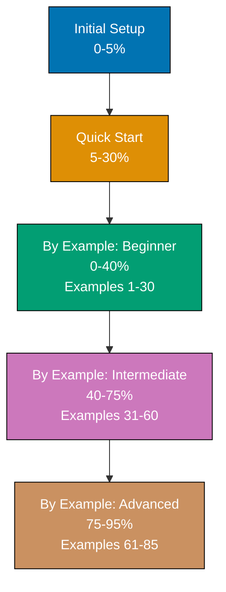

**Learn C# by reading code.** This by-example tutorial teaches C# through 85 heavily annotated, self-contained code examples achieving 95% language coverage. If you're an experienced programmer who prefers learning by reading working code rather than narrative explanations, this is your path.

## What is By Example?

By Example is a **code-first learning approach** designed for experienced developers switching to C# from other languages. Instead of lengthy explanations followed by code snippets, you'll see complete, runnable programs with inline annotations explaining what each line does and why it matters.

**Target audience**: Seasonal programmers, software engineers, and developers with experience in Python, Java, JavaScript, or other languages who want to learn C# efficiently.

## How This Tutorial Works

### Structure

- **[Beginner](/en/learn/software-engineering/programming-languages/c-sharp/by-example/beginner)** (Examples 1-30): Fundamentals and core syntax - 0-40% coverage
- **[Intermediate](/en/learn/software-engineering/programming-languages/c-sharp/by-example/intermediate)** (Examples 31-60): Production patterns and framework features - 40-75% coverage
- **[Advanced](/en/learn/software-engineering/programming-languages/c-sharp/by-example/advanced)** (Examples 61-85): Expert mastery and optimization - 75-95% coverage

### Example Format

Each example follows a five-part structure:

1. **Brief explanation** (2-3 sentences) - What is this concept and why does it matter?
2. **Diagram** (when appropriate) - Visual representation of flow, state, or architecture
3. **Heavily annotated code** - Complete, runnable program with inline `// =>` annotations
4. **Key takeaway** (1-2 sentences) - The essential insight distilled
5. **Why it matters** (50-100 words) - Production relevance and real-world impact

### Example: Annotation Style

```csharp
var numbers = new List<int> { 1, 2, 3, 4, 5 };  // => numbers is List<int> with 5 elements
                                                // => List is mutable, dynamic-sized collection

var doubled = numbers.Select(n => n * 2);       // => LINQ Select transforms each element
                                                // => Returns IEnumerable<int> (lazy evaluation)
                                                // => Does NOT execute yet (deferred execution)

var result = doubled.ToList();                  // => Forces evaluation, creates new List<int>
                                                // => result is [2, 4, 6, 8, 10]
                                                // => numbers unchanged: [1, 2, 3, 4, 5]
```

## What You'll Learn

### Coverage: 95% of C# for Production Work

**Included**:

- Core syntax and semantics (types, variables, control flow)
- Object-oriented programming (classes, interfaces, inheritance)
- Modern C# features (records, pattern matching, nullable reference types)
- LINQ (query syntax and method syntax)
- Async/await and Task-based async programming
- Collections and generics
- Delegates, events, and lambda expressions
- File I/O and serialization
- HTTP clients and ASP.NET Core basics
- Entity Framework Core and database access
- Testing with xUnit/NUnit
- Advanced memory techniques (Span<T>, Memory<T>)
- Performance optimization
- Reflection and source generators

**Excluded (the 5% edge cases)**:

- COM interop and P/Invoke internals
- Rarely-used legacy features (.NET Framework specifics)
- Framework source code implementation details
- Platform-specific advanced features

## Self-Contained Examples

**Every example is copy-paste-runnable.** Each example includes:

- Complete using statements
- All necessary class definitions
- Helper methods defined inline
- No references to previous examples (you can start anywhere)

**Example independence**: You can jump to Example 42, copy the code, run it, and understand the concept without reading Examples 1-41.

## Why Code-First?

Traditional tutorials explain concepts, then show code. By Example inverts this:

1. **See the code first** - Complete, working program
2. **Run it immediately** - Verify it works on your machine
3. **Read annotations** - Understand what each line does
4. **Absorb the pattern** - Internalize through direct interaction

**Benefits**:

- **Faster learning** - No walls of text before seeing actual code
- **Immediate verification** - Run code to confirm your understanding
- **Reference-friendly** - Come back later to find specific patterns
- **Production-focused** - Examples use real-world patterns, not toy code

## How to Use This Tutorial

### If You're New to Programming

Start with [Quick Start](/en/learn/software-engineering/programming-languages/c-sharp/quick-start) first, then return to By Example for comprehensive coverage.

### If You Know Another Language

Jump straight into **Beginner** examples. You'll recognize patterns from other languages but see C#-specific syntax and idioms.

### If You Know Some C

Start with **Intermediate** or **Advanced** based on your comfort level. Each example is self-contained, so you won't get lost.

### As a Reference

Use the example index to find specific topics (e.g., "How do I use async/await?" → Example 47).

## Comparison to Narrative Tutorials

| Aspect               | By Example (This Tutorial)          | Narrative Tutorial                  |
| -------------------- | ----------------------------------- | ----------------------------------- |
| **Approach**         | Code-first (show, then explain)     | Explanation-first (tell, then show) |
| **Target Audience**  | Experienced developers              | Beginners and intermediate          |
| **Coverage**         | 95% (comprehensive)                 | 60-85% (focused depth)              |
| **Example Count**    | 85 examples                         | 15-30 examples                      |
| **Learning Style**   | Read code, run code, understand     | Read explanation, see code          |
| **Use as Reference** | Excellent (self-contained examples) | Moderate (sequential narrative)     |

**Both are valid approaches.** Choose based on your learning style and experience level.

## Diagrams and Visualizations

Approximately 40% of examples include Mermaid diagrams visualizing:

- Data flow through LINQ pipelines
- Async/await execution flow
- Memory layout (value types vs reference types)
- Inheritance hierarchies
- Request/response cycles in ASP.NET Core
- State machines and pattern matching

All diagrams use a color-blind friendly palette (Blue, Orange, Teal, Purple, Brown) meeting WCAG AA accessibility standards.

## Prerequisites

- **Programming experience** - Familiarity with at least one programming language (Python, Java, JavaScript, etc.)
- **C# environment set up** - .NET SDK installed and verified (see [Initial Setup](/en/learn/software-engineering/programming-languages/c-sharp/initial-setup))
- **Code editor ready** - VS Code with C# Dev Kit or Visual Studio
- **Basic terminal skills** - Comfort running `dotnet build` and `dotnet run`

**No prior C# knowledge required** - Examples start from fundamentals.

## Learning Path


```mermaid
%% Color Palette: Blue #0173B2, Orange #DE8F05, Teal #029E73, Purple #CC78BC, Brown #CA9161
graph TD
    A["Initial Setup<br/>0-5%"]
    B["Quick Start<br/>5-30%"]
    C["By Example: Beginner<br/>0-40%<br/>Examples 1-30"]
    D["By Example: Intermediate<br/>40-75%<br/>Examples 31-60"]
    E["By Example: Advanced<br/>75-95%<br/>Examples 61-85"]

    A --> B
    B --> C
    C --> D
    D --> E

    style A fill:#0173B2,stroke:#000,color:#fff
    style B fill:#DE8F05,stroke:#000,color:#fff
    style C fill:#029E73,stroke:#000,color:#fff
    style D fill:#CC78BC,stroke:#000,color:#fff
    style E fill:#CA9161,stroke:#000,color:#fff
```

## What's Next?

Ready to start learning? Choose your entry point:

- **New to C#?** → [Beginner Examples (1-30)](/en/learn/software-engineering/programming-languages/c-sharp/by-example/beginner)
- **Know the basics?** → [Intermediate Examples (31-60)](/en/learn/software-engineering/programming-languages/c-sharp/by-example/intermediate)
- **Experienced with C#?** → [Advanced Examples (61-85)](/en/learn/software-engineering/programming-languages/c-sharp/by-example/advanced)

## Expected Time Investment

**Not measured in hours** - everyone learns at different speeds. Instead, we measure in **coverage depth**:

- **Beginner**: 0-40% coverage through 30 examples
- **Intermediate**: 40-75% coverage through 30 examples
- **Advanced**: 75-95% coverage through 25 examples

Work at your own pace. Some developers complete all 85 examples in a weekend; others spread it across weeks while building projects.

## Key Principles

1. **Every example is runnable** - Copy, paste, run, verify
2. **Annotations explain WHY, not just WHAT** - Understand the reasoning
3. **Self-contained is non-negotiable** - No hunting for code in other examples
4. **Production patterns, not toys** - Real-world code you'll actually write
5. **Modern C# features** - C# 12, .NET 8, contemporary idioms

## Feedback and Improvements

Found an error? See a better way to explain something? Examples are continuously improved based on learner feedback.

**Let's start coding!** Choose your level and dive into the examples.

## Examples by Level

### Beginner (Examples 1–30)

- [Example 1: Hello World and C# Compilation](/en/learn/software-engineering/programming-languages/c-sharp/by-example/beginner#example-1-hello-world-and-c-compilation)
- [Example 2: Variables with Type Inference (var)](/en/learn/software-engineering/programming-languages/c-sharp/by-example/beginner#example-2-variables-with-type-inference-var)
- [Example 3: Explicit Type Declarations](/en/learn/software-engineering/programming-languages/c-sharp/by-example/beginner#example-3-explicit-type-declarations)
- [Example 4: Nullable Reference Types](/en/learn/software-engineering/programming-languages/c-sharp/by-example/beginner#example-4-nullable-reference-types)
- [Example 5: Control Flow - If Statements](/en/learn/software-engineering/programming-languages/c-sharp/by-example/beginner#example-5-control-flow---if-statements)
- [Example 6: Switch Expressions (C# 8.0+)](/en/learn/software-engineering/programming-languages/c-sharp/by-example/beginner#example-6-switch-expressions-c-80)
- [Example 7: Loops - For Loop](/en/learn/software-engineering/programming-languages/c-sharp/by-example/beginner#example-7-loops---for-loop)
- [Example 8: Loops - Foreach Loop](/en/learn/software-engineering/programming-languages/c-sharp/by-example/beginner#example-8-loops---foreach-loop)
- [Example 9: Methods - Basic Syntax](/en/learn/software-engineering/programming-languages/c-sharp/by-example/beginner#example-9-methods---basic-syntax)
- [Example 10: Lambda Expressions](/en/learn/software-engineering/programming-languages/c-sharp/by-example/beginner#example-10-lambda-expressions)
- [Example 11: Classes and Objects](/en/learn/software-engineering/programming-languages/c-sharp/by-example/beginner#example-11-classes-and-objects)
- [Example 12: Properties with Get/Set](/en/learn/software-engineering/programming-languages/c-sharp/by-example/beginner#example-12-properties-with-getset)
- [Example 13: Auto-Implemented Properties](/en/learn/software-engineering/programming-languages/c-sharp/by-example/beginner#example-13-auto-implemented-properties)
- [Example 14: Constructors](/en/learn/software-engineering/programming-languages/c-sharp/by-example/beginner#example-14-constructors)
- [Example 15: Collections - List<T>](/en/learn/software-engineering/programming-languages/c-sharp/by-example/beginner#example-15-collections---listt)
- [Example 16: Collections - Dictionary<TKey, TValue>](/en/learn/software-engineering/programming-languages/c-sharp/by-example/beginner#example-16-collections---dictionarytkey-tvalue)
- [Example 17: Collections - HashSet<T>](/en/learn/software-engineering/programming-languages/c-sharp/by-example/beginner#example-17-collections---hashsett)
- [Example 18: LINQ - Where (Filtering)](/en/learn/software-engineering/programming-languages/c-sharp/by-example/beginner#example-18-linq---where-filtering)
- [Example 19: LINQ - Select (Mapping)](/en/learn/software-engineering/programming-languages/c-sharp/by-example/beginner#example-19-linq---select-mapping)
- [Example 20: LINQ - OrderBy/OrderByDescending](/en/learn/software-engineering/programming-languages/c-sharp/by-example/beginner#example-20-linq---orderbyorderbydescending)
- [Example 21: Exception Handling - Try-Catch](/en/learn/software-engineering/programming-languages/c-sharp/by-example/beginner#example-21-exception-handling---try-catch)
- [Example 22: Exception Handling - Finally](/en/learn/software-engineering/programming-languages/c-sharp/by-example/beginner#example-22-exception-handling---finally)
- [Example 23: String Methods](/en/learn/software-engineering/programming-languages/c-sharp/by-example/beginner#example-23-string-methods)
- [Example 24: String Interpolation](/en/learn/software-engineering/programming-languages/c-sharp/by-example/beginner#example-24-string-interpolation)
- [Example 25: Value Types vs Reference Types](/en/learn/software-engineering/programming-languages/c-sharp/by-example/beginner#example-25-value-types-vs-reference-types)
- [Example 26: Null Conditional Operator (?.)](/en/learn/software-engineering/programming-languages/c-sharp/by-example/beginner#example-26-null-conditional-operator-)
- [Example 27: Null Coalescing Operator (??)](/en/learn/software-engineering/programming-languages/c-sharp/by-example/beginner#example-27-null-coalescing-operator-)
- [Example 28: Collection Expressions (C# 12.0+)](/en/learn/software-engineering/programming-languages/c-sharp/by-example/beginner#example-28-collection-expressions-c-120)
- [Example 29: Primary Constructors (C# 12.0+)](/en/learn/software-engineering/programming-languages/c-sharp/by-example/beginner#example-29-primary-constructors-c-120)
- [Example 30: Record Types](/en/learn/software-engineering/programming-languages/c-sharp/by-example/beginner#example-30-record-types)

### Intermediate (Examples 31–60)

- [Example 31: Interfaces for Polymorphism](/en/learn/software-engineering/programming-languages/c-sharp/by-example/intermediate#example-31-interfaces-for-polymorphism)
- [Example 32: Inheritance - Base and Derived Classes](/en/learn/software-engineering/programming-languages/c-sharp/by-example/intermediate#example-32-inheritance---base-and-derived-classes)
- [Example 33: Abstract Classes - Partial Implementations](/en/learn/software-engineering/programming-languages/c-sharp/by-example/intermediate#example-33-abstract-classes---partial-implementations)
- [Example 34: Async/Await - Basic Asynchronous Operations](/en/learn/software-engineering/programming-languages/c-sharp/by-example/intermediate#example-34-asyncawait---basic-asynchronous-operations)
- [Example 35: Task.WhenAll - Parallel Async Operations](/en/learn/software-engineering/programming-languages/c-sharp/by-example/intermediate#example-35-taskwhenall---parallel-async-operations)
- [Example 36: Task.WhenAny - Race Conditions](/en/learn/software-engineering/programming-languages/c-sharp/by-example/intermediate#example-36-taskwhenany---race-conditions)
- [Example 37: File I/O - Reading and Writing Files](/en/learn/software-engineering/programming-languages/c-sharp/by-example/intermediate#example-37-file-io---reading-and-writing-files)
- [Example 38: JSON Serialization with System.Text.Json](/en/learn/software-engineering/programming-languages/c-sharp/by-example/intermediate#example-38-json-serialization-with-systemtextjson)
- [Example 39: HTTP Client - Making API Requests](/en/learn/software-engineering/programming-languages/c-sharp/by-example/intermediate#example-39-http-client---making-api-requests)
- [Example 40: LINQ GroupBy - Grouping Data](/en/learn/software-engineering/programming-languages/c-sharp/by-example/intermediate#example-40-linq-groupby---grouping-data)
- [Example 41: LINQ Join - Combining Collections](/en/learn/software-engineering/programming-languages/c-sharp/by-example/intermediate#example-41-linq-join---combining-collections)
- [Example 42: LINQ SelectMany - Flattening Collections](/en/learn/software-engineering/programming-languages/c-sharp/by-example/intermediate#example-42-linq-selectmany---flattening-collections)
- [Example 43: Delegates - Function Pointers](/en/learn/software-engineering/programming-languages/c-sharp/by-example/intermediate#example-43-delegates---function-pointers)
- [Example 44: Events - Publisher-Subscriber Pattern](/en/learn/software-engineering/programming-languages/c-sharp/by-example/intermediate#example-44-events---publisher-subscriber-pattern)
- [Example 45: Generics - Type Parameters](/en/learn/software-engineering/programming-languages/c-sharp/by-example/intermediate#example-45-generics---type-parameters)
- [Example 46: Generic Constraints - Restricting Type Parameters](/en/learn/software-engineering/programming-languages/c-sharp/by-example/intermediate#example-46-generic-constraints---restricting-type-parameters)
- [Example 47: Extension Methods - Adding Methods to Existing Types](/en/learn/software-engineering/programming-languages/c-sharp/by-example/intermediate#example-47-extension-methods---adding-methods-to-existing-types)
- [Example 48: Indexers - Array-Like Access](/en/learn/software-engineering/programming-languages/c-sharp/by-example/intermediate#example-48-indexers---array-like-access)
- [Example 49: Pattern Matching - Type Patterns and Switch Expressions](/en/learn/software-engineering/programming-languages/c-sharp/by-example/intermediate#example-49-pattern-matching---type-patterns-and-switch-expressions)
- [Example 50: Records - Immutable Data Types](/en/learn/software-engineering/programming-languages/c-sharp/by-example/intermediate#example-50-records---immutable-data-types)
- [Example 51: Init-Only Properties - Object Initializer Immutability](/en/learn/software-engineering/programming-languages/c-sharp/by-example/intermediate#example-51-init-only-properties---object-initializer-immutability)
- [Example 52: Tuples - Lightweight Data Structures](/en/learn/software-engineering/programming-languages/c-sharp/by-example/intermediate#example-52-tuples---lightweight-data-structures)
- [Example 53: IEnumerable<T> and Deferred Execution](/en/learn/software-engineering/programming-languages/c-sharp/by-example/intermediate#example-53-ienumerablet-and-deferred-execution)
- [Example 54: Dependency Injection - Constructor Injection](/en/learn/software-engineering/programming-languages/c-sharp/by-example/intermediate#example-54-dependency-injection---constructor-injection)
- [Example 55: Configuration - Reading App Settings](/en/learn/software-engineering/programming-languages/c-sharp/by-example/intermediate#example-55-configuration---reading-app-settings)
- [Example 56: ASP.NET Core - Minimal API](/en/learn/software-engineering/programming-languages/c-sharp/by-example/intermediate#example-56-aspnet-core---minimal-api)
- [Example 57: Entity Framework Core - Basic CRUD](/en/learn/software-engineering/programming-languages/c-sharp/by-example/intermediate#example-57-entity-framework-core---basic-crud)
- [Example 58: Testing with xUnit - Unit Tests](/en/learn/software-engineering/programming-languages/c-sharp/by-example/intermediate#example-58-testing-with-xunit---unit-tests)
- [Example 59: Nullable Reference Types - Null Safety](/en/learn/software-engineering/programming-languages/c-sharp/by-example/intermediate#example-59-nullable-reference-types---null-safety)
- [Example 60: LINQ Aggregate Operations - Custom Aggregations](/en/learn/software-engineering/programming-languages/c-sharp/by-example/intermediate#example-60-linq-aggregate-operations---custom-aggregations)

### Advanced (Examples 61–85)

- [Example 61: ValueTask for High-Performance Async](/en/learn/software-engineering/programming-languages/c-sharp/by-example/advanced#example-61-valuetask-for-high-performance-async)
- [Example 62: IAsyncEnumerable for Streaming Data](/en/learn/software-engineering/programming-languages/c-sharp/by-example/advanced#example-62-iasyncenumerable-for-streaming-data)
- [Example 63: Span&lt;T&gt; for Zero-Copy Memory Access](/en/learn/software-engineering/programming-languages/c-sharp/by-example/advanced#example-63-spanlttgt-for-zero-copy-memory-access)
- [Example 64: Memory&lt;T&gt; for Async-Safe Memory Access](/en/learn/software-engineering/programming-languages/c-sharp/by-example/advanced#example-64-memorylttgt-for-async-safe-memory-access)
- [Example 65: stackalloc and ArrayPool for Buffer Management](/en/learn/software-engineering/programming-languages/c-sharp/by-example/advanced#example-65-stackalloc-and-arraypool-for-buffer-management)
- [Example 66: Reflection Basics - Type Inspection](/en/learn/software-engineering/programming-languages/c-sharp/by-example/advanced#example-66-reflection-basics---type-inspection)
- [Example 67: Custom Attributes and Attribute Reflection](/en/learn/software-engineering/programming-languages/c-sharp/by-example/advanced#example-67-custom-attributes-and-attribute-reflection)
- [Example 68: Expression Trees - Code as Data](/en/learn/software-engineering/programming-languages/c-sharp/by-example/advanced#example-68-expression-trees---code-as-data)
- [Example 69: Source Generators - Compile-Time Code Generation](/en/learn/software-engineering/programming-languages/c-sharp/by-example/advanced#example-69-source-generators---compile-time-code-generation)
- [Example 70: Advanced Pattern Matching - List Patterns and Type Patterns](/en/learn/software-engineering/programming-languages/c-sharp/by-example/advanced#example-70-advanced-pattern-matching---list-patterns-and-type-patterns)
- [Example 71: Channels for Producer-Consumer Patterns](/en/learn/software-engineering/programming-languages/c-sharp/by-example/advanced#example-71-channels-for-producer-consumer-patterns)
- [Example 72: SemaphoreSlim for Async Concurrency Control](/en/learn/software-engineering/programming-languages/c-sharp/by-example/advanced#example-72-semaphoreslim-for-async-concurrency-control)
- [Example 73: Lock and Monitor for Thread Safety](/en/learn/software-engineering/programming-languages/c-sharp/by-example/advanced#example-73-lock-and-monitor-for-thread-safety)
- [Example 74: Unsafe Code and Pointers](/en/learn/software-engineering/programming-languages/c-sharp/by-example/advanced#example-74-unsafe-code-and-pointers)
- [Example 75: P/Invoke - Calling Native Code](/en/learn/software-engineering/programming-languages/c-sharp/by-example/advanced#example-75-pinvoke---calling-native-code)
- [Example 76: BenchmarkDotNet for Performance Measurement](/en/learn/software-engineering/programming-languages/c-sharp/by-example/advanced#example-76-benchmarkdotnet-for-performance-measurement)
- [Example 77: Minimal APIs - Lightweight HTTP Endpoints](/en/learn/software-engineering/programming-languages/c-sharp/by-example/advanced#example-77-minimal-apis---lightweight-http-endpoints)
- [Example 78: Middleware Pipeline - Request Processing](/en/learn/software-engineering/programming-languages/c-sharp/by-example/advanced#example-78-middleware-pipeline---request-processing)
- [Example 79: Health Checks - Service Monitoring](/en/learn/software-engineering/programming-languages/c-sharp/by-example/advanced#example-79-health-checks---service-monitoring)
- [Example 80: OpenTelemetry - Distributed Tracing](/en/learn/software-engineering/programming-languages/c-sharp/by-example/advanced#example-80-opentelemetry---distributed-tracing)
- [Example 81: Metrics with OpenTelemetry](/en/learn/software-engineering/programming-languages/c-sharp/by-example/advanced#example-81-metrics-with-opentelemetry)
- [Example 82: Custom with Expressions](/en/learn/software-engineering/programming-languages/c-sharp/by-example/advanced#example-82-custom-with-expressions)
- [Example 83: Discriminated Unions with Records](/en/learn/software-engineering/programming-languages/c-sharp/by-example/advanced#example-83-discriminated-unions-with-records)
- [Example 84: SemaphoreSlim vs lock Performance](/en/learn/software-engineering/programming-languages/c-sharp/by-example/advanced#example-84-semaphoreslim-vs-lock-performance)
- [Example 85: Source Generator Example - Auto-Property Notification](/en/learn/software-engineering/programming-languages/c-sharp/by-example/advanced#example-85-source-generator-example---auto-property-notification)
