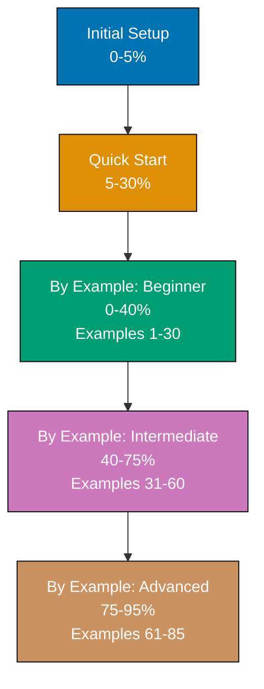

**Learn C# by reading code.** This by-example tutorial teaches C# through 85 heavily annotated, self-contained code examples achieving 95% language coverage. If you're an experienced programmer who prefers learning by reading working code rather than narrative explanations, this is your path.

## What is By Example?

By Example is a **code-first learning approach** designed for experienced developers switching to C# from other languages. Instead of lengthy explanations followed by code snippets, you'll see complete, runnable programs with inline annotations explaining what each line does and why it matters.

**Target audience**: Seasonal programmers, software engineers, and developers with experience in Python, Java, JavaScript, or other languages who want to learn C# efficiently.

## How This Tutorial Works

### Structure

- **[Beginner](/en/learn/software-engineering/programming-languages/c-sharp/by-example/beginner)** (Examples 1-30): Fundamentals and core syntax - 0-40% coverage
- **[Intermediate](/en/learn/software-engineering/programming-languages/c-sharp/by-example/intermediate)** (Examples 31-60): Production patterns and framework features - 40-75% coverage
- **[Advanced](/en/learn/software-engineering/programming-languages/c-sharp/by-example/advanced)** (Examples 61-85): Expert mastery and optimization - 75-95% coverage

### Example Format

Each example follows a five-part structure:

1. **Brief explanation** (2-3 sentences) - What is this concept and why does it matter?
2. **Diagram** (when appropriate) - Visual representation of flow, state, or architecture
3. **Heavily annotated code** - Complete, runnable program with inline `// =>` annotations
4. **Key takeaway** (1-2 sentences) - The essential insight distilled
5. **Why it matters** (50-100 words) - Production relevance and real-world impact

### Example: Annotation Style

```csharp
var numbers = new List<int> { 1, 2, 3, 4, 5 };  // => numbers is List<int> with 5 elements
                                                // => List is mutable, dynamic-sized collection

var doubled = numbers.Select(n => n * 2);       // => LINQ Select transforms each element
                                                // => Returns IEnumerable<int> (lazy evaluation)
                                                // => Does NOT execute yet (deferred execution)

var result = doubled.ToList();                  // => Forces evaluation, creates new List<int>
                                                // => result is [2, 4, 6, 8, 10]
                                                // => numbers unchanged: [1, 2, 3, 4, 5]
```

## What You'll Learn

### Coverage: 95% of C# for Production Work

**Included**:

- Core syntax and semantics (types, variables, control flow)
- Object-oriented programming (classes, interfaces, inheritance)
- Modern C# features (records, pattern matching, nullable reference types)
- LINQ (query syntax and method syntax)
- Async/await and Task-based async programming
- Collections and generics
- Delegates, events, and lambda expressions
- File I/O and serialization
- HTTP clients and ASP.NET Core basics
- Entity Framework Core and database access
- Testing with xUnit/NUnit
- Advanced memory techniques (Span<T>, Memory<T>)
- Performance optimization
- Reflection and source generators

**Excluded (the 5% edge cases)**:

- COM interop and P/Invoke internals
- Rarely-used legacy features (.NET Framework specifics)
- Framework source code implementation details
- Platform-specific advanced features

## Self-Contained Examples

**Every example is copy-paste-runnable.** Each example includes:

- Complete using statements
- All necessary class definitions
- Helper methods defined inline
- No references to previous examples (you can start anywhere)

**Example independence**: You can jump to Example 42, copy the code, run it, and understand the concept without reading Examples 1-41.

## Why Code-First?

Traditional tutorials explain concepts, then show code. By Example inverts this:

1. **See the code first** - Complete, working program
2. **Run it immediately** - Verify it works on your machine
3. **Read annotations** - Understand what each line does
4. **Absorb the pattern** - Internalize through direct interaction

**Benefits**:

- **Faster learning** - No walls of text before seeing actual code
- **Immediate verification** - Run code to confirm your understanding
- **Reference-friendly** - Come back later to find specific patterns
- **Production-focused** - Examples use real-world patterns, not toy code

## How to Use This Tutorial

### If You're New to Programming

Start with [Quick Start](/en/learn/software-engineering/programming-languages/c-sharp/quick-start) first, then return to By Example for comprehensive coverage.

### If You Know Another Language

Jump straight into **Beginner** examples. You'll recognize patterns from other languages but see C#-specific syntax and idioms.

### If You Know Some C

Start with **Intermediate** or **Advanced** based on your comfort level. Each example is self-contained, so you won't get lost.

### As a Reference

Use the example index to find specific topics (e.g., "How do I use async/await?" → Example 47).

## Comparison to Narrative Tutorials

| Aspect               | By Example (This Tutorial)          | Narrative Tutorial                  |
| -------------------- | ----------------------------------- | ----------------------------------- |
| **Approach**         | Code-first (show, then explain)     | Explanation-first (tell, then show) |
| **Target Audience**  | Experienced developers              | Beginners and intermediate          |
| **Coverage**         | 95% (comprehensive)                 | 60-85% (focused depth)              |
| **Example Count**    | 85 examples                         | 15-30 examples                      |
| **Learning Style**   | Read code, run code, understand     | Read explanation, see code          |
| **Use as Reference** | Excellent (self-contained examples) | Moderate (sequential narrative)     |

**Both are valid approaches.** Choose based on your learning style and experience level.

## Diagrams and Visualizations

Approximately 40% of examples include Mermaid diagrams visualizing:

- Data flow through LINQ pipelines
- Async/await execution flow
- Memory layout (value types vs reference types)
- Inheritance hierarchies
- Request/response cycles in ASP.NET Core
- State machines and pattern matching

All diagrams use a color-blind friendly palette (Blue, Orange, Teal, Purple, Brown) meeting WCAG AA accessibility standards.

## Prerequisites

- **Programming experience** - Familiarity with at least one programming language (Python, Java, JavaScript, etc.)
- **C# environment set up** - .NET SDK installed and verified (see [Initial Setup](/en/learn/software-engineering/programming-languages/c-sharp/initial-setup))
- **Code editor ready** - VS Code with C# Dev Kit or Visual Studio
- **Basic terminal skills** - Comfort running `dotnet build` and `dotnet run`

**No prior C# knowledge required** - Examples start from fundamentals.

## Learning Path



## What's Next?

Ready to start learning? Choose your entry point:

- **New to C#?** → [Beginner Examples (1-30)](/en/learn/software-engineering/programming-languages/c-sharp/by-example/beginner)
- **Know the basics?** → [Intermediate Examples (31-60)](/en/learn/software-engineering/programming-languages/c-sharp/by-example/intermediate)
- **Experienced with C#?** → [Advanced Examples (61-85)](/en/learn/software-engineering/programming-languages/c-sharp/by-example/advanced)

## Expected Time Investment

**Not measured in hours** - everyone learns at different speeds. Instead, we measure in **coverage depth**:

- **Beginner**: 0-40% coverage through 30 examples
- **Intermediate**: 40-75% coverage through 30 examples
- **Advanced**: 75-95% coverage through 25 examples

Work at your own pace. Some developers complete all 85 examples in a weekend; others spread it across weeks while building projects.

## Key Principles

1. **Every example is runnable** - Copy, paste, run, verify
2. **Annotations explain WHY, not just WHAT** - Understand the reasoning
3. **Self-contained is non-negotiable** - No hunting for code in other examples
4. **Production patterns, not toys** - Real-world code you'll actually write
5. **Modern C# features** - C# 12, .NET 8, contemporary idioms

## Feedback and Improvements

Found an error? See a better way to explain something? Examples are continuously improved based on learner feedback.

**Let's start coding!** Choose your level and dive into the examples.
