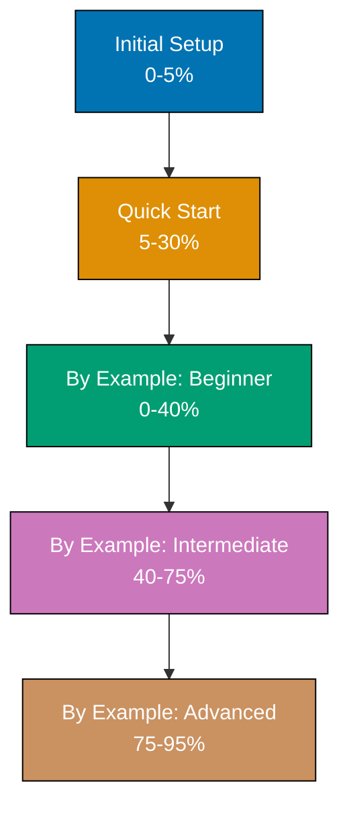

**Master C# step-by-step.** This directory contains the complete C# Full Set tutorial series - a comprehensive learning path from installation to expert mastery. Choose your starting point based on your experience level.

## Where C# Fits in Your Learning Journey

**C# is a recommended language** for enterprise development, game development, and cross-platform applications. Best learned as a second or third language after [Python](/en/learn/software-engineering/programming-languages/python) or alongside [Java](/en/learn/software-engineering/programming-languages/java).

**Why C#?** C# represents Microsoft's modern evolution of C++ and Java - combining object-oriented principles with functional programming features, strong type safety with type inference, and enterprise robustness with developer productivity. The language has evolved significantly with .NET Core/.NET 5+, becoming truly cross-platform.

**What makes C# special?** C# excels at enterprise applications, game development (Unity), desktop applications (WPF, WinForms), web development (ASP.NET Core), cloud services (Azure), and cross-platform mobile apps (MAUI). LINQ provides powerful data querying, async/await enables elegant asynchronous programming, and the rich .NET ecosystem offers libraries for virtually every domain.

**Prerequisites recommended**: Familiarity with at least one programming language (Python or Java) helps you appreciate C#'s design choices. See [Programming Languages Overview](/en/learn/software-engineering/programming-languages/overview) for the complete learning path.

## Getting Started

Before diving into comprehensive tutorials, get up and running:

1. **[Initial Setup](/en/learn/software-engineering/programming-languages/c-sharp/initial-setup)** - Install .NET SDK, configure your environment, verify your setup
2. **[Quick Start](/en/learn/software-engineering/programming-languages/c-sharp/quick-start)** - Your first C# program, basic syntax touchpoints, essential concepts

These foundational tutorials (0-30% coverage) prepare you for the complete learning path.

## By Example Track (Code-First Learning)

The by-example track provides 85 heavily annotated code examples achieving 95% language coverage:

### [By Example](/en/learn/software-engineering/programming-languages/c-sharp/by-example)

- **Coverage**: 0-95% (Comprehensive code-first approach)
- **What you'll learn**: C# through 85 self-contained, heavily annotated examples
- **Goal**: Achieve comprehensive C# mastery through working code
- **Best for**: Experienced developers who prefer learning by reading and running code

**Structure**:

- **[Beginner](/en/learn/software-engineering/programming-languages/c-sharp/by-example/beginner)** (Examples 1-30): Fundamentals and core syntax
- **[Intermediate](/en/learn/software-engineering/programming-languages/c-sharp/by-example/intermediate)** (Examples 31-60): Production patterns and framework features
- **[Advanced](/en/learn/software-engineering/programming-languages/c-sharp/by-example/advanced)** (Examples 61-85): Expert mastery and optimization

## How to Choose Your Starting Point

**Choose based on your experience level:**

| Experience Level                      | Recommended Path                                |
| ------------------------------------- | ----------------------------------------------- |
| **No programming experience**         | Quick Start → By Example (Beginner → Advanced)  |
| **Experienced programmer, new to C#** | By Example (Beginner → Advanced)                |
| **Familiar with some C#, want depth** | By Example (Intermediate → Advanced)            |
| **Building production systems now**   | By Example (Intermediate → Advanced)            |
| **Seeking expert mastery**            | By Example (Advanced, review earlier as needed) |
| **Need a specific pattern?**          | Search By Example for relevant topics           |

## Tutorial Structure

Each tutorial follows the [Diátaxis framework](https://diataxis.fr/) principles for learning-oriented content:

- **Learning-oriented**: Designed to help learners master C# by doing
- **Step-by-step**: Clear, sequential progression with increasing complexity
- **Practical**: Hands-on examples with working, runnable C# code
- **Self-contained**: Examples include all necessary code and explanations
- **Production-focused**: Real-world patterns and best practices

## What You'll Learn

### Language Fundamentals (0-40%)

- Variables, types, and type inference
- Control flow (if, switch expressions, loops)
- Methods and lambda expressions
- Collections (List, Dictionary, HashSet)
- LINQ query syntax and method syntax
- Exception handling
- Object-oriented programming (classes, inheritance, interfaces)
- Generics and constraints
- Delegates and events

### Production Patterns (40-75%)

- Async/await and Task-based asynchronous programming
- File I/O and streams
- HTTP clients and ASP.NET Core basics
- Entity Framework Core and database access
- Dependency injection
- Configuration and options pattern
- Testing with xUnit/NUnit
- LINQ to Objects, LINQ to SQL
- Pattern matching
- Records and init-only properties

### Expert Mastery (75-95%)

- Advanced async patterns (ValueTask, IAsyncEnumerable)
- Memory and span types (Span<T>, Memory<T>)
- High-performance techniques (Stackalloc, ArrayPool)
- Reflection and runtime code generation
- Source generators
- Advanced C# features (discriminated unions, with expressions)
- Concurrency patterns (lock, SemaphoreSlim, channels)
- Minimal APIs and modern web development
- Cloud-native patterns (health checks, metrics, distributed tracing)
- Performance profiling and optimization

## Key C# Concepts

### Type Safety with Flexibility

C# provides strong compile-time type checking while offering type inference (`var`), dynamic typing (`dynamic`), and nullable reference types for null safety.

### LINQ - Language Integrated Query

Query collections using SQL-like syntax or fluent method chains, with compile-time type checking and IntelliSense support.

### Async/Await

Write asynchronous code that reads like synchronous code, avoiding callback hell and making concurrent programming accessible.

### Rich Standard Library

.NET provides comprehensive libraries for web development (ASP.NET Core), data access (Entity Framework Core), testing (xUnit, NUnit), serialization (System.Text.Json), and more.

### Cross-Platform

.NET 5+ runs on Windows, Linux, and macOS with a single codebase, enabling cloud deployment, container support, and true portability.

## Learning Path Progression

## Related Languages

- **[Java](/en/learn/software-engineering/programming-languages/java)** - Similar object-oriented design with cross-platform JVM runtime
- **[F#](/en/learn/software-engineering/programming-languages/f-sharp)** - Functional-first language on .NET platform
- **[TypeScript](/en/learn/software-engineering/programming-languages/typescript)** - Statically-typed JavaScript with similar modern language features
- **[Kotlin](/en/learn/software-engineering/programming-languages/kotlin)** - Modern JVM language with similar null safety and conciseness

## External Resources

- **[Official .NET Documentation](https://docs.microsoft.com/en-us/dotnet/)** - Microsoft's comprehensive C# and .NET documentation
- **[C# Language Specification](https://docs.microsoft.com/en-us/dotnet/csharp/language-reference/language-specification/)** - Official language specification
- **[.NET API Browser](https://docs.microsoft.com/en-us/dotnet/api/)** - Complete .NET API reference

## Version Information

These tutorials target **.NET 8** (LTS - Long Term Support) and **C# 12**, the latest stable versions as of 2024. Examples use modern C# features including records, pattern matching, nullable reference types, and minimal APIs.

**Migration notes**: If using older versions (.NET Framework, .NET Core 3.1, .NET 5-7), most examples work with minor adjustments. Version-specific features are clearly marked.
