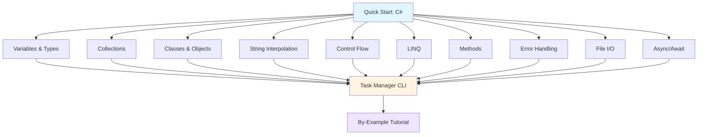

**Want to learn C# fundamentals quickly?** This quick start touches 10-12 core C# concepts by building a simple task management CLI. By the end, you'll have practical touchpoints for the most important language features.

## Prerequisites

Before starting, you should have:

- Completed [Initial Setup](/en/learn/software-engineering/programming-languages/c-sharp/initial-setup) - .NET SDK installed and working
- A text editor or IDE (VS Code with C# Dev Kit, Visual Studio, or Rider)
- Basic understanding of programming concepts
- Willingness to write and run code

## Learning Objectives

By the end of this tutorial, you will have touchpoints for:

1. **Variables and Types** - Type inference, value/reference types, nullable types
2. **Collections** - List<T>, Dictionary<TKey, TValue>, arrays
3. **Classes and Objects** - Define types, properties, methods
4. **String Interpolation** - Modern string formatting
5. **Control Flow** - if/else, switch expressions, loops
6. **LINQ** - Query and transform collections
7. **Methods** - Parameters, return values, expression-bodied members
8. **Error Handling** - Try-catch, custom exceptions
9. **File I/O** - Read and write files
10. **Async/Await** - Asynchronous programming basics

## What We'll Build

A **Task Management CLI** that:

- Creates, lists, and completes tasks
- Saves tasks to file (JSON persistence)
- Filters and searches tasks
- Demonstrates essential C# patterns

## Project Structure



## Step 1: Create Project

Create a new console application:

```bash
mkdir TaskManager
cd TaskManager
dotnet new console
```

Replace the contents of `Program.cs` with the code from the following sections.

## Concept 1: Classes and Objects - Define Custom Types

Classes group related data and behavior together.

### Example: Task Class

```csharp
// Task.cs - represents a single task
using System;

// Class definition
public class TaskItem
{
    // Auto-implemented properties
    public int Id { get; set; }                    // => Auto-generated getter/setter
    public string Title { get; set; } = "";        // => Default value: empty string
    public string Description { get; set; } = "";  // => Nullable suppressed with default
    public bool IsCompleted { get; set; }          // => Default value: false (bool default)
    public DateTime CreatedAt { get; set; }        // => DateTime type (value type)
    public DateTime? CompletedAt { get; set; }     // => Nullable DateTime (? makes it nullable)

    // Computed property (expression-bodied member)
    public string Status => IsCompleted ? "✓ Done" : "○ Pending";  // => Read-only, computed on access

    // Constructor
    public TaskItem(int id, string title, string description)
    {
        Id = id;                        // => Assigns parameter to property
        Title = title;                  // => Sets title
        Description = description;      // => Sets description
        CreatedAt = DateTime.Now;       // => Current timestamp
        IsCompleted = false;            // => Default to incomplete
    }                                   // => Returns new TaskItem instance

    // Method to mark task complete
    public void Complete()
    {
        IsCompleted = true;             // => Sets completed flag
        CompletedAt = DateTime.Now;     // => Records completion time
    }                                   // => Returns nothing (void)

    // Override ToString for display
    public override string ToString()
    {
        return $"[{Id}] {Status} {Title}";  // => String interpolation with $""
    }                                        // => Returns formatted string
}
```

**Key concepts**: `class`, properties with `{ get; set; }`, constructors, methods, `override`

## Concept 2: Collections - Store Multiple Items

C# provides generic collections for different use cases.

### Example: Task List Storage

```csharp
using System;
using System.Collections.Generic;
using System.Linq;

public class TaskManager
{
    // List<T> - dynamic array
    private List<TaskItem> tasks = new List<TaskItem>();  // => Empty list of TaskItem
    private int nextId = 1;                                // => Auto-increment ID counter

    // Add task
    public void AddTask(string title, string description)
    {
        var task = new TaskItem(nextId++, title, description);  // => Creates new task, increments ID
        tasks.Add(task);                                         // => Adds to list
        Console.WriteLine($"Added: {task.Title}");               // => Output: Added: [title]
    }

    // Get all tasks
    public List<TaskItem> GetAllTasks()
    {
        return tasks;  // => Returns entire list
    }

    // Get pending tasks
    public List<TaskItem> GetPendingTasks()
    {
        return tasks.Where(t => !t.IsCompleted).ToList();  // => LINQ filter + convert to list
    }                                                       // => Returns filtered list

    // Get completed tasks
    public List<TaskItem> GetCompletedTasks()
    {
        return tasks.Where(t => t.IsCompleted).ToList();  // => LINQ filter for completed
    }

    // Complete task by ID
    public bool CompleteTask(int id)
    {
        var task = tasks.FirstOrDefault(t => t.Id == id);  // => LINQ find by ID (null if not found)
        if (task == null)                                   // => Check if task exists
        {
            return false;  // => Task not found
        }

        task.Complete();   // => Call Complete method
        return true;       // => Success
    }

    // Search tasks
    public List<TaskItem> SearchTasks(string keyword)
    {
        return tasks.Where(t =>                                      // => LINQ filter
            t.Title.Contains(keyword, StringComparison.OrdinalIgnoreCase) ||  // => Case-insensitive search
            t.Description.Contains(keyword, StringComparison.OrdinalIgnoreCase)
        ).ToList();                                                   // => Convert to list
    }                                                                 // => Returns matching tasks

    // Get task count
    public int Count => tasks.Count;  // => Expression-bodied property
}
```

**Key concepts**: `List<T>`, `new`, LINQ methods (`Where`, `FirstOrDefault`), lambda expressions `t => ...`

## Concept 3: String Interpolation and Formatting

Modern C# uses `$""` for readable string formatting.

### Example: Display Helper

```csharp
public static class DisplayHelper
{
    // Display all tasks
    public static void DisplayTasks(List<TaskItem> tasks, string title = "All Tasks")
    {
        Console.WriteLine();                           // => Blank line
        Console.WriteLine($"=== {title} ===");        // => String interpolation: === All Tasks ===
        Console.WriteLine();

        if (tasks.Count == 0)                          // => Check if empty
        {
            Console.WriteLine("  (no tasks)");         // => Output: (no tasks)
            return;                                    // => Early return
        }

        foreach (var task in tasks)                    // => Iterate over list
        {
            Console.WriteLine($"  {task}");            // => Uses TaskItem.ToString()
            if (!string.IsNullOrEmpty(task.Description))  // => Check if description exists
            {
                Console.WriteLine($"    {task.Description}");  // => Indented description
            }
        }

        Console.WriteLine();
        Console.WriteLine($"Total: {tasks.Count} task(s)");  // => Count summary
    }

    // Display menu
    public static void DisplayMenu()
    {
        // Multi-line string (verbatim with @)
        Console.WriteLine(@"
Commands:
  1. Add task
  2. List all tasks
  3. List pending tasks
  4. List completed tasks
  5. Complete task
  6. Search tasks
  7. Save tasks
  8. Load tasks
  9. Exit

Enter command number:");  // => @ preserves line breaks and formatting
    }
}
```

**Key concepts**: String interpolation `$"{var}"`, verbatim strings `@""`, `foreach`, null checking

## Concept 4: Control Flow - Make Decisions

C# provides if/else, switch expressions, and pattern matching.

### Example: Menu Handler

```csharp
using System;

public static class MenuHandler
{
    public static void HandleCommand(string command, TaskManager manager)
    {
        // Switch expression (C# 8+)
        var action = command switch
        {
            "1" => () => AddTaskInteractive(manager),      // => Lambda (no parameters)
            "2" => () => ListAllTasks(manager),
            "3" => () => ListPendingTasks(manager),
            "4" => () => ListCompletedTasks(manager),
            "5" => () => CompleteTaskInteractive(manager),
            "6" => () => SearchTasksInteractive(manager),
            "7" => () => SaveTasks(manager),
            "8" => () => LoadTasks(manager),
            _ => (Action?)null  // => Default case (null if no match)
        };

        if (action != null)  // => Check if valid command
        {
            action();         // => Execute action
        }
        else
        {
            Console.WriteLine("Invalid command. Try again.");  // => Error message
        }
    }

    private static void AddTaskInteractive(TaskManager manager)
    {
        Console.Write("Title: ");                      // => Prompt (no newline)
        var title = Console.ReadLine() ?? "";          // => Read input, null coalescing to ""

        Console.Write("Description: ");
        var description = Console.ReadLine() ?? "";

        if (string.IsNullOrWhiteSpace(title))         // => Validation
        {
            Console.WriteLine("Title cannot be empty.");
            return;                                    // => Early return
        }

        manager.AddTask(title, description);          // => Call manager method
    }

    private static void ListAllTasks(TaskManager manager)
    {
        DisplayHelper.DisplayTasks(manager.GetAllTasks(), "All Tasks");
    }

    private static void ListPendingTasks(TaskManager manager)
    {
        DisplayHelper.DisplayTasks(manager.GetPendingTasks(), "Pending Tasks");
    }

    private static void ListCompletedTasks(TaskManager manager)
    {
        DisplayHelper.DisplayTasks(manager.GetCompletedTasks(), "Completed Tasks");
    }

    private static void CompleteTaskInteractive(TaskManager manager)
    {
        Console.Write("Enter task ID to complete: ");
        var input = Console.ReadLine() ?? "";

        if (int.TryParse(input, out int id))  // => Try parse string to int
        {
            if (manager.CompleteTask(id))      // => Attempt to complete
            {
                Console.WriteLine($"Task {id} marked complete!");
            }
            else
            {
                Console.WriteLine($"Task {id} not found.");
            }
        }
        else
        {
            Console.WriteLine("Invalid ID.");
        }
    }

    private static void SearchTasksInteractive(TaskManager manager)
    {
        Console.Write("Search keyword: ");
        var keyword = Console.ReadLine() ?? "";

        var results = manager.SearchTasks(keyword);   // => Get search results
        DisplayHelper.DisplayTasks(results, $"Search Results: \"{keyword}\"");
    }

    private static void SaveTasks(TaskManager manager)
    {
        FileHandler.SaveToFile(manager);  // => Delegate to file handler
    }

    private static void LoadTasks(TaskManager manager)
    {
        FileHandler.LoadFromFile(manager);
    }
}
```

**Key concepts**: Switch expressions, lambda expressions `() => ...`, pattern matching, `TryParse`, null coalescing `??`

## Concept 5: Error Handling - Try-Catch

Use try-catch to handle exceptions gracefully.

### Example: File I/O with Error Handling

```csharp
using System;
using System.Collections.Generic;
using System.IO;
using System.Text.Json;

public static class FileHandler
{
    private const string FileName = "tasks.json";  // => Constant (immutable)

    public static void SaveToFile(TaskManager manager)
    {
        try  // => Try block - code that might throw exception
        {
            var tasks = manager.GetAllTasks();              // => Get all tasks
            var json = JsonSerializer.Serialize(tasks,      // => Serialize to JSON
                new JsonSerializerOptions { WriteIndented = true });  // => Pretty-print
            File.WriteAllText(FileName, json);              // => Write to file
            Console.WriteLine($"Saved {tasks.Count} task(s) to {FileName}");
        }
        catch (UnauthorizedAccessException ex)  // => Specific exception type
        {
            Console.WriteLine($"Permission denied: {ex.Message}");
        }
        catch (IOException ex)                  // => Another specific type
        {
            Console.WriteLine($"I/O error: {ex.Message}");
        }
        catch (Exception ex)                    // => General catch-all (last)
        {
            Console.WriteLine($"Error saving: {ex.Message}");
        }
    }

    public static void LoadFromFile(TaskManager manager)
    {
        if (!File.Exists(FileName))  // => Check file exists
        {
            Console.WriteLine($"{FileName} not found. Starting fresh.");
            return;
        }

        try
        {
            var json = File.ReadAllText(FileName);          // => Read entire file
            var tasks = JsonSerializer.Deserialize<List<TaskItem>>(json);  // => Deserialize

            if (tasks != null)  // => Null check
            {
                // Reflection to access private field (for demo - not recommended in production)
                var field = manager.GetType().GetField("tasks",
                    System.Reflection.BindingFlags.NonPublic | System.Reflection.BindingFlags.Instance);
                field?.SetValue(manager, tasks);  // => Replace task list

                Console.WriteLine($"Loaded {tasks.Count} task(s) from {FileName}");
            }
        }
        catch (JsonException ex)
        {
            Console.WriteLine($"Invalid JSON format: {ex.Message}");
        }
        catch (Exception ex)
        {
            Console.WriteLine($"Error loading: {ex.Message}");
        }
    }
}
```

**Key concepts**: `try-catch`, exception types, `File.ReadAllText`, JSON serialization, null checking

## Concept 6: LINQ - Query Collections

LINQ (Language Integrated Query) provides powerful collection operations.

### Example: LINQ Statistics

```csharp
using System;
using System.Linq;

public static class Statistics
{
    public static void DisplayStats(TaskManager manager)
    {
        var all = manager.GetAllTasks();  // => Get all tasks

        if (all.Count == 0)  // => Early return if empty
        {
            Console.WriteLine("No tasks to analyze.");
            return;
        }

        // LINQ aggregation
        var total = all.Count;                                   // => Total count
        var completed = all.Count(t => t.IsCompleted);           // => Count completed (LINQ Count with predicate)
        var pending = all.Count(t => !t.IsCompleted);            // => Count pending
        var completionRate = (completed * 100.0) / total;        // => Percentage

        Console.WriteLine("\n=== Statistics ===");
        Console.WriteLine($"Total tasks: {total}");
        Console.WriteLine($"Completed: {completed}");
        Console.WriteLine($"Pending: {pending}");
        Console.WriteLine($"Completion rate: {completionRate:F1}%");  // => Format to 1 decimal place

        // LINQ ordering
        var oldest = all.OrderBy(t => t.CreatedAt).First();      // => Sort by date, get first
        var newest = all.OrderByDescending(t => t.CreatedAt).First();  // => Reverse sort

        Console.WriteLine($"\nOldest task: {oldest.Title} ({oldest.CreatedAt:yyyy-MM-dd})");
        Console.WriteLine($"Newest task: {newest.Title} ({newest.CreatedAt:yyyy-MM-dd})");

        // LINQ grouping
        var grouped = all.GroupBy(t => t.IsCompleted);           // => Group by completion status
        foreach (var group in grouped)
        {
            var status = group.Key ? "Completed" : "Pending";    // => Group key
            Console.WriteLine($"\n{status} ({group.Count()}):");
            foreach (var task in group.Take(3))                  // => Take first 3
            {
                Console.WriteLine($"  - {task.Title}");
            }
        }
    }
}
```

**Key concepts**: LINQ methods (`Count`, `OrderBy`, `GroupBy`, `Take`), string formatting `{value:format}`

## Concept 7: Async/Await - Asynchronous Operations

Async/await enables non-blocking I/O operations.

### Example: Async File Operations

```csharp
using System;
using System.IO;
using System.Threading.Tasks;

public static class AsyncFileHandler
{
    private const string FileName = "tasks.json";

    // Async method - returns Task
    public static async Task SaveToFileAsync(TaskManager manager)
    {
        try
        {
            var tasks = manager.GetAllTasks();
            var json = System.Text.Json.JsonSerializer.Serialize(tasks,
                new System.Text.Json.JsonSerializerOptions { WriteIndented = true });

            await File.WriteAllTextAsync(FileName, json);  // => Async file write (non-blocking)
            Console.WriteLine($"Saved {tasks.Count} task(s) asynchronously");
        }
        catch (Exception ex)
        {
            Console.WriteLine($"Error: {ex.Message}");
        }
    }  // => Returns Task (awaitable)

    public static async Task LoadFromFileAsync(TaskManager manager)
    {
        if (!File.Exists(FileName))
        {
            Console.WriteLine($"{FileName} not found.");
            return;
        }

        try
        {
            var json = await File.ReadAllTextAsync(FileName);  // => Async file read
            var tasks = System.Text.Json.JsonSerializer.Deserialize<System.Collections.Generic.List<TaskItem>>(json);

            if (tasks != null)
            {
                Console.WriteLine($"Loaded {tasks.Count} task(s) asynchronously");
            }
        }
        catch (Exception ex)
        {
            Console.WriteLine($"Error: {ex.Message}");
        }
    }

    // Simulate long-running operation
    public static async Task SimulateProcessingAsync()
    {
        Console.Write("Processing");
        for (int i = 0; i < 5; i++)
        {
            await Task.Delay(500);  // => Non-blocking delay (500ms)
            Console.Write(".");      // => Output: Processing.....
        }
        Console.WriteLine(" Done!");
    }  // => Returns Task
}
```

**Key concepts**: `async`, `await`, `Task`, `Task.Delay`, non-blocking I/O

## Complete Program - Main Entry Point

Put it all together in `Program.cs`:

```csharp
using System;
using System.Threading.Tasks;

class Program
{
    static async Task Main(string[] args)  // => async Main (C# 7.1+)
    {
        Console.WriteLine("=== Task Manager ===");
        Console.WriteLine("Type 'help' for commands");

        var manager = new TaskManager();  // => Create manager instance

        // Add sample tasks
        manager.AddTask("Learn C# basics", "Variables, types, control flow");
        manager.AddTask("Build CLI app", "Task manager with file persistence");
        manager.AddTask("Explore LINQ", "Query and transform collections");

        while (true)  // => Infinite loop
        {
            Console.Write("\n> ");
            var input = Console.ReadLine()?.Trim().ToLower() ?? "";  // => Read + normalize input

            if (input == "exit" || input == "9")  // => Exit condition
            {
                Console.WriteLine("Goodbye!");
                break;  // => Exit loop
            }

            if (input == "help")
            {
                DisplayHelper.DisplayMenu();
                continue;  // => Skip to next iteration
            }

            if (input == "stats")
            {
                Statistics.DisplayStats(manager);
                continue;
            }

            if (input == "async-save")
            {
                await AsyncFileHandler.SaveToFileAsync(manager);  // => Await async operation
                continue;
            }

            if (input == "async-load")
            {
                await AsyncFileHandler.LoadFromFileAsync(manager);
                continue;
            }

            MenuHandler.HandleCommand(input, manager);  // => Delegate to handler
        }
    }  // => Returns Task (async main)
}
```

**Key concepts**: `async Task Main`, infinite loops, string methods (`Trim`, `ToLower`)

## Run the Program

```bash
dotnet run
```

**Sample interaction**:

```
=== Task Manager ===
Type 'help' for commands

> help

Commands:
  1. Add task
  2. List all tasks
  3. List pending tasks
  4. List completed tasks
  5. Complete task
  6. Search tasks
  7. Save tasks
  8. Load tasks
  9. Exit

> 2

=== All Tasks ===

  [1] ○ Pending Learn C# basics
    Variables, types, control flow
  [2] ○ Pending Build CLI app
    Task manager with file persistence
  [3] ○ Pending Explore LINQ
    Query and transform collections

Total: 3 task(s)

> 5
Enter task ID to complete: 1
Task 1 marked complete!

> stats

=== Statistics ===
Total tasks: 3
Completed: 1
Pending: 2
Completion rate: 33.3%

Oldest task: Learn C# basics (2026-02-02)
Newest task: Explore LINQ (2026-02-02)

Pending (2):
  - Build CLI app
  - Explore LINQ

Completed (1):
  - Learn C# basics

> exit
Goodbye!
```

## Summary

**What you've touched**:

- Classes and objects (custom types, properties, methods)
- Collections (List<T>, LINQ operations)
- String interpolation and formatting
- Control flow (switch expressions, pattern matching)
- Error handling (try-catch, exception types)
- File I/O (read/write with JSON)
- LINQ (query, filter, transform collections)
- Async/await (non-blocking operations)
- Type inference (var keyword)
- Nullable types (? operator)

**Key syntax learned**:

```csharp
// Class with properties
public class Task
{
    public string Title { get; set; }
    public bool IsCompleted { get; set; }
}

// LINQ query
var pending = tasks.Where(t => !t.IsCompleted).ToList();

// Switch expression
var action = command switch
{
    "1" => () => AddTask(),
    _ => null
};

// String interpolation
Console.WriteLine($"Total: {count}");

// Async method
public async Task SaveAsync()
{
    await File.WriteAllTextAsync("file.txt", data);
}

// Try-catch
try
{
    File.ReadAllText("file.txt");
}
catch (IOException ex)
{
    Console.WriteLine(ex.Message);
}
```

## Next Steps

**Want comprehensive C# mastery?**

**Prefer code-first learning?**

- [By Example: Beginner](/en/learn/software-engineering/programming-languages/c-sharp/by-example/beginner) - Learn through 30 heavily annotated C# examples covering fundamentals

**Need specific solutions?**

- Browse by-example sections for specific patterns

**Want to understand C# philosophy?**

- [Overview](/en/learn/software-engineering/programming-languages/c-sharp/overview) - Why C# exists and when to use it

## Quick Reference Card

### Essential Syntax

```csharp
// Variables
var name = "Alice";  // Type inference
string title = "Manager";  // Explicit type
int? age = null;  // Nullable value type

// Collections
var list = new List<string> { "a", "b", "c" };
var dict = new Dictionary<string, int>();

// Class
public class Person
{
    public string Name { get; set; }
    public int Age { get; set; }

    public void Greet() => Console.WriteLine($"Hi, I'm {Name}");
}

// LINQ
var adults = people.Where(p => p.Age >= 18).ToList();
var names = people.Select(p => p.Name).ToList();

// Async
public async Task<string> FetchDataAsync()
{
    await Task.Delay(1000);
    return "data";
}

// Error handling
try
{
    // Code that might throw
}
catch (Exception ex)
{
    Console.WriteLine(ex.Message);
}
```

### Common Patterns

```csharp
// Null checking
var value = input ?? "default";  // Null coalescing
var length = text?.Length ?? 0;  // Null conditional

// String interpolation
var message = $"Hello, {name}!";

// Switch expression
var result = value switch
{
    1 => "one",
    2 => "two",
    _ => "other"
};

// LINQ aggregation
var total = numbers.Sum();
var average = numbers.Average();
var max = numbers.Max();

// Async Main
static async Task Main(string[] args)
{
    await DoWorkAsync();
}
```

This quick start provides touchpoints for essential C# operations. For production work, explore the beginner tutorial for comprehensive coverage and by-example content for heavily annotated code patterns.
