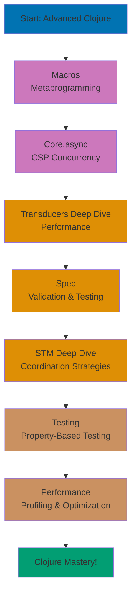
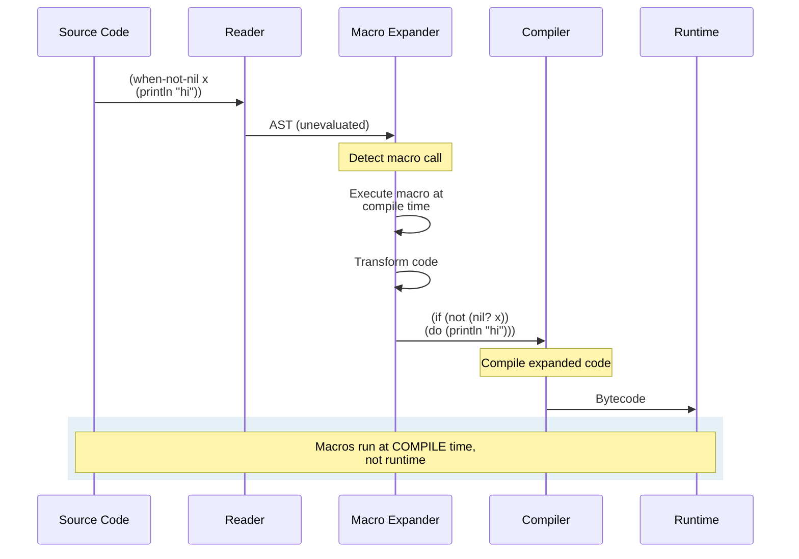
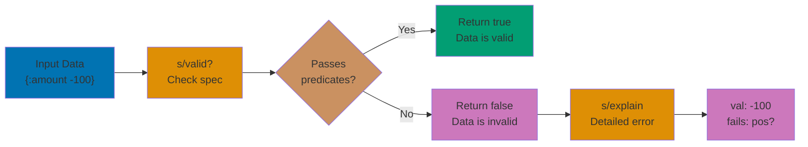
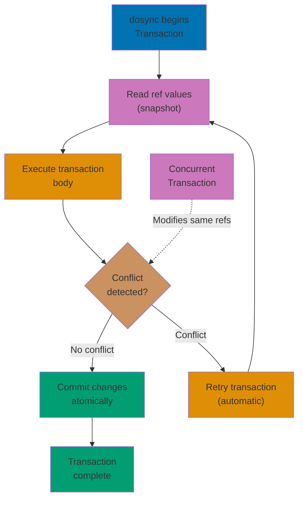

**Ready to master Clojure metaprogramming and advanced concurrency?** This advanced tutorial teaches sophisticated Clojure techniques for building high-performance, concurrent systems. You'll master macros for code generation, core.async for CSP-style concurrency, spec for validation, and performance optimization strategies.

**Prerequisites**: Complete the [Intermediate tutorial](/en/learn/software-engineering/programming-languages/clojure/by-concept/intermediate) or have significant production Clojure experience with protocols, transducers, and state management.

## What You'll Learn

This advanced tutorial teaches **Clojure mastery** - metaprogramming, advanced concurrency patterns, and optimization techniques for building sophisticated systems:

- **Macros** - Code that writes code, compile-time metaprogramming
- **Core.async** - CSP-style concurrency with channels and go blocks
- Advanced transducers and performance optimization
- **Spec** - Data validation and generative testing
- STM deep dive - Coordinated state management strategies
- Testing with clojure.test and property-based testing
- ClojureScript differences and cross-platform development
- Performance profiling and optimization
- Advanced protocols and datatypes

## Learning Path



This tutorial provides **85-95% coverage** of Clojure knowledge, completing your journey to mastery.

## Macros and Metaprogramming

Macros transform code at compile time, enabling powerful abstractions.

### Macro Expansion Process



### Basic Macro Concepts

```clojure
;; Macros receive code as data (unevaluated)
(defmacro when-not-nil [x & body]
  `(when (not (nil? ~x))
     ~@body))

;; Usage
(when-not-nil 10
  (println "Not nil!")
  (println "Value is" 10))
;; Output: Not nil!
;;         Value is 10

;; Quote (`) and Unquote (~)
;; ` (syntax quote) - prevent evaluation
;; ~ (unquote) - evaluate within quote
;; ~@ (unquote-splice) - splice sequence into code

;; Macro expansion with macroexpand
(macroexpand '(when-not-nil x (println "hi")))
;; => (if (clojure.core/not (clojure.core/nil? x))
;;      (do (println "hi")))
```

### Islamic Finance DSL Example

```clojure
;; Macro for defining financial contracts
(defmacro defcontract [name params & calculation]
  `(defn ~name ~params
     (let [result# (do ~@calculation)]
       {:contract-type ~(keyword (str name))
        :parameters ~params
        :result result#})))

;; Usage
(defcontract murabaha-payment [cost markup months]
  (/ (+ cost markup) months))

(murabaha-payment 50000000 5000000 24)
;; => {:contract-type :murabaha-payment
;;     :parameters [50000000 5000000 24]
;;     :result 2291666.666...}

;; Macro for validation DSL
(defmacro validate [value & constraints]
  `(let [v# ~value
         errors# (atom [])]
     ~@(for [[constraint msg] (partition 2 constraints)]
         `(when-not (~constraint v#)
            (swap! errors# conj ~msg)))
     (if (empty? @errors#)
       {:valid true :value v#}
       {:valid false :errors @errors#})))

;; Usage
(validate 100000000
  pos? "Must be positive"
  #(>= % 85000000) "Must exceed nisab threshold")
;; => {:valid true, :value 100000000}

(validate -1000000
  pos? "Must be positive"
  #(>= % 85000000) "Must exceed nisab threshold")
;; => {:valid false, :errors ["Must be positive" "Must exceed nisab threshold"]}
```

### Advanced Macro Techniques

```clojure
;; Recursive macros
(defmacro repeat-times [n & body]
  (when (pos? n)
    `(do
       ~@body
       (repeat-times ~(dec n) ~@body))))

;; Anaphoric macros (create implicit bindings)
(defmacro with-zakat [wealth & body]
  `(let [~'zakat (* ~wealth 0.025)
         ~'nisab 85000000
         ~'eligible? (>= ~wealth ~'nisab)]
     ~@body))

;; Usage (zakat, nisab, eligible? automatically bound)
(with-zakat 100000000
  (println "Zakat:" zakat)
  (println "Eligible?" eligible?))
;; Output: Zakat: 2500000.0
;;         Eligible? true
```

## Core.async - CSP Concurrency

Core.async brings Communicating Sequential Processes to Clojure.

### Channels and Go Blocks

```clojure
(require '[clojure.core.async :refer [chan go >! <! >!! <!! timeout close!]])

;; Create channel
(def ch (chan))

;; Put value on channel (blocking)
(>!! ch "message")

;; Take value from channel (blocking)
(<!! ch)  ;; => "message"

;; Go block - lightweight thread
(go
  (println "Starting...")
  (<! (timeout 1000))  ;; Wait 1 second
  (println "Done!"))

;; Returns immediately, prints after 1 second
```

### Islamic Finance: Async Donation Processing

```clojure
(require '[clojure.core.async :refer [chan go >! <! >!! <!! timeout close! alts!]])

;; Donation processing pipeline
(defn process-donation [donation-ch processed-ch]
  (go
    (loop []
      (when-let [donation (<! donation-ch)]
        (println "Processing donation:" (:amount donation))
        (<! (timeout 500))  ;; Simulate processing time
        (let [receipt {:donor (:donor donation)
                       :amount (:amount donation)
                       :tax-receipt-id (str "TR-" (rand-int 10000))
                       :timestamp (java.util.Date.)}]
          (>! processed-ch receipt))
        (recur)))))

;; Usage
(def donations (chan 10))
(def receipts (chan 10))

(process-donation donations receipts)

;; Submit donations
(>!! donations {:donor "Ahmad" :amount 500000})
(>!! donations {:donor "Fatimah" :amount 750000})

;; Receive receipts
(<!! receipts)  ;; => {:donor "Ahmad" :amount 500000 ...}
(<!! receipts)  ;; => {:donor "Fatimah" :amount 750000 ...}
```

### Pipeline Processing

```clojure
(require '[clojure.core.async :refer [pipeline chan >!! <!! close!]])

;; Parallel processing with pipeline
(defn calculate-zakat-async [asset]
  (Thread/sleep 100)  ;; Simulate work
  (if (>= (:months-held asset) 12)
    (assoc asset :zakat (* (:value asset) 0.025))
    (assoc asset :zakat 0)))

(def assets-ch (chan 10))
(def results-ch (chan 10))

;; Process with 4 parallel threads
(pipeline 4 results-ch (map calculate-zakat-async) assets-ch)

;; Submit assets
(>!! assets-ch {:name "Gold" :value 50000000 :months-held 12})
(>!! assets-ch {:name "Cash" :value 30000000 :months-held 14})
(>!! assets-ch {:name "Stocks" :value 25000000 :months-held 8})
(close! assets-ch)

;; Collect results
(repeatedly 3 #(<!! results-ch))
;; => ({:name "Gold" :zakat 1250000.0 ...}
;;     {:name "Cash" :zakat 750000.0 ...}
;;     {:name "Stocks" :zakat 0 ...})
```

### alts! - Select from Multiple Channels

```clojure
;; Select first available channel
(defn process-with-timeout [work-ch timeout-ms]
  (go
    (let [timeout-ch (timeout timeout-ms)
          [value port] (alts! [work-ch timeout-ch])]
      (if (= port timeout-ch)
        {:status :timeout}
        {:status :complete :value value}))))

;; Usage
(def work (chan))
(go
  (<! (timeout 2000))
  (>! work "result"))

(<!! (process-with-timeout work 1000))
;; => {:status :timeout} (times out before work completes)
```

## Advanced Transducers

### Stateful Transducers

```clojure
;; Custom stateful transducer: running total
(defn running-total []
  (fn [rf]
    (let [total (volatile! 0)]
      (fn
        ([] (rf))
        ([result] (rf result))
        ([result input]
         (vswap! total + input)
         (rf result @total))))))

(sequence (running-total) [1 2 3 4 5])
;; => (1 3 6 10 15)

;; Islamic finance: cumulative donations over time
(def donations [100000 250000 500000 1000000 750000])

(sequence (running-total) donations)
;; => (100000 350000 850000 1850000 2600000)
```

### Transducer Composition Performance

```clojure
;; Efficient: single pass, composed transformations
(def efficient-xf
  (comp
    (filter #(>= (:months-held %) 12))
    (map :value)
    (map #(* % 0.025))
    (filter pos?)))

;; Benchmark
(time
  (transduce efficient-xf + 0 (repeat 1000000 {:value 100000000 :months-held 12})))
;; => Fast! Single pass through 1M items

;; Inefficient: multiple passes
(time
  (->> (repeat 1000000 {:value 100000000 :months-held 12})
       (filter #(>= (:months-held %) 12))
       (map :value)
       (map #(* % 0.025))
       (filter pos?)
       (reduce +)))
;; => Slower! Multiple intermediate sequences
```

## Spec - Validation and Testing

### Spec Validation Pipeline



### Defining Specs

```clojure
(require '[clojure.spec.alpha :as s])

;; Define specs for data
(s/def ::amount (s/and number? pos?))
(s/def ::months (s/and int? #(>= % 1) #(<= % 360)))
(s/def ::rate (s/and number? #(>= % 0) #(<= % 1)))

;; Composite spec
(s/def ::murabaha-contract
  (s/keys :req-un [::amount ::months ::rate]))

;; Validate data
(s/valid? ::amount 100000)      ;; => true
(s/valid? ::amount -100)        ;; => false
(s/valid? ::amount "not number") ;; => false

;; Explain failures
(s/explain ::amount -100)
;; Output: val: -100 fails spec: :user/amount predicate: pos?

(s/explain ::murabaha-contract
  {:amount 50000000 :months 24})
;; Output: val: {:amount 50000000, :months 24}
;;         fails spec: :user/murabaha-contract
;;         predicate: (contains? % :rate)
```

### Function Specs

```clojure
;; Spec for function arguments and return value
(defn calculate-murabaha [amount markup months]
  (/ (+ amount markup) months))

(s/fdef calculate-murabaha
  :args (s/cat :amount ::amount
               :markup ::amount
               :months ::months)
  :ret ::amount)

;; Instrument function (check args at runtime)
(require '[clojure.spec.test.alpha :as stest])
(stest/instrument `calculate-murabaha)

;; Invalid call throws spec error
;; (calculate-murabaha -1000000 5000000 24)
;; => ExceptionInfo: Call to #'user/calculate-murabaha did not conform to spec
```

### Generative Testing

```clojure
;; Generate test data from specs
(require '[clojure.spec.gen.alpha :as gen])

(gen/generate (s/gen ::amount))
;; => 4237849.23 (random positive number)

(gen/sample (s/gen ::months) 5)
;; => (12 1 24 6 36) (5 random valid months)

;; Property-based testing
(stest/check `calculate-murabaha {:clojure.spec.test.check/opts {:num-tests 100}})
;; Runs 100 tests with generated inputs, checks return value conforms to spec
```

## STM Deep Dive

### STM Transaction Flow



### Transaction Retry and Consistency

```clojure
;; Multiple account transfer with retry logic
(def accounts
  {:ahmad (ref 1000000)
   :fatimah (ref 2000000)
   :ali (ref 1500000)})

(defn transfer [from-account to-account amount]
  (dosync
    (let [from-balance @(accounts from-account)
          to-balance @(accounts to-account)]
      (when (< from-balance amount)
        (throw (ex-info "Insufficient funds"
                        {:from from-account
                         :balance from-balance
                         :amount amount})))
      (alter (accounts from-account) - amount)
      (alter (accounts to-account) + amount))))

;; Concurrent transfers (STM ensures consistency)
(future (transfer :ahmad :fatimah 500000))
(future (transfer :fatimah :ali 700000))
(future (transfer :ali :ahmad 300000))

;; All transactions complete safely, no lost updates
@(accounts :ahmad)   ;; Final balance
@(accounts :fatimah) ;; Final balance
@(accounts :ali)     ;; Final balance
```

### Commute vs. Alter

```clojure
;; alter - strong consistency (full transaction ordering)
(def counter (ref 0))

(dosync
  (alter counter inc))  ;; Ensures exact ordering

;; commute - weaker consistency (commutative operations)
(dosync
  (commute counter + 1))  ;; Order doesn't matter for addition

;; commute is more efficient when operation is commutative
(def donation-total (ref 0))

;; Efficient: order of additions doesn't matter
(dotimes [_ 100]
  (future
    (dosync
      (commute donation-total + 10000))))

@donation-total  ;; => 1000000 (100 * 10000)
```

## Testing Strategies

### Unit Testing with clojure.test

```clojure
(ns zakat.calculator-test
  (:require [clojure.test :refer :all]
            [zakat.calculator :as zakat]))

(deftest test-calculate-zakat
  (testing "Zakat calculation at 2.5%"
    (is (= 2500000.0 (zakat/calculate-zakat 100000000))))
  (testing "Zero Zakat below nisab"
    (is (= 0.0 (zakat/calculate-zakat 50000000)))))

(deftest test-eligibility
  (testing "Eligible with wealth above nisab and 12 months"
    (is (true? (zakat/eligible? 100000000 12))))
  (testing "Ineligible with wealth below nisab"
    (is (false? (zakat/eligible? 50000000 12))))
  (testing "Ineligible with insufficient holding period"
    (is (false? (zakat/eligible? 100000000 6)))))

;; Run tests
(run-tests)
```

### Property-Based Testing

```clojure
(require '[clojure.test.check :as tc]
         '[clojure.test.check.generators :as gen]
         '[clojure.test.check.properties :as prop])

;; Property: Zakat is always 2.5% of wealth above nisab
(def zakat-property
  (prop/for-all [wealth (gen/large-integer* {:min 85000000 :max 10000000000})]
    (= (* wealth 0.025)
       (zakat/calculate-zakat wealth))))

(tc/quick-check 100 zakat-property)
;; => {:result true, :num-tests 100, :seed ...}

;; Property: Murabaha payment equals total / months
(def murabaha-property
  (prop/for-all [cost (gen/large-integer* {:min 1000000 :max 1000000000})
                 markup (gen/large-integer* {:min 100000 :max 100000000})
                 months (gen/choose 1 360)]
    (let [total (+ cost markup)
          payment (calculate-murabaha cost markup months)]
      (< (Math/abs (- payment (/ total months))) 0.01))))

(tc/quick-check 100 murabaha-property)
```

## Performance Optimization

### Profiling with Criterium

```clojure
(require '[criterium.core :refer [bench quick-bench]])

;; Benchmark Zakat calculation
(quick-bench (zakat/calculate-zakat 100000000))
;; => Execution time mean : 12.3 ns

;; Compare implementations
(defn zakat-v1 [wealth]
  (if (>= wealth 85000000)
    (* wealth 0.025)
    0.0))

(defn zakat-v2 [wealth]
  (when (>= wealth 85000000)
    (* wealth 0.025)))

(quick-bench (zakat-v1 100000000))
(quick-bench (zakat-v2 100000000))
```

### Optimization Techniques

```clojure
;; 1. Type hints to avoid reflection
(defn calculate-payment-slow [^double cost ^double markup ^long months]
  (/ (+ cost markup) months))

;; 2. Transients for efficient local mutation
(defn sum-large-vector [v]
  (loop [result (transient [])
         remaining v]
    (if (empty? remaining)
      (persistent! result)
      (recur (conj! result (first remaining))
             (rest remaining)))))

;; 3. Memoization for expensive pure functions
(def expensive-calculation
  (memoize
    (fn [n]
      (Thread/sleep 1000)
      (* n n))))

(time (expensive-calculation 5))  ;; => 1000 ms
(time (expensive-calculation 5))  ;; => 0 ms (cached)

;; 4. Reducers for parallel processing
(require '[clojure.core.reducers :as r])

(defn sum-zakat-parallel [assets]
  (r/fold +
          (r/map #(* (:value %) 0.025)
                 (r/filter #(>= (:months-held %) 12) assets))))
```

## ClojureScript Differences

### Platform Detection

```clojure
;; Conditional compilation
#?(:clj  (defn get-time [] (System/currentTimeMillis))
   :cljs (defn get-time [] (.now js/Date)))

;; Reader conditional for dependencies
(ns finance.app
  (:require #?(:clj  [clojure.java.io :as io]
               :cljs [goog.string :as gstr])))
```

### JavaScript Interop

```clojure
;; ClojureScript: JavaScript interop
(defn format-currency [amount]
  (.toFixed amount 2))  ;; JavaScript Number method

(defn alert-user [message]
  (js/alert message))   ;; JavaScript global function

;; Access properties
(def location js/window.location)
(.-pathname location)
```

## Practical Exercise: Advanced Portfolio System

```clojure
(ns finance.advanced-portfolio
  (:require [clojure.core.async :refer [chan go >! <! >!! <!! timeout]]
            [clojure.spec.alpha :as s]))

;; Specs
(s/def ::asset-id keyword?)
(s/def ::value (s/and number? pos?))
(s/def ::months-held (s/and int? #(>= % 0)))
(s/def ::asset (s/keys :req-un [::asset-id ::value ::months-held]))

;; Macro for defining investment strategies
(defmacro defstrategy [name params & body]
  `(defn ~name ~params
     {:strategy ~(keyword (str name))
      :result (do ~@body)}))

(defstrategy conservative-zakat [{:keys [wealth]}]
  (* wealth 0.025))

(defstrategy growth-reinvestment [{:keys [wealth profit-rate]}]
  (let [zakat (* wealth 0.025)
        net (- wealth zakat)
        growth (* net profit-rate)]
    (+ net growth)))

;; Async portfolio monitoring
(defn monitor-portfolio [portfolio-ref alert-ch]
  (go
    (loop []
      (let [total-value (->> @portfolio-ref
                             vals
                             (map :value)
                             (reduce +))]
        (when (< total-value 85000000)
          (>! alert-ch {:type :below-nisab
                        :value total-value
                        :timestamp (java.util.Date.)}))
        (<! (timeout 5000))  ;; Check every 5 seconds
        (recur)))))

;; STM-based portfolio with validation
(def portfolio (ref {} :validator
                    (fn [p]
                      (every? #(s/valid? ::asset %) (vals p)))))

(defn add-asset! [id asset]
  (dosync
    (alter portfolio assoc id asset)))

;; Property-based test
(require '[clojure.test.check.properties :as prop]
         '[clojure.test.check.generators :as gen])

(def portfolio-property
  (prop/for-all [assets (gen/vector
                          (gen/hash-map
                            :asset-id gen/keyword
                            :value (gen/large-integer* {:min 1000000 :max 1000000000})
                            :months-held (gen/choose 0 24))
                          1 10)]
    (every? #(s/valid? ::asset %) assets)))

;; Usage demonstration
(def alerts (chan 10))
(monitor-portfolio portfolio alerts)

(add-asset! :gold {:asset-id :gold :value 50000000 :months-held 12})
(add-asset! :cash {:asset-id :cash :value 30000000 :months-held 14})

;; Check for alerts
(<!! alerts)  ;; => {:type :below-nisab ...} (if total < nisab)
```

## Common Patterns and Best Practices

### Use Macros Sparingly

```clojure
;; Prefer functions when possible
(defn when-eligible [wealth f]
  (when (>= wealth 85000000)
    (f)))

;; Use macros only when you need compile-time code transformation
```

### Core.async Guidelines

```clojure
;; Always close channels when done
(let [ch (chan)]
  ;; ... use channel ...
  (close! ch))

;; Use pipeline for CPU-bound work, go for I/O-bound
```

### Spec for Public APIs

```clojure
;; Spec public functions, especially in libraries
(s/fdef public-function
  :args (s/cat ...)
  :ret ...)
```

## Next Steps

You've completed the advanced tutorial covering 85-95% of Clojure knowledge. You've mastered:

- Macros for compile-time metaprogramming
- Core.async for CSP-style concurrency
- Advanced transducers and performance optimization
- Spec for validation and generative testing
- STM strategies for coordinated state
- Property-based testing
- ClojureScript cross-platform development

**Continue your journey**:

- [By Example](/en/learn/software-engineering/programming-languages/clojure/by-example) - Code-first reference with 75-90 annotated examples
- Build production applications with Ring, Compojure, and Pedestal
- Explore ClojureScript with Reagent and Re-frame
- Contribute to open-source Clojure libraries

**Advanced projects**:

- Build event-sourced system with core.async
- Create DSL with macros for domain-specific problems
- Implement distributed system with core.async channels
- Build real-time web application with ClojureScript
- Design high-performance data processing pipeline with transducers
