**Want to embrace functional programming on the JVM?** Clojure brings the power of Lisp to modern software development with immutable data structures, elegant syntax, and seamless Java interoperability. Created by Rich Hickey to simplify concurrent programming and promote simplicity, Clojure combines functional purity with practical pragmatism.

In this beginner's guide, you'll learn Clojure from fundamentals through basic state management. By the end, you'll write immutable functional programs, understand REPL-driven development, and know why companies like Walmart, Netflix, and Nubank chose Clojure for their systems. This tutorial provides comprehensive coverage from syntax to functional patterns.

## What You'll Learn

This beginner tutorial teaches **comprehensive Clojure fundamentals** - everything from basic Lisp syntax through functional programming, giving you a solid foundation for building real applications:

- Clojure syntax and Lisp fundamentals (s-expressions, prefix notation)
- **Immutability** - Clojure's approach to data that never changes
- Data structures (lists, vectors, maps, sets) and persistent collections
- Functions as first-class values (higher-order functions, closures)
- **REPL-driven development** - Interactive programming workflow
- Destructuring for elegant data extraction
- Sequences and lazy evaluation
- Basic recursion patterns
- Pure functions and referential transparency
- Introduction to atoms for state management
- Practical exercises using Islamic finance examples

## Prerequisites

- Basic programming knowledge in any language
- Familiarity with command-line/terminal
- Understanding of fundamental concepts (variables, functions, conditionals)
- No functional programming experience required

## Learning Path

This comprehensive tutorial covers Clojure fundamentals progressively from basic syntax to state management:


This tutorial provides **0-60% coverage** of Clojure knowledge, preparing you to build real applications and progress to [Intermediate](/en/learn/software-engineering/programming-languages/clojure/by-concept/intermediate) and [Advanced](/en/learn/software-engineering/programming-languages/clojure/by-concept/advanced) topics.

## Why Clojure?

- **Immutability by default** - Data never changes, eliminating entire classes of bugs
- **Functional programming** - Pure functions, higher-order functions, composition
- **REPL-driven development** - Interactive workflow for rapid experimentation
- **JVM interoperability** - Seamless access to Java libraries and ecosystem
- **Powerful concurrency** - STM, atoms, agents for safe concurrent programming
- **Lisp heritage** - Code as data (homoiconicity), powerful macros
- **Persistent data structures** - Efficient immutable collections with structural sharing
- **Simple syntax** - Minimal syntax, maximum expressiveness

## Setup

Before starting, complete [Initial Setup](/en/learn/software-engineering/programming-languages/clojure/initial-setup) to install Clojure CLI.

### Verify Installation

```bash
clojure --version
```

### Your First Clojure Program

Create `hello.clj`:

```clojure
(println "As-salamu alaykum!")
```

Run it:

```bash
clojure hello.clj
```

Output: `As-salamu alaykum!`

### REPL-Driven Development Cycle

The REPL (Read-Eval-Print Loop) is central to Clojure development:

```mermaid
%% Color Palette: Blue #0173B2, Orange #DE8F05, Teal #029E73, Purple #CC78BC, Brown #CA9161
flowchart LR
    Read["📖 Read<br/>Parse Expression"] --> Eval["⚙️ Eval<br/>Execute Code"]
    Eval --> Print["📤 Print<br/>Display Result"]
    Print --> Loop["🔄 Loop<br/>Wait for Input"]
    Loop --> Read

    style Read fill:#0173B2
    style Eval fill:#DE8F05
    style Print fill:#029E73
    style Loop fill:#CC78BC
```



### Start REPL

```bash
clojure
```

You'll see a prompt: `user=>`

Type expressions and see immediate results:

```clojure
user=> (+ 1 2)
3
user=> (* 5 10)
50
```

Press Ctrl+D to exit.

## Lisp Syntax Fundamentals

### S-Expressions

Everything in Clojure is an **s-expression** (symbolic expression):

```clojure
;; Literals (self-evaluating)
42        ;; number
"hello"   ;; string
true      ;; boolean
:keyword  ;; keyword

;; Lists (function calls)
(+ 1 2)           ;; => 3
(println "Hi")    ;; => prints "Hi", returns nil
```

### Prefix Notation

Operators come **before** arguments (unlike infix in most languages):

```clojure
;; Infix (most languages): 1 + 2
;; Prefix (Clojure): (+ 1 2)

(+ 1 2 3)           ;; => 6 (addition)
(- 10 3)            ;; => 7 (subtraction)
(* 4 5)             ;; => 20 (multiplication)
(/ 15 3)            ;; => 5 (division)

;; Nested expressions
(+ (* 2 3) (- 10 5))  ;; => (+ 6 5) => 11

;; Comparison operators
(= 5 5)              ;; => true (equality)
(< 3 5)              ;; => true (less than)
(> 10 5)             ;; => true (greater than)
(<= 5 5)             ;; => true (less than or equal)
```

**Why prefix?** Consistent syntax, no operator precedence ambiguity, variable arity (any number of arguments).

### Comments

```clojure
;; Single-line comment

;; Multi-line
;; comments are just
;; multiple single-line comments

(comment
  ;; Code in comment form is ignored
  ;; Useful for examples/notes
  (+ 1 2))
```

## Basic Data Types

### Numbers

```clojure
;; Integers
42
-17
1000000N   ;; BigInt (arbitrary precision)

;; Floating-point
3.14
-0.5
2.5M       ;; BigDecimal (arbitrary precision)

;; Ratios (exact fractions)
1/3        ;; => 1/3 (not 0.333...)
22/7       ;; => 22/7

;; Arithmetic
(+ 1 2 3)              ;; => 6
(- 10 3)               ;; => 7
(* 2 3 4)              ;; => 24
(/ 10 3)               ;; => 10/3 (ratio)
(/ 10.0 3)             ;; => 3.333... (float division)
(quot 10 3)            ;; => 3 (integer division)
(rem 10 3)             ;; => 1 (remainder)
```

### Strings

```clojure
;; String literals
"As-salamu alaykum"
"Multi-line strings
just work naturally"

;; String concatenation
(str "As-salamu" " " "alaykum")   ;; => "As-salamu alaykum"

;; String functions
(count "hello")                    ;; => 5
(.toUpperCase "hello")             ;; => "HELLO" (Java interop)
(.toLowerCase "HELLO")             ;; => "hello"
(clojure.string/join ", " ["a" "b" "c"])  ;; => "a, b, c"
```

### Keywords

Keywords are symbolic identifiers, often used as map keys:

```clojure
:name
:zakat-rate
:asset/type

;; Keywords evaluate to themselves
:keyword     ;; => :keyword

;; Used as functions to look up values in maps
(:name {:name "Ahmad"})  ;; => "Ahmad"
```

### Booleans and Nil

```clojure
;; Boolean values
true
false

;; Logical operators
(and true true)        ;; => true
(and true false)       ;; => false
(or false true)        ;; => true
(or false false)       ;; => false
(not true)             ;; => false
(not false)            ;; => true

;; nil represents absence of value
nil

;; Truthiness: only false and nil are falsy, everything else is truthy
(if nil "yes" "no")    ;; => "no"
(if 0 "yes" "no")      ;; => "yes" (0 is truthy!)
(if "" "yes" "no")     ;; => "yes" (empty string is truthy!)
```

## Data Structures

Clojure provides four primary immutable, persistent data structures.

### Lists

Linked lists, optimized for sequential access:

```clojure
;; Create lists
'(1 2 3 4)              ;; Quote prevents evaluation
(list 1 2 3 4)          ;; Using list function

;; Access elements
(first '(1 2 3))        ;; => 1
(rest '(1 2 3))         ;; => (2 3)
(nth '(1 2 3 4) 2)      ;; => 3 (zero-indexed)

;; Add to front (efficient)
(cons 0 '(1 2 3))       ;; => (0 1 2 3)

;; Lists are used for code (function calls)
(+ 1 2)                 ;; => This is a list being evaluated
```

### Vectors

Indexed collections, optimized for random access:

```clojure
;; Create vectors
[1 2 3 4]              ;; Vector literal
(vector 1 2 3 4)       ;; Using vector function

;; Access elements
(first [1 2 3])        ;; => 1
(nth [1 2 3] 1)        ;; => 2
(get [1 2 3] 0)        ;; => 1
([1 2 3] 0)            ;; => 1 (vectors as functions)

;; Add to end (efficient)
(conj [1 2 3] 4)       ;; => [1 2 3 4]

;; Count elements
(count [1 2 3])        ;; => 3

;; Islamic finance example
(def prayers ["Fajr" "Dhuhr" "Asr" "Maghrib" "Isha"])
(first prayers)        ;; => "Fajr"
(nth prayers 2)        ;; => "Asr"
```

### Maps

Key-value associations (dictionaries):

```clojure
;; Create maps
{:name "Ahmad" :age 25}                    ;; Map literal
(hash-map :name "Fatimah" :age 30)         ;; Using hash-map

;; Access values
(get {:name "Ahmad"} :name)                ;; => "Ahmad"
({:name "Ahmad"} :name)                    ;; => "Ahmad" (maps as functions)
(:name {:name "Ahmad"})                    ;; => "Ahmad" (keywords as functions)

;; Add/update entries (returns new map)
(assoc {:name "Ahmad"} :age 25)           ;; => {:name "Ahmad" :age 25}
(assoc {:name "Ahmad" :age 25} :age 26)   ;; => {:name "Ahmad" :age 26}

;; Remove entries
(dissoc {:name "Ahmad" :age 25} :age)     ;; => {:name "Ahmad"}

;; Check key existence
(contains? {:name "Ahmad"} :name)          ;; => true
(contains? {:name "Ahmad"} :age)           ;; => false

;; Keys and values
(keys {:name "Ahmad" :age 25})            ;; => (:name :age)
(vals {:name "Ahmad" :age 25})            ;; => ("Ahmad" 25)

;; Islamic finance example
(def zakat-rates
  {:wealth 0.025
   :agriculture 0.10
   :livestock 0.025})

(:wealth zakat-rates)                      ;; => 0.025
```

### Sets

Unordered collections of unique elements:

```clojure
;; Create sets
#{1 2 3 4}                     ;; Set literal
(hash-set 1 2 3 4)             ;; Using hash-set

;; Add elements
(conj #{1 2 3} 4)              ;; => #{1 2 3 4}
(conj #{1 2 3} 2)              ;; => #{1 2 3} (duplicates ignored)

;; Remove elements
(disj #{1 2 3} 2)              ;; => #{1 3}

;; Check membership
(contains? #{1 2 3} 2)         ;; => true
(#{1 2 3} 2)                   ;; => 2 (sets as functions)

;; Set operations
(clojure.set/union #{1 2} #{2 3})        ;; => #{1 2 3}
(clojure.set/intersection #{1 2} #{2 3}) ;; => #{2}
(clojure.set/difference #{1 2} #{2 3})   ;; => #{1}

;; Islamic finance example
(def pillars #{"Shahada" "Salah" "Zakat" "Sawm" "Hajj"})
(contains? pillars "Zakat")    ;; => true
```

## Immutability

All Clojure data structures are **immutable** - they never change after creation.

### Immutability Concept

```mermaid
%% Color Palette: Blue #0173B2, Orange #DE8F05, Teal #029E73, Purple #CC78BC, Brown #CA9161
flowchart LR
    Original[Original Data<br/>[1 2 3]] -->|"conj 4"| Operation{Transform}
    Operation -->|Returns| New[New Data<br/>[1 2 3 4]]
    Operation -.->|"Original Unchanged"| Original

    style Original fill:#0173B2
    style New fill:#029E73
    style Operation fill:#DE8F05
```

### Immutability in Action

```clojure
;; Create a vector
(def original [1 2 3])

;; "Add" an element - returns NEW vector
(def updated (conj original 4))

original      ;; => [1 2 3] (unchanged!)
updated       ;; => [1 2 3 4] (new vector)

;; Maps are immutable too
(def account {:name "Ahmad" :balance 1000000})
(def updated-account (assoc account :balance 2000000))

account          ;; => {:name "Ahmad" :balance 1000000} (unchanged!)
updated-account  ;; => {:name "Ahmad" :balance 2000000} (new map)
```

### Persistent Data Structures - Structural Sharing

Clojure achieves efficient immutability through structural sharing:


Both vectors share nodes 1, 2, 3. Only the new element (4) requires additional memory.

### Why Immutability?

**Benefits**:

- **No hidden changes** - Data doesn't change unexpectedly
- **Safe sharing** - Multiple functions can safely reference same data
- **Concurrency friendly** - No locks needed for read-only data
- **Time travel** - Keep history of all states
- **Easier reasoning** - Data is predictable

**Persistent data structures**: Clojure uses structural sharing - "modified" collections reuse most of original structure, making immutability efficient.

## Functions

Functions are first-class values in Clojure.

### Defining Functions

```clojure
;; Named function with defn
(defn greet [name]
  (str "As-salamu alaykum, " name "!"))

(greet "Ahmad")    ;; => "As-salamu alaykum, Ahmad!"

;; Multiple parameters
(defn calculate-zakat [wealth rate]
  (* wealth rate))

(calculate-zakat 100000000 0.025)  ;; => 2500000.0

;; No parameters
(defn get-nisab []
  (* 85 1000000))  ;; 85 grams gold @ 1,000,000 Rupiah

(get-nisab)        ;; => 85000000

;; Docstring
(defn calculate-zakat
  "Calculates Zakat at given rate on eligible wealth."
  [wealth rate]
  (* wealth rate))
```

### Anonymous Functions

```clojure
;; fn form
(fn [x] (* x 2))

;; Calling anonymous function
((fn [x] (* x 2)) 5)    ;; => 10

;; Shorthand syntax with #()
#(* % 2)                 ;; % is the first argument
(#(* % 2) 5)             ;; => 10

;; Multiple arguments
#(+ %1 %2)               ;; %1 first arg, %2 second arg
(#(+ %1 %2) 3 4)         ;; => 7

;; Assigning to var
(def double (fn [x] (* x 2)))
(double 5)               ;; => 10
```

### Higher-Order Functions

Functions that take or return other functions:

```clojure
;; map - applies function to each element
(map inc [1 2 3 4])              ;; => (2 3 4 5)
(map #(* % 2) [1 2 3])           ;; => (2 4 6)

;; filter - keeps elements matching predicate
(filter even? [1 2 3 4 5 6])     ;; => (2 4 6)
(filter #(> % 50) [30 60 40 80]) ;; => (60 80)

;; reduce - accumulates a value
(reduce + [1 2 3 4])             ;; => 10
(reduce + 0 [1 2 3 4])           ;; => 10 (with initial value)
(reduce * [2 3 4])               ;; => 24

;; Islamic finance example: total Zakat from multiple assets
(def assets [
  {:name "Gold" :value 50000000}
  {:name "Cash" :value 30000000}
  {:name "Stocks" :value 20000000}])

(defn extract-value [asset]
  (:value asset))

(def total-wealth
  (reduce + (map extract-value assets)))  ;; => 100000000

(def total-zakat (* total-wealth 0.025))  ;; => 2500000.0
```

### Function Composition

Combine simple functions into complex ones:


```clojure
;; comp - compose functions (right to left)
(def double-then-inc (comp inc #(* 2 %)))
(double-then-inc 5)           ;; => ((5 * 2) + 1) => 11

;; partial - partial application
(def add-10 (partial + 10))
(add-10 5)                    ;; => 15

(def multiply-by-rate (partial * 0.025))
(multiply-by-rate 100000000)  ;; => 2500000.0
```

### Pure Functions

Functions with no side effects - same input always produces same output:

```clojure
;; Pure function (no side effects)
(defn calculate-zakat [wealth]
  (* wealth 0.025))

;; Always returns same result for same input
(calculate-zakat 100000000)  ;; => 2500000.0
(calculate-zakat 100000000)  ;; => 2500000.0

;; Impure function (side effect: printing)
(defn log-and-calculate [wealth]
  (println "Calculating for" wealth)  ;; Side effect!
  (* wealth 0.025))
```

**Benefits of pure functions**:

- Easier to test
- Easier to reason about
- Cacheable (memoization)
- Parallelizable

## Destructuring

Destructuring extracts values from data structures elegantly.

### Vector Destructuring

```clojure
;; Without destructuring
(def coords [10 20])
(def x (first coords))
(def y (second coords))

;; With destructuring
(let [[x y] [10 20]]
  (println "x:" x "y:" y))
;; Output: x: 10 y: 20

;; In function parameters
(defn distance [[x1 y1] [x2 y2]]
  (Math/sqrt
    (+ (Math/pow (- x2 x1) 2)
       (Math/pow (- y2 y1) 2))))

(distance [0 0] [3 4])  ;; => 5.0

;; Collecting rest
(let [[first & rest] [1 2 3 4 5]]
  (println "First:" first)     ;; => 1
  (println "Rest:" rest))      ;; => (2 3 4 5)
```

### Map Destructuring

```clojure
;; Without destructuring
(def person {:name "Ahmad" :age 25 :city "Jakarta"})
(def name (:name person))
(def age (:age person))

;; With destructuring
(let [{:keys [name age city]} {:name "Ahmad" :age 25 :city "Jakarta"}]
  (println name age city))
;; Output: Ahmad 25 Jakarta

;; In function parameters
(defn format-person [{:keys [name age city]}]
  (str name ", " age " years old, from " city))

(format-person {:name "Fatimah" :age 30 :city "Bandung"})
;; => "Fatimah, 30 years old, from Bandung"

;; Defaults and renaming
(defn process-zakat [{:keys [wealth rate] :or {rate 0.025}}]
  (* wealth rate))

(process-zakat {:wealth 100000000})                  ;; => 2500000.0 (uses default rate)
(process-zakat {:wealth 100000000 :rate 0.10})       ;; => 10000000.0
```

## Sequences and Lazy Evaluation

### Sequences

Sequences are logical abstractions over collections:

```clojure
;; Many functions return sequences
(map inc [1 2 3])         ;; => (2 3 4) (seq, not vector)
(filter even? [1 2 3 4])  ;; => (2 4) (seq)

;; seq converts collection to sequence
(seq [1 2 3])             ;; => (1 2 3)
(seq {:a 1 :b 2})         ;; => ([:a 1] [:b 2])

;; Sequence operations work on any collection
(first [1 2 3])           ;; => 1
(rest [1 2 3])            ;; => (2 3)
(cons 0 [1 2 3])          ;; => (0 1 2 3)
```

### Lazy Evaluation

Sequences are lazy - computed only when needed:


```clojure
;; range creates lazy sequence
(def numbers (range))     ;; Infinite sequence: 0, 1, 2, 3, ...

;; take - get first n elements
(take 5 numbers)          ;; => (0 1 2 3 4)

;; Lazy sequences aren't computed until needed
(def lazy-mapped (map #(do (println "Computing" %) (* % 2))
                      [1 2 3 4]))
;; Nothing printed yet!

(first lazy-mapped)       ;; Now prints: "Computing 1", returns 2

;; Islamic finance: generate infinite payment schedule
(defn payment-schedule [amount]
  (repeat amount))

(take 5 (payment-schedule 500000))  ;; => (500000 500000 500000 500000 500000)
```

## Conditionals and Control Flow

### if

```clojure
;; if expression
(if (> 5 3)
  "yes"
  "no")           ;; => "yes"

;; if without else returns nil
(if false
  "yes")          ;; => nil

;; Islamic finance example
(defn check-nisab [wealth]
  (if (>= wealth 85000000)
    "Zakat due"
    "Below nisab"))

(check-nisab 100000000)  ;; => "Zakat due"
(check-nisab 50000000)   ;; => "Below nisab"
```

### when

`when` is like `if` without else, allows multiple expressions:

```clojure
;; when for side effects
(when (> 5 3)
  (println "Greater")
  (println "Indeed")
  "yes")
;; Prints "Greater" and "Indeed", returns "yes"

;; when-not (opposite of when)
(when-not false
  (println "This executes"))
```

### cond

Multi-way conditional:

```clojure
(defn describe-wealth [wealth]
  (cond
    (< wealth 85000000) "Below nisab"
    (< wealth 200000000) "Moderate wealth"
    (< wealth 1000000000) "Substantial wealth"
    :else "High net worth"))

(describe-wealth 50000000)    ;; => "Below nisab"
(describe-wealth 150000000)   ;; => "Moderate wealth"
(describe-wealth 5000000000)  ;; => "High net worth"
```

### case

Match against constant values (faster than cond):

```clojure
(defn prayer-rakats [prayer]
  (case prayer
    "Fajr" 2
    "Dhuhr" 4
    "Asr" 4
    "Maghrib" 3
    "Isha" 4
    "Unknown"))

(prayer-rakats "Fajr")     ;; => 2
(prayer-rakats "Tahajjud") ;; => "Unknown"
```

## Recursion and loop/recur

Clojure uses recursion instead of loops.

### Basic Recursion

```clojure
;; Recursive function
(defn factorial [n]
  (if (<= n 1)
    1
    (* n (factorial (dec n)))))

(factorial 5)  ;; => 120

;; WARNING: Deep recursion causes stack overflow!
```

### loop/recur (Tail Recursion)

`loop/recur` enables tail call optimization:

```clojure
;; loop/recur for efficient recursion
(defn factorial [n]
  (loop [current n
         acc 1]
    (if (<= current 1)
      acc
      (recur (dec current) (* acc current)))))

(factorial 5)     ;; => 120
(factorial 10000) ;; => works! (no stack overflow)

;; Islamic finance: calculate compound Sadaqah
(defn total-sadaqah [donations]
  (loop [remaining donations
         total 0]
    (if (empty? remaining)
      total
      (recur (rest remaining)
             (+ total (first remaining))))))

(total-sadaqah [100 250 500 1000])  ;; => 1850
```

### recur in Functions

```clojure
;; recur without loop (recursion to function start)
(defn countdown [n]
  (when (pos? n)
    (println n)
    (recur (dec n))))

(countdown 5)
;; Prints: 5 4 3 2 1
```

## State Management with Atoms

Atoms provide coordinated, synchronous access to mutable state.

### Creating and Using Atoms

```clojure
;; Create atom
(def counter (atom 0))

;; Read current value
@counter              ;; => 0
(deref counter)       ;; => 0 (equivalent)

;; Update value with swap!
(swap! counter inc)   ;; => 1
@counter              ;; => 1

(swap! counter + 10)  ;; => 11
@counter              ;; => 11

;; Set value directly with reset!
(reset! counter 0)    ;; => 0
@counter              ;; => 0
```

### Islamic Finance Example: Account Balance

```clojure
;; Bank account with atom
(def account-balance (atom 1000000))

(defn deposit [amount]
  (swap! account-balance + amount))

(defn withdraw [amount]
  (swap! account-balance - amount))

(defn get-balance []
  @account-balance)

;; Usage
(deposit 500000)       ;; => 1500000
(withdraw 200000)      ;; => 1300000
(get-balance)          ;; => 1300000

;; Zakat tracking with atom
(def zakat-paid (atom []))

(defn record-zakat [amount date]
  (swap! zakat-paid conj {:amount amount :date date}))

(record-zakat 2500000 "2025-01-15")
(record-zakat 500000 "2025-02-10")

@zakat-paid
;; => [{:amount 2500000 :date "2025-01-15"}
;;     {:amount 500000 :date "2025-02-10"}]

(defn total-zakat []
  (reduce + (map :amount @zakat-paid)))

(total-zakat)  ;; => 3000000
```

## Practical Exercise: Zakat Management System

Build a complete Zakat calculator using functional programming:

```clojure
;; Define nisab threshold
(def nisab-threshold 85000000)

;; Pure functions for calculations
(defn eligible? [wealth months-held]
  (and (>= wealth nisab-threshold)
       (>= months-held 12)))

(defn calculate-zakat [wealth]
  (if (>= wealth nisab-threshold)
    (* wealth 0.025)
    0.0))

;; Asset representation as map
(defn create-asset [name value months-held]
  {:name name
   :value value
   :months-held months-held})

;; State: collection of assets
(def assets (atom []))

(defn add-asset! [asset]
  (swap! assets conj asset))

(defn total-eligible-wealth []
  (->> @assets
       (filter #(>= (:months-held %) 12))
       (map :value)
       (reduce + 0)))

(defn total-zakat-due []
  (calculate-zakat (total-eligible-wealth)))

;; Report generation
(defn generate-report []
  (let [eligible-wealth (total-eligible-wealth)
        zakat (total-zakat-due)]
    (println "=== Zakat Report ===")
    (println "Assets:")
    (doseq [asset @assets]
      (println "  -" (:name asset) ":" (:value asset)
               (str "(" (:months-held asset) " months)")))
    (println "\nTotal eligible wealth:" eligible-wealth)
    (println "Nisab threshold:" nisab-threshold)
    (if (pos? zakat)
      (println "Zakat due:" zakat)
      (println "Below nisab - No Zakat due"))))

;; Usage
(add-asset! (create-asset "Gold" 50000000 12))
(add-asset! (create-asset "Savings" 30000000 14))
(add-asset! (create-asset "Stocks" 25000000 8))

(generate-report)
;; Output:
;; === Zakat Report ===
;; Assets:
;;   - Gold : 50000000 (12 months)
;;   - Savings : 30000000 (14 months)
;;   - Stocks : 25000000 (8 months)
;;
;; Total eligible wealth: 80000000
;; Nisab threshold: 85000000
;; Below nisab - No Zakat due
```

## Common Patterns and Best Practices

### Prefer Immutability

```clojure
;; Use pure functions
(defn add-tax [amount rate]
  (* amount (+ 1 rate)))

;; Not:
;; (defn add-tax! [amount-ref rate]
;;   (reset! amount-ref (* @amount-ref (+ 1 rate))))
```

### Use Let for Local Bindings

```clojure
(defn calculate-monthly-payment [cost markup months]
  (let [total (* cost (+ 1 markup))
        monthly (/ total months)]
    monthly))
```

### Threading Macros

Make nested calls readable:

```clojure
;; Without threading
(reduce + (map :value (filter #(>= (:months-held %) 12) assets)))

;; With thread-last (->>)
(->> assets
     (filter #(>= (:months-held %) 12))
     (map :value)
     (reduce +))

;; Thread-first (->)
(-> person
    (assoc :age 26)
    (assoc :city "Jakarta")
    (dissoc :temp-field))
```

### Use Keywords for Keys

```clojure
;; Good: keywords
{:name "Ahmad" :age 25}

;; Less idiomatic: strings
{"name" "Ahmad" "age" 25}
```

## Next Steps

You've completed the beginner tutorial covering 0-60% of Clojure knowledge. You can now:

- Write functional Clojure programs with immutability
- Use persistent data structures effectively
- Apply higher-order functions and composition
- Destructure data elegantly
- Manage state with atoms
- Understand lazy sequences and evaluation

**Continue learning**:

- [Intermediate](/en/learn/software-engineering/programming-languages/clojure/by-concept/intermediate) - Java interop, advanced sequences, protocols (60-85%)
- [Advanced](/en/learn/software-engineering/programming-languages/clojure/by-concept/advanced) - Macros, core.async, transducers, STM (85-95%)
- [By Example](/en/learn/software-engineering/programming-languages/clojure/by-example) - Code-first approach with 75-90 annotated examples

**Build projects**:

- Create a REPL-based Zakat calculator
- Build a Murabaha contract calculator with file persistence
- Develop a donation tracking system with atoms
- Implement prayer time calculator with immutable schedules
