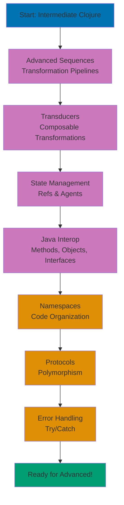
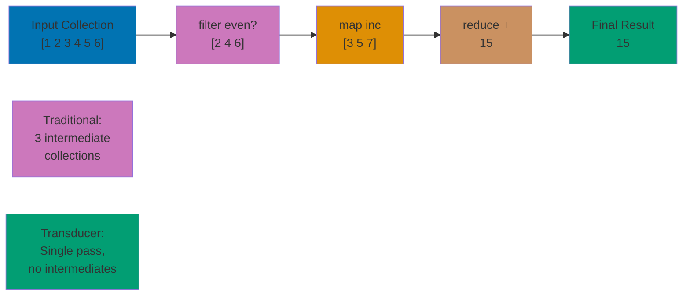
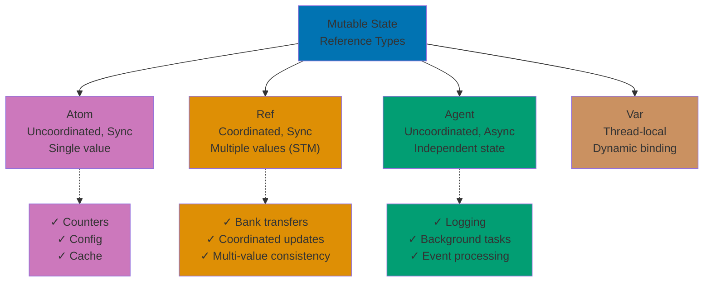
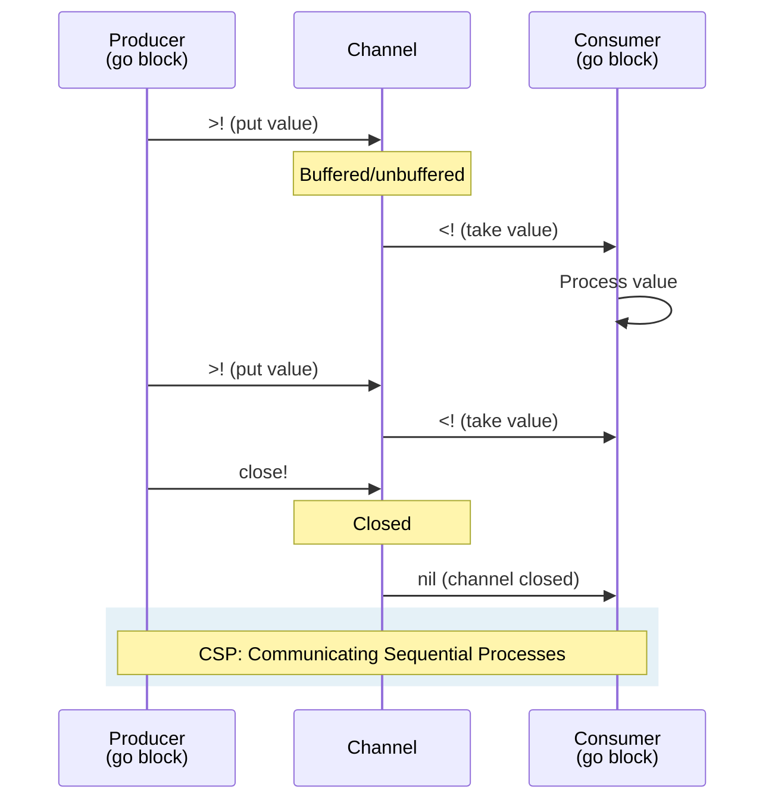
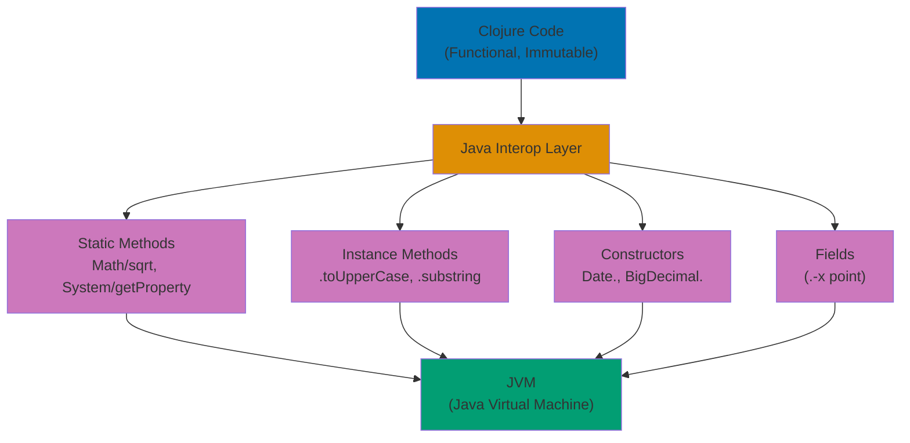

**Ready to build production-grade functional systems?** This intermediate tutorial teaches professional Clojure techniques used by companies like Nubank, Walmart, and Netflix. You'll master advanced sequence operations, state management strategies, seamless Java interoperability, and protocol-based polymorphism.

**Prerequisites**: Complete the [Beginner tutorial](/en/learn/software-engineering/programming-languages/clojure/by-concept/beginner) or have equivalent Clojure experience with immutability and basic functional programming. For mastery, progress to the [Advanced tutorial](/en/learn/software-engineering/programming-languages/clojure/by-concept/advanced).

## What You'll Learn

This intermediate tutorial teaches **production-ready Clojure patterns** - everything from advanced sequences through Java interop, giving you the skills to build real-world applications:

- Advanced sequence operations and transformations
- **Transducers** - Composable, efficient data transformations
- State management with **refs** (STM coordination) and **agents** (async updates)
- **Java interoperability** - Call Java methods, create objects, implement interfaces
- **Namespaces** - Organize code into modules
- **Protocols** - Polymorphism without classes
- Error handling strategies with try/catch
- Higher-order abstractions and function composition
- Practical exercises using Islamic finance examples

## Learning Path



This tutorial provides **60-85% coverage** of Clojure knowledge, preparing you for advanced topics like macros and core.async.

## Advanced Sequence Operations

### Sequence Transformation Pipeline

```clojure
;; Complex data transformation
(def transactions
  [{:type :zakat :amount 2500000 :date "2025-01-15"}
   {:type :sadaqah :amount 500000 :date "2025-01-20"}
   {:type :zakat :amount 1000000 :date "2025-02-10"}
   {:type :sadaqah :amount 750000 :date "2025-02-15"}
   {:type :zakat :amount 3000000 :date "2025-03-05"}])

;; Total Zakat payments using threading macro
(->> transactions
     (filter #(= (:type %) :zakat))
     (map :amount)
     (reduce +))
;; => 6500000

;; Group by type
(group-by :type transactions)
;; => {:zakat [{:type :zakat ...} ...],
;;     :sadaqah [{:type :sadaqah ...} ...]}

;; Sum by type
(->> transactions
     (group-by :type)
     (map (fn [[type txs]]
            [type (reduce + (map :amount txs))]))
     (into {}))
;; => {:zakat 6500000, :sadaqah 1250000}
```

### Partition and Window Operations

```clojure
;; partition - split into chunks
(partition 2 [1 2 3 4 5 6])
;; => ((1 2) (3 4) (5 6))

(partition 3 1 [1 2 3 4 5])  ;; Step of 1 (sliding window)
;; => ((1 2 3) (2 3 4) (3 4 5))

;; partition-by - split on predicate change
(partition-by #(< % 5) [1 2 3 7 8 2 3 9])
;; => ((1 2 3) (7 8) (2 3) (9))

;; Islamic finance: group consecutive months
(def monthly-balances [100 150 200 180 160 300 350 400])

(defn growing? [pair]
  (< (first pair) (second pair)))

(->> monthly-balances
     (partition 2 1)
     (partition-by growing?)
     (map count))
;; Identifies streaks of growth/decline
```

### Infinite Sequences

```clojure
;; Generate infinite payment schedule
(defn payment-stream [amount interval-months]
  (map (fn [month]
         {:month month :amount amount})
       (range)))

(take 5 (payment-stream 500000 1))
;; => ({:month 0 :amount 500000}
;;     {:month 1 :amount 500000}
;;     {:month 2 :amount 500000}
;;     {:month 3 :amount 500000}
;;     {:month 4 :amount 500000})

;; iterate - generate sequence by repeated function application
(take 5 (iterate #(* % 1.05) 1000000))  ;; 5% growth
;; => (1000000 1050000.0 1102500.0 1157625.0 1215506.25)

;; cycle - repeat sequence infinitely
(take 8 (cycle [:fajr :dhuhr :asr :maghrib :isha]))
;; => (:fajr :dhuhr :asr :maghrib :isha :fajr :dhuhr :asr)
```

## Transducers

Transducers are composable, efficient data transformation pipelines.

### Transducer Pipeline Visualization



### Basic Transducers

```clojure
;; Traditional approach (creates intermediate collections)
(reduce + (map inc (filter even? (range 10))))
;; => 25

;; Transducer approach (no intermediate collections)
(def xf
  (comp
    (filter even?)
    (map inc)))

(transduce xf + (range 10))
;; => 25

;; Reuse transducer with different operations
(transduce xf conj [] (range 10))
;; => [1 3 5 7 9]

;; Islamic finance: process Zakat assets efficiently
(def process-assets
  (comp
    (filter #(>= (:months-held %) 12))
    (map :value)
    (map #(* % 0.025))))

(def assets
  [{:name "Gold" :value 50000000 :months-held 12}
   {:name "Cash" :value 30000000 :months-held 8}
   {:name "Stocks" :value 40000000 :months-held 15}])

(transduce process-assets + 0 assets)
;; => 2250000.0 (Zakat on eligible assets)
```

### Custom Transducers

```clojure
;; Custom transducer that takes first n elements
(defn take-xf [n]
  (fn [rf]
    (let [remaining (atom n)]
      (fn
        ([] (rf))
        ([result] (rf result))
        ([result input]
         (if (pos? @remaining)
           (do
             (swap! remaining dec)
             (rf result input))
           result))))))

(transduce (take-xf 3) conj [] (range 10))
;; => [0 1 2]
```

### Transducer Benefits

**Performance**: No intermediate collections, single pass through data

**Composability**: Build complex transformations from simple pieces

**Reusability**: Same transducer works with different contexts (reduce, into, sequence, core.async channels)

## State Management: Refs and Agents

### State Management Strategy Overview



### Refs and Software Transactional Memory (STM)

Refs provide coordinated, synchronous updates to multiple values:

```clojure
;; Create refs
(def account-a (ref 1000000))
(def account-b (ref 2000000))

;; Read value
@account-a  ;; => 1000000

;; Coordinated update with dosync
(defn transfer [from to amount]
  (dosync
    (alter from - amount)
    (alter to + amount)))

(transfer account-a account-b 500000)

@account-a  ;; => 500000
@account-b  ;; => 2500000

;; Islamic finance: Murabaha contract with multiple refs
(def inventory (ref
  {"PROP-001" {:name "House" :cost 500000000}
   "PROP-002" {:name "Car" :cost 200000000}}))

(def contracts (ref {}))

(defn create-murabaha-contract [asset-id markup months]
  (dosync
    (let [asset (get @inventory asset-id)
          contract {:asset-id asset-id
                    :cost (:cost asset)
                    :markup markup
                    :months months}]
      (alter inventory dissoc asset-id)
      (alter contracts assoc asset-id contract))))

(create-murabaha-contract "PROP-001" 50000000 24)

@inventory   ;; => {"PROP-002" {:name "Car" ...}}
@contracts   ;; => {"PROP-001" {:asset-id "PROP-001" ...}}
```

### Agents

Agents provide asynchronous, independent state updates:

```clojure
;; Create agent
(def donation-total (agent 0))

;; Async update with send
(send donation-total + 500000)
;; Returns immediately, update happens asynchronously

;; Check value
@donation-total  ;; => might still be 0 (async!)

;; Wait for completion
(await donation-total)
@donation-total  ;; => 500000

;; send-off for blocking operations
(send-off donation-total
          (fn [total]
            (Thread/sleep 2000)  ;; Simulate slow operation
            (+ total 1000000)))

;; Islamic finance: async donation processing
(def donation-log (agent []))

(defn record-donation [amount donor]
  (send donation-log conj
        {:amount amount
         :donor donor
         :timestamp (java.util.Date.)}))

(record-donation 500000 "Ahmad")
(record-donation 750000 "Fatimah")

(await donation-log)
@donation-log
;; => [{:amount 500000 :donor "Ahmad" :timestamp ...}
;;     {:amount 750000 :donor "Fatimah" :timestamp ...}]
```

### Core.async Channels and Go Blocks



### State Management Strategy

**Atoms**: Uncoordinated, synchronous updates to single value

**Refs**: Coordinated, synchronous updates to multiple values (STM)

**Agents**: Asynchronous updates, independent state

**Vars**: Thread-local dynamic bindings

## Java Interoperability

Clojure runs on JVM with seamless Java integration.

### Java Interop Layers



### Calling Java Methods

```clojure
;; Static method call: ClassName/methodName
(Math/abs -10)              ;; => 10
(Math/sqrt 16)              ;; => 4.0
(System/currentTimeMillis)  ;; => 1738228800000

;; Instance method call: (.methodName object args)
(.toUpperCase "hello")      ;; => "HELLO"
(.substring "hello world" 0 5)  ;; => "hello"

;; Method chaining with (..)
(.. "hello world"
    (toUpperCase)
    (replace "O" "0"))      ;; => "HELL0 W0RLD"
```

### Creating Java Objects

```clojure
;; Constructor: (ClassName. args)
(def date (java.util.Date.))
date  ;; => #inst "2025-01-29T..."

(def big-decimal (java.math.BigDecimal. "123.45"))
big-decimal  ;; => 123.45M

;; Using new
(def array-list (new java.util.ArrayList))
array-list  ;; => []
```

### Accessing Fields

```clojure
;; Instance field: (.-fieldName object)
(def point (java.awt.Point. 10 20))
(.-x point)  ;; => 10
(.-y point)  ;; => 20
```

### Working with Java Collections

```clojure
;; Convert Clojure to Java
(def java-list (java.util.ArrayList. [1 2 3]))
(.add java-list 4)
java-list  ;; => [1 2 3 4]

;; Convert Java to Clojure
(into [] java-list)  ;; => [1 2 3 4]
(seq java-list)      ;; => (1 2 3 4)
```

### Implementing Java Interfaces

```clojure
;; reify - implement interface inline
(def comparator
  (reify java.util.Comparator
    (compare [this a b]
      (- a b))))

(java.util.Collections/sort (java.util.ArrayList. [3 1 4 1 5]) comparator)
;; => [1 1 3 4 5]

;; proxy - implement class/interface with state
(def file-filter
  (proxy [java.io.FileFilter] []
    (accept [file]
      (.endsWith (.getName file) ".clj"))))
```

### Islamic Finance Example: BigDecimal Precision

```clojure
;; Use Java's BigDecimal for precise currency calculations
(defn calculate-murabaha-payment [cost markup months]
  (let [cost-bd (java.math.BigDecimal. (str cost))
        markup-bd (java.math.BigDecimal. (str markup))
        months-bd (java.math.BigDecimal. (str months))
        total (.add cost-bd markup-bd)
        monthly (.divide total months-bd 2 java.math.RoundingMode/HALF_UP)]
    (.doubleValue monthly)))

(calculate-murabaha-payment 50000000 5000000 24)
;; => 2291666.67 (precise to 2 decimals)
```

## Namespaces

Organize code into logical modules.

### Defining Namespaces

```clojure
;; In file: zakat/calculator.clj
(ns zakat.calculator
  "Functions for calculating Zakat on various asset types.")

(def nisab-threshold 85000000)

(defn calculate-zakat [wealth]
  (* wealth 0.025))

(defn eligible? [wealth months-held]
  (and (>= wealth nisab-threshold)
       (>= months-held 12)))
```

### Requiring Namespaces

```clojure
;; Require with alias
(ns finance.app
  (:require [zakat.calculator :as zakat]))

(zakat/calculate-zakat 100000000)  ;; => 2500000.0

;; Require specific functions
(ns finance.app
  (:require [zakat.calculator :refer [calculate-zakat eligible?]]))

(calculate-zakat 100000000)  ;; => 2500000.0
(eligible? 100000000 12)     ;; => true

;; Require all (use sparingly)
(ns finance.app
  (:require [zakat.calculator :refer :all]))
```

### Private Functions

```clojure
(ns zakat.calculator)

;; Private function (defn-)
(defn- validate-input [wealth]
  (when (neg? wealth)
    (throw (ex-info "Wealth cannot be negative" {:wealth wealth}))))

(defn calculate-zakat [wealth]
  (validate-input wealth)
  (* wealth 0.025))

;; validate-input not accessible from other namespaces
```

## Protocols

Protocols provide polymorphism without inheritance.

### Defining Protocols

```clojure
;; Define protocol
(defprotocol Calculable
  "Protocol for Islamic finance calculations"
  (calculate-payment [this] "Calculate payment amount")
  (calculate-total [this] "Calculate total amount"))

;; Implement protocol with defrecord
(defrecord MurabahaContract [cost markup months]
  Calculable
  (calculate-payment [this]
    (/ (+ cost markup) months))
  (calculate-total [this]
    (+ cost markup)))

(defrecord IjarahLease [asset-value duration monthly-rate]
  Calculable
  (calculate-payment [this]
    (* asset-value monthly-rate))
  (calculate-total [this]
    (* asset-value monthly-rate duration)))

;; Usage
(def murabaha (->MurabahaContract 50000000 5000000 24))
(calculate-payment murabaha)  ;; => 2291666.666...
(calculate-total murabaha)    ;; => 55000000

(def ijarah (->IjarahLease 100000000 36 0.02))
(calculate-payment ijarah)    ;; => 2000000.0
(calculate-total ijarah)      ;; => 72000000.0
```

### Extending Existing Types

```clojure
;; Extend protocol to existing type
(extend-protocol Calculable
  clojure.lang.PersistentVector
  (calculate-total [v]
    (reduce + v)))

(calculate-total [1000000 2000000 3000000])  ;; => 6000000
```

### Protocol vs. Multimethod

**Protocols**: Fast dispatch on type, best for polymorphism

**Multimethods**: Flexible dispatch on any function, more powerful but slower

```clojure
;; Multimethod example
(defmulti calculate-zakat-rate :asset-type)

(defmethod calculate-zakat-rate :wealth [_]
  0.025)

(defmethod calculate-zakat-rate :agriculture [_]
  0.10)

(defmethod calculate-zakat-rate :livestock [_]
  0.025)

(calculate-zakat-rate {:asset-type :agriculture})  ;; => 0.10
```

## Error Handling

### Try/Catch

```clojure
;; Basic error handling
(defn parse-amount [s]
  (try
    (Double/parseDouble s)
    (catch NumberFormatException e
      (println "Invalid number:" s)
      nil)))

(parse-amount "1000000")   ;; => 1000000.0
(parse-amount "invalid")   ;; prints "Invalid number: invalid", returns nil

;; Multiple catch clauses
(defn safe-divide [a b]
  (try
    (/ a b)
    (catch ArithmeticException e
      (println "Cannot divide by zero")
      nil)
    (catch Exception e
      (println "Unexpected error:" (.getMessage e))
      nil)))
```

### Custom Exceptions with ex-info

```clojure
;; Throw exception with data
(defn validate-zakat-input [{:keys [wealth months-held]}]
  (when (neg? wealth)
    (throw (ex-info "Wealth cannot be negative"
                    {:reason :invalid-wealth
                     :wealth wealth})))
  (when (neg? months-held)
    (throw (ex-info "Months held cannot be negative"
                    {:reason :invalid-duration
                     :months-held months-held}))))

;; Catch and extract data
(try
  (validate-zakat-input {:wealth -1000000 :months-held 12})
  (catch Exception e
    (let [data (ex-data e)]
      (println "Error:" (.getMessage e))
      (println "Reason:" (:reason data))
      (println "Value:" (:wealth data)))))
;; Output:
;; Error: Wealth cannot be negative
;; Reason: :invalid-wealth
;; Value: -1000000
```

### Finally Clause

```clojure
;; Resource cleanup with finally
(defn process-transaction [file-path]
  (let [writer (java.io.FileWriter. file-path)]
    (try
      (.write writer "Transaction data")
      (catch Exception e
        (println "Error writing:" (.getMessage e)))
      (finally
        (.close writer)  ;; Always executes
        (println "File closed")))))
```

## Practical Exercise: Islamic Finance Portfolio Manager

```clojure
(ns finance.portfolio
  "Portfolio management for Islamic investments")

;; Protocol for investment types
(defprotocol Investment
  (current-value [this] "Current value of investment")
  (calculate-zakat [this] "Zakat owed on investment")
  (description [this] "Human-readable description"))

;; Murabaha contract implementation
(defrecord MurabahaInvestment [asset-id cost markup months-remaining]
  Investment
  (current-value [this]
    (+ cost markup))
  (calculate-zakat [this]
    (* (current-value this) 0.025))
  (description [this]
    (str "Murabaha Contract " asset-id
         " - " (current-value this) " total value")))

;; Sukuk (Islamic bond) implementation
(defrecord SukukHolding [sukuk-id principal profit-rate maturity-years]
  Investment
  (current-value [this]
    principal)
  (calculate-zakat [this]
    (* principal 0.025))
  (description [this]
    (str "Sukuk " sukuk-id
         " - " principal " principal @ " (* profit-rate 100) "%")))

;; Portfolio state with refs (coordinated updates)
(def portfolio (ref {}))
(def total-value (ref 0))

;; Add investment (coordinated update)
(defn add-investment! [id investment]
  (dosync
    (alter portfolio assoc id investment)
    (alter total-value + (current-value investment))))

;; Remove investment (coordinated update)
(defn remove-investment! [id]
  (dosync
    (when-let [investment (get @portfolio id)]
      (alter portfolio dissoc id)
      (alter total-value - (current-value investment)))))

;; Calculate total Zakat (pure function)
(defn total-zakat []
  (->> @portfolio
       vals
       (map calculate-zakat)
       (reduce +)))

;; Generate report
(defn generate-report []
  (println "=== Islamic Finance Portfolio ===\n")
  (println "Investments:")
  (doseq [[id investment] @portfolio]
    (println "  " id ":")
    (println "    " (description investment))
    (println "     Zakat due:" (calculate-zakat investment)))
  (println "\nTotal Portfolio Value:" @total-value)
  (println "Total Zakat Due:" (total-zakat)))

;; Usage
(add-investment! :murabaha-1
  (->MurabahaInvestment "PROP-001" 50000000 5000000 18))

(add-investment! :sukuk-1
  (->SukukHolding "SUK-2025-A" 100000000 0.06 5))

(add-investment! :murabaha-2
  (->MurabahaInvestment "CAR-001" 30000000 3000000 12))

(generate-report)
;; Output:
;; === Islamic Finance Portfolio ===
;;
;; Investments:
;;    :murabaha-1 :
;;      Murabaha Contract PROP-001 - 55000000 total value
;;      Zakat due: 1375000.0
;;    :sukuk-1 :
;;      Sukuk SUK-2025-A - 100000000 principal @ 6.0%
;;      Zakat due: 2500000.0
;;    :murabaha-2 :
;;      Murabaha Contract CAR-001 - 33000000 total value
;;      Zakat due: 825000.0
;;
;; Total Portfolio Value: 188000000
;; Total Zakat Due: 4700000.0
```

## Common Patterns and Best Practices

### Use Transducers for Performance

```clojure
;; Good: single pass, no intermediate collections
(transduce
  (comp (filter eligible?) (map calculate-zakat))
  +
  assets)

;; Less efficient: multiple passes, intermediate collections
(reduce + (map calculate-zakat (filter eligible? assets)))
```

### Leverage Java Interop

```clojure
;; Use Java's DateTimeFormatter for dates
(import 'java.time.format.DateTimeFormatter
        'java.time.LocalDate)

(defn format-date [date]
  (.format date (DateTimeFormatter/ofPattern "yyyy-MM-dd")))
```

### Prefer Protocols for Polymorphism

```clojure
;; Good: protocol-based
(defprotocol Payable
  (amount-due [this]))

;; Less flexible: conditional logic
(defn amount-due [contract]
  (case (:type contract)
    :murabaha (calculate-murabaha contract)
    :ijarah (calculate-ijarah contract)))
```

### Use Refs for Coordinated State

```clojure
;; Multiple related values that must update together
(def account-a (ref 1000000))
(def account-b (ref 2000000))

(dosync
  (alter account-a - 500000)
  (alter account-b + 500000))
```

## Next Steps

You've completed the intermediate tutorial covering 60-85% of Clojure knowledge. You can now:

- Process data efficiently with transducers
- Manage coordinated state with refs and async state with agents
- Interoperate seamlessly with Java libraries
- Organize code with namespaces
- Implement polymorphism with protocols
- Handle errors robustly

**Continue learning**:

- [Advanced](/en/learn/software-engineering/programming-languages/clojure/by-concept/advanced) - Macros, core.async, STM deep dive, performance (85-95%)
- [By Example](/en/learn/software-engineering/programming-languages/clojure/by-example) - Code-first approach with 75-90 annotated examples

**Build projects**:

- Create a multi-account banking system with STM
- Build REST API with Ring and Compojure
- Develop data processing pipeline with transducers
- Implement complex financial calculations with Java BigDecimal interop
