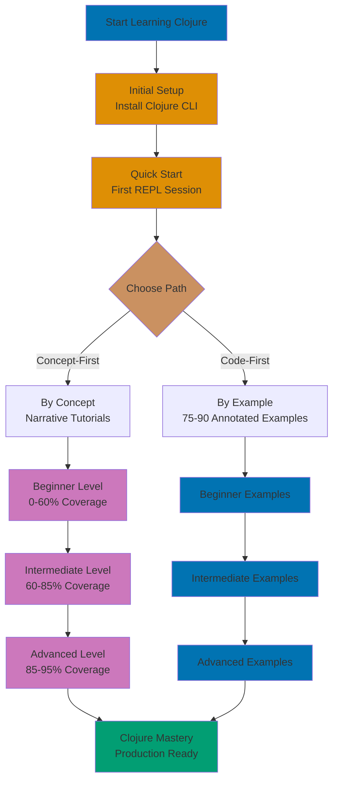

Learn Clojure through concept-based tutorials that emphasize understanding WHY alongside HOW. This section provides comprehensive narrative tutorials organized by difficulty level, focusing on building strong mental models of functional programming, immutability, and Clojure's Lisp heritage.

## What is Concept-Based Learning

**Concept-based learning** focuses on understanding the underlying principles, design decisions, and mental models that make Clojure unique. Rather than jumping straight to code examples, concept-based tutorials:

- **Explain the WHY** - Why does Clojure embrace immutability? Why use persistent data structures?
- **Build mental models** - How do REPL-driven development work? What's the execution model?
- **Connect concepts** - How do sequences relate to lazy evaluation? How do atoms complement STM?
- **Provide context** - What problems does this feature solve? When should you use it?
- **Progressive disclosure** - Start with simple explanations, gradually add complexity

This approach builds deeper understanding than code-first learning alone, helping you reason about Clojure programs and embrace functional thinking.

## How it Differs from By-Example

ayokoding-web offers two complementary learning paths for Clojure:

### By-Example Approach

**Focus**: Code-first, practical learning through heavily annotated examples

**Structure**:

- 75-90 complete, runnable code examples
- Heavy annotation (1-2.25 comments per line)
- Minimal prose, maximum code
- Quick reference format
- 95% language coverage efficiently

**Best for**:

- Learning by doing
- Quick reference lookup
- Experienced programmers who prefer code
- Building muscle memory through practice

**See**: [By Example](/en/learn/software-engineering/programming-languages/clojure/by-example)

### By-Concept Approach (This Section)

**Focus**: Understanding-first, narrative learning through conceptual explanations

**Structure**:

- Progressive narrative tutorials
- Deep explanations of functional principles
- Examples support concepts (not vice versa)
- Comprehensive coverage
- 0-95% knowledge systematically

**Best for**:

- Building mental models
- Understanding design rationale
- Systematic progression
- Deep comprehension
- First-time functional programmers

**Both approaches are valid** - choose based on your learning style, or use both together for maximum understanding.

## Organization by Difficulty Levels

Concept-based tutorials are organized into three progressive difficulty levels, each building on the previous:

### Beginner (0-60% Coverage)

**Target Audience**: Programmers new to Clojure and functional programming with basic programming knowledge

**Learning Focus**:

- Clojure syntax and Lisp fundamentals
- Immutability and pure functions
- Basic data structures (lists, vectors, maps, sets)
- Functions as first-class values
- REPL-driven development workflow
- Destructuring and pattern matching
- Essential standard library usage

**Outcome**: Write functional Clojure programs, understand immutability benefits, use REPL effectively, ready for intermediate patterns.

**Prerequisites**: Basic programming concepts (variables, functions, control flow) in any language

### Intermediate (60-85% Coverage)

**Target Audience**: Developers comfortable with Clojure basics ready for production patterns

**Learning Focus**:

- Higher-order functions and functional composition
- Lazy sequences and infinite data structures
- State management (atoms, refs, agents)
- Java interoperability
- Namespaces and code organization
- Error handling with try/catch
- Collection operations and transducers
- Protocol and polymorphism basics

**Outcome**: Build production-quality applications, manage state functionally, interoperate with Java, use Clojure's ecosystem effectively.

**Prerequisites**: Completed beginner level or equivalent Clojure experience

### Advanced (85-95% Coverage)

**Target Audience**: Experienced Clojure developers seeking mastery and sophisticated patterns

**Learning Focus**:

- Macros and metaprogramming
- Advanced protocols and datatypes
- Core.async for CSP-style concurrency
- Transducers and performance optimization
- STM (Software Transactional Memory)
- Testing strategies with clojure.test
- ClojureScript and compiler differences
- Spec for validation and generative testing

**Outcome**: Master advanced Clojure features, write macros, optimize performance, design sophisticated functional systems, leverage metaprogramming.

**Prerequisites**: Completed intermediate level or significant production Clojure experience

## Islamic Finance Learning Context

All tutorials use **authentic Islamic finance examples** to make concepts concrete and relevant:

### Zakat (Obligatory Charity)

Used to teach:

- **Pure functions** - Calculating 2.5% without side effects
- **Immutability** - Wealth values never mutate
- **Data structures** - Tracking assets with maps
- **Function composition** - Building complex calculations from simple functions

```clojure
;; Beginner example: Simple Zakat calculation
(defn calculate-zakat [wealth]
  (let [nisab-threshold (* 85 1000000.0)] ;; 85 grams gold equivalent
    (if (< wealth nisab-threshold)
      0.0  ;; Below threshold: no Zakat due
      (* wealth 0.025))))  ;; 2.5% of eligible wealth
```

### Murabaha (Cost-Plus Financing)

Used to teach:

- **Records** - Modeling contract structure immutably
- **Computed properties** - Deriving total from cost + markup
- **Protocols** - Contract behavior abstraction
- **Namespace organization** - Separating concerns

```clojure
;; Intermediate example: Murabaha contract modeling
(defrecord MurabahaContract [asset-cost profit-margin installment-months])

(defn total-price [{:keys [asset-cost profit-margin]}]
  ;; Total price: cost + agreed profit (transparent)
  (+ asset-cost profit-margin))

(defn monthly-payment [contract]
  ;; Equal monthly installments
  (/ (total-price contract) (:installment-months contract)))
```

### Sadaqah (Voluntary Charity)

Used to teach:

- **Core.async channels** - Asynchronous donation tracking
- **Go blocks** - Lightweight concurrency
- **Atoms** - Managing running donation totals
- **Transducers** - Efficient data transformation pipelines

```clojure
;; Advanced example: Asynchronous donation tracking
(require '[clojure.core.async :refer [chan go <! >! timeout]])

(defn track-donations []
  (let [ch (chan)]
    (go
      (<! (timeout 1000))
      (>! ch 100.0)  ;; First donation
      (<! (timeout 2000))
      (>! ch 250.0)  ;; Second donation
      (<! (timeout 1000))
      (>! ch 500.0)) ;; Third donation
    ch))
```

These examples provide **meaningful context** while teaching functional programming concepts, making abstract ideas concrete through real-world Islamic finance applications.

## Target Audience for Each Level

### Who Should Start with Beginner

- Programmers with experience in imperative/OOP languages (Java, C++, JavaScript, Python, etc.)
- Developers new to functional programming paradigm
- Students learning Lisp for the first time
- Backend developers exploring Clojure for JVM integration
- Anyone wanting comprehensive foundation in functional thinking

### Who Should Start with Intermediate

- Developers who completed beginner level
- Programmers with functional programming experience (Haskell, Scala, F#)
- Developers comfortable with Clojure syntax seeking production patterns
- Java developers wanting deeper functional JVM knowledge

### Who Should Start with Advanced

- Developers who completed intermediate level
- Experienced Clojure programmers seeking mastery
- Library/package authors needing metaprogramming knowledge
- Performance-critical application developers
- Developers exploring ClojureScript or advanced concurrency

## Learning Path



**Recommended approach**: Start with concept-based beginner, supplement with by-example for specific features, return to concept-based for deeper understanding.

## How to Use This Section

### For Complete Beginners

1. Complete [Initial Setup](/en/learn/software-engineering/programming-languages/clojure/initial-setup) first
2. Optionally complete [Quick Start](/en/learn/software-engineering/programming-languages/clojure/quick-start)
3. Start with [Beginner](/en/learn/software-engineering/programming-languages/clojure/by-concept/beginner) tutorial
4. Read sequentially - sections build on each other
5. Type all code in REPL yourself
6. Complete exercises before moving forward
7. Supplement with [By Example](/en/learn/software-engineering/programming-languages/clojure/by-example) for practice

### For Experienced Functional Programmers

1. Skim [Beginner](/en/learn/software-engineering/programming-languages/clojure/by-concept/beginner) for Clojure-specific syntax (Lisp, destructuring)
2. Focus on [Intermediate](/en/learn/software-engineering/programming-languages/clojure/by-concept/intermediate) for state management patterns
3. Study [Advanced](/en/learn/software-engineering/programming-languages/clojure/by-concept/advanced) for macros and core.async
4. Use [By Example](/en/learn/software-engineering/programming-languages/clojure/by-example) for quick reference

### For Reference

- Jump to specific sections as needed
- Use table of contents for navigation
- Cross-reference with by-example for code patterns
- Bookmark frequently referenced concepts

## Complementary Resources

**Within ayokoding-web**:

- [Overview](/en/learn/software-engineering/programming-languages/clojure/overview) - Clojure language overview and philosophy
- [Initial Setup](/en/learn/software-engineering/programming-languages/clojure/initial-setup) - Installation and configuration
- [Quick Start](/en/learn/software-engineering/programming-languages/clojure/quick-start) - First REPL session
- [By Example](/en/learn/software-engineering/programming-languages/clojure/by-example) - Code-first learning path

**External resources**:

- Official Clojure documentation for API reference
- ClojureDocs for community examples
- Clojure Koans for interactive learning
- Clojars for library ecosystem

## Coverage Target: 95%

Combined beginner, intermediate, and advanced levels provide approximately **95% of practical Clojure knowledge** needed for real-world development.

**What's covered** (95%):

- Complete language syntax and Lisp fundamentals
- Functional programming paradigm
- Immutable data structures
- State management approaches
- REPL-driven development
- Java interoperability
- Macros and metaprogramming
- Concurrency with core.async
- Production development patterns

**What's not covered** (remaining 5%):

- Obscure language features rarely used in practice
- Platform-specific internals (JVM implementation details)
- Experimental features not yet stabilized
- Framework-specific patterns (covered in framework tutorials)

This 95% coverage prepares you for:

- Backend development with Ring/Compojure
- Web applications with ClojureScript/Reagent
- Data processing pipelines
- JVM integration and microservices
- Library/package authorship

## Start Learning

Ready to embrace functional programming with Clojure? Choose your starting level:

- [Beginner](/en/learn/software-engineering/programming-languages/clojure/by-concept/beginner) - Functional foundation (0-60%)
- [Intermediate](/en/learn/software-engineering/programming-languages/clojure/by-concept/intermediate) - Production patterns (60-85%)
- [Advanced](/en/learn/software-engineering/programming-languages/clojure/by-concept/advanced) - Mastery and metaprogramming (85-95%)

Or explore [By Example](/en/learn/software-engineering/programming-languages/clojure/by-example) for code-first learning.
