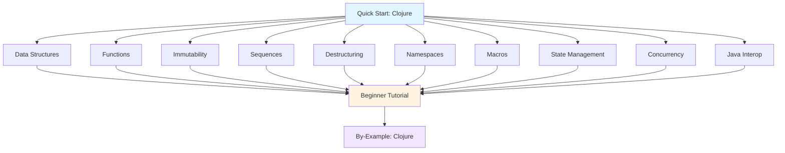

**Want to learn Clojure fundamentals quickly?** This quick start touches 10 core Clojure concepts with one example each. By the end, you'll have practical touchpoints for the most important language features.

This tutorial provides 5-30% coverage - rapid exposure to core concepts. For comprehensive mastery, continue to [Beginner Tutorial](/en/learn/software-engineering/programming-languages/clojure/by-concept/beginner) (0-60% coverage) or explore [By-Example](/en/learn/software-engineering/programming-languages/clojure/by-example) for heavily annotated code.

## Prerequisites

Before starting, you should have:

- Completed [Initial Setup](/en/learn/software-engineering/programming-languages/clojure/initial-setup) - Clojure and JDK installed
- A text editor or IDE (IntelliJ with Cursive, Emacs with CIDER, VS Code with Calva)
- Basic understanding of programming concepts
- Willingness to embrace prefix notation and parentheses
- Familiarity with REPL-driven development

## Learning Objectives

By the end of this tutorial, you will have touchpoints for:

1. **Data Structures and Literals** - Lists, vectors, maps, sets, immutability
2. **Functions** - First-class functions, higher-order functions, anonymous functions
3. **Immutability and Persistent Data** - Structural sharing, efficient updates
4. **Sequences and Lazy Evaluation** - Infinite sequences, lazy processing
5. **Destructuring** - Pattern matching for data extraction
6. **Namespaces and Vars** - Code organization and modularity
7. **Macros** - Code as data, compile-time metaprogramming
8. **State Management** - Atoms, refs, agents for managed state
9. **Concurrency** - Software transactional memory, thread-safe operations
10. **Java Interop** - Seamless Java integration

## Learning Path



## Concept 1: Data Structures and Literals - Code as Data

Clojure has built-in immutable data structures with simple literal syntax.

### Example: Lists, Vectors, Maps, and Sets

```clojure
;; Lists - linked lists, optimal for sequential access
(def my-list '(1 2 3 4 5))
;; => (1 2 3 4 5)

(first my-list)  ;; => 1
(rest my-list)   ;; => (2 3 4 5)
(cons 0 my-list) ;; => (0 1 2 3 4 5)

;; Vectors - indexed access, append at end
(def my-vector [1 2 3 4 5])
;; => [1 2 3 4 5]

(get my-vector 0)   ;; => 1
(my-vector 2)       ;; => 3 (vector as function)
(conj my-vector 6)  ;; => [1 2 3 4 5 6]

;; Maps - key-value associations
(def my-map {:name "Alice" :age 30 :city "NYC"})
;; => {:name "Alice", :age 30, :city "NYC"}

(get my-map :name)     ;; => "Alice"
(:name my-map)         ;; => "Alice" (keyword as function)
(my-map :age)          ;; => 30 (map as function)
(assoc my-map :country "USA")
;; => {:name "Alice", :age 30, :city "NYC", :country "USA"}

;; Sets - unique elements
(def my-set #{1 2 3 4 5})
;; => #{1 2 3 4 5}

(contains? my-set 3)  ;; => true
(conj my-set 6)       ;; => #{1 2 3 4 5 6}
(disj my-set 3)       ;; => #{1 2 4 5}

;; Keywords - efficient identifiers
(def status :active)   ;; => :active
(def role :admin)      ;; => :admin

;; Strings
(def greeting "Hello, World!")
;; => "Hello, World!"

(str "Hello, " "Alice")  ;; => "Hello, Alice"

;; Nested data structures
(def person
  {:name "Bob"
   :age 25
   :address {:street "123 Main St"
             :city "Boston"
             :zip "02101"}
   :hobbies ["reading" "gaming" "coding"]})

(get-in person [:address :city])  ;; => "Boston"
(update-in person [:age] inc)
;; => {:name "Bob", :age 26, :address {...}, :hobbies [...]}

;; Collection operations
(count my-vector)  ;; => 5
(empty? [])        ;; => true
(seq my-vector)    ;; => (1 2 3 4 5)

;; Equality
(= [1 2 3] '(1 2 3))  ;; => true (structural equality)
(identical? [1 2 3] [1 2 3])  ;; => false (reference equality)
```

**Key concepts**: Lists `'()`, vectors `[]`, maps `{}`, sets `#{}`, keywords `:keyword`, immutability

**When to explore deeper**: [Beginner Tutorial - Data Structures](/en/learn/software-engineering/programming-languages/clojure/by-concept/beginner#data-structures)

## Concept 2: Functions - First-Class Values

Functions are first-class values that can be passed, returned, and composed.

### Example: Defining and Using Functions

```clojure
;; Named function
(defn greet [name]
  (str "Hello, " name "!"))

(greet "Alice")  ;; => "Hello, Alice!"

;; Multiple arity (different parameter counts)
(defn greet-multi
  ([] (greet-multi "World"))
  ([name] (str "Hello, " name "!"))
  ([title name] (str "Hello, " title " " name "!")))

(greet-multi)                    ;; => "Hello, World!"
(greet-multi "Bob")              ;; => "Hello, Bob!"
(greet-multi "Dr." "Smith")      ;; => "Hello, Dr. Smith!"

;; Variadic functions (rest parameters)
(defn sum [& numbers]
  (reduce + 0 numbers))

(sum 1 2 3 4 5)  ;; => 15

;; Anonymous functions (lambda)
(def double (fn [x] (* 2 x)))
(double 5)  ;; => 10

;; Short lambda syntax
(def triple #(* 3 %))
(triple 5)  ;; => 15

;; Multiple parameters in short syntax
(def add #(+ %1 %2))
(add 3 7)  ;; => 10

;; Higher-order functions
(defn apply-twice [f x]
  (f (f x)))

(apply-twice inc 5)  ;; => 7
(apply-twice double 3)  ;; => 12

;; Returning functions
(defn make-multiplier [factor]
  (fn [x] (* factor x)))

(def times-five (make-multiplier 5))
(times-five 10)  ;; => 50

;; Function composition
(def add-then-double (comp double inc))
(add-then-double 5)  ;; => 12 (first inc, then double)

;; Partial application
(def add-five (partial + 5))
(add-five 10)  ;; => 15

;; Threading macros
(-> 5
    inc      ;; => 6
    double   ;; => 12
    (- 2))   ;; => 10

(->> [1 2 3 4 5]
     (map inc)       ;; => (2 3 4 5 6)
     (filter even?)  ;; => (2 4 6)
     (reduce +))     ;; => 12

;; let binding
(defn calculate-area [radius]
  (let [pi 3.14159
        square #(* % %)]
    (* pi (square radius))))

(calculate-area 5)  ;; => 78.53975

;; Private functions
(defn- helper-function [x]
  (* x 2))

(defn public-function [x]
  (helper-function (+ x 1)))

(public-function 5)  ;; => 12
```

**Key concepts**: `defn`, `fn`, anonymous functions `#()`, `comp`, `partial`, threading macros `->` and `->>`

**When to explore deeper**: [Beginner Tutorial - Functions](/en/learn/software-engineering/programming-languages/clojure/by-concept/beginner#functions)

## Concept 3: Immutability and Persistent Data - Efficient Updates

All Clojure data structures are immutable with structural sharing for efficiency.

### Example: Persistent Data Structures

```clojure
;; Original data unchanged
(def original-vector [1 2 3 4 5])
(def new-vector (conj original-vector 6))

original-vector  ;; => [1 2 3 4 5] (unchanged)
new-vector       ;; => [1 2 3 4 5 6]

;; Map operations
(def person {:name "Alice" :age 30})
(def updated-person (assoc person :city "NYC"))

person           ;; => {:name "Alice", :age 30} (unchanged)
updated-person   ;; => {:name "Alice", :age 30, :city "NYC"}

;; Dissoc (remove key)
(def removed (dissoc updated-person :city))
removed  ;; => {:name "Alice", :age 30}

;; Update with function
(def person-older (update person :age inc))
person-older  ;; => {:name "Alice", :age 31}

;; Nested updates
(def company
  {:name "TechCorp"
   :employees [{:name "Alice" :salary 80000}
               {:name "Bob" :salary 75000}]})

(def updated-company
  (update-in company [:employees 0 :salary] + 5000))

company  ;; => Original unchanged
updated-company
;; => {:name "TechCorp",
;;     :employees [{:name "Alice", :salary 85000}
;;                 {:name "Bob", :salary 75000}]}

;; Merge maps
(def map1 {:a 1 :b 2})
(def map2 {:b 3 :c 4})
(merge map1 map2)  ;; => {:a 1, :b 3, :c 4}

;; Select keys
(def user {:id 1 :name "Alice" :email "alice@example.com" :password "secret"})
(select-keys user [:id :name])  ;; => {:id 1, :name "Alice"}

;; Vector operations
(def v [1 2 3 4 5])
(pop v)   ;; => [1 2 3 4] (remove last)
(peek v)  ;; => 5 (get last)
(assoc v 2 99)  ;; => [1 2 99 4 5] (replace index 2)

;; Set operations
(def set1 #{1 2 3})
(def set2 #{3 4 5})

(clojure.set/union set1 set2)        ;; => #{1 2 3 4 5}
(clojure.set/intersection set1 set2) ;; => #{3}
(clojure.set/difference set1 set2)   ;; => #{1 2}

;; Transients (temporary mutability for performance)
(defn build-vector [n]
  (persistent!
    (reduce conj!
            (transient [])
            (range n))))

(build-vector 5)  ;; => [0 1 2 3 4]
;; Much faster than repeated conj for large collections
```

**Key concepts**: Immutability, structural sharing, `assoc`, `dissoc`, `update`, `update-in`, transients

**When to explore deeper**: [Beginner Tutorial - Immutability](/en/learn/software-engineering/programming-languages/clojure/by-concept/beginner#immutability)

## Concept 4: Sequences and Lazy Evaluation - Infinite Possibilities

Sequences provide uniform interface to collections with lazy evaluation.

### Example: Lazy Sequences

```clojure
;; Sequence operations
(def numbers [1 2 3 4 5 6 7 8 9 10])

;; map - transform each element
(map inc numbers)  ;; => (2 3 4 5 6 7 8 9 10 11)
(map #(* % %) numbers)  ;; => (1 4 9 16 25 36 49 64 81 100)

;; filter - keep matching elements
(filter even? numbers)  ;; => (2 4 6 8 10)
(filter #(> % 5) numbers)  ;; => (6 7 8 9 10)

;; reduce - accumulate
(reduce + numbers)  ;; => 55
(reduce * 1 numbers)  ;; => 3628800

;; take, drop
(take 3 numbers)  ;; => (1 2 3)
(drop 3 numbers)  ;; => (4 5 6 7 8 9 10)

;; take-while, drop-while
(take-while #(< % 5) numbers)  ;; => (1 2 3 4)
(drop-while #(< % 5) numbers)  ;; => (5 6 7 8 9 10)

;; Infinite sequences (lazy!)
(def naturals (iterate inc 1))  ;; => (1 2 3 4 5 6 ...)
(take 10 naturals)  ;; => (1 2 3 4 5 6 7 8 9 10)

(def evens (iterate #(+ 2 %) 0))  ;; => (0 2 4 6 8 ...)
(take 5 evens)  ;; => (0 2 4 6 8)

;; repeat - infinite repetition
(take 5 (repeat "hello"))  ;; => ("hello" "hello" "hello" "hello" "hello")

;; cycle - repeat sequence infinitely
(take 10 (cycle [1 2 3]))  ;; => (1 2 3 1 2 3 1 2 3 1)

;; range - generate number sequence
(range 5)        ;; => (0 1 2 3 4)
(range 1 6)      ;; => (1 2 3 4 5)
(range 0 10 2)   ;; => (0 2 4 6 8)

;; Lazy sequence from function
(defn fibonacci []
  ((fn fib [a b]
     (lazy-seq (cons a (fib b (+ a b)))))
   0 1))

(take 10 (fibonacci))  ;; => (0 1 1 2 3 5 8 13 21 34)

;; Chaining operations (composable!)
(->> numbers
     (filter even?)
     (map #(* % %))
     (reduce +))
;; => 220 (sum of squares of evens: 4 + 16 + 36 + 64 + 100)

;; partition - group into chunks
(partition 3 numbers)  ;; => ((1 2 3) (4 5 6) (7 8 9))
(partition-all 3 numbers)  ;; => ((1 2 3) (4 5 6) (7 8 9) (10))

;; interleave
(interleave [1 2 3] [:a :b :c])  ;; => (1 :a 2 :b 3 :c)

;; mapcat - map then concatenate
(mapcat #(repeat % %) [1 2 3])  ;; => (1 2 2 3 3 3)

;; some - find first truthy result
(some even? numbers)  ;; => true
(some #(when (> % 5) %) numbers)  ;; => 6

;; every? - check all elements
(every? pos? numbers)  ;; => true
(every? even? numbers)  ;; => false

;; Lazy evaluation demonstration
(defn expensive-computation [x]
  (println "Computing for" x)
  (* x x))

(def lazy-results (map expensive-computation [1 2 3 4 5]))
;; No output yet - not evaluated!

(take 2 lazy-results)
;; Computing for 1
;; Computing for 2
;; => (1 4)
;; Only computed what's needed!
```

**Key concepts**: `map`, `filter`, `reduce`, lazy sequences, `take`, `iterate`, infinite sequences

**When to explore deeper**: [Beginner Tutorial - Sequences](/en/learn/software-engineering/programming-languages/clojure/by-concept/beginner#sequences)

## Concept 5: Destructuring - Pattern Matching for Data

Destructuring extracts values from data structures with concise syntax.

### Example: Destructuring Vectors, Maps, and Nested Data

```clojure
;; Vector destructuring
(let [[a b c] [1 2 3]]
  (println a b c))  ;; 1 2 3

;; With rest
(let [[first second & rest] [1 2 3 4 5]]
  (println first)   ;; 1
  (println second)  ;; 2
  (println rest))   ;; (3 4 5)

;; Skip elements
(let [[a _ c] [1 2 3]]
  (println a c))  ;; 1 3

;; Keep original
(let [[a b :as original] [1 2 3]]
  (println a b)       ;; 1 2
  (println original)) ;; [1 2 3]

;; Map destructuring
(let [{:keys [name age]} {:name "Alice" :age 30}]
  (println name age))  ;; Alice 30

;; With different variable names
(let [{n :name a :age} {:name "Bob" :age 25}]
  (println n a))  ;; Bob 25

;; With defaults
(let [{:keys [name age country]
       :or {country "USA"}} {:name "Charlie" :age 35}]
  (println name age country))  ;; Charlie 35 USA

;; Keep original map
(let [{:keys [name age] :as person} {:name "David" :age 40}]
  (println name age)  ;; David 40
  (println person))   ;; {:name "David", :age 40}

;; String keys
(let [{:strs [name age]} {"name" "Eve" "age" 28}]
  (println name age))  ;; Eve 28

;; Symbol keys
(let [{:syms [x y]} {'x 10 'y 20}]
  (println x y))  ;; 10 20

;; Nested destructuring
(let [{:keys [name address]
       {:keys [city state]} :address}
      {:name "Frank"
       :address {:city "Boston" :state "MA" :zip "02101"}}]
  (println name city state))  ;; Frank Boston MA

;; Function parameter destructuring
(defn greet-person [{:keys [name age]}]
  (str "Hello, " name "! You are " age " years old."))

(greet-person {:name "Alice" :age 30})
;; => "Hello, Alice! You are 30 years old."

;; Vector parameters
(defn process-coords [[x y]]
  (str "X: " x ", Y: " y))

(process-coords [10 20])  ;; => "X: 10, Y: 20"

;; Variadic with destructuring
(defn sum-and-multiply [[a b] & rest]
  {:sum (+ a b)
   :product (* a b)
   :rest rest})

(sum-and-multiply [3 4] :extra :data)
;; => {:sum 7, :product 12, :rest (:extra :data)}

;; Loop with destructuring
(doseq [[key value] {:a 1 :b 2 :c 3}]
  (println key "->" value))
;; :a -> 1
;; :b -> 2
;; :c -> 3

;; Complex nested example
(let [{:keys [user transaction]
       {:keys [username email]} :user
       {:keys [amount currency]} :transaction}
      {:user {:username "alice" :email "alice@example.com"}
       :transaction {:amount 100 :currency "USD"}}]
  (println username "paid" amount currency))
;; alice paid 100 USD
```

**Key concepts**: Vector destructuring `[a b]`, map destructuring `{:keys [...]}`, `:or` defaults, `:as` binding

**When to explore deeper**: [Beginner Tutorial - Destructuring](/en/learn/software-engineering/programming-languages/clojure/by-concept/beginner#destructuring)

## Concept 6: Namespaces and Vars - Code Organization

Namespaces organize code and manage dependencies.

### Example: Namespace Declaration and Usage

```clojure
;; Define namespace
(ns myapp.core
  (:require [clojure.string :as str]
            [clojure.set :as set]))

;; Current namespace
*ns*  ;; => #namespace[myapp.core]

;; Define public var
(def config {:host "localhost" :port 8080})

;; Private var
(def ^:private secret-key "abc123")

;; Use required namespace
(str/upper-case "hello")  ;; => "HELLO"
(str/split "a,b,c" #",")  ;; => ["a" "b" "c"]

;; Refer specific functions
(ns myapp.util
  (:require [clojure.string :refer [upper-case lower-case]]))

(upper-case "hello")  ;; => "HELLO"
(lower-case "WORLD")  ;; => "world"

;; Require with alias
(ns myapp.data
  (:require [clojure.set :as set]))

(set/union #{1 2} #{2 3})  ;; => #{1 2 3}

;; Require all public vars (not recommended)
(ns myapp.bad
  (:require [clojure.string :refer :all]))

;; Use namespace-qualified keywords
::status  ;; => :myapp.core/status (qualified by current namespace)

(def user {:myapp.core/id 1
           :myapp.core/username "alice"})

;; Creating namespaces dynamically
(create-ns 'myapp.dynamic)
(ns-name *ns*)  ;; => myapp.core

;; Switch namespaces
(in-ns 'myapp.dynamic)
*ns*  ;; => #namespace[myapp.dynamic]

;; List all public vars in namespace
(ns-publics 'clojure.string)
;; => {blank? #'clojure.string/blank?, ...}

;; Metadata on vars
(def ^{:doc "User configuration" :added "1.0"}
  user-config
  {:theme "dark" :lang "en"})

(meta #'user-config)
;; => {:doc "User configuration", :added "1.0", ...}

;; Namespace structure example
(ns myapp.models.user
  "User data model and operations"
  (:require [clojure.spec.alpha :as s]))

(defn create-user [username email]
  {:username username
   :email email
   :created-at (java.util.Date.)})

(defn valid-email? [email]
  (re-matches #".+@.+\..+" email))

;; Import Java classes
(ns myapp.dates
  (:import [java.util Date Calendar]
           [java.text SimpleDateFormat]))

(def now (Date.))
(def formatter (SimpleDateFormat. "yyyy-MM-dd"))
(.format formatter now)  ;; => "2025-01-29"
```

**Key concepts**: `ns`, `:require`, `:as`, `:refer`, namespace-qualified keywords `::`, `def`, metadata

**When to explore deeper**: [Beginner Tutorial - Namespaces](/en/learn/software-engineering/programming-languages/clojure/by-concept/beginner#namespaces)

## Concept 7: Macros - Code as Data

Macros transform code at compile time, enabling language extension.

### Example: Writing and Using Macros

```clojure
;; Simple macro
(defmacro unless [condition & body]
  `(if (not ~condition)
     (do ~@body)))

(unless false
  (println "This executes")
  (println "Because condition is false"))
;; This executes
;; Because condition is false

;; Macro that creates a function
(defmacro defn-memo [name args & body]
  `(def ~name (memoize (fn ~args ~@body))))

(defn-memo factorial [n]
  (if (<= n 1)
    1
    (* n (factorial (dec n)))))

(factorial 5)  ;; => 120 (cached for future calls)

;; Debug macro - prints expression and result
(defmacro dbg [x]
  `(let [result# ~x]
     (println "DEBUG:" '~x "=>" result#)
     result#))

(dbg (+ 1 2))
;; DEBUG: (+ 1 2) => 3
;; => 3

;; Time macro (built-in, but let's recreate it)
(defmacro my-time [expr]
  `(let [start# (System/nanoTime)
         result# ~expr
         end# (System/nanoTime)]
     (println "Elapsed:" (/ (- end# start#) 1000000.0) "ms")
     result#))

(my-time (reduce + (range 1000000)))
;; Elapsed: 45.23 ms
;; => 499999500000

;; Thread-local binding macro
(defmacro with-log-level [level & body]
  `(binding [*log-level* ~level]
     ~@body))

;; Conditional compilation
(defmacro when-debug [& body]
  (when *compile-debug*
    `(do ~@body)))

;; Domain-specific language macro
(defmacro defroutes [& routes]
  `(def routes-map
     ~(into {}
            (for [[method path handler] routes]
              [path {:method method :handler handler}]))))

(defroutes
  :get "/users" list-users
  :post "/users" create-user
  :get "/users/:id" get-user)

;; Macro for resource management
(defmacro with-resource [binding close-fn & body]
  `(let ~binding
     (try
       ~@body
       (finally
         (~close-fn ~(first binding))))))

;; Example usage:
;; (with-resource [conn (open-connection)]
;;   close-connection
;;   (query conn "SELECT * FROM users"))

;; Syntax quoting and unquoting
(defmacro explain-quoting []
  `(println "Namespace qualified:" clojure.core/println)
  `(println "Unquote:" ~(+ 1 2))
  `(println "Unquote-splicing:" ~@[1 2 3]))

;; Macro hygiene with gensym
(defmacro square [x]
  `(let [x# ~x]  ;; x# generates unique symbol
     (* x# x#)))

(square (do (println "Side effect") 5))
;; Side effect (only once, not twice!)
;; => 25

;; Macro returning macro (advanced)
(defmacro make-incrementer [n]
  `(defmacro ~(symbol (str "inc" n)) [x#]
     `(+ ~~n ~x#)))

(make-incrementer 5)
(inc5 10)  ;; => 15
```

**Key concepts**: `defmacro`, syntax quoting `` ` ``, unquote `~`, unquote-splicing `~@`, gensym `#`

**When to explore deeper**: [Beginner Tutorial - Macros](/en/learn/software-engineering/programming-languages/clojure/by-concept/beginner#macros)

## Concept 8: State Management - Controlled Mutability

Atoms, refs, and agents provide thread-safe mutable state.

### Example: Atoms, Refs, and Agents

```clojure
;; Atoms - synchronous, independent state
(def counter (atom 0))

@counter  ;; => 0 (dereference with @)

(swap! counter inc)  ;; => 1
@counter  ;; => 1

(swap! counter + 10)  ;; => 11
@counter  ;; => 11

(reset! counter 0)  ;; => 0
@counter  ;; => 0

;; Swap with custom function
(def person (atom {:name "Alice" :age 30}))

(swap! person update :age inc)
;; => {:name "Alice", :age 31}

(swap! person assoc :city "NYC")
;; => {:name "Alice", :age 31, :city "NYC"}

;; Watch atoms for changes
(add-watch person :logger
  (fn [key ref old-state new-state]
    (println "State changed from" old-state "to" new-state)))

(swap! person assoc :status :active)
;; State changed from {:name Alice, :age 31, :city NYC}
;;                 to {:name Alice, :age 31, :city NYC, :status :active}

;; Validators
(def positive-counter
  (atom 0 :validator pos?))

;; (reset! positive-counter -1)  ;; Throws exception!

;; Refs - coordinated, synchronous state (STM)
(def account1 (ref 1000))
(def account2 (ref 500))

;; Transfer money atomically
(defn transfer [from to amount]
  (dosync
    (alter from - amount)
    (alter to + amount)))

(transfer account1 account2 200)
@account1  ;; => 800
@account2  ;; => 700

;; Refs ensure consistency (all or nothing)
(try
  (dosync
    (alter account1 - 500)
    (alter account2 + 500)
    (throw (Exception. "Rollback!")))
  (catch Exception e
    (println "Transaction failed")))

@account1  ;; => 800 (unchanged - transaction rolled back)
@account2  ;; => 700 (unchanged)

;; Commute (like alter, but more concurrent)
(def visitors (ref 0))

(dosync
  (commute visitors inc))  ;; Order doesn't matter

;; Agents - asynchronous, independent state
(def logger (agent []))

(send logger conj "Log message 1")
(send logger conj "Log message 2")
(send logger conj "Log message 3")

@logger  ;; => ["Log message 1" "Log message 2" "Log message 3"]

;; send-off for blocking operations
(def file-writer (agent nil))

(send-off file-writer
  (fn [_]
    (Thread/sleep 1000)
    (println "File written")
    :done))

;; Error handling in agents
(def error-agent (agent 0))

(set-error-handler! error-agent
  (fn [agt ex]
    (println "Agent error:" ex)))

(send error-agent / 0)  ;; Division by zero
;; Agent error: ...

;; Await agent completion
(await logger)  ;; Blocks until all actions complete

;; Volatile (single-threaded mutable)
(def volatile-state (volatile! 0))

(vreset! volatile-state 10)  ;; => 10
@volatile-state  ;; => 10

(vswap! volatile-state inc)  ;; => 11
```

**Key concepts**: `atom`, `swap!`, `reset!`, `ref`, `dosync`, `alter`, `agent`, `send`, `send-off`

**When to explore deeper**: [Beginner Tutorial - State Management](/en/learn/software-engineering/programming-languages/clojure/by-concept/beginner#state)

## Concept 9: Concurrency - Software Transactional Memory

Clojure provides safe, composable concurrency primitives.

### Example: Concurrent Operations with STM

```clojure
;; Concurrent atom updates
(def shared-counter (atom 0))

(defn increment-many-times [n]
  (dotimes [_ n]
    (swap! shared-counter inc)))

;; Spawn 10 threads, each incrementing 1000 times
(doseq [_ (range 10)]
  (future (increment-many-times 1000)))

;; Wait a bit
(Thread/sleep 100)

@shared-counter  ;; => 10000 (correct, atoms are atomic)

;; Refs with STM - coordinated updates
(def inventory (ref {:apples 10 :oranges 15 :bananas 8}))
(def cart (ref {}))

(defn add-to-cart [item quantity]
  (dosync
    (when (>= (get @inventory item 0) quantity)
      (alter inventory update item - quantity)
      (alter cart update item (fnil + 0) quantity))))

;; Multiple threads trying to buy
(future (add-to-cart :apples 3))
(future (add-to-cart :apples 2))
(future (add-to-cart :oranges 5))

(Thread/sleep 100)

@inventory  ;; => {:apples 5, :oranges 10, :bananas 8}
@cart       ;; => {:apples 5, :oranges 5}

;; Agents for async processing
(def task-queue (agent []))

(defn process-task [queue task]
  (println "Processing:" task)
  (Thread/sleep 500)  ;; Simulate work
  (conj queue task))

(send-off task-queue process-task "Task 1")
(send-off task-queue process-task "Task 2")
(send-off task-queue process-task "Task 3")

;; Tasks process asynchronously
;; Processing: Task 1
;; Processing: Task 2
;; Processing: Task 3

;; Futures - simple async computation
(def future-result
  (future
    (Thread/sleep 1000)
    (+ 1 2 3)))

(println "Doing other work...")
@future-result  ;; Blocks until result ready => 6

;; Promises - one-time delivery
(def promise-value (promise))

(future
  (Thread/sleep 500)
  (deliver promise-value 42))

@promise-value  ;; Blocks until delivered => 42

;; Parallel processing with pmap
(defn slow-computation [x]
  (Thread/sleep 100)
  (* x x))

;; Sequential
(time (doall (map slow-computation (range 10))))
;; "Elapsed time: ~1000 ms"

;; Parallel
(time (doall (pmap slow-computation (range 10))))
;; "Elapsed time: ~200 ms" (faster with multiple cores)

;; core.async channels (requires dependency)
;; (require '[clojure.core.async :as async])
;;
;; (def ch (async/chan))
;;
;; (async/go
;;   (async/>! ch "Message"))
;;
;; (async/go
;;   (println (async/<! ch)))  ;; => "Message"

;; Reducers for parallel reduce (requires import)
(require '[clojure.core.reducers :as r])

(def large-vector (vec (range 1000000)))

;; Sequential reduce
(time (reduce + large-vector))
;; "Elapsed time: ~50 ms"

;; Parallel reduce (fork/join)
(time (r/fold + large-vector))
;; "Elapsed time: ~15 ms" (faster on multi-core)
```

**Key concepts**: `atom` (atomic), `ref` + `dosync` (STM), `agent` (async), `future`, `promise`, `pmap`

**When to explore deeper**: [Beginner Tutorial - Concurrency](/en/learn/software-engineering/programming-languages/clojure/by-concept/beginner#concurrency)

## Concept 10: Java Interop - Seamless Integration

Clojure runs on JVM with full access to Java libraries.

### Example: Calling Java from Clojure

```clojure
;; Import Java classes
(import '[java.util Date ArrayList HashMap]
        '[java.io File]
        '[java.text SimpleDateFormat])

;; Create Java objects
(def now (Date.))  ;; New instance
now  ;; => #inst "2025-01-29T10:30:00.000-00:00"

;; Call instance methods (. operator)
(.getTime now)  ;; => 1738149000000

;; Chain method calls (.. macro)
(.. now (toString) (toUpperCase))
;; => "WED JAN 29 10:30:00 UTC 2025"

;; Static method calls
(Math/abs -42)  ;; => 42
(Math/pow 2 8)  ;; => 256.0
(Math/sqrt 16)  ;; => 4.0

;; Static fields
Math/PI  ;; => 3.141592653589793
Integer/MAX_VALUE  ;; => 2147483647

;; Set fields (rare, prefer immutability)
(let [point (java.awt.Point. 10 20)]
  (set! (.x point) 30)
  (.x point))  ;; => 30

;; Java collections
(def array-list (ArrayList.))
(.add array-list "Item 1")
(.add array-list "Item 2")
(.get array-list 0)  ;; => "Item 1"

;; Convert to Clojure collection
(vec array-list)  ;; => ["Item 1" "Item 2"]

;; HashMap
(def hash-map (HashMap.))
(.put hash-map "key1" "value1")
(.get hash-map "key1")  ;; => "value1"

(into {} hash-map)  ;; => {"key1" "value1"} (Clojure map)

;; File operations
(def file (File. "/tmp/test.txt"))
(.exists file)  ;; => true/false
(.getName file)  ;; => "test.txt"
(.getParent file)  ;; => "/tmp"

;; Date formatting
(def formatter (SimpleDateFormat. "yyyy-MM-dd HH:mm:ss"))
(.format formatter now)  ;; => "2025-01-29 10:30:00"

;; Parse date
(.parse formatter "2025-01-01 00:00:00")
;; => #inst "2025-01-01T00:00:00.000-00:00"

;; Arrays
(def int-array (int-array [1 2 3 4 5]))
(aget int-array 0)  ;; => 1
(aset int-array 0 99)  ;; Mutates array
(vec int-array)  ;; => [99 2 3 4 5]

;; Type hints (for performance)
(defn string-length [^String s]
  (.length s))  ;; No reflection!

(string-length "hello")  ;; => 5

;; Proxy - implement Java interfaces
(def my-runnable
  (proxy [Runnable] []
    (run []
      (println "Running in thread"))))

(.run my-runnable)  ;; => "Running in thread"

;; Reify - lighter-weight interface implementation
(def my-comparator
  (reify java.util.Comparator
    (compare [_ a b]
      (- b a))))  ;; Reverse order

(sort my-comparator [3 1 4 1 5 9])  ;; => (9 5 4 3 1 1)

;; doto - method chaining helper
(doto (ArrayList.)
  (.add "Item 1")
  (.add "Item 2")
  (.add "Item 3"))
;; => #object[java.util.ArrayList ...]

;; Exception handling
(try
  (Integer/parseInt "abc")
  (catch NumberFormatException e
    (println "Parse error:" (.getMessage e))
    0)
  (finally
    (println "Cleanup")))
;; Parse error: For input string: "abc"
;; Cleanup
;; => 0
```

**Key concepts**: `.method`, `ClassName.`, `ClassName/staticMethod`, `import`, `proxy`, `reify`, `doto`

**When to explore deeper**: [Beginner Tutorial - Java Interop](/en/learn/software-engineering/programming-languages/clojure/by-concept/beginner#java-interop)

## Summary

**What you've touched**:

- Data structures (lists, vectors, maps, sets, immutability)
- Functions (first-class, higher-order, anonymous, composition)
- Immutability (persistent data, structural sharing, efficient updates)
- Sequences (lazy evaluation, infinite sequences, functional operations)
- Destructuring (vectors, maps, nested data extraction)
- Namespaces (code organization, dependencies, qualified keywords)
- Macros (code as data, compile-time transformation, DSLs)
- State management (atoms, refs, agents for controlled mutability)
- Concurrency (STM, futures, promises, parallel processing)
- Java interop (seamless Java integration, methods, objects)

**Key syntax learned**:

```clojure
;; Data structures
[1 2 3]             ;; Vector
{:key "value"}      ;; Map
#{1 2 3}            ;; Set
'(1 2 3)            ;; List

;; Functions
(defn f [x] (* x 2))  ;; Named function
#(* % 2)              ;; Anonymous function
(map inc [1 2 3])     ;; Higher-order

;; Destructuring
(let [[a b] [1 2]] ...)     ;; Vector
(let [{:keys [x y]} m] ...) ;; Map

;; State
(def a (atom 0))    ;; Atom
(swap! a inc)       ;; Update
@a                  ;; Deref

;; Macros
(defmacro unless [condition & body]
  `(if (not ~condition) (do ~@body)))

;; Java interop
(.method obj)       ;; Instance method
(ClassName.)        ;; New instance
ClassName/method    ;; Static method
```

## Next Steps

**Want comprehensive Clojure mastery?**

- [Beginner Tutorial](/en/learn/software-engineering/programming-languages/clojure/by-concept/beginner) (0-60% coverage) - Deep dive into Clojure fundamentals with REPL-driven practice

**Prefer code-first learning?**

- [By-Example Tutorial](/en/learn/software-engineering/programming-languages/clojure/by-example) - Learn through heavily annotated Clojure examples

**Need specific solutions?**

- Browse by-example sections for specific patterns

**Want to understand Clojure philosophy?**

- [Overview](/en/learn/software-engineering/programming-languages/clojure/overview) - Why Clojure exists and when to use it

## Quick Reference Card

### Essential Syntax

```clojure
;; Data structures
[1 2 3]              ;; Vector
{:a 1 :b 2}          ;; Map
#{1 2 3}             ;; Set
'(1 2 3)             ;; List

;; Functions
(defn f [x] (* x 2))
(fn [x] (* x 2))
#(* % 2)

;; let binding
(let [x 10] (* x 2))

;; Sequences
(map inc [1 2 3])
(filter even? [1 2 3 4])
(reduce + [1 2 3 4 5])

;; State
(def a (atom 0))
(swap! a inc)
@a

;; Destructuring
(let [[a b] [1 2]] ...)
(let [{:keys [x y]} m] ...)
```

### Common Patterns

```clojure
;; Thread-first
(-> x
    (f a)
    (g b))

;; Thread-last
(->> coll
     (map inc)
     (filter even?)
     (reduce +))

;; Update in map
(update m :key inc)
(update-in m [:a :b] + 10)

;; Conditional
(if condition
  then-expr
  else-expr)

(when condition
  body)

;; Iteration
(doseq [x coll]
  (println x))

(for [x coll]
  (* x 2))
```

This quick start provides touchpoints for essential Clojure operations. For production work, explore the beginner tutorial for comprehensive coverage and by-example content for heavily annotated code patterns.
