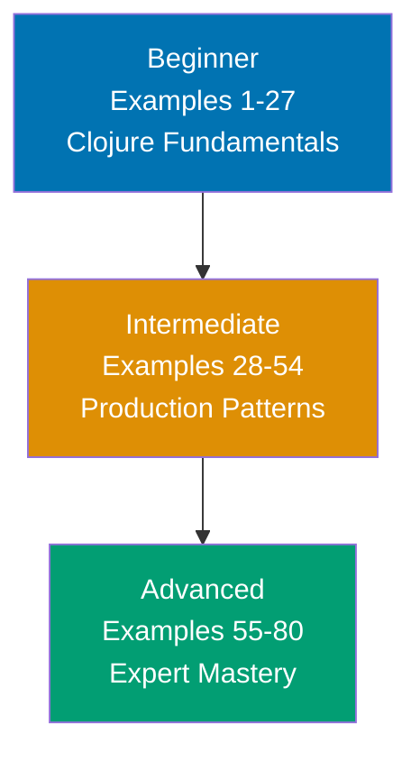

## What is By-Example Learning?

This tutorial teaches Clojure through **80 heavily annotated, runnable code examples** that cover 95% of the language and ecosystem features you'll use in production. Each example is self-contained and can be run directly in the REPL or as a script.

## Who This Is For

**Experienced developers** switching to Clojure who prefer:

- **Code-first learning**: See working examples before reading explanations
- **Comprehensive coverage**: 95% of language features, not just basics
- **Self-contained examples**: Copy-paste-run without cross-referencing
- **Production patterns**: Real-world usage, not toy examples

## Learning Path



Progress from Lisp fundamentals through production patterns to expert mastery. Each level builds on the previous, with immutability and functional thinking as the critical foundation.

## Coverage Philosophy

This tutorial provides **95% coverage of Clojure** through practical, annotated examples. The 95% figure represents the depth and breadth of concepts covered, not a time estimate—focus is on **outcomes and understanding**, not duration.

### What's Covered

- **Core syntax** - S-expressions, special forms, data literals
- **Immutable data structures** - Lists, vectors, maps, sets, keywords, symbols
- **Functions** - defn, fn, higher-order functions, closures
- **Sequence abstraction** - map, filter, reduce, lazy sequences
- **State management** - Atoms, refs, agents, Software Transactional Memory
- **Concurrency** - core.async channels, futures, promises
- **Macros** - quote/unquote, macro definitions, code generation
- **Protocols and multimethods** - Polymorphism without classes
- **clojure.spec** - Runtime validation and generative testing
- **Java interop** - Calling Java, implementing interfaces
- **Testing** - clojure.test, property-based testing

### What's NOT Covered

This guide focuses on **learning-oriented examples**, not problem-solving recipes or production deployment. For additional topics:

- **ClojureScript specifics** - Browser/Node.js runtime (separate tutorial)
- **Compiler internals** - Reader, analyzer, bytecode generation
- **Rare macros and special forms** - Obscure language corners
- **Platform-specific edge cases** - JVM version quirks
- **Specialized libraries** - Datascript, Datomic internals

The 95% coverage goal maintains humility—no tutorial can cover everything. This guide teaches the **core concepts that unlock the remaining 5%** through your own exploration and project work.

## Tutorial Structure

**80 examples across three levels**:

- **Beginner** (Examples 1-27, 0-40% coverage): Clojure fundamentals - immutable data, functions, sequences, REPL workflow
- **Intermediate** (Examples 28-54, 40-75% coverage): Production patterns - multimethods, protocols, macros, state management, core.async
- **Advanced** (Examples 55-80, 75-95% coverage): Expert mastery - advanced macros, transducers, reducers, performance, Java interop patterns

## How to Use This Tutorial

### Prerequisites

**Install Clojure**:

```bash
# macOS (via Homebrew)
brew install clojure/tools/clojure

# Linux (official installer)
curl -O https://download.clojure.org/install/linux-install-1.11.1.1435.sh
chmod +x linux-install-1.11.1.1435.sh
sudo ./linux-install-1.11.1.1435.sh

# Windows (via Scoop)
scoop install clojure
```

**Verify installation**:

```bash
clj -version
# => Clojure CLI version 1.11.1.1435
```

### Running Examples

**Method 1: REPL (Interactive)**

```bash
# Start REPL
clj

# Copy-paste example code
(defn greet [name]
  (str "Hello, " name "!"))

(greet "World")
;; => "Hello, World!"
```

**Method 2: Script (File)**

```bash
# Save example as example.clj
# Run directly
clj -M example.clj
```

**Method 3: deps.edn Project**

```bash
# Create project structure
mkdir -p myproject/src
cd myproject

# Create deps.edn
cat > deps.edn << 'EOF'
{:deps {org.clojure/clojure {:mvn/version "1.11.1"}}}
EOF

# Save example in src/example.clj
# Run with namespace
clj -M -m example
```

### Understanding Annotations

Examples use `;; =>` notation to show return values and side effects:

```clojure
(def x 10)                          ;; => #'user/x (var binding created)
(+ x 5)                             ;; => 15 (addition result)
(println "Hello")                   ;; => nil (prints "Hello" to stdout)
                                    ;; => Output: Hello
```

**Annotation types**:

- `;; => value` - Expression return value
- `;; => Output: text` - Stdout/stderr output
- `;; => #'namespace/name` - Var definition
- `;; => type` - Value type information
- `;; => state` - State changes (atoms, refs)

## Coverage Target: 95%

**What 95% means for Clojure**:

✅ **Included** (production essentials):

- Core syntax and special forms
- Standard library (clojure.core, clojure.string, clojure.set)
- Immutable data structures and persistent collections
- Functions, closures, higher-order functions
- Multimethods and protocols
- Macros and code generation
- Concurrency primitives (atoms, refs, agents, STM)
- core.async for asynchronous programming
- clojure.spec for validation
- Java interop patterns
- Testing with clojure.test
- Project structure and dependency management
- Performance optimization
- Common libraries (component, mount, ring, compojure)

❌ **Excluded** (rare/specialized, the 5%):

- ClojureScript specifics (different tutorial)
- Compiler internals and implementation details
- Rare macros and special forms
- Platform-specific edge cases
- Deprecated features
- Specialized libraries (datascript, datomic internals)

## Tutorial Structure

Each example follows a five-part format:

### 1. Brief Explanation (2-3 sentences)

Context and motivation: What is this concept? Why does it matter?

### 2. Mermaid Diagram (30-50% of examples)

Visual representation of data flow, state transitions, or concurrency patterns.

### 3. Heavily Annotated Code

Every significant line has an inline comment with `;; =>` notation showing values and states.

### 4. Key Takeaway (1-2 sentences)

Core insight distilled: When to use this pattern, common pitfalls to avoid.

## Learning Strategies

### For Java Developers

You're used to OOP and static typing. Clojure runs on JVM but thinks differently:

- **Data over objects**: Maps, vectors, and sets replace classes and objects
- **Functions over methods**: Pure functions transform data, no hidden state
- **REPL-driven development**: Interactive coding replaces compile-run-debug cycles

Focus on Examples 1-15 (data structures) and Examples 28-35 (Java interop) to bridge your JVM knowledge.

### For JavaScript Developers

You understand dynamic typing and functional patterns. Clojure deepens functional programming:

- **True immutability**: Data structures never change, persistent data structures share structure
- **Lisp syntax**: Prefix notation `(+ 1 2)` instead of infix `1 + 2`
- **Macros**: Code that writes code, extending the language itself

Focus on Examples 5-15 (core functions) and Examples 55-65 (macros) to leverage your JS functional knowledge.

### For Python Developers

You know dynamic typing and readable syntax. Clojure trades readability for power:

- **Parentheses everywhere**: Lisp syntax feels strange at first, becomes natural
- **No statements**: Everything is an expression that returns a value
- **Concurrency primitives**: Atoms, refs, and agents for managing shared state

Focus on Examples 1-10 (syntax basics) and Examples 40-50 (state management) to adjust your mental model.

### For Haskell/Scala Developers

You know functional programming. Clojure is practical FP on the JVM:

- **Dynamic typing**: No type system, but clojure.spec for runtime validation
- **Pragmatic purity**: Side effects allowed, but immutability enforced by default
- **Lisp heritage**: Homoiconicity enables powerful metaprogramming

Focus on Examples 45-55 (protocols and multimethods) and Examples 60-70 (advanced macros) to see Clojure's unique features.

## Code-First Philosophy

This tutorial prioritizes working code over theoretical discussion:

- **No lengthy prose**: Concepts are demonstrated, not explained at length
- **Runnable examples**: Every example runs in the REPL or as scripts
- **Learn by doing**: Understanding comes from running and modifying code
- **Pattern recognition**: See the same patterns in different contexts across 80 examples

If you prefer narrative explanations, consider the **by-concept tutorial** (available separately). By-example learning works best when you learn through experimentation.

## Example Format

Here's what every example looks like:

### Example 5: Destructuring Maps

Clojure's destructuring syntax allows you to extract values from maps and sequences directly in function parameters or let bindings. This eliminates boilerplate and makes code more readable, especially when working with nested data structures common in Clojure applications.

```mermaid
%% Map destructuring flow
graph TD
    A["Map: {:name \"Alice\" :age 30}"] --> B[Destructure]
    B --> C["name → \"Alice\""]
    B --> D["age → 30"]

    style A fill:#0173B2,color:#fff
    style B fill:#DE8F05,color:#000
    style C fill:#029E73,color:#fff
    style D fill:#029E73,color:#fff
```

```clojure
;; Map destructuring in let binding
(let [{:keys [name age]} {:name "Alice" :age 30}]
                                    ;; => name is "Alice", age is 30
  (println name "is" age "years old"))
                                    ;; => nil
                                    ;; => Output: Alice is 30 years old

;; Function parameter destructuring
(defn greet-person [{:keys [name age]}]
                                    ;; => Destructures map argument
  (str "Hello " name ", you are " age " years old"))
                                    ;; => #'user/greet-person

(greet-person {:name "Bob" :age 25})
                                    ;; => "Hello Bob, you are 25 years old"

;; Destructuring with defaults
(defn greet-with-default [{:keys [name age] :or {age 18}}]
                                    ;; => age defaults to 18 if missing
  (str name " is " age))            ;; => Returns formatted string

(greet-with-default {:name "Charlie"})
                                    ;; => "Charlie is 18" (default used)

(greet-with-default {:name "Diana" :age 35})
                                    ;; => "Diana is 35" (provided value used)
```

**Key Takeaway**: Use destructuring with `:keys`, `:strs`, or `:syms` to extract map values directly in function parameters or let bindings, and use `:or` to provide default values for missing keys.

## Navigation

- **[Beginner](/en/learn/software-engineering/programming-languages/clojure/tutorials/by-example/beginner)** - Examples 1-27 (fundamentals)
- **[Intermediate](/en/learn/software-engineering/programming-languages/clojure/tutorials/by-example/intermediate)** - Examples 28-54 (production patterns)
- **[Advanced](/en/learn/software-engineering/programming-languages/clojure/tutorials/by-example/advanced)** - Examples 55-80 (expert mastery)

## Next Steps

Start with [Beginner](/en/learn/software-engineering/programming-languages/clojure/tutorials/by-example/beginner) if you're new to Clojure, or jump to [Intermediate](/en/learn/software-engineering/programming-languages/clojure/tutorials/by-example/intermediate) if you know the basics.

Happy learning!
