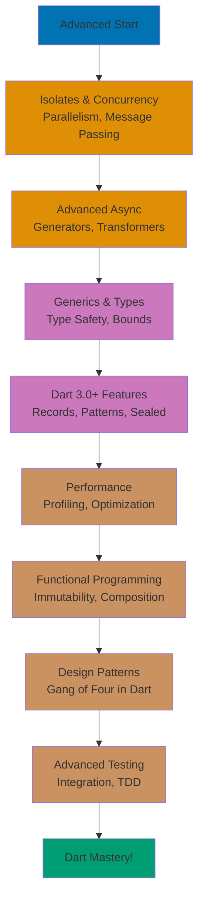
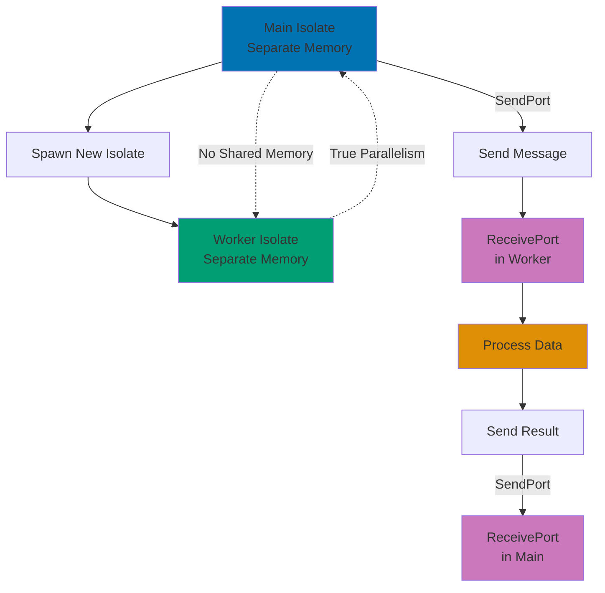
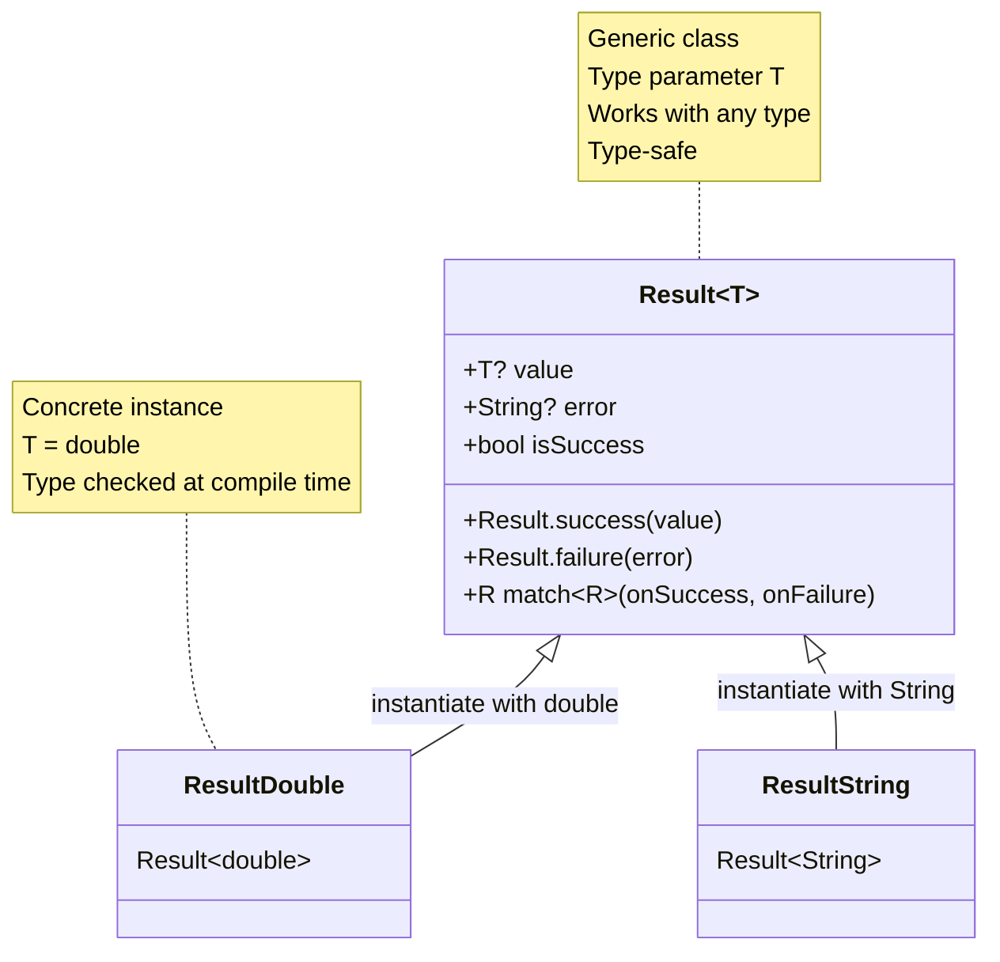
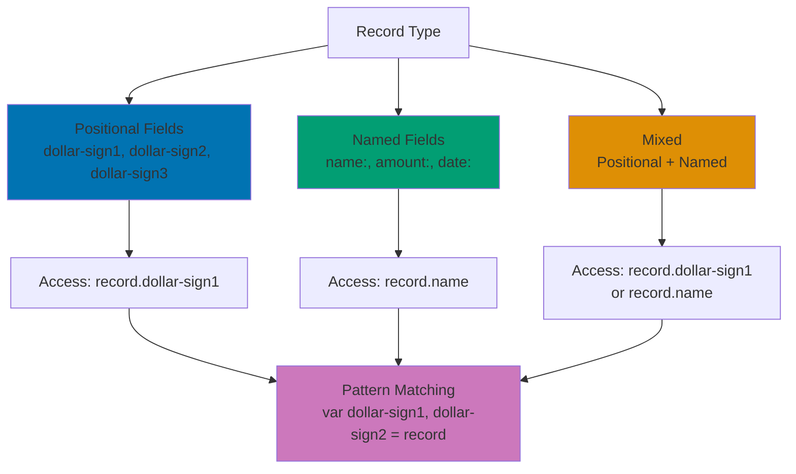
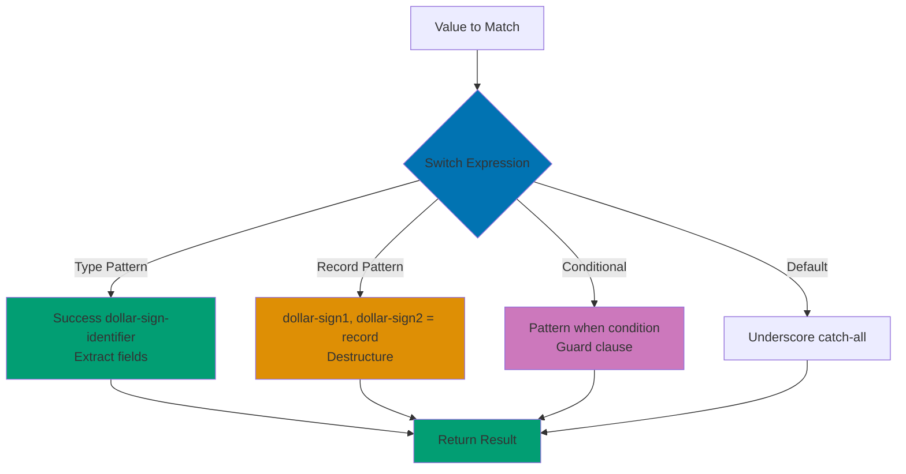
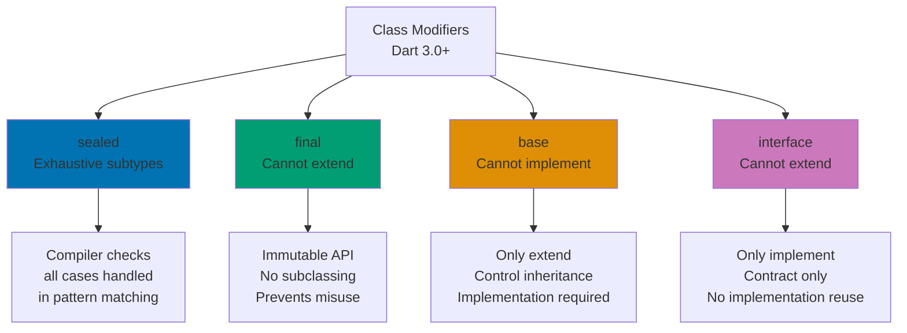
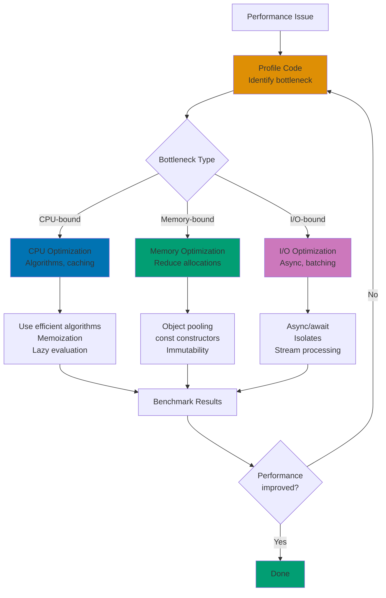
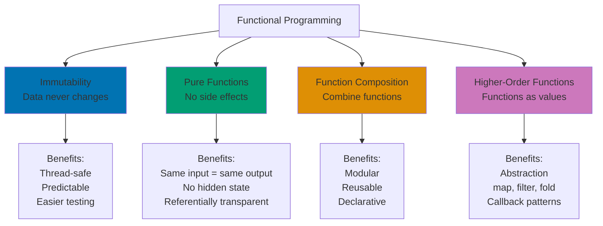
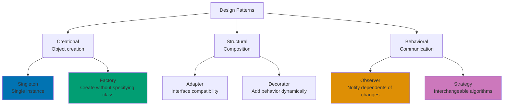

**Ready to master Dart?** This advanced tutorial covers sophisticated features, performance optimization, concurrency with isolates, Dart 3.0+ innovations (records, pattern matching, sealed classes), and advanced design patterns. You'll learn techniques used by library authors, performance-critical applications, and cutting-edge Dart codebases.

By the end of this tutorial, you'll leverage isolates for true parallelism, optimize Dart applications for production, use pattern matching and records fluently, design type-safe APIs with generics, and apply functional programming patterns effectively. This knowledge prepares you for library authorship, high-performance applications, and Dart 3.0+ migration.

## What You'll Learn

This advanced tutorial covers **expert-level Dart features** (85-95% language coverage):

- **Isolates** - True parallelism, message passing, compute-intensive tasks
- **Advanced async patterns** - Stream transformations, StreamController, async generators
- **Generics and type parameters** - Type-safe collections, bounded types, variance
- **Dart 3.0+ features** - Records, pattern matching, sealed classes, class modifiers
- **Performance optimization** - Profiling, memory management, efficient algorithms
- **Functional programming** - Higher-order functions, immutability, function composition
- **Advanced testing** - Integration tests, mocking, test-driven development
- **Design patterns in Dart** - Singleton, Factory, Observer, Strategy, Command
- **Metaprogramming** - Reflection, code generation (build_runner)
- Islamic finance examples (complex calculations, distributed processing, pattern matching contracts)

## Prerequisites

- Completed [Intermediate](/en/learn/software-engineering/programming-languages/dart/by-concept/intermediate) tutorial or equivalent experience
- Strong understanding of async/await, streams, and OOP
- Experience building production Dart applications

## Learning Path



This tutorial provides **85-95% coverage** of Dart knowledge, achieving mastery of the language.

## Isolates and Concurrency

Dart isolates provide true parallelism (unlike async/await which is concurrent but not parallel).



### Understanding Isolates

```dart
import 'dart:isolate';

// Compute-intensive function
int calculateFactorial(int n) {
  if (n <= 1) return 1;
  return n * calculateFactorial(n - 1);
}

// Isolate entry point (must be top-level or static)
void isolateFactorial(SendPort sendPort) {
  // Receive messages from main isolate
  ReceivePort receivePort = ReceivePort();
  sendPort.send(receivePort.sendPort);

  receivePort.listen((message) {
    if (message is int) {
      int result = calculateFactorial(message);
      sendPort.send(result);
    }
  });
}

void main() async {
  // Create isolate
  ReceivePort receivePort = ReceivePort();
  Isolate isolate = await Isolate.spawn(isolateFactorial, receivePort.sendPort);

  // Get SendPort from isolate
  SendPort sendPort = await receivePort.first;

  // Send data to isolate
  sendPort.send(20);

  // Receive result
  receivePort.listen((message) {
    if (message is int) {
      print('Factorial result: $message');
      receivePort.close();
      isolate.kill();
    }
  });
}
```

**Key concepts**:

- **Isolates run in separate memory** - No shared state
- **Communication via message passing** - SendPort/ReceivePort
- **True parallelism** - Runs on different CPU core
- **Entry point must be top-level or static** - No closures over variables

### Compute Helper Function

Simplified isolate usage for one-off computations:

```dart
import 'dart:isolate';

// Top-level function for compute
double computeZakat(Map<String, dynamic> data) {
  List<double> assets = (data['assets'] as List).cast<double>();
  double nisab = data['nisab'] as double;

  double total = assets.fold(0.0, (sum, asset) => sum + asset);

  if (total < nisab) return 0.0;
  return total * 0.025;
}

void main() async {
  // Use Isolate.run for simple cases
  var assets = [50000000.0, 30000000.0, 25000000.0];

  double zakat = await Isolate.run(() => computeZakat({
        'assets': assets,
        'nisab': 85000000.0,
      }));

  print('Zakat (computed in isolate): Rp$zakat');
}
```

### Parallel Processing with Multiple Isolates

```dart
import 'dart:isolate';

// Calculate Zakat for portfolio subset
double calculateSubsetZakat(List<double> assets) {
  return assets
      .where((asset) => asset >= 85000000)
      .map((asset) => asset * 0.025)
      .fold(0.0, (sum, zakat) => sum + zakat);
}

// Worker isolate entry point
void workerIsolate(List<dynamic> args) {
  SendPort sendPort = args[0];
  List<double> assets = (args[1] as List).cast<double>();

  double result = calculateSubsetZakat(assets);
  sendPort.send(result);
}

Future<double> parallelZakatCalculation(List<double> allAssets) async {
  // Split assets into chunks
  int chunkSize = (allAssets.length / 4).ceil();
  List<List<double>> chunks = [];

  for (int i = 0; i < allAssets.length; i += chunkSize) {
    int end = (i + chunkSize < allAssets.length) ? i + chunkSize : allAssets.length;
    chunks.add(allAssets.sublist(i, end));
  }

  // Spawn isolate for each chunk
  List<Future<double>> futures = [];
  for (var chunk in chunks) {
    ReceivePort receivePort = ReceivePort();
    await Isolate.spawn(workerIsolate, [receivePort.sendPort, chunk]);
    futures.add(receivePort.first.then((result) => result as double));
  }

  // Wait for all results
  List<double> results = await Future.wait(futures);

  // Sum results
  return results.fold(0.0, (sum, zakat) => sum + zakat);
}

void main() async {
  var portfolio = List.generate(100, (i) => (i + 1) * 1000000.0);

  print('Calculating Zakat in parallel...');
  double totalZakat = await parallelZakatCalculation(portfolio);
  print('Total Zakat: Rp$totalZakat');
}
```

## Advanced Async Patterns

### Async Generators

Create streams with `async*`:

```dart
// Async generator - yields values over time
Stream<Map<String, double>> trackPortfolioValue() async* {
  var assets = {
    'savings': 50000000.0,
    'gold': 30000000.0,
    'investment': 25000000.0,
  };

  for (int day = 1; day <= 5; day++) {
    await Future.delayed(Duration(seconds: 1));

    // Simulate value changes
    assets = assets.map((key, value) {
      double change = (value * 0.01) * (day % 2 == 0 ? 1 : -1);
      return MapEntry(key, value + change);
    });

    yield Map.from(assets); // Yield snapshot
  }
}

void main() async {
  print('Tracking portfolio...');
  await for (var snapshot in trackPortfolioValue()) {
    double total = snapshot.values.fold(0.0, (sum, value) => sum + value);
    print('Day value: Rp${total.toStringAsFixed(2)}');
  }
}
```

### Stream Transformers

Create custom stream transformations:

```dart
import 'dart:async';

// Custom stream transformer
class ZakatTransformer extends StreamTransformerBase<double, double> {
  final double nisab;
  final double rate;

  ZakatTransformer({this.nisab = 85000000, this.rate = 0.025});

  @override
  Stream<double> bind(Stream<double> stream) {
    return stream.map((wealth) {
      if (wealth < nisab) return 0.0;
      return wealth * rate;
    });
  }
}

Stream<double> wealthStream() async* {
  yield 50000000;
  yield 90000000;
  yield 120000000;
  yield 75000000;
}

void main() async {
  var zakatStream = wealthStream().transform(ZakatTransformer());

  await for (var zakat in zakatStream) {
    print('Zakat: Rp$zakat');
  }
}
```

### StreamController with Error Handling

```dart
import 'dart:async';

class RobustDonationTracker {
  final _controller = StreamController<double>();
  bool _isClosed = false;

  Stream<double> get donations => _controller.stream;

  void recordDonation(double amount) {
    if (_isClosed) {
      throw StateError('Tracker is closed');
    }

    if (amount <= 0) {
      _controller.addError(ArgumentError('Donation must be positive'));
      return;
    }

    _controller.add(amount);
  }

  void close() {
    if (!_isClosed) {
      _isClosed = true;
      _controller.close();
    }
  }
}

void main() async {
  var tracker = RobustDonationTracker();

  tracker.donations.listen(
    (amount) => print('Donation: Rp$amount'),
    onError: (error) => print('Error: $error'),
    onDone: () => print('Tracker closed'),
  );

  tracker.recordDonation(100000);
  tracker.recordDonation(-50000); // Error
  tracker.recordDonation(250000);

  await Future.delayed(Duration(milliseconds: 100));
  tracker.close();
}
```

## Generics and Type Parameters



### Generic Classes

```dart
// Generic class with type parameter
class Result<T> {
  final T? value;
  final String? error;

  Result.success(this.value) : error = null;
  Result.failure(this.error) : value = null;

  bool get isSuccess => value != null;
  bool get isFailure => error != null;

  // Generic method
  R match<R>({
    required R Function(T) onSuccess,
    required R Function(String) onFailure,
  }) {
    if (isSuccess) {
      return onSuccess(value as T);
    } else {
      return onFailure(error!);
    }
  }
}

// Generic function
T getOrDefault<T>(T? value, T defaultValue) {
  return value ?? defaultValue;
}

void main() {
  var successResult = Result<double>.success(2500000.0);
  var failureResult = Result<double>.failure('Calculation error');

  // Pattern match on result
  String message1 = successResult.match(
    onSuccess: (zakat) => 'Zakat due: Rp$zakat',
    onFailure: (error) => 'Error: $error',
  );
  print(message1); // Zakat due: Rp2500000.0

  String message2 = failureResult.match(
    onSuccess: (zakat) => 'Zakat due: Rp$zakat',
    onFailure: (error) => 'Error: $error',
  );
  print(message2); // Error: Calculation error

  // Generic function usage
  double? maybeZakat;
  double zakat = getOrDefault(maybeZakat, 0.0);
  print('Zakat: $zakat'); // 0.0
}
```

### Bounded Type Parameters

```dart
// Abstract base class
abstract class Valuable {
  double getValue();
}

class SavingsAccount extends Valuable {
  final double balance;
  SavingsAccount(this.balance);

  @override
  double getValue() => balance;
}

class GoldHolding extends Valuable {
  final double grams;
  final double pricePerGram;
  GoldHolding(this.grams, this.pricePerGram);

  @override
  double getValue() => grams * pricePerGram;
}

// Generic class with bounded type parameter
class Portfolio<T extends Valuable> {
  final List<T> items = [];

  void add(T item) {
    items.add(item);
  }

  double get totalValue {
    return items.fold(0.0, (sum, item) => sum + item.getValue());
  }

  double get zakatDue {
    return totalValue >= 85000000 ? totalValue * 0.025 : 0.0;
  }
}

void main() {
  var portfolio = Portfolio<Valuable>();
  portfolio.add(SavingsAccount(50000000));
  portfolio.add(GoldHolding(100, 1000000));

  print('Total value: Rp${portfolio.totalValue}');
  print('Zakat due: Rp${portfolio.zakatDue}');
}
```

## Dart 3.0+ Features

### Records



Compound values with named and positional fields:

```dart
// Record type with positional fields
(double, double) calculateZakatAndNisab(double wealth) {
  const nisab = 85000000.0;
  double zakat = wealth >= nisab ? wealth * 0.025 : 0.0;
  return (zakat, nisab);
}

// Record with named fields
({String name, double zakat, bool eligible}) analyzeAccount(
  String accountName,
  double balance,
) {
  bool eligible = balance >= 85000000;
  double zakat = eligible ? balance * 0.025 : 0.0;

  return (name: accountName, zakat: zakat, eligible: eligible);
}

void main() {
  // Destructuring positional record
  var (zakat, nisab) = calculateZakatAndNisab(100000000);
  print('Zakat: Rp$zakat, Nisab: Rp$nisab');

  // Named record fields
  var result = analyzeAccount('Savings', 120000000);
  print('Account: ${result.name}');
  print('Eligible: ${result.eligible}');
  print('Zakat: Rp${result.zakat}');

  // Mixed positional and named
  (String, {double amount, bool paid}) transaction = (
    'Zakat Payment',
    amount: 2500000,
    paid: true,
  );
  print('Transaction: ${transaction.$1}, Amount: Rp${transaction.amount}');
}
```

### Pattern Matching



Powerful pattern matching with switch expressions and destructuring:

```dart
// Sealed class hierarchy (Dart 3.0+)
sealed class PaymentResult {}

class Success extends PaymentResult {
  final String transactionId;
  final double amount;
  Success(this.transactionId, this.amount);
}

class Failure extends PaymentResult {
  final String error;
  Failure(this.error);
}

class Pending extends PaymentResult {
  final String reason;
  Pending(this.reason);
}

String handlePayment(PaymentResult result) {
  // Exhaustive pattern matching
  return switch (result) {
    Success(transactionId: var id, amount: var amt) =>
      'Success: $id - Rp$amt',
    Failure(error: var err) => 'Failed: $err',
    Pending(reason: var reason) => 'Pending: $reason',
  };
}

void main() {
  var results = [
    Success('TXN-001', 2500000),
    Failure('Insufficient funds'),
    Pending('Awaiting confirmation'),
  ];

  for (var result in results) {
    print(handlePayment(result));
  }

  // Pattern matching with records
  var account = ('Savings', 100000000.0, true);

  var message = switch (account) {
    (String name, double balance, true) when balance >= 85000000 =>
      '$name is eligible: Rp${balance * 0.025} Zakat',
    (String name, double balance, true) => '$name eligible but below nisab',
    (String name, _, false) => '$name not eligible',
  };

  print(message);
}
```

### Sealed Classes and Class Modifiers



```dart
// Sealed class - exhaustive subtype checking
sealed class TransactionType {}

class Deposit extends TransactionType {
  final double amount;
  Deposit(this.amount);
}

class Withdrawal extends TransactionType {
  final double amount;
  Withdrawal(this.amount);
}

class Transfer extends TransactionType {
  final double amount;
  final String recipient;
  Transfer(this.amount, this.recipient);
}

// Compiler ensures all cases handled
String describeTransaction(TransactionType type) {
  return switch (type) {
    Deposit(amount: var amt) => 'Deposit: Rp$amt',
    Withdrawal(amount: var amt) => 'Withdrawal: Rp$amt',
    Transfer(amount: var amt, recipient: var rec) => 'Transfer Rp$amt to $rec',
    // Compiler error if any case missing!
  };
}

// Final class - cannot extend or implement
final class ImmutableConfig {
  final String apiKey;
  final String endpoint;

  const ImmutableConfig(this.apiKey, this.endpoint);
}

// Cannot extend final class
// class CustomConfig extends ImmutableConfig {} // ERROR

// Base class - can only extend (not implement)
base class BaseAccount {
  double balance = 0.0;

  void deposit(double amount) {
    balance += amount;
  }
}

// Can extend base class
class SavingsAccount extends BaseAccount {}

// Cannot implement base class
// class CheckingAccount implements BaseAccount {} // ERROR

void main() {
  var transactions = [
    Deposit(500000),
    Withdrawal(200000),
    Transfer(1000000, 'Charity Fund'),
  ];

  for (var txn in transactions) {
    print(describeTransaction(txn));
  }
}
```

## Performance Optimization



### Profiling and Benchmarking

```dart
import 'dart:async';

// Simple benchmark utility
class Benchmark {
  static Future<Duration> measureAsync(Future<void> Function() fn) async {
    var stopwatch = Stopwatch()..start();
    await fn();
    stopwatch.stop();
    return stopwatch.elapsed;
  }

  static Duration measure(void Function() fn) {
    var stopwatch = Stopwatch()..start();
    fn();
    stopwatch.stop();
    return stopwatch.elapsed;
  }
}

// Inefficient implementation
double calculateZakatSlow(List<double> assets) {
  var eligible = <double>[];
  for (var asset in assets) {
    if (asset >= 85000000) {
      eligible.add(asset);
    }
  }

  var zakats = <double>[];
  for (var asset in eligible) {
    zakats.add(asset * 0.025);
  }

  double total = 0;
  for (var zakat in zakats) {
    total += zakat;
  }

  return total;
}

// Optimized implementation
double calculateZakatFast(List<double> assets) {
  return assets
      .where((asset) => asset >= 85000000)
      .fold(0.0, (sum, asset) => sum + asset * 0.025);
}

void main() {
  var largePortfolio = List.generate(100000, (i) => (i + 1) * 10000.0);

  // Benchmark slow version
  var slowTime = Benchmark.measure(() {
    calculateZakatSlow(largePortfolio);
  });

  // Benchmark fast version
  var fastTime = Benchmark.measure(() {
    calculateZakatFast(largePortfolio);
  });

  print('Slow version: ${slowTime.inMicroseconds}μs');
  print('Fast version: ${fastTime.inMicroseconds}μs');
  print('Speedup: ${slowTime.inMicroseconds / fastTime.inMicroseconds}x');
}
```

### Memory Optimization

```dart
// Memory-inefficient approach
class IneffientPortfolio {
  List<Map<String, dynamic>> holdings = [];

  void addHolding(String name, double value) {
    holdings.add({'name': name, 'value': value, 'timestamp': DateTime.now()});
  }
}

// Memory-efficient approach
class Holding {
  final String name;
  final double value;
  final DateTime timestamp;

  // Compact constructor
  const Holding(this.name, this.value, this.timestamp);
}

class EfficientPortfolio {
  final List<Holding> holdings = [];

  void addHolding(String name, double value) {
    holdings.add(Holding(name, value, DateTime.now()));
  }
}

void main() {
  // Use const constructors when possible
  const nisab = 85000000.0; // Compile-time constant

  // Reuse objects instead of creating new ones
  final formatter = NumberFormat.currency(locale: 'id', symbol: 'Rp');

  // Prefer final over var for immutability
  final portfolio = EfficientPortfolio();
  portfolio.addHolding('Gold', 50000000);
}

// Placeholder for NumberFormat (requires intl package)
class NumberFormat {
  static NumberFormat currency({String? locale, String? symbol}) {
    return NumberFormat();
  }

  String format(num value) => 'Rp$value';
}
```

## Functional Programming Patterns



### Immutability and Pure Functions

```dart
// Immutable value object
class MurabahaContract {
  final String contractId;
  final double assetCost;
  final double profitMargin;
  final int months;

  const MurabahaContract({
    required this.contractId,
    required this.assetCost,
    required this.profitMargin,
    required this.months,
  });

  // Pure function - no side effects, same input = same output
  double get totalPrice => assetCost + profitMargin;
  double get monthlyPayment => totalPrice / months;

  // Return new instance instead of mutating
  MurabahaContract copyWith({
    String? contractId,
    double? assetCost,
    double? profitMargin,
    int? months,
  }) {
    return MurabahaContract(
      contractId: contractId ?? this.contractId,
      assetCost: assetCost ?? this.assetCost,
      profitMargin: profitMargin ?? this.profitMargin,
      months: months ?? this.months,
    );
  }

  @override
  bool operator ==(Object other) =>
      identical(this, other) ||
      other is MurabahaContract &&
          contractId == other.contractId &&
          assetCost == other.assetCost &&
          profitMargin == other.profitMargin &&
          months == other.months;

  @override
  int get hashCode => Object.hash(contractId, assetCost, profitMargin, months);
}

void main() {
  const original = MurabahaContract(
    contractId: 'MUR-001',
    assetCost: 50000000,
    profitMargin: 5000000,
    months: 24,
  );

  // Create modified copy (original unchanged)
  final modified = original.copyWith(months: 36);

  print('Original months: ${original.months}'); // 24
  print('Modified months: ${modified.months}'); // 36
}
```

### Function Composition

```dart
// Higher-order functions for composition
typedef Transform<T> = T Function(T);

Transform<T> compose<T>(Transform<T> f, Transform<T> g) {
  return (value) => f(g(value));
}

// Individual transformations
double applyNisabCheck(double wealth) {
  return wealth >= 85000000 ? wealth : 0.0;
}

double applyZakatRate(double wealth) {
  return wealth * 0.025;
}

double roundToNearest(double value) {
  return value.roundToDouble();
}

void main() {
  // Compose functions
  final calculateZakat = compose(
    roundToNearest,
    compose(applyZakatRate, applyNisabCheck),
  );

  print('Zakat 1: Rp${calculateZakat(100000000)}'); // 2500000
  print('Zakat 2: Rp${calculateZakat(50000000)}'); // 0
}
```

## Design Patterns in Dart



### Singleton Pattern

```dart
// Singleton with factory constructor
class ConfigurationManager {
  static final ConfigurationManager _instance = ConfigurationManager._internal();

  factory ConfigurationManager() => _instance;

  ConfigurationManager._internal();

  Map<String, dynamic> _config = {};

  void setConfig(String key, dynamic value) {
    _config[key] = value;
  }

  T? getConfig<T>(String key) {
    return _config[key] as T?;
  }
}

void main() {
  var config1 = ConfigurationManager();
  config1.setConfig('nisab', 85000000.0);

  var config2 = ConfigurationManager();
  print('Nisab: ${config2.getConfig<double>('nisab')}'); // 85000000.0

  print('Same instance: ${identical(config1, config2)}'); // true
}
```

### Factory Pattern

```dart
abstract class FinancialProduct {
  String get name;
  double calculateReturn(double principal, int months);
}

class MurabahaSavings implements FinancialProduct {
  @override
  String get name => 'Murabaha Savings';

  @override
  double calculateReturn(double principal, int months) {
    return principal * 0.05 * (months / 12); // 5% annual
  }
}

class MudharabahInvestment implements FinancialProduct {
  @override
  String get name => 'Mudharabah Investment';

  @override
  double calculateReturn(double principal, int months) {
    return principal * 0.12 * (months / 12); // 12% annual
  }
}

// Factory class
class FinancialProductFactory {
  static FinancialProduct create(String type) {
    return switch (type.toLowerCase()) {
      'murabaha' => MurabahaSavings(),
      'mudharabah' => MudharabahInvestment(),
      _ => throw ArgumentError('Unknown product type: $type'),
    };
  }
}

void main() {
  var product = FinancialProductFactory.create('murabaha');
  print('Product: ${product.name}');
  print('Return: Rp${product.calculateReturn(10000000, 12)}');
}
```

### Observer Pattern with Streams

```dart
import 'dart:async';

// Observable (Subject)
class BalanceTracker {
  double _balance = 0.0;
  final _controller = StreamController<double>.broadcast();

  Stream<double> get balanceStream => _controller.stream;
  double get balance => _balance;

  void updateBalance(double newBalance) {
    _balance = newBalance;
    _controller.add(_balance);
  }

  void dispose() {
    _controller.close();
  }
}

// Observers
class BalanceLogger {
  void observe(Stream<double> stream) {
    stream.listen((balance) {
      print('[Logger] Balance updated: Rp$balance');
    });
  }
}

class ZakatCalculator {
  void observe(Stream<double> stream) {
    stream.listen((balance) {
      if (balance >= 85000000) {
        double zakat = balance * 0.025;
        print('[Zakat] Zakat due: Rp$zakat');
      }
    });
  }
}

void main() async {
  var tracker = BalanceTracker();

  // Attach observers
  var logger = BalanceLogger();
  logger.observe(tracker.balanceStream);

  var zakatCalc = ZakatCalculator();
  zakatCalc.observe(tracker.balanceStream);

  // Update balance (notifies observers)
  tracker.updateBalance(50000000);
  await Future.delayed(Duration(milliseconds: 100));

  tracker.updateBalance(90000000);
  await Future.delayed(Duration(milliseconds: 100));

  tracker.updateBalance(120000000);
  await Future.delayed(Duration(milliseconds: 100));

  tracker.dispose();
}
```

## Advanced Testing Strategies

### Integration Testing

```dart
import 'package:test/test.dart';

// System under test
class ZakatManager {
  final List<double> _assets = [];

  void addAsset(double value) {
    if (value <= 0) throw ArgumentError('Asset value must be positive');
    _assets.add(value);
  }

  double get totalWealth => _assets.fold(0.0, (sum, value) => sum + value);

  double calculateZakat() {
    if (totalWealth < 85000000) return 0.0;
    return totalWealth * 0.025;
  }

  void reset() {
    _assets.clear();
  }
}

void main() {
  group('ZakatManager Integration Tests', () {
    late ZakatManager manager;

    setUp(() {
      manager = ZakatManager();
    });

    test('complete workflow - add assets and calculate zakat', () {
      // Arrange
      manager.addAsset(50000000);
      manager.addAsset(40000000);
      manager.addAsset(20000000);

      // Act
      double totalWealth = manager.totalWealth;
      double zakat = manager.calculateZakat();

      // Assert
      expect(totalWealth, equals(110000000));
      expect(zakat, equals(2750000));
    });

    test('workflow with insufficient wealth', () {
      manager.addAsset(30000000);
      manager.addAsset(20000000);

      expect(manager.calculateZakat(), equals(0.0));
    });

    test('error handling for invalid asset', () {
      expect(() => manager.addAsset(-100), throwsArgumentError);
    });

    test('reset clears all assets', () {
      manager.addAsset(50000000);
      manager.reset();

      expect(manager.totalWealth, equals(0.0));
      expect(manager.calculateZakat(), equals(0.0));
    });
  });
}
```

## Practical Exercise: Distributed Zakat Calculation System

Build a complete system using isolates, streams, and advanced patterns:

```dart
import 'dart:async';
import 'dart:isolate';

// Data models
class Portfolio {
  final String ownerId;
  final List<double> assets;

  Portfolio(this.ownerId, this.assets);
}

class ZakatResult {
  final String ownerId;
  final double totalWealth;
  final double zakatDue;

  ZakatResult(this.ownerId, this.totalWealth, this.zakatDue);

  @override
  String toString() =>
      'Owner: $ownerId, Wealth: Rp$totalWealth, Zakat: Rp$zakatDue';
}

// Isolate worker
void zakatWorker(SendPort sendPort) {
  ReceivePort receivePort = ReceivePort();
  sendPort.send(receivePort.sendPort);

  receivePort.listen((message) {
    if (message is Portfolio) {
      double total = message.assets.fold(0.0, (sum, v) => sum + v);
      double zakat = total >= 85000000 ? total * 0.025 : 0.0;
      sendPort.send(ZakatResult(message.ownerId, total, zakat));
    }
  });
}

// Distributed calculator
class DistributedZakatCalculator {
  final _controller = StreamController<ZakatResult>();

  Stream<ZakatResult> get results => _controller.stream;

  Future<void> processPortfolios(List<Portfolio> portfolios) async {
    for (var portfolio in portfolios) {
      await _processInIsolate(portfolio);
    }
    _controller.close();
  }

  Future<void> _processInIsolate(Portfolio portfolio) async {
    ReceivePort receivePort = ReceivePort();
    await Isolate.spawn(zakatWorker, receivePort.sendPort);

    SendPort sendPort = await receivePort.first;
    sendPort.send(portfolio);

    await for (var message in receivePort) {
      if (message is ZakatResult) {
        _controller.add(message);
        receivePort.close();
        break;
      }
    }
  }
}

void main() async {
  // Create portfolios
  var portfolios = [
    Portfolio('USER-001', [50000000, 40000000, 30000000]),
    Portfolio('USER-002', [100000000, 25000000]),
    Portfolio('USER-003', [30000000, 20000000, 10000000]),
  ];

  // Process in parallel with isolates
  var calculator = DistributedZakatCalculator();

  calculator.results.listen(
    (result) => print('Result: $result'),
    onDone: () => print('\nAll calculations complete'),
  );

  await calculator.processPortfolios(portfolios);
}
```

## Next Steps

You've completed the advanced tutorial covering 85-95% of Dart knowledge. You've mastered:

- Isolates for true parallelism
- Advanced async patterns with streams and generators
- Generics and type-safe API design
- Dart 3.0+ features (records, pattern matching, sealed classes)
- Performance optimization techniques
- Functional programming patterns
- Advanced design patterns
- Comprehensive testing strategies

**You're now ready to**:

- Author Dart libraries and packages
- Build high-performance applications
- Design sophisticated APIs
- Contribute to Dart ecosystem
- Migrate projects to Dart 3.0+

**Continue exploring**:

- [By Example](/en/learn/software-engineering/programming-languages/dart/by-example) - Quick reference with annotated examples
- Official Dart documentation for API details
- Pub.dev for package ecosystem
- Flutter for UI development

**Build advanced projects**:

- Create a high-performance Zakat calculation library
- Build a distributed donation tracking system
- Develop a CLI tool with isolate-based parallel processing
- Design a type-safe financial modeling framework
