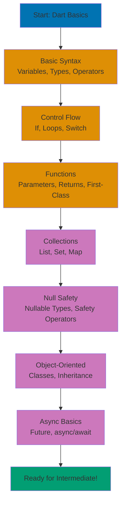

**Want to build cross-platform applications with a modern language?** Dart powers Flutter (mobile, web, desktop), server-side applications, and command-line tools. Created by Google with a focus on productivity and performance, Dart combines strong typing with null safety, elegant syntax, and a comprehensive standard library.

In this beginner's guide, you'll learn Dart from fundamentals through object-oriented programming. By the end, you'll write null-safe programs, understand asynchronous basics, and know why Google, Alibaba, and BMW chose Dart for their applications. This tutorial provides comprehensive coverage from syntax to intermediate patterns.

## What You'll Learn

This beginner tutorial teaches **comprehensive Dart fundamentals** - everything from basic syntax through object-oriented programming, giving you a solid foundation for building real applications:

- Dart syntax and core language features
- **Null safety** - Dart's approach to eliminating null errors
- Data types (int, double, String, bool) and type inference
- Control flow (if/else, for, while, switch expressions)
- Functions (parameters, return types, arrow syntax, first-class values)
- Collections (List, Set, Map) with type parameters
- **Classes and objects** - constructors, methods, fields, getters/setters
- Object-oriented programming basics (inheritance, interfaces)
- Exception handling with try-catch
- Basic asynchronous programming (Future, async/await)
- Practical exercises using Islamic finance examples
- Common patterns and best practices

## Prerequisites

- Basic programming knowledge in any language
- Familiarity with command-line/terminal
- Understanding of fundamental concepts (variables, functions, loops)

## Learning Path

This comprehensive tutorial covers Dart fundamentals progressively from basic syntax to object-oriented programming:



This tutorial provides **0-60% coverage** of Dart knowledge, preparing you to build real applications and progress to [Intermediate](/en/learn/software-engineering/programming-languages/dart/by-concept/intermediate) and [Advanced](/en/learn/software-engineering/programming-languages/dart/by-concept/advanced) topics.

## Why Dart?

- **Sound null safety** - Eliminate null reference errors at compile time
- **Modern syntax** - Clean, readable code with powerful features
- **High performance** - AOT compilation for production, JIT for development
- **Cross-platform** - Mobile, web, desktop, server from single codebase
- **Rich standard library** - Collections, async, HTTP, JSON built-in
- **Strong typing with inference** - Safety without verbosity
- **Hot reload** - See changes instantly during development
- **Great tooling** - Dart analyzer, formatter, package manager built-in

## Setup

Before starting, complete [Initial Setup](/en/learn/software-engineering/programming-languages/dart/initial-setup) to install Dart SDK.

### Verify Installation

```bash
dart --version
```

### Your First Dart Program

Create `hello.dart`:

```dart
void main() {
  print('As-salamu alaykum!');
}
```

Run it:

```bash
dart run hello.dart
```

Output: `As-salamu alaykum!`

## Basic Syntax and Variables

### Variable Declaration

Dart offers multiple ways to declare variables with different mutability and type specification:

```dart
void main() {
  // Explicit type (immutable)
  final String greeting = 'As-salamu alaykum';

  // Type inference (immutable)
  final name = 'Ahmad'; // Type inferred as String

  // Mutable variable with type
  int age = 25;
  age = 26; // Can reassign

  // Mutable variable with inference
  var city = 'Jakarta'; // Type inferred as String
  city = 'Bandung'; // Can reassign

  // Compile-time constant
  const double zakatRate = 0.025; // Value known at compile time

  print('$greeting, $name from $city'); // String interpolation
  print('Age: $age, Zakat rate: ${zakatRate * 100}%'); // Expression interpolation
}
```

**Key concepts**:

- **`final`** - Variable can be set once, value at runtime
- **`const`** - Compile-time constant, value must be known at compile time
- **`var`** - Type inferred from initial value, mutable
- **Type annotation** - Explicit type declaration (`String name`)
- **Type inference** - Dart automatically determines type from value
- **String interpolation** - `$variable` or `${expression}` in strings

### When to Use Each

```dart
void main() {
  // Use 'final' for values set at runtime that don't change
  final currentTime = DateTime.now(); // Runtime value

  // Use 'const' for compile-time constants
  const nisabGoldGrams = 85; // Known at compile time

  // Use 'var' when type is obvious and value may change
  var counter = 0;
  counter++; // Mutable

  // Use explicit types for clarity or complex types
  Map<String, double> zakatRates = {
    'wealth': 0.025,
    'agriculture': 0.10,
  };
}
```

## Data Types

### Numbers

Dart has two numeric types: `int` (integers) and `double` (floating-point):

```dart
void main() {
  // Integers (whole numbers)
  int goldPrice = 1000000; // Price per gram in Rupiah
  int grams = 85; // Nisab threshold

  // Doubles (decimal numbers)
  double zakatRate = 0.025; // 2.5%
  double wealth = 100000000.0; // Total zakatable wealth

  // Arithmetic operations
  int totalGoldValue = goldPrice * grams;
  double zakatDue = wealth * zakatRate;

  // Number methods
  double rounded = zakatDue.round().toDouble(); // Round to nearest
  String formatted = zakatDue.toStringAsFixed(2); // Format to 2 decimals

  print('Nisab: Rp${totalGoldValue}');
  print('Zakat due: Rp${formatted}');
}
```

**Important**: Dart distinguishes `int` and `double` strictly:

```dart
void main() {
  int a = 10;
  double b = 20.0;

  // ERROR: Can't assign double to int
  // int c = a + b;

  // Correct: Convert explicitly
  int c = a + b.toInt(); // Convert double to int
  double d = a.toDouble() + b; // Convert int to double

  print('c: $c, d: $d');
}
```

### Strings

Strings represent text and support rich manipulation:

```dart
void main() {
  // Single or double quotes (identical)
  String single = 'As-salamu alaykum';
  String double = "Wa alaykumu salam";

  // Multi-line strings
  String multiLine = '''
This is a
multi-line
string
''';

  // String interpolation
  String name = 'Fatimah';
  String greeting = 'Hello, $name'; // Simple variable
  String calculation = 'Zakat: ${1000 * 0.025}'; // Expression

  // String concatenation
  String full = 'As-salamu ' + 'alaykum';

  // String methods
  print(name.toUpperCase()); // FATIMAH
  print(name.toLowerCase()); // fatimah
  print(name.length); // 7
  print(greeting.contains('Fatimah')); // true
  print('  trim me  '.trim()); // trim me
  print('replace this'.replaceAll('this', 'that')); // replace that
}
```

### Booleans

Boolean values represent true/false logic:

```dart
void main() {
  bool isNisabReached = true;
  bool hasPaidZakat = false;

  // Logical operators
  bool mustPayZakat = isNisabReached && !hasPaidZakat; // AND, NOT
  bool exempt = !isNisabReached || hasPaidZakat; // NOT, OR

  // Comparison operators
  int wealth = 100000000;
  int nisab = 85000000;

  bool eligible = wealth >= nisab; // Greater than or equal
  bool below = wealth < nisab; // Less than
  bool equal = wealth == nisab; // Equal
  bool notEqual = wealth != nisab; // Not equal

  print('Must pay Zakat: $mustPayZakat');
  print('Eligible: $eligible');
}
```

## Control Flow

### If/Else Statements

Conditional execution based on boolean expressions:

```dart
void main() {
  double wealth = 100000000;
  const double nisab = 85000000;

  if (wealth >= nisab) {
    double zakat = wealth * 0.025;
    print('Zakat due: Rp${zakat}');
  } else {
    print('Below nisab threshold, no Zakat due');
  }

  // Multiple conditions with else if
  int months = 6;
  if (months < 12) {
    print('Wealth not held for full year');
  } else if (wealth < nisab) {
    print('Below nisab threshold');
  } else {
    print('Zakat obligation applies');
  }

  // Ternary operator for simple conditions
  String status = wealth >= nisab ? 'Eligible' : 'Not eligible';
  print('Status: $status');
}
```

### Loops

#### For Loop

Traditional C-style loops and for-in loops:

```dart
void main() {
  // Traditional for loop
  for (int i = 1; i <= 5; i++) {
    print('Prayer $i');
  }

  // For-in loop over collection
  List<String> prayers = ['Fajr', 'Dhuhr', 'Asr', 'Maghrib', 'Isha'];
  for (String prayer in prayers) {
    print('Time for $prayer');
  }

  // For-in with indexed access
  for (int i = 0; i < prayers.length; i++) {
    print('${i + 1}. ${prayers[i]}');
  }
}
```

#### While and Do-While

Loops based on conditions:

```dart
void main() {
  // While loop (condition checked before execution)
  int count = 0;
  while (count < 3) {
    print('Count: $count');
    count++;
  }

  // Do-while loop (executes at least once)
  int attempts = 0;
  do {
    print('Attempt $attempts');
    attempts++;
  } while (attempts < 2);

  // Break and continue
  for (int i = 0; i < 10; i++) {
    if (i == 3) continue; // Skip 3
    if (i == 7) break; // Stop at 7
    print(i);
  }
}
```

### Switch Expressions (Dart 3.0+)

Modern pattern matching with switch expressions:

```dart
void main() {
  String prayer = 'Fajr';

  // Switch expression (returns value)
  String time = switch (prayer) {
    'Fajr' => 'Before sunrise',
    'Dhuhr' => 'Midday',
    'Asr' => 'Afternoon',
    'Maghrib' => 'Sunset',
    'Isha' => 'Night',
    _ => 'Unknown prayer', // Default case
  };

  print('$prayer time: $time');

  // Traditional switch statement (for side effects)
  switch (prayer) {
    case 'Fajr':
      print('2 rakat sunnah, 2 rakat fard');
      break;
    case 'Dhuhr':
      print('4 rakat sunnah, 4 rakat fard, 2 rakat sunnah');
      break;
    default:
      print('Prayer details not specified');
  }
}
```

## Functions

### Basic Functions

Functions encapsulate reusable logic:

```dart
// Function with return type and parameters
double calculateZakat(double wealth) {
  const double rate = 0.025;
  return wealth * rate;
}

// Function with multiple parameters
bool isZakatDue(double wealth, int monthsHeld) {
  const double nisab = 85000000;
  return wealth >= nisab && monthsHeld >= 12;
}

// Void function (no return value)
void printZakatInfo(double wealth) {
  double zakat = calculateZakat(wealth);
  print('Wealth: Rp$wealth');
  print('Zakat: Rp$zakat');
}

void main() {
  double myWealth = 100000000;
  double zakat = calculateZakat(myWealth);
  print('Zakat due: Rp$zakat');

  bool due = isZakatDue(myWealth, 12);
  print('Zakat obligation: $due');

  printZakatInfo(myWealth);
}
```

### Arrow Syntax

Concise syntax for single-expression functions:

```dart
// Traditional function
double calculateZakat(double wealth) {
  return wealth * 0.025;
}

// Arrow syntax (equivalent)
double calculateZakatArrow(double wealth) => wealth * 0.025;

// Works for any single-expression function
String formatCurrency(double amount) => 'Rp${amount.toStringAsFixed(2)}';

bool isEligible(double wealth) => wealth >= 85000000;

void main() {
  print(calculateZakatArrow(100000000)); // 2500000.0
  print(formatCurrency(2500000.0)); // Rp2500000.00
  print(isEligible(90000000)); // true
}
```

### Named Parameters

Named parameters improve readability and allow optional parameters:

```dart
// Named parameters with defaults
double calculateMurabaha({
  required double cost,
  required double markup,
  int months = 12, // Default value
}) {
  return (cost + markup) / months;
}

// Optional parameters
void logTransaction({
  required String type,
  required double amount,
  String? description, // Nullable optional parameter
}) {
  print('Transaction: $type - Rp$amount');
  if (description != null) {
    print('Description: $description');
  }
}

void main() {
  // Named parameters can be in any order
  double monthly = calculateMurabaha(
    markup: 5000000,
    cost: 50000000,
    months: 24,
  );
  print('Monthly payment: Rp$monthly');

  // Omit optional parameters
  logTransaction(
    type: 'Zakat',
    amount: 2500000,
  );

  // Include optional parameters
  logTransaction(
    type: 'Sadaqah',
    amount: 500000,
    description: 'For orphanage',
  );
}
```

**Key points**:

- **`required`** - Named parameter must be provided
- **Default values** - Used when parameter omitted
- **Nullable parameters** (`String?`) - Can be null, no default needed

### First-Class Functions

Functions are values that can be assigned, passed, and returned:

```dart
void main() {
  // Assign function to variable
  double Function(double) zakatCalc = (wealth) => wealth * 0.025;

  // Pass function as parameter
  double result = applyCalculation(100000000, zakatCalc);
  print('Result: Rp$result'); // 2500000.0

  // Return function from function
  var multiplier = createMultiplier(0.025);
  print('Multiplied: ${multiplier(100000000)}'); // 2500000.0

  // Anonymous function (lambda)
  List<int> numbers = [1, 2, 3, 4, 5];
  List<int> doubled = numbers.map((n) => n * 2).toList();
  print('Doubled: $doubled'); // [2, 4, 6, 8, 10]
}

// Function accepting function parameter
double applyCalculation(double value, double Function(double) calc) {
  return calc(value);
}

// Function returning function
double Function(double) createMultiplier(double factor) {
  return (value) => value * factor;
}
```

## Collections

### Lists

Ordered collections with indexed access:

```dart
void main() {
  // List literal with type inference
  var prayers = ['Fajr', 'Dhuhr', 'Asr', 'Maghrib', 'Isha'];

  // List with explicit type
  List<String> pillarsList = ['Shahada', 'Salah', 'Zakat', 'Sawm', 'Hajj'];

  // Access by index (zero-based)
  print(prayers[0]); // Fajr
  print(prayers.first); // Fajr
  print(prayers.last); // Isha

  // Modify list
  prayers.add('Witr'); // Add element
  prayers.insert(0, 'Qiyam'); // Insert at index
  prayers.remove('Witr'); // Remove by value
  prayers.removeAt(0); // Remove by index

  // List properties
  print('Length: ${prayers.length}');
  print('Is empty: ${prayers.isEmpty}');
  print('Contains Fajr: ${prayers.contains("Fajr")}');

  // Iterate over list
  for (String prayer in prayers) {
    print(prayer);
  }

  // List methods
  List<int> numbers = [5, 2, 8, 1, 9];
  numbers.sort(); // Sort in place
  print('Sorted: $numbers'); // [1, 2, 5, 8, 9]

  List<int> reversed = numbers.reversed.toList();
  print('Reversed: $reversed'); // [9, 8, 5, 2, 1]
}
```

### Sets

Unordered collections with unique elements:

```dart
void main() {
  // Set literal
  var pillars = {'Shahada', 'Salah', 'Zakat', 'Sawm', 'Hajj'};

  // Set with explicit type
  Set<String> uniqueNames = {'Ahmad', 'Fatimah', 'Ali'};

  // Duplicates automatically removed
  var numbers = {1, 2, 3, 2, 1}; // Results in {1, 2, 3}
  print('Unique numbers: $numbers');

  // Add and remove
  pillars.add('Jihad'); // Add element
  pillars.remove('Jihad'); // Remove element

  // Set operations
  Set<int> a = {1, 2, 3};
  Set<int> b = {2, 3, 4};

  print('Union: ${a.union(b)}'); // {1, 2, 3, 4}
  print('Intersection: ${a.intersection(b)}'); // {2, 3}
  print('Difference: ${a.difference(b)}'); // {1}

  // Check membership
  print('Contains 2: ${a.contains(2)}'); // true
}
```

### Maps

Key-value pair collections (dictionaries):

```dart
void main() {
  // Map literal
  var zakatRates = {
    'wealth': 0.025,
    'agriculture': 0.10,
    'livestock': 0.025,
  };

  // Map with explicit types
  Map<String, int> prayerRakats = {
    'Fajr': 2,
    'Dhuhr': 4,
    'Asr': 4,
    'Maghrib': 3,
    'Isha': 4,
  };

  // Access values by key
  print('Fajr rakats: ${prayerRakats['Fajr']}'); // 2

  // Add and update
  prayerRakats['Witr'] = 3; // Add new entry
  prayerRakats['Fajr'] = 4; // Update existing

  // Remove entry
  prayerRakats.remove('Witr');

  // Map properties
  print('Keys: ${zakatRates.keys}'); // (wealth, agriculture, livestock)
  print('Values: ${zakatRates.values}'); // (0.025, 0.10, 0.025)
  print('Length: ${zakatRates.length}'); // 3

  // Iterate over map
  zakatRates.forEach((category, rate) {
    print('$category: ${rate * 100}%');
  });

  // Check key existence
  if (prayerRakats.containsKey('Fajr')) {
    print('Fajr entry exists');
  }
}
```

## Null Safety

Dart's null safety prevents null reference errors at compile time.

### Nullable vs Non-Nullable Types

```dart
void main() {
  // Non-nullable (default) - CANNOT be null
  String name = 'Ahmad';
  // name = null; // ERROR: Can't assign null to non-nullable

  // Nullable - CAN be null (add ? to type)
  String? optionalName; // Defaults to null
  optionalName = 'Fatimah';
  optionalName = null; // OK

  // Must check for null before using
  if (optionalName != null) {
    print(optionalName.length); // Safe: checked for null
  }
}
```

### Null-Aware Operators

Dart provides operators for working safely with nullable values:

```dart
void main() {
  String? nullableName;

  // ?? (null-coalescing) - Provide default if null
  String name = nullableName ?? 'Default Name';
  print(name); // Default Name

  // ?. (null-aware access) - Access member only if not null
  int? length = nullableName?.length; // Returns null if nullableName is null
  print(length); // null

  // ??= (null-aware assignment) - Assign only if null
  String? greeting;
  greeting ??= 'As-salamu alaykum'; // Assigns because greeting is null
  greeting ??= 'Hello'; // Does NOT assign (greeting not null)
  print(greeting); // As-salamu alaykum

  // ! (null assertion) - Assert value is not null (dangerous!)
  String? definitelyNotNull = 'Ahmad';
  String certain = definitelyNotNull!; // Asserts non-null
  print(certain); // Ahmad
  // Use ! only when absolutely certain value is not null
}
```

### Late Variables

Variables initialized later (but before use):

```dart
// Late variable - initialized later but guaranteed before use
late String databaseConfig;

void initialize() {
  databaseConfig = 'mysql://localhost:3306';
}

void main() {
  // print(databaseConfig); // ERROR: Not initialized yet
  initialize();
  print(databaseConfig); // OK: initialized

  // Late with initializer (lazy initialization)
  late String expensive = expensiveOperation();
  // expensiveOperation() NOT called yet

  print('Before access');
  print(expensive); // NOW expensiveOperation() called
}

String expensiveOperation() {
  print('Running expensive operation...');
  return 'Result';
}
```

## Classes and Objects

### Basic Classes

Classes define custom types with fields and methods:

```dart
class ZakatCalculator {
  // Fields (properties)
  double wealth;
  int monthsHeld;

  // Constructor with positional parameters
  ZakatCalculator(this.wealth, this.monthsHeld);

  // Method (function in class)
  double calculateZakat() {
    const double nisab = 85000000;
    const double rate = 0.025;

    if (wealth < nisab || monthsHeld < 12) {
      return 0.0;
    }

    return wealth * rate;
  }

  // Method with parameters
  bool isEligible() {
    const double nisab = 85000000;
    return wealth >= nisab && monthsHeld >= 12;
  }
}

void main() {
  // Create instance (object)
  var calculator = ZakatCalculator(100000000, 12);

  // Access fields
  print('Wealth: Rp${calculator.wealth}');

  // Call methods
  double zakat = calculator.calculateZakat();
  print('Zakat due: Rp$zakat');

  bool eligible = calculator.isEligible();
  print('Eligible: $eligible');
}
```

### Named Constructors and Parameters

```dart
class MurabahaContract {
  double assetCost;
  double profitMargin;
  int installmentMonths;

  // Default constructor with named parameters
  MurabahaContract({
    required this.assetCost,
    required this.profitMargin,
    required this.installmentMonths,
  });

  // Named constructor for percentage-based profit
  MurabahaContract.withPercentage({
    required this.assetCost,
    required double profitPercentage,
    required this.installmentMonths,
  }) : profitMargin = assetCost * (profitPercentage / 100);

  double get totalPrice => assetCost + profitMargin;
  double get monthlyPayment => totalPrice / installmentMonths;
}

void main() {
  // Use default constructor
  var contract1 = MurabahaContract(
    assetCost: 50000000,
    profitMargin: 5000000,
    installmentMonths: 24,
  );

  // Use named constructor
  var contract2 = MurabahaContract.withPercentage(
    assetCost: 50000000,
    profitPercentage: 10, // 10% profit
    installmentMonths: 24,
  );

  print('Monthly payment: Rp${contract1.monthlyPayment}');
}
```

### Getters and Setters

Computed properties with custom access logic:

```dart
class BankAccount {
  String _accountNumber; // Private field (starts with _)
  double _balance;

  BankAccount(this._accountNumber, this._balance);

  // Getter - computed property
  double get balance => _balance;

  // Getter with logic
  bool get isActive => _balance > 0;

  // Setter with validation
  set balance(double newBalance) {
    if (newBalance >= 0) {
      _balance = newBalance;
    } else {
      throw Exception('Balance cannot be negative');
    }
  }

  // Methods
  void deposit(double amount) {
    if (amount > 0) {
      _balance += amount;
    }
  }

  void withdraw(double amount) {
    if (amount > 0 && amount <= _balance) {
      _balance -= amount;
    }
  }
}

void main() {
  var account = BankAccount('ACC-001', 1000000);

  // Use getter
  print('Balance: ${account.balance}'); // 1000000
  print('Active: ${account.isActive}'); // true

  // Use setter
  account.balance = 2000000;
  print('New balance: ${account.balance}'); // 2000000

  // Call methods
  account.deposit(500000);
  account.withdraw(200000);
  print('Final balance: ${account.balance}'); // 2300000
}
```

### Inheritance

Extend classes to create specialized versions:

```dart
// Base class
class Account {
  String accountNumber;
  double balance;

  Account(this.accountNumber, this.balance);

  void deposit(double amount) {
    balance += amount;
    print('Deposited: Rp$amount');
  }

  void printInfo() {
    print('Account: $accountNumber, Balance: Rp$balance');
  }
}

// Derived class (inherits from Account)
class SavingsAccount extends Account {
  double interestRate;

  // Call parent constructor with super
  SavingsAccount(String accountNumber, double balance, this.interestRate)
      : super(accountNumber, balance);

  // Override parent method
  @override
  void printInfo() {
    super.printInfo(); // Call parent implementation
    print('Interest rate: ${interestRate * 100}%');
  }

  // Additional method
  void applyInterest() {
    double interest = balance * interestRate;
    balance += interest;
    print('Interest applied: Rp$interest');
  }
}

void main() {
  var savings = SavingsAccount('SAV-001', 1000000, 0.05);

  savings.deposit(500000); // Inherited method
  savings.applyInterest(); // New method
  savings.printInfo(); // Overridden method
}
```

## Exception Handling

Handle errors gracefully with try-catch:

```dart
double calculateZakat(double wealth) {
  if (wealth < 0) {
    throw Exception('Wealth cannot be negative');
  }

  const double nisab = 85000000;
  if (wealth < nisab) {
    return 0.0;
  }

  return wealth * 0.025;
}

void main() {
  // Try-catch block
  try {
    double zakat = calculateZakat(-100);
    print('Zakat: $zakat');
  } catch (e) {
    print('Error: $e');
  }

  // Catch specific exception types
  try {
    int result = int.parse('not a number');
    print(result);
  } on FormatException catch (e) {
    print('Format error: $e');
  } catch (e) {
    print('Unknown error: $e');
  }

  // Finally block (always executes)
  try {
    print('Attempting operation...');
    throw Exception('Something went wrong');
  } catch (e) {
    print('Caught: $e');
  } finally {
    print('Cleanup complete');
  }
}
```

## Basic Async Programming

### Future and async/await

Handle asynchronous operations:

```dart
// Async function returns Future
Future<double> fetchGoldPrice() async {
  print('Fetching gold price...');

  // Simulate network delay
  await Future.delayed(Duration(seconds: 2));

  return 1000000.0; // Price per gram
}

Future<double> calculateNisab() async {
  // Wait for async operation
  double goldPrice = await fetchGoldPrice();
  double nisab = goldPrice * 85; // 85 grams

  return nisab;
}

void main() async {
  print('Starting...');

  // Await async function
  double nisab = await calculateNisab();
  print('Nisab threshold: Rp$nisab');

  print('Done!');
}
```

**Key concepts**:

- **`Future<T>`** - Represents value available in the future
- **`async`** - Marks function as asynchronous
- **`await`** - Waits for Future to complete
- **`async` functions always return `Future`**

### Handling Async Errors

```dart
Future<double> riskyOperation() async {
  await Future.delayed(Duration(seconds: 1));
  throw Exception('Operation failed');
}

void main() async {
  // Try-catch with async
  try {
    double result = await riskyOperation();
    print('Result: $result');
  } catch (e) {
    print('Error: $e');
  }

  // Future methods
  fetchGoldPrice()
      .then((price) => print('Price: $price'))
      .catchError((error) => print('Error: $error'));
}
```

## Practical Exercise: Zakat Management System

Build a complete Zakat calculator combining learned concepts:

```dart
class ZakatAsset {
  String name;
  double value;
  int monthsHeld;

  ZakatAsset({
    required this.name,
    required this.value,
    required this.monthsHeld,
  });

  bool get isEligible => monthsHeld >= 12;

  @override
  String toString() => '$name: Rp$value (held $monthsHeld months)';
}

class ZakatManager {
  List<ZakatAsset> assets = [];
  static const double nisabThreshold = 85000000;
  static const double zakatRate = 0.025;

  void addAsset(ZakatAsset asset) {
    assets.add(asset);
    print('Added: ${asset.name}');
  }

  double get totalWealth {
    return assets
        .where((asset) => asset.isEligible)
        .map((asset) => asset.value)
        .fold(0.0, (sum, value) => sum + value);
  }

  double calculateZakat() {
    if (totalWealth < nisabThreshold) {
      return 0.0;
    }
    return totalWealth * zakatRate;
  }

  void printReport() {
    print('\n=== Zakat Report ===');
    print('Assets:');
    for (var asset in assets) {
      print('  ${asset}');
    }
    print('\nTotal eligible wealth: Rp$totalWealth');
    print('Nisab threshold: Rp$nisabThreshold');

    double zakat = calculateZakat();
    if (zakat > 0) {
      print('Zakat due: Rp$zakat');
    } else {
      print('Below nisab - No Zakat due');
    }
  }
}

void main() {
  var manager = ZakatManager();

  // Add various assets
  manager.addAsset(ZakatAsset(
    name: 'Savings',
    value: 50000000,
    monthsHeld: 12,
  ));

  manager.addAsset(ZakatAsset(
    name: 'Gold',
    value: 30000000,
    monthsHeld: 14,
  ));

  manager.addAsset(ZakatAsset(
    name: 'Investment',
    value: 25000000,
    monthsHeld: 8, // Not eligible yet
  ));

  // Generate report
  manager.printReport();
}
```

## Common Patterns and Best Practices

### Prefer Immutability

```dart
// Prefer final over var
final name = 'Ahmad'; // Can't reassign
// name = 'Ali'; // ERROR

// Use const for compile-time constants
const zakatRate = 0.025;

// Immutable collections
final prayers = ['Fajr', 'Dhuhr', 'Asr']; // List reference final
prayers.add('Maghrib'); // But can modify list contents

// Truly immutable list
const pillars = ['Shahada', 'Salah', 'Zakat']; // Compile-time constant
// pillars.add('Sawm'); // ERROR: Can't modify
```

### Use Null Safety

```dart
// Prefer non-nullable types
String name = 'Ahmad'; // Not nullable

// Use nullable only when needed
String? optionalDescription; // Nullable

// Provide defaults with ??
String displayName = optionalDescription ?? 'No description';

// Check before use
if (optionalDescription != null) {
  print(optionalDescription.length);
}
```

### Leverage Type Inference

```dart
// Let Dart infer types when obvious
var name = 'Ahmad'; // Type: String (inferred)
var age = 25; // Type: int (inferred)
var rate = 0.025; // Type: double (inferred)

// Explicit types for clarity
Map<String, double> zakatRates = {}; // Complex type
List<ZakatAsset> assets = []; // Custom type
```

## Next Steps

You've completed the beginner tutorial covering 0-60% of Dart knowledge. You can now:

- Write Dart programs with proper null safety
- Use collections (List, Set, Map) effectively
- Create classes with inheritance
- Handle errors with try-catch
- Understand basic async operations with Future

**Continue learning**:

- [Intermediate](/en/learn/software-engineering/programming-languages/dart/by-concept/intermediate) - Async mastery, advanced OOP, functional patterns (60-85%)
- [Advanced](/en/learn/software-engineering/programming-languages/dart/by-concept/advanced) - Isolates, performance, Dart 3.0+ features (85-95%)
- [By Example](/en/learn/software-engineering/programming-languages/dart/by-example) - Code-first approach with 75-90 annotated examples

**Build projects**:

- Create a complete Zakat calculator CLI application
- Build a Murabaha contract calculator with file storage
- Develop a donation tracking system with async operations
