**Ready to build production-quality Dart applications?** This intermediate tutorial takes you beyond fundamentals into asynchronous programming mastery, advanced object-oriented patterns, stream-based reactive programming, and functional programming techniques. You'll learn patterns used in real Flutter applications, backend services, and complex CLI tools.

By the end of this tutorial, you'll handle complex async workflows, design flexible class hierarchies with mixins, transform streams of data, and apply functional programming patterns. This knowledge directly applies to Flutter development, server-side Dart, and sophisticated CLI applications.

## What You'll Learn

This intermediate tutorial covers **production-grade Dart patterns** (60-85% language coverage):

- **Advanced async programming** - Future composition, error handling, parallel execution
- **Streams and reactive programming** - Stream creation, transformation, subscription
- **Advanced null safety patterns** - Null-aware operators, late variables, nullable cascades
- **Collection operations** - map, where, fold, reduce, expand, functional patterns
- **Object-oriented design** - Inheritance, abstract classes, interfaces, polymorphism
- **Mixins** - Code reuse without inheritance limitations
- **Extension methods** - Add methods to existing types
- **Advanced error handling** - Custom exceptions, stack traces, error recovery
- **JSON and serialization** - Working with JSON data
- **Package management** - Using and creating packages
- **Testing patterns** - Unit testing with test package
- Islamic finance examples throughout (Murabaha contracts, donation tracking, Zakat portfolios)

## Prerequisites

- Completed [Beginner](/en/learn/software-engineering/programming-languages/dart/by-concept/beginner) tutorial or equivalent Dart experience
- Comfortable with Dart syntax, classes, and basic async/await
- Understanding of object-oriented programming concepts

## Learning Path

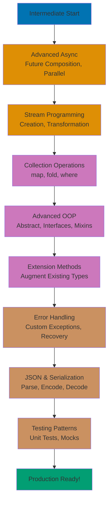
```mermaid
%% Color Palette: Blue #0173B2, Orange #DE8F05, Teal #029E73, Purple #CC78BC, Brown #CA9161
graph TD
    Start[Intermediate Start] --> Async[Advanced Async<br/>Future Composition, Parallel]
    Async --> Streams[Stream Programming<br/>Creation, Transformation]
    Streams --> Collections[Collection Operations<br/>map, fold, where]
    Collections --> OOP[Advanced OOP<br/>Abstract, Interfaces, Mixins]
    OOP --> Extensions[Extension Methods<br/>Augment Existing Types]
    Extensions --> Errors[Error Handling<br/>Custom Exceptions, Recovery]
    Errors --> JSON[JSON & Serialization<br/>Parse, Encode, Decode]
    JSON --> Testing[Testing Patterns<br/>Unit Tests, Mocks]
    Testing --> Ready[Production Ready!]

    style Start fill:#0173B2
    style Ready fill:#029E73
    style Async fill:#DE8F05
    style Streams fill:#DE8F05
    style Collections fill:#CC78BC
    style OOP fill:#CC78BC
    style Extensions fill:#CC78BC
    style Errors fill:#CA9161
    style JSON fill:#CA9161
    style Testing fill:#CA9161
```

This tutorial provides **60-85% coverage** of Dart knowledge, preparing you for production development and [Advanced](/en/learn/software-engineering/programming-languages/dart/by-concept/advanced) topics.

## Advanced Async Programming

### Understanding the Event Loop

Dart's concurrency model is built on a single-threaded event loop architecture. Understanding this is crucial for writing efficient async code.

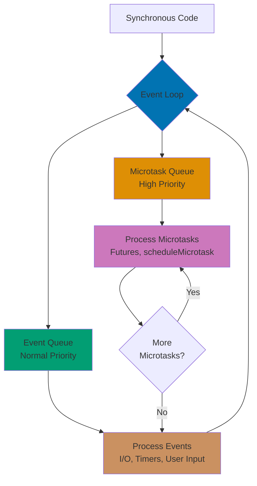
```mermaid
%% Color Palette: Blue #0173B2, Orange #DE8F05, Teal #029E73, Purple #CC78BC, Brown #CA9161
graph TD
    Code[Synchronous Code] --> EventLoop{Event Loop}
    EventLoop --> Microtask[Microtask Queue<br/>High Priority]
    EventLoop --> EventQueue[Event Queue<br/>Normal Priority]

    Microtask --> Process1[Process Microtasks<br/>Futures, scheduleMicrotask]
    EventQueue --> Process2[Process Events<br/>I/O, Timers, User Input]

    Process1 --> Check{More<br/>Microtasks?}
    Check -->|Yes| Process1
    Check -->|No| Process2

    Process2 --> EventLoop

    style EventLoop fill:#0173B2
    style Microtask fill:#DE8F05
    style EventQueue fill:#029E73
    style Process1 fill:#CC78BC
    style Process2 fill:#CA9161
```

**Key concepts**:

- **Single-threaded** - One execution thread handles all Dart code
- **Event loop** - Continuously processes queued tasks
- **Microtask queue** - High priority (Future completions, scheduleMicrotask)
- **Event queue** - Normal priority (I/O, timers, user events)
- **Execution order** - All microtasks complete before next event

**Why this matters**:

When you `await` a Future, Dart pauses the current function and returns control to the event loop. The event loop continues processing other events and microtasks. When the Future completes, it adds a microtask to resume your function. This allows thousands of concurrent async operations without creating threads.

**Comparison with other languages**:

- **JavaScript** - Similar event loop model (V8 engine influence)
- **Python** - asyncio also uses event loop but with different syntax
- **Go** - Goroutines use OS threads (true parallelism, higher memory cost)
- **Java** - Thread-based concurrency (higher overhead)

### Event Loop Example

```dart
void main() {
  print('1: Synchronous start');

  // Add to event queue
  Future(() => print('4: Event queue task'));

  // Add to microtask queue
  scheduleMicrotask(() => print('3: Microtask'));

  // Future.then also adds to microtask queue
  Future.value(42).then((value) => print('3.5: Future.then microtask'));

  print('2: Synchronous end');
}

// Output order:
// 1: Synchronous start
// 2: Synchronous end
// 3: Microtask
// 3.5: Future.then microtask
// 4: Event queue task
```

**Execution explanation**:

1. Synchronous code runs first (prints 1, 2)
2. All microtasks execute before any events (prints 3, 3.5)
3. Event queue tasks run last (prints 4)

### Future Composition

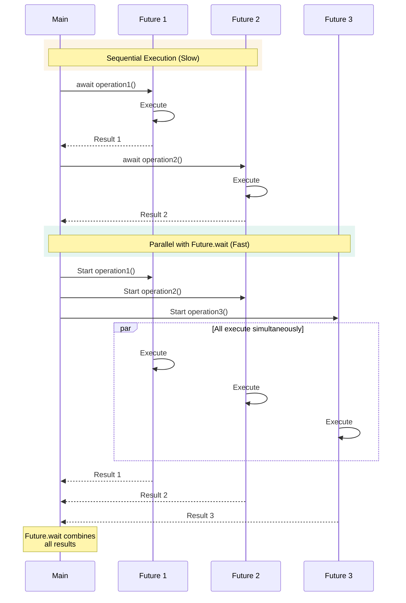
```mermaid
%% Color Palette: Blue #0173B2, Orange #DE8F05, Teal #029E73, Purple #CC78BC, Brown #CA9161
sequenceDiagram
    participant Main as Main
    participant F1 as Future 1
    participant F2 as Future 2
    participant F3 as Future 3

    rect rgb(222, 143, 5, 0.1)
        Note over Main,F2: Sequential Execution (Slow)
    end
    Main->>F1: await operation1()
    F1->>F1: Execute
    F1-->>Main: Result 1
    Main->>F2: await operation2()
    F2->>F2: Execute
    F2-->>Main: Result 2

    rect rgb(2, 158, 115, 0.1)
        Note over Main,F3: Parallel with Future.wait (Fast)
    end
    Main->>F1: Start operation1()
    Main->>F2: Start operation2()
    Main->>F3: Start operation3()

    par All execute simultaneously
        F1->>F1: Execute
        F2->>F2: Execute
        F3->>F3: Execute
    end

    F1-->>Main: Result 1
    F2-->>Main: Result 2
    F3-->>Main: Result 3
    Note over Main: Future.wait combines<br/>all results
```

Combine multiple async operations:

```dart
Future<double> fetchGoldPrice() async {
  await Future.delayed(Duration(seconds: 1));
  return 1000000.0; // Rp per gram
}

Future<double> fetchSilverPrice() async {
  await Future.delayed(Duration(seconds: 1));
  return 15000.0; // Rp per gram
}

Future<Map<String, double>> fetchAllPrices() async {
  // Sequential execution (slow: 2 seconds total)
  double goldPrice = await fetchGoldPrice();
  double silverPrice = await fetchSilverPrice();

  return {
    'gold': goldPrice,
    'silver': silverPrice,
  };
}

Future<Map<String, double>> fetchAllPricesParallel() async {
  // Parallel execution (fast: 1 second total)
  var results = await Future.wait([
    fetchGoldPrice(),
    fetchSilverPrice(),
  ]);

  return {
    'gold': results[0],
    'silver': results[1],
  };
}

void main() async {
  print('Fetching prices in parallel...');
  var prices = await fetchAllPricesParallel();
  print('Gold: Rp${prices['gold']}');
  print('Silver: Rp${prices['silver']}');
}
```

**Key patterns**:

- **Sequential with `await`** - Operations run one after another
- **Parallel with `Future.wait`** - Operations run simultaneously
- **`Future.wait` returns List** - Results in same order as input

### Advanced Future Methods

```dart
void main() async {
  // Future.any - Returns first completed future
  var fastest = await Future.any([
    Future.delayed(Duration(seconds: 2), () => 'Slow'),
    Future.delayed(Duration(seconds: 1), () => 'Fast'),
  ]);
  print('First result: $fastest'); // Fast

  // Future.timeout - Fail if not completed in time
  try {
    var result = await Future.delayed(
      Duration(seconds: 5),
      () => 'Done',
    ).timeout(Duration(seconds: 2));
  } on TimeoutException {
    print('Operation timed out');
  }

  // then/catchError chaining (alternative to async/await)
  fetchGoldPrice()
      .then((price) => price * 85) // Calculate nisab
      .then((nisab) => print('Nisab: Rp$nisab'))
      .catchError((error) => print('Error: $error'));
}
```

### Error Handling in Async Code

```dart
Future<double> calculateZakat(String userId) async {
  try {
    // Simulate fetching user wealth from database
    double wealth = await fetchWealthFromDatabase(userId);

    // Simulate fetching configuration
    double nisab = await fetchNisabThreshold();

    if (wealth < nisab) {
      return 0.0;
    }

    return wealth * 0.025;
  } on DatabaseException catch (e) {
    print('Database error: ${e.message}');
    throw ZakatCalculationException('Failed to fetch data');
  } on NetworkException catch (e) {
    print('Network error: ${e.message}');
    throw ZakatCalculationException('Network failure');
  } catch (e) {
    print('Unexpected error: $e');
    rethrow; // Re-throw to caller
  }
}

// Custom exceptions
class ZakatCalculationException implements Exception {
  final String message;
  ZakatCalculationException(this.message);

  @override
  String toString() => 'ZakatCalculationException: $message';
}

class DatabaseException implements Exception {
  final String message;
  DatabaseException(this.message);
}

class NetworkException implements Exception {
  final String message;
  NetworkException(this.message);
}

// Placeholder implementations
Future<double> fetchWealthFromDatabase(String userId) async {
  await Future.delayed(Duration(milliseconds: 500));
  return 100000000.0;
}

Future<double> fetchNisabThreshold() async {
  await Future.delayed(Duration(milliseconds: 300));
  return 85000000.0;
}
```

### Future State Machine

Futures in Dart have internal states that determine their behavior:

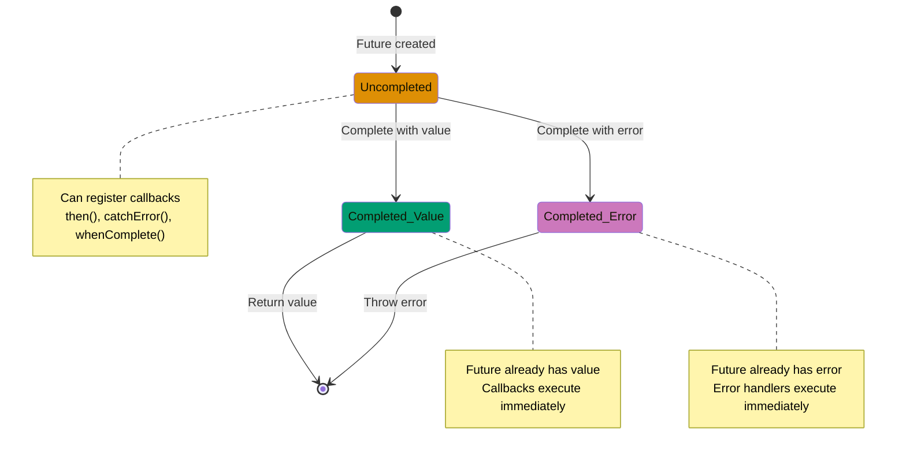
```mermaid
%% Color Palette: Blue #0173B2, Orange #DE8F05, Teal #029E73, Purple #CC78BC, Brown #CA9161
stateDiagram-v2
    [*] --> Uncompleted: Future created
    Uncompleted --> Completed_Value: Complete with value
    Uncompleted --> Completed_Error: Complete with error

    Completed_Value --> [*]: Return value
    Completed_Error --> [*]: Throw error

    note right of Uncompleted
        Can register callbacks
        then(), catchError(), whenComplete()
    end note

    note right of Completed_Value
        Future already has value
        Callbacks execute immediately
    end note

    note right of Completed_Error
        Future already has error
        Error handlers execute immediately
    end note

    style Uncompleted fill:#DE8F05
    style Completed_Value fill:#029E73
    style Completed_Error fill:#CC78BC
```

**Key insights**:

- **Uncompleted state** - Waiting for operation to finish
- **Completed state** - Operation finished (either value or error)
- **One-time completion** - Future completes exactly once (immutable result)
- **Callback timing** - If Future already completed, callbacks execute synchronously

**Why immutability matters**:

Once a Future completes, its result never changes. This guarantees that multiple listeners get the same result and eliminates race conditions. Compare to callbacks in JavaScript where the same callback might be called multiple times.

### Isolate Memory Model

Dart isolates provide true parallelism but with isolated memory:

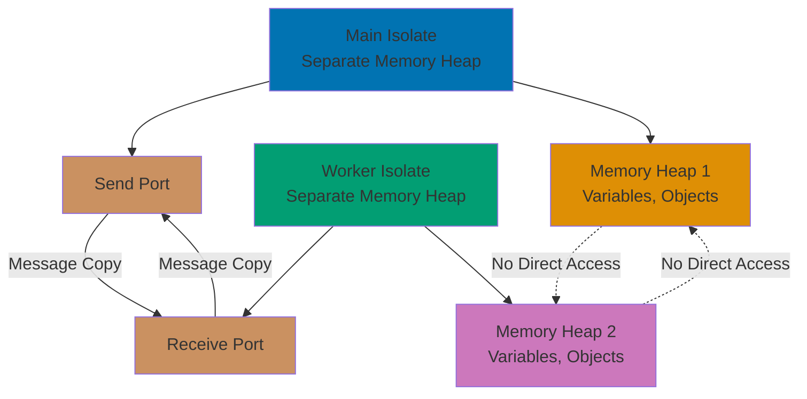
```mermaid
%% Color Palette: Blue #0173B2, Orange #DE8F05, Teal #029E73, Purple #CC78BC, Brown #CA9161
graph TD
    Main[Main Isolate<br/>Separate Memory Heap] --> Port1[Send Port]
    Worker[Worker Isolate<br/>Separate Memory Heap] --> Port2[Receive Port]

    Port1 -->|Message Copy| Port2
    Port2 -->|Message Copy| Port1

    Main --> Memory1[Memory Heap 1<br/>Variables, Objects]
    Worker --> Memory2[Memory Heap 2<br/>Variables, Objects]

    Memory1 -.No Direct Access.-> Memory2
    Memory2 -.No Direct Access.-> Memory1

    style Main fill:#0173B2
    style Worker fill:#029E73
    style Memory1 fill:#DE8F05
    style Memory2 fill:#CC78BC
    style Port1 fill:#CA9161
    style Port2 fill:#CA9161
```

**Isolate characteristics**:

- **Separate memory heaps** - No shared state between isolates
- **Message passing** - Communication via port channels (messages copied)
- **True parallelism** - Each isolate runs on separate OS thread
- **No race conditions** - Impossible to have data races across isolates
- **Higher cost** - Message copying has overhead

**When to use isolates vs async**:

- **Async/await** - I/O-bound operations (network, file access, timers)
- **Isolates** - CPU-intensive computation (image processing, encryption, data parsing)

**Comparison with other languages**:

- **JavaScript** - Web Workers provide similar isolation
- **Go** - Goroutines share memory (requires synchronization)
- **Erlang** - Actor model similar to Dart isolates (message passing)

### Concurrency vs Parallelism

Understanding the difference is crucial for choosing the right approach:

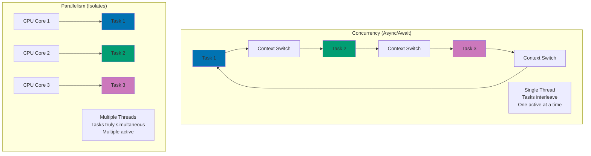
```mermaid
%% Color Palette: Blue #0173B2, Orange #DE8F05, Teal #029E73, Purple #CC78BC, Brown #CA9161
graph TD
    subgraph Concurrency["Concurrency (Async/Await)"]
        Task1[Task 1] --> Switch1[Context Switch]
        Switch1 --> Task2[Task 2]
        Task2 --> Switch2[Context Switch]
        Switch2 --> Task3[Task 3]
        Task3 --> Switch3[Context Switch]
        Switch3 --> Task1

        Note1[Single Thread<br/>Tasks interleave<br/>One active at a time]
    end

    subgraph Parallelism["Parallelism (Isolates)"]
        Core1[CPU Core 1] --> IsoTask1[Task 1]
        Core2[CPU Core 2] --> IsoTask2[Task 2]
        Core3[CPU Core 3] --> IsoTask3[Task 3]

        Note2[Multiple Threads<br/>Tasks truly simultaneous<br/>Multiple active]
    end

    style Task1 fill:#0173B2
    style Task2 fill:#029E73
    style Task3 fill:#CC78BC
    style IsoTask1 fill:#0173B2
    style IsoTask2 fill:#029E73
    style IsoTask3 fill:#CC78BC
```

**Concurrency (async/await)**:

- Makes progress on multiple tasks
- One task active at any moment
- Low memory overhead
- Perfect for I/O-bound work

**Parallelism (isolates)**:

- Multiple tasks execute simultaneously
- Requires multiple CPU cores
- Higher memory/communication cost
- Necessary for CPU-bound work

## Streams and Reactive Programming

### Stream Architecture

Streams provide a reactive programming model for handling sequences of events:

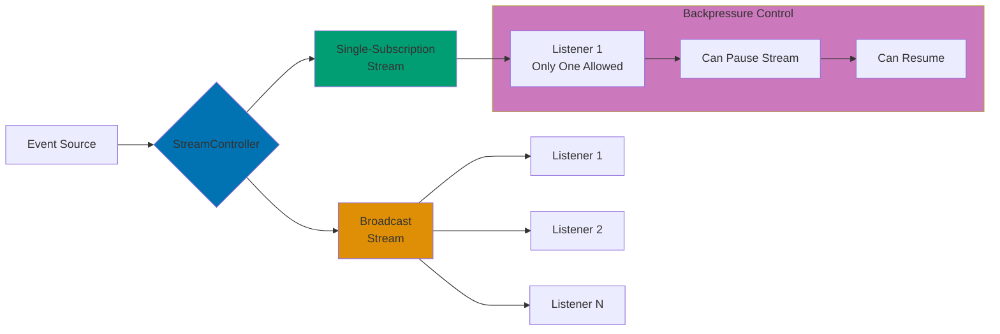
```mermaid
%% Color Palette: Blue #0173B2, Orange #DE8F05, Teal #029E73, Purple #CC78BC, Brown #CA9161
graph LR
    Source[Event Source] --> Controller{StreamController}
    Controller --> SingleSub[Single-Subscription<br/>Stream]
    Controller --> Broadcast[Broadcast<br/>Stream]

    SingleSub --> Listener1[Listener 1<br/>Only One Allowed]

    Broadcast --> BListener1[Listener 1]
    Broadcast --> BListener2[Listener 2]
    Broadcast --> BListener3[Listener N]

    subgraph BackPressure["Backpressure Control"]
        Listener1 --> Pause[Can Pause Stream]
        Pause --> Resume[Can Resume]
    end

    style Controller fill:#0173B2
    style SingleSub fill:#029E73
    style Broadcast fill:#DE8F05
    style BackPressure fill:#CC78BC
```

**Stream types**:

- **Single-subscription** - Only one listener allowed (default)
- **Broadcast** - Multiple listeners supported (created explicitly)

**Why two types?**

Single-subscription streams can buffer events and support backpressure (pausing when listener is slow). Broadcast streams emit events to all listeners immediately without buffering, making them suitable for events like button clicks where missing occasional events is acceptable.

**Backpressure concept**:

When data arrives faster than it can be processed, backpressure mechanisms prevent memory overflow. Single-subscription streams can pause the source when the listener falls behind, then resume when ready.

### Creating Streams

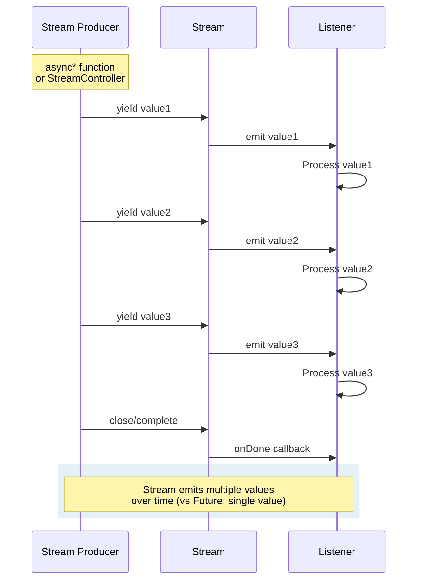
```mermaid
%% Color Palette: Blue #0173B2, Orange #DE8F05, Teal #029E73, Purple #CC78BC, Brown #CA9161
sequenceDiagram
    participant Producer as Stream Producer
    participant Stream as Stream
    participant Listener as Listener

    Note over Producer: async* function<br/>or StreamController

    Producer->>Stream: yield value1
    Stream->>Listener: emit value1
    Listener->>Listener: Process value1

    Producer->>Stream: yield value2
    Stream->>Listener: emit value2
    Listener->>Listener: Process value2

    Producer->>Stream: yield value3
    Stream->>Listener: emit value3
    Listener->>Listener: Process value3

    Producer->>Stream: close/complete
    Stream->>Listener: onDone callback

    rect rgb(1, 115, 178, 0.1)
        Note over Producer,Listener: Stream emits multiple values<br/>over time (vs Future: single value)
    end
```

Streams represent sequences of asynchronous events:

```dart
// Stream from async generator
Stream<double> donationStream() async* {
  // Simulate donations received over time
  await Future.delayed(Duration(seconds: 1));
  yield 100000; // First donation

  await Future.delayed(Duration(seconds: 1));
  yield 250000; // Second donation

  await Future.delayed(Duration(seconds: 1));
  yield 500000; // Third donation
}

// Stream from periodic timer
Stream<DateTime> prayerTimeReminders(Duration interval) {
  return Stream.periodic(interval, (count) {
    return DateTime.now();
  }).take(5); // Only 5 reminders
}

void main() async {
  // Listen to stream
  print('Listening for donations...');
  await for (var donation in donationStream()) {
    print('Received donation: Rp$donation');
  }

  print('\nPrayer reminders:');
  await for (var time in prayerTimeReminders(Duration(seconds: 2))) {
    print('Prayer reminder at: ${time.hour}:${time.minute}');
  }
}
```

### Stream Transformations

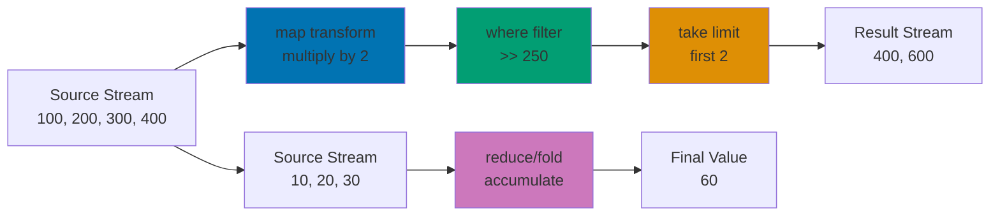
```mermaid
%% Color Palette: Blue #0173B2, Orange #DE8F05, Teal #029E73, Purple #CC78BC, Brown #CA9161
flowchart LR
    Source[Source Stream<br/>100, 200, 300, 400] --> Map[map transform<br/>multiply by 2]
    Map --> Where[where filter<br/>>> 250]
    Where --> Take[take limit<br/>first 2]
    Take --> Result[Result Stream<br/>400, 600]

    Source --> Source2[Source Stream<br/>10, 20, 30]
    Source2 --> Reduce[reduce/fold<br/>accumulate]
    Reduce --> Final[Final Value<br/>60]

    style Map fill:#0173B2
    style Where fill:#029E73
    style Take fill:#DE8F05
    style Reduce fill:#CC78BC
```

Transform stream data with powerful operations:

```dart
void main() async {
  // Map - Transform each value
  var donations = donationStream();
  var formatted = donations.map((amount) => 'Rp${amount}');

  await for (var text in formatted) {
    print('Donation: $text');
  }

  // Where - Filter values
  var largeDonations = donationStream().where((amount) => amount >= 200000);

  print('\nLarge donations only:');
  await for (var amount in largeDonations) {
    print('Large donation: Rp$amount');
  }

  // Reduce/Fold - Accumulate values
  var total = await donationStream().reduce((sum, amount) => sum + amount);
  print('\nTotal donations: Rp$total');

  // Take/Skip - Limit stream
  var firstTwo = donationStream().take(2);
  await for (var amount in firstTwo) {
    print('First two: Rp$amount');
  }
}
```

### StreamController

Create and control custom streams:

```dart
import 'dart:async';

class DonationTracker {
  final _controller = StreamController<double>();

  // Expose stream (read-only)
  Stream<double> get donations => _controller.stream;

  // Add donation
  void recordDonation(double amount) {
    _controller.add(amount);
  }

  // Dispose when done
  void dispose() {
    _controller.close();
  }
}

void main() async {
  var tracker = DonationTracker();

  // Subscribe to stream
  tracker.donations.listen(
    (amount) => print('Donation received: Rp$amount'),
    onDone: () => print('Stream closed'),
  );

  // Add donations
  tracker.recordDonation(100000);
  await Future.delayed(Duration(milliseconds: 100));

  tracker.recordDonation(250000);
  await Future.delayed(Duration(milliseconds: 100));

  tracker.recordDonation(500000);
  await Future.delayed(Duration(milliseconds: 100));

  // Clean up
  tracker.dispose();
}
```

### Stream Broadcast

Allow multiple listeners:

```dart
void main() async {
  // Single-subscription stream (default)
  var single = donationStream();
  // single.listen(...);
  // single.listen(...); // ERROR: Already has listener

  // Broadcast stream (multiple listeners)
  var broadcast = donationStream().asBroadcastStream();

  // Multiple listeners OK
  broadcast.listen((amount) => print('Listener 1: Rp$amount'));
  broadcast.listen((amount) => print('Listener 2: Rp$amount'));

  await Future.delayed(Duration(seconds: 5));
}
```

### Stream vs Future Comparison

Understanding when to use each is crucial:

| Aspect           | Future                    | Stream                               |
| ---------------- | ------------------------- | ------------------------------------ |
| **Values**       | Single value or error     | Sequence of values or errors         |
| **Completion**   | Completes once            | Can emit indefinitely                |
| **Use cases**    | HTTP request, file read   | User events, real-time updates       |
| **Memory**       | Lightweight               | Requires buffering/management        |
| **Cancellation** | Can't cancel once started | Can pause/resume/cancel subscription |

**Real-world scenarios**:

- **Future** - Fetching zakat nisab value from API (one result)
- **Stream** - Monitoring real-time donation events (continuous)
- **Future** - Reading configuration file (one-time data)
- **Stream** - Tracking stock price changes (continuous updates)

## Type System Deep Dive

### Sound Null Safety Architecture

Dart's null safety is "sound" - the compiler guarantees no null reference errors at runtime:

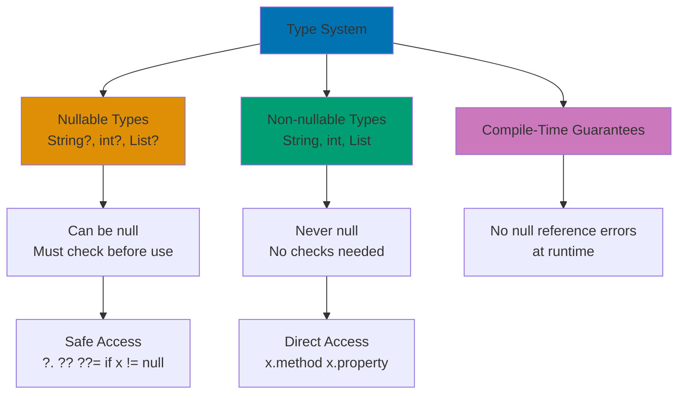
```mermaid
%% Color Palette: Blue #0173B2, Orange #DE8F05, Teal #029E73, Purple #CC78BC, Brown #CA9161
graph TD
    Type[Type System] --> Nullable[Nullable Types<br/>String?, int?, List?]
    Type --> NonNull[Non-nullable Types<br/>String, int, List]

    Nullable --> CanBeNull[Can be null<br/>Must check before use]
    NonNull --> NeverNull[Never null<br/>No checks needed]

    CanBeNull --> SafeAccess[Safe Access<br/>?. ?? ??= if x != null]
    NeverNull --> DirectAccess[Direct Access<br/>x.method x.property]

    Type --> Guarantees[Compile-Time Guarantees]
    Guarantees --> NoRuntime[No null reference errors<br/>at runtime]

    style Type fill:#0173B2
    style Nullable fill:#DE8F05
    style NonNull fill:#029E73
    style Guarantees fill:#CC78BC
```

**Sound null safety benefits**:

- **No null pointer exceptions** - Compiler catches all potential null accesses
- **Better performance** - VM knows variables are never null (no runtime checks)
- **Self-documenting** - API signatures show which values can be null
- **Easier refactoring** - Type system catches issues when changing nullability

**Comparison with other languages**:

- **Dart** - Sound (guaranteed safety)
- **TypeScript** - Unsound (can be bypassed with `any`)
- **Kotlin** - Sound (similar to Dart)
- **Java** - No null safety (NullPointerException common)
- **C#** - Nullable reference types (optional, warnings only)

### Type Promotion and Flow Analysis

Dart's type system performs sophisticated flow analysis:

```dart
void processUser(String? name) {
  // name is String? here

  if (name != null) {
    // name promoted to String (non-nullable)
    print(name.length); // Safe, no null check needed
    print(name.toUpperCase()); // Safe
  }

  // name is String? again here
}

void smartPromotion(Object value) {
  // value is Object here

  if (value is String) {
    // value promoted to String
    print(value.length); // No cast needed
  }

  if (value is int && value > 0) {
    // value promoted to int
    print(value.isEven); // No cast needed
  }
}
```

**Type promotion rules**:

- **Null checks** - `if (x != null)` promotes to non-nullable
- **Type tests** - `if (x is Type)` promotes to Type
- **Local variables** - Promotion works for local variables only
- **Fields** - Instance fields don't promote (can change between checks)

**Why fields don't promote**:

```dart
class Account {
  String? userName; // Field

  void printUser() {
    if (userName != null) {
      // userName is still String?, not promoted
      // Reason: Another thread/isolate could set userName = null
      print(userName?.length); // Still need null-aware access
    }
  }
}
```

Fields are mutable and could change between the null check and usage. Use local variables for promotion:

```dart
void printUser() {
  var name = userName; // Copy to local variable
  if (name != null) {
    print(name.length); // Promoted to String
  }
}
```

### Generic Type Variance

Understanding covariance and contravariance is key to type-safe generic code:

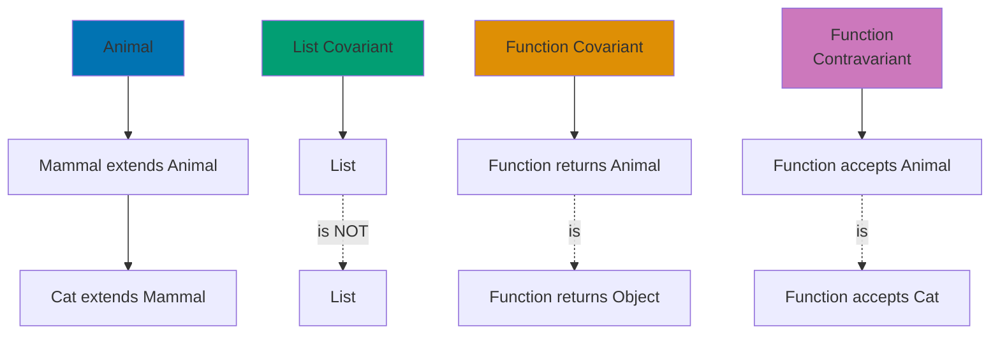
```mermaid
%% Color Palette: Blue #0173B2, Orange #DE8F05, Teal #029E73, Purple #CC78BC, Brown #CA9161
graph TD
    Animal[Animal] --> Mammal[Mammal extends Animal]
    Mammal --> Cat[Cat extends Mammal]

    List[List<T> Covariant] --> ListCat[List<Cat>]
    ListCat -.is NOT.-> ListAnimal[List<Animal>]

    Function[Function<R> Covariant] --> FuncAnimal[Function returns Animal]
    FuncAnimal -.is.-> FuncObject[Function returns Object]

    FuncParam[Function<P> Contravariant] --> AcceptAnimal[Function accepts Animal]
    AcceptAnimal -.is.-> AcceptCat[Function accepts Cat]

    style Animal fill:#0173B2
    style List fill:#029E73
    style Function fill:#DE8F05
    style FuncParam fill:#CC78BC
```

**Covariance (producers)** - Types can be more specific:

```dart
class Animal {}
class Cat extends Animal {}

// Covariant return types
abstract class AnimalFactory {
  Animal create(); // Returns Animal
}

class CatFactory extends AnimalFactory {
  @override
  Cat create() => Cat(); // Can return Cat (more specific)
}
```

**Contravariance (consumers)** - Types can be more general:

```dart
// Contravariant parameter types
typedef AnimalHandler = void Function(Animal animal);

void handleAnimal(Animal animal) {
  print('Handling animal');
}

void handleCat(Cat cat) {
  print('Handling cat');
}

void useHandler(AnimalHandler handler) {
  handler(Cat());
}

void main() {
  useHandler(handleAnimal); // OK: Animal is supertype of Cat
  // useHandler(handleCat); // ERROR: Cat is subtype of Animal
}
```

**Dart's approach**:

- **Lists/Collections** - Invariant (neither covariant nor contravariant for safety)
- **Return types** - Covariant (can return more specific)
- **Parameter types** - Contravariant (can accept more general)

### Type Inference Algorithm

Dart uses sophisticated type inference to minimize type annotations:

```dart
// Dart infers types automatically
void main() {
  var donations = [100000, 250000, 500000]; // Inferred: List<int>
  var total = donations.reduce((a, b) => a + b); // Inferred: int

  var accounts = {
    'savings': 1000000,
    'checking': 500000,
  }; // Inferred: Map<String, int>

  var result = accounts['savings'] ?? 0; // Inferred: int
}
```

**Type inference rules**:

1. **Variable initialization** - Type inferred from initializer
2. **Generic collections** - Element type inferred from first element or context
3. **Function returns** - Inferred from return statements
4. **Generic methods** - Type arguments inferred from context

**When to add explicit types**:

```dart
// Explicit types help clarity and safety
abstract class PaymentProcessor {
  Future<PaymentResult> process(double amount); // Return type explicit
}

void processPayments(List<double> amounts) { // Parameter type explicit
  // amounts inferred as List<double> from parameter type
}
```

### Dynamic Type Usage Patterns

The `dynamic` type opts out of type safety:

```dart
void main() {
  dynamic value = 'Hello';
  print(value.length); // OK at compile time

  value = 42;
  // print(value.length); // Runtime error! int has no length

  // Better: Use Object when type is unknown
  Object obj = 'Hello';
  // print(obj.length); // Compile error - must check type first

  if (obj is String) {
    print(obj.length); // Safe after type check
  }
}
```

**When to use dynamic**:

- Interop with JavaScript/web APIs
- Deserializing JSON with unknown structure
- Rapid prototyping (convert to proper types later)

**Prefer Object over dynamic**:

- `Object` maintains type safety
- Requires explicit type checks
- Catches errors at compile time

### Runtime Type Checking Cost

Type checks and casts have performance implications:

```dart
void main() {
  var list = <Object>[1, 2, 'three', 4];

  // whereType is efficient (single type check per element)
  var numbers = list.whereType<int>(); // [1, 2, 4]

  // Type cast (throws if wrong type)
  try {
    var text = list[0] as String; // Runtime error
  } catch (e) {
    print('Cast failed: $e');
  }

  // Type test (returns bool, safe)
  if (list[0] is int) {
    print('First element is int');
  }
}
```

**Performance guidelines**:

- **Avoid repeated casts** - Cast once, store in typed variable
- **Use `is` before `as`** - Check type before casting
- **Generic collections** - Type checked at compile time (fast)
- **Dynamic access** - Every access requires runtime check (slow)

## Advanced Null Safety Patterns

### Null-Aware Cascades

Chain operations on nullable objects:

```dart
class MurabahaContract {
  double? assetCost;
  double? profitMargin;
  int? months;

  void printDetails() {
    print('Cost: $assetCost, Profit: $profitMargin, Months: $months');
  }
}

void main() {
  MurabahaContract? contract;

  // Null-aware cascade (only executes if not null)
  contract
    ?..assetCost = 50000000
    ..profitMargin = 5000000
    ..months = 24
    ..printDetails();
  // Nothing happens (contract is null)

  // Non-null cascade
  contract = MurabahaContract();
  contract
    ..assetCost = 50000000
    ..profitMargin = 5000000
    ..months = 24
    ..printDetails();
  // Executes all operations
}
```

### Handling Nullable Collections

```dart
void main() {
  List<String>? nullableList;

  // Safe access with ?.
  int? length = nullableList?.length; // null
  print('Length: $length');

  // Provide default with ??
  var actualList = nullableList ?? <String>[];
  print('List: $actualList'); // []

  // Null-aware iteration
  nullableList?.forEach((item) => print(item)); // Doesn't execute

  // Map nullable values
  List<String?> mixedList = ['Ahmad', null, 'Fatimah', null];
  var nonNull = mixedList.where((name) => name != null).cast<String>();
  print('Non-null names: $nonNull'); // (Ahmad, Fatimah)

  // WhereType for type filtering
  var names = mixedList.whereType<String>(); // Filters out nulls
  print('Names: $names'); // (Ahmad, Fatimah)
}
```

## Collection Operations

### Map, Where, Fold

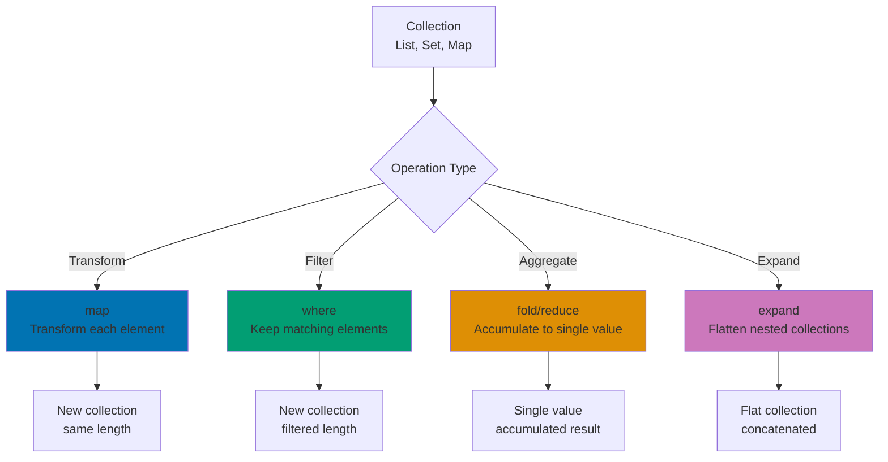
```mermaid
%% Color Palette: Blue #0173B2, Orange #DE8F05, Teal #029E73, Purple #CC78BC, Brown #CA9161
flowchart TD
    Collection[Collection<br/>List, Set, Map] --> Operations{Operation Type}

    Operations -->|Transform| Map[map<br/>Transform each element]
    Operations -->|Filter| Where[where<br/>Keep matching elements]
    Operations -->|Aggregate| Fold[fold/reduce<br/>Accumulate to single value]
    Operations -->|Expand| ExpandOp[expand<br/>Flatten nested collections]

    Map --> MapResult[New collection<br/>same length]
    Where --> WhereResult[New collection<br/>filtered length]
    Fold --> FoldResult[Single value<br/>accumulated result]
    ExpandOp --> ExpandResult[Flat collection<br/>concatenated]

    style Map fill:#0173B2
    style Where fill:#029E73
    style Fold fill:#DE8F05
    style ExpandOp fill:#CC78BC
```

Functional operations on collections:

```dart
void main() {
  var donations = [100000, 250000, 500000, 150000, 300000];

  // Map - Transform each element
  var formatted = donations.map((amount) => 'Rp$amount').toList();
  print('Formatted: $formatted');

  // Where - Filter elements
  var large = donations.where((amount) => amount >= 200000).toList();
  print('Large donations: $large'); // [250000, 500000, 300000]

  // Fold - Accumulate with initial value
  var total = donations.fold<int>(0, (sum, amount) => sum + amount);
  print('Total: Rp$total'); // 1300000

  // Reduce - Accumulate without initial value
  var sum = donations.reduce((a, b) => a + b);
  print('Sum: Rp$sum'); // 1300000

  // Chaining operations
  var processedTotal = donations
      .where((amount) => amount >= 150000)
      .map((amount) => amount * 1.1) // Add 10% blessing
      .fold<double>(0, (sum, amount) => sum + amount);
  print('Processed total: Rp${processedTotal.toStringAsFixed(2)}');
}
```

### Expand and Every/Any

Advanced collection queries:

```dart
void main() {
  // Expand - Flatten nested collections
  var groups = [
    ['Ahmad', 'Fatimah'],
    ['Ali', 'Hassan'],
    ['Zahra'],
  ];
  var allNames = groups.expand((group) => group).toList();
  print('All names: $allNames'); // [Ahmad, Fatimah, Ali, Hassan, Zahra]

  // Every - Check all elements satisfy condition
  var donations = [100000, 250000, 500000];
  bool allPositive = donations.every((amount) => amount > 0);
  print('All positive: $allPositive'); // true

  bool allLarge = donations.every((amount) => amount >= 200000);
  print('All large: $allLarge'); // false

  // Any - Check if any element satisfies condition
  bool hasLarge = donations.any((amount) => amount >= 200000);
  print('Has large: $hasLarge'); // true

  // FirstWhere/LastWhere - Find element
  var firstLarge = donations.firstWhere(
    (amount) => amount >= 200000,
    orElse: () => 0,
  );
  print('First large: Rp$firstLarge'); // 250000
}
```

## Object-Oriented Programming Concepts

### Class Hierarchy and Inheritance Chains

Understanding how Dart resolves method calls in inheritance hierarchies:

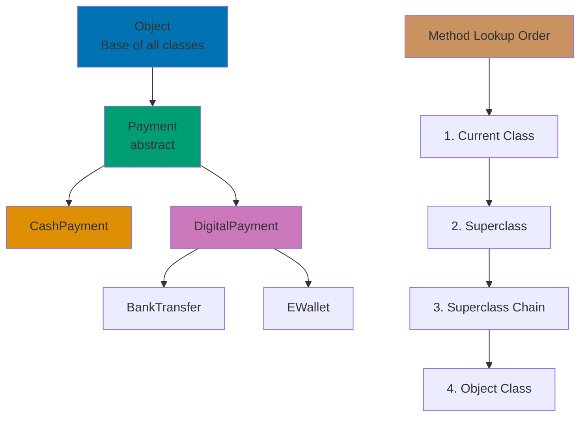
```mermaid
%% Color Palette: Blue #0173B2, Orange #DE8F05, Teal #029E73, Purple #CC78BC, Brown #CA9161
graph TD
    Object[Object<br/>Base of all classes] --> Payment[Payment<br/>abstract]
    Payment --> CashPayment[CashPayment]
    Payment --> DigitalPayment[DigitalPayment]

    DigitalPayment --> BankTransfer[BankTransfer]
    DigitalPayment --> EWallet[EWallet]

    Lookup[Method Lookup Order] --> Current[1. Current Class]
    Current --> Super[2. Superclass]
    Super --> SuperSuper[3. Superclass Chain]
    SuperSuper --> ObjectClass[4. Object Class]

    style Object fill:#0173B2
    style Payment fill:#029E73
    style CashPayment fill:#DE8F05
    style DigitalPayment fill:#CC78BC
    style Lookup fill:#CA9161
```

**Method resolution**:

When you call a method, Dart searches in this order:

1. Current class
2. Immediate superclass
3. Superclass chain (up to Object)
4. noSuchMethod if not found

**Example**:

```dart
abstract class Payment {
  double amount;
  Payment(this.amount);

  void process() {
    print('Processing payment of Rp$amount');
  }

  double calculateFee(); // Abstract method
}

class CashPayment extends Payment {
  CashPayment(double amount) : super(amount);

  @override
  double calculateFee() => 0.0; // No fee for cash

  @override
  void process() {
    print('Cash payment: Rp$amount (no fee)');
    super.process(); // Call superclass method
  }
}

class DigitalPayment extends Payment {
  final double feeRate;

  DigitalPayment(double amount, this.feeRate) : super(amount);

  @override
  double calculateFee() => amount * feeRate;

  @override
  void process() {
    var fee = calculateFee();
    print('Digital payment: Rp$amount + Rp$fee fee');
    super.process();
  }
}
```

**Key insights**:

- **`super` keyword** - Explicitly call superclass method
- **`@override` annotation** - Documents method override (compiler checks)
- **Abstract methods** - Force subclasses to provide implementation
- **Concrete methods** - Can be inherited or overridden

### Abstract Classes vs Interfaces

Dart doesn't have explicit interface keyword - every class is an interface:

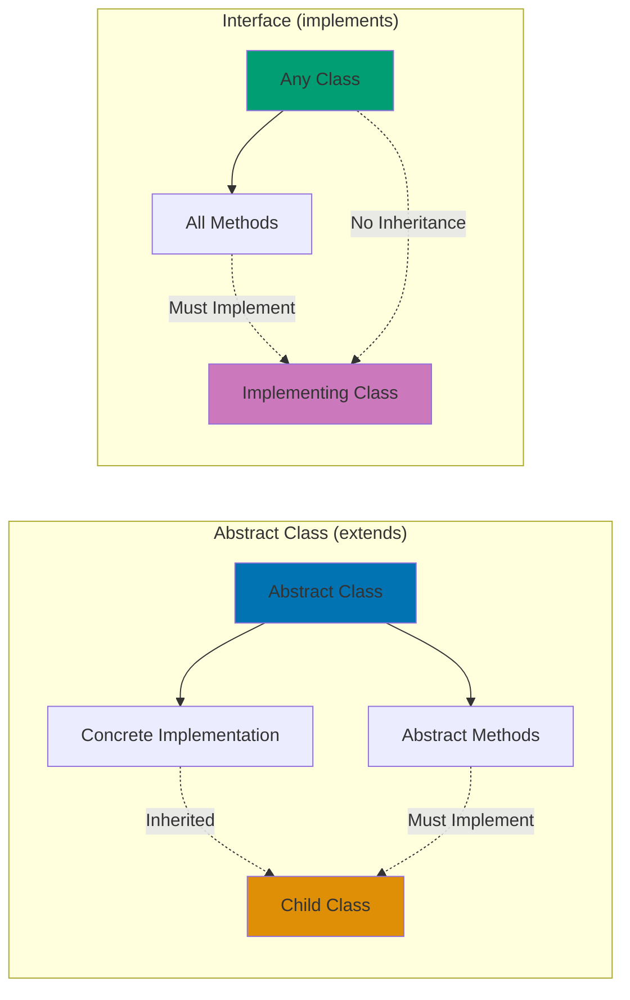
```mermaid
%% Color Palette: Blue #0173B2, Orange #DE8F05, Teal #029E73, Purple #CC78BC, Brown #CA9161
graph LR
    subgraph AbstractClass["Abstract Class (extends)"]
        AC[Abstract Class] --> ACImpl[Concrete Implementation]
        AC --> ACAbstract[Abstract Methods]
        ACImpl -.Inherited.-> Child1[Child Class]
        ACAbstract -.Must Implement.-> Child1
    end

    subgraph Interface["Interface (implements)"]
        IC[Any Class] --> ICMethod[All Methods]
        ICMethod -.Must Implement.-> Child2[Implementing Class]
        IC -.No Inheritance.-> Child2
    end

    style AC fill:#0173B2
    style IC fill:#029E73
    style Child1 fill:#DE8F05
    style Child2 fill:#CC78BC
```

**Abstract class (`extends`)** - Provides implementation:

```dart
abstract class Zakatable {
  double getValue(); // Abstract

  double calculateZakat() { // Concrete implementation
    var value = getValue();
    return value >= 85000000 ? value * 0.025 : 0.0;
  }
}

class GoldHolding extends Zakatable {
  final double grams;
  final double pricePerGram;

  GoldHolding(this.grams, this.pricePerGram);

  @override
  double getValue() => grams * pricePerGram;

  // Inherits calculateZakat() implementation
}
```

**Interface (`implements`)** - Must implement everything:

```dart
// Use any class as interface
abstract class Valuable {
  double getValue();
}

abstract class Reportable {
  String generateReport();
}

// Implement multiple interfaces
class Investment implements Valuable, Reportable {
  final double amount;
  Investment(this.amount);

  @override
  double getValue() => amount; // Must implement

  @override
  String generateReport() => 'Investment: Rp$amount'; // Must implement
}
```

**When to use each**:

- **Abstract class** - Share implementation code, single inheritance tree
- **Interface** - Define contract, allow multiple "types", no implementation sharing

**Comparison with other languages**:

- **Dart** - Every class is an interface, abstract classes provide implementation
- **Java** - Separate `interface` and `abstract class` keywords
- **Go** - Implicit interfaces (duck typing)
- **TypeScript** - Explicit `interface` keyword, structural typing

### Mixin Linearization Algorithm

When using multiple mixins, Dart applies them in specific order:

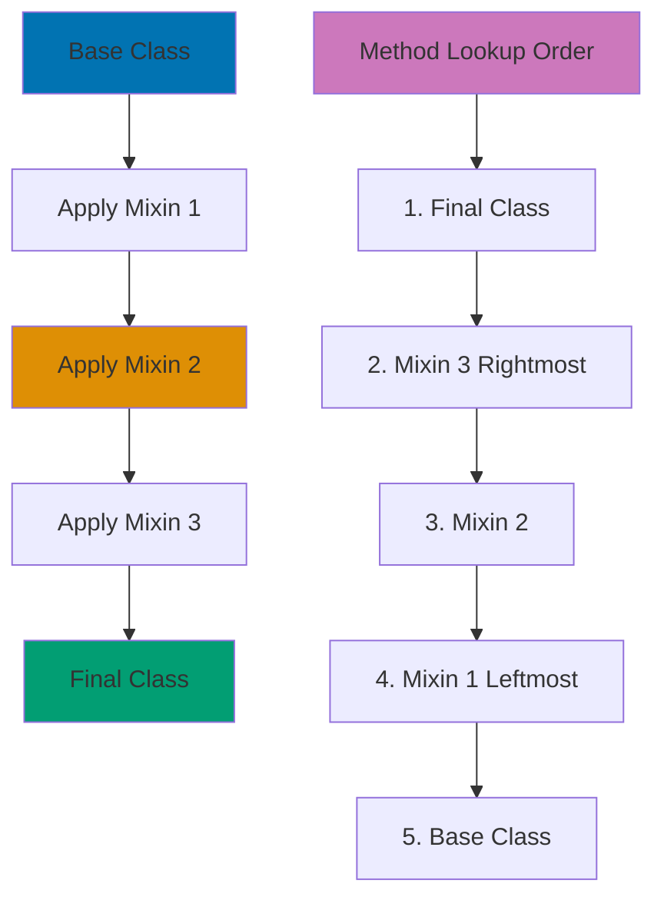
```mermaid
%% Color Palette: Blue #0173B2, Orange #DE8F05, Teal #029E73, Purple #CC78BC, Brown #CA9161
graph TD
    Base[Base Class] --> Apply1[Apply Mixin 1]
    Apply1 --> Apply2[Apply Mixin 2]
    Apply2 --> Apply3[Apply Mixin 3]
    Apply3 --> Final[Final Class]

    Lookup[Method Lookup Order] --> LFinal[1. Final Class]
    LFinal --> LMixin3[2. Mixin 3 Rightmost]
    LMixin3 --> LMixin2[3. Mixin 2]
    LMixin2 --> LMixin1[4. Mixin 1 Leftmost]
    LMixin1 --> LBase[5. Base Class]

    style Base fill:#0173B2
    style Final fill:#029E73
    style Apply2 fill:#DE8F05
    style Lookup fill:#CC78BC
```

**Linearization order**:

```dart
mixin LoggableMixin {
  void log(String message) => print('[LOG] $message');
}

mixin AuditableMixin {
  void audit(String action) => print('[AUDIT] $action');
}

mixin ValidatableMixin {
  bool validate() {
    print('[VALIDATE] Checking...');
    return true;
  }
}

// Mixins applied right to left for method resolution
class Transaction with LoggableMixin, AuditableMixin, ValidatableMixin {
  void process() {
    if (validate()) { // From ValidatableMixin
      log('Processing'); // From LoggableMixin
      audit('Transaction processed'); // From AuditableMixin
    }
  }
}
```

**Method resolution order**: Transaction → ValidatableMixin → AuditableMixin → LoggableMixin → Object

**Mixin conflicts**:

```dart
mixin A {
  String getMessage() => 'From A';
}

mixin B {
  String getMessage() => 'From B';
}

class Example with A, B {}

void main() {
  print(Example().getMessage()); // "From B" - rightmost wins
}
```

**Key rules**:

- **Rightmost mixin wins** - If multiple mixins have same method
- **Linear order** - Applied left to right, searched right to left
- **`super` calls** - Call next in chain (not direct superclass)

### Extension Methods Dispatch

Extensions are resolved statically (at compile time):

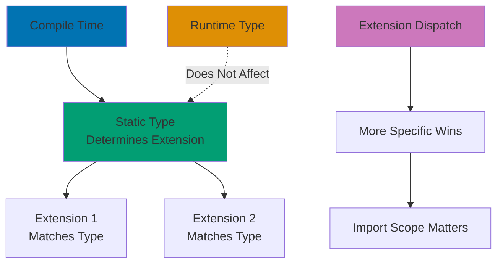
```mermaid
%% Color Palette: Blue #0173B2, Orange #DE8F05, Teal #029E73, Purple #CC78BC, Brown #CA9161
graph TD
    CompileTime[Compile Time] --> Static[Static Type<br/>Determines Extension]
    Static --> Ext1[Extension 1<br/>Matches Type]
    Static --> Ext2[Extension 2<br/>Matches Type]

    Runtime[Runtime Type] -.Does Not Affect.-> Static

    Dispatch[Extension Dispatch] --> Specific[More Specific Wins]
    Specific --> ImportScope[Import Scope Matters]

    style CompileTime fill:#0173B2
    style Static fill:#029E73
    style Runtime fill:#DE8F05
    style Dispatch fill:#CC78BC
```

**Static dispatch example**:

```dart
extension StringExt on String {
  String shout() => toUpperCase() + '!';
}

extension ObjectExt on Object {
  String shout() => toString().toUpperCase() + '!';
}

void main() {
  String text = 'hello';
  Object obj = 'hello'; // Same runtime type, different static type

  print(text.shout()); // "HELLO!" - Uses StringExt
  print(obj.shout()); // "HELLO!" - Uses ObjectExt

  // Static type determines which extension
}
```

**Extension specificity**:

```dart
extension on List<int> {
  int sum() => reduce((a, b) => a + b);
}

extension on List {
  void printAll() => forEach(print);
}

void main() {
  var numbers = [1, 2, 3];
  print(numbers.sum()); // Uses List<int> extension (more specific)
  numbers.printAll(); // Uses List extension
}
```

**Why static dispatch?**:

- **Performance** - No runtime lookup overhead
- **Predictability** - Extension determined at compile time
- **Type safety** - Compiler verifies extension applies to type

### Late Initialization Semantics

The `late` keyword provides lazy initialization with safety:

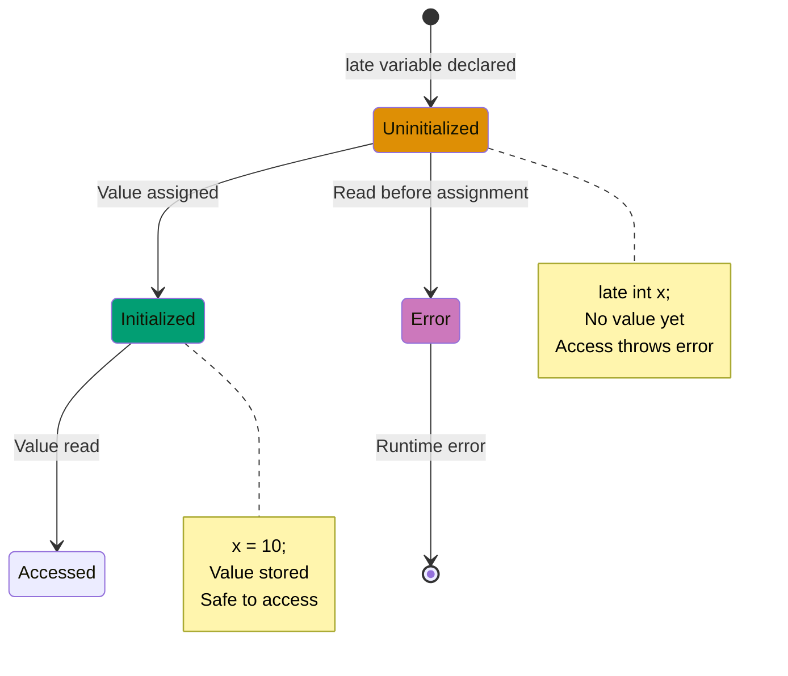
```mermaid
%% Color Palette: Blue #0173B2, Orange #DE8F05, Teal #029E73, Purple #CC78BC, Brown #CA9161
stateDiagram-v2
    [*] --> Uninitialized: late variable declared
    Uninitialized --> Initialized: Value assigned
    Initialized --> Accessed: Value read

    Uninitialized --> Error: Read before assignment
    Error --> [*]: Runtime error

    note right of Uninitialized
        late int x;
        No value yet
        Access throws error
    end note

    note right of Initialized
        x = 10;
        Value stored
        Safe to access
    end note

    style Uninitialized fill:#DE8F05
    style Initialized fill:#029E73
    style Error fill:#CC78BC
```

**Late initialization patterns**:

```dart
class ExpensiveResource {
  // Late with initializer - lazy evaluation
  late final String config = loadConfig(); // Only called when accessed

  // Late without initializer - must assign before use
  late int value;

  String loadConfig() {
    print('Loading config...');
    return 'configuration';
  }

  void initialize() {
    value = 42; // Must call before accessing value
  }
}

void main() {
  var resource = ExpensiveResource();
  print('Resource created'); // Config not loaded yet

  print(resource.config); // NOW loadConfig() is called
  print('Loading config...');

  // resource.value; // ERROR: Read before assignment

  resource.initialize();
  print(resource.value); // 42
}
```

**Late vs nullable comparison**:

```dart
// Nullable: Allows null value
String? nullableValue;
print(nullableValue?.length); // Safe, returns null

// Late: Never null, but initially unassigned
late String lateValue;
// print(lateValue.length); // Runtime error: not initialized

lateValue = 'Hello';
print(lateValue.length); // 5 - safe after assignment
```

**When to use late**:

- **Circular dependencies** - Break initialization cycles
- **Lazy initialization** - Defer expensive computation
- **Non-nullable fields** - When constructor can't initialize yet
- **Top-level/static variables** - Avoid initialization at program start

### Factory Constructor Patterns

Factory constructors enable flexible object creation:

```dart
abstract class DatabaseConnection {
  void query(String sql);

  // Factory constructor - returns existing or new instance
  factory DatabaseConnection(String type) {
    if (type == 'sqlite') {
      return SqliteConnection();
    } else if (type == 'postgres') {
      return PostgresConnection();
    }
    throw ArgumentError('Unknown database type: $type');
  }
}

class SqliteConnection implements DatabaseConnection {
  @override
  void query(String sql) => print('SQLite: $sql');
}

class PostgresConnection implements DatabaseConnection {
  @override
  void query(String sql) => print('Postgres: $sql');
}

// Singleton pattern with factory
class Logger {
  static final Logger _instance = Logger._internal();

  factory Logger() => _instance; // Always returns same instance

  Logger._internal(); // Private constructor

  void log(String message) => print('[LOG] $message');
}

void main() {
  var db = DatabaseConnection('sqlite');
  db.query('SELECT * FROM users');

  var logger1 = Logger();
  var logger2 = Logger();
  print(logger1 == logger2); // true - same instance
}
```

**Factory benefits**:

- **Hide implementation** - Return any subtype
- **Cache instances** - Singleton pattern
- **Conditional creation** - Create different types based on parameters
- **Named constructors** - Provide semantic factory methods

## Advanced Object-Oriented Programming

### Abstract Classes

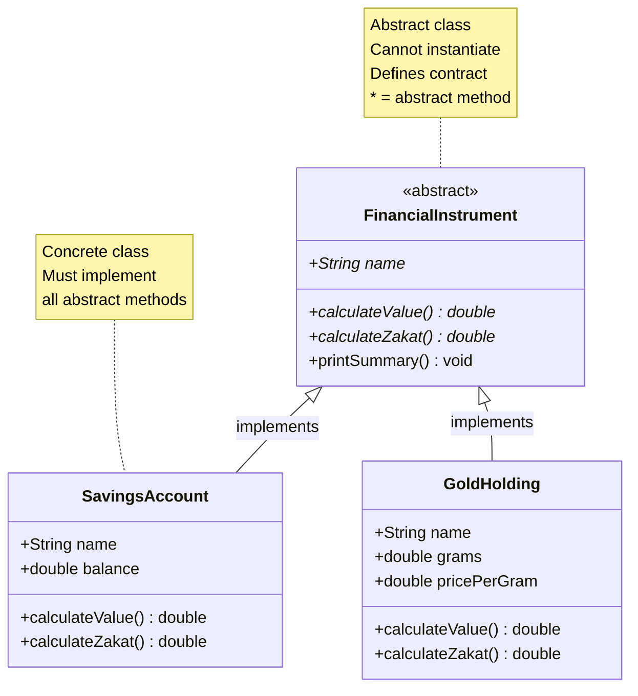
```mermaid
%% Color Palette: Blue #0173B2, Orange #DE8F05, Teal #029E73, Purple #CC78BC, Brown #CA9161
classDiagram
    class FinancialInstrument {
        <<abstract>>
        +String name*
        +calculateValue()* double
        +calculateZakat()* double
        +printSummary() void
    }

    class SavingsAccount {
        +String name
        +double balance
        +calculateValue() double
        +calculateZakat() double
    }

    class GoldHolding {
        +String name
        +double grams
        +double pricePerGram
        +calculateValue() double
        +calculateZakat() double
    }

    FinancialInstrument <|-- SavingsAccount : implements
    FinancialInstrument <|-- GoldHolding : implements

    note for FinancialInstrument "Abstract class<br/>Cannot instantiate<br/>Defines contract<br/>* = abstract method"
    note for SavingsAccount "Concrete class<br/>Must implement<br/>all abstract methods"
```

Define contracts without implementation:

```dart
// Abstract class (cannot instantiate)
abstract class FinancialInstrument {
  String get name;
  double calculateValue();
  double calculateZakat();

  // Concrete method (has implementation)
  void printSummary() {
    print('$name: Value=Rp${calculateValue()}, Zakat=Rp${calculateZakat()}');
  }
}

// Concrete implementation
class SavingsAccount extends FinancialInstrument {
  @override
  final String name;
  final double balance;

  SavingsAccount(this.name, this.balance);

  @override
  double calculateValue() => balance;

  @override
  double calculateZakat() => balance >= 85000000 ? balance * 0.025 : 0.0;
}

class GoldHolding extends FinancialInstrument {
  @override
  final String name;
  final double grams;
  final double pricePerGram;

  GoldHolding(this.name, this.grams, this.pricePerGram);

  @override
  double calculateValue() => grams * pricePerGram;

  @override
  double calculateZakat() {
    double value = calculateValue();
    return value >= 85000000 ? value * 0.025 : 0.0;
  }
}

void main() {
  List<FinancialInstrument> portfolio = [
    SavingsAccount('Main Savings', 50000000),
    GoldHolding('Physical Gold', 100, 1000000),
  ];

  for (var instrument in portfolio) {
    instrument.printSummary();
  }

  double totalZakat = portfolio
      .map((i) => i.calculateZakat())
      .fold(0.0, (sum, zakat) => sum + zakat);

  print('\nTotal Zakat: Rp$totalZakat');
}
```

### Interfaces with Implements

Implement multiple contracts:

```dart
// Interface (abstract class with no implementation)
abstract class Valuable {
  double getValue();
}

abstract class Zakatable {
  double calculateZakat();
}

// Implement multiple interfaces
class Investment implements Valuable, Zakatable {
  final String type;
  final double amount;

  Investment(this.type, this.amount);

  @override
  double getValue() => amount;

  @override
  double calculateZakat() {
    return amount >= 85000000 ? amount * 0.025 : 0.0;
  }
}

void main() {
  var investment = Investment('Stock', 100000000);
  print('Value: Rp${investment.getValue()}');
  print('Zakat: Rp${investment.calculateZakat()}');
}
```

### Mixins

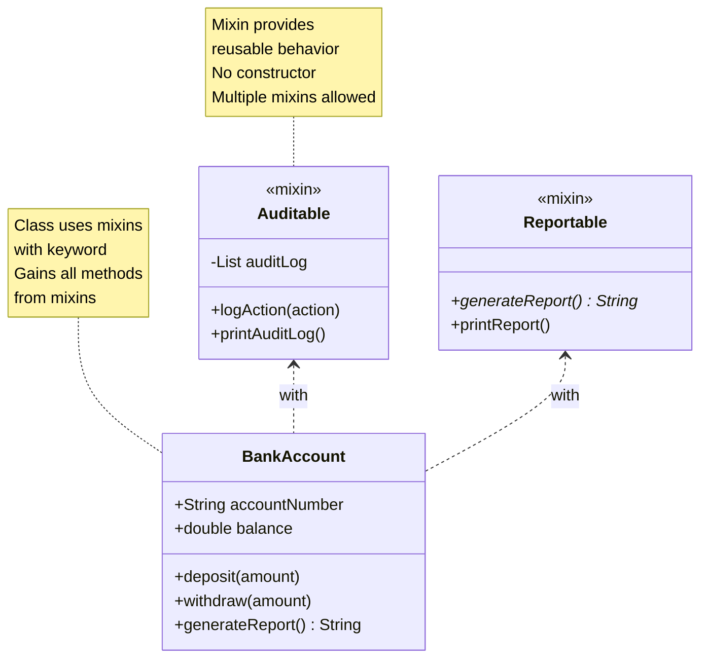
```mermaid
%% Color Palette: Blue #0173B2, Orange #DE8F05, Teal #029E73, Purple #CC78BC, Brown #CA9161
classDiagram
    class Auditable {
        <<mixin>>
        -List auditLog
        +logAction(action)
        +printAuditLog()
    }

    class Reportable {
        <<mixin>>
        +generateReport()* String
        +printReport()
    }

    class BankAccount {
        +String accountNumber
        +double balance
        +deposit(amount)
        +withdraw(amount)
        +generateReport() String
    }

    Auditable <.. BankAccount : with
    Reportable <.. BankAccount : with

    note for Auditable "Mixin provides<br/>reusable behavior<br/>No constructor<br/>Multiple mixins allowed"
    note for BankAccount "Class uses mixins<br/>with keyword<br/>Gains all methods<br/>from mixins"
```

Reuse code across class hierarchies:

```dart
// Mixin - reusable behavior
mixin Auditable {
  List<String> _auditLog = [];

  void logAction(String action) {
    _auditLog.add('${DateTime.now()}: $action');
  }

  void printAuditLog() {
    print('Audit Log:');
    for (var entry in _auditLog) {
      print('  $entry');
    }
  }
}

mixin Reportable {
  String generateReport();

  void printReport() {
    print('--- Report ---');
    print(generateReport());
  }
}

// Use mixins with 'with'
class BankAccount with Auditable, Reportable {
  final String accountNumber;
  double balance;

  BankAccount(this.accountNumber, this.balance);

  void deposit(double amount) {
    balance += amount;
    logAction('Deposited: Rp$amount'); // From Auditable mixin
  }

  void withdraw(double amount) {
    if (amount <= balance) {
      balance -= amount;
      logAction('Withdrew: Rp$amount'); // From Auditable mixin
    }
  }

  @override
  String generateReport() {
    return 'Account: $accountNumber\nBalance: Rp$balance';
  }
}

void main() {
  var account = BankAccount('ACC-001', 1000000);

  account.deposit(500000);
  account.withdraw(200000);

  account.printReport(); // From Reportable
  account.printAuditLog(); // From Auditable
}
```

**Key points**:

- **Mixins add behavior without inheritance**
- **Classes can use multiple mixins** (vs single inheritance)
- **Mixins can't have constructors**
- **`with` keyword applies mixins**

## Extension Methods

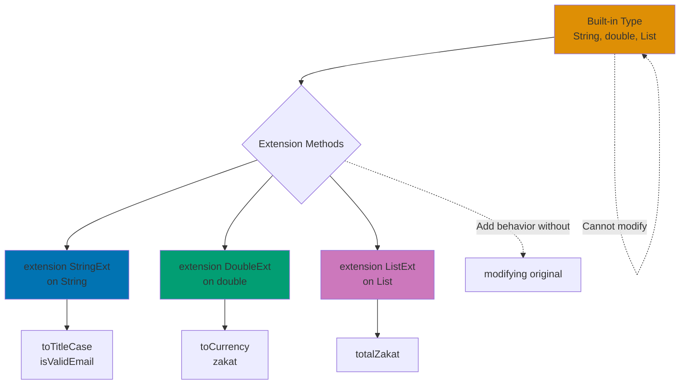
```mermaid
%% Color Palette: Blue #0173B2, Orange #DE8F05, Teal #029E73, Purple #CC78BC, Brown #CA9161
graph TD
    BuiltIn[Built-in Type<br/>String, double, List] --> Extensions{Extension Methods}

    Extensions --> Extend1[extension StringExt<br/>on String]
    Extensions --> Extend2[extension DoubleExt<br/>on double]
    Extensions --> Extend3[extension ListExt<br/>on List]

    Extend1 --> Method1[toTitleCase<br/>isValidEmail]
    Extend2 --> Method2[toCurrency<br/>zakat]
    Extend3 --> Method3[totalZakat]

    BuiltIn -.Cannot modify.-> BuiltIn
    Extensions -.Add behavior without.-> Modify[modifying original]

    style BuiltIn fill:#DE8F05
    style Extend1 fill:#0173B2
    style Extend2 fill:#029E73
    style Extend3 fill:#CC78BC
```

Add methods to existing types:

```dart
// Extend built-in types
extension StringExtensions on String {
  String toTitleCase() {
    if (isEmpty) return this;
    return this[0].toUpperCase() + substring(1).toLowerCase();
  }

  bool get isValidEmail {
    return RegExp(r'^[\w-\.]+@([\w-]+\.)+[\w-]{2,4}$').hasMatch(this);
  }
}

extension DoubleExtensions on double {
  String toCurrency() {
    return 'Rp${toStringAsFixed(2)}';
  }

  double get zakat => this * 0.025;
}

// Extend custom classes
extension ZakatCalculations on List<double> {
  double get totalZakat {
    return where((amount) => amount >= 85000000)
        .map((amount) => amount * 0.025)
        .fold(0.0, (sum, zakat) => sum + zakat);
  }
}

void main() {
  // Use string extensions
  print('ahmad'.toTitleCase()); // Ahmad
  print('user@example.com'.isValidEmail); // true

  // Use double extensions
  double wealth = 100000000;
  print(wealth.toCurrency()); // Rp100000000.00
  print('Zakat: ${wealth.zakat.toCurrency()}'); // Rp2500000.00

  // Use list extensions
  var accounts = [50000000.0, 100000000.0, 30000000.0];
  print('Total Zakat: ${accounts.totalZakat.toCurrency()}');
}
```

## Memory Management

### Garbage Collection in Dart VM

Dart uses automatic garbage collection to manage memory:

```mermaid
%% Color Palette: Blue #0173B2, Orange #DE8F05, Teal #029E73, Purple #CC78BC, Brown #CA9161
graph TD
    Heap[Memory Heap] --> New[New Generation<br/>Young Objects]
    Heap --> Old[Old Generation<br/>Long-lived Objects]

    New --> Scavenge[Scavenge GC<br/>Fast, Frequent]
    Old --> MarkSweep[Mark-Sweep GC<br/>Slower, Infrequent]

    Allocate[Object Allocation] --> New
    New -->|Survives Collection| Promote[Promote to Old]
    Promote --> Old

    Scavenge --> Pause1[Short Pause<br/>1-5ms]
    MarkSweep --> Pause2[Longer Pause<br/>10-100ms]

    style New fill:#029E73
    style Old fill:#0173B2
    style Scavenge fill:#DE8F05
    style MarkSweep fill:#CC78BC
```

**Generational GC strategy**:

- **New generation** - Most objects die young (temporary variables, function locals)
- **Old generation** - Objects that survive multiple collections (global state, caches)
- **Scavenge collection** - Fast collection of new generation (parallel)
- **Mark-sweep collection** - Full collection including old generation (stop-the-world)

**GC triggers**:

1. New generation fills up → Scavenge collection
2. Old generation fills up → Mark-sweep collection
3. Allocation fails → Emergency collection

**Performance implications**:

```dart
void inefficient() {
  // Creates garbage on every iteration
  for (var i = 0; i < 1000000; i++) {
    var temp = StringBuffer(); // New allocation
    temp.write('Value: $i');
    print(temp.toString()); // Becomes garbage after print
  }
}

void efficient() {
  // Reuses buffer
  var buffer = StringBuffer();
  for (var i = 0; i < 1000000; i++) {
    buffer.clear(); // Reuse existing object
    buffer.write('Value: $i');
    print(buffer);
  }
}
```

**GC best practices**:

- **Minimize allocation** - Reuse objects when possible
- **Object pooling** - For frequently created/destroyed objects
- **Avoid large objects in loops** - Keep allocations outside loops
- **Use const** - Compile-time constants never need GC

### Object Lifecycle

Understanding object lifecycles helps prevent memory leaks:

```mermaid
%% Color Palette: Blue #0173B2, Orange #DE8F05, Teal #029E73, Purple #CC78BC, Brown #CA9161
stateDiagram-v2
    [*] --> Allocated: new Object()
    Allocated --> Reachable: Reference exists
    Reachable --> Reachable: Multiple references
    Reachable --> Unreachable: No references
    Unreachable --> Collected: GC runs
    Collected --> [*]

    note right of Reachable
        Object accessible
        from roots (globals,
        stack, static fields)
    end note

    note right of Unreachable
        No path from roots
        Eligible for collection
    end note

    style Allocated fill:#029E73
    style Reachable fill:#0173B2
    style Unreachable fill:#DE8F05
    style Collected fill:#CC78BC
```

**Roots** - Starting points for reachability analysis:

- Global variables
- Stack variables (local variables, parameters)
- Static fields
- Active isolate state

**Reachability example**:

```dart
class User {
  String name;
  User(this.name);
}

void main() {
  User user1 = User('Ahmad'); // user1 is root (stack variable)

  var list = [user1]; // User object has 2 references

  user1 = User('Fatimah'); // Original User('Ahmad') has 1 reference (list)

  list.clear(); // User('Ahmad') has 0 references - unreachable

  // GC can collect User('Ahmad')
}
```

### Memory Leak Prevention

Common memory leak patterns and solutions:

```dart
import 'dart:async';

// Memory leak: Unclosed StreamController
class BadDonationTracker {
  final _controller = StreamController<double>();
  Stream<double> get donations => _controller.stream;

  void addDonation(double amount) => _controller.add(amount);

  // MISSING: dispose method to close controller
  // Result: Controller stays in memory forever
}

// Correct: Close resources
class GoodDonationTracker {
  final _controller = StreamController<double>();
  Stream<double> get donations => _controller.stream;

  void addDonation(double amount) => _controller.add(amount);

  void dispose() {
    _controller.close(); // Release resources
  }
}

// Memory leak: Circular references
class Parent {
  Child? child;
}

class Child {
  Parent? parent; // Circular reference
}

void createLeak() {
  var parent = Parent();
  var child = Child();

  parent.child = child;
  child.parent = parent;

  // Even when parent/child go out of scope,
  // they reference each other - BUT Dart GC handles this!
  // Dart uses mark-sweep which handles circular references
}

// Memory leak: Forgotten listeners
class EventBus {
  final _listeners = <Function>[];

  void subscribe(Function listener) {
    _listeners.add(listener);
  }

  void unsubscribe(Function listener) {
    _listeners.remove(listener); // Must call to prevent leak
  }
}
```

**Leak prevention checklist**:

- Close StreamControllers
- Cancel StreamSubscriptions
- Remove event listeners when done
- Dispose timers
- Clear caches periodically
- Avoid storing large objects in static fields

### Immutability Benefits

Immutable objects provide memory efficiency:

```dart
// Immutable: Can be shared safely
class ImmutablePoint {
  final int x;
  final int y;

  const ImmutablePoint(this.x, this.y);

  // Returns new instance instead of modifying
  ImmutablePoint translate(int dx, int dy) {
    return ImmutablePoint(x + dx, y + dy);
  }
}

// Compile-time constant: Zero runtime allocation
const origin = ImmutablePoint(0, 0);
const unit = ImmutablePoint(1, 1);

void main() {
  // All references share same instance
  var p1 = origin;
  var p2 = origin;
  print(identical(p1, p2)); // true - same object

  // Creating new instance
  var p3 = p1.translate(5, 5);
  print(p3.x); // 5
}
```

**Immutability advantages**:

- **Memory sharing** - Multiple references to same object
- **Thread safety** - No synchronization needed
- **Compiler optimization** - `const` objects allocated at compile time
- **Easier reasoning** - State doesn't change unexpectedly

**const vs final**:

```dart
// const: Compile-time constant (more efficient)
const compileTime = 42;
const list1 = [1, 2, 3]; // Compile-time constant list

// final: Runtime constant (initialized once)
final runtime = DateTime.now(); // Value not known at compile time
final list2 = [1, 2, 3]; // New list instance at runtime

// const lists are identical
const a = [1, 2, 3];
const b = [1, 2, 3];
print(identical(a, b)); // true

// final lists are different instances
final c = [1, 2, 3];
final d = [1, 2, 3];
print(identical(c, d)); // false
```

### Value vs Reference Semantics

Understanding when objects are copied vs referenced:

```dart
// Primitives: Value semantics (copied)
void valueSemantics() {
  int a = 10;
  int b = a; // Copy value
  b = 20;
  print(a); // 10 - unchanged
}

// Objects: Reference semantics (shared)
void referenceSemantics() {
  var list1 = [1, 2, 3];
  var list2 = list1; // Copy reference, not contents

  list2.add(4);
  print(list1); // [1, 2, 3, 4] - shared object modified
}

// Copying objects explicitly
void deepCopy() {
  var original = [1, 2, 3];
  var copy = List<int>.from(original); // Deep copy

  copy.add(4);
  print(original); // [1, 2, 3] - unchanged
  print(copy); // [1, 2, 3, 4]
}
```

**Value types** (copied):

- int, double, bool
- num (abstract)

**Reference types** (shared):

- All objects (List, Map, custom classes)
- String (special case: immutable but reference type)

## Compilation Models

### JIT vs AOT Comparison

Dart supports two compilation strategies with different trade-offs:

```mermaid
%% Color Palette: Blue #0173B2, Orange #DE8F05, Teal #029E73, Purple #CC78BC, Brown #CA9161
graph TD
    subgraph JIT["JIT (Development)"]
        Source1[Dart Source] --> Parse1[Parse]
        Parse1 --> Bytecode[Generate Bytecode]
        Bytecode --> VM1[Dart VM]
        VM1 --> Profile[Profile Execution]
        Profile --> Optimize[Optimize Hot Code]
        Optimize --> Native1[Native Code]
    end

    subgraph AOT["AOT (Production)"]
        Source2[Dart Source] --> Analyze[Whole Program Analysis]
        Analyze --> Compile[Ahead-of-Time Compile]
        Compile --> Native2[Native Machine Code]
        Native2 --> Run[Direct Execution]
    end

    JIT --> FastDev[Fast Development<br/>Hot Reload<br/>Debugging]
    AOT --> FastRun[Fast Startup<br/>Smaller Size<br/>Predictable Performance]

    style JIT fill:#029E73
    style AOT fill:#0173B2
    style FastDev fill:#DE8F05
    style FastRun fill:#CC78BC
```

**JIT (Just-In-Time) compilation**:

- **When used** - Development, `dart run`
- **Startup** - Faster (no compilation wait)
- **Performance** - Slower initially, faster after warmup
- **Hot reload** - Supported (inject code changes)
- **Binary size** - Includes VM and JIT compiler

**AOT (Ahead-Of-Time) compilation**:

- **When used** - Production, `flutter build`, `dart compile exe`
- **Startup** - Fast (pre-compiled)
- **Performance** - Consistent (no warmup)
- **Hot reload** - Not supported
- **Binary size** - Smaller (no JIT compiler)

**Trade-off table**:

| Aspect            | JIT                    | AOT                   |
| ----------------- | ---------------------- | --------------------- |
| Startup time      | Medium                 | Fast                  |
| Peak performance  | Excellent              | Good                  |
| Development speed | Excellent (hot reload) | Slow (full recompile) |
| Binary size       | Large (includes VM)    | Small                 |
| Debugging         | Full support           | Limited               |

### Dart VM Architecture

Understanding VM structure helps optimize performance:

```mermaid
%% Color Palette: Blue #0173B2, Orange #DE8F05, Teal #029E73, Purple #CC78BC, Brown #CA9161
graph TD
    VM[Dart VM] --> Isolate1[Isolate 1<br/>Separate Memory]
    VM --> Isolate2[Isolate 2<br/>Separate Memory]

    Isolate1 --> Heap1[Heap<br/>Object Storage]
    Isolate1 --> Stack1[Stack<br/>Function Calls]
    Isolate1 --> EventLoop1[Event Loop]

    Isolate2 --> Heap2[Heap]
    Isolate2 --> Stack2[Stack]
    Isolate2 --> EventLoop2[Event Loop]

    VM --> SharedCode[Shared Code Segment<br/>Immutable]
    SharedCode -.Read Only.-> Isolate1
    SharedCode -.Read Only.-> Isolate2

    style VM fill:#0173B2
    style Isolate1 fill:#029E73
    style Isolate2 fill:#029E73
    style SharedCode fill:#DE8F05
```

**VM components**:

- **Isolates** - Independent execution contexts (separate memory)
- **Heap** - Per-isolate object storage
- **Stack** - Function call frames
- **Event loop** - Per-isolate async execution
- **Code segment** - Shared compiled code (read-only)

**Snapshot mechanism**:

```dart
// Dart can serialize isolate state to disk
// Used for fast startup

// 1. Create snapshot of compiled code
$ dart compile aot-snapshot main.dart

// 2. Load snapshot quickly at startup
$ dartaotruntime main.aot

// Snapshot benefits:
// - Skip parsing/compilation
// - Instant startup
// - Smaller file size
```

### Tree Shaking in Production

AOT compilation eliminates unused code:

```dart
// Large library
class MathUtils {
  static int add(int a, int b) => a + b;
  static int multiply(int a, int b) => a * b;
  static int factorial(int n) => n <= 1 ? 1 : n * factorial(n - 1);
  // 50 more unused methods...
}

void main() {
  print(MathUtils.add(2, 3)); // Only add() is used
}

// AOT compiler tree shakes:
// - Removes multiply() and factorial() from binary
// - Only add() included in final executable
// Result: Smaller binary size
```

**Tree shaking process**:

1. **Entry point analysis** - Start from main()
2. **Reachability graph** - Track all called functions
3. **Dead code elimination** - Remove unreachable code
4. **Constant folding** - Evaluate compile-time constants

**What gets removed**:

- Unused classes
- Unused methods
- Unused imports
- Debug assertions (`assert` statements)
- Type checks (when proven safe)

### Hot Reload Architecture

JIT enables Flutter's hot reload:

```mermaid
%% Color Palette: Blue #0173B2, Orange #DE8F05, Teal #029E73, Purple #CC78BC, Brown #CA9161
sequenceDiagram
    participant Dev as Developer
    participant IDE as IDE
    participant VM as Dart VM
    participant App as Running App

    Dev->>IDE: Save changes
    IDE->>IDE: Incremental compilation
    IDE->>VM: Send code delta
    VM->>VM: Patch bytecode
    VM->>App: Trigger rebuild
    App->>App: Redraw UI
    App-->>Dev: Updated UI visible

    rect rgb(2, 158, 115, 0.1)
        Note over Dev,App: Typical time: 1-2 seconds<br/>State preserved
    end

    style IDE fill:#0173B2
    style VM fill:#029E73
    style App fill:#DE8F05
```

**Hot reload limitations**:

- Can't change class hierarchy
- Can't add/remove static fields
- Can't change main() signature
- State lost if class structure changes

## Error Handling Philosophy

### Exception Hierarchy

Dart's exception system prioritizes clarity:

```mermaid
%% Color Palette: Blue #0173B2, Orange #DE8F05, Teal #029E73, Purple #CC78BC, Brown #CA9161
graph TD
    Object[Object] --> Exception[Exception<br/>Recoverable errors]
    Object --> Error[Error<br/>Programming errors]

    Exception --> FormatException[FormatException]
    Exception --> IOException[IOException]
    Exception --> TimeoutException[TimeoutException]
    Exception --> Custom[Custom Exceptions]

    Error --> ArgumentError[ArgumentError]
    Error --> StateError[StateError]
    Error --> UnsupportedError[UnsupportedError]

    style Object fill:#0173B2
    style Exception fill:#029E73
    style Error fill:#CC78BC
    style Custom fill:#DE8F05
```

**Exception vs Error**:

- **Exception** - Expected errors you should catch (network failures, invalid input)
- **Error** - Programming bugs you should fix (null reference, type error)

**Best practices**:

```dart
// Catch specific exceptions
try {
  var data = jsonDecode(input);
} on FormatException catch (e) {
  print('Invalid JSON: $e');
} on Exception catch (e) {
  print('Unexpected exception: $e');
}

// Don't catch Error (indicates bug)
try {
  var x = null as String; // Type error
} on Error {
  // BAD: Catching Error hides bugs
}
```

### Result Types and Functional Error Handling

Alternative to exceptions for expected failures:

```dart
// Result type pattern
class Result<T> {
  final T? value;
  final String? error;

  Result.success(this.value) : error = null;
  Result.failure(this.error) : value = null;

  bool get isSuccess => error == null;
  bool get isFailure => error != null;
}

// Use result type for expected failures
Result<double> parseAmount(String text) {
  var value = double.tryParse(text);
  if (value == null) {
    return Result.failure('Invalid amount: $text');
  }
  return Result.success(value);
}

void main() {
  var result = parseAmount('100.50');
  if (result.isSuccess) {
    print('Amount: ${result.value}');
  } else {
    print('Error: ${result.error}');
  }
}
```

**Result type benefits**:

- **Explicit error handling** - Can't ignore errors
- **No exception overhead** - Normal control flow
- **Type safe** - Compiler ensures handling
- **Composable** - Chain operations easily

### Async Error Propagation

Errors in async code follow special rules:

```dart
Future<void> example() async {
  try {
    // Errors in async code caught by try-catch
    await Future.error('Async error');
  } catch (e) {
    print('Caught: $e');
  }

  // Uncaught errors in Future
  Future.error('Uncaught').then((value) {
    // Never executes
  }); // Error goes to Zone error handler

  // Errors in unawaited futures
  Future.delayed(Duration(seconds: 1), () {
    throw Exception('Delayed error');
  }); // Not caught by try-catch!
}
```

**Catching unawaited future errors**:

```dart
import 'dart:async';

void main() {
  // Option 1: Use Zone to catch all errors
  runZonedGuarded(() {
    Future.delayed(Duration(seconds: 1), () {
      throw Exception('Delayed error');
    });
  }, (error, stack) {
    print('Zone caught: $error');
  });

  // Option 2: Always await or use catchError
  Future.delayed(Duration(seconds: 1), () {
    throw Exception('Delayed error');
  }).catchError((e) {
    print('catchError caught: $e');
  });
}
```

## Performance Considerations

### Collection Performance Characteristics

Different collections have different performance:

| Operation       | List           | Set          | Map          |
| --------------- | -------------- | ------------ | ------------ |
| Add             | O(1) amortized | O(1) average | O(1) average |
| Remove          | O(n)           | O(1) average | O(1) average |
| Contains        | O(n)           | O(1) average | O(1) average |
| Iterate         | O(n)           | O(n)         | O(n)         |
| Access by index | O(1)           | N/A          | N/A          |

**Choosing the right collection**:

```dart
// List: Ordered, indexed access, duplicates allowed
var donations = [100000, 250000, 100000]; // Fast access by index

// Set: Unordered, no duplicates, fast membership test
var uniqueDonors = {'Ahmad', 'Fatimah', 'Ahmad'}; // Removes duplicate
print(uniqueDonors.contains('Ahmad')); // O(1)

// Map: Key-value pairs, fast lookup by key
var balances = {'Ahmad': 100000, 'Fatimah': 250000};
print(balances['Ahmad']); // O(1)
```

### Const vs Final Performance

Compile-time constants are faster:

```dart
// const: Compile-time constant (no runtime cost)
const pi = 3.14159;
const emptyList = <int>[];
const person = {'name': 'Ahmad', 'age': 30};

// final: Runtime constant (computed once)
final now = DateTime.now(); // Evaluated at runtime
final list = [1, 2, 3]; // New instance created

// const canonicalization: Same constants reuse memory
const a = [1, 2, 3];
const b = [1, 2, 3];
print(identical(a, b)); // true - same object

// final creates new instances
final c = [1, 2, 3];
final d = [1, 2, 3];
print(identical(c, d)); // false - different objects
```

**Performance tips**:

- Use `const` for unchanging values
- Use `const` constructors when possible
- Mark classes `@immutable` for Flutter

### Cascade Operator Overhead

Cascades are syntactic sugar:

```dart
// Cascade: Syntactic sugar
var account = BankAccount()
  ..deposit(100000)
  ..deposit(50000)
  ..withdraw(20000);

// Equivalent to:
var account2 = BankAccount();
account2.deposit(100000);
account2.deposit(50000);
account2.withdraw(20000);

// No performance difference: Same compiled code
```

**Cascade performance**:

- Zero overhead (syntax only)
- Same bytecode as separate statements
- Use freely for clarity

### Stream vs Future Performance

Streams have overhead:

```dart
// Future: Single value (lightweight)
Future<int> fetchValue() async => 42;

// Stream: Multiple values (heavier)
Stream<int> valueStream() async* {
  yield 42; // Requires buffering and state management
}
```

**Performance comparison**:

- **Future** - Single value, minimal overhead
- **Stream** - Buffering, subscription management, higher cost
- **Use Future** - When single value suffices
- **Use Stream** - When multiple values needed

### Isolate Communication Overhead

Message passing has cost:

```dart
import 'dart:isolate';

// Messages are copied between isolates
Future<void> slowCommunication() async {
  var largeList = List.generate(1000000, (i) => i);

  var receivePort = ReceivePort();
  await Isolate.spawn((sendPort) {
    // largeList copied to worker isolate (expensive)
    sendPort.send(largeList);
  }, receivePort.sendPort);

  // Result copied back to main isolate (expensive)
  var result = await receivePort.first;
}

// Better: Send small messages, compute in isolate
Future<void> efficientCommunication() async {
  var receivePort = ReceivePort();
  await Isolate.spawn((sendPort) {
    // Compute in isolate
    var sum = List.generate(1000000, (i) => i).reduce((a, b) => a + b);
    // Send small result (cheap)
    sendPort.send(sum);
  }, receivePort.sendPort);

  var result = await receivePort.first; // Small message
}
```

**Isolate performance tips**:

- Minimize message size
- Do heavy computation in worker isolate
- Send results, not large data structures
- Consider TransferableTypedData for large buffers

## JSON and Serialization

### Parsing JSON

```dart
import 'dart:convert';

class MurabahaContract {
  final String contractId;
  final double assetCost;
  final double profitMargin;
  final int months;

  MurabahaContract({
    required this.contractId,
    required this.assetCost,
    required this.profitMargin,
    required this.months,
  });

  // From JSON
  factory MurabahaContract.fromJson(Map<String, dynamic> json) {
    return MurabahaContract(
      contractId: json['contract_id'] as String,
      assetCost: (json['asset_cost'] as num).toDouble(),
      profitMargin: (json['profit_margin'] as num).toDouble(),
      months: json['months'] as int,
    );
  }

  // To JSON
  Map<String, dynamic> toJson() {
    return {
      'contract_id': contractId,
      'asset_cost': assetCost,
      'profit_margin': profitMargin,
      'months': months,
    };
  }

  double get totalPrice => assetCost + profitMargin;
  double get monthlyPayment => totalPrice / months;
}

void main() {
  // JSON string to object
  String jsonString = '''
  {
    "contract_id": "MUR-001",
    "asset_cost": 50000000,
    "profit_margin": 5000000,
    "months": 24
  }
  ''';

  Map<String, dynamic> jsonMap = jsonDecode(jsonString);
  var contract = MurabahaContract.fromJson(jsonMap);

  print('Contract: ${contract.contractId}');
  print('Monthly: Rp${contract.monthlyPayment}');

  // Object to JSON string
  String encoded = jsonEncode(contract.toJson());
  print('JSON: $encoded');
}
```

## Testing Patterns

### Basic Unit Tests

```dart
// File: zakat_calculator.dart
class ZakatCalculator {
  static const double nisab = 85000000;
  static const double rate = 0.025;

  double calculate(double wealth, {int monthsHeld = 12}) {
    if (monthsHeld < 12) return 0.0;
    if (wealth < nisab) return 0.0;
    return wealth * rate;
  }

  bool isEligible(double wealth, {int monthsHeld = 12}) {
    return wealth >= nisab && monthsHeld >= 12;
  }
}

// File: zakat_calculator_test.dart
import 'package:test/test.dart';

void main() {
  group('ZakatCalculator', () {
    late ZakatCalculator calculator;

    setUp(() {
      calculator = ZakatCalculator();
    });

    test('calculates correct Zakat for eligible wealth', () {
      expect(calculator.calculate(100000000), equals(2500000));
    });

    test('returns zero for wealth below nisab', () {
      expect(calculator.calculate(50000000), equals(0.0));
    });

    test('returns zero for wealth held less than 12 months', () {
      expect(calculator.calculate(100000000, monthsHeld: 6), equals(0.0));
    });

    test('isEligible returns true for valid wealth and duration', () {
      expect(calculator.isEligible(100000000, monthsHeld: 12), isTrue);
    });

    test('isEligible returns false for insufficient wealth', () {
      expect(calculator.isEligible(50000000, monthsHeld: 12), isFalse);
    });
  });
}
```

## Practical Exercise: Donation Tracking System

Build a complete stream-based donation tracker:

```dart
import 'dart:async';

class Donation {
  final String donorName;
  final double amount;
  final DateTime timestamp;
  final String? purpose;

  Donation({
    required this.donorName,
    required this.amount,
    required this.timestamp,
    this.purpose,
  });

  @override
  String toString() {
    var base = '$donorName donated Rp$amount at ${timestamp.hour}:${timestamp.minute}';
    return purpose != null ? '$base for $purpose' : base;
  }
}

class DonationManager {
  final _controller = StreamController<Donation>.broadcast();
  final List<Donation> _history = [];

  Stream<Donation> get donationStream => _controller.stream;

  void recordDonation(Donation donation) {
    _history.add(donation);
    _controller.add(donation);
  }

  double get totalDonations {
    return _history.fold(0.0, (sum, d) => sum + d.amount);
  }

  List<Donation> getDonationsByPurpose(String purpose) {
    return _history.where((d) => d.purpose == purpose).toList();
  }

  void dispose() {
    _controller.close();
  }
}

void main() async {
  var manager = DonationManager();

  // Subscribe to donations
  manager.donationStream.listen((donation) {
    print('New donation: $donation');
  });

  // Subscribe to large donations only
  manager.donationStream
      .where((d) => d.amount >= 500000)
      .listen((donation) {
    print('LARGE donation alert: ${donation.amount}');
  });

  // Record donations
  manager.recordDonation(Donation(
    donorName: 'Ahmad',
    amount: 250000,
    timestamp: DateTime.now(),
    purpose: 'Orphanage',
  ));

  await Future.delayed(Duration(milliseconds: 500));

  manager.recordDonation(Donation(
    donorName: 'Fatimah',
    amount: 1000000,
    timestamp: DateTime.now(),
    purpose: 'Mosque',
  ));

  await Future.delayed(Duration(milliseconds: 500));

  manager.recordDonation(Donation(
    donorName: 'Ali',
    amount: 150000,
    timestamp: DateTime.now(),
  ));

  await Future.delayed(Duration(milliseconds: 500));

  // Print summary
  print('\n=== Summary ===');
  print('Total donations: Rp${manager.totalDonations}');

  var orphanageDonations = manager.getDonationsByPurpose('Orphanage');
  print('Orphanage donations: ${orphanageDonations.length}');

  manager.dispose();
}
```

## Next Steps

You've completed the intermediate tutorial covering 60-85% of Dart knowledge. You can now:

- Build production-quality async applications
- Work with streams and reactive programming
- Design flexible OOP systems with mixins
- Apply functional programming patterns to collections
- Parse and serialize JSON data
- Write unit tests for your code

**Continue learning**:

- [Advanced](/en/learn/software-engineering/programming-languages/dart/by-concept/advanced) - Isolates, performance optimization, Dart 3.0+ features (85-95%)
- [By Example](/en/learn/software-engineering/programming-languages/dart/by-example) - Code-first approach with annotated examples

**Build projects**:

- Create a Flutter application with stream-based state management
- Build a REST API client with proper error handling
- Develop a CLI tool with async file operations and JSON configuration
