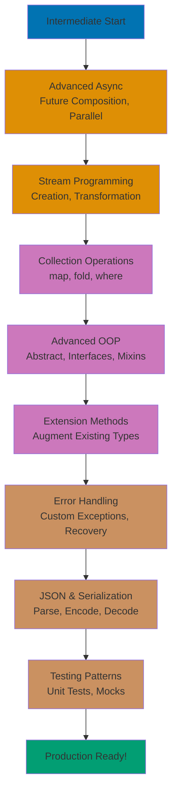

**Ready to build production-quality Dart applications?** This intermediate tutorial takes you beyond fundamentals into asynchronous programming mastery, advanced object-oriented patterns, stream-based reactive programming, and functional programming techniques. You'll learn patterns used in real Flutter applications, backend services, and complex CLI tools.

By the end of this tutorial, you'll handle complex async workflows, design flexible class hierarchies with mixins, transform streams of data, and apply functional programming patterns. This knowledge directly applies to Flutter development, server-side Dart, and sophisticated CLI applications.

## What You'll Learn

This intermediate tutorial covers **production-grade Dart patterns** (60-85% language coverage):

- **Advanced async programming** - Future composition, error handling, parallel execution
- **Streams and reactive programming** - Stream creation, transformation, subscription
- **Advanced null safety patterns** - Null-aware operators, late variables, nullable cascades
- **Collection operations** - map, where, fold, reduce, expand, functional patterns
- **Object-oriented design** - Inheritance, abstract classes, interfaces, polymorphism
- **Mixins** - Code reuse without inheritance limitations
- **Extension methods** - Add methods to existing types
- **Advanced error handling** - Custom exceptions, stack traces, error recovery
- **JSON and serialization** - Working with JSON data
- **Package management** - Using and creating packages
- **Testing patterns** - Unit testing with test package
- Islamic finance examples throughout (Murabaha contracts, donation tracking, Zakat portfolios)

## Prerequisites

- Completed [Beginner](/en/learn/software-engineering/programming-languages/dart/by-concept/beginner) tutorial or equivalent Dart experience
- Comfortable with Dart syntax, classes, and basic async/await
- Understanding of object-oriented programming concepts

## Learning Path



This tutorial provides **60-85% coverage** of Dart knowledge, preparing you for production development and [Advanced](/en/learn/software-engineering/programming-languages/dart/by-concept/advanced) topics.

## Advanced Async Programming

### Future Composition

Combine multiple async operations:

```dart
Future<double> fetchGoldPrice() async {
  await Future.delayed(Duration(seconds: 1));
  return 1000000.0; // Rp per gram
}

Future<double> fetchSilverPrice() async {
  await Future.delayed(Duration(seconds: 1));
  return 15000.0; // Rp per gram
}

Future<Map<String, double>> fetchAllPrices() async {
  // Sequential execution (slow: 2 seconds total)
  double goldPrice = await fetchGoldPrice();
  double silverPrice = await fetchSilverPrice();

  return {
    'gold': goldPrice,
    'silver': silverPrice,
  };
}

Future<Map<String, double>> fetchAllPricesParallel() async {
  // Parallel execution (fast: 1 second total)
  var results = await Future.wait([
    fetchGoldPrice(),
    fetchSilverPrice(),
  ]);

  return {
    'gold': results[0],
    'silver': results[1],
  };
}

void main() async {
  print('Fetching prices in parallel...');
  var prices = await fetchAllPricesParallel();
  print('Gold: Rp${prices['gold']}');
  print('Silver: Rp${prices['silver']}');
}
```

**Key patterns**:

- **Sequential with `await`** - Operations run one after another
- **Parallel with `Future.wait`** - Operations run simultaneously
- **`Future.wait` returns List** - Results in same order as input

### Advanced Future Methods

```dart
void main() async {
  // Future.any - Returns first completed future
  var fastest = await Future.any([
    Future.delayed(Duration(seconds: 2), () => 'Slow'),
    Future.delayed(Duration(seconds: 1), () => 'Fast'),
  ]);
  print('First result: $fastest'); // Fast

  // Future.timeout - Fail if not completed in time
  try {
    var result = await Future.delayed(
      Duration(seconds: 5),
      () => 'Done',
    ).timeout(Duration(seconds: 2));
  } on TimeoutException {
    print('Operation timed out');
  }

  // then/catchError chaining (alternative to async/await)
  fetchGoldPrice()
      .then((price) => price * 85) // Calculate nisab
      .then((nisab) => print('Nisab: Rp$nisab'))
      .catchError((error) => print('Error: $error'));
}
```

### Error Handling in Async Code

```dart
Future<double> calculateZakat(String userId) async {
  try {
    // Simulate fetching user wealth from database
    double wealth = await fetchWealthFromDatabase(userId);

    // Simulate fetching configuration
    double nisab = await fetchNisabThreshold();

    if (wealth < nisab) {
      return 0.0;
    }

    return wealth * 0.025;
  } on DatabaseException catch (e) {
    print('Database error: ${e.message}');
    throw ZakatCalculationException('Failed to fetch data');
  } on NetworkException catch (e) {
    print('Network error: ${e.message}');
    throw ZakatCalculationException('Network failure');
  } catch (e) {
    print('Unexpected error: $e');
    rethrow; // Re-throw to caller
  }
}

// Custom exceptions
class ZakatCalculationException implements Exception {
  final String message;
  ZakatCalculationException(this.message);

  @override
  String toString() => 'ZakatCalculationException: $message';
}

class DatabaseException implements Exception {
  final String message;
  DatabaseException(this.message);
}

class NetworkException implements Exception {
  final String message;
  NetworkException(this.message);
}

// Placeholder implementations
Future<double> fetchWealthFromDatabase(String userId) async {
  await Future.delayed(Duration(milliseconds: 500));
  return 100000000.0;
}

Future<double> fetchNisabThreshold() async {
  await Future.delayed(Duration(milliseconds: 300));
  return 85000000.0;
}
```

## Streams and Reactive Programming

### Creating Streams

Streams represent sequences of asynchronous events:

```dart
// Stream from async generator
Stream<double> donationStream() async* {
  // Simulate donations received over time
  await Future.delayed(Duration(seconds: 1));
  yield 100000; // First donation

  await Future.delayed(Duration(seconds: 1));
  yield 250000; // Second donation

  await Future.delayed(Duration(seconds: 1));
  yield 500000; // Third donation
}

// Stream from periodic timer
Stream<DateTime> prayerTimeReminders(Duration interval) {
  return Stream.periodic(interval, (count) {
    return DateTime.now();
  }).take(5); // Only 5 reminders
}

void main() async {
  // Listen to stream
  print('Listening for donations...');
  await for (var donation in donationStream()) {
    print('Received donation: Rp$donation');
  }

  print('\nPrayer reminders:');
  await for (var time in prayerTimeReminders(Duration(seconds: 2))) {
    print('Prayer reminder at: ${time.hour}:${time.minute}');
  }
}
```

### Stream Transformations

Transform stream data with powerful operations:

```dart
void main() async {
  // Map - Transform each value
  var donations = donationStream();
  var formatted = donations.map((amount) => 'Rp${amount}');

  await for (var text in formatted) {
    print('Donation: $text');
  }

  // Where - Filter values
  var largeDonations = donationStream().where((amount) => amount >= 200000);

  print('\nLarge donations only:');
  await for (var amount in largeDonations) {
    print('Large donation: Rp$amount');
  }

  // Reduce/Fold - Accumulate values
  var total = await donationStream().reduce((sum, amount) => sum + amount);
  print('\nTotal donations: Rp$total');

  // Take/Skip - Limit stream
  var firstTwo = donationStream().take(2);
  await for (var amount in firstTwo) {
    print('First two: Rp$amount');
  }
}
```

### StreamController

Create and control custom streams:

```dart
import 'dart:async';

class DonationTracker {
  final _controller = StreamController<double>();

  // Expose stream (read-only)
  Stream<double> get donations => _controller.stream;

  // Add donation
  void recordDonation(double amount) {
    _controller.add(amount);
  }

  // Dispose when done
  void dispose() {
    _controller.close();
  }
}

void main() async {
  var tracker = DonationTracker();

  // Subscribe to stream
  tracker.donations.listen(
    (amount) => print('Donation received: Rp$amount'),
    onDone: () => print('Stream closed'),
  );

  // Add donations
  tracker.recordDonation(100000);
  await Future.delayed(Duration(milliseconds: 100));

  tracker.recordDonation(250000);
  await Future.delayed(Duration(milliseconds: 100));

  tracker.recordDonation(500000);
  await Future.delayed(Duration(milliseconds: 100));

  // Clean up
  tracker.dispose();
}
```

### Stream Broadcast

Allow multiple listeners:

```dart
void main() async {
  // Single-subscription stream (default)
  var single = donationStream();
  // single.listen(...);
  // single.listen(...); // ERROR: Already has listener

  // Broadcast stream (multiple listeners)
  var broadcast = donationStream().asBroadcastStream();

  // Multiple listeners OK
  broadcast.listen((amount) => print('Listener 1: Rp$amount'));
  broadcast.listen((amount) => print('Listener 2: Rp$amount'));

  await Future.delayed(Duration(seconds: 5));
}
```

## Advanced Null Safety Patterns

### Null-Aware Cascades

Chain operations on nullable objects:

```dart
class MurabahaContract {
  double? assetCost;
  double? profitMargin;
  int? months;

  void printDetails() {
    print('Cost: $assetCost, Profit: $profitMargin, Months: $months');
  }
}

void main() {
  MurabahaContract? contract;

  // Null-aware cascade (only executes if not null)
  contract
    ?..assetCost = 50000000
    ..profitMargin = 5000000
    ..months = 24
    ..printDetails();
  // Nothing happens (contract is null)

  // Non-null cascade
  contract = MurabahaContract();
  contract
    ..assetCost = 50000000
    ..profitMargin = 5000000
    ..months = 24
    ..printDetails();
  // Executes all operations
}
```

### Handling Nullable Collections

```dart
void main() {
  List<String>? nullableList;

  // Safe access with ?.
  int? length = nullableList?.length; // null
  print('Length: $length');

  // Provide default with ??
  var actualList = nullableList ?? <String>[];
  print('List: $actualList'); // []

  // Null-aware iteration
  nullableList?.forEach((item) => print(item)); // Doesn't execute

  // Map nullable values
  List<String?> mixedList = ['Ahmad', null, 'Fatimah', null];
  var nonNull = mixedList.where((name) => name != null).cast<String>();
  print('Non-null names: $nonNull'); // (Ahmad, Fatimah)

  // WhereType for type filtering
  var names = mixedList.whereType<String>(); // Filters out nulls
  print('Names: $names'); // (Ahmad, Fatimah)
}
```

## Collection Operations

### Map, Where, Fold

Functional operations on collections:

```dart
void main() {
  var donations = [100000, 250000, 500000, 150000, 300000];

  // Map - Transform each element
  var formatted = donations.map((amount) => 'Rp$amount').toList();
  print('Formatted: $formatted');

  // Where - Filter elements
  var large = donations.where((amount) => amount >= 200000).toList();
  print('Large donations: $large'); // [250000, 500000, 300000]

  // Fold - Accumulate with initial value
  var total = donations.fold<int>(0, (sum, amount) => sum + amount);
  print('Total: Rp$total'); // 1300000

  // Reduce - Accumulate without initial value
  var sum = donations.reduce((a, b) => a + b);
  print('Sum: Rp$sum'); // 1300000

  // Chaining operations
  var processedTotal = donations
      .where((amount) => amount >= 150000)
      .map((amount) => amount * 1.1) // Add 10% blessing
      .fold<double>(0, (sum, amount) => sum + amount);
  print('Processed total: Rp${processedTotal.toStringAsFixed(2)}');
}
```

### Expand and Every/Any

Advanced collection queries:

```dart
void main() {
  // Expand - Flatten nested collections
  var groups = [
    ['Ahmad', 'Fatimah'],
    ['Ali', 'Hassan'],
    ['Zahra'],
  ];
  var allNames = groups.expand((group) => group).toList();
  print('All names: $allNames'); // [Ahmad, Fatimah, Ali, Hassan, Zahra]

  // Every - Check all elements satisfy condition
  var donations = [100000, 250000, 500000];
  bool allPositive = donations.every((amount) => amount > 0);
  print('All positive: $allPositive'); // true

  bool allLarge = donations.every((amount) => amount >= 200000);
  print('All large: $allLarge'); // false

  // Any - Check if any element satisfies condition
  bool hasLarge = donations.any((amount) => amount >= 200000);
  print('Has large: $hasLarge'); // true

  // FirstWhere/LastWhere - Find element
  var firstLarge = donations.firstWhere(
    (amount) => amount >= 200000,
    orElse: () => 0,
  );
  print('First large: Rp$firstLarge'); // 250000
}
```

## Advanced Object-Oriented Programming

### Abstract Classes

Define contracts without implementation:

```dart
// Abstract class (cannot instantiate)
abstract class FinancialInstrument {
  String get name;
  double calculateValue();
  double calculateZakat();

  // Concrete method (has implementation)
  void printSummary() {
    print('$name: Value=Rp${calculateValue()}, Zakat=Rp${calculateZakat()}');
  }
}

// Concrete implementation
class SavingsAccount extends FinancialInstrument {
  @override
  final String name;
  final double balance;

  SavingsAccount(this.name, this.balance);

  @override
  double calculateValue() => balance;

  @override
  double calculateZakat() => balance >= 85000000 ? balance * 0.025 : 0.0;
}

class GoldHolding extends FinancialInstrument {
  @override
  final String name;
  final double grams;
  final double pricePerGram;

  GoldHolding(this.name, this.grams, this.pricePerGram);

  @override
  double calculateValue() => grams * pricePerGram;

  @override
  double calculateZakat() {
    double value = calculateValue();
    return value >= 85000000 ? value * 0.025 : 0.0;
  }
}

void main() {
  List<FinancialInstrument> portfolio = [
    SavingsAccount('Main Savings', 50000000),
    GoldHolding('Physical Gold', 100, 1000000),
  ];

  for (var instrument in portfolio) {
    instrument.printSummary();
  }

  double totalZakat = portfolio
      .map((i) => i.calculateZakat())
      .fold(0.0, (sum, zakat) => sum + zakat);

  print('\nTotal Zakat: Rp$totalZakat');
}
```

### Interfaces with Implements

Implement multiple contracts:

```dart
// Interface (abstract class with no implementation)
abstract class Valuable {
  double getValue();
}

abstract class Zakatable {
  double calculateZakat();
}

// Implement multiple interfaces
class Investment implements Valuable, Zakatable {
  final String type;
  final double amount;

  Investment(this.type, this.amount);

  @override
  double getValue() => amount;

  @override
  double calculateZakat() {
    return amount >= 85000000 ? amount * 0.025 : 0.0;
  }
}

void main() {
  var investment = Investment('Stock', 100000000);
  print('Value: Rp${investment.getValue()}');
  print('Zakat: Rp${investment.calculateZakat()}');
}
```

### Mixins

Reuse code across class hierarchies:

```dart
// Mixin - reusable behavior
mixin Auditable {
  List<String> _auditLog = [];

  void logAction(String action) {
    _auditLog.add('${DateTime.now()}: $action');
  }

  void printAuditLog() {
    print('Audit Log:');
    for (var entry in _auditLog) {
      print('  $entry');
    }
  }
}

mixin Reportable {
  String generateReport();

  void printReport() {
    print('--- Report ---');
    print(generateReport());
  }
}

// Use mixins with 'with'
class BankAccount with Auditable, Reportable {
  final String accountNumber;
  double balance;

  BankAccount(this.accountNumber, this.balance);

  void deposit(double amount) {
    balance += amount;
    logAction('Deposited: Rp$amount'); // From Auditable mixin
  }

  void withdraw(double amount) {
    if (amount <= balance) {
      balance -= amount;
      logAction('Withdrew: Rp$amount'); // From Auditable mixin
    }
  }

  @override
  String generateReport() {
    return 'Account: $accountNumber\nBalance: Rp$balance';
  }
}

void main() {
  var account = BankAccount('ACC-001', 1000000);

  account.deposit(500000);
  account.withdraw(200000);

  account.printReport(); // From Reportable
  account.printAuditLog(); // From Auditable
}
```

**Key points**:

- **Mixins add behavior without inheritance**
- **Classes can use multiple mixins** (vs single inheritance)
- **Mixins can't have constructors**
- **`with` keyword applies mixins**

## Extension Methods

Add methods to existing types:

```dart
// Extend built-in types
extension StringExtensions on String {
  String toTitleCase() {
    if (isEmpty) return this;
    return this[0].toUpperCase() + substring(1).toLowerCase();
  }

  bool get isValidEmail {
    return RegExp(r'^[\w-\.]+@([\w-]+\.)+[\w-]{2,4}$').hasMatch(this);
  }
}

extension DoubleExtensions on double {
  String toCurrency() {
    return 'Rp${toStringAsFixed(2)}';
  }

  double get zakat => this * 0.025;
}

// Extend custom classes
extension ZakatCalculations on List<double> {
  double get totalZakat {
    return where((amount) => amount >= 85000000)
        .map((amount) => amount * 0.025)
        .fold(0.0, (sum, zakat) => sum + zakat);
  }
}

void main() {
  // Use string extensions
  print('ahmad'.toTitleCase()); // Ahmad
  print('user@example.com'.isValidEmail); // true

  // Use double extensions
  double wealth = 100000000;
  print(wealth.toCurrency()); // Rp100000000.00
  print('Zakat: ${wealth.zakat.toCurrency()}'); // Rp2500000.00

  // Use list extensions
  var accounts = [50000000.0, 100000000.0, 30000000.0];
  print('Total Zakat: ${accounts.totalZakat.toCurrency()}');
}
```

## JSON and Serialization

### Parsing JSON

```dart
import 'dart:convert';

class MurabahaContract {
  final String contractId;
  final double assetCost;
  final double profitMargin;
  final int months;

  MurabahaContract({
    required this.contractId,
    required this.assetCost,
    required this.profitMargin,
    required this.months,
  });

  // From JSON
  factory MurabahaContract.fromJson(Map<String, dynamic> json) {
    return MurabahaContract(
      contractId: json['contract_id'] as String,
      assetCost: (json['asset_cost'] as num).toDouble(),
      profitMargin: (json['profit_margin'] as num).toDouble(),
      months: json['months'] as int,
    );
  }

  // To JSON
  Map<String, dynamic> toJson() {
    return {
      'contract_id': contractId,
      'asset_cost': assetCost,
      'profit_margin': profitMargin,
      'months': months,
    };
  }

  double get totalPrice => assetCost + profitMargin;
  double get monthlyPayment => totalPrice / months;
}

void main() {
  // JSON string to object
  String jsonString = '''
  {
    "contract_id": "MUR-001",
    "asset_cost": 50000000,
    "profit_margin": 5000000,
    "months": 24
  }
  ''';

  Map<String, dynamic> jsonMap = jsonDecode(jsonString);
  var contract = MurabahaContract.fromJson(jsonMap);

  print('Contract: ${contract.contractId}');
  print('Monthly: Rp${contract.monthlyPayment}');

  // Object to JSON string
  String encoded = jsonEncode(contract.toJson());
  print('JSON: $encoded');
}
```

## Testing Patterns

### Basic Unit Tests

```dart
// File: zakat_calculator.dart
class ZakatCalculator {
  static const double nisab = 85000000;
  static const double rate = 0.025;

  double calculate(double wealth, {int monthsHeld = 12}) {
    if (monthsHeld < 12) return 0.0;
    if (wealth < nisab) return 0.0;
    return wealth * rate;
  }

  bool isEligible(double wealth, {int monthsHeld = 12}) {
    return wealth >= nisab && monthsHeld >= 12;
  }
}

// File: zakat_calculator_test.dart
import 'package:test/test.dart';

void main() {
  group('ZakatCalculator', () {
    late ZakatCalculator calculator;

    setUp(() {
      calculator = ZakatCalculator();
    });

    test('calculates correct Zakat for eligible wealth', () {
      expect(calculator.calculate(100000000), equals(2500000));
    });

    test('returns zero for wealth below nisab', () {
      expect(calculator.calculate(50000000), equals(0.0));
    });

    test('returns zero for wealth held less than 12 months', () {
      expect(calculator.calculate(100000000, monthsHeld: 6), equals(0.0));
    });

    test('isEligible returns true for valid wealth and duration', () {
      expect(calculator.isEligible(100000000, monthsHeld: 12), isTrue);
    });

    test('isEligible returns false for insufficient wealth', () {
      expect(calculator.isEligible(50000000, monthsHeld: 12), isFalse);
    });
  });
}
```

## Practical Exercise: Donation Tracking System

Build a complete stream-based donation tracker:

```dart
import 'dart:async';

class Donation {
  final String donorName;
  final double amount;
  final DateTime timestamp;
  final String? purpose;

  Donation({
    required this.donorName,
    required this.amount,
    required this.timestamp,
    this.purpose,
  });

  @override
  String toString() {
    var base = '$donorName donated Rp$amount at ${timestamp.hour}:${timestamp.minute}';
    return purpose != null ? '$base for $purpose' : base;
  }
}

class DonationManager {
  final _controller = StreamController<Donation>.broadcast();
  final List<Donation> _history = [];

  Stream<Donation> get donationStream => _controller.stream;

  void recordDonation(Donation donation) {
    _history.add(donation);
    _controller.add(donation);
  }

  double get totalDonations {
    return _history.fold(0.0, (sum, d) => sum + d.amount);
  }

  List<Donation> getDonationsByPurpose(String purpose) {
    return _history.where((d) => d.purpose == purpose).toList();
  }

  void dispose() {
    _controller.close();
  }
}

void main() async {
  var manager = DonationManager();

  // Subscribe to donations
  manager.donationStream.listen((donation) {
    print('New donation: $donation');
  });

  // Subscribe to large donations only
  manager.donationStream
      .where((d) => d.amount >= 500000)
      .listen((donation) {
    print('LARGE donation alert: ${donation.amount}');
  });

  // Record donations
  manager.recordDonation(Donation(
    donorName: 'Ahmad',
    amount: 250000,
    timestamp: DateTime.now(),
    purpose: 'Orphanage',
  ));

  await Future.delayed(Duration(milliseconds: 500));

  manager.recordDonation(Donation(
    donorName: 'Fatimah',
    amount: 1000000,
    timestamp: DateTime.now(),
    purpose: 'Mosque',
  ));

  await Future.delayed(Duration(milliseconds: 500));

  manager.recordDonation(Donation(
    donorName: 'Ali',
    amount: 150000,
    timestamp: DateTime.now(),
  ));

  await Future.delayed(Duration(milliseconds: 500));

  // Print summary
  print('\n=== Summary ===');
  print('Total donations: Rp${manager.totalDonations}');

  var orphanageDonations = manager.getDonationsByPurpose('Orphanage');
  print('Orphanage donations: ${orphanageDonations.length}');

  manager.dispose();
}
```

## Next Steps

You've completed the intermediate tutorial covering 60-85% of Dart knowledge. You can now:

- Build production-quality async applications
- Work with streams and reactive programming
- Design flexible OOP systems with mixins
- Apply functional programming patterns to collections
- Parse and serialize JSON data
- Write unit tests for your code

**Continue learning**:

- [Advanced](/en/learn/software-engineering/programming-languages/dart/by-concept/advanced) - Isolates, performance optimization, Dart 3.0+ features (85-95%)
- [By Example](/en/learn/software-engineering/programming-languages/dart/by-example) - Code-first approach with annotated examples

**Build projects**:

- Create a Flutter application with stream-based state management
- Build a REST API client with proper error handling
- Develop a CLI tool with async file operations and JSON configuration
