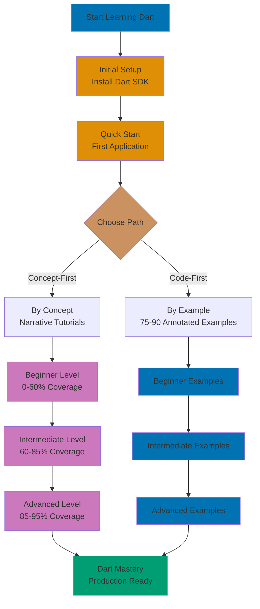

Learn Dart through concept-based tutorials that emphasize understanding WHY alongside HOW. This section provides comprehensive narrative tutorials organized by difficulty level, focusing on building strong mental models and deep comprehension of Dart's design philosophy.

## What is Concept-Based Learning

**Concept-based learning** focuses on understanding the underlying principles, design decisions, and mental models that make Dart work. Rather than jumping straight to code examples, concept-based tutorials:

- **Explain the WHY** - Why does Dart use null safety? Why are Futures designed this way?
- **Build mental models** - How do async/await work conceptually? What's the execution model?
- **Connect concepts** - How does null safety relate to type safety? How do mixins complement inheritance?
- **Provide context** - What problems does this feature solve? When should you use it?
- **Progressive disclosure** - Start with simple explanations, gradually add complexity

This approach builds deeper understanding than code-first learning alone, helping you reason about Dart programs and make better design decisions.

## How it Differs from By-Example

ayokoding-web offers two complementary learning paths for Dart:

### By-Example Approach

**Focus**: Code-first, practical learning through heavily annotated examples

**Structure**:

- 75-90 complete, runnable code examples
- Heavy annotation (1-2.25 comments per line)
- Minimal prose, maximum code
- Quick reference format
- 95% language coverage efficiently

**Best for**:

- Learning by doing
- Quick reference lookup
- Experienced programmers who prefer code
- Building muscle memory through practice

**See**: [By Example](/en/learn/software-engineering/programming-languages/dart/by-example)

### By-Concept Approach (This Section)

**Focus**: Understanding-first, narrative learning through conceptual explanations

**Structure**:

- Progressive narrative tutorials
- Deep explanations of principles
- Examples support concepts (not vice versa)
- Comprehensive coverage
- 0-95% knowledge systematically

**Best for**:

- Building mental models
- Understanding design rationale
- Systematic progression
- Deep comprehension
- First-time learners

**Both approaches are valid** - choose based on your learning style, or use both together for maximum understanding.

## Organization by Difficulty Levels

Concept-based tutorials are organized into three progressive difficulty levels, each building on the previous:

### Beginner (0-60% Coverage)

**Target Audience**: Programmers new to Dart with basic programming knowledge in any language

**Learning Focus**:

- Fundamental Dart syntax and semantics
- Strong type system with null safety
- Basic data structures and control flow
- Functions and first-class function values
- Object-oriented programming basics
- Essential standard library usage

**Outcome**: Write simple to moderately complex Dart programs, understand core language features, ready for intermediate patterns.

**Prerequisites**: Basic programming concepts (variables, functions, control flow) in any language

### Intermediate (60-85% Coverage)

**Target Audience**: Developers comfortable with Dart basics ready for production patterns

**Learning Focus**:

- Asynchronous programming model (Future, async/await, Stream)
- Advanced null safety patterns
- Collection operations and functional patterns
- Object-oriented design (inheritance, mixins, interfaces)
- Error handling strategies
- Package ecosystem and dependency management

**Outcome**: Build production-quality applications, handle asynchronous operations, design object-oriented systems, use Dart's ecosystem effectively.

**Prerequisites**: Completed beginner level or equivalent Dart experience

### Advanced (85-95% Coverage)

**Target Audience**: Experienced Dart developers seeking mastery and sophisticated patterns

**Learning Focus**:

- Concurrency with Isolates
- Advanced async patterns and stream transformations
- Generics and advanced type system features
- Dart 3.0+ features (records, pattern matching, class modifiers)
- Performance optimization
- Testing strategies and best practices
- Functional programming patterns in Dart

**Outcome**: Master advanced Dart features, optimize performance, design sophisticated systems, leverage cutting-edge Dart capabilities.

**Prerequisites**: Completed intermediate level or significant production Dart experience

## Islamic Finance Learning Context

All tutorials use **authentic Islamic finance examples** to make concepts concrete and relevant:

### Zakat (Obligatory Charity)

Used to teach:

- **Numeric operations** - Calculating 2.5% on eligible wealth
- **Conditional logic** - Checking nisab threshold
- **Data structures** - Tracking multiple asset types
- **Functions** - Reusable calculation logic

```dart
// Beginner example: Simple Zakat calculation
double calculateZakat(double wealth) {
  const nisabThreshold = 85.0 * 1000000.0; // 85 grams gold equivalent

  if (wealth < nisabThreshold) {
    return 0.0; // Below threshold: no Zakat due
  }

  return wealth * 0.025; // 2.5% of eligible wealth
}
```

### Murabaha (Cost-Plus Financing)

Used to teach:

- **Classes and objects** - Modeling contract structure
- **Encapsulation** - Private fields, public getters
- **Computed properties** - Deriving total from cost + markup
- **Business logic** - Transparent pricing calculations

```dart
// Intermediate example: Murabaha contract modeling
class MurabahaContract {
  final double assetCost;
  final double profitMargin;
  final int installmentMonths;

  MurabahaContract({
    required this.assetCost,
    required this.profitMargin,
    required this.installmentMonths,
  });

  // Total price: cost + agreed profit (transparent)
  double get totalPrice => assetCost + profitMargin;

  // Equal monthly installments
  double get monthlyPayment => totalPrice / installmentMonths;
}
```

### Sadaqah (Voluntary Charity)

Used to teach:

- **Streams** - Asynchronous donation tracking over time
- **Async generators** - Producing values asynchronously
- **State management** - Accumulating running totals
- **Reactive programming** - Responding to donation events

```dart
// Advanced example: Asynchronous donation stream
Stream<double> trackDonations() async* {
  // Simulate donations received over time
  await Future.delayed(Duration(seconds: 1));
  yield 100.0; // First donation

  await Future.delayed(Duration(seconds: 2));
  yield 250.0; // Second donation

  await Future.delayed(Duration(seconds: 1));
  yield 500.0; // Third donation
}
```

These examples provide **meaningful context** while teaching programming concepts, making abstract ideas concrete through real-world Islamic finance applications.

## Target Audience for Each Level

### Who Should Start with Beginner

- Programmers with experience in other languages (Java, C++, JavaScript, Python, etc.)
- Developers new to statically-typed languages with null safety
- Students learning Dart for Flutter development
- Backend developers exploring Dart for server-side applications
- Anyone wanting comprehensive foundation in Dart

**Time investment**: Approximately 1,700-2,300 lines of content with exercises

### Who Should Start with Intermediate

- Developers who completed beginner level
- Programmers with strong fundamentals in similar languages (TypeScript, Kotlin, Swift)
- Developers comfortable with Dart syntax seeking production patterns
- Flutter developers wanting deeper Dart knowledge

**Time investment**: Approximately 1,350-1,700 lines of content

### Who Should Start with Advanced

- Developers who completed intermediate level
- Experienced Dart programmers seeking mastery
- Library/package authors needing deep language knowledge
- Performance-critical application developers
- Developers migrating to Dart 3.0+ features

**Time investment**: Approximately 1,250-1,500 lines of content

## Learning Path



**Recommended approach**: Start with concept-based beginner, supplement with by-example for specific features, return to concept-based for deeper understanding.

## How to Use This Section

### For Complete Beginners

1. Complete [Initial Setup](/en/learn/software-engineering/programming-languages/dart/initial-setup) first
2. Optionally complete [Quick Start](/en/learn/software-engineering/programming-languages/dart/quick-start)
3. Start with [Beginner](/en/learn/software-engineering/programming-languages/dart/by-concept/beginner) tutorial
4. Read sequentially - sections build on each other
5. Type all code examples yourself
6. Complete exercises before moving forward
7. Supplement with [By Example](/en/learn/software-engineering/programming-languages/dart/by-example) for practice

### For Experienced Programmers

1. Skim [Beginner](/en/learn/software-engineering/programming-languages/dart/by-concept/beginner) for Dart-specific concepts (null safety, named parameters)
2. Focus on [Intermediate](/en/learn/software-engineering/programming-languages/dart/by-concept/intermediate) for asynchronous patterns
3. Study [Advanced](/en/learn/software-engineering/programming-languages/dart/by-concept/advanced) for Dart 3.0+ features
4. Use [By Example](/en/learn/software-engineering/programming-languages/dart/by-example) for quick reference

### For Reference

- Jump to specific sections as needed
- Use table of contents for navigation
- Cross-reference with by-example for code patterns
- Bookmark frequently referenced concepts

## Complementary Resources

**Within ayokoding-web**:

- [Overview](/en/learn/software-engineering/programming-languages/dart/overview) - Dart language overview and philosophy
- [Initial Setup](/en/learn/software-engineering/programming-languages/dart/initial-setup) - Installation and configuration
- [Quick Start](/en/learn/software-engineering/programming-languages/dart/quick-start) - First complete application
- [By Example](/en/learn/software-engineering/programming-languages/dart/by-example) - Code-first learning path

**External resources**:

- Official Dart documentation for API reference
- DartPad for browser-based experimentation
- Flutter documentation for UI development
- Pub.dev for package ecosystem

## Coverage Target: 95%

Combined beginner, intermediate, and advanced levels provide approximately **95% of practical Dart knowledge** needed for real-world development.

**What's covered** (95%):

- Complete language syntax and semantics
- Standard library essentials
- Asynchronous programming patterns
- Object-oriented design
- Functional programming in Dart
- Modern Dart 3.0+ features
- Production development patterns
- Testing and debugging strategies

**What's not covered** (remaining 5%):

- Obscure language features rarely used in practice
- Platform-specific APIs (covered in framework tutorials)
- Experimental features not yet stabilized
- VM internals and compiler implementation details

This 95% coverage prepares you for:

- Mobile development with Flutter
- Web applications with Dart
- Server-side development
- CLI tool creation
- Package/library authorship

## Start Learning

Ready to build deep Dart understanding? Choose your starting level:

- [Beginner](/en/learn/software-engineering/programming-languages/dart/by-concept/beginner) - Comprehensive foundation (0-60%)
- [Intermediate](/en/learn/software-engineering/programming-languages/dart/by-concept/intermediate) - Production patterns (60-85%)
- [Advanced](/en/learn/software-engineering/programming-languages/dart/by-concept/advanced) - Mastery and optimization (85-95%)

Or explore [By Example](/en/learn/software-engineering/programming-languages/dart/by-example) for code-first learning.
