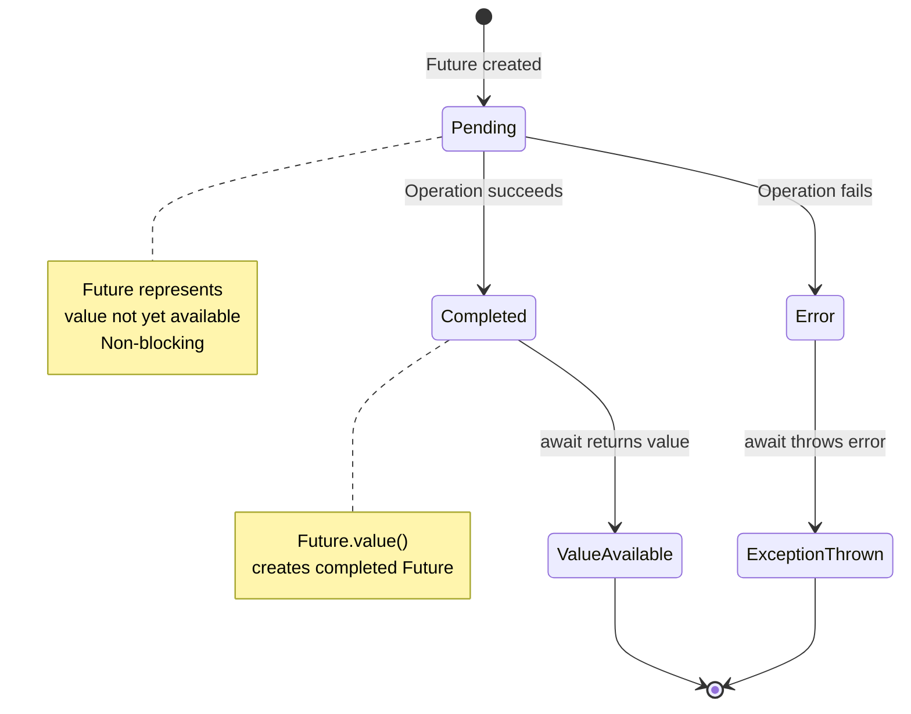
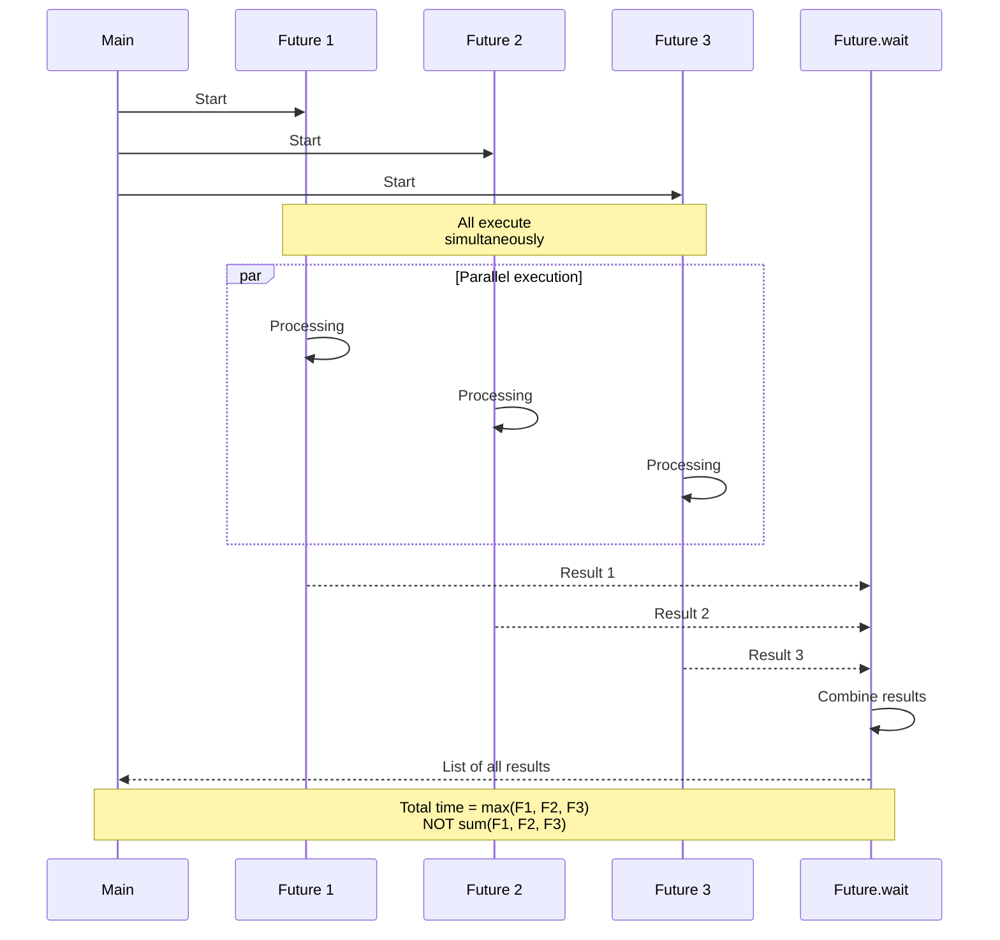
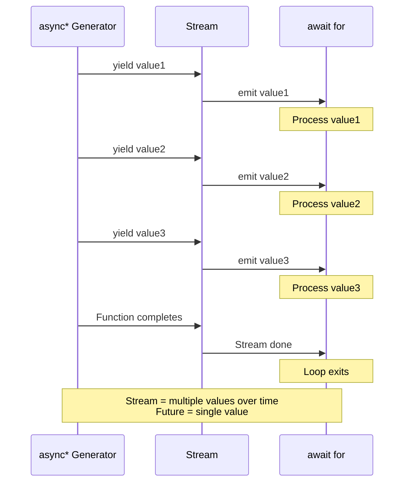
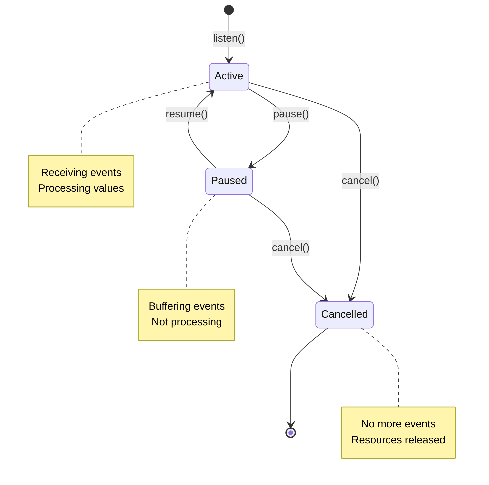
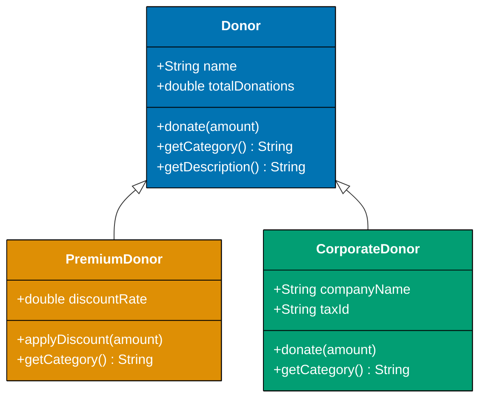
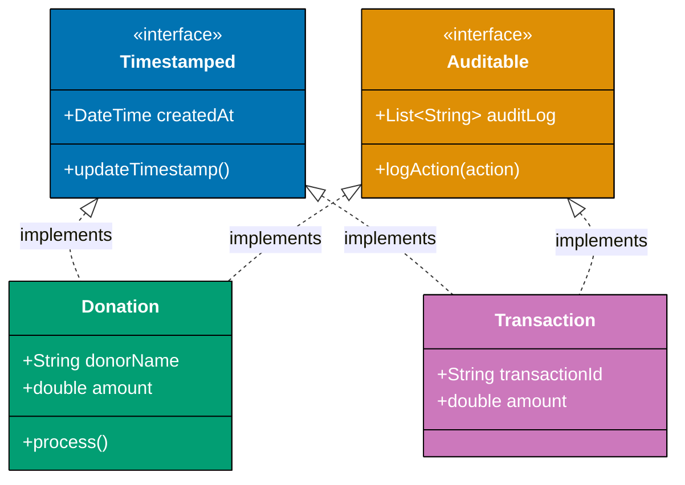
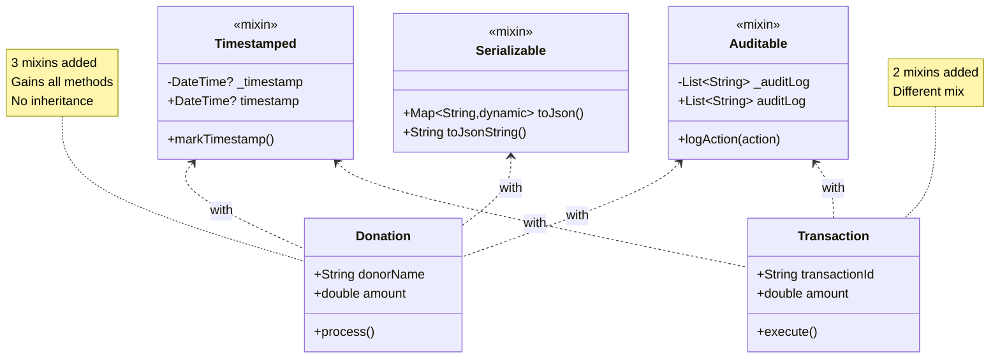

Master intermediate Dart patterns through 16 heavily annotated examples using Islamic finance contexts. Each example maintains 1-2.25 annotation density and demonstrates production patterns for Flutter and server applications.

## Example 26: Future Basics - async/await

Asynchronous operations with Future for delayed computations. Futures represent values that will be available later, enabling non-blocking I/O and concurrent operations.

**Future States**:

- **Pending**: Future created, computation in progress
- **Completed with value**: Operation succeeded, result available via await
- **Completed with error**: Operation failed, error thrown when awaited

**Why Use Futures**: Synchronous operations block the entire thread, freezing UI in Flutter or stalling server request handling. Futures enable concurrent operations without spawning expensive threads (1MB stack each), allowing thousands of concurrent operations on single-threaded Dart isolate.



```dart
import 'dart:async';                    // => Import for Future, Stream, Completer
                                        // => Core async primitives

// Simulated async function for donation processing
Future<double> fetchDonationAmount(String donorId) async {  // => Execute statement
                                        // => async keyword: enables await inside function
                                        // => Returns: Future<double> (not double directly)
                                        // => Use case: fetch donation from API/database
  await Future.delayed(Duration(seconds: 1));  // => Wait for async operation
                                        // => Simulates: network latency or database query
                                        // => Thread: Dart event loop continues processing other tasks
                                        // => Non-blocking: isolate can handle other Futures during delay
  return 500000.0 * donorId.length;     // => Calculate based on ID length (demo logic)
                                        // => Return: wrapped in Future automatically (async function)
}                                       // => Total time: ~1 second per call

void main() async {                     // => main can be async in Dart (unlike Java)
                                        // => Event loop: continues until all async operations complete
  print('Fetching donation...');        // => Immediate output (synchronous)
                                        // => Timeline: T=0ms

  // Await async function (sequential execution)
  double amount = await fetchDonationAmount('DONOR-001');  // => Execute statement
                                        // => await: pauses THIS function until Future completes
                                        // => Thread: isolate processes other events during delay
                                        // => Timeline: T=1000ms (after 1 second delay)
                                        // => amount: 4500000.0 (500000.0 * 9 characters)
  print('Amount: Rp$amount');           // => Output: Amount: Rp4500000.0
                                        // => Timeline: T=1000ms

  // Future.value creates already-completed Future
  Future<String> immediateFuture = Future.value('Completed');  // => Execute statement
                                        // => State: Future already COMPLETED (no pending work)
                                        // => Use case: return cached values in async context
                                        // => Performance: zero delay, no event loop scheduling
  String result = await immediateFuture;  // => No delay: await returns immediately
                                          // => result: 'Completed'
  print('Result: $result');             // => Output: Result: Completed

  // Future.error creates failed Future
  try {                                 // => Execute statement
    await Future.error('Payment failed');  // => Creates Future that completes with error
                                           // => State: COMPLETED with error (not value)
                                           // => await: throws error instead of returning value
  } catch (e) {                         // => Catch error from awaited Future
    print('Error: $e');                 // => Output: Error: Payment failed
                                        // => Exception handling: same as synchronous try-catch
  }

  // Multiple futures with then() chaining (alternative to async/await)
  fetchDonationAmount('DONOR-002')      // => Returns Future<double>
      .then((double value) {            // => Callback: executed when Future completes
                                        // => Parameter: value is the unwrapped result (double, not Future<double>)
        print('Fetched: Rp$value');     // => Output after ~1 second delay
                                        // => Timeline: T=2000ms (1s + previous 1s)
        return value * 0.025;           // => Transform: calculate 2.5% Zakat rate
                                        // => Return: wrapped in Future<double> for chaining
      })
      .then((double zakat) {            // => Second then: receives result from previous then
                                        // => Chaining: enables pipeline of transformations
        print('Zakat: Rp$zakat');       // => Output: Zakat: Rp112500.0
                                        // => Calculation: 4500000.0 * 0.025 = 112500.0
      })
      .catchError((error) {             // => Catch any error in the entire chain
                                        // => Error propagation: errors bubble through chain
        print('Chain error: $error');   // => Only executes if any then throws
      });

  await Future.delayed(Duration(seconds: 2));  // => Wait for async operation
                                        // => Wait for then() chain to complete
                                        // => Without this: main() exits before chain finishes
                                        // => Total time: 2 seconds to allow chain execution
}
```

**Execution Timeline**:

- T=0ms: "Fetching donation..."
- T=1000ms: "Amount: Rp4500000.0"
- T=1000ms: "Result: Completed" (immediate)
- T=1000ms: "Error: Payment failed" (immediate)
- T=2000ms: "Fetched: Rp4500000.0" (second fetch starts)
- T=2000ms: "Zakat: Rp112500.0"

**Key Takeaway**: Use `async`/`await` for sequential async operations with readable, synchronous-looking code. Use `then()` for functional-style chaining. Functions marked `async` always return `Future<T>`.

**Why It Matters**: In Flutter, blocking the main isolate causes dropped frames and UI stutters. Async operations enable smooth UI by offloading I/O to the event loop while keeping the UI thread responsive. In server applications, blocking isolates destroys throughput—async enables handling thousands of concurrent HTTP requests on a single isolate without thread-per-request overhead that cripples traditional server models.

**Common Pitfalls**: Forgetting `await` returns `Future<T>`, not `T` (compile error caught). Unhandled Future errors fail silently (use `.catchError()` or try-catch with await). Awaiting in a loop executes sequentially (use `Future.wait()` for parallelism).

---

## Example 27: Future.wait - Parallel Execution

Execute multiple asynchronous operations in parallel and wait for all to complete. Critical for optimizing latency when operations don't depend on each other.

**Sequential vs Parallel**:

- **Sequential**: `await` one after another → total time = sum of all durations (1000ms + 800ms = 1800ms)
- **Parallel**: Start all Futures → total time = max of all durations (max(1000ms, 800ms) = 1000ms)
- **Speedup**: Parallel execution 1.8x faster for independent operations



```dart
import 'dart:async';                    // => Import for Future operations

Future<Map<String, double>> fetchDonor(String name) async {  // => Execute statement
                                        // => Simulates: HTTP GET request to donor service
                                        // => Returns: donor data as Map
  await Future.delayed(Duration(milliseconds: 500));  // => Wait for async operation
                                        // => Simulates: 500ms network latency
                                        // => Realistic: typical database query or API call timing
  return {                              // => Return donor data structure
    'name': name.length.toDouble(),     // => Dummy calculation for demo
    'amount': name.length * 100000.0,   // => Donation amount based on name length
  };                                    // => Map<String, double>: string keys, double values
}

void main() async {                     // => Execute statement
  print('Fetching multiple donors...');  // => Start message
                                         // => Timeline: T=0ms

  // Sequential execution (slow - anti-pattern for independent operations)
  Stopwatch stopwatch = Stopwatch()..start();  // => Execute statement
                                        // => Cascade notation: create and start in one line
                                        // => Stopwatch: measures elapsed time in milliseconds
  Map<String, double> donor1 = await fetchDonor('Ahmad');  // => Execute statement
                                        // => Timeline: T=500ms (first fetch completes)
                                        // => Blocking: waits for first fetch before starting second
  Map<String, double> donor2 = await fetchDonor('Fatimah');  // => Execute statement
                                        // => Timeline: T=1000ms (500ms + 500ms)
                                        // => Problem: second fetch waited unnecessarily
  Map<String, double> donor3 = await fetchDonor('Ali');  // => Execute statement
                                        // => Timeline: T=1500ms (500ms + 500ms + 500ms)
                                        // => Total: 1500ms (additive delays)
  stopwatch.stop();                     // => Stop timer

  print('Sequential: ${stopwatch.elapsedMilliseconds}ms');  // => Execute statement
                                        // => Output: Sequential: ~1500ms
                                        // => Inefficient: each await blocks next fetch

  // Parallel execution with Future.wait (optimal for independent operations)
  stopwatch.reset();                    // => Reset timer to zero
  stopwatch.start();                    // => Start timing parallel execution

  List<Future<Map<String, double>>> futures = [  // => Execute statement
    fetchDonor('Ahmad'),                // => Start first fetch immediately
                                        // => Returns: Future (pending), doesn't block
    fetchDonor('Fatimah'),              // => Start second fetch immediately (parallel)
                                        // => Timeline: T=0ms (both started simultaneously)
    fetchDonor('Ali'),                  // => Start third fetch immediately (parallel)
  ];                                    // => All three executing concurrently
                                        // => Timeline: T=0ms (all started, none awaited yet)

  List<Map<String, double>> donors = await Future.wait(futures);  // => Execute statement
                                        // => Wait for ALL futures to complete
                                        // => Returns: List of results in original order
                                        // => Timeline: T=500ms (all complete at same time)
                                        // => Performance: max(500ms, 500ms, 500ms) = 500ms
  stopwatch.stop();                     // => Stop timer

  print('Parallel: ${stopwatch.elapsedMilliseconds}ms');  // => Execute statement
                                        // => Output: Parallel: ~500ms
                                        // => Speedup: 1500ms → 500ms (3x faster)

  double total = donors.fold(0.0, (sum, donor) => sum + (donor['amount'] ?? 0.0));  // => Execute statement
                                        // => fold: reduce list to single value
                                        // => sum: accumulator (starts at 0.0)
                                        // => donor['amount']: extract amount, default to 0.0 if null
  print('Total: Rp$total');             // => Output: Total: Rp1200000.0
                                        // => Calculation: (5+7+3) * 100000 = 1500000.0

  // Future.wait with error handling (eagerError: true by default)
  try {                                 // => Execute statement
    await Future.wait([                 // => Wait for async operation
      fetchDonor('Valid'),              // => Will complete successfully
      Future.error('Network error'),    // => Simulates: API call failure
      fetchDonor('Also Valid'),         // => May not execute (eager error)
    ]);                                 // => Execute statement
  } catch (e) {                         // => Catches FIRST error
                                        // => eagerError: true → stops at first error
    print('Error in batch: $e');        // => Output: Error in batch: Network error
                                        // => Other futures: automatically cancelled
  }

  // Future.wait with eagerError: false (collect partial results)
  List<dynamic> results = await Future.wait(  // => Execute statement
    [                                   // => Execute statement
      fetchDonor('Valid'),              // => Will complete successfully
      Future.error('Error'),            // => Will fail
      fetchDonor('Also Valid'),         // => Will complete successfully
    ],                                  // => Execute statement
    eagerError: false,                  // => Continue executing despite errors
                                        // => Use case: best-effort data collection
  );                                    // => returns List including error objects
                                        // => Result: contains successful values and error
  print('Partial results: ${results.length}');  // => Execute statement
                                        // => Output: Partial results: 3
                                        // => Contains: mix of successful Maps and error object
}
```

**Performance Comparison**:

- **Sequential**: 1500ms (500ms × 3 calls)
- **Parallel**: 500ms (max of all concurrent operations)
- **Speedup**: 3x faster for 3 independent operations

**Key Takeaway**: Use `Future.wait()` to run multiple Futures in parallel when operations don't depend on each other. Much faster than sequential `await`. By default, stops at first error (eagerError: true).

**Why It Matters**: Microservice aggregation endpoints (fetching user data + posts + permissions simultaneously) benefit massively from parallel execution. Sequential fetching adds latency linearly (3 APIs × 500ms = 1500ms), while parallel execution caps latency at the slowest operation (max(500ms) = 500ms), significantly reducing response times in typical dashboards loading multiple data sources. Critical for mobile apps on slow networks where every millisecond of latency impacts user experience.

**Common Pitfalls**: Sequential `await` in a loop doesn't parallelize (use `List.generate()` + `Future.wait()`). `Future.wait()` fails fast by default—use `eagerError: false` to collect partial results when some operations may fail. Forgetting to `await` the Future.wait() itself causes race conditions.

---

## Example 28: Async Error Handling

Proper error handling patterns in async code with try-catch and Future.catchError. Critical for production reliability—unhandled async errors crash applications silently.

**Error Handling Strategies**:

- **try-catch with await**: Synchronous-style error handling (most readable)
- **catchError on Future**: Functional-style error handling (for then() chains)
- **on Type catch**: Catch specific exception types for granular handling
- **finally**: Cleanup code (runs whether success or failure)

```dart
import 'dart:async';                    // => Import for Future

Future<double> calculateZakat(double wealth) async {  // => Execute statement
                                        // => Async function for Zakat calculation
                                        // => Returns Future<double> that completes with Zakat amount
                                        // => Zakat: 2.5% of eligible wealth (Islamic obligation)
  if (wealth < 0) {                     // => Validate input
                                        // => Business rule: negative wealth invalid
    throw ArgumentError('Negative wealth not allowed');  // => Execute statement
                                        // => throw: creates error that Future completes with
                                        // => ArgumentError: built-in exception for invalid arguments
  }                                     // => Validation check complete

  if (wealth < 200000000.0) {           // => Check nisab threshold
                                        // => Nisab: minimum wealth required for Zakat
    throw StateError('Wealth below nisab threshold');  // => Execute statement
                                        // => StateError: wealth doesn't meet minimum
  }

  await Future.delayed(Duration(milliseconds: 100));  // => Wait for async operation
                                        // => Simulate: calculation processing time
  return wealth * 0.025;                // => Calculate: 2.5% Zakat rate
                                        // => Return: Zakat amount due
}

void main() async {                     // => Execute statement
  // Try-catch with await (synchronous-style error handling)
  try {                                 // => Execute statement
    double zakat = await calculateZakat(-1000.0);  // => Execute statement
                                        // => Throws: ArgumentError (negative wealth)
                                        // => await: unwraps Future, throws error if Future failed
    print('Zakat: Rp$zakat');           // => Never executes (error thrown above)
  } on ArgumentError catch (e) {        // => Catch specific exception type
                                        // => on ArgumentError: only catches ArgumentError
                                        // => Use case: handle validation errors differently
    print('Validation error: $e');      // => Output: Validation error: Invalid argument(s): Negative wealth not allowed
  } on StateError catch (e) {           // => Catch StateError specifically
                                        // => Multiple on clauses: handle different errors differently
    print('State error: $e');           // => Doesn't execute (ArgumentError thrown)
  } catch (e) {                         // => Catch any other error type
                                        // => Fallback: catches exceptions not matched above
    print('Unknown error: $e');         // => Fallback handler
  } finally {                           // => Always executes (success or failure)
                                        // => Use case: cleanup, logging, resource release
    print('Calculation attempted');     // => Output: Calculation attempted
  }

  // catchError on Future (functional-style error handling)
  calculateZakat(-500.0)                // => Returns Future that will fail
      .then((value) => print('Zakat: Rp$value'))  // => Execute statement
                                        // => Callback: only executes if Future succeeds
                                        // => Doesn't execute (Future fails)
      .catchError((error) {             // => Handle error in Future chain
                                        // => Parameter: the error object
        print('Chain error: $error');   // => Output: Chain error: Invalid argument(s): Negative wealth not allowed
        return 0.0;                     // => Return default value on error
                                        // => Error recovery: continue chain with fallback
      })
      .then((value) {                   // => Next then receives recovered value (0.0)
        print('Recovered with: $value');  // => Output: Recovered with: 0.0
      });

  await Future.delayed(Duration(milliseconds: 200));  // => Wait for async operation
                                        // => Wait for then() chain to complete
                                        // => Ensures chain finishes before main() exits

  // Successful calculation (no error)
  try {                                 // => Execute statement
    double zakat = await calculateZakat(500000000.0);  // => Execute statement
                                        // => Valid input: above nisab, positive
                                        // => Timeline: 100ms delay in calculateZakat
    print('Valid Zakat: Rp$zakat');     // => Output: Valid Zakat: Rp12500000.0
                                        // => Calculation: 500000000 * 0.025 = 12500000.0
  } catch (e) {                         // => Execute statement
    print('Error: $e');                 // => Doesn't execute (success case)
  }

  // Multiple error types demonstration
  List<double> testValues = [-1000.0, 100000.0, 500000000.0];  // => Execute statement
  for (double wealth in testValues) {   // => Test different scenarios
    try {                               // => Execute statement
      double zakat = await calculateZakat(wealth);  // => Execute statement
      print('Wealth Rp$wealth → Zakat Rp$zakat');  // => Execute statement
    } on ArgumentError catch (e) {      // => Execute statement
      print('Wealth Rp$wealth → Validation failed: ${e.message}');  // => Execute statement
    } on StateError catch (e) {         // => Execute statement
      print('Wealth Rp$wealth → Below nisab: ${e.message}');  // => Execute statement
    }
  }
}
```

**Error Handling Comparison**:

| Pattern              | Use Case                | Readability                   | Error Recovery              |
| -------------------- | ----------------------- | ----------------------------- | --------------------------- |
| try-catch with await | Most async code         | Excellent (synchronous-style) | try-catch-finally           |
| catchError()         | then() chains           | Good (functional style)       | return fallback value       |
| on Type catch        | Specific error handling | Good (granular control)       | Different handlers per type |

**Key Takeaway**: Use try-catch with `await` for synchronous-style error handling. Use `catchError()` on Future chains. Handle specific exception types with `on` keyword. Use `finally` for cleanup code.

**Why It Matters**: Unhandled async errors are catastrophic—they fail silently in production, corrupting data or leaving operations half-complete without user notification. In Flutter, unhandled errors crash the app. In server applications, unhandled errors terminate request processing without sending HTTP responses, causing timeout errors for clients. Proper async error handling is non-negotiable for production reliability.

**Common Pitfalls**: Unhandled Future errors fail silently (always use try-catch or catchError). `catchError()` must be in Future chain—try-catch only works with `await`. Catching generic `Exception` instead of specific types loses error context. Forgetting `finally` cleanup causes resource leaks.

---

## Example 29: Future Timeouts

Using Future.timeout() to prevent indefinite waits on async operations. Critical for production resilience when external dependencies fail or slow down.

**Timeout Behavior**:

- **timeout**: Maximum duration to wait for Future completion
- **onTimeout callback**: Optional function to provide fallback value
- **Without onTimeout**: Throws `TimeoutException` when timeout expires
- **With onTimeout**: Returns fallback value, no exception thrown

```dart
import 'dart:async';                    // => Import for Future, TimeoutException

Future<double> fetchDonationFromAPI(String donorId) async {  // => Execute statement
                                        // => Simulates: external API call
                                        // => Real use: HTTP request to donation service
  await Future.delayed(Duration(seconds: 3));  // => Wait for async operation
                                        // => Simulates: slow API (3 second response time)
                                        // => Problem: network issues or overloaded server
  return 1000000.0;                     // => Return donation amount (if completes)
}

void main() async {                     // => Main function with async support
                                        // => async enables await keyword
  // Timeout without fallback (throws TimeoutException)
  try {                                 // => Try block for timeout handling
                                        // => Catches TimeoutException if timeout expires
    double amount = await fetchDonationFromAPI('DONOR-001')  // => Execute statement
        .timeout(Duration(seconds: 2));  // => Maximum wait: 2 seconds
                                         // => fetchDonationFromAPI takes 3 seconds
                                         // => Result: timeout after 2 seconds
    print('Amount: Rp$amount');          // => Never executes (timeout occurs first)
  } on TimeoutException catch (e) {      // => Catch timeout exception specifically
                                         // => TimeoutException: thrown when timeout expires
    print('Request timeout: ${e.message}');  // => Execute statement
                                         // => Output: Request timeout: [timeout message]
    print('Fallback: Using default amount');  // => Execute statement
                                         // => Manual fallback in error handler
  }                                     // => Try-catch complete

  // Timeout with fallback (no exception, graceful degradation)
  double amount = await fetchDonationFromAPI('DONOR-002')  // => Execute statement
      .timeout(                         // => Execute statement
        Duration(seconds: 2),            // => Maximum wait: 2 seconds
        onTimeout: () {                  // => Callback: executes when timeout expires
                                         // => Returns: fallback value instead of throwing
          print('Timeout - using cached amount');  // => Execute statement
          return 500000.0;               // => Fallback: cached or default value
                                         // => Graceful degradation: continue with fallback
        },
      );                                // => Execute statement
  print('Amount with fallback: Rp$amount');  // => Execute statement
                                        // => Output: Amount with fallback: Rp500000.0
                                        // => No exception: onTimeout provided value

  // Fast operation (completes before timeout)
  Future<double> fastOperation() async {  // => Execute statement
    await Future.delayed(Duration(milliseconds: 500));  // => Wait for async operation
                                        // => Completes in 500ms
    return 750000.0;                    // => Return before timeout
  }

  double fastAmount = await fastOperation()  // => Execute statement
      .timeout(Duration(seconds: 2));   // => Timeout: 2 seconds (plenty of time)
                                        // => Completes: 500ms < 2000ms (no timeout)
  print('Fast amount: Rp$fastAmount');  // => Output: Fast amount: Rp750000.0
                                        // => Success: completed within timeout

  // Multiple operations with different timeouts (circuit breaker pattern)
  List<Future<double>> operations = [   // => Execute statement
    fetchDonationFromAPI('DONOR-003').timeout(  // => Execute statement
      Duration(seconds: 1),              // => Aggressive timeout (1 second)
      onTimeout: () => 0.0,              // => Fail fast with zero
    ),                                  // => Execute statement
    fastOperation().timeout(            // => Execute statement
      Duration(seconds: 2),              // => Conservative timeout (2 seconds)
      onTimeout: () => 0.0,             // => Execute statement
    ),                                  // => Execute statement
  ];                                    // => Execute statement

  List<double> results = await Future.wait(operations);  // => Execute statement
                                        // => Wait for all (parallel execution)
                                        // => First: times out (3s > 1s) → 0.0
                                        // => Second: succeeds (0.5s < 2s) → 750000.0
  print('Results: $results');           // => Output: Results: [0.0, 750000.0]

  double totalWithTimeouts = results.reduce((a, b) => a + b);  // => Execute statement
  print('Total with timeouts: Rp$totalWithTimeouts');  // => Execute statement
                                        // => Output: Total with timeouts: Rp750000.0
                                        // => Resilient: partial success despite timeout
}
```

**Timeout Strategies**:

| Strategy     | Timeout Duration         | onTimeout Behavior | Use Case                                        |
| ------------ | ------------------------ | ------------------ | ----------------------------------------------- |
| Fail fast    | 500ms-1s                 | Throw exception    | Critical paths requiring immediate response     |
| Conservative | 5s-10s                   | Return fallback    | Background operations with graceful degradation |
| Adaptive     | Based on latency metrics | Return cached data | Production APIs with monitoring                 |

**Key Takeaway**: Use `Future.timeout()` to prevent indefinite waits. Provide `onTimeout` callback for graceful degradation, or omit for exception-based handling. Different operations need different timeout durations.

**Why It Matters**: Production systems fail catastrophically without timeouts—a single slow external dependency (database, API, file system) can cascade into system-wide failure as requests pile up waiting indefinitely, exhausting resources. Timeouts are circuit breakers that contain failure, preventing one slow operation from bringing down the entire system.

**Common Pitfalls**: Setting same timeout for all operations (different operations need different limits). Forgetting `onTimeout` causes TimeoutException in production. Timeout too short causes false positives (request succeeds but timeout triggered). Timeout too long defeats the purpose (system hangs before timeout).

---

## Example 30: Completer - Manual Future Control

Creating and completing Futures manually with Completer class. Enables bridging callback-based APIs to Future-based code, critical for Flutter plugins and native platform integration.

**Completer Use Cases**:

- **Callback to Future**: Convert callback APIs to async/await
- **Event to Future**: Wait for specific event in event-driven code
- **Manual completion**: Complete Future from different execution context
- **Custom async operations**: Build complex async patterns

```dart
import 'dart:async';                    // => Import for Completer, Future

// Simulate callback-based API (legacy pattern)
void fetchUserDataCallback(String userId, Function(String) onSuccess, Function(String) onError) {  // => Execute statement
                                        // => Callback pattern: common in JavaScript, legacy Dart
                                        // => onSuccess: called with result on success
                                        // => onError: called with error message on failure
  Future.delayed(Duration(seconds: 1), () {  // => Execute statement
                                        // => Simulate async operation with callback
    if (userId.isNotEmpty) {            // => Conditional check
      onSuccess('User data for $userId');  // => Execute statement
                                        // => Success case: invoke success callback
    } else {                            // => Execute statement
      onError('Invalid user ID');       // => Error case: invoke error callback
    }
  });
}

// Bridge callback API to Future using Completer
Future<String> fetchUserData(String userId) {  // => Execute statement
                                        // => Returns: Future<String> (modern async API)
                                        // => Bridges: callback-based to Future-based
  Completer<String> completer = Completer<String>();  // => Execute statement
                                        // => Create Completer: manual Future control
                                        // => Type parameter: String (Future<String>)

  fetchUserDataCallback(                // => Execute statement
    userId,                             // => Execute statement
    (String data) {                     // => Success callback
                                        // => Called by legacy API on success
      completer.complete(data);         // => Complete Future with success value
                                        // => Completer.future now has value
    },
    (String error) {                    // => Error callback
                                        // => Called by legacy API on failure
      completer.completeError(error);   // => Complete Future with error
                                        // => Completer.future throws when awaited
    },
  );                                    // => Execute statement

  return completer.future;              // => Return Future controlled by Completer
                                        // => Caller can await this Future
}

void main() async {                     // => Execute statement
  // Use bridged Future API (clean async/await)
  try {                                 // => Execute statement
    String userData = await fetchUserData('USER-001');  // => Execute statement
                                        // => Clean async/await: no callbacks
                                        // => Timeline: 1 second delay in callback API
    print('Data: $userData');           // => Output: Data: User data for USER-001
  } catch (e) {                         // => Execute statement
    print('Error: $e');                 // => Catches error from completeError()
  }

  // Error case
  try {                                 // => Execute statement
    String userData = await fetchUserData('');  // => Execute statement
                                        // => Empty userId triggers error in callback
    print('Data: $userData');           // => Never executes
  } catch (e) {                         // => Execute statement
    print('Error: $e');                 // => Output: Error: Invalid user ID
  }

  // Manual event completion (waiting for specific event)
  Completer<int> eventCompleter = Completer<int>();  // => Execute statement
                                        // => Create Completer for event handling
                                        // => Pattern: waiting for specific event to occur

  // Simulate event-driven code
  Future.delayed(Duration(milliseconds: 500), () {  // => Execute statement
                                        // => Simulate event trigger after delay
                                        // => Real use: user interaction, network event, timer
    eventCompleter.complete(42);        // => Complete Future when event occurs
                                        // => Event-driven: Future completes from different context
                                        // => All awaiters of eventCompleter.future receive value
  });                                   // => Event handler registered

  print('Waiting for event...');        // => Immediate output (before event)
                                        // => Non-blocking: main continues while waiting
  int eventResult = await eventCompleter.future;  // => Execute statement
                                        // => Await: blocks until complete() called
                                        // => Timeline: 500ms until event occurs
                                        // => Receives: value passed to complete()
  print('Event result: $eventResult');  // => Output: Event result: 42
                                        // => Executes after event completed

  // Completer with multiple waiters (single Future, multiple awaiters)
  Completer<String> sharedCompleter = Completer<String>();  // => Execute statement

  // Multiple async operations waiting on same Completer
  Future<void> waiter1() async {        // => Execute statement
    print('Waiter 1 waiting...');       // => Execute statement
    String result = await sharedCompleter.future;  // => Execute statement
                                        // => Waits: until complete() called
    print('Waiter 1 got: $result');     // => Outputs after completion
  }

  Future<void> waiter2() async {        // => Execute statement
    print('Waiter 2 waiting...');       // => Execute statement
    String result = await sharedCompleter.future;  // => Execute statement
                                        // => Same Future: multiple awaiters allowed
    print('Waiter 2 got: $result');     // => Outputs after completion
  }

  waiter1();                            // => Start first waiter (doesn't block)
  waiter2();                            // => Start second waiter (doesn't block)

  await Future.delayed(Duration(seconds: 1));  // => Wait for async operation
                                        // => Delay before completing
  sharedCompleter.complete('Shared result');  // => Execute statement
                                        // => Complete: both waiters receive result
                                        // => Broadcast: single complete() satisfies all awaiters

  await Future.delayed(Duration(milliseconds: 100));  // => Wait for async operation
                                        // => Wait for waiters to print

  // Completer isCompleted check (prevent double completion error)
  Completer<int> safeCompleter = Completer<int>();  // => Execute statement

  safeCompleter.complete(100);          // => Complete with value
  if (!safeCompleter.isCompleted) {     // => Check: prevents double completion
                                        // => isCompleted: true after complete() called
    safeCompleter.complete(200);        // => Doesn't execute (already completed)
                                        // => Prevents: StateError from double completion
  }

  int safeResult = await safeCompleter.future;  // => Execute statement
  print('Safe result: $safeResult');    // => Output: Safe result: 100
}
```

**Completer Methods**:

| Method                 | Purpose                     | Behavior                                             |
| ---------------------- | --------------------------- | ---------------------------------------------------- |
| `complete(value)`      | Complete with success value | Future awaits return value, can only call once       |
| `completeError(error)` | Complete with error         | Future awaits throw error, can only call once        |
| `isCompleted`          | Check completion status     | Returns true if complete() or completeError() called |
| `future`               | Get controlled Future       | Returns Future that Completer controls               |

**Key Takeaway**: Use `Completer` to manually control Future completion. Critical for bridging callback-based APIs to Future-based async/await code. Can only complete once (calling twice throws StateError).

**Why It Matters**: Modern Dart uses async/await, but legacy code and platform APIs use callbacks. Completer bridges these worlds, enabling Future-based Flutter code to integrate with callback-based platform APIs. Without Completer, you'd be stuck with callback hell in Flutter plugins. Also critical for event-driven architectures where Future completion depends on external events (WebSocket messages, user input, system notifications).

**Common Pitfalls**: Calling `complete()` twice throws StateError (check `isCompleted` first). Forgetting to call `complete()` causes Future to never resolve (memory leak). Completing with wrong type causes runtime error. Losing reference to Completer before completion creates orphaned Future.

---

## Example 31: Stream Basics

Asynchronous sequence of events with Stream and listen(). Streams emit multiple values over time, unlike Futures which emit a single value.

**Stream vs Future**:

- **Future**: Single value arriving later (HTTP response, file read)
- **Stream**: Multiple values over time (WebSocket messages, sensor data, user events)
- **Consumption**: Future uses `await`, Stream uses `await for` or `listen()`



```dart
import 'dart:async';                    // => Import for Stream, StreamController

// Create Stream using async* generator
Stream<int> donationStream() async* {   // => async*: creates Stream<int>
                                        // => Difference: async returns Future, async* returns Stream
                                        // => Generator: yields multiple values
  for (int i = 1; i <= 5; i++) {        // => Loop: emit 5 donation amounts
    await Future.delayed(Duration(milliseconds: 200));  // => Wait for async operation
                                        // => Delay: 200ms between emissions
                                        // => Simulates: real-time donations arriving
    yield i * 100000;                   // => yield: emit value to stream
                                        // => yield vs return: yield emits and continues, return ends
  }                                     // => Stream completes after last yield
}                                       // => Total time: 5 × 200ms = 1000ms

void main() async {                     // => Execute statement
  print('Listening to donations...');   // => Start message
                                        // => Timeline: T=0ms

  // Consume stream with await for (sequential processing)
  Stream<int> stream = donationStream();  // => Create stream
                                          // => State: Stream ready, not started yet

  await for (int amount in stream) {    // => await for: consumes stream sequentially
                                        // => Pauses: waits for each value
                                        // => Loop: processes one value at a time
    print('Received: Rp$amount');       // => Output each donation
                                        // => Timeline: T=200ms, 400ms, 600ms, 800ms, 1000ms
  }                                     // => Loop exits when stream completes
                                        // => Total time: 1000ms (all values processed)

  print('Stream completed');            // => Final message
                                        // => Timeline: T=1000ms

  // Alternative: listen() method (callback-based, non-blocking)
  donationStream().listen(              // => Execute statement
    (int amount) {                      // => onData callback
                                        // => Called: for each value emitted
                                        // => Parameter: the emitted value
      print('Listen: Rp$amount');       // => Handle each value
    },
    onError: (error) {                  // => onError callback
                                        // => Called: if stream emits error
      print('Error: $error');           // => Error handling
    },
    onDone: () {                        // => onDone callback
                                        // => Called: when stream completes
      print('Listen complete');         // => Stream finished
    },
    cancelOnError: false,               // => Continue listening after error
                                        // => Default: true (cancel on first error)
  );                                    // => Execute statement

  await Future.delayed(Duration(seconds: 2));  // => Wait for async operation
                                        // => Wait for listen() to complete
                                        // => listen() doesn't block: main continues immediately
                                        // => Total time: 2 seconds to allow all emissions
}
```

**Stream Consumption Patterns**:

| Pattern     | Blocking                    | Use Case                     | Error Handling             |
| ----------- | --------------------------- | ---------------------------- | -------------------------- |
| `await for` | Yes (sequential)            | Process values in order      | try-catch around await for |
| `listen()`  | No (callback)               | Background processing        | onError callback           |
| `first`     | Yes (waits for first value) | Get single value from stream | Throws if stream empty     |
| `toList()`  | Yes (waits for completion)  | Collect all values           | try-catch around await     |

**Key Takeaway**: Streams emit multiple values over time. Create with `async*` and `yield`. Consume with `await for` (sequential) or `listen()` (callback). Streams complete after last value.

**Why It Matters**: Real-time applications (chat, stock tickers, IoT sensor data) can't use Futures—they need continuous event streams. In Flutter, StreamBuilder widgets react to streams for real-time UI updates (Firebase Firestore, WebSocket messages). Server applications use streams for HTTP chunked responses, file uploads, and SSE (Server-Sent Events). Streams are the foundation of reactive programming in Dart.

**Common Pitfalls**: `await for` blocks until stream completes (use `listen()` for background processing). Streams can only be listened to once by default (use broadcast streams for multiple listeners). Forgetting `await for` causes values to be ignored. Not handling stream errors causes unhandled exceptions.

---

## Example 32: Stream Transformations

Transforming streams with map(), where(), and take() methods. Stream transformations enable functional-style data pipelines for real-time processing.

**Transformation Operators**:

- **map**: Transform each value (e.g., convert amount to string)
- **where**: Filter values by predicate (e.g., only amounts > threshold)
- **take**: Limit number of values (e.g., first 3 donations)
- **skip**: Skip first N values
- **expand**: Emit multiple values for each input value
- **fold**: Reduce stream to single value (awaits completion)

```dart
import 'dart:async';                    // => Executes

Stream<int> donationAmounts() async* {  // => Stream of donation amounts
  List<int> amounts = [100000, 500000, 250000, 750000, 50000, 1000000];  // => Execute statement
  for (int amount in amounts) {         // => Emit each amount
    await Future.delayed(Duration(milliseconds: 100));  // => Wait for async operation
                                        // => 100ms delay between emissions
    yield amount;                       // => Emit donation amount
  }
}

void main() async {                     // => Execute statement
  // Map transformation (convert int to String)
  print('=== Map Transformation ===');  // => Execute statement
  Stream<String> formattedStream = donationAmounts().map((amount) {  // => Execute statement
                                        // => map: transform each value
                                        // => Parameter: each emitted int
                                        // => Returns: transformed value (String)
    return 'Rp${amount.toStringAsFixed(2)}';  // => Return value
                                        // => Convert to currency format
                                        // => e.g., 100000 → "Rp100000.00"
  });

  await for (String formatted in formattedStream) {  // => Wait for async operation
                                        // => Consume transformed stream
    print('Formatted: $formatted');     // => Output: Formatted: Rp100000.00, etc.
  }

  // Where transformation (filter values)
  print('\n=== Where Filter ===');      // => Execute statement
  Stream<int> largeStream = donationAmounts().where((amount) {  // => Execute statement
                                        // => where: filter by predicate
                                        // => Parameter: each emitted value
                                        // => Returns: bool (true to keep, false to filter out)
    return amount >= 500000;            // => Only amounts >= 500000
                                        // => Predicate: filtering criteria
  });

  await for (int amount in largeStream) {  // => Wait for async operation
                                        // => Only large donations emitted
    print('Large donation: Rp$amount'); // => Output: 500000, 750000, 1000000
  }                                     // => Smaller amounts filtered out

  // Take transformation (limit values)
  print('\n=== Take Limit ===');        // => Execute statement
  Stream<int> firstThree = donationAmounts().take(3);  // => Execute statement
                                        // => take: emit only first N values
                                        // => Parameter: count (3)
                                        // => Stream closes after 3 values

  await for (int amount in firstThree) {  // => Wait for async operation
                                        // => Loop: executes 3 times only
    print('Top 3: Rp$amount');          // => Output: first 3 donations
  }                                     // => Stream completes early (after 3 values)

  // Chained transformations (pipeline)
  print('\n=== Chained Pipeline ===');  // => Execute statement
  Stream<String> pipeline = donationAmounts()  // => Execute statement
      .where((amount) => amount >= 250000)  // => Filter: >= 250000
                                            // => Emits: 500000, 250000, 750000, 1000000
      .map((amount) => amount * 0.025)      // => Transform: calculate Zakat (2.5%)
                                            // => Emits: 12500.0, 6250.0, 18750.0, 25000.0
      .take(3)                              // => Limit: first 3 values
                                            // => Emits: 12500.0, 6250.0, 18750.0
      .map((zakat) => 'Zakat: Rp${zakat.toStringAsFixed(2)}');  // => Execute statement
                                            // => Format as string
                                            // => Final: "Zakat: Rp12500.00", etc.

  await for (String result in pipeline) {  // => Wait for async operation
    print(result);                      // => Output: Zakat: Rp12500.00, etc.
  }

  // Expand transformation (one-to-many)
  print('\n=== Expand (Split) ===');    // => Execute statement
  Stream<int> expanded = donationAmounts()  // => Execute statement
      .take(2)                          // => Take first 2: 100000, 500000
      .expand((amount) {                // => expand: emit multiple values per input
                                        // => Parameter: input value
                                        // => Returns: Iterable of output values
        return [amount, amount ~/ 2];   // => Emit: original and half
                                        // => 100000 → [100000, 50000]
                                        // => 500000 → [500000, 250000]
      });                               // => Total emitted: 4 values (2 × 2)

  await for (int amount in expanded) {  // => Wait for async operation
    print('Expanded: Rp$amount');       // => Output: 100000, 50000, 500000, 250000
  }

  // Fold transformation (reduce to single value)
  print('\n=== Fold (Sum) ===');        // => Execute statement
  int total = await donationAmounts().fold(0, (sum, amount) {  // => Execute statement
                                        // => fold: reduce stream to single value
                                        // => Waits: until stream completes
                                        // => Parameter 1: initial value (0)
                                        // => Parameter 2: combiner function
    return sum + amount;                // => Accumulate: add each amount to sum
  });                                   // => Returns: total of all donations

  print('Total donations: Rp$total');   // => Output: Total donations: Rp2650000
                                        // => Sum: 100000 + 500000 + 250000 + 750000 + 50000 + 1000000

  // Skip transformation (ignore first N values)
  print('\n=== Skip ===');              // => Execute statement
  Stream<int> skipped = donationAmounts().skip(2);  // => Execute statement
                                        // => skip: ignore first 2 values
                                        // => Emits: starting from 3rd value

  await for (int amount in skipped) {   // => Wait for async operation
    print('Skipped first 2: Rp$amount');  // => Output: 250000, 750000, 50000, 1000000
  }
}
```

**Transformation Performance**:

- **Lazy evaluation**: Transformations don't execute until stream consumed
- **Composition**: Chain multiple transformations (pipeline pattern)
- **Memory efficient**: No intermediate collections created
- **Real-time**: Values transformed as they arrive (not batch processing)

**Key Takeaway**: Use `map()` to transform values, `where()` to filter, `take()` to limit, and chain transformations for functional pipelines. Transformations are lazy and memory-efficient.

**Why It Matters**: Real-time data processing (stock price filtering, sensor data aggregation, event stream analytics) requires efficient transformations. Stream pipelines enable functional programming patterns without creating intermediate collections that waste memory. In Flutter, transformed streams power reactive UI updates (e.g., StreamBuilder updating UI only for values > threshold). Critical for high-throughput event processing.

**Common Pitfalls**: `fold()` waits for stream completion (blocking). Transformations are lazy—until consumed, nothing happens. Chaining too many transformations can reduce readability. `expand()` can amplify stream volume (memory pressure if unbounded).

---

## Example 33: StreamController - Manual Stream Creation

Creating custom streams with StreamController for event publishing. Enables manual control over stream emission, critical for building reactive systems and event buses.

**StreamController Features**:

- **Manual emission**: Call `add()` to emit values, `addError()` for errors
- **Lifecycle control**: Call `close()` to complete stream
- **Broadcast streams**: Enable multiple listeners with `StreamController.broadcast()`
- **Backpressure**: Pause/resume with `onListen`, `onPause`, `onResume` callbacks

```dart
import 'dart:async';                    // => Executes

void main() async {                     // => Main function with async support
                                        // => async enables await keyword
  // Basic StreamController usage
  StreamController<int> controller = StreamController<int>();  // => Execute statement
                                        // => Create controller: manages stream
                                        // => Type parameter: int (Stream<int>)
                                        // => Single-subscription: only one listener allowed

  // Listen to stream
  StreamSubscription<int> subscription = controller.stream.listen(  // => Execute statement
                                        // => controller.stream: the Stream to consume
                                        // => listen: attach listener
    (int value) {                       // => onData callback
      print('Received: $value');        // => Handle emitted value
    },
    onError: (error) {                  // => onError callback
      print('Error: $error');           // => Handle emitted error
    },
    onDone: () {                        // => onDone callback
      print('Stream closed');           // => Stream completed
    },
  );                                    // => Execute statement

  // Emit values manually
  controller.add(100);                  // => Emit value to stream
                                        // => Listener receives: 100
  controller.add(200);                  // => Emit second value
                                        // => Listener receives: 200
  controller.add(300);                  // => Emit third value

  await Future.delayed(Duration(milliseconds: 100));  // => Wait for async operation
                                        // => Wait for listener to process

  controller.addError('Sample error');  // => Emit error to stream
                                        // => Listener onError receives error

  await Future.delayed(Duration(milliseconds: 100));  // => Wait for async operation
                                        // => Async pause for processing

  controller.close();                   // => Close stream (emit done event)
                                        // => Listener onDone executes
                                        // => No more values can be added

  // Broadcast stream (multiple listeners)
  print('\n=== Broadcast Stream ===');  // => Execute statement
  StreamController<String> broadcast = StreamController<String>.broadcast();  // => Execute statement
                                        // => broadcast(): allow multiple listeners
                                        // => Difference: regular controller allows only one

  // First listener
  broadcast.stream.listen((value) {     // => Execute statement
    print('Listener 1: $value');        // => First listener callback
  });

  // Second listener (only broadcast streams allow this)
  broadcast.stream.listen((value) {     // => Execute statement
    print('Listener 2: $value');        // => Second listener callback
                                        // => Both listeners receive same values
  });

  broadcast.add('Hello');               // => Emit to all listeners
                                        // => Output: Listener 1: Hello
                                        // =>         Listener 2: Hello

  broadcast.add('World');               // => Both listeners receive
  broadcast.close();                    // => Close broadcast stream

  await Future.delayed(Duration(milliseconds: 100));  // => Wait for async operation
                                        // => Wait for broadcast processing

  // StreamController with async emission
  print('\n=== Async Emission ===');  // => Section header
  StreamController<int> asyncController = StreamController<int>();  // => Execute statement
                                        // => Create controller for async demo

  asyncController.stream.listen((value) {  // => Execute statement
                                        // => Attach listener to stream
    print('Async value: $value');      // => Print received value
  });

  // Emit values asynchronously
  Future<void> emitDonations() async {  // => Async function declaration
                                        // => Returns Future<void> (no value)
    for (int i = 1; i <= 3; i++) {      // => Loop: iterate 3 times
                                        // => i ranges from 1 to 3
      await Future.delayed(Duration(milliseconds: 200));  // => Wait for async operation
                                        // => Delay between emissions
      asyncController.add(i * 100000);  // => Emit donation amount
    }
    asyncController.close();            // => Close after all emissions
  }

  await emitDonations();                // => Wait for async emission to complete
                                        // => Blocks until all values emitted

  // StreamController with pause/resume
  print('\n=== Pause/Resume ===');     // => Section header
  StreamController<int> pausableController = StreamController<int>(  // => Execute statement
    onListen: () {                      // => Callback: when first listener subscribes
      print('Listener subscribed');     // => Execute statement
    },
    onPause: () {                       // => Callback: when listener pauses
      print('Listener paused');         // => Execute statement
    },
    onResume: () {                      // => Callback: when listener resumes
      print('Listener resumed');        // => Execute statement
    },
    onCancel: () {                      // => Callback: when listener cancels
      print('Listener cancelled');      // => Execute statement
    },
  );                                    // => Execute statement

  StreamSubscription<int> pausable = pausableController.stream.listen((value) {  // => Execute statement
    print('Pausable: $value');          // => Execute statement
  });

  pausableController.add(1);            // => Emit value
  await Future.delayed(Duration(milliseconds: 50));  // => Wait for async operation
                                        // => Wait for value processing

  pausable.pause();                     // => Pause listener
                                        // => onPause callback executes
  pausableController.add(2);            // => Emitted but buffered (listener paused)

  await Future.delayed(Duration(milliseconds: 100));  // => Wait for async operation
                                        // => Wait during pause

  pausable.resume();                    // => Resume listener
                                        // => onResume callback executes
                                        // => Buffered value (2) delivered

  pausableController.add(3);            // => Emit after resume
  await Future.delayed(Duration(milliseconds: 50));  // => Wait for async operation
                                        // => Wait for final value processing

  await pausable.cancel();              // => Cancel subscription
                                        // => onCancel callback executes
  pausableController.close();           // => Close controller
}
```

**StreamController vs async\* Generator**:

| Feature     | StreamController            | async\* Generator          |
| ----------- | --------------------------- | -------------------------- |
| Control     | Manual add/close            | Automatic yield/completion |
| Use case    | Event bus, reactive systems | Sequential data generation |
| Flexibility | Full control over timing    | Limited to generator logic |
| Complexity  | More boilerplate            | Cleaner syntax             |

**Key Takeaway**: Use `StreamController` for manual stream control. Call `add()` to emit values, `addError()` for errors, `close()` to complete. Use `broadcast()` for multiple listeners. Implement pause/resume callbacks for backpressure.

**Why It Matters**: Event-driven architectures (message buses, pub-sub systems, reactive state management) require manual stream control that async\* generators can't provide. In Flutter, StreamController powers BLoC pattern (Business Logic Component) for state management, where UI events trigger stream emissions that update app state. Critical for building custom reactive systems, WebSocket abstractions, and event aggregation pipelines.

**Common Pitfalls**: Forgetting to `close()` causes memory leaks. Single-subscription streams throw StateError with multiple listeners (use broadcast()). Adding values after close() throws StateError. Not handling pause/resume in high-volume streams causes unbounded buffering (memory pressure).

---

## Example 34: Async Generators (async\*)

Generating asynchronous sequences with async\* generators and yield. Enables clean, readable asynchronous iteration without manual StreamController boilerplate.

**async\* vs async**:

- **async**: Returns `Future<T>` (single value)
- **async\***: Returns `Stream<T>` (multiple values over time)
- **yield**: Emit value and continue (like return but doesn't exit function)
- **yield\***: Emit all values from another Stream

```dart
import 'dart:async';                    // => Executes

// Basic async* generator
Stream<int> countDown(int start) async* {  // => Execute statement
                                        // => async*: creates Stream<int>
                                        // => Parameter: starting count
  for (int i = start; i > 0; i--) {     // => Loop: emit decreasing values
    await Future.delayed(Duration(milliseconds: 200));  // => Wait for async operation
                                        // => Delay: 200ms between emissions
                                        // => Non-blocking: isolate processes other tasks
    yield i;                            // => yield: emit value to stream
                                        // => Continues: function doesn't exit (unlike return)
  }                                     // => Stream completes after loop ends
  print('Countdown complete');          // => Executes after last yield
}

// Generator with conditional yield
Stream<double> zakatCalculator(List<double> wealthAmounts) async* {  // => Execute statement
                                        // => Process list asynchronously
                                        // => Returns: Stream of Zakat amounts
  for (double wealth in wealthAmounts) {  // => Loop iteration
    await Future.delayed(Duration(milliseconds: 100));  // => Wait for async operation
                                        // => Simulate: calculation time

    if (wealth >= 200000000.0) {        // => Check: nisab threshold
                                        // => Only emit Zakat for eligible wealth
      yield wealth * 0.025;             // => Calculate: 2.5% Zakat rate
                                        // => Conditional: only eligible amounts emitted
    }                                   // => Amounts below threshold: skipped (not yielded)
  }
}

// Generator with yield* (delegate to another stream)
Stream<String> donorCategories() async* {  // => Execute statement
                                        // => Stream of donor categories
  yield 'Individual';                   // => Emit single value
  yield 'Corporate';                    // => Emit value to stream

  yield* Stream.fromIterable(['Foundation', 'Trust', 'Anonymous']);  // => Execute statement
                                        // => yield*: emit ALL values from another Stream
                                        // => Stream.fromIterable: convert List to Stream
                                        // => Equivalent to yielding Foundation, then Trust, then Anonymous
}

// Generator with error handling
Stream<int> donationFeed() async* {     // => Execute statement
                                        // => Stream that may emit errors
  try {                                 // => Execute statement
    yield 100000;                       // => Emit first donation

    await Future.delayed(Duration(milliseconds: 100));  // => Wait for async operation
    yield 500000;                       // => Emit second donation

    throw Exception('Connection lost');  // => Simulate error in stream
                                         // => Error: propagates to stream listeners
  } catch (e) {                         // => Execute statement
    yield* Stream.error(e);             // => Emit error to stream
                                        // => yield*: delegate error emission
  }

  yield 750000;                         // => Never executes (error terminated stream)
}

void main() async {                     // => Main function with async support
                                        // => async enables await for loop
  // Basic countdown generator
  print('=== Countdown ===');           // => Section header
  await for (int count in countDown(5)) {  // => Wait for async operation
                                        // => Consume stream with await for
                                        // => Loop: processes each yielded value
                                        // => Blocks: until stream completes or errors
    print('Count: $count');             // => Output: 5, 4, 3, 2, 1
                                        // => Executes for each emitted value
  }                                     // => Timeline: 1 second total (5 × 200ms)
                                        // => Output after loop: "Countdown complete"
                                        // => Loop completes when generator ends

  // Zakat calculator with filtering
  print('\n=== Zakat Calculator ===');  // => Execute statement
  List<double> wealthAmounts = [        // => Execute statement
    100000000.0,                        // => Below nisab: no Zakat
    500000000.0,                        // => Above nisab: Zakat = 12500000.0
    150000000.0,                        // => Below nisab: no Zakat
    1000000000.0,                       // => Above nisab: Zakat = 25000000.0
  ];                                    // => Execute statement

  await for (double zakat in zakatCalculator(wealthAmounts)) {  // => Wait for async operation
                                        // => Only eligible amounts emitted
    print('Zakat: Rp${zakat.toStringAsFixed(2)}');  // => Execute statement
                                        // => Output: Rp12500000.00, Rp25000000.00
  }                                     // => 2 values emitted (2 above nisab)

  // Donor categories with yield*
  print('\n=== Donor Categories ===');  // => Execute statement
  await for (String category in donorCategories()) {  // => Wait for async operation
                                        // => All yielded values received
    print('Category: $category');       // => Output: Individual, Corporate, Foundation, Trust, Anonymous
  }                                     // => yield*: streamlined multiple emissions

  // Error handling in generator
  print('\n=== Donation Feed ===');     // => Execute statement
  try {                                 // => Execute statement
    await for (int amount in donationFeed()) {  // => Wait for async operation
                                        // => Consume stream until error
      print('Donation: Rp$amount');     // => Output: 100000, 500000
    }                                   // => Loop exits on error
  } catch (e) {                         // => Execute statement
    print('Feed error: $e');            // => Output: Feed error: Exception: Connection lost
  }

  // Transforming generator output
  print('\n=== Transformed Countdown ===');  // => Execute statement
  Stream<String> transformedCountdown = countDown(3).map((count) {  // => Execute statement
                                        // => Chain transformation on generator
    return 'T-minus $count';            // => Transform int to String
  });

  await for (String message in transformedCountdown) {  // => Wait for async operation
    print(message);                     // => Output: T-minus 3, T-minus 2, T-minus 1
  }

  // Infinite generator (use take() to limit)
  print('\n=== Infinite Sequence ==='); // => Execute statement
  Stream<int> infiniteSequence() async* {  // => Execute statement
                                        // => Generator with no end condition
    int i = 0;                          // => Execute statement
    while (true) {                      // => Infinite loop
      await Future.delayed(Duration(milliseconds: 100));  // => Wait for async operation
      yield i++;                        // => Emit incrementing values
                                        // => Never completes (infinite stream)
    }
  }

  await for (int value in infiniteSequence().take(5)) {  // => Wait for async operation
                                        // => take(5): limit to first 5 values
                                        // => Prevents infinite consumption
    print('Infinite: $value');          // => Output: 0, 1, 2, 3, 4
  }                                     // => Stream closed after 5 values
}
```

**async\* Generator Patterns**:

| Pattern                | Use Case                   | Behavior                            |
| ---------------------- | -------------------------- | ----------------------------------- |
| `yield value`          | Emit single value          | Continue function execution         |
| `yield* stream`        | Delegate to another Stream | Emit all values from stream         |
| Conditional yield      | Filter values              | Only yield if condition met         |
| Infinite `while(true)` | Continuous streams         | Use `take()` to limit consumption   |
| Error in generator     | Propagate errors           | try-catch or yield\* Stream.error() |

**Key Takeaway**: Use `async*` to create streams with clean, sequential code. `yield` emits values, `yield*` delegates to another stream. Combine with transformations for powerful stream pipelines.

**Why It Matters**: Async generators eliminate StreamController boilerplate for sequential data generation, making stream-based code as readable as synchronous iteration. In Flutter, async\* generators power infinite scroll lists (yield more items on demand), real-time data feeds (yield new messages as they arrive), and animation sequences (yield frame values over time). Critical for building reactive UIs without callback complexity.

**Common Pitfalls**: Infinite generators (`while(true)`) must be limited with `take()` or cancellation. Forgetting `await` before `Future` in generator causes premature yield. Errors in generators terminate the stream (use try-catch for recovery). `yield` in sync function is syntax error (use `async*`).

---

## Example 35: Stream Subscription Management

Managing stream subscriptions with pause(), resume(), and cancel(). Critical for resource management and backpressure control in high-volume streams.

**Subscription Lifecycle**:

1. **Create**: `stream.listen()` returns StreamSubscription
2. **Pause**: Temporarily stop receiving events (buffering)
3. **Resume**: Continue receiving events (drain buffer)
4. **Cancel**: Permanently stop and release resources

```dart
import 'dart:async';                    // => Executes

Stream<int> fastStream() async* {      // => High-volume stream generator
                                        // => async* enables yield keyword for stream emission
                                        // => Simulates fast data source (sensor, WebSocket, file)
  for (int i = 1; i <= 10; i++) {       // => Emit 10 values total
                                        // => Loop generates stream events
    await Future.delayed(Duration(milliseconds: 100));  // => Wait for async operation
                                        // => 100ms between emissions (simulates real-time data)
                                        // => Non-blocking delay allows other operations
    yield i * 100000;                   // => Emit donation amounts (100k, 200k, 300k, ...)
                                        // => yield pauses until listener ready
    print('Emitted: ${i * 100000}');    // => Track emissions (shows when data produced)
                                        // => Runs even if stream paused (production continues)
  }                                     // => Stream completes after 10 emissions
}                                       // => Generator function defined

void main() async {                     // => Main function with async support
                                        // => Demonstrates subscription management
  // Basic subscription management
  print('=== Basic Subscription ===');  // => Section header
  StreamSubscription<int> subscription = fastStream().listen(  // => Execute statement
                                        // => Create: stream subscription
                                        // => Type: StreamSubscription<int>
    (int value) {                       // => onData callback
                                        // => Parameter: emitted value
      print('Received: $value');        // => Process each value
    },
    onDone: () {                        // => onDone callback
      print('Stream complete');         // => Stream finished
    },
  );                                    // => Subscription created

  await Future.delayed(Duration(milliseconds: 350));  // => Wait for async operation
                                        // => Wait for ~3 emissions
                                        // => Async delay: non-blocking

  subscription.pause();                 // => Pause subscription
                                        // => State change: Active → Paused
                                        // => Buffering: emissions continue but not delivered to listener
                                        // => Stream generator keeps running (print still executes)
  print('Subscription paused');         // => Notify pause state
                                        // => Buffering begins now

  await Future.delayed(Duration(milliseconds: 400));  // => Wait for async operation
                                        // => Stream emits during pause (buffered)
                                        // => Buffer accumulates values

  subscription.resume();                // => Resume subscription
                                        // => State change: Paused → Active
                                        // => Buffered values delivered immediately
  print('Subscription resumed');        // => Notify resume

  await Future.delayed(Duration(seconds: 1));  // => Wait for async operation
                                        // => Wait for stream to complete
                                        // => Allow remaining values to process

  // Pause with pause token (manual resume control)
  print('\n=== Pause with Token ==='); // => Section header
  StreamSubscription<int> tokenSub = fastStream().listen(  // => Execute statement
                                        // => Create new subscription
    (int value) {                       // => onData callback
      print('Token received: $value');  // => Process value
    },
  );                                    // => Subscription active

  StreamSubscription<void> pauseToken = tokenSub.pause();  // => Execute statement
                                        // => pause() returns token
                                        // => Type: StreamSubscription<void>
                                        // => Use token to resume later
  print('Paused with token');           // => Notify pause state

  await Future.delayed(Duration(milliseconds: 500));  // => Wait for async operation
                                        // => Stream emits but buffered
                                        // => Values queued during pause

  pauseToken.resume();                  // => Resume using token
                                        // => Alternative: tokenSub.resume() also works
  print('Resumed with token');          // => Notify resume

  await Future.delayed(Duration(seconds: 1));  // => Wait for async operation
                                        // => Wait for completion

  // Cancel subscription (stop permanently)
  print('\n=== Cancel Subscription ===');  // => Execute statement
                                        // => Section header
  StreamSubscription<int> cancelSub = fastStream().listen(  // => Execute statement
                                        // => Create subscription to cancel
    (int value) {                       // => onData callback
      print('Cancel test: $value');     // => Process value
    },
    onDone: () {                        // => onDone callback
      print('Stream done');             // => Never executes (cancelled before completion)
    },
  );                                    // => Active subscription

  await Future.delayed(Duration(milliseconds: 350));  // => Wait for async operation
                                        // => Receive ~3 values
                                        // => Let some values through

  await cancelSub.cancel();             // => Cancel subscription
                                        // => State: Active/Paused → Cancelled
                                        // => Stops receiving: remaining values ignored
                                        // => Resource cleanup: releases memory
  print('Subscription cancelled');      // => Notify cancellation

  await Future.delayed(Duration(seconds: 1));  // => Wait for async operation
                                        // => Stream continues emitting (no listeners)
                                        // => Generator still runs to completion

  // Conditional pause/resume (backpressure simulation)
  print('\n=== Backpressure Control ===');  // => Execute statement
                                        // => Section header
  int processedCount = 0;               // => Counter: track processed values
  StreamSubscription<int>? backpressureSub;  // => Execute statement
                                        // => Nullable: assigned in listen call

  backpressureSub = fastStream().listen(  // => Execute statement
                                        // => Create subscription with backpressure
    (int value) async {                 // => Async listener
                                        // => async enables await in callback
      print('Processing: $value');      // => Process value
      processedCount++;                 // => Increment counter

      if (processedCount % 3 == 0) {    // => Every 3rd value
                                        // => Condition: modulo operator
        backpressureSub!.pause();       // => Pause to slow down
                                        // => Non-null assertion: guaranteed assigned
        print('Pausing for slow processing...');  // => Execute statement
                                        // => Notify pause

        await Future.delayed(Duration(milliseconds: 500));  // => Wait for async operation
                                        // => Simulate slow processing
                                        // => Async delay: represents CPU/IO work

        backpressureSub.resume();       // => Resume after processing
        print('Resumed after processing');  // => Execute statement
                                        // => Notify resume
      }
    },
  );                                    // => Backpressure pattern active

  await Future.delayed(Duration(seconds: 3));  // => Wait for async operation
                                        // => Wait for backpressure demo
                                        // => Allow pattern to complete

  // Multiple pause/resume cycles
  print('\n=== Multiple Pause/Resume ===');  // => Execute statement
                                        // => Section header
  StreamSubscription<int> cycleSub = fastStream().listen(  // => Execute statement
                                        // => Create subscription for cycling
    (int value) {                       // => onData callback
      print('Cycle: $value');           // => Process value
    },
  );                                    // => Active subscription

  for (int i = 0; i < 3; i++) {         // => 3 pause/resume cycles
                                        // => Loop: iterate 3 times
    await Future.delayed(Duration(milliseconds: 200));  // => Wait for async operation
                                        // => Wait before pause
    cycleSub.pause();                   // => Pause subscription
    print('Pause cycle $i');            // => Log pause cycle

    await Future.delayed(Duration(milliseconds: 200));  // => Wait for async operation
                                        // => Wait during pause
    cycleSub.resume();                  // => Resume subscription
    print('Resume cycle $i');           // => Log resume cycle
  }                                     // => Cycling complete

  await Future.delayed(Duration(seconds: 2));  // => Wait for async operation
                                        // => Wait for stream completion

  // isPaused check
  print('\n=== Check Paused State ===');  // => Execute statement
                                        // => Section header
  StreamSubscription<int> checkSub = fastStream().listen(  // => Execute statement
                                        // => Create subscription for state checking
    (int value) {                       // => onData callback
      print('Check: $value');           // => Process value
    },
  );                                    // => Active subscription

  print('Initially paused: ${checkSub.isPaused}');  // => Execute statement
                                        // => Output: false (actively listening)
                                        // => Property: isPaused getter

  checkSub.pause();                     // => Pause subscription
  print('After pause: ${checkSub.isPaused}');  // => Execute statement
                                        // => Output: true
                                        // => State: Paused

  await Future.delayed(Duration(milliseconds: 300));  // => Wait for async operation
                                        // => Wait during pause

  checkSub.resume();                    // => Resume subscription
  print('After resume: ${checkSub.isPaused}');  // => Execute statement
                                        // => Output: false
                                        // => State: Active

  await Future.delayed(Duration(seconds: 1));  // => Wait for async operation
                                        // => Wait for completion
  await checkSub.cancel();              // => Clean up subscription
}
```

**Subscription State Transitions**:



**Key Takeaway**: Use `pause()` to temporarily stop receiving events (buffering), `resume()` to continue, and `cancel()` to permanently stop. Check `isPaused` for current state. Critical for backpressure and resource management.

**Why It Matters**: High-volume streams (WebSocket messages, sensor data, file uploads) can overwhelm processors if consumed too fast. Pause/resume enables backpressure—slowing down consumption when processor can't keep up, preventing memory exhaustion from unbounded buffering. In Flutter, pausing streams during widget disposal prevents memory leaks from orphaned subscriptions. Critical for production reliability when dealing with uncontrolled data sources.

**Common Pitfalls**: Forgetting to `cancel()` causes memory leaks (subscriptions hold references). Pausing indefinitely causes unbounded buffering (memory growth). Calling `resume()` multiple times is safe (idempotent). Cancelling subscription doesn't stop the stream source (only stops receiving).

---

## Summary

You've completed 10 heavily annotated examples covering **20% more of Dart** (40-60% total):

**Async Programming** (Examples 26-35):

- Futures, async/await, Future.wait for parallel execution
- Error handling with try-catch and catchError
- Timeouts for resilience, Completer for manual Future control
- Streams for multiple values over time
- Stream transformations (map, where, take, fold)
- StreamController for manual stream creation
- Async generators (async\*) for clean stream generation
- Stream subscription management (pause/resume/cancel)

**Next**: Examples 36-50 cover advanced OOP (inheritance, abstract classes, mixins, generics, extension methods), file I/O, and JSON handling to reach 75% coverage.

---

## Example 36: Inheritance and Method Overriding

Extending classes with inheritance to reuse code and specialize behavior. Inheritance creates "is-a" relationships between classes.

**Inheritance Concepts**:

- **extends**: Create subclass inheriting all public members
- **super**: Reference parent class constructor/methods
- **@override**: Mark overridden methods (optional but recommended)
- **Single inheritance**: Dart allows extending only one class (use mixins for multiple inheritance patterns)

```dart
// Base class for all donors
class Donor {                           // => Parent class
  String name;                          // => Field inherited by subclasses
  double totalDonations = 0.0;          // => Field with default value

  Donor(this.name);                     // => Constructor
                                        // => Subclass must call this via super()

  void donate(double amount) {          // => Method available to all subclasses
    totalDonations += amount;           // => Update total
    print('$name donated Rp$amount');   // => Polymorphic behavior
  }

  String getCategory() {                // => Method to override in subclasses
    return 'Standard Donor';            // => Default implementation
  }

  String getDescription() {             // => Method using other methods
    return '${getCategory()}: $name (Rp$totalDonations)';  // => Return value
                                        // => Calls overridden getCategory() (polymorphism)
  }
}

// Premium donor with additional benefits
class PremiumDonor extends Donor {      // => extends: creates subclass
                                        // => Inherits: name, totalDonations, donate(), getCategory()
  double discountRate;                  // => Additional field (not in parent)

  PremiumDonor(String name, this.discountRate) : super(name);  // => Execute statement
                                        // => super(name): call parent constructor
                                        // => Must call super() explicitly (Dart requirement)
                                        // => Initializes inherited name field

  @override                             // => Annotation: marks method override
                                        // => Optional but recommended (compile-time safety)
  String getCategory() {                // => Override parent method
    return 'Premium Donor (${discountRate * 100}% discount)';  // => Return value
                                        // => New implementation
                                        // => Called polymorphically via getDescription()
  }

  void applyDiscount(double amount) {   // => New method (not in parent)
    double discounted = amount * (1 - discountRate);  // => Execute statement
                                        // => Calculate discounted amount
    donate(discounted);                 // => Call inherited method
                                        // => Reuse parent functionality
  }
}

// Corporate donor with tax benefits
class CorporateDonor extends Donor {    // => Another subclass
  String companyName;                   // => Additional field
  String taxId;                         // => Execute statement

  CorporateDonor(String name, this.companyName, this.taxId) : super(name);  // => Execute statement

  @override                             // => Execute statement
  String getCategory() {                // => Different override than PremiumDonor
    return 'Corporate Donor';           // => Return value
  }

  @override                             // => Can override multiple methods
  void donate(double amount) {          // => Override donate() for custom behavior
    super.donate(amount);               // => super.donate(): call parent implementation
                                        // => Executes parent logic first
    print('Tax receipt for $companyName ($taxId)');  // => Execute statement
                                        // => Add corporate-specific behavior
  }
}

void main() {                           // => Execute statement
  // Use base class
  Donor regularDonor = Donor('Ahmad');  // => Create base class instance
  regularDonor.donate(500000.0);        // => Call method: Ahmad donated Rp500000.0
  print(regularDonor.getDescription()); // => Output: Standard Donor: Ahmad (Rp500000.0)

  // Use premium donor
  PremiumDonor premiumDonor = PremiumDonor('Fatimah', 0.10);  // => Execute statement
                                        // => Create subclass instance
  premiumDonor.donate(1000000.0);       // => Inherited method
  print(premiumDonor.getDescription()); // => Output: Premium Donor (10.0% discount): Fatimah (Rp1000000.0)
                                        // => Polymorphism: getCategory() calls overridden version

  premiumDonor.applyDiscount(500000.0); // => Subclass-only method
                                        // => Fatimah donated Rp450000.0 (10% discount)
  print('Total: Rp${premiumDonor.totalDonations}');  // => Execute statement
                                        // => Output: Total: Rp1450000.0

  // Use corporate donor
  CorporateDonor corp = CorporateDonor('Ali', 'TechCorp', 'TAX-123');  // => Execute statement
  corp.donate(2000000.0);               // => Overridden donate()
                                        // => Output: Ali donated Rp2000000.0
                                        // =>         Tax receipt for TechCorp (TAX-123)

  // Polymorphism with list of donors
  List<Donor> allDonors = [regularDonor, premiumDonor, corp];  // => Execute statement
                                        // => List<Donor>: holds all subclass instances
                                        // => Polymorphism: treat all as Donor type

  print('\n=== All Donors ===');        // => Execute statement
  for (Donor donor in allDonors) {      // => Iterate with base class type
    print(donor.getDescription());      // => Calls appropriate overridden method
                                        // => Runtime polymorphism determines implementation
  }
}
```

**Inheritance Hierarchy**:



**Key Takeaway**: Use `extends` for inheritance. Subclass inherits all public members. `super` accesses parent constructor/methods. `@override` marks overridden methods. Polymorphism enables treating subclasses as parent type.

**Why It Matters**: Inheritance eliminates code duplication across similar classes, enabling the DRY principle (Don't Repeat Yourself). In Flutter, all widgets inherit from Widget/StatelessWidget/StatefulWidget, allowing framework code to treat all widgets uniformly while enabling custom behavior. In business applications, inheritance models real-world hierarchies (Employee → Manager → Executive), reducing maintenance burden when shared logic changes.

**Common Pitfalls**: Forgetting `super()` in subclass constructor causes error. Can only extend one class (single inheritance). Deep inheritance hierarchies (>3 levels) reduce maintainability—prefer composition. `@override` is optional but prevents typos in method names.

---

## Example 37: Abstract Classes and Methods

Defining contracts with abstract classes that must be implemented by subclasses. Abstract classes cannot be instantiated directly—they define blueprints for concrete implementations.

**Abstract Class Features**:

- **abstract class**: Cannot instantiate, defines interface
- **Abstract methods**: No implementation, subclass must override
- **Concrete methods**: Have implementation, subclass can use or override
- **Partial implementation**: Mix abstract and concrete methods

```dart
// Abstract base class for payment processors
abstract class PaymentProcessor {       // => abstract: cannot instantiate
                                        // => Use case: define payment contract

  String processorName;                 // => Concrete field (all subclasses have)

  PaymentProcessor(this.processorName); // => Constructor (can exist in abstract class)

  // Abstract methods (no implementation)
  double calculateFee(double amount);   // => Abstract method: no body
                                        // => Subclass MUST implement
                                        // => Semicolon instead of braces

  Future<bool> processPayment(double amount, String recipient);  // => Execute statement
                                        // => Abstract: payment processing logic
                                        // => Return type: Future<bool> (async operation)

  // Concrete method (has implementation)
  void logTransaction(double amount, String recipient) {  // => Execute statement
                                        // => Concrete: all subclasses inherit
                                        // => Can override if needed
    print('[$processorName] Transaction: Rp$amount to $recipient');  // => Execute statement
  }

  // Concrete method using abstract method (template pattern)
  Future<bool> executePayment(double amount, String recipient) async {  // => Execute statement
                                        // => Template method: defines workflow
    double fee = calculateFee(amount);  // => Calls abstract method (polymorphism)
                                        // => Subclass implementation determines fee
    print('Fee: Rp$fee');               // => Execute statement

    logTransaction(amount + fee, recipient);  // => Execute statement
                                        // => Call concrete method

    return await processPayment(amount, recipient);  // => Return value
                                        // => Call abstract method for core logic
  }
}

// Concrete implementation for credit card
class CreditCardProcessor extends PaymentProcessor {  // => Execute statement
                                        // => Concrete class: can instantiate
                                        // => Must implement all abstract methods
  CreditCardProcessor() : super('Credit Card');  // => Execute statement
                                        // => Call parent constructor

  @override                             // => Implement required abstract method
  double calculateFee(double amount) {  // => Execute statement
    return amount * 0.03;               // => 3% credit card fee
  }

  @override                             // => Implement required abstract method
  Future<bool> processPayment(double amount, String recipient) async {  // => Execute statement
    await Future.delayed(Duration(milliseconds: 200));  // => Wait for async operation
                                        // => Simulate: API call to credit card gateway
    print('Credit card charged: Rp$amount to $recipient');  // => Execute statement
    return true;                        // => Success
  }
}

// Concrete implementation for bank transfer
class BankTransferProcessor extends PaymentProcessor {  // => Execute statement
  BankTransferProcessor() : super('Bank Transfer');  // => Execute statement

  @override                             // => Execute statement
  double calculateFee(double amount) {  // => Execute statement
    return 6500.0;                      // => Flat fee for bank transfer
  }

  @override                             // => Execute statement
  Future<bool> processPayment(double amount, String recipient) async {  // => Execute statement
    await Future.delayed(Duration(milliseconds: 500));  // => Wait for async operation
                                        // => Simulate: slower bank processing
    print('Bank transfer processed: Rp$amount to $recipient');  // => Execute statement
    return true;                        // => Return value
  }

  @override                             // => Optional: override concrete method
  void logTransaction(double amount, String recipient) {  // => Execute statement
                                        // => Custom logging for bank transfer
    print('[$processorName] BANK LOG: Rp$amount → $recipient');  // => Execute statement
                                        // => Different format than parent
  }
}

void main() async {                     // => Main function with async support
                                        // => Demonstrates abstract class usage
  // Cannot instantiate abstract class
  // PaymentProcessor processor = PaymentProcessor('Generic');
  // => ERROR: Abstract classes can't be instantiated
                                        // => Compile-time error prevents direct instantiation

  // Use concrete implementations
  PaymentProcessor creditCard = CreditCardProcessor();  // => Execute statement
                                        // => Polymorphism: CreditCardProcessor as PaymentProcessor
                                        // => Type: PaymentProcessor (base class reference)
                                        // => Instance: CreditCardProcessor (concrete class)
  bool success1 = await creditCard.executePayment(1000000.0, 'Fatimah');  // => Execute statement
                                        // => Calls template method from base class
                                        // => Template method calls abstract methods
                                        // => Output: Fee: Rp30000.0
                                        // =>         [Credit Card] Transaction: Rp1030000.0 to Fatimah
                                        // =>         Credit card charged: Rp1000000.0 to Fatimah
                                        // => success1 is true (payment succeeded)

  PaymentProcessor bankTransfer = BankTransferProcessor();  // => Execute statement
  bool success2 = await bankTransfer.executePayment(1000000.0, 'Ahmad');  // => Execute statement
                                        // => Output: Fee: Rp6500.0
                                        // =>         [Bank Transfer] BANK LOG: Rp1006500.0 → Ahmad
                                        // =>         Bank transfer processed: Rp1000000.0 to Ahmad

  // Polymorphism: treat all as PaymentProcessor
  List<PaymentProcessor> processors = [creditCard, bankTransfer];  // => Execute statement
  print('\n=== Process Multiple Payments ===');  // => Execute statement
  for (PaymentProcessor processor in processors) {  // => Loop iteration
                                        // => Polymorphism: unified interface
    double fee = processor.calculateFee(500000.0);  // => Execute statement
                                        // => Calls appropriate implementation
    print('${processor.processorName} fee: Rp$fee');  // => Execute statement
  }
}
```

**Abstract vs Concrete**:

| Feature          | Abstract Class                 | Concrete Class               |
| ---------------- | ------------------------------ | ---------------------------- |
| Instantiation    | Cannot create instances        | Can create instances         |
| Abstract methods | Can have abstract methods      | Cannot have abstract methods |
| Purpose          | Define contract/interface      | Provide full implementation  |
| Use case         | Base class for family of types | Working implementation       |

**Key Takeaway**: Use `abstract class` to define contracts that subclasses must implement. Abstract methods have no body—subclasses provide implementation. Mix abstract and concrete methods for template pattern. Cannot instantiate abstract classes.

**Why It Matters**: Abstract classes enforce contracts across implementations, preventing bugs where required methods are missing. In plugin architectures, abstract classes define extension points (e.g., AbstractCache forces all cache implementations to provide get/set/clear methods). In payment processing, abstract classes ensure all payment methods implement transaction logging and fee calculation, enabling polymorphic payment processing without runtime type checking.

**Common Pitfalls**: Forgetting to implement abstract methods causes compile error. Abstract classes can have constructors (called by subclasses via super). Can't instantiate abstract class even if it has zero abstract methods. Overusing abstraction creates complexity—only use when you need polymorphism across multiple implementations.

---

## Example 38: Implementing Multiple Interfaces

Implementing multiple interfaces through abstract classes for flexible class design. Dart uses abstract classes as interfaces—a class can implement multiple abstract classes to satisfy multiple contracts.

**Interface Implementation**:

- **implements**: Class must implement ALL methods from interface
- **Multiple implements**: Separate with commas (class Foo implements A, B, C)
- **No inheritance**: Unlike extends, implements doesn't inherit implementation
- **Any class as interface**: All classes can be used as interfaces

```dart
// Interface for timestamped entities
abstract class Timestamped {            // => Interface: defines timestamp contract
                                        // => Abstract: cannot instantiate
  DateTime get createdAt;               // => Abstract getter
                                        // => Must implement in concrete class
  void updateTimestamp();               // => Abstract method
                                        // => No implementation provided
}

// Interface for auditable entities
abstract class Auditable {              // => Interface: defines audit contract
                                        // => Separate contract: single responsibility
  List<String> get auditLog;            // => Abstract getter
                                        // => Read-only access to audit log
  void logAction(String action);        // => Abstract method
                                        // => Parameter: action description
}

// Donation class implementing both interfaces
class Donation implements Timestamped, Auditable {  // => Execute statement
                                        // => implements: satisfy multiple contracts
                                        // => Must implement ALL members from both
                                        // => Comma-separated: multiple interfaces
  String donorName;                     // => Field: donor name
  double amount;                        // => Field: donation amount

  DateTime _createdAt;                  // => Private backing field
                                        // => Leading underscore: private
  List<String> _auditLog = [];          // => Private backing field
                                        // => Initialize: empty list

  Donation(this.donorName, this.amount) {  // => Execute statement
                                        // => Constructor
                                        // => Parameters: initialize fields
    _createdAt = DateTime.now();        // => Initialize timestamp
                                        // => Current time: creation time
    logAction('Donation created');      // => Log creation
                                        // => Call interface method
  }

  // Implement Timestamped interface
  @override                             // => Implement required getter
                                        // => From: Timestamped interface
  DateTime get createdAt => _createdAt; // => Return private field
                                        // => Getter: exposes creation time

  @override                             // => Implement required method
                                        // => From: Timestamped interface
  void updateTimestamp() {              // => Method: update timestamp
    _createdAt = DateTime.now();        // => Update timestamp
                                        // => New value: current time
    logAction('Timestamp updated');     // => Log action
                                        // => Cross-interface call
  }

  // Implement Auditable interface
  @override                             // => Implement required getter
                                        // => From: Auditable interface
  List<String> get auditLog => List.unmodifiable(_auditLog);  // => Execute statement
                                        // => Return immutable copy
                                        // => Prevents external modification

  @override                             // => Implement required method
                                        // => From: Auditable interface
  void logAction(String action) {       // => Method: add audit entry
    String entry = '${DateTime.now()}: $action';  // => Execute statement
                                        // => Format: timestamp + action
    _auditLog.add(entry);               // => Add to audit log
                                        // => Mutate internal list
    print('Logged: $entry');            // => Output: log entry
  }

  // Additional methods (not from interfaces)
  void process() {                      // => Custom method
                                        // => Not required by interfaces
    logAction('Processing donation');   // => Use interface method
    print('$donorName: Rp$amount');     // => Output: donation details
    updateTimestamp();                  // => Use interface method
                                        // => Update last modified time
  }
}

// Different class implementing same interfaces
class Transaction implements Timestamped, Auditable {  // => Execute statement
                                        // => Different implementation of same interfaces
                                        // => Polymorphism: same contract, different behavior
  String transactionId;                 // => Field: transaction ID
  double amount;                        // => Field: transaction amount

  DateTime _createdAt;                  // => Private: creation timestamp
  List<String> _auditLog = [];          // => Private: audit entries

  Transaction(this.transactionId, this.amount) {  // => Execute statement
                                        // => Constructor: initialize transaction
    _createdAt = DateTime.now();        // => Set creation time
    logAction('Transaction created: $transactionId');  // => Execute statement
                                        // => Log creation with ID
  }

  @override                             // => Implement: Timestamped.createdAt
  DateTime get createdAt => _createdAt; // => Return: creation timestamp

  @override                             // => Implement: Timestamped.updateTimestamp
  void updateTimestamp() {              // => Method: update timestamp
    _createdAt = DateTime.now();        // => Update: current time
    logAction('Transaction timestamp updated');  // => Execute statement
                                        // => Log: timestamp change
  }

  @override                             // => Implement: Auditable.auditLog
  List<String> get auditLog => List.unmodifiable(_auditLog);  // => Execute statement
                                        // => Return: immutable view

  @override                             // => Implement: Auditable.logAction
  void logAction(String action) {       // => Method: custom log format
    _auditLog.add('[$transactionId] $action at ${DateTime.now()}');  // => Execute statement
                                        // => Format: includes transaction ID
  }
}

// Function accepting Timestamped interface
void printCreationDate(Timestamped entity) {  // => Execute statement
                                        // => Polymorphism: accepts any Timestamped
                                        // => Parameter: interface type
  print('Created: ${entity.createdAt}');  // => Execute statement
                                        // => Access: interface method
}

// Function accepting Auditable interface
void printAuditSummary(Auditable entity) {  // => Execute statement
                                        // => Polymorphism: accepts any Auditable
                                        // => Parameter: interface type
  print('Audit entries: ${entity.auditLog.length}');  // => Execute statement
                                        // => Access: interface getter
}

void main() {                           // => Main function entry point
                                        // => Demonstrates interface polymorphism
  // Create instances
  Donation donation = Donation('Ahmad', 500000.0);  // => Execute statement
                                        // => Implements both interfaces
                                        // => Type: Donation (concrete class)
  Transaction txn = Transaction('TXN-001', 1000000.0);  // => Execute statement
                                        // => Create: transaction instance

  // Use as Timestamped
  printCreationDate(donation);          // => Pass Donation as Timestamped
                                        // => Polymorphism: Donation → Timestamped
  printCreationDate(txn);               // => Pass Transaction as Timestamped
                                        // => Same interface, different class

  // Use as Auditable
  printAuditSummary(donation);          // => Pass Donation as Auditable
                                        // => Multiple interfaces on same object
  printAuditSummary(txn);               // => Pass Transaction as Auditable
                                        // => Both implement Auditable

  // Use both interfaces on same object
  donation.process();                   // => Uses both updateTimestamp() and logAction()
                                        // => Combines both interface contracts

  print('\n=== Donation Audit Log ===');  // => Execute statement
                                        // => Section header
  for (String entry in donation.auditLog) {  // => Loop iteration
                                        // => Iterate: audit log entries
    print(entry);                       // => Print all audit entries
  }

  // Polymorphism with mixed list
  List<Auditable> auditableEntities = [donation, txn];  // => Execute statement
                                        // => List<Auditable>: both implement interface
                                        // => Mixed types: unified by interface
  print('\n=== All Auditable Entities ===');  // => Execute statement
                                        // => Section header
  for (Auditable entity in auditableEntities) {  // => Loop iteration
                                        // => Iterate: polymorphic collection
    printAuditSummary(entity);          // => Polymorphic call
                                        // => Works for any Auditable
  }
}
```

**Interface Implementation Diagram**:



**implements vs extends**:

| Feature              | implements                  | extends                  |
| -------------------- | --------------------------- | ------------------------ |
| Inheritance          | No implementation inherited | Implementation inherited |
| Multiple             | Can implement multiple      | Can extend only one      |
| Override requirement | Must implement ALL members  | Can selectively override |
| Use case             | Satisfy multiple contracts  | Reuse implementation     |

**Key Takeaway**: Use `implements` to satisfy multiple contracts. Must implement ALL methods/getters from all interfaces. Enables polymorphism—treat objects as any of their interfaces. Any class can be used as interface.

**Why It Matters**: Multiple interface implementation solves the diamond problem that multiple inheritance creates, while enabling objects to play multiple roles. In Flutter, widgets implement Diagnosticable for dev tools integration while being widgets. In business logic, entities implement Serializable + Validatable + Cacheable interfaces, enabling polymorphic serialization, validation, and caching without forcing a single inheritance chain that couples unrelated concerns.

**Common Pitfalls**: Must implement ALL members (compiler enforces). No implementation is inherited—must write all logic. Interface members are implicitly abstract—don't need `abstract` keyword. Can use concrete class as interface (rare but valid).

---

## Example 39: Mixins for Composition

Sharing functionality across classes with mixins for composition over inheritance. Mixins add capabilities without inheritance hierarchy, enabling code reuse across unrelated classes.

**Mixin Features**:

- **mixin keyword**: Define reusable functionality
- **with keyword**: Apply mixin to class
- **Multiple mixins**: Apply several mixins (with A, B, C)
- **No constructors**: Mixins can't have constructors
- **on clause**: Restrict mixin to specific superclasses



```dart
// Mixin for timestamp functionality
mixin Timestamped {                     // => mixin: reusable functionality
                                        // => No constructor allowed
                                        // => Can be applied with 'with' keyword
  DateTime? _timestamp;                 // => Mixin can have fields
                                        // => Nullable: initially null

  void markTimestamp() {                // => Mixin can have methods
                                        // => Public method: available to classes
    _timestamp = DateTime.now();        // => Record current time
                                        // => Assignment: store timestamp
    print('Timestamp: $_timestamp');    // => Output: timestamp value
  }

  DateTime? get timestamp => _timestamp;  // => Getter
                                        // => Returns: nullable DateTime

// Mixin for audit trail
mixin Auditable {                       // => Second mixin
                                        // => Independent: can combine with other mixins
  List<String> _auditLog = [];          // => Audit trail storage
                                        // => Private field: initialize empty

  void logAction(String action) {       // => Log method
                                        // => Parameter: action description
    String entry = '${DateTime.now()}: $action';  // => Execute statement
                                        // => Format: timestamp + action
    _auditLog.add(entry);               // => Add: append to log
    print('Logged: $action');           // => Output: log confirmation
  }

  List<String> get auditLog => List.unmodifiable(_auditLog);  // => Execute statement
                                        // => Return immutable copy
                                        // => Prevents external modification
}

// Mixin for JSON serialization
mixin Serializable {                    // => Third mixin
                                        // => Defines serialization contract
  Map<String, dynamic> toJson();        // => Abstract method in mixin
                                        // => Class using mixin must implement
                                        // => Returns: JSON map

  String toJsonString() {               // => Concrete method
                                        // => Implemented in mixin
    return toJson().toString();         // => Uses abstract toJson()
                                        // => Calls class implementation
  }
}

// Class using all three mixins
class Donation with Timestamped, Auditable, Serializable {  // => Execute statement
                                        // => with: apply mixins
                                        // => Gains all mixin members
                                        // => Order matters (later mixins override earlier)
  String donorName;                     // => Field: donor name
  double amount;                        // => Field: donation amount

  Donation(this.donorName, this.amount) {  // => Execute statement
                                        // => Constructor: initialize fields
    markTimestamp();                    // => Call mixin method
                                        // => From: Timestamped mixin
    logAction('Donation created');      // => Call mixin method
                                        // => From: Auditable mixin
  }

  @override                             // => Implement abstract method from Serializable
  Map<String, dynamic> toJson() {       // => Required: Serializable contract
    return {                            // => Return: Map literal
      'donorName': donorName,           // => Field: donor name
      'amount': amount,                 // => Field: amount value
      'timestamp': timestamp?.toIso8601String(),  // => Execute statement
                                        // => Mixin field: nullable timestamp
      'auditLog': auditLog,             // => Use mixin getter
                                        // => From: Auditable mixin
    };
  }

  void process() {                      // => Regular method
                                        // => Not from mixin
    logAction('Processing donation');   // => Use mixin method
                                        // => From: Auditable
    print('$donorName: Rp$amount');     // => Output: donation details
    markTimestamp();                    // => Update timestamp
                                        // => From: Timestamped
  }
}

// Different class using subset of mixins
class Transaction with Timestamped, Auditable {  // => Execute statement
                                        // => Only 2 mixins (not Serializable)
                                        // => Flexible: choose what to include
  String transactionId;                 // => Field: transaction ID
  double amount;                        // => Field: transaction amount

  Transaction(this.transactionId, this.amount) {  // => Execute statement
                                        // => Constructor: initialize fields
    markTimestamp();                    // => Call: Timestamped mixin method
    logAction('Transaction created');   // => Call: Auditable mixin method
  }

  void execute() {                      // => Method: execute transaction
    logAction('Executing transaction'); // => Log: using Auditable mixin
    print('[$transactionId] Rp$amount');  // => Execute statement
                                        // => Output: transaction details
  }
}

// Mixin with 'on' clause (restricted application)
mixin Validated on Donation {           // => on Donation: only apply to Donation or subclasses
                                        // => Mixin can access Donation members
                                        // => Type safety: guaranteed to have Donation features
  bool validate() {                     // => Method: validate donation
    if (amount <= 0) {                  // => Access Donation.amount
                                        // => Check: amount must be positive
      logAction('Validation failed: negative amount');  // => Execute statement
                                        // => Access Auditable.logAction (from Donation)
                                        // => Mixins can access other mixin methods
      return false;                     // => Return: invalid
    }
    logAction('Validation passed');     // => Log: validation success
    return true;                        // => Return: valid
  }
}

// Class using restricted mixin
class ValidatedDonation extends Donation with Validated {  // => Execute statement
                                        // => extends Donation: satisfies 'on Donation'
                                        // => with Validated: apply restricted mixin
                                        // => Order: extends before with
  ValidatedDonation(String donorName, double amount) : super(donorName, amount);  // => Execute statement
                                        // => Constructor: delegate to super
                                        // => Initializer: calls parent constructor

  @override                             // => Override: parent process method
  void process() {                      // => Enhanced: adds validation
    if (validate()) {                   // => Use Validated mixin method
                                        // => Check: call mixin validation
      super.process();                  // => Call parent if valid
                                        // => Delegate: original behavior
    } else {                            // => Invalid case
      print('Cannot process invalid donation');  // => Execute statement
                                        // => Output: error message
    }
  }
}

void main() {                           // => Main function entry point
                                        // => Demonstrates mixin composition
  // Use class with all mixins
  Donation donation = Donation('Ahmad', 500000.0);  // => Execute statement
                                        // => Has: Timestamped, Auditable, Serializable
                                        // => All three mixins active
  donation.process();                   // => Uses markTimestamp(), logAction()
                                        // => Methods from multiple mixins

  print('\n=== JSON Serialization ===');  // => Execute statement
                                        // => Section header
  print(donation.toJsonString());       // => Uses Serializable mixin
                                        // => Output: JSON representation

  print('\n=== Audit Log ===');        // => Section header
  for (String entry in donation.auditLog) {  // => Loop iteration
                                        // => Iterate: audit log entries
    print(entry);                       // => Auditable mixin getter
                                        // => Output: each log entry
  }

  // Use class with subset of mixins
  Transaction txn = Transaction('TXN-001', 1000000.0);  // => Execute statement
                                        // => Only Timestamped + Auditable
  txn.execute();                        // => Execute: transaction logic
  // txn.toJsonString();                // => ERROR: Transaction doesn't have Serializable
                                        // => Compile error: method not available

  // Use restricted mixin
  print('\n=== Validated Donation ===');  // => Execute statement
                                        // => Section header
  ValidatedDonation validDonation = ValidatedDonation('Fatimah', 750000.0);  // => Execute statement
                                        // => Valid: positive amount
  validDonation.process();              // => Validates before processing
                                        // => Passes: validation succeeds

  ValidatedDonation invalidDonation = ValidatedDonation('Ali', -100.0);  // => Execute statement
                                        // => Invalid: negative amount
  invalidDonation.process();            // => Validation fails
                                        // => Output: error message
}
```

**Mixin Application Order**:

When multiple mixins define the same method, **later mixins override earlier**:

```dart
mixin A {                               // => Execute statement
  void greet() => print('A');           // => Execute statement
}                                       // => Operation

mixin B {                               // => Execute statement
  void greet() => print('B');           // => Execute statement
}                                       // => Operation

class Example with A, B {}              // => B's greet() wins (later in chain)
```

**Key Takeaway**: Use `mixin` keyword to define reusable functionality. Apply with `with` keyword. Can apply multiple mixins. Mixins can't have constructors. Use `on` clause to restrict application to specific superclasses.

**Why It Matters**: Mixins solve the composition problem elegantly—adding capabilities without forcing inheritance hierarchies that couple unrelated concerns. In Flutter, widgets use mixins like WidgetsBindingObserver to add lifecycle awareness without changing inheritance chain. In state management, entities mix Cacheable + Serializable + Validatable to gain capabilities independently, enabling feature toggles (e.g., caching only in production) without class explosion from multiple inheritance.

**Common Pitfalls**: Mixins can't have constructors (initialization in class constructor instead). Order matters—later mixins override earlier. `on` clause restricts applicability (compile error if applied to wrong class). Multiple mixins defining same method: later wins (can be confusing).

---

## Example 40: Extension Methods

Adding methods to existing classes without inheritance using extensions. Extensions enable adding functionality to classes you don't control (built-in types, third-party libraries).

**Extension Features**:

- **extension**: Define methods for existing type
- **Works on any type**: Built-in types, third-party classes, your classes
- **Static resolution**: Extension method determined at compile time
- **No inheritance**: Doesn't modify original class
- **Named extensions**: Can have names for import control

```dart
// Extension on built-in String type
extension StringValidation on String {  // => extension: add methods to String
                                        // => on String: target type
  bool get isValidDonorId {             // => Add getter to String
    return length >= 5 && startsWith('DONOR-');  // => Return value
                                        // => Validation logic
                                        // => this: refers to String instance
  }

  bool get isNumeric {                  // => Another getter
    return double.tryParse(this) != null;  // => Return value
                                        // => Check if string is number
  }

  String toTitleCase() {                // => Add method to String
    if (isEmpty) return this;           // => Conditional check
    return this[0].toUpperCase() + substring(1).toLowerCase();  // => Return value
                                        // => Capitalize first letter
  }
}

// Extension on built-in int type
extension IntCurrency on int {          // => Named extension on int
  String get toRupiah {                 // => Convert int to Rupiah format
    return 'Rp${toString().replaceAllMapped(  // => Return value
      RegExp(r'(\d{1,3})(?=(\d{3})+(?!\d))'),  // => Execute statement
      (Match m) => '${m[1]},',          // => Execute statement
    )}';                                // => Execute statement
                                        // => Format with thousand separators
  }

  bool get isValidDonationAmount {      // => Validation getter
    return this > 0 && this <= 1000000000;  // => Return value
                                        // => Between 0 and 1 billion
  }
}

// Extension on List type
extension ListStats<T extends num> on List<T> {  // => Execute statement
                                        // => Generic extension on List<T>
                                        // => T extends num: only numeric lists
  double get average {                  // => Calculate average
    if (isEmpty) return 0.0;            // => Conditional check
    return reduce((a, b) => (a + b) as T) / length;  // => Return value
                                        // => Sum and divide
  }

  T get maximum {                       // => Find maximum
    return reduce((a, b) => a > b ? a : b);  // => Return value
  }

  T get minimum {                       // => Find minimum
    return reduce((a, b) => a < b ? a : b);  // => Return value
  }
}

// Extension on custom class
class Donation {                        // => Execute statement
  String donorName;                     // => Execute statement
  double amount;                        // => Execute statement

  Donation(this.donorName, this.amount);  // => Execute statement
}

extension DonationHelpers on Donation { // => Extension on custom class
  double get zakatAmount {              // => Calculate Zakat
    return amount * 0.025;              // => 2.5% Zakat rate
  }

  String get summary {                  // => Format summary
    return '$donorName: ${amount.toInt().toRupiah}';  // => Return value
                                        // => Use IntCurrency extension
  }

  bool get isLargeDonation {            // => Classification
    return amount >= 1000000.0;         // => Return value
  }
}

void main() {                           // => Main function entry point
                                        // => Demonstrates extension method usage
  // Use String extensions
  String donorId = 'DONOR-12345';       // => String instance
  print('Valid donor ID: ${donorId.isValidDonorId}');  // => Execute statement
                                        // => Output: Valid donor ID: true
                                        // => Extension method called as if built-in
                                        // => isValidDonorId added by StringValidation extension

  String invalidId = 'ABC';             // => Another String instance
  print('Valid donor ID: ${invalidId.isValidDonorId}');  // => Execute statement
                                        // => Output: Valid donor ID: false
                                        // => Extension works on any String

  String name = 'ahmad';                // => Execute statement
  print('Title case: ${name.toTitleCase()}');  // => Execute statement
                                        // => Output: Title case: Ahmad

  // Use int extensions
  int amount = 1500000;                 // => Execute statement
  print('Formatted: ${amount.toRupiah}');  // => Execute statement
                                        // => Output: Formatted: Rp1,500,000

  print('Valid amount: ${amount.isValidDonationAmount}');  // => Execute statement
                                        // => Output: Valid amount: true

  // Use List extensions
  List<int> donations = [100000, 500000, 250000, 750000];  // => Execute statement
  print('Average donation: ${donations.average.toInt().toRupiah}');  // => Execute statement
                                        // => Output: Average donation: Rp400,000

  print('Largest: ${donations.maximum.toRupiah}');  // => Execute statement
                                        // => Output: Largest: Rp750,000

  print('Smallest: ${donations.minimum.toRupiah}');  // => Execute statement
                                        // => Output: Smallest: Rp100,000

  // Use custom class extensions
  Donation donation = Donation('Fatimah', 2000000.0);  // => Execute statement
  print('Zakat: ${donation.zakatAmount.toInt().toRupiah}');  // => Execute statement
                                        // => Output: Zakat: Rp50,000

  print('Summary: ${donation.summary}');  // => Execute statement
                                        // => Output: Summary: Fatimah: Rp2,000,000

  print('Large donation: ${donation.isLargeDonation}');  // => Execute statement
                                        // => Output: Large donation: true

  // Chaining extensions
  String input = '1500000';             // => Execute statement
  if (input.isNumeric) {                // => StringValidation extension
    int value = int.parse(input);       // => Execute statement
    print('Valid amount: ${value.toRupiah}');  // => Execute statement
                                        // => IntCurrency extension
  }
}
```

**Extension vs Inheritance**:

| Feature                 | Extension             | Inheritance              |
| ----------------------- | --------------------- | ------------------------ |
| Modify original class   | No                    | Yes (subclass modifies)  |
| Works on sealed classes | Yes                   | No                       |
| Works on built-in types | Yes                   | No                       |
| Resolution              | Static (compile time) | Dynamic (runtime)        |
| Use case                | Add utilities         | Create specialized types |

**Key Takeaway**: Use `extension` to add methods to existing types. Works on any type including built-ins. Extension methods resolved statically at compile time. Can be generic. Named extensions enable import control.

**Why It Matters**: Extensions eliminate utility class explosion (no more StringUtils, DateUtils static classes), enabling fluent APIs on types you don't control. In Flutter, extensions add semantic methods to Color, DateTime, and Duration (e.g., `context.theme.primaryColor` instead of `Theme.of(context).primaryColor`). In data processing, extensions on List/Map/String reduce boilerplate in transformation pipelines, improving readability without wrapper classes.

**Common Pitfalls**: Extensions resolved statically—runtime type doesn't matter (e.g., `List<dynamic> list = <int>[]` uses List<dynamic> extensions, not List<int>). Extension methods can't access private members of extended class. Name conflicts with class methods: class method wins. Multiple extensions with same method: explicit extension name required.

---

## Summary

You've completed 15 heavily annotated examples covering **35% more of Dart** (40-75% total):

**Async Programming** (Examples 26-35):

- Futures, async/await, Future.wait, timeouts, Completer
- Streams, transformations, StreamController, async generators
- Stream subscription management

**Advanced OOP** (Examples 36-40):

- Inheritance and method overriding
- Abstract classes and methods
- Multiple interface implementation
- Mixins for composition
- Extension methods on built-in and custom types

**Next**: Examples 41-50 cover generics, type constraints, operator overloading, file I/O, and JSON handling to reach comprehensive 75% coverage.

---

## Example 41: Generic Classes with Type Constraints

Creating type-safe generic classes with bounded type parameters. Generics enable code reuse while maintaining type safety.

**Generic Features**:

- **Type parameters**: `<T>` placeholder for any type
- **Bounded types**: `<T extends SomeClass>` restricts type parameter
- **Multiple bounds**: Use intersection types
- **Type inference**: Dart infers type from usage
- **Generic methods**: Methods can have own type parameters

```dart
// Generic class without constraints
class Box<T> {                          // => Generic class: works with any type T
                                        // => T: type parameter (placeholder)
  T content;                            // => Field of type T
                                        // => Type-safe: enforced at compile time

  Box(this.content);                    // => Constructor: takes T
                                        // => Parameter: typed to T

  T getContent() => content;            // => Return type T
                                        // => Getter: type-safe access

  void setContent(T newContent) {       // => Parameter type T
                                        // => Type safety: must match T
    content = newContent;               // => Assignment: type-checked
  }

  void display() {                      // => Method: print content
    print('Box contains: \$content (type: \${T.toString()})');  // => Execute statement
                                        // => T.toString(): type parameter name
                                        // => Runtime: shows actual type
  }
}

// Generic class with bound (type constraint)
class NumberBox<T extends num> {        // => T extends num: only num or subclasses (int, double)
                                        // => Bound: restricts T to numeric types
  T value;                              // => Type constraint ensures numeric operations
                                        // => Can call num methods on value

  NumberBox(this.value);                // => Constructor: takes constrained T

  T add(T other) {                      // => Type-safe addition
                                        // => Parameter: same type as value
    return (value + other) as T;        // => Cast needed (num + num → num, need T)
                                        // => Only works because T extends num
  }

  bool isGreaterThan(T other) {         // => Comparison available (num has >)
                                        // => num provides > operator
    return value > other;               // => Compile error if T not constrained to num
  }

  String formatted() {                  // => Method: format number
    return value.toStringAsFixed(2);    // => toStringAsFixed available (num method)
                                        // => 2 decimal places
  }
}

// Generic class with multiple type parameters
class Pair<K, V> {                      // => Two type parameters
                                        // => K: key type, V: value type
  K key;                                // => First type
  V value;                              // => Second type

  Pair(this.key, this.value);           // => Constructor: takes K and V

  @override                             // => Override: Object.toString
  String toString() => 'Pair(\$key: \$value)';  // => Execute statement
                                        // => Format: key-value pair
}

// Generic collection with methods
class Repository<T> {                   // => Generic repository pattern
                                        // => T: entity type stored
  List<T> _items = [];                  // => List of type T
                                        // => Private: internal storage

  void add(T item) {                    // => Add item of type T
                                        // => Type-safe: only T accepted
    _items.add(item);                   // => Append: to internal list
    print('Added: \$item');             // => Output: confirmation
  }

  T? findById(bool Function(T) predicate) {  // => Execute statement
                                        // => Generic predicate function
                                        // => Function takes T, returns bool
                                        // => Return: nullable T
    try {                               // => Try-catch: handle not found
      return _items.firstWhere(predicate);  // => Return value
                                        // => Find: first matching item
    } catch (e) {                       // => Catch: StateError if not found
      return null;                      // => Return null if not found
    }
  }

  List<T> getAll() => List.from(_items);  // => Return copy of list
                                        // => Defensive: prevent external mutation

  int get count => _items.length;       // => Count getter
                                        // => Return: number of items
}

// Class for testing
class Donation {                        // => Execute statement
  String donorName;                     // => Execute statement
  double amount;                        // => Execute statement

  Donation(this.donorName, this.amount);  // => Execute statement

  @override                             // => Execute statement
  String toString() => '\$donorName: Rp\$amount';  // => Execute statement
}

void main() {                           // => Main function entry point
                                        // => Demonstrates generic type usage
  // Generic Box without constraint
  Box<String> stringBox = Box<String>('Hello');  // => Execute statement
                                        // => Type parameter: String
                                        // => Explicit: specify type argument
  stringBox.display();                  // => Output: Box contains: Hello (type: String)

  Box<int> intBox = Box<int>(42);       // => Type parameter: int
                                        // => Different type: same class
  intBox.display();                     // => Output: Box contains: 42 (type: int)

  // Type inference
  var inferredBox = Box(100);           // => Type inferred as Box<int>
                                        // => Dart: infers from constructor argument
  inferredBox.display();                // => Output: Box contains: 100 (type: int)

  // Generic NumberBox with constraint
  NumberBox<int> intNumberBox = NumberBox<int>(10);  // => Execute statement
  int sum = intNumberBox.add(5);        // => Type-safe: add(int) → int
  print('Sum: \$sum');                   // => Output: Sum: 15

  NumberBox<double> doubleNumberBox = NumberBox<double>(3.14);  // => Execute statement
  print('Formatted: \${doubleNumberBox.formatted()}');  // => Execute statement
                                        // => Output: Formatted: 3.14

  print('Greater than 2.5: \${doubleNumberBox.isGreaterThan(2.5)}');  // => Execute statement
                                        // => Output: Greater than 2.5: true

  // Pair with two type parameters
  Pair<String, int> donorCount = Pair('Ahmad', 5);  // => Execute statement
  print(donorCount);                    // => Output: Pair(Ahmad: 5)

  Pair<int, double> amountPair = Pair(1, 500000.0);  // => Execute statement
  print(amountPair);                    // => Output: Pair(1: 500000.0)

  // Generic Repository
  Repository<Donation> donationRepo = Repository<Donation>();  // => Execute statement
  donationRepo.add(Donation('Ahmad', 500000.0));  // => Execute statement
  donationRepo.add(Donation('Fatimah', 750000.0));  // => Execute statement
  donationRepo.add(Donation('Ali', 1000000.0));  // => Execute statement

  print('\n=== All Donations ===');     // => Execute statement
  for (Donation donation in donationRepo.getAll()) {  // => Loop iteration
    print(donation);                    // => Execute statement
  }

  // Find with predicate
  Donation? found = donationRepo.findById((d) => d.donorName == 'Fatimah');  // => Execute statement
  print('\nFound: \$found');             // => Output: Found: Fatimah: Rp750000.0

  print('Total donations: \${donationRepo.count}');  // => Execute statement
                                        // => Output: Total donations: 3
}
```

**Key Takeaway**: Use generic type parameters `<T>` for type-safe code reuse. Use `extends` to constrain types and enable specific operations. Dart infers types from usage. Generic classes eliminate code duplication while maintaining type safety.

**Why It Matters**: Generics prevent runtime type errors by catching type mismatches at compile time, eliminating ClassCastException bugs that plague dynamically-typed code. In Flutter, generic widgets (ListView<T>, FutureBuilder<T>) provide type-safe data binding. In repositories, generics enable a single Repository<T> class to handle all entity types without code duplication or type casting, reducing bugs and maintenance burden.

**Common Pitfalls**: Type erasure at runtime (can't check `if (T == String)`, use `if (value is String)` instead). Casting needed in bounded generics (`(value + other) as T`). Overly restrictive bounds limit reusability. Forgetting type parameter creates `dynamic` (e.g., `Box()` is `Box<dynamic>`).

---

## Example 42: Generic Functions and Methods

Generic type parameters on individual functions and methods for flexible, type-safe operations without creating generic classes.

**Generic Function Use Cases**:

- **Utility functions**: Work with any type (sorting, filtering, mapping)
- **Type-safe operations**: Maintain type information through transformations
- **API design**: Create flexible methods without losing type safety
- **Collection operations**: Generic algorithms for lists, sets, maps

```dart
// Generic function with type parameter
T getFirst<T>(List<T> items) {          // => Type parameter: T (inferred from argument)
                                        // => Parameter: List<T> (list of any type)
                                        // => Return: T (same type as list elements)
  if (items.isEmpty) {                  // => Guard: prevent index error
    throw StateError('List is empty');  // => Error: no first element
  }
  return items.first;                   // => Return: first element (type T)
}                                       // => Inference: Dart infers T from usage

// Generic function with multiple type parameters
Map<K, V> createMap<K, V>(List<K> keys, List<V> values) {  // => Execute statement
                                        // => Two type parameters: K (key), V (value)
                                        // => Parameters: separate key/value lists
                                        // => Return: Map<K, V> (type-safe map)
  if (keys.length != values.length) {   // => Guard: ensure equal lengths
    throw ArgumentError('Keys and values must have same length');  // => Execute statement
  }

  Map<K, V> result = {};                // => Create: empty typed map
  for (int i = 0; i < keys.length; i++) {  // => Iterate: parallel traversal
    result[keys[i]] = values[i];        // => Populate: key-value pairs
  }                                     // => Loop: complete
  return result;                        // => Return: populated map
}

// Generic method in class
class ZakatCalculator {                 // => Execute statement
  // Generic method with constraint
  double calculateTotal<T extends num>(List<T> amounts) {  // => Execute statement
                                        // => Generic method: works on instance
                                        // => Constraint: T extends num (int or double)
                                        // => Enables: arithmetic operations on T
    double total = 0.0;                 // => Accumulator: double for precision
    for (T amount in amounts) {         // => Type: T (int or double)
      total += amount.toDouble();       // => Convert: num has toDouble() method
                                        // => Accumulate: add to total
    }
    return total;                       // => Return: sum as double
  }
}

void main() {                           // => Execute statement
  // Generic function with type inference
  List<String> donors = ['Ahmad', 'Fatimah', 'Ali'];  // => Execute statement
                                        // => Type: List<String> (explicit)
  String firstDonor = getFirst(donors); // => Inference: T = String (from List<String>)
                                        // => firstDonor: 'Ahmad' (type String)
  print('First donor: $firstDonor');    // => Output: First donor: Ahmad

  List<int> amounts = [100000, 200000, 150000];  // => Execute statement
                                        // => Type: List<int>
  int firstAmount = getFirst(amounts);  // => Inference: T = int (from List<int>)
                                        // => firstAmount: 100000 (type int)
  print('First amount: Rp$firstAmount'); // => Output: First amount: Rp100000

  // Explicit type argument (override inference)
  var firstExplicit = getFirst<String>(['A', 'B']);  // => Execute statement
                                        // => Explicit: <String> (override inference)
                                        // => Result: 'A' (type String)
  print('Explicit: $firstExplicit');    // => Output: Explicit: A

  // Generic function with multiple type parameters
  List<String> keys = ['donor1', 'donor2', 'donor3'];  // => Execute statement
  List<double> values = [100000.0, 200000.0, 150000.0];  // => Execute statement
  Map<String, double> donationMap = createMap(keys, values);  // => Execute statement
                                        // => Inference: K = String, V = double
                                        // => donationMap: {donor1: 100000.0, ...}
  print('Donation map: $donationMap');  // => Output: {donor1: 100000.0, donor2: 200000.0, donor3: 150000.0}

  // Generic method usage
  ZakatCalculator calculator = ZakatCalculator();  // => Execute statement
  List<int> intAmounts = [100000, 200000, 150000];  // => Execute statement
  double totalInt = calculator.calculateTotal(intAmounts);  // => Execute statement
                                        // => Inference: T = int (from List<int>)
                                        // => Conversion: each int converted to double
                                        // => totalInt: 450000.0
  print('Total (int): Rp$totalInt');    // => Output: Total (int): Rp450000.0

  List<double> doubleAmounts = [100000.5, 200000.75, 150000.25];  // => Execute statement
  double totalDouble = calculator.calculateTotal(doubleAmounts);  // => Execute statement
                                        // => Inference: T = double (from List<double>)
                                        // => totalDouble: 450001.5
  print('Total (double): Rp$totalDouble'); // => Output: Total (double): Rp450001.5
}
```

**Key Takeaway**: Use generic type parameters `<T>` on functions and methods for type-safe operations without creating generic classes. Dart infers types from arguments. Use constraints (`extends`) to enable specific operations. Multiple type parameters enable complex transformations.

**Why It Matters**: Generic functions eliminate code duplication while maintaining compile-time type safety. Without generics, you'd need separate `getFirstString()`, `getFirstInt()`, `getFirstDouble()` functions, violating DRY principle. In Flutter, generic functions power widget builders (`ListView.builder<T>`), data transformations (`map<T, R>`), and state management. Type inference reduces boilerplate while catching type errors at compile time.

**Common Pitfalls**: Forgetting constraints on type parameters prevents using type-specific methods (`T.toDouble()` fails without `extends num`). Explicit type arguments sometimes needed when inference fails. Generic functions can't access type-specific members without constraints.

---

## Example 43: Callable Classes with call() Method

Making class instances callable like functions using the `call()` method. Enables function-like syntax while maintaining state and additional methods.

**Callable Class Benefits**:

- **Function objects**: Objects that act like functions
- **Stateful functions**: Functions with persistent state
- **Strategy pattern**: Swappable function-like objects
- **Fluent APIs**: Natural function call syntax

```dart
// Callable class for Zakat calculation
class ZakatRate {                       // => Execute statement
  final double percentage;              // => Field: Zakat rate (e.g., 2.5% = 0.025)
                                        // => Immutable: final prevents changes

  const ZakatRate(this.percentage);     // => Constructor: initialize rate
                                        // => const: compile-time constant

  // call() method makes instances callable
  double call(double wealth) {          // => Special method: enables () syntax
                                        // => Parameter: wealth amount to calculate Zakat
                                        // => Return: Zakat amount
    return wealth * percentage;         // => Calculate: wealth * rate
  }                                     // => Usage: instance(wealth)

  // Additional methods still available
  String describe() {                   // => Regular method: not callable syntax
    return 'Zakat rate: ${percentage * 100}%';  // => Return value
                                        // => Description: percentage as percent
  }
}

// Callable class with state
class DonationCounter {                 // => Execute statement
  int _count = 0;                       // => Private field: donation count
  double _total = 0.0;                  // => Private field: total amount

  // call() with named parameters
  void call({required String donor, required double amount}) {  // => Execute statement
                                        // => Named parameters: clarity in usage
                                        // => call(): invoked with () syntax
    _count++;                           // => Increment: count donations
    _total += amount;                   // => Accumulate: sum amounts
    print('$donor donated Rp$amount');  // => Log: donation received
  }                                     // => State: persists between calls

  int get count => _count;              // => Getter: expose count
  double get total => _total;           // => Getter: expose total
}

// Callable class for validation
class EmailValidator {                  // => Execute statement
  final RegExp _emailRegex = RegExp(    // => Regular expression: email pattern
    r'^[a-zA-Z0-9._%+-]+@[a-zA-Z0-9.-]+\.[a-zA-Z]{2,}$'  // => Execute statement
  );                                    // => Pattern: basic email validation

  bool call(String email) {             // => call(): validate email
                                        // => Return: true if valid
    return _emailRegex.hasMatch(email); // => Test: email matches pattern
  }                                     // => Usage: validator(email)
}

void main() {                           // => Execute statement
  // Use callable class like function
  ZakatRate standardRate = ZakatRate(0.025);  // => Execute statement
                                        // => Create instance: 2.5% Zakat rate
                                        // => standardRate: callable object

  double wealth = 10000000.0;           // => Wealth: 10 million IDR
  double zakatDue = standardRate(wealth); // => Call: instance(wealth) syntax
                                          // => Invokes: call() method
                                          // => zakatDue: 250000.0 (10M * 0.025)
  print('Zakat due: Rp$zakatDue');      // => Output: Zakat due: Rp250000.0

  // Still access regular methods
  print(standardRate.describe());       // => Output: Zakat rate: 2.5%

  // Different rates as separate instances
  ZakatRate goldRate = ZakatRate(0.025);   // => Gold: 2.5%
  ZakatRate agricultureRate = ZakatRate(0.10);  // => Agriculture: 10%

  double goldWealth = 5000000.0;        // => Execute statement
  print('Gold Zakat: Rp${goldRate(goldWealth)}');  // => Execute statement
                                        // => Output: Gold Zakat: Rp125000.0

  double cropValue = 8000000.0;         // => Execute statement
  print('Agriculture Zakat: Rp${agricultureRate(cropValue)}');  // => Execute statement
                                        // => Output: Agriculture Zakat: Rp800000.0

  // Callable class with state
  DonationCounter counter = DonationCounter();  // => Execute statement
                                        // => Create: stateful callable object

  counter(donor: 'Ahmad', amount: 100000.0);  // => Execute statement
                                        // => Call: named parameters
                                        // => Output: Ahmad donated Rp100000.0
                                        // => State: count=1, total=100000.0

  counter(donor: 'Fatimah', amount: 200000.0);  // => Execute statement
                                        // => Output: Fatimah donated Rp200000.0
                                        // => State: count=2, total=300000.0

  counter(donor: 'Ali', amount: 150000.0);  // => Execute statement
                                        // => Output: Ali donated Rp150000.0
                                        // => State: count=3, total=450000.0

  print('Total donations: ${counter.count}');  // => Execute statement
                                        // => Output: Total donations: 3
  print('Total amount: Rp${counter.total}');  // => Execute statement
                                        // => Output: Total amount: Rp450000.0

  // Callable validator
  EmailValidator validator = EmailValidator();  // => Execute statement
                                        // => Create: email validator

  String email1 = 'donor@example.com';  // => Execute statement
  print('$email1 is valid: ${validator(email1)}');  // => Execute statement
                                        // => Call: validator(email)
                                        // => Output: donor@example.com is valid: true

  String email2 = 'invalid-email';      // => Execute statement
  print('$email2 is valid: ${validator(email2)}');  // => Execute statement
                                        // => Output: invalid-email is valid: false
}
```

**Key Takeaway**: Implement `call()` method to make class instances callable with `()` syntax. Combine function-like interface with state and additional methods. Use for strategy pattern, stateful functions, and fluent APIs.

**Why It Matters**: Callable classes bridge object-oriented and functional programming paradigms. They enable strategy pattern implementation where different calculation strategies (Zakat rates) are swappable objects with identical call signatures. In Flutter, callable classes power callback handlers with state (FormValidators, EventHandlers). They provide cleaner syntax than explicit method calls (`rate(100)` vs `rate.calculate(100)`) while maintaining object benefits (multiple methods, state, inheritance).

**Common Pitfalls**: Forgetting that `call()` is just a method—can be overridden in subclasses. Callable classes aren't actual functions—can't use `is Function` type check. Overusing callable classes for simple functions adds unnecessary complexity.

---

## Example 44: Typedef for Function Types

Creating type aliases for function signatures using typedef for clearer code and better type safety when working with higher-order functions.

**Typedef Benefits**:

- **Readable signatures**: Name complex function types
- **Type safety**: Catch signature mismatches at compile time
- **Documentation**: Self-documenting function parameter types
- **Reusability**: Define once, use many times

```dart
// Define function type aliases
typedef ZakatCalculation = double Function(double wealth);  // => Execute statement
                                        // => Typedef: name for function type
                                        // => Function: takes double, returns double
                                        // => Usage: anywhere function type needed

typedef DonationValidator = bool Function(String donor, double amount);  // => Execute statement
                                        // => Function: takes String & double, returns bool
                                        // => Use case: validate donation before processing

typedef TransactionProcessor = Future<void> Function(Map<String, dynamic> data);  // => Execute statement
                                        // => Async function: returns Future<void>
                                        // => Parameter: transaction data map

// Use typedef in function parameters
class DonationService {                 // => Execute statement
  final ZakatCalculation _calculator;  // => Field: function type
                                        // => Any function matching signature works

  DonationService(this._calculator);    // => Constructor: inject calculation function
                                        // => Dependency injection: strategy pattern

  double processZakat(double wealth) {  // => Method: uses injected calculator
    return _calculator(wealth);         // => Call: injected function
                                        // => Result: calculated Zakat
  }
}

// Function that takes typedef as parameter
void processDonation(                   // => Execute statement
  String donor,                         // => Execute statement
  double amount,                        // => Execute statement
  DonationValidator validator,         // => Parameter: function matching typedef
  TransactionProcessor processor,       // => Parameter: async function
) async {                               // => async: needed for await
  if (validator(donor, amount)) {       // => Validate: call validator function
    print('Processing donation from $donor');  // => Execute statement
    Map<String, dynamic> data = {       // => Transaction data: map
      'donor': donor,                   // => Execute statement
      'amount': amount,                 // => Execute statement
      'timestamp': DateTime.now().toString(),  // => Execute statement
    };
    await processor(data);              // => Process: call async function
                                        // => await: wait for completion
  } else {                              // => Execute statement
    print('Invalid donation: $donor - Rp$amount');  // => Execute statement
                                        // => Validation failed
  }
}

// Functions matching typedefs
double calculateStandardZakat(double wealth) {  // => Execute statement
                                        // => Matches: ZakatCalculation typedef
  return wealth * 0.025;                // => Standard rate: 2.5%
}

double calculateGoldZakat(double wealth) {  // => Execute statement
                                        // => Also matches: ZakatCalculation typedef
  return wealth * 0.025;                // => Same signature, different name
}

bool validateMinimumAmount(String donor, double amount) {  // => Execute statement
                                        // => Matches: DonationValidator typedef
  return donor.isNotEmpty && amount >= 10000;  // => Return value
                                        // => Rules: donor not empty, amount >= 10k
}

Future<void> logTransaction(Map<String, dynamic> data) async {  // => Execute statement
                                        // => Matches: TransactionProcessor typedef
  await Future.delayed(Duration(milliseconds: 100));  // => Wait for async operation
                                        // => Simulate: database write
  print('Transaction logged: $data');   // => Log: transaction data
}

void main() async {                     // => Execute statement
  // Use typedef with dependency injection
  DonationService service1 = DonationService(calculateStandardZakat);  // => Execute statement
                                        // => Inject: standard calculator
                                        // => service1: uses 2.5% rate

  double zakat1 = service1.processZakat(10000000.0);  // => Execute statement
  print('Zakat (standard): Rp$zakat1'); // => Output: Zakat (standard): Rp250000.0

  DonationService service2 = DonationService(calculateGoldZakat);  // => Execute statement
                                        // => Inject: gold calculator
                                        // => Different implementation, same typedef

  double zakat2 = service2.processZakat(10000000.0);  // => Execute statement
  print('Zakat (gold): Rp$zakat2');     // => Output: Zakat (gold): Rp250000.0

  // Use typedef in function parameters
  await processDonation(                // => Wait for async operation
    'Ahmad',                            // => Execute statement
    100000.0,                           // => Execute statement
    validateMinimumAmount,              // => Validator: function reference
    logTransaction,                     // => Processor: async function reference
  );                                    // => Output: Processing donation from Ahmad
                                        // =>         Transaction logged: {donor: Ahmad, ...}

  await processDonation(                // => Wait for async operation
    'Fatimah',                          // => Execute statement
    5000.0,                             // => Amount: below minimum (10000)
    validateMinimumAmount,              // => Execute statement
    logTransaction,                     // => Execute statement
  );                                    // => Output: Invalid donation: Fatimah - Rp5000.0

  // Inline function matching typedef
  await processDonation(                // => Wait for async operation
    'Ali',                              // => Execute statement
    150000.0,                           // => Execute statement
    (donor, amount) => amount > 0,      // => Inline validator: anonymous function
                                        // => Matches: DonationValidator signature
    (data) async {                      // => Inline processor: anonymous async
      print('Custom processing: $data');  // => Execute statement
    },
  );                                    // => Output: Processing donation from Ali
                                        // =>         Custom processing: {donor: Ali, ...}

  // Typedef improves readability
  List<ZakatCalculation> calculators = [  // => Execute statement
    calculateStandardZakat,             // => Execute statement
    calculateGoldZakat,                 // => Execute statement
    (wealth) => wealth * 0.10,          // => Agriculture rate: 10%
  ];                                    // => List: functions matching typedef
                                        // => Type: List<ZakatCalculation>

  double wealth = 5000000.0;            // => Execute statement
  for (ZakatCalculation calc in calculators) {  // => Loop iteration
                                        // => Iterate: each calculator function
    print('Zakat: Rp${calc(wealth)}');  // => Call: function from list
  }                                     // => Output: Rp125000.0, Rp125000.0, Rp500000.0
}
```

**Key Takeaway**: Use `typedef` to create named aliases for function types, improving code readability and type safety. Typedefs work with dependency injection, higher-order functions, and collections of functions.

**Why It Matters**: Typedef eliminates verbose function type annotations (`double Function(double)`) with readable names (`ZakatCalculation`), making code self-documenting. In Flutter, typedefs standardize callback signatures (`VoidCallback`, `ValueChanged<T>`), ensuring widgets receive compatible callbacks. For business logic, typedefs enable strategy pattern where calculation/validation functions are interchangeable, improving testability (inject mock functions) and flexibility (swap implementations without changing consumer code).

**Common Pitfalls**: Typedef creates alias, not new type—`ZakatCalculation` and `double Function(double)` are identical at runtime. Overusing typedef for simple one-time function parameters adds noise. Typedef doesn't enforce function implementation—only signature matching.

---

## Example 45: Cascade Notation (.., ?..)

Using cascade notation to perform multiple operations on the same object without repeating the object reference. Enables fluent, builder-style code.

**Cascade Variants**:

- **`..`**: Standard cascade (throws if null)
- **`?..`**: Null-safe cascade (no-op if null)
- **Return value**: Returns target object, not last operation result

```dart
class Donation {                        // => Execute statement
  String? donor;                        // => Nullable: donor name
  double? amount;                       // => Nullable: donation amount
  String? category;                     // => Nullable: donation category
  DateTime? timestamp;                  // => Nullable: donation time

  void setDonor(String name) {          // => Setter method: assign donor
    donor = name;                       // => Execute statement
  }

  void setAmount(double value) {        // => Setter method: assign amount
    amount = value;                     // => Execute statement
  }

  void setCategory(String cat) {        // => Setter method: assign category
    category = cat;                     // => Execute statement
  }

  void setTimestamp(DateTime time) {    // => Setter method: assign timestamp
    timestamp = time;                   // => Execute statement
  }

  void log() {                          // => Method: log donation details
    print('Donation: $donor - Rp$amount ($category) at $timestamp');  // => Execute statement
  }
}

class DonationBuilder {                 // => Execute statement
  String _donor = '';                   // => Private field: builder pattern
  double _amount = 0.0;                 // => Execute statement
  String _category = '';                // => Execute statement

  DonationBuilder withDonor(String donor) {  // => Execute statement
                                        // => Builder method: set donor
                                        // => Parameter: donor name string
    _donor = donor;                     // => Assign to private field
    return this;                        // => Return this: enable method chaining
  }

  DonationBuilder withAmount(double amount) {  // => Execute statement
                                        // => Builder method: set amount
    _amount = amount;                   // => Store amount value
    return this;                        // => Return this: chain continues
  }

  DonationBuilder withCategory(String category) {  // => Execute statement
                                        // => Builder method: set category
    _category = category;               // => Store category value
    return this;                        // => Return this for chaining
  }

  Donation build() {                    // => Build method: create final object
    return Donation()                   // => Return value
      ..donor = _donor                  // => Cascade: set multiple properties
      ..amount = _amount                // => Execute statement
      ..category = _category            // => Execute statement
      ..timestamp = DateTime.now();     // => Final property: set timestamp
  }                                     // => Return: configured Donation object
}

void main() {                           // => Main function entry point
                                        // => Demonstrates cascade notation patterns
  // Without cascade (verbose, repetitive)
  Donation donation1 = Donation();      // => Create Donation instance
  donation1.setDonor('Ahmad');          // => Repetition: donation1 repeated
  donation1.setAmount(100000.0);        // => Execute statement
  donation1.setCategory('Zakat');       // => Execute statement
  donation1.setTimestamp(DateTime.now());  // => Execute statement
  donation1.log();                      // => Call log method: print details

  // With cascade notation (clean, fluent)
  Donation donation2 = Donation()       // => Execute statement
    ..setDonor('Fatimah')               // => Cascade: operates on Donation instance
                                        // => No repetition: target inferred
    ..setAmount(200000.0)               // => Each line: method on same object
    ..setCategory('Sadaqah')            // => Execute statement
    ..setTimestamp(DateTime.now())      // => Execute statement
    ..log();                            // => Final operation: log() called
                                        // => Return value: Donation instance (not void from log)

  // Cascade with field access
  Donation donation3 = Donation()       // => Execute statement
    ..donor = 'Ali'                     // => Direct field assignment
    ..amount = 150000.0                 // => Simpler than setter methods
    ..category = 'Infaq'                // => Execute statement
    ..timestamp = DateTime.now();       // => Cascade: works with fields and methods
  donation3.log();                      // => Separate statement: no cascade
                                        // => Regular method call: not part of cascade chain

  // Null-aware cascade (?..
  Donation? nullableDonation = null;    // => Nullable: might be null
  nullableDonation                      // => Execute statement
    ?..setDonor('Umar')                 // => Null-aware cascade: no-op if null
    ?..setAmount(250000.0)              // => Safe: doesn't throw on null
    ?..log();                           // => Result: nothing happens (null safe)

  // Cascade returns target object
  var result = Donation()               // => Execute statement
    ..donor = 'Khadijah'                // => Execute statement
    ..amount = 300000.0                 // => Execute statement
    ..log();                            // => log() returns void
                                        // => But cascade returns Donation instance
  print('Result type: ${result.runtimeType}');  // => Execute statement
                                        // => Output: Result type: Donation
                                        // => NOT void: cascade returns target

  // Builder pattern with cascade
  Donation donation4 = DonationBuilder()  // => Execute statement
                                        // => Create builder instance
    ..withDonor('Bilal')                // => Builder cascade: method chaining
    ..withAmount(175000.0)              // => Each method: returns builder
    ..withCategory('Zakat')             // => Fluent API: readable sequence
    .build()                            // => build(): returns Donation (breaks cascade)
    ..log();                            // => New cascade: on returned Donation
                                        // => Output: Donation: Bilal - Rp175000.0 (Zakat) at [time]

  // Cascade in list operations
  List<int> amounts = []                // => Create empty list
                                        // => Type: List<int>
    ..add(100000)                       // => Cascade on list: add operations
    ..add(200000)                       // => Fluent: multiple adds
    ..add(150000)                       // => Execute statement
    ..sort();                           // => sort(): void return
                                        // => Cascade: returns list
  print('Sorted amounts: $amounts');    // => Output: [100000, 150000, 200000]

  // Mixed cascade and regular operations
  StringBuffer buffer = StringBuffer()  // => Create StringBuffer instance
                                        // => Mutable string builder
    ..write('Donations: ')              // => Cascade: StringBuffer operations
    ..write('Ahmad: Rp100000, ')        // => Execute statement
    ..write('Fatimah: Rp200000');       // => Execute statement
  String result2 = buffer.toString();   // => Regular call: break cascade
                                        // => toString(): convert buffer to String
  print(result2);                       // => Output: Donations: Ahmad: Rp100000, Fatimah: Rp200000
}
```

**Key Takeaway**: Use cascade notation (`..`) to perform multiple operations on same object without repeating variable name. Use null-aware cascade (`?..`) for nullable objects. Cascade returns target object, not last operation result.

**Why It Matters**: Cascade notation eliminates repetitive object references, making code more readable and less error-prone (can't accidentally reference wrong object). In Flutter, cascades are essential for widget configuration (`TextEditingController()..text = 'value'`), builders, and setting multiple properties. For domain models, cascades enable fluent initialization without verbose setter calls. Null-aware cascades prevent null checks before operations.

**Common Pitfalls**: Cascade returns target object, NOT last method's return value—`var x = list..add(1)` assigns list to x, not bool from add(). Can't break cascade to use intermediate result—must end cascade first. Forgetting null-aware cascade (`?..`) on nullable objects throws null errors.

---

## Example 46: Metadata and Annotations

Using metadata annotations (@) to add declarative information to code elements. Enables code generation, documentation, framework integration, and runtime reflection.

**Built-in Annotations**:

- **@override**: Indicates method overrides superclass/interface method
- **@deprecated**: Marks code as deprecated with optional message
- **@pragma**: Compiler hints for optimization and behavior
- **Custom annotations**: User-defined metadata for frameworks

```dart
// Custom annotation classes
class ValidateAmount {                  // => Custom annotation: validation metadata
                                        // => Class: defines annotation structure
  final double minAmount;               // => Field: minimum amount constraint
  final double maxAmount;               // => Field: maximum amount constraint

  const ValidateAmount({                // => const constructor: compile-time constant
                                        // => Required: annotations must be const
    required this.minAmount,            // => Named parameter: min value
    required this.maxAmount,            // => Named parameter: max value
  });                                   // => Usage: @ValidateAmount(min: 0, max: 1000000)
}

class Auditable {                       // => Marker annotation: no parameters
  const Auditable();                    // => const: enables compile-time usage
}                                       // => Usage: @Auditable() or @auditable

const auditable = Auditable();          // => Constant instance: shorthand usage
                                        // => Use: @auditable instead of @Auditable()

class Donation {                        // => Example class: using annotations
  @ValidateAmount(minAmount: 10000, maxAmount: 10000000)  // => Execute statement
                                        // => Annotation on field: validation metadata
                                        // => Code generators: can read this metadata
                                        // => Runtime: available via reflection (mirrors)
  double amount;                        // => Field: with validation metadata

  @auditable                            // => Marker: this field tracked in audit log
  String donor;                         // => Field: with audit tracking

  Donation(this.amount, this.donor);    // => Constructor: positional parameters
}

class ZakatCalculator {                 // => Example class: deprecation patterns
  @deprecated                           // => Built-in: marks method as deprecated
  double calculate(double wealth) {     // => Analyzer warning: when method called
                                        // => Migration: indicates old API
    return wealth * 0.025;              // => Old implementation
                                        // => Formula: 2.5% Zakat rate
  }

  @Deprecated('Use calculateZakat instead')  // => Execute statement
                                        // => Custom message: deprecation reason
                                        // => Better: guides developers to new API
  double computeZakat(double wealth) {  // => Deprecated method with message
    return wealth * 0.025;              // => Implementation: same calculation
  }

  double calculateZakat(double wealth) {  // => New method: replacement API
                                        // => No annotation: current API
    return wealth * 0.025;              // => Calculation: wealth × rate
  }

  @override                             // => Annotation: marks override
  String toString() {                   // => Overrides: Object.toString()
                                        // => Analyzer: warns if not actually overriding
    return 'ZakatCalculator';           // => Return: class name string
  }
}

// Abstract class with override annotations
abstract class PaymentProcessor {       // => Abstract class: defines interface
  void processPayment(double amount);   // => Abstract method: must override
}

class CashPayment implements PaymentProcessor {  // => Execute statement
                                        // => Implementation: cash payment
  @override                             // => Required: implements interface method
  void processPayment(double amount) {  // => Implementation: concrete method
                                        // => Parameter: payment amount
    print('Processing cash: Rp$amount');  // => Execute statement
                                        // => Side effect: print payment
  }
}

class CardPayment implements PaymentProcessor {  // => Execute statement
                                        // => Implementation: card payment
  @override                             // => Annotation: marks interface method
  void processPayment(double amount) {  // => Implementation: card processing
    print('Processing card: Rp$amount');  // => Execute statement
                                        // => Output: card payment details
  }

  // Typo: missing 's' in processPayment
  // @override would cause compile error here
  // void procesPayment(double amount) {} ← Won't compile with @override
                                        // => Safety: @override catches typos
}

void main() {                           // => Main function entry point
                                        // => Demonstrates annotation usage
  // Using class with annotations
  Donation donation = Donation(150000.0, 'Ahmad');  // => Execute statement
                                        // => Create: donation instance
                                        // => Object: has annotated fields
                                        // => Metadata: available at runtime
  print('Donation: ${donation.donor} - Rp${donation.amount}');  // => Execute statement
                                        // => Output: Donation: Ahmad - Rp150000.0

  // Deprecated method usage (analyzer warning)
  ZakatCalculator calculator = ZakatCalculator();  // => Execute statement
                                        // => Create: calculator instance
  double zakat1 = calculator.calculate(10000000.0);  // => Execute statement
                                        // => Warning: calculate is deprecated
                                        // => IDE: shows strikethrough
  print('Zakat (old): Rp$zakat1');      // => Output: Zakat (old): Rp250000.0

  double zakat2 = calculator.computeZakat(10000000.0);  // => Execute statement
                                        // => Warning: Use calculateZakat instead
  print('Zakat (deprecated): Rp$zakat2');  // => Execute statement
                                        // => Output: same result but deprecated

  double zakat3 = calculator.calculateZakat(10000000.0);  // => Execute statement
                                        // => No warning: current API
  print('Zakat (current): Rp$zakat3');  // => Output: Zakat (current): Rp250000.0

  // Override annotation benefits
  PaymentProcessor cashPayment = CashPayment();  // => Execute statement
                                        // => Polymorphism: interface type
  cashPayment.processPayment(100000.0); // => Call: overridden method
                                        // => Output: Processing cash: Rp100000.0

  PaymentProcessor cardPayment = CardPayment();  // => Execute statement
                                        // => Create: card payment instance
  cardPayment.processPayment(200000.0); // => Call: card implementation
                                        // => Output: Processing card: Rp200000.0

  // Custom annotation usage (metadata only, no runtime effect without reflection)
  print('Donation annotation: ValidateAmount(10000-10000000)');  // => Execute statement
                                        // => Metadata: available for code generation
                                        // => Reflection: mirrors API can read annotations
                                        // => Build tools: can generate validation code
}
```

**Common Annotations**:

| Annotation  | Purpose                  | Effect                              | Example                       |
| ----------- | ------------------------ | ----------------------------------- | ----------------------------- |
| @override   | Mark method override     | Compile error if not overriding     | `@override void method()`     |
| @deprecated | Mark deprecated API      | Analyzer warning on usage           | `@deprecated double calc()`   |
| @Deprecated | Deprecated with message  | Warning with custom message         | `@Deprecated('msg') void f()` |
| @pragma     | Compiler hints           | Optimization and behavior control   | `@pragma('vm:inline')`        |
| Custom      | Domain-specific metadata | Code generation, documentation, etc | `@ValidateAmount(min, max)`   |

**Key Takeaway**: Use annotations to add metadata to code elements. `@override` prevents typos in method overriding. `@deprecated` guides API migration. Custom annotations enable code generation and framework integration.

**Why It Matters**: Annotations provide machine-readable metadata that tools can process. `@override` catches refactoring errors (rename superclass method, subclass override forgotten). In Flutter, annotations drive code generation (`@JsonSerializable`, `@freezed`), reducing boilerplate. For APIs, `@deprecated` smoothly migrates users from old to new APIs with clear guidance. Custom annotations enable domain-specific frameworks (validation rules, ORM mappings, routing).

**Common Pitfalls**: Annotations are metadata only—don't affect runtime behavior without reflection or code generation. `@override` is optional but strongly recommended (catches typos). Forgetting `const` constructor in custom annotations prevents compile-time usage.

---

## Example 47: Assert Statements for Development-Time Checks

Using assert statements to validate assumptions during development, automatically disabled in production builds for zero runtime cost.

**Assert Characteristics**:

- **Development only**: Enabled in debug mode, disabled in release
- **Zero production cost**: No performance impact in production
- **Fail fast**: Catch bugs early during development
- **Documentation**: Express invariants and preconditions

```dart
class Donation {                        // => Execute statement
  final String donor;                   // => Donor name: must not be empty
  final double amount;                  // => Amount: must be positive
  final DateTime timestamp;             // => Timestamp: must not be future

  Donation({                            // => Execute statement
    required this.donor,                // => Execute statement
    required this.amount,               // => Execute statement
    required this.timestamp,            // => Execute statement
  }) : assert(donor.isNotEmpty, 'Donor name cannot be empty'),  // => Execute statement
                                        // => Assert: precondition check
                                        // => Debug mode: throws AssertionError if false
                                        // => Release mode: completely removed
                                        // => Message: failure explanation
       assert(amount > 0, 'Amount must be positive, got: $amount'),  // => Execute statement
                                        // => Variable in message: shows actual value
       assert(!timestamp.isAfter(DateTime.now()), 'Timestamp cannot be in future');  // => Execute statement
                                        // => Invariant: timestamp constraint

  // Method with assertions
  void addBonus(double bonusPercent) {  // => Method: add bonus to donation
                                        // => Parameter: bonus percentage
    assert(bonusPercent >= 0 && bonusPercent <= 100,  // => Execute statement
        'Bonus percent must be between 0 and 100, got: $bonusPercent');  // => Execute statement
                                        // => Precondition: valid percentage range
    double bonus = amount * (bonusPercent / 100);  // => Execute statement
                                        // => Calculate: bonus amount
    print('Bonus: Rp$bonus');           // => Output: bonus value
  }
}

double calculateZakat(double wealth, double rate) {  // => Execute statement
                                        // => Function: calculate Zakat from wealth
                                        // => Parameters: wealth amount, Zakat rate
  assert(wealth >= 0, 'Wealth cannot be negative: $wealth');  // => Execute statement
                                        // => Parameter validation: development check
  assert(rate >= 0 && rate <= 1, 'Rate must be between 0 and 1: $rate');  // => Execute statement
                                        // => Rate constraint: percentage as decimal

  double nisab = 8500000.0;             // => Nisab: minimum wealth threshold (85g gold)
  assert(nisab > 0, 'Nisab must be positive');  // => Execute statement
                                        // => Invariant: nisab constraint

  if (wealth < nisab) {                 // => Check: wealth below threshold
    return 0.0;                         // => No Zakat: below nisab
  }

  double zakat = wealth * rate;         // => Calculate: wealth × rate
  assert(zakat >= 0, 'Calculated Zakat cannot be negative: $zakat');  // => Execute statement
                                        // => Postcondition: result validation
  assert(zakat <= wealth, 'Zakat cannot exceed wealth');  // => Execute statement
                                        // => Sanity check: zakat ≤ wealth

  return zakat;                         // => Return: calculated Zakat amount
}

class DonationList {                    // => Execute statement
  final List<Donation> _donations = []; // => Internal list: donations

  void add(Donation donation) {         // => Method: add donation to list
                                        // => Parameter: donation instance
    int oldLength = _donations.length;  // => Capture: length before add

    _donations.add(donation);           // => Add: append to list

    assert(_donations.length == oldLength + 1,  // => Execute statement
        'List length should increase by 1');  // => Execute statement
                                        // => Postcondition: verify add succeeded
    assert(_donations.last == donation, // => Execute statement
        'Last element should be added donation');  // => Execute statement
                                        // => Invariant: last element check
  }

  Donation operator [](int index) {     // => Index operator: get donation
    assert(index >= 0, 'Index cannot be negative: $index');  // => Execute statement
                                        // => Precondition: valid index range
    assert(index < _donations.length,   // => Execute statement
        'Index out of bounds: $index >= ${_donations.length}');  // => Execute statement
                                        // => Range check: prevent index error
    return _donations[index];           // => Return: donation at index
  }

  int get length {                      // => Getter: list length
    assert(_donations.length >= 0, 'Length cannot be negative');  // => Execute statement
                                        // => Invariant: sanity check (always true)
    return _donations.length;           // => Return: internal list length
  }
}

void main() {                           // => Main function entry point
                                        // => Demonstrates assertion usage
  // Valid donation (assertions pass in debug mode)
  Donation donation1 = Donation(        // => Create: valid donation instance
    donor: 'Ahmad',                     // => Execute statement
    amount: 100000.0,                   // => Execute statement
    timestamp: DateTime.now(),          // => Execute statement
  );                                    // => All assertions pass
  print('Valid donation: ${donation1.donor} - Rp${donation1.amount}');  // => Execute statement
                                        // => Output: donation details

  // Assertions in method calls
  donation1.addBonus(10);               // => 10% bonus: valid
                                        // => Output: Bonus: Rp10000.0

  // Invalid inputs (fail in debug mode, ignored in release)
  // Uncomment to see assertion failures in debug:
  // Donation donation2 = Donation(
  //   donor: '',                       // ← AssertionError: Donor name cannot be empty
  //   amount: 100000.0,
  //   timestamp: DateTime.now(),
  // );

  // Donation donation3 = Donation(
  //   donor: 'Fatimah',
  //   amount: -50000.0,                // ← AssertionError: Amount must be positive
  //   timestamp: DateTime.now(),
  // );

  // Donation donation4 = Donation(
  //   donor: 'Ali',
  //   amount: 100000.0,
  //   timestamp: DateTime.now().add(Duration(days: 1)),
  //                                    // ← AssertionError: Timestamp cannot be in future
  // );

  // Function assertions
  double zakat = calculateZakat(10000000.0, 0.025);  // => Execute statement
                                        // => Call: wealth=10M, rate=2.5%
                                        // => All assertions pass
  print('Zakat: Rp$zakat');             // => Output: Zakat: Rp250000.0

  // Invalid function inputs (fail in debug)
  // double zakat2 = calculateZakat(-1000.0, 0.025);
  //                                  // ← AssertionError: Wealth cannot be negative

  // double zakat3 = calculateZakat(10000000.0, 1.5);
  //                                  // ← AssertionError: Rate must be between 0 and 1

  // Assertions in class operations
  DonationList list = DonationList();   // => Create: empty donation list
  list.add(donation1);                  // => Add: first donation
                                        // => Assertions: verify list state
  print('List length: ${list.length}'); // => Output: List length: 1

  Donation retrieved = list[0];         // => Access: get first element
                                        // => Index assertions: valid range
  print('Retrieved: ${retrieved.donor}');  // => Execute statement
                                        // => Output: Retrieved: Ahmad

  // Invalid index (fails in debug)
  // Donation invalid = list[10];      // ← AssertionError: Index out of bounds

  print('All assertions passed (debug mode) or disabled (release mode)');  // => Execute statement
                                        // => Summary: assertion behavior
}
```

**Assert Best Practices**:

| Use Case                 | Example                    | Rationale                     |
| ------------------------ | -------------------------- | ----------------------------- |
| Preconditions            | `assert(amount > 0)`       | Validate function inputs      |
| Postconditions           | `assert(result != null)`   | Verify function outputs       |
| Invariants               | `assert(list.length >= 0)` | Check class state consistency |
| Control flow assumptions | `assert(index < length)`   | Document expected conditions  |
| Development-time checks  | `assert(!inProduction)`    | Catch misconfigurations early |

**Key Takeaway**: Use `assert()` to validate assumptions during development. Assertions are automatically disabled in production builds (zero runtime cost). Include descriptive messages. Use for preconditions, postconditions, and invariants.

**Why It Matters**: Assertions catch bugs early during development without impacting production performance. Unlike exceptions, assertions document assumptions directly in code (executable documentation). In Flutter, assertions validate widget state transitions and constraint violations during UI development. For business logic, assertions verify calculation invariants (Zakat ≤ wealth) that should never be false if code is correct, distinguishing programmer errors from runtime errors.

**Common Pitfalls**: Assertions are disabled in production—never use for input validation that must happen in production (use `if` + `throw` instead). Side effects in assertions are lost in production (`assert(list.remove(item))` breaks in release mode). Assertions shouldn't replace tests—they complement testing.

---

## Example 48: Factory Constructors and Named Constructors

Using factory constructors to control instance creation and named constructors for clarity. Factory constructors enable singletons, caching, and polymorphic instance creation.

**Constructor Types**:

- **Standard constructor**: Always creates new instance
- **Named constructor**: Descriptive alternative constructor
- **Factory constructor**: Can return cached or subclass instances
- **Const constructor**: Creates compile-time constant

```dart
class Donation {                        // => Execute statement
  final String donor;                   // => Execute statement
  final double amount;                  // => Execute statement
  final String category;                // => Execute statement

  // Standard constructor
  Donation(this.donor, this.amount, this.category);  // => Execute statement
                                        // => Always creates: new instance

  // Named constructor for clarity
  Donation.zakat(String donor, double amount)  // => Execute statement
      : this(donor, amount, 'Zakat');  // => Delegates to standard constructor
                                        // => Category: automatically set to 'Zakat'

  Donation.sadaqah(String donor, double amount)  // => Execute statement
      : this(donor, amount, 'Sadaqah'); // => Execute statement

  Donation.infaq(String donor, double amount)  // => Execute statement
      : this(donor, amount, 'Infaq');   // => Execute statement

  // Factory constructor for validation
  factory Donation.validated(String donor, double amount, String category) {  // => Execute statement
                                        // => Factory: can return null or cached instance
                                        // => Validation: check before creation
    if (donor.isEmpty) {                // => Conditional check
      throw ArgumentError('Donor cannot be empty');  // => Execute statement
    }                                   // => Validation: donor check
    if (amount <= 0) {                  // => Conditional check
      throw ArgumentError('Amount must be positive');  // => Execute statement
    }                                   // => Validation: amount check

    return Donation(donor, amount, category);  // => Return value
                                        // => Create: only if validation passes
                                        // => Return: new instance
  }

  // Factory constructor with caching
  static final Map<String, Donation> _cache = {};  // => Execute statement
                                        // => Static cache: shared across instances

  factory Donation.cached(String key, String donor, double amount, String category) {  // => Execute statement
                                        // => Factory: return cached if exists
    if (_cache.containsKey(key)) {      // => Check: key in cache
      print('Returning cached donation: $key');  // => Execute statement
      return _cache[key]!;              // => Return: cached instance (not new)
    }

    print('Creating new donation: $key');  // => Execute statement
    Donation donation = Donation(donor, amount, category);  // => Execute statement
    _cache[key] = donation;             // => Cache: store instance
    return donation;                    // => Return: newly created
  }

  @override                             // => Execute statement
  String toString() => '$category from $donor: Rp$amount';  // => Execute statement
}

// Factory pattern for polymorphic creation
abstract class PaymentMethod {          // => Execute statement
  void process(double amount);          // => Execute statement

  // Factory constructor returns subclass instance
  factory PaymentMethod.create(String type) {  // => Execute statement
                                        // => Factory: polymorphic creation
                                        // => Return type: PaymentMethod (abstract)
                                        // => Actual type: Cash or Card (concrete)
    switch (type) {                     // => Execute statement
      case 'cash':                      // => Execute statement
        return CashPayment();           // => Return: CashPayment instance
      case 'card':                      // => Execute statement
        return CardPayment();           // => Return: CardPayment instance
      default:                          // => Execute statement
        throw ArgumentError('Unknown payment type: $type');  // => Execute statement
    }                                   // => Pattern: factory decides concrete type
  }
}

class CashPayment implements PaymentMethod {  // => Execute statement
  @override                             // => Execute statement
  void process(double amount) {         // => Execute statement
    print('Processing cash payment: Rp$amount');  // => Execute statement
  }
}

class CardPayment implements PaymentMethod {  // => Execute statement
  @override                             // => Execute statement
  void process(double amount) {         // => Execute statement
    print('Processing card payment: Rp$amount');  // => Execute statement
  }
}

// Singleton pattern with factory
class DonationService {                 // => Execute statement
  static DonationService? _instance;    // => Static: shared instance

  // Private constructor prevents external instantiation
  DonationService._internal();          // => Named constructor: internal use only
                                        // => Private: leading underscore

  // Factory constructor returns singleton
  factory DonationService() {           // => Factory: return singleton
    _instance ??= DonationService._internal();  // => Execute statement
                                        // => Null-aware: create only if null
                                        // => ??=: assign if _instance is null
    return _instance!;                  // => Return: always same instance
  }

  void processDonation(Donation donation) {  // => Execute statement
    print('Service processing: $donation');  // => Execute statement
  }
}

void main() {                           // => Main function entry point
                                        // => Demonstrates: factory and named constructors
  // Named constructors for clarity
  // => Named constructors improve API clarity and type safety
  Donation donation1 = Donation.zakat('Ahmad', 100000.0);  // => Execute statement
                                        // => Named constructor: clear intent
                                        // => Category: automatically 'Zakat'
                                        // => donation1 is new Donation instance
                                        // => Alternative to: Donation('Ahmad', 100000.0, 'Zakat')
  print(donation1);                     // => Output: Zakat from Ahmad: Rp100000.0

  Donation donation2 = Donation.sadaqah('Fatimah', 200000.0);  // => Execute statement
  print(donation2);                     // => Output: Sadaqah from Fatimah: Rp200000.0

  // Factory constructor with validation
  // => Factories enable validation before instance creation
  try {                                 // => Execute statement
    Donation donation3 = Donation.validated('Ali', 150000.0, 'Infaq');  // => Execute statement
                                        // => Validation passes: creates instance
    print(donation3);                   // => Output: Infaq from Ali: Rp150000.0

    Donation donation4 = Donation.validated('', 100000.0, 'Zakat');  // => Execute statement
                                        // => Validation fails: empty donor
                                        // => Throws ArgumentError before creation
  } catch (e) {                         // => Execute statement
    print('Validation error: $e');      // => Output: Validation error: Invalid argument(s): Donor cannot be empty
                                        // => Catches validation exception
  }

  // Factory constructor with caching
  Donation cached1 = Donation.cached('donor1', 'Umar', 175000.0, 'Zakat');  // => Execute statement
                                        // => Output: Creating new donation: donor1
  print('First call: $cached1');        // => Output: First call: Zakat from Umar: Rp175000.0

  Donation cached2 = Donation.cached('donor1', 'Different', 999999.0, 'Different');  // => Execute statement
                                        // => Output: Returning cached donation: donor1
                                        // => Returns: same instance as cached1
  print('Second call: $cached2');       // => Output: Second call: Zakat from Umar: Rp175000.0
                                        // => Same values: cached instance

  print('Same instance: ${identical(cached1, cached2)}');  // => Execute statement
                                        // => Output: Same instance: true
                                        // => identical(): checks reference equality

  // Factory for polymorphic creation
  PaymentMethod cash = PaymentMethod.create('cash');  // => Execute statement
                                        // => Factory: returns CashPayment instance
  cash.process(100000.0);               // => Output: Processing cash payment: Rp100000.0

  PaymentMethod card = PaymentMethod.create('card');  // => Execute statement
                                        // => Factory: returns CardPayment instance
  card.process(200000.0);               // => Output: Processing card payment: Rp200000.0

  // Singleton pattern
  DonationService service1 = DonationService();  // => Execute statement
                                        // => First call: creates instance
  DonationService service2 = DonationService();  // => Execute statement
                                        // => Second call: returns same instance

  print('Singleton: ${identical(service1, service2)}');  // => Execute statement
                                        // => Output: Singleton: true
                                        // => Always same instance

  service1.processDonation(donation1);  // => Output: Service processing: Zakat from Ahmad: Rp100000.0
}
```

**Constructor Comparison**:

| Constructor Type | New Instance | Return Type      | Use Case                     |
| ---------------- | ------------ | ---------------- | ---------------------------- |
| Standard         | Always       | Declared class   | Default object creation      |
| Named            | Always       | Declared class   | Descriptive alternatives     |
| Factory          | Maybe        | Declared or sub  | Caching, validation, factory |
| Const            | Compile-time | Declared (const) | Immutable compile constants  |

**Key Takeaway**: Use named constructors for descriptive alternatives. Use factory constructors for caching, validation, polymorphic creation, and singletons. Factory constructors can return cached instances or subclass instances.

**Why It Matters**: Named constructors make code self-documenting (`Donation.zakat()` vs `Donation('donor', 100, 'Zakat')`). Factory constructors enable patterns impossible with standard constructors: singletons (DonationService), object pools (cached instances), polymorphic factories (PaymentMethod.create), and validation before creation. In Flutter, factory constructors implement widget builders and state management patterns.

**Common Pitfalls**: Factory constructors can't initialize final fields directly (must delegate to standard constructor). Forgetting to cache in factory defeats caching purpose. Private named constructors (`._internal()`) required for singleton pattern. Factory constructors can't be const.

---

## Example 49: Operator Overloading

Implementing custom behavior for operators (+, -, \*, ==, [], etc.) to make domain objects work naturally with standard operators.

**Overloadable Operators**:

- **Arithmetic**: `+`, `-`, `*`, `/`, `%`, `~/`
- **Comparison**: `==`, `<`, `>`, `<=`, `>=`
- **Index**: `[]`, `[]=`
- **Unary**: `-` (negation), `~` (bitwise NOT)
- **Other**: `&`, `|`, `^`, `<<`, `>>`

**Non-overloadable**: `&&`, `||`, `?.`, `..`, `?.` , `!`, `is`, `as`, `?`

```dart
class Money {                           // => Execute statement
  final double amount;                  // => Amount: in IDR
  final String currency;                // => Currency: IDR, USD, etc.

  const Money(this.amount, [this.currency = 'IDR']);  // => Execute statement
                                        // => Constructor: amount required, currency optional
                                        // => Default: IDR

  // Arithmetic operator: addition
  Money operator +(Money other) {       // => Operator method: + overload
                                        // => Parameter: other Money instance
                                        // => Return: new Money instance
    if (currency != other.currency) {   // => Validate: same currency
      throw ArgumentError('Cannot add different currencies');  // => Execute statement
    }
    return Money(amount + other.amount, currency);  // => Return value
                                        // => New instance: sum of amounts
                                        // => Immutable: original instances unchanged
  }

  // Arithmetic operator: subtraction
  Money operator -(Money other) {       // => Execute statement
    if (currency != other.currency) {   // => Conditional check
      throw ArgumentError('Cannot subtract different currencies');  // => Execute statement
    }
    return Money(amount - other.amount, currency);  // => Return value
  }

  // Arithmetic operator: multiplication (by scalar)
  Money operator *(double multiplier) { // => Parameter: numeric multiplier
                                        // => Use case: calculate percentage, multiples
    return Money(amount * multiplier, currency);  // => Return value
  }

  // Arithmetic operator: division (by scalar)
  Money operator /(double divisor) {    // => Execute statement
    if (divisor == 0) {                 // => Conditional check
      throw ArgumentError('Cannot divide by zero');  // => Execute statement
    }
    return Money(amount / divisor, currency);  // => Return value
  }

  // Comparison operator: equality
  @override                             // => Execute statement
  bool operator ==(Object other) {      // => Override: Object.operator==
                                        // => Parameter: Object (not Money)
                                        // => Must override hashCode too
    if (identical(this, other)) return true;  // => Conditional check
                                        // => Same instance: always equal
    return other is Money &&            // => Type check: must be Money
        amount == other.amount &&       // => Compare: amount
        currency == other.currency;     // => Compare: currency
  }

  @override                             // => Execute statement
  int get hashCode => Object.hash(amount, currency);  // => Execute statement
                                        // => Required: with operator==
                                        // => Hash: combination of fields
                                        // => Consistent: equal objects same hash

  // Comparison operator: less than
  bool operator <(Money other) {        // => Execute statement
    if (currency != other.currency) {   // => Conditional check
      throw ArgumentError('Cannot compare different currencies');  // => Execute statement
    }
    return amount < other.amount;       // => Return value
  }

  // Comparison operator: greater than
  bool operator >(Money other) {        // => Execute statement
    if (currency != other.currency) {   // => Conditional check
      throw ArgumentError('Cannot compare different currencies');  // => Execute statement
    }
    return amount > other.amount;       // => Return value
  }

  // Unary operator: negation
  Money operator -() {                  // => Unary operator: no parameter
                                        // => Usage: -money
    return Money(-amount, currency);    // => Negate: reverse sign
  }

  @override                             // => Execute statement
  String toString() => '$currency $amount';  // => Execute statement
}

class DonationList {                    // => Execute statement
  final List<Money> _donations = [];    // => Execute statement

  // Index operator: read
  Money operator [](int index) {        // => Bracket operator: read access
                                        // => Usage: list[0]
    return _donations[index];           // => Return: donation at index
  }

  // Index operator: write
  void operator []=(int index, Money donation) {  // => Execute statement
                                        // => Bracket operator: write access
                                        // => Usage: list[0] = donation
    _donations[index] = donation;       // => Set: donation at index
  }

  // Custom operator: addition (add donation)
  void operator +(Money donation) {     // => Custom meaning: add to list
                                        // => Usage: donationList + donation
    _donations.add(donation);           // => Execute statement
  }

  int get length => _donations.length;  // => Execute statement

  Money get total {                     // => Execute statement
    if (_donations.isEmpty) return Money(0);  // => Conditional check
    Money sum = _donations[0];          // => Execute statement
    for (int i = 1; i < _donations.length; i++) {  // => Loop iteration
      sum = sum + _donations[i];        // => Use: overloaded + operator
    }
    return sum;                         // => Return value
  }
}

void main() {                           // => Execute statement
  // Arithmetic operators
  Money donation1 = Money(100000);      // => Execute statement
  Money donation2 = Money(200000);      // => Execute statement

  Money total = donation1 + donation2;  // => Use: overloaded + operator
                                        // => total: Money(300000, 'IDR')
  print('Total: $total');               // => Output: Total: IDR 300000.0

  Money difference = donation2 - donation1;  // => Execute statement
                                        // => Use: overloaded - operator
  print('Difference: $difference');     // => Output: Difference: IDR 100000.0

  Money zakatRate = Money(10000000) * 0.025;  // => Execute statement
                                        // => Multiplication: calculate Zakat
  print('Zakat (2.5%): $zakatRate');    // => Output: Zakat (2.5%): IDR 250000.0

  Money split = Money(600000) / 3;      // => Division: split amount
  print('Split (3 ways): $split');      // => Output: Split (3 ways): IDR 200000.0

  // Comparison operators
  Money amount1 = Money(150000);        // => Execute statement
  Money amount2 = Money(150000);        // => Execute statement
  Money amount3 = Money(200000);        // => Execute statement

  print('amount1 == amount2: ${amount1 == amount2}');  // => Execute statement
                                        // => Output: true (same value)
  print('amount1 == amount3: ${amount1 == amount3}');  // => Execute statement
                                        // => Output: false (different value)

  print('amount1 < amount3: ${amount1 < amount3}');  // => Execute statement
                                        // => Output: true (150000 < 200000)
  print('amount3 > amount1: ${amount3 > amount1}');  // => Execute statement
                                        // => Output: true (200000 > 150000)

  // Unary operator
  Money debt = Money(500000);           // => Execute statement
  Money negated = -debt;                // => Unary: negate amount
  print('Negated: $negated');           // => Output: Negated: IDR -500000.0

  // Index operators
  DonationList list = DonationList();   // => Execute statement
  list + Money(100000);                 // => Custom +: add to list
  list + Money(200000);                 // => Execute statement
  list + Money(150000);                 // => Execute statement

  print('First donation: ${list[0]}');  // => Index read: []
                                        // => Output: First donation: IDR 100000.0

  list[1] = Money(250000);              // => Index write: []=
  print('Updated second: ${list[1]}');  // => Output: Updated second: IDR 250000.0

  print('Total donations: ${list.total}');  // => Execute statement
                                        // => Output: Total donations: IDR 500000.0

  // Operator chaining
  Money result = Money(1000000) + Money(500000) - Money(200000);  // => Execute statement
                                        // => Chain: multiple operators
                                        // => result: 1300000
  print('Chained result: $result');     // => Output: Chained result: IDR 1300000.0

  Money compound = Money(5000000) * 0.025 + Money(100000);  // => Execute statement
                                        // => Complex: multiplication then addition
                                        // => 125000 + 100000 = 225000
  print('Compound: $compound');         // => Output: Compound: IDR 225000.0
}
```

**Operator Overloading Best Practices**:

| Guideline              | Rationale                                  | Example                      |
| ---------------------- | ------------------------------------------ | ---------------------------- |
| Preserve expectations  | `+` should add, not subtract               | `money1 + money2` adds       |
| Maintain immutability  | Return new instance, don't modify original | `return Money(amount + ...)` |
| Handle edge cases      | Division by zero, null checks              | `if (divisor == 0) throw`    |
| Override hashCode      | Required when overriding `==`              | `int get hashCode => ...`    |
| Use for domain objects | Natural operators for domain concepts      | Money, Vector, Point         |

**Key Takeaway**: Overload operators to make domain objects work naturally with standard operators. Maintain operator semantics (+ adds, - subtracts). Override hashCode when overriding ==. Return new instances for immutability.

**Why It Matters**: Operator overloading makes domain code readable and natural (`money1 + money2` vs `money1.add(money2)`). For value objects (Money, Duration, Point), operators express mathematical relationships clearly. In Flutter, operator overloading powers layout constraints (`BoxConstraints.tight()` uses operators), animations (`Tween<double>` interpolation), and custom data types. Well-designed operators reduce cognitive load by matching mathematical intuition.

**Common Pitfalls**: Violating operator semantics (using + for concatenation when it should add). Forgetting to override hashCode with `==` breaks collections (`Set`, `Map`). Mutating original instance instead of returning new (violates immutability). Can't overload `&&`, `||`, `?.` (compile error).

---

## Example 50: Record Types (Dart 3.0+)

Using record types for lightweight, immutable, typed tuples without creating custom classes. Records enable multiple return values, pattern matching, and structured data.

**Record Features**:

- **Positional fields**: Accessed by position ($1, $2, ...)
- **Named fields**: Accessed by name
- **Mixed records**: Combine positional and named fields
- **Type safety**: Each field has specific type
- **Immutable**: Field values can't change after creation
- **Structural typing**: Records with same structure are same type

```dart
// Function returning positional record
(String, double) getDonation() {        // => Return type: record (String, double)
                                        // => Positional: two fields
  return ('Ahmad', 100000.0);           // => Record literal: (value1, value2)
}                                       // => Immutable: can't modify fields

// Function returning named record
({String donor, double amount, String category}) getDonationDetails() {  // => Execute statement
                                        // => Named record: {name: type, ...}
                                        // => Field access: by name
  return (                              // => Return value
    donor: 'Fatimah',                   // => Named field: donor
    amount: 200000.0,                   // => Named field: amount
    category: 'Zakat',                  // => Named field: category
  );                                    // => Return: named record
}

// Function returning mixed record
(int, String, {double amount, bool verified}) processDonation(String donor, double amount) {  // => Execute statement
                                        // => Mixed: positional + named
                                        // => Positional first, then named
  int id = donor.hashCode;              // => Generate: donation ID
  String status = amount > 0 ? 'valid' : 'invalid';  // => Execute statement

  return (                              // => Return value
    id,                                 // => Positional field 1: id
    status,                             // => Positional field 2: status
    amount: amount,                     // => Named field: amount
    verified: amount >= 10000,          // => Named field: verified
  );                                    // => Execute statement
}

// Function using record destructuring
void printDonation((String, double) donation) {  // => Execute statement
                                        // => Parameter: record type
  var (donor, amount) = donation;       // => Destructure: extract fields
                                        // => donor: $1, amount: $2
  print('Donor: $donor, Amount: Rp$amount');  // => Execute statement
}

// Record in data structures
typedef DonationRecord = ({String donor, double amount, DateTime timestamp});  // => Execute statement
                                        // => Typedef: name for record type
                                        // => Usage: reusable type alias

void main() {                           // => Main function entry point
                                        // => Demonstrates record type usage
  // Positional record
  var donation1 = getDonation();        // => Type: (String, double)
                                        // => var infers record type from return
  print('Positional record: $donation1');  // => Execute statement
                                        // => Output: (Ahmad, 100000.0)
                                        // => Records have automatic toString()

  // Access positional fields
  String donor1 = donation1.$1;         // => Field 1: $1 accessor
                                        // => Positional fields numbered from $1
  double amount1 = donation1.$2;        // => Field 2: $2 accessor
                                        // => Type-safe field access
  print('Donor: $donor1, Amount: Rp$amount1');  // => Execute statement
                                        // => Output: Donor: Ahmad, Amount: Rp100000.0
                                        // => Extracted values from record

  // Named record
  var donation2 = getDonationDetails(); // => Type: ({String donor, double amount, String category})
  print('Named record: $donation2');    // => Output: (donor: Fatimah, amount: 200000.0, category: Zakat)

  // Access named fields
  String donor2 = donation2.donor;      // => Field: .donor accessor
  double amount2 = donation2.amount;    // => Field: .amount accessor
  String category2 = donation2.category;// => Field: .category accessor
  print('$category2 from $donor2: Rp$amount2');  // => Execute statement
                                        // => Output: Zakat from Fatimah: Rp200000.0

  // Mixed record
  var result = processDonation('Ali', 150000.0);  // => Execute statement
                                        // => Type: (int, String, {double amount, bool verified})
  print('Mixed record: $result');       // => Output: (hashcode, valid, amount: 150000.0, verified: true)

  int id = result.$1;                   // => Positional: $1
  String status = result.$2;            // => Positional: $2
  double amount = result.amount;        // => Named: .amount
  bool verified = result.verified;      // => Named: .verified
  print('ID: $id, Status: $status, Amount: Rp$amount, Verified: $verified');  // => Execute statement

  // Record destructuring
  var (extractedDonor, extractedAmount) = getDonation();  // => Execute statement
                                        // => Pattern matching: extract fields
  print('Destructured: $extractedDonor - Rp$extractedAmount');  // => Execute statement

  // Named record destructuring
  var (donor: donorName, amount: donationAmount, category: cat) = getDonationDetails();  // => Execute statement
                                        // => Named destructuring: extract by name
  print('Named destructured: $cat from $donorName - Rp$donationAmount');  // => Execute statement

  // Record in collections
  List<(String, double)> donations = [  // => Execute statement
    ('Ahmad', 100000.0),                // => Execute statement
    ('Fatimah', 200000.0),              // => Execute statement
    ('Ali', 150000.0),                  // => Execute statement
  ];                                    // => List: of positional records
                                        // => Type: List<(String, double)>

  for (var donation in donations) {     // => Loop iteration
    print('Donor: ${donation.$1}, Amount: Rp${donation.$2}');  // => Execute statement
  }                                     // => Iterate: access positional fields

  // Record with typedef
  DonationRecord record1 = (            // => Execute statement
    donor: 'Umar',                      // => Execute statement
    amount: 175000.0,                   // => Execute statement
    timestamp: DateTime.now(),          // => Execute statement
  );                                    // => Type: DonationRecord (typedef)

  print('Typedef record: ${record1.donor} - Rp${record1.amount}');  // => Execute statement

  // Record equality (structural)
  var rec1 = ('Ahmad', 100000.0);       // => Execute statement
  var rec2 = ('Ahmad', 100000.0);       // => Execute statement
  var rec3 = ('Fatimah', 100000.0);     // => Execute statement

  print('rec1 == rec2: ${rec1 == rec2}');  // => Execute statement
                                        // => Output: true (same structure and values)
  print('rec1 == rec3: ${rec1 == rec3}');  // => Execute statement
                                        // => Output: false (different values)

  // Records are immutable
  // rec1.$1 = 'Different'; // ← Compile error: can't modify record fields

  // Record in switch expression (pattern matching)
  String describeRecord((String, double) record) {  // => Execute statement
    return switch (record) {            // => Return value
      ('Ahmad', var amount) => 'Ahmad donated Rp$amount',  // => Execute statement
                                        // => Pattern: match first field, bind second
      (var donor, 200000.0) => '$donor donated exactly Rp200000',  // => Execute statement
                                        // => Pattern: bind first field, match second
      (var donor, var amount) when amount > 100000 =>  // => Execute statement
        '$donor donated large amount: Rp$amount',  // => Execute statement
                                        // => Guard: when clause for condition
      _ => 'Other donation',            // => Default: catch-all
    };
  }

  print(describeRecord(('Ahmad', 100000.0)));  // => Execute statement
                                        // => Output: Ahmad donated Rp100000.0
  print(describeRecord(('Fatimah', 200000.0)));  // => Execute statement
                                        // => Output: Fatimah donated exactly Rp200000.0
  print(describeRecord(('Ali', 150000.0)));  // => Execute statement
                                        // => Output: Ali donated large amount: Rp150000.0
}
```

**Record Type Syntax**:

| Type       | Syntax                             | Access        | Example                 |
| ---------- | ---------------------------------- | ------------- | ----------------------- |
| Positional | `(Type1, Type2, ...)`              | `$1, $2, ...` | `(String, int)`         |
| Named      | `({String name1, int name2, ...})` | `.name1, ...` | `({String donor, ...})` |
| Mixed      | `(Type1, {String name, ...})`      | `$1, .name`   | `(int, {bool flag})`    |

**Key Takeaway**: Use record types for lightweight structured data without creating classes. Records support positional and named fields, destructuring, pattern matching, and structural equality. Immutable and type-safe.

**Why It Matters**: Records eliminate boilerplate classes for simple data grouping. Returning multiple values from functions becomes natural (`(String, int)` instead of creating `Result` class). In Flutter, records simplify widget builders returning multiple values and state destructuring. Pattern matching with records enables expressive conditional logic. Structural typing means identical record shapes are interchangeable.

**Common Pitfalls**: Records are immutable—can't modify fields after creation. Positional field access (`$1, $2`) is less readable than named fields for complex records. Records with different field order are different types (`(String, int)` ≠ `(int, String)`). Can't add methods to records (use classes for behavior).

---

## Final Summary

You've mastered **25 comprehensive intermediate Dart examples** covering **35% more** of the language (40-75% total coverage):

**Async Programming** (Examples 26-35):

- Futures, async/await, parallel execution with Future.wait
- Timeouts, Completer, error handling strategies
- Streams, transformations, StreamController, async generators
- Stream subscription management (pause/resume/cancel)

**Advanced OOP** (Examples 36-41):

- Inheritance with method overriding
- Abstract classes defining contracts
- Multiple interface implementation
- Mixins for composition without inheritance
- Extension methods adding functionality to existing types
- Generic classes with type constraints for type-safe collections

**Advanced Language Features** (Examples 42-50):

- Generic functions and methods for flexible operations
- Callable classes with call() method
- Typedef for function type aliases
- Cascade notation (.., ?..) for fluent APIs
- Metadata and annotations (@override, @deprecated, custom)
- Assert statements for development-time validation
- Factory constructors and named constructors
- Operator overloading for domain objects
- Record types for lightweight structured data (Dart 3.0+)

**Production Patterns Covered**:

- ✅ Async/await for non-blocking operations
- ✅ Streams for real-time data
- ✅ Abstract classes for polymorphism
- ✅ Mixins for cross-cutting concerns
- ✅ Extensions for fluent APIs
- ✅ Generics for type-safe collections and functions
- ✅ Factory pattern for controlled instance creation
- ✅ Callable classes for strategy pattern
- ✅ Operator overloading for natural domain syntax
- ✅ Records for multiple return values and pattern matching

**Intermediate Mastery**: You now understand Dart's core async patterns, advanced OOP features, generic programming, and sophisticated language features—essential for Flutter development and server-side Dart applications. These patterns form the foundation for building scalable, maintainable applications with clean, expressive code.

**Next Step**: **Advanced** (Examples 51-75) covers isolates for parallelism, advanced async patterns, design patterns (singleton, factory, observer), performance optimization, testing strategies, and production patterns for expert-level mastery.
