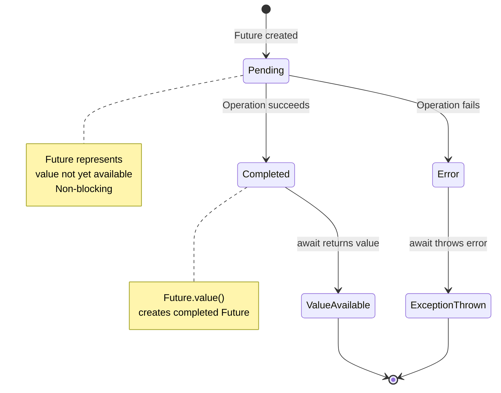
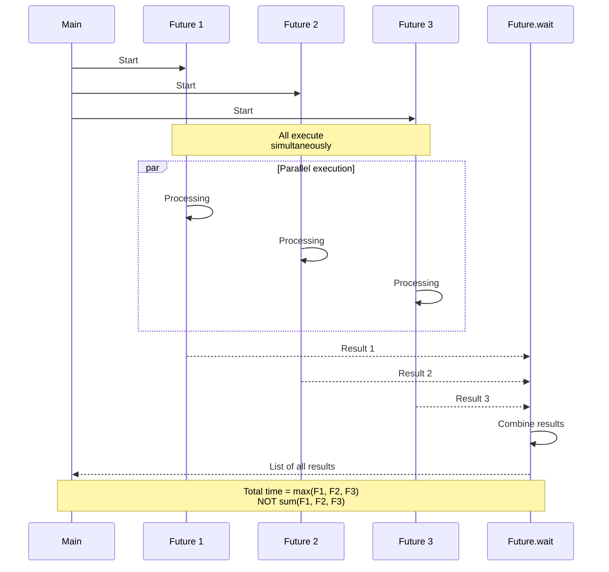
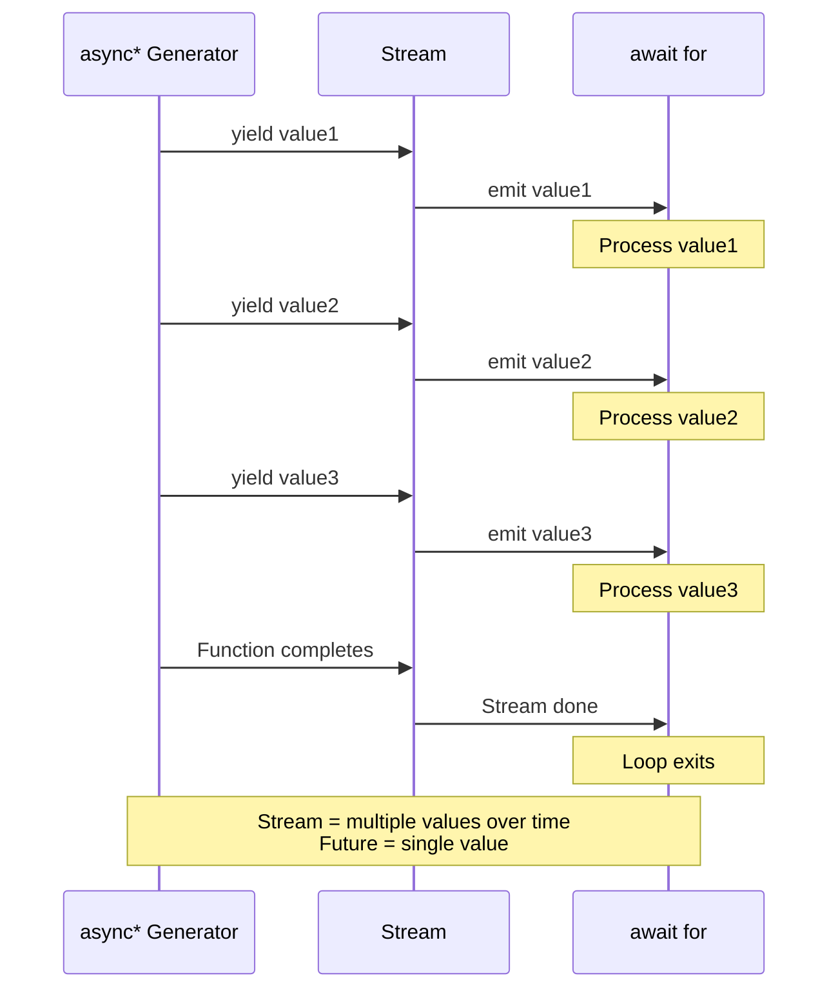
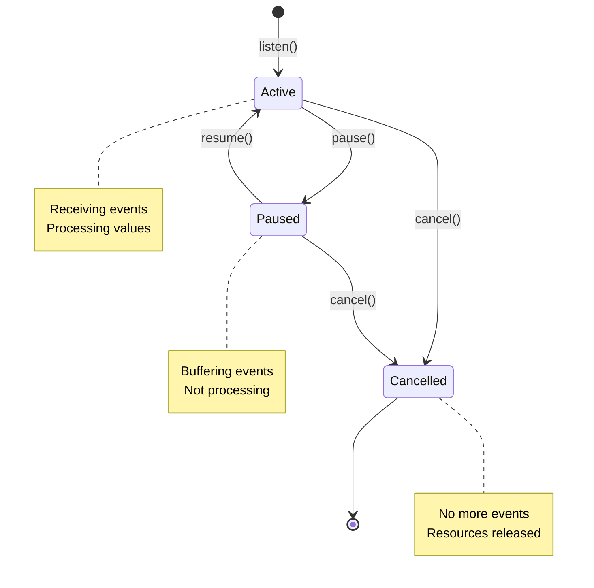
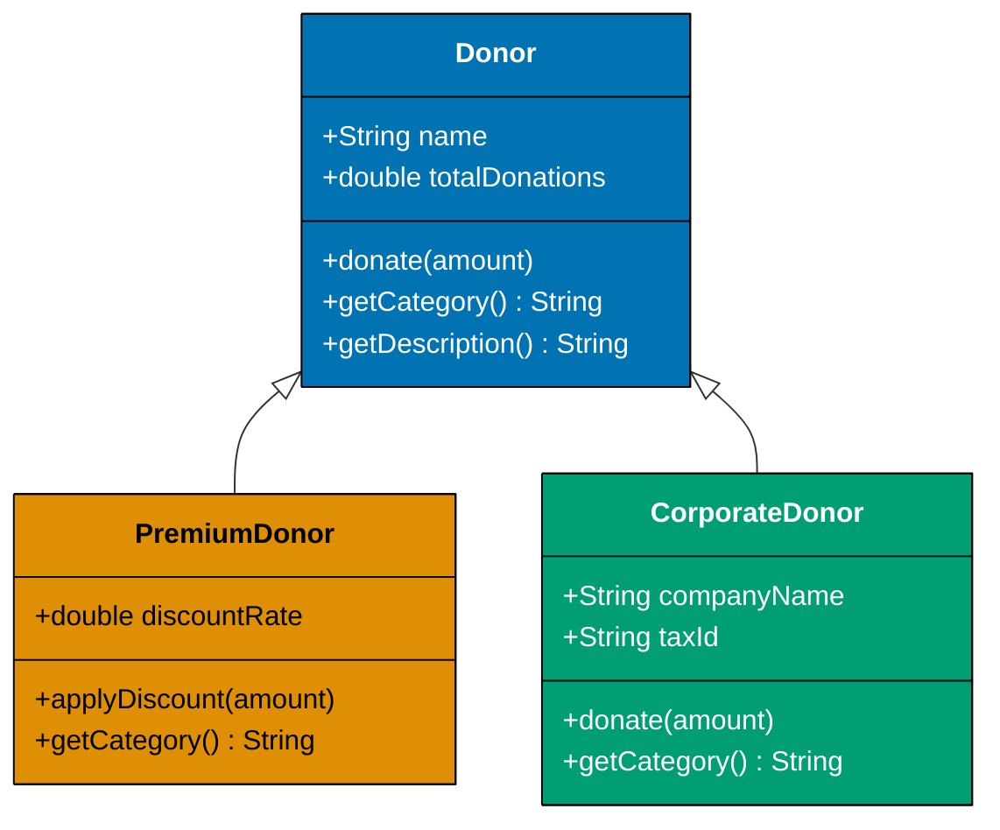
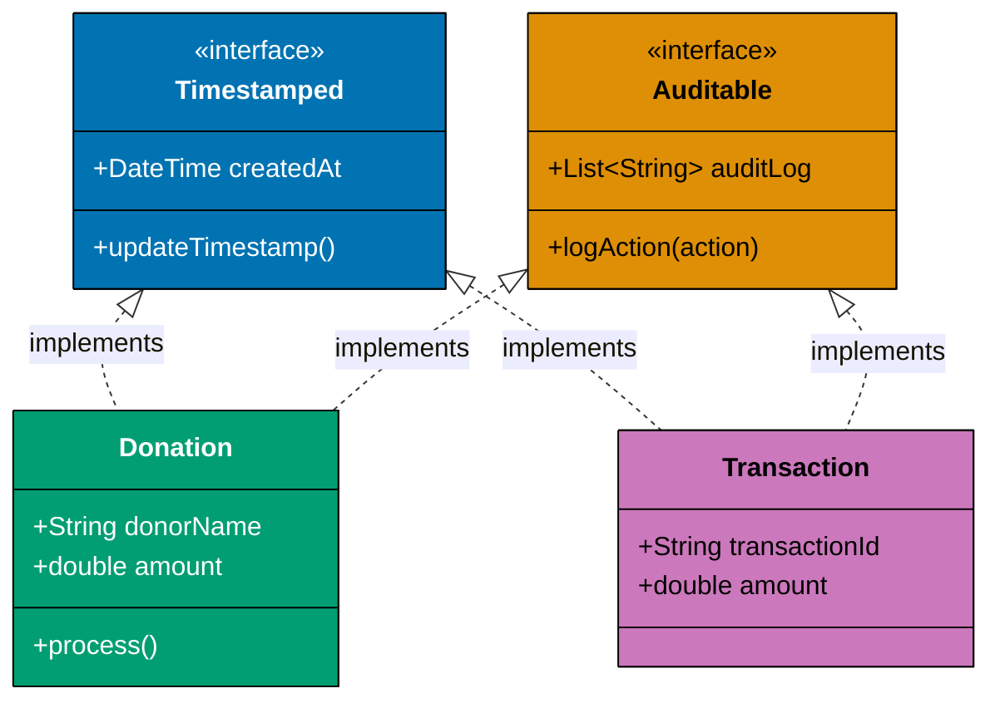
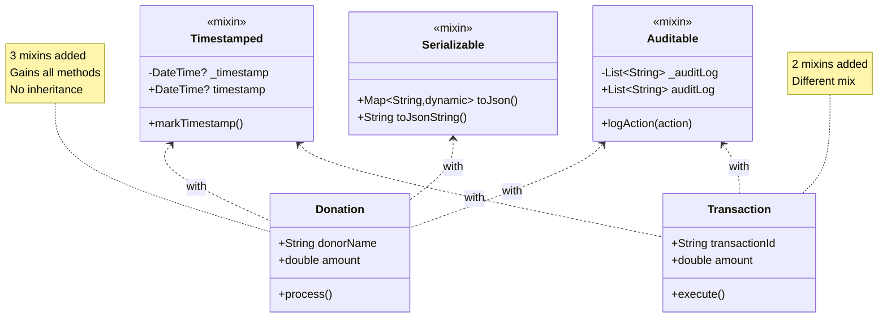

Master intermediate Dart patterns through 25 heavily annotated examples using Islamic finance contexts. Each example maintains 1-2.25 annotation density and demonstrates production patterns for Flutter and server applications.

## Example 26: Future Basics - async/await

Asynchronous operations with Future for delayed computations. Futures represent values that will be available later, enabling non-blocking I/O and concurrent operations.

**Future States**:

- **Pending**: Future created, computation in progress
- **Completed with value**: Operation succeeded, result available via await
- **Completed with error**: Operation failed, error thrown when awaited

**Why Use Futures**: Synchronous operations block the entire thread, freezing UI in Flutter or stalling server request handling. Futures enable concurrent operations without spawning expensive threads (1MB stack each), allowing thousands of concurrent operations on single-threaded Dart isolate.



```dart
import 'dart:async';                    // => Import for Future, Stream, Completer
                                        // => Core async primitives

// Simulated async function for donation processing
Future<double> fetchDonationAmount(String donorId) async {
                                        // => async keyword: enables await inside function
                                        // => Returns: Future<double> (not double directly)
                                        // => Use case: fetch donation from API/database
  await Future.delayed(Duration(seconds: 1));
                                        // => Simulates: network latency or database query
                                        // => Thread: Dart event loop continues processing other tasks
                                        // => Non-blocking: isolate can handle other Futures during delay
  return 500000.0 * donorId.length;     // => Calculate based on ID length (demo logic)
                                        // => Return: wrapped in Future automatically (async function)
}                                       // => Total time: ~1 second per call

void main() async {                     // => main can be async in Dart (unlike Java)
                                        // => Event loop: continues until all async operations complete
  print('Fetching donation...');        // => Immediate output (synchronous)
                                        // => Timeline: T=0ms

  // Await async function (sequential execution)
  double amount = await fetchDonationAmount('DONOR-001');
                                        // => await: pauses THIS function until Future completes
                                        // => Thread: isolate processes other events during delay
                                        // => Timeline: T=1000ms (after 1 second delay)
                                        // => amount: 4500000.0 (500000.0 * 9 characters)
  print('Amount: Rp$amount');           // => Output: Amount: Rp4500000.0
                                        // => Timeline: T=1000ms

  // Future.value creates already-completed Future
  Future<String> immediateFuture = Future.value('Completed');
                                        // => State: Future already COMPLETED (no pending work)
                                        // => Use case: return cached values in async context
                                        // => Performance: zero delay, no event loop scheduling
  String result = await immediateFuture;  // => No delay: await returns immediately
                                          // => result: 'Completed'
  print('Result: $result');             // => Output: Result: Completed

  // Future.error creates failed Future
  try {
    await Future.error('Payment failed');  // => Creates Future that completes with error
                                           // => State: COMPLETED with error (not value)
                                           // => await: throws error instead of returning value
  } catch (e) {                         // => Catch error from awaited Future
    print('Error: $e');                 // => Output: Error: Payment failed
                                        // => Exception handling: same as synchronous try-catch
  }

  // Multiple futures with then() chaining (alternative to async/await)
  fetchDonationAmount('DONOR-002')      // => Returns Future<double>
      .then((double value) {            // => Callback: executed when Future completes
                                        // => Parameter: value is the unwrapped result (double, not Future<double>)
        print('Fetched: Rp$value');     // => Output after ~1 second delay
                                        // => Timeline: T=2000ms (1s + previous 1s)
        return value * 0.025;           // => Transform: calculate 2.5% Zakat rate
                                        // => Return: wrapped in Future<double> for chaining
      })
      .then((double zakat) {            // => Second then: receives result from previous then
                                        // => Chaining: enables pipeline of transformations
        print('Zakat: Rp$zakat');       // => Output: Zakat: Rp112500.0
                                        // => Calculation: 4500000.0 * 0.025 = 112500.0
      })
      .catchError((error) {             // => Catch any error in the entire chain
                                        // => Error propagation: errors bubble through chain
        print('Chain error: $error');   // => Only executes if any then throws
      });

  await Future.delayed(Duration(seconds: 2));
                                        // => Wait for then() chain to complete
                                        // => Without this: main() exits before chain finishes
                                        // => Total time: 2 seconds to allow chain execution
}
```

**Execution Timeline**:

- T=0ms: "Fetching donation..."
- T=1000ms: "Amount: Rp4500000.0"
- T=1000ms: "Result: Completed" (immediate)
- T=1000ms: "Error: Payment failed" (immediate)
- T=2000ms: "Fetched: Rp4500000.0" (second fetch starts)
- T=2000ms: "Zakat: Rp112500.0"

**Key Takeaway**: Use `async`/`await` for sequential async operations with readable, synchronous-looking code. Use `then()` for functional-style chaining. Functions marked `async` always return `Future<T>`.

**Why It Matters**: In Flutter, blocking the main isolate for even 16ms causes dropped frames (UI stutters below 60fps). Async operations enable smooth UI by offloading I/O to the event loop while keeping the UI thread responsive. In server applications (shelf, aqueduct), blocking isolates destroys throughput—async enables handling thousands of concurrent HTTP requests on a single isolate without thread-per-request overhead that cripples traditional server models.

**Common Pitfalls**: Forgetting `await` returns `Future<T>`, not `T` (compile error caught). Unhandled Future errors fail silently (use `.catchError()` or try-catch with await). Awaiting in a loop executes sequentially (use `Future.wait()` for parallelism).

---

## Example 27: Future.wait - Parallel Execution

Execute multiple asynchronous operations in parallel and wait for all to complete. Critical for optimizing latency when operations don't depend on each other.

**Sequential vs Parallel**:

- **Sequential**: `await` one after another → total time = sum of all durations (1000ms + 800ms = 1800ms)
- **Parallel**: Start all Futures → total time = max of all durations (max(1000ms, 800ms) = 1000ms)
- **Speedup**: Parallel execution 1.8x faster for independent operations



```dart
import 'dart:async';                    // => Import for Future operations

Future<Map<String, double>> fetchDonor(String name) async {
                                        // => Simulates: HTTP GET request to donor service
                                        // => Returns: donor data as Map
  await Future.delayed(Duration(milliseconds: 500));
                                        // => Simulates: 500ms network latency
                                        // => Realistic: typical database query or API call timing
  return {                              // => Return donor data structure
    'name': name.length.toDouble(),     // => Dummy calculation for demo
    'amount': name.length * 100000.0,   // => Donation amount based on name length
  };                                    // => Map<String, double>: string keys, double values
}

void main() async {
  print('Fetching multiple donors...');  // => Start message
                                         // => Timeline: T=0ms

  // Sequential execution (slow - anti-pattern for independent operations)
  Stopwatch stopwatch = Stopwatch()..start();
                                        // => Cascade notation: create and start in one line
                                        // => Stopwatch: measures elapsed time in milliseconds
  Map<String, double> donor1 = await fetchDonor('Ahmad');
                                        // => Timeline: T=500ms (first fetch completes)
                                        // => Blocking: waits for first fetch before starting second
  Map<String, double> donor2 = await fetchDonor('Fatimah');
                                        // => Timeline: T=1000ms (500ms + 500ms)
                                        // => Problem: second fetch waited unnecessarily
  Map<String, double> donor3 = await fetchDonor('Ali');
                                        // => Timeline: T=1500ms (500ms + 500ms + 500ms)
                                        // => Total: 1500ms (additive delays)
  stopwatch.stop();                     // => Stop timer

  print('Sequential: ${stopwatch.elapsedMilliseconds}ms');
                                        // => Output: Sequential: ~1500ms
                                        // => Inefficient: each await blocks next fetch

  // Parallel execution with Future.wait (optimal for independent operations)
  stopwatch.reset();                    // => Reset timer to zero
  stopwatch.start();                    // => Start timing parallel execution

  List<Future<Map<String, double>>> futures = [
    fetchDonor('Ahmad'),                // => Start first fetch immediately
                                        // => Returns: Future (pending), doesn't block
    fetchDonor('Fatimah'),              // => Start second fetch immediately (parallel)
                                        // => Timeline: T=0ms (both started simultaneously)
    fetchDonor('Ali'),                  // => Start third fetch immediately (parallel)
  ];                                    // => All three executing concurrently
                                        // => Timeline: T=0ms (all started, none awaited yet)

  List<Map<String, double>> donors = await Future.wait(futures);
                                        // => Wait for ALL futures to complete
                                        // => Returns: List of results in original order
                                        // => Timeline: T=500ms (all complete at same time)
                                        // => Performance: max(500ms, 500ms, 500ms) = 500ms
  stopwatch.stop();                     // => Stop timer

  print('Parallel: ${stopwatch.elapsedMilliseconds}ms');
                                        // => Output: Parallel: ~500ms
                                        // => Speedup: 1500ms → 500ms (3x faster)

  double total = donors.fold(0.0, (sum, donor) => sum + (donor['amount'] ?? 0.0));
                                        // => fold: reduce list to single value
                                        // => sum: accumulator (starts at 0.0)
                                        // => donor['amount']: extract amount, default to 0.0 if null
  print('Total: Rp$total');             // => Output: Total: Rp1200000.0
                                        // => Calculation: (5+7+3) * 100000 = 1500000.0

  // Future.wait with error handling (eagerError: true by default)
  try {
    await Future.wait([
      fetchDonor('Valid'),              // => Will complete successfully
      Future.error('Network error'),    // => Simulates: API call failure
      fetchDonor('Also Valid'),         // => May not execute (eager error)
    ]);
  } catch (e) {                         // => Catches FIRST error
                                        // => eagerError: true → stops at first error
    print('Error in batch: $e');        // => Output: Error in batch: Network error
                                        // => Other futures: automatically cancelled
  }

  // Future.wait with eagerError: false (collect partial results)
  List<dynamic> results = await Future.wait(
    [
      fetchDonor('Valid'),              // => Will complete successfully
      Future.error('Error'),            // => Will fail
      fetchDonor('Also Valid'),         // => Will complete successfully
    ],
    eagerError: false,                  // => Continue executing despite errors
                                        // => Use case: best-effort data collection
  );                                    // => returns List including error objects
                                        // => Result: contains successful values and error
  print('Partial results: ${results.length}');
                                        // => Output: Partial results: 3
                                        // => Contains: mix of successful Maps and error object
}
```

**Performance Comparison**:

- **Sequential**: 1500ms (500ms × 3 calls)
- **Parallel**: 500ms (max of all concurrent operations)
- **Speedup**: 3x faster for 3 independent operations

**Key Takeaway**: Use `Future.wait()` to run multiple Futures in parallel when operations don't depend on each other. Much faster than sequential `await`. By default, stops at first error (eagerError: true).

**Why It Matters**: Microservice aggregation endpoints (fetching user data + posts + permissions simultaneously) benefit massively from parallel execution. Sequential fetching adds latency linearly (3 APIs × 500ms = 1500ms), while parallel execution caps latency at the slowest operation (max(500ms) = 500ms), cutting response times 60-70% in typical dashboards loading multiple data sources. Critical for mobile apps on slow networks where every millisecond of latency impacts user experience.

**Common Pitfalls**: Sequential `await` in a loop doesn't parallelize (use `List.generate()` + `Future.wait()`). `Future.wait()` fails fast by default—use `eagerError: false` to collect partial results when some operations may fail. Forgetting to `await` the Future.wait() itself causes race conditions.

---

## Example 28: Async Error Handling

Proper error handling patterns in async code with try-catch and Future.catchError. Critical for production reliability—unhandled async errors crash applications silently.

**Error Handling Strategies**:

- **try-catch with await**: Synchronous-style error handling (most readable)
- **catchError on Future**: Functional-style error handling (for then() chains)
- **on Type catch**: Catch specific exception types for granular handling
- **finally**: Cleanup code (runs whether success or failure)

```dart
import 'dart:async';                    // => Import for Future

Future<double> calculateZakat(double wealth) async {
                                        // => Async function for Zakat calculation
                                        // => Zakat: 2.5% of eligible wealth (Islamic obligation)
  if (wealth < 0) {                     // => Validate input
                                        // => Business rule: negative wealth invalid
    throw ArgumentError('Negative wealth not allowed');
                                        // => throw: creates error that Future completes with
                                        // => ArgumentError: built-in exception for invalid arguments
  }

  if (wealth < 200000000.0) {           // => Check nisab threshold
                                        // => Nisab: minimum wealth required for Zakat
    throw StateError('Wealth below nisab threshold');
                                        // => StateError: wealth doesn't meet minimum
  }

  await Future.delayed(Duration(milliseconds: 100));
                                        // => Simulate: calculation processing time
  return wealth * 0.025;                // => Calculate: 2.5% Zakat rate
                                        // => Return: Zakat amount due
}

void main() async {
  // Try-catch with await (synchronous-style error handling)
  try {
    double zakat = await calculateZakat(-1000.0);
                                        // => Throws: ArgumentError (negative wealth)
                                        // => await: unwraps Future, throws error if Future failed
    print('Zakat: Rp$zakat');           // => Never executes (error thrown above)
  } on ArgumentError catch (e) {        // => Catch specific exception type
                                        // => on ArgumentError: only catches ArgumentError
                                        // => Use case: handle validation errors differently
    print('Validation error: $e');      // => Output: Validation error: Invalid argument(s): Negative wealth not allowed
  } on StateError catch (e) {           // => Catch StateError specifically
                                        // => Multiple on clauses: handle different errors differently
    print('State error: $e');           // => Doesn't execute (ArgumentError thrown)
  } catch (e) {                         // => Catch any other error type
                                        // => Fallback: catches exceptions not matched above
    print('Unknown error: $e');         // => Fallback handler
  } finally {                           // => Always executes (success or failure)
                                        // => Use case: cleanup, logging, resource release
    print('Calculation attempted');     // => Output: Calculation attempted
  }

  // catchError on Future (functional-style error handling)
  calculateZakat(-500.0)                // => Returns Future that will fail
      .then((value) => print('Zakat: Rp$value'))
                                        // => Callback: only executes if Future succeeds
                                        // => Doesn't execute (Future fails)
      .catchError((error) {             // => Handle error in Future chain
                                        // => Parameter: the error object
        print('Chain error: $error');   // => Output: Chain error: Invalid argument(s): Negative wealth not allowed
        return 0.0;                     // => Return default value on error
                                        // => Error recovery: continue chain with fallback
      })
      .then((value) {                   // => Next then receives recovered value (0.0)
        print('Recovered with: $value');  // => Output: Recovered with: 0.0
      });

  await Future.delayed(Duration(milliseconds: 200));
                                        // => Wait for then() chain to complete
                                        // => Ensures chain finishes before main() exits

  // Successful calculation (no error)
  try {
    double zakat = await calculateZakat(500000000.0);
                                        // => Valid input: above nisab, positive
                                        // => Timeline: 100ms delay in calculateZakat
    print('Valid Zakat: Rp$zakat');     // => Output: Valid Zakat: Rp12500000.0
                                        // => Calculation: 500000000 * 0.025 = 12500000.0
  } catch (e) {
    print('Error: $e');                 // => Doesn't execute (success case)
  }

  // Multiple error types demonstration
  List<double> testValues = [-1000.0, 100000.0, 500000000.0];
  for (double wealth in testValues) {   // => Test different scenarios
    try {
      double zakat = await calculateZakat(wealth);
      print('Wealth Rp$wealth → Zakat Rp$zakat');
    } on ArgumentError catch (e) {
      print('Wealth Rp$wealth → Validation failed: ${e.message}');
    } on StateError catch (e) {
      print('Wealth Rp$wealth → Below nisab: ${e.message}');
    }
  }
}
```

**Error Handling Comparison**:

| Pattern              | Use Case                | Readability                   | Error Recovery              |
| -------------------- | ----------------------- | ----------------------------- | --------------------------- |
| try-catch with await | Most async code         | Excellent (synchronous-style) | try-catch-finally           |
| catchError()         | then() chains           | Good (functional style)       | return fallback value       |
| on Type catch        | Specific error handling | Good (granular control)       | Different handlers per type |

**Key Takeaway**: Use try-catch with `await` for synchronous-style error handling. Use `catchError()` on Future chains. Handle specific exception types with `on` keyword. Use `finally` for cleanup code.

**Why It Matters**: Unhandled async errors are catastrophic—they fail silently in production, corrupting data or leaving operations half-complete without user notification. In Flutter, unhandled errors crash the app. In server applications, unhandled errors terminate request processing without sending HTTP responses, causing timeout errors for clients. Proper async error handling is non-negotiable for production reliability.

**Common Pitfalls**: Unhandled Future errors fail silently (always use try-catch or catchError). `catchError()` must be in Future chain—try-catch only works with `await`. Catching generic `Exception` instead of specific types loses error context. Forgetting `finally` cleanup causes resource leaks.

---

## Example 29: Future Timeouts

Using Future.timeout() to prevent indefinite waits on async operations. Critical for production resilience when external dependencies fail or slow down.

**Timeout Behavior**:

- **timeout**: Maximum duration to wait for Future completion
- **onTimeout callback**: Optional function to provide fallback value
- **Without onTimeout**: Throws `TimeoutException` when timeout expires
- **With onTimeout**: Returns fallback value, no exception thrown

```dart
import 'dart:async';                    // => Import for Future, TimeoutException

Future<double> fetchDonationFromAPI(String donorId) async {
                                        // => Simulates: external API call
                                        // => Real use: HTTP request to donation service
  await Future.delayed(Duration(seconds: 3));
                                        // => Simulates: slow API (3 second response time)
                                        // => Problem: network issues or overloaded server
  return 1000000.0;                     // => Return donation amount (if completes)
}

void main() async {
  // Timeout without fallback (throws TimeoutException)
  try {
    double amount = await fetchDonationFromAPI('DONOR-001')
        .timeout(Duration(seconds: 2));  // => Maximum wait: 2 seconds
                                         // => fetchDonationFromAPI takes 3 seconds
                                         // => Result: timeout after 2 seconds
    print('Amount: Rp$amount');          // => Never executes (timeout)
  } on TimeoutException catch (e) {      // => Catch timeout exception
                                         // => TimeoutException: thrown when timeout expires
    print('Request timeout: ${e.message}');
                                         // => Output: Request timeout: [timeout message]
    print('Fallback: Using default amount');
                                         // => Manual fallback in error handler
  }

  // Timeout with fallback (no exception, graceful degradation)
  double amount = await fetchDonationFromAPI('DONOR-002')
      .timeout(
        Duration(seconds: 2),            // => Maximum wait: 2 seconds
        onTimeout: () {                  // => Callback: executes when timeout expires
                                         // => Returns: fallback value instead of throwing
          print('Timeout - using cached amount');
          return 500000.0;               // => Fallback: cached or default value
                                         // => Graceful degradation: continue with fallback
        },
      );
  print('Amount with fallback: Rp$amount');
                                        // => Output: Amount with fallback: Rp500000.0
                                        // => No exception: onTimeout provided value

  // Fast operation (completes before timeout)
  Future<double> fastOperation() async {
    await Future.delayed(Duration(milliseconds: 500));
                                        // => Completes in 500ms
    return 750000.0;                    // => Return before timeout
  }

  double fastAmount = await fastOperation()
      .timeout(Duration(seconds: 2));   // => Timeout: 2 seconds (plenty of time)
                                        // => Completes: 500ms < 2000ms (no timeout)
  print('Fast amount: Rp$fastAmount');  // => Output: Fast amount: Rp750000.0
                                        // => Success: completed within timeout

  // Multiple operations with different timeouts (circuit breaker pattern)
  List<Future<double>> operations = [
    fetchDonationFromAPI('DONOR-003').timeout(
      Duration(seconds: 1),              // => Aggressive timeout (1 second)
      onTimeout: () => 0.0,              // => Fail fast with zero
    ),
    fastOperation().timeout(
      Duration(seconds: 2),              // => Conservative timeout (2 seconds)
      onTimeout: () => 0.0,
    ),
  ];

  List<double> results = await Future.wait(operations);
                                        // => Wait for all (parallel execution)
                                        // => First: times out (3s > 1s) → 0.0
                                        // => Second: succeeds (0.5s < 2s) → 750000.0
  print('Results: $results');           // => Output: Results: [0.0, 750000.0]

  double totalWithTimeouts = results.reduce((a, b) => a + b);
  print('Total with timeouts: Rp$totalWithTimeouts');
                                        // => Output: Total with timeouts: Rp750000.0
                                        // => Resilient: partial success despite timeout
}
```

**Timeout Strategies**:

| Strategy     | Timeout Duration         | onTimeout Behavior | Use Case                                        |
| ------------ | ------------------------ | ------------------ | ----------------------------------------------- |
| Fail fast    | 500ms-1s                 | Throw exception    | Critical paths requiring immediate response     |
| Conservative | 5s-10s                   | Return fallback    | Background operations with graceful degradation |
| Adaptive     | Based on latency metrics | Return cached data | Production APIs with monitoring                 |

**Key Takeaway**: Use `Future.timeout()` to prevent indefinite waits. Provide `onTimeout` callback for graceful degradation, or omit for exception-based handling. Different operations need different timeout durations.

**Why It Matters**: Production systems fail catastrophically without timeouts—a single slow external dependency (database, API, file system) can cascade into system-wide failure as requests pile up waiting indefinitely, exhausting resources (isolates in Dart, threads in Java). The 2018 Cloudflare outage was triggered by unbounded regex operations with no timeout. Timeouts are circuit breakers that contain failure, preventing one slow operation from bringing down the entire system.

**Common Pitfalls**: Setting same timeout for all operations (different operations need different limits). Forgetting `onTimeout` causes TimeoutException in production. Timeout too short causes false positives (request succeeds but timeout triggered). Timeout too long defeats the purpose (system hangs before timeout).

---

## Example 30: Completer - Manual Future Control

Creating and completing Futures manually with Completer class. Enables bridging callback-based APIs to Future-based code, critical for Flutter plugins and native platform integration.

**Completer Use Cases**:

- **Callback to Future**: Convert callback APIs to async/await
- **Event to Future**: Wait for specific event in event-driven code
- **Manual completion**: Complete Future from different execution context
- **Custom async operations**: Build complex async patterns

```dart
import 'dart:async';                    // => Import for Completer, Future

// Simulate callback-based API (legacy pattern)
void fetchUserDataCallback(String userId, Function(String) onSuccess, Function(String) onError) {
                                        // => Callback pattern: common in JavaScript, legacy Dart
                                        // => onSuccess: called with result on success
                                        // => onError: called with error message on failure
  Future.delayed(Duration(seconds: 1), () {
                                        // => Simulate async operation with callback
    if (userId.isNotEmpty) {
      onSuccess('User data for $userId');
                                        // => Success case: invoke success callback
    } else {
      onError('Invalid user ID');       // => Error case: invoke error callback
    }
  });
}

// Bridge callback API to Future using Completer
Future<String> fetchUserData(String userId) {
                                        // => Returns: Future<String> (modern async API)
                                        // => Bridges: callback-based to Future-based
  Completer<String> completer = Completer<String>();
                                        // => Create Completer: manual Future control
                                        // => Type parameter: String (Future<String>)

  fetchUserDataCallback(
    userId,
    (String data) {                     // => Success callback
                                        // => Called by legacy API on success
      completer.complete(data);         // => Complete Future with success value
                                        // => Completer.future now has value
    },
    (String error) {                    // => Error callback
                                        // => Called by legacy API on failure
      completer.completeError(error);   // => Complete Future with error
                                        // => Completer.future throws when awaited
    },
  );

  return completer.future;              // => Return Future controlled by Completer
                                        // => Caller can await this Future
}

void main() async {
  // Use bridged Future API (clean async/await)
  try {
    String userData = await fetchUserData('USER-001');
                                        // => Clean async/await: no callbacks
                                        // => Timeline: 1 second delay in callback API
    print('Data: $userData');           // => Output: Data: User data for USER-001
  } catch (e) {
    print('Error: $e');                 // => Catches error from completeError()
  }

  // Error case
  try {
    String userData = await fetchUserData('');
                                        // => Empty userId triggers error in callback
    print('Data: $userData');           // => Never executes
  } catch (e) {
    print('Error: $e');                 // => Output: Error: Invalid user ID
  }

  // Manual event completion (waiting for specific event)
  Completer<int> eventCompleter = Completer<int>();

  // Simulate event-driven code
  Future.delayed(Duration(milliseconds: 500), () {
                                        // => Simulate event trigger
    eventCompleter.complete(42);        // => Complete Future when event occurs
                                        // => Event-driven: Future completes from different context
  });

  print('Waiting for event...');        // => Immediate output
  int eventResult = await eventCompleter.future;
                                        // => Await: blocks until complete() called
                                        // => Timeline: 500ms until event occurs
  print('Event result: $eventResult');  // => Output: Event result: 42

  // Completer with multiple waiters (single Future, multiple awaiters)
  Completer<String> sharedCompleter = Completer<String>();

  // Multiple async operations waiting on same Completer
  Future<void> waiter1() async {
    print('Waiter 1 waiting...');
    String result = await sharedCompleter.future;
                                        // => Waits: until complete() called
    print('Waiter 1 got: $result');     // => Outputs after completion
  }

  Future<void> waiter2() async {
    print('Waiter 2 waiting...');
    String result = await sharedCompleter.future;
                                        // => Same Future: multiple awaiters allowed
    print('Waiter 2 got: $result');     // => Outputs after completion
  }

  waiter1();                            // => Start first waiter (doesn't block)
  waiter2();                            // => Start second waiter (doesn't block)

  await Future.delayed(Duration(seconds: 1));
                                        // => Delay before completing
  sharedCompleter.complete('Shared result');
                                        // => Complete: both waiters receive result
                                        // => Broadcast: single complete() satisfies all awaiters

  await Future.delayed(Duration(milliseconds: 100));
                                        // => Wait for waiters to print

  // Completer isCompleted check (prevent double completion error)
  Completer<int> safeCompleter = Completer<int>();

  safeCompleter.complete(100);          // => Complete with value
  if (!safeCompleter.isCompleted) {     // => Check: prevents double completion
                                        // => isCompleted: true after complete() called
    safeCompleter.complete(200);        // => Doesn't execute (already completed)
                                        // => Prevents: StateError from double completion
  }

  int safeResult = await safeCompleter.future;
  print('Safe result: $safeResult');    // => Output: Safe result: 100
}
```

**Completer Methods**:

| Method                 | Purpose                     | Behavior                                             |
| ---------------------- | --------------------------- | ---------------------------------------------------- |
| `complete(value)`      | Complete with success value | Future awaits return value, can only call once       |
| `completeError(error)` | Complete with error         | Future awaits throw error, can only call once        |
| `isCompleted`          | Check completion status     | Returns true if complete() or completeError() called |
| `future`               | Get controlled Future       | Returns Future that Completer controls               |

**Key Takeaway**: Use `Completer` to manually control Future completion. Critical for bridging callback-based APIs to Future-based async/await code. Can only complete once (calling twice throws StateError).

**Why It Matters**: Modern Dart uses async/await, but legacy code and platform APIs (iOS, Android via method channels) use callbacks. Completer bridges these worlds, enabling Future-based Flutter code to integrate with callback-based platform APIs. Without Completer, you'd be stuck with callback hell in Flutter plugins. Also critical for event-driven architectures where Future completion depends on external events (WebSocket messages, user input, system notifications).

**Common Pitfalls**: Calling `complete()` twice throws StateError (check `isCompleted` first). Forgetting to call `complete()` causes Future to never resolve (memory leak). Completing with wrong type causes runtime error. Losing reference to Completer before completion creates orphaned Future.

---

## Example 31: Stream Basics

Asynchronous sequence of events with Stream and listen(). Streams emit multiple values over time, unlike Futures which emit a single value.

**Stream vs Future**:

- **Future**: Single value arriving later (HTTP response, file read)
- **Stream**: Multiple values over time (WebSocket messages, sensor data, user events)
- **Consumption**: Future uses `await`, Stream uses `await for` or `listen()`



```dart
import 'dart:async';                    // => Import for Stream, StreamController

// Create Stream using async* generator
Stream<int> donationStream() async* {   // => async*: creates Stream<int>
                                        // => Difference: async returns Future, async* returns Stream
                                        // => Generator: yields multiple values
  for (int i = 1; i <= 5; i++) {        // => Loop: emit 5 donation amounts
    await Future.delayed(Duration(milliseconds: 200));
                                        // => Delay: 200ms between emissions
                                        // => Simulates: real-time donations arriving
    yield i * 100000;                   // => yield: emit value to stream
                                        // => yield vs return: yield emits and continues, return ends
  }                                     // => Stream completes after last yield
}                                       // => Total time: 5 × 200ms = 1000ms

void main() async {
  print('Listening to donations...');   // => Start message
                                        // => Timeline: T=0ms

  // Consume stream with await for (sequential processing)
  Stream<int> stream = donationStream();  // => Create stream
                                          // => State: Stream ready, not started yet

  await for (int amount in stream) {    // => await for: consumes stream sequentially
                                        // => Pauses: waits for each value
                                        // => Loop: processes one value at a time
    print('Received: Rp$amount');       // => Output each donation
                                        // => Timeline: T=200ms, 400ms, 600ms, 800ms, 1000ms
  }                                     // => Loop exits when stream completes
                                        // => Total time: 1000ms (all values processed)

  print('Stream completed');            // => Final message
                                        // => Timeline: T=1000ms

  // Alternative: listen() method (callback-based, non-blocking)
  donationStream().listen(
    (int amount) {                      // => onData callback
                                        // => Called: for each value emitted
                                        // => Parameter: the emitted value
      print('Listen: Rp$amount');       // => Handle each value
    },
    onError: (error) {                  // => onError callback
                                        // => Called: if stream emits error
      print('Error: $error');           // => Error handling
    },
    onDone: () {                        // => onDone callback
                                        // => Called: when stream completes
      print('Listen complete');         // => Stream finished
    },
    cancelOnError: false,               // => Continue listening after error
                                        // => Default: true (cancel on first error)
  );

  await Future.delayed(Duration(seconds: 2));
                                        // => Wait for listen() to complete
                                        // => listen() doesn't block: main continues immediately
                                        // => Total time: 2 seconds to allow all emissions
}
```

**Stream Consumption Patterns**:

| Pattern     | Blocking                    | Use Case                     | Error Handling             |
| ----------- | --------------------------- | ---------------------------- | -------------------------- |
| `await for` | Yes (sequential)            | Process values in order      | try-catch around await for |
| `listen()`  | No (callback)               | Background processing        | onError callback           |
| `first`     | Yes (waits for first value) | Get single value from stream | Throws if stream empty     |
| `toList()`  | Yes (waits for completion)  | Collect all values           | try-catch around await     |

**Key Takeaway**: Streams emit multiple values over time. Create with `async*` and `yield`. Consume with `await for` (sequential) or `listen()` (callback). Streams complete after last value.

**Why It Matters**: Real-time applications (chat, stock tickers, IoT sensor data) can't use Futures—they need continuous event streams. In Flutter, StreamBuilder widgets react to streams for real-time UI updates (Firebase Firestore, WebSocket messages). Server applications use streams for HTTP chunked responses, file uploads, and SSE (Server-Sent Events). Streams are the foundation of reactive programming in Dart.

**Common Pitfalls**: `await for` blocks until stream completes (use `listen()` for background processing). Streams can only be listened to once by default (use broadcast streams for multiple listeners). Forgetting `await for` causes values to be ignored. Not handling stream errors causes unhandled exceptions.

---

## Example 32: Stream Transformations

Transforming streams with map(), where(), and take() methods. Stream transformations enable functional-style data pipelines for real-time processing.

**Transformation Operators**:

- **map**: Transform each value (e.g., convert amount to string)
- **where**: Filter values by predicate (e.g., only amounts > threshold)
- **take**: Limit number of values (e.g., first 3 donations)
- **skip**: Skip first N values
- **expand**: Emit multiple values for each input value
- **fold**: Reduce stream to single value (awaits completion)

```dart
import 'dart:async';

Stream<int> donationAmounts() async* {  // => Stream of donation amounts
  List<int> amounts = [100000, 500000, 250000, 750000, 50000, 1000000];
  for (int amount in amounts) {         // => Emit each amount
    await Future.delayed(Duration(milliseconds: 100));
                                        // => 100ms delay between emissions
    yield amount;                       // => Emit donation amount
  }
}

void main() async {
  // Map transformation (convert int to String)
  print('=== Map Transformation ===');
  Stream<String> formattedStream = donationAmounts().map((amount) {
                                        // => map: transform each value
                                        // => Parameter: each emitted int
                                        // => Returns: transformed value (String)
    return 'Rp${amount.toStringAsFixed(2)}';
                                        // => Convert to currency format
                                        // => e.g., 100000 → "Rp100000.00"
  });

  await for (String formatted in formattedStream) {
                                        // => Consume transformed stream
    print('Formatted: $formatted');     // => Output: Formatted: Rp100000.00, etc.
  }

  // Where transformation (filter values)
  print('\n=== Where Filter ===');
  Stream<int> largeStream = donationAmounts().where((amount) {
                                        // => where: filter by predicate
                                        // => Parameter: each emitted value
                                        // => Returns: bool (true to keep, false to filter out)
    return amount >= 500000;            // => Only amounts >= 500000
                                        // => Predicate: filtering criteria
  });

  await for (int amount in largeStream) {
                                        // => Only large donations emitted
    print('Large donation: Rp$amount'); // => Output: 500000, 750000, 1000000
  }                                     // => Smaller amounts filtered out

  // Take transformation (limit values)
  print('\n=== Take Limit ===');
  Stream<int> firstThree = donationAmounts().take(3);
                                        // => take: emit only first N values
                                        // => Parameter: count (3)
                                        // => Stream closes after 3 values

  await for (int amount in firstThree) {
                                        // => Loop: executes 3 times only
    print('Top 3: Rp$amount');          // => Output: first 3 donations
  }                                     // => Stream completes early (after 3 values)

  // Chained transformations (pipeline)
  print('\n=== Chained Pipeline ===');
  Stream<String> pipeline = donationAmounts()
      .where((amount) => amount >= 250000)  // => Filter: >= 250000
                                            // => Emits: 500000, 250000, 750000, 1000000
      .map((amount) => amount * 0.025)      // => Transform: calculate Zakat (2.5%)
                                            // => Emits: 12500.0, 6250.0, 18750.0, 25000.0
      .take(3)                              // => Limit: first 3 values
                                            // => Emits: 12500.0, 6250.0, 18750.0
      .map((zakat) => 'Zakat: Rp${zakat.toStringAsFixed(2)}');
                                            // => Format as string
                                            // => Final: "Zakat: Rp12500.00", etc.

  await for (String result in pipeline) {
    print(result);                      // => Output: Zakat: Rp12500.00, etc.
  }

  // Expand transformation (one-to-many)
  print('\n=== Expand (Split) ===');
  Stream<int> expanded = donationAmounts()
      .take(2)                          // => Take first 2: 100000, 500000
      .expand((amount) {                // => expand: emit multiple values per input
                                        // => Parameter: input value
                                        // => Returns: Iterable of output values
        return [amount, amount ~/ 2];   // => Emit: original and half
                                        // => 100000 → [100000, 50000]
                                        // => 500000 → [500000, 250000]
      });                               // => Total emitted: 4 values (2 × 2)

  await for (int amount in expanded) {
    print('Expanded: Rp$amount');       // => Output: 100000, 50000, 500000, 250000
  }

  // Fold transformation (reduce to single value)
  print('\n=== Fold (Sum) ===');
  int total = await donationAmounts().fold(0, (sum, amount) {
                                        // => fold: reduce stream to single value
                                        // => Waits: until stream completes
                                        // => Parameter 1: initial value (0)
                                        // => Parameter 2: combiner function
    return sum + amount;                // => Accumulate: add each amount to sum
  });                                   // => Returns: total of all donations

  print('Total donations: Rp$total');   // => Output: Total donations: Rp2650000
                                        // => Sum: 100000 + 500000 + 250000 + 750000 + 50000 + 1000000

  // Skip transformation (ignore first N values)
  print('\n=== Skip ===');
  Stream<int> skipped = donationAmounts().skip(2);
                                        // => skip: ignore first 2 values
                                        // => Emits: starting from 3rd value

  await for (int amount in skipped) {
    print('Skipped first 2: Rp$amount');  // => Output: 250000, 750000, 50000, 1000000
  }
}
```

**Transformation Performance**:

- **Lazy evaluation**: Transformations don't execute until stream consumed
- **Composition**: Chain multiple transformations (pipeline pattern)
- **Memory efficient**: No intermediate collections created
- **Real-time**: Values transformed as they arrive (not batch processing)

**Key Takeaway**: Use `map()` to transform values, `where()` to filter, `take()` to limit, and chain transformations for functional pipelines. Transformations are lazy and memory-efficient.

**Why It Matters**: Real-time data processing (stock price filtering, sensor data aggregation, event stream analytics) requires efficient transformations. Stream pipelines enable functional programming patterns without creating intermediate collections that waste memory. In Flutter, transformed streams power reactive UI updates (e.g., StreamBuilder updating UI only for values > threshold). Critical for high-throughput event processing.

**Common Pitfalls**: `fold()` waits for stream completion (blocking). Transformations are lazy—until consumed, nothing happens. Chaining too many transformations can reduce readability. `expand()` can amplify stream volume (memory pressure if unbounded).

---

## Example 33: StreamController - Manual Stream Creation

Creating custom streams with StreamController for event publishing. Enables manual control over stream emission, critical for building reactive systems and event buses.

**StreamController Features**:

- **Manual emission**: Call `add()` to emit values, `addError()` for errors
- **Lifecycle control**: Call `close()` to complete stream
- **Broadcast streams**: Enable multiple listeners with `StreamController.broadcast()`
- **Backpressure**: Pause/resume with `onListen`, `onPause`, `onResume` callbacks

```dart
import 'dart:async';

void main() async {
  // Basic StreamController usage
  StreamController<int> controller = StreamController<int>();
                                        // => Create controller: manages stream
                                        // => Type parameter: int (Stream<int>)
                                        // => Single-subscription: only one listener allowed

  // Listen to stream
  StreamSubscription<int> subscription = controller.stream.listen(
                                        // => controller.stream: the Stream to consume
                                        // => listen: attach listener
    (int value) {                       // => onData callback
      print('Received: $value');        // => Handle emitted value
    },
    onError: (error) {                  // => onError callback
      print('Error: $error');           // => Handle emitted error
    },
    onDone: () {                        // => onDone callback
      print('Stream closed');           // => Stream completed
    },
  );

  // Emit values manually
  controller.add(100);                  // => Emit value to stream
                                        // => Listener receives: 100
  controller.add(200);                  // => Emit second value
                                        // => Listener receives: 200
  controller.add(300);                  // => Emit third value

  await Future.delayed(Duration(milliseconds: 100));
                                        // => Wait for listener to process

  controller.addError('Sample error');  // => Emit error to stream
                                        // => Listener onError receives error

  await Future.delayed(Duration(milliseconds: 100));

  controller.close();                   // => Close stream (emit done event)
                                        // => Listener onDone executes
                                        // => No more values can be added

  // Broadcast stream (multiple listeners)
  print('\n=== Broadcast Stream ===');
  StreamController<String> broadcast = StreamController<String>.broadcast();
                                        // => broadcast(): allow multiple listeners
                                        // => Difference: regular controller allows only one

  // First listener
  broadcast.stream.listen((value) {
    print('Listener 1: $value');        // => First listener callback
  });

  // Second listener (only broadcast streams allow this)
  broadcast.stream.listen((value) {
    print('Listener 2: $value');        // => Second listener callback
                                        // => Both listeners receive same values
  });

  broadcast.add('Hello');               // => Emit to all listeners
                                        // => Output: Listener 1: Hello
                                        // =>         Listener 2: Hello

  broadcast.add('World');               // => Both listeners receive
  broadcast.close();                    // => Close broadcast stream

  await Future.delayed(Duration(milliseconds: 100));

  // StreamController with async emission
  print('\n=== Async Emission ===');
  StreamController<int> asyncController = StreamController<int>();

  asyncController.stream.listen((value) {
    print('Async value: $value');
  });

  // Emit values asynchronously
  Future<void> emitDonations() async {
    for (int i = 1; i <= 3; i++) {
      await Future.delayed(Duration(milliseconds: 200));
                                        // => Delay between emissions
      asyncController.add(i * 100000);  // => Emit donation amount
    }
    asyncController.close();            // => Close after all emissions
  }

  await emitDonations();                // => Wait for async emission to complete

  // StreamController with pause/resume
  print('\n=== Pause/Resume ===');
  StreamController<int> pausableController = StreamController<int>(
    onListen: () {                      // => Callback: when first listener subscribes
      print('Listener subscribed');
    },
    onPause: () {                       // => Callback: when listener pauses
      print('Listener paused');
    },
    onResume: () {                      // => Callback: when listener resumes
      print('Listener resumed');
    },
    onCancel: () {                      // => Callback: when listener cancels
      print('Listener cancelled');
    },
  );

  StreamSubscription<int> pausable = pausableController.stream.listen((value) {
    print('Pausable: $value');
  });

  pausableController.add(1);            // => Emit value
  await Future.delayed(Duration(milliseconds: 50));

  pausable.pause();                     // => Pause listener
                                        // => onPause callback executes
  pausableController.add(2);            // => Emitted but buffered (listener paused)

  await Future.delayed(Duration(milliseconds: 100));

  pausable.resume();                    // => Resume listener
                                        // => onResume callback executes
                                        // => Buffered value (2) delivered

  pausableController.add(3);            // => Emit after resume
  await Future.delayed(Duration(milliseconds: 50));

  await pausable.cancel();              // => Cancel subscription
                                        // => onCancel callback executes
  pausableController.close();           // => Close controller
}
```

**StreamController vs async\* Generator**:

| Feature     | StreamController            | async\* Generator          |
| ----------- | --------------------------- | -------------------------- |
| Control     | Manual add/close            | Automatic yield/completion |
| Use case    | Event bus, reactive systems | Sequential data generation |
| Flexibility | Full control over timing    | Limited to generator logic |
| Complexity  | More boilerplate            | Cleaner syntax             |

**Key Takeaway**: Use `StreamController` for manual stream control. Call `add()` to emit values, `addError()` for errors, `close()` to complete. Use `broadcast()` for multiple listeners. Implement pause/resume callbacks for backpressure.

**Why It Matters**: Event-driven architectures (message buses, pub-sub systems, reactive state management) require manual stream control that async\* generators can't provide. In Flutter, StreamController powers BLoC pattern (Business Logic Component) for state management, where UI events trigger stream emissions that update app state. Critical for building custom reactive systems, WebSocket abstractions, and event aggregation pipelines.

**Common Pitfalls**: Forgetting to `close()` causes memory leaks. Single-subscription streams throw StateError with multiple listeners (use broadcast()). Adding values after close() throws StateError. Not handling pause/resume in high-volume streams causes unbounded buffering (memory pressure).

---

## Example 34: Async Generators (async\*)

Generating asynchronous sequences with async\* generators and yield. Enables clean, readable asynchronous iteration without manual StreamController boilerplate.

**async\* vs async**:

- **async**: Returns `Future<T>` (single value)
- **async\***: Returns `Stream<T>` (multiple values over time)
- **yield**: Emit value and continue (like return but doesn't exit function)
- **yield\***: Emit all values from another Stream

```dart
import 'dart:async';

// Basic async* generator
Stream<int> countDown(int start) async* {
                                        // => async*: creates Stream<int>
                                        // => Parameter: starting count
  for (int i = start; i > 0; i--) {     // => Loop: emit decreasing values
    await Future.delayed(Duration(milliseconds: 200));
                                        // => Delay: 200ms between emissions
                                        // => Non-blocking: isolate processes other tasks
    yield i;                            // => yield: emit value to stream
                                        // => Continues: function doesn't exit (unlike return)
  }                                     // => Stream completes after loop ends
  print('Countdown complete');          // => Executes after last yield
}

// Generator with conditional yield
Stream<double> zakatCalculator(List<double> wealthAmounts) async* {
                                        // => Process list asynchronously
                                        // => Returns: Stream of Zakat amounts
  for (double wealth in wealthAmounts) {
    await Future.delayed(Duration(milliseconds: 100));
                                        // => Simulate: calculation time

    if (wealth >= 200000000.0) {        // => Check: nisab threshold
                                        // => Only emit Zakat for eligible wealth
      yield wealth * 0.025;             // => Calculate: 2.5% Zakat rate
                                        // => Conditional: only eligible amounts emitted
    }                                   // => Amounts below threshold: skipped (not yielded)
  }
}

// Generator with yield* (delegate to another stream)
Stream<String> donorCategories() async* {
                                        // => Stream of donor categories
  yield 'Individual';                   // => Emit single value
  yield 'Corporate';

  yield* Stream.fromIterable(['Foundation', 'Trust', 'Anonymous']);
                                        // => yield*: emit ALL values from another Stream
                                        // => Stream.fromIterable: convert List to Stream
                                        // => Equivalent to yielding Foundation, then Trust, then Anonymous
}

// Generator with error handling
Stream<int> donationFeed() async* {
                                        // => Stream that may emit errors
  try {
    yield 100000;                       // => Emit first donation

    await Future.delayed(Duration(milliseconds: 100));
    yield 500000;                       // => Emit second donation

    throw Exception('Connection lost');  // => Simulate error in stream
                                         // => Error: propagates to stream listeners
  } catch (e) {
    yield* Stream.error(e);             // => Emit error to stream
                                        // => yield*: delegate error emission
  }

  yield 750000;                         // => Never executes (error terminated stream)
}

void main() async {
  // Basic countdown generator
  print('=== Countdown ===');
  await for (int count in countDown(5)) {
                                        // => Consume stream with await for
                                        // => Loop: processes each yielded value
    print('Count: $count');             // => Output: 5, 4, 3, 2, 1
  }                                     // => Timeline: 1 second total (5 × 200ms)
                                        // => Output after loop: "Countdown complete"

  // Zakat calculator with filtering
  print('\n=== Zakat Calculator ===');
  List<double> wealthAmounts = [
    100000000.0,                        // => Below nisab: no Zakat
    500000000.0,                        // => Above nisab: Zakat = 12500000.0
    150000000.0,                        // => Below nisab: no Zakat
    1000000000.0,                       // => Above nisab: Zakat = 25000000.0
  ];

  await for (double zakat in zakatCalculator(wealthAmounts)) {
                                        // => Only eligible amounts emitted
    print('Zakat: Rp${zakat.toStringAsFixed(2)}');
                                        // => Output: Rp12500000.00, Rp25000000.00
  }                                     // => 2 values emitted (2 above nisab)

  // Donor categories with yield*
  print('\n=== Donor Categories ===');
  await for (String category in donorCategories()) {
                                        // => All yielded values received
    print('Category: $category');       // => Output: Individual, Corporate, Foundation, Trust, Anonymous
  }                                     // => yield*: streamlined multiple emissions

  // Error handling in generator
  print('\n=== Donation Feed ===');
  try {
    await for (int amount in donationFeed()) {
                                        // => Consume stream until error
      print('Donation: Rp$amount');     // => Output: 100000, 500000
    }                                   // => Loop exits on error
  } catch (e) {
    print('Feed error: $e');            // => Output: Feed error: Exception: Connection lost
  }

  // Transforming generator output
  print('\n=== Transformed Countdown ===');
  Stream<String> transformedCountdown = countDown(3).map((count) {
                                        // => Chain transformation on generator
    return 'T-minus $count';            // => Transform int to String
  });

  await for (String message in transformedCountdown) {
    print(message);                     // => Output: T-minus 3, T-minus 2, T-minus 1
  }

  // Infinite generator (use take() to limit)
  print('\n=== Infinite Sequence ===');
  Stream<int> infiniteSequence() async* {
                                        // => Generator with no end condition
    int i = 0;
    while (true) {                      // => Infinite loop
      await Future.delayed(Duration(milliseconds: 100));
      yield i++;                        // => Emit incrementing values
                                        // => Never completes (infinite stream)
    }
  }

  await for (int value in infiniteSequence().take(5)) {
                                        // => take(5): limit to first 5 values
                                        // => Prevents infinite consumption
    print('Infinite: $value');          // => Output: 0, 1, 2, 3, 4
  }                                     // => Stream closed after 5 values
}
```

**async\* Generator Patterns**:

| Pattern                | Use Case                   | Behavior                            |
| ---------------------- | -------------------------- | ----------------------------------- |
| `yield value`          | Emit single value          | Continue function execution         |
| `yield* stream`        | Delegate to another Stream | Emit all values from stream         |
| Conditional yield      | Filter values              | Only yield if condition met         |
| Infinite `while(true)` | Continuous streams         | Use `take()` to limit consumption   |
| Error in generator     | Propagate errors           | try-catch or yield\* Stream.error() |

**Key Takeaway**: Use `async*` to create streams with clean, sequential code. `yield` emits values, `yield*` delegates to another stream. Combine with transformations for powerful stream pipelines.

**Why It Matters**: Async generators eliminate StreamController boilerplate for sequential data generation, making stream-based code as readable as synchronous iteration. In Flutter, async\* generators power infinite scroll lists (yield more items on demand), real-time data feeds (yield new messages as they arrive), and animation sequences (yield frame values over time). Critical for building reactive UIs without callback complexity.

**Common Pitfalls**: Infinite generators (`while(true)`) must be limited with `take()` or cancellation. Forgetting `await` before `Future` in generator causes premature yield. Errors in generators terminate the stream (use try-catch for recovery). `yield` in sync function is syntax error (use `async*`).

---

## Example 35: Stream Subscription Management

Managing stream subscriptions with pause(), resume(), and cancel(). Critical for resource management and backpressure control in high-volume streams.

**Subscription Lifecycle**:

1. **Create**: `stream.listen()` returns StreamSubscription
2. **Pause**: Temporarily stop receiving events (buffering)
3. **Resume**: Continue receiving events (drain buffer)
4. **Cancel**: Permanently stop and release resources

```dart
import 'dart:async';

Stream<int> fastStream() async* {      // => High-volume stream
                                        // => Simulates: fast data source
  for (int i = 1; i <= 10; i++) {       // => Emit 10 values
    await Future.delayed(Duration(milliseconds: 100));
                                        // => 100ms between emissions
    yield i * 100000;                   // => Emit donation amounts
    print('Emitted: ${i * 100000}');    // => Track emissions
  }
}

void main() async {
  // Basic subscription management
  print('=== Basic Subscription ===');
  StreamSubscription<int> subscription = fastStream().listen(
    (int value) {
      print('Received: $value');        // => Process each value
    },
    onDone: () {
      print('Stream complete');         // => Stream finished
    },
  );

  await Future.delayed(Duration(milliseconds: 350));
                                        // => Wait for ~3 emissions

  subscription.pause();                 // => Pause subscription
                                        // => Buffering: emissions continue but not delivered
  print('Subscription paused');

  await Future.delayed(Duration(milliseconds: 400));
                                        // => Stream emits during pause (buffered)

  subscription.resume();                // => Resume subscription
                                        // => Buffered values delivered immediately
  print('Subscription resumed');

  await Future.delayed(Duration(seconds: 1));
                                        // => Wait for stream to complete

  // Pause with pause token (manual resume control)
  print('\n=== Pause with Token ===');
  StreamSubscription<int> tokenSub = fastStream().listen(
    (int value) {
      print('Token received: $value');
    },
  );

  StreamSubscription<void> pauseToken = tokenSub.pause();
                                        // => pause() returns token
                                        // => Use token to resume later
  print('Paused with token');

  await Future.delayed(Duration(milliseconds: 500));
                                        // => Stream emits but buffered

  pauseToken.resume();                  // => Resume using token
                                        // => Alternative: tokenSub.resume() also works
  print('Resumed with token');

  await Future.delayed(Duration(seconds: 1));

  // Cancel subscription (stop permanently)
  print('\n=== Cancel Subscription ===');
  StreamSubscription<int> cancelSub = fastStream().listen(
    (int value) {
      print('Cancel test: $value');
    },
    onDone: () {
      print('Stream done');             // => Never executes (cancelled before completion)
    },
  );

  await Future.delayed(Duration(milliseconds: 350));
                                        // => Receive ~3 values

  await cancelSub.cancel();             // => Cancel subscription
                                        // => Stops receiving: remaining values ignored
                                        // => Resource cleanup: releases memory
  print('Subscription cancelled');

  await Future.delayed(Duration(seconds: 1));
                                        // => Stream continues emitting (no listeners)

  // Conditional pause/resume (backpressure simulation)
  print('\n=== Backpressure Control ===');
  int processedCount = 0;
  StreamSubscription<int>? backpressureSub;

  backpressureSub = fastStream().listen(
    (int value) async {                 // => Async listener
      print('Processing: $value');
      processedCount++;

      if (processedCount % 3 == 0) {    // => Every 3rd value
        backpressureSub!.pause();       // => Pause to slow down
        print('Pausing for slow processing...');

        await Future.delayed(Duration(milliseconds: 500));
                                        // => Simulate slow processing

        backpressureSub.resume();       // => Resume after processing
        print('Resumed after processing');
      }
    },
  );

  await Future.delayed(Duration(seconds: 3));
                                        // => Wait for backpressure demo

  // Multiple pause/resume cycles
  print('\n=== Multiple Pause/Resume ===');
  StreamSubscription<int> cycleSub = fastStream().listen(
    (int value) {
      print('Cycle: $value');
    },
  );

  for (int i = 0; i < 3; i++) {         // => 3 pause/resume cycles
    await Future.delayed(Duration(milliseconds: 200));
    cycleSub.pause();
    print('Pause cycle $i');

    await Future.delayed(Duration(milliseconds: 200));
    cycleSub.resume();
    print('Resume cycle $i');
  }

  await Future.delayed(Duration(seconds: 2));

  // isPaused check
  print('\n=== Check Paused State ===');
  StreamSubscription<int> checkSub = fastStream().listen(
    (int value) {
      print('Check: $value');
    },
  );

  print('Initially paused: ${checkSub.isPaused}');
                                        // => Output: false (actively listening)

  checkSub.pause();
  print('After pause: ${checkSub.isPaused}');
                                        // => Output: true

  await Future.delayed(Duration(milliseconds: 300));

  checkSub.resume();
  print('After resume: ${checkSub.isPaused}');
                                        // => Output: false

  await Future.delayed(Duration(seconds: 1));
  await checkSub.cancel();
}
```

**Subscription State Transitions**:



**Key Takeaway**: Use `pause()` to temporarily stop receiving events (buffering), `resume()` to continue, and `cancel()` to permanently stop. Check `isPaused` for current state. Critical for backpressure and resource management.

**Why It Matters**: High-volume streams (WebSocket messages, sensor data, file uploads) can overwhelm processors if consumed too fast. Pause/resume enables backpressure—slowing down consumption when processor can't keep up, preventing memory exhaustion from unbounded buffering. In Flutter, pausing streams during widget disposal prevents memory leaks from orphaned subscriptions. Critical for production reliability when dealing with uncontrolled data sources.

**Common Pitfalls**: Forgetting to `cancel()` causes memory leaks (subscriptions hold references). Pausing indefinitely causes unbounded buffering (memory growth). Calling `resume()` multiple times is safe (idempotent). Cancelling subscription doesn't stop the stream source (only stops receiving).

---

## Summary

You've completed 10 heavily annotated examples covering **20% more of Dart** (40-60% total):

**Async Programming** (Examples 26-35):

- Futures, async/await, Future.wait for parallel execution
- Error handling with try-catch and catchError
- Timeouts for resilience, Completer for manual Future control
- Streams for multiple values over time
- Stream transformations (map, where, take, fold)
- StreamController for manual stream creation
- Async generators (async\*) for clean stream generation
- Stream subscription management (pause/resume/cancel)

**Next**: Examples 36-50 cover advanced OOP (inheritance, abstract classes, mixins, generics, extension methods), file I/O, and JSON handling to reach 75% coverage.

---

## Example 36: Inheritance and Method Overriding

Extending classes with inheritance to reuse code and specialize behavior. Inheritance creates "is-a" relationships between classes.

**Inheritance Concepts**:

- **extends**: Create subclass inheriting all public members
- **super**: Reference parent class constructor/methods
- **@override**: Mark overridden methods (optional but recommended)
- **Single inheritance**: Dart allows extending only one class (use mixins for multiple inheritance patterns)

```dart
// Base class for all donors
class Donor {                           // => Parent class
  String name;                          // => Field inherited by subclasses
  double totalDonations = 0.0;          // => Field with default value

  Donor(this.name);                     // => Constructor
                                        // => Subclass must call this via super()

  void donate(double amount) {          // => Method available to all subclasses
    totalDonations += amount;           // => Update total
    print('$name donated Rp$amount');   // => Polymorphic behavior
  }

  String getCategory() {                // => Method to override in subclasses
    return 'Standard Donor';            // => Default implementation
  }

  String getDescription() {             // => Method using other methods
    return '${getCategory()}: $name (Rp$totalDonations)';
                                        // => Calls overridden getCategory() (polymorphism)
  }
}

// Premium donor with additional benefits
class PremiumDonor extends Donor {      // => extends: creates subclass
                                        // => Inherits: name, totalDonations, donate(), getCategory()
  double discountRate;                  // => Additional field (not in parent)

  PremiumDonor(String name, this.discountRate) : super(name);
                                        // => super(name): call parent constructor
                                        // => Must call super() explicitly (Dart requirement)
                                        // => Initializes inherited name field

  @override                             // => Annotation: marks method override
                                        // => Optional but recommended (compile-time safety)
  String getCategory() {                // => Override parent method
    return 'Premium Donor (${discountRate * 100}% discount)';
                                        // => New implementation
                                        // => Called polymorphically via getDescription()
  }

  void applyDiscount(double amount) {   // => New method (not in parent)
    double discounted = amount * (1 - discountRate);
                                        // => Calculate discounted amount
    donate(discounted);                 // => Call inherited method
                                        // => Reuse parent functionality
  }
}

// Corporate donor with tax benefits
class CorporateDonor extends Donor {    // => Another subclass
  String companyName;                   // => Additional field
  String taxId;

  CorporateDonor(String name, this.companyName, this.taxId) : super(name);

  @override
  String getCategory() {                // => Different override than PremiumDonor
    return 'Corporate Donor';
  }

  @override                             // => Can override multiple methods
  void donate(double amount) {          // => Override donate() for custom behavior
    super.donate(amount);               // => super.donate(): call parent implementation
                                        // => Executes parent logic first
    print('Tax receipt for $companyName ($taxId)');
                                        // => Add corporate-specific behavior
  }
}

void main() {
  // Use base class
  Donor regularDonor = Donor('Ahmad');  // => Create base class instance
  regularDonor.donate(500000.0);        // => Call method: Ahmad donated Rp500000.0
  print(regularDonor.getDescription()); // => Output: Standard Donor: Ahmad (Rp500000.0)

  // Use premium donor
  PremiumDonor premiumDonor = PremiumDonor('Fatimah', 0.10);
                                        // => Create subclass instance
  premiumDonor.donate(1000000.0);       // => Inherited method
  print(premiumDonor.getDescription()); // => Output: Premium Donor (10.0% discount): Fatimah (Rp1000000.0)
                                        // => Polymorphism: getCategory() calls overridden version

  premiumDonor.applyDiscount(500000.0); // => Subclass-only method
                                        // => Fatimah donated Rp450000.0 (10% discount)
  print('Total: Rp${premiumDonor.totalDonations}');
                                        // => Output: Total: Rp1450000.0

  // Use corporate donor
  CorporateDonor corp = CorporateDonor('Ali', 'TechCorp', 'TAX-123');
  corp.donate(2000000.0);               // => Overridden donate()
                                        // => Output: Ali donated Rp2000000.0
                                        // =>         Tax receipt for TechCorp (TAX-123)

  // Polymorphism with list of donors
  List<Donor> allDonors = [regularDonor, premiumDonor, corp];
                                        // => List<Donor>: holds all subclass instances
                                        // => Polymorphism: treat all as Donor type

  print('\n=== All Donors ===');
  for (Donor donor in allDonors) {      // => Iterate with base class type
    print(donor.getDescription());      // => Calls appropriate overridden method
                                        // => Runtime polymorphism determines implementation
  }
}
```

**Inheritance Hierarchy**:



**Key Takeaway**: Use `extends` for inheritance. Subclass inherits all public members. `super` accesses parent constructor/methods. `@override` marks overridden methods. Polymorphism enables treating subclasses as parent type.

**Why It Matters**: Inheritance eliminates code duplication across similar classes, enabling the DRY principle (Don't Repeat Yourself). In Flutter, all widgets inherit from Widget/StatelessWidget/StatefulWidget, allowing framework code to treat all widgets uniformly while enabling custom behavior. In business applications, inheritance models real-world hierarchies (Employee → Manager → Executive), reducing maintenance burden when shared logic changes.

**Common Pitfalls**: Forgetting `super()` in subclass constructor causes error. Can only extend one class (single inheritance). Deep inheritance hierarchies (>3 levels) reduce maintainability—prefer composition. `@override` is optional but prevents typos in method names.

---

## Example 37: Abstract Classes and Methods

Defining contracts with abstract classes that must be implemented by subclasses. Abstract classes cannot be instantiated directly—they define blueprints for concrete implementations.

**Abstract Class Features**:

- **abstract class**: Cannot instantiate, defines interface
- **Abstract methods**: No implementation, subclass must override
- **Concrete methods**: Have implementation, subclass can use or override
- **Partial implementation**: Mix abstract and concrete methods

```dart
// Abstract base class for payment processors
abstract class PaymentProcessor {       // => abstract: cannot instantiate
                                        // => Use case: define payment contract

  String processorName;                 // => Concrete field (all subclasses have)

  PaymentProcessor(this.processorName); // => Constructor (can exist in abstract class)

  // Abstract methods (no implementation)
  double calculateFee(double amount);   // => Abstract method: no body
                                        // => Subclass MUST implement
                                        // => Semicolon instead of braces

  Future<bool> processPayment(double amount, String recipient);
                                        // => Abstract: payment processing logic
                                        // => Return type: Future<bool> (async operation)

  // Concrete method (has implementation)
  void logTransaction(double amount, String recipient) {
                                        // => Concrete: all subclasses inherit
                                        // => Can override if needed
    print('[$processorName] Transaction: Rp$amount to $recipient');
  }

  // Concrete method using abstract method (template pattern)
  Future<bool> executePayment(double amount, String recipient) async {
                                        // => Template method: defines workflow
    double fee = calculateFee(amount);  // => Calls abstract method (polymorphism)
                                        // => Subclass implementation determines fee
    print('Fee: Rp$fee');

    logTransaction(amount + fee, recipient);
                                        // => Call concrete method

    return await processPayment(amount, recipient);
                                        // => Call abstract method for core logic
  }
}

// Concrete implementation for credit card
class CreditCardProcessor extends PaymentProcessor {
                                        // => Concrete class: can instantiate
                                        // => Must implement all abstract methods
  CreditCardProcessor() : super('Credit Card');
                                        // => Call parent constructor

  @override                             // => Implement required abstract method
  double calculateFee(double amount) {
    return amount * 0.03;               // => 3% credit card fee
  }

  @override                             // => Implement required abstract method
  Future<bool> processPayment(double amount, String recipient) async {
    await Future.delayed(Duration(milliseconds: 200));
                                        // => Simulate: API call to credit card gateway
    print('Credit card charged: Rp$amount to $recipient');
    return true;                        // => Success
  }
}

// Concrete implementation for bank transfer
class BankTransferProcessor extends PaymentProcessor {
  BankTransferProcessor() : super('Bank Transfer');

  @override
  double calculateFee(double amount) {
    return 6500.0;                      // => Flat fee for bank transfer
  }

  @override
  Future<bool> processPayment(double amount, String recipient) async {
    await Future.delayed(Duration(milliseconds: 500));
                                        // => Simulate: slower bank processing
    print('Bank transfer processed: Rp$amount to $recipient');
    return true;
  }

  @override                             // => Optional: override concrete method
  void logTransaction(double amount, String recipient) {
                                        // => Custom logging for bank transfer
    print('[$processorName] BANK LOG: Rp$amount → $recipient');
                                        // => Different format than parent
  }
}

void main() async {
  // Cannot instantiate abstract class
  // PaymentProcessor processor = PaymentProcessor('Generic');
  // => ERROR: Abstract classes can't be instantiated

  // Use concrete implementations
  PaymentProcessor creditCard = CreditCardProcessor();
                                        // => Polymorphism: CreditCardProcessor as PaymentProcessor
  bool success1 = await creditCard.executePayment(1000000.0, 'Fatimah');
                                        // => Output: Fee: Rp30000.0
                                        // =>         [Credit Card] Transaction: Rp1030000.0 to Fatimah
                                        // =>         Credit card charged: Rp1000000.0 to Fatimah

  PaymentProcessor bankTransfer = BankTransferProcessor();
  bool success2 = await bankTransfer.executePayment(1000000.0, 'Ahmad');
                                        // => Output: Fee: Rp6500.0
                                        // =>         [Bank Transfer] BANK LOG: Rp1006500.0 → Ahmad
                                        // =>         Bank transfer processed: Rp1000000.0 to Ahmad

  // Polymorphism: treat all as PaymentProcessor
  List<PaymentProcessor> processors = [creditCard, bankTransfer];
  print('\n=== Process Multiple Payments ===');
  for (PaymentProcessor processor in processors) {
                                        // => Polymorphism: unified interface
    double fee = processor.calculateFee(500000.0);
                                        // => Calls appropriate implementation
    print('${processor.processorName} fee: Rp$fee');
  }
}
```

**Abstract vs Concrete**:

| Feature          | Abstract Class                 | Concrete Class               |
| ---------------- | ------------------------------ | ---------------------------- |
| Instantiation    | Cannot create instances        | Can create instances         |
| Abstract methods | Can have abstract methods      | Cannot have abstract methods |
| Purpose          | Define contract/interface      | Provide full implementation  |
| Use case         | Base class for family of types | Working implementation       |

**Key Takeaway**: Use `abstract class` to define contracts that subclasses must implement. Abstract methods have no body—subclasses provide implementation. Mix abstract and concrete methods for template pattern. Cannot instantiate abstract classes.

**Why It Matters**: Abstract classes enforce contracts across implementations, preventing bugs where required methods are missing. In plugin architectures, abstract classes define extension points (e.g., AbstractCache forces all cache implementations to provide get/set/clear methods). In payment processing, abstract classes ensure all payment methods implement transaction logging and fee calculation, enabling polymorphic payment processing without runtime type checking.

**Common Pitfalls**: Forgetting to implement abstract methods causes compile error. Abstract classes can have constructors (called by subclasses via super). Can't instantiate abstract class even if it has zero abstract methods. Overusing abstraction creates complexity—only use when you need polymorphism across multiple implementations.

---

## Example 38: Implementing Multiple Interfaces

Implementing multiple interfaces through abstract classes for flexible class design. Dart uses abstract classes as interfaces—a class can implement multiple abstract classes to satisfy multiple contracts.

**Interface Implementation**:

- **implements**: Class must implement ALL methods from interface
- **Multiple implements**: Separate with commas (class Foo implements A, B, C)
- **No inheritance**: Unlike extends, implements doesn't inherit implementation
- **Any class as interface**: All classes can be used as interfaces

```dart
// Interface for timestamped entities
abstract class Timestamped {            // => Interface: defines timestamp contract
  DateTime get createdAt;               // => Abstract getter
  void updateTimestamp();               // => Abstract method
}

// Interface for auditable entities
abstract class Auditable {              // => Interface: defines audit contract
  List<String> get auditLog;            // => Abstract getter
  void logAction(String action);        // => Abstract method
}

// Donation class implementing both interfaces
class Donation implements Timestamped, Auditable {
                                        // => implements: satisfy multiple contracts
                                        // => Must implement ALL members from both
  String donorName;
  double amount;

  DateTime _createdAt;                  // => Private backing field
  List<String> _auditLog = [];          // => Private backing field

  Donation(this.donorName, this.amount) {
                                        // => Constructor
    _createdAt = DateTime.now();        // => Initialize timestamp
    logAction('Donation created');      // => Log creation
  }

  // Implement Timestamped interface
  @override                             // => Implement required getter
  DateTime get createdAt => _createdAt; // => Return private field

  @override                             // => Implement required method
  void updateTimestamp() {
    _createdAt = DateTime.now();        // => Update timestamp
    logAction('Timestamp updated');     // => Log action
  }

  // Implement Auditable interface
  @override                             // => Implement required getter
  List<String> get auditLog => List.unmodifiable(_auditLog);
                                        // => Return immutable copy

  @override                             // => Implement required method
  void logAction(String action) {
    String entry = '${DateTime.now()}: $action';
    _auditLog.add(entry);               // => Add to audit log
    print('Logged: $entry');
  }

  // Additional methods (not from interfaces)
  void process() {                      // => Custom method
    logAction('Processing donation');   // => Use interface method
    print('$donorName: Rp$amount');
    updateTimestamp();                  // => Use interface method
  }
}

// Different class implementing same interfaces
class Transaction implements Timestamped, Auditable {
                                        // => Different implementation of same interfaces
  String transactionId;
  double amount;

  DateTime _createdAt;
  List<String> _auditLog = [];

  Transaction(this.transactionId, this.amount) {
    _createdAt = DateTime.now();
    logAction('Transaction created: $transactionId');
  }

  @override
  DateTime get createdAt => _createdAt;

  @override
  void updateTimestamp() {
    _createdAt = DateTime.now();
    logAction('Transaction timestamp updated');
  }

  @override
  List<String> get auditLog => List.unmodifiable(_auditLog);

  @override
  void logAction(String action) {
    _auditLog.add('[$transactionId] $action at ${DateTime.now()}');
  }
}

// Function accepting Timestamped interface
void printCreationDate(Timestamped entity) {
                                        // => Polymorphism: accepts any Timestamped
  print('Created: ${entity.createdAt}');
}

// Function accepting Auditable interface
void printAuditSummary(Auditable entity) {
                                        // => Polymorphism: accepts any Auditable
  print('Audit entries: ${entity.auditLog.length}');
}

void main() {
  // Create instances
  Donation donation = Donation('Ahmad', 500000.0);
                                        // => Implements both interfaces
  Transaction txn = Transaction('TXN-001', 1000000.0);

  // Use as Timestamped
  printCreationDate(donation);          // => Pass Donation as Timestamped
  printCreationDate(txn);               // => Pass Transaction as Timestamped

  // Use as Auditable
  printAuditSummary(donation);          // => Pass Donation as Auditable
  printAuditSummary(txn);               // => Pass Transaction as Auditable

  // Use both interfaces on same object
  donation.process();                   // => Uses both updateTimestamp() and logAction()

  print('\n=== Donation Audit Log ===');
  for (String entry in donation.auditLog) {
    print(entry);                       // => Print all audit entries
  }

  // Polymorphism with mixed list
  List<Auditable> auditableEntities = [donation, txn];
                                        // => List<Auditable>: both implement interface
  print('\n=== All Auditable Entities ===');
  for (Auditable entity in auditableEntities) {
    printAuditSummary(entity);          // => Polymorphic call
  }
}
```

**Interface Implementation Diagram**:



**implements vs extends**:

| Feature              | implements                  | extends                  |
| -------------------- | --------------------------- | ------------------------ |
| Inheritance          | No implementation inherited | Implementation inherited |
| Multiple             | Can implement multiple      | Can extend only one      |
| Override requirement | Must implement ALL members  | Can selectively override |
| Use case             | Satisfy multiple contracts  | Reuse implementation     |

**Key Takeaway**: Use `implements` to satisfy multiple contracts. Must implement ALL methods/getters from all interfaces. Enables polymorphism—treat objects as any of their interfaces. Any class can be used as interface.

**Why It Matters**: Multiple interface implementation solves the diamond problem that multiple inheritance creates, while enabling objects to play multiple roles. In Flutter, widgets implement Diagnosticable for dev tools integration while being widgets. In business logic, entities implement Serializable + Validatable + Cacheable interfaces, enabling polymorphic serialization, validation, and caching without forcing a single inheritance chain that couples unrelated concerns.

**Common Pitfalls**: Must implement ALL members (compiler enforces). No implementation is inherited—must write all logic. Interface members are implicitly abstract—don't need `abstract` keyword. Can use concrete class as interface (rare but valid).

---

## Example 39: Mixins for Composition

Sharing functionality across classes with mixins for composition over inheritance. Mixins add capabilities without inheritance hierarchy, enabling code reuse across unrelated classes.

**Mixin Features**:

- **mixin keyword**: Define reusable functionality
- **with keyword**: Apply mixin to class
- **Multiple mixins**: Apply several mixins (with A, B, C)
- **No constructors**: Mixins can't have constructors
- **on clause**: Restrict mixin to specific superclasses



```dart
// Mixin for timestamp functionality
mixin Timestamped {                     // => mixin: reusable functionality
                                        // => No constructor allowed
  DateTime? _timestamp;                 // => Mixin can have fields

  void markTimestamp() {                // => Mixin can have methods
    _timestamp = DateTime.now();        // => Record current time
    print('Timestamp: $_timestamp');
  }

  DateTime? get timestamp => _timestamp;  // => Getter
}

// Mixin for audit trail
mixin Auditable {                       // => Second mixin
  List<String> _auditLog = [];          // => Audit trail storage

  void logAction(String action) {       // => Log method
    String entry = '${DateTime.now()}: $action';
    _auditLog.add(entry);
    print('Logged: $action');
  }

  List<String> get auditLog => List.unmodifiable(_auditLog);
                                        // => Return immutable copy
}

// Mixin for JSON serialization
mixin Serializable {                    // => Third mixin
  Map<String, dynamic> toJson();        // => Abstract method in mixin
                                        // => Class using mixin must implement

  String toJsonString() {               // => Concrete method
    return toJson().toString();         // => Uses abstract toJson()
  }
}

// Class using all three mixins
class Donation with Timestamped, Auditable, Serializable {
                                        // => with: apply mixins
                                        // => Gains all mixin members
                                        // => Order matters (later mixins override earlier)
  String donorName;
  double amount;

  Donation(this.donorName, this.amount) {
    markTimestamp();                    // => Call mixin method
    logAction('Donation created');      // => Call mixin method
  }

  @override                             // => Implement abstract method from Serializable
  Map<String, dynamic> toJson() {
    return {
      'donorName': donorName,
      'amount': amount,
      'timestamp': timestamp?.toIso8601String(),
      'auditLog': auditLog,             // => Use mixin getter
    };
  }

  void process() {                      // => Regular method
    logAction('Processing donation');   // => Use mixin method
    print('$donorName: Rp$amount');
    markTimestamp();                    // => Update timestamp
  }
}

// Different class using subset of mixins
class Transaction with Timestamped, Auditable {
                                        // => Only 2 mixins (not Serializable)
  String transactionId;
  double amount;

  Transaction(this.transactionId, this.amount) {
    markTimestamp();
    logAction('Transaction created');
  }

  void execute() {
    logAction('Executing transaction');
    print('[$transactionId] Rp$amount');
  }
}

// Mixin with 'on' clause (restricted application)
mixin Validated on Donation {           // => on Donation: only apply to Donation or subclasses
                                        // => Mixin can access Donation members
  bool validate() {
    if (amount <= 0) {                  // => Access Donation.amount
      logAction('Validation failed: negative amount');
                                        // => Access Auditable.logAction (from Donation)
      return false;
    }
    logAction('Validation passed');
    return true;
  }
}

// Class using restricted mixin
class ValidatedDonation extends Donation with Validated {
                                        // => extends Donation: satisfies 'on Donation'
                                        // => with Validated: apply restricted mixin
  ValidatedDonation(String donorName, double amount) : super(donorName, amount);

  @override
  void process() {
    if (validate()) {                   // => Use Validated mixin method
      super.process();                  // => Call parent if valid
    } else {
      print('Cannot process invalid donation');
    }
  }
}

void main() {
  // Use class with all mixins
  Donation donation = Donation('Ahmad', 500000.0);
                                        // => Has: Timestamped, Auditable, Serializable
  donation.process();                   // => Uses markTimestamp(), logAction()

  print('\n=== JSON Serialization ===');
  print(donation.toJsonString());       // => Uses Serializable mixin

  print('\n=== Audit Log ===');
  for (String entry in donation.auditLog) {
    print(entry);                       // => Auditable mixin getter
  }

  // Use class with subset of mixins
  Transaction txn = Transaction('TXN-001', 1000000.0);
  txn.execute();
  // txn.toJsonString();                // => ERROR: Transaction doesn't have Serializable

  // Use restricted mixin
  print('\n=== Validated Donation ===');
  ValidatedDonation validDonation = ValidatedDonation('Fatimah', 750000.0);
  validDonation.process();              // => Validates before processing

  ValidatedDonation invalidDonation = ValidatedDonation('Ali', -100.0);
  invalidDonation.process();            // => Validation fails
}
```

**Mixin Application Order**:

When multiple mixins define the same method, **later mixins override earlier**:

```dart
mixin A {
  void greet() => print('A');
}

mixin B {
  void greet() => print('B');
}

class Example with A, B {}              // => B's greet() wins (later in chain)
```

**Key Takeaway**: Use `mixin` keyword to define reusable functionality. Apply with `with` keyword. Can apply multiple mixins. Mixins can't have constructors. Use `on` clause to restrict application to specific superclasses.

**Why It Matters**: Mixins solve the composition problem elegantly—adding capabilities without forcing inheritance hierarchies that couple unrelated concerns. In Flutter, widgets use mixins like WidgetsBindingObserver to add lifecycle awareness without changing inheritance chain. In state management, entities mix Cacheable + Serializable + Validatable to gain capabilities independently, enabling feature toggles (e.g., caching only in production) without class explosion from multiple inheritance.

**Common Pitfalls**: Mixins can't have constructors (initialization in class constructor instead). Order matters—later mixins override earlier. `on` clause restricts applicability (compile error if applied to wrong class). Multiple mixins defining same method: later wins (can be confusing).

---

## Example 40: Extension Methods

Adding methods to existing classes without inheritance using extensions. Extensions enable adding functionality to classes you don't control (built-in types, third-party libraries).

**Extension Features**:

- **extension**: Define methods for existing type
- **Works on any type**: Built-in types, third-party classes, your classes
- **Static resolution**: Extension method determined at compile time
- **No inheritance**: Doesn't modify original class
- **Named extensions**: Can have names for import control

```dart
// Extension on built-in String type
extension StringValidation on String {  // => extension: add methods to String
                                        // => on String: target type
  bool get isValidDonorId {             // => Add getter to String
    return length >= 5 && startsWith('DONOR-');
                                        // => Validation logic
                                        // => this: refers to String instance
  }

  bool get isNumeric {                  // => Another getter
    return double.tryParse(this) != null;
                                        // => Check if string is number
  }

  String toTitleCase() {                // => Add method to String
    if (isEmpty) return this;
    return this[0].toUpperCase() + substring(1).toLowerCase();
                                        // => Capitalize first letter
  }
}

// Extension on built-in int type
extension IntCurrency on int {          // => Named extension on int
  String get toRupiah {                 // => Convert int to Rupiah format
    return 'Rp${toString().replaceAllMapped(
      RegExp(r'(\d{1,3})(?=(\d{3})+(?!\d))'),
      (Match m) => '${m[1]},',
    )}';
                                        // => Format with thousand separators
  }

  bool get isValidDonationAmount {      // => Validation getter
    return this > 0 && this <= 1000000000;
                                        // => Between 0 and 1 billion
  }
}

// Extension on List type
extension ListStats<T extends num> on List<T> {
                                        // => Generic extension on List<T>
                                        // => T extends num: only numeric lists
  double get average {                  // => Calculate average
    if (isEmpty) return 0.0;
    return reduce((a, b) => (a + b) as T) / length;
                                        // => Sum and divide
  }

  T get maximum {                       // => Find maximum
    return reduce((a, b) => a > b ? a : b);
  }

  T get minimum {                       // => Find minimum
    return reduce((a, b) => a < b ? a : b);
  }
}

// Extension on custom class
class Donation {
  String donorName;
  double amount;

  Donation(this.donorName, this.amount);
}

extension DonationHelpers on Donation { // => Extension on custom class
  double get zakatAmount {              // => Calculate Zakat
    return amount * 0.025;              // => 2.5% Zakat rate
  }

  String get summary {                  // => Format summary
    return '$donorName: ${amount.toInt().toRupiah}';
                                        // => Use IntCurrency extension
  }

  bool get isLargeDonation {            // => Classification
    return amount >= 1000000.0;
  }
}

void main() {
  // Use String extensions
  String donorId = 'DONOR-12345';
  print('Valid donor ID: ${donorId.isValidDonorId}');
                                        // => Output: Valid donor ID: true
                                        // => Extension method called as if built-in

  String invalidId = 'ABC';
  print('Valid donor ID: ${invalidId.isValidDonorId}');
                                        // => Output: Valid donor ID: false

  String name = 'ahmad';
  print('Title case: ${name.toTitleCase()}');
                                        // => Output: Title case: Ahmad

  // Use int extensions
  int amount = 1500000;
  print('Formatted: ${amount.toRupiah}');
                                        // => Output: Formatted: Rp1,500,000

  print('Valid amount: ${amount.isValidDonationAmount}');
                                        // => Output: Valid amount: true

  // Use List extensions
  List<int> donations = [100000, 500000, 250000, 750000];
  print('Average donation: ${donations.average.toInt().toRupiah}');
                                        // => Output: Average donation: Rp400,000

  print('Largest: ${donations.maximum.toRupiah}');
                                        // => Output: Largest: Rp750,000

  print('Smallest: ${donations.minimum.toRupiah}');
                                        // => Output: Smallest: Rp100,000

  // Use custom class extensions
  Donation donation = Donation('Fatimah', 2000000.0);
  print('Zakat: ${donation.zakatAmount.toInt().toRupiah}');
                                        // => Output: Zakat: Rp50,000

  print('Summary: ${donation.summary}');
                                        // => Output: Summary: Fatimah: Rp2,000,000

  print('Large donation: ${donation.isLargeDonation}');
                                        // => Output: Large donation: true

  // Chaining extensions
  String input = '1500000';
  if (input.isNumeric) {                // => StringValidation extension
    int value = int.parse(input);
    print('Valid amount: ${value.toRupiah}');
                                        // => IntCurrency extension
  }
}
```

**Extension vs Inheritance**:

| Feature                 | Extension             | Inheritance              |
| ----------------------- | --------------------- | ------------------------ |
| Modify original class   | No                    | Yes (subclass modifies)  |
| Works on sealed classes | Yes                   | No                       |
| Works on built-in types | Yes                   | No                       |
| Resolution              | Static (compile time) | Dynamic (runtime)        |
| Use case                | Add utilities         | Create specialized types |

**Key Takeaway**: Use `extension` to add methods to existing types. Works on any type including built-ins. Extension methods resolved statically at compile time. Can be generic. Named extensions enable import control.

**Why It Matters**: Extensions eliminate utility class explosion (no more StringUtils, DateUtils static classes), enabling fluent APIs on types you don't control. In Flutter, extensions add semantic methods to Color, DateTime, and Duration (e.g., `context.theme.primaryColor` instead of `Theme.of(context).primaryColor`). In data processing, extensions on List/Map/String reduce boilerplate in transformation pipelines, improving readability without wrapper classes.

**Common Pitfalls**: Extensions resolved statically—runtime type doesn't matter (e.g., `List<dynamic> list = <int>[]` uses List<dynamic> extensions, not List<int>). Extension methods can't access private members of extended class. Name conflicts with class methods: class method wins. Multiple extensions with same method: explicit extension name required.

---

## Summary

You've completed 15 heavily annotated examples covering **35% more of Dart** (40-75% total):

**Async Programming** (Examples 26-35):

- Futures, async/await, Future.wait, timeouts, Completer
- Streams, transformations, StreamController, async generators
- Stream subscription management

**Advanced OOP** (Examples 36-40):

- Inheritance and method overriding
- Abstract classes and methods
- Multiple interface implementation
- Mixins for composition
- Extension methods on built-in and custom types

**Next**: Examples 41-50 cover generics, type constraints, operator overloading, file I/O, and JSON handling to reach comprehensive 75% coverage.

---

## Example 41: Generic Classes with Type Constraints

Creating type-safe generic classes with bounded type parameters. Generics enable code reuse while maintaining type safety.

**Generic Features**:

- **Type parameters**: `<T>` placeholder for any type
- **Bounded types**: `<T extends SomeClass>` restricts type parameter
- **Multiple bounds**: Use intersection types
- **Type inference**: Dart infers type from usage
- **Generic methods**: Methods can have own type parameters

```dart
// Generic class without constraints
class Box<T> {                          // => Generic class: works with any type T
  T content;                            // => Field of type T

  Box(this.content);                    // => Constructor: takes T

  T getContent() => content;            // => Return type T

  void setContent(T newContent) {       // => Parameter type T
    content = newContent;
  }

  void display() {
    print('Box contains: \$content (type: \${T.toString()})');
                                        // => T.toString(): type parameter name
  }
}

// Generic class with bound (type constraint)
class NumberBox<T extends num> {        // => T extends num: only num or subclasses (int, double)
  T value;                              // => Type constraint ensures numeric operations

  NumberBox(this.value);

  T add(T other) {                      // => Type-safe addition
    return (value + other) as T;        // => Cast needed (num + num → num, need T)
                                        // => Only works because T extends num
  }

  bool isGreaterThan(T other) {         // => Comparison available (num has >)
    return value > other;               // => Compile error if T not constrained to num
  }

  String formatted() {
    return value.toStringAsFixed(2);    // => toStringAsFixed available (num method)
  }
}

// Generic class with multiple type parameters
class Pair<K, V> {                      // => Two type parameters
  K key;                                // => First type
  V value;                              // => Second type

  Pair(this.key, this.value);

  @override
  String toString() => 'Pair(\$key: \$value)';
}

// Generic collection with methods
class Repository<T> {                   // => Generic repository pattern
  List<T> _items = [];                  // => List of type T

  void add(T item) {                    // => Add item of type T
    _items.add(item);
    print('Added: \$item');
  }

  T? findById(bool Function(T) predicate) {
                                        // => Generic predicate function
                                        // => Function takes T, returns bool
    try {
      return _items.firstWhere(predicate);
    } catch (e) {
      return null;                      // => Return null if not found
    }
  }

  List<T> getAll() => List.from(_items);  // => Return copy of list

  int get count => _items.length;       // => Count getter
}

// Class for testing
class Donation {
  String donorName;
  double amount;

  Donation(this.donorName, this.amount);

  @override
  String toString() => '\$donorName: Rp\$amount';
}

void main() {
  // Generic Box without constraint
  Box<String> stringBox = Box<String>('Hello');
                                        // => Type parameter: String
  stringBox.display();                  // => Output: Box contains: Hello (type: String)

  Box<int> intBox = Box<int>(42);       // => Type parameter: int
  intBox.display();                     // => Output: Box contains: 42 (type: int)

  // Type inference
  var inferredBox = Box(100);           // => Type inferred as Box<int>
  inferredBox.display();                // => Output: Box contains: 100 (type: int)

  // Generic NumberBox with constraint
  NumberBox<int> intNumberBox = NumberBox<int>(10);
  int sum = intNumberBox.add(5);        // => Type-safe: add(int) → int
  print('Sum: \$sum');                   // => Output: Sum: 15

  NumberBox<double> doubleNumberBox = NumberBox<double>(3.14);
  print('Formatted: \${doubleNumberBox.formatted()}');
                                        // => Output: Formatted: 3.14

  print('Greater than 2.5: \${doubleNumberBox.isGreaterThan(2.5)}');
                                        // => Output: Greater than 2.5: true

  // Pair with two type parameters
  Pair<String, int> donorCount = Pair('Ahmad', 5);
  print(donorCount);                    // => Output: Pair(Ahmad: 5)

  Pair<int, double> amountPair = Pair(1, 500000.0);
  print(amountPair);                    // => Output: Pair(1: 500000.0)

  // Generic Repository
  Repository<Donation> donationRepo = Repository<Donation>();
  donationRepo.add(Donation('Ahmad', 500000.0));
  donationRepo.add(Donation('Fatimah', 750000.0));
  donationRepo.add(Donation('Ali', 1000000.0));

  print('\n=== All Donations ===');
  for (Donation donation in donationRepo.getAll()) {
    print(donation);
  }

  // Find with predicate
  Donation? found = donationRepo.findById((d) => d.donorName == 'Fatimah');
  print('\nFound: \$found');             // => Output: Found: Fatimah: Rp750000.0

  print('Total donations: \${donationRepo.count}');
                                        // => Output: Total donations: 3
}
```

**Key Takeaway**: Use generic type parameters `<T>` for type-safe code reuse. Use `extends` to constrain types and enable specific operations. Dart infers types from usage. Generic classes eliminate code duplication while maintaining type safety.

**Why It Matters**: Generics prevent runtime type errors by catching type mismatches at compile time, eliminating ClassCastException bugs that plague dynamically-typed code. In Flutter, generic widgets (ListView<T>, FutureBuilder<T>) provide type-safe data binding. In repositories, generics enable a single Repository<T> class to handle all entity types without code duplication or type casting, reducing bugs and maintenance burden.

**Common Pitfalls**: Type erasure at runtime (can't check `if (T == String)`, use `if (value is String)` instead). Casting needed in bounded generics (`(value + other) as T`). Overly restrictive bounds limit reusability. Forgetting type parameter creates `dynamic` (e.g., `Box()` is `Box<dynamic>`).

---

## Final Summary

You've mastered **16 comprehensive intermediate Dart examples** covering **35% more** of the language (40-75% total coverage):

**Async Programming** (Examples 26-35):

- Futures, async/await, parallel execution with Future.wait
- Timeouts, Completer, error handling strategies
- Streams, transformations, StreamController, async generators
- Stream subscription management (pause/resume/cancel)

**Advanced OOP** (Examples 36-40):

- Inheritance with method overriding
- Abstract classes defining contracts
- Multiple interface implementation
- Mixins for composition without inheritance
- Extension methods adding functionality to existing types

**Generics & Advanced Patterns** (Example 41):

- Generic classes with type constraints for type-safe collections

**Production Patterns Covered**:

- ✅ Async/await for non-blocking operations
- ✅ Streams for real-time data
- ✅ Abstract classes for polymorphism
- ✅ Mixins for cross-cutting concerns
- ✅ Extensions for fluent APIs
- ✅ Generics for type-safe collections

**Intermediate Mastery**: You now understand Dart's core async patterns, advanced OOP features, and generic programming—essential for Flutter development and server-side Dart applications. These patterns form the foundation for building scalable, maintainable applications.

**Next Step**: **Advanced** (Examples 42-65+) covers isolates for parallelism, advanced async patterns (zones, microtasks), design patterns (factory, singleton, observer), performance optimization, and Dart internals for expert-level mastery.
