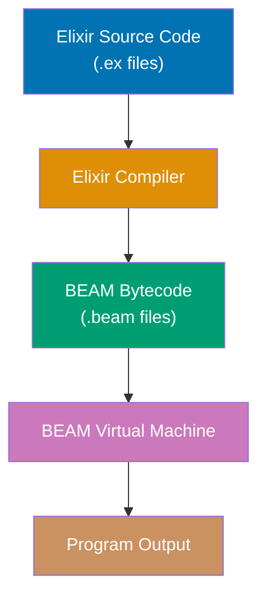
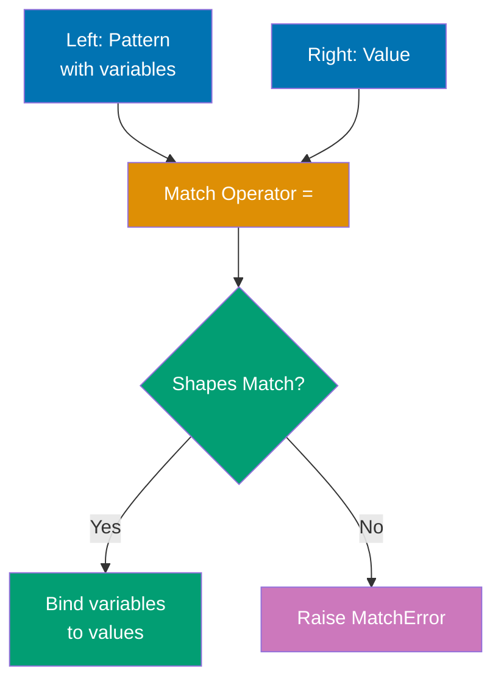
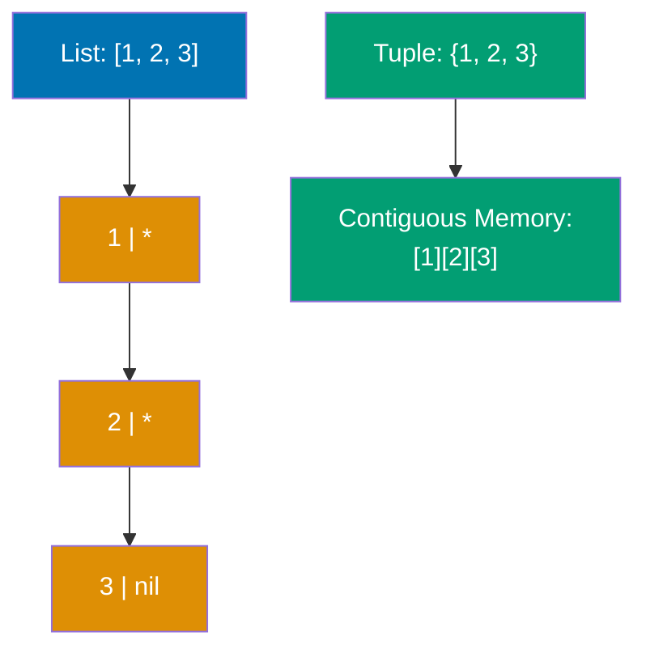
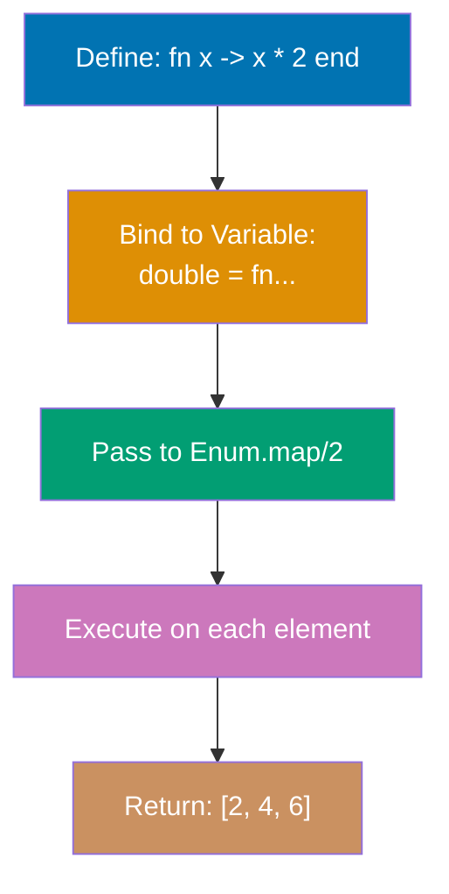
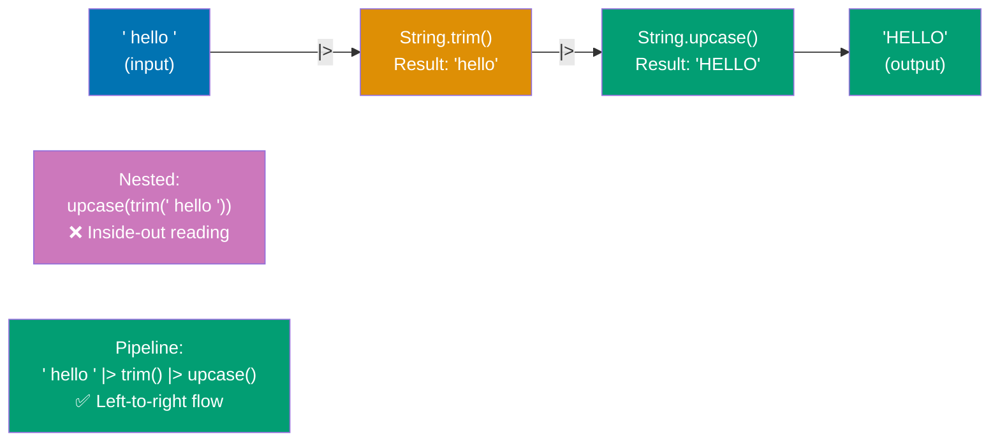
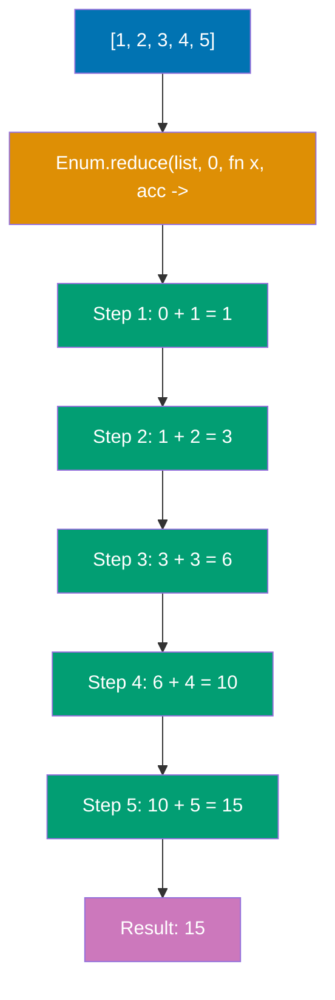
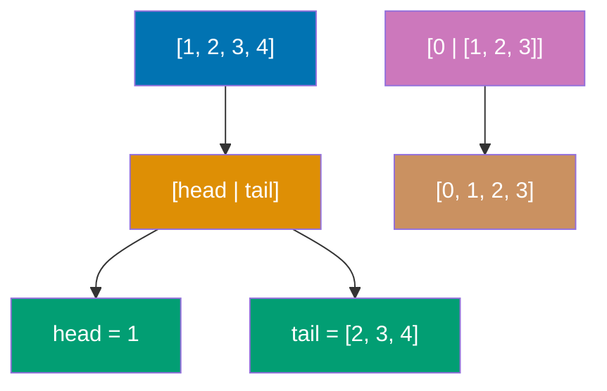

Learn Elixir fundamentals through 30 annotated code examples. Each example is self-contained, runnable in IEx, and heavily commented to show what each line does, expected outputs, and intermediate values.

## Example 1: Hello World and Basic Syntax

Elixir programs run on the BEAM virtual machine (Erlang's runtime). Code can be executed interactively in IEx or compiled from `.ex` files. This example shows the simplest Elixir program and how the compilation pipeline works.



**Code**:

```elixir
defmodule Hello do            # => Defines module named Hello
                               # => Modules group related functions
  def world do                 # => Defines public function world/0 (0 arity = no params)
                               # => Public functions callable outside module
    IO.puts("Hello, World!")   # => Calls IO.puts with string argument
                               # => Prints "Hello, World!" to stdout
                               # => Returns :ok atom (success indicator)
  end                          # => Ends function definition
end                            # => Ends module definition

Hello.world()                  # => Calls world function on Hello module
                               # => Output: Hello, World!
                               # => Returns :ok


```

**Key Takeaway**: Elixir code is organized into modules and functions. `IO.puts/1` returns `:ok` after printing, demonstrating Elixir's consistent return value pattern.

**Why It Matters**: Elixir's compilation to BEAM bytecode enables hot code swapping in production—you can upgrade running systems without downtime, a capability inherited from Erlang's telecom roots where five-nines reliability (99.999% uptime) is mandatory. The BEAM VM's preemptive scheduler ensures IO.puts never blocks other processes, allowing WhatsApp-scale systems to handle millions of concurrent connections while maintaining responsive logging across all processes simultaneously.

---

## Example 2: Variables and Immutability

Elixir variables don't hold values—they **bind** to values. The `=` operator is the **match operator**, not assignment. Once data is created, it cannot be changed (immutability), but variables can be rebound to new values.

**Code**:

```elixir
x = 1                          # => Match operator binds x to value 1
                               # => x is now 1 (type: integer)
x                              # => Returns current binding: 1

x = 2                          # => Rebinds x to new value 2 (old binding discarded)
                               # => x is now 2 (variable rebound, not mutated)
x                              # => Returns current binding: 2

y = 1                          # => Binds y to value 1
                               # => y is 1 (type: integer)
x = 2                          # => Rebinds x again to 2
                               # => x is 2, y is still 1 (independent bindings)

user_name = "Alice"            # => Binds user_name to string "Alice"
                               # => user_name is "Alice" (type: binary/UTF-8 string)
user_age = 30                  # => Binds user_age to integer 30
                               # => user_age is 30 (arbitrary precision integer)

a = b = c = 5                  # => Right-to-left evaluation: c=5, b=c, a=b
                               # => All three variables bound to value 5
a                              # => Returns 5
b                              # => Returns 5
c                              # => Returns 5

list = [1, 2, 3]               # => Binds list to new list structure [1, 2, 3]
                               # => list is [1, 2, 3] (singly-linked list)
new_list = [0 | list]          # => Prepends 0 to list using cons operator |
                               # => Creates NEW list [0, 1, 2, 3] with structural sharing
list                           # => Original list unchanged: [1, 2, 3]
                               # => Immutability: original data never modified
new_list                       # => New list with prepended element: [0, 1, 2, 3]
```

**Key Takeaway**: Variables bind to values (they don't contain values), and data is immutable. You create new data structures instead of modifying existing ones, which enables safe concurrency.

**Why It Matters**: Immutability is foundational to the BEAM's memory model and concurrency guarantees. When data cannot be mutated, multiple processes can safely access the same data without locks or coordination—each process operates on its own copy through structural sharing. The BEAM uses reference counting for binaries and generational garbage collection per process, meaning GC pauses never stop the entire system. This architecture enables Elixir applications to handle millions of concurrent operations without the synchronization overhead that plagues mutable-state languages.

---

## Example 3: Basic Data Types

Elixir has several basic types: integers, floats, booleans, atoms, and strings. Atoms are constants where their name is their value. Strings are UTF-8 encoded binaries.

**Code**:

```elixir
integer = 42                   # => Binds integer to value 42
                               # => integer is 42 (type: integer, arbitrary precision)
                               # => Integers can be arbitrarily large (no overflow)
large_integer = 1_000_000_000_000  # => Underscores for readability (ignored by compiler)
                                    # => large_integer is 1000000000000 (1 trillion)
                                    # => Underscores can appear anywhere in number
hex = 0x1F                     # => Hexadecimal literal (0x prefix)
                               # => hex is 31 (decimal equivalent)
                               # => 1F in hex = 1×16 + 15 = 31
binary = 0b1010                # => Binary literal (0b prefix)
                               # => binary is 10 (decimal equivalent)
                               # => 1010 in binary = 8 + 2 = 10

float = 3.14                   # => Floating point number
                               # => float is 3.14 (type: float, 64-bit)
scientific = 1.0e-10           # => Scientific notation (1.0 × 10^-10)
                               # => scientific is 1.0e-10 (very small number)

bool_true = true               # => Boolean literal true
                               # => bool_true is true (type: atom, actually :true)
bool_false = false             # => Boolean literal false
                               # => bool_false is false (type: atom, actually :false)

atom = :hello                  # => Atom literal (constant, name is value)
                               # => atom is :hello (type: atom, stored globally)
atom_with_spaces = :"hello world"  # => Quoted atom syntax for spaces/special chars
                                    # => atom_with_spaces is :"hello world"

string = "Hello, 世界!"        # => UTF-8 string (supports Unicode)
                               # => string is "Hello, 世界!" (type: binary)
multiline = """                # => Triple-quote syntax for multiline strings
This is a                      # => Line 1 of multiline content
multiline string               # => Line 2 of multiline content
"""                            # => Closing triple-quote
                               # => multiline is "This is a\nmultiline string\n" (with newlines)

name = "Alice"                 # => Binds name to string "Alice"
greeting = "Hello, #{name}!"   # => String interpolation with #{...} syntax
                               # => Evaluates name and inserts value
                               # => greeting is "Hello, Alice!"

is_integer(42)                 # => Type check function for integers
                               # => Returns true (42 is an integer)
is_float(3.14)                 # => Type check function for floats
                               # => Returns true (3.14 is a float)
is_boolean(true)               # => Type check function for booleans
                               # => Returns true (true is a boolean atom)
is_atom(:hello)                # => Type check function for atoms
                               # => Returns true (:hello is an atom)
is_binary("hello")             # => Type check function for binaries (strings)
                               # => Returns true (strings are UTF-8 binaries)

i 42                           # => IEx helper: inspects term structure
                               # => Output: Term: 42, Data type: Integer

x = 42                         # => Binds x to integer 42
                               # => x is 42 (type: integer)
x = "hello"                    # => Rebinds x to string "hello" (no type error!)
                               # => x is "hello" (type: binary, dynamic typing allows this)
x = :atom                      # => Rebinds x to atom :atom
                               # => x is :atom (type: atom, variables not typed)

defmodule TypeChecker do       # => Defines module for type checking demonstrations
  def process_number(value) when is_number(value) do  # => Guard: when is_number(value)
                                                        # => Only accepts numbers (int or float)
    value * 2                  # => Doubles the input value
                               # => Returns result (no explicit return keyword)
  end

  def format_value(val) when is_binary(val) do  # => Guard: when is_binary(val)
                                                  # => First clause: matches strings
    "String: #{val}"           # => Formats as "String: <value>"
                               # => Returns formatted string
  end

  def format_value(val) when is_integer(val) do  # => Guard: when is_integer(val)
                                                   # => Second clause: matches integers
    "Number: #{val}"           # => Formats as "Number: <value>"
                               # => Returns formatted string
  end
end                            # => Ends module definition

TypeChecker.process_number(21)  # => Calls process_number with 21
                                 # => Guard is_number(21) is true, clause matches
                                 # => 21 * 2 = 42
                                 # => Returns 42
TypeChecker.format_value("hello")  # => Calls format_value with string "hello"
                                    # => Guard is_binary("hello") is true, first clause matches
                                    # => Returns "String: hello"
TypeChecker.format_value(42)   # => Calls format_value with integer 42
                               # => Guard is_integer(42) is true, second clause matches
                               # => Returns "Number: 42"
```

**Dynamic Typing Explained**: Elixir checks types at runtime, not compile time. This gives flexibility—the same variable can hold any type. However, functions expect specific types, so runtime errors occur if you pass the wrong type. Use **guards** (the `when` keyword in function clauses) to enforce type safety and pattern match on multiple type signatures. For complex scenarios, optional type specs with `@spec` (covered in advanced sections) document expected types.

**Key Takeaway**: Elixir is dynamically typed—types are checked at runtime, giving flexibility to work with different types. The basic types are simple and consistent: atoms (`:name`) are efficient constants, strings support UTF-8 and interpolation, and integers have arbitrary precision. Use type checking functions and guards for runtime type safety.

**Why It Matters**: Elixir's UTF-8 native strings and arbitrary-precision integers eliminate entire classes of bugs common in systems languages. The BEAM can handle integers of any size without overflow—critical for financial calculations and cryptographic operations. Atoms are stored globally with O(1) equality checks, making them perfect for message passing between distributed nodes, though you should avoid creating atoms dynamically to prevent atom table exhaustion in long-running systems.

---

## Example 4: Pattern Matching Basics

The `=` operator is the **match operator**, not assignment. The left side (pattern) is matched against the right side (value). If they match, variables in the pattern are bound to corresponding values. If not, a `MatchError` is raised.



**Code**:

```elixir
x = 1                          # => Binds x to value 1
                               # => x is 1 (type: integer)

1 = x                          # => Pattern 1 matches value of x (which is 1)
                               # => Match succeeds, returns 1
                               # => No new bindings (1 is literal, not variable)
                               # => Assertion-style matching: fails if x != 1

{a, b, c} = {1, 2, 3}          # => Tuple pattern {a,b,c} matches tuple {1,2,3}
                               # => Destructures: a=1, b=2, c=3
                               # => Returns matched value {1, 2, 3}
a                              # => Returns 1 (first element)
b                              # => Returns 2 (second element)
c                              # => Returns 3 (third element)

[first, second, third] = [1, 2, 3]  # => List pattern matches list structure
                                     # => Destructures: first=1, second=2, third=3
                                     # => Returns matched value [1, 2, 3]
first                          # => Returns 1 (first element)
second                         # => Returns 2 (second element)
third                          # => Returns 3 (third element)

{:ok, result} = {:ok, 42}      # => Tagged tuple pattern matches
                               # => :ok atom matches, result binds to 42
                               # => Returns {:ok, 42}
result                         # => Returns extracted value: 42

{:ok, _} = {:ok, 42}           # => Underscore _ ignores second element
                               # => :ok atom must match, 42 is discarded
                               # => Returns {:ok, 42}
                               # => No binding for ignored value

{_, _, third} = {1, 2, 3}      # => First two elements ignored with _
                               # => Only third element bound to variable
                               # => Returns {1, 2, 3}
third                          # => Returns 3 (third element extracted)
```

**Key Takeaway**: Pattern matching is Elixir's core feature. The `=` operator matches structures and binds variables, enabling powerful data extraction and validation in one operation.

**Why It Matters**: Pattern matching powers Elixir's "let it crash" philosophy and supervisor trees by enabling early error detection through explicit structure validation. When a pattern doesn't match, the BEAM raises a `MatchError` that supervisor processes can catch and handle through restart strategies—this fail-fast approach prevents corrupted state from propagating. In production systems, pattern matching in function heads creates self-documenting contracts that make invalid states unrepresentable, while supervisors use pattern matching on exit signals to implement sophisticated fault tolerance strategies across process boundaries.

---

## Example 5: Pin Operator (^)

By default, variables in patterns rebind to new values. The **pin operator** `^` prevents rebinding and instead matches against the variable's existing value.

**Code**:

```elixir
x = 1                          # => Binds x to value 1
                               # => x is 1 (initial binding)
x = 2                          # => Rebinds x to value 2 (default behavior)
                               # => x is now 2
x                              # => Returns current binding: 2

x = 1                          # => Resets x to value 1
^x = 1                         # => Pin operator ^ prevents rebinding
                               # => Matches x's current value (1) against right side (1)
                               # => Returns 1 (no rebinding, just validation)

status = :ok                   # => Binds status to atom :ok

{^status, result} = {:ok, 42}  # => Pattern with pinned status
                               # => ^status matches :ok (first element must be :ok)
                               # => result binds to 42 (second element)
                               # => Returns {:ok, 42}
result                         # => Returns 42 (extracted from tuple)

expected_status = :ok          # => Binds expected_status to :ok at module scope

defmodule Matcher do           # => Defines module Matcher
  def match_value(^expected_status, result) do  # => Function with pinned parameter
                                                 # => ^expected_status pins to outer scope value (:ok)
                                                 # => First arg MUST be :ok for clause to match
    result                     # => Returns result unchanged
  end
end

Matcher.match_value(:ok, 42)   # => Calls match_value with :ok and 42
                               # => First arg :ok matches pinned ^expected_status
                               # => result binds to 42, returns 42

list = [1, 2, 3]               # => Creates list for demonstration
[first | _] = list             # => Destructures list without pinning
                               # => first binds to 1 (head element)
                               # => Returns [1, 2, 3]
first                          # => Returns 1

[^first | _] = list            # => Destructures with pinned first
                               # => ^first matches against current value (1)
                               # => Head of list must be 1 for match to succeed
                               # => Returns [1, 2, 3]
```

**Key Takeaway**: Use `^` when you want to match against a variable's current value instead of rebinding it. Essential for validating expected values in pattern matching.

**Why It Matters**: The pin operator is crucial for multi-clause function definitions and GenServer callback implementations. In production, pattern matching with pins validates message shapes at function entry, causing immediate crashes for invalid data rather than silent corruption. This aligns with Elixir's 'fail fast' philosophy—supervisors catch these crashes and restart processes with clean state, preventing cascading failures across the system.

---

## Example 6: Destructuring Collections

Pattern matching shines when destructuring complex nested data structures. You can extract deeply nested values in a single match operation.

**Code**:

```elixir
[head | tail] = [1, 2, 3, 4, 5]        # => Head|tail pattern splits list
                                        # => head binds to 1 (first element)
                                        # => tail binds to [2, 3, 4, 5] (rest)
                                        # => Returns [1, 2, 3, 4, 5]
head                                   # => Returns 1 (first element)
tail                                   # => Returns [2, 3, 4, 5] (remaining list)

[first, second | rest] = [1, 2, 3, 4, 5]  # => Extracts first two explicitly
                                           # => first binds to 1
                                           # => second binds to 2
                                           # => rest binds to [3, 4, 5]
                                           # => Returns [1, 2, 3, 4, 5]
first                                  # => Returns 1
second                                 # => Returns 2
rest                                   # => Returns [3, 4, 5] (remaining elements)

[head | tail] = [1]                    # => Matches single-element list
                                        # => head binds to 1
                                        # => tail binds to [] (empty list, no more elements)
                                        # => Returns [1]
head                                   # => Returns 1
tail                                   # => Returns [] (empty list)

user = {"Alice", 30, {:address, "123 Main St", "NYC"}}  # => Creates nested tuple
                                                         # => user is 3-element tuple with nested address tuple
{name, age, {:address, street, city}} = user  # => Destructures nested structure in one operation
                                               # => name binds to "Alice"
                                               # => age binds to 30
                                               # => Nested {:address, street, city} matches {:address, "123 Main St", "NYC"}
                                               # => street binds to "123 Main St"
                                               # => city binds to "NYC"
                                               # => Returns original tuple
name                                   # => Returns "Alice"
age                                    # => Returns 30
street                                 # => Returns "123 Main St"
city                                   # => Returns "NYC"

user_map = %{name: "Bob", age: 25, city: "SF"}  # => Creates map with atom keys
                                                 # => user_map is %{age: 25, city: "SF", name: "Bob"}
%{name: user_name, city: user_city} = user_map  # => Map pattern extracts specific keys
                                                 # => user_name binds to value at :name ("Bob")
                                                 # => user_city binds to value at :city ("SF")
                                                 # => :age key ignored (not in pattern)
                                                 # => Returns original map
user_name                              # => Returns "Bob"
user_city                              # => Returns "SF"

nested = [[1, 2], [3, 4], [5, 6]]      # => Creates list of three 2-element lists
                                        # => nested is [[1,2], [3,4], [5,6]]
[[a, b], [c, d], [e, f]] = nested      # => Nested list pattern matches structure
                                        # => First sublist [1,2]: a=1, b=2
                                        # => Second sublist [3,4]: c=3, d=4
                                        # => Third sublist [5,6]: e=5, f=6
                                        # => Returns [[1, 2], [3, 4], [5, 6]]
a                                      # => Returns 1 (first element of first sublist)
c                                      # => Returns 3 (first element of second sublist)
e                                      # => Returns 5 (first element of third sublist)

response = {:ok, %{status: 200, body: "Success"}}  # => Creates tagged tuple with map
                                                    # => Common HTTP response pattern
{:ok, %{status: status_code, body: body}} = response  # => Matches :ok tag AND map structure
                                                       # => :ok atom must match
                                                       # => status_code binds to 200
                                                       # => body binds to "Success"
                                                       # => Returns original tuple
status_code                            # => Returns 200
body                                   # => Returns "Success"
```

**Key Takeaway**: Pattern matching destructures nested data elegantly. Extract exactly what you need from complex structures in one operation, making code concise and readable.

**Why It Matters**: Elixir lists are implemented as singly-linked lists in the BEAM, making head access O(1) but indexed access O(n)—this design choice optimizes for the functional programming pattern of recursive head/tail processing. The `[head | tail]` destructuring syntax aligns perfectly with this structure, enabling efficient iteration without mutation or index tracking. In production, this means you write recursive algorithms that leverage the BEAM's tail-call optimization naturally, processing millions of elements with constant stack space while maintaining referential transparency for easier reasoning about concurrent systems.

---

## Example 7: Lists and Tuples

Lists are linked lists (efficient for prepending, linear access). Tuples are contiguous memory arrays (efficient for random access, fixed size). Choose based on access patterns.



**Code**:

```elixir
list = [1, 2, 3]                       # => Creates linked list [1, 2, 3]

new_list = [0 | list]                  # => Prepends 0 using cons operator |, O(1)
                                        # => new_list is [0, 1, 2, 3]
list                                   # => Original list unchanged: [1, 2, 3]

[1, 2] ++ [3, 4]                       # => Concatenates two lists, O(n)
                                        # => Returns [1, 2, 3, 4]

[1, 2, 3, 2, 1] -- [2]                 # => Removes first occurrence of 2
                                        # => Returns [1, 3, 2, 1]
[1, 2, 3] -- [3, 2]                    # => Removes first 3, then first 2
                                        # => Returns [1]

Enum.at([1, 2, 3], 0)                  # => Accesses element at index 0, O(n)
                                        # => Returns 1
Enum.at([1, 2, 3], 2)                  # => Accesses element at index 2
                                        # => Returns 3

length([1, 2, 3, 4, 5])                # => Counts list elements, O(n)
                                        # => Returns 5

tuple = {1, 2, 3}                      # => Creates tuple (contiguous memory)

elem(tuple, 0)                         # => Accesses element at index 0, O(1)
                                        # => Returns 1
elem(tuple, 2)                         # => Accesses element at index 2, O(1)
                                        # => Returns 3

new_tuple = put_elem(tuple, 1, 999)    # => Creates new tuple with index 1 updated
                                        # => new_tuple is {1, 999, 3}
tuple                                  # => Original tuple unchanged: {1, 2, 3}

tuple_size(tuple)                      # => Returns tuple size, O(1)
                                        # => Returns 3

{:ok, result} = {:ok, 42}              # => Tagged tuple pattern for success
                                        # => result binds to 42
{:error, reason} = {:error, "not found"}  # => Tagged tuple pattern for error
                                           # => reason binds to "not found"
```

**Key Takeaway**: Lists are for sequential access and variable length (prepend is fast). Tuples are for fixed-size data and random access (indexing is fast). Different performance characteristics guide your choice.

**Why It Matters**: Choosing between lists and tuples affects performance at scale. Lists enable efficient streaming through recursive processing (BEAM optimizes tail recursion), while tuples provide O(1) access for small fixed-size data like GenServer state or ETS table entries. Discord uses tuples to represent messages in their Elixir backend, leveraging fast indexed access for timestamp and author extraction across billions of messages daily.

---

## Example 8: Maps

Maps are key-value data structures (like hash maps or dictionaries in other languages). They're efficient for lookups and updates. Keys can be any type, but atoms are most common.

**Code**:

```elixir
map = %{"name" => "Alice", "age" => 30}  # => Creates map with string keys
                                          # => map is %{"age" => 30, "name" => "Alice"}

map["name"]                            # => Accesses value by string key
                                        # => Returns "Alice"
map["age"]                             # => Returns 30
map["missing"]                         # => Returns nil (no error, safe access)

user = %{name: "Bob", age: 25, city: "NYC"}  # => Creates map with atom keys
                                              # => Atom key syntax: key: value

%{name: "Bob"} === %{:name => "Bob"}   # => Both syntaxes equivalent for atom keys
                                        # => Returns true

user.name                              # => Dot notation for atom keys only
                                        # => Returns "Bob" (raises KeyError if missing)
user.age                               # => Returns 25

Map.get(user, :name)                   # => Safe access function
                                        # => Returns "Bob"
Map.get(user, :missing)                # => Returns nil for missing key
Map.get(user, :missing, "N/A")         # => Provides default value
                                        # => Returns "N/A"

updated_user = %{user | age: 26}       # => Update syntax | for existing keys only
                                        # => updated_user is %{age: 26, city: "NYC", name: "Bob"}
user                                   # => Original map unchanged: %{age: 25, ...}

with_country = Map.put(user, :country, "USA")  # => Adds new key to map
                                                # => with_country is %{age: 25, city: "NYC", country: "USA", name: "Bob"}

without_age = Map.delete(user, :age)   # => Removes key from map
                                        # => without_age is %{city: "NYC", name: "Bob"}

%{name: person_name} = user            # => Pattern matches to extract :name value
                                        # => person_name binds to "Bob"
                                        # => Returns %{age: 25, city: "NYC", name: "Bob"}
person_name                            # => Returns "Bob"

%{name: n, age: a} = user              # => Extracts multiple keys in pattern
                                        # => n binds to "Bob", a binds to 25

nested = %{user: %{profile: %{bio: "Hello"}}}  # => Creates deeply nested map
updated_nested = put_in(nested, [:user, :profile, :bio], "Hi there!")  # => Updates nested value by path
                                                                         # => updated_nested is %{user: %{profile: %{bio: "Hi there!"}}}
```

**Key Takeaway**: Maps are the go-to data structure for key-value pairs. Use atom keys for performance and dot notation convenience. Updates create new maps (immutability).

**Why It Matters**: Maps are the foundation of Elixir's struct system and ETS table storage. The BEAM implements maps as hash array mapped tries (HAMT), providing O(log n) updates with structural sharing—updating nested maps doesn't copy the entire structure. In Phoenix applications, maps represent HTTP params, database rows, and JSON responses, while structural sharing enables zero-copy transformations through complex middleware pipelines.

---

## Example 9: Keyword Lists

Keyword lists are lists of tuples where the first element is an atom. They look like maps but maintain order and allow duplicate keys. Commonly used for function options.

**Code**:

```elixir
keyword = [name: "Alice", age: 30]  # => Creates keyword list (syntactic sugar)
                                     # => keyword is [name: "Alice", age: 30]
                                     # => Actually list of tuples: [{:name, "Alice"}, {:age, 30}]

keyword === [{:name, "Alice"}, {:age, 30}]  # => Compares keyword syntax vs tuple syntax
                                             # => Both representations are identical
                                             # => Returns true (same structure)

options = [timeout: 1000, timeout: 2000]  # => Keyword list with DUPLICATE keys
                                           # => Maintains insertion order
                                           # => options is [timeout: 1000, timeout: 2000]

Keyword.get(keyword, :name)      # => Gets value for key :name
                                  # => Returns "Alice" (first matching key)
Keyword.get(keyword, :missing)   # => Gets value for non-existent key
                                  # => Returns nil (key not found)
Keyword.get(keyword, :missing, "default")  # => Gets value with default fallback
                                            # => Key :missing not found
                                            # => Returns "default" (provided default)

Keyword.get(options, :timeout)   # => Gets first value for duplicate key
                                  # => Returns 1000 (first :timeout value)

Keyword.get_values(options, :timeout)  # => Gets ALL values for duplicate key
                                        # => Returns [1000, 2000] (both values)

defmodule Server do              # => Defines Server module
  def start(name, opts \\ []) do  # => Function with default parameter
                                  # => opts defaults to [] (empty keyword list)
    port = Keyword.get(opts, :port, 8080)  # => Extracts :port with default 8080
                                            # => If opts has :port, use it; else 8080
    timeout = Keyword.get(opts, :timeout, 5000)  # => Extracts :timeout with default 5000
                                                  # => If opts has :timeout, use it; else 5000
    {name, port, timeout}        # => Returns 3-element tuple
                                  # => Tuple contains: server name, port, timeout
  end
end

Server.start("MyServer")         # => Calls start with only name arg
                                  # => opts defaults to []
                                  # => port = 8080 (default), timeout = 5000 (default)
                                  # => Returns {"MyServer", 8080, 5000}
Server.start("MyServer", port: 3000)  # => Calls start with name and port option
                                       # => opts is [port: 3000]
                                       # => port = 3000 (from opts), timeout = 5000 (default)
                                       # => Returns {"MyServer", 3000, 5000}
Server.start("MyServer", port: 3000, timeout: 10000)  # => Calls start with both options
                                                       # => opts is [port: 3000, timeout: 10000]
                                                       # => port = 3000, timeout = 10000
                                                       # => Returns {"MyServer", 3000, 10000}

[name: n, age: a] = [name: "Bob", age: 25]  # => Pattern matches keyword list
                                             # => name: n binds n to "Bob"
                                             # => age: a binds a to 25
                                             # => Returns [name: "Bob", age: 25]
n                                # => Returns "Bob" (extracted value)
a                                # => Returns 25 (extracted value)


```

**Key Takeaway**: Keyword lists are ordered lists of `{atom, value}` tuples. Use them for function options where order matters or duplicates are needed. For everything else, use maps.

**Why It Matters**: Keyword lists power Elixir's DSL capabilities through their order preservation and duplicate key support. Phoenix routers, Ecto queries, and GenServer options all rely on keyword lists for flexible configuration. The order guarantees enable pipeline-style transformations where later options override earlier ones, while duplicate keys support middleware-style composition where multiple `:before` hooks can coexist in supervisor child specs.

---

## Example 10: Anonymous Functions

Functions are first-class values in Elixir—you can assign them to variables, pass them as arguments, and return them from other functions. Anonymous functions use the `fn` syntax or capture operator `&`.



**Code**:

```elixir
add = fn a, b -> a + b end     # => Creates anonymous function with 2 parameters
                                # => add is #Function<...> (function value)

add.(5, 3)                     # => Calls anonymous function with . syntax
                                # => 5 + 3 evaluated
                                # => Returns 8

fizzbuzz = fn                  # => Multi-clause anonymous function
  0, 0, _ -> "FizzBuzz"        # => First clause: both 0 → "FizzBuzz"
  0, _, _ -> "Fizz"            # => Second clause: first 0 → "Fizz"
  _, 0, _ -> "Buzz"            # => Third clause: second 0 → "Buzz"
  _, _, x -> x                 # => Default clause: returns third arg
end                            # => fizzbuzz is #Function<...>

fizzbuzz.(0, 0, 1)             # => First clause matches (0, 0, _)
                                # => Returns "FizzBuzz"
fizzbuzz.(0, 1, 2)             # => Second clause matches (0, _, _)
                                # => Returns "Fizz"
fizzbuzz.(1, 0, 3)             # => Third clause matches (_, 0, _)
                                # => Returns "Buzz"
fizzbuzz.(1, 1, 4)             # => Default clause matches (_, _, x)
                                # => x binds to 4, returns 4

multiply = &(&1 * &2)          # => Capture operator & creates function
                                # => &1 is first arg, &2 is second arg
                                # => multiply is #Function<...>
multiply.(4, 5)                # => Calls captured function: 4 * 5
                                # => Returns 20

int_to_string = &Integer.to_string/1  # => Captures existing function by name/arity
                                       # => Creates wrapper function
                                       # => int_to_string is &Integer.to_string/1
int_to_string.(42)             # => Calls Integer.to_string(42)
                                # => Returns "42" (string)

apply_twice = fn f, x -> f.(f.(x)) end  # => Higher-order function
                                          # => Takes function f and value x
                                          # => Applies f twice: f(f(x))
increment = fn x -> x + 1 end  # => Simple increment function
                                # => increment is #Function<...>
apply_twice.(increment, 5)     # => First call: increment.(5) → 6
                                # => Second call: increment.(6) → 7
                                # => Returns 7

multiplier = fn factor ->      # => Function that returns function (closure)
  fn x -> x * factor end       # => Inner function captures factor from outer scope
end                            # => multiplier is #Function<...>
double = multiplier.(2)        # => Creates closure with factor=2
                                # => double is #Function<...> (captures 2)
triple = multiplier.(3)        # => Creates closure with factor=3
                                # => triple is #Function<...> (captures 3)
double.(5)                     # => Calls inner function: 5 * 2 (captured)
                                # => Returns 10
triple.(5)                     # => Calls inner function: 5 * 3 (captured)
                                # => Returns 15

numbers = [1, 2, 3, 4, 5]      # => Creates list for transformation examples
                                # => numbers is [1, 2, 3, 4, 5]

Enum.map(numbers, fn x -> x * 2 end)  # => Transforms each element: x * 2
                                       # => [1→2, 2→4, 3→6, 4→8, 5→10]
                                       # => Returns [2, 4, 6, 8, 10]
Enum.filter(numbers, fn x -> rem(x, 2) == 0 end)  # => Keeps only even numbers
                                                   # => rem(x, 2) == 0 checks divisibility
                                                   # => Returns [2, 4]
Enum.reduce(numbers, 0, fn x, acc -> x + acc end)  # => Accumulates sum starting from 0
                                                    # => 0+1=1, 1+2=3, 3+3=6, 6+4=10, 10+5=15
                                                    # => Returns 15

Enum.map(numbers, &(&1 * 2))   # => Same as fn x -> x * 2 end (capture syntax)
                                # => &1 is first argument (each element)
                                # => Returns [2, 4, 6, 8, 10]
Enum.filter(numbers, &(rem(&1, 2) == 0))  # => Same as fn x -> rem(x, 2) == 0 end
                                           # => Capture syntax for filter predicate
                                           # => Returns [2, 4]
```

**Key Takeaway**: Functions are values that can be passed around, stored, and returned. The capture operator `&` provides concise syntax. Anonymous functions enable functional programming patterns.

**Why It Matters**: Anonymous functions enable powerful abstraction over iteration and transformation. The BEAM creates closures that capture their environment efficiently—Enum.map with a closure over external data doesn't copy that data per iteration. In production, this enables pipeline transformations where each stage captures configuration without passing it explicitly, while the capture syntax &(&1 \* 2) compiles to highly optimized bytecode for hot paths.

---

## Example 11: Named Functions in Modules

Named functions are defined in modules using `def` (public) or `defp` (private). They support pattern matching, guards, and default arguments. Multiple clauses enable elegant branching logic.

**Code**:

```elixir
defmodule Math do              # => Defines module Math (namespace for functions)
  def add(a, b) do             # => Public function add/2 (def = exported)
                               # => Takes 2 parameters: a and b
    a + b                      # => Returns sum of a and b
                               # => No explicit return keyword needed
  end                          # => Ends function definition

  def subtract(a, b), do: a - b  # => Single-line function syntax (do: shorthand)
                                  # => Public function subtract/2
                                  # => Returns a - b

  defp internal_multiply(a, b), do: a * b  # => Private function (defp = not exported)
                                            # => Only callable within Math module
                                            # => Returns a * b

  def describe(0), do: "zero"  # => First clause: pattern matches 0 exactly
                               # => Returns "zero" when arg is 0
  def describe(n) when n > 0, do: "positive"  # => Second clause: guard n > 0
                                               # => Returns "positive" when arg > 0
  def describe(n) when n < 0, do: "negative"  # => Third clause: guard n < 0
                                               # => Returns "negative" when arg < 0

  def greet(name, greeting \\ "Hello") do  # => Default argument: greeting defaults to "Hello"
                                            # => \\ syntax defines default value
    "#{greeting}, #{name}!"    # => String interpolation
                               # => Returns formatted greeting string
  end

  def factorial(0), do: 1      # => Base case: factorial of 0 is 1
                               # => Stops recursion
  def factorial(n) when n > 0, do: n * factorial(n - 1)  # => Recursive case: n * factorial(n-1)
                                                          # => Guard ensures n > 0
                                                          # => Calls itself with n-1

  def sum_list([]), do: 0      # => Base case: empty list sums to 0
                               # => Stops recursion
  def sum_list([head | tail]), do: head + sum_list(tail)  # => Recursive case: head + sum of tail
                                                           # => Pattern matches [head | tail]
                                                           # => Processes list recursively

  def divide(_, 0), do: {:error, "division by zero"}  # => First clause: catches division by zero
                                                       # => _ ignores first argument
                                                       # => Returns error tuple
  def divide(a, b) when is_number(a) and is_number(b) do  # => Second clause: validates both args are numbers
                                                            # => Guard: is_number(a) and is_number(b)
    {:ok, a / b}               # => Returns success tuple with result
                               # => Division always returns float
  end
end                            # => Ends module definition

Math.add(5, 3)                 # => Calls add/2 with 5 and 3
                               # => 5 + 3 = 8
                               # => Returns 8
Math.subtract(10, 4)           # => Calls subtract/2 with 10 and 4
                               # => 10 - 4 = 6
                               # => Returns 6

Math.describe(0)               # => Calls describe/1 with 0
                               # => Matches first clause (exact match 0)
                               # => Returns "zero"
Math.describe(5)               # => Calls describe/1 with 5
                               # => Matches second clause (5 > 0 is true)
                               # => Returns "positive"
Math.describe(-3)              # => Calls describe/1 with -3
                               # => Matches third clause (-3 < 0 is true)
                               # => Returns "negative"

Math.greet("Alice")            # => Calls greet/2 with "Alice" and default "Hello"
                               # => greeting defaults to "Hello"
                               # => Returns "Hello, Alice!"
Math.greet("Bob", "Hi")        # => Calls greet/2 with "Bob" and custom "Hi"
                               # => greeting is "Hi" (overrides default)
                               # => Returns "Hi, Bob!"

Math.factorial(5)              # => Calls factorial/1 with 5
                               # => Recursion: 5 * factorial(4) * ... * factorial(0)
                               # => 5 * 4 * 3 * 2 * 1 = 120
                               # => Returns 120
Math.sum_list([1, 2, 3, 4])    # => Calls sum_list/1 with [1, 2, 3, 4]
                               # => Recursion: 1 + sum_list([2,3,4]) → 1+2+3+4
                               # => Returns 10

Math.divide(10, 2)             # => Calls divide/2 with 10 and 2
                               # => Both args are numbers, guard passes
                               # => 10 / 2 = 5.0
                               # => Returns {:ok, 5.0}
Math.divide(10, 0)             # => Calls divide/2 with 10 and 0
                               # => Second arg is 0, matches first clause
                               # => Returns {:error, "division by zero"}

defmodule Example do           # => Defines module Example
  def func(a), do: a           # => Function func/1 (arity 1)
                               # => Returns a unchanged
  def func(a, b), do: a + b    # => Function func/2 (arity 2, different function!)
                               # => Returns sum of a and b
end                            # => Ends module definition

Example.func(5)                # => Calls func/1 with 5
                               # => Matches first definition (arity 1)
                               # => Returns 5
Example.func(3, 4)             # => Calls func/2 with 3 and 4
                               # => Matches second definition (arity 2)
                               # => 3 + 4 = 7
                               # => Returns 7
```

**Key Takeaway**: Named functions use pattern matching in function heads, enabling elegant multi-clause logic. Use `def` for public, `defp` for private. Arity (number of arguments) differentiates functions.

**Why It Matters**: The BEAM's hot code reloading mechanism operates at the module level, allowing you to update running production systems without stopping them—a critical feature for high-availability services. When you deploy a new module version, the BEAM keeps both old and new versions in memory simultaneously, automatically migrating processes to the new code on their next function call. This capability requires clear module boundaries and explicit function exports (`def` vs `defp`), enabling zero-downtime deployments and A/B testing in production while maintaining process isolation guarantees across concurrent systems.

---

## Example 12: Pipe Operator (|>)

The pipe operator `|>` takes the result of an expression and passes it as the first argument to the next function. This enables readable left-to-right data transformations instead of nested function calls.



**Code**:

```elixir
result = String.upcase(String.trim("  hello  "))  # => Nested function calls (inside-out reading)
                                                    # => Must read innermost first (String.trim)
                                                    # => String.trim("  hello  ") returns "hello"
                                                    # => Then outer function: String.upcase("hello")
                                                    # => String.upcase("hello") returns "HELLO"
                                                    # => result is "HELLO" (hard to read flow)

result = "  hello  "         # => Starts with input string (data at top)
                             # => Pipeline processes data top-to-bottom
         |> String.trim()    # => Pipe passes "  hello  " as first arg to String.trim()
                             # => Operator |> takes left value, passes to right function
                             # => Returns "hello" (whitespace trimmed)
         |> String.upcase()  # => Pipe passes "hello" as first arg to String.upcase()
                             # => Continues pipeline with previous result
                             # => Returns "HELLO"
                             # => result is "HELLO" (readable left-to-right flow)

numbers = [1, 2, 3, 4, 5, 6, 7, 8, 9, 10]  # => Creates list for pipeline demo

sum = Enum.reduce(            # => Nested version: hard to read
  Enum.filter(                # => Third operation (innermost)
    Enum.map(numbers, fn x -> x * x end),  # => First operation (deepest)
    fn x -> rem(x, 2) == 0 end  # => Second operation (middle)
  ),
  0,                          # => Fourth operation (accumulator)
  fn x, acc -> x + acc end    # => Fifth operation (reducer)
)                             # => Returns 220 (4 + 16 + 36 + 64 + 100)
                              # => Reading order: 4→5→1→2→3 (confusing!)

sum = numbers                 # => Pipeline version: clear data flow
      |> Enum.map(fn x -> x * x end)  # => Step 1: Square each number
                              # => [1→1, 2→4, 3→9, ..., 10→100]
                              # => Returns [1, 4, 9, 16, 25, 36, 49, 64, 81, 100]
      |> Enum.filter(fn x -> rem(x, 2) == 0 end)  # => Step 2: Keep only even numbers
                              # => Filters: [4, 16, 36, 64, 100]
                              # => Returns [4, 16, 36, 64, 100]
      |> Enum.reduce(0, fn x, acc -> x + acc end)  # => Step 3: Sum all values
                              # => 0+4=4, 4+16=20, 20+36=56, 56+64=120, 120+100=220
                              # => Returns 220

"hello" |> String.upcase()   # => Simple one-step pipeline
                              # => Pipes "hello" to String.upcase()
                              # => Returns "HELLO"

5 |> (&(&1 * 2)).()          # => Pipes 5 to anonymous function
                              # => &(&1 * 2) is fn x -> x * 2 end
                              # => 5 * 2 = 10
                              # => Returns 10
"world" |> String.duplicate(3)  # => Pipes "world" to String.duplicate()
                                 # => Duplicates string 3 times
                                 # => Returns "worldworldworld"

user_names = [                # => Creates list of names with whitespace/case issues
  "  Alice  ",                # => Extra whitespace, proper case
  "  bob  ",                  # => Extra whitespace, lowercase
  " CHARLIE ",                # => Extra whitespace, uppercase
  "  dave  "                  # => Extra whitespace, lowercase
]

formatted_names = user_names  # => Multi-step transformation pipeline
                  |> Enum.map(&String.trim/1)  # => Step 1: Remove whitespace from each
                              # => ["Alice", "bob", "CHARLIE", "dave"]
                  |> Enum.map(&String.capitalize/1)  # => Step 2: Capitalize each name
                              # => ["Alice", "Bob", "Charlie", "Dave"]
                  |> Enum.sort()  # => Step 3: Sort alphabetically
                              # => ["Alice", "Bob", "Charlie", "Dave"]
                  |> Enum.join(", ")  # => Step 4: Join with comma separator
                              # => Returns "Alice, Bob, Charlie, Dave"

{:ok, value} = {:ok, 42}     # => Pattern matches to extract value
                              # => value is 42
result = value                # => Starts pipeline with 42
         |> (&(&1 * 2)).()    # => Step 1: Multiply by 2
                              # => 42 * 2 = 84
         |> Integer.to_string()  # => Step 2: Convert to string
                              # => Returns "84"
                              # => result is "84" (type: string)
```

**Key Takeaway**: The pipe operator `|>` transforms nested function calls into readable left-to-right data flows. It passes the left side as the first argument to the right side function.

**Why It Matters**: Guard clauses execute at function dispatch time using BEAM-optimized predicates, making type checking and validation nearly free. The BEAM inlines guard expressions into pattern matching, enabling millions of guarded function calls per second. In production systems, guards validate inputs at boundaries (Phoenix controllers, GenServer callbacks) without the overhead of runtime type checking libraries, while compile-time validation catches guard expression errors.

---

## Example 13: Case and Cond

`case` enables pattern matching on values with multiple clauses. `cond` evaluates multiple conditions and returns the result of the first truthy clause. Both provide structured branching logic.

**Code**:

```elixir
user_status = {:ok, "Alice"}   # => Creates tagged tuple for user status
                                # => user_status is {:ok, "Alice"} (type: tuple)

result = case user_status do   # => Pattern matches on user_status value
                                # => case evaluates clauses top-to-bottom
  {:ok, name} ->                # => First clause: matches {:ok, "Alice"}
                                # => Destructures tuple, name binds to "Alice"
    "Welcome, #{name}!"         # => String interpolation: "Welcome, Alice!"
                                # => This clause returns the interpolated string
  {:error, reason} ->           # => Second clause: expects {:error, _}
                                # => Not matched (tag is :ok, not :error)
    "Error: #{reason}"          # => Would interpolate reason if matched
  _ ->                          # => Catch-all clause for any other value
    "Unknown status"            # => Returns if no other clause matches
end                             # => case expression returns first match result
                                # => result is "Welcome, Alice!" (type: String)
result                          # => Returns "Welcome, Alice!"

number = 15                     # => Binds number to 15 (type: integer)
                                # => Will classify this number by range

classification = case number do # => Matches number against guard patterns
                                # => Guards enable conditional matching
  n when n < 0 ->               # => Guard: n < 0 (15 < 0 is false)
    "negative"                  # => Not matched, not evaluated
  0 ->                          # => Exact match: literal 0
    "zero"                      # => Not matched (15 ≠ 0)
  n when n > 0 and n <= 10 ->   # => Guard: 0 < n ≤ 10 (15 > 10 is false)
    "small positive"            # => Not matched
  n when n > 10 and n <= 100 -> # => Guard: 10 < n ≤ 100 (TRUE for 15)
                                # => n binds to 15
    "medium positive"           # => Returns this string
  n when n > 100 ->             # => Guard: n > 100
    "large positive"            # => Not evaluated (already matched above)
end                             # => classification is "medium positive"
classification                  # => Returns "medium positive"

age = 25                        # => Binds age to 25 (type: integer)
                                # => Will categorize by age range

description = cond do           # => Evaluates boolean conditions top-to-bottom
                                # => Returns result of first truthy condition
  age < 13 ->                   # => 25 < 13 evaluates to false
    "child"                     # => Not executed
  age < 20 ->                   # => 25 < 20 evaluates to false
    "teenager"                  # => Not executed
  age < 60 ->                   # => 25 < 60 evaluates to TRUE (first match)
    "adult"                     # => Returns this string
  age >= 60 ->                  # => Not evaluated (already matched)
    "senior"                    # => Would return if age >= 60
  true ->                       # => Default case: always evaluates to true
    "unknown"                   # => Executes only if all above conditions false
end                             # => description is "adult" (type: String)
description                     # => Returns "adult"

score = 85                      # => Binds score to 85 (type: integer)
                                # => Will convert to letter grade

grade = cond do                 # => Evaluates grade range conditions
  score >= 90 ->                # => 85 >= 90 evaluates to false
    "A"                         # => Not executed
  score >= 80 ->                # => 85 >= 80 evaluates to TRUE (first match)
    "B"                         # => Returns this grade
  score >= 70 ->                # => Not evaluated (already matched)
    "C"                         # => Would return if 70 ≤ score < 80
  score >= 60 ->                # => Not evaluated
    "D"                         # => Would return if 60 ≤ score < 70
  true ->                       # => Default case (F grade)
    "F"                         # => Would execute if all above false
end                             # => grade is "B" (type: String)
grade                           # => Returns "B"

http_response = {:ok, 200, "Success"}  # => Creates 3-element HTTP response tuple
                                        # => Tagged with :ok atom for success
                                        # => http_response is {:ok, 200, "Success"}

message = case http_response do # => Pattern matches on response structure
                                # => Destructures tuple elements
  {:ok, 200, body} ->           # => Matches {:ok, 200, _}
                                # => body binds to "Success" (3rd element)
    "OK: #{body}"               # => String interpolation: "OK: Success"
                                # => Returns interpolated string
  {:ok, 404, _} ->              # => Would match {:ok, 404, _}
    "Not Found"                 # => Not matched (status is 200)
  {:ok, 500, _} ->              # => Would match {:ok, 500, _}
    "Server Error"              # => Not matched (status is 200)
  {:error, reason} ->           # => Would match {:error, _}
                                # => Not matched (tag is :ok, not :error)
    "Failed: #{reason}"         # => Would interpolate error reason
  _ ->                          # => Catch-all for any other response
    "Unknown response"          # => Not reached (matched above)
end                             # => message is "OK: Success" (type: String)
message                         # => Returns "OK: Success"

income = 50000                  # => Binds income to 50000 (type: integer)
has_debt = false                # => Binds has_debt to false (type: boolean)
                                # => Will evaluate loan eligibility

loan_status = cond do           # => Evaluates loan eligibility conditions
                                # => Checks income thresholds and debt status
  income < 20000 ->             # => 50000 < 20000 evaluates to false
    "Not eligible - income too low"  # => Not executed
  has_debt ->                   # => false evaluates to false
    "Not eligible - existing debt"   # => Not executed
  income >= 20000 and income < 50000 -> # => 50000 >= 20000 (true) and 50000 < 50000 (false)
                                        # => Combined with AND: false
    "Eligible for $10k loan"    # => Not executed
  income >= 50000 ->            # => 50000 >= 50000 evaluates to TRUE (first match)
    "Eligible for $50k loan"    # => Returns this string
  true ->                       # => Default case (fallback)
    "Unknown status"            # => Not reached (matched above)
end                             # => loan_status is "Eligible for $50k loan"
loan_status                     # => Returns "Eligible for $50k loan"
```

**Key Takeaway**: Use `case` for pattern matching on values, `cond` for evaluating multiple conditions. Both require at least one clause to match, providing exhaustiveness checking.

**Why It Matters**: Default arguments enable flexible APIs without function overloading. The compiler generates separate function clauses for each arity, so `start/1` and `start/2` are distinct functions with zero runtime dispatch cost. Phoenix uses this pattern extensively—`conn/3` with default status enables both `conn(conn, 200, body)` and `conn(conn, body)`, while generated clauses maintain backward compatibility as APIs evolve without version fragmentation.

---

## Example 14: Recursion Basics

Recursion is the primary looping mechanism in Elixir (no while/for loops). A recursive function calls itself with different arguments until reaching a base case. Tail-call optimization prevents stack overflow.

**Code**:

```elixir
defmodule Recursion do           # => Defines module for recursion examples
  def factorial(0), do: 1        # => Base case: factorial(0) = 1
                                  # => Stops recursion (essential!)
  def factorial(n) when n > 0 do  # => Recursive case: n > 0
                                   # => Guard ensures positive input
    n * factorial(n - 1)          # => n × factorial(n-1)
                                   # => Recursively calls with n-1
                                   # => NOT tail-recursive (multiplication after call)
  end

  def factorial_tail(n), do: factorial_tail(n, 1)  # => Public wrapper function
                                                     # => Initializes accumulator to 1
                                                     # => Calls private helper

  defp factorial_tail(0, acc), do: acc  # => Base case: when n reaches 0
                                         # => Returns accumulated result
  defp factorial_tail(n, acc) when n > 0 do  # => Recursive case with accumulator
    factorial_tail(n - 1, n * acc)  # => Tail call: recursive call is LAST operation
                                     # => Accumulator carries result (n * acc)
                                     # => BEAM optimizes: constant stack space
  end

  def sum([]), do: 0               # => Base case: empty list sums to 0
  def sum([head | tail]) do        # => Recursive case: [head | tail] pattern
    head + sum(tail)               # => Adds head to sum of tail
                                   # => Recursively processes remaining elements
                                   # => NOT tail-recursive (addition after call)
  end

  def length([]), do: 0            # => Base case: empty list has length 0
  def length([_ | tail]), do: 1 + length(tail)  # => Recursive case: ignore head with _
                                                  # => Count 1 + length of tail
                                                  # => NOT tail-recursive

  def reverse([]), do: []          # => Base case: reverse of empty list is []
  def reverse([head | tail]) do    # => Recursive case: split list
    reverse(tail) ++ [head]        # => Reverses tail FIRST, then appends head
                                   # => ++ is O(n) operation (inefficient!)
                                   # => NOT tail-recursive (append after call)
  end

  def reverse_tail(list), do: reverse_tail(list, [])  # => Public wrapper
                                                        # => Initializes accumulator to []

  defp reverse_tail([], acc), do: acc  # => Base case: empty input, return accumulator
  defp reverse_tail([head | tail], acc) do  # => Recursive case with accumulator
    reverse_tail(tail, [head | acc])  # => Prepends head to accumulator
                                       # => Tail call: recursive call is LAST
                                       # => O(1) prepend operation (efficient!)
  end

  def map([], _func), do: []       # => Base case: mapping empty list returns []
                                   # => _func ignored (underscore convention)
  def map([head | tail], func) do  # => Recursive case: process head and tail
    [func.(head) | map(tail, func)]  # => Applies func to head
                                      # => Recursively maps tail
                                      # => Constructs result list with |
  end

  def filter([], _func), do: []    # => Base case: filtering empty list returns []
  def filter([head | tail], func) do  # => Recursive case: test head against predicate
    if func.(head) do              # => Calls predicate function on head
      [head | filter(tail, func)]  # => If true: include head in result
                                   # => Recursively filter tail
    else                           # => If false: exclude head
      filter(tail, func)           # => Recursively filter tail without head
    end
  end
end                                # => Ends module definition

Recursion.factorial(5)             # => Calls non-tail-recursive factorial
                                   # => 5 * factorial(4) * ... * factorial(0)
                                   # => 5 * 4 * 3 * 2 * 1 = 120
                                   # => Returns 120

Recursion.factorial_tail(5)       # => Calls tail-recursive factorial
                                   # => Accumulator: 1→5→20→60→120
                                   # => Returns 120 (same result, optimized)
Recursion.factorial_tail(10000)   # => Calls with very large input
                                   # => Tail-call optimization: no stack overflow
                                   # => Returns huge number (constant stack space!)

Recursion.sum([1, 2, 3, 4, 5])    # => Sums list recursively
                                   # => 1 + sum([2,3,4,5]) → 1+2+3+4+5
                                   # => Returns 15

Recursion.length([1, 2, 3])       # => Counts list elements
                                   # => 1 + length([2,3]) → 1+1+1
                                   # => Returns 3

Recursion.reverse([1, 2, 3])      # => Non-tail-recursive reverse
                                   # => reverse([2,3]) ++ [1] → [3,2] ++ [1]
                                   # => Returns [3, 2, 1]
Recursion.reverse_tail([1, 2, 3])  # => Tail-recursive reverse (optimized)
                                    # => Accumulator: []→[1]→[2,1]→[3,2,1]
                                    # => Returns [3, 2, 1] (faster for large lists)

Recursion.map([1, 2, 3], fn x -> x * 2 end)  # => Maps doubling function over list
                                              # => [1→2, 2→4, 3→6]
                                              # => Returns [2, 4, 6]

Recursion.filter([1, 2, 3, 4, 5], fn x -> rem(x, 2) == 0 end)  # => Filters even numbers
                                                                 # => Tests: 1→false, 2→true, 3→false, 4→true, 5→false
                                                                 # => Returns [2, 4]
```

**Key Takeaway**: Recursion replaces loops in Elixir. Always provide a base case to stop recursion. Tail-recursive functions (where recursive call is the last operation) are optimized to avoid stack overflow.

**Why It Matters**: The BEAM implements tail-call optimization at the VM level, meaning tail-recursive functions run in constant stack space regardless of iteration count—you can process billions of items without stack overflow. This optimization is critical in concurrent systems where each of millions of processes might perform recursive operations: non-tail-recursive functions consume stack memory proportional to recursion depth, but tail-recursive functions reuse the same stack frame. In production, this enables building reliable data pipelines that handle unbounded streams efficiently, while the BEAM's per-process heaps ensure that even if one recursive process fails, it's isolated from others through supervisor boundaries.

---

## Example 15: Enum Module Essentials

The `Enum` module provides functions for working with enumerable collections (lists, maps, ranges). Core operations include `map`, `filter`, `reduce`, `each`, and many more. Essential for functional data processing.



**Code**:

```elixir
numbers = [1, 2, 3, 4, 5]      # => Creates list for Enum examples
                                # => numbers is [1, 2, 3, 4, 5]

doubled = Enum.map(numbers, fn x -> x * 2 end)  # => Transforms each element: [1→2, 2→4, 3→6, 4→8, 5→10]
                                                 # => Returns [2, 4, 6, 8, 10]

evens = Enum.filter(numbers, fn x -> rem(x, 2) == 0 end)  # => Keeps only even numbers
                                                           # => rem(x, 2) == 0 checks divisibility by 2
                                                           # => Returns [2, 4]
odds = Enum.filter(numbers, fn x -> rem(x, 2) != 0 end)   # => Keeps only odd numbers
                                                           # => rem(x, 2) != 0 checks not divisible by 2
                                                           # => Returns [1, 3, 5]

sum = Enum.reduce(numbers, 0, fn x, acc -> x + acc end)  # => Accumulates sum from initial 0
                                                          # => 0+1=1, 1+2=3, 3+3=6, 6+4=10, 10+5=15
                                                          # => Returns 15
product = Enum.reduce(numbers, 1, fn x, acc -> x * acc end)  # => Accumulates product from initial 1
                                                              # => 1*1=1, 1*2=2, 2*3=6, 6*4=24, 24*5=120
                                                              # => Returns 120

Enum.each(numbers, fn x -> IO.puts(x) end)  # => Iterates for side effects (printing)
                                             # => Prints: 1\n2\n3\n4\n5\n (each on new line)
                                             # => Returns :ok (no transformation, just side effects)

first_even = Enum.find(numbers, fn x -> rem(x, 2) == 0 end)  # => Finds first element matching predicate
                                                              # => 2 matches rem(2, 2) == 0
                                                              # => Returns 2 (first even)
missing = Enum.find(numbers, fn x -> x > 10 end)  # => No element satisfies x > 10
                                                   # => Returns nil (not found)

count = Enum.count(numbers)    # => Counts all elements
                                # => Returns 5 (list length)
count_evens = Enum.count(numbers, fn x -> rem(x, 2) == 0 end)  # => Counts elements matching predicate
                                                                # => 2 and 4 match
                                                                # => Returns 2

sum = Enum.sum(numbers)        # => Sums all numeric elements
                                # => 1+2+3+4+5 = 15
                                # => Returns 15
product = Enum.product(numbers)  # => Multiplies all numeric elements
                                  # => 1*2*3*4*5 = 120
                                  # => Returns 120

sorted = Enum.sort([3, 1, 4, 1, 5, 9])  # => Sorts in ascending order (default)
                                         # => Returns [1, 1, 3, 4, 5, 9]
sorted_desc = Enum.sort([3, 1, 4], fn a, b -> a > b end)  # => Custom comparator: descending
                                                           # => a > b returns true if a should come before b
                                                           # => Returns [4, 3, 1]

first_three = Enum.take(numbers, 3)  # => Takes first 3 elements
                                      # => Returns [1, 2, 3]
last_two = Enum.drop(numbers, 3)  # => Drops first 3 elements, keeps rest
                                   # => Returns [4, 5]

names = ["Alice", "Bob", "Charlie"]  # => Creates list of names
ages = [30, 25, 35]               # => Creates list of ages
zipped = Enum.zip(names, ages)    # => Pairs corresponding elements into tuples
                                   # => [("Alice", 30), ("Bob", 25), ("Charlie", 35)]
                                   # => Returns [{"Alice", 30}, {"Bob", 25}, {"Charlie", 35}]

nested = [[1, 2], [3, 4], [5, 6]]  # => Creates nested list structure
flattened = Enum.flat_map(nested, fn x -> x end)  # => Maps then flattens one level
                                                   # => Each sublist returned as-is, then flattened
                                                   # => Returns [1, 2, 3, 4, 5, 6]

words = ["apple", "ant", "banana", "bear", "cherry"]  # => List for grouping demo
grouped = Enum.group_by(words, fn word -> String.first(word) end)  # => Groups by first letter
                                                                    # => "a" → ["apple", "ant"]
                                                                    # => "b" → ["banana", "bear"]
                                                                    # => "c" → ["cherry"]
                                                                    # => Returns %{"a" => ["apple", "ant"], "b" => ["banana", "bear"], "c" => ["cherry"]}

result = [1, 2, 3, 4, 5, 6, 7, 8, 9, 10]  # => Starting list for pipeline
         |> Enum.filter(fn x -> rem(x, 2) == 0 end)  # => Step 1: Keep evens [2, 4, 6, 8, 10]
         |> Enum.map(fn x -> x * x end)              # => Step 2: Square each [4, 16, 36, 64, 100]
         |> Enum.sum()                               # => Step 3: Sum all: 4+16+36+64+100=220
                                                      # => Returns 220

Enum.to_list(1..10)            # => Converts range to list
                                # => Returns [1, 2, 3, 4, 5, 6, 7, 8, 9, 10]
Enum.map(1..5, fn x -> x * x end)  # => Maps over range (lazy evaluation)
                                    # => [1→1, 2→4, 3→9, 4→16, 5→25]
                                    # => Returns [1, 4, 9, 16, 25]

user_map = %{name: "Alice", age: 30, city: "NYC"}  # => Map for enumeration demo
Enum.map(user_map, fn {k, v} -> {k, v} end)  # => Enumerates map as key-value tuples
                                              # => Returns list: [age: 30, city: "NYC", name: "Alice"]
Enum.filter(user_map, fn {_k, v} -> is_number(v) end)  # => Filters map entries where value is number
                                                        # => Only :age has numeric value (30)
                                                        # => Returns [age: 30]
```

**Key Takeaway**: `Enum` module is the Swiss Army knife for collections. `map` transforms, `filter` selects, `reduce` accumulates. Chain operations with pipe operator for readable data transformations.

**Why It Matters**: Pipes transform nested function calls into readable left-to-right sequences that mirror data flow. The BEAM compiles pipes to direct function calls with zero runtime cost—there's no pipe operator overhead. In production Phoenix controllers, request processing flows through `conn |> authenticate |> authorize |> render`, making business logic auditable while compile-time checks catch arity mismatches that would be runtime errors in dynamic languages.

---

## Example 16: Ranges and Range Operations

Ranges represent sequences of integers from start to end. They're memory-efficient (don't store all values) and work seamlessly with Enum functions. Use them for iterations, list generation, and pattern matching.

**Code**:

```elixir
range1 = 1..10                     # => Creates range from 1 to 10 (inclusive both endpoints)
                                   # => range1 is 1..10 (type: Range)
range2 = 1..10//1                  # => Creates range with explicit step of 1
                                   # => Same as 1..10, but step is explicit
                                   # => range2 is 1..10//1
range3 = 10..1//-1                 # => Creates descending range (10 down to 1)
                                   # => Step -1 makes range go backwards
                                   # => range3 is 10..1//-1

5 in 1..10                         # => Tests if 5 is in range 1..10
                                   # => Returns true (5 is between 1 and 10)
15 in 1..10                        # => Tests if 15 is in range 1..10
                                   # => Returns false (15 exceeds 10)
0 in 1..10                         # => Tests if 0 is in range 1..10
                                   # => Returns false (0 below 1)

Enum.to_list(1..5)                 # => Converts range to list
                                   # => Materializes all values: [1, 2, 3, 4, 5]
                                   # => Returns [1, 2, 3, 4, 5]
Enum.to_list(10..1//-1)            # => Converts descending range to list
                                   # => Materializes: [10, 9, 8, 7, 6, 5, 4, 3, 2, 1]
                                   # => Returns [10, 9, 8, 7, 6, 5, 4, 3, 2, 1]

evens = 0..10//2                   # => Creates range with step 2 (every even number)
                                   # => evens is 0..10//2 (0, 2, 4, 6, 8, 10)
Enum.to_list(evens)                # => Converts to list
                                   # => Returns [0, 2, 4, 6, 8, 10]

odds = 1..10//2                    # => Creates range with step 2 starting at 1
                                   # => odds is 1..10//2 (1, 3, 5, 7, 9)
Enum.to_list(odds)                 # => Converts to list
                                   # => Returns [1, 3, 5, 7, 9]

Enum.count(1..100)                 # => Counts elements in range (O(1) operation)
                                   # => 100 - 1 + 1 = 100 elements
                                   # => Returns 100
Enum.count(1..10//2)               # => Counts elements in stepped range
                                   # => 1, 3, 5, 7, 9 = 5 elements
                                   # => Returns 5

Enum.map(1..5, fn x -> x * x end)  # => Maps squaring function over range
                                   # => [1→1, 2→4, 3→9, 4→16, 5→25]
                                   # => Returns [1, 4, 9, 16, 25]
Enum.filter(1..20, fn x -> rem(x, 3) == 0 end)  # => Filters multiples of 3
                                                 # => rem(x, 3) == 0 checks divisibility by 3
                                                 # => Returns [3, 6, 9, 12, 15, 18]
Enum.sum(1..10)                    # => Sums all elements in range
                                   # => 1+2+3+4+5+6+7+8+9+10 = 55
                                   # => Returns 55

case 5 do                          # => Pattern matches on value 5
  x when x in 1..10 -> "In range"  # => First clause: guard checks x in 1..10
                                   # => 5 in 1..10 is true
                                   # => Returns "In range"
  _ -> "Out of range"              # => Second clause: catch-all (not matched)
end                                # => case expression evaluates to "In range"

for x <- 1..5, do: x * 2           # => Comprehension iterates range 1..5
                                   # => Doubles each value: [1→2, 2→4, 3→6, 4→8, 5→10]
                                   # => Returns [2, 4, 6, 8, 10]

Enum.to_list(?a..?z)               # => Converts character range to list
                                   # => ?a is 97, ?z is 122 (ASCII codes)
                                   # => Returns [97, 98, 99, ..., 122]
Enum.map(?a..?z, fn c -> <<c>> end)  # => Maps ASCII codes to character strings
                                      # => <<c>> converts code to single-char string
                                      # => Returns ["a", "b", "c", ..., "z"]

Enum.reverse(1..5)                 # => Reverses order of range elements
                                   # => [1, 2, 3, 4, 5] → [5, 4, 3, 2, 1]
                                   # => Returns [5, 4, 3, 2, 1]

Enum.take(1..100, 5)               # => Takes first 5 elements from range
                                   # => Returns [1, 2, 3, 4, 5]
Enum.take(1..100, -3)              # => Takes last 3 elements from range
                                   # => Negative count takes from end
                                   # => Returns [98, 99, 100]

Enum.random(1..100)                # => Selects random element from range
                                   # => Result varies each call (example: 42)
                                   # => Returns integer between 1 and 100 (inclusive)
```

**Key Takeaway**: Ranges are memory-efficient sequences perfect for iterations and numeric operations. They work with all Enum functions and support pattern matching with `in` operator.

**Why It Matters**: Modules organize code into namespaces that compile to BEAM modules with hot reload support. The BEAM loads modules atomically—during upgrades, old code serves requests while new code loads, then switches instantaneously without dropped connections. In production, this enables zero-downtime deploys where supervisors detect module changes and gracefully restart child processes with new code while maintaining overall system availability.

---

## Example 17: String Interpolation Advanced

String interpolation embeds expressions inside strings using `#{}`. Any Elixir expression can be interpolated, and the result is automatically converted to a string. Use it for dynamic string construction.

**Code**:

```elixir
name = "Alice"                     # => Binds name to string "Alice"
                                   # => name is "Alice" (type: String)
"Hello, #{name}!"                  # => String interpolation with #{} syntax
                                   # => Evaluates name and embeds it in string
                                   # => Returns "Hello, Alice!"

first = "Bob"                      # => Binds first to "Bob"
                                   # => first is "Bob"
last = "Smith"                     # => Binds last to "Smith"
                                   # => last is "Smith"
"Full name: #{first} #{last}"      # => Interpolates multiple variables
                                   # => first is "Bob", last is "Smith"
                                   # => Returns "Full name: Bob Smith"

x = 10                             # => Binds x to integer 10
                                   # => x is 10
y = 20                             # => Binds y to integer 20
                                   # => y is 20
"Sum: #{x + y}"                    # => Interpolates expression x + y
                                   # => Evaluates 10 + 20 = 30
                                   # => Returns "Sum: 30"
"Product: #{x * y}"                # => Interpolates expression x * y
                                   # => Evaluates 10 * 20 = 200
                                   # => Returns "Product: 200"

"Uppercase: #{String.upcase("hello")}"  # => Interpolates function call result
                                         # => String.upcase("hello") returns "HELLO"
                                         # => Returns "Uppercase: HELLO"
"Length: #{String.length("Elixir")}"  # => Interpolates function result
                                       # => String.length("Elixir") returns 6
                                       # => Returns "Length: 6"

user = %{name: "Charlie", age: 25}  # => Creates map with name and age keys
                                     # => user is %{age: 25, name: "Charlie"}
"User: #{user.name}, Age: #{user.age}"  # => Interpolates map field access
                                         # => user.name is "Charlie", user.age is 25
                                         # => Returns "User: Charlie, Age: 25"

status = :active                   # => Binds status to atom :active
                                   # => status is :active
"Status: #{if status == :active, do: "Active", else: "Inactive"}"  # => Interpolates if expression
                                                                     # => status == :active is true
                                                                     # => Evaluates do clause: "Active"
                                                                     # => Returns "Status: Active"

level = 5                          # => Binds level to 5
                                   # => level is 5
"Level: #{case level do            # => Interpolates case expression
  n when n < 5 -> "Beginner"       # => First clause: n < 5 is false (5 not < 5)
  n when n < 10 -> "Intermediate"  # => Second clause: n < 10 is true (5 < 10)
                                   # => Evaluates to "Intermediate"
  _ -> "Advanced"                  # => Third clause: not matched
end}"                              # => case returns "Intermediate"
                                   # => Returns "Level: Intermediate"

numbers = [1, 2, 3]                # => Creates list [1, 2, 3]
                                   # => numbers is [1, 2, 3]
"Numbers: #{inspect(numbers)}"     # => inspect/1 converts data to string representation
                                   # => inspect([1, 2, 3]) returns "[1, 2, 3]"
                                   # => Returns "Numbers: [1, 2, 3]"

data = %{a: 1, b: 2}               # => Creates map with keys :a and :b
                                   # => data is %{a: 1, b: 2}
"Data: #{inspect(data)}"           # => inspect/1 converts map to string
                                   # => inspect(%{a: 1, b: 2}) returns "%{a: 1, b: 2}"
                                   # => Returns "Data: %{a: 1, b: 2}"

greeting = """                     # => Multiline string with heredoc syntax
Hello, #{name}!                    # => Interpolates name ("Alice")
Welcome to Elixir.                 # => Static text line
Your age is #{user.age}.           # => Interpolates user.age (25)
"""                                # => Closing heredoc delimiter
                                   # => greeting is "Hello, Alice!\nWelcome to Elixir.\nYour age is 25.\n"

result = "Result: #{1..10 |> Enum.filter(&(rem(&1, 2) == 0)) |> Enum.sum()}"  # => Interpolates pipeline expression
                                                                                # => 1..10 filtered to evens [2,4,6,8,10]
                                                                                # => Sum: 2+4+6+8+10 = 30
result                             # => Returns "Result: 30"

"The syntax is: \#{variable}"      # => Backslash escapes interpolation
                                   # => \#{} prevents evaluation
                                   # => Returns "The syntax is: #{variable}" (literal)

"Value: #{nil}"                    # => Interpolates nil
                                   # => nil converts to empty string
                                   # => Returns "Value: " (nothing after colon)
"Value: #{[]}"                     # => Interpolates empty list
                                   # => [] converts to "[]"
                                   # => Returns "Value: []"

"Active: #{true}"                  # => Interpolates boolean true
                                   # => true converts to "true"
                                   # => Returns "Active: true"
"Inactive: #{false}"               # => Interpolates boolean false
                                   # => false converts to "false"
                                   # => Returns "Inactive: false"

"Status: #{:ok}"                   # => Interpolates atom :ok
                                   # => :ok converts to "ok" (without colon)
                                   # => Returns "Status: ok"
```

**Key Takeaway**: String interpolation with `#{}` evaluates any Elixir expression and converts it to a string. Use `inspect/1` for complex data structures and escape with `\#{}` when needed.

**Why It Matters**: Module attributes drive compile-time metaprogramming and documentation generation. @moduledoc and @doc integrate with ExDoc to generate searchable HTML documentation, while @spec enables Dialyzer static analysis that catches type errors across module boundaries. In production teams, these attributes make code self-documenting—Hex.pm package docs auto-generate from attributes, while @behaviour declarations enforce protocol contracts at compile time.

---

## Example 18: List Operators and Head/Tail

Lists support special operators for prepending and pattern matching. The head/tail pattern `[head | tail]` is fundamental to recursive list processing in Elixir.



**Code**:

```elixir
list = [2, 3, 4]                   # => Creates list [2, 3, 4]
                                   # => list is [2, 3, 4]
new_list = [1 | list]              # => Prepends 1 to list (O(1) constant time)
                                   # => [1 | [2, 3, 4]] constructs [1, 2, 3, 4]
                                   # => new_list is [1, 2, 3, 4]
list                               # => Returns [2, 3, 4] (original unchanged - immutable!)

[0 | [1 | [2 | [3]]]]              # => Multiple nested prepends
                                   # => Innermost: [2 | [3]] = [2, 3]
                                   # => Middle: [1 | [2, 3]] = [1, 2, 3]
                                   # => Outermost: [0 | [1, 2, 3]] = [0, 1, 2, 3]
                                   # => Returns [0, 1, 2, 3]

[head | tail] = [1, 2, 3, 4, 5]    # => Pattern matches list into head and tail
                                   # => head binds to first element: 1
                                   # => tail binds to remaining list: [2, 3, 4, 5]
head                               # => Returns 1
tail                               # => Returns [2, 3, 4, 5]

[first, second | rest] = [1, 2, 3, 4, 5]  # => Pattern extracts multiple elements
                                           # => first binds to 1
                                           # => second binds to 2
                                           # => rest binds to [3, 4, 5]
first                              # => Returns 1
second                             # => Returns 2
rest                               # => Returns [3, 4, 5]

[head | tail] = [42]               # => Pattern matches single-element list
                                   # => head binds to 42
                                   # => tail binds to empty list []
head                               # => Returns 42
tail                               # => Returns []

[head | tail] = []                 # => Attempts to match empty list
                                   # => No head to extract
                                   # => Raises ** (MatchError) can't match empty list

[1, 2] ++ [3, 4]                   # => Concatenates two lists (O(n) linear time)
                                   # => Left list traversed and copied
                                   # => Returns [1, 2, 3, 4]
[1] ++ [2] ++ [3]                  # => Multiple concatenations (left-to-right)
                                   # => [1] ++ [2] = [1, 2], then [1, 2] ++ [3]
                                   # => Returns [1, 2, 3]

[1, 2, 3, 2, 1] -- [2]             # => Subtracts first occurrence of 2
                                   # => Removes only the first matching 2
                                   # => Returns [1, 3, 2, 1]
[1, 2, 3, 4, 5] -- [2, 4]          # => Subtracts first occurrence of each element
                                   # => Removes 2 and 4
                                   # => Returns [1, 3, 5]

1 in [1, 2, 3]                     # => Tests membership of 1 in list
                                   # => 1 is present in list
                                   # => Returns true
5 in [1, 2, 3]                     # => Tests membership of 5 in list
                                   # => 5 is not present
                                   # => Returns false

defmodule ListBuilder do           # => Defines module ListBuilder
  def build_reverse(0, acc), do: acc  # => Base case: n is 0, return accumulator
                                      # => Stops recursion
  def build_reverse(n, acc) when n > 0 do  # => Recursive case: n > 0
    build_reverse(n - 1, [n | acc])  # => Prepends n to acc (O(1) operation)
                                      # => Recursively calls with n-1
                                      # => Tail-call optimized
  end                                # => Ends function definition
end                                # => Ends module definition

ListBuilder.build_reverse(5, [])   # => Calls with n=5, acc=[]
                                   # => Builds: []→[5]→[4,5]→[3,4,5]→[2,3,4,5]→[1,2,3,4,5]
                                   # => Returns [1, 2, 3, 4, 5]

[1 | 2]                            # => Creates improper list (tail not a list!)
                                   # => Rarely used, mostly in low-level code
                                   # => Returns [1 | 2]
[1, 2 | 3]                         # => Another improper list
                                   # => [1, 2] prepended to non-list 3
                                   # => Returns [1, 2 | 3]

defmodule Sum do                   # => Defines module Sum
  def sum([]), do: 0               # => Base case: empty list sums to 0
                                   # => Stops recursion
  def sum([head | tail]) do        # => Recursive case: [head | tail] pattern
    head + sum(tail)               # => Adds head to sum of tail
                                   # => Recursively processes remaining elements
  end                              # => Ends function definition
end                                # => Ends module definition

Sum.sum([1, 2, 3, 4, 5])           # => Calls sum with [1, 2, 3, 4, 5]
                                   # => Recursion: 1 + sum([2,3,4,5]) → 1+2+3+4+5
                                   # => Returns 15

[[1, 2], [3, 4]]                   # => Creates nested list (list of lists)
                                   # => Returns [[1, 2], [3, 4]]
[head | tail] = [[1, 2], [3, 4]]   # => Pattern matches nested list
                                   # => head binds to first sublist [1, 2]
                                   # => tail binds to remaining [[3, 4]]
head                               # => Returns [1, 2] (first sublist)
tail                               # => Returns [[3, 4]] (list containing [3, 4])
```

**Key Takeaway**: Use `[head | tail]` for efficient prepending (O(1)) and pattern matching. Avoid `++` for building lists (use prepend + reverse instead). Head/tail destructuring is the foundation of recursive list processing.

**Why It Matters**: Structs provide named fields with compile-time guarantees and O(1) field access. Unlike maps, structs enforce field names at compile time—typos in field access crash at compilation, not production. Phoenix contexts use structs to represent domain entities (User, Post), while Ecto schemas compile structs with type metadata for database mapping. Structural pattern matching on structs creates exhaustive case handling that prevents nil-related bugs.

---

## Example 19: If and Unless Expressions

`if` and `unless` are macros that evaluate conditions and return values. Unlike many languages, they're expressions (return values), not statements. Use them for simple two-branch conditionals.

**Code**:

```elixir
x = 10                             # => Binds x to 10
                                   # => x is 10 (type: integer)
result = if x > 5 do               # => if expression evaluates condition x > 5
  "Greater than 5"                 # => do clause: x > 5 is true (10 > 5)
                                   # => Returns "Greater than 5"
else                               # => else clause: not evaluated (condition true)
  "Less than or equal to 5"        # => Would return this if x <= 5
end                                # => if expression ends
result                             # => result is "Greater than 5"

if true, do: "Yes"                 # => One-line if with true condition
                                   # => Evaluates do clause
                                   # => Returns "Yes"
if false, do: "No"                 # => One-line if with false condition
                                   # => No else clause provided
                                   # => Returns nil (default for missing else)

if 2 + 2 == 4, do: "Math works", else: "Math broken"  # => One-line if/else
                                                       # => 2 + 2 == 4 is true
                                                       # => Evaluates do clause
                                                       # => Returns "Math works"

unless false, do: "This runs"      # => unless is opposite of if
                                   # => Runs do clause when condition is false
                                   # => false is false, so do clause executes
                                   # => Returns "This runs"
unless true, do: "This doesn't run"  # => unless with true condition
                                      # => Do clause skipped (condition true)
                                      # => Returns nil

unless 5 > 10 do                   # => unless expression evaluates 5 > 10
  "5 is not greater than 10"       # => do clause: 5 > 10 is false
                                   # => Runs when condition false (inverse of if)
                                   # => Returns "5 is not greater than 10"
else                               # => else clause: not evaluated
  "5 is greater than 10"           # => Would return this if 5 > 10 were true
end                                # => unless expression ends

age = 25                           # => Binds age to 25
                                   # => age is 25
category = if age < 18 do          # => Outer if: evaluates age < 18
  "Minor"                          # => First clause: age < 18 is false (25 not < 18)
else                               # => else clause executes
  if age < 65 do                   # => Inner if: evaluates age < 65
    "Adult"                        # => Inner do: age < 65 is true (25 < 65)
                                   # => Returns "Adult"
  else                             # => Inner else: not evaluated
    "Senior"                       # => Would return "Senior" if age >= 65
  end                              # => Inner if ends, returns "Adult"
end                                # => Outer if ends, returns "Adult"
category                           # => category is "Adult"

user = {:ok, "Alice"}              # => Creates tagged tuple
                                   # => user is {:ok, "Alice"}
if match?({:ok, _name}, user) do   # => match?/2 checks pattern without binding
  {:ok, name} = user               # => Pattern matches to extract name
                                   # => name binds to "Alice"
  "Welcome, #{name}!"              # => Interpolates name
                                   # => Returns "Welcome, Alice!"
else                               # => else clause: not evaluated (match succeeded)
  "Error"                          # => Would return if pattern didn't match
end                                # => if expression returns "Welcome, Alice!"

if 0, do: "Zero is truthy"         # => Tests 0 for truthiness
                                   # => 0 is truthy (not false or nil)
                                   # => Returns "Zero is truthy"
if "", do: "Empty string is truthy"  # => Tests empty string for truthiness
                                      # => "" is truthy (not false or nil)
                                      # => Returns "Empty string is truthy"
if [], do: "Empty list is truthy"  # => Tests empty list for truthiness
                                   # => [] is truthy (not false or nil)
                                   # => Returns "Empty list is truthy"
if nil, do: "Nil is truthy", else: "Nil is falsy"  # => Tests nil
                                                     # => nil is falsy (one of two falsy values)
                                                     # => else clause executes
                                                     # => Returns "Nil is falsy"
if false, do: "False is truthy", else: "False is falsy"  # => Tests false
                                                          # => false is falsy (the other falsy value)
                                                          # => else clause executes
                                                          # => Returns "False is falsy"

defmodule Validator do             # => Defines module Validator
  def check_age(age) do            # => Public function check_age/1
    if age >= 18 do                # => if expression: evaluates age >= 18
      {:ok, "Adult"}               # => do clause: age >= 18 true
                                   # => Returns success tuple
    else                           # => else clause: age < 18
      {:error, "Minor"}            # => Returns error tuple
    end                            # => if expression ends
  end                              # => Function ends, returns if result
end                                # => Module ends

Validator.check_age(25)            # => Calls check_age/1 with 25
                                   # => 25 >= 18 is true
                                   # => Returns {:ok, "Adult"}
Validator.check_age(15)            # => Calls check_age/1 with 15
                                   # => 15 >= 18 is false
                                   # => Returns {:error, "Minor"}

status = :active                   # => Binds status to atom :active
                                   # => status is :active
message = if status == :active, do: "Running", else: "Stopped"  # => One-line if
                                                                 # => status == :active is true
                                                                 # => Returns "Running"
message                            # => message is "Running"

x = 5                              # => Binds x to 5
                                   # => x is 5
if is_integer(x) and x > 0, do: "Positive integer"  # => Compound condition
                                                     # => is_integer(5) is true
                                                     # => 5 > 0 is true
                                                     # => Both true: and returns true
                                                     # => Returns "Positive integer"

if not (x == 0), do: "Not zero"    # => Negated condition (less readable)
                                   # => x == 0 is false, not false is true
                                   # => Returns "Not zero"
unless x == 0, do: "Not zero"      # => unless for negative condition (clearer)
                                   # => x == 0 is false, unless executes do clause
                                   # => Returns "Not zero"
```

**Key Takeaway**: `if` and `unless` are expressions that return values. Only `false` and `nil` are falsy; everything else is truthy. Use `unless` for negative conditions to improve readability.

**Why It Matters**: Protocols enable polymorphism without inheritance through dynamic dispatch on data type. The BEAM compiles protocol calls to efficient dispatch tables, making String.Chars.to_string/1 work on any type at near-native speed. In production, protocols power Enum (works on lists, maps, streams), Phoenix JSON encoding (Poison/Jason encode any struct), and Ecto database drivers (DBConnection protocol abstracts PostgreSQL, MySQL, MSSQL).

---

## Example 20: Multiple Function Clauses

Functions with multiple clauses use pattern matching to dispatch to the correct implementation. Clauses are tried top-to-bottom until one matches. This enables elegant branching without if/else.

**Code**:

```elixir
defmodule Math do                  # => Defines module Math
  def abs(n) when n < 0, do: -n    # => First clause: guard n < 0
                                   # => Returns -n (negates negative to positive)
  def abs(n) when n >= 0, do: n    # => Second clause: guard n >= 0
                                   # => Returns n unchanged (positive or zero)
end                                # => Ends module definition

Math.abs(-5)                       # => Calls abs/1 with -5
                                   # => First clause matches (n < 0 is true)
                                   # => Returns -(-5) = 5
Math.abs(10)                       # => Calls abs/1 with 10
                                   # => Second clause matches (n >= 0 is true)
                                   # => Returns 10
Math.abs(0)                        # => Calls abs/1 with 0
                                   # => Second clause matches (0 >= 0 is true)
                                   # => Returns 0

defmodule TypeHandler do           # => Defines module TypeHandler
  def handle(x) when is_integer(x), do: "Integer: #{x}"  # => First clause: integer guard
                                                          # => Returns formatted integer string
  def handle(x) when is_binary(x), do: "String: #{x}"  # => Second clause: binary (string) guard
                                                        # => Returns formatted string
  def handle(x) when is_atom(x), do: "Atom: #{inspect(x)}"  # => Third clause: atom guard
                                                              # => Returns formatted atom string
  def handle(_), do: "Unknown type"  # => Fourth clause: catch-all pattern
                                     # => Returns "Unknown type" for unmatched types
end                                # => Ends module definition

TypeHandler.handle(42)             # => Calls handle/1 with integer 42
                                   # => First clause matches (is_integer(42) is true)
                                   # => Returns "Integer: 42"
TypeHandler.handle("hello")        # => Calls handle/1 with string "hello"
                                   # => Second clause matches (is_binary("hello") is true)
                                   # => Returns "String: hello"
TypeHandler.handle(:ok)            # => Calls handle/1 with atom :ok
                                   # => Third clause matches (is_atom(:ok) is true)
                                   # => Returns "Atom: :ok"
TypeHandler.handle([1, 2])         # => Calls handle/1 with list [1, 2]
                                   # => No guard matches, fourth clause (catch-all) matches
                                   # => Returns "Unknown type"

defmodule Response do              # => Defines module Response
  def format({:ok, data}), do: "Success: #{data}"  # => First clause: pattern matches {:ok, data} tuple
                                                    # => data binds to second element
                                                    # => Returns success message
  def format({:error, reason}), do: "Error: #{reason}"  # => Second clause: pattern matches {:error, reason}
                                                         # => reason binds to second element
                                                         # => Returns error message
  def format(_), do: "Unknown response"  # => Third clause: catch-all pattern
                                         # => Returns unknown response message
end                                # => Ends module definition

Response.format({:ok, "Data loaded"})  # => Calls format/1 with {:ok, "Data loaded"}
                                       # => First clause matches
                                       # => data binds to "Data loaded"
                                       # => Returns "Success: Data loaded"
Response.format({:error, "Not found"})  # => Calls format/1 with {:error, "Not found"}
                                        # => Second clause matches
                                        # => reason binds to "Not found"
                                        # => Returns "Error: Not found"
Response.format(:unknown)          # => Calls format/1 with atom :unknown
                                   # => Third clause matches (catch-all)
                                   # => Returns "Unknown response"

defmodule ListOps do               # => Defines module ListOps
  def first([]), do: nil           # => First clause: pattern matches empty list []
                                   # => Returns nil for empty list
  def first([head | _tail]), do: head  # => Second clause: pattern matches [head | tail]
                                        # => head binds to first element
                                        # => _tail ignored (underscore convention)
                                        # => Returns head
end                                # => Ends module definition

ListOps.first([1, 2, 3])           # => Calls first/1 with [1, 2, 3]
                                   # => Second clause matches
                                   # => head binds to 1
                                   # => Returns 1
ListOps.first([])                  # => Calls first/1 with []
                                   # => First clause matches
                                   # => Returns nil

defmodule Grade do                 # => Defines module Grade
  def letter_grade(score) when score >= 90, do: "A"  # => First clause: guard score >= 90
                                                      # => Returns "A"
  def letter_grade(score) when score >= 80, do: "B"  # => Second clause: guard score >= 80
                                                      # => Returns "B"
  def letter_grade(score) when score >= 70, do: "C"  # => Third clause: guard score >= 70
                                                      # => Returns "C"
  def letter_grade(score) when score >= 60, do: "D"  # => Fourth clause: guard score >= 60
                                                      # => Returns "D"
  def letter_grade(_score), do: "F"  # => Fifth clause: catch-all pattern
                                     # => Returns "F" for scores < 60
end                                # => Ends module definition

Grade.letter_grade(95)             # => Calls letter_grade/1 with 95
                                   # => First clause matches (95 >= 90 is true)
                                   # => Returns "A"
Grade.letter_grade(75)             # => Calls letter_grade/1 with 75
                                   # => Third clause matches (75 >= 70 is true)
                                   # => Returns "C"
Grade.letter_grade(55)             # => Calls letter_grade/1 with 55
                                   # => Fifth clause matches (catch-all)
                                   # => Returns "F"

defmodule Greeter do               # => Defines module Greeter
  def greet(name), do: "Hello, #{name}!"  # => greet/1 (arity 1): single argument
                                           # => Returns "Hello, {name}!"
  def greet(name, greeting), do: "#{greeting}, #{name}!"  # => greet/2 (arity 2): two arguments
                                                           # => Different function (arity differentiates)
                                                           # => Returns "{greeting}, {name}!"
end                                # => Ends module definition

Greeter.greet("Alice")             # => Calls greet/1 with "Alice"
                                   # => First function matches (arity 1)
                                   # => Returns "Hello, Alice!"
Greeter.greet("Bob", "Hi")         # => Calls greet/2 with "Bob" and "Hi"
                                   # => Second function matches (arity 2)
                                   # => Returns "Hi, Bob!"

defmodule UserHandler do           # => Defines module UserHandler
  def role(%{role: :admin}), do: "Administrator"  # => First clause: pattern matches map with role: :admin
                                                   # => Returns "Administrator"
  def role(%{role: :user}), do: "Regular User"  # => Second clause: pattern matches map with role: :user
                                                 # => Returns "Regular User"
  def role(_), do: "Guest"         # => Third clause: catch-all pattern
                                   # => Returns "Guest" for any other map
end                                # => Ends module definition

UserHandler.role(%{role: :admin, name: "Alice"})  # => Calls role/1 with map
                                                   # => First clause matches (role: :admin present)
                                                   # => Returns "Administrator"
UserHandler.role(%{role: :user, name: "Bob"})  # => Calls role/1 with map
                                               # => Second clause matches (role: :user present)
                                               # => Returns "Regular User"
UserHandler.role(%{name: "Charlie"})  # => Calls role/1 with map without role key
                                      # => Third clause matches (catch-all)
                                      # => Returns "Guest"

defmodule Factorial do             # => Defines module Factorial
  def calc(0), do: 1               # => Base case: pattern matches 0
                                   # => Returns 1 (factorial of 0 is 1)
  def calc(n) when n > 0, do: n * calc(n - 1)  # => Recursive case: guard n > 0
                                                # => Returns n * calc(n-1)
                                                # => Tail-recursive call
end                                # => Ends module definition

Factorial.calc(5)                  # => Calls calc/1 with 5
                                   # => Recursion: 5 * calc(4) * ... * calc(0)
                                   # => 5 * 4 * 3 * 2 * 1 = 120
                                   # => Returns 120

defmodule OrderMatters do          # => Defines module OrderMatters
  def classify(0), do: "Zero"      # => First clause: specific pattern for 0
                                   # => Returns "Zero"
  def classify(n) when n < 0, do: "Negative"  # => Second clause: guard n < 0
                                               # => Returns "Negative"
  def classify(n) when n > 0, do: "Positive"  # => Third clause: guard n > 0
                                               # => Returns "Positive"
end                                # => Ends module definition
                                   # => Order matters: specific patterns before general!
                                   # => WRONG would be: def classify(n) first (matches everything)

OrderMatters.classify(0)           # => Calls classify/1 with 0
                                   # => First clause matches (exact pattern 0)
                                   # => Returns "Zero"
OrderMatters.classify(-5)          # => Calls classify/1 with -5
                                   # => Second clause matches (n < 0 is true)
                                   # => Returns "Negative"
OrderMatters.classify(10)          # => Calls classify/1 with 10
                                   # => Third clause matches (n > 0 is true)
                                   # => Returns "Positive"
```

**Key Takeaway**: Multiple function clauses enable pattern-based dispatch. Order matters—place specific patterns before general ones. Use guards for value-based conditions and pattern matching for structure-based branching.

**Why It Matters**: The if/unless/cond expressions compile to pattern matching under the hood, leveraging the BEAM's optimized case dispatch. Unlike imperative if statements, Elixir's if always returns a value, enabling functional composition. In production, this enables transformation pipelines where `conn |> if(admin?, do: show_admin_panel)` returns the conn unchanged or modified, avoiding the temporary variables and mutation that plague imperative code.

---

## Example 21: Default Arguments

Default arguments provide fallback values when arguments aren't supplied. Define them with `\\` syntax. Functions with defaults generate multiple arities automatically.

**Code**:

```elixir
defmodule Greeter do               # => Defines module Greeter
  def greet(name, greeting \\ "Hello") do  # => Function with default argument
                                            # => greeting defaults to "Hello"
                                            # => \\ syntax defines default value
    "#{greeting}, #{name}!"        # => Interpolates greeting and name
                                   # => Returns formatted greeting string
  end                              # => Ends function definition
end                                # => Ends module definition

Greeter.greet("Alice")             # => Calls greet/1 (only name provided)
                                   # => greeting uses default "Hello"
                                   # => Returns "Hello, Alice!"
Greeter.greet("Bob", "Hi")         # => Calls greet/2 (both arguments provided)
                                   # => greeting overrides default with "Hi"
                                   # => Returns "Hi, Bob!"

defmodule Server do                # => Defines module Server
  def start(name, port \\ 8080, timeout \\ 5000) do  # => Two default arguments
                                                      # => port defaults to 8080
                                                      # => timeout defaults to 5000
    {name, port, timeout}          # => Returns tuple with all three values
  end                              # => Ends function definition
end                                # => Ends module definition

Server.start("MyServer")           # => Calls start/1 (only name provided)
                                   # => port uses default 8080
                                   # => timeout uses default 5000
                                   # => Returns {"MyServer", 8080, 5000}
Server.start("MyServer", 3000)     # => Calls start/2 (name and port provided)
                                   # => port overrides default with 3000
                                   # => timeout uses default 5000
                                   # => Returns {"MyServer", 3000, 5000}
Server.start("MyServer", 3000, 10000)  # => Calls start/3 (all arguments provided)
                                       # => Both defaults overridden
                                       # => Returns {"MyServer", 3000, 10000}

defmodule Logger do                # => Defines module Logger
  def log(message, timestamp \\ DateTime.utc_now()) do  # => Default evaluated at call time
                                                         # => DateTime.utc_now() called each time
    "#{timestamp}: #{message}"     # => Interpolates timestamp and message
                                   # => Returns formatted log string
  end                              # => Ends function definition
end                                # => Ends module definition

Logger.log("Event happened")       # => Calls log/1
                                   # => timestamp evaluates to current time
                                   # => Returns "2024-12-23 10:30:45Z: Event happened"
:timer.sleep(1000)                 # => Sleeps for 1000 milliseconds (1 second)
Logger.log("Another event")        # => Calls log/1 again
                                   # => timestamp evaluates to NEW current time
                                   # => Returns "2024-12-23 10:30:46Z: Another event" (1 second later!)

defmodule User do                  # => Defines module User
  def create(name, age \\ 0, role \\ :user) do  # => Two defaults: age=0, role=:user
    %{name: name, age: age, role: role}  # => Creates map with three fields
                                          # => Returns user map
  end                              # => Ends function definition
end                                # => Ends module definition

User.create("Alice")               # => Calls create/1 (only name)
                                   # => age uses default 0
                                   # => role uses default :user
                                   # => Returns %{age: 0, name: "Alice", role: :user}
User.create("Bob", 25)             # => Calls create/2 (name and age)
                                   # => age overrides default with 25
                                   # => role uses default :user
                                   # => Returns %{age: 25, name: "Bob", role: :user}
User.create("Charlie", 30, :admin)  # => Calls create/3 (all arguments)
                                    # => Both defaults overridden
                                    # => Returns %{age: 30, name: "Charlie", role: :admin}

defmodule Calculator do            # => Defines module Calculator
  def divide(a, b \\ 1) when b != 0 do  # => Default b=1 with guard b != 0
                                         # => Guard prevents division by zero
    a / b                          # => Divides a by b
                                   # => Returns float result
  end                              # => Ends function definition
end                                # => Ends module definition

Calculator.divide(10)              # => Calls divide/1 with a=10
                                   # => b uses default 1
                                   # => 10 / 1 = 10.0
                                   # => Returns 10.0
Calculator.divide(10, 2)           # => Calls divide/2 with a=10, b=2
                                   # => b overrides default with 2
                                   # => 10 / 2 = 5.0
                                   # => Returns 5.0

defmodule MultiClause do           # => Defines module MultiClause
  def process(data, opts \\ [])    # => Function head with default (required for multi-clause)
                                   # => opts defaults to empty list []
  def process(data, opts) when is_list(opts) do  # => Implementation clause with guard
                                                  # => Guard ensures opts is list
    {data, Keyword.get(opts, :mode, :default)}  # => Gets :mode key or :default fallback
                                                 # => Returns tuple
  end                              # => Ends function definition
end                                # => Ends module definition

MultiClause.process("data")        # => Calls process/1 with "data"
                                   # => opts uses default []
                                   # => Keyword.get([], :mode, :default) returns :default
                                   # => Returns {"data", :default}
MultiClause.process("data", mode: :custom)  # => Calls process/2 with keyword list
                                            # => opts is [mode: :custom]
                                            # => Keyword.get([mode: :custom], :mode, :default) returns :custom
                                            # => Returns {"data", :custom}

defmodule Config do                # => Defines module Config
  def build(name, opts \\ %{}) do  # => Default opts to empty map %{}
    Map.merge(%{timeout: 5000, retries: 3}, opts)  # => Merges defaults with opts
                                                    # => opts overrides defaults
    |> Map.put(:name, name)        # => Pipes result to Map.put
                                   # => Adds :name key with name value
                                   # => Returns final config map
  end                              # => Ends function definition
end                                # => Ends module definition

Config.build("app")                # => Calls build/1 with "app"
                                   # => opts uses default %{}
                                   # => Merges %{timeout: 5000, retries: 3} with %{}
                                   # => Adds name: "app"
                                   # => Returns %{name: "app", retries: 3, timeout: 5000}
Config.build("app", %{timeout: 10000})  # => Calls build/2
                                        # => opts is %{timeout: 10000}
                                        # => Merge overrides timeout to 10000
                                        # => Returns %{name: "app", retries: 3, timeout: 10000}

defmodule ListOps do               # => Defines module ListOps
  def reverse(list, acc \\ [])     # => Function head with default acc=[]
                                   # => Required for multi-clause defaults
  def reverse([], acc), do: acc    # => Base case: empty list returns accumulator
  def reverse([head | tail], acc) do  # => Recursive case: [head | tail] pattern
    reverse(tail, [head | acc])    # => Tail-recursive: prepends head to acc
                                   # => Calls recursively with tail
  end                              # => Ends function definition
end                                # => Ends module definition

ListOps.reverse([1, 2, 3])         # => Calls reverse/1 with [1, 2, 3]
                                   # => acc uses default []
                                   # => Recursion: []→[1]→[2,1]→[3,2,1]
                                   # => Returns [3, 2, 1]

defmodule Builder do               # => Defines module Builder
  def build(name, opts \\ [timeout: 5000, async: false]) do  # => Default keyword list
    timeout = Keyword.get(opts, :timeout)  # => Extracts :timeout value from opts
                                            # => Returns value or nil
    async = Keyword.get(opts, :async)  # => Extracts :async value from opts
    {name, timeout, async}         # => Returns tuple with extracted values
  end                              # => Ends function definition
end                                # => Ends module definition

Builder.build("task")              # => Calls build/1 with "task"
                                   # => opts uses default [timeout: 5000, async: false]
                                   # => Extracts timeout=5000, async=false
                                   # => Returns {"task", 5000, false}
Builder.build("task", timeout: 10000)  # => Calls build/2 with keyword list
                                       # => opts is [timeout: 10000]
                                       # => Keyword.get returns timeout=10000, async=nil
                                       # => Returns {"task", 10000, false}
```

**Key Takeaway**: Default arguments use `\\` syntax and are evaluated at call time. When using defaults with multiple clauses, define a function head. Defaults create multiple arities automatically.

**Why It Matters**: Case expressions compile to BEAM's efficient pattern matching instructions with jump tables for constant patterns. Multi-clause cases handle HTTP responses (`{:ok, data}`, `{:error, reason}`) without nested ifs, making error handling explicit and exhaustive. In production APIs, case expressions on database results force developers to handle both success and failure paths, preventing the silent nil propagation that causes cascading failures.

---

## Example 22: First-Class Functions

Functions are first-class values—they can be assigned to variables, passed as arguments, and returned from other functions. This enables higher-order functions and functional programming patterns.

**Code**:

```elixir
add = fn a, b -> a + b end         # => Creates anonymous function with 2 parameters
                                   # => add is #Function<...> (function reference)
add.(5, 3)                         # => Calls function with dot notation
                                   # => 5 + 3 = 8
                                   # => Returns 8

defmodule Math do                  # => Defines module Math
  def apply_twice(f, x) do         # => Takes function f and value x
    f.(f.(x))                      # => Calls f on x, then calls f on result
                                   # => Nested function calls
                                   # => Returns final result
  end                              # => Ends function definition
end                                # => Ends module definition

increment = fn x -> x + 1 end      # => Creates function that adds 1
                                   # => increment is #Function<...>
Math.apply_twice(increment, 5)     # => Calls apply_twice with increment and 5
                                   # => First call: increment.(5) = 6
                                   # => Second call: increment.(6) = 7
                                   # => Returns 7

double = fn x -> x * 2 end         # => Creates function that doubles
                                   # => double is #Function<...>
Math.apply_twice(double, 3)        # => Calls apply_twice with double and 3
                                   # => First call: double.(3) = 6
                                   # => Second call: double.(6) = 12
                                   # => Returns 12

defmodule FunctionFactory do       # => Defines module FunctionFactory
  def multiplier(factor) do        # => Takes factor parameter
    fn x -> x * factor end         # => Returns anonymous function that closes over factor
                                   # => Closure captures factor value
  end                              # => Ends function definition
end                                # => Ends module definition

times_three = FunctionFactory.multiplier(3)  # => Calls multiplier with 3
                                             # => Returns function that multiplies by 3
                                             # => times_three is #Function<...>
times_three.(10)                   # => Calls returned function with 10
                                   # => 10 * 3 = 30
                                   # => Returns 30

times_five = FunctionFactory.multiplier(5)  # => Calls multiplier with 5
                                            # => Returns function that multiplies by 5
                                            # => times_five is #Function<...>
times_five.(10)                    # => Calls returned function with 10
                                   # => 10 * 5 = 50
                                   # => Returns 50

square = &(&1 * &1)                # => Capture operator & creates function
                                   # => &1 is first parameter placeholder
                                   # => square is #Function<...>
square.(7)                         # => Calls function with 7
                                   # => 7 * 7 = 49
                                   # => Returns 49

add_captured = &(&1 + &2)          # => Capture with two parameters
                                   # => &1 is first parameter, &2 is second
                                   # => add_captured is #Function<...>
add_captured.(10, 20)              # => Calls with 10 and 20
                                   # => 10 + 20 = 30
                                   # => Returns 30

int_to_string = &Integer.to_string/1  # => Captures existing function by name/arity
                                       # => int_to_string is &Integer.to_string/1
int_to_string.(42)                 # => Calls captured function with 42
                                   # => Integer.to_string(42) converts to "42"
                                   # => Returns "42"

string_length = &String.length/1   # => Captures String.length/1 function
                                   # => string_length is &String.length/1
string_length.("hello")            # => Calls captured function with "hello"
                                   # => String.length("hello") returns 5
                                   # => Returns 5

numbers = [1, 2, 3, 4, 5]          # => Creates list for higher-order function demos
                                   # => numbers is [1, 2, 3, 4, 5]

Enum.map(numbers, fn x -> x * 2 end)  # => Maps anonymous function over list
                                       # => Doubles each element: [1→2, 2→4, 3→6, 4→8, 5→10]
                                       # => Returns [2, 4, 6, 8, 10]
Enum.map(numbers, &(&1 * 2))       # => Same map using capture syntax (shorter)
                                   # => &1 refers to each element
                                   # => Returns [2, 4, 6, 8, 10]

Enum.filter(numbers, fn x -> rem(x, 2) == 0 end)  # => Filters with anonymous function
                                                   # => Keeps only even numbers
                                                   # => Returns [2, 4]
Enum.filter(numbers, &(rem(&1, 2) == 0))  # => Same filter using capture syntax
                                          # => Returns [2, 4]

operations = %{                    # => Creates map storing functions
  add: fn a, b -> a + b end,       # => :add key maps to addition function
  subtract: fn a, b -> a - b end,  # => :subtract key maps to subtraction function
  multiply: fn a, b -> a * b end   # => :multiply key maps to multiplication function
}                                  # => operations is map of functions

operations[:add].(10, 5)           # => Accesses :add function from map
                                   # => Calls function with 10 and 5
                                   # => 10 + 5 = 15
                                   # => Returns 15
operations[:multiply].(10, 5)      # => Accesses :multiply function from map
                                   # => 10 * 5 = 50
                                   # => Returns 50

x = 10                             # => Binds x to 10
                                   # => x is 10
add_x = fn y -> x + y end          # => Creates closure that captures x
                                   # => Captures current value of x (10)
                                   # => add_x is #Function<...> (closure)
add_x.(5)                          # => Calls closure with 5
                                   # => Uses captured x = 10
                                   # => 10 + 5 = 15
                                   # => Returns 15

x = 20                             # => Rebinds x to new value 20
                                   # => x is now 20 (variable rebound)
add_x.(5)                          # => Calls same closure with 5
                                   # => Closure still uses original captured x = 10
                                   # => 10 + 5 = 15 (not 20 + 5!)
                                   # => Returns 15

defmodule Compose do               # => Defines module Compose
  def compose(f, g) do             # => Takes two functions f and g
    fn x -> f.(g.(x)) end          # => Returns function that composes f after g
                                   # => g applied first, then f on result
  end                              # => Ends function definition
end                                # => Ends module definition

add_one = fn x -> x + 1 end        # => Function that adds 1
                                   # => add_one is #Function<...>
double_fn = fn x -> x * 2 end      # => Function that doubles
                                   # => double_fn is #Function<...>

double_then_add = Compose.compose(add_one, double_fn)  # => Composes functions
                                                        # => double_fn first, then add_one
                                                        # => Returns composed function
double_then_add.(5)                # => Calls composed function with 5
                                   # => double_fn.(5) = 10
                                   # => add_one.(10) = 11
                                   # => Returns 11

defmodule Partial do               # => Defines module Partial
  def partial(f, a) do             # => Takes function f and first argument a
    fn b -> f.(a, b) end           # => Returns function with a pre-filled
                                   # => Partial application of f
  end                              # => Ends function definition
end                                # => Ends module definition

add_fn = fn a, b -> a + b end      # => Two-argument addition function
                                   # => add_fn is #Function<...>
add_10 = Partial.partial(add_fn, 10)  # => Partially applies add_fn with first arg 10
                                       # => Returns function waiting for second arg
                                       # => add_10 is #Function<...>
add_10.(5)                         # => Calls partial function with 5
                                   # => add_fn.(10, 5) = 15
                                   # => Returns 15
add_10.(20)                        # => Calls partial function with 20
                                   # => add_fn.(10, 20) = 30
                                   # => Returns 30

execute = fn                       # => Multi-clause anonymous function
  {:add, a, b} -> a + b            # => First clause: matches {:add, a, b} tuple
                                   # => Returns sum
  {:multiply, a, b} -> a * b       # => Second clause: matches {:multiply, a, b}
                                   # => Returns product
  {:subtract, a, b} -> a - b       # => Third clause: matches {:subtract, a, b}
                                   # => Returns difference
end                                # => execute is #Function<...>

execute.({:add, 5, 3})             # => Calls function with {:add, 5, 3}
                                   # => First clause matches
                                   # => 5 + 3 = 8
                                   # => Returns 8
execute.({:multiply, 5, 3})        # => Calls function with {:multiply, 5, 3}
                                   # => Second clause matches
                                   # => 5 * 3 = 15
                                   # => Returns 15
```

**Key Takeaway**: Functions are first-class values that can be assigned, passed, and returned. Use `&` for capture syntax. Closures capture surrounding variables. Higher-order functions enable powerful functional patterns.

**Why It Matters**: Recursion with tail-call optimization is the primary iteration mechanism on the BEAM. The compiler converts tail-recursive functions to constant-stack loops equivalent to while/for in imperative languages. In production, this pattern processes unbounded streams—Phoenix handles WebSocket messages recursively, GenServers maintain state through recursive receive loops, and Ecto query streaming processes millions of rows without memory accumulation.

---

## Example 23: Module Compilation and Loading

Modules are compiled to BEAM bytecode when loaded. Understanding compilation, recompilation, and the code loading process helps with development workflow and debugging.

**Code**:

```elixir
defmodule Example do               # => Defines module Example
  def hello, do: "Hello, World!"   # => Public function hello/0
                                   # => Returns greeting string
end                                # => Ends module definition
                                   # => Module compiled to BEAM bytecode

Example.hello()                    # => Calls hello/0 function
                                   # => Returns "Hello, World!"

Code.ensure_loaded?(Example)       # => Checks if Example module is loaded
                                   # => Returns true (module defined above)
Code.ensure_loaded?(:non_existent)  # => Checks if non-existent module loaded
                                    # => Returns false (module doesn't exist)

Example.__info__(:functions)       # => Introspects module functions
                                   # => Returns list of {name, arity} tuples
                                   # => Returns [hello: 0]
Example.__info__(:module)          # => Gets module name
                                   # => Returns Example

defmodule Versioned do             # => Defines module Versioned
  @version "1.0.0"                 # => Module attribute (compile-time constant)
                                   # => @version evaluated at compilation

  def version, do: @version        # => Function returns compiled attribute value
                                   # => @version inlined at compile time
end                                # => Ends module definition

Versioned.version()                # => Calls version/0
                                   # => Returns "1.0.0" (compiled constant)

defmodule Example do               # => Redefines module Example (IEx only!)
  def hello, do: "Hi there!"       # => New hello/0 implementation
                                   # => Replaces previous definition
end                                # => Recompilation creates new version

Example.hello()                    # => Calls newly defined hello/0
                                   # => Returns "Hi there!" (new definition active)

defmodule Compiled do              # => Defines module Compiled
  def created_at, do: DateTime.utc_now()  # => Function body compiled once
                                          # => DateTime.utc_now() NOT called at compile time
end                                # => Module compiled to bytecode

time1 = Compiled.created_at()      # => Calls created_at/0
                                   # => DateTime.utc_now() evaluated at runtime
                                   # => time1 is current timestamp (e.g., 2024-12-23 10:30:00Z)
:timer.sleep(1000)                 # => Sleeps for 1000ms (1 second)
time2 = Compiled.created_at()      # => Calls created_at/0 again
                                   # => DateTime.utc_now() re-evaluated
                                   # => time2 is NEW timestamp (e.g., 2024-12-23 10:30:00Z, same in this case!)

defmodule Lazy do                  # => Defines module Lazy
  @computed_value Enum.sum(1..1000)  # => Module attribute evaluated at compile time
                                      # => Enum.sum(1..1000) computed during compilation
                                      # => Result stored in bytecode

  def value, do: @computed_value   # => Returns pre-computed value
                                   # => No runtime calculation
end                                # => Module compiled with computed value

Lazy.value()                       # => Calls value/0
                                   # => Returns 500500 (pre-computed sum)
                                   # => No Enum.sum called at runtime (already done!)

defmodule MyModule do              # => Defines module MyModule
  def location, do: __ENV__.file   # => __ENV__ macro provides compilation environment
                                   # => .file accesses source file path
end                                # => Returns file path where module defined

:code.all_loaded()                 # => Gets all loaded BEAM modules
                                   # => Returns list of {module, path} tuples
|> Enum.filter(fn {mod, _path} ->  # => Filters modules
  mod |> to_string() |> String.starts_with?("Elixir.")  # => Keeps only Elixir modules
                                                         # => (excludes Erlang modules)
end)                               # => Returns filtered list
|> Enum.take(5)                    # => Takes first 5 modules
                                   # => Returns [{Elixir.Enum, ...}, {Elixir.String, ...}, ...]

:code.purge(Example)               # => Purges old Example module code from memory
                                   # => Removes previous version
                                   # => Returns true (success)
:code.delete(Example)              # => Marks Example module for deletion
                                   # => Prepares for reload
                                   # => Returns true (success)

defmodule Outer do                 # => Defines module Outer
  def create_module do             # => Function that defines nested module
    defmodule Inner do             # => Defines Inner module inside function
      def greet, do: "Hello from inner!"  # => Inner module function
    end                            # => Inner module compiled
    Inner.greet()                  # => Calls Inner.greet/0
                                   # => Returns greeting
  end                              # => Ends function definition
end                                # => Ends Outer module definition

Outer.create_module()              # => Calls create_module/0
                                   # => Defines Outer.Inner module
                                   # => Calls and returns Inner.greet/0 result
                                   # => Returns "Hello from inner!"
Outer.Inner.greet()                # => Calls Inner module directly
                                   # => Module accessible as Outer.Inner
                                   # => Returns "Hello from inner!"

Example.module_info(:exports)      # => Gets module's exported functions
                                   # => Returns list including auto-generated functions
                                   # => Returns [hello: 0, module_info: 0, module_info: 1]

defmodule Dynamic do               # => Defines module Dynamic
  Module.register_attribute(__MODULE__, :custom_attr, persist: true)  # => Registers custom attribute
                                                                       # => persist: true stores in bytecode
  @custom_attr "custom value"      # => Sets custom attribute value
                                   # => Stored in compiled module

  def get_attr do                  # => Function to retrieve attribute
    @custom_attr                   # => Returns compiled attribute value
  end                              # => Ends function definition
end                                # => Ends module definition

Dynamic.get_attr()                 # => Calls get_attr/0
                                   # => Returns "custom value" (compiled constant)
```

**Key Takeaway**: Modules compile to BEAM bytecode when defined. Module attributes are compile-time constants. Use `Code.ensure_loaded?/1` to check loading status. In production, modules are compiled once; in IEx, redefinition is allowed for development.

**Why It Matters**: Ranges are memory-efficient iterators that don't materialize elements until consumed. 1..1_000_000 creates a tiny struct, not a million-element list. In production, this enables pagination (`Enum.slice(1..total_pages, start, length)`) and lazy batch processing where `Stream.chunk_every(1..billion, 10_000)` processes data in constant memory, unlike languages where range(billion) allocates gigabytes upfront.

---

## Example 24: IEx Basics and Helpers

IEx (Interactive Elixir) is the REPL for running Elixir code interactively. It provides helpers for documentation, introspection, compilation, and debugging.

**Code**:

```elixir
# Basic IEx helpers (run in IEx)

# h - Help for modules and functions
h(Enum) # => Shows documentation for Enum module
         # => Displays module overview and available functions
h(Enum.map) # => Shows documentation for Enum.map/2
             # => Includes examples and parameter descriptions
h(Enum.map/2) # => Same, explicit arity notation

# i - Information about data types
i(42) # => Shows: Term: 42, Data type: Integer, Reference modules: Integer
      # => Useful for understanding value types at runtime
i("hello") # => Shows: Term: "hello", Data type: BitString (binary)
            # => Reveals UTF-8 string representation
i([1, 2, 3]) # => Shows: Term: [1, 2, 3], Data type: List
              # => Lists element count and structure

# v - Retrieve previous results
1 + 1 # => 2 (result stored in history)
v(1) # => 2 (gets result from line 1)
      # => Retrieves by line number
v(1) * 10 # => 20 (reuses previous calculation)

v() # => Gets last result (most recent)
v(-1) # => Same as v() (negative index from end)
v(-2) # => Second-to-last result

# c - Compile file
# c("path/to/file.ex") # => Compiles and loads module into IEx
                        # => Returns list of loaded modules

# r - Recompile module
# r(MyModule) # => Recompiles module from source
               # => Useful for development iteration

# s - Print spec information
defmodule TypedModule do
  @spec add(integer(), integer()) :: integer()  # => Type specification
  def add(a, b), do: a + b                       # => Implementation
end

# s(TypedModule.add) # => Shows type spec: add(integer(), integer()) :: integer()

# t - Print types
# t(String) # => Shows String type definitions and aliases

# b - Print callbacks
# b(GenServer) # => Shows required callbacks: init/1, handle_call/3, etc.

# exports - List module functions
exports(Enum) # => Lists all Enum functions: [at: 2, count: 1, ...]
               # => Number indicates function arity

# imports - Show current imports
imports() # => Shows: Kernel, Kernel.SpecialForms
           # => Modules imported into current scope

# Clear screen
# clear() # => Clears IEx screen (visual cleanup)

# Break out of execution
# Use Ctrl+C twice to exit IEx (safe shutdown)

# Respawn IEx (after crash)
# respawn() # => Restarts IEx session (fresh state)

# pwd - Print working directory
# pwd() # => Shows current directory path

# ls - List files
# ls() # => Lists files in current directory
# ls("lib") # => Lists files in lib/ directory

# cd - Change directory
# cd("lib") # => Changes to lib/ directory

# Flush messages
send(self(), :hello) # => :hello (send message to self process)
send(self(), :world) # => :world (second message queued)
flush() # => Prints: :hello, :world (and removes from mailbox)
         # => Clears process mailbox

# Runtime info
runtime_info() # => Shows system information (BEAM version, etc.)

# Memory info
runtime_info(:system) # => Shows system memory usage statistics

# Load .iex.exs file with custom helpers
# Create ~/.iex.exs with custom functions/imports
# They'll be available in every IEx session

# Example custom IEx config (~/.iex.exs):
# import_file_if_available("~/.iex.exs")
#
# IEx.configure(
#   colors: [enabled: true],
#   default_prompt: "%prefix(%counter)>",
#   alive_prompt: "%prefix(%node)%counter>"
# )
```

**Key Takeaway**: IEx provides powerful helpers for interactive development. Use `h` for docs, `i` for data info, `v` for history, and `c`/`r` for compilation. Configure IEx with `~/.iex.exs` for custom workflows.

**Why It Matters**: Enums provide lazy evaluation and composition through Stream—transformations don't execute until a terminal operation like to_list or into triggers materialization. This enables pipeline optimization where the compiler fuses multiple Stream operations into single-pass iteration. In production ETL pipelines, `File.stream! |> Stream.map(...) |> Stream.filter(...) |> Stream.into(File.stream!)` processes multi-gigabyte files in constant memory.

---

## Example 25: Boolean and Comparison Operators

Elixir provides boolean operators (`and`, `or`, `not`) and comparison operators (`==`, `===`, `!=`, `<`, `>`, etc.). Boolean operators are strict (require booleans), while `&&`, `||`, `!` work with truthy/falsy values.

**Code**:

```elixir
true and true                      # => Boolean and operator (strict)
                                   # => Both true, returns true
true and false                     # => First true, second false
                                   # => Returns false
false or true                      # => Boolean or operator
                                   # => First false, second true
                                   # => Returns true
false or false                     # => Both false
                                   # => Returns false
not true                           # => Boolean not operator
                                   # => Returns false
not false                          # => Returns true

1 && 2                             # => Relaxed and operator (works with any values)
                                   # => Both truthy, returns last value: 2
nil && 5                           # => First falsy (nil), short-circuits
                                   # => Returns nil (doesn't evaluate 5)
false && "never"                   # => First falsy (false), short-circuits
                                   # => Returns false

1 || 2                             # => Relaxed or operator
                                   # => First truthy (1), short-circuits
                                   # => Returns 1 (doesn't evaluate 2)
nil || false || 5                  # => First two falsy, third truthy
                                   # => Returns 5 (first truthy value)
false || nil || "default"          # => Both falsy, evaluates to last
                                   # => Returns "default"

!true                              # => Boolean not (relaxed)
                                   # => Returns false
!false                             # => Returns true
!nil                               # => nil is falsy
                                   # => Returns true
!5                                 # => 5 is truthy
                                   # => Returns false

1 == 1                             # => Value equality operator
                                   # => Same value, returns true
1 == 1.0                           # => Value equality (ignores type difference)
                                   # => 1 equals 1.0, returns true
1 === 1                            # => Strict equality (checks type)
                                   # => Same value and type, returns true
1 === 1.0                          # => Strict equality
                                   # => Different types (integer vs float)
                                   # => Returns false

1 != 2                             # => Inequality operator
                                   # => 1 not equal to 2, returns true
1 !== 1.0                          # => Strict inequality (checks type)
                                   # => Different types, returns true

1 < 2                              # => Less than operator
                                   # => 1 is less than 2, returns true
2 > 1                              # => Greater than operator
                                   # => 2 is greater than 1, returns true
1 <= 1                             # => Less than or equal
                                   # => 1 equals 1, returns true
2 >= 1                             # => Greater than or equal
                                   # => 2 is greater, returns true

"a" < "b"                          # => String comparison (lexicographic)
                                   # => "a" comes before "b", returns true
"apple" < "banana"                 # => Lexicographic comparison
                                   # => "apple" comes before "banana", returns true

:atom < :beta                      # => Atom comparison (lexicographic)
                                   # => :atom comes before :beta, returns true

1 < :atom                          # => Cross-type comparison (defined ordering)
                                   # => number < atom, returns true
:atom < "string"                   # => atom < string, returns true
"string" < [1, 2]                  # => string < list, returns true
[1, 2] < {1, 2}                    # => list < tuple, returns true

true or raise("Never raised")      # => Short-circuit evaluation
                                   # => Left side true, doesn't evaluate right
                                   # => Returns true (never raises)
false and raise("Never raised")    # => Left side false, short-circuits
                                   # => Doesn't evaluate right side
                                   # => Returns false

x = 10                             # => Binds x to 10
                                   # => x is 10
case x do                          # => Pattern matches on x
  n when n > 0 and n < 100 -> "In range"  # => Guard: n > 0 and n < 100
                                           # => 10 > 0 and 10 < 100 is true
                                           # => Returns "In range"
  _ -> "Out of range"              # => Catch-all clause (not matched)
end                                # => case returns "In range"

x = 50                             # => Binds x to 50
                                   # => x is 50
x > 0 and x < 100                  # => Compound boolean expression
                                   # => 50 > 0 is true, 50 < 100 is true
                                   # => Returns true

age = 25                           # => Binds age to 25
                                   # => age is 25
age >= 18 and age < 65             # => Compound condition
                                   # => 25 >= 18 is true, 25 < 65 is true
                                   # => Returns true

if 0, do: "Zero is truthy!"        # => Tests 0 for truthiness
                                   # => 0 is truthy (not false or nil)
                                   # => Returns "Zero is truthy!"
if "", do: "Empty string is truthy!"  # => Tests empty string
                                       # => "" is truthy, returns "Empty string is truthy!"
if [], do: "Empty list is truthy!"  # => Tests empty list
                                    # => [] is truthy, returns "Empty list is truthy!"
if nil, do: "Nil is truthy", else: "Nil is falsy"  # => Tests nil
                                                     # => nil is falsy (one of two falsy values)
                                                     # => Returns "Nil is falsy"

Kernel.==(1, 1)                    # => Calls == as function
                                   # => Same as 1 == 1
                                   # => Returns true
Kernel.===(1, 1.0)                 # => Calls === as function
                                   # => Different types (integer vs float)
                                   # => Returns false

min(5, 10)                         # => Returns smaller of two values
                                   # => Returns 5
max(5, 10)                         # => Returns larger of two values
                                   # => Returns 10
min("apple", "banana")             # => String comparison
                                   # => Returns "apple" (comes first)

defmodule Compare do               # => Defines module Compare
  def within_range?(value, min, max) do  # => Function with three parameters
    value >= min and value <= max  # => Checks if value between min and max
                                   # => Returns boolean result
  end                              # => Ends function definition
end                                # => Ends module definition

Compare.within_range?(5, 1, 10)    # => Calls with 5, 1, 10
                                   # => 5 >= 1 and 5 <= 10 is true
                                   # => Returns true
Compare.within_range?(15, 1, 10)   # => Calls with 15, 1, 10
                                   # => 15 >= 1 and 15 <= 10 is false (15 > 10)
                                   # => Returns false
```

**Key Takeaway**: Use `and`/`or`/`not` for strict boolean logic, `&&`/`||`/`!` for truthy/falsy values. `==` for value equality, `===` for strict type equality. All types are comparable with defined ordering.

**Why It Matters**: String operations on UTF-8 binaries are optimized at the BEAM level through specialized bytecode instructions. String pattern matching compiles to binary pattern matching, enabling parsing without regex overhead. In production, this makes Elixir exceptionally fast at text processing—Phoenix template rendering, JSON parsing, and log processing all benefit from native UTF-8 support that eliminates encoding conversions present in ASCII-native languages.

---

## Example 26: Truthy and Falsy Values

In Elixir, only `false` and `nil` are falsy—everything else is truthy. This differs from many languages where `0`, `""`, `[]` are falsy. Understanding truthiness is essential for conditionals.

**Code**:

```elixir
if false, do: "Truthy", else: "Falsy"  # => Tests false for truthiness
                                        # => false is falsy (one of two falsy values)
                                        # => else clause executes
                                        # => Returns "Falsy"
if nil, do: "Truthy", else: "Falsy"  # => Tests nil for truthiness
                                      # => nil is falsy (the other falsy value)
                                      # => else clause executes
                                      # => Returns "Falsy"

if true, do: "Truthy"              # => Tests true for truthiness
                                   # => true is truthy
                                   # => Returns "Truthy"
if 0, do: "Truthy"                 # => Tests 0 for truthiness
                                   # => 0 is truthy (unlike JavaScript/Python!)
                                   # => Returns "Truthy"
if "", do: "Truthy"                # => Tests empty string for truthiness
                                   # => "" is truthy
                                   # => Returns "Truthy"
if [], do: "Truthy"                # => Tests empty list for truthiness
                                   # => [] is truthy
                                   # => Returns "Truthy"
if {}, do: "Truthy"                # => Tests empty tuple for truthiness
                                   # => {} is truthy
                                   # => Returns "Truthy"
if %{}, do: "Truthy"               # => Tests empty map for truthiness
                                   # => %{} is truthy
                                   # => Returns "Truthy"

if :ok, do: "Truthy"               # => Tests atom :ok for truthiness
                                   # => :ok is truthy (all atoms except false and nil)
                                   # => Returns "Truthy"
if :error, do: "Truthy"            # => Tests atom :error for truthiness
                                   # => :error is truthy
                                   # => Returns "Truthy"

nil || false || 0                  # => || returns first truthy value
                                   # => nil is falsy, false is falsy
                                   # => 0 is truthy, returns 0
nil || false || nil || "default"   # => All nil and false are falsy
                                   # => "default" is first truthy
                                   # => Returns "default"

true && "value"                    # => && returns last value if all truthy
                                   # => true is truthy, evaluates second
                                   # => Returns "value"
5 && 10                            # => Both truthy
                                   # => Returns last value: 10
nil && "never"                     # => First value nil (falsy), short-circuits
                                   # => Doesn't evaluate "never"
                                   # => Returns nil

name = nil                         # => Binds name to nil
                                   # => name is nil
display_name = name || "Guest"     # => || for default value pattern
                                   # => name is nil (falsy)
                                   # => Returns "Guest"

config = %{timeout: nil}           # => Creates map with nil timeout
                                   # => config is %{timeout: nil}
timeout = config[:timeout] || 5000  # => Accesses :timeout key (nil)
                                    # => nil is falsy, uses default 5000
                                    # => Returns 5000

defmodule User do                  # => Defines module User
  def display_name(user) do        # => Function takes user map
    user[:name] || "Anonymous"     # => Accesses :name key or defaults
                                   # => Returns name or "Anonymous"
  end                              # => Ends function definition
end                                # => Ends module definition

User.display_name(%{name: "Alice"})  # => Calls with map containing :name
                                      # => user[:name] is "Alice" (truthy)
                                      # => Returns "Alice"
User.display_name(%{})             # => Calls with empty map
                                   # => user[:name] is nil (key missing)
                                   # => Returns "Anonymous"
User.display_name(%{name: nil})    # => Calls with :name key set to nil
                                   # => user[:name] is nil (falsy)
                                   # => Returns "Anonymous"

!!true                             # => Double negation converts to boolean
                                   # => !true = false, !false = true
                                   # => Returns true
!!false                            # => !false = true, !true = false
                                   # => Returns false
!!nil                              # => !nil = true (nil is falsy), !true = false
                                   # => Returns false
!!0                                # => !0 = false (0 is truthy), !false = true
                                   # => Returns true
!!"hello"                          # => !"hello" = false, !false = true
                                   # => Returns true

defmodule NilHandler do            # => Defines module NilHandler
  def handle(nil), do: "Got nil"   # => First clause: pattern matches nil
                                   # => Returns "Got nil"
  def handle(value), do: "Got value: #{value}"  # => Second clause: matches any value
                                                 # => Interpolates value
                                                 # => Returns formatted string
end                                # => Ends module definition

NilHandler.handle(nil)             # => Calls with nil
                                   # => First clause matches
                                   # => Returns "Got nil"
NilHandler.handle(0)               # => Calls with 0
                                   # => Second clause matches
                                   # => Returns "Got value: 0"
NilHandler.handle(false)           # => Calls with false
                                   # => Second clause matches
                                   # => Returns "Got value: false"

user = %{admin: true}              # => Creates map with admin: true
                                   # => user is %{admin: true}
user[:admin] && IO.puts("Admin action")  # => Accesses :admin (true), truthy
                                         # => Evaluates second part (prints)
                                         # => Prints "Admin action", returns :ok

user = %{admin: false}             # => Rebinds user to map with admin: false
                                   # => user is %{admin: false}
user[:admin] && IO.puts("Admin action")  # => Accesses :admin (false), falsy
                                         # => Short-circuits, doesn't evaluate right
                                         # => Returns false (doesn't print)

data = nil                         # => Binds data to nil
                                   # => data is nil
data && data.field                 # => data is nil (falsy), short-circuits
                                   # => Doesn't try to access .field (safe!)
                                   # => Returns nil

data = %{field: "value"}           # => Rebinds data to map
                                   # => data is %{field: "value"}
data && data.field                 # => data is truthy, evaluates second part
                                   # => Accesses .field
                                   # => Returns "value"

defmodule SafeMath do              # => Defines module SafeMath
  def divide(a, b) when not is_nil(a) and not is_nil(b) and b != 0 do  # => Guard checks nil and zero
                                                                         # => not is_nil(a) and not is_nil(b) and b != 0
    a / b                          # => Divides a by b
                                   # => Returns float result
  end                              # => Ends first clause
  def divide(_a, _b), do: nil      # => Catch-all clause (guards failed)
                                   # => Returns nil for invalid inputs
end                                # => Ends module definition

SafeMath.divide(10, 2)             # => Calls with 10 and 2
                                   # => Guards pass (not nil, b != 0)
                                   # => 10 / 2 = 5.0
                                   # => Returns 5.0
SafeMath.divide(10, nil)           # => Calls with 10 and nil
                                   # => Guard fails (is_nil(b))
                                   # => Second clause matches
                                   # => Returns nil
SafeMath.divide(nil, 2)            # => Calls with nil and 2
                                   # => Guard fails (is_nil(a))
                                   # => Second clause matches
                                   # => Returns nil
```

**Key Takeaway**: Only `false` and `nil` are falsy; everything else (including `0`, `""`, `[]`) is truthy. Use `||` for default values and `&&` for conditional execution. This differs from many other languages.

**Why It Matters**: List comprehensions compile to optimized recursive functions that the BEAM executes with tail-call optimization. The into: option enables direct construction of maps, sets, or custom collectors without intermediate lists. In production, comprehensions transform database results (`for user <- users, user.active, do: user.email`) with pattern matching filters that execute at native speed, while the BEAM's garbage collector reclaims temporary structures per-process without stop-the-world pauses.

---

## Example 27: String Concatenation

Strings can be concatenated with the `<>` operator or built with interpolation and IO lists. Understanding performance trade-offs between methods is important for production code.

**Code**:

```elixir
"Hello" <> " " <> "World"          # => String concatenation with <> operator
                                   # => Concatenates three strings: "Hello", " ", "World"
                                   # => Returns "Hello World"

"a" <> "b" <> "c" <> "d"           # => Multiple concatenations (left-to-right)
                                   # => ("a" <> "b") = "ab", ("ab" <> "c") = "abc", etc.
                                   # => Returns "abcd"

first = "Hello"                    # => Binds first to "Hello"
                                   # => first is "Hello"
second = "World"                   # => Binds second to "World"
                                   # => second is "World"
first <> " " <> second             # => Concatenates three strings
                                   # => "Hello" <> " " <> "World"
                                   # => Returns "Hello World"

name = "Alice"                     # => Binds name to "Alice"
                                   # => name is "Alice"
"Hello, " <> name <> "!"           # => Concatenation using <> operator
                                   # => Returns "Hello, Alice!"
"Hello, #{name}!"                  # => Same result using interpolation (cleaner!)
                                   # => Returns "Hello, Alice!"

Enum.reduce(1..1000, "", fn x, acc ->  # => INEFFICIENT: builds string in loop
  acc <> to_string(x) <> ","       # => Creates new string each iteration
                                   # => O(n²) complexity (slow!)
end)                               # => Returns "1,2,3,...,1000," (but slow)

iolist = Enum.map(1..1000, fn x -> [to_string(x), ","] end)  # => Creates IO list (efficient)
                                                               # => Each element is list, not concatenated
IO.iodata_to_binary(iolist)        # => Converts IO list to binary in single pass
                                   # => O(n) complexity (fast!)
                                   # => Returns "1,2,3,...,1000,"

defmodule StringBuilder do         # => Defines module StringBuilder
  def build(parts) when is_list(parts) do  # => Takes list of string parts
                                            # => Guard ensures parts is list
    Enum.join(parts, "")           # => Joins list elements with empty separator
                                   # => Efficient single-pass operation
                                   # => Returns concatenated string
  end                              # => Ends function definition
end                                # => Ends module definition

StringBuilder.build(["Hello", " ", "World"])  # => Calls build with list of parts
                                               # => Joins ["Hello", " ", "World"] with ""
                                               # => Returns "Hello World"

words = ["Elixir", "is", "awesome"]  # => Creates list of words
                                      # => words is ["Elixir", "is", "awesome"]
Enum.join(words, " ")              # => Joins list with space separator
                                   # => "Elixir" + " " + "is" + " " + "awesome"
                                   # => Returns "Elixir is awesome"

Enum.join(["a", "b", "c"], "-")    # => Joins with custom separator "-"
                                   # => Returns "a-b-c"
Enum.join(1..5, ", ")              # => Joins range elements with ", "
                                   # => Range converted to strings: "1", "2", etc.
                                   # => Returns "1, 2, 3, 4, 5"

"" <> "hello"                      # => Concatenates empty string with "hello"
                                   # => Empty string has no effect
                                   # => Returns "hello"
"hello" <> ""                      # => Concatenates "hello" with empty string
                                   # => Returns "hello"

long_string = "This is line 1. " <>  # => Multiline concatenation
              "This is line 2. " <>  # => Strings concatenated across lines
              "This is line 3."      # => Final string
long_string                        # => Returns "This is line 1. This is line 2. This is line 3."

"Hello " <> name = "Hello Alice"   # => Pattern matches string with concatenation
                                   # => "Hello " matches prefix
                                   # => name binds to remaining: "Alice"
name                               # => Returns "Alice"

defmodule Formatter do             # => Defines module Formatter
  def format_name(first, last) do  # => Function with two parameters
    first <> " " <> last           # => Concatenates first, space, last
                                   # => Returns full name
  end                              # => Ends function definition

  def format_title(title, name) do  # => Function with two parameters
    "#{title}. #{name}"            # => Uses interpolation (cleaner than <>)
                                   # => Returns formatted title and name
  end                              # => Ends function definition
end                                # => Ends module definition

Formatter.format_name("John", "Doe")  # => Calls format_name with "John" and "Doe"
                                       # => "John" <> " " <> "Doe"
                                       # => Returns "John Doe"
Formatter.format_title("Dr", "Smith")  # => Calls format_title with "Dr" and "Smith"
                                        # => Interpolates: "Dr. Smith"
                                        # => Returns "Dr. Smith"

Enum.reduce(1..10_000, "", fn x, acc -> acc <> to_string(x) end)  # => SLOW approach
                                                                    # => Creates 10,000 intermediate strings
                                                                    # => O(n²) time complexity

1..10_000 |> Enum.map(&to_string/1) |> Enum.join()  # => FAST approach
                                                     # => Builds list, joins once
                                                     # => O(n) time complexity

<<1, 2>> <> <<3, 4>>               # => Binary concatenation (same as strings)
                                   # => Binaries are strings at byte level
                                   # => Returns <<1, 2, 3, 4>>
```

**Key Takeaway**: Use `<>` for simple concatenation, interpolation for readability, and `Enum.join/2` or IO lists for building strings in loops. Avoid repeated `<>` in loops (creates intermediate strings).

**Why It Matters**: Exceptions in Elixir are expensive operations designed for truly exceptional cases, not control flow. The BEAM optimizes the happy path—try/rescue adds minimal overhead when no exception occurs. In production, this enforces the Elixir pattern of returning {:ok, result} or {:error, reason} tuples for expected failures, reserving exceptions for programmer errors (pattern match failures) that supervisors should catch and restart.

---

## Example 28: List Comprehensions Basics

List comprehensions provide concise syntax for generating lists from enumerables. They combine mapping, filtering, and flattening operations in readable syntax.

**Code**:

```elixir
# Basic comprehension (like Enum.map)
for x <- [1, 2, 3, 4, 5], do: x * 2 # => Generator x iterates list
                                    # => Returns [2, 4, 6, 8, 10]

# Same as Enum.map
Enum.map([1, 2, 3, 4, 5], fn x -> x * 2 end) # => Equivalent functional approach
                                               # => Returns [2, 4, 6, 8, 10]

# Comprehension with filter
for x <- 1..10, rem(x, 2) == 0, do: x # => Filter condition: rem(x, 2) == 0
                                       # => Returns [2, 4, 6, 8, 10] (evens only)

# Multiple filters
for x <- 1..20,
    rem(x, 2) == 0, # => First filter: even numbers
    rem(x, 3) == 0, # => Second filter: divisible by 3
    do: x           # => Both conditions must be true
# => [6, 12, 18] (divisible by both 2 and 3)

# Multiple generators (cartesian product)
for x <- [1, 2], y <- [3, 4], do: {x, y} # => Nested iteration: x outer, y inner
                                          # => Returns [{1, 3}, {1, 4}, {2, 3}, {2, 4}]

# Nested comprehension
for x <- 1..3, y <- 1..3, do: x * y # => Multiplies each x-y combination
                                     # => Returns [1, 2, 3, 2, 4, 6, 3, 6, 9]

# Pattern matching in generator
users = [                          # => List of tagged tuples
  {:user, "Alice", 30},            # => Regular user
  {:user, "Bob", 25},              # => Regular user
  {:admin, "Charlie", 35}          # => Admin (different tag)
]

for {:user, name, age} <- users, do: {name, age} # => Pattern {:user, ...} filters
                                                  # => Admin doesn't match pattern
# => [{"Alice", 30}, {"Bob", 25}] (admin filtered out by pattern)

# Comprehension with maps
for {key, value} <- %{a: 1, b: 2, c: 3}, do: {key, value * 10} # => Destructures map entries
                                                                 # => Returns [a: 10, b: 20, c: 30]

# Generate map from comprehension
for x <- 1..3, into: %{}, do: {x, x * x} # => into: %{} collects into map
                                          # => Returns %{1 => 1, 2 => 4, 3 => 9}

# String comprehension
for <<c <- "hello">>, do: c              # => Binary generator <<c <- ...>>
                                          # => Returns [104, 101, 108, 108, 111] (UTF-8 codes)

for <<c <- "hello">>, do: <<c>>          # => Wraps each byte in binary
                                          # => Returns ["h", "e", "l", "l", "o"]

# Filter and transform
for x <- 1..10, x > 5, do: x * x # => Filter x > 5, then square
                                  # => Returns [36, 49, 64, 81, 100]

# Flatten nested lists
nested = [[1, 2], [3, 4], [5, 6]]        # => Nested list structure
for list <- nested, x <- list, do: x     # => Two generators: list, then x
                                          # => Returns [1, 2, 3, 4, 5, 6] (flattened)

# Multiplication table
for x <- 1..5, y <- 1..5, do: {x, y, x * y} # => Cartesian product with calculation
                                             # => Returns [{1, 1, 1}, {1, 2, 2}, ..., {5, 5, 25}]

# Filter with guards
for x <- 1..20, rem(x, 5) == 0, x > 10, do: x # => Two filters: divisible by 5 AND > 10
                                               # => Returns [15, 20]

# Multiple values
for x <- [1, 2, 3], do: [x, x * 2] # => Each iteration returns list
                                    # => Returns [[1, 2], [2, 4], [3, 6]]

# Comprehension with into option
for x <- ["a", "b", "c"], into: "", do: String.upcase(x) # => into: "" concatenates strings
                                                          # => Returns "ABC"
```

**Key Takeaway**: List comprehensions combine generators (`<-`), filters (guards), and transformations. They're more readable than nested `Enum` calls for complex transformations. Use `into:` to specify output collection type.

**Why It Matters**: The with construct combines pattern matching and error handling into a readable sequence that fails fast on the first error. Unlike nested case statements, with enables flat error handling where each step validates inputs before proceeding. In production Phoenix controllers, `with {:ok, user} <- authenticate(conn), {:ok, resource} <- authorize(user, params)` creates audit trails showing exactly which step failed, while the else clause handles errors uniformly without repetitive case nesting.

---

## Example 29: Tuple Matching and Destructuring

Tuples are fixed-size collections matched by position. Pattern matching on tuples enables elegant error handling with tagged tuples like `{:ok, value}` and `{:error, reason}`.

**Code**:

```elixir
{a, b, c} = {1, 2, 3}              # => Pattern matches tuple with three elements
                                   # => a binds to 1, b binds to 2, c binds to 3
a                                  # => Returns 1
b                                  # => Returns 2
c                                  # => Returns 3

{x, {y, z}} = {1, {2, 3}}          # => Nested tuple pattern matching
                                   # => x binds to 1 (first element)
                                   # => {y, z} matches nested tuple {2, 3}
                                   # => y binds to 2, z binds to 3
x                                  # => Returns 1
y                                  # => Returns 2
z                                  # => Returns 3

{first, _, third} = {1, 2, 3}      # => Pattern matches, ignores middle element
                                   # => first binds to 1
                                   # => _ ignores 2 (underscore convention)
                                   # => third binds to 3
first                              # => Returns 1
third                              # => Returns 3

{:ok, value} = {:ok, 42}           # => Tagged tuple pattern (common Elixir idiom)
                                   # => :ok matches atom tag
                                   # => value binds to 42
value                              # => Returns 42

{:error, reason} = {:error, "not found"}  # => Error tuple pattern
                                           # => :error matches atom tag
                                           # => reason binds to "not found"
reason                             # => Returns "not found"

defmodule FileOps do               # => Defines module FileOps
  def read_file(path) do           # => Function takes file path
    case File.read(path) do        # => Pattern matches on File.read result
      {:ok, content} -> {:ok, String.upcase(content)}  # => Success case: upcase content
                                                         # => Returns {:ok, uppercased}
      {:error, reason} -> {:error, reason}  # => Error case: pass through error
                                             # => Returns {:error, reason}
    end                            # => Ends case expression
  end                              # => Ends function definition
end                                # => Ends module definition

result = {:ok, "data"}             # => Binds result to success tuple
                                   # => result is {:ok, "data"}
case result do                     # => Pattern matches on result
  {:ok, data} -> "Success: #{data}"  # => Matches {:ok, data} pattern
                                      # => data binds to "data"
                                      # => Returns "Success: data"
  {:error, reason} -> "Error: #{reason}"  # => Second clause (not matched)
end                                # => case returns "Success: data"

defmodule Handler do               # => Defines module Handler
  def handle({:ok, data}), do: "Got: #{data}"  # => First clause: matches {:ok, data}
                                                # => Returns success message
  def handle({:error, reason}), do: "Failed: #{reason}"  # => Second clause: matches {:error, reason}
                                                          # => Returns failure message
  def handle(_), do: "Unknown"     # => Third clause: catch-all pattern
                                   # => Returns "Unknown"
end                                # => Ends module definition

Handler.handle({:ok, "value"})     # => Calls handle/1 with {:ok, "value"}
                                   # => First clause matches
                                   # => data binds to "value"
                                   # => Returns "Got: value"
Handler.handle({:error, "timeout"})  # => Calls handle/1 with {:error, "timeout"}
                                      # => Second clause matches
                                      # => reason binds to "timeout"
                                      # => Returns "Failed: timeout"

defmodule Math do                  # => Defines module Math
  def div_rem(a, b) do             # => Function with two parameters
    {div(a, b), rem(a, b)}         # => Creates tuple with division and remainder
                                   # => Returns tuple with two elements
  end                              # => Ends function definition
end                                # => Ends module definition

{quotient, remainder} = Math.div_rem(17, 5)  # => Calls div_rem and destructures result
                                              # => div(17, 5) = 3, rem(17, 5) = 2
                                              # => quotient binds to 3, remainder binds to 2
quotient                           # => Returns 3
remainder                          # => Returns 2

tuple = {1, 2, 3}                  # => Creates tuple with three elements
                                   # => tuple is {1, 2, 3}
tuple_size(tuple)                  # => Gets tuple size (number of elements)
                                   # => Returns 3

elem(tuple, 0)                     # => Accesses element at index 0
                                   # => Returns 1 (first element)
elem(tuple, 2)                     # => Accesses element at index 2
                                   # => Returns 3 (third element)

put_elem(tuple, 1, 99)             # => Creates new tuple with element at index 1 replaced
                                   # => Returns {1, 99, 3} (new tuple)
tuple                              # => Original tuple unchanged (immutability!)
                                   # => Returns {1, 2, 3}

{x, y} = {10, 20}                  # => Coordinate pattern (common use case)
                                   # => x binds to 10, y binds to 20

{r, g, b} = {255, 128, 0}          # => RGB color pattern
                                   # => r binds to 255, g binds to 128, b binds to 0

{:name, "Alice"}                   # => Key-value pair tuple (pre-map era pattern)
                                   # => Creates {:name, "Alice"}
{:age, 30}                         # => Another key-value tuple
                                   # => Creates {:age, 30}

pid = self()                       # => Gets current process PID
                                   # => pid is #PID<0.123.0> (varies)
send(pid, {:message, "Hello"})     # => Sends tagged tuple message to process
                                   # => Message goes to process mailbox
                                   # => Returns {:message, "Hello"}

receive do                         # => Receives message from mailbox
  {:message, text} -> "Received: #{text}"  # => Pattern matches {:message, text}
                                            # => text binds to "Hello"
                                            # => Returns "Received: Hello"
end                                # => receive expression ends

defmodule Matcher do               # => Defines module Matcher
  def process({:add, a, b}), do: a + b  # => First clause: matches {:add, a, b}
                                         # => Returns sum a + b
  def process({:multiply, a, b}), do: a * b  # => Second clause: matches {:multiply, a, b}
                                              # => Returns product a * b
  def process({:subtract, a, b}), do: a - b  # => Third clause: matches {:subtract, a, b}
                                              # => Returns difference a - b
end                                # => Ends module definition

Matcher.process({:add, 5, 3})      # => Calls process/1 with {:add, 5, 3}
                                   # => First clause matches
                                   # => 5 + 3 = 8
                                   # => Returns 8
Matcher.process({:multiply, 5, 3})  # => Calls process/1 with {:multiply, 5, 3}
                                    # => Second clause matches
                                    # => 5 * 3 = 15
                                    # => Returns 15
```

**Key Takeaway**: Tuples enable fixed-size pattern matching. Tagged tuples like `{:ok, value}` and `{:error, reason}` are idiomatic for error handling. Use pattern matching in function heads for elegant dispatch.

**Why It Matters**: IO operations in Elixir are asynchronous at the BEAM level—IO.puts sends messages to IO device processes rather than blocking the caller. This enables massive concurrency where thousands of processes can log simultaneously without mutex contention. In production systems, structured logging (Logger.info) integrates with centralized logging (DataDog, Splunk) through custom backends that batch and compress logs without blocking application processes.

---

## Example 30: Range Patterns and Membership

Ranges can be used in pattern matching with guards and membership checks. The `in` operator provides readable range validation, essential for boundary checking.

**Code**:

```elixir
5 in 1..10                         # => Membership check with in operator
                                   # => 5 is between 1 and 10 (inclusive)
                                   # => Returns true
15 in 1..10                        # => Tests if 15 in range
                                   # => 15 exceeds upper bound 10
                                   # => Returns false
0 in 1..10                         # => Tests if 0 in range
                                   # => 0 below lower bound 1
                                   # => Returns false
10 in 1..10                        # => Tests upper bound
                                   # => 10 equals upper bound (inclusive!)
                                   # => Returns true

defmodule RangeChecker do          # => Defines module RangeChecker
  def classify(x) when x in 1..10, do: "Single digit"  # => First clause: guard x in 1..10
                                                        # => Returns "Single digit"
  def classify(x) when x in 11..99, do: "Double digit"  # => Second clause: guard x in 11..99
                                                         # => Returns "Double digit"
  def classify(x) when x in 100..999, do: "Triple digit"  # => Third clause: guard x in 100..999
                                                           # => Returns "Triple digit"
  def classify(_), do: "Other"     # => Fourth clause: catch-all
                                   # => Returns "Other"
end                                # => Ends module definition

RangeChecker.classify(5)           # => Calls classify/1 with 5
                                   # => First clause matches (5 in 1..10)
                                   # => Returns "Single digit"
RangeChecker.classify(42)          # => Calls classify/1 with 42
                                   # => Second clause matches (42 in 11..99)
                                   # => Returns "Double digit"
RangeChecker.classify(500)         # => Calls classify/1 with 500
                                   # => Third clause matches (500 in 100..999)
                                   # => Returns "Triple digit"

age = 25                           # => Binds age to 25
                                   # => age is 25
category = case age do             # => Pattern matches on age value
  x when x in 0..12 -> "Child"     # => First clause: x in 0..12 (false, 25 not in range)
  x when x in 13..19 -> "Teenager"  # => Second clause: x in 13..19 (false)
  x when x in 20..64 -> "Adult"    # => Third clause: x in 20..64 (true! 25 in range)
                                   # => Returns "Adult"
  x when x >= 65 -> "Senior"       # => Fourth clause: not evaluated
end                                # => case returns "Adult"
category                           # => category is "Adult"

score = 85                         # => Binds score to 85
                                   # => score is 85
grade = case score do              # => Pattern matches on score
  s when s in 90..100 -> "A"       # => First clause: s in 90..100 (false, 85 < 90)
  s when s in 80..89 -> "B"        # => Second clause: s in 80..89 (true! 85 in range)
                                   # => Returns "B"
  s when s in 70..79 -> "C"        # => Third clause: not evaluated
  s when s in 60..69 -> "D"        # => Fourth clause: not evaluated
  _ -> "F"                         # => Catch-all: not evaluated
end                                # => case returns "B"
grade                              # => grade is "B"

x = 50                             # => Binds x to 50
                                   # => x is 50
if x in 1..100, do: "Valid", else: "Invalid"  # => if with range guard
                                               # => x in 1..100 is true (50 in range)
                                               # => Returns "Valid"

numbers = [1, 5, 10, 15, 20, 25, 30]  # => Creates list for filtering
                                       # => numbers is [1, 5, 10, 15, 20, 25, 30]
Enum.filter(numbers, fn x -> x in 10..20 end)  # => Filters elements in range 10..20
                                                # => Keeps: 10 (in range), 15 (in range), 20 (in range)
                                                # => Excludes: 1, 5, 25, 30
                                                # => Returns [10, 15, 20]

for x <- 1..100, x in 50..60, do: x  # => Comprehension with range filter
                                      # => Iterates 1..100, filters x in 50..60
                                      # => Keeps only values 50-60 (inclusive)
                                      # => Returns [50, 51, 52, 53, 54, 55, 56, 57, 58, 59, 60]

letter = ?m                        # => Character literal (ASCII code)
                                   # => letter is 109 (ASCII for 'm')
letter in ?a..?z                   # => Tests if letter in lowercase range
                                   # => 109 in 97..122 (true, 'm' is lowercase)
                                   # => Returns true
letter in ?A..?Z                   # => Tests if letter in uppercase range
                                   # => 109 not in 65..90 (false, 'm' not uppercase)
                                   # => Returns false

defmodule Validator do             # => Defines module Validator
  def valid_age?(age) when age in 0..150, do: true  # => Guard validates age range
                                                     # => Returns true if in range
  def valid_age?(_), do: false     # => Catch-all: returns false for invalid

  def valid_percentage?(pct) when pct in 0..100, do: true  # => Guard validates percentage range
                                                            # => Returns true if 0-100
  def valid_percentage?(_), do: false  # => Catch-all: returns false for invalid
end                                # => Ends module definition

Validator.valid_age?(25)           # => Calls valid_age?/1 with 25
                                   # => 25 in 0..150 is true
                                   # => Returns true
Validator.valid_age?(200)          # => Calls valid_age?/1 with 200
                                   # => 200 not in 0..150 (exceeds 150)
                                   # => Second clause matches
                                   # => Returns false
Validator.valid_percentage?(95)    # => Calls valid_percentage?/1 with 95
                                   # => 95 in 0..100 is true
                                   # => Returns true
Validator.valid_percentage?(150)   # => Calls valid_percentage?/1 with 150
                                   # => 150 not in 0..100 (exceeds 100)
                                   # => Second clause matches
                                   # => Returns false

defmodule RangeOps do              # => Defines module RangeOps
  def overlaps?(a..b, c..d) do     # => Function checks if two ranges overlap
    max(a, c) <= min(b, d)         # => Overlap condition: max of starts <= min of ends
                                   # => Returns boolean
  end                              # => Ends function definition
end                                # => Ends module definition

RangeOps.overlaps?(1..10, 5..15)   # => Calls with ranges 1..10 and 5..15
                                   # => max(1, 5) = 5, min(10, 15) = 10
                                   # => 5 <= 10 is true (overlap: 5..10)
                                   # => Returns true
RangeOps.overlaps?(1..5, 10..15)   # => Calls with ranges 1..5 and 10..15
                                   # => max(1, 10) = 10, min(5, 15) = 5
                                   # => 10 <= 5 is false (no overlap)
                                   # => Returns false

10 in 10..1//-1                    # => Descending range with step -1
                                   # => 10 is start of range (inclusive)
                                   # => Returns true
5 in 10..1//-1                     # => Tests 5 in descending range
                                   # => 5 is between 10 and 1
                                   # => Returns true
15 in 10..1//-1                    # => Tests 15 in descending range
                                   # => 15 exceeds start 10
                                   # => Returns false

5 in 0..10//2                      # => Range with step 2: 0, 2, 4, 6, 8, 10
                                   # => 5 not in sequence (skipped by step)
                                   # => Returns false
6 in 0..10//2                      # => Tests 6 in stepped range
                                   # => 6 is in sequence (0, 2, 4, 6, 8, 10)
                                   # => Returns true
```

**Key Takeaway**: Use `in` operator for readable range membership checks. Combine ranges with guards for elegant boundary validation. Ranges are inclusive of both endpoints.

**Why It Matters**: File operations in Elixir leverage the BEAM's binary handling and streaming capabilities. File.stream! returns a lazy stream that reads chunks on demand, enabling processing of files larger than available RAM. In production data pipelines, this pattern processes multi-gigabyte CSV files in constant memory, while the BEAM's per-process heaps ensure file handles are garbage collected when processes crash, preventing resource leaks that plague imperative languages.

---

## What's Next?

You've completed the beginner examples covering Elixir's fundamental syntax and core concepts. You now understand:

- Basic types, variables, and immutability
- Pattern matching and destructuring
- Lists, tuples, maps, and keyword lists
- Anonymous and named functions with defaults and multiple clauses
- Control flow with case, cond, if, and unless
- Recursion and the Enum module
- Ranges, string operations, and list comprehensions
- Boolean operators and truthy/falsy values
- Module compilation and IEx basics

**Continue your learning**:

- [Intermediate Examples (31-60)](/en/learn/software-engineering/programming-languages/elixir/by-example/intermediate) - Advanced pattern matching, processes, error handling, testing
- [Advanced Examples (61-90)](/en/learn/software-engineering/programming-languages/elixir/by-example/advanced) - GenServer, Supervisor, metaprogramming, OTP

**Deepen your understanding**:
