Build on your Elixir foundations with 30 intermediate examples covering advanced patterns, practical OTP usage, error handling, and testing strategies. Each example is self-contained and heavily annotated.

## Example 31: Guards in Depth

Guards are boolean expressions that add additional constraints to pattern matches in function heads, case clauses, and other contexts. They enable more precise pattern matching based on types and values.

**Code**:

```elixir
defmodule Guards do
  # Type guards (dispatch based on runtime type)
  def type_check(value) when is_integer(value), do: "integer: #{value}"
  # => when is_integer(value): guard checks type at runtime
  # => Guard fails: tries next clause
  # => Guard succeeds: executes this clause
  def type_check(value) when is_float(value), do: "float: #{value}"
  # => Multiple clauses tried top-to-bottom
  def type_check(value) when is_binary(value), do: "string: #{value}"
  # => is_binary checks for bitstring (includes strings)
  def type_check(value) when is_atom(value), do: "atom: #{inspect(value)}"
  # => inspect/1 converts atom to readable string
  def type_check(_value), do: "unknown type"
  # => Catch-all clause (no guard = always matches)
  # => _ prefix signals "intentionally unused"

  # Value guards (dispatch based on value ranges)
  def category(age) when age < 13, do: "child"
  # => Numeric comparison in guard
  def category(age) when age >= 13 and age < 20, do: "teen"
  # => Compound guard: and combines conditions
  # => Both conditions must be true
  def category(age) when age >= 20 and age < 65, do: "adult"
  # => Guards are evaluated at dispatch time (before function body)
  def category(age) when age >= 65, do: "senior"
  # => Last specific clause before catch-all

  # Multiple guards with `or`
  def weekday(day) when day == :saturday or day == :sunday, do: "weekend"
  # => or: either condition matches
  # => == checks value equality
  def weekday(_day), do: "weekday"
  # => Catch-all for all other days

  # Guard functions (limited set allowed for purity)
  def valid_user(name, age) when is_binary(name) and byte_size(name) > 0 and age >= 18 do
    # => byte_size/1: allowed guard function (measures binary bytes)
    # => Three conditions ANDed: type check, non-empty, age check
    {:ok, %{name: name, age: age}}
    # => Returns tagged tuple on success
  end
  def valid_user(_name, _age), do: {:error, "invalid user"}
  # => Catch-all for validation failures

  # Pattern matching with guards (combine both techniques)
  def process_response({:ok, status, body}) when status >= 200 and status < 300 do
    # => Pattern: {:ok, status, body} destructures tuple
    # => Guard: checks status is 2xx (success range)
    {:success, body}
    # => Returns normalized :success tuple
  end
  def process_response({:ok, status, _body}) when status >= 400 do
    # => Pattern matches :ok tuple but guards on 4xx+ status
    # => _ prefix: body ignored (not used in function)
    {:error, "client error: #{status}"}
    # => Returns error with status code
  end
  def process_response({:error, reason}) do
    # => Pattern matches :error tuple (no guard needed)
    {:error, "request failed: #{reason}"}
    # => Wraps reason in descriptive message
  end

  # Allowed guard functions (restricted for performance & safety):
  # Type checks: is_atom, is_binary, is_boolean, is_float, is_integer, is_list, is_map, is_tuple
  # Comparisons: ==, !=, ===, !==, <, >, <=, >=
  # Boolean: and, or, not
  # Arithmetic: +, -, *, /
  # Others: abs, div, rem, length, byte_size, tuple_size, elem, hd, tl
  # => Restriction: guards must be pure (no side effects, no IO, no exceptions)
  # => Reason: guards execute during pattern matching (before stack allocation)

  # Custom guard-safe functions (using defguard macro)
  defguard is_adult(age) when is_integer(age) and age >= 18
  # => defguard: defines reusable guard expression
  # => Expands inline at compile time (zero runtime overhead)
  # => Must only use other guard-safe operations

  def can_vote(age) when is_adult(age), do: true
  # => Uses custom guard like built-in
  # => Expands to: when is_integer(age) and age >= 18
  def can_vote(_age), do: false
  # => Catch-all for non-adults
end

# Type dispatching
Guards.type_check(42)
# => Tries clause 1: is_integer(42) → true → "integer: 42"
Guards.type_check(3.14)
# => Tries clause 1: is_integer(3.14) → false
# => Tries clause 2: is_float(3.14) → true → "float: 3.14"
Guards.type_check("hello")
# => Tries clauses 1-2: both fail
# => Tries clause 3: is_binary("hello") → true → "string: hello"
Guards.type_check(:atom)
# => Tries clauses 1-3: all fail
# => Tries clause 4: is_atom(:atom) → true → "atom: :atom"

# Value range dispatching
Guards.category(10)
# => Guard: 10 < 13 → true → "child"
Guards.category(15)
# => Guard: 15 < 13 → false
# => Guard: 15 >= 13 and 15 < 20 → true → "teen"
Guards.category(30)
# => Guards: tries clauses 1-2, both fail
# => Guard: 30 >= 20 and 30 < 65 → true → "adult"
Guards.category(70)
# => Guards: tries clauses 1-3, all fail
# => Guard: 70 >= 65 → true → "senior"

# OR guards
Guards.weekday(:saturday)
# => Guard: :saturday == :saturday or ... → true (short-circuits) → "weekend"
Guards.weekday(:monday)
# => Guard: :monday == :saturday → false
# => Guard: :monday == :sunday → false → or fails
# => Tries clause 2: always matches → "weekday"

# Complex validation
Guards.valid_user("Alice", 25)
# => Guard: is_binary("Alice") → true
# => Guard: byte_size("Alice") > 0 → 5 > 0 → true
# => Guard: 25 >= 18 → true
# => All conditions true → {:ok, %{age: 25, name: "Alice"}}
Guards.valid_user("", 25)
# => Guard: is_binary("") → true
# => Guard: byte_size("") > 0 → 0 > 0 → false → guard fails
# => Tries clause 2 → {:error, "invalid user"}
Guards.valid_user("Bob", 15)
# => Guards: is_binary("Bob") → true, byte_size("Bob") > 0 → true
# => Guard: 15 >= 18 → false → guard fails
# => Tries clause 2 → {:error, "invalid user"}

# HTTP response handling
Guards.process_response({:ok, 200, "Success"})
# => Pattern: {:ok, 200, "Success"} matches {:ok, status, body}
# => Guard: 200 >= 200 and 200 < 300 → true
# => {:success, "Success"}
Guards.process_response({:ok, 404, "Not Found"})
# => Pattern: {:ok, 404, "Not Found"} matches clause 1
# => Guard: 404 >= 200 and 404 < 300 → false → clause 1 fails
# => Tries clause 2: {:ok, 404, "Not Found"} matches {:ok, status, _body}
# => Guard: 404 >= 400 → true → {:error, "client error: 404"}
Guards.process_response({:error, :timeout})
# => Pattern: {:error, :timeout} doesn't match clause 1 or 2
# => Tries clause 3: matches {:error, reason} → {:error, "request failed: timeout"}

# Custom guard usage
Guards.can_vote(25)
# => Guard: is_adult(25) expands to is_integer(25) and 25 >= 18
# => Both true → true
Guards.can_vote(16)
# => Guard: is_integer(16) and 16 >= 18 → true and false → false
# => Tries clause 2 → false
```

**Key Takeaway**: Guards add type and value constraints to pattern matching. Only a limited set of functions is allowed in guards to ensure they remain side-effect free and fast.

**Why It Matters**: Guards execute at function dispatch time without allocating stack frames or calling external code, making them nearly free compared to if/else checks inside function bodies. The BEAM restricts guards to pure, side-effect-free operations (no IO, no message passing, no exceptions) that the compiler can inline and optimize. In production Phoenix controllers, guards validate HTTP request params at function entry (`def create(conn, %{"age" => age}) when is_integer(age) and age >= 18`), causing immediate pattern match failures for invalid inputs rather than runtime crashes deep in business logic—this fail-fast approach enables supervisors to restart with clean state while logging the exact validation that failed.

---

## Example 32: Pattern Matching in Function Heads

Multi-clause functions use pattern matching in function heads to elegantly handle different input shapes. Clauses are tried in order from top to bottom until one matches.

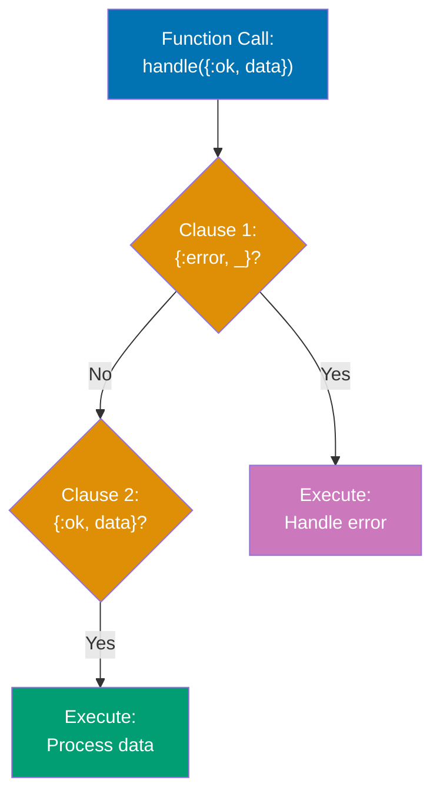

**Code**:

```elixir
defmodule FunctionMatching do
  # Order matters! Specific cases before general cases
  def handle_result({:ok, value}), do: "Success: #{value}"
  # => Pattern: {:ok, value} matches 2-element tuple with :ok atom
  # => value extracts second element
  def handle_result({:error, reason}), do: "Error: #{reason}"
  # => Different pattern: {:error, _} would match any error
  def handle_result(_), do: "Unknown result"
  # => Catch-all: matches anything not matched above
  # => WARNING: Must be last clause (matches everything)

  # Pattern matching with destructuring (tagged tuples)
  def greet({:user, name}), do: "Hello, #{name}!"
  # => Matches {:user, "Alice"} → extracts "Alice" into name
  def greet({:admin, name}), do: "Welcome back, Admin #{name}!"
  # => Different first element → different clause
  def greet({:guest}), do: "Welcome, guest!"
  # => Single-element tuple pattern (guest has no name)

  # List pattern matching (recursive)
  def sum([]), do: 0
  # => Base case: empty list returns 0
  # => Recursion terminates here
  def sum([head | tail]), do: head + sum(tail)
  # => Pattern: [head | tail] splits list into first element + rest
  # => Recursive case: add head to sum of tail
  # => Example: [1,2,3] → 1 + sum([2,3]) → 1 + 2 + sum([3]) → 1 + 2 + 3 + sum([]) → 6

  # Map pattern matching (structural matching)
  def user_summary(%{name: name, age: age}) when age >= 18 do
    # => Pattern: %{name: name, age: age} extracts specific keys
    # => Map can have other keys (ignored)
    # => Guard: age >= 18 adds constraint after pattern match
    "#{name} is an adult (#{age} years old)"
  end
  def user_summary(%{name: name, age: age}) do
    # => Same pattern, different guard
    # => Clause order matters: guard checked first-to-last
    "#{name} is a minor (#{age} years old)"
  end

  # Multiple pattern matches with guards (value classification)
  def classify_number(n) when n < 0, do: :negative
  # => Guard only (no pattern destructuring needed)
  def classify_number(0), do: :zero
  # => Exact value pattern (no guard needed)
  def classify_number(n) when n > 0 and n < 100, do: :small_positive
  # => Compound guard: both conditions must be true
  def classify_number(n) when n >= 100, do: :large_positive
  # => Last specific clause (implicitly covers n >= 100)

  # Complex nested patterns (multi-level destructuring)
  def process_response({:ok, %{status: 200, body: body}}) do
    # => Nested pattern: tuple contains map
    # => Matches: {:ok, %{status: 200, body: "anything"}}
    # => Extracts: body value
    {:success, body}
  end
  def process_response({:ok, %{status: status, body: _}}) when status >= 400 do
    # => Pattern: tuple + map destructuring
    # => _ ignores body (not used)
    # => Guard: status >= 400 further constrains
    {:client_error, status}
  end
  def process_response({:error, %{reason: reason}}) do
    # => Different tuple tag: :error instead of :ok
    # => Still uses map pattern for nested data
    {:failed, reason}
  end

  # Default arguments with pattern matching (multi-clause + defaults)
  def send_message(user, message, opts \\ [])
  # => Function head: declares default value opts = []
  # => Actual implementations below (pattern match on opts)
  def send_message(%{email: email}, message, priority: :high) do
    # => Pattern: opts must be [priority: :high] (keyword list)
    # => user must be map with :email key
    "Urgent email to #{email}: #{message}"
  end
  def send_message(%{email: email}, message, _opts) do
    # => Catch-all for opts (any value including [])
    # => Matches when first clause doesn't
    "Email to #{email}: #{message}"
  end
end

# Result tuple handling
FunctionMatching.handle_result({:ok, 42})
# => Tries clause 1: {:ok, 42} matches {:ok, value} → "Success: 42"
FunctionMatching.handle_result({:error, "not found"})
# => Clause 1 fails (not :ok)
# => Clause 2: {:error, "not found"} matches {:error, reason} → "Error: not found"
FunctionMatching.handle_result(:unknown)
# => Clauses 1-2 fail (not tuple)
# => Clause 3: _ matches anything → "Unknown result"

# Tagged tuple dispatching
FunctionMatching.greet({:user, "Alice"})
# => Clause 1: {:user, "Alice"} matches {:user, name} → "Hello, Alice!"
FunctionMatching.greet({:admin, "Bob"})
# => Clause 1 fails (:admin ≠ :user)
# => Clause 2: {:admin, "Bob"} matches {:admin, name} → "Welcome back, Admin Bob!"
FunctionMatching.greet({:guest})
# => Clauses 1-2 fail (wrong pattern)
# => Clause 3: {:guest} matches → "Welcome, guest!"

# Recursive list processing
FunctionMatching.sum([1, 2, 3, 4])
# => [1 | [2,3,4]] → 1 + sum([2,3,4])
# => [2 | [3,4]] → 2 + sum([3,4])
# => [3 | [4]] → 3 + sum([4])
# => [4 | []] → 4 + sum([])
# => [] → 0
# => Stack unwinds: 4 + 0 = 4, 3 + 4 = 7, 2 + 7 = 9, 1 + 9 = 10
FunctionMatching.sum([])
# => Clause 1: [] matches → 0 (base case)

# Map pattern matching with guards
FunctionMatching.user_summary(%{name: "Alice", age: 25})
# => Pattern: %{name: "Alice", age: 25} matches %{name: name, age: age}
# => Extracts: name = "Alice", age = 25
# => Guard: 25 >= 18 → true → "Alice is an adult (25 years old)"
FunctionMatching.user_summary(%{name: "Bob", age: 16})
# => Pattern matches clause 1
# => Guard: 16 >= 18 → false → clause 1 fails
# => Clause 2: same pattern, no guard → matches → "Bob is a minor (16 years old)"

# Value classification with guards
FunctionMatching.classify_number(-5)
# => Guard: -5 < 0 → true → :negative
FunctionMatching.classify_number(0)
# => Clause 1 guard fails
# => Pattern: 0 matches exactly → :zero
FunctionMatching.classify_number(50)
# => Clauses 1-2 fail
# => Guard: 50 > 0 and 50 < 100 → true → :small_positive
FunctionMatching.classify_number(200)
# => Clauses 1-3 fail
# => Guard: 200 >= 100 → true → :large_positive

# Nested pattern matching
FunctionMatching.process_response({:ok, %{status: 200, body: "OK"}})
# => Pattern: {:ok, %{status: 200, body: body}} matches exactly
# => Extracts: body = "OK" → {:success, "OK"}
FunctionMatching.process_response({:ok, %{status: 404, body: "Not Found"}})
# => Clause 1: status 404 ≠ 200 → fails
# => Clause 2: pattern matches, guard 404 >= 400 → true → {:client_error, 404}
FunctionMatching.process_response({:error, %{reason: :timeout}})
# => Clauses 1-2: {:error, ...} doesn't match {:ok, ...}
# => Clause 3: {:error, %{reason: :timeout}} matches → {:failed, :timeout}

# Default arguments with pattern matching
FunctionMatching.send_message(%{email: "a@example.com"}, "Hello", priority: :high)
# => opts = [priority: :high] (provided)
# => Clause 1: pattern [priority: :high] matches → "Urgent email..."
FunctionMatching.send_message(%{email: "b@example.com"}, "Hi", [])
# => opts = [] (provided empty list)
# => Clause 1: [] doesn't match [priority: :high]
# => Clause 2: _opts matches [] → "Email..."
```

**Key Takeaway**: Pattern matching in function heads enables elegant multi-clause logic. Place specific patterns before general ones, and combine with guards for precise control flow.

**Why It Matters**: Processes are the fundamental unit of concurrency in Elixir, implemented as lightweight BEAM green threads with microsecond spawn times and 2KB initial memory. The BEAM's preemptive scheduler distributes processes across CPU cores automatically, enabling WhatsApp to handle 2 million connections per server compared to thousands in thread-based systems. Each process has isolated heap and mailbox, so one crash never corrupts another—the foundation of Elixir's fault tolerance.

---

## Example 33: With Expression (Happy Path)

The `with` expression chains pattern matches, short-circuiting on the first mismatch. It's ideal for "happy path" coding where you expect success and want to handle errors at the end.

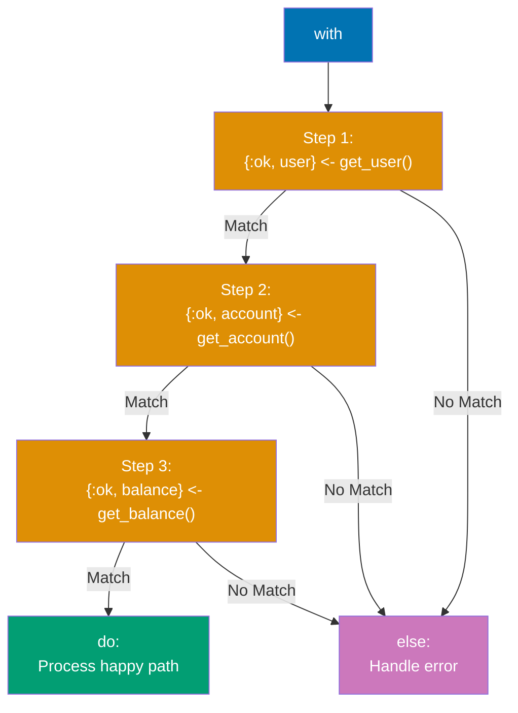

**Code**:

```elixir
defmodule WithExamples do
  # Simulate API functions (return tagged tuples)
  def fetch_user(id) do
    case id do
      1 -> {:ok, %{id: 1, name: "Alice", account_id: 101}}
      # => Success: returns {:ok, user_map}
      2 -> {:ok, %{id: 2, name: "Bob", account_id: 102}}
      _ -> {:error, :user_not_found}
      # => Failure: returns {:error, atom}
    end
  end

  def fetch_account(account_id) do
    case account_id do
      101 -> {:ok, %{id: 101, balance: 1000}}
      102 -> {:ok, %{id: 102, balance: 500}}
      _ -> {:error, :account_not_found}
    end
  end

  def fetch_transactions(account_id) do
    case account_id do
      101 -> {:ok, [%{amount: 100}, %{amount: -50}]}
      # => Returns list of transaction maps
      102 -> {:ok, [%{amount: 200}]}
      _ -> {:error, :transactions_not_found}
    end
  end

  # ❌ WITHOUT `with` - nested case statements (pyramid of doom)
  def get_user_summary_nested(user_id) do
    case fetch_user(user_id) do
      # => Level 1 nesting
      {:ok, user} ->
        case fetch_account(user.account_id) do
          # => Level 2 nesting
          {:ok, account} ->
            case fetch_transactions(account.id) do
              # => Level 3 nesting (hard to read!)
              {:ok, transactions} ->
                {:ok, %{user: user, account: account, transactions: transactions}}
              {:error, reason} ->
                {:error, reason}
                # => Must repeat error handling at each level
            end
          {:error, reason} ->
            {:error, reason}
            # => Duplicated error handling
        end
      {:error, reason} ->
        {:error, reason}
        # => Error handling repeated 3 times!
    end
  end

  # ✅ WITH `with` - clean happy path (linear, readable)
  def get_user_summary(user_id) do
    with {:ok, user} <- fetch_user(user_id),
         # => Step 1: pattern match {:ok, user}
         # => If matches: continue to step 2
         # => If doesn't match: jump to else block
         {:ok, account} <- fetch_account(user.account_id),
         # => Step 2: uses user from step 1
         # => Chain continues only if pattern matches
         {:ok, transactions} <- fetch_transactions(account.id) do
         # => Step 3: uses account from step 2
         # => All patterns matched: execute do block
      # Happy path - all matches succeeded
      {:ok, %{
        user: user.name,
        # => user binding from step 1
        balance: account.balance,
        # => account binding from step 2
        transaction_count: length(transactions)
        # => transactions binding from step 3
      }}
    else
      # First mismatch jumps here (short-circuit)
      {:error, :user_not_found} -> {:error, "User not found"}
      # => Pattern match error from step 1
      {:error, :account_not_found} -> {:error, "Account not found"}
      # => Pattern match error from step 2
      {:error, :transactions_not_found} -> {:error, "Transactions not found"}
      # => Pattern match error from step 3
      # => Consolidated error handling in one place!
    end
  end

  # `with` can match any pattern (not just :ok/:error)
  def complex_calculation(x) do
    with {:ok, doubled} <- {:ok, x * 2},
         # => x = 5 → {:ok, 10}
         # => Matches pattern, doubled = 10
         {:ok, incremented} <- {:ok, doubled + 1},
         # => {:ok, 11}, incremented = 11
         {:ok, squared} <- {:ok, incremented * incremented} do
         # => {:ok, 121}, squared = 121
      {:ok, squared}
      # => Returns {:ok, 121}
    else
      _ -> {:error, "calculation failed"}
      # => Catch-all for any non-matching pattern
    end
  end

  # Boolean guards in `with` (Elixir 1.3+)
  def process_number(x) when is_integer(x) do
    with true <- x > 0,
         # => Matches true or jumps to else
         # => Pattern: true <- boolean_expression
         true <- x < 100 do
         # => Second validation: x must be < 100
      {:ok, "Valid number: #{x}"}
      # => Both guards passed
    else
      false -> {:error, "Number out of range"}
      # => Either guard failed (returned false)
      # => Both failures use same pattern
    end
  end
end

# Happy path - all steps succeed
WithExamples.get_user_summary(1)
# => Step 1: fetch_user(1) → {:ok, %{id: 1, name: "Alice", account_id: 101}}
# => Step 2: fetch_account(101) → {:ok, %{id: 101, balance: 1000}}
# => Step 3: fetch_transactions(101) → {:ok, [...]}
# => do block executes → {:ok, %{balance: 1000, transaction_count: 2, user: "Alice"}}

WithExamples.get_user_summary(2)
# => User Bob, account 102, balance 500, 1 transaction
# => {:ok, %{balance: 500, transaction_count: 1, user: "Bob"}}

# Failure path - short-circuit at step 1
WithExamples.get_user_summary(999)
# => Step 1: fetch_user(999) → {:error, :user_not_found}
# => Pattern {:ok, user} doesn't match → jumps to else
# => else block: {:error, :user_not_found} matches → {:error, "User not found"}

# Calculation chain
WithExamples.complex_calculation(5)
# => Step 1: {:ok, 5 * 2} = {:ok, 10}
# => Step 2: {:ok, 10 + 1} = {:ok, 11}
# => Step 3: {:ok, 11 * 11} = {:ok, 121}
# => {:ok, 121}

# Boolean guard validation
WithExamples.process_number(50)
# => Guard 1: 50 > 0 → true (matches)
# => Guard 2: 50 < 100 → true (matches)
# => {:ok, "Valid number: 50"}

WithExamples.process_number(150)
# => Guard 1: 150 > 0 → true
# => Guard 2: 150 < 100 → false (doesn't match true)
# => else: false matched → {:error, "Number out of range"}

WithExamples.process_number(-10)
# => Guard 1: -10 > 0 → false (short-circuits)
# => else: false matched → {:error, "Number out of range"}
```

**Key Takeaway**: `with` chains pattern matches and short-circuits on the first mismatch. Use it for happy path coding where you expect success, with error handling consolidated in the `else` block.

**Why It Matters**: Process linking enables supervision trees where crashes propagate to supervisors rather than terminating the system. When a worker crashes, its linked supervisor receives an exit signal and executes restart strategy (one_for_one, rest_for_one, one_for_all). In production, this creates self-healing systems—Discord's Elixir backend uses supervision trees to automatically restart failed message routers, maintaining 99.99% uptime while serving millions of concurrent users without manual intervention.

---

## Example 34: Structs

Structs are extensions of maps with compile-time guarantees and default values. They enforce a predefined set of keys, enabling clearer data modeling and better error messages.

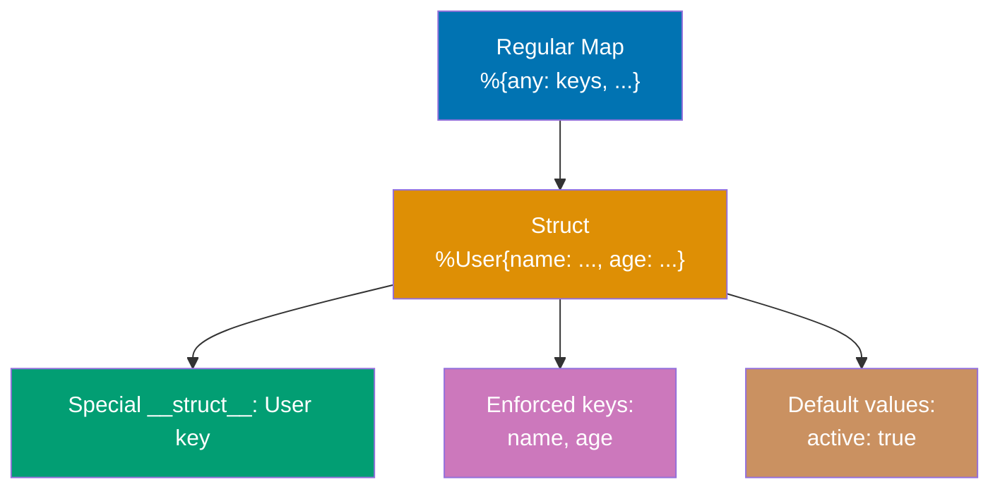

### Struct Features

**Tagged Maps**: Structs are maps with special `__struct__` key (module name)
**Default Values**: Define defaults for fields (e.g., `active: true`)
**Enforced Keys**: `@enforce_keys` requires fields at creation (compile-time check)
**Pattern Matching**: Match on struct type for type-safe function dispatch
**Immutability**: Updates create new structs (original unchanged)

**Code**:

```elixir
defmodule User do
  # Define struct with default values
  defstruct name: nil, age: nil, email: nil, active: true
  # => All fields optional with defaults
  # => active defaults to true (others nil)

  # Alternative: enforced keys (compile-time check)
  # @enforce_keys [:name, :age]
  # => Compile error if keys not provided at creation
  # defstruct [:name, :age, email: nil, active: true]
end

defmodule Account do
  @enforce_keys [:id, :balance]
  # => MUST provide :id and :balance at creation
  # => Raises ArgumentError if missing
  defstruct [:id, :balance, status: :active, transactions: []]
  # => :id, :balance required; status/:transactions have defaults
end

# Create struct with all fields
user = %User{name: "Alice", age: 30, email: "alice@example.com"}
# => Syntax: %ModuleName{key: value, ...}
# => active uses default (true)
# => %User{name: "Alice", age: 30, email: "alice@example.com", active: true}

# Create struct with partial fields
user_partial = %User{name: "Bob", age: 25}
# => email: nil (default), active: true (default)

# Access struct fields (dot notation)
user.name
# => "Alice"
user.age
# => 30
user.active
# => true (default value)

# Update struct (immutable, creates new struct)
updated_user = %{user | age: 31, email: "alice.new@example.com"}
# => Syntax: %{struct | field: new_value, ...}
# => Returns NEW struct (original unchanged)
user.age
# => 30 (original unchanged - immutability)

# Struct is a tagged map
user.__struct__
# => User (module name stored in __struct__ field)
is_map(user)
# => true (structs ARE maps)
Map.keys(user)
# => [:__struct__, :active, :age, :email, :name]

# Pattern matching on structs
%User{name: name, age: age} = user
# => Destructures struct fields
# => Only matches User structs (not other types)
name
# => "Alice"
age
# => 30

# Pattern matching in function heads (type safety)
def greet_user(%User{name: name}), do: "Hello, #{name}!"
# => Only accepts User structs (not Account or plain maps)
# => Type-safe dispatch
greet_user(user)
# => "Hello, Alice!"
# greet_user(%{name: "Bob"}) would raise FunctionClauseError

# Enforced keys example
account = %Account{id: 1, balance: 1000}
# => MUST provide :id and :balance (@enforce_keys)
# => status and transactions use defaults
# => %Account{id: 1, balance: 1000, status: :active, transactions: []}

# account_invalid = %Account{id: 1}
# => ** (ArgumentError) missing required keys: [:balance]
```

**Key Takeaway**: Structs are tagged maps with enforced keys and default values. They provide compile-time guarantees and clearer domain modeling compared to plain maps.

**Why It Matters**: Structs enable compile-time type safety and clearer domain modeling in Elixir applications. In production, Phoenix uses structs extensively (`%Plug.Conn{}` for HTTP requests, `%Ecto.Changeset{}` for validations), providing pattern matching on struct types to catch errors early (e.g., passing wrong data type to function) and `@enforce_keys` ensuring critical fields like `:id` are never forgotten. Struct-based APIs make codebases self-documenting and enable IDEs to provide better autocomplete and error detection.

---

## Example 35: Streams (Lazy Enumeration)

Streams are lazy enumerables that build a recipe for computation without executing it immediately. They enable efficient processing of large or infinite datasets by composing transformations.

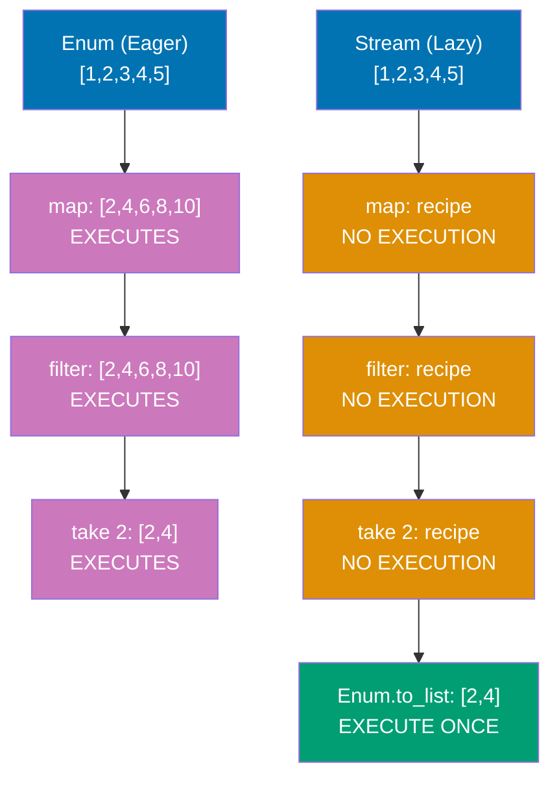

**Code**:

```elixir
numbers = [1, 2, 3, 4, 5, 6, 7, 8, 9, 10]

# Eager evaluation (Enum) - immediate execution
eager_result = numbers
               |> Enum.map(fn x -> x * 2 end)
               # => Pass 1: builds [2, 4, 6, 8, 10, 12, 14, 16, 18, 20]
               # => Processes all 10 elements immediately
               |> Enum.filter(fn x -> rem(x, 4) == 0 end)
               # => Pass 2: builds [4, 8, 12, 16, 20]
               # => Processes all 5 remaining elements
               |> Enum.take(2)
               # => Pass 3: takes first 2 → [4, 8]
               # => Already processed all 10 elements (wasteful!)

# Lazy evaluation (Stream) - deferred execution
lazy_result = numbers
              |> Stream.map(fn x -> x * 2 end)
              # => Returns #Stream<...> (NOT a list)
              # => No execution yet, just builds recipe
              |> Stream.filter(fn x -> rem(x, 4) == 0 end)
              # => Returns #Stream<...> (still no execution)
              # => Composes filter into recipe
              |> Enum.take(2)
              # => TRIGGERS execution: processes elements one-by-one
              # => Stops after finding 2 matches
              # => Only processes: 1→2 (no), 2→4 (YES), 3→6 (no), 4→8 (YES), STOP
              # => [4, 8] (processed 4 elements, not 10!)

# Infinite streams (impossible with eager evaluation)
infinite_numbers = Stream.iterate(1, fn x -> x + 1 end)
# => Infinite sequence: 1, 2, 3, 4, 5, ...
# => Returns #Stream<...> (no execution yet)
# => Would never terminate if eager!

first_evens = infinite_numbers
              |> Stream.filter(fn x -> rem(x, 2) == 0 end)
              # => Lazy filter (no execution)
              |> Enum.take(10)
              # => Takes first 10 even numbers
              # => [2, 4, 6, 8, 10, 12, 14, 16, 18, 20]
              # => Stops after 10 matches (doesn't process infinite stream!)

# Stream.cycle - repeats list infinitely
Stream.cycle([1, 2, 3]) |> Enum.take(7)
# => Cycles through [1,2,3] infinitely
# => Takes first 7: [1, 2, 3, 1, 2, 3, 1]

# Stream.unfold - generates values from state
fibonacci = Stream.unfold({0, 1}, fn {a, b} -> {a, {b, a + b}} end)
# => unfold(initial_state, next_fn)
# => next_fn returns {value, new_state}
# => {0, 1} → emit 0, next state {1, 1}
# => {1, 1} → emit 1, next state {1, 2}
# => {1, 2} → emit 1, next state {2, 3}
# => {2, 3} → emit 2, next state {3, 5}
# => Infinite Fibonacci sequence
Enum.take(fibonacci, 10)
# => [0, 1, 1, 2, 3, 5, 8, 13, 21, 34]

# Performance comparison
defmodule Performance do
  def eager_pipeline(n) do
    1..n
    |> Enum.map(fn x -> x * 2 end)
    # => Builds entire intermediate list (n elements)
    |> Enum.filter(fn x -> rem(x, 3) == 0 end)
    # => Builds another intermediate list (~n/3 elements)
    |> Enum.take(100)
    # => Takes 100, discards rest
    # => Wastes memory and CPU for large n
  end

  def lazy_pipeline(n) do
    1..n
    |> Stream.map(fn x -> x * 2 end)
    # => No intermediate list (lazy)
    |> Stream.filter(fn x -> rem(x, 3) == 0 end)
    # => Still lazy (just composing)
    |> Enum.take(100)
    # => Processes ONLY until 100 matches found
    # => For n=1_000_000: processes ~300 elements, not 1 million!
  end
end

# Performance.eager_pipeline(1_000_000)
# => Processes 1 million elements, builds 2 intermediate lists
# Performance.lazy_pipeline(1_000_000)
# => Processes ~300 elements, 0 intermediate lists

# Stream.resource - manage external resources (files, sockets, etc.)
stream_resource = Stream.resource(
  fn -> {:ok, "initial state"} end,
  # => Start function: called once to initialize
  # => Returns initial accumulator state
  fn state -> {[state], "next state"} end,
  # => Next function: called repeatedly
  # => Returns {values_to_emit, new_state}
  # => Can return {:halt, state} to stop
  fn _state -> :ok end
  # => After function: cleanup (called when stream ends)
  # => Close files, release resources, etc.
)
Enum.take(stream_resource, 3)
# => Calls start → {:ok, "initial state"}
# => Calls next("initial state") → {["initial state"], "next state"}
# => Emits "initial state"
# => Calls next("next state") → {["next state"], "next state"}
# => Emits "next state" (2 times)
# => Calls after("next state") → :ok (cleanup)
# => ["initial state", "next state", "next state"]
```

**Key Takeaway**: Streams enable lazy evaluation—building a recipe without executing it. Use streams for large datasets, infinite sequences, or when you want to compose transformations efficiently.

**Why It Matters**: The BEAM's message passing is asynchronous and lock-free—send/2 copies messages to the receiver's mailbox without blocking, enabling sending millions of messages per second. Unlike shared-memory threading, this eliminates race conditions and deadlocks. In production Phoenix channels, one WebSocket process handles bidirectional communication while business logic processes handle commands concurrently, communicating through message passing that the BEAM optimizes with specialized copy-on-write for large binaries.

---

## Example 36: MapSet for Uniqueness

MapSets are unordered collections of unique values. They provide efficient membership testing and set operations (union, intersection, difference). Use them when uniqueness matters and order doesn't.

**Code**:

```elixir
# Create MapSet from list (automatic deduplication)
set1 = MapSet.new([1, 2, 3, 3, 4, 4, 5])
# => MapSet.new/1 removes duplicates automatically
# => #MapSet<[1, 2, 3, 4, 5]>
# => Unordered: order not guaranteed

# Create MapSet from range
set_range = MapSet.new(1..10)
# => Converts range to set
# => #MapSet<[1, 2, 3, 4, 5, 6, 7, 8, 9, 10]>

# Add element (immutable, returns new set)
set2 = MapSet.put(set1, 6)
# => Adds 6 to set (new set returned)
# => #MapSet<[1, 2, 3, 4, 5, 6]>
set1
# => #MapSet<[1, 2, 3, 4, 5]> (original unchanged!)
# => Immutability: set2 is separate copy

# Add duplicate (no effect)
set3 = MapSet.put(set1, 3)
# => 3 already exists in set
# => Returns set unchanged
# => #MapSet<[1, 2, 3, 4, 5]> (same as set1)

# Remove element
set4 = MapSet.delete(set1, 3)
# => Removes 3 from set
# => #MapSet<[1, 2, 4, 5]>

# Membership testing (O(log n))
MapSet.member?(set1, 3)
# => Checks if 3 is in set
# => true (efficient lookup)
MapSet.member?(set1, 10)
# => Checks if 10 is in set
# => false (not present)

# Set size
MapSet.size(set1)
# => Counts unique elements
# => 5

# Set operations
setA = MapSet.new([1, 2, 3])
# => Set A: {1, 2, 3}
setB = MapSet.new([3, 4, 5])
# => Set B: {3, 4, 5}

# Union (all unique elements from both sets)
MapSet.union(setA, setB)
# => A ∪ B: elements in A OR B
# => #MapSet<[1, 2, 3, 4, 5]>

# Intersection (common elements)
MapSet.intersection(setA, setB)
# => A ∩ B: elements in A AND B
# => #MapSet<[3]> (only 3 is common)

# Difference (elements in A but not in B)
MapSet.difference(setA, setB)
# => A \ B: elements in A but NOT in B
# => #MapSet<[1, 2]> (3 is removed)
MapSet.difference(setB, setA)
# => B \ A: elements in B but NOT in A
# => #MapSet<[4, 5]> (3 is removed)
# => Difference is NOT commutative!

# Subset and superset
setX = MapSet.new([1, 2])
# => Set X: {1, 2}
setY = MapSet.new([1, 2, 3, 4])
# => Set Y: {1, 2, 3, 4}
MapSet.subset?(setX, setY)
# => Is X ⊆ Y? (all elements of X in Y?)
# => true (1 and 2 are in Y)
MapSet.subset?(setY, setX)
# => Is Y ⊆ X?
# => false (3 and 4 not in X)

# Disjoint sets (no common elements)
MapSet.disjoint?(setA, MapSet.new([6, 7]))
# => Do A and {6, 7} have any common elements?
# => true (no overlap)
# => Disjoint: A ∩ {6,7} = ∅

# Convert to list (order not guaranteed)
MapSet.to_list(set1)
# => Converts set to list
# => [1, 2, 3, 4, 5] (order may vary)
# => Sets are unordered!

# Practical example: unique tags from posts
posts = [
  %{id: 1, tags: ["elixir", "functional", "programming"]},
  %{id: 2, tags: ["elixir", "otp", "concurrency"]},
  %{id: 3, tags: ["functional", "fp", "programming"]}
]

# Extract all unique tags
all_tags = posts
           |> Enum.flat_map(fn post -> post.tags end)
           # => Flattens: ["elixir", "functional", "programming", "elixir", "otp", ...]
           # => With duplicates
           |> MapSet.new()
           # => Deduplicates: #MapSet<["elixir", "functional", "programming", "otp", "concurrency", "fp"]>
# => Automatic uniqueness!

# Find common tags between posts
post1_tags = MapSet.new(["elixir", "functional"])
post2_tags = MapSet.new(["elixir", "otp"])
MapSet.intersection(post1_tags, post2_tags)
# => Common tags: #MapSet<["elixir"]>
# => Useful for finding related content
```

**Key Takeaway**: MapSets provide O(log n) membership testing and automatic deduplication. Use them for unique collections where order doesn't matter and set operations (union, intersection, difference) are needed.

**Why It Matters**: Selective receive enables processes to prioritize messages by pattern matching mailbox contents out of order. The BEAM maintains a per-process save pointer, making selective receive O(1) for early matches. In production, this enables priority handling—a GenServer can process :urgent messages before :normal ones, while Erlang's priority_receive extension supports real-time systems with predictable latency requirements.

---

## Example 37: Module Attributes

Module attributes are compile-time constants defined with `@`. They're commonly used for documentation (`@moduledoc`, `@doc`), compile-time configuration, and storing values computed during compilation.

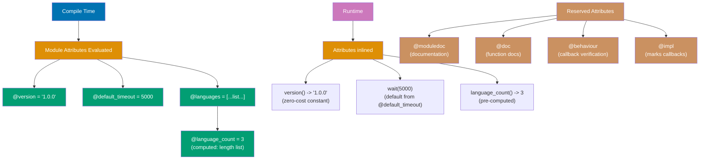

**Code**:

```elixir
defmodule MyModule do
  # Module documentation (special reserved attribute)
  @moduledoc """
  This module demonstrates module attributes.
  Module attributes are compile-time constants.
  """
  # => @moduledoc appears in generated documentation
  # => Accessible via Code.fetch_docs/1

  # Compile-time constants
  @default_timeout 5000
  # => Computed once during compilation
  # => Inlined wherever used (zero runtime cost)
  @version "1.0.0"
  # => String constant
  @max_retries 3
  # => Integer constant

  # Function documentation (special reserved attribute)
  @doc """
  Waits for a specified timeout or default.
  Returns :ok after waiting.
  """
  # => @doc appears in function documentation (h/1 in IEx)
  def wait(timeout \\ @default_timeout) do
    # => Default argument uses module attribute
    # => @default_timeout inlined to 5000 at compile time
    :timer.sleep(timeout)
    # => Sleeps for timeout milliseconds
    :ok
    # => Returns :ok atom
  end

  @doc """
  Gets the module version.
  """
  def version, do: @version
  # => Returns compile-time constant (inlined to "1.0.0")

  # Computed at compile time (not runtime!)
  @languages ["Elixir", "Erlang", "LFE"]
  # => List created once during compilation
  @language_count length(@languages)
  # => length/1 executed at compile time!
  # => Result: 3 (computed once, inlined everywhere)

  def supported_languages, do: @languages
  # => Returns ["Elixir", "Erlang", "LFE"] (compile-time constant)
  def language_count, do: @language_count
  # => Returns 3 (compile-time computed)

  # Module registration (declares implemented behaviour)
  @behaviour :gen_server
  # => Compiler checks we implement all required callbacks
  # => Common in OTP applications

  # Accumulating values (each @ reassignment creates new value)
  @colors [:red, :blue]
  # => Initial value: [:red, :blue]
  @colors [:green | @colors]
  # => Reads previous @colors, prepends :green → [:green, :red, :blue]
  @colors [:yellow | @colors]
  # => Reads previous @colors, prepends :yellow → [:yellow, :green, :red, :blue]

  def colors, do: @colors
  # => [:yellow, :green, :red, :blue] (final accumulated value)

  # Attributes are scoped to next function definition
  @important true
  # => Attribute active for next function
  def func1, do: @important
  # => Returns true (attribute value when func1 defined)

  @important false
  # => Redefines @important for next function
  def func2, do: @important
  # => Returns false (NEW value, doesn't affect func1!)

  # Custom attributes for metadata
  @deprecated_message "Use new_function/1 instead"
  # => Custom attribute (not reserved, any compile-time value)

  @doc @deprecated_message
  # => Uses custom attribute in @doc (dynamic documentation)
  def old_function, do: :deprecated

  # Reserved attributes (special compiler meaning):
  # @moduledoc - module documentation
  # @doc - function documentation
  # @behaviour - declares implemented behaviour
  # @impl - marks callback implementation
  # @deprecated - marks deprecated (compiler warns)
  # @spec - type specification (dialyzer)
  # @type - defines custom type
  # @opaque - defines opaque type
  # => Custom attributes allowed: @author, @since, etc.
end

# Module attribute usage examples
MyModule.wait(1000)
# => Sleeps 1000ms, returns :ok

MyModule.version()
# => "1.0.0" (compile-time constant inlined)

MyModule.supported_languages()
# => ["Elixir", "Erlang", "LFE"] (compile-time constant)

MyModule.language_count()
# => 3 (computed once at compile time, not runtime!)

MyModule.colors()
# => [:yellow, :green, :red, :blue]
# => Final accumulated value from compile-time build

```

**Key Takeaway**: Module attributes (`@name`) are compile-time constants useful for documentation, configuration, and computed values. They're evaluated during compilation, not runtime.

**Why It Matters**: The receive timeout enables gen_timeout patterns and state timeouts in GenStateMachine. Unlike polling, BEAM timeouts are implemented in the scheduler with zero CPU overhead. In production systems, this powers heartbeat detection—connection pools detect stale connections through receive timeouts, GenServers implement inactivity cleanup, and Phoenix PubSub uses timeouts to detect network partitions without polling that would waste CPU cycles.

---

## Example 38: Import, Alias, Require

`import`, `alias`, and `require` control how modules are referenced in your code. They reduce verbosity and manage namespaces cleanly.

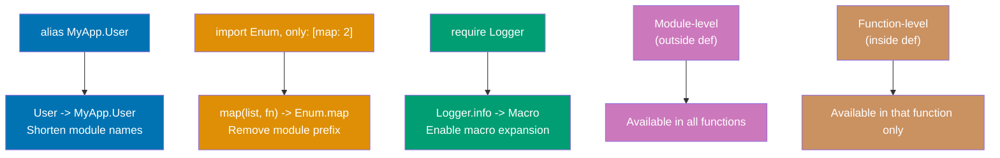

### Directive Comparison

| Directive | Purpose                    | When to Use                             |
| --------- | -------------------------- | --------------------------------------- |
| `alias`   | Shorten module names       | Always (safe, compile-time)             |
| `import`  | Bring functions into scope | Sparingly (namespace pollution risk)    |
| `require` | Enable macros              | Only for macros (Logger, custom macros) |

### Scoping Rules

- **Module-level**: Affects all functions in module
- **Function-level**: Only affects that function
- **import/require**: Function-level when inside `def`, module-level when outside

**Code**:

```elixir
defmodule ImportAliasRequire do
  alias MyApp.Accounts.User
  # => User = MyApp.Accounts.User (shorthand)

  alias MyApp.Accounts.Admin, as: A
  # => Custom alias: A = MyApp.Accounts.Admin

  def create_user(name) do
    %User{name: name}
    # => Expands to %MyApp.Accounts.User{name: name}
  end

  def create_admin(name) do
    %A{name: name}
    # => Expands to %MyApp.Accounts.Admin{name: name}
  end

  import Enum, only: [map: 2, filter: 2]
  # => Selective import: only map/2 and filter/2

  def process_numbers(list) do
    list
    |> map(fn x -> x * 2 end)
    # => Calls Enum.map/2 without prefix
    |> filter(fn x -> x > 10 end)
    # => Calls Enum.filter/2 without prefix
  end

  import String, except: [split: 1]
  # => All String functions except split/1

  def upcase_string(str) do
    upcase(str)
    # => Calls String.upcase/1 without prefix
  end

  require Logger
  # => Required for Logger macros

  def log_something do
    Logger.info("This is a log message")
    # => Macro expands at compile time
  end

  alias MyApp.{Accounts, Billing, Reports}
  # => Multiple aliases: Accounts, Billing, Reports

  def get_account_report do
    account = Accounts.get()
    # => MyApp.Accounts.get/0
    billing = Billing.get()
    # => MyApp.Billing.get/0
    Reports.generate(account, billing)
    # => MyApp.Reports.generate/2
  end
end

defmodule MyApp.Accounts.User do
  defstruct name: nil, email: nil
end

defmodule MyApp.Accounts.Admin do
  defstruct name: nil, role: :admin
end

defmodule ScopingExample do
  def func1 do
    import Enum
    # => Function-level import (only in func1)
    map([1, 2, 3], fn x -> x * 2 end)
    # => Returns [2, 4, 6]
  end

  def func2 do
    Enum.map([1, 2, 3], fn x -> x * 2 end)
    # => Must use full module name (func1's import not available)
  end

  import String
  # => Module-level import (available in all functions)

  def func3, do: upcase("hello")
  # => Returns "HELLO" (uses imported upcase/1)

  def func4, do: downcase("WORLD")
  # => Returns "world" (uses imported downcase/1)
end

# ImportAliasRequire.create_user("Alice")
# => %MyApp.Accounts.User{name: "Alice", email: nil}

# ImportAliasRequire.process_numbers([1, 2, 3, 4, 5, 6, 7, 8])
# => Doubles: [2, 4, 6, 8, 10, 12, 14, 16]
# => Filters > 10: [12, 14, 16]

# ScopingExample.func1()
# => [2, 4, 6]

# ScopingExample.func3()
# => "HELLO"
```

**Key Takeaway**: Use `alias` to shorten module names, `import` to bring functions into scope (sparingly!), and `require` for macros. These directives manage namespaces and reduce verbosity.

**Why It Matters**: Tasks provide higher-level concurrency than raw spawn, with built-in monitoring and result retrieval. Task.async/await compiles to efficient BEAM process creation with selective receive for result collection. In production Phoenix controllers, `Task.async_stream(users, &send_email/1)` parallelizes IO operations across all CPU cores with backpressure, while Task Supervisor restarts failed tasks without bringing down the parent, maintaining throughput under partial failures.

---

## Example 39: Protocols (Polymorphism)

Protocols enable polymorphism—defining a function that works differently for different data types. They're Elixir's mechanism for ad-hoc polymorphism, similar to interfaces in other languages.

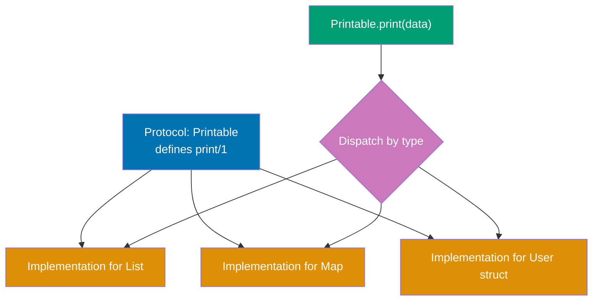

**Code**:

```elixir
defprotocol Printable do
  # => Protocol definition: defines polymorphic interface
  # => Protocols dispatch based on data type at runtime
  # => Similar to interfaces in OOP languages
  @doc "Converts data to a printable string"
  # => Documentation for protocol function
  def print(data)
  # => Function signature: takes any data, returns string
  # => Implementation provided by defimpl for each type
end

defimpl Printable, for: Integer do
  # => Implementation of Printable protocol for Integer type
  # => defimpl: define protocol implementation
  # => for: Integer: specifies target type
  def print(int), do: "Number: #{int}"
  # => Pattern matches integer parameter
  # => Returns formatted string with integer value
  # => String interpolation: #{int}
end

defimpl Printable, for: List do
  # => Implementation for List type
  def print(list), do: "List with #{length(list)} items: #{inspect(list)}"
  # => length(list): counts list elements
  # => inspect(list): converts list to readable string
  # => Returns formatted string with count and contents
end

defimpl Printable, for: Map do
  # => Implementation for Map type
  def print(map), do: "Map with #{map_size(map)} keys"
  # => map_size(map): counts keys in map (O(1) operation)
  # => Returns formatted string with key count
end

Printable.print(42)
# => Calls protocol function with integer
# => Runtime dispatch: finds Integer implementation
# => Executes Printable.Integer.print/1
# => Returns "Number: 42"

Printable.print([1, 2, 3])
# => Runtime dispatch: finds List implementation
# => Calls Printable.List.print/1
# => Returns "List with 3 items: [1, 2, 3]"

Printable.print(%{a: 1, b: 2})
# => Runtime dispatch: finds Map implementation
# => Calls Printable.Map.print/1
# => Returns "Map with 2 keys"

defmodule User do
  # => Custom struct definition
  defstruct name: nil, age: nil
  # => Struct with two fields: name and age
  # => Both default to nil
end

defimpl Printable, for: User do
  # => Protocol implementation for custom User struct
  # => Protocols work with any data type, including custom structs
  def print(user), do: "User: #{user.name}, age #{user.age}"
  # => Accesses struct fields: user.name, user.age
  # => Returns formatted string with user data
end

user = %User{name: "Alice", age: 30}
# => Creates User struct instance
# => Binds to user variable
# => %User{name: "Alice", age: 30}

Printable.print(user)
# => Runtime dispatch: finds User implementation
# => Calls Printable.User.print/1
# => Returns "User: Alice, age 30"

defimpl String.Chars, for: User do
  # => Implements built-in String.Chars protocol
  # => String.Chars: enables to_string/1 and string interpolation
  # => Implementing this protocol integrates User with Elixir's string system
  def to_string(user), do: user.name
  # => Returns user's name as string representation
  # => Used by to_string/1 and #{} interpolation
end

to_string(user)
# => Calls String.Chars.to_string/1
# => Dispatch finds User implementation
# => Returns "Alice"

"Hello, #{user}"
# => String interpolation calls to_string/1 implicitly
# => Uses String.Chars.User.to_string/1
# => Converts user to "Alice"
# => Returns "Hello, Alice"
# => Without String.Chars impl, would raise Protocol.UndefinedError

defmodule Range do
  # => Custom Range struct
  defstruct first: nil, last: nil
  # => Stores range bounds: first and last
end

defimpl Enumerable, for: Range do
  # => Implements built-in Enumerable protocol
  # => Enumerable: enables Enum.* functions (map, filter, reduce, count, etc.)
  # => Must implement: count/1, member?/2, reduce/3, slice/1

  def count(range), do: {:ok, range.last - range.first + 1}
  # => Returns total element count
  # => Formula: last - first + 1 (inclusive range)
  # => Example: first=1, last=5 => 5-1+1 = 5 elements
  # => Returns {:ok, count} tuple

  def member?(range, value), do: {:ok, value >= range.first and value <= range.last}
  # => Checks if value is in range
  # => Returns {:ok, boolean}
  # => Example: member?(1..5, 3) => {:ok, true}

  def reduce(range, acc, fun) do
    # => Core enumeration function
    # => Converts custom Range to built-in range (range.first..range.last)
    # => Delegates to Enum.reduce/3
    Enum.reduce(range.first..range.last, acc, fun)
    # => Applies fun to each element with accumulator
    # => This enables all Enum.* functions to work with Range
  end

  def slice(_range), do: {:error, __MODULE__}
  # => Slice operation not supported for this Range
  # => Returns {:error, module_name}
  # => __MODULE__: expands to current module name (Enumerable.Range)
  # => Some Enum functions (take, drop) use slice for optimization
  # => Error return means fallback to reduce-based implementation
end

my_range = %Range{first: 1, last: 5}
# => Creates Range struct with bounds 1..5
# => Represents values: [1, 2, 3, 4, 5]

Enum.count(my_range)
# => Calls Enumerable.Range.count/1
# => Returns {:ok, 5}
# => Enum.count extracts value from {:ok, count} tuple
# => Returns 5

Enum.member?(my_range, 3)
# => Calls Enumerable.Range.member?/2
# => Checks if 3 is in range 1..5
# => Returns {:ok, true}
# => Enum.member? extracts boolean from tuple
# => Returns true

Enum.map(my_range, fn x -> x * 2 end)
# => Uses Enumerable.Range.reduce/3 under the hood
# => Iterates: 1, 2, 3, 4, 5
# => Applies fn: 1*2=2, 2*2=4, 3*2=6, 4*2=8, 5*2=10
# => Returns [2, 4, 6, 8, 10]
# => This works because we implemented Enumerable protocol!

defprotocol Describable do
  # => Protocol with fallback to Any
  @fallback_to_any true
  # => @fallback_to_any: enables default implementation
  # => If no specific implementation found, uses Any implementation
  # => Without this, missing implementation raises Protocol.UndefinedError
  def describe(data)
  # => Function signature for polymorphic describe/1
end

defimpl Describable, for: Any do
  # => Fallback implementation for all types
  # => Only used if @fallback_to_any true
  # => Catches all types without specific implementation
  def describe(_data), do: "No description available"
  # => _data: unused parameter (underscore prefix)
  # => Returns generic fallback message
end

defimpl Describable, for: Integer do
  # => Specific implementation for Integer
  # => Takes precedence over Any implementation
  def describe(int), do: "The number #{int}"
  # => Returns specific description for integers
end

Describable.describe(42)
# => Runtime dispatch: finds Integer implementation
# => Uses specific Describable.Integer.describe/1 (not Any)
# => Returns "The number 42"

Describable.describe("hello")
# => Runtime dispatch: no String implementation found
# => Fallback to Any implementation (because @fallback_to_any true)
# => Calls Describable.Any.describe/1
# => Returns "No description available"

Describable.describe([1, 2, 3])
# => No List implementation found
# => Fallback to Any
# => Returns "No description available"
# => Without @fallback_to_any, would raise Protocol.UndefinedError
```

**Key Takeaway**: Protocols enable polymorphic functions that dispatch based on data type. Implement protocols for your custom types to integrate with Elixir's built-in functions (`to_string`, `Enum.*`, etc.).

**Why It Matters**: Agents provide simple state storage through functional transformations of immutable state. Unlike mutable variables, Agent updates are serialized through message passing, preventing race conditions. In production, Agents implement shared caches (configuration, feature flags) that thousands of processes read concurrently without locks. The BEAM's process-based isolation means Agent crashes are isolated—a corrupt cache kills the Agent, not the readers, and supervisors restart with clean state.

---

## Example 40: Result Tuples (:ok/:error)

Elixir idiomatically uses tagged tuples `{:ok, value}` or `{:error, reason}` to represent success and failure. This explicit error handling is preferred over exceptions for expected error cases.

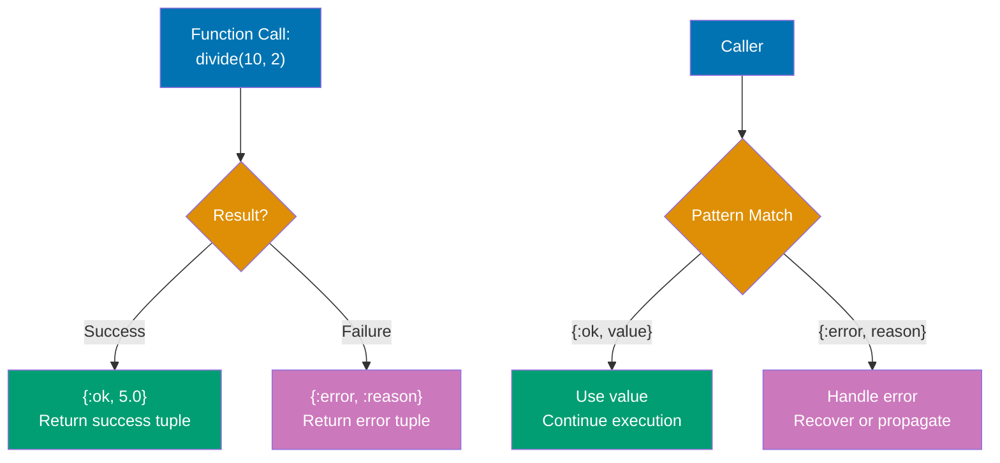

**Code**:

```elixir
defmodule ResultTuples do
  # => Module demonstrating idiomatic Elixir error handling
  # => Uses tagged tuples instead of exceptions for expected errors

  # Function that can succeed or fail
  def divide(a, b) when b != 0, do: {:ok, a / b}
  # => Clause 1: Guard checks b != 0
  # => Success case: returns {:ok, result} tuple
  # => Tagged tuple: :ok atom indicates success, second element is value
  # => Example: divide(10, 2) => {:ok, 5.0}

  def divide(_a, 0), do: {:error, :division_by_zero}
  # => Clause 2: Pattern matches b = 0 (exact value)
  # => Failure case: returns {:error, reason} tuple
  # => :division_by_zero is an atom describing the error
  # => _a: unused parameter (underscore prefix)

  # Parse integer from string
  def parse_int(string) do
    # => Wraps Integer.parse/1 with result tuple convention
    case Integer.parse(string) do
      # => Integer.parse/1 returns {int, rest} or :error
      {int, ""} -> {:ok, int}
      # => Pattern: {int, ""} means full string parsed (no remainder)
      # => Returns {:ok, int} indicating successful complete parse
      # => Example: parse("42") => {42, ""} => {:ok, 42}

      {_int, _rest} -> {:error, :partial_parse}
      # => Pattern: {int, rest} means partial parse (extra chars remain)
      # => Returns error indicating incomplete parse
      # => Example: parse("42abc") => {42, "abc"} => {:error, :partial_parse}

      :error -> {:error, :invalid_integer}
      # => Pattern: :error means string contains no valid integer
      # => Returns error indicating invalid input
      # => Example: parse("abc") => :error => {:error, :invalid_integer}
    end
  end

  # Fetch user from database (simulated)
  def fetch_user(id) when id > 0 and id < 100 do
    # => Clause 1: Guard validates id range [1, 99]
    # => Simulates successful database lookup
    {:ok, %{id: id, name: "User #{id}"}}
    # => Returns {:ok, map} with user data
  end

  def fetch_user(_id), do: {:error, :user_not_found}
  # => Clause 2: Catches all other ids (id <= 0 or id >= 100)
  # => Returns error tuple for invalid ids

  # Chain operations with pattern matching
  def get_user_name(id) do
    # => Demonstrates manual error propagation
    case fetch_user(id) do
      # => Call fetch_user, pattern match on result
      {:ok, user} -> {:ok, user.name}
      # => Success case: extract user.name, re-wrap in {:ok, ...}
      # => Propagates success with transformed value

      {:error, reason} -> {:error, reason}
      # => Failure case: propagate error unchanged
      # => Pattern matches any error reason, passes it through
    end
  end

  # Chain with `with`
  def calculate(a_str, b_str) do
    # => Demonstrates with expression for cleaner error chaining
    with {:ok, a} <- parse_int(a_str),
         # => Step 1: Parse first string to integer
         # => If {:ok, a} pattern matches: bind a, continue to step 2
         # => If {:error, _} or other: jump to else block

         {:ok, b} <- parse_int(b_str),
         # => Step 2: Parse second string to integer
         # => If {:ok, b} pattern matches: bind b, continue to step 3
         # => If error: jump to else block

         {:ok, result} <- divide(a, b) do
         # => Step 3: Divide a by b
         # => If {:ok, result} pattern matches: bind result, execute do block
         # => If error: jump to else block

      {:ok, result}
      # => All steps succeeded: return final result
      # => Returns {:ok, result} maintaining tuple convention
    else
      {:error, reason} -> {:error, reason}
      # => Any step failed: propagate error
      # => Pattern matches any error tuple from any step
      # => Early return: stops at first error
    end
  end
end

ResultTuples.divide(10, 2)
# => Calls divide/2 with valid divisor
# => Guard b != 0 succeeds (2 != 0 is true)
# => Returns {:ok, 5.0}

ResultTuples.parse_int("42")
# => Calls Integer.parse("42") => {42, ""}
# => Pattern matches {int, ""} (complete parse)
# => Returns {:ok, 42}

ResultTuples.fetch_user(1)
# => id = 1: guard id > 0 and id < 100 succeeds
# => Returns {:ok, %{id: 1, name: "User 1"}}

ResultTuples.divide(10, 0)
# => Calls divide/2 with zero divisor
# => Guard b != 0 fails (0 != 0 is false)
# => Falls through to clause 2: divide(_a, 0)
# => Returns {:error, :division_by_zero}

ResultTuples.parse_int("abc")
# => Calls Integer.parse("abc") => :error (no digits)
# => Pattern matches :error clause
# => Returns {:error, :invalid_integer}

ResultTuples.fetch_user(999)
# => id = 999: guard id > 0 and id < 100 fails (999 < 100 is false)
# => Falls through to clause 2: fetch_user(_id)
# => Returns {:error, :user_not_found}

ResultTuples.get_user_name(1)
# => Calls fetch_user(1) => {:ok, %{id: 1, name: "User 1"}}
# => Pattern matches {:ok, user}
# => Extracts user.name => "User 1"
# => Returns {:ok, "User 1"}

ResultTuples.get_user_name(999)
# => Calls fetch_user(999) => {:error, :user_not_found}
# => Pattern matches {:error, reason}
# => Returns {:error, :user_not_found} (propagated)

ResultTuples.calculate("10", "2")
# => with step 1: parse_int("10") => {:ok, 10} ✓ bind a=10
# => with step 2: parse_int("2") => {:ok, 2} ✓ bind b=2
# => with step 3: divide(10, 2) => {:ok, 5.0} ✓ bind result=5.0
# => All steps succeeded, execute do block
# => Returns {:ok, 5.0}

ResultTuples.calculate("10", "0")
# => with step 1: parse_int("10") => {:ok, 10} ✓ bind a=10
# => with step 2: parse_int("0") => {:ok, 0} ✓ bind b=0
# => with step 3: divide(10, 0) => {:error, :division_by_zero} ✗ mismatch!
# => Pattern {:ok, result} doesn't match {:error, ...}
# => Jump to else block
# => Returns {:error, :division_by_zero}

ResultTuples.calculate("abc", "2")
# => with step 1: parse_int("abc") => {:error, :invalid_integer} ✗ mismatch!
# => Pattern {:ok, a} doesn't match {:error, ...}
# => Jump to else block immediately (step 2 and 3 never execute)
# => Returns {:error, :invalid_integer}

case ResultTuples.divide(10, 2) do
  # => Pattern matching on result tuple
  # => Call divide(10, 2) => {:ok, 5.0}
  {:ok, result} -> IO.puts("Result: #{result}")
  # => Pattern matches {:ok, 5.0}, bind result=5.0
  # => Prints "Result: 5.0"
  # => Returns :ok (IO.puts return value)

  {:error, :division_by_zero} -> IO.puts("Cannot divide by zero")
  # => Would match if result was {:error, :division_by_zero}
  # => Not executed in this example
end

{:ok, value} = ResultTuples.divide(10, 2)
# => Pattern matching assignment
# => Right side: ResultTuples.divide(10, 2) => {:ok, 5.0}
# => Left side: {:ok, value} pattern
# => Pattern matches, binds value = 5.0
# => If pattern didn't match (e.g., returned {:error, ...}), raises MatchError

value
# => Returns 5.0 (extracted from tuple)
# => This unwraps the result, losing error information!
# => Use only when you're certain of success

defmodule Bang do
  # => Module demonstrating bang (!) function convention
  # => Bang functions unwrap results or raise exceptions

  def divide!(a, b) do
    # => Function name ends with !: indicates may raise exception
    # => Convention: ! functions unwrap {:ok, value} or raise on {:error, reason}
    case ResultTuples.divide(a, b) do
      # => Calls safe divide/2 that returns tuple
      {:ok, result} -> result
      # => Success: unwrap tuple, return bare value
      # => Converts {:ok, 5.0} to 5.0

      {:error, reason} -> raise "Division failed: #{reason}"
      # => Failure: raise RuntimeError with reason
      # => Converts {:error, :division_by_zero} to exception
      # => Caller must handle with try/rescue or let process crash
    end
  end
end

Bang.divide!(10, 2)
# => Calls ResultTuples.divide(10, 2) => {:ok, 5.0}
# => Pattern matches {:ok, result}, binds result=5.0
# => Returns 5.0 (unwrapped value)
# => No exception raised
```

**Key Takeaway**: Use tagged tuples `{:ok, value}` and `{:error, reason}` for expected error cases. Functions ending with `!` unwrap results or raise exceptions. Pattern match to handle both success and failure cases.

**Why It Matters**: ETS tables provide O(1) in-memory storage backed by the BEAM's native hash tables or ordered sets. Unlike process state, ETS tables survive owner process crashes if heir is set. In production, ETS stores session data (Phoenix sessions), rate limits (ex_rated), and hot-path lookup tables that need microsecond access. Phoenix PubSub uses ETS for topic subscriptions, enabling millions of concurrent subscriptions with constant-time lookup.

---

## Example 41: Try/Rescue/After

`try/rescue/after` handles exceptions. Use `rescue` to catch exceptions, `after` for cleanup code that always runs (like `finally` in other languages). Prefer result tuples for expected errors.

**Code**:

```elixir
defmodule TryRescue do
  # => Module demonstrating exception handling with try/rescue/after
  # => Use for exceptions from external libraries or cleanup scenarios

  # Basic try/rescue
  def safe_divide(a, b) do
    # => Wraps risky division operation in try/rescue
    try do
      # => try block: code that might raise exception
      a / b
      # => Division by zero raises ArithmeticError in Elixir
      # => If successful, returns result (5.0 for 10/2)
    rescue
      # => rescue block: catches and handles exceptions
      ArithmeticError -> {:error, :division_by_zero}
      # => Pattern matches specific exception type
      # => Converts exception to {:error, reason} tuple
      # => No error information, just atom tag
    end
    # => try/rescue returns value from matched block
  end

  # Multiple rescue clauses
  def parse_and_double(str) do
    # => Demonstrates multiple rescue patterns
    try do
      str
      |> String.to_integer()
      # => String.to_integer/1 raises ArgumentError for invalid strings
      # => Example: "abc" raises ArgumentError
      |> Kernel.*(2)
      # => Kernel.*/2: multiplication operator as function
      # => Doubles the integer
    rescue
      # => Multiple rescue clauses: matched top-to-bottom
      ArgumentError -> {:error, :invalid_integer}
      # => Clause 1: Simple pattern, catches ArgumentError
      # => Returns error tuple without exception details

      err in RuntimeError -> {:error, {:runtime_error, err.message}}
      # => Clause 2: Named pattern with "in"
      # => err: binds exception struct
      # => RuntimeError: exception type to match
      # => err.message: accesses exception message field
      # => Returns error tuple with message
    end
  end

  # try/after for cleanup
  def read_file(path) do
    # => Demonstrates after block for guaranteed cleanup
    {:ok, file} = File.open(path, [:read])
    # => Opens file, pattern matches {:ok, file}
    # => If file doesn't exist, raises MatchError (no try/rescue here!)
    # => file: file handle/PID

    try do
      # => try block: risky file reading
      IO.read(file, :all)
      # => Reads entire file contents
      # => Returns string with file data
      # => Could raise if file handle invalid
    after
      # => after block: ALWAYS executes (success or exception)
      # => Similar to finally in other languages
      File.close(file)
      # => Closes file handle to free resource
      # => Runs even if IO.read raises exception
      # => Ensures no file handle leak
      # => after block return value is IGNORED
    end
    # => Returns IO.read result (string) if successful
    # => If exception raised, propagates after cleanup
  end

  # try/rescue/after all together
  def complex_operation do
    # => Demonstrates combining rescue and after
    try do
      # => try block: intentionally dangerous operation
      result = 10 / 0
      # => Division by zero raises ArithmeticError
      # => This line never executes
      {:ok, result}
      # => Would return {:ok, Infinity} if division succeeded (it won't)
    rescue
      # => rescue block: handles exceptions
      ArithmeticError -> {:error, :arithmetic_error}
      # => Catches ArithmeticError specifically
      # => Matches division by zero case
      # => Returns error tuple

      _ -> {:error, :unknown_error}
      # => Catch-all pattern: matches any exception
      # => _ discards exception value (not bound to variable)
      # => Fallback for unexpected exceptions
    after
      # => after block: runs regardless of success/failure
      IO.puts("Cleanup happens here")
      # => Prints to stdout
      # => Executes BEFORE return (after rescue clause)
      # => Return value ignored (function returns rescue result)
    end
    # => Execution order: try → rescue → after → return rescue value
  end

  # Catch specific exception type
  def handle_specific_error do
    # => Demonstrates accessing exception struct
    try do
      raise ArgumentError, message: "Invalid argument"
      # => raise: throws exception
      # => ArgumentError: exception module
      # => message: "...": sets exception message field
    rescue
      e in ArgumentError -> "Caught: #{e.message}"
      # => e in ArgumentError: binds exception to e variable
      # => e: exception struct %ArgumentError{message: "Invalid argument"}
      # => e.message: accesses message field
      # => Returns string with message (no {:error, ...} tuple)
    end
  end

  # Re-raise exception
  def logged_operation do
    # => Demonstrates logging + re-raising
    try do
      raise "Something went wrong"
      # => raise "string": creates RuntimeError with message
      # => Shorthand for: raise RuntimeError, message: "..."
    rescue
      e ->
        # => e: catches any exception (no "in" type restriction)
        # => Binds exception struct to e variable
        Logger.error("Error occurred: #{inspect(e)}")
        # => Log error before re-raising
        # => inspect(e): converts exception struct to string
        # => Side effect: logs to logger backend

        reraise e, __STACKTRACE__
        # => reraise: re-throws exception with original stacktrace
        # => e: exception struct to re-throw
        # => __STACKTRACE__: special variable with current stacktrace
        # => Preserves original error location for debugging
        # => Function does NOT return (exception propagates)
    end
  end
end

TryRescue.safe_divide(10, 2)
# => try block: 10 / 2 = 5.0 (success, no exception)
# => rescue block: NOT executed
# => Returns 5.0 (not wrapped in tuple)

TryRescue.safe_divide(10, 0)
# => try block: 10 / 0 raises ArithmeticError
# => rescue block: catches ArithmeticError
# => Returns {:error, :division_by_zero}

TryRescue.parse_and_double("5")
# => try: String.to_integer("5") => 5 (success)
# => try: 5 * 2 = 10
# => rescue: NOT executed
# => Returns 10

TryRescue.parse_and_double("abc")
# => try: String.to_integer("abc") raises ArgumentError
# => rescue: catches ArgumentError (first clause matches)
# => Returns {:error, :invalid_integer}

TryRescue.complex_operation()
# => try: 10 / 0 raises ArithmeticError
# => rescue: catches ArithmeticError => {:error, :arithmetic_error}
# => after: IO.puts("Cleanup happens here") executes
# => Prints "Cleanup happens here" to stdout
# => Returns {:error, :arithmetic_error}

TryRescue.handle_specific_error()
# => try: raise ArgumentError => raises with message
# => rescue: catches ArgumentError, binds to e
# => e.message => "Invalid argument"
# => Returns "Caught: Invalid argument"


defmodule HTTPClient do
  # => Example HTTP client with exception handling
  def get(url) do
    # => Simulates HTTP request with error handling
    try do
      # => try block: risky HTTP call
      {:ok, "Response from #{url}"}
      # => In real code, this would be: HTTPoison.get!(url)
      # => Returns success tuple with response
    rescue
      # => rescue with multiple exception types
      HTTPError -> {:error, :http_error}
      # => Hypothetical HTTPError exception
      # => Catches HTTP-specific errors (404, 500, etc.)

      TimeoutError -> {:error, :timeout}
      # => Hypothetical TimeoutError exception
      # => Catches connection timeout errors
      # => Different error handling based on exception type
    end
  end
end
```

**Key Takeaway**: Use `try/rescue/after` to handle exceptions from external libraries or for cleanup. Prefer result tuples for expected errors. The `after` block always runs, making it ideal for resource cleanup.

**Why It Matters**: ETS inheritance enables zero-downtime table handoff during process restarts. When an owner crashes, the heir process automatically receives table ownership, preserving data. In production systems, this enables persistent in-memory caches that survive application restarts—configuration tables, feature flag stores, and authentication token caches remain available during rolling deploys, while supervisors restart crashed owners without data loss.

---

## Example 42: Raise and Custom Exceptions

Use `raise` to throw exceptions. Define custom exception modules for domain-specific errors. Exceptions should be for unexpected situations, not control flow.

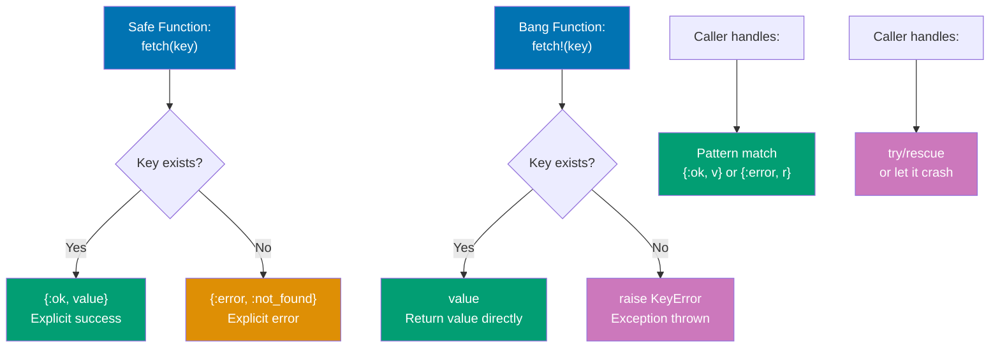

### Exception Conventions

**Custom Exceptions**: Define with `defexception` (creates struct with `__exception__: true`)
**Message Protocol**: Implement `message/1` for formatted error messages
**Bang Functions**: `!` suffix indicates function may raise (e.g., `fetch!/1` vs `fetch/1`)
**Return Tuples**: Safe functions return `{:ok, value}` or `{:error, reason}`

### Safe vs Bang Functions

| Pattern    | Return Type                        | Error Handling        | Use Case                           |
| ---------- | ---------------------------------- | --------------------- | ---------------------------------- |
| `fetch/1`  | `{:ok, value} \| {:error, reason}` | Explicit error tuples | Caller handles errors              |
| `fetch!/1` | `value`                            | Raises exception      | Errors unexpected or unrecoverable |

**Code**:

```elixir
defmodule MyApp.ValidationError do
  # => Custom exception with default values
  defexception message: "Validation failed", field: nil
  # => Fields: message (string), field (atom or nil)

  @impl true
  def message(exception) do
    # => Exception protocol callback for formatted messages
    "Validation failed for field: #{exception.field}"
    # => Interpolates field name into message
  end
end

defmodule MyApp.NotFoundError do
  # => Custom exception with list syntax (all fields default to nil)
  defexception [:resource, :id]
  # => Fields: resource (type), id (identifier)

  @impl true
  def message(exception) do
    # => Custom message format
    "#{exception.resource} with id #{exception.id} not found"
    # => Human-readable 404-style error
  end
end

defmodule UserValidator do
  # => Validation module with bang functions (! means may raise)

  def validate_age!(age) when is_integer(age) and age >= 0 and age < 150, do: :ok
  # => Happy path: age is integer in valid range [0, 150)
  # => Returns: :ok

  def validate_age!(age) when is_integer(age) do
    # => Integer but out of range (age < 0 or age >= 150)
    raise MyApp.ValidationError, field: :age, message: "Age must be between 0 and 150, got: #{age}"
    # => Raises with specific error message
  end

  def validate_age!(_age) do
    # => Catch-all: not an integer
    raise MyApp.ValidationError, field: :age, message: "Age must be an integer"
  end

  def validate_email!(email) when is_binary(email) do
    # => Email validation (is_binary checks string type)
    if String.contains?(email, "@") do
      :ok
      # => Success: email has @ symbol
    else
      raise MyApp.ValidationError, field: :email, message: "Email must contain @"
      # => Basic validation (production would use regex)
    end
  end

  def validate_email!(_email) do
    # => Catch-all: email is not a string
    raise MyApp.ValidationError, field: :email, message: "Email must be a string"
  end
end

UserValidator.validate_age!(30)
# => Valid age: returns :ok

UserValidator.validate_email!("alice@example.com")
# => Valid email: returns :ok

# Example: age validation failure (out of range)
# UserValidator.validate_age!(200)
# => Raises MyApp.ValidationError: "Age must be between 0 and 150, got: 200"

# Example: age validation failure (wrong type)
# UserValidator.validate_age!("30")
# => Raises MyApp.ValidationError: "Age must be an integer"

defmodule UserRepo do
  # => Repository demonstrating safe/bang function pairs

  def fetch(id) when id > 0 and id < 100 do
    # => Safe fetch: returns result tuple
    {:ok, %{id: id, name: "User #{id}"}}
    # => Success: {:ok, user_map}
  end

  def fetch(_id), do: {:error, :not_found}
  # => Catch-all: invalid ID returns error tuple

  def fetch!(id) do
    # => Bang version: unwraps result or raises
    case fetch(id) do
      {:ok, user} -> user
      # => Success: unwrap tuple, return bare user map

      {:error, :not_found} ->
        # => Failure: raise custom exception
        raise MyApp.NotFoundError, resource: "User", id: id
        # => Exception message: "User with id <id> not found"
    end
  end
end

UserRepo.fetch(1)
# => Returns: {:ok, %{id: 1, name: "User 1"}}

UserRepo.fetch(999)
# => Returns: {:error, :not_found}

UserRepo.fetch!(1)
# => Returns: %{id: 1, name: "User 1"} (unwrapped)

# Example: bang function raising exception
# UserRepo.fetch!(999)
# => Raises MyApp.NotFoundError: "User with id 999 not found"
```

**Key Takeaway**: Raise exceptions for unexpected, unrecoverable errors. Define custom exceptions for domain-specific errors. Use the `!` convention: functions ending with `!` raise exceptions, non-bang versions return result tuples.

**Why It Matters**: The safe/bang function pattern enables explicit error handling while maintaining convenience for happy paths. In production, Phoenix controller actions use bang functions when errors are exceptional (`Repo.get!/2` for authenticated user lookups that should always succeed), while background jobs use safe functions (`Repo.fetch/1`) to handle not-found cases gracefully. Custom exceptions like `Ecto.NoResultsError` and `Phoenix.Router.NoRouteError` provide domain-specific error information for debugging and error tracking services, while the `!` suffix signals to developers which functions require error handling and which assume success.

---

## Example 43: Spawning Processes

Processes are Elixir's lightweight concurrency primitive. Each process has its own memory and communicates via message passing. Use `spawn/1` or `spawn_link/1` to create processes.

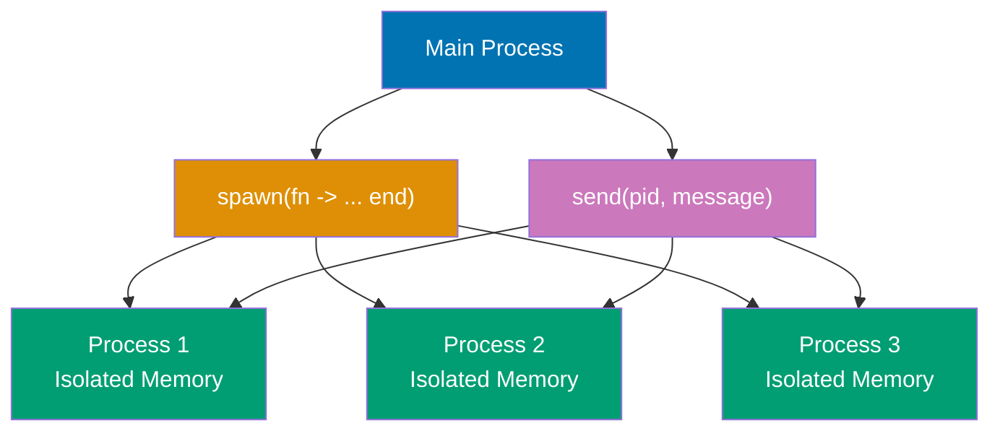

### Process Lifecycle

**Spawning**: `spawn/1` or `spawn/3` creates new BEAM process with isolated memory
**Execution**: Process runs concurrently (non-blocking), executes function, then exits
**Isolation**: Each process has separate memory (data copied, not shared)
**Lifecycle**: Check status with `Process.alive?/1`, inspect with `Process.info/1`

### spawn/1 vs spawn_link/1

| Function       | Behavior                                           | Use Case                            |
| -------------- | -------------------------------------------------- | ----------------------------------- |
| `spawn/1`      | Isolated processes (crashes don't propagate)       | Independent tasks, fire-and-forget  |
| `spawn_link/1` | Linked processes (bidirectional crash propagation) | Supervised tasks, dependent workers |

**Code**:

```elixir
# Basic process spawning
pid = spawn(fn -> IO.puts("Hello from spawned process!") end)
# => Creates new BEAM process executing function concurrently
# => Returns: PID (process identifier) e.g. #PID<0.150.0>
# => Process exits when function completes (non-blocking)

Process.alive?(pid)
# => Checks if process is still running
# => Returns: false (process finished in microseconds)

# Long-running process example
long_process = spawn(fn ->
  # => Process sleeps before completing
  :timer.sleep(1000)
  # => Blocks process for 1 second (parent continues immediately)
  IO.puts("Finished after 1 second")
end)
# => Returns: PID of long-running process

Process.alive?(long_process)
# => Returns: true (process still sleeping)

:timer.sleep(1500)
# => Parent sleeps 1.5s (ensures child finishes)

Process.alive?(long_process)
# => Returns: false (child exited ~0.5s ago)

# Getting current process PID
self()
# => Returns PID of current (calling) process
# => Example: #PID<0.100.0>

# Spawning multiple processes
pids = Enum.map(1..5, fn i ->
  # => Creates 5 concurrent processes
  spawn(fn -> IO.puts("Process #{i}") end)
  # => Processes run concurrently (order not guaranteed)
  # => i: captured from parent scope (closure)
end)
# => Returns: list of 5 PIDs [#PID<0.151.0>, ...]

# Using module function with spawn
defmodule Worker do
  def work(n) do
    # => Worker function simulating task processing
    IO.puts("Working on task #{n}")
    :timer.sleep(100)
    # => Simulates 100ms work
    IO.puts("Task #{n} done!")
  end
end

spawn(Worker, :work, [1])
# => spawn/3: spawns process calling Worker.work(1)
# => Equivalent to: spawn(fn -> Worker.work(1) end)
# => Returns: PID

# Linked processes (crash propagation)
parent_pid = self()
# => Stores parent PID for reference
child = spawn_link(fn ->
  # => spawn_link/1: creates bidirectional link
  # => If either crashes, both crash (unless trapping exits)
  :timer.sleep(500)
  raise "Child process crashed!"
  # => Child crashes, propagates to parent via link
  # => WARNING: Parent crashes unless trapping exits
end)
# => Returns: PID of linked child

# Process introspection
pid = spawn(fn -> :timer.sleep(5000) end)
# => Long-lived process (5s sleep) for inspection

Process.info(pid)
# => Returns: keyword list with process information
# => [{:registered_name, []}, {:current_function, {:timer, :sleep, 1}}, ...]
# => Returns nil if process not alive

Process.info(pid, :status)
# => Queries specific field (e.g., :status)
# => Returns: {:status, :waiting} (process in sleep)
# => States: :running, :runnable, :suspended, :garbage_collecting

# Mass process creation (demonstrates lightweight processes)
Enum.each(1..10_000, fn _ ->
  # => Creates 10,000 concurrent processes
  spawn(fn -> :timer.sleep(10_000) end)
  # => Each process sleeps 10s
  # => Memory per process: ~2KB (very lightweight)
  # => Total: ~20MB for 10,000 processes
end)
# => All processes run concurrently (BEAM scheduler distributes across cores)

# Memory isolation demonstration
defmodule Isolation do
  def demonstrate do
    # => Shows data is copied, not shared between processes
    list = [1, 2, 3]
    # => Parent has list [1, 2, 3]
    spawn(fn ->
      # => Child receives COPY of list (no shared memory)
      modified_list = [0 | list]
      # => Child prepends 0: [0, 1, 2, 3]
      # => Parent's list unchanged
      IO.inspect(modified_list, label: "Child process")
      # => Prints: Child process: [0, 1, 2, 3]
    end)
    :timer.sleep(100)
    # => Wait for child to print
    IO.inspect(list, label: "Parent process")
    # => Prints: Parent process: [1, 2, 3]
    # => Proves: processes have isolated memory
  end
end

Isolation.demonstrate()
# => Output shows parent and child have different lists
# => Memory isolation: no shared state between processes
```

**Key Takeaway**: Processes are lightweight, isolated, and communicate via messages. Use `spawn/1` for independent processes, `spawn_link/1` for linked processes. Elixir can run millions of processes concurrently.

**Why It Matters**: BEAM's lightweight process model enables massive concurrency on modest hardware. Each process consumes only ~2KB memory, allowing systems to spawn millions of processes for handling concurrent connections, background jobs, or parallel data processing. In production, this powers Phoenix applications serving 2+ million WebSocket connections per server, parallel ETL pipelines processing millions of records concurrently, and real-time systems maintaining one process per user session without resource exhaustion.

---

## Example 44: Send and Receive

Processes communicate by sending and receiving messages. Messages go into a process mailbox and are processed with `receive`. This is asynchronous message passing—the sender doesn't block.

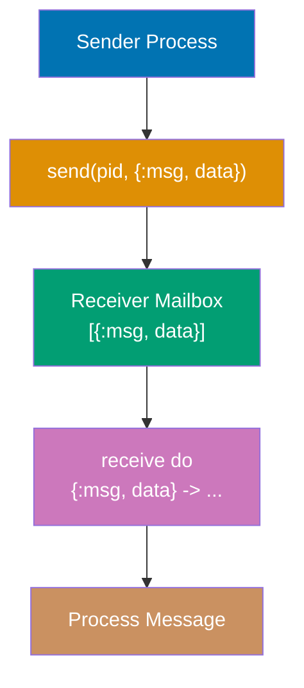

**Code**:

```elixir
# Basic bidirectional message passing
receiver = spawn(fn ->
  # => Spawns receiver process
  # => Process waits for incoming messages
  receive do
    # => receive block: pattern matches messages from mailbox
    # => Blocks until matching message arrives
    # => Messages queued in FIFO order
    {:hello, sender} -> send(sender, {:hi, self()})
    # => Pattern 1: matches {:hello, <sender_pid>}
    # => sender: extracted from tuple (caller's PID)
    # => send/2: sends message to sender
    # => self(): receiver's own PID
    # => Reply: {:hi, <receiver_pid>}
    # => Non-blocking send (returns immediately)

    {:goodbye, sender} -> send(sender, {:bye, self()})
    # => Pattern 2: matches {:goodbye, <sender_pid>}
    # => Different message type, different response
    # => Reply: {:bye, <receiver_pid>}
  end
  # => After processing one message, process exits
  # => No loop: single-message receiver
end)

send(receiver, {:hello, self()})
# => send/2: sends message to receiver process
# => Message: {:hello, <parent_pid>}
# => Goes into receiver's mailbox
# => Async: sender doesn't wait for processing
# => Returns: {:hello, <parent_pid>} (the message sent)

receive do
  # => Parent waits for reply from receiver
  {:hi, pid} -> IO.puts("Received hi from #{inspect(pid)}")
  # => Matches {:hi, <receiver_pid>}
  # => pid: bound to receiver's PID
  # => Prints: "Received hi from #PID<0.X.Y>"
  # => Process continues after receiving reply
end

# Receive with timeout (prevents infinite blocking)
spawn(fn ->
  # => Spawns process that waits for message with timeout
  receive do
    :message -> IO.puts("Got message")
    # => Matches :message atom
    # => Would print if message received within timeout
  after
    # => after clause: timeout handler
    # => Executes if no matching message arrives in time
    1000 -> IO.puts("No message received after 1 second")
    # => 1000ms timeout (1 second)
    # => Prints timeout message
    # => Process exits after timeout
  end
end)
# => Process waits 1 second, times out, prints, exits
# => No message sent, so timeout always triggers

# Multiple message patterns
receiver = spawn(fn ->
  # => New receiver with multiple pattern handlers
  receive do
    {:add, a, b} -> IO.puts("Sum: #{a + b}")
    # => Pattern: {:add, number, number}
    # => Extracts a and b from tuple
    # => Prints sum result

    {:multiply, a, b} -> IO.puts("Product: #{a * b}")
    # => Pattern: {:multiply, number, number}
    # => Different operation, same structure
    # => Prints product result

    unknown -> IO.puts("Unknown message: #{inspect(unknown)}")
    # => Catch-all pattern: matches any message
    # => unknown: binds to entire message
    # => inspect/1: converts term to readable string
    # => Handles unexpected message formats
  end
end)

send(receiver, {:add, 5, 3})
# => Sends {:add, 5, 3} to receiver
# => Matches first pattern
# => Prints: Sum: 8
# => Process exits after handling message

# Echo server (recursive receive loop)
defmodule Echo do
  # => Module implementing echo server pattern
  def loop do
    # => Recursive function: processes messages indefinitely
    receive do
      {:echo, msg, sender} ->
        # => Pattern: {:echo, message, sender_pid}
        # => Receives message and sender PID
        send(sender, {:reply, msg})
        # => Echoes message back to sender
        # => Reply: {:reply, <original_msg>}
        loop()
        # => Recursive call: continue receiving
        # => Tail-recursive: no stack growth
        # => Process remains alive for next message

      :stop -> :ok
      # => Stop signal: breaks recursion
      # => Returns :ok (function exits)
      # => Process terminates after receiving :stop
    end
  end
end

echo_pid = spawn(&Echo.loop/0)
# => spawn(&Fun/Arity): spawns with function reference
# => &Echo.loop/0: captures Echo.loop function
# => Echo server starts, waiting for messages
# => Returns: PID of echo server

send(echo_pid, {:echo, "Hello", self()})
# => Sends echo request with message "Hello"
# => Includes parent PID for reply
# => Message: {:echo, "Hello", <parent_pid>}

receive do
  {:reply, msg} -> IO.puts("Echo replied: #{msg}")
  # => Waits for echo reply
  # => Matches {:reply, "Hello"}
  # => Prints: "Echo replied: Hello"
end

send(echo_pid, {:echo, "World", self()})
# => Second echo request
# => Echo server still running (due to loop())
# => Message: {:echo, "World", <parent_pid>}

receive do
  {:reply, msg} -> IO.puts("Echo replied: #{msg}")
  # => Waits for second reply
  # => Matches {:reply, "World"}
  # => Prints: "Echo replied: World"
end

send(echo_pid, :stop)
# => Sends stop signal to echo server
# => Matches :stop pattern
# => Echo server exits (no more loop())
# => Process terminates cleanly

# FIFO message ordering
pid = self()
# => Get current process PID
send(pid, :first)
# => Send message 1 to self
# => Mailbox: [:first]
send(pid, :second)
# => Send message 2 to self
# => Mailbox: [:first, :second] (FIFO order)
send(pid, :third)
# => Send message 3 to self
# => Mailbox: [:first, :second, :third]

receive do: (:first -> IO.puts("1"))
# => Compact syntax: single-clause receive
# => Matches and removes :first from mailbox
# => Prints: 1
# => Mailbox after: [:second, :third]

receive do: (:second -> IO.puts("2"))
# => Matches and removes :second (now at head)
# => Prints: 2
# => Mailbox after: [:third]

receive do: (:third -> IO.puts("3"))
# => Matches and removes :third
# => Prints: 3
# => Mailbox after: [] (empty)
# => Demonstrates FIFO: messages processed in send order

# flush() - clear mailbox
send(self(), :msg1)
# => Send message to self
# => Mailbox: [:msg1]
send(self(), :msg2)
# => Mailbox: [:msg1, :msg2]

flush()
# => flush/0: prints all messages in mailbox
# => Removes all messages from mailbox
# => Prints: :msg1, :msg2
# => Mailbox after: [] (empty)
# => Useful for debugging and cleanup

# Asynchronous message sending (non-blocking)
pid = spawn(fn ->
  :timer.sleep(2000)
  # => Process sleeps for 2 seconds before receiving
  # => Simulates slow message processing
  receive do
    msg -> IO.puts("Received: #{inspect(msg)}")
    # => Pattern matches any message
    # => Will print after 2-second sleep
  end
end)

send(pid, :hello)
# => Sends message while process is sleeping
# => Message queued in mailbox immediately
# => send/2 returns instantly (doesn't wait for receive)
# => Returns: :hello (the message)

IO.puts("Sent message, continuing...")
# => Prints immediately after send (proves non-blocking)
# => Parent continues while child sleeps
# => Message will be processed in 2 seconds

# Messages can be any Elixir term
send(self(), {:tuple, 1, 2})
# => Tuple message
# => Mailbox: [{:tuple, 1, 2}]
send(self(), [1, 2, 3])
# => List message
# => Mailbox: [{:tuple, 1, 2}, [1, 2, 3]]
send(self(), %{key: "value"})
# => Map message
# => Mailbox: [..., %{key: "value"}]
send(self(), "string")
# => String message
# => Mailbox: [..., "string"]
send(self(), 42)
# => Integer message
# => Mailbox: [..., 42]

flush()
# => Prints all 5 messages
# => {:tuple, 1, 2}
# => [1, 2, 3]
# => %{key: "value"}
# => "string"
# => 42
# => Demonstrates: messages can be any Elixir term
# => Mailbox cleared after flush
```

**Key Takeaway**: Processes communicate via asynchronous message passing. `send/2` puts messages in the mailbox, `receive` pattern matches and processes them. Messages are queued in FIFO order.

**Why It Matters**: GenServer state immutability combined with handle_continue enables atomic state transitions without race conditions. handle_continue executes before processing other messages, guaranteeing initialization completes before requests arrive. In production GenServers managing database connections, handle_continue establishes the connection atomically—if it fails, init returns error and supervisor restarts, preventing half-initialized states that could serve requests with invalid connections.

---

## Example 45: Process Monitoring

Process monitoring allows you to detect when other processes crash or exit. Use `Process.monitor/1` to watch a process and receive a message when it exits.

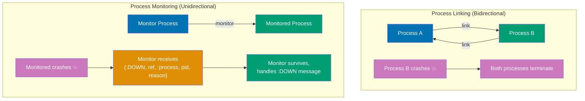

### Monitoring vs Linking

| Feature           | Monitoring                                  | Linking                             |
| ----------------- | ------------------------------------------- | ----------------------------------- |
| Direction         | Unidirectional (one watches another)        | Bidirectional (both crash together) |
| Crash Propagation | No (monitor survives, gets `:DOWN` message) | Yes (both processes crash)          |
| Use Case          | Detect failures, health checks              | Supervised tasks, dependent workers |
| Message           | `:DOWN` tuple with exit reason              | `:EXIT` signal (unless trapping)    |

### Monitor Message Format

`:DOWN` message: `{:DOWN, ref, :process, pid, reason}`

- `ref`: Monitor reference (from `Process.monitor/1`)
- `pid`: Monitored process PID
- `reason`: Exit reason (`:normal`, exception tuple, `:killed`, etc.)

**Code**:

```elixir
# Basic process monitoring (crash detection)
pid = spawn(fn ->
  # => Spawns process that crashes after 1s
  :timer.sleep(1000)
  raise "Process crashed!"
  # => Raises RuntimeError, exits abnormally
end)

ref = Process.monitor(pid)
# => Starts monitoring (unidirectional: this watches pid)
# => Returns: reference e.g. #Reference<0.1234.5678>
# => Monitor doesn't crash monitoring process (unlike link)

receive do
  {:DOWN, ^ref, :process, ^pid, reason} ->
    # => Pattern: {:DOWN, ref, :process, pid, exit_reason}
    # => ^ref, ^pid: pin operators ensure correct monitor/process
    # => reason: crash reason (exception tuple + stacktrace)
    IO.puts("Process #{inspect(pid)} exited with reason: #{inspect(reason)}")
after
  2000 -> IO.puts("No exit message received")
  # => Timeout: 2s (safety net)
end
# => Monitor auto-removed after :DOWN received

# Monitoring normal exit
pid = spawn(fn ->
  # => Process exits normally after 0.5s
  :timer.sleep(500)
  :ok  # Normal exit
  # => Exits with reason :normal
end)

ref = Process.monitor(pid)
# => Monitors normal and abnormal exits

receive do
  {:DOWN, ^ref, :process, ^pid, reason} ->
    # => reason: :normal (not error tuple)
    IO.puts("Process exited normally with reason: #{inspect(reason)}")
    # => Prints: "Process exited normally with reason: :normal"
after
  1000 -> IO.puts("No exit")
end

# Demonitor - stop monitoring
pid = spawn(fn -> :timer.sleep(10_000) end)
# => Long-running process (10s)
ref = Process.monitor(pid)
# => Start monitoring
Process.demonitor(ref)  # Stop monitoring
# => Removes monitor, no :DOWN message sent
# => Process still runs, just not monitored
Process.exit(pid, :kill)  # Kill the process
# => :kill: brutal termination (cannot be trapped)
# => No :DOWN (already demonitored)

# Monitor multiple processes (parallel work tracker)
pids = Enum.map(1..5, fn i ->
  # => Creates 5 processes with staggered completion (100-500ms)
  spawn(fn ->
    :timer.sleep(i * 100)
    # => Process 1: 100ms, Process 2: 200ms, ..., Process 5: 500ms
    IO.puts("Process #{i} done")
  end)
end)
# => All processes run concurrently

refs = Enum.map(pids, &Process.monitor/1)
# => Monitor all processes
# => &Process.monitor/1: function capture syntax
# => refs: list of 5 monitor references

Enum.each(refs, fn ref ->
  # => Wait for each process to complete
  receive do
    {:DOWN, ^ref, :process, _pid, :normal} -> :ok
    # => Match specific ref (^ref pin operator)
    # => Expect normal exit
  end
end)
# => Total wait: ~500ms (concurrent, not sequential)
IO.puts("All processes finished")
# => Coordination pattern: wait for multiple tasks

# TimeoutHelper - production pattern for process timeout
defmodule TimeoutHelper do
  # => Implements timeout pattern with monitoring
  def call_with_timeout(fun, timeout) do
    # => Executes fun with timeout limit
    parent = self()
    # => Capture parent PID (child sends result here)
    pid = spawn(fn ->
      # => Spawn child to execute function
      result = fun.()
      # => Execute function (crashes child if fun raises)
      send(parent, {:result, self(), result})
      # => Send result to parent
    end)

    ref = Process.monitor(pid)
    # => Monitor child (detects crash before result sent)

    receive do
      {:result, ^pid, result} ->
        # => Success: function completed
        Process.demonitor(ref, [:flush])
        # => Cleanup: remove monitor and flush pending :DOWN
        {:ok, result}

      {:DOWN, ^ref, :process, ^pid, reason} ->
        # => Child crashed before completing
        {:error, {:process_died, reason}}
    after
      timeout ->
        # => Timeout: child too slow
        Process.exit(pid, :kill)
        # => Kill child (prevents zombie processes)
        Process.demonitor(ref, [:flush])
        # => Cleanup monitor
        {:error, :timeout}
    end
    # => Returns: {:ok, result} | {:error, {:process_died, reason}} | {:error, :timeout}
  end
end

# Success case - completes within timeout
TimeoutHelper.call_with_timeout(fn -> :timer.sleep(500); 42 end, 1000)  # => {:ok, 42}
# => 500ms < 1000ms: completes successfully

# Timeout case - exceeds timeout
TimeoutHelper.call_with_timeout(fn -> :timer.sleep(2000); 42 end, 1000)  # => {:error, :timeout}
# => 2000ms > 1000ms: exceeds timeout
# => Child killed, returns {:error, :timeout}
```

**Key Takeaway**: Use `Process.monitor/1` to watch processes and receive `:DOWN` messages when they exit. Monitoring is unidirectional (unlike linking) and ideal for detecting process failures without crashing.

**Why It Matters**: Process monitoring enables unidirectional failure detection, crucial for building resilient systems. In production, GenServers monitor database connection processes to detect disconnects without being killed themselves (enabling graceful degradation), Phoenix connection pools monitor worker processes and spawn replacements for crashed workers, and distributed Erlang nodes monitor remote processes to detect network partitions. The `TimeoutHelper` pattern prevents deadlocks by killing slow processes, implementing circuit breakers that timeout on unresponsive backends rather than accumulating blocked processes that exhaust system resources.

---

## Example 46: Task Module (Async/Await)

The `Task` module provides a simple abstraction for spawning processes and awaiting results. It's built on processes but handles boilerplate for async/await patterns.

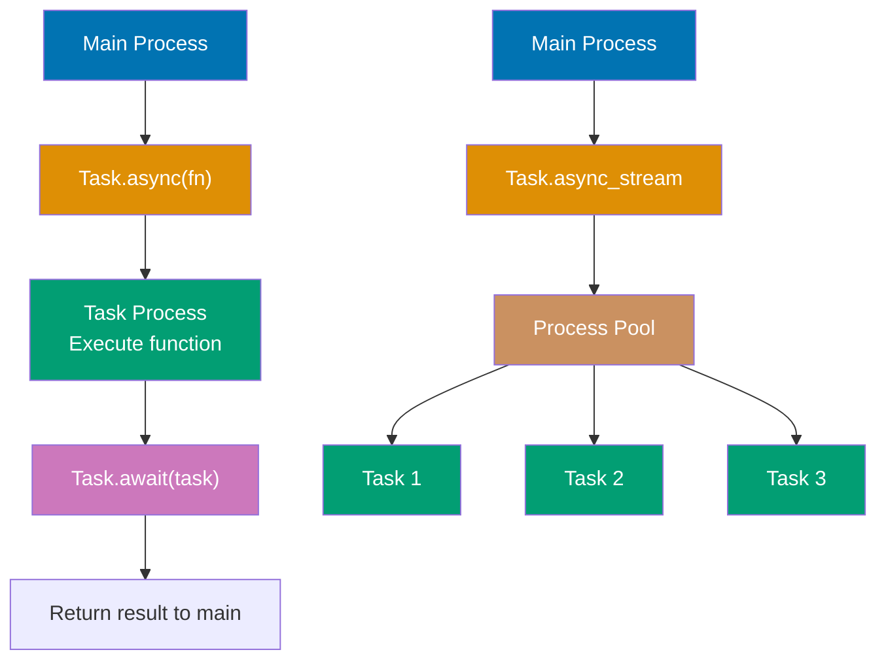

### Task Functions Comparison

| Function              | Return Type            | Blocking | Use Case             | Cleanup  |
| --------------------- | ---------------------- | -------- | -------------------- | -------- |
| `Task.async/1`        | `%Task{}`              | No       | Await result later   | Linked   |
| `Task.await/2`        | `result`               | Yes      | Get task result      | Auto     |
| `Task.yield/2`        | `{:ok, result} \| nil` | No       | Poll without error   | Manual   |
| `Task.start/1`        | `{:ok, pid}`           | No       | Fire-and-forget      | Unlinked |
| `Task.async_stream/3` | `Stream.t()`           | No       | Parallel collections | Auto     |

### Timeout Behavior

- **`Task.await/2`**: Raises `Task.TimeoutError` on timeout (default: 5000ms)
- **`Task.yield/2`**: Returns `nil` on timeout (non-blocking check)
- **Orphaned tasks**: Continue running after timeout (potential leak)

**Code**:

```elixir
# Basic async/await pattern
task = Task.async(fn ->
  # => Spawns process to execute function concurrently
  # => Returns: %Task{pid: <pid>, ref: <ref>, owner: <owner>}
  :timer.sleep(1000)
  # => Simulates 1s computation (task runs, caller continues)
  42
  # => Return value for Task.await/1
end)
# => Task struct: %Task{pid: #PID<0.150.0>, ...}

IO.puts("Task started, doing other work...")
# => Prints immediately (non-blocking)

result = Task.await(task)  # => 42
# => Blocks until task completes (~1s wait)
# => Returns: task function's return value
IO.puts("Task result: #{result}")
# => Prints: "Task result: 42"

# Multiple parallel tasks
tasks = Enum.map(1..5, fn i ->
  # => Creates 5 concurrent tasks
  Task.async(fn ->
    # => Each task in separate process
    :timer.sleep(i * 200)
    # => Task 1: 200ms, Task 2: 400ms, ..., Task 5: 1000ms
    i * i
    # => Return square: 1, 4, 9, 16, 25
  end)
end)
# => 5 Task structs, all processes running concurrently

results = Enum.map(tasks, &Task.await/1)  # => [1, 4, 9, 16, 25]
# => Await all tasks sequentially
# => &Task.await/1: function capture syntax
# => Total wait: ~1000ms (concurrent, not 3000ms sequential)
IO.inspect(results)
# => Prints: [1, 4, 9, 16, 25]

# Task timeout with exception
task = Task.async(fn ->
  # => Spawns slow task (10 seconds)
  :timer.sleep(10_000)
  :done
  # => Never reached (timeout occurs first)
end)

try do
  Task.await(task, 1000)  # Timeout after 1 second
  # => Wait max 1000ms (task needs 10000ms)
  # => Raises Task.TimeoutError after 1s
  # => WARNING: Task process keeps running (orphaned)
rescue
  e in Task.TimeoutError ->
    # => Catches timeout exception
    IO.puts("Task timed out: #{inspect(e)}")
    # => Prints timeout error details
end
# => Task process still running in background

# Task.yield - non-blocking check
task = Task.async(fn ->
  # => Task takes 2 seconds
  :timer.sleep(2000)
  :result
end)

case Task.yield(task, 500) do
  # => Non-blocking: returns immediately after 500ms
  # => Does NOT raise exception on timeout
  {:ok, result} -> IO.puts("Got result: #{result}")
  # => Task completed within 500ms (won't match, needs 2000ms)
  nil -> IO.puts("Task still running after 500ms")
  # => Task not completed, returns nil (not error tuple)
  # => Prints: "Task still running after 500ms"
end
# => Task process still alive (continues running)

case Task.yield(task, 2000) do
  # => Second yield: wait up to 2000ms more
  # => Task has ~1500ms remaining (completes in time)
  {:ok, result} -> IO.puts("Got result: #{result}")
  # => Task completed, returns {:ok, :result}
  # => Prints: "Got result: result"
  nil -> IO.puts("Still running")
  # => Won't match (task completes in ~1500ms)
end
# => Total elapsed: ~2000ms (500ms + 1500ms)

# Task.start - fire and forget
Task.start(fn ->
  # => Spawns unlinked task (returns {:ok, pid}, not %Task{})
  # => No await needed (fire-and-forget pattern)
  :timer.sleep(1000)
  IO.puts("Background task completed")
  # => Prints after 1 second asynchronously
end)
# => Returns: {:ok, #PID<0.160.0>}
IO.puts("Main process continues immediately")
# => Prints immediately (doesn't wait)

# Task.async_stream - parallel collection processing
results = 1..10
          |> Task.async_stream(fn i ->
            # => Processes collection in parallel with bounded concurrency
            # => Preserves element ordering in results
            :timer.sleep(100)
            # => Each task sleeps 100ms
            i * i
            # => Compute square: 1, 4, 9, ..., 100
          end, max_concurrency: 4)
          # => At most 4 tasks run simultaneously
          # => As tasks complete, new tasks start (batched execution)
          # => Returns: stream of {:ok, result} tuples
          |> Enum.to_list()
          # => Force stream evaluation (blocks until all complete)
          # => Total time: ~300ms (10 elements / 4 concurrency * 100ms)
# => [{:ok, 1}, {:ok, 4}, {:ok, 9}, ..., {:ok, 100}]

# Error handling in tasks
task = Task.async(fn ->
  # => Task that crashes
  raise "Task error!"
  # => Task process crashes immediately
end)

try do
  Task.await(task)
  # => Task crashed, exception propagated to caller
  # => Re-raises RuntimeError in caller's context
rescue
  e -> IO.puts("Caught error: #{inspect(e)}")
  # => Catches %RuntimeError{message: "Task error!"}
end
# => Task process terminated (crashed)

# Task.Supervisor - supervised tasks
{:ok, result} = Task.Supervisor.start_link()
# => Starts task supervisor for managed task processes
# => Provides isolation: task crashes don't affect caller
# => Returns: {:ok, #PID<supervisor_pid>}
```

**Key Takeaway**: `Task` provides async/await abstraction over processes. Use `Task.async/1` and `Task.await/1` for parallel work with results. Use `Task.async_stream/3` for processing collections in parallel.

**Why It Matters**: Task module simplifies concurrent programming with async/await semantics familiar to developers from other languages. In production, `Task.async_stream/3` with bounded concurrency prevents resource exhaustion when processing large datasets (e.g., 1 million API calls limited to 100 concurrent), `Task.yield/2` enables polling patterns for graceful degradation under load, and supervised tasks via `Task.Supervisor` isolate failures in background job processors. The lightweight process model enables tens of thousands of concurrent tasks on modest hardware.

---

## Example 47: ExUnit Basics

ExUnit is Elixir's built-in testing framework. Tests are organized into test modules, and assertions verify expected behavior. Running `mix test` executes all tests in your project.

### Key ExUnit Features

| Feature              | Purpose                 | Example                             |
| -------------------- | ----------------------- | ----------------------------------- |
| `use ExUnit.Case`    | Import test macros      | Required in test modules            |
| `test "description"` | Define test case        | `test "adds numbers" do ... end`    |
| `assert`             | Verify truthy value     | `assert 1 + 1 == 2`                 |
| `refute`             | Verify falsy value      | `refute 1 > 2`                      |
| `assert_raise`       | Verify exception        | `assert_raise Error, fn -> ... end` |
| `setup`              | Per-test initialization | Runs before each test               |
| `setup_all`          | One-time initialization | Runs before all tests               |
| `@tag`               | Categorize tests        | `@tag :slow` for selective runs     |

### Test Organization

- **Module naming**: `<ModuleName>Test` convention
- **File location**: `test/` directory
- **Discovery**: `mix test` auto-discovers test modules
- **Execution**: Tests run in random order (ensures independence)

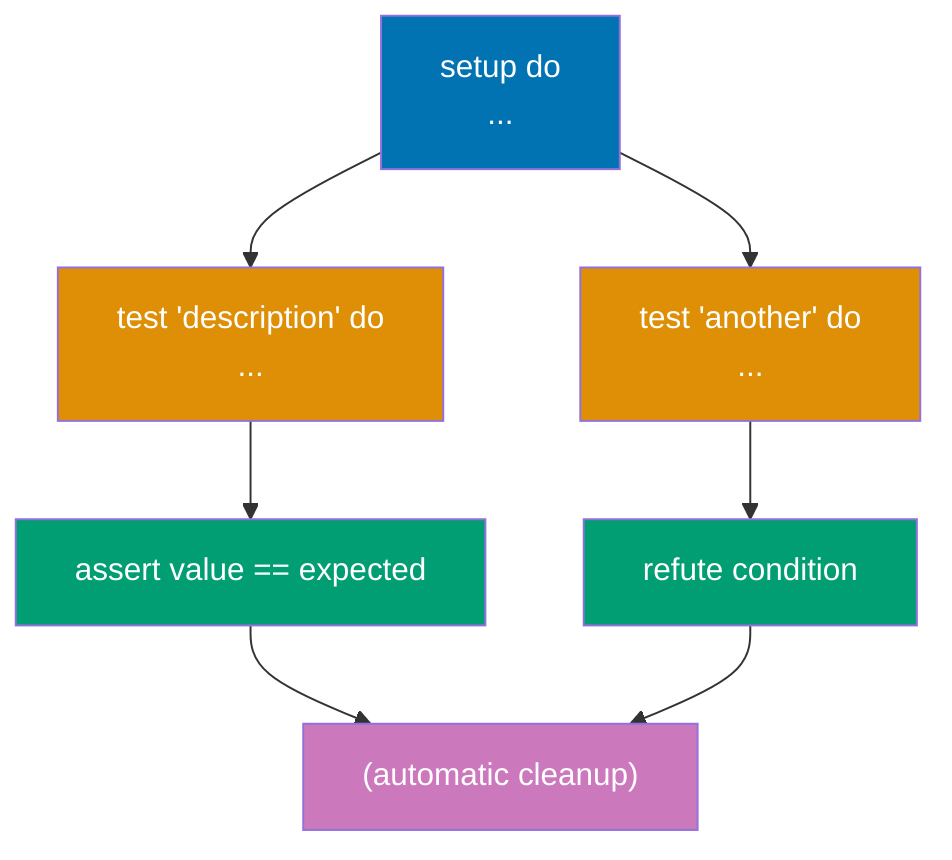

**Code**:

```elixir
defmodule MathTest do
  use ExUnit.Case
  # => Imports test macros (test, assert, refute, setup)

  test "addition works" do
    assert 1 + 1 == 2
    # => Passes if expression truthy
  end

  test "subtraction works" do
    assert 5 - 3 == 2
    # => Tests run in random order
  end

  test "multiplication and division" do
    assert 2 * 3 == 6
    # => Multiple assertions per test
    assert 10 / 2 == 5.0
    # => Division returns float
    assert rem(10, 3) == 1
    # => rem/2: remainder function
  end

  test "boolean assertions" do
    assert true
    # => Verifies truthy value
    refute false
    # => Verifies falsy value (inverse of assert)
    assert 1 < 2
    refute 1 > 2
  end

  test "pattern matching" do
    assert {:ok, value} = {:ok, 42}
    # => Pattern match in assertion
    assert value == 42
    # => value bound to 42
  end

  test "raises exception" do
    assert_raise ArithmeticError, fn ->
      1 / 0
      # => Division by zero raises ArithmeticError
    end
  end

  test "raises with message" do
    assert_raise ArgumentError, "Invalid", fn ->
      raise ArgumentError, "Invalid"
      # => Exact message match required
    end
  end

  setup do
    {:ok, user: %{name: "Alice", age: 30}}
    # => Runs before EACH test, returns context
  end

  test "uses setup data", %{user: user} do
    assert user.name == "Alice"
    # => Pattern matches context from setup
    assert user.age == 30
  end
end

defmodule Calculator do
  def add(a, b), do: a + b
  def subtract(a, b), do: a - b
  def multiply(a, b), do: a * b
  def divide(_a, 0), do: {:error, :division_by_zero}
  # => First clause: handles div by zero
  def divide(a, b), do: {:ok, a / b}
  # => Second clause: normal division
end

defmodule CalculatorTest do
  use ExUnit.Case

  test "add/2 adds two numbers" do
    assert Calculator.add(2, 3) == 5
    assert Calculator.add(-1, 1) == 0
  end

  test "divide/2 returns ok tuple" do
    assert Calculator.divide(10, 2) == {:ok, 5.0}
    # => Success case: {:ok, float}
  end

  test "divide/2 handles division by zero" do
    assert Calculator.divide(10, 0) == {:error, :division_by_zero}
    # => Error case: {:error, atom}
  end

  @tag :slow
  # => Tag for selective test execution
  test "slow test" do
    :timer.sleep(2000)
    # => Use: mix test --only slow OR --exclude slow
    assert true
  end

  @tag :skip
  # => Skips test execution
  test "skipped test" do
    assert false
    # => Use: mix test --include skip to run
  end
end
```

**Key Takeaway**: ExUnit provides testing with `assert`, `refute`, and `assert_raise`. Tests are organized in modules with `use ExUnit.Case`. Use `setup` for per-test initialization and tags to organize tests.

**Why It Matters**: Supervision trees organize processes hierarchically, isolating failures through layered recovery. Top-level supervisor restarts major subsystems, while leaf supervisors restart individual workers. In production Phoenix apps, the application supervisor manages Endpoint (web), Repo (database), and PubSub (messaging) supervisors, each managing their workers. When a database query crashes, only that worker restarts, not the web server—creating blast radius containment that maintains overall system availability.

---

## Example 48: Mix Project Structure

Mix is Elixir's build tool. It manages dependencies, compiles code, runs tests, and provides project scaffolding. Understanding the standard project structure is essential for Elixir development.

### Standard Project Structure

```
my_app/
├── mix.exs              # Project configuration
├── lib/                 # Application code
│   └── my_app.ex        # Main module
├── test/                # Test files
│   └── my_app_test.exs  # Tests
└── config/              # Configuration
    ├── config.exs       # Default config
    └── dev.exs          # Environment-specific
```

### mix.exs Key Fields

| Field                | Purpose            | Example                |
| -------------------- | ------------------ | ---------------------- |
| `app`                | Application name   | `:my_app`              |
| `version`            | Semantic version   | `"0.1.0"`              |
| `elixir`             | Min Elixir version | `"~> 1.15"`            |
| `deps`               | Dependencies list  | `[{:jason, "~> 1.4"}]` |
| `extra_applications` | OTP apps to start  | `[:logger]`            |

**Code**:

```elixir
# mix.exs - project configuration
defmodule MyApp.MixProject do
  use Mix.Project
  # => Imports Mix project macros

  def project do
    [
      app: :my_app,
      # => Application name (atom)
      version: "0.1.0",
      # => Semantic versioning: MAJOR.MINOR.PATCH
      elixir: "~> 1.15",
      # => ~> 1.15: allows 1.15.x (pessimistic constraint)
      start_permanent: Mix.env() == :prod,
      # => Restart on crash in :prod only
      deps: deps()
      # => Dependencies defined below
    ]
  end

  def application do
    [
      extra_applications: [:logger]
      # => Start Logger before this app
    ]
  end

  defp deps do
    [
      {:httpoison, "~> 2.0"},               # HTTP client
      {:jason, "~> 1.4"},                   # JSON parser
      {:ex_doc, "~> 0.30", only: :dev}      # Docs (dev only)
      # => Fetched from Hex.pm package registry
    ]
  end
end

# lib/my_app.ex - main module
defmodule MyApp do
  @moduledoc """
  Documentation for `MyApp`.
  """
  # => Module-level docs (appears in ExDoc)

  @doc """
  Hello world function.
  """
  # => Function-level docs
  def hello do
    :world
    # => Returns :world atom
  end
end

# test/my_app_test.exs - tests
defmodule MyAppTest do
  use ExUnit.Case
  doctest MyApp
  # => Runs doctests from @doc comments

  test "greets the world" do
    assert MyApp.hello() == :world
  end
end

# config/config.exs - configuration
import Config
# => Imports config/3 macro

config :my_app,
  api_key: "development_key",
  # => Available via Application.get_env/2
  timeout: 5000

import_config "#{Mix.env()}.exs"
# => Loads dev.exs, test.exs, or prod.exs

# Runtime config access
api_key = Application.get_env(:my_app, :api_key)
# => Returns "development_key" or nil
timeout = Application.get_env(:my_app, :timeout, 3000)
# => Returns 5000 or default 3000
```

**Key Takeaway**: Mix provides project scaffolding, dependency management, and build tools. Standard structure: `lib/` for code, `test/` for tests, `mix.exs` for configuration. Use `mix` commands to compile, test, and manage projects.

**Why It Matters**: OTP applications define supervision trees and lifecycle callbacks for release management. Applications start in dependency order (database before web server), enabling complex systems to initialize correctly. In production, Mix releases compile OTP applications into standalone packages with BEAM runtime, enabling deployment to servers without Erlang installed. Hot code upgrades use appup files to upgrade running applications without downtime—Erlang systems run for years with zero restart.

---

## Example 49: Doctests

Doctests embed tests in documentation using `@doc` comments. They verify that code examples in documentation actually work, keeping docs accurate and tested.

**Code**:

```elixir
defmodule StringHelper do
  # => Module with string manipulation functions
  # => Demonstrates doctests in @doc comments
  @moduledoc """
  Helper functions for string manipulation.
  """
  # => @moduledoc: module-level documentation
  # => Brief description of module purpose
  # => Appears in generated docs and IEx (h StringHelper)

  @doc """
  Reverses a string.

  ## Examples

      iex> StringHelper.reverse("hello")
      "olleh"

      iex> StringHelper.reverse("Elixir")
      "rixilE"

      iex> StringHelper.reverse("")
      ""
  """
  # => @doc: function-level documentation
  # => ## Examples section: contains doctests
  # => iex>: IEx prompt (indicates doctest line)
  # => Next line: expected output
  # => doctest/1 in test file extracts and runs these
  # => 3 examples test: normal case, different input, edge case (empty string)
  def reverse(string) do
    # => reverse/1: reverses string character by character
    # => Parameter: string (binary)
    String.reverse(string)
    # => String.reverse/1: built-in function
    # => Returns: reversed string
    # => "hello" → "olleh"
  end
  # => Function implementation matches doctest expectations
  # => Doctests verify function works as documented

  @doc """
  Counts words in a string.

  ## Examples

      iex> StringHelper.word_count("hello world")
      2

      iex> StringHelper.word_count("one")
      1

      iex> StringHelper.word_count("")
      0
  """
  # => ## Examples: 3 doctests
  # => Test cases: multiple words, single word, empty string
  # => Expected outputs: 2, 1, 0
  def word_count(string) do
    # => word_count/1: counts words separated by whitespace
    string
    |> String.split()
    # => String.split/1: splits on whitespace (default)
    # => "hello world" → ["hello", "world"]
    # => "" → []
    |> length()
    # => length/1: counts list elements
    # => ["hello", "world"] → 2
    # => [] → 0
  end
  # => Returns: word count (integer)
  # => Doctests verify: 2 words, 1 word, 0 words

  @doc """
  Capitalizes each word.

  ## Examples

      iex> StringHelper.capitalize_words("hello world")
      "Hello World"

      iex> StringHelper.capitalize_words("ELIXIR programming")
      "Elixir Programming"
  """
  # => ## Examples: 2 doctests
  # => Test cases: lowercase, mixed case
  # => Both should capitalize first letter of each word
  def capitalize_words(string) do
    # => capitalize_words/1: capitalizes first letter of each word
    string
    |> String.split()
    # => Split into words: "hello world" → ["hello", "world"]
    # => "ELIXIR programming" → ["ELIXIR", "programming"]
    |> Enum.map(&String.capitalize/1)
    # => Capitalize each word: ["hello", "world"] → ["Hello", "World"]
    # => String.capitalize/1: lowercase rest, uppercase first letter
    # => "ELIXIR" → "Elixir" (not "ELIXIR")
    |> Enum.join(" ")
    # => Join with space: ["Hello", "World"] → "Hello World"
    # => Enum.join/2: concatenates list with separator
  end
  # => Returns: capitalized string
  # => Doctests verify: lowercase input, mixed case input

  @doc """
  Checks if string is palindrome.

  ## Examples

      iex> StringHelper.palindrome?("racecar")
      true

      iex> StringHelper.palindrome?("hello")
      false

      iex> StringHelper.palindrome?("A man a plan a canal Panama" |> String.downcase() |> String.replace(" ", ""))
      true
  """
  # => ## Examples: 3 doctests
  # => Test cases: palindrome, non-palindrome, complex palindrome with pipe
  # => Third example: pipeline in doctest (valid syntax)
  def palindrome?(string) do
    # => palindrome?/1: checks if string reads same forwards/backwards
    # => Convention: ? suffix for boolean functions
    string == String.reverse(string)
    # => Compare string with its reverse
    # => "racecar" == "racecar" → true
    # => "hello" == "olleh" → false
    # => Returns: boolean
  end
  # => Doctests verify: true case, false case, preprocessed input
end
# => StringHelper complete: all functions have doctests

defmodule StringHelperTest do
  # => Test module for StringHelper
  use ExUnit.Case
  # => Import ExUnit testing macros
  doctest StringHelper  # Runs all doctests from @doc comments
  # => doctest/1: extracts examples from StringHelper @doc comments
  # => Scans for ## Examples sections
  # => Converts iex> lines to test assertions
  # => Total: 8 doctests (3 + 3 + 2 + 3 from all functions)
  # => Each doctest becomes separate test case
  # => Doctests run alongside regular tests

  # Additional regular tests
  test "reverse handles unicode" do
    # => Regular ExUnit test (not doctest)
    # => Tests edge case not in doctests (unicode)
    assert StringHelper.reverse("Hello 世界") == "界世 olleH"
    # => Verify unicode handling: Chinese characters reversed
    # => "Hello 世界" → "界世 olleH" (character-level reversal)
    # => Doctests + regular tests = comprehensive coverage
  end
  # => Best practice: doctests for basic cases, regular tests for edge cases
end
# => StringHelperTest complete: doctests + unicode test


# Calculator with multi-clause doctests
defmodule Calculator do
  # => Module demonstrating multi-clause functions with doctests
  @doc """
  Performs calculation based on operator.

  ## Examples

      iex> Calculator.calculate(5, :add, 3)
      8

      iex> Calculator.calculate(10, :subtract, 4)
      6

      iex> Calculator.calculate(3, :multiply, 4)
      12

      iex> result = Calculator.calculate(10, :divide, 2)
      iex> result
      5.0

      iex> Calculator.calculate(10, :divide, 0)
      {:error, :division_by_zero}
  """
  # => @doc: single documentation block for all clauses
  # => ## Examples: 5 doctests covering all operations
  # => Fourth example: multi-line doctest (assign then check)
  # => Fifth example: error case (division by zero)
  # => Doctests verify all function clauses work correctly
  def calculate(a, :add, b), do: a + b
  # => First clause: addition operator
  # => Pattern: second arg is :add atom
  # => Returns: sum (integer or float)
  # => Doctest: 5 + 3 = 8 ✓
  def calculate(a, :subtract, b), do: a - b
  # => Second clause: subtraction operator
  # => Pattern: second arg is :subtract atom
  # => Returns: difference
  # => Doctest: 10 - 4 = 6 ✓
  def calculate(a, :multiply, b), do: a * b
  # => Third clause: multiplication operator
  # => Pattern: second arg is :multiply atom
  # => Returns: product
  # => Doctest: 3 * 4 = 12 ✓
  def calculate(_a, :divide, 0), do: {:error, :division_by_zero}
  # => Fourth clause: division by zero (error case)
  # => Pattern: third arg is 0
  # => Matches before general divide clause (clause order matters)
  # => _a: ignore numerator (not needed)
  # => Returns: error tuple (not exception)
  # => Doctest: 10 / 0 = {:error, :division_by_zero} ✓
  def calculate(a, :divide, b), do: a / b
  # => Fifth clause: general division
  # => Pattern: third arg is not 0 (previous clause didn't match)
  # => Returns: quotient (always float in Elixir)
  # => Doctest: 10 / 2 = 5.0 (float, not 5) ✓
end
# => Calculator complete: multi-clause function with comprehensive doctests
# => All 5 clauses tested via doctests
# => Demonstrates: doctests work with pattern matching and multi-clause functions


```

**Key Takeaway**: Doctests embed executable examples in `@doc` comments using `iex>` prompts. Enable with `doctest ModuleName` in tests. They keep documentation accurate and provide basic test coverage.

**Why It Matters**: Registry provides process discovery without global names, enabling horizontal scalability. Instead of :my_worker singleton, Registry maps keys to PIDs with optional metadata. In production, this enables Phoenix PubSub to track millions of topic subscriptions (Registry with duplicate keys), connection pools to track worker availability (unique keys with metadata), and distributed systems to locate processes across cluster nodes through PG (Process Groups) built on Registry.

---

## Example 50: String Manipulation Advanced

Elixir strings are UTF-8 binaries. The `String` module provides extensive manipulation functions. Understanding binaries, charlists, and Unicode handling is essential for text processing.

**Brief Explanation**: Strings in Elixir are UTF-8 encoded binaries, not character lists. The `String` module provides grapheme-aware functions for proper Unicode handling. Key concepts include: binary vs charlist distinction, graphemes (visual characters) vs codepoints (Unicode units), and UTF-8 multibyte character support.

**Code**:

```elixir
# Strings are UTF-8 binaries
string = "Hello, 世界!"
# => "Hello, 世界!" (UTF-8 encoded, Unicode support)
is_binary(string)
# => true (strings are binaries, not character lists)

# String length vs byte size
String.length("Hello")
# => 5 (counts graphemes)
String.length("世界")
# => 2 (graphemes, not bytes)
byte_size("世界")
# => 6 (3 bytes per Chinese character in UTF-8)

# Charlists vs Strings
charlist = 'hello'
# => 'hello' (single quotes = list of integers)
is_list(charlist)
# => true
charlist === [104, 101, 108, 108, 111]
# => true (charlist is list of ASCII codes)

# Converting between strings and charlists
String.to_charlist("hello")
# => 'hello' (binary → charlist for Erlang interop)
List.to_string('hello')
# => "hello" (charlist → binary)

# String slicing
String.slice("Hello", 0, 3)
# => "Hel" (start index 0, length 3)
String.slice("Hello", 1..-1)
# => "ello" (range: index 1 to end)
String.slice("Hello", -3, 3)
# => "llo" (negative index from end)

# String character access
String.at("Hello", 1)
# => "e" (0-based index)
String.at("Hello", -1)
# => "o" (negative = from end)

# String searching
String.contains?("Hello World", "World")
# => true (case-sensitive)
String.contains?("Hello World", ["Hi", "Hello"])
# => true (OR logic: any substring matches)
String.starts_with?("Hello", "He")
# => true
String.ends_with?("Hello", "lo")
# => true

# Case conversion
String.upcase("hello")
# => "HELLO"
String.downcase("HELLO")
# => "hello"
String.capitalize("hello world")
# => "Hello world" (only first char)

# Whitespace trimming
String.trim("  hello  ")
# => "hello"
String.trim_leading("  hello  ")
# => "hello  " (trailing preserved)
String.trim_trailing("  hello  ")
# => "  hello" (leading preserved)

# String splitting and joining
String.split("one,two,three", ",")
# => ["one", "two", "three"]
String.split("hello world")
# => ["hello", "world"] (splits on whitespace by default)
Enum.join(["a", "b", "c"], "-")
# => "a-b-c"

# String replacement
String.replace("hello world", "world", "Elixir")
# => "hello Elixir" (replaces all occurrences)
String.replace("aaa", "a", "b")
# => "bbb" (replaces all)
String.replace("aaa", "a", "b", global: false)
# => "baa" (first only)

# String padding
String.pad_leading("42", 5, "0")
# => "00042"
String.pad_trailing("42", 5, "0")
# => "42000"

# Regular expressions
Regex.match?(~r/hello/, "hello world")
# => true
Regex.match?(~r/\d+/, "abc123")
# => true (matches digits)

Regex.scan(~r/\d+/, "abc 123 def 456")
# => [["123"], ["456"]] (all matches)

Regex.replace(~r/\d/, "Room 123", "X")
# => "Room XXX"

~r/(?<year>\d{4})-(?<month>\d{2})-(?<day>\d{2})/
|> Regex.named_captures("Date: 2024-12-23")
# => %{"year" => "2024", "month" => "12", "day" => "23"}

# String to number conversion
String.to_integer("42")
# => 42
String.to_integer("2A", 16)
# => 42 (hex: 2*16 + 10)
String.to_float("3.14")
# => 3.14
Integer.parse("42 units")
# => {42, " units"} (stops at non-digit)
Float.parse("3.14 pi")
# => {3.14, " pi"}

# Graphemes vs Codepoints
String.graphemes("Hello")
# => ["H", "e", "l", "l", "o"]
String.graphemes("👨‍👩‍👧‍👦")
# => ["👨‍👩‍👧‍👦"] (single visual character)

String.codepoints("Hello")
# => ["H", "e", "l", "l", "o"]
String.codepoints("👨‍👩‍👧‍👦")
# => ["👨", "‍", "👩", "‍", "👧", "‍", "👦"] (7 codepoints for family emoji)

# String interpolation
name = "Alice"
"Hello, #{name}!"
# => "Hello, Alice!" (double quotes only)

# String sigils
~s(String with "quotes")
# => "String with \"quotes\"" (lowercase sigil allows interpolation)
~S(No interpolation #{name})
# => "No interpolation \#{name}" (uppercase = literal)
~r/regex/
# => Regex sigil
~w(one two three)
# => ["one", "two", "three"] (word list)
```

**Unicode Handling**:

- **Graphemes**: User-visible characters (use for string length, iteration)
- **Codepoints**: Unicode units (use for Unicode internals, low-level operations)
- **Bytes**: UTF-8 encoding size (use for memory/network calculations)

**Charlist vs String**:

| Feature   | String (binary) | Charlist (list)  |
| --------- | --------------- | ---------------- |
| Literal   | `"hello"`       | `'hello'`        |
| Type      | Binary          | List of integers |
| Usage     | Modern Elixir   | Erlang interop   |
| Functions | String module   | List module      |

**Key Takeaway**: Strings are UTF-8 binaries with grapheme-aware functions. Use the `String` module for manipulation, regex for pattern matching, and understand the difference between graphemes (visual characters) and codepoints (Unicode units).

**Why It Matters**: Proper Unicode handling is critical for international applications. Elixir's grapheme-aware string functions prevent common bugs (counting bytes instead of characters, breaking multi-codepoint characters). The String module provides high-level operations while maintaining UTF-8 correctness, essential for user input processing, API responses, and database storage in production systems.

## Example 51: GenServer Session Manager (Production Pattern)

GenServer is OTP's generic server behavior - a process that maintains state and handles synchronous/asynchronous requests. Production systems use GenServer for session storage, caches, connection pools, and stateful services. This example demonstrates a thread-safe session manager with TTL cleanup.

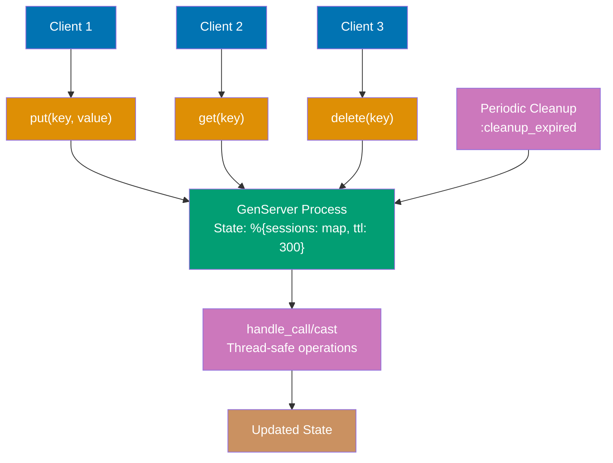

**Code**:

```elixir
defmodule SessionManager do
  # => GenServer-based session manager module
  # => Demonstrates production pattern for stateful services
  @moduledoc """
  GenServer-based session manager with TTL-based cleanup.
  Provides thread-safe concurrent access to session data.
  """
  # => @moduledoc: documentation for module
  # => Explains purpose: session storage with TTL

  use GenServer  # => Use GenServer behavior (implements init, handle_call, handle_cast, etc.)
  # => use GenServer: imports GenServer behavior macros
  # => Requires implementation of: init/1, handle_call/3, handle_cast/2, handle_info/2
  # => Provides: start_link/1, call/2, cast/2, etc.

  # Client API - public interface
  # => Client API: functions callers use (abstracts GenServer protocol)
  # => Best practice: separate client API from server callbacks

  @doc "Starts the session manager with optional TTL (default: 300 seconds)"
  def start_link(opts \\ []) do
    # => start_link/1: starts GenServer process
    # => opts: keyword list of options
    # => Default: [] (empty)
    ttl = Keyword.get(opts, :ttl, 300)  # => Default 5 minutes
    # => Keyword.get/3: extract :ttl from opts, default 300
    # => ttl: time-to-live in seconds
    GenServer.start_link(__MODULE__, ttl, name: __MODULE__)
    # => GenServer.start_link/3: spawns GenServer process
    # => First arg: module name (__MODULE__ = SessionManager)
    # => Second arg: init arg (ttl passed to init/1)
    # => Third arg: options (name: registers process globally)
    # => name: __MODULE__: allows calling SessionManager.put/2 without PID
    # => Returns: {:ok, pid}
    # => __MODULE__ = SessionManager, name registers process globally
  end

  @doc "Stores a session with given key and value"
  def put(key, value) do
    # => put/2: client function to store session
    # => key: session identifier (string or atom)
    # => value: session data (any Elixir term)
    GenServer.call(__MODULE__, {:put, key, value})  # => Synchronous call
    # => GenServer.call/2: sends synchronous request
    # => __MODULE__: named process (SessionManager)
    # => Message: {:put, key, value}
    # => Blocks until handle_call returns reply
    # => Returns: :ok (from handle_call reply)
    # => Blocks until server responds
    # => Thread-safe: only one caller modifies state at a time
  end

  @doc "Retrieves session by key, returns {:ok, value} or {:error, :not_found}"
  def get(key) do
    # => get/1: client function to retrieve session
    # => key: session identifier
    GenServer.call(__MODULE__, {:get, key})  # => Synchronous call
    # => Message: {:get, key}
    # => Blocks until handle_call returns
    # => Returns: {:ok, value} or {:error, :not_found} or {:error, :expired}
  end

  @doc "Deletes session by key"
  def delete(key) do
    # => delete/1: client function to remove session
    # => key: session identifier
    GenServer.cast(__MODULE__, {:delete, key})  # => Asynchronous cast
    # => GenServer.cast/2: sends asynchronous request (fire-and-forget)
    # => Message: {:delete, key}
    # => Returns immediately :ok (doesn't wait for processing)
    # => handle_cast processes message asynchronously
    # => Returns immediately without waiting for completion
    # => Use cast when reply not needed (performance optimization)
  end

  @doc "Returns all active sessions (for debugging)"
  def list_all do
    # => list_all/0: retrieves all active sessions
    # => Debugging function (not for production use at scale)
    GenServer.call(__MODULE__, :list_all)  # => Synchronous call
    # => Message: :list_all (atom, not tuple)
    # => Returns: map of %{key => value} (without timestamps)
  end

  @doc "Returns session count"
  def count do
    # => count/0: returns number of active sessions
    GenServer.call(__MODULE__, :count)  # => Synchronous call
    # => Message: :count
    # => Returns: integer count
  end

  # Server Callbacks - GenServer implementation
  # => Server callbacks: handle requests and manage state
  # => Private to module (not called directly by clients)

  @impl true
  # => @impl true: marks function as behavior callback implementation
  # => Compiler verifies function matches GenServer behavior contract
  def init(ttl) do
    # => init/1: GenServer callback for initialization
    # => Called when GenServer.start_link/3 executes
    # => Arg: ttl (from start_link second argument)
    # Called when GenServer starts
    # Initialize state with empty sessions map and TTL
    state = %{
      # => State: map with sessions and ttl
      # => Immutable: each callback returns new state
      sessions: %{},  # => key -> {value, inserted_at}
      # => sessions: map of session_key => {session_value, timestamp}
      # => Empty on initialization
      ttl: ttl        # => Time-to-live in seconds
      # => ttl: expiration duration (e.g., 300 seconds)
    }
    # => state is %{sessions: %{}, ttl: 300}

    # Schedule periodic cleanup every 60 seconds
    schedule_cleanup()  # => Sends message to self after delay
    # => schedule_cleanup/0: schedules first :cleanup_expired message
    # => Process.send_after/3 sends message in 60 seconds
    # => Recursive pattern: cleanup schedules next cleanup

    {:ok, state}  # => Return {:ok, initial_state}
    # => init/1 contract: returns {:ok, state}
    # => GenServer.start_link/3 returns {:ok, pid}
    # => Process now running with state
  end

  @impl true
  def handle_call({:put, key, value}, _from, state) do
    # => handle_call/3: callback for synchronous requests
    # => First arg: request message {:put, key, value}
    # => Second arg: _from = {caller_pid, unique_ref} (unused here)
    # => Third arg: current state
    # => Synchronous request handler
    # _from = {pid, ref} of caller (unused here)

    # Store session with current timestamp
    session_data = {value, System.system_time(:second)}
    # => session_data: tuple {session_value, unix_timestamp}
    # => System.system_time(:second): current time in seconds
    # => Example: {"Alice", 1734567890}
    updated_sessions = Map.put(state.sessions, key, session_data)
    # => Map.put/3: add/update key-value in map
    # => state.sessions: old sessions map
    # => key: session key (e.g., "user_123")
    # => session_data: {value, timestamp}
    # => Returns: new sessions map with added entry

    new_state = %{state | sessions: updated_sessions}  # => Update state
    # => Map update syntax: %{old_map | key: new_value}
    # => Replaces sessions field, keeps ttl unchanged
    # => new_state is %{sessions: updated_sessions, ttl: state.ttl}

    {:reply, :ok, new_state}  # => Reply to caller with :ok, update state
    # => handle_call contract: {:reply, reply_value, new_state}
    # => reply_value: :ok (sent to caller)
    # => new_state: becomes current state
    # => GenServer.call returns :ok to caller
  end

  @impl true
  def handle_call({:get, key}, _from, state) do
    # => handle_call/3: callback for get request
    # => Message: {:get, key}
    # Synchronous request handler for get

    case Map.get(state.sessions, key) do
      # => Map.get/2: retrieves value by key (returns nil if not found)
      # => state.sessions: current sessions map
      # => Pattern matching on result
      nil ->
        # => Pattern 1: key not found in map
        {:reply, {:error, :not_found}, state}  # => Session doesn't exist
        # => Reply: {:error, :not_found}
        # => State unchanged (read operation)
        # => Caller gets {:error, :not_found}

      {value, inserted_at} ->
        # => Pattern 2: found {value, timestamp} tuple
        # => value: session data
        # => inserted_at: timestamp when stored
        # Check if session expired
        current_time = System.system_time(:second)
        # => Current time in seconds
        age = current_time - inserted_at
        # => age: seconds since session created
        # => Example: 1734567900 - 1734567890 = 10 seconds old

        if age > state.ttl do
          # => Check if session older than TTL
          # => Example: 10 > 300 (false), 400 > 300 (true)
          # Session expired - remove it
          updated_sessions = Map.delete(state.sessions, key)
          # => Map.delete/2: removes key from map
          # => Cleanup expired session on read
          new_state = %{state | sessions: updated_sessions}
          # => Update state without expired session
          {:reply, {:error, :expired}, new_state}
          # => Reply: {:error, :expired}
          # => State updated (session removed)
          # => Lazy cleanup: remove on read instead of waiting for periodic cleanup
        else
          # Session valid - return value
          {:reply, {:ok, value}, state}  # => State unchanged
          # => Reply: {:ok, session_value}
          # => State unchanged (session still valid)
          # => Caller gets {:ok, value}
        end
    end
  end

  @impl true
  def handle_call(:list_all, _from, state) do
    # => handle_call/3: callback for list_all request
    # => Message: :list_all (atom)
    # Return all sessions (for debugging)
    sessions = state.sessions
               |> Enum.map(fn {key, {value, _ts}} -> {key, value} end)
               # => Transform each {key, {value, timestamp}} to {key, value}
               # => Removes timestamps from output
               # => Example: {"user_123", {"Alice", 1734567890}} → {"user_123", "Alice"}
               |> Enum.into(%{})
               # => Convert list of tuples back to map
               # => Returns: %{key1 => value1, key2 => value2}

    {:reply, sessions, state}  # => Return map without timestamps
    # => Reply: map of sessions (no timestamps)
    # => State unchanged
  end

  @impl true
  def handle_call(:count, _from, state) do
    # => handle_call/3: callback for count request
    # Return session count
    count = map_size(state.sessions)
    # => map_size/1: returns number of keys in map
    # => Example: %{"user_123" => ..., "user_456" => ...} → 2
    {:reply, count, state}
    # => Reply: integer count
    # => State unchanged
  end

  @impl true
  def handle_cast({:delete, key}, state) do
    # => handle_cast/2: callback for asynchronous requests
    # => First arg: request message {:delete, key}
    # => Second arg: current state
    # => No _from (async, no reply)
    # Asynchronous request handler (no reply sent)
    updated_sessions = Map.delete(state.sessions, key)
    # => Remove key from sessions map
    new_state = %{state | sessions: updated_sessions}
    # => Update state with session removed

    {:noreply, new_state}  # => No reply for cast, just update state
    # => handle_cast contract: {:noreply, new_state}
    # => No reply sent to caller
    # => State updated
    # => Caller already received :ok from GenServer.cast
  end

  @impl true
  def handle_info(:cleanup_expired, state) do
    # => handle_info/2: callback for arbitrary messages (not call/cast)
    # => First arg: message (:cleanup_expired atom)
    # => Second arg: current state
    # => Handles messages from Process.send_after, timers, monitors, etc.
    # Handle messages sent to process (not call/cast)
    # Cleanup expired sessions

    current_time = System.system_time(:second)
    # => Current time for age calculation

    # Filter out expired sessions
    active_sessions = state.sessions
                      |> Enum.filter(fn {_key, {_value, inserted_at}} ->
                        # => Filter predicate: returns true to keep, false to remove
                        # => Pattern: {key, {value, timestamp}}
                        # => _key, _value: ignored (not needed for age check)
                        age = current_time - inserted_at
                        # => Calculate session age
                        age <= state.ttl  # => Keep only non-expired
                        # => true if age <= ttl (keep), false if age > ttl (remove)
                        # => Example: 295 <= 300 (true, keep), 305 <= 300 (false, remove)
                      end)
                      |> Enum.into(%{})
                      # => Convert filtered list back to map
                      # => active_sessions: map of non-expired sessions

    removed_count = map_size(state.sessions) - map_size(active_sessions)
    # => Calculate how many sessions expired
    # => Before size - after size = removed count
    if removed_count > 0 do
      # => Only log if sessions were removed
      IO.puts("Cleaned up #{removed_count} expired sessions")
      # => Log cleanup activity
      # => Production: use Logger.info instead
    end

    new_state = %{state | sessions: active_sessions}
    # => Update state with only active sessions

    # Schedule next cleanup
    schedule_cleanup()
    # => Recursive scheduling: cleanup schedules next cleanup
    # => Ensures periodic cleanup continues
    # => Pattern: self-scheduling timer

    {:noreply, new_state}  # => Update state, no reply
    # => handle_info contract: {:noreply, new_state}
    # => No caller to reply to (message from timer)
    # => State updated with cleaned sessions
  end

  # Private helpers
  # => Private functions: not part of public API

  defp schedule_cleanup do
    # => schedule_cleanup/0: schedules next cleanup message
    # => defp: private function
    # Send :cleanup_expired message to self after 60 seconds
    Process.send_after(self(), :cleanup_expired, 60_000)  # => 60 seconds
    # => Process.send_after/3: sends message after delay
    # => self(): current GenServer process PID
    # => Message: :cleanup_expired atom
    # => Delay: 60_000ms = 60 seconds
    # => Returns: timer reference (unused here)
    # => Message handled by handle_info(:cleanup_expired, state)
  end
end
# => SessionManager module complete

# Usage examples
{:ok, _pid} = SessionManager.start_link(ttl: 10)  # => 10 second TTL for demo
# => Start GenServer with 10 second TTL (for quick demo)
# => Returns: {:ok, pid}
# => _pid: ignore PID (process registered by name)
# => GenServer now running with state %{sessions: %{}, ttl: 10}

SessionManager.put("user_123", %{name: "Alice", role: :admin})
# => Store session for user_123
# => Value: map with name and role
# => Synchronous call, waits for :ok reply
# => State now: %{sessions: %{"user_123" => {%{name: "Alice", role: :admin}, timestamp}}, ttl: 10}
SessionManager.put("user_456", %{name: "Bob", role: :user})
# => Store session for user_456
# => State: 2 sessions stored
SessionManager.put("user_789", %{name: "Charlie", role: :guest})
# => Store session for user_789
# => State: 3 sessions stored

SessionManager.get("user_123")  # => {:ok, %{name: "Alice", role: :admin}}
# => Retrieve existing session
# => Synchronous call
# => Returns: {:ok, session_value}
# => Session still valid (recently created)
SessionManager.get("user_999")  # => {:error, :not_found}
# => Try to retrieve non-existent session
# => Returns: {:error, :not_found}
# => Key doesn't exist in sessions map

SessionManager.delete("user_456")
# => Delete user_456 session
# => Asynchronous cast (fire-and-forget)
# => Returns immediately: :ok
# => Session removed from state
SessionManager.get("user_456")  # => {:error, :not_found}
# => Try to retrieve deleted session
# => Returns: {:error, :not_found}
# => Session no longer exists

SessionManager.list_all()  # => %{"user_123" => %{...}, "user_789" => %{...}}
# => Retrieve all active sessions
# => Returns: map of {key => value} (no timestamps)
# => user_456 not present (was deleted)
# => user_123 and user_789 present
SessionManager.count()  # => 2
# => Count active sessions
# => Returns: 2 (user_123 and user_789)

:timer.sleep(11_000)  # => 11 seconds
# => Sleep for 11 seconds
# => Simulates time passing
# => Sessions now 11 seconds old (older than 10 second TTL)
SessionManager.get("user_123")  # => {:error, :expired}
# => Try to retrieve expired session
# => age = 11 seconds, ttl = 10 seconds
# => 11 > 10: session expired
# => handle_call removes expired session and returns {:error, :expired}
# => Demonstrates TTL expiration


```

**Key Takeaway**: GenServer provides thread-safe stateful processes via callbacks. Use `GenServer.call/2` for synchronous requests that need replies, `GenServer.cast/2` for asynchronous fire-and-forget operations. State is immutable - callbacks return new state. `handle_info/2` handles arbitrary messages like timers. GenServer processes run concurrently and isolate state, enabling millions of concurrent sessions.

**Why It Matters**: GenServer is the foundation of OTP applications. It handles concurrency, state management, and fault tolerance automatically. Production Elixir systems use GenServer for caches, connection pools, rate limiters, session stores, and background workers. Understanding the GenServer pattern (client API calling server callbacks that update state) is essential for building scalable, concurrent systems. Add GenServers to supervision trees for automatic restart on crashes.

---

## Example 52: Supervisor Child Specifications

Supervisors define child processes using child specifications that control restart behavior, shutdown timeouts, and process types. Understanding child specs enables fine-grained control over supervision trees.

### Child Specification Structure

| Field       | Type        | Purpose                             | Common Values                            |
| ----------- | ----------- | ----------------------------------- | ---------------------------------------- |
| `:id`       | `term()`    | Unique identifier within supervisor | Module name, atom, tuple                 |
| `:start`    | `{m, f, a}` | MFA tuple to start child            | `{MyWorker, :start_link, [opts]}`        |
| `:restart`  | `atom()`    | When to restart child               | `:permanent`, `:transient`, `:temporary` |
| `:shutdown` | `timeout()` | Graceful shutdown duration          | `5000` (ms), `:infinity`, `:brutal_kill` |
| `:type`     | `atom()`    | Process type                        | `:worker`, `:supervisor`                 |

### Restart Strategies

**`:permanent`** - Always restart (critical services)

- Use for: database connections, core services, state machines
- Behavior: Any exit (normal or crash) triggers restart

**`:transient`** - Restart only on abnormal exit

- Use for: tasks that complete successfully, retryable operations
- Behavior: Normal exit (`:normal`, `:shutdown`) → no restart; crash → restart

**`:temporary`** - Never restart (one-time tasks)

- Use for: fire-and-forget operations, disposable workers
- Behavior: Any exit → remove from supervision tree

**Code**:

```elixir
# Basic child specification map
child_spec = %{
  # => Child spec: defines how supervisor manages process lifecycle
  id: MyWorker,
  # => Unique identifier within supervisor
  start: {MyWorker, :start_link, [[name: :worker_1]]},
  # => MFA tuple: supervisor calls MyWorker.start_link([name: :worker_1])
  # => Must return {:ok, pid} or {:ok, pid, info}
  restart: :permanent,
  # => :permanent - always restart on exit (critical processes)
  # => :transient - restart only on abnormal exit
  # => :temporary - never restart (one-time tasks)
  shutdown: 5000,
  # => Graceful shutdown timeout: 5000ms
  # => After timeout, supervisor sends :kill signal
  # => :brutal_kill - immediate kill, :infinity - wait forever
  type: :worker
  # => :worker - leaf process, :supervisor - nested supervisor
}
# => Returns: child spec map for Supervisor.start_link/2

# Worker module implementing child_spec/1
defmodule MyWorker do
  # => Worker with custom child_spec/1 for flexible configuration
  use GenServer
  # => Imports default child_spec/1 implementation

  def start_link(opts) do
    # => Starts GenServer linked to caller
    name = Keyword.get(opts, :name, __MODULE__)
    # => Extract :name from opts, default to module name
    GenServer.start_link(__MODULE__, opts, name: name)
    # => Start GenServer and register with name
    # => Returns: {:ok, pid}
  end

  # Override default child spec
  def child_spec(opts) do
    # => Custom child specification callback
    # => Called by supervisor when starting child
    %{
      id: Keyword.get(opts, :name, __MODULE__),
      # => Dynamic id from opts enables multiple instances
      # => Each instance needs unique id in supervisor
      start: {__MODULE__, :start_link, [opts]},
      # => Pass opts through to start_link
      restart: :permanent,
      # => Always restart on exit (critical worker)
      shutdown: 10_000
      # => 10s timeout for cleanup (flush queues, close connections)
    }
    # => Returns: custom child spec map
  end

  @impl true
  def init(opts), do: {:ok, opts}
  # => Store opts as GenServer state
end
# => MyWorker complete

# Critical worker example (permanent restart)
defmodule Database do
  # => Database worker: critical service with permanent restart
  use GenServer

  def child_spec(_opts) do
    # => Custom child spec for database process
    %{
      id: __MODULE__,
      # => Single instance (module name as id)
      start: {__MODULE__, :start_link, []},
      # => No configuration needed
      restart: :permanent,
      # => Critical: database must always run
      # => Any exit triggers immediate restart
      shutdown: 30_000
      # => Long timeout: flush writes, close connections, release locks
      # => After 30s, supervisor sends :kill (may lose data)
    }
    # => Returns: child spec with critical worker settings
  end

  def start_link, do: GenServer.start_link(__MODULE__, [], name: __MODULE__)
  # => Start and register as Database

  @impl true
  def init(_), do: {:ok, %{}}
  # => Initialize empty state (real DB would connect here)
end
# => Database complete

# Optional service example (transient restart)
defmodule Cache do
  # => Cache worker: transient restart (crash → restart, normal exit → remove)
  use GenServer

  def child_spec(_opts) do
    # => Custom child spec for cache process
    %{
      id: __MODULE__,
      # => Single instance
      start: {__MODULE__, :start_link, []},
      # => Self-contained cache (no configuration)
      restart: :transient,
      # => Restart on crash only
      # => Normal exit (cache clears): no restart
      # => Abnormal exit (bug, OOM): restart
      shutdown: 5_000
      # => Standard timeout (in-memory data flushes quickly)
    }
    # => Returns: child spec with transient restart
  end

  def start_link, do: GenServer.start_link(__MODULE__, [], name: __MODULE__)
  # => Start and register as Cache

  @impl true
  def init(_), do: {:ok, %{}}
  # => Initialize empty cache
end
# => Cache complete

# Supervisor with multiple children
defmodule MyApp.Supervisor do
  # => Application supervisor managing multiple children
  use Supervisor

  def start_link(opts) do
    # => Start supervisor process
    Supervisor.start_link(__MODULE__, opts, name: __MODULE__)
    # => Calls init/1 callback with opts
    # => Returns: {:ok, pid}
  end

  @impl true
  def init(_opts) do
    # => Supervisor callback: define children and strategy
    children = [
      # => Children started in order (top to bottom)
      Database,
      # => Module form: calls Database.child_spec([])
      # => Shorthand for {Database, []}
      Cache,
      # => Cache started after Database (dependency order)
      {MyWorker, name: :worker_1},
      # => Tuple form: {module, opts}
      # => Calls MyWorker.child_spec([name: :worker_1])
      # => id: :worker_1 from opts
      {MyWorker, name: :worker_2}
      # => Second instance with different id (no conflict)
    ]
    # => 4 children: Database, Cache, worker_1, worker_2

    Supervisor.init(children, strategy: :one_for_one)
    # => :one_for_one: restart only failed child (not siblings)
    # => Other strategies: :one_for_all, :rest_for_one
    # => Returns: {:ok, {supervisor_flags, children}}
  end
end
# => MyApp.Supervisor complete

# Starting the supervisor
{:ok, sup_pid} = MyApp.Supervisor.start_link([])
# => Supervisor starts all 4 children in order
# => Database → Cache → worker_1 → worker_2
# => Returns: {:ok, pid} where pid is supervisor process

Supervisor.which_children(sup_pid)
# => Lists all children: [{id, pid, type, modules}, ...]
# => Example: [{Database, #PID<0.200.0>, :worker, [Database]}, ...]

Supervisor.count_children(sup_pid)
# => Returns: %{active: 4, specs: 4, supervisors: 0, workers: 4}
# => active: running children, specs: total child specs
```

**Key Takeaway**: Child specs control how supervisors manage children. Use `:permanent` for critical processes, `:transient` for expected failures, `:temporary` for one-time tasks. Implement `child_spec/1` to customize restart and shutdown behavior.

**Why It Matters**: Child specifications enable fine-grained control over process lifecycle management. In production, `:permanent` restart ensures critical services (databases, connection pools) always recover from failures, `:transient` restart handles workers that may complete successfully (background jobs, retryable operations), and custom `shutdown` timeouts prevent data loss during graceful shutdowns. Dynamic ids from `child_spec/1` enable multiple instances of the same worker module with different configurations, while start order ensures dependencies (database before workers) initialize correctly.

---

## Example 53: Application Callbacks and Lifecycle

Application behavior defines callbacks for application startup and shutdown. Implement `start/2` to initialize supervision trees and `stop/1` for cleanup.

**Brief Explanation**: The Application behavior manages application lifecycle through callbacks. `start/2` initializes the application (typically starts a supervision tree), receives startup type and arguments. `stop/1` handles graceful shutdown (cleanup resources). Applications are OTP's top-level abstraction for managing related processes and resources.

**Code**:

```elixir
defmodule MyApp.Application do
  # => Application module (conventionally: AppName.Application)
  use Application
  # => Implements Application behavior (requires start/2)

  @impl true
  def start(_type, _args) do
    # => start/2: called when application starts
    # => _type: startup type (:normal, :takeover, :failover)
    # => _args: application arguments from config
    # => Returns: {:ok, pid} or {:error, reason}

    children = [
      # => Child specifications for supervision tree
      {MyApp.Repo, []},
      # => Database connection pool
      {MyApp.Endpoint, []},
      # => Phoenix web server endpoint
      {MyApp.Worker, []}
      # => Custom worker process
    ]
    # => List of child specs

    opts = [strategy: :one_for_one, name: MyApp.Supervisor]
    # => Supervisor options
    # => strategy: :one_for_one (restart only failed child)
    # => name: registered name for supervisor

    Supervisor.start_link(children, opts)
    # => Starts supervision tree
    # => Returns: {:ok, supervisor_pid}
  end

  @impl true
  def stop(_state) do
    # => stop/1: called before application stops
    # => _state: state returned from start/2 (usually ignored)
    # => Cleanup resources (close connections, flush buffers)
    :ok
    # => Must return :ok
  end
end

# config/config.exs
# use MyApp.Application, otp_app: :my_app
# => Registers MyApp.Application as application module
# => OTP starts this module during boot
```

**Application Lifecycle**:

| Phase    | Callback  | Purpose                 | Return       |
| -------- | --------- | ----------------------- | ------------ |
| Startup  | `start/2` | Initialize processes    | `{:ok, pid}` |
| Running  | -         | Supervision tree active | -            |
| Shutdown | `stop/1`  | Cleanup resources       | `:ok`        |

**Startup Types**:

- **`:normal`** - Standard application start
- **`:takeover`** - Taking over from another node (distributed)
- **`:failover`** - Failover from failed node (distributed)

**Best Practices**:

- **Keep start/2 fast**: Heavy initialization in child processes
- **Return supervision tree PID**: Application monitors top supervisor
- **Cleanup in stop/1**: Close connections, flush logs, release resources
- **Use child specs**: Leverage Supervisor for process management

**Key Takeaway**: Applications implement `start/2` to initialize supervision trees and `stop/1` for cleanup. The Application behavior is OTP's top-level abstraction for managing related processes. Return `{:ok, supervisor_pid}` from `start/2`, `:ok` from `stop/1`.

**Why It Matters**: Application callbacks enable hot code upgrades and graceful shutdowns. In production, OTP stops applications during releases (calls `stop/1`), upgrades code, then restarts (calls `start/2`)—zero-downtime deployments. Phoenix apps use this for rolling updates: drain connections in `stop/1`, upgrade code, restart in `start/2` (new requests to new code, old requests complete on old code).

## Example 54: Custom Mix Tasks

Mix tasks automate project operations. Create custom tasks by implementing `Mix.Task` behavior with `run/1` function.

**Brief Explanation**: Custom Mix tasks extend Mix's functionality for project-specific automation. Tasks implement the `Mix.Task` behavior with a `run/1` entry point that receives command-line arguments. Use `OptionParser.parse/2` for argument parsing, `Mix.shell().info/1` for output, and module attributes (`@shortdoc`, `@moduledoc`) for documentation.

**Code**:

```elixir
defmodule Mix.Tasks.Hello do
  # => Custom Mix task: mix hello
  # => Module name: Mix.Tasks.TaskName (CamelCase)
  use Mix.Task
  # => Implements Mix.Task behavior (requires run/1)
  # => Imports task infrastructure

  @shortdoc "Prints hello message"
  # => Short description (shown in mix help)
  # => Displayed in task list

  @moduledoc """
  Greets the user with a hello message.

  ## Usage
      mix hello
      mix hello --name Alice
  """
  # => Full documentation (shown in mix help hello)
  # => Markdown format supported

  @impl Mix.Task
  def run(args) do
    # => run/1: task entry point
    # => args: list of command-line arguments (strings)
    {opts, _, _} = OptionParser.parse(args, switches: [name: :string])
    # => Parses args: --name Alice → [name: "Alice"]
    # => opts: keyword list of parsed options
    # => switches: expected option types

    name = opts[:name] || "World"
    # => Gets name option with default fallback
    # => opts[:name]: nil if not provided

    Mix.shell().info("Hello, #{name}!")
    # => Output to console via Mix shell
    # => Output: "Hello, World!" or "Hello, Alice!"
    # => Mix.shell(): current shell IO interface
  end
end

# Usage: mix hello --name Alice
# => Runs custom task from command line
# => Output: "Hello, Alice!"
```

**Mix Task Anatomy**:

| Component        | Purpose                          | Required      |
| ---------------- | -------------------------------- | ------------- |
| `use Mix.Task`   | Imports behavior                 | Yes           |
| `@shortdoc`      | Brief description (mix help)     | Recommended   |
| `@moduledoc`     | Full documentation               | Recommended   |
| `run/1`          | Entry point (receives args)      | Yes           |
| `@impl Mix.Task` | Explicit behavior implementation | Best practice |

**Argument Parsing**:

```elixir
# OptionParser.parse(args, switches: [...])
{opts, positional, invalid} = OptionParser.parse(
  args,
  switches: [
    name: :string,    # --name Alice
    count: :integer,  # --count 5
    verbose: :boolean # --verbose
  ]
)
# => opts: [name: "Alice", count: 5, verbose: true]
# => positional: unnamed arguments list
# => invalid: unrecognized options
```

**Key Takeaway**: Custom Mix tasks automate project operations. Implement `Mix.Task` behavior with `run/1`, parse arguments with `OptionParser`, and document with `@shortdoc`/`@moduledoc`. Run tasks with `mix task_name [args]`.

**Why It Matters**: Mix tasks enable project automation (database seeds, code generation, deployment scripts). In production, custom tasks handle one-off operations (data migrations, cache warming, health checks) without building separate executables. Tasks access the full application context, making them ideal for admin operations and maintenance scripts in live systems.

## Example 55: Runtime Configuration

Runtime configuration loads settings when the application starts (not compile time). Use `config/runtime.exs` for environment variables and production secrets.

**Brief Explanation**: Runtime configuration (`config/runtime.exs`) loads settings at application startup, enabling environment-specific configuration and secrets management. Unlike `config/config.exs` (compile-time), runtime config values aren't baked into releases, making it safe for secrets. Use `Application.get_env/2` to read config, `Application.fetch_env!/2` for required values.

**Code**:

```elixir
# config/runtime.exs - runs at application startup
import Config
# => Required for config/2 macro

config :my_app,
  # => Configures application :my_app
  secret_key: System.get_env("SECRET_KEY") || raise("SECRET_KEY not set"),
  # => Reads SECRET_KEY env var, raises if missing (required config)
  database_url: System.get_env("DATABASE_URL") || raise("DATABASE_URL not set"),
  # => Database connection string, required in production
  port: String.to_integer(System.get_env("PORT") || "4000")
  # => HTTP port, defaults to 4000, converts string → integer

if config_env() == :prod do
  # => Production-only config
  config :my_app, MyApp.Repo,
    # => Ecto repo configuration
    url: System.get_env("DATABASE_URL"),
    # => Database URL
    pool_size: String.to_integer(System.get_env("POOL_SIZE") || "10")
    # => Connection pool size, defaults to 10
end

# Application reads runtime config
defmodule MyApp.Application do
  use Application

  def start(_type, _args) do
    # => Application startup callback
    port = Application.get_env(:my_app, :port)
    # => Reads port from runtime config
    secret = Application.get_env(:my_app, :secret_key)
    # => Reads secret_key from runtime config

    IO.puts("Starting on port #{port}")
    # => Output: "Starting on port 4000"

    children = [
      {MyApp.Server, port: port, secret: secret}
      # => Passes runtime config to child process
    ]

    Supervisor.start_link(children, strategy: :one_for_one)
    # => Starts supervision tree
  end
end

# Config accessor module (best practice)
defmodule MyApp.Config do
  # => Centralizes config access with defaults

  def port, do: Application.get_env(:my_app, :port, 4000)
  # => Returns port with default 4000

  def secret_key, do: Application.fetch_env!(:my_app, :secret_key)
  # => Returns secret_key, raises if missing (required config)

  def database_url, do: Application.fetch_env!(:my_app, :database_url)
  # => Returns database_url, raises if missing

  def timeout, do: Application.get_env(:my_app, :timeout, 5000)
  # => Returns timeout with default 5000ms
end
```

**Compile-Time vs Runtime Config**:

| Feature   | config/config.exs (Compile-Time) | config/runtime.exs (Runtime) |
| --------- | -------------------------------- | ---------------------------- |
| Execution | Mix compile                      | Application startup          |
| Values    | Baked into release               | Loaded from environment      |
| Use Case  | Defaults, non-secrets            | Secrets, env variables       |
| Security  | ❌ Don't use for secrets         | ✅ Safe for secrets          |

**Best Practices**:

- **Required config**: Use `|| raise()` or `fetch_env!/2` (fail fast)
- **Optional config**: Use `get_env/3` with defaults
- **Type conversion**: Environment variables are always strings
- **Config accessor**: Create module for centralized access (e.g., `MyApp.Config`)

**Key Takeaway**: Use `config/runtime.exs` for secrets and environment-specific configuration. Runtime config loads at startup (not compile time), making it safe for production secrets. Use `Application.get_env/2` for optional config, `Application.fetch_env!/2` for required config.

**Why It Matters**: Runtime configuration enables 12-factor app deployment. Environment variables configure production without rebuilding releases. Secrets never enter source control or compiled artifacts. In production, change DATABASE_URL or API keys without recompiling—critical for zero-downtime deployments and container orchestration (Docker, Kubernetes).

## Example 56: Process Links and Crash Propagation

Linked processes crash together—when one exits abnormally, linked processes receive exit signals. Use linking for tightly-coupled processes that should fail together.

**Brief Explanation**: Links create bidirectional connections between processes for crash propagation. When a linked process crashes, all connected processes receive exit signals and crash too (unless trapping exits). This pattern enables supervisor-like behavior where parent processes detect and handle child crashes. The `:trap_exit` flag converts exit signals into messages, preventing crash propagation.

**Code**:

```elixir
parent = self()
# => Current process PID
# => Type: pid()

child = spawn_link(fn ->
  # => spawn_link/1: spawns process AND links it to caller
  # => Creates bidirectional link (crash propagation enabled)
  :timer.sleep(1000)
  # => Sleep 1 second before crashing
  raise "Child crashed!"
  # => Child exits abnormally → parent crashes too
  # => Exit signal propagates via link
end)
# => Returns child PID, linked bidirectionally
# => child: pid()

Process.alive?(child)
# => true (child still sleeping)
:timer.sleep(1500)
# => Wait for child to crash (after 1 second)
Process.alive?(child)
# => false (child crashed after 1 second)
# Parent process also crashed due to link!

# Manual linking with Process.link/1
pid1 = spawn(fn -> :timer.sleep(10_000) end)
# => Spawn process (NOT linked yet)
# => Independent process, sleeps 10 seconds
pid2 = spawn(fn -> :timer.sleep(10_000) end)
# => Second independent process
# => Also sleeps 10 seconds

Process.link(pid1)
# => Links current process to pid1 bidirectionally
# => Current crashes → pid1 crashes; pid1 crashes → current crashes
Process.link(pid2)
# => Links current process to pid2
# => Triangle: current ↔ pid1, current ↔ pid2 (no direct pid1 ↔ pid2)

Process.exit(pid1, :kill)
# => Kills pid1 with :kill reason
# => Exit signal propagates to current process
# => Current process crashes (unless trapping exits)

# Trap exits to handle crashes gracefully
Process.flag(:trap_exit, true)
# => Converts exit signals to {:EXIT, pid, reason} messages
# => Process won't crash when linked process exits
# => Returns: false (previous trap_exit value)

linked_pid = spawn_link(fn ->
  # => Spawn and link child
  :timer.sleep(500)
  # => Sleep 0.5 seconds
  raise "Linked process error!"
  # => Child crashes with RuntimeError
  # => Exit signal → message (parent trapping exits)
end)
# => Returns child PID

receive do
  # => Wait for exit message
  {:EXIT, ^linked_pid, reason} ->
    # => Pattern match exit message
    # => ^linked_pid: pin operator (match exact PID)
    IO.puts("Linked process exited with reason: #{inspect(reason)}")
    # => Output: "Linked process exited with reason: {%RuntimeError{...}, ...}"
    # => Parent continues running (handled gracefully)
end
# => receive complete
# => Parent process still alive

# Supervisor pattern uses links
defmodule Worker do
  # => GenServer worker for supervisor example
  use GenServer

  def start_link(id) do
    # => Starts worker linked to caller (supervisor)
    GenServer.start_link(__MODULE__, id)
    # => Returns: {:ok, pid}
  end

  @impl true
  def init(id) do
    # => GenServer initialization callback
    IO.puts("Worker #{id} started")
    # => Output: "Worker 1 started"
    {:ok, id}
    # => Returns: {:ok, state}
  end

  @impl true
  def handle_cast(:crash, _state) do
    # => Handles :crash message
    raise "Worker crashed!"
    # => Worker exits abnormally
    # => Supervisor receives {:EXIT, worker_pid, reason}
    # => Supervisor restarts worker per restart strategy
  end
end

# Exit reasons determine propagation behavior
# :normal - graceful exit (doesn't crash linked processes)
spawn_link(fn -> exit(:normal) end)
# => Exits normally
# => Won't crash parent
# => Parent receives {:EXIT, pid, :normal} if trapping

# :kill - forceful kill (cannot be trapped)
# spawn_link(fn -> exit(:kill) end)
# => Exits with :kill
# => Crashes parent immediately
# => trap_exit ignored for :kill

# any other - abnormal exit (crashes linked unless trapping)
spawn_link(fn -> exit(:abnormal) end)
# => Exits abnormally
# => Crashes parent unless trapping exits
# => If trapping: {:EXIT, pid, :abnormal} message

# Unlinking processes
Process.unlink(pid1)
# => Removes bidirectional link to pid1
# => Crashes no longer propagate
# => Returns: true
```

**Exit Reason Behavior**:

- **`:normal`** - Graceful exit, doesn't crash linked processes (worker completed successfully)
- **`:kill`** - Forceful termination, cannot be trapped (emergency shutdown)
- **`other`** - Abnormal exit, crashes linked processes unless trapping

**Linking vs Monitoring**:

- **Linking**: Bidirectional crash propagation (fail-together pattern for supervisor)
- **Monitoring**: Unidirectional crash detection (observer pattern for notifications)

**Key Takeaway**: Linked processes crash together. Use `spawn_link/1` for coupled processes. Trap exits with `Process.flag(:trap_exit, true)` to handle crashes gracefully. Supervisors use links to detect worker crashes.

**Why It Matters**: Links enable the BEAM's "let it crash" philosophy. Supervisors use links to detect failures and restart workers automatically. This pattern creates self-healing systems where isolated failures don't bring down the entire application. In production, supervision trees with proper linking ensure service reliability—a crashed GenServer worker is automatically restarted by its supervisor within milliseconds.

## Example 57: Message Mailbox Management

Process mailboxes queue incoming messages. Understanding mailbox behavior prevents memory leaks and enables selective message processing.

**Brief Explanation**: Every process has a mailbox that queues messages in FIFO order. Messages accumulate until processed by `receive` blocks. Selective receive pattern-matches messages, potentially scanning the entire mailbox. Monitor mailbox size with `Process.info/2` to detect message buildup and prevent memory leaks.

**Code**:

```elixir
# Messages accumulate in mailbox
pid = self()
# => Current process PID

send(pid, :msg1)
# => Adds :msg1 to mailbox (position 1)
send(pid, :msg2)
# => Adds :msg2 to mailbox (position 2)
send(pid, :msg3)
# => Adds :msg3 to mailbox (position 3)
# => Mailbox: [:msg1, :msg2, :msg3]

Process.info(pid, :message_queue_len)
# => {:message_queue_len, 3}
# => Returns message count in mailbox

# FIFO processing
receive do
  msg -> IO.inspect(msg, label: "Received")
  # => Processes first message: :msg1
  # => Output: "Received: :msg1"
end
# => Mailbox now: [:msg2, :msg3]

Process.info(pid, :message_queue_len)
# => {:message_queue_len, 2}

# Selective receive (pattern matching)
send(self(), {:priority, "urgent"})
# => Mailbox: [:msg2, :msg3, {:priority, "urgent"}]
send(self(), {:normal, "task1"})
# => Mailbox: [:msg2, :msg3, {:priority, "urgent"}, {:normal, "task1"}]

receive do
  {:priority, content} -> IO.puts("Priority: #{content}")
  # => Scans mailbox for first match
  # => Finds {:priority, "urgent"} at position 3
  # => Skips :msg2 and :msg3
  # => Output: "Priority: urgent"
end
# => Mailbox: [:msg2, :msg3, {:normal, "task1"}]
# => Skipped messages remain in mailbox

# Flush mailbox (process all messages)
receive do
  msg -> IO.inspect(msg)
  # => Process one message
after
  0 -> :ok
  # => Timeout 0ms: if no messages, exit immediately
end
# => Processes messages until mailbox empty
```

**Mailbox Behavior**:

| Operation                | Effect             | Performance      |
| ------------------------ | ------------------ | ---------------- |
| `send/2`                 | Adds to end (FIFO) | O(1)             |
| `receive` (no pattern)   | Removes first      | O(1)             |
| `receive` (with pattern) | Scans until match  | O(n)             |
| Unmatched messages       | Stay in mailbox    | Memory leak risk |

**Selective Receive Costs**:

- **Best case**: Match at front of mailbox (O(1))
- **Worst case**: Scan entire mailbox (O(n))
- **Memory risk**: Unmatched messages accumulate

**Key Takeaway**: Process mailboxes queue messages in FIFO order. Use `receive` to process messages. Selective receive scans the mailbox for pattern matches, potentially skipping messages. Monitor mailbox size with `Process.info/2` to prevent memory leaks from unmatched messages.

**Why It Matters**: Mailbox management is critical for GenServer reliability. Unbounded mailboxes cause memory leaks (millions of messages queued). In production, monitor mailbox size with telemetry, implement message timeouts, and use selective receive sparingly (expensive for large queues). Phoenix tracks mailbox sizes per LiveView process, alerting on buildup before out-of-memory errors.

## Example 58: Anonymous GenServers and Local Names

GenServers can run anonymously (PID-based) or with local/global names. Anonymous GenServers prevent name conflicts and enable multiple instances.

**Code**:

```elixir
defmodule Counter do
  # => Anonymous GenServer: identified by PID only
  # => No name registration (no atom name)
  # => Enables multiple instances without name conflicts
  use GenServer
  # => GenServer behavior

  # Start anonymous GenServer (no name)
  # => Anonymous: no name option passed to GenServer.start_link
  # => Callers must track PID to communicate
  def start_link(initial) do
    # => start_link/1: starts anonymous GenServer
    # => initial: initial counter value
    GenServer.start_link(__MODULE__, initial)
    # => No name: option passed
    # => GenServer not registered with any name
    # => __MODULE__: resolves to Counter
    # => initial: passed to init/1
    # => Returns {:ok, pid}
    # => Caller must store pid to use counter
  end

  def increment(pid) do
    # => increment/1: increments counter
    # => pid: GenServer PID (must be passed explicitly)
    GenServer.call(pid, :increment)
    # => GenServer.call/2: synchronous request
    # => Must pass PID explicitly
    # => First arg: pid (not atom name)
    # => Second arg: :increment message
    # => Returns: new counter value
  end

  def get(pid) do
    # => get/1: gets current counter value
    # => pid: required (anonymous GenServer)
    GenServer.call(pid, :get)
    # => Synchronous call with PID
    # => Returns: current state (counter value)
  end

  @impl true
  def init(initial), do: {:ok, initial}
  # => init/1: initializes counter with initial value
  # => Returns: {:ok, state} where state = initial

  @impl true
  def handle_call(:increment, _from, state) do
    # => handle_call/3: handles :increment message
    # => :increment: message from GenServer.call
    # => _from: caller info (ignored)
    # => state: current counter value
    {:reply, state + 1, state + 1}
    # => Increments counter
    # => Reply: state + 1 (new value sent to caller)
    # => New state: state + 1 (updated counter)
    # => Type: {:reply, reply, new_state}
  end

  @impl true
  def handle_call(:get, _from, state) do
    # => handle_call/3: handles :get message
    # => Returns current state without modification
    {:reply, state, state}
    # => Reply: state (current value)
    # => New state: state (unchanged)
  end
end
# => Counter module complete

# Multiple anonymous instances
# => Advantage: multiple counters with different states
# => Each has unique PID (no name conflicts)
{:ok, counter1} = Counter.start_link(0)
# => Start first counter with initial value 0
# => counter1: PID of first GenServer
# => Type: {:ok, #PID<0.150.0>}
{:ok, counter2} = Counter.start_link(100)
# => Start second counter with initial value 100
# => counter2: PID of second GenServer
# => Both counters independent (different PIDs, states)

Counter.increment(counter1)
# => Increment counter1 (0 → 1)
# => Returns: 1
# => 1
Counter.increment(counter2)
# => Increment counter2 (100 → 101)
# => Returns: 101
# => 101
# => Two separate states maintained

Counter.get(counter1)
# => Get counter1 value
# => Returns: 1
# => 1
Counter.get(counter2)
# => Get counter2 value
# => Returns: 101
# => 101
# => Pattern: PID-based identification for multiple instances

# Named GenServer (local to node)
# => Named: registered with atom name
# => Limitation: atoms are limited (not good for dynamic names)
# => Local: only on current node (not distributed)
defmodule NamedCounter do
  # => NamedCounter: GenServer with atom-based naming
  use GenServer

  def start_link(name, initial) do
    # => start_link/2: starts named GenServer
    # => name: atom to register GenServer
    # => initial: initial counter value
    GenServer.start_link(__MODULE__, initial, name: name)
    # => name: name option registers GenServer with atom
    # => name: must be atom (not string or tuple)
    # => Registered globally on local node
    # => Process.whereis(name) → returns PID
    # => Second start_link with same name → {:error, {:already_started, pid}}
  end

  def increment(name), do: GenServer.call(name, :increment)
  # => increment/1: increments named counter
  # => name: atom (not PID)
  # => GenServer.call resolves atom to PID internally
  def get(name), do: GenServer.call(name, :get)
  # => get/1: gets value of named counter
  # => name: atom registered with GenServer

  @impl true
  def init(initial), do: {:ok, initial}

  @impl true
  def handle_call(:increment, _from, state), do: {:reply, state + 1, state + 1}
  @impl true
  def handle_call(:get, _from, state), do: {:reply, state, state}
end
# => NamedCounter module complete

{:ok, _} = NamedCounter.start_link(:counter_a, 0)
# => Start named counter with atom :counter_a
# => Initial value: 0
# => Registered as :counter_a on local node
# => PID discarded (can use name instead)
{:ok, _} = NamedCounter.start_link(:counter_b, 50)
# => Start second named counter with atom :counter_b
# => Initial value: 50
# => Both registered with different atoms

NamedCounter.increment(:counter_a)
# => Increment :counter_a by name (no PID needed)
# => Returns: 1
# => 1
# => Atom resolved to PID internally
NamedCounter.get(:counter_b)
# => Get :counter_b value by name
# => Returns: 50
# => 50
# => Pattern: atom-based lookup (easier than PID tracking)

# Using Registry for dynamic names
# => Registry: OTP process registry (built-in)
# => Enables unlimited dynamic process names
# => Alternative to atoms (atoms are limited resource)
{:ok, _} = Registry.start_link(keys: :unique, name: MyRegistry)
# => Start Registry process
# => keys: :unique - each key registered once (no duplicates)
# => name: MyRegistry - global name for registry
# => :duplicate option allows multiple processes per key
# => Registry must be started before use (usually in supervision tree)

defmodule RegistryCounter do
  # => RegistryCounter: GenServer with Registry-based naming
  # => Enables dynamic names (strings, tuples, not just atoms)
  use GenServer

  def start_link(id, initial) do
    # => start_link/2: starts counter with Registry name
    # => id: dynamic identifier (can be string, tuple, anything)
    GenServer.start_link(__MODULE__, initial, name: via_tuple(id))
    # => name: via_tuple(id) - Registry-based name
    # => via-tuple enables Registry lookup
  end

  defp via_tuple(id) do
    # => via_tuple/1: creates Registry lookup tuple
    # => id: unique identifier for process
    {:via, Registry, {MyRegistry, {:counter, id}}}
    # => {:via, Registry, {registry_name, key}}
    # => :via - tells GenServer to use Registry
    # => Registry - module handling lookup
    # => MyRegistry - registry instance name
    # => {:counter, id} - key in registry (tuple with id)
    # => GenServer uses this to register/lookup process
  end

  def increment(id), do: GenServer.call(via_tuple(id), :increment)
  # => increment/1: increments counter by id
  # => via_tuple(id): resolves to PID via Registry
  # => GenServer.call looks up process in Registry
  def get(id), do: GenServer.call(via_tuple(id), :get)
  # => get/1: gets counter value by id
  # => Registry lookup: {:counter, id} → PID

  @impl true
  def init(initial), do: {:ok, initial}

  @impl true
  def handle_call(:increment, _from, state), do: {:reply, state + 1, state + 1}
  @impl true
  def handle_call(:get, _from, state), do: {:reply, state, state}
end
# => RegistryCounter module complete

RegistryCounter.start_link("user_123", 0)
# => Start counter with string id "user_123"
# => Registered as {:counter, "user_123"} in MyRegistry
# => Initial value: 0
# => Dynamic name (not limited by atom table)
RegistryCounter.start_link("user_456", 10)
# => Start counter with string id "user_456"
# => Registered as {:counter, "user_456"} in MyRegistry
# => Initial value: 10
# => Can have thousands/millions of dynamic names

RegistryCounter.increment("user_123")
# => Increment counter for "user_123"
# => Registry lookup: {:counter, "user_123"} → PID
# => Returns: 1
# => 1
RegistryCounter.get("user_456")
# => Get counter value for "user_456"
# => Returns: 10
# => 10
# => Pattern: unlimited dynamic process names via Registry

# Comparison
# 1. Anonymous (PID): Multiple instances, caller tracks PIDs
# => Use: temporary processes, testing, no global access needed
# 2. Named (atoms): Global access, limited names (~1M atoms)
# => Use: singleton services, well-known processes
# 3. Registry (via-tuple): Unlimited dynamic names, global access
# => Use: user sessions, dynamic workers, scalable services
```

**Key Takeaway**: Anonymous GenServers use PIDs for identification, enabling multiple instances. Named GenServers use atoms (limited) or Registry (unlimited dynamic names). Use Registry via-tuples for scalable process registration.

**Why It Matters**: Testing in Elixir leverages process isolation—each test runs in separate process with isolated state. ExUnit.Case provides test lifecycle (setup/setup_all) with automatic cleanup. In production, this enables parallel test execution (ExUnit runs tests concurrently by default), while Ecto sandbox mode gives each test its own database transaction that rolls back after test, preventing test pollution. The BEAM's process isolation means crashing tests never affect other tests.

---

## Example 59: Telemetry Events and Metrics

Telemetry provides instrumentation for measuring application behavior. Emit events for metrics, logging, and observability without coupling code to specific reporters.

**Code**:

```elixir
# Attach telemetry handler
# => Telemetry: event-based instrumentation library
# => Decouples code instrumentation from metrics/logging
:telemetry.attach(
  # => :telemetry.attach/4: attaches handler to event
  # => First arg: handler id (unique identifier)
  "my-handler-id",
  # => Unique handler ID (string)
  # => Used to detach handler later
  # => Must be unique across all handlers
  [:my_app, :request, :stop],
  # => Event name (list of atoms)
  # => Convention: [app, module, action, lifecycle]
  # => [:my_app, :request, :stop] fired when request completes
  # => Pattern: namespace with atoms to avoid conflicts
  fn event_name, measurements, metadata, _config ->
    # => Callback function: executed when event fires
    # => event_name: the event that triggered ([:my_app, :request, :stop])
    # => measurements: numeric values (duration, count, size)
    # => metadata: contextual data (request path, user id)
    # => _config: config passed to attach (nil here)
    # => Callback receives event data
    IO.puts("Event: #{inspect(event_name)}")
    # => Print event name
    IO.puts("Duration: #{measurements.duration}ms")
    # => Access measurements map (:duration key)
    IO.puts("Metadata: #{inspect(metadata)}")
    # => Print metadata map
  end,
  # => Callback function complete
  nil
  # => Config (passed to callback)
  # => Optional configuration for handler
  # => Available as fourth argument in callback
)
# => Handler attached: ready to receive events

# Emit telemetry event
defmodule MyApp.API do
  # => API module emitting telemetry events
  def handle_request(path) do
    # => handle_request/1: processes request with telemetry
    start_time = System.monotonic_time()
    # => System.monotonic_time/0: monotonic timestamp (nanoseconds)
    # => Monotonic: always increasing (not affected by clock adjustments)
    # => Used for duration measurement (not wall clock)

    # Perform work
    result = process_request(path)
    # => Execute actual request processing
    # => process_request/1: simulated work

    duration = System.monotonic_time() - start_time
    # => Calculate duration in nanoseconds
    # => current_time - start_time = elapsed nanoseconds

    # Emit telemetry event
    :telemetry.execute(
      # => :telemetry.execute/3: emits event to all attached handlers
      [:my_app, :request, :stop],
      # => Event name (must match handler event name)
      # => All handlers attached to this event will fire
      %{duration: duration},
      # => Measurements (numeric data)
      # => Map with measurement values
      # => Convention: numeric metrics (duration, count, bytes)
      %{path: path, result: result}
      # => Metadata (any term)
      # => Contextual information about event
      # => Can be any data (request details, user info, etc.)
    )
    # => execute/3 complete: handlers fired synchronously

    result
    # => Return result to caller
  end

  defp process_request(path) do
    # => Simulated request processing
    :timer.sleep(100)
    # => Sleep 100ms (simulate work)
    {:ok, "Response for #{path}"}
    # => Return simulated response
  end
end
# => MyApp.API complete

MyApp.API.handle_request("/users")
# => Call handle_request with "/users" path
# => Emits [:my_app, :request, :stop] event
# => Handler callback fires and prints:
# Prints:
# Event: [:my_app, :request, :stop]
# Duration: 100000000ms
# => Duration in nanoseconds (100ms = 100,000,000ns)
# Metadata: %{path: "/users", result: {:ok, "Response for /users"}}

# Span measurement pattern
# => Span: measures duration automatically (start → stop events)
# => Simplifies manual start_time/duration tracking
defmodule MyApp.Database do
  # => Database module with span telemetry
  def query(sql) do
    # => query/1: executes query with automatic timing
    :telemetry.span(
      # => :telemetry.span/3: emits start and stop events automatically
      # => Fires: [:my_app, :db, :query, :start] before function
      # => Fires: [:my_app, :db, :query, :stop] after function
      [:my_app, :db, :query],
      # => Event prefix (adds :start and :stop suffixes)
      # => [:my_app, :db, :query] → [:my_app, :db, :query, :start/stop]
      %{sql: sql},
      # => Initial metadata (available in both start and stop events)
      # => Metadata for query SQL
      fn ->
        # => Function to execute (work to measure)
        # => span measures duration of this function
        # Perform work
        result = execute_query(sql)
        # => Execute actual query

        # Return {result, extra_metadata}
        {result, %{rows: length(result)}}
        # => Return tuple: {result, extra_metadata}
        # => result: returned to caller
        # => extra_metadata: merged into stop event metadata
        # => Pattern: add runtime-computed metadata (:rows count)
      end
    )
    # => span/3 returns result from function
    # => Emits :start event before function
    # => Emits :stop event after function (with duration measurement)
  end

  defp execute_query(_sql) do
    # => Simulated query execution
    :timer.sleep(50)
    # => Sleep 50ms (simulate database query)
    [{:id, 1, :name, "Alice"}, {:id, 2, :name, "Bob"}]
    # => Return mock query results (list of tuples)
  end
end
# => MyApp.Database complete

# Attach handler for database queries
:telemetry.attach(
  # => Attach handler for database span stop event
  "db-handler",
  # => Handler ID
  [:my_app, :db, :query, :stop],
  # => Event name: span stop event
  # => Note: :stop suffix added by span/3
  fn _event, measurements, metadata, _config ->
    # => Handler callback
    # => _event: [:my_app, :db, :query, :stop]
    # => measurements: %{duration: nanoseconds}
    # => metadata: %{sql: "...", rows: count}
    IO.puts("Query took #{measurements.duration}ns")
    # => Print query duration (nanoseconds)
    # => measurements.duration: auto-computed by span/3
    IO.puts("Returned #{metadata.rows} rows")
    # => Print row count
    # => metadata.rows: from extra_metadata tuple
  end,
  nil
  # => No config
)
# => Handler attached for database queries

MyApp.Database.query("SELECT * FROM users")
# => Execute query with telemetry
# => Emits: [:my_app, :db, :query, :start]
# => Executes query (50ms)
# => Emits: [:my_app, :db, :query, :stop] with duration
# => Handler prints query timing and row count

# Multiple handlers for same event
# => attach_many/4: attaches handler to multiple events
# => Alternative to multiple attach/4 calls
:telemetry.attach_many(
  # => :telemetry.attach_many/4: one handler for multiple events
  "multi-handler",
  # => Handler ID (unique)
  [
    # => List of events to handle
    [:my_app, :request, :start],
    # => Request start event
    [:my_app, :request, :stop],
    # => Request stop event
    [:my_app, :request, :exception]
    # => Request exception event
  ],
  # => Same handler fires for all three events
  fn event, measurements, metadata, _config ->
    # => Handler callback for any of the three events
    # => event: which event fired (varies)
    Logger.info("Event: #{inspect(event)}", measurements: measurements, metadata: metadata)
    # => Log event with measurements and metadata
    # => Logger.info/2: logs at info level
    # => Keyword list: [measurements: ..., metadata: ...]
  end,
  nil
  # => No config
)
# => Handler attached to 3 events
# => Pattern: single handler for related events (request lifecycle)
```

**Key Takeaway**: Telemetry decouples instrumentation from reporting. Emit events with `:telemetry.execute/3` for measurements and `:telemetry.span/3` for start/stop events. Attach handlers to process events for metrics, logging, or monitoring.

**Why It Matters**: Mocking in Elixir uses behaviors and dependency injection through application config rather than runtime monkey-patching. Define behavior, implement for prod and test, inject via config. In production, this approach maintains type safety (compile-time verification of mocked interface), enables concurrent tests (no global state to reset), and catches interface changes (tests fail if behavior changes). Libraries like Mox leverage this pattern for safe, concurrent mocking.

---

## Example 60: Type Specifications with @spec

Type specs document function signatures and enable static analysis with Dialyzer. They improve code documentation and catch type errors at compile time.

### @spec Syntax

`@spec` declares type specifications for functions:

- `@spec function_name(param_types) :: return_type`
- Place before function definition
- `::` separates parameters from return type
- Dialyzer verifies implementation matches spec

### Common Built-in Types

| Type         | Description           | Example Values                    |
| ------------ | --------------------- | --------------------------------- |
| `integer()`  | Whole numbers         | `-2, -1, 0, 1, 2, ...`            |
| `float()`    | Decimal numbers       | `3.14, 2.5, -1.0`                 |
| `number()`   | Integer or float      | Any numeric value                 |
| `String.t()` | UTF-8 binary string   | `"hello", "world"`                |
| `atom()`     | Atom literals         | `:ok, :error, :atom`              |
| `boolean()`  | True/false            | `true, false`                     |
| `list(type)` | List of specific type | `[1, 2, 3]` for `list(integer())` |
| `map()`      | Any map               | `%{key: value}`                   |
| `tuple()`    | Any tuple             | `{:ok, "value"}`                  |
| `pid()`      | Process identifier    | Result of `spawn/1`               |
| `term()`     | Any Elixir term       | Wildcard type                     |
| `keyword()`  | Keyword list          | `[key: value, ...]`               |
| `any()`      | Any type              | Wildcard, no constraints          |

### Union Types

Use `|` to specify multiple possible types:

- `{:ok, float()} | {:error, atom()}` - Either success or error tuple
- `integer() | nil` - Integer or nil (optional value)
- Common pattern: Result tuples with union types

**Code**:

```elixir
defmodule Calculator do
  @spec add(integer(), integer()) :: integer()
  # => Spec: two integers → integer
  def add(a, b), do: a + b
  # => Returns: sum (integer)

  @spec divide(number(), number()) :: {:ok, float()} | {:error, atom()}
  # => Spec: union type (success OR error)
  def divide(_a, 0), do: {:error, :division_by_zero}
  # => Returns: error tuple
  def divide(a, b), do: {:ok, a / b}
  # => Returns: success tuple with float

  @spec sum(list(number())) :: number()
  # => Spec: list of numbers → number
  def sum(numbers), do: Enum.sum(numbers)
  # => Enum.sum: returns sum (integer or float)

  @spec abs(integer()) :: integer()
  # => Single spec covers all clauses
  def abs(n) when n < 0, do: -n
  # => Clause 1: negative → positive
  def abs(n), do: n
  # => Clause 2: positive → unchanged
end

defmodule User do
  @type t :: %__MODULE__{
    id: integer(),
    name: String.t(),
    email: String.t(),
    age: integer() | nil
  }
  # => Custom type: User.t with field types

  defstruct [:id, :name, :email, :age]

  @spec new(integer(), String.t(), String.t()) :: t()
  # => Returns: User.t custom type
  def new(id, name, email) do
    %__MODULE__{id: id, name: name, email: email}
    # => age defaults to nil
  end

  @spec update_age(t(), integer()) :: t()
  # => Spec: User.t, integer → User.t
  def update_age(user, age) do
    %{user | age: age}
    # => Returns: updated User struct
  end

  @spec display(t()) :: String.t()
  # => Spec: User.t → String
  def display(%__MODULE__{name: name, email: email}) do
    "#{name} (#{email})"
    # => Returns: formatted string
  end
end

defmodule StringHelper do
  @spec reverse(String.t()) :: String.t()
  def reverse(string), do: String.reverse(string)
  # => "hello" → "olleh"

  @spec split(String.t(), String.t()) :: list(String.t())
  # => Spec: string, separator → list of strings
  def split(string, separator), do: String.split(string, separator)
  # => "a,b,c" split by "," → ["a", "b", "c"]

  @spec join(list(String.t()), String.t()) :: String.t()
  # => Spec: list of strings, separator → string
  def join(parts, separator), do: Enum.join(parts, separator)
  # => ["a", "b", "c"] with "," → "a,b,c"
end

# Custom type aliases
@type result :: {:ok, String.t()} | {:error, atom()}
# => Reusable type: success or error tuple
@type user_id :: integer()
# => Semantic alias: clearer intent than raw integer()
@type user_map :: %{id: user_id(), name: String.t()}
# => Map type with required keys

@spec find_user(user_id()) :: result()
# => Uses custom types for readability
def find_user(id) when id > 0, do: {:ok, "User #{id}"}
# => Valid id: returns success tuple
def find_user(_id), do: {:error, :invalid_id}
# => Invalid id: returns error tuple

# mix dialyzer
# => Runs static type analysis
# => First run: builds PLT (slow)
# => Subsequent: fast incremental checks
# => Reports: type mismatches, spec violations
```

**Key Takeaway**: Use `@spec` to document function types. Define custom types with `@type`. Type specs enable Dialyzer to catch type errors and improve documentation. Common types: `integer()`, `String.t()`, `list(type)`, `map()`, `{:ok, type} | {:error, reason}`.

**Why It Matters**: Property-based testing with StreamData generates hundreds of test cases from type specifications, finding edge cases unit tests miss. Properties like 'reversing twice equals identity' test invariants across input space. In production, property tests catch unicode handling bugs, integer overflow issues, and state machine edge cases that would take months to discover manually. Elixir's integration with PropEr (Erlang property testing) enables testing at WhatsApp scale—billions of property test runs on production codepaths.

---

## What's Next?

You've completed the intermediate examples covering advanced pattern matching, data structures, module organization, error handling, processes, testing, and OTP fundamentals. You now understand:

- Advanced pattern matching with guards and `with`
- Structs, streams, and MapSets
- Module attributes, import/alias, and protocols
- Error handling with result tuples and try/rescue
- Process spawning, message passing, and monitoring
- Task abstraction and testing with ExUnit
- Supervisor child specs and application lifecycle
- Custom Mix tasks and runtime configuration
- Process links, mailbox management, and GenServer patterns
- Telemetry instrumentation and type specifications

**Continue your learning**:

- [Advanced Examples (61-90)](/en/learn/software-engineering/programming-languages/elixir/by-example/advanced) - GenServer deep dive, Supervisor patterns, metaprogramming, OTP mastery
- [Beginner Examples (1-30)](/en/learn/software-engineering/programming-languages/elixir/by-example/beginner) - Review fundamentals if needed

**Deepen your understanding**:

- [Intermediate Tutorial](/en/learn/software-engineering/programming-languages/elixir/by-concept/intermediate) - Narrative explanations of intermediate concepts
