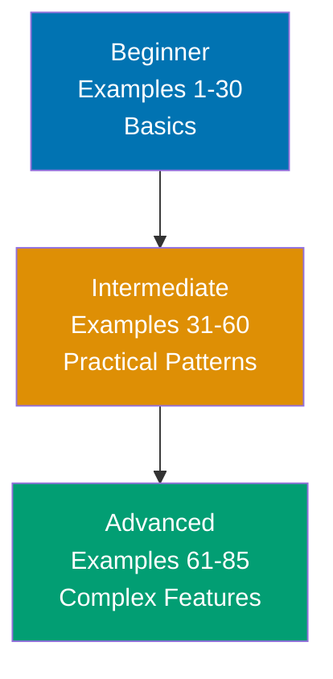

**Want to quickly pick up Elixir through working examples?** This by-example guide teaches essential concepts of Elixir through 85 annotated code examples organized by complexity level.

## What Is By-Example Learning?

By-example learning is an **example-first approach** where you learn through annotated, runnable code rather than narrative explanations. Each example is self-contained, immediately executable in IEx (Elixir's interactive shell), and heavily commented to show:

- **What each line does** - Inline comments explain the purpose and mechanism
- **Expected outputs** - Using `# =>` notation to show results
- **Intermediate values** - Variable states and process flows made visible
- **Key takeaways** - 1-2 sentence summaries of core concepts

This approach is **ideal for experienced developers** (seasonal programmers or software engineers) who are familiar with at least one programming language and want to quickly understand Elixir's syntax, idioms, and unique features through working code.

Unlike narrative tutorials that build understanding through explanation and storytelling, by-example learning lets you **see the code first, run it second, and understand it through direct interaction**. You learn by doing, not by reading about doing.

## Learning Path



Progress from fundamentals through practical patterns to advanced OTP and metaprogramming features. Each level builds on the previous, increasing in sophistication and introducing more Elixir-specific concepts.

## Coverage Philosophy

This by-example guide provides **comprehensive coverage of Elixir** through practical, annotated examples. This tutorial covers core language features comprehensively, not a time estimate—focus is on **outcomes and understanding**, not duration.

### What's Covered

- **Core syntax** - Variables, types, operators, pattern matching
- **Data structures** - Lists, tuples, maps, structs, keyword lists
- **Functions** - Anonymous and named functions, pipe operator, higher-order functions
- **Control flow** - Case, cond, with expressions, guards
- **Pattern matching** - Basic to advanced, guards, pin operator, destructuring
- **Modules and organization** - Modules, protocols, behaviors, import/alias/require
- **Error handling** - Result tuples, try/rescue, raising exceptions
- **Concurrency** - Processes, message passing, spawn, Task, Agent
- **OTP fundamentals** - GenServer, Supervisor, Applications
- **Metaprogramming** - Quote/unquote, macros, AST manipulation
- **Testing** - ExUnit, doctests, test patterns
- **Advanced features** - ETS, Registry, DynamicSupervisor, Erlang interop

### What's NOT Covered

This guide focuses on **learning-oriented examples**, not problem-solving recipes or production deployment. For additional topics:

- **Deep framework knowledge** - Phoenix, Ecto, LiveView covered at introductory level only

The comprehensive coverage goal maintains humility—no tutorial can cover everything. This guide teaches the **core concepts that continue learning beyond this tutorial** through your own exploration and project work.

## How to Use This Guide

1. **Sequential or selective** - Read examples in order for progressive learning, or jump to specific topics when switching from another language
2. **Run everything** - Copy and paste examples into IEx to see outputs yourself. Experimentation solidifies understanding.
3. **Modify and explore** - Change values, add print statements, break things intentionally. Learn through experimentation.
4. **Use as reference** - Bookmark examples for quick lookups when you forget syntax or patterns
5. **Complement with narrative tutorials** - By-example learning is code-first; pair with comprehensive tutorials for deeper explanations

**Best workflow**: Open IEx in one window, this guide in another. Run each example as you read it. When you encounter something unfamiliar, run the example, modify it, see what changes.

## Relationship to Other Tutorials

Understanding where by-example fits in the tutorial ecosystem helps you choose the right learning path:

| Tutorial Type    | Coverage                          | Approach                       | Target Audience         | When to Use                                          |
| ---------------- | --------------------------------- | ------------------------------ | ----------------------- | ---------------------------------------------------- |
| **By Example**   | Comprehensive through 85 examples | Code-first, annotated examples | Experienced developers  | Quick language pickup, reference, language switching |
| **Quick Start**  | 5-30% touchpoints                 | Hands-on project               | Newcomers to Elixir     | First taste, decide if worth learning                |
| **Beginner**     | 0-60% comprehensive               | Narrative, explanatory         | Complete beginners      | Deep understanding, first programming language       |
| **Intermediate** | 60-85%                            | Practical applications         | Past basics             | Production patterns, frameworks                      |
| **Advanced**     | advanced topics                   | Complex systems                | Experienced Elixir devs | BEAM internals, distributed systems                  |
| **Cookbook**     | Problem-specific                  | Recipe-based                   | All levels              | Solve specific problems                              |

**By Example vs. Quick Start**: By Example provides comprehensive coverage through examples vs. Quick Start's 5-30% through a single project. By Example is code-first reference; Quick Start is hands-on introduction.

**By Example vs. Beginner Tutorial**: By Example is code-first for experienced developers; Beginner Tutorial is narrative-first for complete beginners. By Example shows patterns; Beginner Tutorial explains concepts.

**By Example vs. Cookbook**: By Example is learning-oriented (understand concepts); Cookbook is problem-solving oriented (fix specific issues). By Example teaches patterns; Cookbook provides solutions.

## Prerequisites

**Required**:

- Experience with at least one programming language
- Ability to run code in IEx (Elixir's interactive shell)

**Recommended (helpful but not required)**:

- Familiarity with functional programming concepts (immutability, pure functions)
- Experience with REPL-driven development (Python, Ruby, JavaScript)
- Understanding of concurrent programming basics

**No prior Elixir experience required** - This guide assumes you're new to Elixir but experienced with programming in general. You should be comfortable reading code, understanding basic programming concepts (variables, functions, loops), and learning through hands-on experimentation.

## Structure of Each Example

Every example follows this consistent format:

````markdown
### Example N: Concept Name

Brief explanation of the concept in 2-3 sentences. Explains **what** the concept is and **why** it matters.

[OPTIONAL: Mermaid diagram when concept relationships need visualization]

**Code**:

```elixir
defmodule Example do
  # Inline comment for each significant line
  def function(arg) do
    result = operation(arg) # => expected_output_value
    # Intermediate values shown in comments
    transformed = transform(result) # => intermediate_value
    transformed # => final_return_value
  end
end

Example.function(input) # => output
```

**Key Takeaway**: 1-2 sentence summary highlighting the most important insight or pattern from this example.
````

The **brief explanation** provides context. The **code** is heavily annotated with inline comments and `# =>` output notation. The **key takeaway** distills the concept to its essence.

Mermaid diagrams appear when **visual representation clarifies concept relationships** - showing data flow, process hierarchies, or abstract structures. Not every example needs a diagram; they're used strategically to enhance understanding.

## Learning Strategies

### For Python/Ruby Developers

You're used to dynamic typing and OOP. Elixir will feel familiar yet fundamentally different:

- **Immutable data**: No variable mutation, create new values instead
- **Pattern matching**: Destructure data directly in function heads and case statements
- **No classes**: Use modules, functions, and data instead of objects

Focus on Examples 1-15 (immutability and pattern matching) and Examples 20-30 (functions and modules) to build functional intuition.

### For JavaScript/Node.js Developers

You understand async programming and callbacks. Elixir takes a different approach:

- **Processes instead of callbacks**: Lightweight processes replace event loops
- **Message passing**: Processes communicate via send/receive, not shared state
- **Supervision trees**: Let processes crash and restart instead of catching errors

Focus on Examples 45-55 (processes and message passing) and Examples 65-75 (GenServer and Supervisor) to understand the actor model.

### For Java/C# Developers

You're used to OOP and threads. Elixir replaces both:

- **Functional over OOP**: Data and functions separate, no methods on objects
- **Lightweight processes**: Spawn millions of processes, not limited by OS threads
- **Fault tolerance**: Let it crash philosophy, supervisors handle recovery

Focus on Examples 60-70 (OTP patterns) and Examples 75-85 (fault tolerance) to leverage your concurrency knowledge.

### For Haskell/ML Developers

You know functional programming. Elixir is practical FP with less type rigor:

- **Dynamic typing**: No type system, but pattern matching catches errors at runtime
- **Pragmatic purity**: Side effects allowed, but immutability enforced
- **BEAM runtime**: Actor model and hot code reloading for production systems

Focus on Examples 70-80 (metaprogramming and macros) and Examples 80-90 (advanced patterns) to see Elixir's unique features.

## Code-First Philosophy

This tutorial prioritizes working code over theoretical discussion:

- **No lengthy prose**: Concepts are demonstrated, not explained at length
- **Runnable examples**: Every example runs in IEx or as scripts
- **Learn by doing**: Understanding comes from running and modifying code
- **Pattern recognition**: See the same patterns in different contexts across 85 examples

If you prefer narrative explanations. By-example learning works best when you learn through experimentation.

## Ready to Start?

Jump into the beginner examples to start learning Elixir through code:

- [Beginner Examples (1-30)](/en/learn/software-engineering/programming-languages/elixir/by-example/beginner) - Basic syntax, pattern matching, data structures, functions
- [Intermediate Examples (31-60)](/en/learn/software-engineering/programming-languages/elixir/by-example/intermediate) - Advanced patterns, processes, testing, error handling
- [Advanced Examples (61-85)](/en/learn/software-engineering/programming-languages/elixir/by-example/advanced) - GenServer, Supervisor, metaprogramming, OTP

Each example is self-contained and runnable. Start with Example 1, or jump to topics that interest you most.

## Examples by Level

### Beginner (Examples 1–30)

- [Example 1: Hello World and Basic Syntax](/en/learn/software-engineering/programming-languages/elixir/by-example/beginner#example-1-hello-world-and-basic-syntax)
- [Example 2: Variables and Immutability](/en/learn/software-engineering/programming-languages/elixir/by-example/beginner#example-2-variables-and-immutability)
- [Example 3: Basic Data Types](/en/learn/software-engineering/programming-languages/elixir/by-example/beginner#example-3-basic-data-types)
- [Example 4: Pattern Matching Basics](/en/learn/software-engineering/programming-languages/elixir/by-example/beginner#example-4-pattern-matching-basics)
- [Example 5: Pin Operator (^)](/en/learn/software-engineering/programming-languages/elixir/by-example/beginner#example-5-pin-operator-)
- [Example 6: Destructuring Collections](/en/learn/software-engineering/programming-languages/elixir/by-example/beginner#example-6-destructuring-collections)
- [Example 7: Lists and Tuples](/en/learn/software-engineering/programming-languages/elixir/by-example/beginner#example-7-lists-and-tuples)
- [Example 8: Maps](/en/learn/software-engineering/programming-languages/elixir/by-example/beginner#example-8-maps)
- [Example 9: Keyword Lists](/en/learn/software-engineering/programming-languages/elixir/by-example/beginner#example-9-keyword-lists)
- [Example 10: Anonymous Functions](/en/learn/software-engineering/programming-languages/elixir/by-example/beginner#example-10-anonymous-functions)
- [Example 11: Named Functions in Modules](/en/learn/software-engineering/programming-languages/elixir/by-example/beginner#example-11-named-functions-in-modules)
- [Example 12: Pipe Operator (|>)](/en/learn/software-engineering/programming-languages/elixir/by-example/beginner#example-12-pipe-operator-)
- [Example 13: Case and Cond](/en/learn/software-engineering/programming-languages/elixir/by-example/beginner#example-13-case-and-cond)
- [Example 14: Recursion Basics](/en/learn/software-engineering/programming-languages/elixir/by-example/beginner#example-14-recursion-basics)
- [Example 15: Enum Module Essentials](/en/learn/software-engineering/programming-languages/elixir/by-example/beginner#example-15-enum-module-essentials)
- [Example 16: Ranges and Range Operations](/en/learn/software-engineering/programming-languages/elixir/by-example/beginner#example-16-ranges-and-range-operations)
- [Example 17: String Interpolation Advanced](/en/learn/software-engineering/programming-languages/elixir/by-example/beginner#example-17-string-interpolation-advanced)
- [Example 18: List Operators and Head/Tail](/en/learn/software-engineering/programming-languages/elixir/by-example/beginner#example-18-list-operators-and-headtail)
- [Example 19: If and Unless Expressions](/en/learn/software-engineering/programming-languages/elixir/by-example/beginner#example-19-if-and-unless-expressions)
- [Example 20: Multiple Function Clauses](/en/learn/software-engineering/programming-languages/elixir/by-example/beginner#example-20-multiple-function-clauses)
- [Example 21: Default Arguments](/en/learn/software-engineering/programming-languages/elixir/by-example/beginner#example-21-default-arguments)
- [Example 22: First-Class Functions](/en/learn/software-engineering/programming-languages/elixir/by-example/beginner#example-22-first-class-functions)
- [Example 23: Module Compilation and Loading](/en/learn/software-engineering/programming-languages/elixir/by-example/beginner#example-23-module-compilation-and-loading)
- [Example 24: IEx Basics and Helpers](/en/learn/software-engineering/programming-languages/elixir/by-example/beginner#example-24-iex-basics-and-helpers)
- [Example 25: Boolean and Comparison Operators](/en/learn/software-engineering/programming-languages/elixir/by-example/beginner#example-25-boolean-and-comparison-operators)
- [Example 26: Truthy and Falsy Values](/en/learn/software-engineering/programming-languages/elixir/by-example/beginner#example-26-truthy-and-falsy-values)
- [Example 27: String Concatenation](/en/learn/software-engineering/programming-languages/elixir/by-example/beginner#example-27-string-concatenation)
- [Example 28: List Comprehensions Basics](/en/learn/software-engineering/programming-languages/elixir/by-example/beginner#example-28-list-comprehensions-basics)
- [Example 29: Tuple Matching and Destructuring](/en/learn/software-engineering/programming-languages/elixir/by-example/beginner#example-29-tuple-matching-and-destructuring)
- [Example 30: Range Patterns and Membership](/en/learn/software-engineering/programming-languages/elixir/by-example/beginner#example-30-range-patterns-and-membership)

### Intermediate (Examples 31–60)

- [Example 31: Guards in Depth](/en/learn/software-engineering/programming-languages/elixir/by-example/intermediate#example-31-guards-in-depth)
- [Example 32: Pattern Matching in Function Heads](/en/learn/software-engineering/programming-languages/elixir/by-example/intermediate#example-32-pattern-matching-in-function-heads)
- [Example 33: With Expression (Happy Path)](/en/learn/software-engineering/programming-languages/elixir/by-example/intermediate#example-33-with-expression-happy-path)
- [Example 34: Structs](/en/learn/software-engineering/programming-languages/elixir/by-example/intermediate#example-34-structs)
- [Example 35: Streams (Lazy Enumeration)](/en/learn/software-engineering/programming-languages/elixir/by-example/intermediate#example-35-streams-lazy-enumeration)
- [Example 36: MapSet for Uniqueness](/en/learn/software-engineering/programming-languages/elixir/by-example/intermediate#example-36-mapset-for-uniqueness)
- [Example 37: Module Attributes](/en/learn/software-engineering/programming-languages/elixir/by-example/intermediate#example-37-module-attributes)
- [Example 38: Import, Alias, Require](/en/learn/software-engineering/programming-languages/elixir/by-example/intermediate#example-38-import-alias-require)
- [Example 39: Protocols (Polymorphism)](/en/learn/software-engineering/programming-languages/elixir/by-example/intermediate#example-39-protocols-polymorphism)
- [Example 40: Result Tuples (:ok/:error)](/en/learn/software-engineering/programming-languages/elixir/by-example/intermediate#example-40-result-tuples-okerror)
- [Example 41: Try/Rescue/After](/en/learn/software-engineering/programming-languages/elixir/by-example/intermediate#example-41-tryrescueafter)
- [Example 42: Raise and Custom Exceptions](/en/learn/software-engineering/programming-languages/elixir/by-example/intermediate#example-42-raise-and-custom-exceptions)
- [Example 43: Spawning Processes](/en/learn/software-engineering/programming-languages/elixir/by-example/intermediate#example-43-spawning-processes)
- [Example 44: Send and Receive](/en/learn/software-engineering/programming-languages/elixir/by-example/intermediate#example-44-send-and-receive)
- [Example 45: Process Monitoring](/en/learn/software-engineering/programming-languages/elixir/by-example/intermediate#example-45-process-monitoring)
- [Example 46: Task Module (Async/Await)](/en/learn/software-engineering/programming-languages/elixir/by-example/intermediate#example-46-task-module-asyncawait)
- [Example 47: ExUnit Basics](/en/learn/software-engineering/programming-languages/elixir/by-example/intermediate#example-47-exunit-basics)
- [Example 48: Mix Project Structure](/en/learn/software-engineering/programming-languages/elixir/by-example/intermediate#example-48-mix-project-structure)
- [Example 49: Doctests](/en/learn/software-engineering/programming-languages/elixir/by-example/intermediate#example-49-doctests)
- [Example 50: String Manipulation Advanced](/en/learn/software-engineering/programming-languages/elixir/by-example/intermediate#example-50-string-manipulation-advanced)
- [Example 51: GenServer Session Manager (Production Pattern)](/en/learn/software-engineering/programming-languages/elixir/by-example/intermediate#example-51-genserver-session-manager-production-pattern)
- [Example 52: Supervisor Child Specifications](/en/learn/software-engineering/programming-languages/elixir/by-example/intermediate#example-52-supervisor-child-specifications)
- [Example 53: Application Callbacks and Lifecycle](/en/learn/software-engineering/programming-languages/elixir/by-example/intermediate#example-53-application-callbacks-and-lifecycle)
- [Example 54: Custom Mix Tasks](/en/learn/software-engineering/programming-languages/elixir/by-example/intermediate#example-54-custom-mix-tasks)
- [Example 55: Runtime Configuration](/en/learn/software-engineering/programming-languages/elixir/by-example/intermediate#example-55-runtime-configuration)
- [Example 56: Process Links and Crash Propagation](/en/learn/software-engineering/programming-languages/elixir/by-example/intermediate#example-56-process-links-and-crash-propagation)
- [Example 57: Message Mailbox Management](/en/learn/software-engineering/programming-languages/elixir/by-example/intermediate#example-57-message-mailbox-management)
- [Example 58: Anonymous GenServers and Local Names](/en/learn/software-engineering/programming-languages/elixir/by-example/intermediate#example-58-anonymous-genservers-and-local-names)
- [Example 59: Telemetry Events and Metrics](/en/learn/software-engineering/programming-languages/elixir/by-example/intermediate#example-59-telemetry-events-and-metrics)
- [Example 60: Type Specifications with @spec](/en/learn/software-engineering/programming-languages/elixir/by-example/intermediate#example-60-type-specifications-with-spec)

### Advanced (Examples 61–85)

- [Example 61: GenServer Basics](/en/learn/software-engineering/programming-languages/elixir/by-example/advanced#example-61-genserver-basics)
- [Example 62: GenServer State Management](/en/learn/software-engineering/programming-languages/elixir/by-example/advanced#example-62-genserver-state-management)
- [Example 63: GenServer Error Handling](/en/learn/software-engineering/programming-languages/elixir/by-example/advanced#example-63-genserver-error-handling)
- [Example 64: GenServer Named Processes](/en/learn/software-engineering/programming-languages/elixir/by-example/advanced#example-64-genserver-named-processes)
- [Example 65: GenServer Best Practices](/en/learn/software-engineering/programming-languages/elixir/by-example/advanced#example-65-genserver-best-practices)
- [Example 66: Supervisor Basics](/en/learn/software-engineering/programming-languages/elixir/by-example/advanced#example-66-supervisor-basics)
- [Example 67: Restart Strategies](/en/learn/software-engineering/programming-languages/elixir/by-example/advanced#example-67-restart-strategies)
- [Example 68: Dynamic Supervisors](/en/learn/software-engineering/programming-languages/elixir/by-example/advanced#example-68-dynamic-supervisors)
- [Example 69: Application Module](/en/learn/software-engineering/programming-languages/elixir/by-example/advanced#example-69-application-module)
- [Example 70: Application Configuration](/en/learn/software-engineering/programming-languages/elixir/by-example/advanced#example-70-application-configuration)
- [Example 71: Umbrella Projects](/en/learn/software-engineering/programming-languages/elixir/by-example/advanced#example-71-umbrella-projects)
- [Example 72: Quote and Unquote](/en/learn/software-engineering/programming-languages/elixir/by-example/advanced#example-72-quote-and-unquote)
- [Example 73: Writing Simple Macros](/en/learn/software-engineering/programming-languages/elixir/by-example/advanced#example-73-writing-simple-macros)
- [Example 74: Use Macro Pattern](/en/learn/software-engineering/programming-languages/elixir/by-example/advanced#example-74-use-macro-pattern)
- [Example 75: Macro Best Practices](/en/learn/software-engineering/programming-languages/elixir/by-example/advanced#example-75-macro-best-practices)
- [Example 76: Reflection and Module Introspection](/en/learn/software-engineering/programming-languages/elixir/by-example/advanced#example-76-reflection-and-module-introspection)
- [Example 77: Agent for Simple State](/en/learn/software-engineering/programming-languages/elixir/by-example/advanced#example-77-agent-for-simple-state)
- [Example 78: Registry for Process Discovery](/en/learn/software-engineering/programming-languages/elixir/by-example/advanced#example-78-registry-for-process-discovery)
- [Example 79: ETS Tables (In-Memory Storage)](/en/learn/software-engineering/programming-languages/elixir/by-example/advanced#example-79-ets-tables-in-memory-storage)
- [Example 80: Erlang Interop](/en/learn/software-engineering/programming-languages/elixir/by-example/advanced#example-80-erlang-interop)
- [Example 81: Behaviours (Contracts)](/en/learn/software-engineering/programming-languages/elixir/by-example/advanced#example-81-behaviours-contracts)
- [Example 82: Comprehensions Deep Dive](/en/learn/software-engineering/programming-languages/elixir/by-example/advanced#example-82-comprehensions-deep-dive)
- [Example 83: Bitstring Pattern Matching](/en/learn/software-engineering/programming-languages/elixir/by-example/advanced#example-83-bitstring-pattern-matching)
- [Example 84: Performance: Profiling and Optimization](/en/learn/software-engineering/programming-languages/elixir/by-example/advanced#example-84-performance-profiling-and-optimization)
- [Example 85: Debugging Tools](/en/learn/software-engineering/programming-languages/elixir/by-example/advanced#example-85-debugging-tools)
