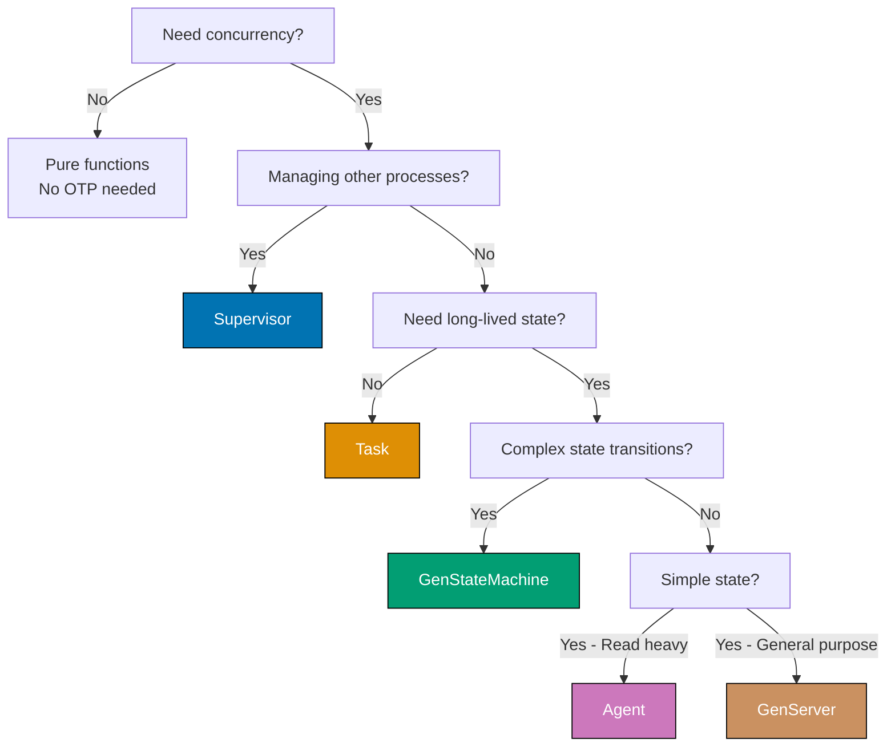
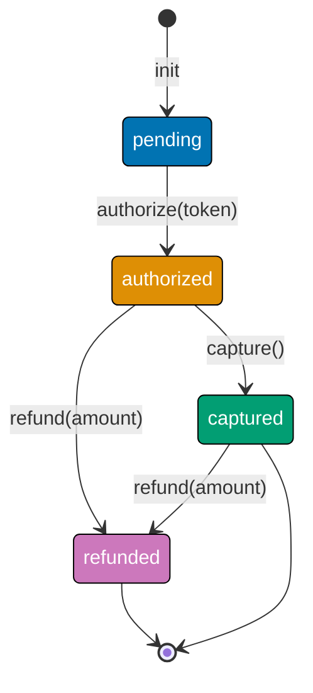

**Building concurrent systems with OTP?** This guide provides a complete overview of all OTP behaviors, decision criteria for selecting the right behavior, and practical patterns for each. Learn when to use GenServer, Supervisor, GenStateMachine, Task, and Agent through real production scenarios.

## Why OTP Behaviors Matter

OTP (Open Telecom Platform) provides battle-tested abstractions for concurrent, fault-tolerant systems. Each behavior solves specific production challenges:

- **GenServer** - General-purpose stateful processes with synchronous/asynchronous calls
- **Supervisor** - Automatic fault recovery and process lifecycle management
- **GenStateMachine** - Complex finite state machines with explicit state transitions
- **Task** - Short-lived asynchronous operations without long-term state
- **Agent** - Simple state containers with minimal boilerplate

**Production reality**: Choosing the wrong behavior increases complexity and reduces maintainability.

**Our approach**: Decision matrix first → Understand each behavior → See production patterns.

## OTP Behavior Decision Matrix

Use this decision tree to select the appropriate behavior:



### Quick Selection Guide

| Use Case                  | Behavior                | Reason                                    |
| ------------------------- | ----------------------- | ----------------------------------------- |
| Process supervision       | Supervisor              | Automatic restart, fault isolation        |
| API rate limiter          | GenServer               | Persistent state, synchronized access     |
| Background job execution  | Task                    | Short-lived, async, no long-term state    |
| Payment workflow FSM      | GenStateMachine         | Complex state graph, explicit transitions |
| Configuration cache       | Agent                   | Read-optimized, simple state container    |
| WebSocket connection pool | GenServer               | Connection state, lifecycle callbacks     |
| Health check monitor      | Task.async + Supervisor | Async operations with supervision         |
| Shopping cart state       | GenServer               | Mutable state, synchronous updates        |

## GenServer - General State Management

### When to Use GenServer

**Use GenServer when you need**:

- Long-lived processes with mutable state
- Synchronous request-response patterns (call)
- Asynchronous fire-and-forget messages (cast)
- Lifecycle callbacks (init, terminate, handle_info)
- Complex business logic around state transitions

### Production Pattern - API Rate Limiter

```elixir
# GenServer-based token bucket rate limiter
defmodule RateLimiter do
  use GenServer                              # => Imports GenServer behavior
                                             # => Provides init/1, handle_call/3, etc.

  @refill_rate 10                            # => Tokens per second
  @bucket_size 100                           # => Maximum tokens

  # => Client API
  def start_link(opts \\ []) do
    GenServer.start_link(__MODULE__, opts, name: __MODULE__)
                                             # => Starts process, registers name
                                             # => Returns {:ok, pid}
  end

  def check_rate(user_id) do
    GenServer.call(__MODULE__, {:check, user_id})
                                             # => Synchronous call
                                             # => Returns {:ok, :allowed} or {:error, :rate_limited}
  end

  # => Server Callbacks
  def init(_opts) do
    :timer.send_interval(1000, :refill)      # => Schedule refill every 1s
                                             # => Sends :refill message to self()
    {:ok, %{}}                               # => Initial state: empty map
                                             # => Type: %{user_id => tokens}
  end

  def handle_call({:check, user_id}, _from, state) do
    tokens = Map.get(state, user_id, @bucket_size)
                                             # => Get user tokens, default to full bucket
                                             # => Type: integer

    if tokens > 0 do
      new_state = Map.put(state, user_id, tokens - 1)
                                             # => Consume 1 token
      {:reply, {:ok, :allowed}, new_state}   # => Allow request, update state
                                             # => Type: {:reply, term(), map()}
    else
      {:reply, {:error, :rate_limited}, state}
                                             # => Reject request, state unchanged
    end
  end

  def handle_info(:refill, state) do
    new_state =
      state
      |> Enum.map(fn {user_id, tokens} ->
        {user_id, min(tokens + @refill_rate, @bucket_size)}
                                             # => Add tokens, cap at bucket_size
                                             # => Type: {user_id, integer}
      end)
      |> Map.new()                           # => Convert back to map

    {:noreply, new_state}                    # => Update state, no reply needed
                                             # => Type: {:noreply, map()}
  end
end

# Usage
{:ok, _pid} = RateLimiter.start_link()       # => Starts rate limiter
                                             # => Returns {:ok, pid}

RateLimiter.check_rate("user_123")           # => {:ok, :allowed}
RateLimiter.check_rate("user_123")           # => {:ok, :allowed} (99 left)
# ... 100 calls later ...
RateLimiter.check_rate("user_123")           # => {:error, :rate_limited}
```

### GenServer Trade-offs

| Aspect               | Advantages                        | Disadvantages                        |
| -------------------- | --------------------------------- | ------------------------------------ |
| **State Management** | Full control over state mutations | Must handle all edge cases manually  |
| **Synchronization**  | Built-in call/cast semantics      | Can become bottleneck if overused    |
| **Lifecycle**        | Rich callback interface           | More boilerplate than Agent          |
| **Complexity**       | Handles complex scenarios         | Overkill for simple state containers |

## Supervisor - Fault Tolerance

### When to Use Supervisor

**Use Supervisor when you need**:

- Automatic process restart on failure
- Fault isolation (prevent cascading failures)
- Process lifecycle management (start, stop, restart)
- Supervision trees for hierarchical systems
- Different restart strategies (one_for_one, rest_for_one, one_for_all)

### Production Pattern - Worker Pool Supervision

```elixir
# Supervisor for database connection pool
defmodule DBConnectionPool do
  use Supervisor                             # => Imports Supervisor behavior
                                             # => Provides init/1, start_link/1

  def start_link(opts) do
    Supervisor.start_link(__MODULE__, opts, name: __MODULE__)
                                             # => Starts supervisor process
                                             # => Returns {:ok, pid}
  end

  def init(opts) do
    pool_size = Keyword.get(opts, :pool_size, 10)
                                             # => Get pool size, default 10
                                             # => Type: integer

    children =
      for i <- 1..pool_size do
        Supervisor.child_spec(
          {DBConnection, [id: i]},           # => Worker module and args
          id: {:db_connection, i}            # => Unique ID for each worker
                                             # => Required for restart tracking
        )
      end                                    # => List of 10 child specs
                                             # => Type: [child_spec()]

    Supervisor.init(children, strategy: :one_for_one)
                                             # => one_for_one: Only failed child restarts
                                             # => Other options: :rest_for_one, :one_for_all
                                             # => Returns {:ok, {supervisor_flags, [child_spec]}}
  end
end

# Individual connection worker
defmodule DBConnection do
  use GenServer

  def start_link(opts) do
    id = Keyword.fetch!(opts, :id)           # => Required :id option
    GenServer.start_link(__MODULE__, id, name: via_tuple(id))
                                             # => Register with process registry
  end

  defp via_tuple(id) do
    {:via, Registry, {DBConnectionRegistry, id}}
                                             # => Registry-based naming
                                             # => Allows dynamic lookup
  end

  def init(id) do
    # Connect to database
    conn = establish_connection()            # => Opens database connection
                                             # => Returns connection handle

    {:ok, %{id: id, conn: conn}}             # => Store ID and connection
                                             # => Type: %{id: integer, conn: term()}
  end

  def handle_info(:connection_lost, state) do
    # Connection lost - let it crash
    # Supervisor will restart this worker
    {:stop, :connection_lost, state}         # => Terminate process
                                             # => Supervisor detects exit
                                             # => Starts fresh worker automatically
  end

  defp establish_connection do
    # Actual database connection logic
    :connection_handle                       # => Placeholder
  end
end

# Start supervision tree
{:ok, _sup} = DBConnectionPool.start_link(pool_size: 10)
                                             # => Starts supervisor with 10 workers
                                             # => All workers start automatically
                                             # => Failed workers restart automatically
```

### Supervisor Strategies

| Strategy          | Behavior                                    | Use Case                               |
| ----------------- | ------------------------------------------- | -------------------------------------- |
| **:one_for_one**  | Only failed child restarts                  | Independent workers (connection pools) |
| **:rest_for_one** | Failed child + all started after it restart | Dependency chain (db → cache → api)    |
| **:one_for_all**  | All children restart if any fails           | Tightly coupled components             |

## GenStateMachine - Complex State Machines

### When to Use GenStateMachine

**Use GenStateMachine when you need**:

- Explicit finite state machine with clear state graph
- State-specific event handling (different events per state)
- Complex workflows with multiple stages
- Guaranteed state transition integrity
- Visual state diagram documentation

**Note**: Requires `gen_state_machine` library. Add to `mix.exs`:

```elixir
{:gen_state_machine, "~> 3.0"}               # => Add to deps
```

### Production Pattern - Payment Workflow FSM

```elixir
# Payment processing with explicit state transitions
defmodule PaymentProcessor do
  use GenStateMachine                        # => Imports GenStateMachine behavior
                                             # => Provides callback_mode/0, init/1, handle_event/4

  # States: :pending → :authorized → :captured | :refunded
  # Events: :authorize, :capture, :refund, :cancel

  # => Client API
  def start_link(payment_id, amount) do
    GenStateMachine.start_link(__MODULE__, {payment_id, amount})
                                             # => Starts state machine process
                                             # => Returns {:ok, pid}
  end

  def authorize(pid, card_token) do
    GenStateMachine.call(pid, {:authorize, card_token})
                                             # => Synchronous state transition
                                             # => Returns :ok or {:error, reason}
  end

  def capture(pid) do
    GenStateMachine.call(pid, :capture)      # => Capture authorized payment
  end

  def refund(pid, amount) do
    GenStateMachine.call(pid, {:refund, amount})
                                             # => Initiate refund
  end

  # => Server Callbacks
  def callback_mode, do: :state_functions    # => Use state-specific functions
                                             # => Alternative: :handle_event_function

  def init({payment_id, amount}) do
    data = %{
      payment_id: payment_id,
      amount: amount,
      authorized_amount: 0,
      captured_amount: 0
    }                                        # => Initial data structure
                                             # => Type: map()

    {:ok, :pending, data}                    # => Start in :pending state
                                             # => Type: {:ok, state, data}
  end

  # => State: :pending
  def pending({:call, from}, {:authorize, card_token}, data) do
    case authorize_payment(card_token, data.amount) do
      {:ok, auth_id} ->
        new_data = %{data | authorized_amount: data.amount}
                                             # => Store authorized amount

        {:next_state, :authorized, new_data, [{:reply, from, :ok}]}
                                             # => Transition to :authorized
                                             # => Reply to caller
                                             # => Type: {:next_state, state, data, [action]}

      {:error, reason} ->
        {:keep_state_and_data, [{:reply, from, {:error, reason}}]}
                                             # => Stay in :pending
                                             # => Return error to caller
    end
  end

  def pending({:call, from}, _event, _data) do
    {:keep_state_and_data, [{:reply, from, {:error, :invalid_event}}]}
                                             # => Reject invalid events in :pending
  end

  # => State: :authorized
  def authorized({:call, from}, :capture, data) do
    case capture_payment(data.payment_id, data.authorized_amount) do
      :ok ->
        new_data = %{data | captured_amount: data.authorized_amount}
                                             # => Record captured amount

        {:next_state, :captured, new_data, [{:reply, from, :ok}]}
                                             # => Transition to :captured
                                             # => Terminal state (no further transitions)

      {:error, reason} ->
        {:keep_state_and_data, [{:reply, from, {:error, reason}}]}
                                             # => Capture failed, stay :authorized
    end
  end

  def authorized({:call, from}, {:refund, amount}, data) do
    if amount <= data.authorized_amount do
      case refund_payment(data.payment_id, amount) do
        :ok ->
          new_data = %{data | authorized_amount: data.authorized_amount - amount}
                                             # => Reduce authorized amount

          {:next_state, :refunded, new_data, [{:reply, from, :ok}]}
                                             # => Transition to :refunded

        {:error, reason} ->
          {:keep_state_and_data, [{:reply, from, {:error, reason}}]}
      end
    else
      {:keep_state_and_data, [{:reply, from, {:error, :invalid_amount}}]}
                                             # => Amount exceeds authorized
    end
  end

  def authorized({:call, from}, _event, _data) do
    {:keep_state_and_data, [{:reply, from, {:error, :invalid_event}}]}
  end

  # => State: :captured (terminal)
  def captured({:call, from}, {:refund, amount}, data) do
    if amount <= data.captured_amount do
      case refund_payment(data.payment_id, amount) do
        :ok ->
          new_data = %{data | captured_amount: data.captured_amount - amount}
          {:next_state, :refunded, new_data, [{:reply, from, :ok}]}

        {:error, reason} ->
          {:keep_state_and_data, [{:reply, from, {:error, reason}}]}
      end
    else
      {:keep_state_and_data, [{:reply, from, {:error, :invalid_amount}}]}
    end
  end

  def captured({:call, from}, _event, _data) do
    {:keep_state_and_data, [{:reply, from, {:error, :terminal_state}}]}
                                             # => Cannot transition from :captured
  end

  # => State: :refunded (terminal)
  def refunded({:call, from}, _event, _data) do
    {:keep_state_and_data, [{:reply, from, {:error, :terminal_state}}]}
                                             # => No transitions from :refunded
  end

  # Helper functions
  defp authorize_payment(_token, _amount), do: {:ok, "auth_123"}
  defp capture_payment(_id, _amount), do: :ok
  defp refund_payment(_id, _amount), do: :ok
end

# Usage
{:ok, pid} = PaymentProcessor.start_link("pay_123", 10000)
                                             # => Starts in :pending state

PaymentProcessor.authorize(pid, "tok_visa") # => :ok
                                             # => Transitions: :pending → :authorized

PaymentProcessor.capture(pid)                # => :ok
                                             # => Transitions: :authorized → :captured

PaymentProcessor.refund(pid, 5000)           # => :ok
                                             # => Transitions: :captured → :refunded
```

### State Machine Visualization



### GenStateMachine Trade-offs

| Aspect            | Advantages                              | Disadvantages                   |
| ----------------- | --------------------------------------- | ------------------------------- |
| **State Clarity** | Explicit state graph, self-documenting  | More boilerplate than GenServer |
| **Type Safety**   | Invalid transitions rejected at runtime | Requires external library       |
| **Debugging**     | Clear state history, easy to trace      | Steeper learning curve          |
| **Maintenance**   | Changes to workflow explicit in code    | Overkill for simple state flags |

## Task - Asynchronous Operations

### When to Use Task

**Use Task when you need**:

- Short-lived asynchronous operations (no long-term state)
- Parallel execution of independent operations
- Fire-and-forget async work
- Awaitable async results with timeout
- Supervised async operations (Task.Supervisor)

### Production Pattern - Parallel API Calls

```elixir
# Fetch user profile from multiple services in parallel
defmodule ProfileAggregator do
  def fetch_profile(user_id) do
    # Start tasks for each service
    tasks = [
      Task.async(fn -> fetch_user_data(user_id) end),
                                             # => Spawns process for user_data
                                             # => Returns %Task{pid: pid, ref: ref}

      Task.async(fn -> fetch_preferences(user_id) end),
                                             # => Spawns process for preferences

      Task.async(fn -> fetch_recent_activity(user_id) end)
                                             # => Spawns process for activity
    ]                                        # => List of 3 tasks running in parallel
                                             # => Type: [%Task{}]

    # Await all tasks with timeout
    results = Task.await_many(tasks, 5000)   # => Wait max 5 seconds for all
                                             # => Returns [result1, result2, result3]
                                             # => Raises on timeout
                                             # => Type: [term()]

    # Aggregate results
    [user_data, preferences, activity] = results
                                             # => Pattern match results

    %{
      user: user_data,
      preferences: preferences,
      recent_activity: activity
    }                                        # => Combined profile
                                             # => Type: map()
  end

  # Task.Supervisor for fault-tolerant async operations
  def fetch_profile_supervised(user_id) do
    tasks = [
      Task.Supervisor.async(ProfileTaskSup, fn -> fetch_user_data(user_id) end),
                                             # => Spawns supervised task
                                             # => Linked to supervisor, not caller

      Task.Supervisor.async(ProfileTaskSup, fn -> fetch_preferences(user_id) end),
      Task.Supervisor.async(ProfileTaskSup, fn -> fetch_recent_activity(user_id) end)
    ]

    # Await with timeout, handle failures
    results =
      tasks
      |> Task.await_many(5000)               # => Wait for all tasks
      |> Enum.map(fn
        {:ok, data} -> data                  # => Success case
        {:error, _} -> nil                   # => Failure case - use nil
      end)                                   # => List with failures replaced by nil
                                             # => Type: [term() | nil]

    [user_data, preferences, activity] = results

    %{
      user: user_data || %{},                # => Fallback to empty map
      preferences: preferences || %{},
      recent_activity: activity || []
    }
  end

  defp fetch_user_data(user_id) do
    # Simulate API call
    :timer.sleep(100)
    {:ok, %{id: user_id, name: "User #{user_id}"}}
  end

  defp fetch_preferences(user_id) do
    :timer.sleep(150)
    {:ok, %{theme: "dark", notifications: true}}
  end

  defp fetch_recent_activity(user_id) do
    :timer.sleep(200)
    {:ok, [%{action: "login", timestamp: DateTime.utc_now()}]}
  end
end

# Start Task.Supervisor in application supervision tree
children = [
  {Task.Supervisor, name: ProfileTaskSup}    # => Supervises async tasks
                                             # => Prevents task failures from crashing caller
]

Supervisor.start_link(children, strategy: :one_for_one)

# Usage
profile = ProfileAggregator.fetch_profile("user_123")
                                             # => Returns in ~200ms (parallel)
                                             # => Sequential would take ~450ms

profile_safe = ProfileAggregator.fetch_profile_supervised("user_456")
                                             # => Failures don't crash caller
                                             # => Returns partial data on errors
```

### Task Trade-offs

| Aspect              | Advantages                    | Disadvantages                         |
| ------------------- | ----------------------------- | ------------------------------------- |
| **Simplicity**      | Minimal boilerplate, built-in | No long-term state management         |
| **Parallelism**     | Easy parallel execution       | Not suitable for persistent processes |
| **Fault Tolerance** | Task.Supervisor for safety    | No automatic retry logic              |
| **Timeouts**        | Built-in timeout support      | Manual error handling required        |

## Agent - Simple State Containers

### When to Use Agent

**Use Agent when you need**:

- Simple state container (no complex logic)
- Read-heavy workloads (configuration, cache)
- Minimal boilerplate for state management
- No need for call/cast distinction
- No lifecycle callbacks required

### Production Pattern - Configuration Cache

```elixir
# Agent-based configuration cache
defmodule ConfigCache do
  use Agent                                  # => Imports Agent behavior
                                             # => Provides start_link/1, get/1, update/2

  def start_link(_opts) do
    Agent.start_link(fn -> load_config() end, name: __MODULE__)
                                             # => Starts agent with initial state
                                             # => load_config/0 runs in agent process
                                             # => Returns {:ok, pid}
  end

  def get(key) do
    Agent.get(__MODULE__, fn state -> Map.get(state, key) end)
                                             # => Read-only access to state
                                             # => Function runs in agent process
                                             # => Returns value or nil
                                             # => Type: term()
  end

  def get_all do
    Agent.get(__MODULE__, & &1)              # => Return entire state
                                             # => & &1 is identity function
                                             # => Type: map()
  end

  def put(key, value) do
    Agent.update(__MODULE__, fn state ->
      Map.put(state, key, value)             # => Update state map
    end)                                     # => Returns :ok
                                             # => New state replaces old
  end

  def reload do
    Agent.update(__MODULE__, fn _state ->
      load_config()                          # => Discard old state
                                             # => Load fresh config
    end)
  end

  defp load_config do
    # Load from file/environment
    %{
      api_key: System.get_env("API_KEY"),
      timeout: 5000,
      retry_attempts: 3
    }                                        # => Initial state
                                             # => Type: map()
  end
end

# Usage
{:ok, _pid} = ConfigCache.start_link([])     # => Loads config on startup

ConfigCache.get(:timeout)                    # => 5000
ConfigCache.put(:timeout, 10000)             # => :ok
ConfigCache.get(:timeout)                    # => 10000

ConfigCache.reload()                         # => :ok (reloads from environment)
```

### Agent vs GenServer

| Feature            | Agent                    | GenServer                      |
| ------------------ | ------------------------ | ------------------------------ |
| **Boilerplate**    | Minimal (`use Agent`)    | Moderate (callbacks)           |
| **State access**   | get/update functions     | handle_call/cast               |
| **Lifecycle**      | None                     | init, terminate, handle_info   |
| **Use case**       | Simple state, read-heavy | Complex logic, lifecycle needs |
| **Learning curve** | Beginner-friendly        | Intermediate                   |

## Behavior Selection Summary

### Quick Reference Table

| Requirement                       | Recommended Behavior    | Alternative                 |
| --------------------------------- | ----------------------- | --------------------------- |
| Supervise other processes         | Supervisor              | N/A                         |
| Complex state machine (5+ states) | GenStateMachine         | GenServer with state field  |
| Short-lived async operations      | Task                    | spawn_link + receive        |
| Simple read-heavy state           | Agent                   | GenServer (overkill)        |
| API with call/cast semantics      | GenServer               | N/A                         |
| Connection pooling                | GenServer + Supervisor  | Poolboy library             |
| Background job queue              | GenServer + Supervisor  | Oban library                |
| Real-time data processing         | GenStage (stream-based) | GenServer with backpressure |

### Complexity vs Control Spectrum


**Rule of thumb**:

- Start with simplest behavior that solves the problem
- Upgrade to more complex behavior when limitations hit
- Always supervise production processes (even Agents)

## Common Anti-Patterns

### ❌ Using GenServer for Simple State

```elixir
# ANTI-PATTERN: GenServer for config storage
defmodule ConfigGenServer do
  use GenServer

  def init(_), do: {:ok, %{timeout: 5000}}
  def handle_call(:get_timeout, _, state), do: {:reply, state.timeout, state}
  def handle_cast({:set_timeout, val}, state), do: {:noreply, %{state | timeout: val}}
end

# BETTER: Use Agent
defmodule ConfigAgent do
  use Agent

  def start_link(_), do: Agent.start_link(fn -> %{timeout: 5000} end, name: __MODULE__)
  def get_timeout, do: Agent.get(__MODULE__, & &1.timeout)
  def set_timeout(val), do: Agent.update(__MODULE__, &Map.put(&1, :timeout, val))
end
```

### ❌ Task for Long-Lived State

```elixir
# ANTI-PATTERN: Task with infinite loop
Task.start(fn ->
  Stream.repeatedly(fn -> do_work() end)
  |> Enum.each(& &1)                         # => Never terminates
end)                                         # => No supervision, no recovery

# BETTER: GenServer with supervision
defmodule Worker do
  use GenServer

  def init(_), do: {:ok, %{}, {:continue, :work}}
  def handle_continue(:work, state) do
    do_work()
    {:noreply, state, {:continue, :work}}    # => Infinite loop with proper OTP lifecycle
  end
end

Supervisor.start_link([Worker], strategy: :one_for_one)
```

### ❌ GenStateMachine for Simple Flags

```elixir
# ANTI-PATTERN: FSM for boolean state
defmodule FeatureFlag do
  use GenStateMachine

  def enabled({:call, from}, :check, _) do
    {:keep_state_and_data, [{:reply, from, true}]}
  end

  def disabled({:call, from}, :check, _) do
    {:keep_state_and_data, [{:reply, from, false}]}
  end
end

# BETTER: GenServer or Agent
defmodule FeatureFlag do
  use Agent

  def start_link(_), do: Agent.start_link(fn -> false end, name: __MODULE__)
  def enabled?, do: Agent.get(__MODULE__, & &1)
  def enable, do: Agent.update(__MODULE__, fn _ -> true end)
  def disable, do: Agent.update(__MODULE__, fn _ -> false end)
end
```

## Best Practices

### 1. Always Supervise Production Processes

```elixir
# Start all behaviors under supervision
children = [
  {RateLimiter, []},                         # => GenServer
  {DBConnectionPool, pool_size: 10},         # => Supervisor
  {Task.Supervisor, name: MyTaskSup},        # => Task.Supervisor
  {ConfigCache, []}                          # => Agent
]

Supervisor.start_link(children, strategy: :one_for_one)
                                             # => All behaviors supervised
                                             # => Automatic restart on failure
```

### 2. Use Process Registries for Dynamic Naming

```elixir
# Registry-based naming for multiple instances
{:ok, _} = Registry.start_link(keys: :unique, name: MyRegistry)

GenServer.start_link(MyWorker, init_args, name: {:via, Registry, {MyRegistry, worker_id}})
                                             # => Register by ID
                                             # => Supports dynamic lookup

# Lookup
[{pid, _}] = Registry.lookup(MyRegistry, worker_id)
```

### 3. Implement Proper Timeouts

```elixir
# GenServer with call timeout
GenServer.call(pid, :slow_operation, 30_000) # => 30 second timeout
                                             # => Raises exit after timeout

# Task with timeout
case Task.await(task, 5000) do
  result -> {:ok, result}
after
  0 -> {:error, :timeout}                    # => Cleanup after timeout
end
```

### 4. Use GenStateMachine for Complex Workflows

**When state graph has 5+ states** or **multiple transitions per state**, prefer GenStateMachine over GenServer with state field.

### 5. Prefer Task.Supervisor for Production Async

```elixir
# Production-safe async tasks
Task.Supervisor.async_nolink(MySup, fn -> risky_operation() end)
                                             # => Failure doesn't crash caller
                                             # => Supervisor handles cleanup
```

## Next Steps

**Master individual behaviors**:

- [GenServer Patterns](/en/learn/software-engineering/programming-languages/elixir/in-the-field/genserver-patterns) - Deep dive into GenServer design patterns
- [Supervisor Trees](/en/learn/software-engineering/programming-languages/elixir/in-the-field/supervisor-trees) - Supervision strategies and fault tolerance

**Learn supervision integration**:

- [Application Structure](/en/learn/software-engineering/programming-languages/elixir/in-the-field/application-structure) - Supervision trees in applications

**See advanced patterns**:

- [Process Registry Patterns](/en/learn/software-engineering/programming-languages/elixir/in-the-field/process-registry-patterns) - Dynamic process lookup
- [Concurrency Patterns](/en/learn/software-engineering/programming-languages/elixir/in-the-field/concurrency-patterns) - Parallel processing, backpressure

## Additional Resources

**Official Documentation**:

- [GenServer Behavior](https://hexdocs.pm/elixir/GenServer.html) - Official GenServer guide
- [Supervisor Behavior](https://hexdocs.pm/elixir/Supervisor.html) - Official Supervisor guide
- [Task Module](https://hexdocs.pm/elixir/Task.html) - Task documentation
- [Agent Module](https://hexdocs.pm/elixir/Agent.html) - Agent documentation

**Libraries**:

- [gen_state_machine](https://hex.pm/packages/gen_state_machine) - GenStateMachine behavior
- [Registry](https://hexdocs.pm/elixir/Registry.html) - Process registry for dynamic naming
