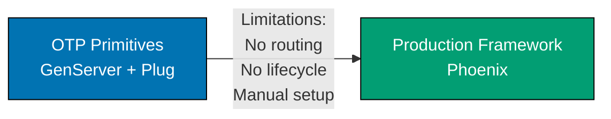

**Ready to build production Elixir systems?** This In-the-Field guide teaches production patterns by following the **OTP-First** principle, ensuring you understand BEAM foundations before frameworks.

## What Is "In the Field"?

In-the-Field guides teach production Elixir development through real-world implementation patterns. Unlike by-example tutorials that achieve 95% language coverage, these guides focus on specific production scenarios using industry-standard frameworks, libraries, and enterprise patterns.

**Key distinction**: By-example taught Elixir through code. In-the-field teaches **how to build production systems** with Elixir.

These guides address framework adoption decisions: When do I need Phoenix? When is Ecto appropriate? Should I use raw GenServer or a higher-level abstraction? Each guide shows the progression from OTP primitives to production frameworks.

## OTP-First Philosophy

Elixir's true power lies in OTP (Open Telecom Platform), the battle-tested framework built into the BEAM VM. Unlike other languages where frameworks are mandatory, Elixir provides production-ready concurrency and fault-tolerance tools built-in:

- **Processes and message passing** - Lightweight concurrency primitives
- **GenServer** - Generic server abstraction for state management
- **Supervisor trees** - Automatic fault recovery and process supervision
- **Application behavior** - Application lifecycle management
- **Process registries** - Named process lookup and discovery

**Our Approach**: Learn OTP primitives first, understand when they're insufficient, then adopt frameworks with full knowledge of trade-offs.

### Why This Matters

1. **Foundation understanding** - Know BEAM primitives before Phoenix abstractions
2. **Informed framework selection** - Understand problems Phoenix and Ecto solve
3. **Problem awareness** - See manual implementation complexity without frameworks
4. **Framework independence** - Core OTP knowledge transfers across tools
5. **Trade-off comprehension** - Recognize when frameworks add value vs overhead
6. **Debugging capability** - Understand what frameworks do under the hood
7. **Optimization skills** - Recognize performance bottlenecks in process design
8. **Production disaster prevention** - Avoid process leaks, supervision errors, message queue overflow

Each guide follows this progression: **OTP primitives → Limitations → Framework adoption**

## Guide Organization

The 36 guides are organized into 7 categories:

### 1. Foundation (2 guides)

Core best practices and anti-patterns for production Elixir:

- [Best Practices](/en/learn/software-engineering/programming-languages/elixir/in-the-field/best-practices) - Production patterns and idioms
- [Anti Patterns](/en/learn/software-engineering/programming-languages/elixir/in-the-field/anti-patterns) - Common mistakes and code smells

### 2. OTP and Concurrency (7 guides)

Fundamental BEAM concurrency and OTP patterns:

- [Processes and Message Passing](/en/learn/software-engineering/programming-languages/elixir/in-the-field/processes-and-message-passing) - Process primitives → structured patterns
- [Genserver Patterns](/en/learn/software-engineering/programming-languages/elixir/in-the-field/genserver-patterns) - GenServer design patterns
- [Supervisor Trees](/en/learn/software-engineering/programming-languages/elixir/in-the-field/supervisor-trees) - Supervision strategies and fault tolerance
- [Application Structure](/en/learn/software-engineering/programming-languages/elixir/in-the-field/application-structure) - Application behavior and lifecycle
- [Otp Behaviors](/en/learn/software-engineering/programming-languages/elixir/in-the-field/otp-behaviors) - GenServer, GenStage, Task patterns
- [Process Registry Patterns](/en/learn/software-engineering/programming-languages/elixir/in-the-field/process-registry-patterns) - Registry, via tuples, DynamicSupervisor
- [Concurrency Patterns](/en/learn/software-engineering/programming-languages/elixir/in-the-field/concurrency-patterns) - Task.async, parallel processing, backpressure

### 3. Data Structures (6 guides)

Pattern matching and data structure patterns:

- [Pattern Matching Production](/en/learn/software-engineering/programming-languages/elixir/in-the-field/pattern-matching-production) - Advanced pattern matching techniques
- [Ets Dets](/en/learn/software-engineering/programming-languages/elixir/in-the-field/ets-dets) - ETS/DETS for in-memory storage
- [Persistent Term](/en/learn/software-engineering/programming-languages/elixir/in-the-field/persistent-term) - Read-optimized global storage
- [Immutability Patterns](/en/learn/software-engineering/programming-languages/elixir/in-the-field/immutability-patterns) - Working with immutable data
- [Structs Protocols](/en/learn/software-engineering/programming-languages/elixir/in-the-field/structs-protocols) - Struct design and protocol polymorphism
- [Type Specifications](/en/learn/software-engineering/programming-languages/elixir/in-the-field/type-specifications) - Typespecs and Dialyzer

### 4. Web Development (6 guides)

Web application development with Phoenix and Ecto:

- [Phoenix Framework](/en/learn/software-engineering/programming-languages/elixir/in-the-field/phoenix-framework) - Phoenix web framework patterns
- [Phoenix Channels](/en/learn/software-engineering/programming-languages/elixir/in-the-field/phoenix-channels) - Real-time communication with channels
- [Ecto Patterns](/en/learn/software-engineering/programming-languages/elixir/in-the-field/ecto-patterns) - Database access with Ecto
- [Rest Api Design](/en/learn/software-engineering/programming-languages/elixir/in-the-field/rest-api-design) - RESTful API design patterns
- [Graphql Absinthe](/en/learn/software-engineering/programming-languages/elixir/in-the-field/graphql-absinthe) - GraphQL with Absinthe
- [Authentication Authorization](/en/learn/software-engineering/programming-languages/elixir/in-the-field/authentication-authorization) - Auth patterns with Guardian and Pow

### 5. Testing and Quality (4 guides)

Testing strategies and code quality:

- [Testing Strategies](/en/learn/software-engineering/programming-languages/elixir/in-the-field/testing-strategies) - ExUnit → property testing → integration
- [Test Driven Development](/en/learn/software-engineering/programming-languages/elixir/in-the-field/test-driven-development) - TDD patterns in Elixir
- [Code Quality Tools](/en/learn/software-engineering/programming-languages/elixir/in-the-field/code-quality-tools) - Credo, Dialyzer, static analysis
- [Documentation Practices](/en/learn/software-engineering/programming-languages/elixir/in-the-field/documentation-practices) - ExDoc, doctests, documentation culture

### 6. Production Deployment (7 guides)

Production-ready patterns for reliability and performance:

- [Deployment Strategies](/en/learn/software-engineering/programming-languages/elixir/in-the-field/deployment-strategies) - Releases, containers, clustering
- [Configuration Management](/en/learn/software-engineering/programming-languages/elixir/in-the-field/configuration-management) - Config → runtime config → releases
- [Logging Observability](/en/learn/software-engineering/programming-languages/elixir/in-the-field/logging-observability) - Logger → telemetry → observability
- [Error Handling Resilience](/en/learn/software-engineering/programming-languages/elixir/in-the-field/error-handling-resilience) - Let it crash, supervision, circuit breakers
- [Performance Optimization](/en/learn/software-engineering/programming-languages/elixir/in-the-field/performance-optimization) - Profiling, benchmarking, optimization
- [Hot Code Upgrades](/en/learn/software-engineering/programming-languages/elixir/in-the-field/hot-code-upgrades) - Zero-downtime deployments
- [Distributed Systems](/en/learn/software-engineering/programming-languages/elixir/in-the-field/distributed-systems) - Node clustering, distributed Erlang

### 7. Build and Ecosystem (4 guides)

Build tooling and ecosystem integration:

- [Mix Build Tool](/en/learn/software-engineering/programming-languages/elixir/in-the-field/mix-build-tool) - Mix tasks, custom tasks, build pipeline
- [Hex Package Management](/en/learn/software-engineering/programming-languages/elixir/in-the-field/hex-package-management) - Dependencies, versioning, publishing
- [Umbrella Projects](/en/learn/software-engineering/programming-languages/elixir/in-the-field/umbrella-projects) - Multi-app project organization
- [Interop Nifs Ports](/en/learn/software-engineering/programming-languages/elixir/in-the-field/interop-nifs-ports) - NIFs, ports, Rustler integration

## Progressive Learning Path

Each guide follows this structure:

1. **Why It Matters** - Production context and real-world scenarios
2. **OTP Primitives First** - Built-in approach with annotated examples
3. **Limitations** - When OTP primitives insufficient for production
4. **Production Framework** - Industry-standard solutions with examples
5. **Trade-offs** - Clear comparison tables (complexity, learning curve, maintenance)
6. **Best Practices** - Actionable guidance with code examples

### Example Progression (Web Development)



**OTP Primitives**: You can build web servers with GenServer + Plug, handling HTTP manually.

**Limitations**: No routing patterns, no request lifecycle, no asset pipeline, manual middleware chains, verbose context handling.

**Production Framework**: Phoenix provides routing, lifecycle hooks, LiveView, Channels, asset pipeline, and structured patterns.

**Trade-off**: Learn GenServer and Plug first to understand what Phoenix abstracts away.

## Code Annotation Standard

All code examples maintain **1.0-2.25 annotation density** (comment lines per code line) using `# =>` notation to explain values, states, and outputs.

**Example**:

```elixir
# OTP GenServer for state management
defmodule Counter do
  use GenServer                              # => Imports GenServer behavior
                                             # => Provides init, handle_call, etc.

  def start_link(initial \\ 0) do
    GenServer.start_link(__MODULE__, initial, name: __MODULE__)
                                             # => Starts process, registers name
                                             # => initial: Starting state
                                             # => Returns {:ok, pid}
  end

  def init(initial) do
    {:ok, initial}                           # => Initial state: initial value
                                             # => Type: {:ok, integer()}
  end

  def increment do
    GenServer.call(__MODULE__, :increment)   # => Synchronous call to registered process
                                             # => Returns new value
  end

  def handle_call(:increment, _from, state) do
    new_state = state + 1                    # => Increment state
    {:reply, new_state, new_state}           # => Reply with new value, update state
                                             # => Type: {:reply, integer(), integer()}
  end
end
```

## Who Should Use These Guides?

- **Elixir developers building production systems** - Learn industry patterns
- **Teams adopting Elixir for backend services** - Establish production conventions
- **Developers transitioning from other languages** - Understand Elixir production ecosystem
- **Anyone seeking production-ready Elixir patterns** - Framework selection, trade-offs, best practices

## Prerequisite Knowledge

These guides assume familiarity with Elixir fundamentals. If you're new to Elixir, start with:

- [Initial Setup](/en/learn/software-engineering/programming-languages/elixir/initial-setup) - 0-5% Elixir coverage (installation, tooling)
- [Quick Start](/en/learn/software-engineering/programming-languages/elixir/quick-start) - 5-30% Elixir coverage (basic syntax, first program)
- [By Example](/en/learn/software-engineering/programming-languages/elixir/by-example) - 75-95% Elixir coverage (75+ annotated examples)

**Minimum**: Complete Quick Start (5-30% coverage) before starting In-the-Field guides.

**Recommended**: Complete By Example (75-95% coverage) for comprehensive foundation.

## Learning Approach

**Not a comprehensive tutorial**: These guides target specific production scenarios, not sequential skill building. Jump to relevant topics based on your project needs.

**Code-first learning**: Examples are self-contained and runnable. Copy, execute, modify, experiment.

**Framework pragmatism**: We teach OTP primitives first, but recommend frameworks when they provide clear production value.

## Convention Reference

These guides follow the [In-the-Field Convention](https://github.com/wahidyankf/open-sharia-enterprise/blob/main/governance/conventions/tutorials/in-the-field.md), which defines production implementation guide standards.
