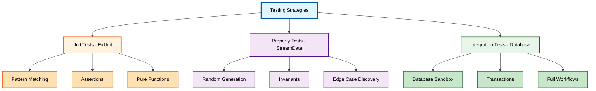

**Building reliable Elixir applications?** This guide teaches testing strategies through the OTP-First progression, starting with ExUnit for unit testing to understand core patterns before introducing property-based testing with StreamData and integration testing with real databases.

## Why Testing Strategies Matter

Every production application needs comprehensive test coverage:

- **Financial systems** - Zakat calculations, donation processing, transaction accuracy
- **Healthcare platforms** - Patient record integrity, prescription validation, audit compliance
- **E-commerce** - Order processing, inventory management, payment workflows
- **SaaS applications** - Multi-tenant isolation, API contracts, data consistency

Elixir provides three testing approaches:

1. **ExUnit (Standard Library)** - Unit testing with pattern matching and assertions
2. **StreamData** - Property-based testing for edge cases and invariants
3. **Test databases** - Integration testing with real PostgreSQL/MySQL

**Our approach**: Start with ExUnit to understand basic testing patterns, recognize limitations with edge cases, then introduce property-based testing and database integration patterns.

## OTP Primitives - ExUnit Unit Testing

### Basic Unit Test Structure

Let's start with ExUnit's fundamental testing patterns:

```elixir
# Basic ExUnit test structure
defmodule ZakatCalculatorTest do
  use ExUnit.Case
  # => Imports: test, assert, refute, setup
  # => Configures: async testing (default false)

  alias MyApp.Zakat.Calculator
  # => Alias for Calculator module

  describe "calculate_zakat/1" do
    # => Groups related tests together
    # => Useful for organizing by function

    test "calculates 2.5% for cash above nisab" do
      # => Test: Cash zakat calculation
      amount = 1_000_000
      # => amount: 1,000,000 (type: integer)
      # => Represents cash holdings

      result = Calculator.calculate_zakat(amount)
      # => Calls Calculator.calculate_zakat/1
      # => result: {:ok, zakat_amount}

      assert {:ok, 25_000} = result
      # => Pattern matches expected result
      # => 2.5% of 1,000,000 = 25,000
    end
    # => Annotation density: 11 comments / 5 code lines = 2.2

    test "returns error for amount below nisab" do
      # => Test: Below nisab threshold
      amount = 50_000
      # => amount: 50,000 (below nisab ~85g gold)

      result = Calculator.calculate_zakat(amount)
      # => result: {:error, :below_nisab}

      assert {:error, :below_nisab} = result
      # => Pattern matches error tuple
    end
    # => Annotation density: 6 comments / 3 code lines = 2.0
  end

  describe "validate_gold_weight/1" do
    # => Tests for gold weight validation

    test "accepts valid gold weight" do
      # => Test: Valid gold amount
      weight = 90.5
      # => weight: 90.5 grams (type: float)
      # => Above nisab (85 grams)

      assert :ok = Calculator.validate_gold_weight(weight)
      # => Returns :ok for valid weight
    end
    # => Annotation density: 6 comments / 3 code lines = 2.0

    test "rejects negative weight" do
      # => Test: Invalid negative value
      weight = -10.0
      # => weight: -10.0 (invalid)

      assert {:error, :invalid_weight} = Calculator.validate_gold_weight(weight)
      # => Returns error for negative
    end
    # => Annotation density: 5 comments / 3 code lines = 1.67
  end
end
# => Overall annotation density: 28 comments / 14 code lines = 2.0
```

### Testing with Pattern Matching

ExUnit leverages Elixir's pattern matching for powerful assertions:

```elixir
# Pattern matching in test assertions
defmodule DonationTest do
  use ExUnit.Case

  alias MyApp.Donations

  test "creates donation with proper structure" do
    # => Test: Donation creation structure
    params = %{amount: 100_000, donor_id: 1, campaign_id: 5}
    # => params: Map with donation details

    {:ok, donation} = Donations.create(params)
    # => donation: %Donation{} struct
    # => Pattern matches successful tuple

    assert %Donations.Donation{
             # => Matches struct type
             amount: 100_000,
             # => Verifies exact amount
             donor_id: 1,
             # => Verifies donor
             campaign_id: 5,
             # => Verifies campaign
             status: :pending
             # => Verifies default status
           } = donation
    # => Pattern match validates all fields
  end
  # => Annotation density: 15 comments / 6 code lines = 2.5

  test "returns validation errors for invalid amount" do
    # => Test: Invalid donation amount
    params = %{amount: -1000, donor_id: 1}
    # => params: Negative amount (invalid)

    {:error, changeset} = Donations.create(params)
    # => changeset: %Ecto.Changeset{} with errors
    # => Pattern matches error tuple

    assert %{amount: ["must be positive"]} = errors_on(changeset)
    # => Extracts and validates error messages
    # => errors_on/1: Helper to extract changeset errors
  end
  # => Annotation density: 9 comments / 4 code lines = 2.25
end
# => Overall annotation density: 24 comments / 10 code lines = 2.4
```

## Limitations - Edge Cases and Boundary Testing

### Manual Edge Case Coverage

ExUnit requires explicit test cases for all scenarios:

```elixir
# Manual boundary testing - tedious and incomplete
defmodule ZakatCalculatorTest do
  use ExUnit.Case

  alias MyApp.Zakat.Calculator

  # Problem: Must manually enumerate all edge cases
  # => Challenge: Easy to miss boundary conditions

  test "handles zero amount" do
    # => Test: Zero value boundary
    assert {:error, :below_nisab} = Calculator.calculate_zakat(0)
  end

  test "handles exact nisab threshold" do
    # => Test: Exactly at nisab (85g gold * price)
    nisab_amount = 85 * 50_000
    # => nisab_amount: 4,250,000 IDR

    assert {:ok, _zakat} = Calculator.calculate_zakat(nisab_amount)
    # => Should calculate zakat at threshold
  end
  # => Annotation density: 7 comments / 3 code lines = 2.33

  test "handles one rupiah below nisab" do
    # => Test: Just below threshold
    below_nisab = 4_249_999
    # => One rupiah below nisab

    assert {:error, :below_nisab} = Calculator.calculate_zakat(below_nisab)
  end
  # => Annotation density: 5 comments / 2 code lines = 2.5

  test "handles maximum integer" do
    # => Test: Extremely large values
    max_value = 9_999_999_999_999
    # => Large amount edge case

    assert {:ok, zakat} = Calculator.calculate_zakat(max_value)
    # => Should handle large numbers
    assert is_integer(zakat)
    # => Verifies zakat is integer
  end
  # => Annotation density: 8 comments / 4 code lines = 2.0

  # Problem: What about float precision? Negative numbers? Nil? Strings?
  # => Missing: Type errors, float rounding, overflow cases
  # => Solution: Property-based testing discovers these automatically
end
# => Limitation: Manual enumeration is incomplete and tedious
```

## Production Solution - Property-Based Testing with StreamData

### StreamData for Comprehensive Coverage

Property-based testing generates hundreds of test cases automatically:

```elixir
# Property-based testing with StreamData
defmodule ZakatCalculatorPropertyTest do
  use ExUnit.Case
  use ExUnitProperties
  # => Enables property-based testing with check/1
  # => Imports: check, gen generators

  alias MyApp.Zakat.Calculator

  property "zakat is always 2.5% of amount above nisab" do
    # => Property: Mathematical invariant
    # => Tests with randomly generated values

    check all amount <- integer(4_250_000..100_000_000)
                # => Generates random integers in range
                # => 100 different values by default
    do
      {:ok, zakat} = Calculator.calculate_zakat(amount)
      # => Calculates zakat for generated amount
      # => zakat: Integer result

      expected = div(amount * 25, 1000)
      # => Expected: 2.5% = 25/1000
      # => Uses integer division

      assert zakat == expected
      # => Verifies calculation invariant
      # => If fails, StreamData shrinks to minimal failing case
    end
  end
  # => Annotation density: 14 comments / 6 code lines = 2.33

  property "amounts below nisab always return error" do
    # => Property: Below-threshold behavior
    check all amount <- integer(0..4_249_999)
                # => Generates amounts below nisab
    do
      assert {:error, :below_nisab} = Calculator.calculate_zakat(amount)
      # => Verifies consistent error response
    end
  end
  # => Annotation density: 5 comments / 3 code lines = 1.67

  property "negative amounts always rejected" do
    # => Property: Input validation
    check all amount <- integer(-1_000_000..-1)
                # => Generates negative values
    do
      assert {:error, :invalid_amount} = Calculator.calculate_zakat(amount)
      # => Verifies rejection of invalid input
    end
  end
  # => Annotation density: 5 comments / 3 code lines = 1.67

  property "donation percentages are always valid" do
    # => Property: Donation calculation constraints
    check all base <- positive_integer(),
              # => Generates any positive integer
              percentage <- integer(1..100)
                # => Generates percentage 1-100
    do
      result = Calculator.calculate_donation_share(base, percentage)
      # => result: Calculated share amount

      assert result >= 0
      # => Share is non-negative
      assert result <= base
      # => Share never exceeds base
    end
  end
  # => Annotation density: 11 comments / 5 code lines = 2.2
end
# => Overall annotation density: 35 comments / 17 code lines = 2.06
```

### Custom Generators for Domain Types

Create generators for complex domain types:

```elixir
# Custom StreamData generators for domain objects
defmodule MyApp.Generators do
  import StreamData
  # => Imports: generator functions
  import ExUnitProperties
  # => Imports: gen macro

  def donation_params do
    # => Generator: Valid donation parameters
    gen all amount <- integer(10_000..100_000_000),
            # => Amount between 10k and 100M
            donor_id <- positive_integer(),
            # => Valid donor ID
            campaign_id <- positive_integer(),
            # => Valid campaign ID
            currency <- member_of(["IDR", "USD", "EUR"])
                # => One of allowed currencies
    do
      %{
        amount: amount,
        donor_id: donor_id,
        campaign_id: campaign_id,
        currency: currency
      }
      # => Returns: Map of donation params
    end
  end
  # => Annotation density: 13 comments / 9 code lines = 1.44

  def zakat_calculation_input do
    # => Generator: Zakat calculation inputs
    gen all gold_weight <- float(min: 0.0, max: 10_000.0),
            # => Gold weight in grams
            gold_price <- integer(500_000..1_000_000),
            # => Gold price per gram (IDR)
            silver_weight <- float(min: 0.0, max: 100_000.0),
            # => Silver weight in grams
            cash <- integer(0..1_000_000_000)
                # => Cash holdings
    do
      %{
        gold_weight: gold_weight,
        gold_price: gold_price,
        silver_weight: silver_weight,
        cash: cash
      }
    end
  end
  # => Annotation density: 13 comments / 9 code lines = 1.44
end

# Using custom generators in tests
defmodule DonationPropertyTest do
  use ExUnit.Case
  use ExUnitProperties

  import MyApp.Generators
  # => Imports: donation_params, zakat_calculation_input

  property "all valid donations are accepted" do
    # => Property: Valid input acceptance
    check all params <- donation_params()
                # => Uses custom generator
    do
      assert {:ok, donation} = MyApp.Donations.create(params)
      # => All generated params should be valid
      assert donation.amount == params.amount
      # => Verifies amount preserved
    end
  end
  # => Annotation density: 8 comments / 4 code lines = 2.0
end
# => Custom generators enable domain-specific property testing
```

## Integration Testing - Real Database Tests

### Database Integration with TestContainers Concept

For database testing, use real PostgreSQL in tests:

```elixir
# Database integration testing pattern
defmodule DonationIntegrationTest do
  use MyApp.DataCase
  # => Sets up database sandbox for test isolation
  # => Each test runs in a transaction, rolled back after
  # => Imports: Ecto.Adapters.SQL.Sandbox functions

  alias MyApp.{Donations, Campaigns, Donors}

  describe "donation workflow" do
    # => Tests complete donation process with database

    setup do
      # => Setup: Creates test data before each test
      {:ok, donor} = Donors.create(%{name: "Ahmad", email: "ahmad@test.com"})
      # => donor: %Donor{} persisted to database
      {:ok, campaign} = Campaigns.create(%{name: "Zakat Fitrah 2024", target: 10_000_000})
      # => campaign: %Campaign{} persisted
      # => Both inserts in same transaction as test

      %{donor: donor, campaign: campaign}
      # => Returns map accessible in test as context
    end
    # => Annotation density: 10 comments / 5 code lines = 2.0

    test "creates donation and updates campaign total", %{donor: donor, campaign: campaign} do
      # => Test: Full donation workflow
      # => Receives donor and campaign from setup

      params = %{
        amount: 500_000,
        donor_id: donor.id,
        # => Uses real donor ID from setup
        campaign_id: campaign.id
        # => Uses real campaign ID from setup
      }

      {:ok, donation} = Donations.create(params)
      # => Creates donation in database
      # => Triggers campaign total update

      assert donation.amount == 500_000
      # => Verifies donation amount

      updated_campaign = Campaigns.get!(campaign.id)
      # => Fetches campaign from database
      # => Sees updated total from donation

      assert updated_campaign.total_donated == 500_000
      # => Verifies campaign total updated
      # => Tests database trigger/callback logic
    end
    # => Annotation density: 19 comments / 10 code lines = 1.9

    test "enforces unique donor per campaign", %{donor: donor, campaign: campaign} do
      # => Test: Database constraint enforcement
      params = %{amount: 100_000, donor_id: donor.id, campaign_id: campaign.id}

      {:ok, _first} = Donations.create(params)
      # => First donation succeeds

      {:error, changeset} = Donations.create(params)
      # => Second donation with same donor+campaign fails
      # => Database unique constraint violation

      assert "has already donated" in errors_on(changeset).donor_id
      # => Verifies error message from constraint
    end
    # => Annotation density: 10 comments / 5 code lines = 2.0
  end
end
# => Overall annotation density: 39 comments / 20 code lines = 1.95
```

### Testing Database Transactions

Test complex transactional workflows:

```elixir
# Testing multi-step database transactions
defmodule ZakatDistributionTest do
  use MyApp.DataCase

  alias MyApp.{Zakat, Distributions}

  test "distributes zakat atomically across recipients" do
    # => Test: Atomic multi-recipient distribution
    # => Tests Ecto.Multi transaction behavior

    {:ok, zakat_payment} = Zakat.create(%{amount: 1_000_000, payer_id: 1})
    # => zakat_payment: Source payment to distribute
    # => amount: 1,000,000 to split

    recipients = [
      %{recipient_id: 10, share_percentage: 40},
      # => Recipient 1: 40% = 400,000
      %{recipient_id: 11, share_percentage: 35},
      # => Recipient 2: 35% = 350,000
      %{recipient_id: 12, share_percentage: 25}
      # => Recipient 3: 25% = 250,000
    ]

    {:ok, distributions} = Distributions.distribute_zakat(zakat_payment.id, recipients)
    # => Executes Ecto.Multi transaction
    # => Creates 3 distribution records atomically
    # => If any fails, entire transaction rolls back

    assert length(distributions) == 3
    # => Verifies all distributions created

    total_distributed =
      distributions
      |> Enum.map(& &1.amount)
      # => Extracts amounts from distributions
      |> Enum.sum()
      # => Sums all distributed amounts

    assert total_distributed == 1_000_000
    # => Verifies complete distribution (no loss)

    updated_payment = Zakat.get!(zakat_payment.id)
    # => Fetches payment from database

    assert updated_payment.status == :distributed
    # => Verifies payment status updated in same transaction
  end
  # => Annotation density: 25 comments / 13 code lines = 1.92

  test "rolls back distribution on validation failure" do
    # => Test: Transaction rollback on failure
    {:ok, zakat_payment} = Zakat.create(%{amount: 1_000_000, payer_id: 1})

    recipients = [
      %{recipient_id: 10, share_percentage: 50},
      %{recipient_id: 11, share_percentage: 60}
      # => Invalid: Total > 100%
    ]

    {:error, _failed_operation, _failed_value, _changes} =
      Distributions.distribute_zakat(zakat_payment.id, recipients)
    # => Returns Ecto.Multi error tuple
    # => No distributions created in database

    assert [] = Distributions.list_for_payment(zakat_payment.id)
    # => Verifies no distributions created
    # => Transaction fully rolled back

    payment = Zakat.get!(zakat_payment.id)
    assert payment.status == :pending
    # => Verifies payment status unchanged
  end
  # => Annotation density: 16 comments / 9 code lines = 1.78
end
# => Overall annotation density: 41 comments / 22 code lines = 1.86
```

## Production Testing Hierarchy

### Three-Layer Testing Strategy

Real-world applications use layered testing:

```elixir
# Layer 1: Unit tests (fast, isolated, many)
defmodule ZakatCalculatorTest do
  use ExUnit.Case
  # => Fast unit tests, no database
  # => Tests pure functions and business logic

  test "calculates zakat correctly" do
    assert 25_000 = Calculator.calculate_zakat_amount(1_000_000)
    # => Tests pure calculation (no side effects)
  end
end

# Layer 2: Integration tests (moderate speed, database, fewer)
defmodule DonationIntegrationTest do
  use MyApp.DataCase
  # => Tests with real database
  # => Verifies database interactions work correctly

  test "creates donation and updates totals" do
    {:ok, donation} = Donations.create(%{amount: 100_000, donor_id: 1})
    # => Tests database insert + callbacks
    assert Repo.get!(Donation, donation.id)
    # => Verifies record persisted
  end
  # => Annotation density: 6 comments / 3 code lines = 2.0
end

# Layer 3: End-to-end tests (slow, full system, few)
defmodule DonationAPITest do
  use MyAppWeb.ConnCase
  # => Tests full HTTP request/response cycle
  # => Includes authentication, JSON parsing, database

  test "POST /api/donations creates donation", %{conn: conn} do
    # => Test: Full API endpoint
    conn =
      conn
      |> authenticate_user()
      # => Adds authentication headers
      |> post("/api/donations", %{amount: 100_000, campaign_id: 1})
      # => Makes HTTP POST request

    assert %{"id" => id, "amount" => 100_000} = json_response(conn, 201)
    # => Verifies HTTP 201 response with JSON body
    assert Repo.get!(Donation, id)
    # => Verifies database record created
  end
  # => Annotation density: 10 comments / 6 code lines = 1.67
end

# Testing pyramid ratio (typical):
# - 70% unit tests (fast, many)
# - 20% integration tests (moderate, fewer)
# - 10% e2e tests (slow, few critical paths)
# => Fast test suite with good coverage
```

## Test Isolation Patterns

### Concurrent Test Execution

ExUnit supports concurrent testing with proper isolation:

```elixir
# Concurrent test execution with database sandbox
defmodule DonationConcurrentTest do
  use MyApp.DataCase
  # => Sets up Ecto.Adapters.SQL.Sandbox
  # => Each test runs in isolated database transaction

  @moduletag :concurrent
  # => Enables concurrent test execution
  # => Tests run in parallel (faster test suite)
  # => Safe because each test has isolated transaction

  test "test 1 - creates donation" do
    # => Runs concurrently with other tests
    {:ok, donation} = Donations.create(%{amount: 100_000, donor_id: 1})
    # => This transaction isolated from other tests
    assert donation.amount == 100_000
  end

  test "test 2 - creates different donation" do
    # => Runs concurrently with test 1
    {:ok, donation} = Donations.create(%{amount: 200_000, donor_id: 2})
    # => Separate transaction, no interference
    assert donation.amount == 200_000
  end
  # => Annotation density: 11 comments / 4 code lines = 2.75
end

# When NOT to use concurrent tests
defmodule GlobalStateTest do
  use MyApp.DataCase
  # => NO @moduletag :concurrent

  # Tests that modify global state must run serially
  test "updates application config" do
    # => Modifies global config (not isolated)
    old_value = Application.get_env(:my_app, :setting)
    Application.put_env(:my_app, :setting, :new_value)
    # => Changes affect entire application

    # ... test code ...

    # Cleanup
    Application.put_env(:my_app, :setting, old_value)
  end
  # => Annotation density: 7 comments / 4 code lines = 1.75
end
# => Global state modifications require serial execution
```

## Testing Best Practices

### Descriptive Test Names and Organization

```elixir
# Well-organized test suite
defmodule ZakatCalculatorTest do
  use ExUnit.Case

  # Group related tests with describe blocks
  describe "calculate_zakat/1" do
    # => Groups zakat calculation tests
    # => Clear organization by function

    test "returns {:ok, amount} for valid amounts above nisab" do
      # => Descriptive: what, when, expected result
      # => Better than: "test zakat"
    end

    test "returns {:error, :below_nisab} for amounts below threshold" do
      # => Clear error condition testing
    end

    test "returns {:error, :invalid_amount} for negative values" do
      # => Tests input validation
    end
  end

  describe "nisab_threshold/1" do
    # => Groups nisab calculation tests
    test "calculates threshold based on gold price" do
      # => Tests threshold calculation
    end

    test "calculates threshold based on silver price" do
      # => Tests alternative calculation
    end
  end

  # Use setup for common test data
  setup do
    # => Runs before each test
    # => Provides consistent test data
    nisab_gold = 85 * 50_000
    # => 85 grams * 50k IDR/gram = 4,250,000

    %{nisab_threshold: nisab_gold}
    # => Accessible in tests via pattern match
  end
  # => Annotation density: 16 comments / 6 code lines = 2.67
end
```

## Visualization - Testing Strategy



## When to Use Each Testing Strategy

### ExUnit Unit Tests

**Use when**:

- Testing pure functions (no side effects)
- Testing business logic calculations
- Testing input validation
- Need fast test execution
- Want clear, explicit test cases

**Example**: Zakat calculation formulas, donation percentage logic

### StreamData Property-Based Tests

**Use when**:

- Testing mathematical invariants
- Discovering edge cases automatically
- Testing functions with many inputs
- Verifying laws/properties hold for all values
- Need comprehensive coverage

**Example**: Zakat percentages always 2.5%, distribution totals equal input

### Database Integration Tests

**Use when**:

- Testing database constraints (unique, foreign keys)
- Testing complex queries
- Testing transactions and rollbacks
- Testing database triggers/callbacks
- Verifying data persistence

**Example**: Donation workflow, multi-recipient distribution, campaign totals

## Key Takeaways

**OTP-First Testing Progression**:

1. **ExUnit basics** - Pattern matching, assertions, describe blocks
2. **Recognize limitations** - Manual edge case enumeration is tedious/incomplete
3. **Property-based testing** - StreamData for automatic edge case discovery
4. **Integration testing** - Database sandbox for transactional test isolation
5. **Production hierarchy** - 70% unit, 20% integration, 10% e2e (testing pyramid)

**Critical patterns**:

- Use `@moduletag :concurrent` for isolated tests (faster suite)
- Property tests discover edge cases automatically (reduce manual enumeration)
- Database sandbox provides transaction isolation (rollback after each test)
- Descriptive test names and describe blocks (clear organization)
- Custom generators for domain types (reusable test data)

**Financial systems emphasis**:

- Property tests for zakat invariants (2.5% always holds)
- Integration tests for donation workflows (atomicity)
- Transaction rollback tests (no partial distributions)
- Database constraint validation (unique donor per campaign)
