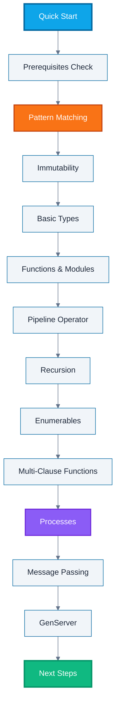

**Ready to learn Elixir quickly?** This quick start tutorial provides a fast-paced tour through Elixir's core concepts. By the end, you'll understand the fundamentals and be ready to build real applications.

## Prerequisites

Before starting this tutorial, you need:

- Elixir 1.14+ installed (see [Initial Setup](/en/learn/software-engineering/programming-languages/elixir/initial-setup))
- Basic programming knowledge (any language)
- Familiarity with command-line terminals
- Text editor of your choice
- 60-90 minutes of focused learning

## Learning Objectives

By the end of this tutorial, you will understand:

1. **Pattern Matching** - Elixir's destructuring and matching mechanism
2. **Immutability** - Data transformation without mutation
3. **Basic Types** - Atoms, tuples, lists, maps, and structs
4. **Functions** - Anonymous functions, named functions, and function clauses
5. **Modules** - Code organization and namespacing
6. **Pipelines** - Composing function calls with `|>` operator
7. **Recursion** - Functional iteration without loops
8. **Enumerables** - Working with collections using Enum and Stream
9. **Pattern Matching in Functions** - Multiple function clauses
10. **Processes** - Lightweight concurrency primitives
11. **Message Passing** - Inter-process communication
12. **GenServer** - OTP behavior for stateful servers

## Learning Path



## Pattern Matching Fundamentals

Pattern matching is Elixir's most powerful feature - not just assignment, but structural comparison.

### The Match Operator

The `=` operator is not assignment - it's pattern matching:

```elixir
iex

x = 42

x
```

Output:

```
42
```

But this is pattern matching, not assignment. The left side must match the right side:

```elixir
42 = x

43 = x
```

Output:

```
** (MatchError) no match of right hand side value: 42
```

### Destructuring with Tuples

Extract values from tuples:

```elixir
{a, b, c} = {1, 2, 3}

a  # => 1
b  # => 2
c  # => 3
```

Common pattern for function returns:

```elixir
{:ok, result} = {:ok, "Success!"}
result  # => "Success!"

{:error, reason} = {:error, "File not found"}
reason  # => "File not found"
```

### Pin Operator

Use `^` to match against existing value instead of rebinding:

```elixir
x = 42

{x, y} = {43, "hello"}
x  # => 43

x = 42
{^x, y} = {42, "hello"}  # Works - 42 matches 42
y  # => "hello"

{^x, y} = {43, "hello"}  # Fails - 42 doesn't match 43
```

### Underscore for Ignoring Values

Use `_` to ignore values you don't need:

```elixir
{:ok, _, message} = {:ok, 404, "Not found"}
message  # => "Not found"

[head | _tail] = [1, 2, 3, 4, 5]
head  # => 1
```

## Immutability and Data Transformation

Elixir data is immutable - values never change, only transform into new values.

### Immutable Variables

```elixir
original = [1, 2, 3]

modified = [0 | original]

original  # => [1, 2, 3] - unchanged!
modified  # => [0, 1, 2, 3] - new list
```

Variables can be rebound (matched again), but values themselves never mutate:

```elixir
x = 42
x = x + 1  # New binding, original 42 unchanged
x  # => 43
```

### Benefits of Immutability

**No side effects**:

```elixir
defmodule Calculator do
  def add(a, b) do
    a + b  # Pure function - no mutations
  end
end

result = Calculator.add(2, 3)  # => 5
```

**Safe concurrency** - multiple processes can access same data without locks.

**Easier reasoning** - values don't change unexpectedly.

## Basic Types Deep Dive

### Atoms

Atoms are constants where name equals value:

```elixir
:ok
:error
:hello
:user_not_found

:"hello world"
```

Boolean values are atoms:

```elixir
true == :true   # => true
false == :false # => true
nil == :nil     # => true
```

Common in pattern matching:

```elixir
status = :ok

case status do
  :ok -> "Success"
  :error -> "Failed"
end
```

### Tuples

Fixed-size collections with contiguous memory:

```elixir
tuple = {:ok, "message", 42}

elem(tuple, 0)  # => :ok
elem(tuple, 1)  # => "message"

put_elem(tuple, 1, "updated")  # => {:ok, "updated", 42}
tuple  # => {:ok, "message", 42} - original unchanged

tuple_size(tuple)  # => 3
```

Use tuples for fixed-size, heterogeneous data.

### Lists

Linked lists - efficient head operations:

```elixir
list = [1, 2, 3, 4, 5]

[0 | list]  # => [0, 1, 2, 3, 4, 5]

list ++ [6]  # => [1, 2, 3, 4, 5, 6]

[head | tail] = list
head  # => 1
tail  # => [2, 3, 4, 5]

length(list)  # => 5
```

### Keyword Lists

Lists of 2-element tuples (key-value):

```elixir
options = [name: "Alice", age: 30, city: "NYC"]

options == [{:name, "Alice"}, {:age, 30}, {:city, "NYC"}]  # => true

options[:name]  # => "Alice"

config = [port: 4000, port: 4001]
config[:port]  # => 4000 (first value)
```

Common for function options:

```elixir
def connect(host, opts \\ []) do
  port = opts[:port] || 80
  timeout = opts[:timeout] || 5000
  # ...
end

connect("localhost", port: 4000, timeout: 3000)
```

### Maps

Key-value stores with unique keys:

```elixir
user = %{name: "Bob", age: 25, email: "bob@example.com"}

user[:name]      # => "Bob"
user.name        # => "Bob" (atom keys only)

updated = %{user | age: 26}
user.age     # => 25 - original unchanged
updated.age  # => 26

with_city = Map.put(user, :city, "Boston")

mixed = %{"string" => 1, :atom => 2, 42 => 3}
```

Use maps for key-value data and structs.

### Structs

Maps with defined schema and defaults:

```elixir
defmodule User do
  defstruct name: "", age: 0, email: nil
end

user = %User{name: "Alice", age: 30}

user.name  # => "Alice"
user.age   # => 30
user.email # => nil (default)

%User{name: name} = user
name  # => "Alice"

updated = %{user | age: 31}
```

Structs are just maps with `__struct__` key:

```elixir
user.__struct__  # => User
```

## Functions and Modules

### Anonymous Functions

Functions as first-class values:

```elixir
greet = fn name -> "Hello, #{name}!" end

greet.("Alice")  # => "Hello, Alice!"

add = fn a, b -> a + b end
add.(2, 3)  # => 5

upcase = &String.upcase/1
upcase.("hello")  # => "HELLO"
```

### Named Functions in Modules

```elixir
defmodule Math do
  # Public function
  def add(a, b) do
    a + b
  end

  # Private function
  defp multiply(a, b) do
    a * b
  end

  # One-liner syntax
  def subtract(a, b), do: a - b

  # Multiple clauses (pattern matching!)
  def factorial(0), do: 1
  def factorial(n) when n > 0, do: n * factorial(n - 1)
end

Math.add(2, 3)       # => 5
Math.subtract(10, 3) # => 7
Math.factorial(5)    # => 120
```

### Function Clauses

Functions can have multiple definitions - Elixir matches top-to-bottom:

```elixir
defmodule Validator do
  # Match empty string
  def validate(""), do: {:error, "Empty string"}

  # Match nil
  def validate(nil), do: {:error, "Nil value"}

  # Guard clause
  def validate(str) when is_binary(str) and byte_size(str) > 100 do
    {:error, "Too long"}
  end

  # Default case
  def validate(str) when is_binary(str), do: {:ok, str}

  # Non-string
  def validate(_other), do: {:error, "Not a string"}
end

Validator.validate("")       # => {:error, "Empty string"}
Validator.validate(nil)      # => {:error, "Nil value"}
Validator.validate("hi")     # => {:ok, "hi"}
Validator.validate(String.duplicate("x", 101))  # => {:error, "Too long"}
Validator.validate(123)      # => {:error, "Not a string"}
```

### Default Arguments

```elixir
defmodule Greeter do
  def greet(name, greeting \\ "Hello") do
    "#{greeting}, #{name}!"
  end
end

Greeter.greet("Alice")              # => "Hello, Alice!"
Greeter.greet("Bob", "Howdy")       # => "Howdy, Bob!"
```

## Pipeline Operator

The `|>` operator threads result of one function as first argument to next:

### Basic Pipeline

```elixir
String.upcase(String.trim("  hello  "))

"  hello  "
|> String.trim()
|> String.upcase()
```

Each line passes result to next function's first argument.

### Complex Pipeline Example

```elixir
defmodule TextProcessor do
  def process(text) do
    text
    |> String.trim()
    |> String.downcase()
    |> String.split()
    |> Enum.map(&String.capitalize/1)
    |> Enum.join(" ")
  end
end

TextProcessor.process("  HELLO WORLD  ")
```

Step-by-step:

1. `"  HELLO WORLD  " |> String.trim()` → `"HELLO WORLD"`
2. `"HELLO WORLD" |> String.downcase()` → `"hello world"`
3. `"hello world" |> String.split()` → `["hello", "world"]`
4. `["hello", "world"] |> Enum.map(&String.capitalize/1)` → `["Hello", "World"]`
5. `["Hello", "World"] |> Enum.join(" ")` → `"Hello World"`

### Pipeline with Multiple Arguments

Pipeline passes value as **first** argument:

```elixir
"hello"
|> String.duplicate(3)

[1, 2, 3, 4]
|> Enum.map(fn x -> x * 2 end)
|> Enum.filter(fn x -> x > 4 end)
|> Enum.sum()
```

## Recursion - Functional Iteration

Elixir has no loops - use recursion instead.

### Basic Recursion

```elixir
defmodule Counter do
  def count_down(0), do: IO.puts("Done!")

  def count_down(n) when n > 0 do
    IO.puts(n)
    count_down(n - 1)
  end
end

Counter.count_down(3)
```

Output:

```
3
2
1
Done!
```

### Tail Recursion

Tail-recursive functions (recursive call is last operation) are optimized:

```elixir
defmodule Sum do
  # Non-tail recursive (NOT optimized)
  def sum([]), do: 0
  def sum([head | tail]), do: head + sum(tail)

  # Tail recursive (optimized!)
  def sum_tail(list), do: sum_tail(list, 0)

  defp sum_tail([], acc), do: acc
  defp sum_tail([head | tail], acc) do
    sum_tail(tail, acc + head)
  end
end

Sum.sum([1, 2, 3, 4, 5])       # => 15
Sum.sum_tail([1, 2, 3, 4, 5])  # => 15 (uses constant stack space)
```

### Recursion with Accumulator

```elixir
defmodule ListOps do
  # Reverse list using accumulator
  def reverse(list), do: reverse(list, [])

  defp reverse([], acc), do: acc
  defp reverse([head | tail], acc) do
    reverse(tail, [head | acc])
  end
end

ListOps.reverse([1, 2, 3, 4])  # => [4, 3, 2, 1]
```

## Enumerables - Working with Collections

### Enum Module

Eager evaluation - processes immediately:

```elixir
Enum.map([1, 2, 3], fn x -> x * 2 end)

Enum.filter([1, 2, 3, 4, 5], fn x -> rem(x, 2) == 0 end)

Enum.reduce([1, 2, 3, 4], 0, fn x, acc -> acc + x end)

Enum.any?([1, 2, 3], fn x -> x > 2 end)  # => true
Enum.all?([1, 2, 3], fn x -> x > 0 end)  # => true

Enum.find([1, 2, 3, 4], fn x -> x > 2 end)  # => 3

Enum.take([1, 2, 3, 4, 5], 3)  # => [1, 2, 3]
Enum.drop([1, 2, 3, 4, 5], 2)  # => [3, 4, 5]

Enum.chunk_every([1, 2, 3, 4, 5, 6], 2)
```

### Stream Module

Lazy evaluation - processes on-demand:

```elixir
stream = [1, 2, 3, 4, 5]
|> Stream.map(fn x -> IO.puts("Doubling #{x}"); x * 2 end)
|> Stream.filter(fn x -> IO.puts("Filtering #{x}"); x > 4 end)

result = Enum.to_list(stream)
```

Output shows lazy evaluation:

```
Doubling 1
Filtering 2
Doubling 2
Filtering 4
Doubling 3
Filtering 6
Doubling 4
Filtering 8
Doubling 5
Filtering 10
[6, 8, 10]
```

Each element processed completely before next element starts.

### Infinite Streams

```elixir
Stream.iterate(1, fn x -> x + 1 end)
|> Stream.map(fn x -> x * x end)
|> Enum.take(5)

Stream.cycle([1, 2, 3])
|> Enum.take(7)
```

### Comprehensions

Alternative syntax for transformations:

```elixir
for x <- [1, 2, 3, 4], do: x * 2

for x <- [1, 2, 3, 4], x > 2, do: x * 2

for x <- [1, 2], y <- [3, 4], do: {x, y}

for {k, v} <- %{a: 1, b: 2}, into: %{}, do: {k, v * 2}
```

## Processes - Lightweight Concurrency

Elixir processes are NOT OS processes - they're lightweight VM processes.

### Spawn Process

```elixir
pid = spawn(fn ->
  IO.puts("Hello from process #{inspect(self())}")
end)

IO.puts("Spawned process #{inspect(pid)}")
```

Output:

```
Spawned process #PID<0.123.0>
Hello from process #PID<0.123.0>
```

### Process Identifiers

```elixir
self()  # => #PID<0.100.0>

pid = spawn(fn -> :timer.sleep(100) end)
Process.alive?(pid)  # => true (immediately after spawn)
:timer.sleep(200)
Process.alive?(pid)  # => false (after process exits)
```

### Linking Processes

```elixir
spawn_link(fn ->
  raise "Oops!"
end)

pid = spawn(fn -> :timer.sleep(100) end)
ref = Process.monitor(pid)

receive do
  {:DOWN, ^ref, :process, ^pid, reason} ->
    IO.puts("Process exited: #{inspect(reason)}")
end
```

## Message Passing

Processes communicate via messages.

### Send and Receive

```elixir
send(self(), {:hello, "World"})

receive do
  {:hello, msg} -> IO.puts("Received: #{msg}")
end
```

### Pattern Matching in Receive

```elixir
defmodule Receiver do
  def loop do
    receive do
      {:ping, from} ->
        send(from, :pong)
        IO.puts("Sent pong")
        loop()

      {:print, message} ->
        IO.puts(message)
        loop()

      :stop ->
        IO.puts("Stopping")
        :ok

      _other ->
        IO.puts("Unknown message")
        loop()
    end
  end
end

pid = spawn(fn -> Receiver.loop() end)

send(pid, {:ping, self()})
send(pid, {:print, "Hello!"})
send(pid, :stop)

receive do
  :pong -> IO.puts("Got pong!")
end
```

### Timeout in Receive

```elixir
receive do
  {:message, data} -> IO.puts(data)
after
  1000 -> IO.puts("No message after 1 second")
end
```

## GenServer - OTP Behavior

GenServer (Generic Server) is OTP behavior for stateful server processes.

### Basic GenServer

```elixir
defmodule Counter do
  use GenServer

  ## Client API

  def start_link(initial_value) do
    GenServer.start_link(__MODULE__, initial_value, name: __MODULE__)
  end

  def increment do
    GenServer.cast(__MODULE__, :increment)
  end

  def get do
    GenServer.call(__MODULE__, :get)
  end

  ## Server Callbacks

  @impl true
  def init(initial_value) do
    {:ok, initial_value}
  end

  @impl true
  def handle_cast(:increment, state) do
    {:noreply, state + 1}
  end

  @impl true
  def handle_call(:get, _from, state) do
    {:reply, state, state}
  end
end

{:ok, _pid} = Counter.start_link(0)

Counter.increment()
Counter.increment()
Counter.increment()

Counter.get()  # => 3
```

### Call vs Cast

**`GenServer.call`** - Synchronous, waits for reply:

```elixir
def get_user(id) do
  GenServer.call(__MODULE__, {:get_user, id})
end

def handle_call({:get_user, id}, _from, state) do
  user = Map.get(state.users, id)
  {:reply, user, state}
end
```

**`GenServer.cast`** - Asynchronous, no reply:

```elixir
def log(message) do
  GenServer.cast(__MODULE__, {:log, message})
end

def handle_cast({:log, message}, state) do
  IO.puts("[LOG] #{message}")
  {:noreply, state}
end
```

### GenServer with Complex State

```elixir
defmodule UserRegistry do
  use GenServer

  # Client API

  def start_link(_opts) do
    GenServer.start_link(__MODULE__, %{}, name: __MODULE__)
  end

  def register(user_id, user_data) do
    GenServer.call(__MODULE__, {:register, user_id, user_data})
  end

  def lookup(user_id) do
    GenServer.call(__MODULE__, {:lookup, user_id})
  end

  def all_users do
    GenServer.call(__MODULE__, :all_users)
  end

  # Server Callbacks

  @impl true
  def init(_) do
    {:ok, %{}}
  end

  @impl true
  def handle_call({:register, user_id, user_data}, _from, state) do
    new_state = Map.put(state, user_id, user_data)
    {:reply, :ok, new_state}
  end

  @impl true
  def handle_call({:lookup, user_id}, _from, state) do
    result = case Map.fetch(state, user_id) do
      {:ok, user} -> {:ok, user}
      :error -> {:error, :not_found}
    end
    {:reply, result, state}
  end

  @impl true
  def handle_call(:all_users, _from, state) do
    {:reply, Map.keys(state), state}
  end
end

{:ok, _pid} = UserRegistry.start_link([])

UserRegistry.register(1, %{name: "Alice", age: 30})
UserRegistry.register(2, %{name: "Bob", age: 25})

UserRegistry.lookup(1)      # => {:ok, %{name: "Alice", age: 30}}
UserRegistry.lookup(999)    # => {:error, :not_found}
UserRegistry.all_users()    # => [1, 2]
```

## Practical Example - URL Shortener

Let's build a complete URL shortener combining concepts:

```elixir
defmodule UrlShortener do
  use GenServer

  # Client API

  def start_link(_opts) do
    GenServer.start_link(__MODULE__, %{}, name: __MODULE__)
  end

  def shorten(url) do
    GenServer.call(__MODULE__, {:shorten, url})
  end

  def expand(short_code) do
    GenServer.call(__MODULE__, {:expand, short_code})
  end

  def stats do
    GenServer.call(__MODULE__, :stats)
  end

  # Server Callbacks

  @impl true
  def init(_) do
    state = %{
      urls: %{},      # short_code -> url
      reverse: %{},   # url -> short_code
      counter: 0
    }
    {:ok, state}
  end

  @impl true
  def handle_call({:shorten, url}, _from, state) do
    case Map.fetch(state.reverse, url) do
      {:ok, existing_code} ->
        # URL already shortened
        {:reply, {:ok, existing_code}, state}

      :error ->
        # Generate new short code
        short_code = generate_code(state.counter)
        new_state = %{
          urls: Map.put(state.urls, short_code, url),
          reverse: Map.put(state.reverse, url, short_code),
          counter: state.counter + 1
        }
        {:reply, {:ok, short_code}, new_state}
    end
  end

  @impl true
  def handle_call({:expand, short_code}, _from, state) do
    result = case Map.fetch(state.urls, short_code) do
      {:ok, url} -> {:ok, url}
      :error -> {:error, :not_found}
    end
    {:reply, result, state}
  end

  @impl true
  def handle_call(:stats, _from, state) do
    stats = %{
      total_urls: map_size(state.urls),
      next_id: state.counter
    }
    {:reply, stats, state}
  end

  # Private Helpers

  defp generate_code(counter) do
    # Simple base62 encoding
    counter
    |> Integer.to_string(36)
    |> String.downcase()
  end
end

{:ok, _pid} = UrlShortener.start_link([])

{:ok, code1} = UrlShortener.shorten("https://example.com/very/long/url")
{:ok, code2} = UrlShortener.shorten("https://github.com/elixir-lang/elixir")
{:ok, code3} = UrlShortener.shorten("https://example.com/very/long/url")  # Same URL

code1  # => "0"
code2  # => "1"
code3  # => "0" (returns existing code)

UrlShortener.expand("0")    # => {:ok, "https://example.com/very/long/url"}
UrlShortener.expand("1")    # => {:ok, "https://github.com/elixir-lang/elixir"}
UrlShortener.expand("999")  # => {:error, :not_found}

UrlShortener.stats()  # => %{total_urls: 2, next_id: 2}
```

## Running the Complete Example

Save this code to a file and run it:

```elixir
iex url_shortener.exs

mix new url_shortener_app
```

## Summary

**What you've learned**:

- **Pattern Matching** - Destructuring and matching with `=`, pin operator `^`, underscore `_`
- **Immutability** - Data transformation without mutation, benefits for concurrency
- **Basic Types** - Atoms, tuples, lists, keyword lists, maps, structs
- **Functions** - Anonymous functions, named functions, function clauses, default arguments
- **Modules** - Code organization, public/private functions
- **Pipeline Operator** - Composing functions with `|>` for readable data flow
- **Recursion** - Functional iteration, tail recursion optimization, accumulators
- **Enumerables** - Enum (eager) vs Stream (lazy), comprehensions
- **Processes** - Spawning, linking, monitoring lightweight processes
- **Message Passing** - Send/receive, pattern matching messages, timeouts
- **GenServer** - OTP behavior for stateful servers, call vs cast

**Key skills gained**:

- Writing functional, immutable code
- Composing operations with pipelines
- Working with Elixir collections effectively
- Building concurrent systems with processes
- Creating stateful servers with GenServer
- Pattern matching in multiple contexts

**Core patterns mastered**:

- Match operator for destructuring
- Function clauses for conditional logic
- Tail recursion for iteration
- Pipeline operator for composition
- GenServer for stateful processes

## Next Steps

**Ready for comprehensive learning?**

**Prefer code-first learning?**

- [By-Example Tutorial](/en/learn/software-engineering/programming-languages/elixir/by-example/beginner) - 75-90 heavily annotated examples covering 95% of Elixir

**Want to understand design philosophy?**

- [Overview](/en/learn/software-engineering/programming-languages/elixir/overview) - Why Elixir exists, when to use it, ecosystem overview

**Ready to build web applications?**

- [Phoenix Framework Initial Setup](/en/learn/software-engineering/web-platform/elixir-phoenix/initial-setup) - Install and configure Phoenix web framework

## Practice Exercises

Try building these projects to solidify concepts:

**1. Todo List GenServer**

Build a GenServer that manages todo items:

- Add todo with description
- Mark todo as complete
- List all todos
- Delete todo

**2. Temperature Converter Module**

Create module with functions:

- Celsius to Fahrenheit
- Fahrenheit to Celsius
- Kelvin conversions
- Use pattern matching and guards

**3. Concurrent File Processor**

Spawn multiple processes to:

- Read multiple files concurrently
- Count words in each file
- Aggregate results
- Use message passing

**4. Rate Limiter GenServer**

Implement rate limiting:

- Track requests per time window
- Allow/deny based on limits
- Reset counters periodically
- Use GenServer state management

## Further Resources

**Official Documentation**:

- [Elixir Guides](https://hexdocs.pm/elixir/introduction.html) - Official comprehensive guides
- [Standard Library](https://hexdocs.pm/elixir/) - Complete API documentation
- [Erlang/OTP](https://www.erlang.org/doc/) - Underlying platform documentation

**Books**:

- [Programming Elixir](https://pragprog.com/titles/elixir16/programming-elixir-1-6/) - Dave Thomas, comprehensive introduction
- [Elixir in Action](https://www.manning.com/books/elixir-in-action-second-edition) - Saša Jurić, practical focus
- [Designing Elixir Systems with OTP](https://pragprog.com/titles/jgotp/designing-elixir-systems-with-otp/) - James Gray, OTP patterns

**Interactive Learning**:

- [Exercism Elixir Track](https://exercism.org/tracks/elixir) - Practice problems with mentorship
- [Elixir School](https://elixirschool.com/) - Free lessons and examples
- [Elixir Koans](https://github.com/elixirkoans/elixir-koans) - Test-driven learning

**Community**:

- [Elixir Forum](https://elixirforum.com/) - Official discussion forum
- [Elixir Slack](https://elixir-slackin.herokuapp.com/) - Real-time community chat
- [/r/elixir](https://www.reddit.com/r/elixir/) - Reddit community
